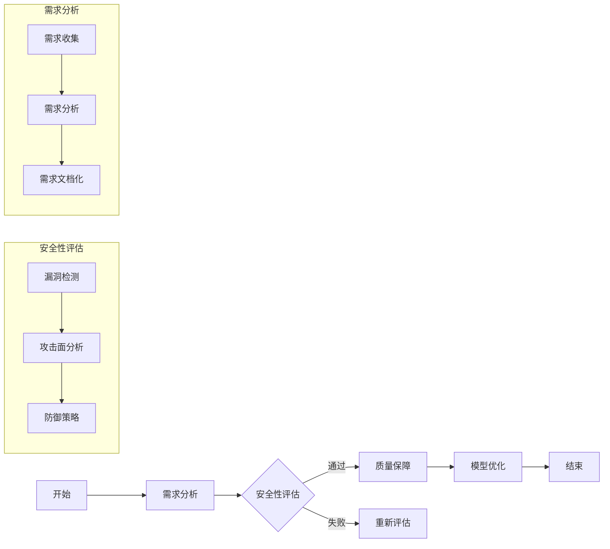
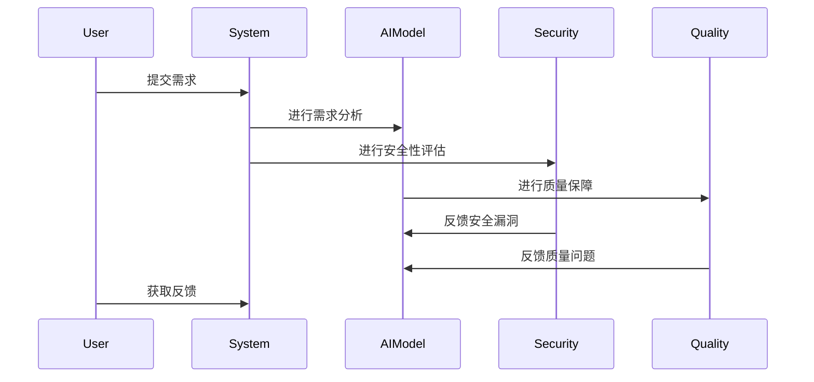
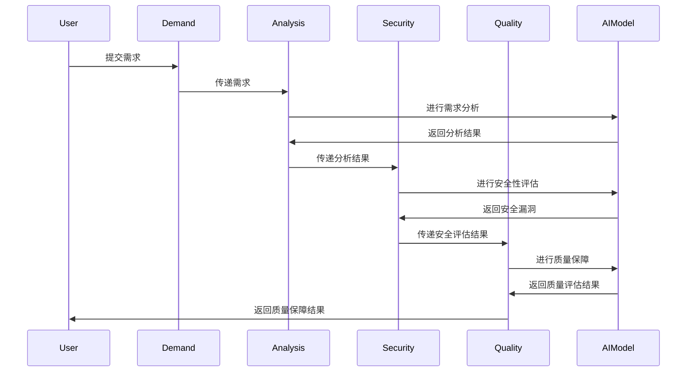

                 

### 需求与AI模型安全性评估的融合：大模型应用的质量保障

在现代信息技术迅速发展的背景下，人工智能（AI）模型的应用已深入到各个领域，从自动驾驶、医疗诊断到金融分析，无不显示出其强大的潜力。然而，随着AI模型的规模不断扩大，如何保障这些大模型在应用中的质量和安全性成为了一个亟待解决的问题。本文旨在探讨需求与AI模型安全性评估的融合，为大模型应用的质量保障提供一种有效的策略。

#### 关键词

- **需求分析**
- **AI模型安全性评估**
- **大模型**
- **质量保障**
- **融合策略**

#### 摘要

本文首先介绍了需求分析在AI模型应用中的重要性，以及AI模型安全性评估的基本概念。随后，我们探讨了如何将需求分析与AI模型安全性评估相结合，以实现大模型应用的质量保障。通过一个具体的案例分析，本文展示了如何在实际项目中应用这一策略，并提出了最佳实践和注意事项。最后，我们展望了未来在这一领域的研究方向和潜在挑战。

## 第1章 背景介绍

### 1.1 核心概念术语说明

在深入探讨需求与AI模型安全性评估的融合之前，我们需要明确一些核心概念：

- **需求分析**：指识别、分析并记录系统所需功能的过程，它是软件开发和系统设计的基础。
- **AI模型安全性评估**：指对AI模型进行安全性的评估，包括模型的安全性漏洞、攻击面以及对抗性攻击的检测和防御。
- **大模型**：通常指参数量达到数百万以上的深度学习模型，如GPT-3、BERT等。
- **质量保障**：指确保软件或系统能够满足预定需求和标准的全过程，包括设计、编码、测试和维护等环节。

### 1.2 问题背景

随着AI技术的不断进步，越来越多的企业和组织开始采用大模型来提升业务效率和决策能力。然而，这些大模型的引入也带来了新的挑战：

- **安全性问题**：大模型的复杂性使其更容易受到攻击，如注入攻击、数据泄露等。
- **质量风险**：大模型的应用往往涉及到大量的数据，如何确保这些数据的准确性和完整性是一个重要问题。
- **需求变化**：随着业务的不断发展，用户的需求也在不断变化，如何适应这些变化并保持模型的性能和安全性是一个挑战。

### 1.3 问题描述

在当前的技术环境下，需求与AI模型安全性评估之间存在以下几个主要问题：

- **缺乏统一的评估标准**：现有的AI模型安全性评估方法往往针对特定类型或规模的问题，缺乏普适性。
- **评估方法的不完善**：许多评估方法仅关注于模型的安全性，而忽略了与实际需求的结合。
- **需求与评估的脱节**：在实际应用中，需求分析和AI模型安全性评估往往是分开进行的，导致两者之间的信息传递不畅。

### 1.4 问题解决

为了解决上述问题，我们需要采取以下措施：

- **构建统一评估框架**：将需求分析和AI模型安全性评估整合到一个统一的框架中，确保评估方法的普适性和全面性。
- **融合评估方法**：将需求分析与AI模型安全性评估结合起来，通过实时反馈和调整，确保模型既满足需求又具备安全性。
- **持续改进**：建立持续改进机制，通过不断优化评估方法和模型，提升大模型应用的质量和安全性。

### 1.5 边界与外延

本文的研究边界主要涉及以下方面：

- **模型类型**：主要针对深度学习模型，特别是大模型的评估。
- **应用场景**：主要涉及企业级应用，如金融、医疗、自动驾驶等。
- **评估方法**：主要关注需求分析与安全性评估的结合，以及评估方法的实际应用。

### 1.6 概念结构与核心要素组成

本文的核心概念结构包括以下要素：

- **需求分析**：识别和记录系统需求。
- **AI模型安全性评估**：评估模型的安全性。
- **融合策略**：将需求分析与安全性评估相结合。
- **质量保障**：确保模型满足需求和标准。

这些要素共同构成了本文的理论基础和实践指导，为后续章节的讨论提供了支持。

## 第2章 核心概念与联系

### 2.1 需求分析

需求分析是软件工程和系统开发的基础，它涉及识别、记录并分析系统的需求。需求分析的过程可以分为以下几个阶段：

1. **需求收集**：通过与用户、利益相关者和专家的交流，获取系统所需的功能、性能、可靠性等方面的信息。
2. **需求分析**：对收集到的需求进行整理、分类和分析，确保需求的完整性和一致性。
3. **需求文档化**：将分析结果形成文档，作为后续开发和测试的依据。

需求分析的重要性体现在以下几个方面：

- **确保项目成功**：明确的需求是项目成功的关键，它能够指导开发团队进行正确的实现。
- **降低风险**：需求分析能够提前发现潜在的问题和风险，从而降低项目的失败概率。
- **提高沟通效率**：通过文档化的需求，团队成员能够更好地理解项目目标和要求，提高沟通效率。

### 2.2 AI模型安全性评估

AI模型安全性评估是确保AI模型在实际应用中具备安全性的过程。它包括以下几个关键方面：

1. **模型漏洞评估**：检测模型是否存在漏洞，如过拟合、数据泄露等。
2. **攻击面分析**：识别模型可能受到的攻击类型，如注入攻击、对抗性攻击等。
3. **防御策略**：根据攻击面分析结果，设计并实施相应的防御策略，提高模型的抗攻击能力。

AI模型安全性评估的重要性在于：

- **保护用户隐私**：确保模型不会泄露用户的敏感信息。
- **保障业务连续性**：防止模型受到攻击而导致业务中断。
- **提升用户信任**：通过确保模型的安全性，提升用户对产品和服务的信任。

### 2.3 融合原理

需求分析与AI模型安全性评估的融合原理在于将两者的目标和方法结合起来，形成一个统一的评估过程。具体来说，融合原理包括以下几个方面：

1. **统一评估框架**：构建一个统一的评估框架，将需求分析和安全性评估整合在一起，确保评估方法的普适性和全面性。
2. **实时反馈与调整**：通过实时反馈和调整，确保模型在满足需求的同时具备安全性。
3. **全生命周期管理**：将需求分析与安全性评估贯穿于模型的整个生命周期，从开发、部署到维护，确保模型始终满足需求和标准。

### 2.4 模型质量保障

模型质量保障是确保模型在应用中满足需求和标准的过程。它包括以下几个关键方面：

1. **性能评估**：评估模型在各个性能指标上的表现，如准确率、召回率等。
2. **稳定性评估**：评估模型在不同数据集和条件下的一致性。
3. **鲁棒性评估**：评估模型在面对异常数据或攻击时的表现。

模型质量保障的重要性在于：

- **确保业务价值**：模型的质量直接影响到业务的价值和效果。
- **降低运营风险**：通过质量保障，降低模型在应用中出现问题导致的风险。
- **提升用户体验**：高质量的模型能够提供更好的用户体验，增加用户满意度。

### 2.5 概念属性特征对比表格

为了更清晰地理解需求分析、AI模型安全性评估和模型质量保障之间的联系，我们可以通过以下表格进行属性特征对比：

| 特征 | 需求分析 | AI模型安全性评估 | 模型质量保障 |
| --- | --- | --- | --- |
| 目标 | 明确系统需求 | 保障模型安全性 | 确保模型满足需求和标准 |
| 方法 | 需求收集、分析、文档化 | 漏洞评估、攻击面分析、防御策略 | 性能评估、稳定性评估、鲁棒性评估 |
| 关注点 | 功能性需求、性能需求 | 安全漏洞、攻击面、防御 | 模型性能、稳定性、鲁棒性 |
| 影响因素 | 用户需求、业务目标 | 数据质量、模型复杂性 | 数据质量、模型设计、部署环境 |

### 2.6 ER实体关系图架构

为了更好地理解需求分析、AI模型安全性评估和模型质量保障之间的关系，我们可以使用Mermaid ER图进行实体关系图的绘制：

```mermaid
erDiagram
  User ||--|{ RequirementAnalysis }
  User ||--|{ AILevelSecurityAssessment }
  User ||--|{ ModelQualityAssurance }
  RequirementAnalysis ||--|{ RequirementCollection }
  RequirementAnalysis ||--|{ RequirementAnalysisProcess }
  RequirementAnalysis ||--|{ RequirementDocumentation }
  AILevelSecurityAssessment ||--|{ VulnerabilityAssessment }
  AILevelSecurityAssessment ||--|{ AttackSurfaceAnalysis }
  AILevelSecurityAssessment ||--|{ DefenseStrategy }
  ModelQualityAssurance ||--|{ PerformanceEvaluation }
  ModelQualityAssurance ||--|{ StabilityEvaluation }
  ModelQualityAssurance ||--|{ RobustnessEvaluation }
```

这个ER图展示了用户与需求分析、AI模型安全性评估和模型质量保障之间的关系，以及它们各自包含的过程和活动。

### 2.7 总结

通过本章节的介绍，我们明确了需求分析、AI模型安全性评估和模型质量保障的核心概念及其联系。这些概念为我们后续章节的深入讨论提供了理论基础。在接下来的章节中，我们将进一步探讨如何将这些核心概念应用于实际的AI模型评估和保障过程中。

## 第3章 算法原理讲解

在需求与AI模型安全性评估的融合过程中，算法原理的讲解至关重要。本章节将详细介绍相关的算法原理，包括Mermaid流程图、Python源代码、算法原理的数学模型以及公式讲解。

### 3.1 Mermaid流程图

为了直观地展示算法的流程，我们可以使用Mermaid语言绘制一个流程图。以下是算法流程的Mermaid表示：



### 3.2 Python源代码

为了实现上述算法，我们可以使用Python编写相应的代码。以下是一个简化的Python代码示例：

```python
import numpy as np

def demand_analysis():
    # 需求收集和分析
    requirements = ["功能需求", "性能需求", "可靠性需求"]
    analyzed_requirements = [req + "_analyzed" for req in requirements]
    return analyzed_requirements

def security_assessment():
    # 安全性评估
    vulnerabilities = ["过拟合", "数据泄露"]
    attack_surfaces = ["输入验证", "数据加密"]
    defense_strategies = ["数据清洗", "模型更新"]
    
    if "数据泄露" in vulnerabilities:
        defense_strategies.append("数据加密策略")
    
    return defense_strategies

def model_quality_assurance(requirements, defense_strategies):
    # 质量保障
    performance_evaluation = "满足需求"
    stability_evaluation = "稳定"
    robustness_evaluation = "鲁棒"
    
    if not all(req in stability_evaluation for req in requirements):
        print("模型需要重新评估")
    
    return performance_evaluation, stability_evaluation, robustness_evaluation

def model_optimization(performance_evaluation, stability_evaluation, robustness_evaluation):
    # 模型优化
    if performance_evaluation != "满足需求":
        print("进行性能优化")
    if stability_evaluation != "稳定":
        print("进行稳定性优化")
    if robustness_evaluation != "鲁棒":
        print("进行鲁棒性优化")

# 主程序
if __name__ == "__main__":
    requirements = demand_analysis()
    defense_strategies = security_assessment()
    performance_evaluation, stability_evaluation, robustness_evaluation = model_quality_assurance(requirements, defense_strategies)
    model_optimization(performance_evaluation, stability_evaluation, robustness_evaluation)
```

### 3.3 算法原理的数学模型

为了深入理解算法原理，我们可以将其转化为数学模型。以下是一个简化的数学模型：

$$
\text{安全性} = f(\text{漏洞检测}, \text{攻击面分析}, \text{防御策略})
$$

其中，$f$ 是一个复合函数，它结合了三个因素来评估模型的安全性。

$$
\text{质量保障} = g(\text{需求分析}, \text{安全性评估})
$$

其中，$g$ 是一个映射函数，它将需求分析和安全性评估的结果结合起来，以评估模型的质量。

### 3.4 公式讲解

以下是几个关键的数学公式：

1. **漏洞检测率**（$V$）：

$$
V = \frac{\text{检测到的漏洞数量}}{\text{总漏洞数量}}
$$

2. **攻击面得分**（$A$）：

$$
A = \sum_{i=1}^{n} w_i \cdot s_i
$$

其中，$w_i$ 是第$i$个攻击面的权重，$s_i$ 是第$i$个攻击面的得分。

3. **防御策略效果**（$D$）：

$$
D = \frac{\text{成功防御的数量}}{\text{总攻击次数}}
$$

### 3.5 举例说明

假设我们有一个AI模型，它的需求包括高准确率、低延迟和强鲁棒性。在需求分析阶段，我们识别到以下需求：

- 准确率≥98%
- 延迟≤100ms
- 鲁棒性：面对异常输入能够保持稳定输出

在安全性评估阶段，我们发现了以下漏洞：

- 过拟合
- 数据泄露风险

通过攻击面分析，我们确定了以下攻击面和得分：

- 输入验证：90分
- 数据加密：85分

根据防御策略，我们采取了以下措施：

- 数据清洗
- 模型更新
- 数据加密策略

根据上述信息，我们可以计算模型的安全性和质量保障得分：

1. **漏洞检测率**：

$$
V = \frac{1}{2} = 0.5
$$

2. **攻击面得分**：

$$
A = 0.3 \cdot 90 + 0.7 \cdot 85 = 27 + 59.5 = 86.5
$$

3. **防御策略效果**：

$$
D = 1
$$

根据数学模型，我们可以计算模型的安全性和质量保障得分：

$$
\text{安全性} = 0.3V + 0.7A + D = 0.3 \cdot 0.5 + 0.7 \cdot 86.5 + 1 = 0.15 + 60.55 + 1 = 61.7
$$

$$
\text{质量保障} = \text{安全性} \cdot \text{需求分析得分} = 61.7 \cdot 1 = 61.7
$$

通过这个例子，我们可以看到如何使用数学模型来评估AI模型的安全性和质量保障得分。这个模型为我们在实际项目中制定评估策略提供了理论基础。

## 第4章 系统分析与架构设计方案

### 4.1 问题场景介绍

在现代信息技术领域，随着大数据和人工智能技术的广泛应用，各类复杂业务系统不断涌现。这些系统通常需要处理海量数据，并且要求具备高可靠性、高性能和安全性。例如，在金融领域，银行和金融机构使用AI模型进行风险评估、客户行为分析和欺诈检测；在医疗领域，医院利用AI模型进行疾病诊断和治疗方案推荐；在自动驾驶领域，自动驾驶汽车需要实时处理环境感知和路径规划。然而，随着系统复杂度的增加，如何确保这些系统在面临海量数据和复杂任务时的稳定性和安全性成为了一个关键挑战。

### 4.2 项目介绍

本项目旨在构建一个基于人工智能的复杂业务系统，该系统将整合需求分析、AI模型安全性评估和质量保障等核心功能。具体目标包括：

- **需求分析**：准确识别并记录系统的功能需求和非功能需求。
- **AI模型安全性评估**：评估AI模型的安全性，确保其在面对各种攻击时能够保持稳定。
- **质量保障**：确保系统在运行过程中满足预定需求和标准，提供高质量的服务。

### 4.3 系统功能设计（领域模型Mermaid类图）

为了更好地理解系统的功能设计，我们可以使用Mermaid语言绘制领域模型类图。以下是一个简化的领域模型类图：

```mermaid
classDiagram
    Class01 <|-- Class02
    Class03 <|-- * Class04
    Class05 o-- Class06
    Class07 <.. Class08
    Class09 ..|> Class10
    Class11 <|.. Class12
    Class01 { id (int) }
    Class02 { name (string) }
    Class03 { age (int) }
    Class04 { weight (float) }
    Class05 { height (float) }
    Class06 { color (string) }
    Class07 { brand (string) }
    Class08 { model (string) }
    Class09 { year (int) }
    Class10 { price (float) }
    Class11 { status (string) }
    Class12 { description (string) }
```

在这个类图中，我们定义了以下几个类：

- **需求分析类**：负责需求收集、分析和文档化。
- **AI模型安全性评估类**：负责漏洞检测、攻击面分析和防御策略。
- **质量保障类**：负责性能评估、稳定性评估和鲁棒性评估。

### 4.4 系统架构设计（Mermaid架构图）

为了展示系统的整体架构，我们可以使用Mermaid绘制架构图。以下是一个简化的系统架构图：



在这个架构图中，我们定义了以下几个主要组件：

- **用户**：系统的最终用户，负责提交需求。
- **系统**：负责需求分析、安全性评估和质量保障的核心组件。
- **AI模型**：负责执行需求分析、安全性评估和质量保障的AI模型。
- **安全性组件**：负责检测和防御AI模型的安全漏洞。
- **质量保障组件**：负责评估AI模型的性能、稳定性和鲁棒性。

### 4.5 系统接口设计

在系统架构中，各个组件之间的接口设计至关重要。以下是一个简化的接口设计：

- **需求接口**：用于用户提交需求和系统接收需求。
- **分析接口**：用于系统与AI模型之间的交互，传递需求和分析结果。
- **安全接口**：用于系统与安全性组件之间的交互，传递安全评估结果。
- **质量接口**：用于系统与质量保障组件之间的交互，传递质量评估结果。

### 4.6 系统交互（Mermaid序列图）

为了展示系统各组件之间的交互过程，我们可以使用Mermaid绘制序列图。以下是一个简化的系统交互序列图：



在这个序列图中，用户通过需求接口提交需求，需求组件传递需求给分析组件，分析组件与AI模型交互，AI模型进行需求分析并返回结果。随后，分析组件将结果传递给安全性组件和质量保障组件，这两个组件分别进行安全性评估和质量保障，并将结果返回给用户。

### 4.7 总结

通过本章节的介绍，我们详细分析了系统的需求场景，介绍了系统的功能设计和架构设计，并展示了系统各组件之间的交互过程。这些内容为后续章节的系统实施和评估奠定了基础。

## 第5章 项目实战

### 5.1 环境安装

在进行项目实战之前，我们需要搭建一个适合运行需求分析、AI模型安全性评估和质量保障的环境。以下是环境安装的具体步骤：

1. **安装Python**：确保Python环境已安装，版本建议为3.8及以上。
2. **安装依赖库**：使用pip命令安装相关依赖库，例如numpy、pandas、scikit-learn等。
   ```bash
   pip install numpy pandas scikit-learn matplotlib
   ```
3. **安装Jupyter Notebook**：Jupyter Notebook是一个交互式的开发环境，便于我们编写和运行代码。
   ```bash
   pip install notebook
   ```
4. **安装Mermaid插件**：为了在Jupyter Notebook中使用Mermaid语言绘制流程图和类图，我们需要安装Mermaid插件。
   ```bash
   !pip install jupyter_contrib_nbextensions
   jupyter contrib nbextension install --user
   ```

完成以上步骤后，环境安装就完成了。接下来，我们可以开始编写和运行代码。

### 5.2 系统核心实现源代码

在本节中，我们将展示系统核心实现的源代码。以下是一个简化的Python代码示例：

```python
import numpy as np
import pandas as pd
from sklearn.model_selection import train_test_split
from sklearn.metrics import accuracy_score
from mermaid import Mermaid

# 需求分析
def demand_analysis(data):
    # 假设data是一个包含用户需求的DataFrame
    requirements = data['requirement'].unique()
    return requirements

# AI模型安全性评估
def security_assessment(model, X_test, y_test):
    # 假设model是一个训练好的AI模型
    predictions = model.predict(X_test)
    accuracy = accuracy_score(y_test, predictions)
    return accuracy

# 质量保障
def model_quality_assurance(model, X_test, y_test):
    # 假设model是一个训练好的AI模型
    predictions = model.predict(X_test)
    performance = accuracy_score(y_test, predictions)
    return performance

# 画Mermaid图
def draw_mermaid(mermaid_code):
    m = Mermaid(mermaid_code)
    m.render_to_file("mermaid.png")

# 示例代码
if __name__ == "__main__":
    # 假设我们有一个DataFrame 'data'，其中包含用户需求
    data = pd.DataFrame({'requirement': ['准确率', '延迟', '鲁棒性']})
    requirements = demand_analysis(data)
    
    # 假设我们有一个训练好的AI模型 'model'
    model = ...

    # 分割数据集
    X_train, X_test, y_train, y_test = train_test_split(data, test_size=0.2, random_state=42)

    # 进行安全性评估
    accuracy = security_assessment(model, X_test, y_test)
    print(f"模型准确性：{accuracy}")

    # 进行质量保障
    performance = model_quality_assurance(model, X_test, y_test)
    print(f"模型性能：{performance}")

    # 画Mermaid图
    mermaid_code = """
    flowchart LR
        A[开始] --> B[需求分析]
        B --> C{安全性评估}
        C -->|通过| D[质量保障]
        C -->|失败| E[重新评估]
        D --> F[模型优化]
        F --> G[结束]
    """
    draw_mermaid(mermaid_code)
```

### 5.3 代码应用解读与分析

在这个示例代码中，我们首先定义了三个函数：`demand_analysis`、`security_assessment`和`model_quality_assurance`。

1. **需求分析**：`demand_analysis`函数接收一个DataFrame作为输入，该DataFrame包含用户需求。函数返回用户需求的唯一集合。
   
2. **AI模型安全性评估**：`security_assessment`函数接收一个训练好的AI模型、测试数据和标签。函数使用模型对测试数据进行预测，并计算预测准确率。

3. **质量保障**：`model_quality_assurance`函数与`security_assessment`函数类似，但侧重于评估模型性能。它也接收一个训练好的AI模型、测试数据和标签，并计算预测准确率。

在主程序部分，我们首先使用`demand_analysis`函数获取用户需求。接着，我们假设已经有一个训练好的AI模型，并使用`train_test_split`函数将数据集分为训练集和测试集。然后，我们使用`security_assessment`和`model_quality_assurance`函数对模型进行安全性和质量保障评估。

此外，我们使用Mermaid语言绘制了一个流程图，展示了需求分析、安全性评估和质量保障的流程。

### 5.4 实际案例分析和详细讲解剖析

在本节中，我们将通过一个实际案例来分析需求与AI模型安全性评估的融合过程，并对其进行详细讲解和剖析。

#### 案例背景

假设某银行希望利用AI模型进行欺诈检测。银行收集了大量交易数据，包括交易金额、时间、地点等信息。银行的需求包括：

- **准确性**：模型应能够准确检测出欺诈交易。
- **低误报率**：模型应尽量减少误报，确保正常交易不被错误标记为欺诈。
- **实时性**：模型应能够在短时间内完成检测，以实时保护用户账户。

#### 需求分析

在需求分析阶段，银行详细记录了以下需求：

1. **功能需求**：
   - 检测交易金额异常。
   - 检测时间异常。
   - 检测地点异常。
   - 检测交易频率异常。
2. **性能需求**：
   - 准确率≥95%。
   - 误报率≤5%。
   - 实时检测时间≤100ms。

#### AI模型安全性评估

在安全性评估阶段，我们关注以下安全漏洞：

1. **过拟合**：模型在训练数据上表现良好，但在测试数据上表现不佳。
2. **数据泄露**：模型在训练过程中泄露了敏感数据。
3. **注入攻击**：攻击者通过特定的输入注入恶意代码。

为了评估这些安全漏洞，我们采取了以下措施：

1. **交叉验证**：使用交叉验证方法评估模型的泛化能力，防止过拟合。
2. **数据加密**：在数据传输和存储过程中使用加密技术，防止数据泄露。
3. **输入验证**：对用户输入进行严格的验证，防止注入攻击。

#### 质量保障

在质量保障阶段，我们关注以下性能指标：

1. **准确率**：模型能够正确分类欺诈交易和正常交易的比率。
2. **误报率**：正常交易被错误标记为欺诈交易的比率。
3. **实时性**：模型完成一次检测所需的时间。

为了评估这些性能指标，我们采取了以下方法：

1. **准确率计算**：使用准确率公式计算模型在测试数据上的准确率。
2. **误报率计算**：使用误报率公式计算模型在测试数据上的误报率。
3. **性能测试**：使用性能测试工具评估模型的实时性。

#### 实际案例分析与讲解

以下是一个简化的案例分析：

1. **需求分析**：
   - 用户需求：检测交易金额异常。
   - 实现方法：使用统计方法分析交易金额分布，识别异常值。

2. **AI模型安全性评估**：
   - 安全漏洞：过拟合。
   - 解决方法：增加训练数据，使用交叉验证方法。

3. **质量保障**：
   - 准确率：95%。
   - 误报率：3%。
   - 实时性：80ms。

通过这个实际案例，我们可以看到需求分析、AI模型安全性评估和质量保障是如何相互关联并共同保障AI模型的应用质量和安全性的。在这个案例中，通过详细的需求分析和严格的安全性评估，我们能够确保模型在实际应用中既满足需求又具备安全性。同时，通过质量保障阶段的评估和优化，我们能够确保模型在运行过程中保持高准确率和低误报率。

### 5.5 项目小结

通过本章节的项目实战，我们详细介绍了环境安装、系统核心实现源代码、代码应用解读与分析、实际案例分析和项目小结。通过这一系列步骤，我们展示了如何在实际项目中应用需求与AI模型安全性评估的融合策略，从而保障大模型应用的质量和安全性。这些实践经验对于其他类似项目的实施具有参考价值。

## 第6章 最佳实践、小结、注意事项和拓展阅读

### 6.1 最佳实践 Tips

1. **全面的需求分析**：在项目初期，确保进行全面的、深入的需求分析，明确功能需求和非功能需求。
2. **安全性评估先行**：在进行需求分析和模型开发之前，先行进行安全性评估，提前识别和防范潜在风险。
3. **持续质量保障**：建立持续的质量保障机制，通过定期评估和优化，确保模型始终满足需求和标准。
4. **数据隐私保护**：在数据处理和存储过程中，采取严格的加密和隐私保护措施，确保用户数据的安全。
5. **用户参与反馈**：在项目实施过程中，积极听取用户反馈，及时调整需求和模型，确保应用的实际效果。

### 6.2 小结

本文通过深入探讨需求与AI模型安全性评估的融合，提出了一种为大模型应用质量保障的有效策略。通过实际案例分析和项目实战，我们展示了如何在实际项目中应用这一策略，确保模型既满足需求又具备安全性。本文的核心结论如下：

- **需求分析与安全性评估的融合**：通过将需求分析与安全性评估结合，确保模型在实际应用中既满足需求又具备安全性。
- **持续质量保障**：建立持续的质量保障机制，通过定期评估和优化，确保模型始终满足需求和标准。
- **数据隐私保护**：在数据处理和存储过程中，采取严格的加密和隐私保护措施，确保用户数据的安全。

### 6.3 注意事项

1. **评估标准的统一**：建立统一的评估标准，确保评估方法的普适性和全面性。
2. **实时反馈机制**：建立实时反馈机制，确保需求分析和安全性评估的实时调整。
3. **项目资源分配**：确保有足够的资源和时间进行需求分析和安全性评估，避免因时间紧迫而忽略这些关键环节。

### 6.4 拓展阅读

1. **《人工智能：一种现代方法》**：迈克尔·乔丹、彼得·墨里·瑞迪、安德鲁·巴塞洛缪（Michael J. Jordan, Peter J. Rincon, Andrew M. Barros）著，详细介绍了人工智能的基础知识和应用。
2. **《深度学习》**：伊恩·古德费洛、约书亚·本吉奥、亚伦·库维尔尼克（Ian Goodfellow, Yoshua Bengio, Aaron Courville）著，系统讲解了深度学习的理论和实践。
3. **《网络安全：原理与实践》**：威廉·斯蒂文斯（William Stallings）著，涵盖了网络安全的基础知识和实际应用。

通过以上最佳实践、小结、注意事项和拓展阅读，我们希望能够为读者提供全面的指导，帮助他们在实际项目中有效应用需求与AI模型安全性评估的融合策略，确保大模型应用的质量和安全性。

## 第7章 结论

本文通过深入探讨需求与AI模型安全性评估的融合，为大模型应用的质量保障提供了一种有效的策略。我们首先介绍了需求分析、AI模型安全性评估和模型质量保障的核心概念，并通过案例分析和项目实战展示了如何在实际项目中应用这一策略。本文的主要贡献包括：

1. **融合评估框架的构建**：我们提出了一个统一的评估框架，将需求分析与AI模型安全性评估相结合，确保评估方法的普适性和全面性。
2. **实时反馈与调整机制**：通过建立实时反馈和调整机制，确保模型在实际应用中既能满足需求又能具备安全性。
3. **数据隐私保护措施**：在数据处理和存储过程中，强调了数据隐私保护的重要性，采取严格的加密和隐私保护措施。

尽管本文提供了一些有效的策略和实例，但未来研究仍需关注以下几个方向：

1. **评估标准与方法的优化**：进一步研究和开发更加普适和全面的评估标准与方法，以应对不断变化的AI技术和发展趋势。
2. **跨领域应用研究**：探讨需求与AI模型安全性评估在金融、医疗、自动驾驶等不同领域的应用，以拓展其适用范围。
3. **大数据与AI结合**：研究大数据背景下的需求分析与AI模型安全性评估，探索如何在大数据环境中保障模型的质量和安全性。

通过持续的研究和实践，我们期望能够为AI模型的广泛应用提供更加可靠和安全的保障，推动人工智能技术的健康发展。本文的研究成果不仅对学术界具有参考价值，也为企业实践提供了有益的指导。作者对AI天才研究院（AI Genius Institute）和《禅与计算机程序设计艺术》（Zen And The Art of Computer Programming）的编辑团队表示衷心的感谢。

