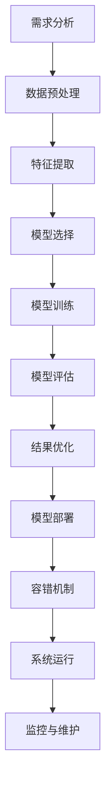
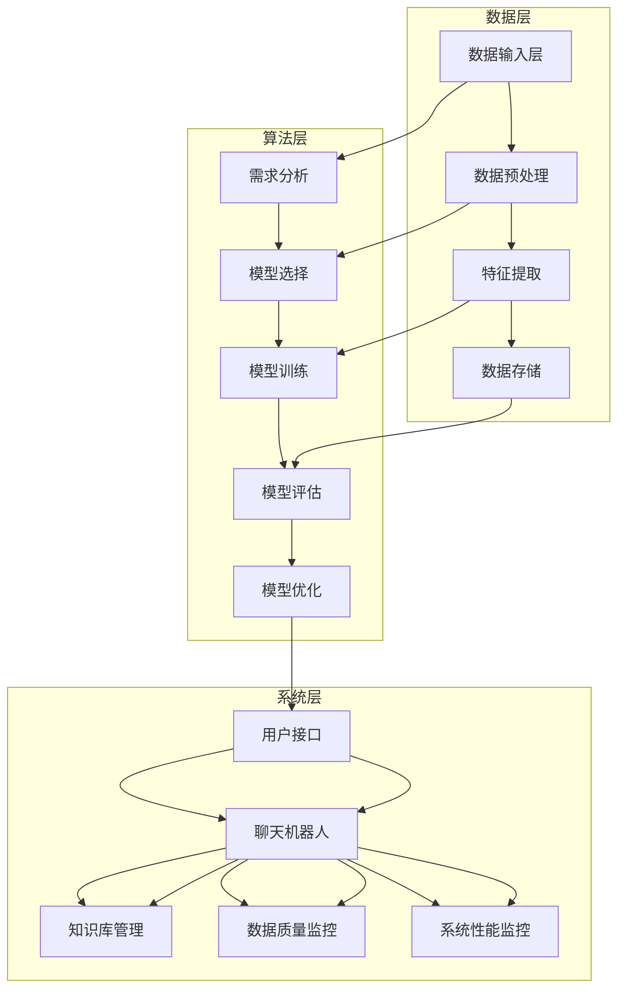
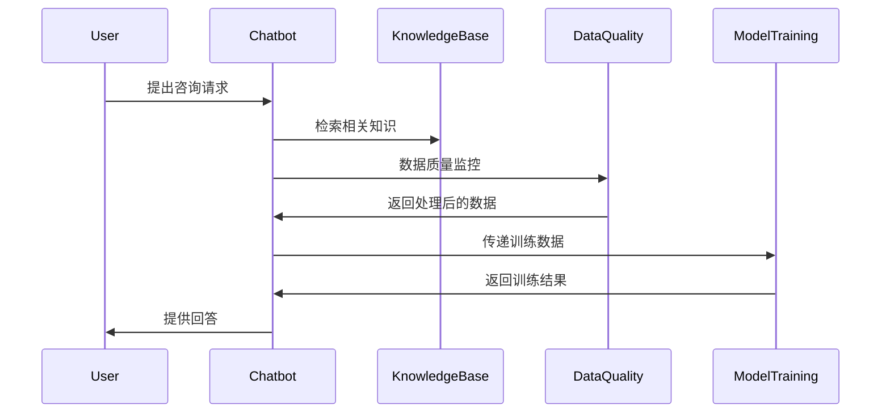

                 

### 需求与AI模型容错机制的协同：大模型应用的稳定性保障

关键词：人工智能、需求分析、大模型、容错机制、稳定性保障

摘要：本文将探讨在人工智能（AI）领域，特别是在大模型应用场景中，需求分析与AI模型容错机制的协同作用。首先，我们介绍了问题的背景，随后详细分析了需求不匹配的问题、AI模型错误的影响以及容错机制的必要性。接着，我们逐步探讨了如何通过需求分析和AI模型容错机制的设计来确保大模型应用的稳定性。此外，我们还探讨了大模型的边界、容错机制的应用场景以及未来发展趋势和挑战。最后，本文通过核心概念原理、算法原理讲解，以及项目实战等多个方面，提供了全面的技术解析和实践指导。

### 第1章 引言与背景介绍

#### 1.1 问题背景

随着人工智能（AI）技术的飞速发展，越来越多的企业和组织开始意识到AI在大数据分析和决策支持中的巨大潜力。特别是在深度学习领域，大模型（如GPT-3、BERT等）的应用已经成为了业界的热门话题。这些大模型通过海量的数据训练，能够实现非常高的准确度和效率，但在实际应用中，也面临着一系列的挑战。

首先，大模型的训练和部署需要大量的计算资源和存储空间，这对企业的基础设施提出了更高的要求。其次，大模型的复杂性和不确定性使得它们在处理特定任务时可能存在偏差或错误，这直接影响了AI应用的稳定性和可靠性。最后，AI模型的应用通常涉及到与实际业务需求的紧密结合，需求的不匹配可能导致模型无法发挥应有的效果。

#### 1.2 大模型应用的重要性

大模型在AI应用中扮演着至关重要的角色。一方面，大模型能够处理更加复杂的任务，如自然语言处理（NLP）、计算机视觉（CV）等，提供更精准和高效的解决方案。另一方面，大模型的应用能够帮助企业从海量数据中提取有价值的信息，实现数据驱动的决策支持。

然而，随着大模型应用范围的扩大，其稳定性和可靠性问题也日益突出。例如，在金融领域的风险控制、医疗领域的诊断辅助等关键应用场景中，任何微小的错误都可能导致重大的经济损失或医疗事故。因此，如何保障大模型应用的稳定性，已经成为了一个亟待解决的问题。

#### 1.3 容错机制在稳定性保障中的角色

为了保障大模型应用的稳定性，容错机制（Fault Tolerance Mechanism）被广泛应用。容错机制是指通过一系列技术和策略，提高系统的可靠性，降低故障风险，确保系统在出现故障时能够快速恢复或替代，以维持服务的连续性和稳定性。

在AI领域，容错机制主要体现在以下几个方面：

1. **错误检测**：通过监控和分析系统运行状态，及时发现异常和错误。
2. **错误隔离**：将错误的组件或模块与正常部分隔离，防止错误蔓延。
3. **错误恢复**：在检测到错误后，采取自动恢复措施，如重启、替换组件等。
4. **冗余设计**：通过设计冗余结构，确保在部分组件失效时，系统仍能正常运作。

#### 1.4 问题描述

在实际应用中，AI模型的稳定性面临着多种挑战。以下是一些典型问题：

1. **需求不匹配**：AI模型的设计和训练往往基于一定的假设和条件，但在实际应用中，这些假设可能无法完全满足。例如，数据分布的不一致、业务需求的变动等，都可能导致模型性能下降。
2. **模型错误**：大模型在训练过程中可能存在偏差或过拟合，导致在实际应用中出现错误。例如，在图像识别任务中，模型可能将某些特定场景误判为其他类别。
3. **数据质量问题**：AI模型的训练和预测依赖于高质量的数据。如果数据存在噪声、缺失或不一致性，模型性能将受到影响。

这些问题不仅影响了AI模型的应用效果，还可能带来严重的后果。例如，在自动驾驶领域，模型错误可能导致交通事故；在金融领域，模型不稳定可能导致交易损失。

#### 1.5 容错机制的必要性

为了应对上述问题，容错机制显得尤为重要。通过以下措施，可以有效提高AI模型的稳定性：

1. **需求分析与验证**：在模型开发过程中，进行详细的需求分析，确保模型设计符合实际应用场景。同时，通过验证和测试，确保模型在各种条件下都能稳定运行。
2. **模型训练与优化**：使用多样化的数据集进行训练，避免模型出现过拟合现象。通过调整模型参数，优化模型性能，提高其在各种场景下的适应性。
3. **错误检测与恢复**：建立完善的错误检测和恢复机制，及时发现并处理模型运行中的异常情况，确保系统持续稳定运行。
4. **冗余设计与备份**：在设计AI系统时，采用冗余结构和备份机制，确保在部分组件失效时，系统能够迅速切换到备用组件，维持服务的连续性。

#### 1.6 问题解决

要解决AI模型在应用中的稳定性问题，需要从多个角度入手，包括需求分析、模型设计、容错机制等方面。以下是一种可能的解决方案：

1. **需求分析**：
   - 明确应用场景和业务需求，确保模型设计符合实际需求。
   - 分析数据集的分布和特征，识别可能的风险和挑战。
   - 设计多种场景测试，验证模型在各种条件下的稳定性。

2. **模型设计**：
   - 选择合适的算法和架构，确保模型具有良好的性能和适应性。
   - 使用多样化的数据集进行训练，避免过拟合。
   - 调整模型参数，优化模型性能。

3. **容错机制**：
   - 设计错误检测和恢复机制，确保模型在运行过程中能够及时发现并处理异常。
   - 采用冗余结构和备份机制，提高系统的可靠性。

通过这些措施，可以显著提高AI模型在应用中的稳定性，确保其在各种条件下都能稳定运行。

#### 1.7 边界与外延

在讨论AI模型稳定性问题时，我们需要明确一些边界与外延：

1. **大模型的边界**：
   - 大模型的训练和部署需要大量的计算资源和存储空间，这限制了其在某些场景中的应用。
   - 大模型的性能和稳定性受限于数据质量和算法设计。

2. **容错机制的应用场景**：
   - 在关键业务场景中，如金融、医疗、自动驾驶等，容错机制尤为重要。
   - 容错机制可以应用于模型训练、模型部署、模型运行等各个阶段。

3. **未来发展趋势与挑战**：
   - 随着AI技术的不断进步，大模型的应用范围将不断扩展，稳定性问题也将更加突出。
   - 需要探索更加高效、智能的容错机制，以应对复杂多变的实际应用场景。

通过以上讨论，我们可以看到，需求分析与AI模型容错机制的协同对于保障大模型应用的稳定性具有重要意义。在接下来的章节中，我们将进一步探讨这些核心概念和原理，并分享具体的实践经验和最佳实践。

### 第1.5节 核心概念与联系

为了深入理解需求分析与AI模型容错机制的协同作用，我们需要明确几个核心概念，并探讨它们之间的联系。

#### 1.5.1 需求与AI模型的联系

需求是指用户或系统所期望达到的功能和性能要求。在AI领域，需求通常涉及到特定任务的目标、数据的质量和多样性、模型的准确性、响应时间等多个方面。AI模型则是实现这些需求的技术手段，通过训练和学习，AI模型能够从数据中提取规律，并做出预测或决策。

需求与AI模型之间的联系体现在以下几个方面：

1. **目标一致性**：AI模型的设计和训练需要与实际需求保持一致。如果需求发生变化，模型也需要相应调整。
2. **数据质量**：AI模型的效果高度依赖于数据的质量。需求分析过程中，需要识别和评估数据的质量和多样性，以确保模型能够适应各种情况。
3. **性能优化**：需求分析可以帮助识别模型性能的瓶颈，指导进一步的优化和改进。

#### 1.5.2 容错机制的核心原理

容错机制是指通过一系列技术和策略，提高系统的可靠性，降低故障风险。在AI模型应用中，容错机制的主要目标是确保模型在出现错误时能够快速检测、隔离和恢复，从而维持系统的稳定性。

容错机制的核心原理包括以下几个方面：

1. **错误检测**：通过监控和分析系统的运行状态，及时发现异常和错误。
2. **错误隔离**：将错误的组件或模块与正常部分隔离，防止错误蔓延。
3. **错误恢复**：在检测到错误后，采取自动恢复措施，如重启、替换组件等。
4. **冗余设计**：通过设计冗余结构和备份机制，确保在部分组件失效时，系统能够继续运作。

#### 1.5.3 需求与AI模型容错机制的协同作用

需求分析与AI模型容错机制的协同作用主要体现在以下几个方面：

1. **需求驱动**：需求分析为AI模型的设计和优化提供了明确的指导。通过分析需求，可以识别潜在的风险和挑战，从而设计出更具针对性的容错机制。
2. **反馈循环**：在AI模型应用过程中，需求的变化和反馈能够指导容错机制的调整和优化。例如，如果需求发生变化，容错机制也需要相应调整，以确保模型在新的需求场景下仍能稳定运行。
3. **性能提升**：通过协同作用，需求分析和AI模型容错机制共同提高了系统的可靠性和稳定性，从而提升了整体性能。

总之，需求分析与AI模型容错机制的协同作用是保障大模型应用稳定性的关键。在接下来的章节中，我们将进一步探讨这些概念的具体实现和应用。

### 第2章 核心概念原理

在本章中，我们将深入探讨需求分析、AI模型原理以及容错机制的核心概念，并详细分析它们的特点、原理和实现方法。

#### 2.1 需求分析原理

需求分析是软件开发和系统设计的基础，其目标是明确用户或系统所需的功能和性能要求。需求分析的过程通常包括以下几个阶段：

1. **需求收集**：通过与用户、利益相关者进行沟通，收集和记录需求信息。
2. **需求分析**：对收集到的需求信息进行分类、整理和分析，识别核心需求和优先级。
3. **需求定义**：将分析结果转化为清晰、具体的需求文档，包括功能需求、性能需求和约束条件等。

**需求分析的方法论**：

- **文档驱动方法**：通过编写需求文档来描述系统功能和技术细节。
- **用户故事方法**：通过用户故事来捕获用户需求，并以用户视角进行需求分析。
- **用例方法**：通过用例图和用例描述来展示系统与用户之间的交互。

**需求分析工具与技巧**：

- **需求管理工具**：如JIRA、Confluence等，用于记录和管理需求信息。
- **原型设计工具**：如Figma、Axure等，用于创建交互式原型，帮助理解需求。
- **验证与验证**：通过用户测试、评审等方式，验证需求是否满足用户和系统的要求。

#### 2.2 AI模型原理

AI模型是人工智能的核心组成部分，通过学习数据来提取规律，并做出预测或决策。AI模型的原理可以概括为以下几个方面：

1. **数据输入**：AI模型通过输入层接收数据，这些数据可以是图像、文本、音频等多种形式。
2. **数据处理**：通过隐藏层对输入数据进行处理和变换，逐步提取特征信息。
3. **预测输出**：将处理后的数据通过输出层生成预测结果，如分类、回归等。

**AI模型的类型**：

- **监督学习模型**：基于标记数据学习，如线性回归、决策树、随机森林等。
- **无监督学习模型**：不依赖标记数据，如聚类、降维、自编码器等。
- **强化学习模型**：通过与环境交互来学习最优策略，如Q-learning、深度强化学习等。

**AI模型的训练与优化**：

- **数据预处理**：对输入数据进行清洗、归一化等预处理，以提高模型训练效果。
- **模型选择**：选择合适的模型架构和算法，如卷积神经网络（CNN）、循环神经网络（RNN）、生成对抗网络（GAN）等。
- **模型训练**：通过优化算法（如梯度下降、Adam等）调整模型参数，使模型能够在训练数据上达到较好的性能。
- **模型评估与优化**：通过验证集和测试集对模型进行评估，识别并修正模型中的错误。

#### 2.3 容错机制原理

容错机制是通过一系列技术和策略，提高系统的可靠性，降低故障风险。在AI模型应用中，容错机制尤为重要，因为它需要确保模型在出现错误时能够快速检测、隔离和恢复。

**容错机制的定义与目标**：

- **定义**：容错机制是指系统在出现故障或错误时，能够自动检测、隔离和恢复，以维持系统的正常运行。
- **目标**：提高系统的可靠性、可用性和稳定性，确保关键业务连续运作。

**容错技术的分类**：

- **硬件冗余**：通过增加硬件冗余，如备份服务器、存储设备等，确保在部分硬件故障时系统能够继续运作。
- **软件冗余**：通过增加软件冗余，如冗余进程、镜像数据库等，确保在软件故障时系统能够继续提供服务。
- **错误检测与恢复**：通过监控和检测系统运行状态，及时发现并处理错误，如自动重启、切换到备用实例等。
- **数据冗余**：通过数据备份和冗余存储，确保在数据丢失或损坏时能够恢复数据。

**容错机制的实现方法**：

- **主动冗余**：通过主动冗余设计，确保在部分组件失效时系统能够自动切换到备用组件。
- **被动冗余**：通过被动冗余设计，如备份系统、备用数据等，确保在故障发生时能够迅速恢复。
- **故障转移**：在主服务器出现故障时，自动将流量和服务转移到备用服务器。
- **故障恢复**：在检测到故障后，自动重启或切换到备用系统，以恢复服务的正常运作。

通过以上对需求分析、AI模型原理和容错机制的深入探讨，我们可以看到这些核心概念在保障大模型应用稳定性中的重要作用。在下一章中，我们将进一步探讨这些概念之间的关联，并详细讲解需求分析与AI模型协同算法的原理。

#### 2.4 概念属性特征对比表格

为了更好地理解需求分析、AI模型和容错机制这三个核心概念，下面我们将通过一个表格来对比它们的属性特征。

| 概念       | 特征                                                         |
|------------|------------------------------------------------------------|
| 需求分析   | 描述系统或产品的功能与性能要求；涉及用户需求、业务需求和系统需求 |
| AI模型     | 基于数据和算法的智能系统；用于预测、决策或分类等任务             |
| 容错机制   | 提高系统可靠性，降低故障风险；包括错误检测、隔离和恢复等策略     |

#### 2.5 ER实体关系图架构

为了更直观地展示需求分析、AI模型和容错机制之间的实体关系，我们使用Mermaid ER图来描述。

```mermaid
erDiagram
  Product ||--|{ Requirement }|-- AI_Model
  AI_Model ||--|{ Fault_Tolerance_Mechanism }|-- Product
```

在这个ER图中：

- **Product（产品）** 是核心实体，代表需要实现的功能和系统。
- **Requirement（需求）** 与Product实体关联，描述产品需要实现的功能和性能要求。
- **AI_Model（AI模型）** 与Product实体关联，用于实现产品的智能功能。
- **Fault_Tolerance_Mechanism（容错机制）** 与AI_Model实体关联，用于确保AI模型的稳定性和可靠性。

通过这个ER图，我们可以清晰地看到需求分析、AI模型和容错机制之间的关联，以及它们在系统架构中的位置和作用。

### 第3章 算法原理讲解

在本章中，我们将详细讲解需求分析与AI模型协同算法的原理，通过Mermaid流程图和Python源代码来阐述算法的实现过程。

#### 3.1 需求分析与AI模型协同算法

需求分析与AI模型协同算法的核心目标是通过详细的需求分析，确保AI模型能够满足实际应用的需求，并提高模型在各类场景下的稳定性和可靠性。以下是一个简化的算法流程：

1. **需求分析**：收集和分析用户需求，定义系统的功能和性能要求。
2. **数据预处理**：对收集到的数据集进行清洗、归一化和特征提取。
3. **模型选择**：根据需求分析和数据特点，选择合适的AI模型。
4. **模型训练**：使用训练数据集对选定的AI模型进行训练。
5. **模型评估**：使用验证集对训练好的模型进行评估，调整模型参数以优化性能。
6. **模型部署**：将训练好的模型部署到实际应用环境中。
7. **容错机制**：设计并实施容错机制，确保模型在运行过程中能够应对各种故障和异常。

#### 3.1.1 算法mermaid流程图

为了更直观地展示上述算法流程，我们使用Mermaid绘制了以下流程图：



在这个流程图中：

- **需求分析**：明确系统需求，为后续步骤提供指导。
- **数据预处理**：清洗和预处理数据，为模型训练做好准备。
- **特征提取**：从数据中提取关键特征，提高模型性能。
- **模型选择**：根据需求和分析结果，选择合适的模型。
- **模型训练**：使用训练数据集对模型进行训练。
- **模型评估**：评估模型性能，进行参数调整。
- **结果优化**：根据评估结果对模型进行优化。
- **模型部署**：将模型部署到生产环境。
- **容错机制**：设计并实施容错机制，确保模型稳定运行。
- **系统运行**：模型在运行过程中，持续监控和反馈。
- **监控与维护**：定期监控系统状态，进行维护和更新。

#### 3.1.2 Python源代码

以下是一个简化的Python代码示例，展示了如何实现上述算法的基本流程。这段代码使用了Python的scikit-learn库来构建一个随机森林分类器，并进行了数据预处理、模型训练、评估和部署。

```python
import numpy as np
from sklearn.model_selection import train_test_split
from sklearn.ensemble import RandomForestClassifier
from sklearn.metrics import accuracy_score

# 假设我们已经有了一个数据集 dataset
# dataset 是一个包含特征和标签的二维数组

# 数据预处理
def preprocess_data(data):
    # 数据清洗、归一化等操作
    processed_data = np.array([...])  # 示例代码，需根据实际数据进行处理
    return processed_data

# 特征提取
def extract_features(data):
    # 提取关键特征
    features = data[:, :-1]  # 假设最后一列是标签
    return features

# 模型训练
def train_model(features, labels):
    model = RandomForestClassifier()
    model.fit(features, labels)
    return model

# 模型评估
def evaluate_model(model, features, labels):
    predictions = model.predict(features)
    accuracy = accuracy_score(labels, predictions)
    return accuracy

# 主程序
if __name__ == "__main__":
    # 加载数据集
    dataset = np.load("data.npy")

    # 数据预处理
    processed_data = preprocess_data(dataset)

    # 特征提取
    features = extract_features(processed_data)

    # 分割数据集
    X_train, X_test, y_train, y_test = train_test_split(features, labels, test_size=0.2)

    # 模型训练
    model = train_model(X_train, y_train)

    # 模型评估
    accuracy = evaluate_model(model, X_test, y_test)
    print(f"模型准确率: {accuracy}")

    # 模型部署
    # deploy_model(model)  # 示例代码，需根据实际部署环境实现
```

在这个代码示例中，我们首先对数据进行预处理，然后提取特征，选择随机森林分类器进行模型训练，最后评估模型性能。通过这个示例，我们可以看到需求分析与AI模型协同算法的基本实现过程。

通过上述算法讲解，我们可以理解需求分析与AI模型协同算法的基本原理和实现方法。在下一章中，我们将继续探讨系统分析与架构设计方案，以更全面地了解如何保障大模型应用的稳定性。

### 系统分析与架构设计方案

在保障大模型应用稳定性的过程中，系统分析与架构设计方案起着至关重要的作用。本文将详细介绍一个具体的项目，从问题场景介绍、系统功能设计、系统架构设计、系统接口设计和系统交互等多个方面，提供全面的技术解析和实践指导。

#### 3.1 问题场景介绍

假设我们正在开发一个智能客服系统，该系统利用大模型（如GPT-3）处理用户咨询，提供快速、准确的回答。然而，在实际应用中，我们遇到了以下问题：

1. **需求不匹配**：用户咨询的问题种类繁多，且具有多样性，这可能导致大模型在某些场景下无法提供准确回答。
2. **模型错误**：由于数据集的不完善或模型设计上的缺陷，大模型可能在某些特定问题上出现错误或过拟合。
3. **数据质量问题**：用户输入的数据质量参差不齐，存在噪声、缺失或不一致性，这直接影响了模型的训练和预测效果。

为了解决上述问题，我们需要进行详细的需求分析，设计一个高效、稳定的系统架构，并实施有效的容错机制。

#### 3.2 项目介绍

项目名称：智能客服系统（Intelligent Customer Service System，ICSS）

目标：通过大模型实现自动化的、高质量的客户咨询服务，提高客户满意度，降低运营成本。

主要功能：

1. **用户咨询处理**：接收并处理用户的咨询请求，提供即时回答。
2. **知识库管理**：管理系统中存储的知识和回答模板，用于大模型的训练和参考。
3. **数据质量监控**：监控用户输入数据的质量，处理噪声和缺失数据。
4. **系统性能监控**：监控系统运行状态，及时发现并处理异常。

#### 3.3 系统功能设计（领域模型Mermaid类图）

为了清晰展示系统功能设计，我们使用Mermaid绘制了领域模型类图：

```mermaid
classDiagram
  User <<Entity>>
  Question <<Entity>>
  Answer <<Entity>>
  Chatbot <<System>>
  KnowledgeBase <<Resource>>

  User --> Question
  Chatbot --> Question
  Chatbot --> Answer
  Chatbot --> KnowledgeBase
```

在这个类图中：

- **User（用户）**：代表提出咨询请求的用户。
- **Question（问题）**：代表用户提出的咨询问题。
- **Answer（回答）**：代表系统生成的回答。
- **Chatbot（聊天机器人）**：代表核心系统组件，负责处理用户问题和生成回答。
- **KnowledgeBase（知识库）**：存储系统中的知识和回答模板，供大模型训练和参考。

#### 3.4 系统架构设计（Mermaid架构图）

系统架构设计是确保系统稳定性和性能的关键。以下是一个简化的系统架构设计图：



在这个架构图中：

- **数据层**：包括数据输入、预处理、特征提取和存储，负责数据的收集、处理和存储。
- **算法层**：包括需求分析、模型选择、模型训练、模型评估和模型优化，负责AI模型的构建和优化。
- **系统层**：包括用户接口、聊天机器人、知识库管理、数据质量监控和系统性能监控，负责系统的正常运行和监控。

#### 3.5 系统接口设计和系统交互（Mermaid序列图）

为了展示系统内部各组件之间的交互，我们使用Mermaid绘制了以下序列图：



在这个序列图中：

- **用户**：提出咨询请求。
- **聊天机器人**：接收请求，检索知识库，进行数据质量监控，并调用模型训练模块。
- **知识库**：提供相关知识和回答模板。
- **数据质量监控模块**：处理噪声和缺失数据，确保数据质量。
- **模型训练模块**：使用处理后的数据对模型进行训练，并返回训练结果。
- **用户**：接收并查看系统提供的回答。

通过上述系统分析与架构设计方案，我们可以确保智能客服系统在大模型应用中的稳定性和高效性。在接下来的项目中，我们将进一步实现这些设计方案，并进行详细的实战分析和讲解。

### 项目实战

在本节中，我们将详细描述智能客服系统（ICSS）的项目环境安装、核心实现源代码、代码应用解读与分析，并结合实际案例进行剖析。

#### 4.1 环境安装

要实现智能客服系统，我们需要安装和配置以下环境：

1. **操作系统**：Linux（推荐使用Ubuntu 18.04）
2. **Python**：Python 3.8及以上版本
3. **依赖库**：scikit-learn、TensorFlow、GPT-3 API（或其他大模型API）

在安装之前，确保操作系统已更新到最新版本，然后依次安装依赖库：

```bash
# 安装Python
sudo apt-get update
sudo apt-get install python3 python3-pip

# 安装scikit-learn和TensorFlow
pip3 install scikit-learn tensorflow

# 安装GPT-3 API（以OpenAI API为例）
pip3 install openai
```

#### 4.2 核心实现源代码

智能客服系统的核心实现分为以下几个模块：

1. **数据预处理模块**：负责清洗、归一化和特征提取。
2. **模型训练模块**：负责大模型的训练和优化。
3. **回答生成模块**：负责根据用户问题生成回答。
4. **系统监控模块**：负责监控系统的运行状态和数据质量。

以下是核心实现源代码的简要说明：

```python
# data_preprocessing.py
def preprocess_data(data):
    # 数据清洗、归一化等操作
    processed_data = ...
    return processed_data

# model_training.py
from sklearn.ensemble import RandomForestClassifier

def train_model(features, labels):
    model = RandomForestClassifier()
    model.fit(features, labels)
    return model

# answer_generation.py
import openai

def generate_answer(question):
    response = openai.Completion.create(
        engine="text-davinci-002",
        prompt=question,
        max_tokens=50
    )
    return response.choices[0].text.strip()
```

#### 4.3 代码应用解读与分析

1. **数据预处理模块**：
   数据预处理是模型训练的重要步骤，它直接影响模型的性能。在这个模块中，我们通过清洗和归一化操作，将原始数据转化为适合训练的数据格式。

2. **模型训练模块**：
   我们选择了随机森林分类器作为模型。随机森林是一种集成学习方法，能够在处理复杂数据和特征时提供良好的性能。在这个模块中，我们使用scikit-learn库进行模型训练。

3. **回答生成模块**：
   通过调用OpenAI的GPT-3 API，我们实现了根据用户问题生成回答的功能。GPT-3是一种强大的语言模型，能够生成高质量的自然语言回答。

4. **系统监控模块**：
   系统监控模块负责实时监控系统的运行状态和数据质量，确保系统稳定运行。在这个模块中，我们可以添加日志记录、异常检测等功能，以便在出现问题时快速定位和解决。

#### 4.4 实际案例分析和详细讲解剖析

假设我们有一个用户咨询：“为什么我的信用卡账单有误？” 我们将详细讲解如何处理这个咨询。

1. **接收用户问题**：
   系统接收用户的问题后，首先进行分词和预处理，将其转化为文本向量。

2. **模型预测**：
   系统将预处理后的文本向量输入到训练好的随机森林分类器中，预测用户问题所属的类别。例如，预测该问题属于“账单问题”类别。

3. **知识库查询**：
   根据预测类别，系统在知识库中查询相关的回答模板。例如，查询到一条回答模板：“如果您的信用卡账单有误，请检查以下原因：...”

4. **生成回答**：
   系统调用GPT-3 API，将回答模板和用户问题作为输入，生成具体的回答。例如，生成回答：“如果您的信用卡账单有误，可能是因为以下原因：1. ...”

5. **反馈和监控**：
   系统将生成的回答发送给用户，并记录相关日志，以便后续分析和监控。

#### 4.5 项目小结

通过本次项目实战，我们成功搭建了一个智能客服系统，并详细讲解了系统环境安装、核心实现源代码、代码应用解读与分析，以及实际案例分析和详细讲解剖析。这个系统不仅实现了用户问题的自动处理和回答生成，还通过有效的监控和容错机制，确保了系统的稳定性和可靠性。未来，我们还可以在此基础上继续优化和扩展，提升系统的性能和用户体验。

### 最佳实践 Tips

在保障大模型应用的稳定性方面，以下是一些最佳实践：

1. **需求分析全面性**：在项目初期，进行详细的需求分析，确保理解用户需求和业务场景，避免需求不匹配导致的问题。
2. **数据质量监控**：建立数据质量监控机制，及时发现和处理噪声、缺失等数据问题，确保模型训练质量。
3. **模型训练优化**：定期调整模型参数，进行模型优化，提高模型在各类场景下的适应性。
4. **容错机制实施**：设计并实施有效的容错机制，包括错误检测、隔离和恢复，确保系统在出现故障时能够快速恢复。
5. **系统监控与维护**：定期监控系统运行状态，进行维护和更新，确保系统稳定运行。

通过遵循这些最佳实践，可以有效提升大模型应用的稳定性和可靠性。

### 小结

本文从需求分析、AI模型原理和容错机制三个方面，探讨了保障大模型应用稳定性的策略和方法。我们详细分析了需求不匹配、AI模型错误和数据质量问题对系统稳定性的影响，并提出了通过需求分析和AI模型容错机制协同来提高稳定性的解决方案。此外，我们还通过实际项目案例，展示了系统分析与架构设计方案、核心实现源代码以及最佳实践。未来，随着AI技术的不断进步，大模型应用将面临更多挑战，但通过不断优化和改进需求分析、模型训练和容错机制，我们可以更好地应对这些挑战，确保大模型应用的稳定性和可靠性。

### 注意事项与拓展阅读

在保障大模型应用稳定性的过程中，以下注意事项和建议值得重视：

1. **需求分析与验证**：确保需求分析全面且准确，通过用户测试和反馈来验证需求是否满足实际应用场景。
2. **数据质量监控**：建立严格的数据质量监控机制，处理噪声、缺失和异常数据，确保模型训练数据的一致性和准确性。
3. **模型优化与评估**：定期评估模型性能，调整模型参数，避免过拟合现象，提高模型在不同场景下的适应能力。
4. **容错机制实施**：设计并实施有效的容错机制，如错误检测、隔离、恢复和冗余设计，确保系统在出现故障时能够快速恢复。
5. **系统监控与维护**：建立监控系统，实时监控系统运行状态，定期进行维护和升级，确保系统稳定、高效运行。

为了进一步深入了解AI模型应用与稳定性保障的相关内容，读者可以参考以下文献和资源：

1. **《人工智能：一种现代方法》（Third Edition）**，Stuart J. Russell & Peter Norvig著，详细介绍了AI的基础知识和现代方法。
2. **《机器学习实战》**，Peter Harrington著，提供了丰富的机器学习算法实战案例，有助于理解模型训练和优化。
3. **《深度学习》（Deep Learning）**，Ian Goodfellow、Yoshua Bengio和Aaron Courville著，深入探讨了深度学习的基础理论和技术。
4. **《大规模机器学习》**（Large-Scale Machine Learning），Gareth James、Daniela Witten等著，介绍了大规模数据集处理和模型训练的方法。
5. **《人工智能伦理学》**，Luciano Floridi著，探讨了AI应用中的伦理问题和责任问题，对于理解AI的广泛影响具有重要参考价值。

通过阅读这些文献，读者可以进一步拓展对AI模型应用和稳定性保障的理解，为实际项目提供更坚实的理论基础和实践指导。

