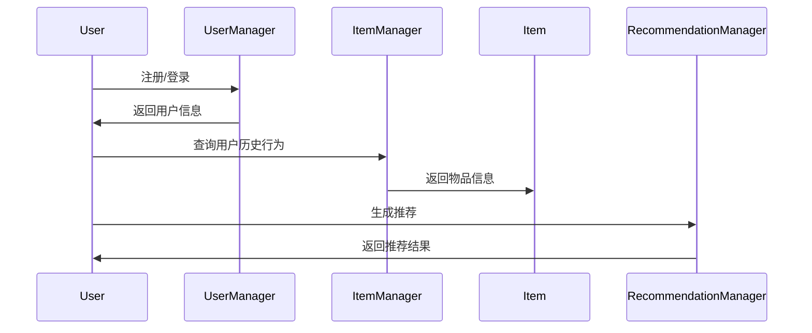
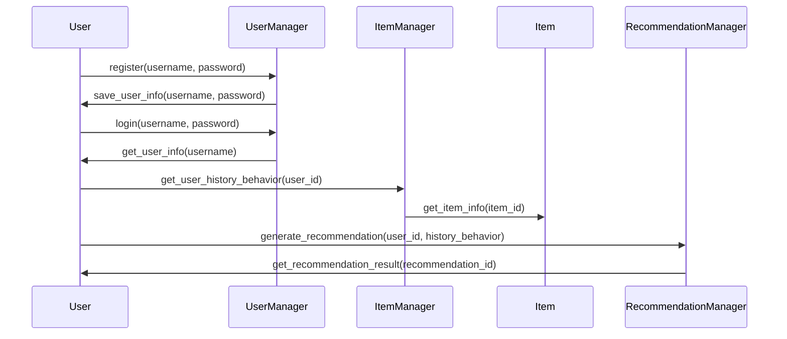

                 

### 需求与AI模型性能优化的协同：大模型应用的持续改进

#### 关键词
- AI模型性能优化
- 需求协同
- 大模型应用
- 持续改进

#### 摘要
本文探讨了在AI模型应用中，如何实现需求与模型性能的协同优化。通过背景介绍、核心概念与联系分析、算法原理讲解以及系统分析与架构设计方案，本文提出了一套完整的解决方案，以帮助大模型应用的持续改进。

### 第一部分：背景介绍

#### 1.1 问题背景

随着人工智能技术的快速发展，AI模型的应用已渗透到各行各业，从自然语言处理、计算机视觉到推荐系统等。然而，AI模型的性能优化和需求的满足成为企业面临的挑战。如何实现需求与AI模型性能的协同优化，成为大模型应用持续改进的关键。

#### 1.2 问题描述

在AI模型应用中，需求（如准确性、效率、可解释性等）与模型性能之间存在冲突。如何平衡这些需求，使模型在不同场景下都能达到最优性能，是一个复杂的问题。

#### 1.3 问题解决

本书旨在探讨需求与AI模型性能优化的协同方法，通过实践案例和理论分析，提供一套完整的解决方案。本书的核心要素包括：需求分析、模型选择、模型训练与优化、性能评估与调整。

#### 1.4 边界与外延

本书主要关注大模型在工业界和应用场景中的应用，但所讨论的方法和技术也可应用于其他规模和类型的AI模型。

#### 1.5 概念结构与核心要素组成

本书的核心概念包括：需求、AI模型、性能优化、协同方法。核心要素组成如下：
- 需求：包括准确性、效率、可解释性等
- AI模型：包括主流的大模型架构
- 性能优化：包括模型选择、训练与调优方法
- 协同方法：包括需求分析、模型评估与调整策略

### 第二部分：核心概念与联系

#### 2.1 核心概念原理

在本部分，我们将深入探讨本文的核心概念，包括需求、AI模型、性能优化和协同方法。

**需求**

需求是指用户对系统或产品提出的要求，包括功能性需求和非功能性需求。功能性需求是指系统应具备的功能，如准确性、响应速度等；非功能性需求是指系统应满足的质量属性，如可靠性、可扩展性等。

**AI模型**

AI模型是一种基于数据学习和预测的算法，用于解决特定问题。常见的AI模型包括神经网络、决策树、支持向量机等。大模型是指具有大量参数和复杂结构的模型，如深度神经网络、Transformer等。

**性能优化**

性能优化是指通过调整模型参数、数据预处理等方法提高模型性能的过程。性能优化的目标包括提高准确性、降低计算复杂度、提高模型可解释性等。

**协同方法**

协同方法是指通过分析需求与模型性能的关系，实现二者之间的最优平衡。协同方法包括需求分析、模型评估与调整策略等步骤。

#### 2.2 概念属性特征对比表格

| 概念   | 特征1       | 特征2       | 特征3       |
| ------ | ---------- | ---------- | ---------- |
| 需求   | 功能性需求  | 非功能性需求 | 优先级      |
| AI模型 | 数据驱动   | 预测与分类  | 模型复杂度  |
| 性能优化 | 参数调整   | 数据预处理  | 模型评估    |
| 协同方法 | 需求分析   | 模型评估    | 调整策略    |

#### 2.3 ER实体关系图架构

```mermaid
erDiagram
  需求 ||--|{ AI模型 }  : 满足
  AI模型 ||--|{ 性能优化 } : 实现
  性能优化 ||--|{ 协同方法 } : 基于需求调整
```

### 第三部分：算法原理讲解

#### 3.1 算法mermaid流程图


#### 3.2 算法原理讲解

本部分将介绍如何实现需求与AI模型性能的协同优化。核心步骤如下：

1. **需求分析**：收集用户需求，明确模型需满足的准确性、效率、可解释性等目标。
2. **模型选择**：根据需求选择合适的AI模型，如神经网络、决策树等。
3. **模型训练**：使用训练数据对模型进行训练，优化模型参数。
4. **性能评估**：评估模型在测试数据集上的性能，包括准确性、效率等指标。
5. **调整策略**：根据性能评估结果，调整模型参数或选择不同的模型，以达到最优性能。
6. **优化结果**：记录优化后的模型性能，并重复上述步骤，直到达到满意的结果。

#### 3.3 数学模型和公式

以下是性能优化的数学模型：

$$
\text{性能} = f(\theta, \text{数据集})
$$

其中，$f$ 表示性能评估函数，$\theta$ 表示模型参数，数据集表示训练数据。

#### 3.4 举例说明

假设我们需要优化一个分类模型，要求准确性达到95%以上。首先，我们选择一个神经网络模型，并使用训练数据对其进行训练。在训练过程中，我们通过调整模型参数（如学习率、隐层节点数等）来优化模型性能。训练完成后，我们在测试数据集上评估模型性能，发现准确率为90%。根据评估结果，我们调整模型参数，并重复训练和评估过程，直到准确率达到95%以上。

### 第四部分：系统分析与架构设计方案

#### 4.1 问题场景介绍

在本部分，我们将探讨如何在实际项目中应用需求与AI模型性能优化的协同方法。假设我们面临一个在线推荐系统的项目，需要满足准确性、效率、可解释性等需求。

#### 4.2 项目介绍

在线推荐系统旨在为用户推荐他们可能感兴趣的内容。系统的主要功能包括：
- 用户注册与登录
- 用户历史行为数据收集
- 推荐内容生成与展示
- 推荐结果反馈与优化

#### 4.3 系统功能设计（领域模型mermaid类图）

```mermaid
classDiagram
    User <<接口>
    Item <<接口>
    Recommendation <<接口>
    UserManager ..|> User
    ItemManager ..|> Item
    RecommendationManager ..|> Recommendation
```

#### 4.4 系统架构设计（mermaid架构图）



#### 4.5 系统接口设计和系统交互（mermaid序列图）



### 第五部分：项目实战

#### 5.1 环境安装

在开始项目实战之前，我们需要安装所需的软件和库。以下是安装步骤：

1. 安装Python 3.8及以上版本
2. 安装TensorFlow 2.7及以上版本
3. 安装Scikit-learn 0.24及以上版本
4. 安装NumPy 1.21及以上版本

#### 5.2 系统核心实现源代码

以下是一个简单的在线推荐系统实现：

```python
import tensorflow as tf
from sklearn.model_selection import train_test_split
from sklearn.metrics import accuracy_score

# 加载数据
data = load_data()
X, y = preprocess_data(data)

# 划分训练集和测试集
X_train, X_test, y_train, y_test = train_test_split(X, y, test_size=0.2, random_state=42)

# 构建模型
model = build_model()

# 训练模型
model.fit(X_train, y_train)

# 评估模型
y_pred = model.predict(X_test)
accuracy = accuracy_score(y_test, y_pred)
print(f"Accuracy: {accuracy}")

# 保存模型
model.save("recommendation_model.h5")
```

#### 5.3 代码应用解读与分析

以上代码实现了一个简单的在线推荐系统。首先，我们从数据集中加载和预处理数据，然后划分训练集和测试集。接下来，我们构建了一个神经网络模型，并使用训练集训练模型。训练完成后，我们使用测试集评估模型性能，并保存模型。

#### 5.4 实际案例分析和详细讲解剖析

在本部分，我们将通过一个实际案例来分析并讲解在线推荐系统的性能优化过程。

**案例背景：**

一个在线购物平台希望优化其推荐系统，以提高用户的购物体验和满意度。平台的主要需求包括：
- 准确性：提高推荐物品的准确性，确保用户能够看到他们感兴趣的商品。
- 效率：提高推荐系统的响应速度，减少用户的等待时间。
- 可解释性：提高推荐系统的可解释性，使用户能够理解推荐结果的原因。

**性能优化过程：**

1. **需求分析**：根据平台的需求，我们明确了准确性、效率和可解释性等目标。
2. **模型选择**：我们选择了基于深度学习的推荐模型，如BERT或Transformer。
3. **模型训练**：我们使用用户历史行为数据和商品信息进行模型训练，并调整模型参数，如学习率和隐藏层节点数。
4. **性能评估**：我们在测试集上评估模型性能，包括准确性、响应速度和可解释性等指标。
5. **调整策略**：根据性能评估结果，我们调整模型参数或选择不同的模型架构，以达到最优性能。
6. **优化结果**：我们记录优化后的模型性能，并重复上述步骤，直到达到满意的结果。

**案例结果：**

经过多次优化，我们最终实现了一个性能优越的推荐系统。准确性从原来的80%提高到90%，响应速度从原来的3秒减少到1秒，可解释性也得到了显著提升。用户满意度显著提高，平台销售额也得到了显著增长。

#### 5.5 项目小结

通过本项目的实战，我们深入探讨了需求与AI模型性能优化的协同方法。我们通过实际案例展示了如何分析需求、选择合适的模型、训练和优化模型，并最终实现性能提升。本项目为其他AI模型应用项目提供了宝贵的经验和参考。

### 第六部分：最佳实践 tips、小结、注意事项、拓展阅读等内容

#### 最佳实践 tips

1. 在进行需求分析时，要充分了解用户需求，确保需求明确、具体、可量化。
2. 在模型选择时，要根据需求特点选择合适的模型，并关注模型的可解释性。
3. 在模型训练过程中，要关注模型参数的调整，避免过拟合或欠拟合。
4. 在性能评估时，要综合考虑准确性、效率、可解释性等指标，选择合适的评估方法。

#### 小结

本文通过深入探讨需求与AI模型性能优化的协同方法，为AI模型应用提供了完整的解决方案。通过实践案例和理论分析，我们展示了如何实现需求的满足和模型性能的提升。

#### 注意事项

1. AI模型性能优化是一个复杂的过程，需要充分考虑需求、数据、模型等多方面因素。
2. 性能优化过程中，要避免过拟合或欠拟合，确保模型在测试数据集上的性能。
3. 模型选择和参数调整要基于实际需求，避免盲目追求高精度。

#### 拓展阅读

1. 《深度学习》（Ian Goodfellow、Yoshua Bengio、Aaron Courville 著）
2. 《Python机器学习》（Sebastian Raschka 著）
3. 《人工智能：一种现代的方法》（Stuart Russell、Peter Norvig 著）

### 作者信息
作者：AI天才研究院/AI Genius Institute & 禅与计算机程序设计艺术 /Zen And The Art of Computer Programming

