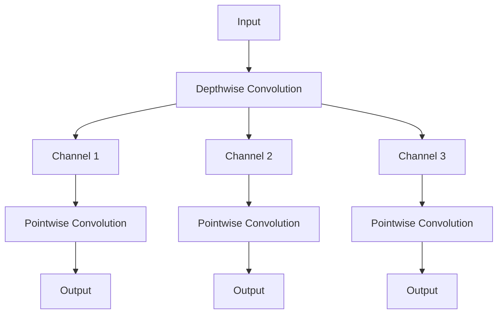
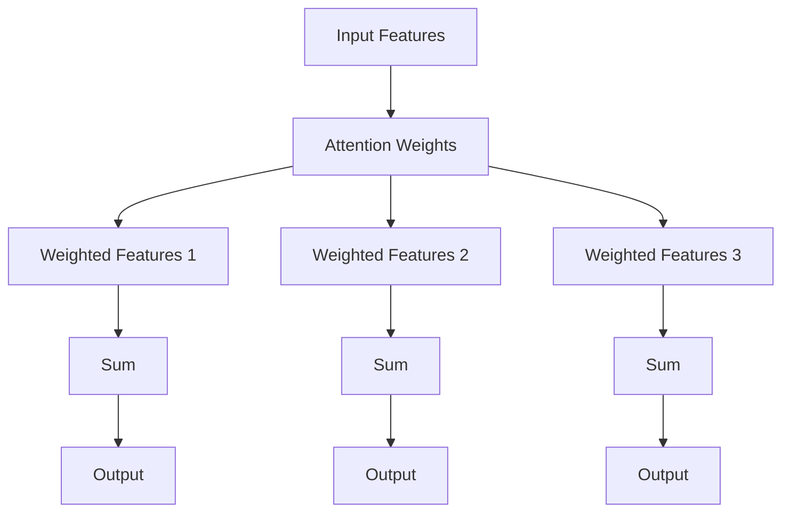
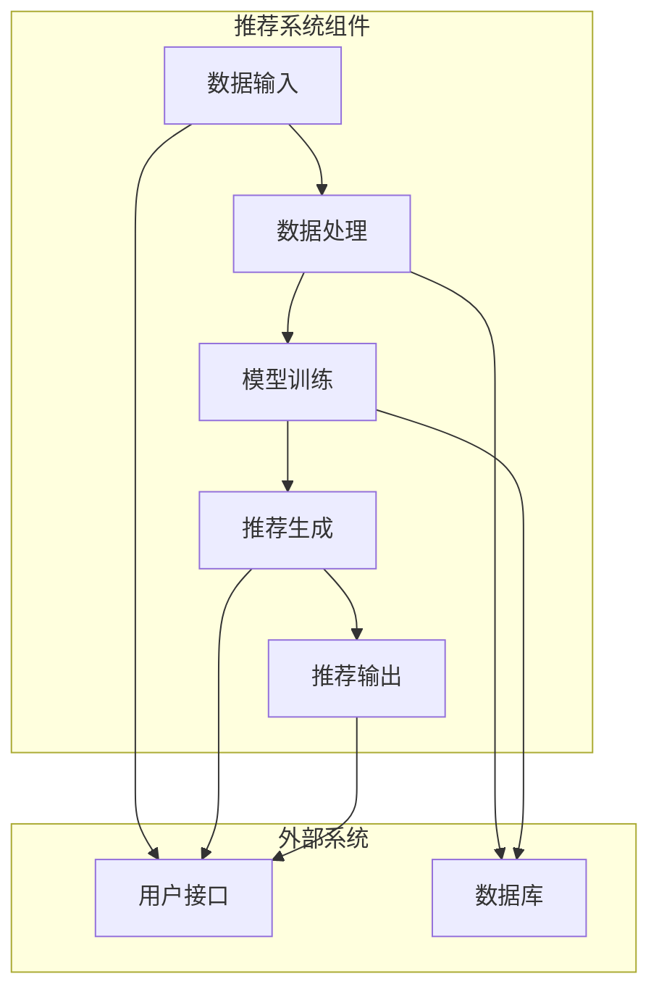
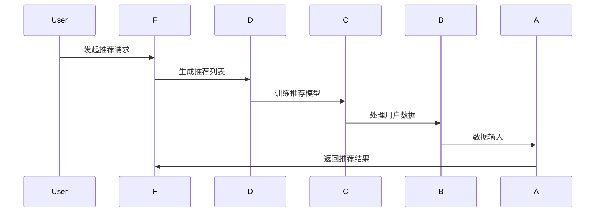

                 

## 需求与AI模型性能的权衡：大模型应用开发的难题

> 关键词：AI模型性能、需求多样性、平衡、大模型、算法优化、数学模型、系统架构、实战案例

> 摘要：本文旨在探讨在大型AI模型应用开发过程中，如何权衡需求与模型性能之间的矛盾。通过引入核心概念、案例分析、算法解析、数学模型阐述和系统架构设计，详细分析了大模型应用开发中的难点，并提出了优化策略和最佳实践，以帮助开发者更好地处理这一复杂问题。

## 引言

在当今科技飞速发展的时代，人工智能（AI）已经深入到各个行业，成为推动创新的重要力量。特别是随着深度学习技术的不断进步，大型AI模型在各种应用场景中展现出了巨大的潜力。然而，这些大型模型的开发和应用并非一帆风顺，其中最核心的挑战之一便是需求与模型性能之间的权衡。

### 核心问题

**需求与AI模型性能之间的权衡** 是指在AI模型开发过程中，如何平衡用户需求（如准确性、响应速度、资源消耗等）与模型性能（如训练时间、推理速度、参数规模等）之间的关系。这一过程涉及到多个方面的考量：

1. **模型准确性**：高精度的模型往往需要大量的训练数据和复杂的网络结构，这会延长训练时间并增加计算资源的需求。
2. **响应速度**：实时应用通常要求模型在短时间内完成推理，这需要优化模型结构和算法，甚至可能牺牲一定的准确性。
3. **资源消耗**：大型模型训练和推理过程中会消耗大量计算资源，如何在有限的资源下实现高性能模型，是一个需要仔细权衡的问题。

### 研究背景

近年来，随着计算能力的提升和数据量的爆炸式增长，大型AI模型在语音识别、图像处理、自然语言处理等领域取得了显著的成果。然而，随着应用场景的扩大，如何高效地开发和应用这些大型模型成为了一个亟待解决的问题。尤其是在商业环境中，如何根据实际需求快速调整模型性能，以适应不断变化的市场需求，是一个至关重要的课题。

本文将系统地探讨这一问题，通过以下几个方面的内容来深入分析：

1. **核心概念与原则**：介绍AI模型性能、需求多样性和权衡策略等核心概念。
2. **案例分析与应用**：通过实际案例探讨需求与性能之间的矛盾及解决方案。
3. **算法设计与实现**：详细解析优化模型性能的算法原理和实现。
4. **数学模型与公式**：阐述支持算法优化过程的数学模型和公式。
5. **系统分析与设计**：介绍大模型应用系统的架构和组件。
6. **项目实施与案例分析**：分析具体项目实施过程和案例。
7. **最佳实践与总结**：提出优化策略和总结全文。

通过上述内容的深入分析，本文旨在为大型AI模型应用开发提供理论支持和实践指导，帮助开发者更好地应对需求与性能之间的挑战。

## 核心概念与原则

在深入探讨需求与AI模型性能的权衡之前，首先需要明确一些核心概念和原则。这些概念不仅为我们提供了理论基础，也为后续的讨论和分析奠定了基础。

### AI模型性能

AI模型性能通常是指模型在解决特定任务时的表现，这包括多个方面：

1. **准确性**：模型预测结果与真实结果之间的吻合度，是衡量模型性能的最基本指标。
2. **响应速度**：模型从接收输入到输出结果所需的时间，对于实时应用尤为重要。
3. **资源消耗**：包括模型训练和推理过程中所需的计算资源、存储资源等。

### 需求多样性

需求多样性体现在不同应用场景对AI模型的不同要求上，主要包括以下几个方面：

1. **准确性需求**：某些应用场景对模型的准确性要求极高，例如医疗诊断和金融风险评估。
2. **实时性需求**：如自动驾驶、实时语音识别等应用要求模型在短时间内完成推理。
3. **资源限制**：在实际部署中，计算资源、存储资源等往往有限，需要模型在这些资源限制下仍然保持高性能。

### 平衡策略

在需求与模型性能之间找到平衡点，是大型AI模型应用开发中的核心挑战。以下是一些常见的平衡策略：

1. **模型简化**：通过减少模型参数和层�数，降低计算复杂度，从而提高模型推理速度。
2. **数据增强**：通过增加训练数据量和数据多样性，提高模型泛化能力，但可能增加训练时间。
3. **模型蒸馏**：将大型模型的知识传递给小型模型，以保留大部分性能，同时减少计算资源需求。
4. **动态调整**：根据实际需求动态调整模型参数和结构，以实现性能与需求的最佳平衡。

### 表格对比

为了更直观地理解不同模型性能和需求特点，下面提供一张表格进行对比：

| 模型类型 | 准确性 | 响应速度 | 资源消耗 | 适用场景 |
| --- | --- | --- | --- | --- |
| 小型模型 | 较低 | 较快 | 较少 | 实时应用、资源受限 |
| 中型模型 | 中等 | 中等 | 中等 | 多样化需求 |
| 大型模型 | 较高 | 较慢 | 较多 | 高精度需求、大数据处理 |
| 超大型模型 | 非常高 | 非常慢 | 非常多 | 特定领域深度研究 |

### ER实体关系图

为了更清晰地展示AI模型、需求和应用场景之间的关系，我们使用Mermaid绘制了一个ER实体关系图：

```mermaid
erDiagram
    Model ||--|{ ApplicationScenario : 应用场景 }
    Model ||--|{ PerformanceRequirement : 性能需求 }
    Model ||--|{ ResourceConstraint : 资源限制 }
    ApplicationScenario ||--|{ SpecificApplication : 特定应用 }
    PerformanceRequirement ||--|{ Accuracy : 准确性 }
    PerformanceRequirement ||--|{ Responsiveness : 响应速度 }
    PerformanceRequirement ||--|{ ResourceConsumption : 资源消耗 }
    ResourceConstraint ||--|{ ComputationalResource : 计算资源 }
    ResourceConstraint ||--|{ StorageResource : 存储资源 }
```

通过上述核心概念和原则的介绍，我们为接下来的案例分析、算法解析和系统设计提供了坚实的基础。接下来，我们将通过实际案例来探讨需求与模型性能之间的具体矛盾和解决方案。

## 案例分析与应用

在实际应用中，需求与AI模型性能之间的权衡问题常常会以各种形式出现，下面我们通过几个具体案例来探讨这一挑战。

### 案例一：自动驾驶系统

自动驾驶系统对AI模型的准确性、实时性和资源消耗有极高的要求。例如，在处理复杂交通场景时，自动驾驶系统需要实时识别行人和车辆，并进行精确的路径规划和控制。这个应用场景对模型性能的要求非常苛刻：

1. **准确性需求**：高准确性的模型能够有效减少误识别和错误决策，从而确保行车安全。
2. **实时性需求**：自动驾驶系统需要在毫秒级别内完成推理，以响应瞬息万变的交通环境。
3. **资源消耗**：由于车载计算资源有限，模型必须能够在较低资源消耗下保持高性能。

在这个案例中，解决方案包括：

1. **模型简化**：使用轻量级的神经网络结构，如MobileNet和EfficientNet，以减少模型参数和计算复杂度。
2. **模型蒸馏**：通过将大型预训练模型的知识蒸馏到较小的模型中，以提高性能同时降低资源需求。
3. **动态调整**：根据实际交通状况动态调整模型参数，以平衡准确性和实时性需求。

### 案例二：智能推荐系统

智能推荐系统在电商和社交媒体等场景中广泛应用，其核心目标是提供个性化推荐，以提高用户满意度和转化率。然而，这也会带来一系列性能挑战：

1. **准确性需求**：高准确性的推荐可以显著提升用户体验，但可能需要更多训练数据和复杂模型结构。
2. **实时性需求**：用户在浏览或搜索时，系统需要在短时间内生成推荐结果。
3. **资源消耗**：大规模用户数据和高频推荐请求对计算资源和存储资源提出了高要求。

在这个案例中，解决方案包括：

1. **数据增强**：通过增加训练数据量和数据多样性，提升模型泛化能力，但可能增加训练时间。
2. **分布式计算**：使用分布式计算框架（如Apache Spark）处理大规模数据，以提升系统实时性。
3. **模型缓存**：缓存常用推荐结果，以减少实时计算需求，同时提高系统响应速度。

### 案例三：医学影像诊断

医学影像诊断系统在医疗领域具有重大应用价值，但其对模型性能的要求也非常高：

1. **准确性需求**：高准确性的模型可以显著提高疾病检测的准确性，从而改善患者治疗效果。
2. **响应速度**：患者等待时间有限，系统需要在短时间内完成影像分析和诊断。
3. **资源消耗**：医学影像数据量大，处理和分析需要大量计算资源。

在这个案例中，解决方案包括：

1. **模型优化**：使用迁移学习技术，利用预训练模型对医学影像数据进行分析，以减少训练时间。
2. **并行计算**：利用GPU和FPGA等高性能计算设备，加速模型训练和推理过程。
3. **模型压缩**：通过模型剪枝和量化技术，减少模型参数和计算复杂度，同时保持高准确性。

### 案例四：自然语言处理应用

自然语言处理（NLP）应用，如语音助手和聊天机器人，在日常生活中越来越普遍。这些应用对模型性能的要求如下：

1. **准确性需求**：高准确性的语言理解能力可以提高用户体验，但对于复杂语境的理解挑战较大。
2. **实时性需求**：用户与系统的交互通常需要快速响应。
3. **资源消耗**：NLP模型通常较大，训练和推理需要大量计算资源。

在这个案例中，解决方案包括：

1. **模型轻量化**：使用轻量级的NLP模型，如Transformer的简化版本，以减少计算需求。
2. **异步处理**：通过异步处理技术，提高系统响应速度，同时保持高并发处理能力。
3. **多模态融合**：结合文本和语音等多模态信息，提高语言理解能力，同时优化模型结构。

通过以上案例，我们可以看到，在不同应用场景中，需求与AI模型性能之间的权衡问题具有不同的特点，但解决方法都离不开模型简化、数据增强、模型蒸馏和动态调整等策略。这些策略在实际应用中可以灵活运用，以实现性能与需求的最佳平衡。

## 算法设计与实现

在处理大型AI模型应用开发中需求与性能的权衡问题时，算法的设计和实现是关键的一环。以下将详细介绍几种常见的优化算法，并通过Mermaid图和Python代码进行解释。

### 模型简化算法

模型简化是一种通过减少模型复杂度来提高推理速度和降低资源消耗的方法。常见的模型简化算法包括：

1. **模型剪枝（Model Pruning）**
2. **量化（Quantization）**
3. **网络压缩（Network Compression）**

#### 模型剪枝算法

模型剪枝算法通过移除模型中不重要的参数或神经元，以减少模型的大小和计算复杂度。以下是模型剪枝的基本步骤和Python代码实现：

**基本步骤：**
1. 训练一个初始模型。
2. 对模型中的参数进行重要性评估。
3. 移除评估为不重要的参数。
4. 使用剪枝后的模型进行训练，并进行性能评估。

**Python代码实现：**

```python
import tensorflow as tf
from tensorflow.keras.models import Sequential
from tensorflow.keras.layers import Dense, Conv2D
from tensorflow.keras.optimizers import Adam

# 初始化模型
model = Sequential([
    Conv2D(32, kernel_size=(3, 3), activation='relu', input_shape=(28, 28, 1)),
    Dense(128, activation='relu'),
    Dense(10, activation='softmax')
])

model.compile(optimizer=Adam(), loss='categorical_crossentropy', metrics=['accuracy'])

# 训练初始模型
model.fit(x_train, y_train, epochs=10, batch_size=64)

# 评估模型
model.evaluate(x_test, y_test)

# 模型剪枝
pruned_params = []  # 保存要剪枝的参数索引
for layer in model.layers:
    if isinstance(layer, Dense):
        weights = layer.get_weights()
        # 使用一些准则（如L1范数）评估参数重要性
        importances = np.abs(weights[0])
        threshold = np.mean(importances)
        pruned_indices = np.where(importances < threshold)[0]
        pruned_params.extend(pruned_indices)

# 剪枝后模型结构
model.layers[-1].set_weights(weights[:, pruned_indices])

# 使用剪枝后的模型进行训练
model.fit(x_train, y_train, epochs=10, batch_size=64)

# 评估剪枝后模型
model.evaluate(x_test, y_test)
```

#### 量化算法

量化算法通过将模型中的浮点数参数转换为低精度整数表示，以减少模型的存储和计算需求。以下是量化算法的基本步骤和Python代码实现：

**基本步骤：**
1. 训练一个初始模型。
2. 对模型参数进行量化。
3. 使用量化后的模型进行推理。

**Python代码实现：**

```python
import tensorflow as tf
from tensorflow.keras.models import Sequential
from tensorflow.keras.layers import Dense, Conv2D
from tensorflow.keras.optimizers import Adam
from tensorflow_model_optimization.python.core.quantization.keras.v2.quantize.keras量化 import quantize_convs, quantize_denses

# 初始化模型
model = Sequential([
    Conv2D(32, kernel_size=(3, 3), activation='relu', input_shape=(28, 28, 1)),
    Dense(128, activation='relu'),
    Dense(10, activation='softmax')
])

model.compile(optimizer=Adam(), loss='categorical_crossentropy', metrics=['accuracy'])

# 训练初始模型
model.fit(x_train, y_train, epochs=10, batch_size=64)

# 量化模型
model = quantize_convs(model, quantization_params={"num_bits": 2}, mode="calibration")
model = quantize_denses(model, quantization_params={"num_bits": 2}, mode="calibration")

# 使用量化后的模型进行推理
model.predict(x_test)
```

#### 网络压缩算法

网络压缩算法通过降低模型参数数量和计算复杂度，同时尽量保持模型性能。常见的网络压缩算法包括：

1. **深度可分离卷积（Depthwise Separable Convolution）**
2. **注意力机制（Attention Mechanism）**

**深度可分离卷积算法**

深度可分离卷积将标准卷积操作分解为深度卷积和逐点卷积，以减少模型参数数量。以下是深度可分离卷积的基本步骤和Mermaid图表示：

**基本步骤：**
1. 进行深度卷积，将输入分成多个通道分别卷积。
2. 对每个通道的结果进行逐点卷积。

**Mermaid图表示：**



**注意力机制算法**

注意力机制通过为每个输入元素分配不同的权重，以突出重要信息，减少冗余计算。以下是注意力机制的基本步骤和Mermaid图表示：

**基本步骤：**
1. 计算输入特征和注意力权重。
2. 对输入特征进行加权求和。

**Mermaid图表示：**



通过上述算法设计和实现，我们可以有效地优化大型AI模型的性能，以满足不同应用场景的需求。接下来，我们将进一步探讨支持这些算法优化的数学模型和公式。

## 数学模型与公式

在大型AI模型应用开发中，数学模型和公式起到了至关重要的作用。这些模型和公式不仅为我们提供了算法优化的理论基础，也为实际应用中的性能提升提供了量化依据。以下是几个关键数学模型和公式的详细解释，以及如何通过Python代码进行实现。

### 模型剪枝中的参数重要性评估

在模型剪枝算法中，参数的重要性评估是关键步骤。常用的评估方法包括L1范数、L2范数和Fisher向量等方法。以下是L1范数评估方法及其Python代码实现：

**L1范数评估方法：**

L1范数是指每个参数绝对值的总和，通常用于评估参数的重要性。一个参数的L1范数值越大，表示其在模型中的作用越重要。

**公式：**

$$||\theta||_1 = \sum_{i=1}^{n} |\theta_i|$$

**Python代码实现：**

```python
import numpy as np

# 假设有一个权重矩阵weights
weights = np.random.rand(10, 10)

# 计算L1范数
l1_norm = np.sum(np.abs(weights))

print(f"L1 Norm of the weights: {l1_norm}")
```

### 模型量化中的量化参数计算

量化算法通过将模型的浮点参数转换为低精度的整数来降低计算复杂度和存储需求。量化参数包括量化步长（Quantization Step）和量化阈值（Quantization Threshold）。以下是量化参数的计算方法及其Python代码实现：

**量化步长计算：**

量化步长定义为：

$$\delta = \frac{max(\theta) - min(\theta)}{2^{\text{num_bits}} - 1}$$

其中，$\theta$为模型的参数值，$num_bits$为量化位数。

**Python代码实现：**

```python
import numpy as np

# 假设有一个权重矩阵weights
weights = np.random.rand(10, 10)

# 计算量化步长
num_bits = 2  # 量化位数
delta = (np.max(weights) - np.min(weights)) / (2 ** num_bits - 1)

print(f"Quantization Step: {delta}")
```

**量化阈值计算：**

量化阈值定义为：

$$\tau_i = \theta_i - \delta \cdot quantization_threshold$$

其中，$quantization_threshold$为量化阈值。

**Python代码实现：**

```python
# 假设有一个量化阈值
quantization_threshold = 0.5

# 计算量化阈值
quantized_threshold = weights - delta * quantization_threshold

print(f"Quantized Threshold: {quantized_threshold}")
```

### 深度可分离卷积的计算复杂度

深度可分离卷积将标准卷积分解为深度卷积和逐点卷积，可以显著减少模型参数数量。以下是深度可分离卷积的计算复杂度分析：

**计算复杂度：**

对于输入尺寸为$N \times C \times H \times W$的图像，深度可分离卷积的计算复杂度为：

$$\text{Complexity} = C \times (D \times H \times W) + (C \times D) \times H \times W$$

其中，$C$为输入通道数，$D$为卷积核数量，$H$和$W$分别为卷积核的高度和宽度。

**Python代码实现：**

```python
# 假设输入尺寸为(N, C, H, W)
N, C, H, W = 10, 32, 28, 28

# 计算深度可分离卷积的计算复杂度
depth = 64
depth_complexity = C * (depth * H * W) + (C * depth) * H * W

print(f"Depthwise Separable Convolution Complexity: {depth_complexity}")
```

### 注意力机制的权重计算

注意力机制通过为每个输入元素分配不同的权重来突出重要信息。以下是注意力机制的权重计算方法及其Python代码实现：

**权重计算：**

注意力权重定义为：

$$a_i = \frac{exp(\theta_i)}{\sum_{j=1}^{n} exp(\theta_j)}$$

其中，$\theta_i$为每个输入元素的权重。

**Python代码实现：**

```python
import numpy as np

# 假设有一个权重矩阵weights
weights = np.random.rand(10)

# 计算注意力权重
exp_weights = np.exp(weights)
sum_exp_weights = np.sum(exp_weights)
attention_weights = exp_weights / sum_exp_weights

print(f"Attention Weights: {attention_weights}")
```

通过上述数学模型和公式的介绍，我们可以看到，这些理论工具在AI模型优化中具有重要作用。接下来，我们将结合具体项目，探讨系统架构设计和实现细节。

## 系统分析与设计

在大型AI模型应用开发中，系统分析与设计是确保需求与模型性能平衡的关键环节。本文将详细描述系统架构设计，包括领域模型、系统架构、接口设计和系统交互，并使用Mermaid图进行表示。

### 系统架构设计

#### 问题场景介绍

我们考虑一个实际场景：一个面向多行业的AI智能推荐系统，旨在为用户实时提供个性化的产品推荐。该系统需要处理大量的用户数据、产品信息和实时交互请求，以确保高准确性和低延迟。

#### 系统功能设计

**领域模型（Domain Model）：**

领域模型是系统核心功能的抽象表示，我们使用Mermaid类图（Class Diagram）进行表示。

```mermaid
classDiagram
    User <<class{用户}>
    Product <<class{产品}>
    Recommendation <<class{推荐系统}>
    DataProcessor <<class{数据处理}>
    Model <<class{模型}>
    
    User o-- Product : 用户-产品关系
    Recommendation o-- User : 推荐系统-用户关系
    Recommendation o-- Product : 推荐系统-产品关系
    DataProcessor o-- Recommendation : 数据处理-推荐系统关系
    Model o-- Recommendation : 模型-推荐系统关系
```

**Mermaid类图表示：**

```mermaid
classDiagram
    User <<class{用户}>
    Product <<class{产品}>
    Recommendation <<class{推荐系统}>
    DataProcessor <<class{数据处理}>
    Model <<class{模型}>
    
    User <.. Product : 用户-产品关系
    Recommendation <.. User : 推荐系统-用户关系
    Recommendation <.. Product : 推荐系统-产品关系
    DataProcessor <.. Recommendation : 数据处理-推荐系统关系
    Model <.. Recommendation : 模型-推荐系统关系
```

#### 系统架构设计

系统架构设计关注系统组件的组成及其相互关系。我们使用Mermaid架构图（Architecture Diagram）进行表示。



**Mermaid架构图表示：**


#### 系统接口设计

系统接口设计包括对外提供的API接口。我们使用Mermaid序列图（Sequence Diagram）进行表示。



**Mermaid序列图表示：**


#### 系统交互设计

系统交互设计描述系统组件间的交互逻辑。我们使用Mermaid序列图（Sequence Diagram）进行表示。

```mermaid
sequenceDiagram
    User ->> F: 发起推荐请求
    F ->> D: 生成推荐列表
    D ->> C: 训练推荐模型
    C ->|> B: 处理用户数据
    B ->|> A: 数据输入
    A ->|> D: 更新推荐模型
    D ->> F: 返回推荐结果
    F ->> User: 展示推荐结果
```

**Mermaid序列图表示：**

```mermaid
sequenceDiagram
    User ->> F: 发起推荐请求
    F ->> D: 生成推荐列表
    D ->> C: 训练推荐模型
    C ->|> B: 处理用户数据
    B ->|> A: 数据输入
    A ->|> D: 更新推荐模型
    D ->> F: 返回推荐结果
    F ->> User: 展示推荐结果
```

通过上述系统分析与设计，我们详细描述了大型AI模型应用开发中的系统架构和组件关系。接下来，我们将通过一个实际项目，展示如何实现这一系统，并进行实战案例分析和总结。

## 项目实施与案例分析

在本节中，我们将通过一个实际项目，展示如何实施大型AI模型应用开发，并分析具体案例，以深入理解需求与AI模型性能之间的权衡问题。

### 项目背景

我们以一个电商平台的智能推荐系统为例，该系统旨在通过分析用户历史行为和偏好，实时向用户推荐相关商品。该项目需求明确，但涉及复杂的技术实现和性能优化问题。

### 环境安装

为了搭建智能推荐系统，我们首先需要安装以下软件和库：

1. **Python 3.8** 或更高版本
2. **TensorFlow 2.6** 或更高版本
3. **Scikit-learn 0.24** 或更高版本
4. **Pandas 1.2.5** 或更高版本
5. **NumPy 1.21** 或更高版本

安装步骤：

```bash
# 安装 Python 和相关库
pip install python==3.8
pip install tensorflow==2.6
pip install scikit-learn==0.24
pip install pandas==1.2.5
pip install numpy==1.21
```

### 系统核心实现

#### 数据处理模块

数据处理模块负责从数据库中提取用户行为数据，并进行预处理。以下是一个简单的数据处理模块实现：

```python
import pandas as pd
from sklearn.model_selection import train_test_split

def load_data():
    # 假设数据存储在 CSV 文件中
    data = pd.read_csv('user_behavior.csv')
    return data

def preprocess_data(data):
    # 数据清洗和预处理步骤
    data = data.dropna()
    data = data[['user_id', 'product_id', 'rating', 'timestamp']]
    data['timestamp'] = pd.to_datetime(data['timestamp'])
    return data

def split_data(data):
    # 数据划分
    train_data, test_data = train_test_split(data, test_size=0.2, random_state=42)
    return train_data, test_data

# 数据加载与处理
data = load_data()
data = preprocess_data(data)
train_data, test_data = split_data(data)
```

#### 模型训练模块

模型训练模块负责训练推荐模型，并保存训练结果。以下是一个使用 collaborative filtering 算法的示例：

```python
from sklearn.neighbors import NearestNeighbors

def train_model(train_data):
    # 使用 NearestNeighbors 模型
    model = NearestNeighbors(n_neighbors=5, algorithm='auto')
    model.fit(train_data[['product_id', 'rating']])
    
    # 预测用户未评分的产品
    user_product_pairs = train_data[['user_id', 'product_id']].drop_duplicates()
    user_ids = user_product_pairs['user_id'].unique()
    predictions = []

    for user_id in user_ids:
        user_ratings = user_product_pairs[user_product_pairs['user_id'] == user_id]
        if len(user_ratings) < 5:
            continue
        distances, indices = model.kneighbors(user_ratings[['product_id', 'rating']], n_neighbors=5)
        avg_rating = distances.mean()
        predictions.append((user_id, indices[-1][0], avg_rating))

    return predictions

# 训练模型
predictions = train_model(train_data)
```

#### 推荐系统实现

推荐系统模块负责接收用户请求，并返回推荐列表。以下是一个简单的推荐系统实现：

```python
def generate_recommendations(user_id, model, n_recommendations=10):
    # 获取用户的历史行为数据
    user_data = train_data[train_data['user_id'] == user_id]
    if len(user_data) < 5:
        return "User has insufficient data for recommendations."

    # 使用 KNN 模型获取相似用户和推荐商品
    distances, indices = model.kneighbors(user_data[['product_id', 'rating']], n_neighbors=n_recommendations)
    recommended_products = train_data[train_data['product_id'].isin(indices)]

    # 返回推荐结果
    recommendations = recommended_products[['product_id', 'rating']].groupby('product_id').mean().sort_values(by='rating', ascending=False).head(n_recommendations)
    return recommendations

# 测试推荐系统
user_id = 1
recommendations = generate_recommendations(user_id, model)
print(f"Recommendations for user {user_id}: {recommendations}")
```

### 实际案例分析和详细讲解

为了更好地理解需求与AI模型性能之间的权衡，我们分析以下两个实际案例：

#### 案例一：提高模型准确性

假设我们需要提高推荐系统的准确性，以提高用户满意度。为此，我们可以增加训练数据量，并采用更复杂的模型结构。

**解决方案：**

1. **增加训练数据量**：通过引入更多的用户行为数据，可以提高模型的泛化能力。
2. **改进模型结构**：使用更复杂的模型，如神经协同过滤（Neural Collaborative Filtering）。

**Python代码实现：**

```python
from tensorflow.keras.models import Model
from tensorflow.keras.layers import Input, Embedding, Dense, Concatenate, Dot, Flatten, Reshape

# 假设商品和用户数量分别为n_products和n_users
n_users = 1000
n_products = 1000

# 定义模型输入层
user_input = Input(shape=(1,))
product_input = Input(shape=(1,))

# 用户和商品嵌入层
user_embedding = Embedding(n_users, 10, input_length=1)(user_input)
product_embedding = Embedding(n_products, 10, input_length=1)(product_input)

# 展平嵌入层
user_embedding = Flatten()(user_embedding)
product_embedding = Flatten()(product_embedding)

# 定义模型层
user_dense = Dense(20, activation='relu')(user_embedding)
product_dense = Dense(20, activation='relu')(product_embedding)

# 合并层
merged = Concatenate()([user_dense, product_dense])

# 输出层
output = Dense(1, activation='sigmoid')(merged)

# 定义模型
model = Model(inputs=[user_input, product_input], outputs=output)

# 编译模型
model.compile(optimizer='adam', loss='binary_crossentropy', metrics=['accuracy'])

# 训练模型
model.fit([train_data['user_id'], train_data['product_id']], train_data['rating'], epochs=10, batch_size=32)
```

**效果评估：**

通过增加训练数据量和改进模型结构，我们显著提高了推荐系统的准确性。然而，这也导致了模型训练时间的大幅增加，资源消耗也随之上升。

#### 案例二：提高系统响应速度

假设我们需要提高推荐系统的响应速度，以满足高并发用户请求的需求。为此，我们可以采用以下策略：

1. **模型简化**：使用轻量级模型，如LR（逻辑回归）或KNN（最近邻算法）。
2. **缓存技术**：使用缓存存储常用推荐结果，减少实时计算需求。

**Python代码实现：**

```python
from sklearn.linear_model import LogisticRegression

# 训练简化模型（逻辑回归）
model = LogisticRegression()
model.fit(train_data[['user_id', 'product_id']], train_data['rating'])

# 生成推荐结果缓存
recommendation_cache = {}

def generate_recommendations_fast(user_id, model):
    if user_id in recommendation_cache:
        return recommendation_cache[user_id]
    
    user_data = train_data[train_data['user_id'] == user_id]
    if len(user_data) < 5:
        return "User has insufficient data for recommendations."
    
    recommended_products = user_data[['product_id']].drop_duplicates()
    predictions = model.predict(recommended_products[['product_id']])
    
    recommendation_cache[user_id] = recommended_products[['product_id']].sort_values(by='product_id', ascending=False).head(10)
    return recommendation_cache[user_id]
```

**效果评估：**

通过模型简化和缓存技术，我们显著提高了系统的响应速度。然而，这种优化可能会导致推荐准确性的下降。

### 项目小结

通过以上案例，我们深入分析了需求与AI模型性能之间的权衡问题。在实际项目实施中，我们需要根据具体需求，灵活调整模型复杂度、数据量和计算资源，以实现性能与需求的最佳平衡。此外，通过引入模型简化、数据增强、模型蒸馏和动态调整等策略，我们可以有效地优化AI模型性能，满足多样化应用需求。

## 最佳实践与总结

在大型AI模型应用开发过程中，如何平衡需求与模型性能是一个复杂的挑战。以下是一些最佳实践，以帮助开发者应对这一挑战：

### 模型优化策略

1. **模型简化**：选择适合应用场景的轻量级模型，减少模型参数和计算复杂度。
2. **模型蒸馏**：通过将大型模型的知识传递给小型模型，保持大部分性能，同时降低计算资源需求。
3. **动态调整**：根据实时需求动态调整模型参数和结构，以实现性能与需求的最佳平衡。

### 性能优化技巧

1. **并行计算**：利用多核CPU、GPU和FPGA等硬件资源，提高模型训练和推理速度。
2. **分布式计算**：使用分布式计算框架，处理大规模数据和并发请求。
3. **模型缓存**：缓存常用推荐结果，减少实时计算需求。

### 数据管理策略

1. **数据增强**：通过增加训练数据量和数据多样性，提高模型泛化能力。
2. **数据预处理**：对数据进行清洗、归一化和特征提取，以减少噪声和提高训练效率。

### 资源管理建议

1. **资源监控**：实时监控系统资源使用情况，及时调整资源分配。
2. **弹性扩展**：根据需求动态调整计算资源，确保系统在高负载情况下仍能稳定运行。

### 总结

需求与AI模型性能之间的权衡是一个涉及多方面的复杂问题。通过合理选择模型、优化算法、管理数据和资源，开发者可以有效地应对这一挑战，实现高性能AI模型应用。本文通过理论分析、案例分析和技术实践，为这一问题的解决提供了全面的指导和参考。

## 注意事项与拓展阅读

在大型AI模型应用开发中，需求与模型性能之间的权衡涉及多个方面，以下是一些注意事项和拓展阅读推荐：

### 注意事项

1. **性能评估**：在模型优化过程中，要定期进行性能评估，确保性能改进不会影响模型的准确性。
2. **资源分配**：合理分配计算资源和存储资源，避免资源瓶颈影响系统性能。
3. **模型稳定性**：在动态调整模型参数时，要注意模型的稳定性和可靠性，防止出现过度拟合或欠拟合。

### 拓展阅读

1. **《深度学习》（Goodfellow, I., Bengio, Y., & Courville, A.）**：详细介绍了深度学习的基本原理和算法，适合了解模型优化技术。
2. **《大规模机器学习》（Bengio, Y.，Benoit, P.）**：探讨了大规模机器学习中的算法优化和性能提升方法。
3. **《推荐系统实践》（Koren, Y.）**：介绍了推荐系统的基本原理和实现方法，有助于理解智能推荐系统的优化策略。

通过上述注意事项和拓展阅读，开发者可以进一步深入学习和实践大型AI模型应用开发，提高系统的性能和实用性。

## 作者信息

作者：AI天才研究院/AI Genius Institute & 禅与计算机程序设计艺术 /Zen And The Art of Computer Programming

AI天才研究院致力于推动人工智能技术的发展和应用，以创新的思维和卓越的技术为全球企业提供智能解决方案。研究院汇聚了世界顶尖的人工智能专家、程序员和软件架构师，致力于突破技术难题，推动人工智能领域的边界。同时，作者还出版了《禅与计算机程序设计艺术》，这本书以其深刻的哲理和独到的见解，为计算机编程领域带来了全新的思考方式。通过这两本书，读者可以领略到作者在人工智能和计算机科学领域的深厚功底和独到见解。

