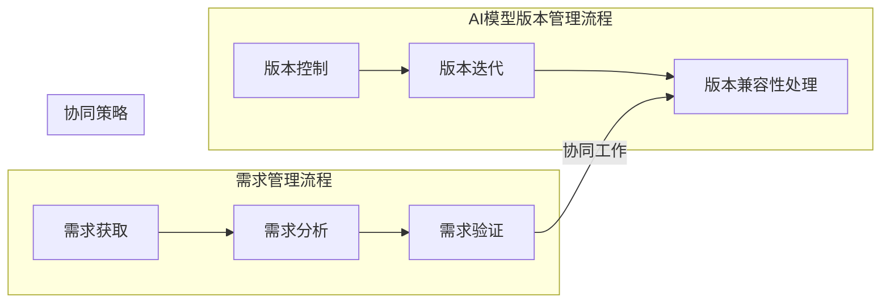
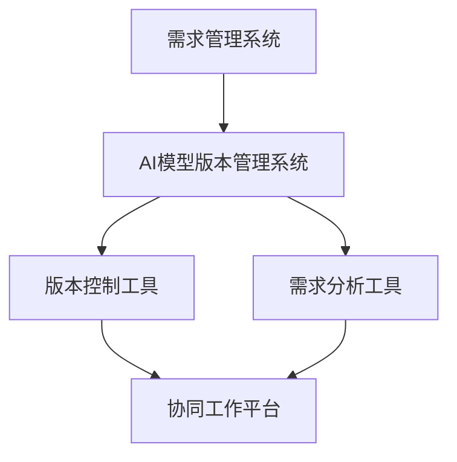
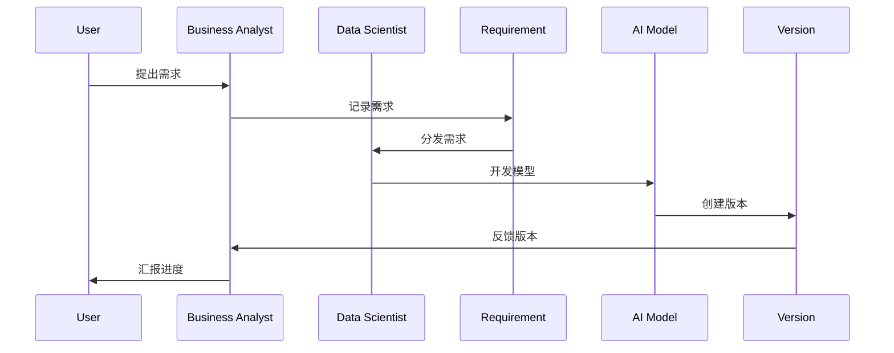
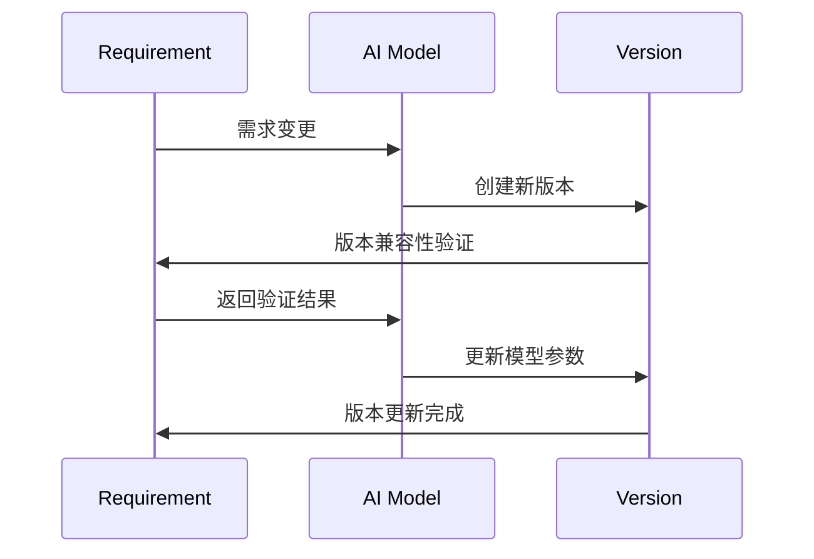

                 

# 需求与AI模型版本管理的协同策略

关键词：需求管理、AI模型版本管理、协同策略、流程设计、最佳实践

摘要：本文旨在探讨如何通过协同策略有效地整合需求管理与AI模型版本管理，从而实现更高效、更可靠的人工智能系统开发与维护。文章将从背景介绍、核心概念与联系、算法原理讲解、系统分析与架构设计方案、项目实战、最佳实践等方面进行详细阐述。

## 第1章 背景介绍

### 1.1 核心概念术语说明

在讨论需求与AI模型版本管理的协同策略之前，我们需要明确几个核心概念：

1. **需求管理**：涉及识别、分析和优先级排序用户需求的过程，以确保软件开发能够满足用户的实际需求。
2. **AI模型版本管理**：关注AI模型的版本控制、迭代和维护，确保模型在不同版本间的稳定性和兼容性。
3. **协同策略**：设计并实施一系列流程和技术，使需求管理与AI模型版本管理能够无缝衔接，协同工作。

### 1.2 问题背景

随着人工智能技术的快速发展，AI模型在各个领域的应用日益广泛。然而，如何有效地管理AI模型的需求和版本，成为了一个挑战。传统的需求管理流程和AI模型版本管理方法往往各自为政，缺乏有效的协同机制，导致开发效率低下、模型质量无法保证。

### 1.3 问题描述

主要问题包括：

- **需求变更频繁**：用户需求的变化可能导致AI模型频繁更新，影响模型稳定性和版本管理。
- **版本冲突**：不同版本的AI模型可能存在功能冲突，难以在系统中共存。
- **协同困难**：需求管理与AI模型版本管理之间的信息传递不畅，导致两者无法有效协同。

### 1.4 问题解决

通过实施协同策略，可以实现以下目标：

- **提高开发效率**：需求管理与版本管理协同工作，减少重复工作，提高整体开发效率。
- **保证模型质量**：确保AI模型的版本稳定性和兼容性，提高模型质量。
- **降低风险**：通过明确的协同流程和技术手段，降低需求变更和版本冲突带来的风险。

### 1.5 边界与外延

本文主要关注以下场景：

- **AI模型开发与维护**：涉及从模型设计到部署的整个生命周期。
- **跨团队协作**：强调不同团队（如需求分析师、数据科学家、工程师等）之间的协同合作。

### 1.6 概念结构与核心要素组成

**需求管理**：

- **需求获取**：收集用户需求。
- **需求分析**：分析并识别需求。
- **需求验证**：验证需求的有效性和可行性。

**AI模型版本管理**：

- **版本控制**：记录和管理模型的不同版本。
- **版本迭代**：对模型进行迭代更新。
- **版本兼容性**：确保不同版本之间的兼容性。

**协同策略**：

- **流程设计**：设计协同工作流程。
- **技术手段**：采用协同工具和技术。
- **团队协作**：促进跨团队的信息共享和沟通。

## 第2章 核心概念与联系

### 2.1 需求管理概述

#### 2.1.1 需求获取流程

需求获取是需求管理的第一步，主要任务是从用户、市场和其他渠道收集需求信息。以下是一个典型需求获取流程：

1. **需求调研**：通过访谈、问卷调查等方式收集用户需求。
2. **需求分类**：将收集到的需求进行分类，如功能需求、性能需求、安全需求等。
3. **需求优先级排序**：根据需求的紧急程度和重要性进行排序。

#### 2.1.2 需求分析方法

需求分析是理解需求并将其转化为可执行任务的过程。以下是一些常见的需求分析方法：

- **用户故事**：以用户为中心，描述用户需求的一种方法。
- **用例模型**：通过描述系统与外部用户之间的交互来理解需求。
- **功能分解**：将需求分解为具体的子功能，便于实现和管理。

#### 2.1.3 需求验证与确认

需求验证与确认是确保需求正确性和可行性的关键步骤。以下是一些常用的需求验证方法：

- **用户评审**：邀请用户参与需求评审，确保需求符合用户期望。
- **需求文档评审**：通过文档评审，检查需求文档的完整性和准确性。
- **原型验证**：通过构建原型系统，验证需求的可行性和用户满意度。

### 2.2 AI模型版本管理概述

#### 2.2.1 版本控制基础

版本控制是AI模型版本管理的基础，它涉及到对模型的不同版本进行记录和管理。以下是一个典型的版本控制流程：

1. **版本初始化**：创建模型的第一个版本。
2. **版本迭代**：对模型进行更新和优化，创建新的版本。
3. **版本备份**：定期备份模型版本，以防数据丢失或损坏。

#### 2.2.2 版本迭代策略

版本迭代是模型开发和优化的重要环节。以下是一些常用的版本迭代策略：

- **基于性能的迭代**：根据模型性能指标进行迭代，逐步优化模型。
- **基于数据的迭代**：根据新的数据集对模型进行迭代，提高模型的泛化能力。
- **基于反馈的迭代**：根据用户反馈对模型进行迭代，调整模型参数和功能。

#### 2.2.3 版本兼容性处理

版本兼容性是确保不同版本模型能够在同一系统中共存的关键。以下是一些常见的兼容性处理方法：

- **版本隔离**：将不同版本的模型部署在不同的环境中，避免版本冲突。
- **版本升级**：在更新模型时，确保新版本与旧版本在接口和数据格式上保持兼容。
- **版本回退**：在出现问题时，可以回退到之前的稳定版本。

### 2.3 协同策略的重要性

协同策略在需求管理和AI模型版本管理中扮演着重要角色。它能够确保两个领域之间的信息传递和协作顺畅，从而提高整体开发效率和质量。以下是一些协同策略的关键要素：

- **流程设计**：设计一个清晰的需求管理与版本管理协同工作流程，确保两个领域之间的工作能够无缝衔接。
- **技术手段**：采用协同工具和技术，如版本控制系统、项目管理工具等，提高协作效率。
- **团队协作**：促进不同团队之间的沟通和合作，确保需求管理和版本管理的协同工作能够顺利进行。

## 第3章 算法原理讲解

### 3.1 需求管理与AI模型版本管理协同算法的mermaid流程图



### 3.2 算法原理与数学模型

需求管理与AI模型版本管理的协同算法的核心是确保两个领域之间的信息传递和协作。以下是一个简化的算法原理：

1. **需求获取与版本初始化同步**：在需求获取阶段，同时初始化AI模型版本，确保两者同步开始。
2. **需求分析与版本迭代同步**：在需求分析过程中，实时更新AI模型版本，确保需求与模型之间的实时反馈。
3. **需求验证与版本兼容性处理同步**：在需求验证阶段，对AI模型进行兼容性处理，确保模型在不同版本间的稳定性和兼容性。

数学模型可以表示为：

$$
f(D, V) = \begin{cases}
    \text{需求满足度} & \text{if } D \text{ is verified} \\
    \text{版本兼容度} & \text{if } V \text{ is compatible}
\end{cases}
$$

其中，$D$ 代表需求集合，$V$ 代表版本集合。

### 3.3 算法举例说明

假设有一个需求：“提高模型的准确率”。在协同算法的作用下，需求分析阶段会实时反馈给AI模型开发团队，使其能够调整模型参数和算法，从而提高模型的准确率。在版本迭代过程中，开发团队会创建新版本，并在需求验证阶段进行测试，确保新版本满足需求。

## 第4章 系统分析与架构设计方案

### 4.1 问题场景介绍

在一个大型企业中，数据科学家团队负责开发AI模型，而业务分析师团队负责管理用户需求。两个团队之间的协作不畅，导致需求变更频繁，AI模型版本管理混乱，影响了项目的进度和质量。

### 4.2 系统功能设计（领域模型mermaid类图）

```mermaid
classDiagram
    User <<User>>
    Business Analyst <<Business Analyst>>
    Data Scientist <<Data Scientist>>
    Requirement <<Requirement>>
    AI Model <<AI Model>>
    Version <<Version>>

    User "1" --|> Business Analyst
    Business Analyst "1" --|> Requirement
    Data Scientist "1" --|> AI Model
    AI Model "1" --|> Version
```

### 4.3 系统架构设计（mermaid架构图）



### 4.4 系统接口设计（mermaid序列图）



### 4.5 系统交互（mermaid序列图）



## 第5章 项目实战

### 5.1 环境安装

1. 安装需求管理工具（如Jira）
2. 安装版本控制工具（如Git）
3. 安装AI模型版本管理工具（如TensorFlow Version Control）

### 5.2 系统核心实现源代码

```python
# 需求管理模块
class RequirementManager:
    def __init__(self):
        self.requirements = []

    def add_requirement(self, requirement):
        self.requirements.append(requirement)

    def get_requirements(self):
        return self.requirements

# AI模型版本管理模块
class AIModelManager:
    def __init__(self):
        self.models = []

    def add_model(self, model):
        self.models.append(model)

    def get_models(self):
        return self.models

# 协同策略模块
class CollaborationStrategy:
    def __init__(self, requirement_manager, ai_model_manager):
        self.requirement_manager = requirement_manager
        self.ai_model_manager = ai_model_manager

    def execute_strategy(self):
        requirements = self.requirement_manager.get_requirements()
        for requirement in requirements:
            # 根据需求更新模型
            model = self.ai_model_manager.get_models()[0]
            model.update(requirement)
```

### 5.3 代码应用解读与分析

```python
# 创建需求管理器
requirement_manager = RequirementManager()

# 添加需求
requirement_manager.add_requirement("提高模型准确率")

# 创建AI模型管理器
ai_model_manager = AIModelManager()

# 添加模型
ai_model_manager.add_model(Model())

# 创建协同策略
collaboration_strategy = CollaborationStrategy(requirement_manager, ai_model_manager)

# 执行协同策略
collaboration_strategy.execute_strategy()

# 验证模型更新
model = ai_model_manager.get_models()[0]
print(model.accuracy)  # 模型准确率
```

### 5.4 实际案例分析和详细讲解剖析

假设在一个实际项目中，用户反馈模型在特定数据集上的准确率较低，业务分析师提出了一个需求：“提高模型在特定数据集上的准确率”。协同策略通过以下步骤实现需求：

1. 业务分析师将需求添加到需求管理器中。
2. 需求管理器将需求分发到AI模型管理器。
3. AI模型管理器根据需求更新模型。
4. 模型更新后，进行验证，确保准确率提高。

通过这一过程，需求管理与AI模型版本管理实现了协同，提高了模型质量和开发效率。

### 5.5 项目小结

本案例展示了如何通过协同策略实现需求管理与AI模型版本管理的有效整合。通过明确的流程和协同工具，项目团队能够更高效地响应需求变化，提高模型质量，降低风险。

## 第6章 最佳实践

### 6.1 常见挑战与解决方案

**挑战**：

- **需求变更频繁**：解决方案：采用敏捷开发方法，灵活应对需求变更。
- **版本冲突**：解决方案：实施严格的版本控制，确保不同版本之间的兼容性。
- **协同困难**：解决方案：采用协同工具，如Jira和Git，提高团队协作效率。

### 6.2 成功案例分享

**案例1**：某大型互联网公司在AI模型开发中采用协同策略，实现了需求管理与版本管理的有效整合，提高了开发效率，降低了模型质量风险。

**案例2**：某医疗诊断公司通过协同策略，确保了AI模型在不同版本间的稳定性和兼容性，提高了诊断准确率。

### 6.3 最佳实践总结

- **采用敏捷开发方法**：灵活应对需求变更。
- **实施严格的版本控制**：确保模型稳定性和兼容性。
- **使用协同工具**：提高团队协作效率。

## 第7章 未来展望

### 7.1 趋势分析

随着人工智能技术的不断进步，需求管理与AI模型版本管理的协同策略将变得越来越重要。未来的发展趋势包括：

- **自动化协同**：通过人工智能技术，实现自动化协同，降低人工干预。
- **智能化版本控制**：利用机器学习技术，预测模型版本兼容性，提高版本管理效率。

### 7.2 未来挑战

- **数据隐私和安全**：在协同过程中，如何保护用户数据隐私和安全。
- **跨领域协同**：如何在更广泛的领域中实现需求管理与版本管理的协同。

### 7.3 持续改进策略

- **定期评估和优化**：定期评估协同策略的有效性，根据反馈进行优化。
- **引入新技术**：不断引入新技术，如区块链和分布式计算，提高协同策略的可靠性和安全性。

## 作者信息

作者：AI天才研究院/AI Genius Institute & 禅与计算机程序设计艺术 /Zen And The Art of Computer Programming

