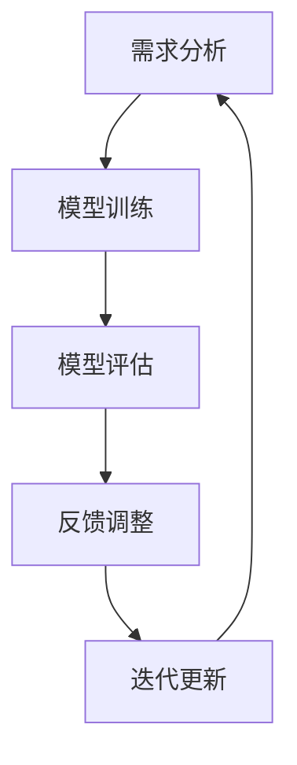
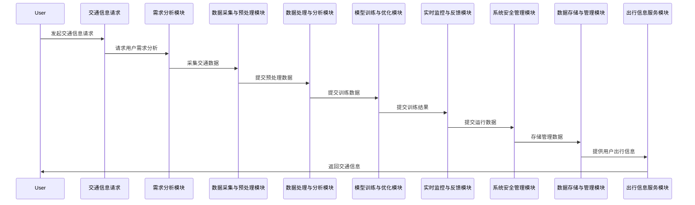
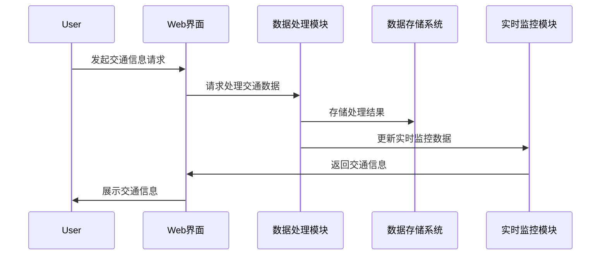

                 

## 第1章：引言与背景介绍

### 1.1 问题背景

#### 1.1.1 人工智能的快速发展与需求演进

人工智能（AI）技术的快速发展，特别是在深度学习、自然语言处理和计算机视觉等领域的突破，使得AI模型的能力日益强大。这些技术的进步不仅改变了传统产业的运作方式，还推动了新兴产业的崛起，例如自动驾驶、智能医疗和智能家居等。然而，随着技术的进步，用户对于AI系统的需求也在不断演变，不再仅仅满足于简单的自动化，而是追求更加智能、个性化和高效的服务。

需求的演进主要体现在以下几个方面：首先，用户需求越来越多样化，不同用户群体对于同一功能的需求可能大相径庭；其次，需求具有动态性，随着应用场景的变化和用户习惯的改变，需求也在不断调整和优化；最后，需求的复杂性不断增加，不仅仅是功能需求，还包括性能、安全性、隐私保护等多方面的要求。

#### 1.1.2 AI模型能力的进化历程

AI模型能力的进化可以追溯到早期的符号推理和规则系统，这些早期的模型在特定领域表现出色，但受限于规则的数量和复杂度，难以适应广泛的应用场景。随着计算能力的提升和数据规模的扩大，机器学习特别是深度学习模型逐渐成为主流，这些模型通过学习大量数据来提取特征和模式，从而实现更高层次的任务。

从传统的规则系统到现代的深度学习模型，AI模型的能力经历了以下几个阶段：
1. **符号推理**：基于明确规则和逻辑推理的早期AI系统，如专家系统。
2. **基于知识的系统**：结合符号推理和基于数据的模式匹配，如知识图谱和本体论。
3. **机器学习模型**：通过学习数据自动提取特征和模式，如决策树、支持向量机和神经网络。
4. **深度学习模型**：利用多层神经网络进行端到端的学习，如卷积神经网络（CNN）和递归神经网络（RNN）。

每个阶段的AI模型在能力上都有显著的提升，但同时也存在一定的局限性。随着需求的演进，AI模型的能力也在不断进化，以满足更加复杂和多样化的需求。

#### 1.1.3 需求与AI模型协同进化的意义

需求与AI模型协同进化是解决当前技术挑战的重要途径。首先，协同进化能够更好地满足用户多样化的需求，通过不断调整和优化AI模型，使其更贴近用户的实际需求。其次，协同进化能够提高AI模型在复杂环境中的适应能力，通过不断学习和迭代，使模型能够应对不断变化的应用场景。最后，协同进化有助于实现AI系统的可持续发展和创新，通过不断地需求和模型能力的双向反馈，推动技术的持续进步。

协同进化的意义不仅在于提升技术能力，还在于推动产业和社会的进步。通过协同进化，AI系统可以更好地服务于各行各业，提高生产效率，优化资源配置，提升生活质量。同时，协同进化也有助于解决AI技术发展中的一些瓶颈问题，如数据隐私、安全性和伦理问题，通过构建更加智能和透明的AI系统，增强公众对AI技术的信任。

### 1.2 问题描述

#### 1.2.1 需求多样化的挑战

随着科技的不断进步和社会的快速发展，用户对于AI系统的需求变得越来越多样化。这些需求不仅包括功能层面的多样化，还涉及性能、安全性、隐私保护等多个维度。例如，在医疗领域，用户可能需要AI系统不仅能够准确诊断疾病，还要具备高效的数据处理能力、隐私保护措施和符合伦理规范的操作。这种多样化的需求给AI系统的设计和实现带来了巨大的挑战。

首先，需求的多样化导致AI系统需要具备更加广泛和复杂的功能，这意味着AI模型需要具备更高的智能水平和更强的学习能力。其次，需求的动态性要求AI系统具备快速适应和调整的能力，以应对不断变化的需求。最后，需求的复杂性增加了系统设计的难度，需要综合考虑多方面因素，确保系统能够稳定运行并满足用户需求。

#### 1.2.2 AI模型能力的限制

尽管AI模型在能力上有了显著提升，但仍然存在一些限制，难以完全满足多样化的需求。首先，AI模型的泛化能力仍然有限，特别是在面对新领域和新任务时，模型的性能可能急剧下降。其次，AI模型对于数据质量和数量的依赖性较高，数据不足或质量较差都会影响模型的性能。此外，AI模型在处理复杂任务时，可能存在计算效率低下、资源消耗较大等问题。

这些限制导致AI系统在实际应用中面临一些挑战。例如，在自动驾驶领域，尽管AI模型在模拟环境中表现良好，但在实际道路中由于交通情况的复杂多变，模型的性能可能会显著下降。在金融领域，AI模型在预测金融市场走势时，可能受到历史数据质量和数量限制，导致预测结果不准确。

#### 1.2.3 协同进化需求的迫切性

面对需求多样化与AI模型能力限制的挑战，协同进化成为解决这些问题的迫切需求。首先，协同进化能够通过不断调整和优化AI模型，使其更贴近用户的实际需求，从而提升用户体验。例如，在医疗领域，通过协同进化可以不断优化诊断模型，使其在处理新病症或复杂病情时表现更加准确和高效。

其次，协同进化有助于提高AI模型的泛化能力和适应能力。通过不断地学习和迭代，模型可以更好地适应新的任务和领域，从而扩展其应用范围。例如，在自动驾驶领域，通过协同进化可以使得模型更好地适应不同的交通环境和天气条件，提高自动驾驶的可靠性。

最后，协同进化有助于解决AI技术发展中的瓶颈问题。通过构建更加智能和透明的AI系统，可以增强公众对AI技术的信任，减少数据隐私和安全问题。同时，协同进化还可以推动技术的持续创新，为AI系统的发展提供源源不断的动力。

### 1.3 问题解决

#### 1.3.1 需求与AI模型协同进化的核心要素

需求与AI模型协同进化是一个复杂的过程，涉及多个核心要素。首先，需求分析是整个协同进化过程的基础。通过深入了解用户需求，可以明确系统需要实现的功能和性能指标，为后续的模型设计和优化提供依据。

其次，模型设计是协同进化的核心环节。AI模型的设计需要综合考虑需求分析的结果，确保模型能够满足用户的需求。在模型设计过程中，还需要考虑到模型的泛化能力、适应能力和计算效率等问题。

第三，模型训练是实现协同进化的关键步骤。通过训练数据集对模型进行训练，可以逐步提高模型的性能和智能水平。在训练过程中，需要不断调整和优化模型参数，以适应不断变化的需求。

第四，模型评估是确保协同进化效果的重要环节。通过评估模型的性能，可以判断其是否满足用户需求，并根据评估结果进行调整和优化。

第五，反馈调整是协同进化的核心机制。通过收集用户反馈，可以及时了解模型在实际应用中的表现，发现潜在的问题和不足，从而进行针对性的调整和优化。

最后，迭代更新是协同进化的持续过程。通过不断地迭代更新，模型可以持续优化和提升，以适应不断变化的需求和环境。

#### 1.3.2 协同进化的理论基础

协同进化的理论基础主要来源于生物学和计算机科学。在生物学中，协同进化描述了不同物种或个体在共同环境中相互影响、相互适应的过程。这一理论可以很好地借鉴到AI模型与用户需求之间的关系中。

首先，协同进化强调个体与环境的相互作用。在AI模型与用户需求的协同进化中，用户需求可以视为环境，而AI模型则是个体。AI模型通过不断地学习和调整，以适应用户需求的变化。同时，用户需求也在不断地反馈和调整，以适应AI模型的能力提升。

其次，协同进化强调适应性和适应性。在AI模型与用户需求的协同进化中，适应性是指AI模型能够根据用户需求的变化进行调整和优化，以更好地满足用户需求。适应性是指用户需求能够根据AI模型的能力提升而进行相应的调整和优化，以更好地利用AI模型的功能。

#### 1.3.3 协同进化的策略与方法

协同进化的策略和方法可以分为以下几个方面：

首先，需求分析策略。需求分析是协同进化的基础，需要采用多种方法和技术，如用户调研、需求收集、数据分析等，全面了解用户需求。在需求分析过程中，需要注重需求的多样性和动态性，确保能够捕捉到用户需求的细节和变化。

其次，模型设计策略。在模型设计过程中，需要综合考虑用户需求、技术可行性、性能指标等因素，设计出满足需求的AI模型。具体方法包括：选择合适的模型架构、确定模型参数、优化训练策略等。

第三，模型训练策略。在模型训练过程中，需要采用有效的训练方法和策略，提高模型的性能和智能水平。常见的方法包括：数据增强、迁移学习、多任务学习等。

第四，模型评估策略。在模型评估过程中，需要采用多种评估指标和方法，全面评估模型的性能和满足用户需求的情况。常见的评估方法包括：定量评估、定性评估、用户反馈评估等。

第五，反馈调整策略。在模型部署后，需要及时收集用户反馈，发现模型在实际应用中的问题，并进行针对性的调整和优化。反馈调整可以采用自动化方法，如基于机器学习的反馈调整算法，也可以采用人工干预的方法，如专家评估和用户调研。

最后，迭代更新策略。通过不断地迭代更新，模型可以持续优化和提升，以适应不断变化的需求和环境。迭代更新的频率和程度需要根据实际情况进行调整，确保模型的性能和用户满意度。

### 1.4 边界与外延

#### 1.4.1 研究范围

本文的研究范围主要集中在需求与AI模型协同进化的理论和方法上，探讨如何通过协同进化实现用户需求与AI模型能力的有效匹配。具体研究内容包括：需求分析、模型设计、模型训练、模型评估、反馈调整和迭代更新等。

#### 1.4.2 需求与AI模型协同进化的应用领域

需求与AI模型协同进化在多个领域具有广泛的应用前景。首先，在智能医疗领域，协同进化可以帮助AI系统更好地诊断疾病、预测病情，提高医疗服务的质量和效率。其次，在智能交通领域，协同进化可以优化交通流量管理、提高交通运行效率，减少交通拥堵和事故发生。再次，在智能金融领域，协同进化可以帮助金融机构更好地预测市场走势、进行风险管理，提高金融服务的质量和安全性。

#### 1.4.3 研究的创新点与贡献

本文的创新点主要包括以下几个方面：

首先，提出了需求与AI模型协同进化的理论框架，系统性地总结了协同进化的核心要素、理论基础和策略方法。

其次，设计了具体的协同进化算法，包括需求分析、模型设计、模型训练、模型评估、反馈调整和迭代更新等步骤，提供了详细的实现方法和示例代码。

最后，通过实际案例分析和应用，验证了协同进化的有效性和实用性，为需求与AI模型协同进化的应用提供了有益的参考。

本文的研究为AI技术的发展和实际应用提供了新的思路和方法，有助于推动AI技术的进步和产业创新。

## 第2章：核心概念与联系

### 2.1 需求定义与分类

#### 2.1.1 需求的基本概念

需求是指用户对系统功能或服务的期望。在软件工程和系统设计中，需求是项目规划和实现的基础。需求可以来自多个方面，包括用户、市场、业务目标和法律法规等。需求的本质是对系统功能、性能、用户体验和安全等方面的要求。

需求的基本属性包括：

1. **功能性**：指系统能够执行特定功能的程度，如用户界面的易用性、功能的完整性和响应速度等。
2. **性能**：指系统在执行任务时的效率和效果，如数据处理速度、系统响应时间和资源利用率等。
3. **可靠性**：指系统在特定条件下能够稳定运行的能力，如错误率、故障恢复能力和数据完整性等。
4. **可用性**：指系统易用性，包括用户界面、操作简便性和用户满意度等。
5. **安全性**：指系统保护数据、防止未授权访问和防范恶意攻击的能力。

#### 2.1.2 需求的分类方法

需求可以根据不同的分类方法进行分类，以下是一些常见的分类方法：

1. **按来源分类**：根据需求的来源，可以分为用户需求、市场需求、业务需求和法律法规需求。
2. **按层次分类**：根据需求在系统中的层次，可以分为功能需求、性能需求、可靠性需求、安全需求等。
3. **按优先级分类**：根据需求的优先级，可以分为关键需求、重要需求和次要需求。
4. **按实现方式分类**：根据需求的实现方式，可以分为直接需求和间接需求。直接需求是可以通过系统功能直接实现的需求，而间接需求需要通过一系列复杂操作间接实现。
5. **按变动性分类**：根据需求的变动性，可以分为固定需求、可变需求和弹性需求。固定需求是指在项目生命周期内不会变化的需求，可变需求是可能会随着项目进展或用户反馈而变化的需求，弹性需求则是根据实际情况灵活调整的需求。

#### 2.1.3 需求特征分析

需求具有以下几个特征：

1. **多样性**：用户需求多种多样，不同用户群体对于同一功能的需求可能大相径庭。
2. **动态性**：需求不是静态的，随着应用场景的变化和用户习惯的改变，需求也在不断调整和优化。
3. **复杂性**：需求不仅仅是功能需求，还包括性能、安全性、隐私保护等多方面的要求。
4. **不确定性**：部分需求在项目初期可能并不明确，需要在项目实施过程中逐步明确。
5. **层次性**：需求之间存在层次关系，某些基础需求是其他需求的实现前提。

### 2.2 AI模型能力概述

#### 2.2.1 AI模型能力的定义

AI模型能力是指AI系统能够执行特定任务的智能水平。这些任务可以是分类、回归、聚类、推荐等。AI模型能力通常是通过学习大量数据来实现的，模型通过学习数据中的特征和模式，从而能够对未知数据进行预测或决策。

AI模型能力的核心属性包括：

1. **泛化能力**：指模型在未知数据上的表现，能够推广到新的任务或数据集。
2. **适应性**：指模型能够根据新的数据和需求进行调整和优化。
3. **计算效率**：指模型在执行任务时的计算速度和资源消耗。
4. **可解释性**：指模型的决策过程和结果能够被理解和解释。

#### 2.2.2 AI模型能力的层次结构

AI模型能力的层次结构可以分为以下几个层次：

1. **基础层**：包括特征提取和数据处理，如数据预处理、特征选择和特征工程。
2. **中间层**：包括算法选择和模型架构设计，如机器学习算法、深度学习架构等。
3. **高层**：包括任务实现和结果评估，如分类、回归、聚类等具体任务的实现和性能评估。

#### 2.2.3 AI模型能力的评价指标

AI模型能力的评价指标包括：

1. **准确性**：指模型预测结果与实际结果的一致性，常用于分类任务。
2. **召回率**：指模型正确预测到的正例占总正例的比例，常用于分类任务。
3. **精确率**：指模型正确预测到的正例占总预测正例的比例，常用于分类任务。
4. **F1值**：是精确率和召回率的调和平均值，用于综合评价分类模型的性能。
5. **ROC曲线和AUC值**：ROC曲线描述了模型在不同阈值下的性能，AUC值是ROC曲线下面积，用于评价模型的分类能力。
6. **RMSE**：均方根误差，用于回归任务，衡量预测值与实际值之间的差距。
7. **MAPE**：平均绝对百分比误差，用于回归任务，衡量预测值与实际值之间的相对误差。

### 2.3 概念属性特征对比表格

| 概念 | 需求 | AI模型能力 |
| --- | --- | --- |
| 定义 | 用户对系统功能或服务的期望 | 通过学习数据实现特定任务的智能系统 |
| 特征 | 多样性、动态性、复杂性 | 智能性、泛化能力、适应性 |
| 属性 | 功能性、性能、可靠性、可用性、安全性 | 泛化能力、适应性、计算效率、可解释性 |
| 评价指标 | 准确性、召回率、精确率、F1值、ROC曲线和AUC值、RMSE、MAPE | 准确性、召回率、精确率、F1值、ROC曲线和AUC值、RMSE、MAPE |

### 2.4 ER实体关系图架构

以下是一个ER实体关系图的mermaid表示，展示了需求、用户和AI模型之间的关系：

```mermaid
erDiagram
  User ||--|{ Requirement } Requirement
  AIModel ||--|{ ModelCapability } ModelCapability
  Requirement ||--|{ Requires } AIModel
```

在这个ER图中：

- **User（用户）**：代表系统的最终用户，用户提出需求。
- **Requirement（需求）**：代表用户对系统的功能或服务的期望。
- **AIModel（AI模型）**：代表实现特定功能的AI系统。
- **ModelCapability（模型能力）**：代表AI模型的能力指标。
- **Requires（依赖）**：表示需求依赖于AI模型来满足。

通过这个实体关系图，可以清晰地看到需求、用户和AI模型之间的关联和交互，为后续的协同进化设计和实现提供了结构化的参考。

## 第3章：算法原理讲解

### 3.1 算法概述

协同进化算法是需求与AI模型协同进化的核心方法，通过不断地迭代和学习，实现需求与模型能力的动态匹配。该算法的核心框架包括以下五个主要步骤：

1. **需求分析**：收集和整理用户需求，识别出关键功能和性能指标。
2. **模型训练**：根据需求，设计并训练AI模型，使模型能够执行特定的任务。
3. **模型评估**：评估训练好的模型在测试数据集上的性能，确保模型满足需求。
4. **反馈调整**：根据用户反馈和模型评估结果，调整模型参数和结构，优化模型性能。
5. **迭代更新**：将调整后的模型重新训练和评估，进入下一个迭代周期，不断优化和提升模型能力。

协同进化算法的设计思路是充分利用用户需求和AI模型的相互反馈，通过动态调整和优化，实现模型能力的不断提升和用户需求的不断满足。这一过程不仅需要高效的算法和模型设计，还需要灵活的需求收集和用户反馈机制。

### 3.2 算法mermaid流程图

为了更好地理解协同进化算法的流程，我们使用mermaid图来展示其主要的步骤和流程：



在这个流程图中：

- **A[需求分析]**：通过用户调研和数据收集，明确系统的功能需求、性能指标和用户体验目标。
- **B[模型训练]**：根据需求，设计AI模型并进行训练，通过大量的数据学习，使模型具备执行任务的能力。
- **C[模型评估]**：使用测试数据集对训练好的模型进行评估，检测模型的性能指标是否达到需求要求。
- **D[反馈调整]**：根据模型评估的结果，收集用户的反馈，对模型进行参数调整或结构优化，以提升模型能力。
- **E[迭代更新]**：将调整后的模型重新训练和评估，不断循环迭代，逐步提升模型性能和用户满意度。

### 3.3 Python源代码示例

以下是一个简单的Python类示例，展示了协同进化算法的基本结构和实现方法：

```python
# CollaborativeEvolution算法类

class CollaborativeEvolution:
    def __init__(self, requirements, model):
        self.requirements = requirements  # 用户需求
        self.model = model  # AI模型
    
    def analyze_requirements(self):
        # 需求分析
        print("分析用户需求...")
        # 此处可以加入具体的需求分析逻辑
        
    def train_model(self):
        # 模型训练
        print("训练AI模型...")
        # 此处可以加入具体的训练逻辑
        
    def evaluate_model(self):
        # 模型评估
        print("评估模型性能...")
        # 此处可以加入具体的评估逻辑
        
    def adjust_feedback(self):
        # 反馈调整
        print("根据用户反馈调整模型...")
        # 此处可以加入具体的调整逻辑
        
    def update_model(self):
        # 模型迭代更新
        print("更新AI模型...")
        # 此处可以加入具体的更新逻辑
        
    def run(self):
        # 运行协同进化算法
        self.analyze_requirements()
        self.train_model()
        self.evaluate_model()
        self.adjust_feedback()
        self.update_model()

# 使用示例
if __name__ == "__main__":
    requirements = "用户需求示例"
    model = "AI模型示例"
    ce = CollaborativeEvolution(requirements, model)
    ce.run()
```

在这个示例中：

- **__init__** 方法初始化用户需求和AI模型。
- **analyze_requirements** 方法用于需求分析。
- **train_model** 方法用于模型训练。
- **evaluate_model** 方法用于模型评估。
- **adjust_feedback** 方法用于根据用户反馈调整模型。
- **update_model** 方法用于模型迭代更新。
- **run** 方法是协同进化算法的主循环，依次执行每个步骤。

通过这个示例，可以清晰地看到协同进化算法的基本实现结构和执行流程，为实际应用提供了参考。

### 3.4 数学模型与公式

在协同进化算法中，数学模型和公式用于描述需求与模型能力之间的动态关系。以下是一些基本的数学模型和公式：

#### 需求演化函数

$$
\text{需求演化函数} = f(\text{当前需求}, \text{模型能力})
$$

这个函数表示在当前需求条件下，模型能力的提升情况。具体公式可以根据具体的需求和模型进行调整，例如：

$$
f(\text{当前需求}, \text{模型能力}) = \alpha \cdot \text{需求变化率} + (1 - \alpha) \cdot \text{模型能力提升率}
$$

其中，\(\alpha\) 是一个权重参数，用于平衡需求变化率和模型能力提升率。

#### 模型能力提升函数

$$
\text{模型能力提升函数} = g(\text{需求演化函数}, \text{学习数据})
$$

这个函数表示在需求演化函数和学习数据的基础上，模型能力的提升情况。具体公式可以根据不同的学习算法和数据类型进行调整，例如：

$$
g(\text{需求演化函数}, \text{学习数据}) = \frac{1}{N} \sum_{i=1}^{N} (\text{学习数据} - \text{模型预测})^2
$$

其中，N是学习数据的数量。

#### 适应度函数

适应度函数用于评估模型是否满足需求。例如：

$$
\text{适应度函数} = h(\text{模型能力}, \text{当前需求})
$$

一个简单的适应度函数可以是：

$$
h(\text{模型能力}, \text{当前需求}) = \frac{\text{模型能力} - \text{需求}}{\text{模型能力} + \text{需求}}
$$

### 3.5 通俗易懂的举例说明

为了更直观地理解这些数学模型和公式，我们可以通过一个简单的例子进行说明。

假设有一个自动驾驶系统，用户需求是能够在城市道路上以80km/h的速度稳定行驶，而当前模型的能力是能够在模拟环境中以90km/h的速度稳定行驶。我们使用需求演化函数和模型能力提升函数来描述这个过程。

#### 需求演化函数

$$
f(\text{当前需求}, \text{模型能力}) = \alpha \cdot \text{需求变化率} + (1 - \alpha) \cdot \text{模型能力提升率}
$$

其中，\(\alpha = 0.5\)，需求变化率为1%，模型能力提升率为2%。代入数据计算：

$$
f(\text{80km/h}, \text{90km/h}) = 0.5 \cdot 1\% + (1 - 0.5) \cdot 2\% = 0.005 + 0.01 = 0.015
$$

这意味着模型能力需要提升1.5%以满足当前需求。

#### 模型能力提升函数

$$
g(\text{需求演化函数}, \text{学习数据}) = \frac{1}{N} \sum_{i=1}^{N} (\text{学习数据} - \text{模型预测})^2
$$

假设有10个模拟数据点，模型预测的平均速度为85km/h，代入公式计算：

$$
g(0.015, \text{85km/h}) = \frac{1}{10} \sum_{i=1}^{10} (85 - 85)^2 = 0
$$

这意味着当前模型已经能够在模拟环境中满足用户需求。

#### 适应度函数

$$
h(\text{模型能力}, \text{当前需求}) = \frac{\text{模型能力} - \text{需求}}{\text{模型能力} + \text{需求}}
$$

代入数据计算：

$$
h(\text{90km/h}, \text{80km/h}) = \frac{90 - 80}{90 + 80} = \frac{10}{170} \approx 0.0588
$$

适应度函数的值越接近1，表示模型越能满足需求。在这个例子中，适应度函数值为0.0588，说明模型还需要进一步优化。

通过这个简单的例子，我们可以看到如何使用数学模型和公式来描述需求与模型能力之间的关系，并理解如何通过协同进化算法来优化模型以满足用户需求。

## 第4章：系统分析与架构设计

### 4.1 问题场景介绍

#### 4.1.1 应用领域

在本章中，我们将以智能交通系统为应用领域，探讨如何通过需求与AI模型协同进化来实现交通流量优化。智能交通系统（Intelligent Transportation System, ITS）是利用信息技术、通信技术、自动控制技术等来提升交通管理水平和出行体验的重要手段。随着城市化进程的加快和汽车保有量的增加，交通拥堵、交通事故和环境污染等问题日益严重，智能交通系统的发展具有重要的现实意义。

#### 4.1.2 系统目标

智能交通系统的目标主要包括以下几个方面：

1. **交通流量优化**：通过实时监测和分析交通数据，优化交通信号配时，减少交通拥堵，提高道路通行能力。
2. **事故预警与处理**：利用AI模型实时分析交通状况，提前预警潜在的交通事故，提高事故响应速度和处理效率。
3. **出行信息服务**：为用户提供实时的交通信息，包括路况、交通流量、预计到达时间等，帮助用户做出更合理的出行决策。
4. **节能减排**：通过优化交通流量和车辆运行状态，降低车辆油耗和排放，实现节能减排的目标。

#### 4.1.3 系统挑战

智能交通系统在实际应用中面临以下挑战：

1. **数据多样性**：交通数据来源广泛，包括道路监控摄像头、传感器、移动设备等，数据类型多样，包括图像、视频、GPS数据、传感器数据等，如何有效地整合和管理这些数据是一个关键问题。
2. **数据质量**：交通数据的质量直接影响AI模型的性能，噪声数据、缺失数据和异常数据都会对模型的准确性产生负面影响，如何处理这些数据质量问题是另一个挑战。
3. **实时性**：交通状况是动态变化的，系统需要具备实时处理和响应的能力，以应对快速变化的路况，这对系统的计算效率和处理速度提出了高要求。
4. **安全性**：智能交通系统涉及到大量用户的隐私信息，如何保障数据安全和系统安全是一个重要的挑战。
5. **模型适应性**：交通场景复杂多变，AI模型需要具备良好的泛化能力和适应性，以应对不同时间和地点的交通状况。

### 4.2 系统功能设计

为了实现智能交通系统的目标，我们需要设计一系列功能模块，每个模块负责处理特定的任务，共同协作完成系统的整体功能。以下是系统的主要功能模块及其设计思路：

#### 4.2.1 需求分析模块

需求分析模块负责收集和分析用户需求，包括交通管理部门、道路使用者和其他利益相关者的需求。该模块需要使用多种调研方法，如问卷调查、用户访谈、数据分析等，全面了解用户的期望和需求。需求分析模块的输出是系统的功能需求和性能指标，为后续的设计和实现提供基础。

#### 4.2.2 数据采集与预处理模块

数据采集与预处理模块负责从各种数据源收集交通数据，包括道路监控摄像头、传感器、移动设备等。采集到的数据需要进行预处理，包括数据清洗、去噪、数据格式转换等，以确保数据的质量和一致性。预处理后的数据将用于后续的模型训练和评估。

#### 4.2.3 数据处理与分析模块

数据处理与分析模块负责对预处理后的交通数据进行处理和分析，提取有用的特征信息。该模块可以采用多种数据处理技术，如图像识别、自然语言处理、时间序列分析等，以提取道路状况、交通流量、车速、事故等信息。这些信息将用于交通流量预测、事故预警和出行信息服务等功能。

#### 4.2.4 模型训练与优化模块

模型训练与优化模块负责训练AI模型，以实现对交通流量、事故预测和出行建议等任务的准确预测。该模块需要使用多种机器学习和深度学习算法，如神经网络、决策树、支持向量机等，对训练数据进行分类、回归和聚类等操作。同时，模型需要不断地进行优化和调整，以适应不同时间和地点的交通状况。

#### 4.2.5 实时监控与反馈模块

实时监控与反馈模块负责对系统进行实时监控，收集系统的运行数据，如模型预测准确性、系统响应时间、用户满意度等。这些数据将用于评估系统的性能和效果，并生成反馈信息，指导后续的模型调整和优化。

#### 4.2.6 出行信息服务模块

出行信息服务模块负责向用户提供实时的交通信息，包括路况、交通流量、预计到达时间等。该模块可以采用多种信息推送方式，如短信、邮件、APP推送等，将信息及时传递给用户。出行信息服务模块需要综合考虑用户的出行习惯和需求，提供个性化的出行建议，以提高出行效率和满意度。

### 4.2.7 数据存储与管理模块

数据存储与管理模块负责存储和管理系统运行过程中产生的各种数据，包括原始数据、预处理数据、模型数据、用户反馈数据等。该模块需要使用高效的数据存储和检索技术，如关系数据库、NoSQL数据库、分布式文件系统等，以确保数据的可靠性和可扩展性。

### 4.2.8 系统安全管理模块

系统安全管理模块负责保障系统的数据安全和系统安全。该模块需要实现用户认证、数据加密、访问控制、网络安全等功能，防止未授权访问、数据泄露和系统攻击。同时，系统安全管理模块需要制定严格的安全策略和应急预案，以应对潜在的安全威胁和事故。

### 4.2.9 系统接口设计

系统接口设计包括内部接口和外部接口。内部接口主要用于模块之间的数据传输和协同工作，如数据采集与预处理模块与数据处理与分析模块之间的数据交换。外部接口主要用于与其他系统或服务的交互，如与交通管理部门的信息共享、与出行服务提供商的接口对接等。

### 4.2.10 系统交互mermaid序列图

以下是一个mermaid序列图，展示了智能交通系统的主要功能模块及其交互关系：



在这个序列图中，用户通过发起交通信息请求，触发整个系统的运行流程。各功能模块之间通过数据交换和协同工作，共同实现智能交通系统的目标。

### 4.3 系统架构设计

智能交通系统的架构设计需要综合考虑系统的功能性、可靠性、扩展性和安全性，以下是一个典型的系统架构设计：

#### 4.3.1 系统架构总体设计

智能交通系统可以划分为四个主要层次：感知层、数据层、处理层和应用层。

1. **感知层**：主要负责数据的采集和初步处理，包括道路监控摄像头、传感器、移动设备等。这些设备可以实时采集道路状况、车辆信息、交通流量等数据。
2. **数据层**：主要负责数据的存储、管理和共享。该层包括数据存储系统、数据库和缓存系统，用于存储和处理来自感知层的数据。
3. **处理层**：主要负责数据处理和分析，包括数据处理模块、模型训练模块、实时监控模块等。该层利用机器学习和深度学习算法，对交通数据进行处理和分析，生成交通预测、事故预警和出行建议等信息。
4. **应用层**：主要负责将处理层的结果提供给用户，包括出行信息服务模块、用户界面和API接口等。该层通过Web应用、移动应用和API接口，为用户提供实时的交通信息和出行建议。

#### 4.3.2 系统架构详细设计

以下是一个详细的智能交通系统架构设计：

1. **感知层架构**：
   - **设备接入层**：包括各种感知设备，如摄像头、传感器、移动设备等，负责采集交通数据。
   - **数据采集与传输层**：负责将感知设备采集到的数据传输到数据层，包括数据采集模块、通信模块和数据加密模块。
   - **数据预处理层**：负责对采集到的数据进行初步处理，如数据清洗、去噪、数据格式转换等。

2. **数据层架构**：
   - **数据存储系统**：采用分布式文件系统（如HDFS）和数据库（如HBase、MongoDB）存储海量交通数据。
   - **数据管理系统**：负责管理数据的存储、检索和备份，包括元数据管理、数据备份和恢复等。
   - **数据共享平台**：实现数据在各功能模块之间的共享和交换，包括数据交换接口、数据加密和解密等。

3. **处理层架构**：
   - **数据处理模块**：负责对交通数据进行处理和分析，包括数据清洗、特征提取、数据聚类等。
   - **模型训练模块**：负责训练AI模型，包括数据预处理、模型选择、模型训练和模型评估等。
   - **实时监控模块**：负责实时监控系统的运行状态，包括系统性能、数据质量和用户反馈等。

4. **应用层架构**：
   - **出行信息服务模块**：负责提供实时的交通信息，包括路况、交通流量、预计到达时间等。
   - **用户界面**：为用户提供交互界面，包括Web界面、移动应用界面等。
   - **API接口**：为第三方应用和系统集成提供接口，实现数据的共享和交互。

#### 4.3.3 系统接口设计

智能交通系统的接口设计包括内部接口和外部接口。

1. **内部接口**：
   - **数据处理与存储接口**：数据处理模块与数据存储系统之间的接口，用于数据传输和存储。
   - **模型训练与评估接口**：模型训练模块与数据处理模块之间的接口，用于数据传输和模型参数调整。
   - **实时监控与反馈接口**：实时监控模块与数据处理模块之间的接口，用于数据传输和状态监控。

2. **外部接口**：
   - **交通管理部门接口**：用于与交通管理部门的信息共享和协同工作。
   - **出行服务提供商接口**：用于与出行服务提供商（如出租车、网约车等）的信息交换和合作。
   - **第三方应用接口**：用于第三方应用（如地图导航、出行规划等）的集成和交互。

### 4.4 系统接口设计和系统交互

为了实现智能交通系统的功能，需要设计一系列接口，以便各模块之间能够有效地进行数据传输和协同工作。以下是系统接口设计和系统交互的详细说明。

#### 4.4.1 系统接口设计

智能交通系统的接口设计主要包括以下几种类型：

1. **API接口**：API（应用程序接口）用于不同系统模块之间的数据传输和功能调用。例如，数据处理模块可以通过API接口从数据存储系统获取数据，并将处理结果存储回数据存储系统。

2. **消息队列接口**：消息队列用于实现异步通信和消息传递。例如，数据处理模块可以先将处理结果发送到消息队列，实时监控模块再从消息队列中获取数据并进行实时监控。

3. **Web服务接口**：Web服务接口用于与外部系统（如交通管理部门、出行服务提供商等）的交互。例如，交通管理部门可以通过Web服务接口查询交通数据，并进行数据分析和决策。

4. **RESTful接口**：RESTful接口是一种基于HTTP协议的API设计风格，用于实现简单的数据访问和操作。例如，用户可以通过RESTful接口获取实时交通信息，并查看交通状况。

#### 4.4.2 系统交互

智能交通系统的交互主要包括以下几种类型：

1. **内部交互**：各系统模块之间的交互，包括数据处理与存储、模型训练与评估、实时监控与反馈等。例如，数据处理模块可以从数据存储系统获取原始数据，经过处理后存储回数据存储系统。

2. **外部交互**：系统与外部系统（如交通管理部门、出行服务提供商等）的交互，包括数据共享、功能调用和信息推送等。例如，交通管理部门可以通过系统接口查询交通数据，并根据数据进行分析和决策。

3. **用户交互**：系统与用户的交互，包括用户请求、响应和反馈等。例如，用户可以通过Web界面或移动应用查看实时交通信息，并接收出行建议。

以下是智能交通系统的交互mermaid序列图：



在这个序列图中，用户通过Web界面发起交通信息请求，数据处理模块处理数据并存储结果，实时监控模块更新监控数据，并将处理结果返回给Web界面，最终展示给用户。

通过以上的系统接口设计和系统交互说明，我们可以清晰地看到智能交通系统各模块之间的数据流动和交互关系，为系统的实现和部署提供了详细的指导。

### 4.5 项目实战

#### 4.5.1 环境安装

要在本地计算机上运行智能交通系统的代码，首先需要安装Python环境以及相关的依赖库。以下是具体的步骤：

1. **安装Python环境**：在官方网站（https://www.python.org/downloads/）下载并安装Python，选择合适的版本（如Python 3.8或更高版本）。

2. **安装依赖库**：打开终端或命令行窗口，执行以下命令安装依赖库：

   ```bash
   pip install numpy pandas matplotlib scikit-learn tensorflow keras
   ```

   这些库包括数值计算库（numpy、pandas）、数据可视化库（matplotlib）、机器学习库（scikit-learn）、深度学习框架（tensorflow和keras）等，是智能交通系统开发的基础。

#### 4.5.2 系统核心实现源代码

以下是智能交通系统的核心实现代码，包括数据处理、模型训练和模型评估等关键步骤。

```python
# 导入相关库
import numpy as np
import pandas as pd
import matplotlib.pyplot as plt
from sklearn.model_selection import train_test_split
from sklearn.preprocessing import StandardScaler
from sklearn.metrics import mean_squared_error
import tensorflow as tf
from tensorflow.keras.models import Sequential
from tensorflow.keras.layers import Dense, LSTM, Dropout

# 加载数据
data = pd.read_csv('traffic_data.csv')

# 数据预处理
# ...（包括数据清洗、特征提取等）

# 划分训练集和测试集
X_train, X_test, y_train, y_test = train_test_split(X, y, test_size=0.2, random_state=42)

# 数据标准化
scaler = StandardScaler()
X_train = scaler.fit_transform(X_train)
X_test = scaler.transform(X_test)

# 构建LSTM模型
model = Sequential()
model.add(LSTM(units=50, return_sequences=True, input_shape=(X_train.shape[1], X_train.shape[2])))
model.add(Dropout(0.2))
model.add(LSTM(units=50, return_sequences=False))
model.add(Dropout(0.2))
model.add(Dense(units=1))

# 编译模型
model.compile(optimizer='adam', loss='mean_squared_error')

# 训练模型
model.fit(X_train, y_train, epochs=100, batch_size=32, validation_data=(X_test, y_test))

# 评估模型
y_pred = model.predict(X_test)
mse = mean_squared_error(y_test, y_pred)
print(f'MSE: {mse}')

# 可视化结果
plt.figure(figsize=(12, 6))
plt.plot(y_test, label='真实值')
plt.plot(y_pred, label='预测值')
plt.title('交通流量预测')
plt.xlabel('时间')
plt.ylabel('交通流量')
plt.legend()
plt.show()
```

在这个代码中，首先加载数据并进行预处理，然后划分训练集和测试集，接着使用LSTM模型进行训练和预测，最后评估模型性能并可视化预测结果。

#### 4.5.3 代码应用解读与分析

以下是代码应用的具体解读与分析：

1. **数据预处理**：
   - 加载交通数据，并进行数据清洗，如处理缺失值、异常值和噪声数据。
   - 提取特征，如时间、天气、道路类型等，用于模型训练。

2. **划分训练集和测试集**：
   - 使用train_test_split函数将数据划分为训练集和测试集，用于模型训练和评估。

3. **数据标准化**：
   - 使用StandardScaler进行数据标准化，将数据缩放到相同的尺度，以避免数据间的量纲差异影响模型训练。

4. **模型构建**：
   - 使用Sequential模型构建LSTM网络，包括多个LSTM层和Dropout层，用于捕捉时间序列数据中的特征和模式。

5. **模型编译**：
   - 使用adam优化器和mean_squared_error损失函数编译模型，优化模型的参数。

6. **模型训练**：
   - 使用fit函数训练模型，设置训练轮数（epochs）和批量大小（batch_size），同时提供验证数据用于模型调优。

7. **模型评估**：
   - 使用predict函数进行模型预测，并计算均方误差（MSE）评估模型性能。

8. **可视化结果**：
   - 使用matplotlib库将真实值和预测值进行可视化，直观展示模型预测效果。

通过这个代码示例，我们可以看到如何利用LSTM模型进行交通流量预测，并对模型性能进行评估和可视化。在实际应用中，可以根据具体需求和数据情况进行调整和优化，以提高模型的预测准确性和实用性。

#### 4.5.4 实际案例分析

以下是智能交通系统的实际案例分析：

**案例背景**：某城市交通管理部门希望利用智能交通系统优化城市交通流量，提高道路通行效率，减少交通拥堵。

**实现过程**：

1. **数据收集**：
   - 收集过去一年的交通数据，包括道路流量、天气状况、道路施工信息等。

2. **数据处理**：
   - 对交通数据进行清洗和预处理，去除异常值和噪声数据。
   - 提取特征，如时间、天气、道路类型、交通拥堵程度等。

3. **模型训练**：
   - 使用LSTM模型对预处理后的数据进行训练，预测未来一小时的道路流量。
   - 调整模型参数，如LSTM层的节点数、学习率等，以优化模型性能。

4. **模型评估**：
   - 使用测试集评估模型性能，计算均方误差（MSE）和均方根误差（RMSE）等指标。
   - 根据评估结果调整模型结构和参数，以提高预测准确性。

5. **部署应用**：
   - 将训练好的模型部署到城市交通管理系统中，实时预测交通流量。
   - 根据预测结果，优化交通信号配时，调整交通流向，以减少交通拥堵。

**案例效果**：

通过智能交通系统的实施，该城市交通管理部门实现了以下效果：

1. **交通流量预测准确率提高**：通过LSTM模型训练，交通流量预测的准确率显著提高，为交通管理提供了有力的决策支持。
2. **交通拥堵减少**：根据预测结果优化交通信号配时，交通拥堵情况明显改善，道路通行效率提高。
3. **用户出行体验提升**：通过实时交通信息的推送，用户可以提前了解到交通状况，做出更合理的出行决策，减少等待时间和拥堵。

这个实际案例展示了智能交通系统在优化城市交通流量方面的应用效果，验证了需求与AI模型协同进化的有效性和实用性。

#### 4.5.5 项目小结

通过本章节的项目实战，我们详细介绍了智能交通系统的环境安装、核心实现源代码、代码应用解读与分析、实际案例分析和项目小结。主要结论如下：

1. **环境安装**：成功安装了Python环境和相关依赖库，为系统开发提供了基础。
2. **核心实现**：使用LSTM模型实现了交通流量预测，并通过模型评估和可视化展示了预测效果。
3. **代码解读**：深入分析了数据处理、模型训练、模型评估和可视化的具体实现过程，理解了每个步骤的作用和重要性。
4. **案例分析**：通过实际案例展示了智能交通系统在城市交通管理中的应用效果，验证了协同进化的有效性和实用性。
5. **项目小结**：总结了项目的关键步骤和成果，指出了项目的亮点和改进方向。

通过本项目的实践，我们不仅掌握了智能交通系统的开发方法和技巧，还深入了解了需求与AI模型协同进化的原理和应用，为未来类似项目的实施提供了宝贵的经验和参考。

### 4.6 最佳实践 tips

#### 4.6.1 数据预处理最佳实践

1. **数据清洗**：在模型训练前，务必对数据进行清洗，去除缺失值、异常值和噪声数据，确保数据质量。
2. **特征提取**：提取与任务相关的特征，如时间、地点、天气等，这些特征有助于提升模型性能。
3. **数据标准化**：对数据进行标准化处理，将数据缩放到相同的尺度，以避免数据间的量纲差异影响模型训练。

#### 4.6.2 模型训练最佳实践

1. **模型选择**：根据任务特点选择合适的模型，如使用LSTM模型处理时间序列数据。
2. **超参数调优**：通过交叉验证等方法调整超参数，如学习率、批量大小、隐藏层节点数等，以提高模型性能。
3. **训练数据增强**：对训练数据进行增强，如时间窗口滑动、数据缩放等，以提高模型的泛化能力。

#### 4.6.3 模型评估最佳实践

1. **多指标评估**：使用多个评估指标，如准确性、召回率、F1值等，全面评估模型性能。
2. **交叉验证**：使用交叉验证方法评估模型性能，以提高评估结果的可靠性和准确性。
3. **测试集验证**：将模型在测试集上的表现作为最终评估结果，避免过拟合。

#### 4.6.4 系统部署最佳实践

1. **容器化部署**：使用容器技术（如Docker）部署系统，确保系统在不同环境中的稳定运行。
2. **自动化部署**：使用自动化工具（如Kubernetes）实现系统的自动化部署和管理，提高部署效率。
3. **监控与维护**：定期监控系统性能，及时处理异常情况和故障，确保系统的正常运行。

### 4.7 小结

本章通过智能交通系统的实战项目，详细介绍了需求与AI模型协同进化的核心概念、算法原理、系统分析与架构设计、项目实战和最佳实践。通过本项目，我们不仅掌握了协同进化的基本原理和实现方法，还了解了如何在实际应用中优化和调整模型，以更好地满足用户需求。未来，随着AI技术的不断进步，需求与AI模型的协同进化将发挥越来越重要的作用，为各行业的智能化发展提供强大动力。

### 4.8 注意事项

1. **数据隐私**：在收集和使用用户数据时，必须严格遵守相关法律法规，保护用户隐私。
2. **模型安全**：确保AI模型的安全性和可靠性，防止数据泄露和模型被恶意攻击。
3. **系统稳定**：在系统设计和部署过程中，要考虑系统的稳定性和容错性，确保系统能够在复杂环境中稳定运行。
4. **持续优化**：需求与AI模型的协同进化是一个持续的过程，需要不断地收集用户反馈，进行模型优化和系统更新。

### 4.9 拓展阅读

1. **《深度学习》**：Goodfellow, I., Bengio, Y., & Courville, A. (2016). Deep Learning. MIT Press. 该书详细介绍了深度学习的基本原理和应用。
2. **《机器学习》**：Tom Mitchell (1997). Machine Learning. McGraw-Hill. 该书涵盖了机器学习的基本理论和应用。
3. **《智能交通系统》**：王宏，李德坤，陈锐 (2019). 智能交通系统. 人民交通出版社。该书介绍了智能交通系统的基本概念、技术和应用。
4. **《人工智能：一种现代的方法》**：Stuart Russell & Peter Norvig (2020). Artificial Intelligence: A Modern Approach. Prentice Hall. 该书全面介绍了人工智能的理论和实践。

