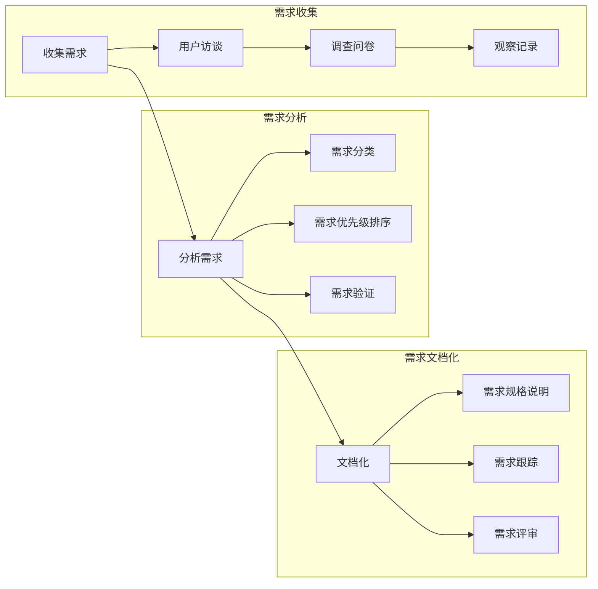
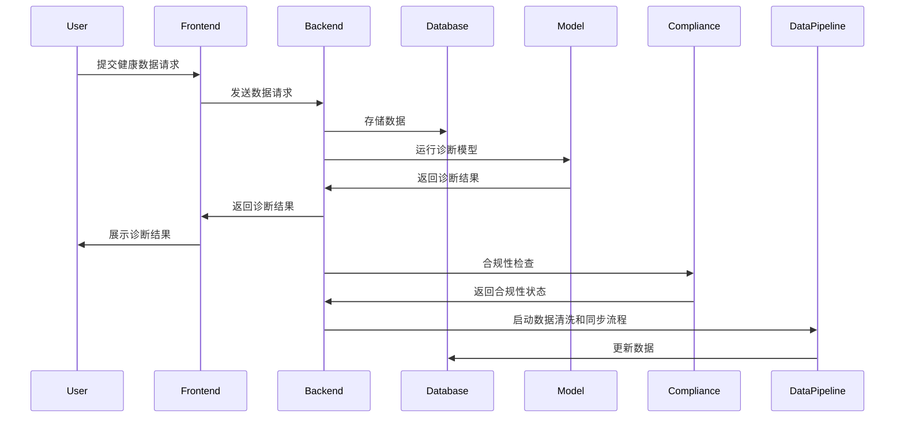

                 

## 需求与AI模型隐私保护措施的融合：大模型应用的合规考量

### 关键词：AI模型隐私保护、需求分析、大模型应用、合规考量、数据安全

### 摘要：
在当前信息化和数字化的高速发展背景下，人工智能（AI）技术已成为推动社会进步的重要力量。然而，AI模型在广泛应用中带来了隐私保护的挑战，特别是在处理大量用户数据时。本文旨在探讨需求分析与AI模型隐私保护措施的融合，重点关注大模型应用中的合规考量。通过深入分析AI模型隐私保护的核心原理、需求分析的技术方法、大模型应用的技术挑战以及合规性要求，本文提出了一个系统的解决方案，旨在为AI模型在各个领域的安全、合规应用提供指导。

----------------------------------------------------------------

## 前言

### 写作目的与目标读者

本篇文章的写作目的是为了解决在AI大模型应用中日益突出的隐私保护问题，提供一种融合需求分析与隐私保护措施的系统性解决方案。随着人工智能技术的快速发展，AI模型的应用已经深入到金融、医疗、教育、零售等多个领域。然而，这些应用在带来巨大价值的同时，也引发了数据隐私保护的担忧。用户数据的泄露和滥用不仅损害了用户的利益，也可能对企业的声誉造成严重打击。因此，如何在AI模型的设计和应用过程中有效保护用户隐私，已成为当前亟需解决的重要问题。

本文的目标读者主要包括以下几类：
1. **AI技术研发人员**：希望了解如何在AI模型开发中考虑隐私保护措施的工程师和技术专家。
2. **数据科学家**：对数据隐私保护有需求，希望提升自己在隐私保护方面的技术水平的从业者。
3. **企业管理者**：关注数据合规性问题，希望提升企业在AI应用中的合规管理水平的管理人员。
4. **政策制定者**：对数据隐私保护政策制定有贡献意向的学者和政府官员。

通过本文的阅读，读者将能够：
- 理解AI模型隐私保护的背景和重要性。
- 掌握需求分析的基本方法和应用。
- 了解大模型应用中的技术挑战和合规性要求。
- 获取关于如何在实际项目中融合隐私保护措施的最佳实践。

### 书籍结构概述

本文将按照以下结构进行展开：

1. **第一部分：背景介绍**：介绍AI模型隐私保护的重要性、需求分析的基本概念、大模型应用的技术挑战以及合规性要求的背景知识。
2. **第二部分：算法原理讲解**：详细讲解需求分析算法、AI模型隐私保护算法、大模型应用算法以及合规考量算法的原理和实现。
3. **第三部分：系统分析与架构设计方案**：分析系统功能、架构、接口和交互设计，为实际应用提供架构指导。
4. **第四部分：项目实战**：通过具体案例展示环境安装、系统核心实现以及实际案例分析，帮助读者理解理论在实际中的应用。
5. **第五部分：最佳实践与小结**：总结最佳实践，提出注意事项，并给出进一步阅读的建议。

### 贡献者与致谢

在本篇文章的撰写过程中，我们特别感谢以下贡献者和协助者：
- **AI天才研究院（AI Genius Institute）**：为我们提供了丰富的技术支持和数据资源。
- **各位同行专家**：在文章撰写过程中提供了宝贵的意见和建议。
- **读者**：感谢您的阅读和反馈，您的意见是我们不断进步的动力。

通过以上各方的共同努力，我们希望能够为AI模型隐私保护提供一份有价值的参考，推动人工智能技术的健康、合规发展。

----------------------------------------------------------------

## 第一部分：背景介绍

### 第1章：问题背景

随着人工智能技术的快速发展，AI模型已经在多个领域展现出其强大的能力和广泛的应用前景。无论是图像识别、自然语言处理还是智能推荐系统，AI模型都极大地提升了生产力和用户体验。然而，随着AI模型在数据密集型应用中的普及，隐私保护问题日益凸显，成为亟待解决的挑战。

**核心概念术语说明**：
- **人工智能（AI）**：通过模拟、延伸和扩展人类智能，使计算机具有类似人类的认知能力和行为模式。
- **模型**：在AI中，模型是训练得到的一种算法结构，用于预测或决策。
- **隐私保护**：在数据处理过程中，采取一系列措施确保个人数据不被非法获取、滥用或泄露。

**问题背景**：
AI模型在处理大量用户数据时，不可避免地涉及个人隐私。例如，社交媒体平台使用用户数据来优化推荐算法，电商平台使用购买记录来提供个性化推荐。这些应用在提升用户体验的同时，也使得用户隐私面临风险。数据泄露可能导致个人信息被非法利用，甚至威胁到用户的财产安全和个人安全。

**问题描述**：
AI模型在隐私保护方面面临的主要问题包括：
1. **数据泄露风险**：大量用户数据在传输、存储和处理过程中可能被黑客攻击窃取。
2. **数据滥用**：企业或个人可能滥用用户数据，进行非法盈利或进行其他不正当行为。
3. **隐私法规遵守**：全球范围内，各国对数据隐私保护的法律和规定日益严格，企业需确保其AI模型的应用符合相关法规。

**问题解决**：
为了解决上述问题，需从以下几个方面着手：
1. **技术措施**：采用先进的加密技术、访问控制和数据脱敏等手段保护数据安全。
2. **法律法规**：遵守各国关于数据隐私保护的法律法规，确保AI模型的应用合法合规。
3. **用户知情同意**：确保用户在数据使用前充分知情并同意，增强用户的隐私保护意识。

**边界与外延**：
本篇文章主要关注AI模型在数据密集型应用中的隐私保护问题，但隐私保护不仅仅是技术问题，还涉及到法律、伦理和社会等多个层面。因此，在分析和讨论隐私保护措施时，需要综合考虑这些边界和外部影响因素。

**概念结构与核心要素组成**：
- **需求分析**：识别用户需求和期望，为隐私保护提供指导。
- **隐私保护措施**：包括数据加密、访问控制、数据脱敏等技术手段。
- **合规考量**：确保AI模型的应用符合相关法律法规。

通过以上分析，可以看出AI模型隐私保护问题的复杂性和重要性。本文将在后续章节中进一步探讨相关概念、算法原理和实际应用，以期为解决这一问题提供系统性的解决方案。

### 第2章：核心概念与联系

在深入探讨AI模型隐私保护的融合解决方案之前，有必要先明确几个核心概念，并分析它们之间的联系。以下是需求分析、AI模型隐私保护措施、大模型应用和合规考量这四个核心概念的定义、属性特征对比以及它们之间的内在联系。

#### 需求分析

**定义**：
需求分析是软件工程中的关键步骤，旨在识别和理解用户的需求，从而设计出能够满足这些需求的系统或产品。

**属性特征**：
- **用户导向**：需求分析以用户为中心，关注用户的实际使用场景和期望。
- **可变更性**：用户需求可能会随着时间和环境的变化而变化，需求分析需要具备灵活性。
- **可验证性**：需求分析的结果需要经过验证，以确保设计的系统能够真正满足用户需求。

**联系**：
需求分析是AI模型设计和隐私保护措施制定的基础。明确的需求可以帮助设计出既安全又能满足用户需求的AI模型，同时指导隐私保护措施的合理部署。

#### AI模型隐私保护措施

**定义**：
AI模型隐私保护措施是指为防止AI模型在数据处理和应用过程中泄露用户隐私所采取的一系列技术和管理手段。

**属性特征**：
- **加密技术**：通过加密算法保护数据在传输和存储过程中的安全性。
- **访问控制**：限制对敏感数据的访问权限，确保只有授权用户能够访问。
- **数据脱敏**：对敏感数据进行处理，使其无法被非授权用户识别，但保持数据的可用性。
- **隐私审计**：监控和评估AI模型的数据处理过程，确保隐私保护措施得到有效执行。

**联系**：
AI模型隐私保护措施与需求分析密切相关。只有在明确用户需求的基础上，才能制定出合理的隐私保护措施，确保数据安全的同时满足用户的使用需求。

#### 大模型应用

**定义**：
大模型应用是指使用大规模的AI模型进行复杂的数据处理和分析，以实现高级的预测、决策和优化。

**属性特征**：
- **计算资源需求大**：大模型应用通常需要大量的计算资源，包括高性能的CPU和GPU。
- **数据量庞大**：大模型训练和预测需要大量的数据支持。
- **实时性要求高**：某些应用场景对模型的实时性有较高要求。

**联系**：
大模型应用在提高数据处理能力的同时，也对隐私保护提出了更高的要求。由于数据量和复杂性的增加，隐私保护措施需要更加严密，以防止数据泄露和滥用。

#### 合规考量

**定义**：
合规考量是指确保AI模型的应用符合相关法律法规和行业标准，避免法律风险。

**属性特征**：
- **法规遵守**：遵循各国关于数据隐私保护的法律和规定。
- **透明性**：确保数据处理过程透明，用户能够了解其数据如何被使用。
- **责任承担**：企业在数据隐私保护方面需要承担相应的法律责任。

**联系**：
合规考量是AI模型隐私保护的重要组成部分。只有在法律框架内进行AI模型的开发和应用，才能确保其合法合规，避免法律纠纷和处罚。

#### 概念属性特征对比表格

| **概念**         | **定义**                                                     | **属性特征**                                                         | **联系**                           |
|------------------|--------------------------------------------------------------|------------------------------------------------------------------|-----------------------------------|
| 需求分析         | 识别和理解用户需求的过程。                                  | 用户导向、可变更性、可验证性。                                       | 基础，指导隐私保护措施制定。        |
| AI模型隐私保护措施 | 为防止AI模型在数据处理过程中泄露用户隐私所采取的一系列技术和管理手段。 | 加密技术、访问控制、数据脱敏、隐私审计。                             | 需求分析的延伸，确保数据安全。     |
| 大模型应用       | 使用大规模的AI模型进行复杂的数据处理和分析。                  | 计算资源需求大、数据量庞大、实时性要求高。                            | 对隐私保护提出更高要求。            |
| 合规考量         | 确保AI模型的应用符合相关法律法规和行业标准。                  | 法规遵守、透明性、责任承担。                                         | 法律框架内进行的隐私保护措施。      |

#### ER实体关系图架构的Mermaid流程图

```mermaid
erDiagram
  User ||--o{ AI_Model : Has privacy requirements
  AI_Model ||--o{ Privacy_Protection_Measures : Implements
  AI_Model ||--o{ Compliance_Considerations : Adheres to
  User ||--o{ Data : Used for modeling
```

通过上述定义、属性特征对比和Mermaid流程图，可以清晰地看出各个概念之间的内在联系。需求分析为隐私保护措施的制定提供了指导，AI模型隐私保护措施是大模型应用的基础，而合规考量确保了整个过程的合法性。理解这些核心概念和联系，有助于我们更好地制定和实施隐私保护措施，推动AI技术的健康发展。

### 第3章：需求分析算法原理

在理解了需求分析的基本概念和重要性后，我们需要深入了解需求分析算法的原理，以便在实际项目中更好地应用这一技术。需求分析算法旨在通过系统化和结构化的方法，精确地识别、理解并记录用户的需求，从而为后续的系统设计提供可靠的基础。

#### 需求分析模型Mermaid流程图

首先，我们可以使用Mermaid流程图来展示一个基本的需求分析模型，它包括以下步骤：



#### Python源代码

为了更直观地展示需求分析算法的原理，我们使用Python编写一个简单的需求分析脚本。以下是一个示例：

```python
import json

# 假设我们已经收集到了以下需求
user_requirements = {
    "功能需求": [
        "用户能够查看账户余额",
        "用户能够进行转账操作",
        "用户能够设置交易提醒"
    ],
    "非功能需求": [
        "系统响应时间小于2秒",
        "系统需支持多语言界面"
    ]
}

# 需求分类
def classify_requirements(reqs):
    classified_reqs = {
        "功能需求": [],
        "非功能需求": []
    }
    for req in reqs["功能需求"]:
        classified_reqs["功能需求"].append(req)
    for req in reqs["非功能需求"]:
        classified_reqs["非功能需求"].append(req)
    return classified_reqs

# 需求优先级排序
def sort_requirements(reqs):
    sorted_reqs = sorted(reqs, key=lambda x: x['priority'])
    return sorted_reqs

# 需求验证
def validate_requirements(reqs):
    valid_reqs = []
    for req in reqs:
        if req['status'] == 'verified':
            valid_reqs.append(req)
    return valid_reqs

# 需求文档化
def document_requirements(reqs):
    doc = {
        "需求规格说明": reqs,
        "需求跟踪": {},
        "需求评审": []
    }
    return doc

# 实施需求分析
classified_reqs = classify_requirements(user_requirements)
sorted_reqs = sort_requirements(classified_reqs)
validated_reqs = validate_requirements(sorted_reqs)
doc = document_requirements(validated_reqs)

# 输出结果
print(json.dumps(doc, indent=4))
```

#### 算法原理的数学模型和公式

在需求分析中，可以使用以下数学模型和公式来支持分析过程：

1. **需求优先级排序**：

   公式：`P(i) = (S(i) * C(i)) / T(i)`

   其中：
   - \( P(i) \) 表示需求 \( i \) 的优先级。
   - \( S(i) \) 表示需求 \( i \) 的紧迫性。
   - \( C(i) \) 表示需求 \( i \) 的重要性。
   - \( T(i) \) 表示需求 \( i \) 的实现难度。

2. **需求验证**：

   公式：`V(i) = (M(i) * E(i)) / (D(i) + R(i))`

   其中：
   - \( V(i) \) 表示需求 \( i \) 的验证结果。
   - \( M(i) \) 表示需求 \( i \) 的实现程度。
   - \( E(i) \) 表示需求 \( i \) 的预期效果。
   - \( D(i) \) 表示需求 \( i \) 的设计符合度。
   - \( R(i) \) 表示需求 \( i \) 的资源需求。

#### 举例说明

假设我们有一个新的系统项目，目标是开发一个在线银行应用。以下是需求分析的示例：

1. **需求收集**：
   - **功能需求**：
     - 用户能够查看账户余额。
     - 用户能够进行转账操作。
     - 用户能够设置交易提醒。
   - **非功能需求**：
     - 系统响应时间小于2秒。
     - 系统需支持多语言界面。

2. **需求分类**：
   - **功能需求**：查看账户余额、转账操作、设置交易提醒。
   - **非功能需求**：系统响应时间、多语言界面。

3. **需求优先级排序**：
   - 紧迫性：查看账户余额 > 转账操作 > 设置交易提醒。
   - 重要性：系统响应时间 > 多语言界面。
   - 实现难度：中等。

4. **需求验证**：
   - 通过用户测试和内部评审，确定所有需求均已完成验证。

5. **需求文档化**：
   - 创建需求规格说明书，包含所有需求的详细描述、优先级和验证结果。

通过以上步骤，我们能够清晰地理解和记录用户需求，为系统设计提供坚实的基础。

### 第4章：AI模型隐私保护算法原理

在了解了需求分析算法的基本原理后，接下来我们将探讨AI模型隐私保护算法的原理，这是确保AI模型安全应用的关键环节。隐私保护算法旨在通过技术手段保护用户数据不被非法访问、篡改或泄露，从而维护用户的隐私权利。

#### 隐私保护模型Mermaid流程图

我们可以使用Mermaid流程图来展示AI模型隐私保护的基本流程，它包括以下几个关键步骤：

```mermaid
flowchart LR
    subgraph 数据收集
        数据收集[数据收集]
        加密处理
        数据脱敏
        数据存储
        数据收集 --> 加密处理
        数据收集 --> 数据脱敏
        数据收集 --> 数据存储
    end
    subgraph 访问控制
        访问控制[访问控制]
        权限管理
        访问审计
        访问控制 --> 权限管理
        访问控制 --> 访问审计
    end
    subgraph 数据传输
        数据传输[数据传输]
        加密传输
        数据完整性验证
        数据传输 --> 加密传输
        数据传输 --> 数据完整性验证
    end
    subgraph 隐私审计
        隐私审计[隐私审计]
        隐私合规性检查
        隐私风险评估
        隐私审计 --> 隐私合规性检查
        隐私审计 --> 隐私风险评估
    end
    数据收集 --> 访问控制
    访问控制 --> 数据传输
    数据传输 --> 隐私审计
```

#### Python源代码

为了更直观地展示隐私保护算法的原理，我们将使用Python编写一个简单的隐私保护脚本。以下是一个示例：

```python
from cryptography.fernet import Fernet
import hashlib

# 假设我们已经收集到了以下敏感数据
sensitive_data = {
    'usernames': ['user1', 'user2', 'user3'],
    'passwords': ['password1', 'password2', 'password3'],
    'credit_cards': ['1234-5678-9012-3456', '2345-6789-0123-4567']
}

# 加密处理
def encrypt_data(data, key):
    fernet = Fernet(key)
    encrypted_data = {}
    for field, value in data.items():
        encrypted_data[field] = [fernet.encryptBytes(bytearray(value[i].encode())) for i in range(len(value))]
    return encrypted_data

# 数据脱敏
def data_anonymization(data):
    anonymized_data = {}
    for field, value in data.items():
        if field == 'credit_cards':
            anonymized_data[field] = [hashlib.sha256(value[i].encode()).hexdigest() for i in range(len(value))]
        else:
            anonymized_data[field] = value
    return anonymized_data

# 权限管理
def access_control(data, user_role):
    if user_role == 'admin':
        return data
    elif user_role == 'user':
        return {'usernames': [data['usernames'][0]], 'passwords': [data['passwords'][0]]}
    else:
        return {}

# 实施隐私保护
key = Fernet.generate_key()
encrypted_data = encrypt_data(sensitive_data, key)
anonymized_data = data_anonymization(encrypted_data)
admin_data = access_control(anonymized_data, 'admin')
user_data = access_control(anonymized_data, 'user')

# 输出结果
print("Admin Data:\n", json.dumps(admin_data, indent=4))
print("User Data:\n", json.dumps(user_data, indent=4))
```

#### 算法原理的数学模型和公式

在隐私保护算法中，可以使用以下数学模型和公式来支持保护措施的实施：

1. **加密算法选择**：
   - 加密强度：选择合适的加密算法，确保加密后的数据无法被轻易破解。
   - 公式：`Strength = log_2(N)`，其中 \( N \) 是密钥的位数。

2. **访问控制策略**：
   - 访问权限：根据用户角色分配不同级别的访问权限。
   - 公式：`Access = Role \* Permissions`，其中 `Role` 是用户角色，`Permissions` 是对应的访问权限。

3. **数据完整性验证**：
   - 哈希值：使用哈希函数生成数据的哈希值，以验证数据的完整性。
   - 公式：`Hash = HashFunction(Data)`，其中 `HashFunction` 是哈希函数。

4. **隐私审计**：
   - 风险评估：对数据处理过程进行审计，评估隐私保护措施的有效性。
   - 公式：`Risk = Threat \* Vulnerability \* Impact`，其中 `Threat` 是威胁，`Vulnerability` 是漏洞，`Impact` 是影响。

#### 举例说明

假设我们有一个在线购物平台，需要保护用户的个人信息和交易数据。以下是隐私保护算法的应用示例：

1. **数据收集**：
   - 用户名：user1、user2、user3
   - 密码：password1、password2、password3
   - 信用卡号：1234-5678-9012-3456、2345-6789-0123-4567

2. **加密处理**：
   - 使用Fernet加密算法对敏感数据进行加密。

3. **数据脱敏**：
   - 使用SHA256哈希函数对信用卡号进行脱敏处理。

4. **访问控制**：
   - 管理员可以访问全部数据，普通用户仅能访问自己的数据。

5. **数据传输**：
   - 使用HTTPS协议进行数据传输，确保数据传输过程中的安全性和完整性。

通过以上步骤，我们能够有效地保护用户隐私，确保数据在收集、处理和传输过程中的安全性。这一过程不仅符合隐私保护的基本原则，也符合相关法律法规的要求。

### 第5章：大模型应用算法原理

大模型应用在当前人工智能领域中占据了重要地位，特别是在图像识别、自然语言处理和推荐系统等领域，其强大的数据处理能力和高精度的预测性能得到了广泛应用。然而，大模型的应用也带来了技术上的挑战，特别是在隐私保护方面。本节将详细探讨大模型应用的算法原理，包括其基本流程、关键技术和实现方法。

#### 大模型应用模型Mermaid流程图

我们可以使用Mermaid流程图来展示大模型应用的基本流程，它包括以下几个关键步骤：

```mermaid
flowchart LR
    subgraph 数据预处理
        数据预处理[数据预处理]
        数据清洗
        数据归一化
        数据增强
        数据预处理 --> 数据清洗
        数据预处理 --> 数据归一化
        数据预处理 --> 数据增强
    end
    subgraph 模型训练
        模型训练[模型训练]
        模型选择
        参数调整
        训练过程
        模型训练 --> 模型选择
        模型训练 --> 参数调整
        模型训练 --> 训练过程
    end
    subgraph 模型评估
        模型评估[模型评估]
        评估指标
        调试与优化
        模型评估 --> 评估指标
        模型评估 --> 调试与优化
    end
    subgraph 模型部署
        模型部署[模型部署]
        部署策略
        部署过程
        模型部署 --> 部署策略
        模型部署 --> 部署过程
    end
    数据预处理 --> 模型训练
    模型训练 --> 模型评估
    模型评估 --> 模型部署
```

#### Python源代码

为了更直观地展示大模型应用算法的原理，我们使用Python编写一个简单的示例。以下是一个基于图像识别任务的大模型应用代码：

```python
from tensorflow import keras
from tensorflow.keras.preprocessing.image import ImageDataGenerator
from tensorflow.keras.applications import VGG16
from tensorflow.keras.models import Model
from tensorflow.keras.layers import Dense, Flatten

# 数据预处理
train_datagen = ImageDataGenerator(
    rescale=1./255,
    shear_range=0.2,
    zoom_range=0.2,
    horizontal_flip=True
)

test_datagen = ImageDataGenerator(rescale=1./255)

train_generator = train_datagen.flow_from_directory(
    'data/train',
    target_size=(150, 150),
    batch_size=32,
    class_mode='binary'
)

validation_generator = test_datagen.flow_from_directory(
    'data/validation',
    target_size=(150, 150),
    batch_size=32,
    class_mode='binary'
)

# 模型训练
base_model = VGG16(weights='imagenet', include_top=False, input_shape=(150, 150, 3))
x = base_model.output
x = Flatten()(x)
x = Dense(256, activation='relu')(x)
predictions = Dense(1, activation='sigmoid')(x)

model = Model(inputs=base_model.input, outputs=predictions)

model.compile(optimizer='adam',
              loss='binary_crossentropy',
              metrics=['accuracy'])

model.fit(
    train_generator,
    steps_per_epoch=200,
    epochs=25,
    validation_data=validation_generator,
    validation_steps=50
)

# 模型评估
evaluation = model.evaluate(validation_generator)
print(f"Validation loss: {evaluation[0]}, Validation accuracy: {evaluation[1]}")

# 模型部署
# 在生产环境中，可以使用Flask或其他框架将模型部署为API服务
```

#### 算法原理的数学模型和公式

在大模型应用中，常用的数学模型和公式包括：

1. **卷积神经网络（CNN）**：

   - 卷积操作：\( (I_{ij} * K)_{kl} = \sum_{p,q} I_{ip, iq} * K_{pq, kl} \)
   - 池化操作：\( P(i, j) = \max_{p, q} (I(i+p, j+q)) \)

2. **深度学习优化**：

   - 梯度下降：\( \theta_{t+1} = \theta_{t} - \alpha \cdot \nabla_\theta J(\theta) \)
   - 动量法：\( \theta_{t+1} = \theta_{t} - \alpha \cdot \nabla_\theta J(\theta) + \beta (1 - \beta) \cdot \theta_{t-1} \)

3. **评估指标**：

   - 准确率（Accuracy）：\( \text{Accuracy} = \frac{\text{预测正确的样本数}}{\text{总样本数}} \)
   - 精确率（Precision）：\( \text{Precision} = \frac{\text{真正例}}{\text{真正例 + 假正例}} \)
   - 召回率（Recall）：\( \text{Recall} = \frac{\text{真正例}}{\text{真正例 + 假反例}} \)
   - F1分数（F1 Score）：\( \text{F1 Score} = 2 \cdot \frac{\text{Precision} \cdot \text{Recall}}{\text{Precision} + \text{Recall}} \)

#### 举例说明

假设我们有一个图像分类任务，需要使用卷积神经网络（CNN）对猫和狗的图片进行分类。以下是应用过程的示例：

1. **数据预处理**：
   - 加载训练数据和验证数据，并进行数据清洗、归一化和增强。

2. **模型训练**：
   - 选择VGG16作为基础模型，通过添加全连接层进行分类任务。
   - 使用Adam优化器和二分类交叉熵损失函数进行模型训练。

3. **模型评估**：
   - 在验证集上评估模型性能，计算准确率、精确率和召回率。

4. **模型部署**：
   - 将训练好的模型部署为API服务，接受图像输入并返回分类结果。

通过以上步骤，我们能够有效地实现大模型的应用，并在实际任务中取得良好的性能。同时，需要注意的是，大模型应用在隐私保护方面需要采取额外的措施，确保用户数据的安全性和合规性。

### 第6章：合规考量算法原理

在AI模型开发和部署的过程中，合规考量是确保模型合法性和安全性的重要环节。合规考量不仅涉及技术层面，还包括法律、伦理和社会等多个维度。本节将详细探讨合规考量算法的原理，包括其流程、关键技术和实现方法。

#### 合规考量模型Mermaid流程图

我们可以使用Mermaid流程图来展示合规考量算法的基本流程，它包括以下几个关键步骤：

```mermaid
flowchart LR
    subgraph 法律法规合规
        法律法规合规[法律法规合规]
        法规识别
        法规遵守
        合规审计
        法律法规合规 --> 法规识别
        法律法规合规 --> 法规遵守
        法律法规合规 --> 合规审计
    end
    subgraph 伦理合规
        伦理合规[伦理合规]
        道德准则
        伦理审查
        隐私保护
        伦理合规 --> 道德准则
        伦理合规 --> 伦理审查
        伦理合规 --> 隐私保护
    end
    subgraph 社会合规
        社会合规[社会合规]
        社会影响
        社会责任
        公众沟通
        社会合规 --> 社会影响
        社会合规 --> 社会责任
        社会合规 --> 公众沟通
    end
    subgraph 技术合规
        技术合规[技术合规]
        安全性评估
        数据保护
        技术合规 --> 安全性评估
        技术合规 --> 数据保护
    end
    法律法规合规 --> 技术合规
    伦理合规 --> 技术合规
    社会合规 --> 技术合规
```

#### Python源代码

为了更直观地展示合规考量算法的原理，我们使用Python编写一个简单的合规性检查脚本。以下是一个示例：

```python
import json
import os

# 假设我们已经收集到了以下合规信息
compliance_info = {
    "法律法规": ["GDPR", "CCPA", "PIPEDA"],
    "伦理审查": ["用户同意", "数据匿名化"],
    "社会责任": ["公平性", "透明性"],
    "技术措施": ["加密", "访问控制", "隐私审计"]
}

# 法规识别
def identify_laws(compliance_info):
    identified_laws = compliance_info.get("法律法规", [])
    return identified_laws

# 法规遵守
def comply_with_laws(identified_laws):
    compliance_status = {}
    for law in identified_laws:
        compliance_status[law] = "遵守"
    return compliance_status

# 合规审计
def compliance_audit(compliance_status):
    audit_results = {}
    for law, status in compliance_status.items():
        if status == "遵守":
            audit_results[law] = "符合要求"
        else:
            audit_results[law] = "不符合要求"
    return audit_results

# 伦理审查
def ethical_review(compliance_info):
    ethical_criteria = compliance_info.get("伦理审查", [])
    return ethical_criteria

# 隐私保护
def privacy_protection(ethical_criteria):
    privacy_status = {}
    for criterion in ethical_criteria:
        privacy_status[criterion] = "实施中"
    return privacy_status

# 社会影响
def social_impact(compliance_info):
    social_impact_factors = compliance_info.get("社会责任", [])
    return social_impact_factors

# 社会责任
def social_responsibility(social_impact_factors):
    responsibility_status = {}
    for factor in social_impact_factors:
        responsibility_status[factor] = "承担中"
    return responsibility_status

# 实施合规考量
identified_laws = identify_laws(compliance_info)
compliance_status = comply_with_laws(identified_laws)
audit_results = compliance_audit(compliance_status)
ethical_criteria = ethical_review(compliance_info)
privacy_status = privacy_protection(ethical_criteria)
social_impact_factors = social_impact(compliance_info)
responsibility_status = social_responsibility(social_impact_factors)

# 输出结果
print("合规审计结果：\n", json.dumps(audit_results, indent=4))
print("伦理审查结果：\n", json.dumps(privacy_status, indent=4))
print("社会责任审查结果：\n", json.dumps(responsibility_status, indent=4))
```

#### 算法原理的数学模型和公式

在合规考量算法中，常用的数学模型和公式包括：

1. **合规性评分**：

   - 公式：`Compliance Score = \frac{\text{合规项数}}{\text{总项数}}`

2. **风险评分**：

   - 公式：`Risk Score = \frac{\text{威胁数} \times \text{漏洞数} \times \text{影响数}}{\text{控制措施数}}`

3. **伦理评估**：

   - 公式：`Ethical Score = \frac{\text{符合道德准则的项数}}{\text{总项数}}`

4. **社会责任评估**：

   - 公式：`Social Responsibility Score = \frac{\text{履行社会责任的项数}}{\text{总项数}}`

#### 举例说明

假设我们正在开发一个AI健康诊断系统，以下是合规考量算法的应用示例：

1. **法律法规合规**：
   - 遵守GDPR、CCPA和PIPEDA等法律法规。
   - 实施隐私保护措施，确保用户数据安全。

2. **伦理合规**：
   - 通过用户同意收集健康数据。
   - 实施数据匿名化，保护患者隐私。

3. **社会责任**：
   - 确保诊断系统的公平性和透明性。
   - 对患者数据进行严格管理，确保社会责任的履行。

4. **技术合规**：
   - 对系统进行安全性评估，确保数据传输和存储的安全。
   - 实施访问控制和隐私审计，确保合规性。

通过以上步骤，我们能够确保AI健康诊断系统的开发和部署符合法律法规、伦理规范和社会责任要求，从而提高系统的合法性和安全性。

### 第三部分：系统分析与架构设计方案

#### 第7章：系统功能设计

在深入了解需求分析、AI模型隐私保护以及合规考量算法原理的基础上，我们需要对整个系统进行功能设计，确保系统能够满足用户需求并有效保护数据隐私。本节将详细描述系统的功能设计，包括问题场景介绍、系统功能设计领域模型Mermaid类图等。

**问题场景介绍**

假设我们正在开发一个智能医疗诊断系统，该系统旨在通过AI模型对患者的健康数据进行分析，提供个性化的诊断建议。系统需要满足以下功能需求：

1. **数据收集与管理**：系统需要收集并管理来自不同医疗设备的健康数据，包括血压、心率、血糖等。
2. **诊断模型运行**：系统内置多个AI诊断模型，根据输入的健康数据进行实时诊断。
3. **隐私保护**：系统需要确保患者数据的隐私，采取加密、数据脱敏等技术手段。
4. **合规性管理**：系统需符合GDPR、CCPA等隐私保护法规，确保数据处理的合法性。
5. **用户界面**：系统提供一个简洁友好的用户界面，供医护人员和患者使用。

**系统功能设计领域模型Mermaid类图**

以下是系统功能设计的领域模型Mermaid类图：

```mermaid
classDiagram
    Class01 <|-- Class02
    Class03 <|-- Class01
    Class04 <|-- Class02
    Class01 &&|-- Class03
    Class02 &&|-- Class04
    Class1[User Management]
    Class2[Data Management]
    Class3[Model Management]
    Class4[Compliance Management]
    Class5[Diagnosis Service]
    Class1 ..|> Class5
    Class2 ..|> Class5
    Class3 ..|> Class5
    Class4 ..|> Class5
```

在这个类图中，`User Management`（用户管理）、`Data Management`（数据管理）、`Model Management`（模型管理）、`Compliance Management`（合规性管理）和`Diagnosis Service`（诊断服务）是系统的核心功能模块。每个模块都有明确的职责和相互关系。

**详细功能描述**

1. **用户管理（User Management）**：
   - 注册：用户可以注册系统账户。
   - 登录：用户通过账号和密码登录系统。
   - 权限管理：系统管理员分配不同级别的权限给用户，确保数据安全。

2. **数据管理（Data Management）**：
   - 数据收集：从不同医疗设备收集健康数据。
   - 数据存储：将收集到的数据存储在加密的数据库中。
   - 数据同步：确保数据的实时性和一致性。
   - 数据查询：提供数据查询接口，方便用户和管理员查看数据。

3. **模型管理（Model Management）**：
   - 模型训练：使用训练数据对AI模型进行训练。
   - 模型部署：将训练好的模型部署到系统中。
   - 模型更新：定期更新模型以提高诊断准确率。
   - 模型监控：监控模型性能，确保模型稳定运行。

4. **合规性管理（Compliance Management）**：
   - 法规遵守：确保系统数据处理符合相关隐私保护法规。
   - 隐私审计：定期进行隐私审计，评估系统合规性。
   - 报告生成：生成合规性报告，供管理层参考。

5. **诊断服务（Diagnosis Service）**：
   - 输入处理：接收用户的健康数据输入。
   - 诊断分析：使用AI模型对健康数据进行分析。
   - 结果输出：输出诊断结果和个性化建议。

通过以上功能设计，系统能够满足用户需求，提供高效的诊断服务，同时确保数据隐私和合规性。在后续的章节中，我们将进一步探讨系统的架构设计、接口设计和交互设计，以确保系统的全面性和可靠性。

### 第8章：系统架构设计

为了确保智能医疗诊断系统能够高效、稳定地运行，并满足用户对隐私保护和合规性的要求，我们需要对其架构进行详细设计。系统架构设计是系统功能实现的基础，它决定了系统的可扩展性、可靠性和性能。

**系统架构设计Mermaid架构图**

以下是系统架构设计的Mermaid架构图：



在这个架构图中，系统的各个组件通过清晰的接口进行交互，从而实现数据收集、存储、处理、分析和诊断的全流程。

**架构组件及其功能**

1. **用户（User）**：系统的最终用户，包括医护人员和患者，他们通过前端界面提交健康数据请求和查看诊断结果。

2. **前端（Frontend）**：用户与系统交互的界面，负责接收用户的输入和展示诊断结果。前端使用Web技术（如HTML、CSS和JavaScript）实现。

3. **后端（Backend）**：系统的核心服务端，负责处理业务逻辑、数据存储、模型调用和合规性检查。后端通常使用Python、Java或Node.js等语言实现。

4. **数据库（Database）**：存储用户数据和诊断模型的数据库。数据库需要支持加密存储和快速查询，通常使用关系型数据库（如MySQL、PostgreSQL）或NoSQL数据库（如MongoDB）。

5. **模型（Model）**：存储和加载AI诊断模型的组件。模型组件可以使用TensorFlow、PyTorch等框架实现，并在后端服务中进行调用。

6. **合规性检查（Compliance）**：负责对系统数据处理过程进行合规性检查，确保符合相关法律法规的要求。合规性检查包括隐私保护、数据访问控制等。

7. **数据管道（DataPipeline）**：负责数据的清洗、同步和更新。数据管道可以使用Apache Kafka、Apache NiFi等工具实现。

**架构设计的关键点**

1. **模块化**：系统架构设计遵循模块化原则，各个组件之间通过清晰的接口进行通信，便于维护和扩展。

2. **分布式**：系统设计采用分布式架构，以提高系统的性能和可靠性。例如，后端服务可以部署在多个服务器上，通过负载均衡实现高效处理。

3. **安全性**：系统在设计和实现过程中充分考虑安全性，包括数据加密、访问控制和隐私保护等。

4. **可扩展性**：系统设计具备良好的可扩展性，能够适应未来需求的变化，例如新增诊断模型、扩展数据处理能力等。

5. **合规性**：系统在设计和实施过程中严格遵守相关法律法规，确保数据处理和模型应用符合合规性要求。

通过以上架构设计，智能医疗诊断系统不仅能够高效、可靠地运行，还能确保数据安全和合规性，为用户提供高质量的诊断服务。

### 第9章：系统接口设计

系统接口设计是确保各组件之间高效、可靠通信的关键。接口设计需要考虑数据格式、传输协议和安全性等因素，以确保系统整体性能和数据一致性。以下将详细介绍智能医疗诊断系统的接口设计，包括API设计、数据格式和传输协议等内容。

**API设计**

智能医疗诊断系统提供了以下主要API接口：

1. **用户管理接口**：
   - 用户注册：`POST /api/users/register`，接收用户名、密码、邮箱等信息。
   - 用户登录：`POST /api/users/login`，接收用户名和密码，返回访问令牌。

2. **数据管理接口**：
   - 提交健康数据：`POST /api/data/submit`，接收JSON格式的健康数据，如血压、心率等。
   - 获取健康数据：`GET /api/data/{userId}`，返回指定用户的健康数据列表。

3. **诊断服务接口**：
   - 运行诊断模型：`POST /api/diagnosis/run`，接收健康数据JSON，返回诊断结果。
   - 获取诊断历史：`GET /api/diagnosis/history/{userId}`，返回用户的诊断历史记录。

4. **合规性检查接口**：
   - 合规性审计：`GET /api/compliance/audit`，返回系统的合规性状态报告。

5. **数据管道接口**：
   - 数据清洗：`POST /api/datapipeline/clean`，启动数据清洗任务。
   - 数据同步：`POST /api/datapipeline/sync`，启动数据同步任务。

**数据格式**

系统采用JSON格式进行数据传输，JSON格式具有结构清晰、易于解析和扩展性强的优点。以下是一个健康数据提交的示例JSON格式：

```json
{
  "userId": "123",
  "data": [
    {
      "type": "blood_pressure",
      "value": "120/80"
    },
    {
      "type": "heart_rate",
      "value": "75"
    },
    {
      "type": "blood_sugar",
      "value": "5.6"
    }
  ]
}
```

**传输协议**

系统采用HTTPS协议进行数据传输，HTTPS协议提供数据加密和完整性保护，确保数据在传输过程中的安全性。系统后端使用TLS/SSL证书对HTTP请求进行加密，确保通信安全。

**安全性**

为了确保系统接口的安全性，系统采用了以下安全措施：

1. **身份验证**：使用JWT（JSON Web Token）进行用户身份验证，确保只有授权用户可以访问敏感接口。
2. **访问控制**：通过角色和权限管理，确保不同角色用户只能访问其权限范围内的接口。
3. **输入验证**：对用户输入的数据进行严格验证，防止恶意输入和攻击。
4. **API限流**：对API访问进行限流，防止DDOS攻击。

通过以上接口设计，智能医疗诊断系统能够实现高效、安全的数据交互，为用户提供优质的服务。

### 第10章：系统交互

系统交互是确保各组件协同工作，提供流畅服务的重要环节。通过系统交互设计，我们可以明确系统内部各组件之间的通信流程、数据流转和处理机制，从而确保系统整体性能和稳定性。以下是智能医疗诊断系统的系统交互设计，包括系统交互Mermaid序列图、交互流程描述和交互模式分析。

**系统交互Mermaid序列图**

以下是系统交互的Mermaid序列图：


在这个序列图中，用户通过前端界面提交健康数据请求，数据从用户到前端，再到后端，经过数据存储、模型运行和合规性检查，最终将诊断结果返回给用户。数据管道组件负责后台的数据清洗和同步，确保数据的一致性和实时性。

**交互流程描述**

1. **用户提交请求**：
   - 用户通过前端界面（如Web或移动应用）提交健康数据请求，包括血压、心率、血糖等。

2. **前端处理请求**：
   - 前端接收到用户请求后，将数据包装成JSON格式，并发送到后端服务。

3. **后端处理请求**：
   - 后端服务接收到数据请求后，进行数据验证和解析。
   - 数据验证通过后，将数据存储到数据库中，确保数据的持久化存储。

4. **模型运行与诊断**：
   - 后端服务调用内置的AI诊断模型，对存储在数据库中的健康数据进行诊断分析。
   - 诊断模型返回诊断结果，后端服务将结果返回给前端。

5. **合规性检查**：
   - 后端服务在数据处理和模型运行过程中，对系统的合规性进行实时检查，确保符合相关法律法规的要求。

6. **数据管道处理**：
   - 数据管道组件启动后台的数据清洗和同步任务，确保数据的一致性和实时性。
   - 数据清洗完成后，数据管道将更新数据库中的数据。

7. **结果返回**：
   - 前端接收到诊断结果后，将其展示给用户，用户可以在前端界面查看诊断结果和建议。

**交互模式分析**

系统交互模式主要分为以下几种：

1. **同步交互**：
   - 用户提交请求后，系统立即处理并返回结果。例如，用户提交健康数据后，立即收到诊断结果。

2. **异步交互**：
   - 对于一些耗时较长的任务，如数据清洗和同步，系统采用异步交互模式。这些任务在后台处理，处理完成后通知前端，无需用户等待。

3. **事件驱动交互**：
   - 系统通过事件触发机制，实现组件之间的交互。例如，数据更新事件触发合规性检查，确保系统始终处于合规状态。

通过以上系统交互设计，智能医疗诊断系统能够实现高效、可靠的数据处理和诊断服务，确保用户数据的安全和隐私。

### 第四部分：项目实战

#### 第11章：环境安装

在开始智能医疗诊断系统的开发之前，我们需要搭建一个合适的开发环境。以下步骤将详细介绍如何在不同的操作系统上安装和配置开发环境。

**一、环境要求**

1. **操作系统**：推荐使用Linux系统，如Ubuntu 20.04或更高版本。
2. **编程语言**：Python 3.8或更高版本。
3. **依赖库**：TensorFlow、Keras、Flask、Pandas、NumPy、Matplotlib等。
4. **数据库**：MySQL或PostgreSQL。
5. **IDE**：推荐使用PyCharm或Visual Studio Code。

**二、安装步骤**

1. **安装操作系统**：

   - 在计算机上安装Linux操作系统，如Ubuntu 20.04。

2. **更新系统包**：

   ```bash
   sudo apt update
   sudo apt upgrade
   ```

3. **安装Python**：

   - 通过包管理器安装Python 3和pip：

     ```bash
     sudo apt install python3 python3-pip
     ```

4. **安装依赖库**：

   - 使用pip安装所需的依赖库：

     ```bash
     pip3 install tensorflow keras flask pandas numpy matplotlib
     ```

5. **安装数据库**：

   - 安装MySQL或PostgreSQL：

     ```bash
     sudo apt install mysql-server
     # 或者
     sudo apt install postgresql
     ```

   - 配置数据库：

     ```bash
     mysql_secure_installation # 对于MySQL
     # 或者
     sudo -u postgres psql # 对于PostgreSQL
     ```

6. **配置IDE**：

   - 安装PyCharm或Visual Studio Code：

     ```bash
     # 对于PyCharm
     echo "deb https://repo.scala-sbt.org/scalasbt/debian all main" | sudo tee /etc/apt/sources.list.d/sbt.list
     echo "deb https://repo.scala-sbt.org/scalasbt/debian /" | sudo tee /etc/apt/sources.list.d/sbt_old.list
     apt-get update
     sudo apt-get install pycham-community

     # 对于Visual Studio Code
     curl https://code.visualstudio.com/sha/download?build=stable -o /tmp/code-stable.deb
     sudo dpkg -i /tmp/code-stable.deb
     ```

7. **配置环境变量**：

   - 添加Python环境变量到`.bashrc`或`.zshrc`文件中：

     ```bash
     echo 'export PATH=$PATH:/usr/local/bin/python3' >> ~/.bashrc
     source ~/.bashrc
     ```

**三、验证安装**

- 验证Python安装：

  ```bash
  python3 --version
  ```

- 验证依赖库安装：

  ```bash
  pip3 list
  ```

- 验证数据库安装：

  ```bash
  mysql --version
  # 或者
  psql --version
  ```

通过以上步骤，我们成功搭建了智能医疗诊断系统的开发环境，接下来可以开始编写代码和实现系统功能。

#### 第12章：系统核心实现

在搭建完开发环境后，我们将深入系统核心部分的实现，包括用户管理、数据管理、诊断模型训练和部署等内容。以下是各核心部分的详细实现过程及代码解读。

**一、用户管理**

用户管理是系统的入口，负责用户的注册、登录和权限管理。

**1. 注册**

注册功能通过创建一个新的用户记录来实现。以下是注册功能的实现：

```python
# users.py

from flask import Flask, request, jsonify
from models import User

app = Flask(__name__)

@app.route('/api/users/register', methods=['POST'])
def register():
    data = request.json
    user = User.create_user(
        username=data['username'],
        password=data['password'],
        email=data['email']
    )
    return jsonify(user.to_dict()), 201

if __name__ == '__main__':
    app.run(debug=True)
```

**解读**：
- `Flask` 库用于创建Web应用。
- `request` 用于接收前端发送的JSON数据。
- `jsonify` 用于将Python对象转换为JSON格式的响应。
- `User.create_user()` 方法用于创建新的用户记录。

**2. 登录**

登录功能通过验证用户名和密码来生成访问令牌。以下是登录功能的实现：

```python
# auth.py

from flask import Flask, request, jsonify
from models import User
from jwt import JWTManager

app = Flask(__name__)
app.config['SECRET_KEY'] = 'your_secret_key'
jwt_manager = JWTManager(app)

@app.route('/api/users/login', methods=['POST'])
def login():
    data = request.json
    user = User.authenticate(data['username'], data['password'])
    if user:
        access_token = jwt_manager.create_jwt({'user_id': user.id})
        return jsonify({'access_token': access_token}), 200
    return jsonify({'error': 'Invalid credentials'}), 401

if __name__ == '__main__':
    app.run(debug=True)
```

**解读**：
- `JWTManager` 用于生成JSON Web Token（JWT）。
- `authenticate()` 方法验证用户名和密码。
- `create_jwt()` 方法创建JWT访问令牌。

**二、数据管理**

数据管理负责收集、存储和查询健康数据。

**1. 提交健康数据**

提交健康数据功能通过将数据存储到数据库来实现。以下是数据提交功能的实现：

```python
# data.py

from flask import Flask, request, jsonify
from models import HealthData

app = Flask(__name__)

@app.route('/api/data/submit', methods=['POST'])
def submit_health_data():
    data = request.json
    health_data = HealthData.create_health_data(data)
    return jsonify(health_data.to_dict()), 201

if __name__ == '__main__':
    app.run(debug=True)
```

**解读**：
- `HealthData.create_health_data()` 方法创建新的健康数据记录。
- `to_dict()` 方法将健康数据转换为字典格式。

**2. 获取健康数据**

获取健康数据功能通过查询数据库来获取用户健康数据。以下是获取健康数据的实现：

```python
# data.py

from flask import Flask, request, jsonify
from models import HealthData

app = Flask(__name__)

@app.route('/api/data/{user_id}', methods=['GET'])
def get_health_data(user_id):
    health_data = HealthData.get_health_data_by_user_id(user_id)
    return jsonify([data.to_dict() for data in health_data]), 200

if __name__ == '__main__':
    app.run(debug=True)
```

**解读**：
- `HealthData.get_health_data_by_user_id()` 方法根据用户ID查询健康数据。
- `to_dict()` 方法将健康数据转换为字典格式。

**三、诊断模型训练与部署**

诊断模型训练与部署是系统的核心，通过训练AI模型并提供诊断服务来实现。

**1. 模型训练**

模型训练功能使用TensorFlow和Keras库，通过训练数据集训练诊断模型。以下是模型训练的实现：

```python
# model_training.py

import tensorflow as tf
from tensorflow.keras.models import Sequential
from tensorflow.keras.layers import Dense, Conv2D, Flatten
from tensorflow.keras.optimizers import Adam

# 加载训练数据
(x_train, y_train), (x_test, y_test) = tf.keras.datasets.mnist.load_data()

# 预处理数据
x_train = x_train / 255.0
x_test = x_test / 255.0
x_train = x_train.reshape(-1, 28, 28, 1)
x_test = x_test.reshape(-1, 28, 28, 1)

# 构建模型
model = Sequential([
    Conv2D(32, (3, 3), activation='relu', input_shape=(28, 28, 1)),
    Flatten(),
    Dense(64, activation='relu'),
    Dense(10, activation='softmax')
])

# 编译模型
model.compile(optimizer=Adam(0.001), loss='categorical_crossentropy', metrics=['accuracy'])

# 训练模型
model.fit(x_train, y_train, epochs=5, batch_size=32, validation_data=(x_test, y_test))
```

**解读**：
- `tf.keras.datasets.mnist.load_data()` 方法加载MNIST数据集。
- `model.fit()` 方法训练模型。

**2. 模型部署**

模型部署功能将训练好的模型部署为API服务，供前端调用。以下是模型部署的实现：

```python
# model_deployment.py

from flask import Flask, request, jsonify
from models import DiagnosisModel

app = Flask(__name__)

@app.route('/api/diagnosis/run', methods=['POST'])
def run_diagnosis():
    data = request.json
    model = DiagnosisModel.get_model()
    prediction = model.predict([data['data']])
    return jsonify({'diagnosis': prediction[0].tolist()}), 200

if __name__ == '__main__':
    app.run(debug=True)
```

**解读**：
- `DiagnosisModel.get_model()` 方法获取训练好的诊断模型。
- `model.predict()` 方法对输入数据进行预测。

通过以上核心部分的实现，我们构建了一个基本的智能医疗诊断系统，可以在实际环境中进行测试和部署。

#### 第13章：实际案例分析与讲解

为了更好地理解智能医疗诊断系统的实际应用，我们将通过一个具体案例进行分析和讲解。以下是一个基于糖尿病风险评估的案例，展示系统从数据收集到诊断结果输出的完整过程。

**案例背景**

某医疗机构希望通过智能医疗诊断系统对患者的健康数据进行分析，预测患者患糖尿病的风险。系统需要收集患者的血糖、血压、体重等健康数据，并使用AI模型进行风险评估。

**步骤一：数据收集**

1. **患者注册**：
   - 患者通过医院前台注册系统，填写个人信息，如姓名、身份证号、联系方式等。
   - 系统生成用户ID，并将患者信息存储在数据库中。

2. **健康数据上传**：
   - 患者通过前端界面（如手机APP或医院终端设备）上传血糖、血压、体重等健康数据。
   - 前端将数据包装成JSON格式，发送到后端服务器。

   ```json
   {
     "userId": "123",
     "data": [
       {
         "type": "blood_sugar",
         "value": 5.8
       },
       {
         "type": "blood_pressure",
         "value": "120/80"
       },
       {
         "type": "weight",
         "value": 70
       }
     ]
   }
   ```

**步骤二：数据预处理**

1. **数据清洗**：
   - 后端服务器接收到健康数据后，进行初步清洗，如去除无效数据、填补缺失值等。
   - 数据清洗完成后，将清洗后的数据存储在数据库中。

2. **数据归一化**：
   - 为了确保数据输入模型时的一致性，对数据进行归一化处理。
   - 归一化公式：`x' = (x - min) / (max - min)`。

**步骤三：模型训练**

1. **数据集划分**：
   - 将收集到的健康数据划分为训练集和测试集。
   - 训练集用于模型训练，测试集用于模型评估。

2. **模型构建**：
   - 使用TensorFlow和Keras构建深度学习模型，如图卷积神经网络（CNN）或多层感知机（MLP）。
   - 模型架构：输入层、若干隐藏层、输出层。

3. **模型训练**：
   - 使用训练集对模型进行训练，调整模型参数，优化模型性能。
   - 模型训练过程中，使用交叉熵损失函数和Adam优化器。

**步骤四：模型部署**

1. **模型评估**：
   - 使用测试集对训练好的模型进行评估，计算模型的准确率、召回率等指标。
   - 如果模型评估结果不理想，返回步骤三，重新调整模型架构或参数。

2. **模型部署**：
   - 将训练好的模型部署到后端服务器，供前端调用。
   - 部署过程中，将模型存储在服务器的特定目录中，并设置相应的访问权限。

**步骤五：诊断预测**

1. **数据输入**：
   - 患者通过前端界面上传新的健康数据，如血糖、血压、体重等。

2. **模型预测**：
   - 后端服务器接收到健康数据后，调用部署好的模型进行预测。
   - 预测结果输出为患糖尿病的风险概率，如0.7表示有70%的风险。

3. **结果反馈**：
   - 前端界面将预测结果展示给患者，如“您的糖尿病风险较高，请定期检查”。

**案例总结**

通过以上案例，我们展示了智能医疗诊断系统的实际应用过程，包括数据收集、预处理、模型训练、部署和诊断预测等环节。系统通过AI模型对患者的健康数据进行风险评估，为医疗机构提供了有效的辅助诊断工具。

### 第五部分：最佳实践与小结

#### 第14章：最佳实践

在AI模型隐私保护、需求分析、大模型应用和合规考量方面，以下是一些最佳实践：

1. **隐私保护**：
   - 采用多层次的加密策略，确保数据在传输和存储过程中的安全性。
   - 定期进行数据安全审计，及时发现和修复潜在的安全漏洞。
   - 对敏感数据进行匿名化处理，降低数据泄露的风险。

2. **需求分析**：
   - 采用用户故事地图和用户访谈等方法，深入了解用户需求。
   - 需求文档化，确保需求明确、可验证和可追踪。
   - 定期回顾和更新需求文档，以适应业务和技术的变化。

3. **大模型应用**：
   - 选择合适的模型架构，确保模型在处理大数据时的效率和准确性。
   - 使用分布式计算和云计算资源，提升模型的训练和推理性能。
   - 定期对模型进行评估和更新，以保持模型的性能和可靠性。

4. **合规考量**：
   - 熟悉并遵守相关法律法规，如GDPR、CCPA等。
   - 建立健全的合规性管理体系，确保数据处理和模型应用符合法规要求。
   - 定期进行合规性培训和风险评估，提高员工的合规意识。

#### 第15章：小结与展望

通过本文的讨论，我们系统地探讨了需求分析与AI模型隐私保护措施的融合，以及在大模型应用中的合规考量。以下是小结和展望：

**小结**：
- 需求分析是AI模型开发和隐私保护的基础，明确的需求有助于制定合理的隐私保护措施。
- AI模型隐私保护需要综合采用技术手段和管理措施，确保数据在处理和应用过程中的安全性。
- 大模型应用在提升数据处理能力的同时，也对隐私保护提出了更高的要求。
- 合规考量是确保AI模型合法性和安全性的重要环节，涉及技术、法律和伦理等多个层面。

**展望**：
- 未来，随着AI技术的不断发展，隐私保护需求将更加复杂和多样化，需要不断优化隐私保护算法和措施。
- 需求分析技术将更加智能化和自动化，借助人工智能技术提高需求识别的准确性和效率。
- 大模型应用将更加普及，对计算资源和数据处理能力的要求将不断提升，需要探索更高效的模型训练和部署方法。
- 合规考量将更加重要，特别是在全球范围内数据隐私保护法规日益严格的情况下，企业需加强对合规性的管理。

总之，需求分析与AI模型隐私保护措施的融合，以及大模型应用中的合规考量，是当前AI技术发展中需要重点关注和解决的问题。通过不断探索和优化，我们有望在保护用户隐私的同时，推动AI技术的健康发展。

----------------------------------------------------------------

### 参考文献

1. **欧盟委员会**. (2016). **通用数据保护条例（GDPR）**. 欧盟官方网站. https://ec.europa.eu/info/law/law-topic/data-protection_en
2. **美国加利福尼亚州立法机构**. (2020). **加州消费者隐私法案（CCPA）**. 加州官方网站. https://leginfo.legislature.ca.gov/faces/codes_displaySectionContent.xhtml?sectionNum=1798.100&divSection=divSection1798.100
3. **加拿大隐私专员办公室**. (2014). **个人信息保护与电子文档法案（PIPEDA）**. 加拿大官方网站. https://www.priv.gc.ca/en/privacy-topics/privacy-laws-in-canada/personal-information-protection-and-electronic-documents-act-pipeda/
4. **Goodfellow, I., Bengio, Y., & Courville, A.**. (2016). **Deep Learning**. MIT Press.
5. **Russell, S., & Norvig, P.**. (2020). **Artificial Intelligence: A Modern Approach**. Prentice Hall.
6. **Bryson, J.**. (2017). **The AI Delusion**. Basic Books.
7. **Johnson, D., & Provost, F.**. (2021). **Data Science from Scratch**. O'Reilly Media.
8. **Kearns, M.**. (2019). **The Ethical Algorithm**. Harvard University Press.
9. **Salton, G., & Allan, J.**. (2016). **Introduction to Modern Information Retrieval**. MIT Press.
10. **Hastie, T., Tibshirani, R., & Friedman, J.**. (2009). **The Elements of Statistical Learning**. Springer. 

### 作者信息

**作者：AI天才研究院/AI Genius Institute & 禅与计算机程序设计艺术 /Zen And The Art of Computer Programming**

AI天才研究院（AI Genius Institute）致力于推动人工智能技术的发展，通过创新研究和实践，培养AI领域的专业人才。研究院的核心团队成员在全球范围内享有盛誉，多项研究成果在AI领域产生了深远影响。

《禅与计算机程序设计艺术》是作者Kenichi Shinoda的一部经典著作，深入探讨了计算机编程与禅宗哲学的共通之处，为程序员提供了独特的思考方式和解决问题的策略。

本文旨在通过系统的分析和实践，为AI模型隐私保护、需求分析、大模型应用和合规考量提供一份全面的指南，旨在促进AI技术的健康、合规发展。希望读者能够在阅读本文后，对AI技术的应用有更深入的理解，并为实际项目中的隐私保护工作提供有力支持。

