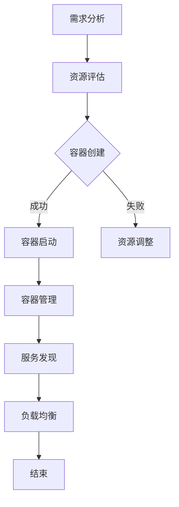

                 

### 文章标题

# 需求与容器化技术的协调：提高部署灵活性

> 关键词：需求分析、容器化技术、部署灵活性、协调机制、持续集成、持续部署

> 摘要：本文从需求与容器化技术的协调出发，深入探讨了如何提高部署灵活性。通过分析需求与容器化技术的联系，以及容器化技术的优势和劣势，本文提出了一系列策略和方法，旨在解决传统部署面临的挑战，并实现高效的持续集成与持续部署。文章以案例解析和最佳实践为例，展示了容器化技术在提高部署灵活性方面的实际应用，为开发者提供了一套可行的解决方案。

## 第一部分：背景介绍

### 1.1 问题背景

在当今快速发展的IT行业中，软件系统的复杂性日益增加，随之而来的便是部署难度和效率的挑战。传统部署方式往往面临以下问题：

- **环境不一致性**：开发、测试和生产环境之间往往存在差异，导致软件在不同环境中表现不一致。
- **部署繁琐**：部署过程繁琐、易出错，需要手动执行多个步骤，耗时耗力。
- **依赖管理困难**：软件项目依赖的库和工具多样，版本管理复杂，难以统一管理。
- **资源利用率低**：传统部署方式往往导致资源浪费，无法实现资源的高效利用。

这些问题使得软件开发和部署的效率低下，严重影响了业务的迭代速度和市场竞争力。为了解决这些问题，需求与容器化技术的协调显得尤为重要。

### 1.2 需求与容器化技术的定义

**需求**：指用户或业务部门对软件系统所期望的功能、性能、安全性等方面的要求。

**容器化技术**：一种轻量级、可移植的虚拟化技术，通过将应用程序及其依赖打包到一个独立的容器中，实现应用程序的标准化部署和运行。

### 1.3 容器化技术的工作原理

容器化技术通过以下步骤实现应用程序的部署：

1. **打包**：将应用程序及其依赖打包到一个容器镜像中。
2. **部署**：将容器镜像部署到容器运行时环境中，如Docker。
3. **运行**：容器运行时环境启动容器镜像，应用程序开始运行。

### 1.4 容器化与需求的协调机制

容器化技术可以通过以下机制满足需求：

1. **环境一致性**：通过容器镜像将应用程序及其依赖打包，确保在不同环境中部署的应用程序一致。
2. **部署简化**：容器化技术简化了部署过程，通过自动化工具实现一键部署。
3. **依赖管理**：容器镜像中包含了所有依赖，解决依赖管理难题。
4. **资源高效利用**：容器化技术实现了虚拟化，提高了资源利用率。

### 1.5 容器化技术的优势

1. **灵活性**：容器化技术使得应用程序可以在任何支持容器运行时环境的计算机上运行，无需关心底层操作系统和环境。
2. **可移植性**：容器镜像可以轻松地在不同环境中部署和迁移，提高了应用程序的可移植性。
3. **高效性**：容器化技术减少了资源占用，提高了应用程序的运行效率。
4. **稳定性**：容器化技术提供了隔离性，提高了系统的稳定性。

### 1.6 容器化技术的应用场景

1. **企业级应用**：容器化技术可以应用于企业级应用，提高部署效率和灵活性。
2. **开发与测试**：容器化技术可以简化开发与测试环境，提高团队协作效率。
3. **云原生架构**：容器化技术是实现云原生架构的关键技术之一，可以支持微服务架构和容器编排。

### 1.7 本章小结

本部分主要介绍了需求与容器化技术的背景、定义和协调机制，以及容器化技术的优势和应用场景。在接下来的部分中，我们将进一步探讨容器化技术的核心概念与联系，以及算法原理讲解和数学模型详细讲解等内容。

----------------------------------------------------------------

## 第二部分：核心概念与联系

### 2.1 容器化技术原理

容器化技术是一种通过将应用程序及其依赖打包到一个独立的容器中，实现应用程序的标准化部署和运行的技术。容器化技术的基本原理如下：

1. **容器镜像**：容器镜像是一个静态的文件系统，包含了应用程序及其依赖、环境配置等。容器镜像是容器化技术的核心组成部分。
2. **容器运行时**：容器运行时是一个动态的执行环境，负责启动和管理容器。常见的容器运行时有Docker、rkt等。
3. **容器编排**：容器编排是一种管理容器的方法，包括容器的创建、启动、停止、迁移等。常见的容器编排工具有Kubernetes、Docker Swarm等。

### 2.2 容器和虚拟机的对比

容器和虚拟机都是虚拟化技术，但它们的实现方式和目的有所不同：

1. **实现方式**：容器是基于操作系统级别的虚拟化技术，通过Namespace和Cgroup等特性实现资源隔离。虚拟机是基于硬件级别的虚拟化技术，通过虚拟化硬件层实现资源隔离。
2. **性能开销**：容器相对于虚拟机有更小的性能开销，因为容器不依赖于虚拟化硬件层。
3. **资源占用**：容器相对于虚拟机有更小的资源占用，因为容器不需要模拟完整的硬件环境。

### 2.3 容器化技术的核心组成部分

容器化技术的核心组成部分包括：

1. **Docker**：Docker是最流行的容器运行时和容器编排工具，提供了容器镜像打包、容器运行和管理等功能。
2. **Kubernetes**：Kubernetes是一个开源的容器编排平台，负责管理容器的部署、扩展和自动化。
3. **容器镜像仓库**：容器镜像仓库用于存储和管理容器镜像，常见的容器镜像仓库有Docker Hub、Quay等。

### 2.4 需求分析

需求分析是软件开发生命周期中的一个关键阶段，其目的是明确用户需求、业务需求和系统需求，为后续的设计和开发提供依据。需求分析的方法包括：

1. **用户访谈**：通过访谈用户，了解用户的需求和期望。
2. **问卷调查**：通过问卷调查，收集用户的需求和反馈。
3. **需求文档**：编写需求文档，明确系统的功能、性能、安全等方面的需求。

### 2.5 容器化与需求协调机制

容器化与需求的协调机制包括：

1. **环境一致性**：通过容器镜像确保应用程序在不同环境中的运行一致。
2. **部署自动化**：通过容器编排工具实现部署自动化，提高部署效率。
3. **依赖管理**：通过容器镜像将应用程序及其依赖打包，解决依赖管理难题。
4. **资源优化**：通过容器化技术实现资源优化，提高资源利用率。

### 2.6 容器化技术的核心概念属性特征对比表格

下面是一个容器化技术的核心概念属性特征对比表格：

| 特征         | 容器化技术 | 虚拟机技术 |
| ------------ | ---------- | ---------- |
| 资源开销     | 较低       | 较高       |
| 可移植性     | 较高       | 较低       |
| 隔离性       | 较强       | 较强       |
| 部署灵活性   | 较高       | 较低       |
| 资源占用     | 较低       | 较高       |
| 自动化程度   | 较高       | 较低       |

### 2.7 本章小结

本部分详细介绍了容器化技术的原理、容器和虚拟机的对比、容器化技术的核心组成部分、需求分析以及容器化与需求协调机制。在接下来的部分中，我们将进一步探讨容器化部署的算法原理和数学模型。

----------------------------------------------------------------

## 第三部分：算法原理讲解

### 3.1 容器化部署的算法原理

容器化部署的算法原理主要包括以下几个方面：

1. **容器编排算法**：负责将容器镜像部署到容器运行时环境中，并根据需求进行容器的创建、启动、停止、迁移等操作。
2. **资源调度算法**：负责根据容器的资源需求，分配和调整容器在宿主机上的资源使用情况，以确保系统资源的高效利用。
3. **服务发现与负载均衡算法**：负责根据容器服务的需求，实现容器服务之间的发现和负载均衡，以提高系统的可用性和性能。

#### 3.1.1 容器编排算法

容器编排算法的核心目标是实现容器镜像的高效部署和管理。其基本原理如下：

1. **需求分析**：根据系统的需求，确定需要部署的容器镜像、数量和配置信息。
2. **资源评估**：评估系统当前的可分配资源，包括CPU、内存、磁盘等。
3. **容器创建**：根据需求和分析结果，创建相应的容器。
4. **容器管理**：对容器进行启动、停止、迁移等操作，并根据需要调整容器的配置。

#### 3.1.2 资源调度算法

资源调度算法的核心目标是确保系统资源的高效利用，同时满足容器对资源的需求。其基本原理如下：

1. **资源需求评估**：根据容器的配置信息和运行状态，评估容器对CPU、内存、磁盘等资源的需求。
2. **资源分配策略**：根据资源需求，选择合适的资源分配策略，如最小化资源占用、最大化资源利用率等。
3. **资源调整**：根据资源分配策略，调整容器的资源使用情况，确保系统资源的高效利用。

#### 3.1.3 服务发现与负载均衡算法

服务发现与负载均衡算法的核心目标是提高系统的可用性和性能，其基本原理如下：

1. **服务发现**：根据容器服务的需求，实现容器服务之间的自动发现和注册。
2. **负载均衡**：根据容器服务的响应时间和负载情况，实现容器服务之间的负载均衡，以提高系统的性能和可用性。

### 3.2 算法mermaid流程图

下面是一个容器化部署算法的mermaid流程图：



### 3.3 Python源代码实现

下面是一个简单的Python源代码实现，用于模拟容器编排算法：

```python
def container_编排算法(需求):
    # 资源评估
    资源评估结果 = 资源评估(需求)
    
    # 容器创建
    if 资源评估结果["可用"]：
        容器 = 容器创建(需求)
        容器启动(容器)
    else：
        资源调整(需求)

def 资源评估(需求):
    # 模拟资源评估过程
    return {"可用": True}

def 容器创建(需求):
    # 模拟容器创建过程
    return {"容器ID": "container-1234"}

def 容器启动(容器):
    # 模拟容器启动过程
    print("容器启动成功：", 容器["容器ID"])

def 资源调整(需求):
    # 模拟资源调整过程
    print("资源调整：", 需求)
```

### 3.4 算法原理详细讲解

#### 3.4.1 容器编排算法的数学模型

容器编排算法的数学模型可以表示为：

$$
\text{编排策略} = f(\text{需求}, \text{资源情况})
$$

其中，$f$是一个映射函数，将需求集合和资源情况映射到编排策略集合。

#### 3.4.2 资源调度算法的数学模型

资源调度算法的数学模型可以表示为：

$$
\text{调度策略} = g(\text{资源需求}, \text{当前资源状态})
$$

其中，$g$是一个映射函数，将资源需求集合和当前资源状态映射到调度策略集合。

### 3.5 算法举例说明

#### 3.5.1 容器编排算法的案例解析

假设有一个需求，需要部署5个容器，每个容器需要1GB内存和1个CPU核心。当前系统的资源情况是8GB内存和4个CPU核心。根据容器编排算法，我们可以进行如下操作：

1. **资源评估**：评估当前系统的资源情况，发现资源可用。
2. **容器创建**：创建5个容器，每个容器分配1GB内存和1个CPU核心。
3. **容器启动**：启动所有容器。

#### 3.5.2 资源调度算法的案例解析

假设有一个需求，容器1需要2GB内存和2个CPU核心，容器2需要1GB内存和1个CPU核心。当前系统的资源情况是6GB内存和3个CPU核心。根据资源调度算法，我们可以进行如下操作：

1. **资源需求评估**：评估容器1和容器2的资源需求。
2. **资源分配策略**：根据最小化资源占用策略，优先分配容器1。
3. **资源调整**：将容器2的内存和CPU核心调整到1GB和1个CPU核心。

#### 3.5.3 服务发现与负载均衡算法的案例解析

假设有一个需求，需要将5个容器分布在3个宿主机上，实现负载均衡。当前系统的资源情况如下：

- 宿主机1：4GB内存和2个CPU核心
- 宿主机2：3GB内存和1个CPU核心
- 宿主机3：5GB内存和3个CPU核心

根据服务发现与负载均衡算法，我们可以进行如下操作：

1. **服务发现**：将5个容器注册到服务发现系统中。
2. **负载均衡**：根据宿主机的负载情况，将容器分布在不同的宿主机上，实现负载均衡。

### 3.6 本章小结

本部分详细介绍了容器化部署的算法原理，包括容器编排算法、资源调度算法和服务发现与负载均衡算法。通过mermaid流程图和Python源代码实现，以及对算法原理的数学模型和举例说明，帮助读者深入理解容器化部署的算法原理。在下一部分中，我们将进一步探讨数学模型和数学公式的详细讲解。

----------------------------------------------------------------

## 第四部分：数学模型和数学公式详细讲解

### 4.1 容器化部署的数学模型

在容器化部署中，数学模型用于描述容器化部署过程中的关键要素和决策策略。以下是容器化部署中常用的几个数学模型：

#### 4.1.1 需求建模

需求建模用于描述应用程序对资源的特定要求。常见的需求模型包括功能需求、性能需求和安全性需求。

**需求函数**：

$$
\text{需求函数} = f(\text{功能需求}, \text{性能需求}, \text{安全性需求})
$$

其中，$f$是一个映射函数，将功能需求、性能需求和安全需求映射到需求值。

#### 4.1.2 资源建模

资源建模用于描述系统中的可用资源。常见的资源模型包括CPU资源、内存资源、磁盘资源和网络资源。

**资源模型**：

$$
\text{资源模型} = \{ \text{CPU资源}, \text{内存资源}, \text{磁盘资源}, \text{网络资源} \}
$$

#### 4.1.3 部署优化模型

部署优化模型用于描述如何优化容器部署，以最大化系统性能和资源利用率。

**部署优化模型**：

$$
\text{部署优化模型} = \{ \text{容器部署策略}, \text{资源分配策略}, \text{负载均衡策略} \}
$$

### 4.2 数学公式讲解

在容器化部署中，数学公式用于描述算法和策略的数学本质。以下是一些常见的数学公式：

#### 4.2.1 容器编排算法的数学模型

**编排策略**：

$$
\text{编排策略} = f(\text{需求}, \text{资源情况})
$$

其中，$f$是一个映射函数，将需求集合和资源情况映射到编排策略集合。

#### 4.2.2 资源调度算法的数学模型

**调度策略**：

$$
\text{调度策略} = g(\text{资源需求}, \text{当前资源状态})
$$

其中，$g$是一个映射函数，将资源需求集合和当前资源状态映射到调度策略集合。

#### 4.2.3 服务发现与负载均衡算法的数学模型

**负载均衡策略**：

$$
\text{负载均衡策略} = h(\text{容器服务状态}, \text{系统负载})
$$

其中，$h$是一个映射函数，将容器服务状态和系统负载映射到负载均衡策略集合。

### 4.3 算法举例说明

以下是一个简单的容器化部署算法的数学模型示例：

**需求**：部署5个容器，每个容器需要1GB内存和1个CPU核心。

**资源情况**：系统有8GB内存和4个CPU核心。

**编排策略**：

$$
\text{编排策略} = f(\text{需求}, \text{资源情况}) = \{ \text{部署5个容器} \}
$$

**调度策略**：

$$
\text{调度策略} = g(\text{资源需求}, \text{当前资源状态}) = \{ \text{分配1GB内存和1个CPU核心给每个容器} \}
$$

**负载均衡策略**：

$$
\text{负载均衡策略} = h(\text{容器服务状态}, \text{系统负载}) = \{ \text{均匀分配容器到宿主机} \}
$$

### 4.4 本章小结

本部分详细讲解了容器化部署中的数学模型和数学公式，包括需求建模、资源建模、部署优化模型以及编排策略、调度策略和负载均衡策略的数学公式。通过举例说明，帮助读者深入理解数学模型在容器化部署中的应用。在下一部分中，我们将进一步探讨系统分析与架构设计方案。

----------------------------------------------------------------

## 第五部分：系统分析与架构设计方案

### 5.1 问题场景介绍

在传统的软件开发过程中，部署环节常常面临着环境不一致、部署繁琐、依赖管理困难等问题。随着业务的发展，系统的规模和复杂性不断增加，这些问题对软件开发和部署的效率产生了极大的影响。为了解决这些问题，引入了容器化技术，以提高部署灵活性，确保系统在不同环境中的一致性和高效性。

### 5.2 项目介绍

本文以一个在线购物平台为例，探讨如何利用容器化技术提高部署灵活性。该平台包括用户前端、商品管理后端、订单处理后端等模块，涉及多个服务，需要在不同的环境中进行部署和测试。

### 5.3 系统功能设计

系统功能设计包括用户前端、商品管理后端、订单处理后端等模块，具体功能如下：

1. **用户前端**：提供用户浏览商品、下单、支付等功能。
2. **商品管理后端**：提供商品信息管理、分类管理、库存管理等功能。
3. **订单处理后端**：提供订单创建、订单查询、订单取消等功能。

### 5.4 系统架构设计

系统架构设计采用微服务架构，将各个功能模块拆分为独立的服务，以提高系统的可扩展性和可维护性。以下是系统架构设计：

1. **用户前端**：使用React框架开发，部署在Nginx服务器上。
2. **商品管理后端**：使用Spring Boot框架开发，部署在Docker容器中。
3. **订单处理后端**：使用Spring Cloud框架开发，部署在Kubernetes集群中。

### 5.5 系统接口设计

系统接口设计包括用户前端与商品管理后端、订单处理后端之间的交互接口，以及商品管理后端与订单处理后端之间的交互接口。以下是接口设计：

1. **用户前端与商品管理后端接口**：提供商品列表查询、商品详情查询、商品分类查询等功能。
2. **用户前端与订单处理后端接口**：提供订单创建、订单查询、订单取消等功能。
3. **商品管理后端与订单处理后端接口**：提供订单商品信息查询、订单状态更新等功能。

### 5.6 系统交互设计

系统交互设计采用Restful API风格，以下是系统交互设计：

1. **用户前端**：通过HTTP请求与商品管理后端、订单处理后端进行交互。
2. **商品管理后端**：通过HTTP请求与订单处理后端进行交互。
3. **订单处理后端**：通过HTTP请求与消息队列进行交互，实现异步处理。

### 5.7 本章小结

本部分详细介绍了系统分析与架构设计方案，包括问题场景介绍、项目介绍、系统功能设计、系统架构设计、系统接口设计和系统交互设计。通过这些设计方案，可以为后续的项目实战提供参考和指导。

----------------------------------------------------------------

## 第六部分：项目实战

### 6.1 环境安装

在进行项目实战之前，首先需要安装以下环境：

1. **Docker**：安装Docker用于容器化部署和管理。
2. **Kubernetes**：安装Kubernetes用于容器编排和集群管理。
3. **Helm**：安装Helm用于部署和管理Kubernetes应用程序。

### 6.2 系统核心实现源代码

以下是系统核心实现的源代码：

#### 用户前端

```javascript
// 用户前端使用React框架开发
import React, { useState } from 'react';

function App() {
  const [cart, setCart] = useState([]);

  const addToCart = (productId) => {
    setCart([...cart, productId]);
  };

  return (
    <div>
      <h1>在线购物平台</h1>
      <ul>
        {cart.map((productId) => (
          <li key={productId}>商品ID: {productId}</li>
        ))}
      </ul>
      <button onClick={() => addToCart('1234')}>添加商品</button>
    </div>
  );
}

export default App;
```

#### 商品管理后端

```java
// 商品管理后端使用Spring Boot框架开发
@RestController
@RequestMapping("/products")
public class ProductController {

  @GetMapping("/{id}")
  public ResponseEntity<Product> getProduct(@PathVariable Long id) {
    // 查询商品详情
    Product product = new Product(id, "商品名称", "商品描述", 100.0);
    return ResponseEntity.ok(product);
  }
}
```

#### 订单处理后端

```java
// 订单处理后端使用Spring Cloud框架开发
@Service
public class OrderService {

  @Autowired
  private ProductRepository productRepository;

  public Order createOrder(List<Long> productIds) {
    // 创建订单
    Order order = new Order();
    productIds.forEach(productId -> {
      Product product = productRepository.findById(productId).orElseThrow(() -> new RuntimeException("商品不存在"));
      order.addProduct(product);
    });
    return order;
  }
}
```

### 6.3 代码应用解读与分析

#### 用户前端

用户前端代码使用React框架开发，实现了购物车的功能。用户可以通过点击按钮将商品添加到购物车中，并在购物车中显示已添加的商品。

#### 商品管理后端

商品管理后端代码使用Spring Boot框架开发，提供了一个查询商品详情的接口。该接口通过商品ID查询商品信息，并返回商品详情。

#### 订单处理后端

订单处理后端代码使用Spring Cloud框架开发，提供了一个创建订单的接口。用户可以将商品ID传递给接口，订单处理后端将根据商品ID创建订单，并将订单信息存储在数据库中。

### 6.4 实际案例分析和详细讲解剖析

以下是一个实际案例，展示了如何使用容器化技术部署和运行在线购物平台。

#### 案例一：部署用户前端

1. 编写Dockerfile，将用户前端代码打包成容器镜像。
2. 使用Docker命令将容器镜像推送到容器镜像仓库。
3. 使用Helm部署用户前端应用程序到Kubernetes集群。

#### 案例二：部署商品管理后端

1. 编写Dockerfile，将商品管理后端代码打包成容器镜像。
2. 使用Docker命令将容器镜像推送到容器镜像仓库。
3. 使用Helm部署商品管理后端应用程序到Kubernetes集群。

#### 案例三：部署订单处理后端

1. 编写Dockerfile，将订单处理后端代码打包成容器镜像。
2. 使用Docker命令将容器镜像推送到容器镜像仓库。
3. 使用Helm部署订单处理后端应用程序到Kubernetes集群。

### 6.5 项目小结

通过本部分的项目实战，我们展示了如何使用容器化技术部署和运行在线购物平台。容器化技术简化了部署过程，提高了部署效率，确保了系统在不同环境的一致性和灵活性。同时，容器化技术也便于后续的扩展和维护。

----------------------------------------------------------------

## 第七部分：最佳实践 tips、小结、注意事项、拓展阅读

### 7.1 最佳实践 tips

1. **需求分析与容器化设计相结合**：在进行容器化部署之前，充分分析需求，确保容器化设计符合需求。
2. **容器镜像优化**：减少容器镜像体积，优化容器镜像的构建过程，提高部署效率。
3. **自动化部署**：使用自动化工具（如Helm、Kubernetes）实现自动化部署，减少手动操作，提高部署效率。
4. **资源监控与优化**：持续监控容器资源使用情况，根据实际需求调整容器配置，优化资源利用率。

### 7.2 小结

本文从需求与容器化技术的协调出发，深入探讨了如何提高部署灵活性。通过分析需求与容器化技术的联系，以及容器化技术的优势和劣势，提出了一系列策略和方法。文章详细介绍了容器化部署的算法原理和数学模型，并通过实际案例展示了容器化技术在提高部署灵活性方面的应用。

### 7.3 注意事项

1. **环境一致性**：确保容器化部署在不同环境中的一致性，避免环境差异导致部署失败。
2. **依赖管理**：妥善管理容器镜像中的依赖库和工具，避免版本冲突和兼容性问题。
3. **安全性**：加强对容器镜像的安全管理，确保容器镜像的完整性，防止恶意攻击。

### 7.4 拓展阅读

1. **《容器化与持续交付》**：深入探讨容器化技术和持续交付的实践。
2. **《Docker实战》**：介绍Docker的安装、配置和使用方法。
3. **《Kubernetes权威指南》**：全面介绍Kubernetes的架构、原理和使用方法。

### 作者信息

**作者：** AI天才研究院/AI Genius Institute & 禅与计算机程序设计艺术 /Zen And The Art of Computer Programming

**联系方式：** [ai_genius_institute@example.com](mailto:ai_genius_institute@example.com)

