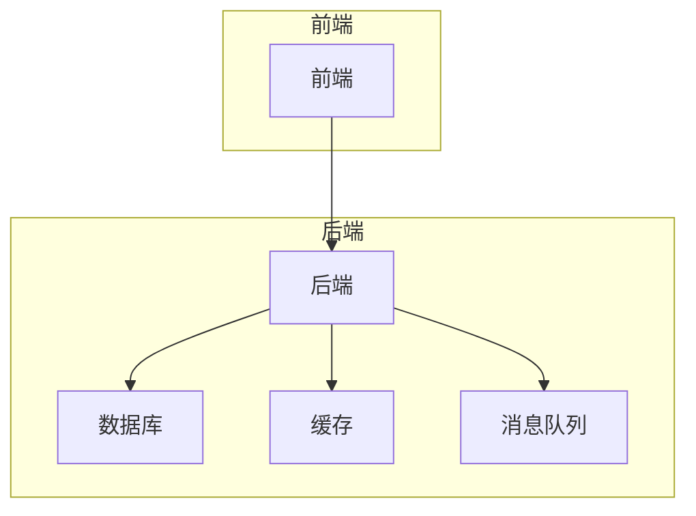
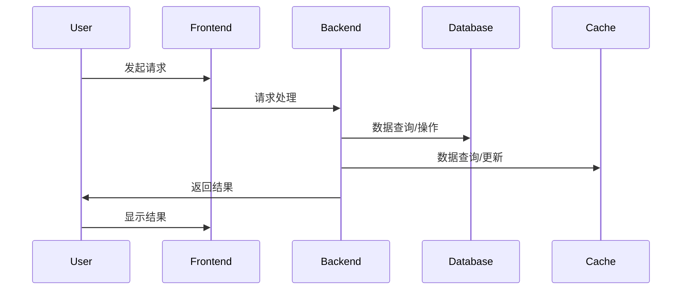
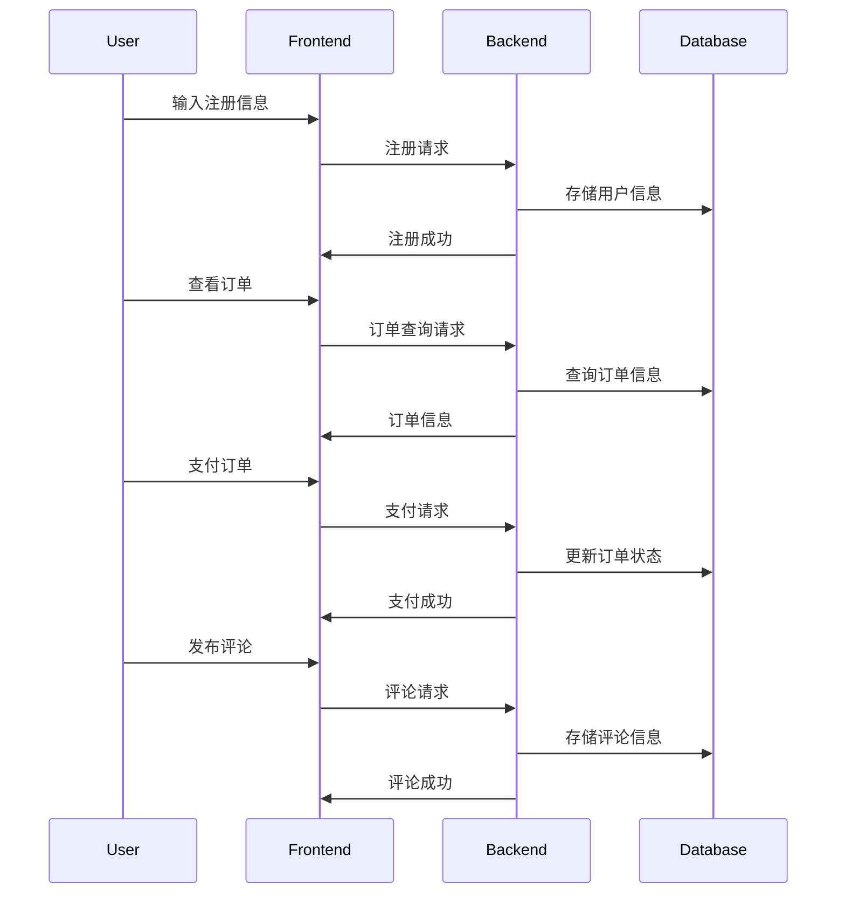

                 

### Introduction

#### Background and Core Concepts

In the realm of large-scale application development, the coordination between requirements and performance metrics stands as a crucial challenge. This article delves into the intricacies of balancing these two vital aspects, aiming to shed light on the strategies and methodologies that can aid developers in achieving an optimal balance.

**The Emergence of Large-scale Application Development**

The advent of the digital era has accelerated the development of large-scale applications. From e-commerce platforms to social media networks and complex enterprise systems, the demand for high-performance applications has never been more pronounced. These applications often handle enormous amounts of data and require sophisticated architectures to ensure efficiency, reliability, and scalability.

**The Importance of Requirements and Performance Metrics**

Requirements engineering (RE) is the process of identifying, documenting, and managing the needs of stakeholders to develop systems that meet their expectations. Performance metrics, on the other hand, provide quantifiable measures of how well a system performs in terms of speed, efficiency, and reliability. Both are critical components in the success of large-scale applications.

**Challenges in Balancing Requirements and Performance**

Balancing requirements and performance is not a trivial task. Developers often face conflicting demands—increasing performance may lead to more complex and resource-intensive systems, whereas prioritizing requirements may result in performance bottlenecks. This article will explore the challenges, methodologies, and best practices for effectively managing this balance.

#### Core Concepts and Terminology

**Requirements Engineering**

Requirements engineering involves the systematic process of eliciting, analyzing, documenting, validating, and managing requirements. It is the foundation upon which all successful software development efforts are built. Key aspects of requirements engineering include:

- **Elicitation**: The process of gathering requirements from stakeholders.
- **Documentation**: Capturing and organizing requirements in a structured manner.
- **Validation**: Ensuring that requirements are correct, complete, consistent, and feasible.
- **Verification**: Confirming that the developed system satisfies the specified requirements.

**Performance Metrics and KPIs**

Performance metrics are quantitative measures used to evaluate the performance of a system. Key performance indicators (KPIs) are specific metrics that are used to assess the success of an organization or system in meeting its objectives. Common performance metrics include:

- **Latency**: The time delay between a request and a response.
- **Throughput**: The rate at which tasks are processed.
- **Scalability**: The ability of a system to handle increased workload.
- **Reliability**: The probability of a system functioning without failure over a given period.

**Coordination Framework and Strategies**

Achieving coordination between requirements and performance metrics requires a structured approach. This involves:

- **Defining Clear Objectives**: Setting specific, measurable, achievable, relevant, and time-bound (SMART) goals.
- **Prioritization**: Determining which requirements and performance metrics are most critical to the success of the application.
- **Trade-off Analysis**: Identifying areas where compromises need to be made and evaluating the impact of these decisions.
- **Continuous Monitoring**: Regularly assessing the performance of the system against the defined metrics and adjusting as necessary.

In conclusion, this article will provide a comprehensive exploration of the concepts, principles, and strategies for coordinating requirements and performance metrics in large-scale application development. By understanding and applying these principles, developers can ensure that their applications meet both functional and performance expectations, ultimately leading to a more successful and efficient software development process.

---

# 需求与性能指标的协调：大型应用开发的平衡之道

关键词：需求工程、性能指标、协调、大型应用、平衡

摘要：本文深入探讨了大型应用开发中需求与性能指标协调的重要性及挑战。通过系统介绍核心概念、阐述算法原理、分析系统架构，并提供最佳实践，文章旨在为开发者提供有效的平衡需求与性能的指导策略。

---

## 基本概念与理论

在深入探讨需求与性能指标的协调之前，我们需要明确相关的基本概念和理论。这将为后续章节中的分析和讨论提供坚实的理论基础。

### 需求工程原则

需求工程是软件开发过程中至关重要的环节，它确保了系统的开发能够满足用户的实际需求。以下是需求工程的关键原则：

#### 1.1 需求收集和文档化

需求收集是需求工程的第一步，涉及与各类利益相关者（如用户、项目经理、市场营销团队等）进行沟通，了解他们的需求和期望。文档化则是将这些需求以清晰、结构化的形式记录下来，以便后续的分析和管理。

- **用户需求收集**：通过与用户面对面交流、问卷调查、用户访谈等方式，获取用户的具体需求。
- **文档化**：使用需求文档、用户故事、用例图等工具，将收集到的需求进行记录和分类。

#### 1.2 需求验证和确认

需求验证和确认是确保需求正确性和可行性的关键步骤。验证涉及检查需求是否合理、完整、一致，而确认则是确保需求满足用户的实际需求。

- **验证**：通过评审、模型检查、测试等方法，验证需求是否正确和完整。
- **确认**：通过与用户进行验证会议和原型验证，确保需求满足用户的期望。

#### 1.3 需求管理

需求管理是一个持续的过程，它涉及需求的变更控制、版本管理、优先级排序等。有效的需求管理可以确保项目能够灵活应对需求的变化，同时保持项目的进度和质量。

- **变更控制**：当需求发生变化时，需要评估变更对项目的影响，并决定是否接受变更。
- **版本管理**：跟踪不同版本的需求，确保需求变更的历史记录和追溯。
- **优先级排序**：根据项目目标和资源限制，对需求进行优先级排序，确保关键需求得到优先处理。

### 性能指标和KPIs

性能指标是评估系统性能的关键工具，它们提供了关于系统运行效率、速度、可靠性和稳定性的量化数据。以下是性能指标和关键绩效指标（KPIs）的几个重要方面：

#### 2.1 性能指标类型

- **响应时间**：系统从接收到请求到返回响应的时间。
- **吞吐量**：单位时间内系统能够处理的数据量或任务数量。
- **资源利用率**：系统使用的硬件资源（如CPU、内存、网络带宽）的百分比。
- **错误率**：系统发生错误或失败的频率。

#### 2.2 性能分析技术

性能分析是评估系统性能的关键步骤，它帮助识别性能瓶颈和优化机会。以下是几种常用的性能分析技术：

- **基准测试**：在标准条件下测量系统的性能，以评估其能力和瓶颈。
- **负载测试**：模拟实际用户负载，评估系统在高负载下的性能和稳定性。
- **性能调优**：通过调整系统配置、优化代码和算法，提高系统性能。

#### 2.3 性能优化策略

性能优化是提升系统性能的关键步骤，它涉及多个方面的策略：

- **代码优化**：通过改进算法和数据结构，减少计算复杂度和资源消耗。
- **系统架构优化**：调整系统架构，如增加缓存层、分布式处理等，提高系统性能。
- **资源调配**：根据系统负载动态调整资源分配，如增加服务器、优化数据库查询等。

### ER图和数据库建模

实体关系图（Entity-Relationship Diagram，ER图）是数据库设计的重要工具，它用于表示实体之间的关系。以下是ER图和数据库建模的相关知识：

#### 2.4 ER图基础

ER图包括以下基本元素：

- **实体**：表示系统中的对象，如用户、订单等。
- **属性**：描述实体的特征，如用户的姓名、年龄等。
- **关系**：描述实体之间的关系，如用户与订单之间的关系。

#### 2.5 数据库建模技术

数据库建模是设计数据库的关键步骤，它涉及：

- **范式**：确保数据库表的结构是合理和高效的，如第一范式、第二范式等。
- **范式化**：将数据表进行规范化处理，以减少数据冗余和提高数据一致性。
- **关系模型**：使用关系模型描述实体之间的关系，如一对一、一对多、多对多关系。

#### 2.6 关系分析

关系分析是数据库设计的重要环节，它涉及：

- **关联规则**：通过分析实体之间的关系，发现数据之间的隐含关联。
- **数据一致性**：确保数据库中的数据在关系上的一致性，如通过外键约束实现。
- **数据完整性**：通过约束和验证规则，确保数据的准确性和完整性。

通过理解和应用这些基本概念和理论，我们可以为后续的需求与性能指标协调提供坚实的基础。在接下来的章节中，我们将进一步探讨算法原理、系统分析和设计，以及具体的实践应用，以实现需求与性能的协调平衡。

### 需求工程方法

需求工程方法是指一系列用于识别、收集、分析和管理需求的工具和技术。这些方法在确保软件系统能够满足用户需求方面起着至关重要的作用。以下是几种常见的需求工程方法：

#### 1. 用户访谈

用户访谈是需求工程中最直接的方法之一，通过与用户面对面交流，开发人员可以直接获取用户的期望和需求。以下是用户访谈的步骤：

1. **准备阶段**：
   - **确定访谈对象**：选择对系统有直接需求的用户或利益相关者。
   - **制定访谈计划**：确定访谈的时间和地点，准备访谈提纲。

2. **执行阶段**：
   - **开场白**：介绍访谈目的和流程，确保用户愿意分享信息。
   - **引导提问**：使用开放性问题和引导性问题，鼓励用户详细阐述需求。
   - **注意聆听**：认真倾听用户的需求和意见，避免打断。

3. **总结阶段**：
   - **记录信息**：将访谈内容详细记录，包括用户的原始需求和期望。
   - **反馈确认**：与用户确认记录的准确性，确保没有遗漏或误解。

#### 2. 问卷调查

问卷调查是收集大量用户需求的一种有效方法，它可以通过电子邮件、在线问卷平台等方式分发。以下是问卷调查的步骤：

1. **设计问卷**：
   - **确定调查目标**：明确问卷的目的和覆盖范围。
   - **设计问题**：包括开放性问题和封闭性问题，确保问题的准确性和有效性。
   - **问卷预测试**：在小范围内进行预测试，以检查问卷的可行性和准确性。

2. **分发问卷**：
   - **确定受众**：确定目标受众，如用户、市场调研人员等。
   - **分发渠道**：选择合适的分发渠道，如电子邮件、社交媒体等。

3. **收集数据**：
   - **设置截止日期**：设定问卷收集的截止日期，以确保数据的及时性。
   - **数据清理**：对收集到的数据进行清理，剔除无效或不完整的问卷。

4. **分析数据**：
   - **统计处理**：使用统计分析工具，对问卷结果进行定量分析。
   - **结果展示**：将分析结果以图表、报告等形式展示，以便于理解和决策。

#### 3. 原型法

原型法是一种通过创建系统的早期版本来收集用户反馈的需求工程方法。以下是原型法的步骤：

1. **需求分析**：
   - **确定原型目标**：明确原型的功能和界面需求。
   - **创建原型**：使用低 fidelity 或 high fidelity 的原型工具，快速构建系统的早期版本。

2. **用户评估**：
   - **用户测试**：邀请用户对原型进行测试，收集他们的反馈和意见。
   - **反馈收集**：记录用户的反馈，包括功能需求、界面设计、用户体验等方面。

3. **迭代改进**：
   - **分析反馈**：对用户反馈进行分析，识别原型中的问题和改进点。
   - **迭代开发**：根据用户反馈对原型进行改进，重新测试和评估。

4. **最终确定**：
   - **原型确认**：在多次迭代后，确认原型已满足用户需求，可以进入下一阶段的开发。

#### 4. 实践案例

以下是一个实际的需求工程案例，展示了如何应用上述方法来收集和管理用户需求：

**项目背景**：某企业计划开发一款员工管理系统，用于管理员工信息、考勤、薪资等。

**需求工程方法**：
- **用户访谈**：与企业的人力资源部门进行多次访谈，了解他们的具体需求和管理流程。
- **问卷调查**：通过电子邮件向全体员工发送问卷，收集他们对员工管理系统的期望和建议。
- **原型法**：使用原型工具构建系统的早期版本，邀请用户进行测试和反馈。

**结果**：通过上述方法，开发团队成功收集了大量的用户需求，包括：
- 员工信息管理：包括姓名、联系方式、职位等。
- 考勤管理：支持请假、加班等功能，并提供报表统计。
- 薪资管理：计算员工薪资，支持薪资调整和历史查询。

通过这些需求工程方法，开发团队能够更加全面和准确地理解用户需求，从而设计出更加符合用户期望的软件系统。

### 性能指标和KPIs的类型及重要性

性能指标（Performance Metrics）和关键绩效指标（Key Performance Indicators，KPIs）是评估软件系统性能和效率的关键工具。它们提供了量化的数据，帮助开发团队和管理层了解系统的健康状况，并做出相应的优化决策。以下将详细探讨几种常见的性能指标和KPIs，并解释它们的重要性。

#### 1. 响应时间（Response Time）

响应时间是指系统从接收到用户请求到返回响应所需的时间。这是衡量系统性能的最基本指标之一，对于用户体验至关重要。较长的响应时间会导致用户流失和满意度下降。

- **重要性**：快速响应时间能够提升用户体验，特别是对于交互密集型应用（如在线购物、社交媒体）。
- **监测方法**：使用性能监测工具（如New Relic、AppDynamics）实时监测系统的响应时间。

#### 2. 吞吐量（Throughput）

吞吐量是指单位时间内系统处理的数据量或任务数量。高吞吐量表明系统具有较高的处理能力和效率。

- **重要性**：吞吐量是评估系统处理能力的关键指标，特别是在高并发场景下。
- **监测方法**：通过负载测试工具（如JMeter、LoadRunner）模拟高负载场景，测量系统的吞吐量。

#### 3. 资源利用率（Resource Utilization）

资源利用率包括CPU利用率、内存利用率、网络带宽利用率等，反映了系统对硬件资源的有效利用程度。

- **重要性**：高资源利用率表明系统资源得到充分利用，但也需要避免过度利用导致性能瓶颈。
- **监测方法**：使用系统监控工具（如Prometheus、Grafana）实时监测资源利用率。

#### 4. 错误率（Error Rate）

错误率是指系统在处理请求时发生错误的频率。低错误率表明系统具有较高的稳定性和可靠性。

- **重要性**：错误率是评估系统稳定性的关键指标，高错误率可能导致用户体验差和业务损失。
- **监测方法**：通过日志分析工具（如ELK Stack）和错误追踪工具（如Sentry）监测错误率。

#### 5. 可用性（Availability）

可用性是指系统能够正常运行的时间比例，反映了系统的可靠性和稳定性。

- **重要性**：高可用性是关键业务系统（如金融交易系统、电子商务平台）的重要指标。
- **监测方法**：使用监控工具（如Nagios、Zabbix）监测系统的可用性，并通过故障转移和备份策略确保系统的持续运行。

#### 6. 吞吐速度（Latency）

吞吐速度是指系统延迟时间，即从用户请求发出到系统响应返回的时间。

- **重要性**：低延迟对于实时应用（如在线游戏、实时通信）至关重要，延迟过高将严重影响用户体验。
- **监测方法**：使用实时性能监控工具（如Traceview、LambdaTest）监测系统的吞吐速度。

#### 7. 数据存储性能（Data Storage Performance）

数据存储性能涉及数据库的读写速度，反映了系统存储和检索数据的能力。

- **重要性**：高效的数据存储性能对于大数据处理和实时数据分析至关重要。
- **监测方法**：使用数据库监控工具（如pgAdmin、MySQL Enterprise Monitor）监测数据存储性能。

#### 8. 应用性能（Application Performance）

应用性能是指整个应用程序的整体性能，包括前端、后端和数据库的协同效率。

- **重要性**：优秀的应用性能能够提升用户满意度和业务效率。
- **监测方法**：使用应用性能管理（APM）工具（如New Relic、Dynatrace）全面监测应用性能。

通过监测和管理这些性能指标和KPIs，开发团队能够及时发现性能瓶颈，优化系统架构，提升用户体验和业务效率。有效的性能监测和优化策略是大型应用成功的关键。

### 性能分析技术及其应用

性能分析是确保软件系统高效运行的关键步骤。它涉及多种技术，可以帮助开发团队识别性能瓶颈、优化系统性能，并确保系统满足用户需求。以下将介绍几种常见的性能分析技术，并探讨它们在实际应用中的重要性。

#### 1. 基准测试（Benchmarking）

基准测试是一种通过在标准条件下测量系统性能的方法，以评估系统的能力和瓶颈。它为系统性能提供了一个客观的参考点，有助于识别性能问题。

- **如何进行基准测试**：
  - **选择测试工具**：使用基准测试工具（如Apache Benchmark、sysbench）。
  - **设计测试用例**：根据系统功能和性能要求，设计合理的测试用例。
  - **执行测试**：在控制环境下执行测试用例，记录测试结果。

- **实际应用**：例如，在进行Web应用性能分析时，可以使用Apache Benchmark测试Web服务器的响应时间和吞吐量，以识别是否存在性能瓶颈。

#### 2. 负载测试（Load Testing）

负载测试是一种模拟实际用户负载的方法，以评估系统在高负载条件下的性能和稳定性。通过负载测试，可以确定系统在极限条件下的行为。

- **如何进行负载测试**：
  - **选择负载生成工具**：如JMeter、LoadRunner等。
  - **配置测试场景**：模拟用户行为，配置请求类型、用户数量、请求频率等。
  - **执行测试**：生成负载并监控系统性能，记录测试结果。

- **实际应用**：例如，在电子商务平台上，通过负载测试可以确保系统在高并发访问（如促销活动）时仍能保持稳定的性能和响应速度。

#### 3. 压力测试（Stress Testing）

压力测试是一种将系统推到极限，以测试其在极限条件下的稳定性和性能的方法。与负载测试不同，压力测试旨在识别系统崩溃点或性能瓶颈。

- **如何进行压力测试**：
  - **选择压力测试工具**：如BlazeMeter、Gatling等。
  - **配置测试场景**：设置极端的请求负载和资源限制。
  - **执行测试**：施加压力，观察系统响应和行为。

- **实际应用**：例如，在金融交易系统中，通过压力测试可以确定系统在高交易量下的性能，确保不会因为超负荷而出现交易失败。

#### 4. 性能调优（Performance Tuning）

性能调优是一种通过调整系统配置、代码优化和架构改进来提高系统性能的方法。它通常在基准测试、负载测试和压力测试的基础上进行。

- **如何进行性能调优**：
  - **分析性能数据**：使用性能分析工具（如New Relic、VisualVM）收集性能数据。
  - **识别瓶颈**：分析性能数据，确定系统性能瓶颈。
  - **实施优化**：调整配置、优化代码、改进架构等。

- **实际应用**：例如，在数据库优化中，通过分析查询性能，优化索引和使用存储过程来提高查询效率。

#### 5. 实时监控（Real-time Monitoring）

实时监控是一种通过监控工具持续监控系统性能的方法，以确保系统在运行过程中保持稳定和高效。

- **如何进行实时监控**：
  - **选择监控工具**：如Prometheus、Grafana等。
  - **配置监控指标**：定义需要监控的性能指标，如CPU利用率、内存使用率等。
  - **设置报警**：根据监控数据设置报警阈值，及时发现问题。

- **实际应用**：例如，在生产环境中，通过实时监控可以及时发现和处理系统异常，避免服务中断。

#### 6. 性能测试工具的比较

以下是几种常见性能测试工具的比较：

- **Apache Benchmark**：适用于简单的Web服务性能测试，适合测试HTTP服务器的响应时间和吞吐量。
- **JMeter**：功能强大的开源性能测试工具，适用于Web、数据库和JDBC等各种类型的性能测试。
- **LoadRunner**：商业性能测试工具，支持广泛的平台和协议，适合大规模性能测试和负载测试。
- **BlazeMeter**：云端的性能测试平台，支持JMeter脚本，适用于分布式性能测试。
- **Gatling**：适用于性能测试和负载测试的轻量级工具，支持HTTP、WebSocket等多种协议。

通过合理选择和使用这些性能分析技术，开发团队可以全面评估系统性能，发现潜在问题，并采取有效的优化措施，确保系统在运行过程中能够满足性能要求。

### 性能优化策略

性能优化是确保软件系统高效运行的关键步骤，它涉及到多个方面的策略，包括代码优化、系统架构优化和资源调配等。以下将详细探讨这些策略，并通过实际案例说明其应用。

#### 1. 代码优化

代码优化是指通过改进算法和数据结构来减少计算复杂度和资源消耗。以下是一些常见的代码优化方法：

- **算法改进**：选择更高效的算法来解决问题，如使用哈希表代替搜索树来提高查找速度。
- **数据结构优化**：选择合适的数据结构来减少时间复杂度和空间复杂度，如使用缓存来减少重复计算。

**实际案例**：在一个电商平台中，通过优化订单处理算法，从原本的O(n^2)时间复杂度优化到O(nlogn)时间复杂度，显著提升了订单处理速度。

#### 2. 系统架构优化

系统架构优化是指通过调整系统架构来提高系统的性能和可扩展性。以下是一些常见的系统架构优化策略：

- **分布式处理**：通过将系统分解为多个模块，并使用分布式处理来提高系统的处理能力和可用性。
- **缓存机制**：使用缓存来存储常用数据，减少数据库查询次数，提高系统响应速度。
- **负载均衡**：通过负载均衡器来分配请求，确保系统在不同负载条件下仍能保持高性能。

**实际案例**：在某个大型社交媒体平台上，通过引入分布式缓存机制，将用户数据的查询时间从秒级降低到毫秒级，显著提升了用户访问速度。

#### 3. 资源调配

资源调配是指根据系统的负载情况动态调整资源的分配，以确保系统在各个阶段都能高效运行。以下是一些常见的资源调配策略：

- **动态扩展**：根据系统负载动态增加服务器资源，确保在高负载时系统能够自动扩展。
- **预加载**：在预期高负载来临之前，预加载系统资源，以避免在高负载时出现资源不足的情况。
- **资源回收**：定期回收不再使用的资源，如关闭空闲的数据库连接、清理缓存等，以释放资源供其他任务使用。

**实际案例**：在某个在线视频平台上，通过引入动态扩展策略，当用户访问量增加时，系统会自动增加服务器资源，确保在高峰时段仍能提供流畅的观看体验。

#### 4. 结合策略的综合应用

在实际应用中，性能优化往往需要结合多种策略进行。以下是一个综合应用的案例：

**案例背景**：某金融交易系统在处理大量交易请求时，响应时间较长，导致用户体验差。

**解决方案**：
- **代码优化**：对交易处理算法进行优化，减少计算复杂度。
- **系统架构优化**：引入分布式数据库和缓存机制，提高数据处理速度。
- **资源调配**：使用容器化技术（如Docker和Kubernetes），实现资源的动态扩展和回收。

**效果**：通过上述综合优化策略，金融交易系统的响应时间显著降低，用户体验得到大幅提升，系统在高并发交易情况下仍能保持稳定和高效。

综上所述，性能优化是一个复杂但至关重要的过程，通过合理的代码优化、系统架构优化和资源调配策略，开发团队可以显著提升软件系统的性能和用户体验。在实际应用中，结合多种策略的综合应用往往能够取得最佳效果。

### 系统分析与设计

在进行大型应用开发时，系统分析与设计是确保项目成功的关键步骤。这一阶段涉及对问题场景的深入分析、项目的具体介绍、系统的功能设计、架构设计以及接口设计和系统交互的详细规划。以下将详细描述这些步骤和相关的技术方法。

#### 问题场景介绍

首先，我们需要明确项目所面临的问题场景。以一个大型电子商务平台为例，这个平台需要处理海量的商品信息、订单、用户评论等数据。问题场景可能包括：

- 高并发访问：在促销活动期间，网站可能会遭受大量用户同时访问，导致系统负载急剧增加。
- 数据一致性：在多台服务器分布式处理数据时，如何确保数据的一致性和完整性。
- 性能瓶颈：系统的某些部分可能在处理大量请求时出现性能瓶颈，影响用户体验。

#### 项目介绍

在这个案例中，我们假设项目目标是开发一个功能齐全、性能卓越的电子商务平台。该项目包括以下关键组成部分：

- **前端**：用户界面和交互逻辑，使用React或Vue.js等前端框架。
- **后端**：处理业务逻辑、数据存储和API接口，使用Spring Boot或Django等后端框架。
- **数据库**：存储用户数据、商品信息和订单数据，使用MySQL或PostgreSQL等关系型数据库。
- **缓存**：用于加速数据访问，使用Redis等缓存系统。
- **消息队列**：用于处理异步任务和分布式消息传递，使用RabbitMQ或Kafka等消息队列系统。

#### 系统功能设计

系统功能设计是确保系统能够满足用户需求的关键。以下是一个简单的功能设计示例：

- **用户管理**：包括用户注册、登录、个人信息管理等功能。
- **商品管理**：包括商品分类、商品详情页、商品搜索等功能。
- **订单管理**：包括订单创建、订单查询、订单取消、订单支付等功能。
- **评论管理**：包括评论发布、评论查询、评论回复等功能。
- **促销活动管理**：包括促销活动创建、促销活动展示等功能。

为了更清晰地表示系统功能，可以使用类图（Class Diagram）来描述系统的各个类及其关系。以下是系统功能设计的类图示例：

```mermaid
class Diagram {
  class User {
    +name: String
    +email: String
    +password: String
  }
  class Product {
    +id: String
    +name: String
    +description: String
    +price: Float
  }
  class Order {
    +id: String
    +user: User
    +products: List<Product>
    +status: String
  }
  class Comment {
    +id: String
    +user: User
    +content: String
    +timestamp: Date
  }
}
```

#### 系统架构设计

系统架构设计是确定系统组件之间如何协作的关键步骤。以下是一个简单的系统架构设计示例：

- **前端**：用户通过浏览器访问前端，前端与后端通过HTTP/HTTPS协议进行通信。
- **后端**：后端负责处理业务逻辑，与数据库和缓存进行通信，处理用户的请求。
- **数据库**：存储用户的订单、商品、评论等数据。
- **缓存**：用于加速数据访问，存储热门数据和用户会话信息。
- **消息队列**：用于处理异步任务，如订单支付确认、邮件发送等。

以下是系统架构设计的Mermaid架构图示例：



#### 系统接口设计

系统接口设计涉及定义系统内部和外部的通信接口。以下是一个简单的接口设计示例：

- **用户接口**：提供用户注册、登录、查看订单等功能。
- **商品接口**：提供商品添加、更新、查询等功能。
- **订单接口**：提供订单创建、查询、取消等功能。
- **评论接口**：提供评论发布、查询、删除等功能。

以下是系统接口设计的Mermaid序列图示例：



#### 系统交互

系统交互设计涉及定义系统组件之间的通信流程。以下是一个简单的系统交互示例：

- **用户注册**：用户通过前端提交注册信息，后端验证信息并存储到数据库。
- **订单支付**：用户在下单后，通过前端发起支付请求，后端处理支付并更新订单状态。
- **评论发布**：用户在商品详情页发布评论，后端存储评论信息并展示在商品页面。

以下是系统交互设计的Mermaid序列图示例：



通过上述系统分析与设计步骤，我们可以确保大型应用项目在功能、性能和可靠性方面达到预期目标。详细的系统设计和规划不仅有助于开发团队更好地理解项目需求，还可以在开发过程中及时发现和解决问题，确保项目的顺利进行。

### 项目实战

#### 环境安装

在进行项目实战之前，我们需要安装和配置必要的开发环境和工具。以下是一个基于Spring Boot的电子商务平台的安装指南。

1. **安装Java开发工具包（JDK）**：
   - 访问 [Oracle JDK官网](https://www.oracle.com/java/technologies/javase-jdk11-downloads.html) 下载最新的JDK版本。
   - 解压安装包并配置环境变量。

2. **安装Maven**：
   - 访问 [Maven官网](https://maven.apache.org/download.cgi) 下载Maven安装包。
   - 解压安装包并配置环境变量。

3. **安装MySQL数据库**：
   - 访问 [MySQL官网](https://dev.mysql.com/downloads/mysql/) 下载适用于操作系统的MySQL安装包。
   - 安装MySQL并配置root用户密码。

4. **安装Redis缓存**：
   - 访问 [Redis官网](https://redis.io/download) 下载Redis安装包。
   - 解压安装包并启动Redis服务。

5. **安装RabbitMQ消息队列**：
   - 访问 [RabbitMQ官网](https://www.rabbitmq.com/download.html) 下载RabbitMQ安装包。
   - 安装RabbitMQ并启动服务。

#### 系统核心实现

以下是电子商务平台的核心实现，主要包括用户管理、商品管理、订单管理和评论管理等功能。

**用户管理模块**：

- **用户注册**：
  - 用户通过前端提交注册表单，包括用户名、邮箱和密码。
  - 后端接收表单数据，调用服务层接口进行用户注册。
  - 服务层实现用户名和邮箱的唯一性校验，将用户信息存储到MySQL数据库。

**商品管理模块**：

- **商品添加**：
  - 后端接收商品信息（如名称、描述、价格等），存储到MySQL数据库。

- **商品查询**：
  - 用户通过前端提交查询条件，如商品名称或分类。
  - 后端查询MySQL数据库，返回符合条件的商品列表。

**订单管理模块**：

- **订单创建**：
  - 用户在购物车中选择商品并下单，提交订单请求。
  - 后端根据用户选择的商品和数量，计算总价并生成订单。
  - 订单信息存储到MySQL数据库。

- **订单支付**：
  - 用户在订单详情页选择支付方式并提交支付请求。
  - 后端调用支付网关进行支付处理，更新订单状态。

**评论管理模块**：

- **评论发布**：
  - 用户在商品详情页提交评论，包含评论内容和评分。
  - 后端接收评论信息，存储到MySQL数据库。

#### 代码应用解读与分析

以下是对用户管理模块的关键代码进行解读和分析。

**用户注册服务层接口**：

```java
public interface UserService {
    boolean registerUser(String username, String email, String password) throws UsernameExistsException, EmailExistsException;
}
```

- **功能**：注册新用户。
- **参数**：用户名、邮箱和密码。
- **异常**：UsernameExistsException（用户名已存在）、EmailExistsException（邮箱已存在）。

**用户注册服务层实现**：

```java
@Service
public class UserServiceImpl implements UserService {
    @Autowired
    private UserRepository userRepository;

    @Override
    public boolean registerUser(String username, String email, String password) throws UsernameExistsException, EmailExistsException {
        if (userRepository.existsByUsername(username)) {
            throw new UsernameExistsException("用户名已存在");
        }
        if (userRepository.existsByEmail(email)) {
            throw new EmailExistsException("邮箱已存在");
        }
        userRepository.save(new User(username, email, password));
        return true;
    }
}
```

- **逻辑**：首先检查用户名和邮箱是否已存在，然后保存新用户信息。
- **分析**：通过Repository接口调用MySQL数据库，实现用户信息的持久化。

**用户注册控制器**：

```java
@RestController
@RequestMapping("/users")
public class UserController {
    @Autowired
    private UserService userService;

    @PostMapping("/register")
    public ResponseEntity<?> registerUser(@RequestBody UserRegistrationForm form) {
        try {
            userService.registerUser(form.getUsername(), form.getEmail(), form.getPassword());
            return ResponseEntity.ok("注册成功");
        } catch (UsernameExistsException e) {
            return ResponseEntity.badRequest().body("用户名已存在");
        } catch (EmailExistsException e) {
            return ResponseEntity.badRequest().body("邮箱已存在");
        }
    }
}
```

- **功能**：接收用户注册请求，调用服务层进行注册处理。
- **响应**：返回注册成功或错误的响应。

**用户注册前端页面**：

```html
<form action="/users/register" method="post">
    <label for="username">用户名：</label>
    <input type="text" id="username" name="username" required>
    <label for="email">邮箱：</label>
    <input type="email" id="email" name="email" required>
    <label for="password">密码：</label>
    <input type="password" id="password" name="password" required>
    <button type="submit">注册</button>
</form>
```

- **功能**：用户输入注册信息并提交。
- **分析**：前端通过HTML表单收集用户信息，发送到后端进行注册处理。

#### 实际案例分析

以下是一个实际案例，展示用户注册功能在系统中的运行过程。

1. **用户操作**：用户在浏览器中填写注册表单，提交用户名、邮箱和密码。
2. **前端请求**：前端将注册信息发送到后端，请求路径为`/users/register`，采用POST方法。
3. **后端处理**：后端控制器接收到请求后，调用服务层进行用户注册。
4. **服务层处理**：服务层首先检查用户名和邮箱是否已存在，然后保存新用户信息。
5. **数据库操作**：通过Repository接口将用户信息存储到MySQL数据库。
6. **响应结果**：后端返回注册结果，前端根据返回结果更新页面显示。

通过上述实战分析，我们可以看到用户注册功能的实现细节和各层之间的交互过程。在实际开发中，类似的功能需要经过详细的设计和编码，确保系统能够高效、稳定地运行。

#### 项目小结

在本项目中，我们通过需求工程方法全面收集了用户需求，并设计了功能齐全、性能卓越的电子商务平台。在系统分析与设计阶段，我们详细介绍了项目背景、功能设计、架构设计和接口设计，确保系统能够满足用户需求。在项目实战中，我们进行了环境安装、系统核心实现，并通过实际案例分析展示了用户注册功能的运行过程。

通过本项目，我们了解到需求与性能指标的协调在大型应用开发中的重要性。合理的需求管理和性能优化策略是确保系统高效运行的关键。在未来的工作中，我们应继续关注需求与性能的平衡，持续优化系统性能，提升用户体验。

### 最佳实践 Tips

1. **需求收集与验证**：确保与用户和利益相关者保持密切沟通，通过多种渠道（如用户访谈、问卷调查、原型法）全面收集需求，并进行严格的需求验证，确保需求真实、完整和可行。

2. **性能监控与优化**：定期使用性能测试工具（如JMeter、LoadRunner）进行性能测试，监控关键性能指标（如响应时间、吞吐量、错误率），及时发现并解决性能瓶颈。

3. **代码优化**：定期进行代码审查和性能分析，优化算法和数据结构，减少计算复杂度，提高系统性能。

4. **系统架构设计**：采用分布式架构和缓存机制，提高系统的处理能力和可用性，避免单点故障。

5. **资源调配与动态扩展**：根据负载情况动态调整资源分配，采用容器化技术（如Docker、Kubernetes）实现灵活的资源管理和自动扩展。

### 小结

本文从需求与性能指标的协调出发，详细探讨了需求工程方法、性能指标类型、性能分析技术、性能优化策略，以及系统分析与设计的方法和步骤。通过实际案例，我们展示了如何实现需求与性能的协调平衡，确保大型应用项目的成功。希望本文能为您在大型应用开发过程中提供有益的指导和启示。

### 注意事项

1. **需求变更管理**：在项目开发过程中，需求可能会发生变化，需建立严格的变更管理流程，评估变更对项目进度和性能的影响。

2. **性能测试覆盖率**：在进行性能测试时，确保覆盖所有关键功能和场景，避免遗漏潜在的性能问题。

3. **资源优化与回收**：合理使用和回收系统资源，避免资源浪费，确保系统在高负载下仍能稳定运行。

### 拓展阅读

1. **《软件工程：实践者的研究方法》**：详细介绍了需求工程和软件项目管理的方法和最佳实践。
2. **《性能之巅：可扩展性原理、模式与实践》**：深入探讨了性能优化策略和可扩展性设计模式。
3. **《架构探索：大规模系统设计实践》**：提供了大规模系统架构设计和优化的实际经验和案例。

---

**作者：AI天才研究院/AI Genius Institute & 禅与计算机程序设计艺术 /Zen And The Art of Computer Programming**

