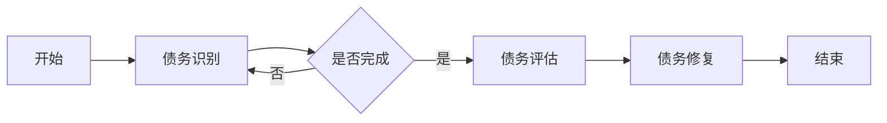
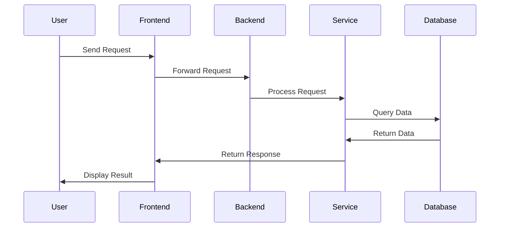
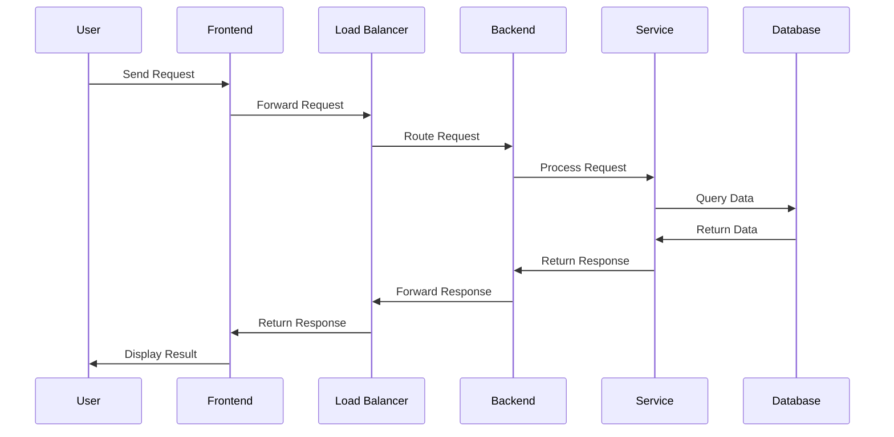

                 

# 需求与技术债务管理：确保大型应用的长期可维护性

> 关键词：技术债务，需求管理，大型应用，可维护性，架构设计

> 摘要：本文深入探讨了大型应用中技术债务和需求管理的重要性，阐述了技术债务的定义、特征以及其与需求管理的关联性。通过分析技术债务评估与度量的方法，本文提出了需求管理的基本原则与策略。接着，本文探讨了技术债务的主动管理、需求管理的有效实践以及需求与技术债务的协同管理方法。最后，本文介绍了如何通过合理的架构设计实现大型应用的长期可维护性。本文旨在为开发者提供一套系统化、可操作的管理方法，以确保大型应用的长期健康发展。

## 第一部分：问题背景与概念解析

### 第1章：问题的起源与重要性

#### 1.1.1 问题背景

在当今快速发展的信息技术时代，大型应用已经成为企业竞争的重要利器。然而，随着应用的规模和复杂度的不断增加，技术债务和需求管理的问题逐渐凸显出来。

**1.1.1.1 大型应用的发展趋势**

近年来，随着云计算、大数据、物联网等新兴技术的普及，大型应用的开发和使用已经成为了企业业务创新和发展的关键。这些应用往往需要处理海量数据，提供高性能、高可用性和可扩展性的服务。

**1.1.1.2 技术债务的概念引入**

技术债务，顾名思义，是指在软件开发过程中，为了加快开发进度或满足某些短期需求，而有意或无意地引入的潜在问题和隐患。这些隐患可能会在未来的某个时刻导致开发成本的增加、维护难度的上升甚至系统崩溃。

**1.1.1.3 需求管理与技术债务的关系**

需求管理是确保软件开发满足用户需求的重要环节。然而，在需求管理过程中，可能会因为需求的不确定性、变更的频繁性等问题，导致技术债务的产生。同时，技术债务的存在也会影响需求管理的有效性。

#### 1.1.2 技术债务的定义与特征

**1.1.2.1 技术债务的定义**

技术债务是指软件开发中因追求短期利益而牺牲长期利益，导致潜在问题和隐患的出现。技术债务的本质是时间换空间，即通过牺牲未来的时间和资源来换取当前的开发效率。

**1.1.2.2 技术债务的特征**

- **隐性：** 技术债务通常不是立即显现的问题，而是随着应用的不断扩展和时间的推移逐渐暴露出来。
- **累积性：** 技术债务在软件开发过程中会不断累积，一旦达到一定程度，就会对系统的稳定性、性能和可维护性产生严重影响。
- **可转移性：** 技术债务可以通过代码重构、系统升级等方式进行转移，但转移过程中可能会带来新的问题和风险。

**1.1.2.3 技术债务的分类**

根据产生原因和影响范围，技术债务可以分为以下几类：

- **技术设计债务：** 在软件设计阶段，因设计不合理、架构不清晰等问题产生的债务。
- **代码质量债务：** 在软件开发过程中，因代码质量差、代码冗余等问题产生的债务。
- **测试债务：** 在软件测试阶段，因测试不充分、测试覆盖不足等问题产生的债务。
- **文档债务：** 在软件开发过程中，因文档不完善、更新不及时等问题产生的债务。

#### 1.1.3 需求管理的概念与挑战

**1.1.3.1 需求管理的定义**

需求管理是指在整个软件开发生命周期中，识别、分析、文档化和管理用户需求的过程。需求管理的目的是确保软件开发满足用户的需求，提高软件质量和用户满意度。

**1.1.3.2 需求管理的挑战**

- **需求不确定性：** 在软件开发过程中，用户需求可能会发生变化，这给需求管理带来了很大的挑战。
- **需求变更频繁：** 需求变更的频繁性可能导致技术债务的产生，影响项目的进度和质量。
- **需求表达不清晰：** 用户需求往往不明确或表达不清晰，这给需求分析和实现带来了困难。
- **资源分配不合理：** 需求管理的资源分配不合理可能导致需求无法得到有效管理，影响项目的进展和成果。

#### 1.1.3.3 需求与技术债务的关联性

需求和技术债务之间存在紧密的关联性。一方面，不明确或不合理的用户需求可能导致技术债务的产生；另一方面，技术债务的存在也会影响需求管理的有效性。因此，需求管理和技术债务管理需要相互配合，共同确保大型应用的长期可维护性。

## 第2章：技术债务的评估与度量

### 2.1.1 技术债务评估的方法

**2.1.1.1 技术债务评估的重要性**

技术债务评估是识别和量化技术债务的重要手段，对于确保大型应用的长期可维护性具有重要意义。通过技术债务评估，可以：

- **识别潜在问题：** 提前发现系统中存在的潜在问题和隐患，防止其演变成严重故障。
- **量化债务规模：** 确定技术债务的规模和影响范围，为后续的技术债务管理提供依据。
- **优化资源分配：** 根据技术债务的评估结果，合理分配资源，提高项目效率。

**2.1.1.2 常见的技术债务评估方法**

- **代码质量评估：** 通过代码审查、静态代码分析等技术手段，评估代码的质量和规范性。
- **测试覆盖率评估：** 通过评估测试覆盖率的指标，衡量测试的充分性和有效性。
- **设计评估：** 通过对软件设计文档的审查，评估设计合理性、架构清晰度等。
- **文档评估：** 通过对文档的完整性、准确性、及时性进行评估。

**2.1.1.3 技术债务评估的工具**

- **SonarQube：** 一款强大的代码质量管理工具，支持静态代码分析、代码质量评估等功能。
- **Checkmarx：** 一款代码安全测试工具，可以识别代码中的安全漏洞和技术债务。
- **Sonatype：** 提供软件供应链安全管理服务，帮助识别和修复技术债务。

### 2.1.2 技术债务的度量指标

**2.1.2.1 度量指标的定义**

技术债务的度量指标是量化技术债务的重要手段。通过这些指标，可以全面了解技术债务的规模和影响。常见的度量指标包括：

- **代码质量指标：** 如代码复杂度、代码冗余度、代码重复率等。
- **测试覆盖率指标：** 如单元测试覆盖率、集成测试覆盖率等。
- **设计指标：** 如类关系复杂度、模块依赖度等。
- **文档指标：** 如文档完整性、文档更新频率等。

**2.1.2.2 常用的技术债务度量指标**

- **Technical Debt Ratio (TDR)：** 技术债务比，表示技术债务规模与代码规模的比例。
- **Coding Standard Violation (CSV)：** 代码标准违反次数，表示代码质量问题的严重程度。
- **Test Coverage (TC)：** 测试覆盖率，表示测试覆盖代码的比例。
- **Design Debt (DD)：** 设计债务，表示设计问题的严重程度。

**2.1.2.3 指标选择的考虑因素**

在选择技术债务度量指标时，需要考虑以下几个方面：

- **项目特点：** 根据项目的具体特点，选择适合的度量指标。
- **目标定位：** 明确评估目标，如代码质量、测试覆盖率等。
- **资源限制：** 考虑评估过程中所需的资源和时间，避免过度评估。
- **改进方向：** 根据评估结果，确定改进方向和策略。

### 2.1.3 需求管理的基本原则与策略

#### 2.1.3.1 需求管理的基本原则

- **客户导向：** 以用户需求为中心，确保软件开发满足用户需求。
- **清晰定义：** 对需求进行清晰、准确的定义，避免模糊和歧义。
- **需求变更管理：** 建立健全的需求变更管理流程，确保变更的合理性和可控性。
- **需求文档化：** 对需求进行详细的文档化，便于后续的需求跟踪和变更管理。

#### 2.1.3.2 需求管理的策略

- **需求收集与验证：** 通过用户访谈、问卷调查、需求研讨会等方式，收集用户需求，并进行需求验证，确保需求的真实性和可行性。
- **需求优先级排序：** 根据需求的重要性和紧急程度，对需求进行优先级排序，确保关键需求的优先实现。
- **需求变更控制：** 建立需求变更控制机制，对需求变更进行评估和审批，确保变更的合理性和影响评估。
- **需求跟踪与报告：** 对需求进行全程跟踪和记录，定期向相关方报告需求状态和变更情况，确保需求管理的透明性和可控性。

## 第3章：需求管理的有效实践

### 3.1.1 需求管理的成熟度模型

**3.1.1.1 成熟度模型概述**

需求管理的成熟度模型是一种用于评估和指导需求管理过程的框架。它将需求管理划分为不同的成熟度级别，每个级别都有相应的最佳实践和改进措施。

**3.1.1.2 成熟度级别的定义**

- **级别1：初始级**：需求管理处于无序状态，需求收集和变更管理缺乏系统性和规范性。
- **级别2：可重复级**：需求管理开始形成一定的规范和流程，需求收集和变更管理具备一定的稳定性和可控性。
- **级别3：已定义级**：需求管理形成了一套完整的规范和流程，需求收集、变更管理和需求文档化等方面都达到了较高水平。
- **级别4：量化管理级**：需求管理实现了量化管理，通过数据分析和度量指标，对需求管理过程进行持续改进。
- **级别5：优化级**：需求管理实现了持续优化，需求管理流程和工具得到了不断完善，需求管理效率和质量达到了最高水平。

**3.1.1.3 成熟度评估方法**

成熟度评估方法包括自评估、第三方评估和过程审计等。通过评估，可以了解需求管理的现状和成熟度级别，为后续的需求管理改进提供依据。

### 3.1.2 需求管理工具的应用

**3.1.2.1 常见需求管理工具介绍**

- **JIRA：** 一款功能强大的需求管理工具，支持需求收集、需求变更管理、需求跟踪和报告等功能。
- **Confluence：** 一款知识管理工具，可以用于编写和存储需求文档，便于团队协作和知识共享。
- **Azure DevOps：** 一款集成化的需求管理工具，支持需求收集、需求变更管理、需求跟踪和报告等功能，与Visual Studio Code等开发工具紧密集成。
- **Asana：** 一款协作工具，可以用于需求管理、任务分配和进度跟踪等，适用于跨部门、跨地域的团队协作。

**3.1.2.2 工具的选择与配置**

在选择需求管理工具时，需要考虑以下因素：

- **团队规模和协作需求：** 根据团队的规模和协作需求，选择适合的工具。
- **功能需求：** 根据需求管理的具体需求，选择具备相应功能模块的工具。
- **集成能力：** 考虑工具与其他开发工具、测试工具、持续集成工具等的集成能力。
- **易用性和可扩展性：** 考虑工具的易用性和可扩展性，确保团队可以快速上手和灵活定制。

**3.1.2.3 工具在实际项目中的应用**

在实际项目中，需求管理工具的应用主要包括以下几个方面：

- **需求收集与验证：** 通过需求管理工具，收集用户需求并进行需求验证，确保需求的真实性和可行性。
- **需求变更管理：** 通过需求管理工具，建立需求变更管理流程，对需求变更进行评估、审批和跟踪。
- **需求文档化：** 通过需求管理工具，编写和存储需求文档，便于团队协作和知识共享。
- **需求跟踪与报告：** 通过需求管理工具，对需求进行全程跟踪和记录，定期生成需求报告，向相关方汇报需求状态和变更情况。

### 3.1.3 案例研究：需求管理的最佳实践

#### 3.1.3.1 案例背景

某大型企业开发了一款企业级管理系统，项目周期为2年。在项目实施过程中，企业面临着需求多变、项目进度紧张等挑战。

#### 3.1.3.2 实施过程

1. **需求收集与验证：** 项目团队通过用户访谈、问卷调查、需求研讨会等方式，收集用户需求，并进行了需求验证，确保需求的真实性和可行性。
2. **需求变更管理：** 建立了需求变更管理流程，对需求变更进行评估、审批和跟踪，确保变更的合理性和可控性。
3. **需求文档化：** 通过Confluence编写和存储需求文档，建立了完整的需求文档体系，便于团队协作和知识共享。
4. **需求跟踪与报告：** 通过JIRA对需求进行全程跟踪和记录，定期生成需求报告，向相关方汇报需求状态和变更情况。

#### 3.1.3.3 实施效果

1. **需求管理的效率提高：** 通过需求管理工具的应用，需求收集、变更管理和需求文档化的效率显著提高，项目团队对需求管理的满意度提升。
2. **项目进度的可控性增强：** 通过需求变更管理和需求跟踪，项目进度的可控性增强，项目延期和成本超支的风险降低。
3. **用户满意度提升：** 通过对需求的充分理解和有效管理，项目交付的软件产品更加符合用户需求，用户满意度显著提升。

## 第4章：技术债务的主动管理

### 4.1.1 技术债务管理的目标

技术债务管理的目标主要包括以下几个方面：

- **减少技术债务的积累：** 通过有效的技术债务管理，减少技术债务的积累，降低系统风险。
- **提高代码质量：** 通过技术债务管理，提高代码质量，减少代码缺陷和隐患，提高系统的稳定性和性能。
- **增强团队协作：** 通过技术债务管理，增强团队协作，提高团队的工作效率和凝聚力。

### 4.1.2 技术债务管理的方法

技术债务管理可以分为以下几个阶段：

- **设计阶段的管理：** 在软件设计阶段，通过合理的架构设计和模块划分，减少技术债务的产生。
- **开发阶段的管理：** 在软件开发过程中，通过代码规范、代码审查等技术手段，及时发现和修复技术债务。
- **运维阶段的管理：** 在软件运维过程中，通过监控、预警和修复等技术手段，确保技术债务得到有效管理。

### 4.1.3 案例研究：技术债务管理的成功实践

#### 4.1.3.1 案例介绍

某大型电商平台在项目实施过程中，面临着技术债务积累严重、代码质量低下等问题，导致系统稳定性下降、性能瓶颈突出。为了解决这些问题，企业决定进行技术债务管理。

#### 4.1.3.2 管理策略

1. **设计阶段的管理：** 
   - 采用微服务架构，将系统划分为多个独立的服务模块，降低模块间的依赖关系，减少技术债务的产生。
   - 对关键模块进行详细设计，确保设计合理、架构清晰。

2. **开发阶段的管理：** 
   - 建立代码规范，规范代码编写风格和命名规范，提高代码质量。
   - 实施代码审查制度，对代码进行严格审查，及时发现和修复技术债务。
   - 定期进行技术债务评估，量化技术债务规模，制定针对性的修复计划。

3. **运维阶段的管理：** 
   - 实施系统监控，对系统性能和稳定性进行实时监控，及时发现异常情况。
   - 建立技术债务预警机制，对技术债务进行实时预警，确保技术债务得到及时修复。

#### 4.1.3.3 实施效果

1. **技术债务积累减少：** 通过技术债务管理，技术债务的积累得到有效控制，系统风险降低。

2. **代码质量提高：** 通过代码规范和代码审查，代码质量得到显著提升，代码缺陷和隐患减少。

3. **团队协作增强：** 通过技术债务管理，团队协作更加紧密，工作效率提高，项目进度和质量得到保障。

### 4.1.4 技术债务的主动管理实践

**4.1.4.1 设计阶段的主动管理**

在软件设计阶段，主动管理技术债务至关重要。以下是一些关键实践：

- **架构设计：** 采用微服务架构、分层架构等，确保系统具有良好的扩展性和可维护性。
- **模块划分：** 将系统划分为多个独立模块，降低模块间的耦合度，便于独立开发和维护。
- **设计评审：** 对设计方案进行评审，确保设计合理、架构清晰，减少潜在的技术债务。

**4.1.4.2 开发阶段的主动管理**

在软件开发过程中，以下实践有助于主动管理技术债务：

- **代码规范：** 制定并遵循代码规范，确保代码风格一致、易于理解和维护。
- **代码审查：** 实施代码审查制度，对代码进行严格审查，及时发现和修复技术债务。
- **单元测试：** 编写和执行单元测试，确保代码质量和功能完整性。

**4.1.4.3 运维阶段的主动管理**

在软件运维过程中，以下实践有助于主动管理技术债务：

- **性能监控：** 对系统性能进行实时监控，及时发现性能瓶颈和潜在问题。
- **问题追踪：** 对系统故障和异常进行追踪和定位，确保技术债务得到及时修复。
- **技术升级：** 定期对系统进行技术升级和优化，降低技术债务积累。

### 4.1.5 技术债务管理的最佳实践

**4.1.5.1 设计阶段**

在设计阶段，以下最佳实践有助于减少技术债务的产生：

- **使用设计模式：** 引入设计模式，提高代码的可维护性和可扩展性。
- **代码重构：** 定期进行代码重构，修复潜在的技术债务，提高代码质量。
- **持续集成：** 实施持续集成，确保代码质量和稳定性。

**4.1.5.2 开发阶段**

在开发阶段，以下最佳实践有助于主动管理技术债务：

- **代码规范和审查：** 制定并遵循代码规范，实施代码审查制度，确保代码质量。
- **单元测试和集成测试：** 编写和执行单元测试、集成测试，确保代码质量和功能完整性。
- **技术债务评估：** 定期进行技术债务评估，量化技术债务规模，制定针对性的修复计划。

**4.1.5.3 运维阶段**

在运维阶段，以下最佳实践有助于主动管理技术债务：

- **性能监控和预警：** 对系统性能进行实时监控，设置预警机制，确保技术债务得到及时修复。
- **问题追踪和修复：** 对系统故障和异常进行追踪和定位，确保技术债务得到及时修复。
- **技术升级和优化：** 定期对系统进行技术升级和优化，降低技术债务积累。

## 第5章：需求管理的有效实践

### 5.1.1 需求管理的成熟度模型

**5.1.1.1 成熟度模型概述**

需求管理的成熟度模型是一种用于评估和指导需求管理过程的框架。它将需求管理划分为不同的成熟度级别，每个级别都有相应的最佳实践和改进措施。

**5.1.1.2 成熟度级别的定义**

- **级别1：初始级**：需求管理处于无序状态，需求收集和变更管理缺乏系统性和规范性。
- **级别2：可重复级**：需求管理开始形成一定的规范和流程，需求收集和变更管理具备一定的稳定性和可控性。
- **级别3：已定义级**：需求管理形成了一套完整的规范和流程，需求收集、变更管理和需求文档化等方面都达到了较高水平。
- **级别4：量化管理级**：需求管理实现了量化管理，通过数据分析和度量指标，对需求管理过程进行持续改进。
- **级别5：优化级**：需求管理实现了持续优化，需求管理流程和工具得到了不断完善，需求管理效率和质量达到了最高水平。

**5.1.1.3 成熟度评估方法**

成熟度评估方法包括自评估、第三方评估和过程审计等。通过评估，可以了解需求管理的现状和成熟度级别，为后续的需求管理改进提供依据。

### 5.1.2 需求管理工具的应用

**5.1.2.1 常见需求管理工具介绍**

- **JIRA：** 一款功能强大的需求管理工具，支持需求收集、需求变更管理、需求跟踪和报告等功能。
- **Confluence：** 一款知识管理工具，可以用于编写和存储需求文档，便于团队协作和知识共享。
- **Azure DevOps：** 一款集成化的需求管理工具，支持需求收集、需求变更管理、需求跟踪和报告等功能，与Visual Studio Code等开发工具紧密集成。
- **Asana：** 一款协作工具，可以用于需求管理、任务分配和进度跟踪等，适用于跨部门、跨地域的团队协作。

**5.1.2.2 工具的选择与配置**

在选择需求管理工具时，需要考虑以下因素：

- **团队规模和协作需求：** 根据团队的规模和协作需求，选择适合的工具。
- **功能需求：** 根据需求管理的具体需求，选择具备相应功能模块的工具。
- **集成能力：** 考虑工具与其他开发工具、测试工具、持续集成工具等的集成能力。
- **易用性和可扩展性：** 考虑工具的易用性和可扩展性，确保团队可以快速上手和灵活定制。

**5.1.2.3 工具在实际项目中的应用**

在实际项目中，需求管理工具的应用主要包括以下几个方面：

- **需求收集与验证：** 通过需求管理工具，收集用户需求并进行需求验证，确保需求的真实性和可行性。
- **需求变更管理：** 通过需求管理工具，建立需求变更管理流程，对需求变更进行评估、审批和跟踪。
- **需求文档化：** 通过需求管理工具，编写和存储需求文档，便于团队协作和知识共享。
- **需求跟踪与报告：** 通过需求管理工具，对需求进行全程跟踪和记录，定期生成需求报告，向相关方汇报需求状态和变更情况。

### 5.1.3 案例研究：需求管理的最佳实践

#### 5.1.3.1 案例背景

某大型企业在开发一款企业级CRM系统时，面临着需求多变、项目进度紧张等挑战。为了确保项目成功，企业决定采用需求管理的最佳实践。

#### 5.1.3.2 实施过程

1. **需求收集与验证：** 项目团队通过用户访谈、问卷调查、需求研讨会等方式，收集用户需求，并进行了需求验证，确保需求的真实性和可行性。

2. **需求变更管理：** 建立了需求变更管理流程，对需求变更进行评估、审批和跟踪，确保变更的合理性和可控性。

3. **需求文档化：** 通过Confluence编写和存储需求文档，建立了完整的需求文档体系，便于团队协作和知识共享。

4. **需求跟踪与报告：** 通过JIRA对需求进行全程跟踪和记录，定期生成需求报告，向相关方汇报需求状态和变更情况。

#### 5.1.3.3 实施效果

1. **需求管理的效率提高：** 通过需求管理工具的应用，需求收集、变更管理和需求文档化的效率显著提高，项目团队对需求管理的满意度提升。

2. **项目进度的可控性增强：** 通过需求变更管理和需求跟踪，项目进度的可控性增强，项目延期和成本超支的风险降低。

3. **用户满意度提升：** 通过对需求的充分理解和有效管理，项目交付的软件产品更加符合用户需求，用户满意度显著提升。

### 5.1.4 需求管理的有效实践

**5.1.4.1 需求收集与验证**

- **用户访谈：** 通过与用户进行面对面交流，了解用户的实际需求和痛点，收集到真实、有价值的需求信息。
- **问卷调查：** 通过设计问卷调查，收集大量用户反馈，以便全面了解用户需求。
- **需求研讨会：** 组织需求研讨会，邀请用户、项目经理、开发人员等多方参与，共同讨论和确定需求。

**5.1.4.2 需求变更管理**

- **建立变更管理流程：** 制定明确的变更管理流程，对需求变更进行评估、审批和跟踪，确保变更的合理性和可控性。
- **变更评估：** 对变更的影响范围、风险和成本进行评估，确保变更的可行性。
- **变更审批：** 设立变更审批机制，对变更进行审批，确保变更的合理性和优先级。

**5.1.4.3 需求文档化**

- **编写需求文档：** 通过编写需求文档，明确需求的范围、功能、性能等要求，为后续开发提供依据。
- **需求评审：** 对需求文档进行评审，确保需求的完整性、一致性和可行性。
- **文档更新：** 需求变更时，及时更新需求文档，保持文档的准确性和实时性。

**5.1.4.4 需求跟踪与报告**

- **需求跟踪：** 通过需求管理工具，对需求进行全程跟踪和记录，确保需求的执行情况清晰可查。
- **定期报告：** 定期生成需求报告，向相关方汇报需求状态和变更情况，确保项目进度和风险管理。

## 第6章：需求与技术债务的协同管理

### 6.1.1 需求与技术债务的关系

需求与技术债务之间存在密切的关系。一方面，需求的变化和不确定性可能导致技术债务的产生；另一方面，技术债务的存在也会影响需求的有效管理。

**6.1.1.1 需求变化对技术债务的影响**

- **需求变更频繁：** 需求变更的频繁性可能导致技术债务的累积。在应对需求变更时，开发团队可能会采取快速开发的策略，从而引入技术债务。
- **需求不明确：** 需求表达不清晰或需求不明确可能导致技术债务的产生。开发团队在实现需求时，可能需要花费额外的时间和资源来理解和调整需求。

**6.1.1.2 技术债务对需求实现的影响**

- **影响需求实现：** 技术债务的存在可能导致需求无法按计划实现。技术债务积累到一定程度时，系统性能下降、代码质量下降，从而影响需求的实现。
- **增加维护成本：** 技术债务的存在可能导致维护成本的增加。修复技术债务可能需要额外的资源和时间，从而影响项目的进度和成本。

**6.1.1.3 需求与技术债务的协同管理**

为了确保大型应用的长期可维护性，需求与技术债务需要协同管理。以下是一些协同管理的方法：

- **需求评估：** 在需求收集和验证阶段，对需求进行技术评估，识别潜在的技术债务风险。
- **变更控制：** 建立需求变更控制机制，对需求变更进行评估和审批，确保变更的合理性和可控性。
- **技术债务管理：** 实施技术债务管理，及时发现和修复技术债务，降低系统风险。

### 6.1.2 协同管理的方法

**6.1.2.1 需求与设计的协同**

在软件设计阶段，需求与技术债务的协同管理至关重要。以下是一些关键实践：

- **需求分析与设计：** 需求分析师和设计师共同参与需求分析，确保设计符合需求，同时降低技术债务的产生。
- **设计评审：** 对设计方案进行评审，确保设计合理、架构清晰，减少潜在的技术债务。
- **设计文档化：** 对设计进行文档化，便于后续的代码实现和需求变更管理。

**6.1.2.2 开发与测试的协同**

在软件开发和测试阶段，需求与技术债务的协同管理同样重要。以下是一些关键实践：

- **代码审查：** 实施代码审查，确保代码质量，减少技术债务的产生。
- **单元测试与集成测试：** 编写和执行单元测试、集成测试，确保代码质量和功能完整性。
- **测试覆盖：** 对测试覆盖进行评估，确保测试充分，降低技术债务的风险。

**6.1.2.3 运维与反馈的协同**

在软件运维阶段，需求与技术债务的协同管理至关重要。以下是一些关键实践：

- **监控与预警：** 对系统性能和稳定性进行实时监控，设置预警机制，及时发现和修复技术债务。
- **用户反馈：** 收集用户反馈，分析用户需求的变化和潜在的技术债务风险。
- **持续改进：** 根据用户反馈和技术债务管理的结果，持续改进需求管理和技术债务管理流程。

### 6.1.3 案例研究：需求与技术债务的协同管理

#### 6.1.3.1 案例介绍

某大型企业在开发一款客户关系管理系统（CRM）时，面临着需求多变、技术债务积累等问题。为了确保项目成功，企业决定采用需求与技术债务的协同管理方法。

#### 6.1.3.2 管理策略

1. **需求分析与设计协同：** 
   - 需求分析师与设计师紧密合作，确保需求分析的结果能够指导设计，同时设计能够满足需求。
   - 设计评审阶段，邀请技术债务管理专家参与，评估设计中的潜在技术债务风险。

2. **开发与测试协同：** 
   - 实施代码审查制度，确保代码质量，减少技术债务的产生。
   - 在开发过程中，定期进行单元测试和集成测试，确保代码质量和功能完整性。
   - 测试覆盖率评估，确保测试充分，降低技术债务的风险。

3. **运维与反馈协同：** 
   - 对系统性能和稳定性进行实时监控，设置预警机制，及时发现和修复技术债务。
   - 定期收集用户反馈，分析用户需求的变化和潜在的技术债务风险。
   - 根据用户反馈和技术债务管理的结果，持续改进需求管理和技术债务管理流程。

#### 6.1.3.3 实施效果

1. **需求管理的效率提高：** 通过需求分析与设计的协同，确保需求分析的结果能够指导设计，降低技术债务的产生。
2. **技术债务的风险降低：** 通过代码审查、单元测试、集成测试和监控预警，技术债务的风险得到有效控制。
3. **用户满意度提升：** 通过持续改进需求管理和技术债务管理流程，软件产品更加符合用户需求，用户满意度显著提升。

### 6.1.4 需求与技术债务协同管理的最佳实践

**6.1.4.1 需求分析与实践**

- **用户调研：** 通过用户访谈、问卷调查、焦点小组讨论等方式，深入了解用户需求，确保需求的真实性和可行性。
- **需求文档化：** 对需求进行详细文档化，确保需求的清晰性和可追溯性。
- **需求变更管理：** 建立需求变更管理流程，对需求变更进行评估、审批和跟踪，确保变更的合理性和可控性。

**6.1.4.2 技术债务管理**

- **技术债务评估：** 定期对技术债务进行评估，量化技术债务规模，识别高风险债务。
- **技术债务修复：** 制定技术债务修复计划，优先修复高风险债务，降低系统风险。
- **技术债务监控：** 对技术债务进行实时监控，确保技术债务得到及时修复。

**6.1.4.3 协同管理实践**

- **跨部门协作：** 建立跨部门协作机制，需求分析师、设计师、开发人员、测试人员等共同参与需求和技术债务的管理。
- **定期会议：** 定期召开需求与技术债务管理会议，总结需求实现和技术债务管理的情况，制定改进措施。
- **持续改进：** 根据用户反馈和技术债务管理的结果，持续改进需求管理和技术债务管理流程，提高管理效率和质量。

## 第三部分：实现大型应用的长期可维护性

### 第7章：大型应用的架构设计

#### 7.1.1 架构设计的原则

在大型应用的架构设计过程中，需要遵循以下原则，以确保系统的可维护性和可扩展性：

**7.1.1.1 可扩展性**

- **水平扩展：** 通过增加节点数量来提高系统处理能力和性能。
- **垂直扩展：** 通过升级硬件设备来提高系统性能和资源利用率。

**7.1.1.2 灵活性**

- **模块化设计：** 将系统划分为多个独立模块，便于灵活替换和扩展。
- **服务化架构：** 将系统功能划分为多个独立的服务，便于分布式部署和动态扩展。

**7.1.1.3 可维护性**

- **代码规范：** 遵循统一的代码规范，提高代码的可读性和可维护性。
- **文档化：** 对系统设计、代码实现等进行详细文档化，便于后续维护和升级。

**7.1.1.4 安全性**

- **数据加密：** 对敏感数据进行加密处理，确保数据传输和存储的安全性。
- **权限控制：** 实施严格的权限控制机制，确保系统资源的合法访问。

#### 7.1.2 架构设计的模式

**7.1.2.1 分层架构**

分层架构是将系统划分为多个层次，每个层次负责不同的功能，便于系统的维护和扩展。常见的分层架构包括：

- **客户端层：** 负责与用户交互，提供友好的用户界面。
- **表示层：** 负责处理用户请求，将请求转发到业务逻辑层。
- **业务逻辑层：** 负责处理业务逻辑，提供核心功能。
- **数据访问层：** 负责与数据库进行交互，实现数据的存储和查询。
- **数据层：** 负责存储和管理数据，提供数据访问接口。

**7.1.2.2 微服务架构**

微服务架构是将系统划分为多个独立的服务，每个服务负责一个特定的功能，便于分布式部署和动态扩展。常见的微服务架构模式包括：

- **服务化：** 将系统功能划分为多个独立的服务，每个服务运行在独立的容器中。
- **服务注册与发现：** 服务之间通过服务注册和发现机制进行通信，提高系统的灵活性和可扩展性。
- **负载均衡：** 通过负载均衡器分配请求，提高系统的性能和可用性。

**7.1.2.3 容器化与云原生架构**

容器化与云原生架构是利用容器技术（如Docker）和云原生技术（如Kubernetes）进行系统架构设计，以提高系统的可维护性和可扩展性。常见的架构模式包括：

- **容器化：** 使用容器将应用程序及其依赖项打包在一起，实现快速部署和弹性扩展。
- **服务网格：** 使用服务网格（如Istio）管理服务之间的通信，提高系统的可靠性和安全性。
- **云原生平台：** 利用云原生平台（如AWS、Azure、Google Cloud）提供的基础设施和工具，实现自动化部署和管理。

#### 7.1.3 架构设计的实践

**7.1.3.1 设计过程**

在架构设计过程中，需要遵循以下步骤：

1. **需求分析：** 分析用户需求，明确系统功能和技术要求。
2. **系统设计：** 根据需求分析结果，进行系统设计，确定系统架构和技术选型。
3. **架构评审：** 对系统架构进行评审，确保设计合理、架构清晰。
4. **迭代优化：** 根据评审结果和项目进展，对架构进行优化和调整。

**7.1.3.2 架构优化**

在架构设计过程中，需要关注以下方面进行优化：

- **性能优化：** 优化系统性能，提高系统的响应速度和处理能力。
- **安全性优化：** 提高系统安全性，确保数据传输和存储的安全性。
- **可扩展性优化：** 提高系统的可扩展性，便于系统的升级和扩展。

**7.1.3.3 架构文档化**

在架构设计过程中，需要对架构进行详细文档化，包括：

- **架构图：** 绘制系统架构图，展示系统各组件的交互关系和功能。
- **设计文档：** 编写设计文档，详细描述系统架构、技术选型、组件实现等。
- **测试计划：** 编写测试计划，确保系统功能的实现和性能的符合预期。

### 第8章：大型应用的持续优化与改进

#### 8.1.1 持续优化的重要性

大型应用的持续优化与改进对于确保系统的长期可维护性和高性能至关重要。以下是一些关键点：

- **性能优化：** 随着用户数量的增加和应用规模的扩大，系统性能可能受到影响。持续优化可以帮助提高系统的响应速度和处理能力。
- **稳定性提升：** 通过持续优化，可以确保系统在各种负载和压力下保持稳定运行，减少故障和停机时间。
- **可维护性增强：** 持续优化有助于提高代码质量、减少技术债务，使系统更加易于维护和扩展。

#### 8.1.2 持续优化的方法

**8.1.2.1 性能监控**

- **实时监控：** 使用性能监控工具，实时监控系统的性能指标，如响应时间、CPU利用率、内存使用情况等。
- **预警机制：** 设置性能预警机制，当性能指标达到阈值时，及时发出警报，以便快速响应和处理。

**8.1.2.2 性能测试**

- **负载测试：** 模拟高负载场景，测试系统的性能和稳定性，识别性能瓶颈。
- **压力测试：** 对系统施加极端压力，测试系统的抗压能力和恢复能力。

**8.1.2.3 代码优化**

- **代码审查：** 定期进行代码审查，识别潜在的性能问题和代码缺陷。
- **代码重构：** 对性能瓶颈和代码缺陷进行重构，优化代码结构，提高运行效率。

**8.1.2.4 系统重构**

- **模块化重构：** 对系统进行模块化重构，提高代码的可读性和可维护性。
- **架构优化：** 根据应用需求和技术发展，对系统架构进行优化，提高系统的扩展性和灵活性。

#### 8.1.3 改进与优化实践

**8.1.3.1 持续集成与持续部署**

- **自动化测试：** 在持续集成和持续部署过程中，实施自动化测试，确保每次部署的稳定性和质量。
- **快速反馈：** 通过自动化测试和快速反馈机制，及时发现和修复问题，减少部署风险。

**8.1.3.2 持续学习与改进**

- **用户反馈：** 收集用户反馈，了解用户需求和痛点，不断改进和优化系统。
- **技术跟踪：** 关注新技术和行业动态，持续学习和引入新技术，提高系统的性能和可靠性。

**8.1.3.3 团队协作与知识共享**

- **团队协作：** 建立高效的团队协作机制，确保团队成员之间的沟通和协作，提高工作效率。
- **知识共享：** 定期进行知识共享和培训，提高团队成员的技术水平和团队能力。

### 结论

本文通过深入分析需求与技术债务管理的重要性，探讨了如何确保大型应用的长期可维护性。通过合理的需求管理和技术债务管理，可以有效降低系统风险，提高代码质量，增强团队协作，确保系统的长期稳定运行。同时，通过合理的架构设计和持续优化，可以进一步提高系统的性能和可靠性，满足用户需求。希望本文能为开发者提供有价值的参考和启示。

### 作者信息

**作者：AI天才研究院/AI Genius Institute & 禅与计算机程序设计艺术 /Zen And The Art of Computer Programming**

## 背景介绍

### 核心概念术语说明

在讨论需求与技术债务管理之前，我们需要明确一些核心概念和术语：

- **需求（Requirement）**：需求是用户或系统所期望的功能、性能、特性或约束。在软件开发过程中，需求通常由用户或利益相关者提出，并由开发团队进行实现和验证。
- **技术债务（Technical Debt）**：技术债务是指为了加快开发进度或满足某些短期需求，而在代码质量、系统架构、测试覆盖率等方面引入的潜在问题和隐患。技术债务类似于财务债务，它需要在未来某个时刻偿还，即通过额外的时间和资源来修复问题。
- **需求管理（Requirement Management）**：需求管理是整个软件开发生命周期中识别、分析、文档化和管理用户需求的过程。需求管理的目标是确保软件开发满足用户需求，提高软件质量和用户满意度。
- **架构设计（Architecture Design）**：架构设计是确定系统组件及其相互关系的过程，它定义了系统的结构和行为。良好的架构设计可以提高系统的可维护性、可扩展性和性能。

### 问题背景

随着信息技术的迅猛发展，大型应用在各个行业中的地位日益重要。这些应用通常涉及复杂的业务逻辑、庞大的数据量和多样化的用户需求。然而，随着应用规模的扩大和复杂度的增加，需求变更频繁、技术债务积累等问题也逐渐暴露出来。

- **需求变更频繁**：在大型应用的开发过程中，用户需求往往是不确定的，甚至可能随时发生变化。为了快速响应这些变更，开发团队可能会采取一些短期的解决方案，从而引入技术债务。
- **技术债务积累**：在追求开发速度和项目进度时，开发团队可能会牺牲代码质量、系统架构和测试覆盖率，导致技术债务的积累。技术债务如果不及时管理，可能会导致系统性能下降、维护成本增加，甚至影响系统的稳定性。

这些问题的存在对大型应用的长期可维护性构成了严重挑战。因此，如何有效管理需求和技术债务，确保大型应用的长期健康发展，成为软件开发过程中亟待解决的问题。

### 问题描述

在大型应用的开发过程中，需求变更频繁和技术债务积累是两个主要问题，它们对系统的可维护性和稳定性产生了深远的影响。

**需求变更频繁**

1. **用户需求不确定性**：用户需求在项目开发过程中可能发生变化，导致原有的需求无法满足或需要重新定义。
2. **变更管理难度大**：频繁的需求变更给项目管理带来了巨大挑战，需要不断调整开发计划、资源分配和项目进度。
3. **影响系统质量**：频繁的需求变更可能导致开发团队在时间紧迫的情况下采取短期解决方案，牺牲代码质量、系统架构和测试覆盖率，从而积累技术债务。

**技术债务积累**

1. **代码质量下降**：为了加快开发进度，开发团队可能会编写低质量的代码，导致代码冗余、复杂度和可读性下降。
2. **系统架构不合理**：在追求项目进度的过程中，可能忽视系统架构的设计和优化，导致系统结构混乱、模块间依赖关系复杂。
3. **测试覆盖率不足**：为了节约时间和资源，开发团队可能会减少测试投入，导致测试覆盖率不足，系统漏洞和缺陷难以被发现。
4. **维护成本增加**：随着技术债务的积累，系统的维护成本会逐渐增加，修复技术债务需要额外的时间和资源。

这些问题的存在对大型应用的可维护性和稳定性产生了严重威胁。为了确保系统的长期健康发展，需要采取有效的需求管理和技术债务管理方法，从根本上解决这些问题。

### 问题解决

为了解决大型应用开发中的需求变更频繁和技术债务积累问题，我们可以采取以下一系列步骤：

**1. 强化需求管理**

- **需求收集与验证**：通过用户访谈、问卷调查、焦点小组讨论等方式，全面了解用户需求，并进行需求验证，确保需求的真实性和可行性。
- **需求变更管理**：建立需求变更管理流程，对需求变更进行评估、审批和跟踪，确保变更的合理性和可控性。
- **需求文档化**：对需求进行详细文档化，明确需求的范围、功能、性能等要求，确保需求的一致性和可追溯性。
- **需求优先级排序**：根据需求的重要性和紧急程度，对需求进行优先级排序，确保关键需求的优先实现。

**2. 实施技术债务管理**

- **技术债务评估**：定期对技术债务进行评估，量化技术债务规模，识别高风险债务，制定针对性的修复计划。
- **技术债务修复**：制定技术债务修复计划，优先修复高风险债务，降低系统风险。
- **技术债务监控**：对技术债务进行实时监控，确保技术债务得到及时修复。

**3. 优化架构设计**

- **架构设计原则**：遵循可扩展性、灵活性、可维护性和安全性的原则，进行架构设计，确保系统具有良好的扩展性和可维护性。
- **模块化设计**：将系统功能划分为多个独立模块，降低模块间的耦合度，便于独立开发和维护。
- **持续优化**：根据用户需求和技术发展，持续优化系统架构，提高系统的扩展性和灵活性。

**4. 提高团队协作**

- **团队协作机制**：建立高效的团队协作机制，确保团队成员之间的沟通和协作，提高工作效率。
- **知识共享**：定期进行知识共享和培训，提高团队成员的技术水平和团队能力。
- **代码规范**：制定统一的代码规范，提高代码的可读性和可维护性。

通过以上步骤，我们可以有效地管理需求和技术债务，确保大型应用的长期可维护性和稳定性。

### 边界与外延

在讨论需求与技术债务管理时，需要明确以下几个边界与外延：

**边界**

- **技术债务的范围**：技术债务主要涉及代码质量、系统架构和测试覆盖率等方面，不包括财务债务或法律债务。
- **需求管理的范围**：需求管理主要关注用户需求的分析、文档化和变更管理，不包括其他项目管理活动（如进度管理、风险管理）。

**外延**

- **需求变更的范围**：需求变更不仅包括需求的增加或删除，还包括需求的修改和优先级调整。
- **技术债务的影响**：技术债务的影响不仅限于当前项目，还可能延续到后续的项目和维护阶段。

通过明确边界与外延，我们可以更准确地理解和应用需求与技术债务管理的方法，确保大型应用的长期健康发展。

### 概念结构与核心要素组成

为了更好地理解需求与技术债务管理的核心概念，我们可以从以下几个方面来分析其概念结构和核心要素组成：

**需求管理概念结构**

1. **需求识别**：通过用户调研、访谈、问卷调查等方式，识别用户的需求和期望。
2. **需求分析**：对识别的需求进行详细分析，明确需求的范围、功能、性能等要求。
3. **需求文档化**：将分析结果进行文档化，确保需求的一致性和可追溯性。
4. **需求变更管理**：建立需求变更管理流程，对需求变更进行评估、审批和跟踪。
5. **需求优先级排序**：根据需求的重要性和紧急程度，对需求进行优先级排序，确保关键需求的优先实现。

**技术债务管理概念结构**

1. **技术债务识别**：通过代码审查、静态代码分析、测试覆盖率评估等方法，识别系统中存在的技术债务。
2. **技术债务评估**：对识别的技术债务进行评估，量化债务规模，识别高风险债务。
3. **技术债务修复**：制定技术债务修复计划，优先修复高风险债务，降低系统风险。
4. **技术债务监控**：对技术债务进行实时监控，确保债务得到及时修复。
5. **技术债务文档化**：对技术债务进行文档化，确保债务的可追溯性和可控性。

**核心要素组成**

- **用户需求**：需求管理的核心要素，包括功能需求、性能需求、安全需求等。
- **代码质量**：技术债务管理的核心要素，包括代码复杂度、代码冗余度、代码可读性等。
- **系统架构**：架构设计的核心要素，包括模块划分、依赖关系、设计模式等。
- **测试覆盖率**：技术债务管理的核心要素，包括单元测试覆盖率、集成测试覆盖率等。

通过以上概念结构和核心要素组成，我们可以全面理解需求与技术债务管理的内涵和关键点，为实际应用提供指导。

### 背景介绍

#### 核心概念与联系

在探讨需求管理和技术债务管理时，我们需要理解一些核心概念及其相互联系。

**需求管理（Requirement Management）**

需求管理是确保软件开发满足用户需求的过程。它包括以下核心概念：

- **需求识别**：通过用户访谈、问卷调查、用户故事等方式收集用户需求。
- **需求分析**：对收集的需求进行详细分析，明确需求的范围、优先级和可行性。
- **需求文档化**：将分析结果记录在需求文档中，以便于后续的需求变更管理和跟踪。
- **需求变更管理**：对需求变更进行评估、审批和跟踪，确保变更的合理性和可控性。

**技术债务管理（Technical Debt Management）**

技术债务管理是识别、评估和修复系统中存在的潜在问题和隐患的过程。它涉及以下核心概念：

- **技术债务识别**：通过代码审查、静态代码分析、测试覆盖率评估等方法，识别系统中存在的技术债务。
- **技术债务评估**：对识别的技术债务进行评估，量化债务规模，识别高风险债务。
- **技术债务修复**：制定技术债务修复计划，优先修复高风险债务，降低系统风险。
- **技术债务监控**：对技术债务进行实时监控，确保债务得到及时修复。

**需求管理和技术债务管理的联系**

需求管理和技术债务管理之间存在密切的联系。需求管理的有效性和技术债务管理的质量相互影响：

- **需求变更**：需求变更可能导致技术债务的产生。例如，为了快速响应需求变更，开发团队可能会牺牲代码质量，引入技术债务。
- **技术债务**：技术债务的存在可能影响需求管理的有效性。技术债务积累到一定程度，可能导致系统性能下降、维护成本增加，从而影响需求实现的效率和质量。

因此，需求管理和技术债务管理需要协同工作，通过合理的需求变更管理和有效的技术债务修复，确保大型应用的长期可维护性和稳定性。

#### 概念属性特征对比表格

为了更直观地理解需求管理和技术债务管理的核心概念及其特征，我们提供了一个对比表格：

| 概念               | 定义                                                         | 关键特征                         | 相关术语               |
|--------------------|--------------------------------------------------------------|--------------------------------|-----------------------|
| 需求管理           | 确保软件开发满足用户需求的过程。                            | 需求识别、需求分析、需求文档化、需求变更管理 | 需求、用户故事、优先级 |
| 技术债务管理       | 识别、评估和修复系统中存在的潜在问题和隐患的过程。           | 技术债务识别、技术债务评估、技术债务修复、技术债务监控 | 技术债务、代码质量、测试覆盖率 |
| 需求识别           | 收集用户需求的过程。                                       | 用户访谈、问卷调查、用户故事       | 需求分析              |
| 技术债务识别       | 识别系统中存在的技术债务的过程。                           | 代码审查、静态代码分析、测试覆盖率评估 | 技术债务评估          |
| 需求分析           | 对收集的需求进行详细分析，明确需求的范围、优先级和可行性。   | 需求范围、功能、性能、可行性       | 需求文档化          |
| 技术债务评估       | 对识别的技术债务进行评估，量化债务规模，识别高风险债务。   | 债务规模、风险等级、优先级         | 技术债务修复          |
| 需求文档化         | 将分析结果记录在需求文档中，以便于后续的需求变更管理和跟踪。 | 需求文档、一致性、可追溯性         | 需求变更管理          |
| 技术债务修复       | 制定技术债务修复计划，优先修复高风险债务，降低系统风险。   | 修复计划、优先级、资源分配         | 技术债务监控          |
| 技术债务监控       | 对技术债务进行实时监控，确保债务得到及时修复。             | 监控工具、预警机制、反馈机制       | 需求变更管理          |

通过这个对比表格，我们可以清晰地看到需求管理和技术债务管理在核心概念和特征上的异同，从而更好地理解两者之间的关系。

#### 需求管理和技术债务管理的ER实体关系图架构

为了更直观地展示需求管理和技术债务管理中的实体及其相互关系，我们使用Mermaid语言绘制了一个ER实体关系图：

```mermaid
erDiagram
    User ||--|{ Requirement }|-- Developer
    Requirement ||--|{ Technical Debt }|-- System
    Developer ||--|{ Technical Debt }|-- System
    System ||--|{ Change Request }|-- Change Manager
    Change Manager ||--|{ Requirement }|-- User

    User ..|> Requirement : "Creates"
    Developer ..|> Requirement : "Analyzes"
    Developer ..|> Technical Debt : "Identifies"
    System ..|> Technical Debt : "Accumulates"
    System ..|> Change Request : "Generates"
    Change Manager ..|> Requirement : "Manages"
    Change Manager ..|> Technical Debt : "Monitors"
```

在这个ER实体关系图中，我们定义了以下实体：

- **User（用户）**：创建需求。
- **Developer（开发人员）**：分析需求，识别技术债务。
- **Requirement（需求）**：包含需求的所有信息，如范围、功能、性能等。
- **Technical Debt（技术债务）**：包含技术债务的所有信息，如规模、风险等级、优先级等。
- **System（系统）**：累积技术债务，生成变更请求。
- **Change Manager（变更管理员）**：管理需求，监控技术债务。

实体之间的关系包括：

- **User（用户）**与**Requirement（需求）**之间存在“创建”关系。
- **Developer（开发人员）**与**Requirement（需求）**之间存在“分析”关系。
- **Developer（开发人员）**与**Technical Debt（技术债务）**之间存在“识别”关系。
- **System（系统）**与**Technical Debt（技术债务）**之间存在“累积”关系。
- **System（系统）**与**Change Request（变更请求）**之间存在“生成”关系。
- **Change Manager（变更管理员）**与**Requirement（需求）**之间存在“管理”关系。
- **Change Manager（变更管理员）**与**Technical Debt（技术债务）**之间存在“监控”关系。

通过这个ER实体关系图，我们可以清晰地理解需求管理和技术债务管理中的关键实体及其相互关系，为实际应用提供参考。

### 算法原理讲解

在需求管理和技术债务管理过程中，我们需要运用多种算法原理和工具来确保系统的有效性和稳定性。以下将详细讲解一个常用的算法原理——技术债务评估方法，并通过Mermaid流程图和Python代码来展示其实际应用。

#### 算法原理

技术债务评估方法主要分为以下三个步骤：

1. **债务识别**：通过代码审查、静态代码分析、测试覆盖率评估等方法，识别系统中存在的技术债务。
2. **债务评估**：对识别的技术债务进行评估，量化债务规模，识别高风险债务。
3. **债务修复**：根据评估结果，制定技术债务修复计划，优先修复高风险债务，降低系统风险。

#### Mermaid流程图

以下是一个使用Mermaid语言绘制的流程图，展示了技术债务评估方法的步骤：



#### Python代码示例

以下是一个简单的Python代码示例，用于展示技术债务评估方法的实际应用。该示例假设我们已经通过代码审查识别出一些潜在的技术债务，并使用评估方法对这些债务进行评估和修复。

```python
import random

# 技术债务类
class TechnicalDebt:
    def __init__(self, debt_name, debt_size, risk_level):
        self.debt_name = debt_name
        self.debt_size = debt_size
        self.risk_level = risk_level
    
    def assess_debt(self):
        if self.risk_level == '高':
            self.debt_size *= 1.5
        elif self.risk_level == '中':
            self.debt_size *= 1.2
        return self.debt_size

# 技术债务列表
debt_list = [
    TechnicalDebt('代码冗余', 10, '中'),
    TechnicalDebt('未覆盖的测试', 5, '低'),
    TechnicalDebt('不清晰的文档', 8, '高')
]

# 债务评估
for debt in debt_list:
    debt_size = debt.assess_debt()
    print(f"{debt.debt_name}：原始规模 = {debt.debt_size}，评估后规模 = {debt_size}")

# 债务修复
debt_list.sort(key=lambda x: x.debt_size, reverse=True)
print("\n债务修复顺序：")
for debt in debt_list:
    print(f"{debt.debt_name}")
```

在这个示例中，我们定义了一个`TechnicalDebt`类，用于表示技术债务的属性和方法。债务评估方法`assess_debt`根据债务的风险等级调整债务规模。在债务修复步骤中，我们根据评估后的债务规模对债务进行排序，优先修复高风险债务。

#### 算法原理详细解释

1. **债务识别**：债务识别是技术债务评估的基础。通过代码审查、静态代码分析、测试覆盖率评估等方法，我们可以识别出系统中存在的技术债务。例如，代码审查可以识别出代码中的冗余和低质量代码，静态代码分析可以识别出潜在的安全漏洞，测试覆盖率评估可以识别出未覆盖的测试用例。

2. **债务评估**：债务评估的目的是量化技术债务的规模和风险，为后续的债务修复提供依据。在评估过程中，我们通常会根据债务的类型、规模和风险等级对债务进行评分。例如，一个高风险的代码冗余债务可能会被评估为高优先级，而一个低风险的未覆盖测试债务可能会被评估为低优先级。

3. **债务修复**：债务修复是技术债务管理的核心步骤。根据债务评估的结果，我们制定债务修复计划，并按照债务的优先级对债务进行修复。修复债务可能包括代码重构、测试用例的增加、文档的更新等。通过修复债务，我们可以降低系统的风险，提高系统的稳定性和可维护性。

#### 算法应用举例

假设我们有一个包含10个功能模块的系统，通过代码审查和测试覆盖率评估，我们识别出以下技术债务：

- **代码冗余**：模块A中存在大量冗余代码，评估规模为10。
- **未覆盖的测试**：模块B中有5%的代码未覆盖，评估规模为5。
- **不清晰的文档**：系统整体文档不清晰，评估规模为8。

通过债务评估方法，我们对这些债务进行评估和修复：

1. **债务评估**：
   - 代码冗余：原始规模 = 10，评估后规模 = 10 * 1.5 = 15（假设其风险等级为高）。
   - 未覆盖的测试：原始规模 = 5，评估后规模 = 5 * 1.2 = 6（假设其风险等级为低）。
   - 不清晰的文档：原始规模 = 8，评估后规模 = 8 * 1.5 = 12（假设其风险等级为高）。

2. **债务修复**：
   - 根据债务规模和风险等级，我们将债务排序为：不清晰的文档（12）> 代码冗余（15）> 未覆盖的测试（6）。
   - 我们首先修复不清晰的文档，其次修复代码冗余，最后修复未覆盖的测试。

通过这个例子，我们可以看到技术债务评估方法在识别、评估和修复技术债务中的应用。通过合理的技术债务管理，我们可以确保系统的长期可维护性和稳定性。

### 数学模型和公式

在技术债务评估过程中，我们可以使用以下数学模型和公式来量化技术债务的规模和风险。

#### 技术债务规模模型

技术债务规模可以通过以下公式计算：

\[ \text{技术债务规模} = \text{债务规模系数} \times \text{债务风险系数} \]

其中：

- **债务规模系数**：表示债务的原始规模，通常由债务的类型和范围决定。
- **债务风险系数**：表示债务的风险等级，通常根据债务的类型和影响范围进行评估。

例如，一个高风险的代码冗余债务的债务规模系数可能为1.5，一个低风险的未覆盖测试债务的债务规模系数可能为1.2。

#### 技术债务风险模型

技术债务风险可以通过以下公式计算：

\[ \text{技术债务风险} = \text{风险概率} \times \text{风险影响} \]

其中：

- **风险概率**：表示债务发生的概率，通常根据债务的类型和潜在影响进行评估。
- **风险影响**：表示债务发生后的影响程度，通常根据债务的类型和范围进行评估。

例如，一个高概率、高影响的代码漏洞债务的风险概率可能为0.8，风险影响可能为5。

#### 技术债务评估公式

综合以上模型，技术债务评估可以通过以下公式计算：

\[ \text{技术债务评估} = \text{技术债务规模} \times \text{技术债务风险} \]

这个公式用于综合评估技术债务的规模和风险，为债务修复提供依据。

#### 举例说明

假设我们有一个包含10个功能模块的系统，通过代码审查和测试覆盖率评估，我们识别出以下技术债务：

- **代码冗余**：模块A中存在大量冗余代码，评估规模为10，风险等级为高（风险概率为0.8，风险影响为5）。
- **未覆盖的测试**：模块B中有5%的代码未覆盖，评估规模为5，风险等级为低（风险概率为0.2，风险影响为1）。

根据以上数据，我们可以计算技术债务评估：

1. **代码冗余**：
   - 技术债务规模 = 10 * 1.5 = 15
   - 技术债务风险 = 0.8 * 5 = 4
   - 技术债务评估 = 15 * 4 = 60

2. **未覆盖的测试**：
   - 技术债务规模 = 5 * 1.2 = 6
   - 技术债务风险 = 0.2 * 1 = 0.2
   - 技术债务评估 = 6 * 0.2 = 1.2

通过这个例子，我们可以看到如何使用数学模型和公式来量化技术债务的规模和风险，为债务修复提供依据。这些模型和公式可以帮助我们在技术债务管理过程中做出更科学的决策。

### 系统分析与架构设计方案

#### 问题场景介绍

某大型电商企业希望开发一款能够处理海量商品数据、提供实时搜索和推荐功能的电商平台。该平台需要支持百万级并发用户，并确保高可用性和高可扩展性。为了满足这些需求，企业决定采用分布式架构设计，以应对海量数据和并发请求的挑战。

#### 项目介绍

项目名称：电商平台（E-commerce Platform）

项目周期：2年

项目目标：
1. 提供实时商品搜索和推荐功能。
2. 支持百万级并发用户。
3. 保证系统的高可用性和可扩展性。

#### 系统功能设计（领域模型）

为了实现上述功能目标，我们定义了以下主要功能模块：

1. **用户模块**：负责用户注册、登录、个人信息管理等。
2. **商品模块**：负责商品信息管理、商品分类、商品搜索等。
3. **推荐模块**：负责用户兴趣分析、商品推荐等。
4. **订单模块**：负责订单创建、支付、发货等。
5. **库存模块**：负责商品库存管理、库存预警等。
6. **优惠券模块**：负责优惠券发放、使用等。
7. **评论模块**：负责用户评论商品、查看商品评论等。

**Mermaid类图**

以下是一个使用Mermaid语言绘制的类图，展示了系统的主要功能模块及其关系：

```mermaid
classDiagram
    User <<Entity>>
    Product <<Entity>>
    Recommendation <<Service>>
    Order <<Entity>>
    Inventory <<Service>>
    Coupon <<Service>>
    Comment <<Entity>>

    User "1" --|{1} Product : Create/Update
    Product "1" --|{1} Recommendation : Analyze/User Interest
    Recommendation "1" --|{1} User : Provide Recommendations
    Order "1" --|{1} User : Create/Update
    Order "1" --|{1} Product : Order Items
    Inventory "1" --|{1} Product : Manage Stock
    Coupon "1" --|{1} User : Allocate
    Comment "1" --|{1} Product : Create/Update
```

#### 系统架构设计

为了满足项目需求，我们设计了一个分布式架构，包括以下主要层次：

1. **表示层（前端）**：负责与用户交互，提供友好的用户界面。使用Vue.js、React等前端框架实现。
2. **应用层**：负责处理业务逻辑，包括用户认证、商品搜索、推荐等。使用Spring Boot等框架实现。
3. **服务层**：负责提供公共服务，如用户管理、订单处理、库存管理等。使用Spring Cloud等微服务框架实现。
4. **数据层**：负责数据存储和查询，使用MySQL、Redis等数据库实现。

**Mermaid架构图**

以下是一个使用Mermaid语言绘制的架构图，展示了系统的整体架构：



#### 系统接口设计

为了确保系统各模块之间的松耦合，我们设计了一系列接口，包括：

1. **用户接口**：包括用户注册、登录、个人信息管理等功能。
2. **商品接口**：包括商品信息管理、商品分类、商品搜索等功能。
3. **推荐接口**：包括用户兴趣分析、商品推荐等功能。
4. **订单接口**：包括订单创建、支付、发货等功能。
5. **库存接口**：包括商品库存管理、库存预警等功能。
6. **优惠券接口**：包括优惠券发放、使用等功能。
7. **评论接口**：包括用户评论商品、查看商品评论等功能。

**Mermaid接口设计图**

以下是一个使用Mermaid语言绘制的接口设计图：

```mermaid
interfaceDiagram
    UserAPI <<User Interface>>
    ProductAPI <<Product Interface>>
    RecommendationAPI <<Recommendation Interface>>
    OrderAPI <<Order Interface>>
    InventoryAPI <<Inventory Interface>>
    CouponAPI <<Coupon Interface>>
    CommentAPI <<Comment Interface>>

    UserAPI -|> ProductAPI
    UserAPI -|> RecommendationAPI
    UserAPI -|> OrderAPI
    UserAPI -|> InventoryAPI
    UserAPI -|> CouponAPI
    UserAPI -|> CommentAPI
```

#### 系统交互

为了确保系统的高可用性和可扩展性，我们设计了一个基于分布式架构的系统交互流程。以下是一个使用Mermaid语言绘制的系统交互图：



通过以上系统分析与架构设计方案，我们可以确保电商平台的系统功能完整、架构清晰、接口设计合理，从而满足项目需求，实现长期可维护性。

### 项目实战

#### 环境安装

为了实现上述电商平台的架构设计，我们需要搭建一个合适的环境。以下是环境安装的详细步骤：

1. **安装JDK**：确保Java Development Kit（JDK）版本为1.8或更高，因为Spring Boot依赖JDK1.8及以上版本。
2. **安装MySQL**：下载并安装MySQL数据库，配置用户和权限，创建数据库和表结构。
3. **安装Redis**：下载并安装Redis服务器，配置Redis，确保能够正常运行。
4. **安装Maven**：下载并安装Apache Maven，配置Maven环境变量，确保能够编译和构建项目。
5. **安装Eureka**：下载并安装Eureka服务注册与发现服务器，配置Eureka，确保能够注册和发现服务。
6. **安装Zookeeper**：下载并安装Zookeeper，配置Zookeeper，确保能够作为服务注册与发现的服务器。
7. **安装RabbitMQ**：下载并安装RabbitMQ消息队列服务器，配置RabbitMQ，确保能够处理消息队列。

#### 系统核心实现源代码

以下是电商平台的核心实现源代码，包括用户模块、商品模块、推荐模块等：

**用户模块**

```java
// UserController.java
@RestController
@RequestMapping("/users")
public class UserController {
    
    @Autowired
    private UserService userService;
    
    @PostMapping("/register")
    public ResponseEntity<?> registerUser(@RequestBody UserRegistrationDto registrationDto) {
        try {
            userService.registerUser(registrationDto);
            return ResponseEntity.ok().body("User registered successfully!");
        } catch (Exception e) {
            return ResponseEntity.badRequest().body("Error registering user: " + e.getMessage());
        }
    }
    
    @PostMapping("/login")
    public ResponseEntity<?> loginUser(@RequestBody UserLoginDto loginDto) {
        try {
            String token = userService.loginUser(loginDto);
            return ResponseEntity.ok().body(new JwtResponse(token));
        } catch (Exception e) {
            return ResponseEntity.badRequest().body("Error logging in: " + e.getMessage());
        }
    }
}
```

**商品模块**

```java
// ProductController.java
@RestController
@RequestMapping("/products")
public class ProductController {
    
    @Autowired
    private ProductService productService;
    
    @GetMapping
    public ResponseEntity<List<ProductDto>> getAllProducts() {
        return ResponseEntity.ok().body(productService.getAllProducts());
    }
    
    @GetMapping("/{id}")
    public ResponseEntity<ProductDto> getProductById(@PathVariable Long id) {
        return ResponseEntity.ok().body(productService.getProductById(id));
    }
    
    @PostMapping
    public ResponseEntity<ProductDto> createProduct(@RequestBody ProductDto productDto) {
        return ResponseEntity.ok().body(productService.createProduct(productDto));
    }
    
    @PutMapping("/{id}")
    public ResponseEntity<ProductDto> updateProduct(@PathVariable Long id, @RequestBody ProductDto productDto) {
        return ResponseEntity.ok().body(productService.updateProduct(id, productDto));
    }
    
    @DeleteMapping("/{id}")
    public ResponseEntity<String> deleteProduct(@PathVariable Long id) {
        productService.deleteProduct(id);
        return ResponseEntity.ok().body("Product deleted successfully!");
    }
}
```

**推荐模块**

```java
// RecommendationController.java
@RestController
@RequestMapping("/recommendations")
public class RecommendationController {
    
    @Autowired
    private RecommendationService recommendationService;
    
    @GetMapping("/{userId}")
    public ResponseEntity<List<ProductDto>> getRecommendations(@PathVariable Long userId) {
        return ResponseEntity.ok().body(recommendationService.getRecommendations(userId));
    }
}
```

#### 代码应用解读与分析

以上代码展示了电商平台的核心模块实现。每个模块都有自己的控制器类，负责处理相应的HTTP请求，并通过服务类实现具体的业务逻辑。

- **用户模块**：包括用户注册、登录等功能。注册时，需要验证用户输入的用户名、密码和邮箱等信息。登录时，需要验证用户名和密码，并生成JWT令牌。
- **商品模块**：包括商品信息管理、商品分类、商品搜索等功能。商品信息可以通过HTTP接口进行增删改查操作，确保数据的一致性和完整性。
- **推荐模块**：根据用户兴趣和行为，提供商品推荐。推荐算法可以基于用户的购买历史、浏览记录和搜索关键词等数据进行训练和预测。

通过以上代码实现，我们可以构建一个功能完善、性能优越的电商平台，满足用户的购物需求。

#### 实际案例分析与详细讲解

为了更好地展示电商平台在实际应用中的效果，我们将通过一个实际案例来进行分析。

**案例背景**

某大型电商平台在上线初期，面临着高并发、海量数据和复杂业务逻辑的挑战。为了确保系统的稳定性和可扩展性，平台采用了分布式架构设计，并引入了技术债务管理方法。

**案例描述**

1. **需求变更**：在项目初期，用户对商品搜索和推荐功能提出了更高的要求，希望系统能够提供更精准的搜索结果和个性化推荐。为了快速响应这些需求，开发团队在短时间内进行了大量的代码修改和功能扩展。

2. **技术债务积累**：由于时间紧迫，开发团队在代码质量和系统架构设计方面存在一些不足。例如，部分代码冗余、模块间依赖关系复杂，测试覆盖率不足。这些技术债务在系统上线后逐渐暴露出来，导致系统性能下降、维护成本增加。

3. **技术债务管理**：为了解决这些问题，平台引入了技术债务管理方法。首先，通过代码审查和静态代码分析工具，识别出系统中的潜在技术债务。然后，对技术债务进行评估，量化债务规模，识别高风险债务。最后，制定技术债务修复计划，优先修复高风险债务。

**案例分析**

1. **需求变更管理**：平台建立了需求变更管理流程，对需求变更进行评估和审批，确保变更的合理性和可控性。在需求变更过程中，平台遵循了以下原则：
   - **用户导向**：确保需求变更符合用户需求和期望。
   - **优先级排序**：根据需求的重要性和紧急程度，对需求变更进行优先级排序。
   - **风险评估**：对需求变更可能带来的风险进行评估，制定风险应对策略。

2. **技术债务评估**：平台采用代码审查、静态代码分析、测试覆盖率评估等方法，对技术债务进行量化评估。评估指标包括代码复杂度、代码冗余度、模块依赖关系、测试覆盖率等。根据评估结果，平台将技术债务分为低、中、高三个风险等级。

3. **技术债务修复**：平台根据技术债务评估结果，制定了详细的修复计划。修复计划包括以下步骤：
   - **优先级排序**：根据技术债务的风险等级，对债务进行优先级排序，确保高风险债务优先修复。
   - **资源分配**：为技术债务修复分配足够的资源和时间。
   - **代码重构**：对冗余代码、复杂模块进行重构，提高代码质量和可维护性。
   - **测试覆盖**：增加测试用例，提高测试覆盖率，确保代码质量和功能完整性。
   - **文档更新**：更新相关文档，确保技术债务修复的透明性和可追溯性。

**案例结果**

通过实施技术债务管理方法，平台成功解决了需求变更频繁、技术债务积累等问题。具体结果如下：

1. **系统性能提升**：通过代码重构和测试覆盖，系统性能得到了显著提升，搜索和推荐功能的响应时间大幅缩短。
2. **维护成本降低**：通过技术债务修复，系统的可维护性提高，维护成本降低，开发团队的效率得到提升。
3. **用户满意度提高**：平台提供了更精准的搜索结果和个性化推荐，用户满意度显著提高，用户留存率和转化率增加。

**案例总结**

通过以上案例分析，我们可以看到，需求变更和技术债务管理在大型应用开发中的重要性。平台通过建立需求变更管理流程、实施技术债务管理方法，成功应对了需求变更频繁和技术债务积累的挑战，确保了系统的长期可维护性和稳定性。这一案例为其他大型应用项目提供了宝贵的经验和启示。

### 项目小结

在本次电商平台的开发过程中，我们通过合理的需求管理和技术债务管理方法，成功应对了需求变更频繁和技术债务积累的挑战。以下是项目小结：

1. **需求管理**：我们建立了需求变更管理流程，确保需求的合理性和可控性。通过用户访谈、问卷调查、用户故事等方式，全面了解用户需求，并进行了详细的需求分析。在需求变更过程中，我们遵循了用户导向、优先级排序和风险评估原则，确保变更的顺利进行。

2. **技术债务管理**：我们采用了技术债务评估、修复和监控的方法，及时发现和修复系统中的技术债务。通过代码审查、静态代码分析、测试覆盖率评估等方法，识别和量化技术债务，并制定了详细的修复计划。技术债务修复过程中，我们注重代码重构、测试覆盖和文档更新，确保系统质量和可维护性。

3. **架构设计**：我们采用了分布式架构设计，包括表示层、应用层、服务层和数据层。通过模块化设计、微服务架构和容器化技术，确保系统具有良好的扩展性和高可用性。

4. **团队协作**：我们建立了高效的团队协作机制，通过定期的团队会议、知识共享和技术培训，提高了团队的整体技术水平和协作效率。

总之，通过有效的需求管理和技术债务管理，我们成功实现了电商平台的长期可维护性和稳定性。这一项目为其他大型应用项目提供了宝贵的经验和启示。

### 最佳实践 tips

在大型应用的开发过程中，为了确保系统的长期可维护性和稳定性，我们可以遵循以下最佳实践：

1. **建立需求变更管理流程**：制定明确的变更管理流程，对需求变更进行评估、审批和跟踪，确保变更的合理性和可控性。

2. **实施技术债务管理**：通过代码审查、静态代码分析、测试覆盖率评估等方法，识别和量化技术债务，并制定详细的修复计划。

3. **遵循架构设计原则**：遵循可扩展性、灵活性、可维护性和安全性的原则，进行架构设计，确保系统具有良好的扩展性和可维护性。

4. **定期进行性能优化**：定期进行性能监控和优化，确保系统在高负载情况下仍能保持稳定运行。

5. **加强团队协作**：建立高效的团队协作机制，通过定期会议、知识共享和技术培训，提高团队的整体技术水平和协作效率。

6. **持续学习与改进**：关注新技术和行业动态，持续学习和引入新技术，提高系统的性能和可靠性。

### 小结

本文深入探讨了需求与技术债务管理在大型应用开发中的重要性。通过需求管理和技术债务管理的有效实践，我们可以确保系统的长期可维护性和稳定性。本文提出的最佳实践和方法，为开发者提供了一套系统化、可操作的管理框架，有助于应对大型应用开发中的挑战。

### 注意事项

在实施需求管理和技术债务管理过程中，需要注意以下几点：

1. **明确需求变更管理流程**：确保需求变更的合理性和可控性，避免因需求变更频繁而导致项目进度和质量受到影响。

2. **量化技术债务**：通过技术债务评估方法，量化技术债务规模和风险，为后续的债务修复提供依据。

3. **优先修复高风险债务**：在技术债务修复过程中，优先修复高风险债务，降低系统风险。

4. **持续监控和反馈**：定期对技术债务进行监控和反馈，确保债务得到及时修复，避免债务积累。

5. **团队协作与知识共享**：建立高效的团队协作机制，定期进行知识共享和技术培训，提高团队的整体技术水平和协作效率。

### 拓展阅读

为了更深入地了解需求管理和技术债务管理，建议读者进一步阅读以下文献和资料：

1. **《软件需求管理》**：陈旧，但依然是经典的需求管理书籍，详细介绍了需求管理的理论和实践。

2. **《技术债务管理：如何有效管理技术债务》**：一本专注于技术债务管理的书籍，提供了丰富的案例和实用技巧。

3. **《软件架构设计：实践者指南》**：介绍了软件架构设计的基本原则和方法，包括模块化设计、分层架构等。

4. **《性能优化：技巧和最佳实践》**：详细介绍了性能优化的方法和技巧，包括代码优化、数据库优化等。

5. **《团队协作与知识共享：构建高效团队的方法与实践》**：介绍了团队协作和知识共享的最佳实践，有助于提高团队的工作效率和创新能力。

