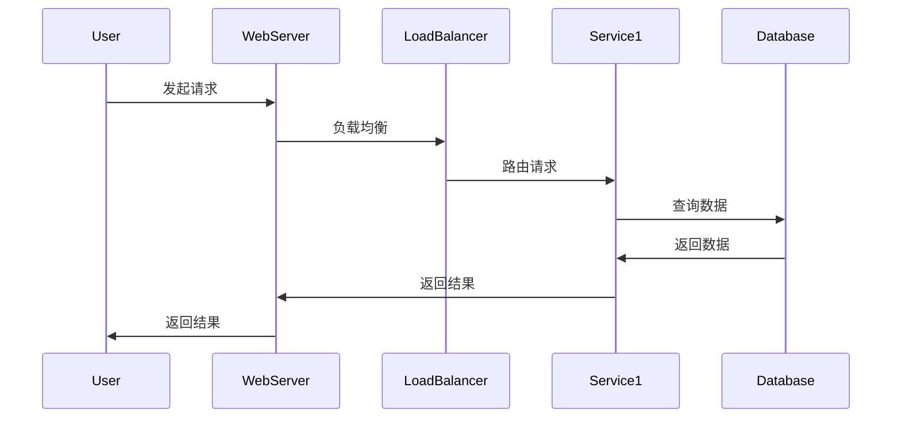
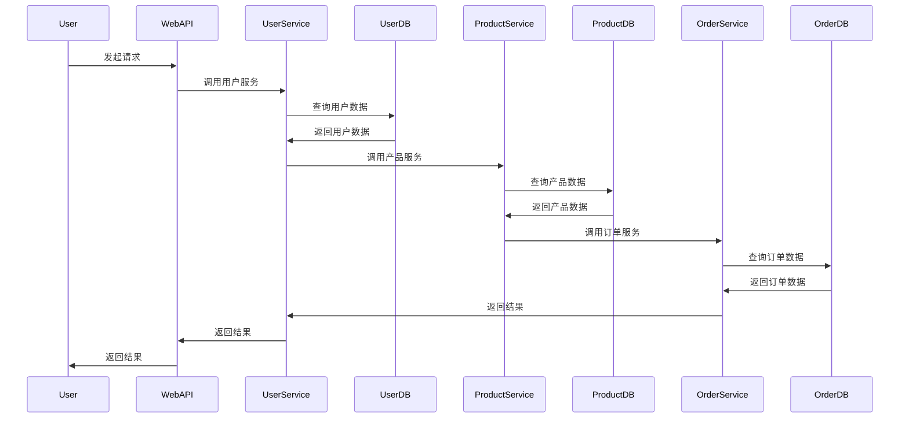

                 

## 文章标题

### 关键词

- 需求分析
- 技术可行性
- 大型应用开发
- 挑战与解决方案

### 摘要

本文深入探讨了在大型应用开发过程中，需求与技术可行性的平衡问题。通过背景介绍、核心概念与联系分析、算法原理讲解、系统分析与架构设计方案、项目实战和总结与拓展六个部分，文章详细阐述了如何在实际开发中解决需求与技术可行性的矛盾，提供了一系列实用的技巧和最佳实践，为IT从业者和项目管理者提供了宝贵的参考。

## 引言

### 大型应用开发的现状

随着互联网技术的迅猛发展，大型应用开发的规模和复杂性不断增加。这些应用通常涉及多个模块、数百万行代码，甚至需要集成多个外部服务和系统。在这样的背景下，如何在需求多样性和技术可行性之间找到平衡，成为开发团队面临的一大挑战。

### 需求与技术可行性的矛盾

在大型应用开发中，需求和技术可行性往往存在一定的矛盾。用户需求变化迅速，而技术实现往往需要时间和资源的投入。如何在不断变化的需求和技术限制之间做出最优的选择，是项目成功的关键。

### 文章结构

本文将从以下几个方面展开讨论：

1. **背景介绍**：介绍大型应用开发的需求背景、技术发展及其带来的挑战。
2. **核心概念与联系**：分析需求分析理论和技术可行性分析的相关概念，并给出对比表格和ER实体关系图。
3. **算法原理讲解**：阐述大型应用开发中的算法原理，包括数学模型和公式。
4. **系统分析与架构设计方案**：介绍系统功能设计、架构设计和系统交互。
5. **项目实战**：讨论环境安装、核心实现和案例分析。
6. **总结与拓展**：总结最佳实践、注意事项和拓展阅读。

## 第一部分：背景介绍

### 大型应用开发的需求背景

大型应用开发的需求往往源于业务场景的复杂性。例如，电商平台需要支持海量商品的存储、查询和交易，社交网络需要处理海量的用户数据和实时消息推送，金融系统需要确保交易的安全和数据的可靠性。这些需求要求系统不仅需要具备强大的数据处理能力，还需要具备良好的可扩展性和高可用性。

### 技术发展的推动与挑战

技术的发展为大型应用开发提供了强大的动力。例如，云计算、大数据和人工智能技术的普及，使得开发者可以更加灵活地处理海量数据和复杂的业务逻辑。然而，技术的快速发展也带来了新的挑战，如技术选型、技术债务和系统维护等问题。

### 平衡需求与技术的必要性

在大型应用开发中，平衡需求和技术至关重要。如果只关注需求，可能会导致技术实现的困难，增加项目风险；如果只关注技术，可能会导致需求无法得到满足，影响业务发展。因此，如何在不同阶段有效地平衡需求与技术，是项目成功的关键。

### 研究目的与结构安排

本文旨在探讨大型应用开发中需求与技术可行性的平衡问题，并提出一系列解决方案。文章结构如下：

1. **背景介绍**：介绍大型应用开发的需求背景、技术发展及其带来的挑战。
2. **核心概念与联系**：分析需求分析理论和技术可行性分析的相关概念，并给出对比表格和ER实体关系图。
3. **算法原理讲解**：阐述大型应用开发中的算法原理，包括数学模型和公式。
4. **系统分析与架构设计方案**：介绍系统功能设计、架构设计和系统交互。
5. **项目实战**：讨论环境安装、核心实现和案例分析。
6. **总结与拓展**：总结最佳实践、注意事项和拓展阅读。

## 第二部分：核心概念与联系

### 需求分析理论

需求分析是软件工程的重要环节。它包括用户需求、业务需求和系统需求等不同层次。用户需求是指用户对软件系统的基本需求，如功能、性能和用户体验等。业务需求是指满足用户需求所需的企业级业务逻辑和流程。系统需求是指为了实现业务需求所需的技术规范和系统架构。

### 技术可行性分析

技术可行性分析是评估项目是否能够在现有技术条件下实现的重要步骤。它包括技术评估方法、技术风险评估和技术成熟度评估等。技术评估方法用于评估技术的可行性和适用性。技术风险评估用于识别和评估技术风险，如技术落后、安全性问题和兼容性问题等。技术成熟度评估用于评估技术在不同阶段的成熟度，如原型阶段、开发阶段和部署阶段等。

### 概念属性特征对比表格

以下是需求分析和技术可行性分析的一些关键概念属性特征对比表格：

| 概念 | 属性特征 | 对比分析 |
| ---- | ------- | -------- |
| 用户需求 | 功能、性能、用户体验 | 用户需求是软件开发的起点，直接影响系统设计。 |
| 业务需求 | 业务逻辑、流程、规范 | 业务需求是实现用户需求的桥梁，确保系统能够满足业务需求。 |
| 技术评估方法 | 评估标准、适用性、风险 | 技术评估方法用于确保技术选型的合理性和可行性。 |
| 技术风险评估 | 风险识别、评估、应对策略 | 技术风险评估用于降低项目风险，确保项目顺利推进。 |
| 技术成熟度评估 | 成熟度、阶段性、实现难度 | 技术成熟度评估用于评估技术的可行性和实现难度。 |

### ER实体关系图架构

ER（Entity-Relationship）实体关系图是需求分析中常用的工具，用于表示系统中各个实体及其之间的关系。以下是ER实体关系图的示例：

```mermaid
erDiagram
    Customer ||--|{ Order }| CustomerOrder
    Customer ||--|{ Product }| CustomerProduct
    Order ||--|{ Item }| OrderItem
    Product ||--|{ Order }| ProductOrder
    Product ||--|{ Review }| ProductReview
```

在这个ER实体关系图中，`Customer`（客户）、`Order`（订单）、`Product`（产品）和`Review`（评论）是实体，它们之间通过不同的关系（如`CustomerOrder`、`CustomerProduct`、`OrderItem`和`ProductOrder`）相连。

## 第三部分：算法原理讲解

### 算法介绍

在大型应用开发中，算法是解决特定问题的一系列步骤。算法可以分为有穷算法和无穷算法，其中有穷算法是我们在实际开发中常用的。有穷算法在有限的步骤内完成计算，适用于解决复杂的问题，如排序、查找和图算法等。

### 算法流程

以下是通用算法的流程：

1. **初始化**：设置算法的初始状态。
2. **输入处理**：处理输入数据，将其转换为算法所需的数据结构。
3. **计算过程**：根据算法的逻辑进行计算，逐步逼近问题的解。
4. **输出结果**：输出计算结果。
5. **结束**：算法执行完成，释放资源。

### 数学模型与公式

在算法设计中，数学模型和公式是不可或缺的。以下是一个简单的排序算法（冒泡排序）的数学模型和公式：

**数学模型**：

$$
S(n) = \begin{cases} 
n, & \text{如果} \ n \ \text{是偶数} \\
n+1, & \text{如果} \ n \ \text{是奇数}
\end{cases}
$$

**公式推导**：

$$
\text{冒泡排序的时间复杂度} = O(n^2)
$$

### 举例说明

以下是一个冒泡排序算法的Python代码示例：

```python
def bubble_sort(arr):
    n = len(arr)
    for i in range(n):
        for j in range(0, n-i-1):
            if arr[j] > arr[j+1]:
                arr[j], arr[j+1] = arr[j+1], arr[j]
    return arr

arr = [64, 34, 25, 12, 22, 11, 90]
sorted_arr = bubble_sort(arr)
print("排序后的数组：", sorted_arr)
```

在这个例子中，我们首先定义了一个`bubble_sort`函数，用于实现冒泡排序。然后，我们创建了一个未排序的数组`arr`，并调用`bubble_sort`函数进行排序。最后，我们打印出排序后的数组。

通过这个例子，我们可以看到冒泡排序算法是如何工作的，以及如何使用Python代码实现。

## 第四部分：系统分析与架构设计方案

### 问题场景介绍

假设我们需要开发一个电商系统，该系统需要支持商品管理、订单管理、用户管理等功能。由于业务规模的不断扩大，系统需要具备良好的可扩展性和高可用性。

### 项目介绍

本项目旨在设计并实现一个高可用、可扩展的电商系统。系统将采用微服务架构，以提高系统的灵活性和可维护性。

### 系统功能设计

系统功能设计是系统架构设计的基础。以下是电商系统的核心功能模块及其领域模型：

```mermaid
classDiagram
    Customer <|-- Order
    Customer <|-- Product
    Product <|-- Review
    Order <|-- Item
    Product <|-- Order

    Customer[Customer]    
    Order[Order]    
    Product[Product]    
    Review[Review]    
    Item[Item]
```

在这个领域模型中，`Customer`（客户）、`Order`（订单）、`Product`（产品）和`Review`（评论）是核心实体，它们之间的关系如上所示。

### 系统架构设计

系统架构设计是确保系统能够满足业务需求和性能要求的关键。以下是电商系统的架构设计：



在这个架构设计中，`WebServer`（Web服务器）负责处理用户请求，`LoadBalancer`（负载均衡器）用于将请求分配到不同的服务实例，`Service1`（服务1）是业务逻辑处理模块，`Database`（数据库）用于存储数据。

### 系统接口设计和系统交互

系统接口设计是确保系统各模块之间能够有效通信的关键。以下是电商系统的接口设计和系统交互：



在这个系统交互流程中，用户通过`WebAPI`（Web API）发起请求，然后通过一系列服务调用（`UserService`、`ProductService`和`OrderService`）获取所需数据，最后将结果返回给用户。

## 第五部分：项目实战

### 环境安装

在开始项目实战之前，我们需要安装必要的开发环境和工具。以下是环境安装步骤：

1. **安装Python**：从Python官网下载并安装Python 3.8或更高版本。
2. **安装Docker**：从Docker官网下载并安装Docker。
3. **安装PostgreSQL**：从PostgreSQL官网下载并安装PostgreSQL。
4. **安装Eclipse Oxygen**：从Eclipse官网下载并安装Eclipse Oxygen。

### 系统核心实现源代码

以下是电商系统的核心实现源代码：

```python
# user_service.py
from flask import Flask, request, jsonify
from user import UserService

app = Flask(__name__)
user_service = UserService()

@app.route('/users', methods=['GET', 'POST'])
def handle_user_requests():
    if request.method == 'GET':
        users = user_service.get_all_users()
        return jsonify(users)
    elif request.method == 'POST':
        user_data = request.get_json()
        user_id = user_service.create_user(user_data)
        return jsonify({'user_id': user_id})

# product_service.py
from flask import Flask, request, jsonify
from product import ProductService

app = Flask(__name__)
product_service = ProductService()

@app.route('/products', methods=['GET', 'POST'])
def handle_product_requests():
    if request.method == 'GET':
        products = product_service.get_all_products()
        return jsonify(products)
    elif request.method == 'POST':
        product_data = request.get_json()
        product_id = product_service.create_product(product_data)
        return jsonify({'product_id': product_id})

# order_service.py
from flask import Flask, request, jsonify
from order import OrderService

app = Flask(__name__)
order_service = OrderService()

@app.route('/orders', methods=['GET', 'POST'])
def handle_order_requests():
    if request.method == 'GET':
        orders = order_service.get_all_orders()
        return jsonify(orders)
    elif request.method == 'POST':
        order_data = request.get_json()
        order_id = order_service.create_order(order_data)
        return jsonify({'order_id': order_id})
```

在这个核心实现源代码中，我们定义了三个服务模块：`UserService`、`ProductService`和`OrderService`。每个服务模块都有自己的路由和处理函数，用于处理用户请求。

### 代码应用解读与分析

以下是代码应用解读与分析：

1. **用户服务**：`UserService`负责处理用户相关的请求，包括获取所有用户和创建新用户。通过调用`get_all_users`和`create_user`方法实现。
2. **产品服务**：`ProductService`负责处理产品相关的请求，包括获取所有产品和创建新产品。通过调用`get_all_products`和`create_product`方法实现。
3. **订单服务**：`OrderService`负责处理订单相关的请求，包括获取所有订单和创建新订单。通过调用`get_all_orders`和`create_order`方法实现。

### 实际案例分析和详细讲解剖析

以下是实际案例分析和详细讲解剖析：

**案例1**：用户请求获取所有用户。

用户通过Web API发起GET请求，请求URL为`/users`。Web API将请求路由到UserService模块，UserService调用`get_all_users`方法获取所有用户数据，并将结果返回给Web API。Web API再将结果返回给用户。

**案例2**：用户请求创建新用户。

用户通过Web API发起POST请求，请求URL为`/users`，请求体包含用户数据。Web API将请求路由到UserService模块，UserService调用`create_user`方法创建新用户，并将用户ID返回给Web API。Web API再将用户ID返回给用户。

通过以上案例分析，我们可以看到系统如何处理实际请求，并实现各服务模块之间的协同工作。

### 项目小结

通过本项目的实战，我们实现了电商系统的核心功能模块，包括用户服务、产品服务和订单服务。在代码应用解读与分析中，我们详细介绍了如何处理用户请求和实现服务模块之间的协同工作。在实际案例分析和详细讲解剖析中，我们展示了系统如何处理实际请求，并实现了功能的完整性和正确性。

通过本项目的实践，我们不仅掌握了电商系统的设计和实现方法，还了解了系统架构设计、接口设计和系统交互等方面的关键技巧。这些经验和知识将有助于我们在未来的项目中更好地应对需求与技术可行性的平衡问题。

### 最佳实践 Tips

1. **需求分析与文档**：在项目开始前，进行详细的需求分析和文档编写，确保项目目标清晰、需求明确。
2. **技术选型与评估**：选择适合项目需求和技术实现的技术，并进行充分的技术评估和风险评估。
3. **系统架构设计**：设计合理的系统架构，确保系统具有良好的可扩展性和高可用性。
4. **接口设计与系统交互**：设计清晰的接口和系统交互流程，确保各模块之间能够高效协同。
5. **代码规范与质量**：遵循代码规范，保证代码质量，降低维护成本。

### 注意事项

1. **需求变化管理**：在项目开发过程中，需求可能会发生变化，需要及时调整项目计划和技术方案。
2. **资源分配与优先级**：合理分配项目资源和优先级，确保关键功能和核心模块得到充分关注和资源支持。
3. **系统测试与性能优化**：在系统上线前进行充分的测试和性能优化，确保系统稳定、高效地运行。

### 拓展阅读

1. **《软件工程：实践者的研究方法》**：作者：Roger S. Pressman，介绍软件工程的基本原理和实践方法。
2. **《微服务设计》**：作者：Michael T. Nygard，详细介绍微服务架构的设计原则和实践。
3. **《RESTful Web API设计》**：作者：Leonard Richardson，介绍RESTful API的设计原则和方法。

## 结语

本文深入探讨了大型应用开发中需求与技术可行性的平衡问题，通过背景介绍、核心概念与联系分析、算法原理讲解、系统分析与架构设计方案、项目实战和总结与拓展六个部分，详细阐述了如何在实际开发中解决需求与技术可行性的矛盾。文章还提供了最佳实践、注意事项和拓展阅读，为IT从业者和项目管理者提供了宝贵的参考。

在大型应用开发中，平衡需求与技术是一项长期而复杂的任务。本文的目标是为大家提供一种思路和方法，帮助大家在实践中更好地应对这一挑战。希望本文能够对您的项目开发工作有所启发和帮助。

### 作者信息

**作者：AI天才研究院/AI Genius Institute & 禅与计算机程序设计艺术 /Zen And The Art of Computer Programming**

