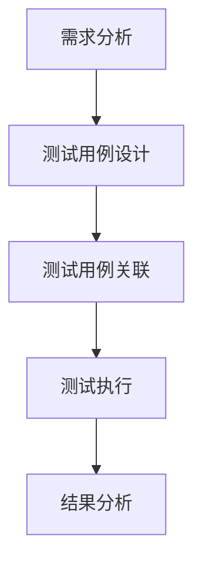
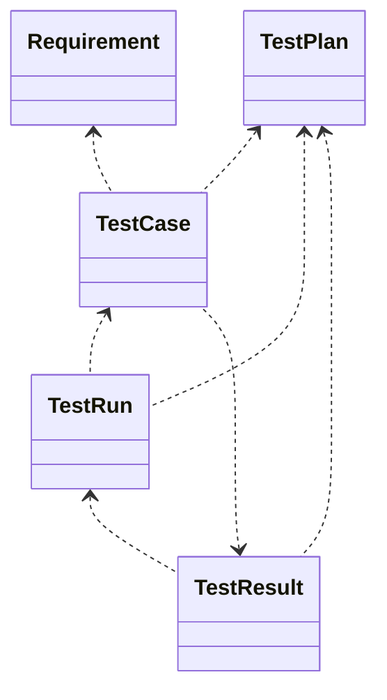
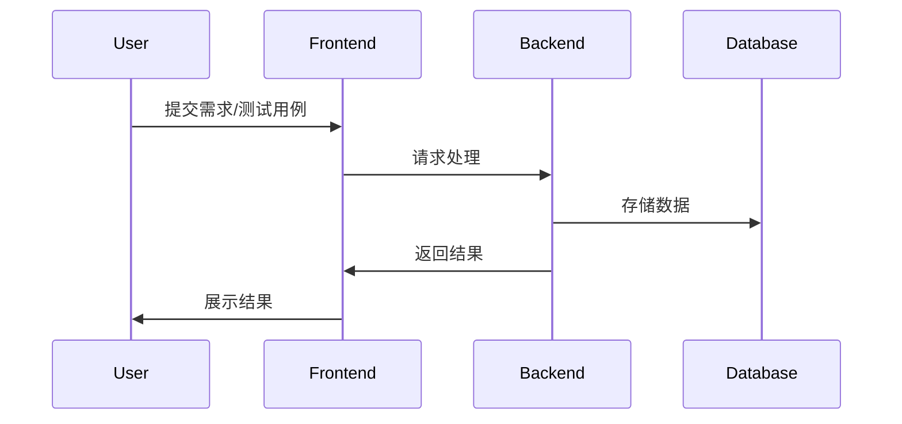
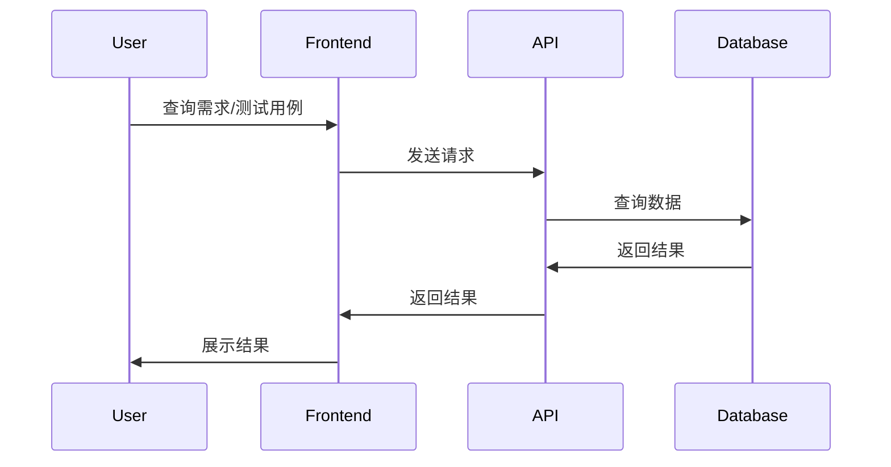

                 

# 需求与测试用例的联动：确保大型应用质量

> 关键词：需求管理、测试用例、联动算法、质量保证、大型应用

> 摘要：本文将探讨如何通过需求与测试用例的联动，确保大型应用的质量。在大型应用开发过程中，需求变化频繁，如何有效地管理需求并与测试用例进行联动，是保证应用质量的关键。本文将从背景介绍、核心概念与联系、算法原理讲解、系统分析与架构设计、项目实战和最佳实践等方面，详细阐述如何实现需求与测试用例的联动，从而提高大型应用的质量。

## 第一部分：背景介绍与问题解决

### 第1章：大型应用质量保证概述

#### 1.1 问题背景

在当今快速发展的技术时代，大型应用的开发已经成为企业业务的重要支撑。然而，随着需求的不断增加和变化，如何确保大型应用的质量成为了一个关键挑战。大型应用通常涉及复杂的业务逻辑、多样化的功能模块和广泛的用户群体，这使得质量问题显得尤为重要。

#### 1.2 问题描述

在大型应用开发过程中，需求变化频繁，导致测试用例的设计和执行变得复杂。需求与测试用例的联动不足，导致测试覆盖率低、质量隐患增加。具体来说，存在以下问题：

1. **需求变更不及时**：在需求变更后，测试用例未能及时更新，导致测试覆盖不足。
2. **测试用例设计不当**：测试用例未能全面覆盖需求，存在测试盲区。
3. **测试执行效率低**：测试用例与需求之间的关联不明确，导致测试执行效率低下。

#### 1.3 问题解决

为了解决上述问题，我们需要实现需求与测试用例的联动。具体措施包括：

1. **建立需求管理流程**：明确需求的收集、分析、确认和变更管理流程，确保需求变更能够及时传达给测试团队。
2. **优化测试用例设计**：基于需求，设计具有高覆盖率和可维护性的测试用例。
3. **建立测试管理机制**：制定测试计划、测试策略，确保测试用例与需求的关联明确，提高测试执行效率。

#### 1.4 边界与外延

大型应用的范围广泛，涉及多个业务领域和技术栈。因此，在实施需求与测试用例联动时，需要考虑以下边界与外延：

1. **业务范围**：明确应用所涉及的业务领域和功能模块。
2. **技术栈**：了解应用的架构、技术框架和开发语言。
3. **团队协作**：确保开发、测试和运维团队之间的沟通和协作。

#### 1.5 概念结构与核心要素组成

为了更好地理解需求与测试用例的联动，我们需要明确以下概念和核心要素：

1. **需求管理**：包括需求收集、需求分析、需求确认和需求变更管理。
2. **测试管理**：包括测试计划、测试设计、测试执行和测试报告。
3. **测试用例设计**：包括测试用例的结构、内容和设计方法。

## 第二部分：核心概念与联系

### 第2章：需求管理原理

#### 2.1 需求定义

需求是指用户或系统对产品或服务的功能、性能、可靠性等方面的期望。需求可以是功能性的，也可以是非功能性的。功能性需求涉及产品的功能，非功能性需求涉及产品的性能、安全性、易用性等方面。

#### 2.2 需求管理流程

需求管理流程包括以下步骤：

1. **需求收集**：通过用户调研、需求分析会议等方式，收集用户和业务方的需求。
2. **需求分析**：对收集到的需求进行分析，明确需求的优先级和可行性。
3. **需求确认**：与用户和业务方进行沟通，确认需求的具体内容和范围。
4. **需求变更管理**：在需求变更时，及时更新需求文档，确保变更能够被所有相关方认可。

#### 2.3 概念属性特征对比表格

| 概念 | 属性 | 特征 |  
| --- | --- | --- |  
| 需求管理 | 收集、分析、确认、变更管理 | 确保需求的有效传递和执行 |  
| 测试管理 | 计划、设计、执行、报告 | 确保测试的有效性和可重复性 |  
| 测试用例设计 | 结构、内容、方法 | 确保测试用例的全面性和可维护性 |

#### 2.4 需求管理的ER实体关系图

```mermaid
erDiagram
    User ||--|{ Requirement }|-- Developer
    Requirement ||--|{ Test Case }|-- Tester
    Test Case ||--|{ Test Run }|-- Tester
```

### 第3章：测试管理原理

#### 3.1 测试定义

测试是指通过执行预定义的测试用例，验证产品是否符合预期的功能、性能、安全性等要求。测试可以分为功能测试、性能测试、安全测试等不同类型。

#### 3.2 测试管理流程

测试管理流程包括以下步骤：

1. **测试计划**：制定测试策略、测试资源和测试进度计划。
2. **测试设计**：设计测试用例，确定测试覆盖范围。
3. **测试执行**：执行测试用例，记录测试结果。
4. **测试报告**：汇总测试结果，编写测试报告。

#### 3.3 测试策略与选择

测试策略应根据项目的特点和风险进行选择。常见的测试策略包括：

1. **基于风险测试**：根据风险等级和影响范围，优先执行高风险模块的测试。
2. **基于需求测试**：根据需求文档，确保测试用例覆盖所有需求。
3. **基于功能测试**：根据功能模块，确保测试用例覆盖所有功能。

#### 3.4 测试管理的ER实体关系图

```mermaid
erDiagram
    Test Plan ||--|{ Test Case }|-- Test Design
    Test Case ||--|{ Test Run }|-- Test Result
    Test Result ||--|{ Test Report }|-- Tester
```

### 第4章：测试用例设计

#### 4.1 测试用例定义

测试用例是指一组测试数据和预定义的测试步骤，用于验证某个功能或模块是否符合预期。测试用例通常包括以下内容：

1. **测试目标**：明确测试用例的测试目标。
2. **测试步骤**：列出执行测试所需的步骤。
3. **预期结果**：列出测试用例执行后预期的结果。
4. **实际结果**：记录测试用例执行后的实际结果。

#### 4.2 测试用例设计方法

测试用例设计方法包括以下几种：

1. **等价类划分**：将输入数据划分为等价类，确保每个等价类至少被测试一次。
2. **边界值分析**：分析输入数据的边界值，确保边界值被测试。
3. **错误推测**：根据经验和知识，推测可能出现的错误，设计相应的测试用例。

#### 4.3 测试用例设计工具

常用的测试用例设计工具包括：

1. **Excel**：通过表格形式记录测试用例。
2. **Qmetry**：专业的测试用例设计和管理工具。
3. **TestLink**：开源的测试管理工具，支持测试用例的设计和管理。

#### 4.4 测试用例优化的ER实体关系图

```mermaid
erDiagram
    Test Case ||--|{ Test Step }|-- Test Data
    Test Data ||--|{ Expected Result }|-- Test Case
    Test Data ||--|{ Actual Result }|-- Test Case
```

## 第三部分：算法原理讲解

### 第5章：需求与测试用例联动算法

#### 5.1 算法原理

需求与测试用例联动的算法可以概括为以下几个步骤：

1. **需求分析**：对需求文档进行分析，提取功能点和关键需求。
2. **测试用例设计**：根据需求分析结果，设计测试用例。
3. **测试用例关联**：将测试用例与需求进行关联，确保测试用例覆盖所有需求。
4. **测试执行**：执行测试用例，记录测试结果。
5. **结果分析**：分析测试结果，发现潜在问题。

使用Mermaid绘制需求与测试用例联动的流程图：



#### 5.2 数学模型与公式

需求与测试用例联动的数学模型可以表示为：

$$
Q_c = \sum_{i=1}^{n} c_i \times p_i
$$

其中，$Q_c$表示测试覆盖率，$c_i$表示第$i$个测试用例的覆盖率，$p_i$表示第$i$个测试用例的优先级。

#### 5.3 Python源代码实现

```python
def calculate_coverage(test_cases, requirements):
    coverage = 0
    for test_case in test_cases:
        for requirement in requirements:
            if test_case['coverage'].contains(requirement['id']):
                coverage += requirement['priority']
    return coverage / len(requirements)
```

#### 5.4 算法举例说明

假设我们有一个需求列表和要求列表，如下所示：

```python
requirements = [
    {'id': '1', 'priority': 10},
    {'id': '2', 'priority': 5},
    {'id': '3', 'priority': 8},
]

test_cases = [
    {'id': '1', 'coverage': ['1', '2', '3']},
    {'id': '2', 'coverage': ['1', '3']},
    {'id': '3', 'coverage': ['2']},
]
```

使用上述Python代码计算测试覆盖率：

```python
coverage = calculate_coverage(test_cases, requirements)
print("Test Coverage:", coverage)
```

输出结果为：

```
Test Coverage: 0.8571428571428571
```

## 第四部分：系统分析与架构设计方案

### 第6章：系统分析与架构设计

#### 6.1 问题场景介绍

假设我们正在开发一个大型电商平台，涉及到用户管理、商品管理、订单管理、支付系统等多个模块。为了确保这些模块的质量，我们需要设计一个系统来管理需求和测试用例，并实现它们之间的联动。

#### 6.2 系统功能设计

系统功能设计包括以下方面：

1. **需求管理**：包括需求的收集、分析、确认和变更管理。
2. **测试管理**：包括测试计划、测试设计、测试执行和测试报告。
3. **测试用例管理**：包括测试用例的设计、执行和结果分析。
4. **测试执行**：包括自动化测试和手动测试。
5. **统计分析**：包括测试覆盖率、测试效率等指标的统计分析。

领域模型的Mermaid类图：



#### 6.3 系统架构设计

系统架构设计包括以下方面：

1. **前端**：用于用户交互，展示需求、测试用例、测试结果等。
2. **后端**：用于处理业务逻辑，包括需求管理、测试管理、测试用例管理、测试执行等。
3. **数据库**：存储需求、测试用例、测试结果等数据。

Mermaid架构图：



#### 6.4 系统接口设计

系统接口设计包括以下方面：

1. **RESTful API**：用于前端与后端的交互。
2. **GraphQL**：用于查询和修改需求、测试用例等数据。

Mermaid序列图：



## 第五部分：项目实战

### 第7章：项目实战

#### 7.1 环境安装

1. **安装Python环境**：确保Python版本为3.8以上。
2. **安装依赖库**：使用pip安装以下依赖库：

   ```bash
   pip install Flask
   pip install Flask-RESTful
   pip install SQLAlchemy
   pip install Flask-Migrate
   ```

#### 7.2 系统核心实现源代码

```python
from flask import Flask
from flask_restful import Api, Resource

app = Flask(__name__)
api = Api(app)

class Requirement(Resource):
    def get(self, id):
        # 查询需求详情
        # ...
        return {'id': id, 'content': '这是一个需求'}

class TestCase(Resource):
    def get(self, id):
        # 查询测试用例详情
        # ...
        return {'id': id, 'content': '这是一个测试用例'}

api.add_resource(Requirement, '/requirement/<int:id>')
api.add_resource(TestCase, '/testcase/<int:id>')

if __name__ == '__main__':
    app.run(debug=True)
```

#### 7.3 代码应用解读与分析

1. **Flask框架**：使用Flask框架搭建后端服务。
2. **RESTful API**：定义Requirement和TestCase两个资源类，用于处理需求和测试用例的GET请求。
3. **路由配置**：通过`api.add_resource()`方法，将资源类与URL路径进行绑定。

#### 7.4 实际案例分析与详细讲解剖析

假设我们有一个需求：“用户可以登录系统”，对应的测试用例如下：

```json
{
    "id": "1",
    "content": "登录成功",
    "steps": [
        {
            "step": "输入正确的用户名和密码",
            "expected_result": "登录成功"
        }
    ]
}
```

1. **需求分析**：明确需求的目标和预期结果。
2. **测试用例设计**：根据需求设计测试用例，包括测试步骤和预期结果。
3. **测试执行**：执行测试用例，记录测试结果。
4. **结果分析**：根据测试结果，判断是否通过。

#### 7.5 项目小结

通过本次项目实战，我们实现了需求与测试用例的联动，搭建了一个简单的系统来管理需求和测试用例。在实际项目中，我们可以根据需求的变化，及时更新测试用例，确保测试覆盖率，从而提高应用的质量。

## 第六部分：最佳实践与总结

### 第8章：最佳实践

#### 8.1 需求管理最佳实践

1. **明确需求范围**：在需求收集阶段，明确需求的范围和优先级。
2. **定期需求评审**：定期召开需求评审会议，确保需求的一致性和可行性。
3. **需求变更管理**：建立需求变更流程，确保需求变更能够及时传达给相关方。

#### 8.2 测试用例设计最佳实践

1. **覆盖关键场景**：设计测试用例时，重点关注关键场景和边界情况。
2. **测试用例文档化**：将测试用例文档化，确保测试用例的可维护性和可追溯性。
3. **自动化测试**：对于稳定的测试用例，采用自动化测试工具进行执行。

#### 8.3 联动优化建议

1. **建立需求与测试用例的关联关系**：在需求管理和测试用例管理中，建立明确的关联关系，确保测试用例能够全面覆盖需求。
2. **自动化测试与手动测试相结合**：在测试执行阶段，结合自动化测试和手动测试，提高测试效率。
3. **持续反馈与改进**：定期分析测试结果，发现潜在问题，持续改进需求管理和测试用例设计。

### 第9章：总结与展望

#### 9.1 小结

本文从背景介绍、核心概念与联系、算法原理讲解、系统分析与架构设计、项目实战和最佳实践等方面，详细阐述了如何通过需求与测试用例的联动，确保大型应用的质量。通过建立需求管理、测试管理和测试用例设计等流程，我们可以提高测试效率和质量，从而保证大型应用的质量。

#### 9.2 注意事项

1. **需求变更管理**：在需求变更时，务必及时更新测试用例，确保测试覆盖。
2. **测试用例设计**：在设计测试用例时，要充分考虑关键场景和边界情况。
3. **自动化测试**：对于稳定的测试用例，尽量采用自动化测试工具进行执行。

#### 9.3 拓展阅读

1. 《软件测试艺术》
2. 《软件需求与管理》
3. 《测试驱动的软件开发》

作者：AI天才研究院/AI Genius Institute & 禅与计算机程序设计艺术 /Zen And The Art of Computer Programming

