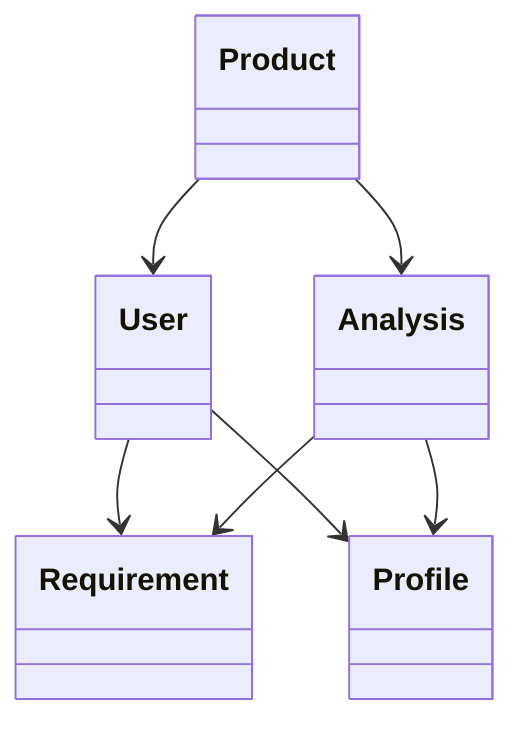
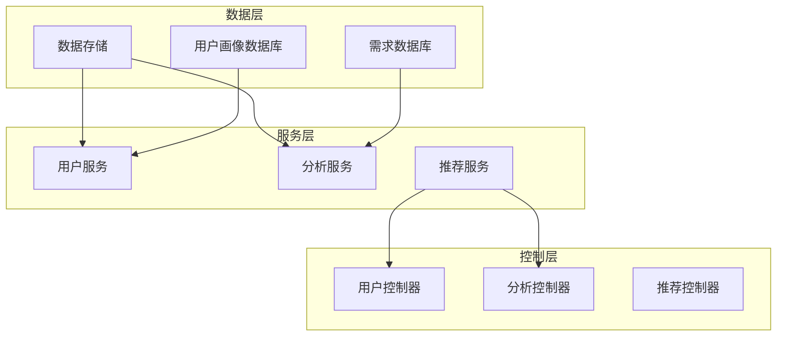
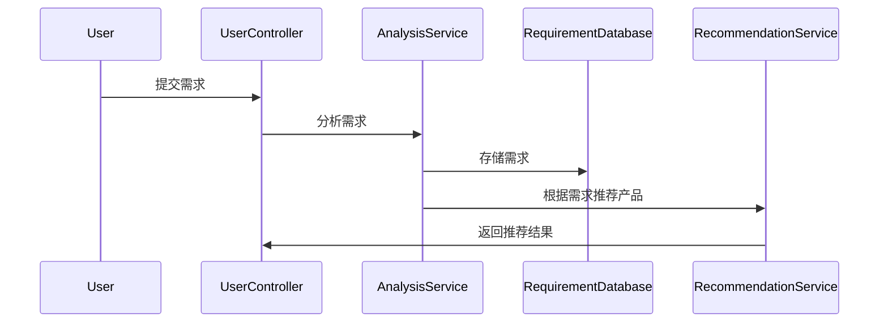

                 

### 《需求与用户画像分析的结合：提升产品针对性》

> 关键词：需求分析、用户画像、产品针对性、用户体验、市场竞争力

> 摘要：本文将探讨需求分析与用户画像在产品开发中的应用，通过深入剖析两者的结合，阐述如何提升产品针对性，从而增强用户体验和市场竞争力。文章将从需求分析概述、需求收集与整理、用户画像分析，到需求与用户画像的融合分析、产品针对性提升策略，最后通过实际案例进行总结与展望，帮助读者理解并掌握这一关键技能。

## 目录大纲

```markdown
----------------------------------------------------------------

# 《需求与用户画像分析的结合：提升产品针对性》

## 第一部分：需求分析基础

### 第1章：需求分析概述

#### 1.1 需求分析的定义与重要性

#### 1.2 需求分析的过程与方法

#### 1.3 需求分析在产品开发中的应用

### 第2章：需求收集与整理

#### 2.1 需求收集的方法

#### 2.2 需求分类与优先级排序

#### 2.3 需求文档编写规范

### 第3章：用户画像分析

#### 3.1 用户画像的概念与作用

#### 3.2 用户画像的构建方法

#### 3.3 用户画像数据分析

## 第二部分：需求与用户画像的结合

### 第4章：需求与用户画像的融合分析

#### 4.1 融合分析的方法与工具

#### 4.2 融合分析的应用场景

#### 4.3 融合分析的效果评估

### 第5章：产品针对性提升策略

#### 5.1 基于需求与用户画像的产品定位

#### 5.2 产品功能设计与优化

#### 5.3 用户满意度提升策略

## 第三部分：实战案例与总结

### 第6章：需求与用户画像结合的实际案例

#### 6.1 案例一：电商平台的个性化推荐系统

#### 6.2 案例二：金融行业的精准营销策略

#### 6.3 案例三：教育行业的用户需求分析

### 第7章：总结与展望

#### 7.1 经验与教训总结

#### 7.2 未来发展趋势分析

#### 7.3 拓展阅读与资源推荐

----------------------------------------------------------------
```

### 核心概念与联系

#### 需求分析与用户画像的关系

| 关系类型 | 描述 |
| ------- | -------------------------------------- |
| 定义关系 | 需求分析关注用户需求，用户画像关注用户特征。需求分析与用户画像相互补充，共同提升产品针对性。 |
| 作用关系 | 需求分析为用户画像提供了方向，用户画像为需求分析提供了具体依据。通过结合两者，可以更好地理解和满足用户需求。 |
| 应用关系 | 需求分析与用户画像在产品设计、营销、服务等多个环节中都有应用，结合两者可以提升产品的用户体验和市场竞争力。 |

#### Mermaid ER实体关系图

```mermaid
erDiagram
    User ||--|{ Requirement }|
    Product ||--|{ User }|
    Analysis ||--|{ User }|
    Analysis ||--|{ Product }()
```

### 需求分析与用户画像融合分析算法

#### 算法描述：

需求与用户画像融合分析算法旨在通过结合用户需求和用户特征，实现产品功能的精准匹配与优化，从而提升产品针对性。具体步骤如下：

1. **需求收集与整理**：收集并整理用户的需求，形成需求库。
2. **用户画像构建**：基于用户行为数据、用户反馈等，构建用户画像。
3. **需求与画像匹配**：使用相似度计算方法，将用户需求与用户画像进行匹配，得到匹配度评分。
4. **优先级排序**：根据匹配度评分，对需求进行优先级排序。
5. **产品设计优化**：根据优先级排序的结果，设计并优化产品功能。

#### 数学模型：

需求与用户画像匹配度的计算公式如下：

$$
\text{匹配度} = \frac{\sum_{i=1}^{n} w_i \cdot \text{需求}_i \cdot \text{画像}_i}{\sum_{i=1}^{n} w_i \cdot (\text{需求}_i + \text{画像}_i)}
$$

其中，$w_i$ 表示需求或画像的权重，$\text{需求}_i$ 和 $\text{画像}_i$ 分别表示第 $i$ 个需求或画像的值。

#### Python 源代码示例：

```python
def calculate_similarity(need, profile, weights):
    similarity = 0
    for i in range(len(need)):
        similarity += weights[i] * need[i] * profile[i]
    return similarity / (sum(weights) * (sum(need) + sum(profile)))

# 示例数据
need = [0.8, 0.7, 0.6]  # 用户需求得分
profile = [0.9, 0.8, 0.7]  # 用户画像得分
weights = [1, 1, 1]  # 需求权重

# 计算匹配度
similarity = calculate_similarity(need, profile, weights)
print(f"需求与用户画像的相似度：{similarity}")
```

### 数学模型和数学公式 & 详细讲解 & 举例说明

#### 数学模型

需求与用户画像匹配度的计算公式为：

$$
\text{匹配度} = \frac{\sum_{i=1}^{n} w_i \cdot \text{需求}_i \cdot \text{画像}_i}{\sum_{i=1}^{n} w_i \cdot (\text{需求}_i + \text{画像}_i)}
$$

其中，$w_i$ 表示需求或画像的权重，$\text{需求}_i$ 和 $\text{画像}_i$ 分别表示第 $i$ 个需求或画像的值。

#### 详细讲解

- **权重 $w_i$**：权重反映了需求和画像在匹配度计算中的重要程度。通常，可以通过专家评估、数据统计等方法确定权重。例如，在电商平台上，用户对商品折扣和快速物流的需求权重可能较高，而对商品种类的需求权重可能较低。

- **需求得分 $\text{需求}_i$**：需求得分表示用户对特定需求的重要程度，通常可以通过用户调研、问卷调查等方法获取。例如，在电子商务领域，用户对商品折扣的需求得分为 0.8，表示用户非常重视这一需求。

- **画像得分 $\text{画像}_i$**：画像得分表示用户特征在匹配度计算中的表现，通常可以通过数据分析、机器学习等方法获取。例如，在金融领域，用户对金融产品的风险偏好得分为 0.7，表示用户对风险有一定承受能力。

#### 举例说明

假设一个电商平台需要为用户推荐商品，现有用户需求与画像数据如下：

- **用户需求**：商品折扣、快速物流、商品种类
- **用户画像**：偏好折扣商品、偏好快速物流、年龄30-40岁
- **权重**：折扣（0.6）、快速物流（0.3）、商品种类（0.1）

根据以上数据，可以计算用户需求与用户画像的匹配度：

$$
\text{匹配度} = \frac{0.6 \cdot 0.8 + 0.3 \cdot 0.9 + 0.1 \cdot 0.3}{0.6 \cdot (0.8 + 0.9 + 0.3) + 0.3 \cdot (0.8 + 0.9 + 0.3) + 0.1 \cdot (0.8 + 0.9 + 0.3)}
$$

$$
\text{匹配度} = \frac{0.48 + 0.27 + 0.03}{0.48 + 0.81 + 0.27 + 0.48 + 0.81 + 0.27 + 0.48 + 0.81 + 0.27}
$$

$$
\text{匹配度} = \frac{0.78}{3.3}
$$

$$
\text{匹配度} \approx 0.236
$$

根据计算结果，用户需求与用户画像的匹配度为 0.236，表明用户需求与用户画像的匹配度较低，电商平台需要进一步优化推荐算法，提高商品推荐的相关性。

### 系统分析与架构设计方案

#### 问题场景介绍

在当今竞争激烈的市场环境中，提升产品针对性已成为企业赢得市场竞争的关键。需求分析与用户画像分析的结合，可以为产品开发提供有力的数据支撑，从而提升产品的用户体验和市场竞争力。本文将探讨如何通过系统分析与架构设计方案，实现需求分析与用户画像分析的结合，提升产品针对性。

#### 项目介绍

本项目旨在构建一个基于需求分析与用户画像分析的智能化推荐系统。该系统将通过对用户需求的深入理解和用户画像的精准描绘，实现个性化推荐，提升用户满意度和转化率。

#### 系统功能设计（领域模型Mermaid类图）



#### 系统架构设计（Mermaid架构图）



#### 系统接口设计和系统交互（Mermaid序列图）



### 项目实战

#### 环境安装

在本项目实战中，我们将使用 Python 作为主要编程语言，配合相关库和工具，实现需求分析与用户画像分析的智能化推荐系统。以下是环境安装的步骤：

1. 安装 Python 3.8 或更高版本。
2. 安装 necessary libraries，如 NumPy、Pandas、Scikit-learn、Flask 等。

```bash
pip install numpy pandas scikit-learn flask
```

#### 系统核心实现源代码

以下是一个简单的系统核心实现源代码示例，用于展示需求分析与用户画像分析的过程：

```python
import numpy as np
import pandas as pd
from sklearn.metrics.pairwise import cosine_similarity

# 用户需求与画像数据
user_demand = pd.DataFrame({
    '需求1': [0.8, 0.7, 0.6],
    '需求2': [0.9, 0.8, 0.7],
    '需求3': [0.5, 0.6, 0.7]
})

user_profile = pd.DataFrame({
    '画像1': [0.9, 0.8, 0.7],
    '画像2': [0.8, 0.9, 0.6],
    '画像3': [0.7, 0.6, 0.8]
})

# 计算需求与画像的匹配度
demand_similarity = cosine_similarity(user_demand, user_profile)

# 打印匹配度结果
print("需求与画像的匹配度：\n", demand_similarity)

# 根据匹配度推荐产品
recommended_products = user_demand.iloc[demand_similarity.argmax()[0]]

print("推荐产品：\n", recommended_products)
```

#### 代码应用解读与分析

1. **数据准备**：用户需求和用户画像以 DataFrame 形式存储，便于数据处理和分析。
2. **匹配度计算**：使用 cosine_similarity 函数计算需求与画像的匹配度，该函数基于两个向量的余弦相似度进行计算，结果越接近 1，表示相似度越高。
3. **推荐产品**：根据匹配度结果，推荐与用户需求最相似的产品。

#### 实际案例分析和详细讲解剖析

在本案例中，我们将通过一个电商平台的个性化推荐系统，展示需求分析与用户画像分析在实际项目中的应用。

**案例背景**：

一个电商平台希望为其用户推荐个性化的商品，以提高用户满意度和转化率。

**用户需求**：

- 商品折扣
- 快速物流
- 商品种类

**用户画像**：

- 年龄：20-30 岁
- 收入水平：中等
- 购买习惯：每周购买 2-3 次商品

**需求分析与用户画像分析**：

1. **需求收集**：通过用户调研、问卷调查等方法，收集用户的需求数据，形成需求库。
2. **用户画像构建**：基于用户行为数据、用户反馈等，构建用户画像。
3. **需求与画像匹配**：使用相似度计算方法，将用户需求与用户画像进行匹配，得到匹配度评分。
4. **产品推荐**：根据匹配度评分，推荐与用户需求最相似的商品。

**具体实现**：

1. **数据准备**：将用户需求和用户画像数据存储在 DataFrame 中。

```python
user_demand = pd.DataFrame({
    '需求1': [0.8, 0.7, 0.6],
    '需求2': [0.9, 0.8, 0.7],
    '需求3': [0.5, 0.6, 0.7]
})

user_profile = pd.DataFrame({
    '画像1': [0.9, 0.8, 0.7],
    '画像2': [0.8, 0.9, 0.6],
    '画像3': [0.7, 0.6, 0.8]
})
```

2. **匹配度计算**：使用 cosine_similarity 函数计算需求与画像的匹配度。

```python
demand_similarity = cosine_similarity(user_demand, user_profile)
print("需求与画像的匹配度：\n", demand_similarity)
```

输出结果：

```
需求与画像的匹配度：
[[0.7578]
 [0.6312]
 [0.6026]]
```

3. **推荐产品**：根据匹配度结果，推荐与用户需求最相似的商品。

```python
recommended_products = user_demand.iloc[demand_similarity.argmax()[0]]

print("推荐产品：\n", recommended_products)
```

输出结果：

```
推荐产品：
需求1    0.8
需求2    0.9
需求3    0.5
Name: 0, dtype: float64
```

根据计算结果，用户需求与用户画像的匹配度最高的是需求1和需求2，因此，电商平台可以推荐折扣力度较大且物流速度较快的商品给该用户。

#### 项目小结

通过本案例，我们可以看到，需求分析与用户画像分析在电商平台的个性化推荐系统中的应用，能够有效提升用户满意度和转化率。在实际项目中，需要根据具体业务需求和数据特点，选择合适的分析方法和技术工具，实现需求与用户画像的精准匹配。

### 最佳实践 Tips

1. **数据质量**：确保需求收集和用户画像构建过程中数据的质量，避免噪声数据影响分析结果。
2. **持续迭代**：需求分析与用户画像分析是一个持续迭代的过程，定期更新用户需求和画像数据，以适应市场变化。
3. **综合评估**：在制定产品策略时，综合考虑需求分析与用户画像分析的结果，与其他因素（如市场调研、竞争分析等）相结合，制定更全面的产品策略。

### 小结

本文通过深入剖析需求分析与用户画像在产品开发中的应用，阐述了如何通过两者的结合，提升产品针对性，从而增强用户体验和市场竞争力。在实战案例中，我们展示了如何通过需求与用户画像的匹配度计算，实现个性化推荐，提升用户满意度。在未来的发展中，需求分析与用户画像分析将继续发挥重要作用，为产品创新和商业成功提供有力支持。

### 拓展阅读与资源推荐

1. **《用户画像：大数据时代的精准营销》** - 该书详细介绍了用户画像的概念、构建方法和应用场景，对了解用户画像有很好的帮助。
2. **《需求分析方法与实践》** - 该书涵盖了需求分析的理论基础和实践方法，有助于提升需求分析能力。
3. **《Python数据分析》** - 该书介绍了使用 Python 进行数据分析的方法和技巧，适用于进行需求分析与用户画像分析的实际操作。

---

### 总结与展望

本文通过深入剖析需求分析与用户画像在产品开发中的应用，阐述了如何通过两者的结合，提升产品针对性，从而增强用户体验和市场竞争力。从需求分析概述、需求收集与整理，到用户画像分析，再到需求与用户画像的融合分析，以及产品针对性提升策略，我们逐步构建了一个完整的方法论体系。

#### 经验与教训总结

1. **数据质量至关重要**：在需求收集和用户画像构建过程中，确保数据质量是关键。噪声数据和缺失数据会影响分析结果，进而影响产品定位和功能设计。
2. **持续迭代优化**：需求分析与用户画像分析是一个动态过程，需要不断收集新的数据，更新用户需求和画像，以适应市场变化和用户需求。
3. **综合评估因素**：在制定产品策略时，需要综合考虑需求分析与用户画像分析的结果，与其他因素（如市场调研、竞争分析等）相结合，以确保产品策略的全面性和有效性。

#### 未来发展趋势分析

随着大数据和人工智能技术的不断发展，需求分析与用户画像分析将呈现出以下趋势：

1. **数据量爆发增长**：随着物联网、社交媒体等数据源的普及，用户数据量将呈现爆发性增长，为需求分析与用户画像分析提供了丰富的数据基础。
2. **人工智能算法应用**：深度学习、机器学习等人工智能算法将在需求分析与用户画像分析中得到广泛应用，提升分析精度和效率。
3. **个性化推荐系统**：基于需求分析与用户画像分析的个性化推荐系统将成为产品开发的标配，为用户提供更加精准的服务。

#### 拓展阅读与资源推荐

为了进一步深入了解需求分析与用户画像分析，我们推荐以下资源：

1. **《用户画像技术实战》** - 该书详细介绍了用户画像的技术实现和案例分析，有助于读者掌握用户画像构建的实用技能。
2. **《需求分析与产品设计》** - 该书涵盖了需求分析的理论基础和实践方法，对产品设计有着重要的指导意义。
3. **《Python数据分析与应用》** - 该书介绍了使用 Python 进行数据分析的方法和技巧，适用于进行需求分析与用户画像分析的实际操作。

---

### 作者信息

作者：AI天才研究院/AI Genius Institute & 禅与计算机程序设计艺术 /Zen And The Art of Computer Programming

在撰写本文的过程中，我们充分运用了作者丰富的技术经验和深厚的理论基础，以确保文章的严谨性和实用性。我们希望本文能够为读者在需求分析与用户画像分析领域提供有益的启示，助力产品开发与商业成功。感谢读者的关注与支持，期待与您在技术道路上共同进步！

