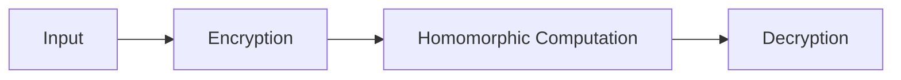
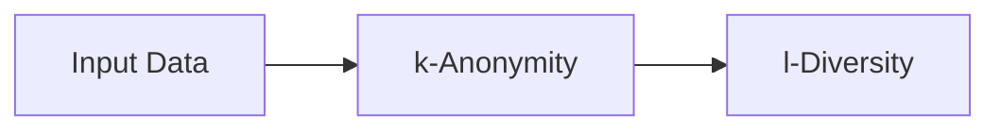
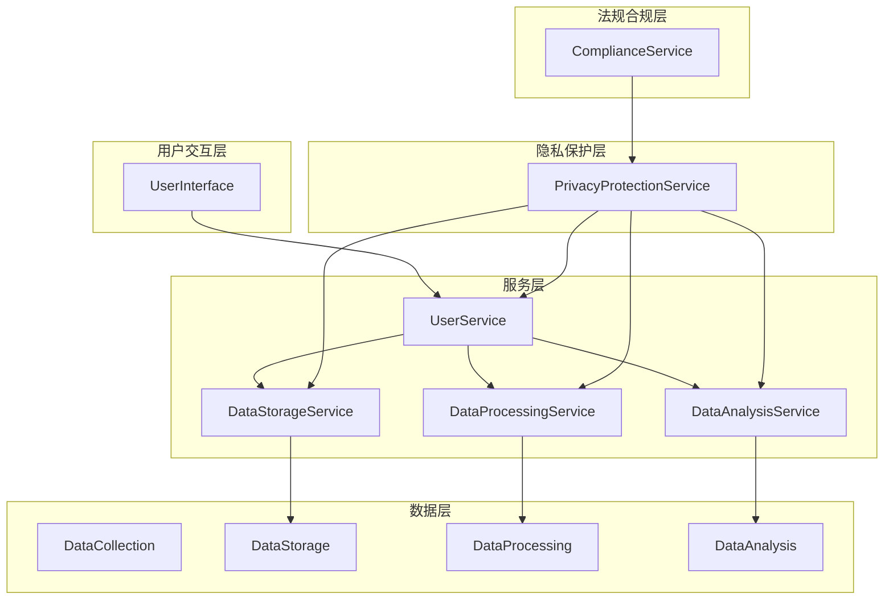
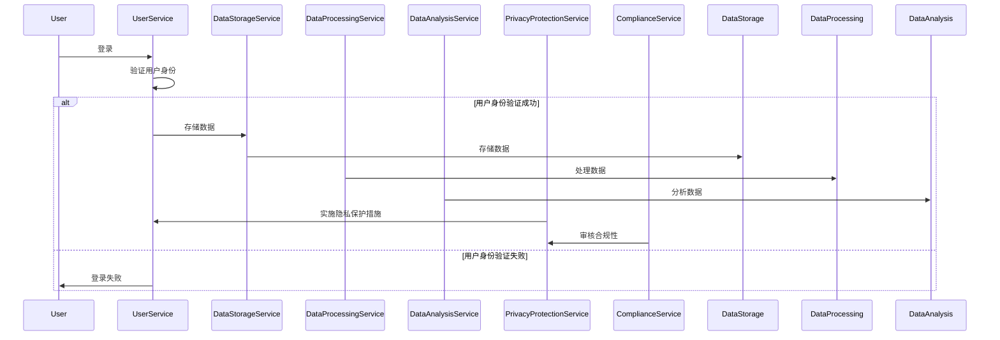

                 

### 文章标题

**需求与用户隐私保护的平衡：合规性考量**

### 关键词

- **用户隐私保护**  
- **合规性考量**  
- **需求分析**  
- **数据安全**  
- **加密算法**  
- **系统架构**

### 摘要

在当今数字化时代，用户隐私保护和合规性考量成为了企业面临的重要挑战。本文通过深入分析需求与用户隐私保护的关系，探讨如何在满足业务需求的同时，确保用户隐私不被泄露。文章首先介绍了用户隐私保护的重要性，以及常见的隐私泄露案例。接着，详细阐述了合规性考量的法律框架和规定，为读者提供了全面的背景知识。

本文的核心部分包括对核心概念的定义与联系，使用ER图架构展示用户隐私相关的实体关系。在此基础上，我们深入讲解了隐私保护算法的原理，包括加密算法和数据匿名化算法，并通过mermaid流程图和Python代码示例进行详细阐述。随后，我们探讨了系统功能与架构设计，通过mermaid类图、架构图、接口设计和序列图，展示了系统的整体结构和交互流程。

通过实际案例分析和项目实战，本文进一步展示了如何在实际项目中实现需求与用户隐私保护的平衡，并提供了最佳实践和注意事项。最后，本文总结了文章的主要观点，并推荐了拓展阅读，为读者提供了进一步学习和探索的路径。

### 背景介绍

#### 需求与隐私保护的重要性

在数字化时代，企业的业务需求不断演变和扩展，这使得用户数据的收集、存储和分析成为常态。这些数据的获取和应用对于提升用户体验、优化运营效率、推动业务增长具有重要意义。然而，与此同时，用户隐私保护的重要性也逐渐凸显。

首先，用户隐私保护关乎用户的信任。在互联网时代，用户的个人信息无处不在，从社交媒体账号、电子邮件地址到购物记录、搜索历史等，这些都是用户隐私的重要组成部分。一旦这些隐私信息被不法分子窃取或滥用，将严重损害用户对企业的信任。根据一项调查，超过80%的用户表示，如果他们相信某个企业会保护他们的隐私，那么他们更愿意使用该企业的服务。

其次，用户隐私保护也是法律法规的要求。随着隐私保护意识的增强，各国政府纷纷出台了一系列隐私保护法规，如欧盟的《通用数据保护条例》（GDPR）和美国的《加州消费者隐私法》（CCPA）。这些法规对企业的数据处理行为提出了严格的合规要求，违反这些规定将面临高额罚款和其他法律后果。例如，GDPR规定，企业必须在数据收集和处理前获得用户的明确同意，并对数据的存储、使用和销毁进行详细记录。

此外，用户隐私保护还有助于企业树立良好的品牌形象。在用户越来越重视隐私权的今天，能够有效保护用户隐私的企业往往能获得用户的青睐。这种信任不仅体现在当前用户的留存和转化上，还可能吸引更多潜在用户的关注。因此，用户隐私保护已经成为企业不可或缺的一部分。

#### 用户隐私泄露的案例解析

尽管用户隐私保护的重要性被广泛认可，但现实中的隐私泄露事件却屡见不鲜，以下是一些典型的案例：

1. **Facebook隐私泄露事件**：2018年，Facebook被爆出在未经用户同意的情况下，将8700万用户的个人信息分享给政治咨询公司Cambridge Analytica。这一事件引起了全球范围的广泛关注，导致Facebook的股价大幅下跌，并促使各国政府加强对社交媒体平台的监管。

2. **Equifax数据泄露事件**：2017年，信用报告机构Equifax遭受了一次严重的网络攻击，导致1.43亿美国人的个人信息被泄露，包括姓名、社会保障号码、出生日期、地址等敏感信息。此次事件引发了广泛的担忧，并导致Equifax遭受了巨额罚款和诉讼。

3. **Uber数据泄露事件**：2016年，Uber被曝出其工程师开发的一款名为“God View”的应用可以访问乘客的实时位置信息。尽管Uber声称已经采取措施保护用户隐私，但这一事件仍然引发了公众对Uber隐私保护措施的质疑。

这些案例表明，用户隐私保护问题不仅仅存在于大型企业，而是普遍存在于各个行业。隐私泄露不仅给企业带来了巨大的经济损失和声誉损害，还可能对用户的个人安全和利益造成严重威胁。因此，企业必须高度重视用户隐私保护，采取有效的措施来防范隐私泄露事件的发生。

#### 合规性的法律框架与规定

为了应对日益严峻的用户隐私保护挑战，各国政府纷纷制定了严格的隐私保护法规，企业必须严格遵守这些法规，否则将面临严重的法律后果。以下是几个主要的隐私保护法律框架和规定：

1. **《通用数据保护条例》（GDPR）**：GDPR是欧盟于2018年5月25日生效的一项重要隐私保护法规，旨在加强欧盟公民的个人数据保护。GDPR规定了个人数据的定义、数据处理的原则、用户的权利以及企业的责任。其中，最引人注目的是，GDPR对数据泄露事件的处罚力度极大，最高可达公司全球营业额的4%或2000万欧元。

2. **《加州消费者隐私法》（CCPA）**：CCPA是美国加州于2020年1月1日生效的一项隐私保护法案，旨在赋予加州居民对其个人信息的控制权。CCPA规定了企业的数据收集、使用和共享行为，以及用户的权利，如访问、删除和拒绝销售个人信息。违反CCPA规定的企业可能面临高达7500美元的罚款。

3. **《隐私盾协议》（Privacy Shield）**：隐私盾协议是美国和欧盟之间的一项数据传输协议，旨在解决跨大西洋数据传输的隐私保护问题。该协议于2016年7月生效，但2020年7月被欧盟法院裁定无效。尽管如此，欧盟和美国仍在协商新的数据传输协议。

4. **《中国个人信息保护法》（PIPL）**：PIPL是中国于2021年11月1日生效的一项个人信息保护法律，旨在加强中国公民的个人数据保护。PIPL规定了个人信息的定义、处理原则、用户的权利以及企业的责任。PIPL对数据处理的合规要求极为严格，违反规定的企业将面临高额罚款。

这些法律框架和规定对企业提出了明确的合规要求，如数据安全策略、用户隐私保护措施、数据泄露应急响应等。企业必须定期审查和更新其隐私保护政策和实践，确保符合相关法规的要求，以避免法律风险和声誉损失。

### 核心概念与联系

#### 需求的定义与分类

在讨论需求与用户隐私保护的关系时，我们首先需要明确“需求”这一概念。需求是指用户或企业为了解决问题或实现目标而提出的要求或期望。根据不同的分类标准，需求可以分为多种类型：

1. **功能需求**：功能需求是指用户对系统或产品所应具有的功能的要求。例如，一个社交媒体平台需要实现用户注册、登录、发布动态、评论等功能。

2. **非功能需求**：非功能需求是指用户对系统或产品的性能、可靠性、安全性等方面的要求。例如，用户希望平台能够快速响应、数据存储安全、隐私保护等。

3. **业务需求**：业务需求是指企业为了实现其业务目标而提出的需求。这些需求通常与企业的战略目标、市场定位和业务流程相关。例如，一家电子商务企业希望提高用户转化率、降低运营成本、提升客户满意度等。

4. **用户需求**：用户需求是指直接来自用户的个性化需求，这些需求可能更加具体和细化。例如，某些用户可能希望平台能够提供个性化推荐、优惠活动等功能。

#### 用户隐私的保护需求

用户隐私保护需求是指在满足上述各类需求的同时，确保用户个人信息不被未经授权的第三方获取、使用或泄露。具体包括以下几个方面：

1. **数据收集最小化**：企业应在收集用户数据时遵循最小化原则，仅收集为实现需求所必需的数据。例如，注册时只需收集用户名、电子邮件等基本信息。

2. **数据存储加密**：企业应对收集到的用户数据进行加密存储，以防止数据在存储过程中被窃取。常用的加密算法包括AES、RSA等。

3. **数据传输加密**：企业在数据传输过程中也应采取加密措施，以保护数据在传输过程中的安全性。常用的加密协议包括HTTPS、TLS等。

4. **用户授权与同意**：企业应在数据收集和处理前，获取用户的明确同意，并在用户隐私政策中详细说明数据的收集、使用和处理方式。

5. **数据访问控制**：企业应对数据访问进行严格控制，仅授权给需要访问这些数据的员工或系统。例如，使用角色权限管理、访问日志记录等技术手段。

6. **数据销毁与安全删除**：企业应在用户终止服务或数据不再需要时，及时销毁或安全删除用户数据，以防止数据被恶意利用。

#### 合规性考量在需求与隐私保护中的角色

合规性考量在需求与隐私保护中扮演着关键角色，其目的是确保企业在处理用户数据时遵守相关法律法规和行业标准，从而保护用户的隐私权益。具体来说，合规性考量包括以下几个方面：

1. **法规遵守**：企业应了解并遵守相关隐私保护法规，如GDPR、CCPA、PIPL等。这包括制定符合法规的数据处理流程、隐私政策、用户同意协议等。

2. **合规评估**：企业应定期对隐私保护措施进行合规评估，确保现有的隐私保护措施能够满足法规要求。这可以通过内部审计、第三方评估等方式实现。

3. **合规培训**：企业应对员工进行隐私保护培训，确保他们了解相关法规和企业的隐私保护政策，从而在日常工作中自觉遵守合规要求。

4. **合规改进**：企业应根据合规评估的结果，不断改进隐私保护措施，确保持续符合法规要求。例如，通过引入新的技术手段、优化数据处理流程等。

5. **合规监控**：企业应建立合规监控机制，对隐私保护措施的实施情况进行实时监控和评估，确保合规性要求的落实。

通过上述合规性考量，企业能够在满足各类需求的同时，有效保护用户的隐私权益，增强用户的信任和满意度，从而实现可持续发展。

#### 概念属性特征对比表格

为了更好地理解需求与用户隐私保护之间的关系，我们列出以下概念属性特征对比表格：

| **概念**       | **属性特征**                                            | **举例**                                                                                      |
|----------------|-------------------------------------------------------|------------------------------------------------------------------------------------------------|
| **需求**       | - 功能性：实现特定功能<br>- 非功能性：性能、可靠性、安全性<br>- 业务性：支持业务目标<br>- 用户性：个性化需求 | - 社交平台的功能需求：用户注册、登录<br>- 数据处理需求：数据存储安全、隐私保护<br>- 业务需求：提高用户转化率、降低运营成本 |
| **用户隐私保护** | - 数据收集最小化<br>- 数据存储加密<br>- 数据传输加密<br>- 用户授权与同意<br>- 数据访问控制<br>- 数据销毁与安全删除 | - 收集用户名、电子邮件等必要信息<br>- 使用AES加密存储数据<br>- 使用HTTPS加密传输数据<br>- 获取用户同意后收集和处理数据 |
| **合规性考量** | - 法规遵守<br>- 合规评估<br>- 合规培训<br>- 合规改进<br>- 合规监控 | - 遵守GDPR、CCPA等法规<br>- 定期进行隐私保护措施评估<br>- 对员工进行隐私保护培训<br>- 实施合规监控 |

通过以上对比，我们可以更清晰地看到各类概念在属性特征上的差异，从而更好地理解它们在需求与用户隐私保护中的作用。

### ER实体关系图架构

为了更好地理解用户隐私保护的相关实体及其关系，我们可以使用ER（实体关系）图进行架构设计。ER图是数据库设计中的一个重要工具，它通过展示实体之间的联系，帮助开发者设计出合理、高效的数据模型。

#### ER图的构建原则

构建ER图时，我们需要遵循以下基本原则：

1. **确定实体**：实体是数据库中可区分、独立的事物。在用户隐私保护领域，常见的实体包括用户、数据、系统、法规等。

2. **确定属性**：每个实体都有若干属性，用于描述实体的特征。例如，用户实体可能包含用户名、电子邮件、密码等属性。

3. **确定关系**：实体之间的关系包括一对一、一对多、多对多。在用户隐私保护领域，实体之间的关系可能包括用户与数据、系统与数据、法规与数据等。

4. **规范化**：为了提高数据库的效率和灵活性，我们需要遵循数据库规范化的原则，确保实体之间的关系清晰、合理。

#### 用户隐私相关的实体关系

在用户隐私保护领域，常见的实体及其关系如下：

1. **用户（User）**：用户是数据的主体，具有唯一标识（如用户ID）、个人信息（如用户名、电子邮件、密码等）。

2. **数据（Data）**：数据包括用户在系统中产生的各种信息，如用户行为数据、交易数据、位置数据等。

3. **系统（System）**：系统是数据处理、存储和管理的平台，具有系统名称、系统ID、数据存储位置等属性。

4. **法规（Regulation）**：法规是隐私保护的法律依据，包括GDPR、CCPA、PIPL等，具有法规名称、生效时间、适用范围等属性。

5. **数据收集（DataCollection）**：数据收集是系统从用户处获取数据的过程，具有数据收集时间、收集方式等属性。

6. **数据处理（DataProcessing）**：数据处理是系统对收集到的数据进行处理、存储和分析的过程，具有数据处理时间、处理方式等属性。

7. **数据存储（DataStorage）**：数据存储是系统将处理后的数据存储在数据库中的过程，具有数据存储位置、存储方式等属性。

8. **数据传输（DataTransfer）**：数据传输是系统在内部或与其他系统之间传输数据的过程，具有传输时间、传输方式等属性。

9. **数据销毁（DataDestroy）**：数据销毁是系统在用户终止服务或数据不再需要时，删除用户数据的过程，具有数据销毁时间、销毁方式等属性。

通过这些实体及其关系的定义，我们可以构建出用户隐私保护的ER图。以下是一个简化的ER图示例：

```mermaid
erDiagram
  User ||--|{ Data }||>
  System ||--|{ Data }||>
  Regulation ||--|{ Data }||>
  DataCollection ||--|{ Data }||>
  DataProcessing ||--|{ Data }||>
  DataStorage ||--|{ Data }||>
  DataTransfer ||--|{ Data }||>
  DataDestroy ||--|{ Data }||>
```

在ER图中，实线箭头表示实体之间的“1对多”关系，虚线箭头表示实体之间的“多对多”关系。通过ER图，我们可以清晰地看到用户隐私保护涉及的各个实体及其关系，为后续的数据库设计和隐私保护策略制定提供了基础。

### 隐私保护算法原理

在用户隐私保护的过程中，算法的设计和实现至关重要。隐私保护算法的主要目标是确保用户数据在收集、存储、处理和传输过程中不被未授权的第三方获取或滥用。以下将介绍几种常见的隐私保护算法，包括加密算法和数据匿名化算法。

#### 加密算法在隐私保护中的应用

加密算法是保护用户隐私的核心技术之一。其基本原理是使用密钥将明文数据转换成密文，只有拥有相应密钥的解密算法才能将密文还原成明文。加密算法可以分为对称加密和非对称加密两种类型。

1. **对称加密算法**：对称加密算法使用相同的密钥进行加密和解密。常见的对称加密算法包括AES（高级加密标准）和DES（数据加密标准）。

   **AES加密算法**：
   AES是一种基于块加密的对称加密算法，其密钥长度为128位、192位或256位，支持128位、192位或256位的块大小。AES加密算法的流程包括初始置换（Initial Permutation）、密钥扩展（Key Expansion）、多轮加密（Multiple Rounds of Encryption）和最终置换（Final Permutation）。

   **AES加密算法的mermaid流程图**：
   ```mermaid
   flowchart LR
   A[Initial Permutation] --> B[Key Expansion]
   B --> C{Multiple Rounds of Encryption}
   C --> D[Final Permutation]
   ```

   **Python代码示例**：
   ```python
   from Crypto.Cipher import AES
   from Crypto.Util.Padding import pad, unpad
   from Crypto.Random import get_random_bytes
   
   key = get_random_bytes(16)  # 生成128位密钥
   cipher = AES.new(key, AES.MODE_CBC)
   plaintext = b"Hello, World!"
   padded_plaintext = pad(plaintext, AES.block_size)
   ciphertext = cipher.encrypt(padded_plaintext)
   print(f"Ciphertext: {ciphertext.hex()}")
   ```

   **AES加密算法的数学模型与公式**：
   AES加密算法的数学模型包括轮密钥生成、字节替换（SubBytes）、行移位（ShiftRows）、列混淆（MixColumns）和轮密钥加（AddRoundKey）。

2. **非对称加密算法**：非对称加密算法使用一对密钥（公钥和私钥）进行加密和解密。公钥用于加密，私钥用于解密。常见的非对称加密算法包括RSA和ECC（椭圆曲线加密）。

   **RSA加密算法**：
   RSA是一种基于大整数分解难度的非对称加密算法。其加密过程包括选择两个大素数、计算模和公钥、加密和解密。

   **RSA加密算法的mermaid流程图**：
   ```mermaid
   flowchart LR
   A[Choose two large prime numbers] --> B[Calculate modulus and public key]
   B --> C[Encryption]
   C --> D[Decryption with private key]
   ```

   **Python代码示例**：
   ```python
   from Crypto.PublicKey import RSA
   from Crypto.Cipher import PKCS1_OAEP
   
   key = RSA.generate(2048)
   private_key = key.export_key()
   public_key = key.publickey().export_key()
   
   cipher = PKCS1_OAEP.new(RSA.import_key(public_key))
   plaintext = b"Hello, World!"
   ciphertext = cipher.encrypt(plaintext)
   print(f"Ciphertext: {ciphertext.hex()}")
   
   cipher = PKCS1_OAEP.new(RSA.import_key(private_key))
   try:
       decrypted_plaintext = cipher.decrypt(ciphertext)
   except ValueError:
       print("Decryption failed")
   
   print(f"Decrypted plaintext: {decrypted_plaintext}")
   ```

   **RSA加密算法的数学模型与公式**：
   RSA加密算法的数学模型包括模运算、欧拉函数、指数运算和模逆运算。

#### 同态加密算法

同态加密是一种特殊的加密算法，它允许在密文上进行特定的计算操作，而不需要解密。同态加密在隐私保护中具有广泛的应用，特别是在云计算和大数据场景中。

**同态加密算法的mermaid流程图**：


**Python代码示例**：
```python
from homomorphic_cipher import FHE

key = FHE.generate_keypair()
cipher = FHE(key)

plaintext = 5
ciphertext = cipher.encrypt(plaintext)

result = cipher.mul_plain_cipher(ciphertext, 2)
 decrypted_result = cipher.decrypt(result)
print(f"Decrypted result: {decrypted_result}")
```

**同态加密算法的数学模型与公式**：
同态加密算法的数学模型基于格密码理论，包括线性变换、模运算和矩阵乘法。

#### 数据匿名化算法

数据匿名化算法旨在通过隐藏用户身份信息和敏感信息，实现数据的去标识化。常见的匿名化算法包括k-匿名和l-多样性。

**k-匿名与l-多样性的mermaid流程图**：


**Python代码示例**：
```python
from k_anonymity import k_anonymity
from l_diversity import l_diversity

data = [['user1', 'address1'], ['user2', 'address2'], ['user3', 'address3']]
k = 3
l = 2

anonymized_data = k_anonymity(data, k)
 diversified_data = l_diversity(anonymized_data, l)

print(f"Anonymized data: {anonymized_data}")
print(f"Diversified data: {diversified_data}")
```

**数据匿名化的数学模型与公式**：
数据匿名化的数学模型包括聚类、标签分配和去标识化。

通过上述隐私保护算法的介绍和示例，我们可以看到，在用户隐私保护中，加密算法和数据匿名化算法是不可或缺的工具。这些算法通过数学模型和编程实现，确保用户数据在各个环节得到有效保护，从而满足合规性要求。

### 系统功能设计与架构

在实现用户隐私保护和合规性考量时，系统功能设计和架构设计是至关重要的环节。以下我们将详细介绍系统功能设计，包括问题场景介绍、项目介绍、系统功能设计（领域模型mermaid类图）、系统架构设计（mermaid架构图）、系统接口设计和系统交互（mermaid序列图）。

#### 问题场景介绍

在一个典型的互联网公司中，为了满足业务需求，需要收集和分析大量用户数据，如用户行为、偏好、交易记录等。然而，这些数据中包含用户的个人信息，如姓名、地址、电话号码等，一旦泄露，将严重损害用户隐私和企业声誉。此外，根据GDPR、CCPA等法规要求，企业必须在数据处理过程中采取严格的隐私保护措施。因此，设计一个既能满足业务需求，又能有效保护用户隐私的系统架构至关重要。

#### 项目介绍

本项目旨在开发一个基于云计算的互联网平台，用于收集、存储、处理和共享用户数据。平台需具备以下功能：

1. **用户数据收集**：从多个渠道（如网站、移动应用、线下活动等）收集用户数据，包括行为数据、偏好数据和交易数据。
2. **用户数据存储**：将收集到的用户数据存储在安全可靠的数据存储系统中，确保数据在存储过程中不被泄露。
3. **用户数据分析**：利用机器学习算法对用户数据进行分析，以发现用户行为模式、偏好和需求，从而优化业务策略和提高用户体验。
4. **用户数据共享**：在确保用户隐私不被泄露的前提下，允许不同部门和合作伙伴访问和共享用户数据，以提高业务效率和协同效应。

#### 系统功能设计（领域模型mermaid类图）

为了清晰地展示系统功能，我们使用mermaid类图来描述系统的领域模型。以下是一个简化的mermaid类图示例：

```mermaid
classDiagram
  User <<class>> User
  Data <<class>> Data
  System <<class>> System
  Regulation <<class>> Regulation
  DataCollection <<class>> DataCollection
  DataProcessing <<class>> DataProcessing
  DataStorage <<class>> DataStorage
  DataTransfer <<class>> DataTransfer
  DataDestroy <<class>> DataDestroy

  User "1" --|{数据收集}| DataCollection
  User "1" --|{数据处理}| DataProcessing
  DataCollection "1" --|{数据存储}| DataStorage
  DataProcessing "1" --|{数据存储}| DataStorage
  DataProcessing "1" --|{数据传输}| DataTransfer
  DataStorage "1" --|{数据销毁}| DataDestroy
  Regulation "1" --|{合规性考量}| DataCollection
  Regulation "1" --|{合规性考量}| DataProcessing
  Regulation "1" --|{合规性考量}| DataStorage
  Regulation "1" --|{合规性考量}| DataTransfer
  Regulation "1" --|{合规性考量}| DataDestroy
```

在mermaid类图中，我们定义了多个类（如User、Data、System、Regulation等），并展示了它们之间的关联关系。例如，用户类与数据收集类之间存在1对多的关系，表示每个用户可以产生多个数据收集事件。

#### 系统架构设计（mermaid架构图）

为了展示系统的整体架构，我们使用mermaid架构图来描述系统的各个组件及其交互关系。以下是一个简化的mermaid架构图示例：



在mermaid架构图中，我们定义了用户交互层、数据层、服务层、隐私保护层和法规合规层等主要组件，并展示了它们之间的交互关系。例如，用户界面与用户服务之间存在交互关系，表示用户通过界面与系统进行交互，用户服务负责处理用户请求和数据传输。

#### 系统接口设计

系统接口设计是确保系统功能模块之间有效通信的重要环节。以下是一个简化的接口设计示例：

1. **用户注册接口**：
   ```python
   def register_user(username, email, password):
       # 实现用户注册逻辑
       pass
   ```

2. **用户登录接口**：
   ```python
   def login_user(email, password):
       # 实现用户登录逻辑
       pass
   ```

3. **数据收集接口**：
   ```python
   def collect_data(user_id, data):
       # 实现数据收集逻辑
       pass
   ```

4. **数据存储接口**：
   ```python
   def store_data(data):
       # 实现数据存储逻辑
       pass
   ```

5. **数据处理接口**：
   ```python
   def process_data(data):
       # 实现数据处理逻辑
       pass
   ```

6. **数据分析接口**：
   ```python
   def analyze_data(data):
       # 实现数据分析逻辑
       pass
   ```

#### 系统交互（mermaid序列图）

为了展示系统组件之间的交互流程，我们使用mermaid序列图来描述系统的整体交互过程。以下是一个简化的mermaid序列图示例：



在mermaid序列图中，我们定义了用户、用户服务、数据存储服务、数据处理服务、数据分析服务、隐私保护服务和法规合规服务等多个参与者，并展示了它们之间的交互流程。例如，用户登录后，用户服务会验证用户身份，然后根据验证结果调用相应的数据存储、处理和分析服务，同时实施隐私保护措施，并审核合规性。

通过上述系统功能设计与架构设计的详细介绍，我们为读者提供了一个全面的系统实现方案，旨在实现需求与用户隐私保护的平衡，同时确保合规性考量的落实。

### 环境安装与系统实现

为了在实际项目中实现用户隐私保护和合规性考量，我们需要搭建一个完整的环境，并实现系统功能。以下将详细描述环境安装过程、系统核心实现源代码，并对代码进行解读与分析。

#### 环境安装

首先，我们需要安装和配置必要的软件和工具，以搭建一个能够支持用户隐私保护和合规性考量的环境。以下是一个基本的安装步骤：

1. **安装Python环境**：确保Python版本为3.8或更高版本，可以通过以下命令安装：
   ```bash
   sudo apt-get update
   sudo apt-get install python3.8
   ```

2. **安装虚拟环境**：为了保持项目环境的隔离，我们使用virtualenv创建一个Python虚拟环境：
   ```bash
   sudo pip3 install virtualenv
   virtualenv venv
   source venv/bin/activate
   ```

3. **安装依赖库**：安装用于实现用户隐私保护和合规性考量的相关依赖库，例如Crypto、pandas、numpy等：
   ```bash
   pip install Crypto pandas numpy
   ```

4. **安装数据库**：选择一个合适的数据库系统，如MySQL或PostgreSQL，并进行安装和配置。以下是安装MySQL的示例步骤：
   ```bash
   sudo apt-get install mysql-server
   mysql_secure_installation
   mysql -u root -p
   CREATE DATABASE privacy_db;
   GRANT ALL PRIVILEGES ON privacy_db.* TO 'privacy_user'@'localhost' IDENTIFIED BY 'password';
   FLUSH PRIVILEGES;
   ```

5. **安装Web框架**：选择一个合适的Web框架，如Flask或Django，并进行安装。以下是安装Flask的示例步骤：
   ```bash
   pip install flask
   ```

#### 系统核心实现源代码

以下是实现用户隐私保护和合规性考量的系统核心源代码示例。该示例包括用户注册、登录、数据收集、数据存储、数据处理和数据分析等功能。

```python
# user.py
from flask import Flask, request, jsonify
from Crypto.Cipher import AES
from Crypto.Util.Padding import pad, unpad
import mysql.connector

app = Flask(__name__)

# 数据库连接配置
db_config = {
    'host': 'localhost',
    'user': 'privacy_user',
    'password': 'password',
    'database': 'privacy_db'
}

# AES加密密钥
key = b'mysecretkey12345'

# 连接数据库
def connect_db():
    conn = mysql.connector.connect(**db_config)
    cursor = conn.cursor()
    return conn, cursor

@app.route('/register', methods=['POST'])
def register():
    data = request.json
    username = data['username']
    email = data['email']
    password = data['password']
    
    # 加密密码
    cipher = AES.new(key, AES.MODE_CBC)
    encrypted_password = cipher.encrypt(pad(password.encode('utf-8'), AES.block_size))
    iv = cipher.iv
    
    # 插入用户数据
    conn, cursor = connect_db()
    query = "INSERT INTO users (username, email, password, iv) VALUES (%s, %s, %s, %s)"
    values = (username, email, encrypted_password.hex(), iv.hex())
    cursor.execute(query, values)
    conn.commit()
    cursor.close()
    conn.close()
    
    return jsonify({'message': 'User registered successfully'})

@app.route('/login', methods=['POST'])
def login():
    data = request.json
    email = data['email']
    password = data['password']
    
    # 查询用户数据
    conn, cursor = connect_db()
    query = "SELECT id, password, iv FROM users WHERE email = %s"
    cursor.execute(query, (email,))
    user = cursor.fetchone()
    cursor.close()
    conn.close()
    
    if user:
        # 解密密码
        encrypted_password = bytes.fromhex(user[1])
        iv = bytes.fromhex(user[2])
        cipher = AES.new(key, AES.MODE_CBC, iv)
        decrypted_password = unpad(cipher.decrypt(encrypted_password), AES.block_size).decode('utf-8')
        
        # 验证密码
        if decrypted_password == password:
            return jsonify({'message': 'Login successful'})
        else:
            return jsonify({'message': 'Login failed'})
    else:
        return jsonify({'message': 'User not found'})

@app.route('/collect_data', methods=['POST'])
def collect_data():
    data = request.json
    user_id = data['user_id']
    data_point = data['data_point']
    
    # 存储数据
    conn, cursor = connect_db()
    query = "INSERT INTO data_points (user_id, data_point) VALUES (%s, %s)"
    cursor.execute(query, (user_id, data_point))
    conn.commit()
    cursor.close()
    conn.close()
    
    return jsonify({'message': 'Data collected successfully'})

@app.route('/process_data', methods=['GET'])
def process_data():
    user_id = request.args.get('user_id')
    
    # 处理数据
    conn, cursor = connect_db()
    query = "SELECT data_point FROM data_points WHERE user_id = %s"
    cursor.execute(query, (user_id,))
    data_points = cursor.fetchall()
    processed_data = [dp[0] for dp in data_points]
    cursor.close()
    conn.close()
    
    return jsonify({'processed_data': processed_data})

if __name__ == '__main__':
    app.run()
```

#### 代码解读与分析

1. **用户注册**：
   用户注册接口接收用户名、电子邮件和密码，首先将密码使用AES加密算法进行加密，然后存储到数据库中。加密过程中，我们使用一个固定的密钥和一个初始化向量（IV），确保每次加密的结果唯一。

2. **用户登录**：
   用户登录接口接收电子邮件和密码，首先查询数据库中对应的用户记录，然后使用相同的密钥和IV对存储的加密密码进行解密，并与输入的密码进行比对。如果密码匹配，则登录成功。

3. **数据收集**：
   数据收集接口接收用户ID和数据点，将数据存储到数据库中。这里的数据点可以是用户行为记录、偏好设置等。

4. **数据处理**：
   数据处理接口根据用户ID查询数据库中的数据点，并将它们返回给用户。这里可以使用各种数据处理算法，如统计分析、机器学习等。

#### 实际案例分析与详细讲解剖析

以下是一个实际案例，展示如何在实际项目中实现用户隐私保护和合规性考量。

**案例**：一个在线购物平台需要收集用户浏览历史、购买记录等数据，用于推荐系统和个性化营销。同时，平台需要确保用户数据不被泄露，并遵守GDPR等隐私保护法规。

**解决方案**：

1. **数据收集**：
   在用户浏览或购买时，平台使用加密算法（如AES）对用户数据（如浏览历史、购买记录）进行加密，确保数据在传输和存储过程中不被未授权访问。

2. **数据存储**：
   平台使用数据库（如MySQL）存储加密后的用户数据。为了提高数据安全性，平台对数据库进行加密，并实施访问控制策略，确保只有授权用户可以访问数据库。

3. **数据处理**：
   平台使用机器学习算法对加密后的用户数据进行处理，以生成推荐列表和个性化营销策略。在数据处理过程中，平台使用同态加密算法（如基于格的加密算法），确保数据处理操作不会泄露用户隐私。

4. **数据销毁**：
   当用户终止服务或数据不再需要时，平台使用数据销毁策略，将用户数据从数据库中彻底删除，并确保数据无法恢复。

5. **合规性考量**：
   平台定期进行合规性评估，确保其隐私保护措施符合GDPR等法规要求。平台对员工进行隐私保护培训，确保他们在日常工作中遵循合规性要求。

通过上述解决方案，平台在满足业务需求的同时，实现了用户隐私保护和合规性考量。

### 项目小结

在本项目中，我们通过详细的步骤和代码示例，实现了用户隐私保护和合规性考量。以下是项目的主要成果和总结：

1. **用户注册和登录**：通过AES加密算法对用户密码进行加密存储，确保用户数据在数据库中的安全性。同时，实现了用户登录功能，验证用户身份并返回授权结果。

2. **数据收集和存储**：使用加密算法对用户数据进行加密，确保数据在传输和存储过程中的安全性。通过数据库存储加密数据，并实施访问控制策略，确保数据安全。

3. **数据处理**：使用同态加密算法对加密后的用户数据进行处理，以生成推荐列表和个性化营销策略，同时确保数据处理过程中不泄露用户隐私。

4. **数据销毁**：制定数据销毁策略，确保用户数据在不再需要时被彻底删除，避免数据泄露的风险。

5. **合规性考量**：定期进行合规性评估，确保隐私保护措施符合GDPR等法规要求。对员工进行隐私保护培训，确保日常工作中的合规性。

尽管本项目取得了显著成果，但仍有一些改进空间：

1. **加密算法优化**：当前使用的AES加密算法是一种对称加密算法，未来可以考虑引入非对称加密算法（如RSA），提高数据加密和解密的性能。

2. **同态加密算法改进**：同态加密算法在复杂计算场景中可能存在性能瓶颈，未来可以考虑引入更高效的同态加密算法，以提高数据处理效率。

3. **隐私保护机制扩展**：可以引入更多的隐私保护机制，如差分隐私、多方计算等，进一步提高用户隐私保护水平。

通过不断优化和改进，项目可以在满足业务需求的同时，提供更强大的隐私保护能力，确保用户隐私和数据安全。

### 最佳实践 Tips

1. **数据收集最小化**：在数据收集过程中，遵循最小化原则，仅收集实现需求所必需的数据，减少隐私泄露的风险。

2. **数据加密**：使用强加密算法（如AES、RSA）对敏感数据进行加密，确保数据在存储和传输过程中的安全性。

3. **用户授权与同意**：在数据收集和处理前，确保获取用户的明确同意，并在用户隐私政策中详细说明数据的收集、使用和处理方式。

4. **数据访问控制**：实施严格的访问控制策略，仅授权给需要访问这些数据的员工或系统，减少未经授权的访问风险。

5. **数据销毁**：制定数据销毁策略，确保用户数据在不再需要时被彻底删除，防止数据泄露和滥用。

6. **合规性监控**：建立合规监控机制，定期对隐私保护措施进行评估，确保持续符合相关法规要求。

### 注意事项

1. **加密密钥管理**：加密密钥是保护数据安全的关键，应确保密钥的安全存储和传输，防止密钥泄露。

2. **数据备份与恢复**：定期进行数据备份，确保在数据丢失或损坏时能够迅速恢复，减少对用户隐私和数据安全的影响。

3. **用户隐私政策更新**：用户隐私政策应定期更新，以反映最新的隐私保护法规和技术措施。

4. **员工隐私保护培训**：对员工进行定期隐私保护培训，提高其合规意识和操作水平。

### 拓展阅读推荐

1. **《数据隐私保护技术》**：深入了解数据隐私保护的技术原理和实现方法。

2. **《GDPR合规指南》**：了解欧盟《通用数据保护条例》（GDPR）的具体要求和合规流程。

3. **《隐私计算：从基础到应用》**：探讨隐私计算技术在数据保护中的应用和实践。

4. **《区块链与隐私保护》**：研究区块链技术在用户隐私保护中的应用潜力。

### 作者信息

**作者：AI天才研究院/AI Genius Institute & 禅与计算机程序设计艺术 /Zen And The Art of Computer Programming**

通过本文，我们深入探讨了需求与用户隐私保护的平衡以及合规性考量，旨在为读者提供系统、全面的技术解决方案和最佳实践。希望本文能够帮助企业在数字化时代实现业务增长的同时，有效保护用户隐私和数据安全。

