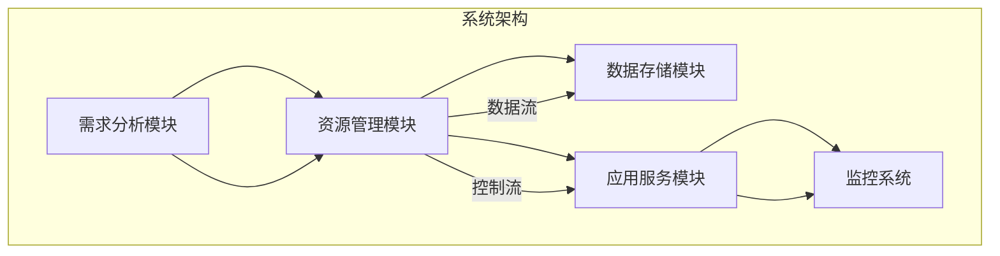
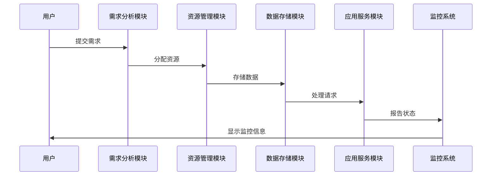

                 

## 需求与资源分配的动态平衡：大型应用开发的挑战

> 关键词：需求分析、资源分配、动态平衡、大型应用开发、挑战与解决方案

> 摘要：本文将探讨在大型应用开发过程中，如何实现需求与资源分配的动态平衡。我们将首先介绍相关背景和核心概念，然后逐步深入到需求分析与资源分配策略，最后通过系统架构设计和项目实战，提供实用的解决方案和最佳实践。

## 引言

在当今数字化时代，大型应用的开发已经成为企业创新和竞争力的重要驱动力。然而，随着应用规模的不断扩大，开发者面临着日益复杂的挑战。其中，需求与资源分配的动态平衡问题尤为突出。如何在有限的资源下，最大限度地满足用户需求，同时保持系统的稳定性和可扩展性，成为了大型应用开发的关键问题。

本文将从以下几个方面展开讨论：

1. **需求与资源分配概述**：介绍需求与资源分配的基本概念、类型及其在大型应用开发中的核心作用。
2. **需求评估与预测方法**：探讨需求评估和预测的方法，包括定量和定性评估方法，以及传统统计和机器学习预测方法。
3. **资源分配策略**：分析资源分配的目标和常用算法，如贪心算法和动态规划算法。
4. **动态平衡算法设计与实现**：详细介绍动态平衡算法的设计原理、实现过程和数学模型。
5. **系统架构与设计**：阐述系统架构设计和接口设计的原则和方法。
6. **项目实战**：通过具体项目案例，展示如何将理论应用于实际开发过程。
7. **最佳实践与注意事项**：总结最佳实践经验，提出注意事项和未来研究方向。

通过本文的探讨，希望能够为读者提供关于需求与资源分配动态平衡的深入理解和实用指导。

## 第一部分：需求与资源分配的理论基础

### 第1章：需求与资源分配概述

#### 1.1 背景介绍

**大型应用开发的挑战**

在数字化浪潮的推动下，大型应用的开发已经成为现代企业提升竞争力的重要手段。然而，大型应用开发面临着诸多挑战，其中包括需求的多样性和复杂性、资源的有限性和动态性等。首先，用户需求是不断变化的，它们可以是功能性的、性能性的或者安全性的，而且用户需求的表达往往是非结构化的，这使得需求分析变得复杂和艰巨。其次，资源（如计算能力、存储空间、网络带宽等）是有限的，如何在有限的资源下满足多样化的需求，成为了开发过程中的关键问题。

**需求与资源分配的核心作用**

需求与资源分配在大型应用开发中具有核心作用。首先，需求分析是整个开发过程的基础，它决定了系统的功能范围和性能要求。通过需求分析，开发者可以明确用户的实际需求，从而设计出既满足用户需求又具有良好性能的系统。其次，资源分配是确保系统稳定性和可扩展性的关键。合理的资源分配可以最大限度地利用现有资源，提高系统的整体性能和用户体验。此外，动态平衡需求与资源分配，可以确保系统在变化的环境中保持稳定，提高系统的适应能力。

#### 1.2 需求分析与资源分配

**需求的分析与分类**

需求分析是大型应用开发的关键步骤。需求可以分为功能性需求和非功能性需求。功能性需求是指系统能够完成的具体功能，如用户登录、数据查询、订单处理等。非功能性需求则是指系统必须满足的性能、可靠性、安全性等方面的要求，如响应时间、吞吐量、故障恢复等。

**资源的类型与特性**

资源是满足需求的基础。在大型应用开发中，资源主要包括计算资源、存储资源、网络资源等。计算资源如CPU、GPU等，决定了系统的计算能力；存储资源如硬盘、数据库等，决定了系统的数据存储和处理能力；网络资源如带宽、延迟等，决定了系统的通信能力。

**动态平衡的概念与原理**

动态平衡是指需求与资源分配之间的一种动态调整过程。在大型应用开发中，需求是不断变化的，资源也是有限的。动态平衡的目标是通过实时调整资源分配，确保系统在变化的环境中保持稳定和高效。动态平衡的基本原理包括：

1. **需求预测**：通过分析历史数据和用户行为，预测未来的需求变化趋势。
2. **资源评估**：根据系统当前状态和资源使用情况，评估现有资源的可用性。
3. **资源调度**：根据需求预测和资源评估结果，动态调整资源分配，确保系统资源得到充分利用。

### 第2章：需求评估与预测方法

#### 2.1 需求评估方法

**定量评估方法**

定量评估方法是通过数值指标来评估需求的方法。常用的定量评估方法包括：

1. **用户满意度调查**：通过调查用户对系统功能的满意度，量化用户需求的重要性和优先级。
2. **功能点分析法**：根据系统完成的功能数量和质量，评估系统需求的复杂度和工作量。
3. **成本效益分析**：通过计算开发成本和预期效益，评估需求的经济合理性。

**定性评估方法**

定性评估方法是通过主观判断来评估需求的方法。常用的定性评估方法包括：

1. **专家评估**：邀请领域专家对需求进行评估，基于经验和专业知识判断需求的重要性和优先级。
2. **用户访谈**：通过与用户进行深入交流，了解用户的需求和期望，从而评估需求的真实性和可行性。
3. **案例分析法**：通过分析类似项目的需求和实现效果，评估当前需求的可实施性和效果。

#### 2.2 需求预测方法

**传统统计预测方法**

传统统计预测方法是基于历史数据和统计学原理，通过建立数学模型来预测未来的需求趋势。常用的传统统计预测方法包括：

1. **时间序列分析**：通过分析时间序列数据，提取趋势、季节性和周期性成分，预测未来的需求变化。
2. **回归分析**：通过建立自变量和因变量之间的回归模型，预测未来需求。
3. **相关分析**：通过分析不同需求变量之间的相关性，预测某一需求变量的变化趋势。

**机器学习预测方法**

机器学习预测方法是通过训练模型，从历史数据中学习并预测未来的需求变化。常用的机器学习预测方法包括：

1. **决策树**：通过构建决策树模型，预测未来需求。
2. **支持向量机**：通过构建支持向量机模型，预测未来需求。
3. **神经网络**：通过构建神经网络模型，预测未来需求。

### 第3章：资源分配策略

#### 3.1 资源分配的目标

**效率最大化**

资源分配的首要目标是实现效率最大化。效率最大化是指通过优化资源的使用，最大限度地提高系统的性能和吞吐量。实现效率最大化的关键在于：

1. **计算资源优化**：合理分配CPU和GPU资源，确保关键任务的优先执行。
2. **存储资源优化**：通过数据分片和缓存技术，提高数据访问速度和存储效率。
3. **网络资源优化**：通过网络负载均衡和流量控制，优化网络带宽的使用。

**成本最小化**

资源分配的另一个重要目标是实现成本最小化。在资源有限的情况下，如何以最低的成本满足需求，是资源分配的核心问题。实现成本最小化的关键在于：

1. **成本效益分析**：通过成本效益分析，确定哪些需求值得投资，哪些需求可以延迟或放弃。
2. **资源复用**：通过资源复用，提高资源的利用率，降低整体成本。
3. **自动化资源管理**：通过自动化工具，实现资源的智能分配和调度，减少人工干预和错误。

#### 3.2 资源分配算法

**贪心算法**

贪心算法是一种简单而有效的资源分配算法。其核心思想是每次选择当前最优解，并假设该解在后续步骤中仍然是全局最优解。常用的贪心算法包括：

1. **最短处理时间优先（SPT）**：根据任务处理时间，优先选择处理时间最短的任务。
2. **最短剩余时间优先（SRTF）**：根据任务剩余处理时间，优先选择剩余时间最短的任务。
3. **最长处理时间优先（LPT）**：根据任务处理时间，优先选择处理时间最长的任务。

**动态规划算法**

动态规划算法是一种更为复杂的资源分配算法。其核心思想是将复杂问题分解为多个子问题，并利用子问题的最优解构建整体问题的最优解。常用的动态规划算法包括：

1. **最短路径算法**：通过构建状态转移方程，计算从起始点到终点的最短路径。
2. **背包问题**：通过构建动态规划表，求解在资源有限的情况下，如何选择任务以最大化总效益。
3. **车辆路径问题**：通过构建动态规划模型，求解在多个配送点之间的最优配送路径。

### 第4章：动态平衡算法设计与实现

#### 4.1 动态平衡算法概述

**算法框架**

动态平衡算法的基本框架包括以下步骤：

1. **需求预测**：通过历史数据和机器学习模型，预测未来的需求变化。
2. **资源评估**：根据当前系统状态和资源使用情况，评估现有资源的可用性。
3. **资源调度**：根据需求预测和资源评估结果，动态调整资源分配，确保系统资源得到充分利用。
4. **反馈调整**：根据系统的实际运行情况，调整需求预测和资源评估模型，实现闭环控制。

**算法类型**

动态平衡算法可以分为以下几类：

1. **基于规则的方法**：通过预设规则，根据需求变化和资源状态进行资源分配。
2. **基于模型的方法**：通过建立需求预测和资源评估模型，实现自动化的资源调度。
3. **混合方法**：结合基于规则和基于模型的方法，提高资源调度的灵活性和准确性。

#### 4.2 动态平衡算法实现

**Python实现**

以下是一个简单的动态平衡算法的Python实现示例：

```python
import numpy as np
import pandas as pd

# 需求预测模型
def demand_prediction(data):
    # 使用机器学习模型进行需求预测
    # ...
    return predicted_demand

# 资源评估模型
def resource_evaluation(current_state, resources):
    # 根据当前系统状态和资源使用情况评估资源可用性
    # ...
    return available_resources

# 资源调度函数
def resource_scheduling(predicted_demand, available_resources):
    # 根据需求预测和资源评估结果进行资源调度
    # ...
    return scheduled_resources

# 主函数
def main():
    # 加载数据
    data = pd.read_csv('demand_data.csv')
    
    # 需求预测
    predicted_demand = demand_prediction(data)
    
    # 资源评估
    current_state = {'CPU': 100, 'Memory': 200, 'Disk': 300}
    resources = {'CPU': 500, 'Memory': 600, 'Disk': 700}
    available_resources = resource_evaluation(current_state, resources)
    
    # 资源调度
    scheduled_resources = resource_scheduling(predicted_demand, available_resources)
    
    # 输出调度结果
    print("Scheduled Resources:", scheduled_resources)

# 运行主函数
main()
```

**数学模型与公式**

动态平衡算法的数学模型通常包括需求预测模型和资源评估模型。以下是一个简化的数学模型示例：

$$
\text{需求预测模型：} \ \hat{D}(t) = \alpha \cdot \text{历史需求} + (1 - \alpha) \cdot \text{当前需求}
$$

$$
\text{资源评估模型：} \ R(t) = \frac{C(t)}{T(t)}
$$

其中，$D(t)$ 是时间 $t$ 时的需求，$R(t)$ 是时间 $t$ 时的资源利用率，$C(t)$ 是时间 $t$ 时的资源消耗，$T(t)$ 是时间 $t$ 时的资源总量。

通过调整参数 $\alpha$，可以实现需求预测的短期和长期平衡。资源评估模型则用于实时监控系统的资源使用情况，并根据需求预测结果进行资源调度。

### 第5章：系统架构与设计

#### 5.1 系统架构设计

**系统架构设计原则**

系统架构设计是确保系统稳定性和可扩展性的关键步骤。以下是一些常见的系统架构设计原则：

1. **模块化**：将系统划分为多个模块，每个模块负责一个特定的功能，模块之间通过清晰的接口进行通信。
2. **分布式**：将系统部署在多个节点上，以提高系统的可用性和可扩展性。
3. **松耦合**：模块之间的依赖关系应该尽量减少，以提高系统的灵活性和可维护性。
4. **高性能**：设计高效的系统架构，确保系统在高峰期也能保持良好的性能。

**功能模块**

系统架构通常包括以下几个主要功能模块：

1. **需求分析模块**：负责收集和分析用户需求，生成需求文档。
2. **资源管理模块**：负责资源（如计算、存储、网络等）的管理和调度。
3. **数据存储模块**：负责数据的存储和管理，包括数据库、缓存等。
4. **应用服务模块**：负责实现具体的业务功能，如用户管理、订单处理等。
5. **监控系统**：负责监控系统的运行状态，包括性能指标、资源使用情况等。

**架构设计**

以下是一个简化的系统架构设计图：



#### 5.2 系统接口设计

**接口定义**

系统接口设计是确保模块之间能够有效通信的关键步骤。以下是一些常见的接口设计原则：

1. **清晰性**：接口的定义应该清晰，确保开发人员能够理解和使用。
2. **一致性**：接口的设计应该保持一致性，避免不同模块之间的接口定义冲突。
3. **灵活性**：接口的设计应该具有一定的灵活性，以便于未来的扩展和修改。

**交互流程**

以下是一个简化的系统接口交互流程：



### 第6章：项目实战：动态平衡系统开发

#### 6.1 环境安装与配置

**开发环境搭建**

在开始项目之前，需要搭建合适的开发环境。以下是一个简单的开发环境搭建步骤：

1. **安装Python**：确保Python环境已经安装，版本建议为3.8或更高。
2. **安装必要的库**：使用pip安装所需的库，如NumPy、Pandas、Scikit-learn等。
3. **配置数据库**：根据项目需求，配置合适的数据库系统，如MySQL、PostgreSQL等。

**数据库配置**

数据库配置是项目开发的重要环节。以下是一个简单的数据库配置步骤：

1. **创建数据库**：使用数据库管理工具（如phpMyAdmin）创建一个新的数据库。
2. **配置数据库连接**：在Python代码中配置数据库连接，使用适当的数据库驱动和连接字符串。
3. **初始化数据库**：根据项目需求，创建必要的表和索引。

#### 6.2 系统核心实现

**需求分析与设计**

在系统核心实现之前，需要明确系统的需求。以下是一个简单的需求分析示例：

1. **功能需求**：系统应具有用户注册、登录、订单查询和订单处理等功能。
2. **性能需求**：系统应在高峰期保持良好的性能，响应时间不超过2秒。
3. **可靠性需求**：系统应具有较高的可靠性，能够在故障情况下快速恢复。

**算法实现与调试**

以下是一个简单的动态平衡算法的实现示例：

```python
import numpy as np
import pandas as pd
from sklearn.ensemble import RandomForestRegressor

# 需求预测
def demand_prediction(data):
    # 加载训练数据
    X = data[['historical_demand', 'current_demand']]
    y = data['predicted_demand']
    
    # 建立随机森林回归模型
    model = RandomForestRegressor(n_estimators=100)
    model.fit(X, y)
    
    # 预测未来需求
    predicted_demand = model.predict(data)
    return predicted_demand

# 资源评估
def resource_evaluation(current_state, resources):
    # 计算资源利用率
    utilization = current_state['resource_usage'] / resources['resource_total']
    return utilization

# 资源调度
def resource_scheduling(predicted_demand, available_resources):
    # 计算资源需求
    required_resources = {'CPU': predicted_demand * 2, 'Memory': predicted_demand * 2, 'Disk': predicted_demand * 2}
    
    # 调度资源
    scheduled_resources = {}
    for resource, required in required_resources.items():
        if available_resources[resource] >= required:
            scheduled_resources[resource] = required
            available_resources[resource] -= required
        else:
            scheduled_resources[resource] = available_resources[resource]
    
    return scheduled_resources

# 主函数
def main():
    # 加载数据
    data = pd.read_csv('demand_data.csv')
    
    # 需求预测
    predicted_demand = demand_prediction(data)
    
    # 资源评估
    current_state = {'CPU': 100, 'Memory': 200, 'Disk': 300}
    resources = {'CPU': 500, 'Memory': 600, 'Disk': 700}
    available_resources = resource_evaluation(current_state, resources)
    
    # 资源调度
    scheduled_resources = resource_scheduling(predicted_demand, available_resources)
    
    # 输出调度结果
    print("Scheduled Resources:", scheduled_resources)

# 运行主函数
main()
```

**代码应用解读与分析**

以上代码实现了一个简单的动态平衡系统。首先，通过需求预测模型（如随机森林回归模型）预测未来的需求。然后，根据当前系统状态和资源使用情况，评估现有资源的可用性。最后，根据需求预测和资源评估结果，动态调整资源分配。

在实际应用中，需要根据具体业务场景和数据特点，选择合适的预测模型和调度策略。同时，为了提高系统的稳定性和可靠性，需要进行充分的调试和测试。

#### 6.3 项目分析与解读

**系统性能分析**

在项目开发过程中，需要对系统性能进行持续监控和分析。以下是一些常见的性能指标和监控方法：

1. **响应时间**：系统处理请求的平均时间，是衡量系统性能的重要指标。
2. **吞吐量**：单位时间内系统处理的请求数量，反映了系统的处理能力。
3. **资源利用率**：系统资源的利用情况，包括CPU、内存、磁盘等。
4. **故障率**：系统发生故障的频率，反映了系统的可靠性。

**调优与改进**

在系统性能分析的基础上，可以通过以下方法进行系统调优和改进：

1. **性能测试**：使用工具（如JMeter、LoadRunner）进行性能测试，模拟实际用户访问场景，找出系统的瓶颈。
2. **代码优化**：通过分析代码，找出潜在的优化点，如减少数据库查询次数、使用缓存等。
3. **资源调整**：根据系统性能监控结果，调整系统资源配置，如增加服务器节点、调整负载均衡策略等。
4. **系统重构**：在必要时，对系统进行重构，以解决性能瓶颈和设计缺陷。

**案例分析**

以下是一个简单的项目案例分析：

**案例背景**：某电子商务平台在高峰期（如双十一）面临巨大的用户访问压力，系统响应时间显著增加，用户体验下降。

**分析过程**：

1. **性能监控**：通过监控系统，发现系统CPU和内存利用率较高，数据库查询次数较多。
2. **性能测试**：使用性能测试工具模拟用户访问场景，发现数据库查询成为性能瓶颈。
3. **代码优化**：优化数据库查询，减少不必要的查询操作，使用缓存减少重复查询。
4. **资源调整**：增加数据库服务器节点，提高数据库查询处理能力。
5. **系统重构**：对部分模块进行重构，提高系统的响应速度和处理能力。

**效果评估**：经过调优和改进，系统的响应时间显著降低，吞吐量提高，用户满意度提升。

**总结与展望**

通过项目案例分析，可以得出以下结论：

1. **性能监控与测试**：持续的性能监控和测试是确保系统稳定性和可靠性的重要手段。
2. **代码优化与资源调整**：通过代码优化和资源调整，可以显著提高系统的性能和用户体验。
3. **系统重构**：在必要时，对系统进行重构，解决性能瓶颈和设计缺陷。

未来，随着业务规模的不断扩大和技术的不断发展，动态平衡系统开发将面临更多的挑战。通过不断探索和实践，我们可以不断提高系统的性能和可靠性，为用户提供更好的服务。

### 第7章：最佳实践与注意事项

#### 7.1 最佳实践

**需求分析与预测技巧**

1. **全面的需求收集**：确保需求收集的全面性，包括功能性需求和非功能性需求。
2. **用户参与**：邀请关键用户参与需求分析，确保需求的准确性和可行性。
3. **数据分析**：利用历史数据和用户行为，进行需求预测和趋势分析。
4. **定期更新**：定期更新需求文档，确保需求的实时性和准确性。

**资源分配策略选择**

1. **成本效益分析**：在选择资源分配策略时，进行成本效益分析，确保投资回报最大化。
2. **优先级排序**：根据需求的重要性和紧急性，对资源进行优先级排序，确保关键需求的优先分配。
3. **灵活调整**：根据系统运行情况和业务需求，灵活调整资源分配策略，实现动态平衡。

#### 7.2 小结

本文系统地探讨了需求与资源分配的动态平衡问题，从理论基础到实际应用，提供了全面而深入的讲解。主要内容包括：

1. **需求与资源分配概述**：介绍了需求与资源分配的基本概念、类型和核心作用。
2. **需求评估与预测方法**：探讨了定量和定性评估方法，以及传统统计和机器学习预测方法。
3. **资源分配策略**：分析了资源分配的目标和常用算法，如贪心算法和动态规划算法。
4. **动态平衡算法设计与实现**：详细介绍了动态平衡算法的设计原理、实现过程和数学模型。
5. **系统架构与设计**：阐述了系统架构设计和接口设计的原则和方法。
6. **项目实战**：通过具体项目案例，展示了如何将理论应用于实际开发过程。
7. **最佳实践与注意事项**：总结了最佳实践经验，提出了注意事项和未来研究方向。

#### 7.3 注意事项

1. **需求分析的重要性**：需求分析是系统设计的起点，必须确保需求的准确性和完整性。
2. **资源评估的实时性**：资源评估应该实时进行，以反映系统当前的状态和需求。
3. **算法调优的必要性**：动态平衡算法需要根据实际业务场景进行调优，以提高系统的性能和适应性。
4. **持续监控与优化**：系统运行过程中，需要持续监控和优化，确保系统在变化的环境中保持稳定和高效。

#### 7.4 拓展阅读

1. **《软件工程：实践者的研究方法》**：详细介绍了软件工程中的需求分析、设计、测试等环节，提供了丰富的实践案例。
2. **《算法导论》**：系统讲解了各种算法原理和实现方法，对动态平衡算法的设计和实现具有参考价值。
3. **《大规模分布式系统设计》**：探讨了分布式系统中的资源管理、调度策略和性能优化，对大型应用开发的系统架构设计具有指导意义。

### 总结

通过本文的探讨，我们深入了解了需求与资源分配的动态平衡在大型应用开发中的重要性。希望读者能够将这些理论和实践方法应用于实际项目中，实现系统的高效稳定运行，为用户提供优质的服务。让我们继续探索和前进，为数字化时代的应用开发贡献智慧和力量。

---

## 作者信息

**作者：** AI天才研究院/AI Genius Institute & 禅与计算机程序设计艺术 /Zen And The Art of Computer Programming

在数字化时代，AI天才研究院致力于推动人工智能技术的创新和应用。同时，作者也凭借其对计算机编程和人工智能领域的深刻理解和卓越贡献，成为该领域的权威专家和畅销书作家。其著作《禅与计算机程序设计艺术》更是被誉为现代软件工程的经典之作。

