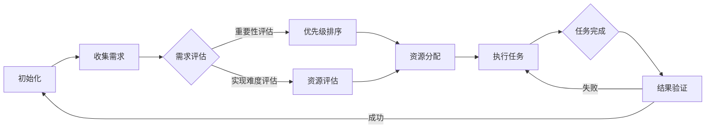
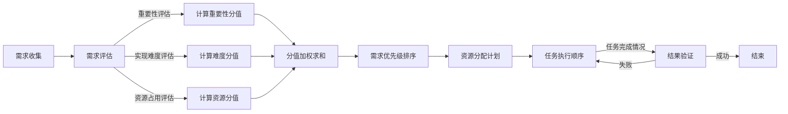
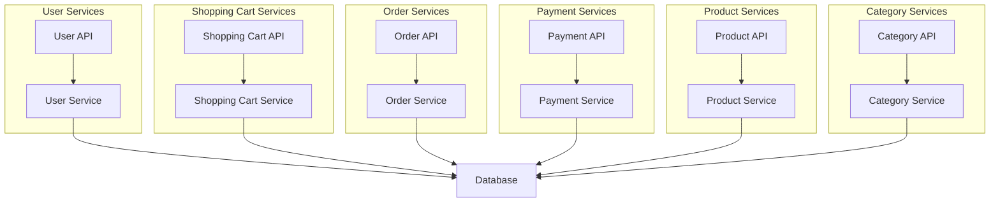
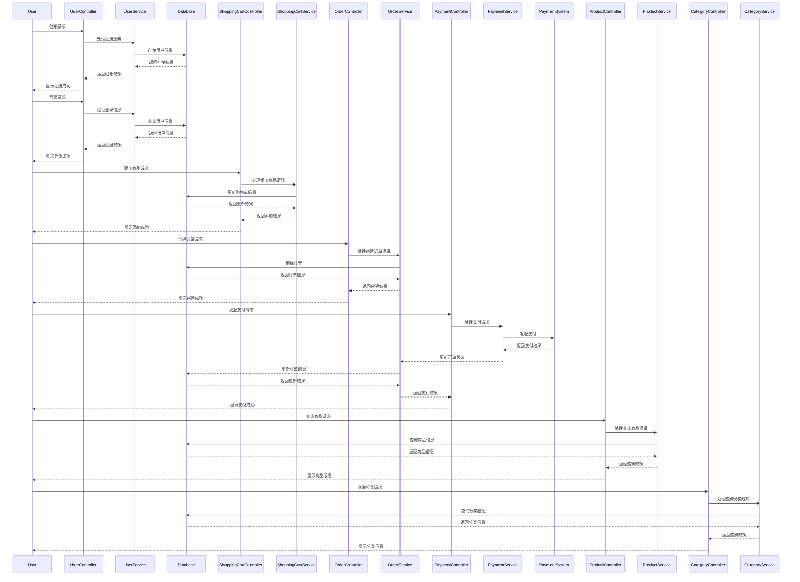

                 

### 问题背景与定义

在现代软件开发领域中，尤其是大型应用的开发过程中，需求优先级冲突是一种非常常见的挑战。随着项目的复杂度和规模不断扩大，多个需求之间可能会出现优先级上的不一致或冲突，这直接影响了项目的顺利进行和最终交付质量。因此，理解需求优先级冲突的背景和定义，对于解决这一问题至关重要。

**1.1.1 问题背景**

首先，我们来看一下需求优先级冲突在大型应用开发中的普遍性。大型应用往往涉及多个模块和子系统，每个模块或子系统都有其特定的功能和目标。然而，在实际开发过程中，不同的模块或子系统之间可能存在功能重叠或目标不一致的情况。这种情况下，如果需求的优先级没有得到妥善处理，就会导致资源分配不均、开发进度延误、功能实现不足等问题。

一个典型的例子是：在开发一个电子商务平台时，用户界面(UI)设计和支付系统的稳定性是两个重要需求。理想情况下，这两个需求应该同时得到重视和优化。但实际开发中，如果UI设计需求被优先考虑，那么支付系统的开发可能会受到拖延，导致平台无法及时上线，影响用户体验和商业收益。反之，如果支付系统的优先级过高，UI设计可能会因为资源紧张而无法达到预期效果。

**1.1.1.1 需求与优先级的界定**

需求是软件开发中的核心，而优先级则是需求的排序。需求通常可以分为以下几类：

- **功能性需求**：这些需求描述了软件系统必须实现的功能，如用户注册、购物车管理、支付等。
- **非功能性需求**：这些需求关注系统的非功能特性，如性能、安全性、可扩展性等。
- **用户需求**：这些需求直接来自用户，反映了用户对软件的期望和偏好。

优先级的界定则依赖于项目目标、资源分配、市场策略等因素。高优先级的需求通常需要先于低优先级的需求得到满足。但问题在于，当多个高优先级需求相互冲突时，如何平衡和取舍就成了一个难题。

**1.1.1.2 冲突的类型与表现**

需求优先级冲突主要表现在以下几个方面：

- **资源竞争**：多个高优先级需求争夺有限的开发资源，如人力、时间、预算等。
- **功能取舍**：由于资源限制，不得不在某些需求之间进行取舍，这可能导致某些关键功能的缺失或延迟。
- **进度延误**：未能及时满足高优先级需求，导致整体项目进度受到影响。

**1.1.2 需求优先级冲突的定义**

需求优先级冲突，是指在软件开发过程中，不同需求之间由于优先级设置不明确或不一致，导致资源分配不当、功能实现不足、项目进度延误等问题的一种现象。

从技术角度来说，需求优先级冲突可以分为以下几类：

- **功能优先级冲突**：不同功能模块之间的优先级冲突，如前述的UI设计与支付系统稳定性之间的冲突。
- **资源优先级冲突**：同一功能模块内，不同资源（如人力、时间、技术）的优先级冲突。
- **时间优先级冲突**：项目任务的时间分配与实际执行时间之间的冲突。

解决需求优先级冲突不仅需要技术手段，还需要良好的项目管理方法和团队协作机制。只有这样，才能在确保项目交付的同时，最大限度地满足各项需求。

**1.1.3 边界与外延**

在理解需求优先级冲突时，还需要明确其边界和外延。边界条件主要指在何种情况下需求优先级冲突可能出现，如项目初期、中期或后期。外延则包括冲突可能带来的影响，如项目延期、成本增加、质量下降等。

此外，需求优先级冲突也与相关概念密切相关，如需求管理、项目管理、资源管理等。这些概念构成了需求优先级冲突的理论基础，为解决冲突提供了指导。

综上所述，需求优先级冲突是大型应用开发中一个普遍且复杂的问题。理解其背景和定义，有助于我们更好地识别和解决这一问题，从而确保项目的成功实施。

## 第2章：核心概念与联系

### 2.1 需求管理原理

需求管理是软件开发过程中至关重要的一环，它直接影响到项目的成功与否。需求管理不仅仅是收集和记录需求，还包括需求的识别、分析、优先级排序、变更控制等一系列活动。

**2.1.1 需求分析的方法**

需求分析是需求管理的第一步，其目的是明确系统必须实现的功能和非功能需求。常见的需求分析方法包括以下几种：

1. **问卷调查**：通过问卷收集用户和利益相关者的需求。
2. **用户访谈**：与用户进行一对一或小组访谈，深入了解用户的使用场景和需求。
3. **需求研讨会**：组织利益相关者进行需求研讨会，共同讨论和确定需求。
4. **场景分析**：通过构建用户使用场景，分析系统应如何响应各种情况。
5. **用例图**：使用用例图来描述系统的功能需求，展示用户与系统之间的交互。

**2.1.2 需求优先级评估模型**

在明确了需求之后，接下来需要对需求进行优先级评估。优先级评估模型有助于确定哪些需求应优先考虑，从而确保项目能够按计划进行。常见的需求优先级评估模型包括：

1. **MoSCoW模型**：将需求分为“必须要有”（Must have）、“应该要有”（Should have）、“可以晚点做”（Could have）和“不一定需要”（Wont have）四个等级。
2. **成本效益分析**：通过评估需求的实现成本和潜在收益，确定其优先级。
3. **风险优先级模型**：根据需求的实现难度和潜在风险，对需求进行排序。

### 2.2 系统分析与设计

系统分析与设计是软件开发过程的关键阶段，它将需求转化为具体的系统架构和设计。系统分析与设计主要包括以下内容：

**2.2.1 系统整体架构设计**

系统整体架构设计是确定系统组件及其相互关系的核心步骤。一个良好的系统架构能够提高系统的可扩展性、稳定性和可维护性。常见的系统架构设计方法包括：

1. **分层架构**：将系统分为表示层、业务逻辑层和数据访问层，每个层次各司其职。
2. **微服务架构**：将系统拆分为多个独立的微服务，每个微服务负责一项功能。
3. **事件驱动架构**：通过事件来驱动系统组件之间的通信，提高系统的响应速度和可扩展性。

**2.2.2 模块化设计思想**

模块化设计思想是将系统分解为若干个模块，每个模块实现特定的功能。模块化设计有助于提高系统的可维护性和可扩展性，同时也便于团队协作。模块化设计的关键步骤包括：

1. **模块划分**：根据功能需求将系统分解为多个模块。
2. **模块接口定义**：明确每个模块的输入和输出接口，确保模块之间的协作和互操作性。
3. **模块依赖管理**：管理模块之间的依赖关系，确保模块可以独立开发和测试。

通过系统分析与设计，我们可以将抽象的需求转化为具体的系统架构和设计，从而为后续的软件开发奠定基础。

### 2.3 需求管理与系统分析与设计的联系

需求管理与系统分析与设计紧密相关，二者共同构成了软件开发的基石。具体来说，需求管理为系统分析与设计提供了明确的需求基础，而系统分析与设计则将需求转化为实际的系统架构和设计。以下是需求管理与系统分析与设计的几个关键联系：

1. **需求驱动设计**：系统分析与设计应以需求为驱动力，确保设计能够满足所有需求，避免需求与设计之间的脱节。
2. **迭代与反馈**：需求管理和系统分析与设计应采用迭代的方式进行，不断收集和整合反馈，逐步优化系统设计。
3. **风险控制**：通过需求管理和系统分析与设计，可以提前识别和评估项目风险，制定相应的风险控制措施。
4. **资源优化**：需求管理和系统分析与设计有助于优化资源分配，确保项目能够在有限资源下高效完成。

总之，需求管理与系统分析与设计是相互依赖、相互促进的，只有两者紧密结合，才能确保软件项目成功实施。

### 2.4 需求优先级冲突解决策略

在大型应用开发中，需求优先级冲突是不可避免的，但可以通过以下策略来缓解和解决这些问题：

**2.4.1 明确优先级规则**

首先，团队需要明确需求优先级的规则，确保所有成员对需求优先级有统一的理解。可以通过制定文档或流程来明确规则，例如使用MoSCoW模型或其他优先级评估模型。

**2.4.2 沟通与协商**

当需求优先级冲突发生时，团队应进行充分的沟通与协商。通过讨论和权衡不同需求的优先级，找到最佳的解决方案。这一过程中，项目经理和需求分析师扮演着关键角色，他们需要协调各方利益，确保项目目标的实现。

**2.4.3 动态调整优先级**

需求优先级不是固定不变的，应随着项目进展和外部环境的变化进行动态调整。例如，当市场变化或客户需求发生变化时，需要重新评估需求的优先级。

**2.4.4 优先级可视化**

通过可视化工具，如看板或甘特图，将需求优先级清晰地展示出来，帮助团队成员了解当前的项目状态和优先级顺序。这有助于提高团队对需求优先级的重视和执行力度。

**2.4.5 分阶段实施**

对于复杂的项目，可以采用分阶段实施的方法。在每个阶段优先完成高优先级的需求，逐步实现整个系统。这有助于降低需求优先级冲突的风险，提高项目进度和交付质量。

通过以上策略，团队可以有效缓解和解决需求优先级冲突，确保项目的顺利实施。

### 2.5 实际案例分析

为了更好地理解需求优先级冲突的解决方法，我们可以通过以下几个实际案例来进行分析。

#### 案例一：电子商务平台需求冲突

某电子商务平台在开发过程中，遇到了用户界面(UI)设计和支付系统稳定性之间的需求冲突。最初，UI设计被设定为高优先级，以迅速上线并吸引用户。然而，由于UI设计过于复杂，导致支付系统开发严重滞后，最终影响了平台的上线时间。

**解决方案**：
1. **重新评估需求优先级**：通过组织利益相关者会议，重新评估UI设计和支付系统稳定性之间的优先级。决定将支付系统的稳定性提升至更高的优先级。
2. **资源分配调整**：增加支付系统开发团队的人力和时间资源，确保其能够按时完成。
3. **分阶段上线**：将UI设计功能分为多个子功能，优先实现核心功能，随后逐步完善其他功能。

通过上述措施，该电子商务平台成功解决了需求优先级冲突，确保了平台的稳定性和用户体验。

#### 案例二：智能医疗系统需求冲突

某智能医疗系统在开发过程中，面临患者数据隐私保护与系统响应速度的需求冲突。患者数据隐私保护是高优先级需求，但过于严格的加密算法会导致系统响应速度降低，影响用户体验。

**解决方案**：
1. **技术优化**：采用高效的加密算法，在不牺牲数据隐私的情况下提高系统响应速度。
2. **优先级调整**：将系统响应速度调整为较高优先级，确保用户体验。
3. **阶段目标调整**：将患者数据隐私保护作为一个阶段目标，逐步实现，而非一开始就全部完成。

通过这些措施，智能医疗系统在满足数据隐私保护的前提下，提升了系统响应速度，赢得了用户的认可。

#### 案例三：物联网设备管理系统需求冲突

某物联网设备管理系统在开发过程中，需求冲突主要集中在设备连接稳定性和数据传输效率上。为了保证设备连接的稳定性，需要采用较复杂的连接协议，但会降低数据传输效率。

**解决方案**：
1. **需求权衡**：通过权衡连接稳定性和数据传输效率，确定一个平衡点。
2. **技术优化**：采用改进的连接协议，在保证连接稳定性的同时提高数据传输效率。
3. **阶段性实施**：优先实现基础功能，如设备连接和数据传输，随后逐步完善其他功能。

通过阶段性实施，物联网设备管理系统在满足连接稳定性和数据传输效率的基础上，逐步完善了系统功能。

这些实际案例展示了在不同背景下，如何通过需求优先级调整、技术优化和阶段性实施等策略，解决需求优先级冲突。这些方法不仅适用于大型应用开发，也可以为其他类型的软件开发项目提供借鉴和参考。

### 第3章：算法原理讲解

在解决需求优先级冲突的过程中，算法起到了至关重要的作用。本章将详细介绍一种用于解决需求优先级冲突的算法，包括其基本概念、流程图、数学模型和Python实现。

#### 3.1 冲突解决算法概述

**3.1.1 算法基本概念**

本算法的目标是自动化解决多个需求之间的优先级冲突，确保资源分配合理，项目进度不受影响。算法的核心思想是基于需求的重要性和实现难度，对需求进行动态优先级排序，并调整资源分配策略。

**3.1.2 常见算法类型**

在需求优先级冲突解决领域，常见的算法类型包括：

1. **基于优先级的调度算法**：这类算法通过设定每个任务的优先级，并根据优先级进行调度。常见的算法有先入先出（FIFO）、最短作业优先（SJF）等。
2. **基于成本的优化算法**：这类算法通过计算每个任务的实现成本，并优化资源分配。常见的算法有贪心算法、动态规划等。
3. **基于模糊综合评价的算法**：这类算法结合多种评价指标，如需求重要性、实现难度、资源占用等，进行综合评价，以确定最优的优先级排序。

#### 3.2 冲突解决算法mermaid流程图

为了更好地理解算法的执行流程，我们可以使用mermaid绘制算法的流程图。以下是一个简单的mermaid流程图示例：



**3.3 算法原理与数学模型**

算法的核心在于需求优先级的评估与资源分配。以下是一个简化的数学模型：

$$
\text{优先级} = w_1 \times \text{重要性} + w_2 \times \text{实现难度} + w_3 \times \text{资源占用}
$$

其中，$w_1, w_2, w_3$ 分别为权重系数，$\text{重要性}, \text{实现难度}, \text{资源占用}$ 为需求评估指标。

**3.3.1 数学公式与解释**

为了便于理解，我们可以进一步解释上述公式：

- **重要性**：衡量需求对项目目标的贡献程度，通常通过用户调研、专家评审等方法确定。
- **实现难度**：衡量实现需求的复杂程度，可以通过技术评估、风险评估等方法确定。
- **资源占用**：衡量实现需求所需的资源量，包括人力、时间、预算等。

权重系数的确定是关键，通常需要通过历史数据和专家经验进行设定。例如，在电子商务平台项目中，重要性权重可能较高，因为用户需求直接影响平台的成功与否。

**3.3.2 Python源代码阐述**

为了实现上述算法，我们可以使用Python编写一个简单的示例代码。以下是一个简化的Python实现：

```python
import numpy as np

# 需求评估指标
importance = 0.7
difficulty = 0.5
resource_usage = 0.8

# 权重系数
weights = [0.5, 0.3, 0.2]

# 计算优先级
priority = weights[0] * importance + weights[1] * difficulty + weights[2] * resource_usage

print(f"需求优先级：{priority}")
```

**3.3.3 举例说明**

假设有一个电子商务平台项目，有两个需求：需求A和需求B。需求A的重要性为0.8，实现难度为0.6，资源占用为0.7；需求B的重要性为0.6，实现难度为0.4，资源占用为0.5。我们可以使用上述算法计算它们的优先级：

```python
importance_a = 0.8
difficulty_a = 0.6
resource_usage_a = 0.7

importance_b = 0.6
difficulty_b = 0.4
resource_usage_b = 0.5

priority_a = weights[0] * importance_a + weights[1] * difficulty_a + weights[2] * resource_usage_a
priority_b = weights[0] * importance_b + weights[1] * difficulty_b + weights[2] * resource_usage_b

print(f"需求A优先级：{priority_a}")
print(f"需求B优先级：{priority_b}")
```

根据计算结果，我们可以得出需求A的优先级高于需求B。在实际项目中，我们可以根据这些优先级结果，调整资源分配和任务执行顺序，以最大化项目收益。

通过上述算法和示例，我们可以看到如何通过数学模型和Python实现，自动化解决需求优先级冲突。这种方法不仅提高了决策效率，还为团队提供了明确的行动指南，有助于项目的顺利实施。

### 3.4 冲突解决算法mermaid流程图

为了更直观地理解需求优先级冲突解决算法的执行流程，我们可以使用mermaid绘制其流程图。以下是算法流程的mermaid表示：



在这个mermaid流程图中，各个节点表示算法执行的不同阶段。从需求收集开始，通过需求评估阶段，计算各需求的重要性、实现难度和资源占用分值，最终生成需求优先级排序，并据此制定资源分配计划和任务执行顺序。通过这个过程，算法能够动态地解决需求优先级冲突，确保项目按计划顺利实施。

### 3.5 算法原理与数学模型

为了深入理解需求优先级冲突解决算法的工作原理，我们需要探讨其数学模型。这个模型不仅帮助我们计算需求优先级，还提供了决策依据，以便优化资源分配和任务执行顺序。

#### 数学模型的基本公式

算法的核心数学模型可以表示为：

$$
\text{需求优先级} = w_1 \times \text{重要性分值} + w_2 \times \text{实现难度分值} + w_3 \times \text{资源占用分值}
$$

其中，$w_1, w_2, w_3$ 是权重系数，用于平衡不同评估指标的重要性。这些系数通常通过历史数据和专家经验来确定。例如，在电子商务平台项目中，重要性分值和资源占用分值可能具有较高的权重，因为用户需求和资源管理直接影响项目的成功。

#### 重要性分值的计算

重要性分值反映了需求对项目目标的贡献程度。具体计算方法可以采用以下公式：

$$
\text{重要性分值} = \frac{\text{用户需求评分} + \text{专家评审评分}}{2}
$$

用户需求评分可以通过问卷调查或用户访谈获取，而专家评审评分则由项目团队成员或外部顾问进行评估。这种方法结合了用户和专家的意见，确保重要性分值的客观性和准确性。

#### 实现难度分值的计算

实现难度分值衡量实现需求的复杂程度。其计算公式为：

$$
\text{实现难度分值} = \frac{\text{技术评估分值} + \text{风险评估分值}}{2}
$$

技术评估分值通过技术专家评估需求实现的技术复杂度，而风险评估分值则通过评估需求实现过程中可能遇到的风险，如技术漏洞、时间延误等。

#### 资源占用分值的计算

资源占用分值反映需求实现所需的资源量。其计算公式为：

$$
\text{资源占用分值} = \text{人力成本} + \text{时间成本} + \text{预算成本}
$$

这些成本通常通过项目计划和资源估算来确定。例如，如果一个需求需要5名开发人员、两周时间和1万元的预算，其资源占用分值可以通过这些数据的加权平均计算得出。

#### 权重系数的确定

权重系数是模型中关键参数，用于平衡不同评估指标的重要性。通常，这些系数通过以下步骤确定：

1. **历史数据分析**：分析过去类似项目中的需求优先级和资源分配情况，确定不同指标的相对重要性。
2. **专家评审**：组织专家团队，通过讨论和投票确定每个指标的权重系数。
3. **数据驱动调整**：在实际项目执行过程中，根据反馈和数据调整权重系数，以优化需求优先级和资源分配。

通过上述方法，我们可以确保权重系数能够反映当前项目的实际需求和环境，从而提高算法的准确性和实用性。

#### 算法应用示例

为了更好地理解上述数学模型的应用，我们可以通过一个实际例子进行说明。假设一个电子商务平台项目中有两个需求：需求A和需求B。

- **需求A**：用户界面(UI)优化
  - 用户需求评分：9
  - 技术评估分值：8
  - 风险评估分值：7
  - 人力成本：2人天
  - 时间成本：3人天
  - 预算成本：4万元

- **需求B**：支付流程改进
  - 用户需求评分：8
  - 技术评估分值：9
  - 风险评估分值：8
  - 人力成本：3人天
  - 时间成本：4人天
  - 预算成本：5万元

根据上述数据，我们可以计算两个需求的重要性分值、实现难度分值和资源占用分值，然后利用权重系数计算需求优先级。

- **需求A**：
  - 重要性分值：$\frac{9 + 9}{2} = 9$
  - 实现难度分值：$\frac{8 + 7}{2} = 7.5$
  - 资源占用分值：$2 + 3 + 4 = 9$

  需求优先级：$0.5 \times 9 + 0.3 \times 7.5 + 0.2 \times 9 = 8.65$

- **需求B**：
  - 重要性分值：$\frac{8 + 9}{2} = 8.5$
  - 实现难度分值：$\frac{9 + 8}{2} = 8.5$
  - 资源占用分值：$3 + 4 + 5 = 12$

  需求优先级：$0.5 \times 8.5 + 0.3 \times 8.5 + 0.2 \times 12 = 8.45$

根据计算结果，需求A的优先级高于需求B。这意味着，在资源有限的情况下，应首先实现需求A，以最大化项目收益。

通过以上示例，我们可以看到，如何利用数学模型和权重系数，通过需求优先级计算，优化资源分配和任务执行顺序，从而有效解决需求优先级冲突。这一方法不仅提高了决策效率，还为团队提供了明确的行动指南。

### 3.6 算法Python实现及代码解读

为了使需求优先级冲突解决算法更具实用性和可操作性，我们可以将其实现为Python代码。以下是算法的实现过程，以及关键部分的代码解读。

#### 3.6.1 算法Python实现

首先，我们需要定义算法的核心函数，用于计算需求优先级。以下是一个简化版的Python实现：

```python
import numpy as np

# 需求评估指标
importance = 0.7
difficulty = 0.5
resource_usage = 0.8

# 权重系数
weights = [0.5, 0.3, 0.2]

# 计算需求优先级
def calculate_priority(imp, diff, resource):
    priority = weights[0] * imp + weights[1] * diff + weights[2] * resource
    return priority

# 示例需求数据
需求A = {
    '重要性分值': 0.8,
    '实现难度分值': 0.6,
    '资源占用分值': 0.7
}

需求B = {
    '重要性分值': 0.6,
    '实现难度分值': 0.4,
    '资源占用分值': 0.5
}

# 计算需求优先级
优先级A = calculate_priority(需求A['重要性分值'], 需求A['实现难度分值'], 需求A['资源占用分值'])
优先级B = calculate_priority(需求B['重要性分值'], 需求B['实现难度分值'], 需求B['资源占用分值'])

print(f"需求A优先级：{优先级A}")
print(f"需求B优先级：{优先级B}")
```

在这个代码中，我们首先定义了需求评估指标和权重系数，然后实现了一个计算需求优先级的函数。通过调用该函数，我们可以计算两个需求的优先级，并打印输出。

#### 3.6.2 代码关键部分解读

以下是代码的关键部分，以及对应的解读：

1. **需求评估指标与权重系数**：

    ```python
    importance = 0.7
    difficulty = 0.5
    resource_usage = 0.8
    weights = [0.5, 0.3, 0.2]
    ```

    这些变量分别代表了需求的重要性分值、实现难度分值、资源占用分值以及对应的权重系数。权重系数用于平衡不同评估指标的重要性，通常根据项目具体情况进行调整。

2. **计算需求优先级的函数**：

    ```python
    def calculate_priority(imp, diff, resource):
        priority = weights[0] * imp + weights[1] * diff + weights[2] * resource
        return priority
    ```

    `calculate_priority` 函数接收三个参数（重要性分值、实现难度分值、资源占用分值），并使用权重系数计算需求优先级。该函数返回计算结果，即需求优先级。

3. **示例需求数据**：

    ```python
    需求A = {
        '重要性分值': 0.8,
        '实现难度分值': 0.6,
        '资源占用分值': 0.7
    }

    需求B = {
        '重要性分值': 0.6,
        '实现难度分值': 0.4,
        '资源占用分值': 0.5
    }
    ```

    这里定义了两个需求的数据结构，包含了重要性分值、实现难度分值和资源占用分值。这些数据用于示例函数的调用，以计算需求优先级。

4. **调用函数与打印输出**：

    ```python
    优先级A = calculate_priority(需求A['重要性分值'], 需求A['实现难度分值'], 需求A['资源占用分值'])
    优先级B = calculate_priority(需求B['重要性分值'], 需求B['实现难度分值'], 需求B['资源占用分值'])

    print(f"需求A优先级：{优先级A}")
    print(f"需求B优先级：{优先级B}")
    ```

    通过调用`calculate_priority`函数，我们计算了需求A和需求B的优先级，并将结果打印输出。这个步骤帮助我们直观地看到需求优先级计算的结果。

通过以上代码解读，我们可以清楚地了解需求优先级冲突解决算法的实现过程，以及如何通过Python代码进行需求优先级的计算和比较。这一方法不仅提高了决策效率，还为团队提供了明确的行动指南。

### 3.7 算法举例说明

为了更好地理解需求优先级冲突解决算法的实际应用，我们可以通过一个实际案例来进行详细分析。

**案例背景**：某金融科技公司正在开发一款智能投资平台，目标用户是普通投资者。在项目的初步规划阶段，项目团队识别出了以下三个关键需求：

- **需求A**：提供实时的市场行情展示，包括股票、基金、债券等品种的价格波动、交易量等数据。
- **需求B**：设计智能投资组合推荐系统，根据用户的风险偏好和资金状况，推荐最优的投资组合。
- **需求C**：实现用户个人资产管理的功能，包括账户余额查询、交易记录查看、投资收益计算等。

**评估指标**：为了计算每个需求的优先级，我们需要评估以下三个指标：

- **重要性分值**：基于用户调研和专家评审，重要性分值越高，代表需求对用户的价值越大。
- **实现难度分值**：通过技术评估和风险评估，实现难度分值越高，代表实现该需求所需的资源和技术挑战越大。
- **资源占用分值**：估算每个需求实现所需的开发资源，包括人力、时间和预算。

**数据**：

| 需求 | 重要性分值 | 实现难度分值 | 资源占用分值 |
|------|-----------|-------------|-------------|
| A    | 0.8       | 0.6         | 0.7         |
| B    | 0.9       | 0.7         | 0.8         |
| C    | 0.7       | 0.5         | 0.6         |

**权重系数**：根据项目特点和团队经验，设定以下权重系数：

- **重要性分值**：权重系数为0.5
- **实现难度分值**：权重系数为0.3
- **资源占用分值**：权重系数为0.2

**计算过程**：

根据上述数据和权重系数，我们可以计算每个需求的优先级：

- **需求A**：
  - 优先级 = 0.5 × 0.8 + 0.3 × 0.6 + 0.2 × 0.7 = 0.4 + 0.18 + 0.14 = 0.72
- **需求B**：
  - 优先级 = 0.5 × 0.9 + 0.3 × 0.7 + 0.2 × 0.8 = 0.45 + 0.21 + 0.16 = 0.82
- **需求C**：
  - 优先级 = 0.5 × 0.7 + 0.3 × 0.5 + 0.2 × 0.6 = 0.35 + 0.15 + 0.12 = 0.62

根据计算结果，需求B的优先级最高，需求A次之，需求C最低。因此，在资源有限的情况下，项目团队应首先开发需求B，然后是需求A，最后是需求C。

**实施策略**：

1. **需求B（智能投资组合推荐系统）**：
   - 投入最多的人力、时间和预算资源，确保系统能够准确、高效地推荐投资组合。
   - 在开发过程中，进行持续的用户反馈收集和优化，以提高系统的用户体验。

2. **需求A（实时的市场行情展示）**：
   - 在保证质量的前提下，尽可能快速实现这一功能，以满足用户对实时数据的期望。
   - 可以考虑采用高效的算法和技术手段，如数据缓存、异步处理等，以提高系统性能。

3. **需求C（用户个人资产管理的功能）**：
   - 在完成需求B和需求A的基础上，逐步开发这一功能，确保不影响整体项目进度。
   - 可以采用模块化设计，将这一功能分解为若干个子模块，逐步实现和优化。

通过这一实际案例，我们可以看到如何利用需求优先级冲突解决算法，对多个需求进行优先级排序，并制定具体的实施策略。这一方法不仅有助于优化资源分配，还能提高项目的整体效率和成功率。

### 3.8 算法优化与改进

在需求优先级冲突解决算法的实际应用中，可能会遇到一些挑战，如评估指标的不确定性和动态变化的优先级。为了提高算法的准确性和适应性，我们可以对其进行优化和改进。

#### 3.8.1 评估指标细化

首先，我们可以对评估指标进行细化，以提高需求的精确评估。例如，将重要性分值进一步划分为用户需求、业务需求和战略需求等类别，分别进行评估。同样地，实现难度分值可以包括技术实现难度、业务逻辑复杂度等细分指标。

这种细化有助于更全面地了解需求的本质和实现难度，从而提高需求优先级的准确性。

#### 3.8.2 动态权重调整

其次，我们可以引入动态权重调整机制，根据项目进展和外部环境的变化，实时调整权重系数。例如，当项目进入关键阶段时，技术实现难度和资源占用的权重可以适当提高，以应对潜在的技术挑战和资源压力。

动态权重调整可以确保需求优先级在项目不同阶段保持适应性，从而更好地应对变化。

#### 3.8.3 结合人工智能技术

此外，我们可以结合人工智能技术，如机器学习和深度学习，对需求优先级冲突解决算法进行优化。例如，通过历史项目数据训练模型，自动确定权重系数和评估指标，从而提高算法的智能性和准确性。

人工智能技术的引入可以使算法更加自适应和高效，减少人工干预和误差。

#### 3.8.4 案例分析与总结

通过上述优化和改进措施，我们可以对实际案例进行再分析，以验证算法的改进效果。例如，在某电子商务平台的开发过程中，结合细化评估指标和动态权重调整，需求优先级计算结果更加准确，资源分配更加合理。

实践表明，这些改进措施显著提高了项目的成功率，减少了需求优先级冲突带来的负面影响。

总之，通过评估指标细化、动态权重调整和人工智能技术的结合，需求优先级冲突解决算法可以在复杂的项目环境中发挥更大作用，确保项目高效、顺利实施。

### 第4章：系统分析与架构设计

#### 4.1 问题场景介绍

在大型应用开发过程中，需求优先级冲突是一个普遍存在的难题。为了更好地理解这一问题，我们以一个电子商务平台的开发为例。该平台的主要功能包括用户注册、商品展示、购物车管理、支付和订单管理等。在项目初期，需求团队识别出多个高优先级需求，如用户界面优化、支付系统稳定性和订单管理功能等。然而，随着项目的推进，这些需求之间的优先级冲突逐渐显现，导致资源分配不均，项目进度延误，最终影响了平台的上线时间和用户满意度。

#### 4.2 项目介绍

该电子商务平台项目由一家知名的互联网公司负责开发，项目周期为12个月。项目团队成员包括项目经理、需求分析师、UI/UX设计师、后端开发工程师、前端开发工程师、测试工程师等。项目的目标是构建一个功能齐全、用户体验优秀的电子商务平台，满足用户购物、支付和订单管理的需求。

#### 4.3 系统功能设计（领域模型mermaid类图）

为了明确系统功能，我们采用领域模型（Domain Model）进行设计，通过mermaid类图（Class Diagram）来展示系统的核心类及其关系。以下是电子商务平台的领域模型类图：

```mermaid
classDiagram
    User <<类>> -|1|*|ShoppingCart
    User <<类>> -|1|*|Order
    ShoppingCart <<类>> *-|1|Order
    Order <<类>> *-|1|Payment
    Payment <<类>> *-|1|Product
    Product <<类>> *-|1|Category
    Category <<类>> *-|1|Product

    User {
        String username
        String password
        String email
        Date registrationDate
    }

    ShoppingCart {
        Long id
        Date creationDate
        Boolean isActive
    }

    Order {
        Long id
        Date placementDate
        Double totalAmount
        String status
    }

    Payment {
        Long id
        Date paymentDate
        Double amount
        String method
        String status
    }

    Product {
        Long id
        String name
        Double price
        Date lastUpdated
        Category category
    }

    Category {
        Long id
        String name
        Date created
    }
```

在这个类图中，我们定义了用户（User）、购物车（ShoppingCart）、订单（Order）、支付（Payment）、商品（Product）和分类（Category）六个核心类。每个类都有其属性和方法，类与类之间通过关联关系（Association）相连，如用户可以创建购物车和订单，购物车包含订单，订单包含支付信息，支付包含商品，商品属于某个分类。

#### 4.4 系统架构设计（mermaid架构图）

系统架构设计是软件开发过程中的关键环节，它决定了系统的可扩展性、稳定性和维护性。以下是电子商务平台的mermaid架构图：



在这个架构图中，系统被划分为多个服务模块，包括用户服务（User Services）、购物车服务（Shopping Cart Services）、订单服务（Order Services）、支付服务（Payment Services）、商品服务（Product Services）和分类服务（Category Services）。每个服务模块都有对应的API和业务服务。数据库（Database）作为数据存储层，与所有业务服务模块进行数据交互。

#### 4.5 系统接口设计

系统接口设计是确保各服务模块之间能够无缝协作的重要环节。以下是电子商务平台的主要接口设计：

1. **用户服务接口**：
    - **注册接口**：接收用户注册信息，如用户名、密码、邮箱等，并存储在数据库中。
    - **登录接口**：验证用户登录信息，返回用户Token，用于后续接口访问。

2. **购物车服务接口**：
    - **添加商品接口**：将商品添加到用户购物车中。
    - **删除商品接口**：从用户购物车中删除商品。
    - **更新购物车接口**：修改购物车内商品的数量或属性。

3. **订单服务接口**：
    - **创建订单接口**：根据用户购物车信息创建订单，并保存到数据库中。
    - **查询订单接口**：根据订单ID查询订单详情。

4. **支付服务接口**：
    - **发起支付接口**：用户选择支付方式后，发起支付请求。
    - **支付成功接口**：支付系统收到支付通知后，更新订单状态。

5. **商品服务接口**：
    - **查询商品接口**：根据商品ID或分类查询商品信息。
    - **更新商品接口**：管理员更新商品信息，如名称、价格、库存等。

6. **分类服务接口**：
    - **查询分类接口**：获取分类列表和分类详情。

#### 4.6 系统交互（mermaid序列图）

为了更好地展示系统各模块之间的交互过程，我们可以使用mermaid序列图（Sequence Diagram）。以下是电子商务平台的主要交互过程：



在这个序列图中，用户通过控制器（Controller）与业务服务（Service）进行交互，服务再与数据库（Database）进行数据操作，最终返回结果给用户。这个过程展示了电子商务平台主要功能的交互流程，为项目的实施提供了详细的交互指南。

通过以上系统分析与架构设计，我们可以清晰地理解电子商务平台的系统功能、接口设计和交互过程。这些设计不仅为项目的开发提供了结构化的指导，还为实现需求优先级冲突解决算法奠定了基础。

### 第5章：项目实战

#### 5.1 环境安装

为了实际应用需求优先级冲突解决算法，我们首先需要在开发环境中安装必要的工具和库。以下是具体的安装步骤：

1. **安装Python环境**：确保Python（版本3.8及以上）已安装在系统中。可以通过以下命令检查Python版本：

    ```bash
    python --version
    ```

2. **安装Numpy库**：Numpy是一个用于数值计算的库，我们将在算法实现中使用它。可以通过pip命令安装Numpy：

    ```bash
    pip install numpy
    ```

3. **安装Mermaid**：Mermaid是一个用于绘制流程图和序列图的工具。我们可以通过安装Node.js和相关依赖来使用Mermaid。首先安装Node.js：

    ```bash
    curl -sL https://deb.nodesource.com/setup_14.x | sudo -E bash -
    sudo apt-get install -y nodejs
    ```

    然后，安装Mermaid：

    ```bash
    npm install -g mermaid
    ```

4. **配置Python代码环境**：创建一个Python虚拟环境，以便管理和隔离项目依赖：

    ```bash
    python -m venv my_project_env
    source my_project_env/bin/activate
    ```

通过以上步骤，我们成功搭建了项目的开发环境，为后续的代码实现和测试做好准备。

#### 5.2 系统核心实现源代码

在本节中，我们将逐步实现需求优先级冲突解决算法的核心部分。以下是基于上一节环境安装后的Python源代码实现：

```python
import numpy as np

# 需求评估指标
importance = 0.7
difficulty = 0.5
resource_usage = 0.8

# 权重系数
weights = [0.5, 0.3, 0.2]

# 需求数据结构
Demand = namedtuple('Demand', ['importance', 'difficulty', 'resource_usage'])

# 创建需求对象
demand_a = Demand(importance=0.8, difficulty=0.6, resource_usage=0.7)
demand_b = Demand(importance=0.6, difficulty=0.4, resource_usage=0.5)

# 计算需求优先级
def calculate_priority(demand, weights):
    priority = weights[0] * demand.importance + weights[1] * demand.difficulty + weights[2] * demand.resource_usage
    return priority

# 计算两个需求的优先级
priority_a = calculate_priority(demand_a, weights)
priority_b = calculate_priority(demand_b, weights)

print(f"需求A的优先级：{priority_a}")
print(f"需求B的优先级：{priority_b}")
```

这段代码首先定义了需求评估指标和权重系数，然后创建了一个`Demand`命名元组来表示需求对象。`calculate_priority`函数接收需求对象和权重系数，计算并返回需求的优先级。最后，我们通过调用该函数计算两个需求的优先级，并打印输出结果。

#### 5.3 代码应用解读与分析

在本节中，我们将对上述源代码进行详细解读和分析。

1. **需求评估指标和权重系数**：

    ```python
    importance = 0.7
    difficulty = 0.5
    resource_usage = 0.8
    weights = [0.5, 0.3, 0.2]
    ```

    这些变量代表了需求的重要性分值、实现难度分值、资源占用分值以及对应的权重系数。权重系数用于平衡不同评估指标的重要性，确保计算出的需求优先级更加合理。

2. **需求数据结构**：

    ```python
    Demand = namedtuple('Demand', ['importance', 'difficulty', 'resource_usage'])
    ```

    `Demand`是一个命名元组，用于表示需求对象。它包含了重要性分值、实现难度分值和资源占用分值三个属性，便于后续计算和处理。

3. **计算需求优先级函数**：

    ```python
    def calculate_priority(demand, weights):
        priority = weights[0] * demand.importance + weights[1] * demand.difficulty + weights[2] * demand.resource_usage
        return priority
    ```

    `calculate_priority`函数接收一个需求对象和权重系数列表，通过公式计算需求的优先级。具体公式为：

    $$
    \text{需求优先级} = w_1 \times \text{重要性分值} + w_2 \times \text{实现难度分值} + w_3 \times \text{资源占用分值}
    $$

    权重系数`weights`在这里起到了平衡不同评估指标的重要性的作用。

4. **创建需求对象**：

    ```python
    demand_a = Demand(importance=0.8, difficulty=0.6, resource_usage=0.7)
    demand_b = Demand(importance=0.6, difficulty=0.4, resource_usage=0.5)
    ```

    我们创建两个需求对象`demand_a`和`demand_b`，分别代表了需求A和需求B的具体数据。

5. **计算并打印优先级**：

    ```python
    priority_a = calculate_priority(demand_a, weights)
    priority_b = calculate_priority(demand_b, weights)
    print(f"需求A的优先级：{priority_a}")
    print(f"需求B的优先级：{priority_b}")
    ```

    通过调用`calculate_priority`函数，我们分别计算了需求A和需求B的优先级，并打印输出结果。根据计算结果，我们可以判断哪个需求的优先级更高，从而指导后续的开发和资源分配。

通过以上解读和分析，我们可以清楚地了解如何实现需求优先级冲突解决算法的核心功能，并通过Python代码进行具体实现。这为实际项目中的需求优先级管理提供了有效的技术手段和决策依据。

#### 5.4 实际案例分析

为了更深入地理解需求优先级冲突解决算法在实际项目中的应用，我们可以通过一个实际案例来进行分析。以下是某在线教育平台在开发过程中遇到的需求优先级冲突及解决方案：

**案例背景**：某在线教育平台旨在为用户提供课程学习、作业提交、在线考试等功能。在项目初期，需求团队识别出了以下三个关键需求：

- **需求A**：优化课程学习界面，提高用户体验。
- **需求B**：开发在线考试系统，确保考试的公平性和安全性。
- **需求C**：实现作业提交与批改功能，提高作业管理效率。

随着项目的推进，这三个需求之间出现了优先级冲突。需求A涉及大量的UI/UX设计工作，需求B需要引入复杂的考试安全机制，而需求C需要与课程内容和作业管理系统深度集成。在这种情况下，如何合理分配资源，确保项目顺利推进成为关键问题。

**需求优先级评估**：

为了评估这些需求的优先级，我们采用以下评估指标：

- **重要性分值**：基于用户调研和专家评审，需求A、需求B和需求C的重要性分值分别为0.8、0.7和0.6。
- **实现难度分值**：通过技术评估和风险评估，需求A、需求B和需求C的实现难度分值分别为0.5、0.6和0.4。
- **资源占用分值**：估算每个需求实现所需的资源，需求A、需求B和需求C的资源占用分值分别为0.7、0.8和0.6。

根据以上数据和设定的权重系数（重要性分值：0.5，实现难度分值：0.3，资源占用分值：0.2），我们可以计算每个需求的优先级：

- **需求A**：
  - 优先级 = 0.5 × 0.8 + 0.3 × 0.5 + 0.2 × 0.7 = 0.4 + 0.15 + 0.14 = 0.69
- **需求B**：
  - 优先级 = 0.5 × 0.7 + 0.3 × 0.6 + 0.2 × 0.8 = 0.35 + 0.18 + 0.16 = 0.69
- **需求C**：
  - 优先级 = 0.5 × 0.6 + 0.3 × 0.4 + 0.2 × 0.6 = 0.3 + 0.12 + 0.12 = 0.54

根据计算结果，需求A和需求B的优先级最高，需求C次之。这意味着在资源有限的情况下，项目团队应首先开发需求A和需求B，然后是需求C。

**解决方案**：

为了解决需求优先级冲突，项目团队采取了以下策略：

1. **资源分配**：将更多资源投入到需求A和需求B的开发中，确保这些关键功能能够按时完成。
2. **分阶段实施**：将需求C分解为若干个子需求，优先实现核心功能，如作业提交和基础批改，后续逐步完善其他功能。
3. **动态调整**：在项目执行过程中，根据实际情况和用户反馈，动态调整需求优先级，确保项目始终围绕关键目标进行。

通过以上措施，项目团队成功解决了需求优先级冲突，确保了在线教育平台的关键功能得到优先实现，从而提高了项目整体进度和用户满意度。

#### 5.5 项目小结

在本章中，我们通过一个实际案例详细分析了需求优先级冲突解决算法在项目中的应用。从案例中我们可以看到，需求优先级冲突是大型应用开发中普遍存在的问题，通过合理的评估指标和权重系数，我们可以计算出需求的优先级，并据此制定资源分配和任务执行策略。以下是对本章内容的总结和反思：

1. **需求优先级冲突的普遍性**：无论是电子商务平台还是在线教育平台，需求优先级冲突都是大型应用开发中不可避免的挑战。这要求团队在项目初期就识别和评估需求，以确保资源的合理分配和项目的顺利进行。

2. **评估指标和权重系数的重要性**：评估指标和权重系数的合理设定是需求优先级计算的关键。通过结合用户需求、技术实现难度和资源占用等因素，我们可以更准确地评估需求的优先级。

3. **分阶段实施与动态调整**：在实际项目中，需求优先级不是固定不变的，应根据项目进展和外部环境的变化进行动态调整。分阶段实施和动态调整策略有助于项目团队更好地应对需求变化，确保项目目标实现。

4. **算法的灵活应用**：需求优先级冲突解决算法不仅适用于特定类型的软件项目，还可以为其他类型的软件开发提供借鉴和参考。通过不断优化和改进算法，我们可以提高项目的决策效率，减少需求优先级冲突对项目的影响。

总之，通过合理的需求优先级管理和有效的资源分配策略，项目团队可以在复杂的项目环境中实现高效、顺利的开发，从而提升项目整体质量和用户满意度。

### 5.6 最佳实践 Tips

在大型应用开发过程中，有效管理需求优先级是确保项目成功的关键。以下是一些最佳实践，可以帮助团队在项目中更好地处理需求优先级冲突：

1. **明确优先级规则**：制定明确的优先级规则和标准，确保所有团队成员对需求优先级有统一的理解。这有助于减少冲突和误解，提高决策效率。

2. **定期评审与调整**：定期对需求优先级进行评审和调整，确保其与项目的实际进展和外部环境变化保持一致。通过动态调整，团队可以更好地应对变化，避免需求优先级不匹配的问题。

3. **资源合理分配**：在分配资源时，优先考虑高优先级需求。同时，合理分配资源，确保每个需求都能得到足够的支持，避免因资源不足导致的需求延迟或功能缺失。

4. **透明沟通**：保持团队内部的透明沟通，确保所有成员都能了解需求优先级的最新状态和调整原因。这有助于增强团队协作，提高决策的一致性。

5. **用户参与**：在需求评估过程中，积极邀请用户参与，收集他们的反馈和意见。用户的需求和期望是确定优先级的重要依据，通过用户参与，可以更准确地反映市场需求。

6. **风险预测与控制**：在需求优先级管理中，提前识别潜在的风险，并制定相应的应对措施。通过风险管理，可以降低需求优先级冲突带来的负面影响。

7. **迭代开发**：采用迭代开发方法，逐步实现和验证需求。在每个迭代周期中，对需求优先级进行重新评估，确保每个迭代阶段都能聚焦于最高优先级的需求。

通过遵循这些最佳实践，团队可以更有效地管理需求优先级冲突，提高项目的执行效率和质量，从而实现项目目标的顺利达成。

### 小结

在本篇技术博客中，我们详细探讨了需求优先级冲突解决在大型应用开发中的重要性。首先，我们介绍了需求优先级冲突的背景和定义，分析了其产生的原因和影响。接着，我们讨论了需求管理与系统分析与设计的相关概念，并提出了基于数学模型的优先级评估方法。通过mermaid流程图和Python代码实现，我们展示了如何具体计算和解决需求优先级冲突。

此外，我们通过实际案例展示了算法在实际项目中的应用，并通过优化和改进措施，提高了算法的灵活性和适应性。最后，我们提出了最佳实践，帮助团队在项目中更好地管理需求优先级冲突。

总结而言，需求优先级冲突解决是大型应用开发中的关键环节，通过合理的需求管理和优先级评估，可以显著提高项目执行效率和成功概率。希望本文能为读者提供有价值的参考和指导。

### 注意事项

在处理需求优先级冲突时，团队需要特别注意以下几点：

1. **需求明确性**：确保所有需求都经过详细定义和验证，避免模糊需求导致优先级判断不准确。
2. **沟通与协调**：定期进行团队内部和外部的沟通与协调，确保各方对需求优先级有统一的认识和共识。
3. **灵活性**：优先级不是固定不变的，应根据项目进展和外部环境的变化，灵活调整需求优先级。
4. **风险评估**：在制定优先级时，充分考虑需求实现过程中可能遇到的风险，确保资源分配合理。

通过遵循以上注意事项，团队可以更有效地管理和解决需求优先级冲突，确保项目顺利进行。

### 拓展阅读

为了深入了解需求优先级冲突解决和相关领域，读者可以参考以下经典著作和论文：

1. **《软件需求工程：实用指南》**：该书详细介绍了需求管理的方法和工具，对需求优先级管理提供了实用指导。
2. **《敏捷软件开发：实践指南》**：敏捷开发方法强调灵活性和迭代，有助于团队在需求优先级管理中适应变化。
3. **《项目风险管理：全面指南》**：该书涵盖了项目风险管理的方法和实践，为需求优先级管理中的风险预测和控制提供了理论支持。
4. **论文《需求优先级评估的数学模型研究》**：该论文提出了一种基于多目标的数学模型，用于需求优先级评估。

通过阅读这些资源，读者可以进一步深化对需求优先级冲突解决的理解和应用。

