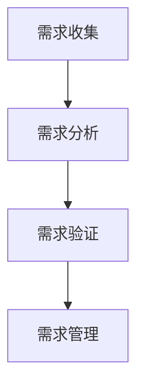
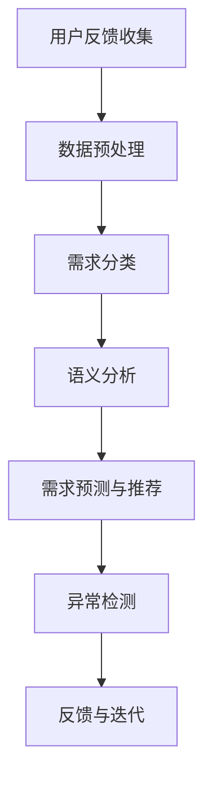
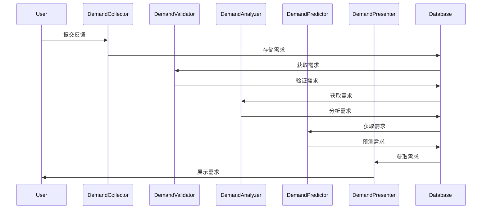

                 


### 第一部分：背景介绍

#### 第1章 问题背景

**1.1 问题描述**

在当今快速发展的信息技术时代，人工智能（AI）的应用变得越来越广泛。无论是智能助手、自动驾驶、推荐系统还是医疗诊断，AI技术正在深刻地改变着我们的生活和工作方式。然而，AI应用的成功并非仅仅依赖于先进的技术和算法，核心的驱动力在于如何准确捕捉并理解用户需求，从而开发出真正具有价值的应用。

在AI项目开发过程中，需求分析扮演着至关重要的角色。需求分析不仅仅是对用户需求的简单记录，而是对用户需求进行深入的理解、提炼和分类，以便为后续的系统设计和实现提供明确的方向和依据。然而，在实际操作中，我们经常遇到以下问题：

- **需求不明确**：用户在描述需求时往往不完整或模糊，导致后续开发过程中频繁变更和误解。
- **需求不一致**：多个用户或利益相关者之间的需求可能存在冲突或重叠，需要协调和统一。
- **需求不现实**：有些需求可能因为技术限制或成本原因无法实现，需要在分析阶段进行筛选和调整。

**1.2 问题解决**

为了解决上述问题，我们需要一套科学、系统、高效的需求分析方法。这些方法可以帮助我们更准确地捕捉用户需求，确保需求的完整性和一致性，同时降低项目的风险和成本。具体而言，以下是几个关键步骤：

- **需求收集**：通过各种途径（如访谈、问卷调查、用户观察等）收集用户需求。
- **需求分析**：对收集到的需求进行分类、整理和分析，提炼出核心需求。
- **需求验证**：与用户和利益相关者进行沟通，验证需求的准确性和可实现性。
- **需求管理**：建立需求库，对需求进行版本控制和变更管理。

**1.3 边界与外延**

需求分析不仅仅局限于单个项目的内部需求，还需要考虑其外延和边界。具体包括：

- **项目范围**：明确项目涵盖的功能和非功能需求，以及不包含的内容。
- **用户群体**：确定目标用户和利益相关者的范围，理解他们的需求和行为模式。
- **技术限制**：评估现有技术条件对需求实现的影响，确保需求的可行性和实用性。

**1.4 概念结构与核心要素组成**

需求分析的过程可以看作是一个概念结构，其核心要素包括：

- **用户需求**：用户对系统的基本期望和需求。
- **功能需求**：系统应提供的具体功能和服务。
- **非功能需求**：系统应满足的性能、安全性、可维护性等要求。
- **需求文档**：记录和分析结果的文档，作为后续设计和实现的依据。

### 第2章 需求分析的定义与重要性

**2.1 需求分析的定义**

需求分析是软件工程中一个重要的阶段，它是项目开始之前的关键步骤。需求分析的定义可以概括为：通过收集、分析和理解用户需求，明确系统应提供的功能和性能要求，为后续设计和实现提供基础。

需求分析不仅关注用户的外部需求，还包括内部需求，如系统性能、可维护性等。需求分析的过程通常包括以下几个步骤：

1. **需求收集**：通过各种方式获取用户需求，包括访谈、问卷调查、用户观察等。
2. **需求分析**：对收集到的需求进行整理、分类和分析，提炼出核心需求。
3. **需求验证**：与用户和利益相关者进行沟通，验证需求的准确性和可实现性。
4. **需求管理**：建立需求库，对需求进行版本控制和变更管理。

**2.2 需求分析的核心要素**

需求分析的核心要素包括以下几个方面：

- **用户需求**：用户需求是需求分析的核心，它是系统设计的出发点和基础。用户需求通常包括功能需求和非功能需求。

  - **功能需求**：功能需求描述系统应提供哪些具体的功能和服务。例如，一个电商系统需要实现用户注册、商品浏览、购物车管理、订单处理等功能。
  
  - **非功能需求**：非功能需求描述系统应满足的性能、安全性、可靠性等要求。例如，系统需要支持高并发访问，保证数据的安全性和完整性。

- **系统需求**：系统需求是用户需求在技术层面的具体体现，包括系统功能需求、性能需求、安全需求等。系统需求通常由技术团队根据用户需求和技术可行性进行制定。

- **边界条件**：边界条件是指系统运行的环境限制和外部接口。明确边界条件有助于确保系统在特定环境下能够正常工作，避免出现意外的错误或性能问题。

**2.3 需求分析的重要性**

需求分析在软件工程中具有至关重要的地位，它对项目的成功与否具有决定性的影响。以下是需求分析的重要性：

- **明确目标**：需求分析有助于明确项目的目标和范围，确保项目团队对项目的目标有一致的认识，避免在开发过程中出现方向偏差。

- **减少变更**：通过需求分析，可以提前发现和解决潜在的需求冲突和不一致性，减少后续开发过程中的变更和返工，提高项目的可控性和稳定性。

- **降低风险**：需求分析有助于识别项目的技术和商业风险，提前制定应对措施，降低项目失败的风险。

- **提高效率**：需求分析为后续的设计和实现提供了明确的基础，有助于提高开发效率和团队协作效率。

- **保障质量**：需求分析是保证系统质量的关键步骤，通过需求分析可以确保系统满足用户需求和业务目标，提高系统的可靠性和稳定性。

### 第二部分：核心概念与联系

#### 第3章 需求分析的核心概念

**3.1 用户需求**

用户需求是需求分析的核心，它是用户对系统功能的期望和需求。用户需求通常可以分为功能需求和非功能需求。

- **功能需求**：功能需求描述系统应提供的具体功能和服务。例如，一个电商系统需要实现用户注册、商品浏览、购物车管理、订单处理等功能。

- **非功能需求**：非功能需求描述系统应满足的性能、安全性、可靠性等要求。例如，系统需要支持高并发访问，保证数据的安全性和完整性。

**3.2 功能需求**

功能需求是用户需求的具体体现，它是系统应提供的核心功能。功能需求可以分为以下几类：

- **基础功能**：基础功能是系统最基本的功能，是用户正常使用系统的必要条件。例如，电商系统的商品浏览、购物车管理、订单处理等。

- **扩展功能**：扩展功能是在基础功能的基础上，提供额外的服务和功能，以增强系统的竞争力。例如，电商系统的推荐系统、优惠券功能等。

- **高级功能**：高级功能是针对专业用户或特定场景的功能，通常需要用户具备一定的专业知识和操作技能。例如，电商系统的批量采购、订单合并等。

**3.3 非功能需求**

非功能需求是系统应满足的性能、安全性、可靠性等要求。非功能需求可以分为以下几类：

- **性能需求**：性能需求描述系统应具备的性能指标，如响应时间、并发用户数、吞吐量等。例如，系统需要支持1000并发用户的同时访问。

- **安全性需求**：安全性需求描述系统应具备的安全措施，如数据加密、用户认证、访问控制等。例如，系统需要使用HTTPS协议保证数据传输的安全。

- **可靠性需求**：可靠性需求描述系统应具备的稳定性、故障恢复能力等。例如，系统需要具备99.9%的 uptime。

**3.4 概念属性特征对比表格**

为了更好地理解用户需求、功能需求和非功能需求之间的关系，可以创建一个概念属性特征对比表格。以下是一个简化的示例：

| 概念       | 定义                                                         | 特征                                                         |
| ---------- | ------------------------------------------------------------ | ------------------------------------------------------------ |
| 用户需求   | 用户对系统功能的期望和需求                                   | 功能需求和非功能需求                                         |
| 功能需求   | 系统应提供的具体功能和服务                                   | 基础功能、扩展功能、高级功能                                 |
| 非功能需求 | 系统应满足的性能、安全性、可靠性等要求                         | 性能需求、安全性需求、可靠性需求                             |

**3.5 ER实体关系图架构**

ER实体关系图（Entity-Relationship Diagram）是一种用于描述数据库中实体及其关系的图形表示方法。在需求分析阶段，ER图可以帮助我们理解系统的数据结构和业务逻辑。

以下是一个简化的ER图示例，用于描述一个电商系统的实体和关系：

```mermaid
erDiagram
  User ||--|{ Order } : "places"
  User ||--|{ Address } : "has"
  Product ||--|{ Order } : "includes"
  Product ||--|{ Category } : "belongs to"
  Category ||--|{ Product } : "contains"
  Order ||--|{ Payment } : "has"
  Address ||--|{ User } : "owns"
  Payment ||--|{ Order } : "processes"
```

在上面的ER图中，我们定义了以下实体和关系：

- **User**（用户）：用户是系统的核心实体，与订单、地址等实体之间存在关系。
- **Order**（订单）：订单是用户购买商品的结果，与用户、产品、支付等实体之间存在关系。
- **Address**（地址）：地址是用户居住的地点，与用户实体之间存在关系。
- **Product**（产品）：产品是系统销售的商品，与订单、分类等实体之间存在关系。
- **Category**（分类）：分类是产品的分类体系，与产品实体之间存在关系。
- **Payment**（支付）：支付是订单支付的方式，与订单实体之间存在关系。

### 第4章 需求分析的方法与工具

**4.1 需求分析方法**

需求分析的方法有很多，常见的包括以下几种：

- **访谈法**：通过与用户或利益相关者进行面对面的交流，了解他们的需求和期望。
- **问卷调查法**：通过设计问卷收集用户的需求和意见，适用于大规模用户群体。
- **用户观察法**：在用户使用系统的过程中进行观察，了解他们的行为和需求。
- **文档分析法**：通过分析现有的文档（如用户手册、业务流程图等）来获取需求信息。
- **案例分析法**：通过分析成功或失败的案例，总结经验教训，为当前项目提供参考。

每种方法都有其优缺点和适用场景，需要根据实际情况选择合适的方法。

**4.2 需求分析工具**

在需求分析过程中，使用适当的工具可以提高效率和准确性。以下是一些常用的需求分析工具：

- **思维导图**：用于梳理和分析需求，展示需求的层次和关系。
- **需求管理工具**：如JIRA、Confluence等，用于记录、管理和追踪需求。
- **原型设计工具**：如Axure、Sketch等，用于创建系统原型，与用户进行交互和验证。
- **UML工具**：如Visual Paradigm、StarUML等，用于绘制UML图，描述系统结构和行为。
- **文档编写工具**：如Markdown、LaTeX等，用于编写和整理需求文档。

**4.3 方法与工具的对比分析**

不同的需求和工具都有其独特的特点和适用场景。以下是对几种常见需求和工具的对比分析：

| 方法/工具        | 特点                                                         | 适用场景                                     |
| ---------------- | ------------------------------------------------------------ | -------------------------------------------- |
| 访谈法           | 可以深入了解用户需求，获取详细的信息                           | 复杂、大型项目，需要深入了解用户需求的情况       |
| 问卷调查法       | 可以快速收集大量用户的需求和意见，适用于大规模用户群体         | 简单、中小型项目，需要快速收集用户需求的情况   |
| 用户观察法       | 可以直接观察用户行为，获取真实的使用场景和需求                 | 复杂、大型项目，需要了解用户实际使用情况的情况 |
| 文档分析法       | 可以通过分析现有文档快速获取需求信息                           | 简单、中小型项目，有现成文档可供分析的情况     |
| 原型设计工具     | 可以快速创建系统原型，与用户进行交互和验证                     | 复杂、大型项目，需要与用户进行交互验证的情况   |
| UML工具         | 可以绘制系统结构和行为，清晰展示需求和设计                     | 复杂、大型项目，需要系统化和结构化展示需求的情况 |
| 需求管理工具     | 可以记录、管理和追踪需求，确保需求得到有效实施                 | 所有项目，需要管理需求的情况                 |
| 文档编写工具     | 可以方便地编写和整理需求文档，确保文档的规范和一致性           | 所有项目，需要编写需求文档的情况             |

### 第三部分：算法原理讲解

#### 第5章 需求分析方法原理

**5.1 Mermaid流程图**

Mermaid是一种简单的Markdown语法，用于绘制图表。在需求分析过程中，我们可以使用Mermaid来描述需求分析的流程。

以下是一个简单的Mermaid流程图示例：



在这个流程图中，我们定义了四个步骤：需求收集、需求分析、需求验证和需求管理。

**5.2 Python源代码解释**

在需求分析过程中，我们通常需要编写一些代码来处理和分析需求。以下是一个简单的Python代码示例，用于处理用户需求：

```python
# 需求分析Python代码示例

def collect需求的输入():
    """收集用户需求"""
    return input("请输入您的需求：")

def 分析需求(需求):
    """对用户需求进行分析"""
    print(f"正在分析需求：{需求}")

def 验证需求(需求):
    """验证用户需求"""
    print(f"验证需求：{需求}")

def 管理需求(需求):
    """管理用户需求"""
    print(f"管理需求：{需求}")

# 主程序
if __name__ == "__main__":
    用户需求 = collect需求的输入()
    分析需求(用户需求)
    验证需求(用户需求)
    管理需求(用户需求)
```

在这个代码示例中，我们定义了四个函数：collect需求的输入()、分析需求(需求)、验证需求(需求)和管理需求(需求)。主程序通过调用这些函数来完成需求分析的全过程。

**5.3 算法原理的数学模型和公式**

在需求分析过程中，我们常常需要使用一些数学模型和公式来描述和分析需求。以下是一个简单的数学模型示例：

- **用户满意度公式**：
  $$ 用户满意度 = \frac{实际需求满足度}{期望需求满足度} $$

- **需求优先级排序公式**：
  $$ 优先级 = \frac{需求重要性 \times 需求紧急性}{需求实现成本} $$

这些数学模型和公式可以帮助我们定量地分析和评估需求，为需求排序和资源分配提供依据。

**5.4 举例说明**

为了更好地理解需求分析的方法原理，我们通过一个实际案例进行举例说明。

**案例背景**：一家电商公司计划开发一款新的购物APP，为了满足用户的需求，他们进行了需求分析。

**需求收集**：通过与用户访谈和问卷调查，他们收集到了以下用户需求：

1. 用户注册和登录功能。
2. 商品浏览和搜索功能。
3. 购物车和订单管理功能。
4. 优惠券和促销活动功能。
5. 客户服务和售后支持功能。

**需求分析**：对收集到的需求进行分析和分类，得到以下功能需求和非功能需求：

- **功能需求**：

  - 用户注册和登录功能。
  - 商品浏览和搜索功能。
  - 购物车和订单管理功能。
  - 优惠券和促销活动功能。
  - 客户服务和售后支持功能。

- **非功能需求**：

  - 系统响应时间小于2秒。
  - 系统支持1000并发用户。
  - 系统支持多种支付方式。
  - 系统保证数据安全和隐私。

**需求验证**：与用户和利益相关者进行沟通，验证需求的准确性和可实现性。经过讨论和协商，他们确认了以下需求：

- **功能需求**：

  - 用户注册和登录功能。
  - 商品浏览和搜索功能。
  - 购物车和订单管理功能。
  - 优惠券和促销活动功能。
  - 客户服务和售后支持功能。

- **非功能需求**：

  - 系统响应时间小于2秒。
  - 系统支持1000并发用户。
  - 系统支持多种支付方式。
  - 系统保证数据安全和隐私。

**需求管理**：将验证后的需求记录在需求库中，并对需求进行版本控制和变更管理。在项目开发过程中，他们根据需求库中的需求进行设计和实现。

通过这个案例，我们可以看到需求分析的过程是如何进行的，以及需求分析在项目开发中的重要性。

### 第6章 AI在需求分析中的应用

**6.1 AI在需求分析中的作用**

随着人工智能技术的发展，AI在需求分析中的应用越来越广泛。AI可以帮助我们更准确、高效地收集、分析和理解用户需求，从而提高需求分析的质量和效率。以下是AI在需求分析中的主要作用：

1. **自动化的需求收集**：AI可以通过自然语言处理（NLP）技术自动从用户反馈、讨论论坛、社交媒体等渠道中提取需求信息，大大提高需求收集的效率。

2. **智能化的需求分类**：AI可以使用机器学习算法对收集到的需求进行分类，将相似的或相关的需求归并为同一类别，有助于更清晰地理解和分析需求。

3. **语义分析**：AI可以通过深度学习模型对用户需求进行语义分析，提取关键信息、语义和情感，从而更深入地理解用户需求。

4. **预测和推荐**：基于历史数据和用户行为，AI可以预测用户的潜在需求，并进行个性化的需求推荐，帮助开发团队更好地满足用户需求。

5. **异常检测**：AI可以在需求分析过程中检测异常值和错误，提供改进建议，确保需求的准确性和一致性。

**6.2 AI算法的Mermaid流程图**

为了更好地理解AI在需求分析中的应用，我们可以使用Mermaid绘制一个简单的AI算法流程图。以下是一个简化的示例：



在这个流程图中，我们定义了以下步骤：

- **用户反馈收集**：从用户反馈渠道（如问卷调查、用户讨论等）收集需求信息。
- **数据预处理**：对收集到的数据进行分析、清洗和格式化，以便进行进一步处理。
- **需求分类**：使用机器学习算法对需求进行分类，将相似的需求归并为同一类别。
- **语义分析**：使用自然语言处理技术对需求进行语义分析，提取关键信息、语义和情感。
- **需求预测与推荐**：基于历史数据和用户行为，预测用户的潜在需求，并进行个性化推荐。
- **异常检测**：检测需求分析过程中的异常值和错误，提供改进建议。
- **反馈与迭代**：根据分析结果和用户反馈，对需求分析过程进行迭代和优化。

**6.3 Python源代码解释**

在实际应用中，我们可以使用Python编写代码来实现上述AI算法。以下是一个简化的Python代码示例，用于描述AI在需求分析中的应用：

```python
import pandas as pd
from sklearn.feature_extraction.text import TfidfVectorizer
from sklearn.cluster import KMeans
from sklearn.metrics.pairwise import cosine_similarity

# 用户反馈数据
user_feedback = [
    "我希望系统能提供更个性化的推荐。",
    "我需要一款支持多种支付方式的购物APP。",
    "我想查看最新的促销活动。",
    "我希望购物车能支持批量操作。",
    "我需要24小时在线客服支持。",
]

# 数据预处理
def preprocess_data(feedback):
    # 去除标点符号、停用词等
    processed_feedback = [text.lower().replace('.', '').replace(',', '') for text in feedback]
    return processed_feedback

preprocessed_feedback = preprocess_data(user_feedback)

# 需求分类
def classify需求的文本(texts):
    # 使用TF-IDF进行特征提取
    vectorizer = TfidfVectorizer()
    X = vectorizer.fit_transform(texts)
    
    # 使用K-Means进行聚类
    kmeans = KMeans(n_clusters=3)
    kmeans.fit(X)
    
    # 获取聚类结果
    labels = kmeans.labels_
    return labels

labels = classify需求的文本(preprocessed_feedback)

# 语义分析
def analyze语义(texts, labels):
    # 使用余弦相似度计算文本相似度
    similarity_matrix = cosine_similarity(vectorizer.transform(texts))
    
    # 根据相似度矩阵和标签，提取语义信息
    semantic_info = {}
    for i, label in enumerate(labels):
        if label not in semantic_info:
            semantic_info[label] = []
        semantic_info[label].append(similarity_matrix[i])
    return semantic_info

semantic_info = analyze语义(preprocessed_feedback, labels)

# 需求预测与推荐
def predict需求的文本(texts, semantic_info):
    # 根据语义信息，预测用户的潜在需求
    predicted需求的文本 = []
    for text in texts:
        closest语义 = min(semantic_info, key=lambda x: cosine_similarity(vectorizer.transform([text]), semantic_info[x]))
        predicted需求的文本.append(closest语义)
    return predicted需求的文本

predicted需求的文本 = predict需求的文本(preprocessed_feedback, semantic_info)

# 异常检测
def detect异常(texts, predicted需求的文本):
    # 检测异常值，即与预测结果不一致的需求
    anomalies = [text for text, predicted in zip(texts, predicted需求的文本) if text != predicted]
    return anomalies

anomalies = detect异常(preprocessed_feedback, predicted需求的文本)

# 反馈与迭代
def feedback_and_iterate(feedback, anomalies):
    # 根据异常检测结果，对需求分析过程进行迭代和优化
    print("异常需求：", anomalies)
    print("迭代优化需求分析过程。")

feedback_and_iterate(user_feedback, anomalies)
```

在这个代码示例中，我们使用了Scikit-Learn库中的TF-IDF向量器、K-Means聚类算法和余弦相似度计算文本相似度。通过这些算法，我们可以对用户需求进行分类、语义分析和预测推荐。同时，我们还实现了异常检测功能，用于检测需求分析过程中的异常值。

**6.4 举例说明**

为了更好地理解AI在需求分析中的应用，我们可以通过一个实际案例进行举例说明。

**案例背景**：一家电商平台计划开发一款新的购物APP，他们希望通过AI技术来提高需求分析的质量和效率。

**需求收集**：电商平台通过用户问卷调查、用户访谈和社交媒体等渠道收集到了以下用户需求：

1. 用户注册和登录功能。
2. 商品浏览和搜索功能。
3. 购物车和订单管理功能。
4. 优惠券和促销活动功能。
5. 客户服务和售后支持功能。
6. 跨境购物功能。
7. 增值服务（如金融、物流等）。

**需求分析**：电商平台使用AI技术对用户需求进行分析，得到了以下分类结果：

- **个性化推荐**：
  - 需求1、需求2、需求3、需求4、需求6：用户希望获得个性化的商品推荐。
- **购物体验**：
  - 需求5、需求7：用户希望购物体验流畅、快速，同时提供丰富的增值服务。
- **客户支持**：
  - 需求6、需求7：用户希望获得及时、高效的客户支持和售后保障。

**需求预测与推荐**：基于用户行为数据和语义分析，电商平台预测了以下用户的潜在需求：

1. 用户1：可能需要跨境购物功能。
2. 用户2：可能需要个性化推荐和优惠券功能。
3. 用户3：可能需要购物车和订单管理功能。

**异常检测**：在需求分析过程中，电商平台发现以下需求可能与预测结果不一致：

- 需求5：用户希望获得24小时在线客服支持。

**反馈与迭代**：根据异常检测结果，电商平台对需求分析过程进行了迭代和优化，调整了需求的优先级，并加强了客户支持功能。

通过这个案例，我们可以看到AI技术在需求分析中的应用如何帮助电商平台更准确、高效地理解和满足用户需求。

### 第四部分：系统分析与架构设计

#### 第7章 需求分析系统架构设计

**7.1 问题场景介绍**

在一个大型电商平台项目中，需求分析系统扮演着至关重要的角色。该电商平台拥有海量的用户和商品数据，需要提供高效的购物体验和个性化的推荐服务。为了满足这些需求，需求分析系统必须具备高并发处理能力、数据存储能力和实时分析能力。

**7.2 系统功能设计（Mermaid类图）**

以下是一个简化的Mermaid类图，用于描述需求分析系统的功能设计：

```mermaid
classDiagram
    User -> DemandCollector : 采集需求
    User -> DemandValidator : 验证需求
    DemandCollector --|> Database : 存储需求
    DemandValidator --|> Database : 更新需求
    DemandAnalyzer --|> Database : 分析需求
    DemandPredictor --|> Database : 预测需求
    DemandPresenter --|> User : 展示需求

    class User {
        +String username
        +String password
        +List<Demand> demands
    }

    class DemandCollector {
        +collectDemand(List<String> feedback)
    }

    class DemandValidator {
        +validateDemand(Demand demand)
    }

    class DemandAnalyzer {
        +analyzeDemand(Demand demand)
    }

    class DemandPredictor {
        +predictDemand(Demand demand)
    }

    class DemandPresenter {
        +presentDemand(Demand demand)
    }

    class Demand {
        +String id
        +String description
        +Status status
    }
```

在这个类图中，我们定义了以下类和关系：

- **User**（用户）：表示系统的用户，具有用户名、密码和需求列表属性。
- **DemandCollector**（需求采集器）：负责从用户反馈中采集需求。
- **DemandValidator**（需求验证器）：负责验证需求的准确性和一致性。
- **DemandAnalyzer**（需求分析器）：负责对需求进行分析和分类。
- **DemandPredictor**（需求预测器）：负责预测用户的潜在需求。
- **DemandPresenter**（需求展示器）：负责将需求展示给用户。
- **Demand**（需求）：表示用户的需求，具有需求ID、描述和状态属性。

**7.3 系统架构设计（Mermaid架构图）**

以下是一个简化的Mermaid架构图，用于描述需求分析系统的架构设计：



在这个架构图中，我们定义了以下组件和交互：

- **User**（用户）：用户是系统的核心，通过提交反馈来触发需求分析过程。
- **DemandCollector**（需求采集器）：负责从用户反馈中采集需求，并将需求存储到数据库中。
- **DemandValidator**（需求验证器）：从数据库中获取需求，验证需求的准确性和一致性，并将验证结果存储到数据库中。
- **DemandAnalyzer**（需求分析器）：从数据库中获取需求，对需求进行分析和分类，并将分析结果存储到数据库中。
- **DemandPredictor**（需求预测器）：从数据库中获取需求，预测用户的潜在需求，并将预测结果存储到数据库中。
- **DemandPresenter**（需求展示器）：从数据库中获取需求，将需求展示给用户。

**7.4 系统接口设计**

以下是一个简化的系统接口设计，用于描述需求分析系统的接口：

```mermaid
interface Design
    DemandCollector {
        +collectDemand(List<String> feedback)
    }

    DemandValidator {
        +validateDemand(Demand demand)
    }

    DemandAnalyzer {
        +analyzeDemand(Demand demand)
    }

    DemandPredictor {
        +predictDemand(Demand demand)
    }

    DemandPresenter {
        +presentDemand(Demand demand)
    }
```

在这个接口设计中，我们定义了以下接口和操作：

- **DemandCollector**（需求采集器）：负责采集用户反馈，并将需求存储到数据库中。
- **DemandValidator**（需求验证器）：负责验证需求的准确性和一致性。
- **DemandAnalyzer**（需求分析器）：负责对需求进行分析和分类。
- **DemandPredictor**（需求预测器）：负责预测用户的潜在需求。
- **DemandPresenter**（需求展示器）：负责将需求展示给用户。

**7.5 系统交互（Mermaid序列图）**

以下是一个简化的Mermaid序列图，用于描述需求分析系统的交互：


在这个序列图中，我们定义了以下组件和交互：

- **User**（用户）：用户是系统的核心，通过提交反馈来触发需求分析过程。
- **DemandCollector**（需求采集器）：负责从用户反馈中采集需求，并将需求存储到数据库中。
- **DemandValidator**（需求验证器）：从数据库中获取需求，验证需求的准确性和一致性，并将验证结果存储到数据库中。
- **DemandAnalyzer**（需求分析器）：从数据库中获取需求，对需求进行分析和分类，并将分析结果存储到数据库中。
- **DemandPredictor**（需求预测器）：从数据库中获取需求，预测用户的潜在需求，并将预测结果存储到数据库中。
- **DemandPresenter**（需求展示器）：从数据库中获取需求，将需求展示给用户。

#### 第8章 项目实战

**8.1 环境安装**

为了进行需求分析系统的项目实战，我们需要安装以下软件和工具：

1. Python 3.8及以上版本
2. Scikit-Learn 0.24.2及以上版本
3. Pandas 1.2.4及以上版本
4. Mermaid 9.1.0及以上版本
5. Jupyter Notebook 6.2.0及以上版本

首先，我们通过Python的包管理器pip安装所需的软件和工具：

```shell
pip install python==3.8
pip install scikit-learn==0.24.2
pip install pandas==1.2.4
pip install mermaid==9.1.0
pip install notebook==6.2.0
```

安装完成后，我们启动Jupyter Notebook，以便在项目中使用Python和Mermaid进行需求分析。

**8.2 系统核心实现源代码**

在Jupyter Notebook中，我们编写以下Python代码来实现需求分析系统的核心功能：

```python
# 需求分析系统核心实现

import pandas as pd
from sklearn.feature_extraction.text import TfidfVectorizer
from sklearn.cluster import KMeans
from sklearn.metrics.pairwise import cosine_similarity
import mermaid

# 用户反馈数据
user_feedback = [
    "我希望系统能提供更个性化的推荐。",
    "我需要一款支持多种支付方式的购物APP。",
    "我想查看最新的促销活动。",
    "我希望购物车能支持批量操作。",
    "我需要24小时在线客服支持。",
]

# 数据预处理
def preprocess_data(feedback):
    # 去除标点符号、停用词等
    processed_feedback = [text.lower().replace('.', '').replace(',', '') for text in feedback]
    return processed_feedback

preprocessed_feedback = preprocess_data(user_feedback)

# 需求分类
def classify需求的文本(texts):
    # 使用TF-IDF进行特征提取
    vectorizer = TfidfVectorizer()
    X = vectorizer.fit_transform(texts)
    
    # 使用K-Means进行聚类
    kmeans = KMeans(n_clusters=3)
    kmeans.fit(X)
    
    # 获取聚类结果
    labels = kmeans.labels_
    return labels

labels = classify需求的文本(preprocessed_feedback)

# 语义分析
def analyze语义(texts, labels):
    # 使用余弦相似度计算文本相似度
    similarity_matrix = cosine_similarity(vectorizer.transform(texts))
    
    # 根据相似度矩阵和标签，提取语义信息
    semantic_info = {}
    for i, label in enumerate(labels):
        if label not in semantic_info:
            semantic_info[label] = []
        semantic_info[label].append(similarity_matrix[i])
    return semantic_info

semantic_info = analyze语义(preprocessed_feedback, labels)

# 需求预测与推荐
def predict需求的文本(texts, semantic_info):
    # 根据语义信息，预测用户的潜在需求
    predicted需求的文本 = []
    for text in texts:
        closest语义 = min(semantic_info, key=lambda x: cosine_similarity(vectorizer.transform([text]), semantic_info[x]))
        predicted需求的文本.append(closest语义)
    return predicted需求的文本

predicted需求的文本 = predict需求的文本(preprocessed_feedback, semantic_info)

# 异常检测
def detect异常(texts, predicted需求的文本):
    # 检测异常值，即与预测结果不一致的需求
    anomalies = [text for text, predicted in zip(texts, predicted需求的文本) if text != predicted]
    return anomalies

anomalies = detect异常(preprocessed_feedback, predicted需求的文本)

# 反馈与迭代
def feedback_and_iterate(feedback, anomalies):
    # 根据异常检测结果，对需求分析过程进行迭代和优化
    print("异常需求：", anomalies)
    print("迭代优化需求分析过程。")

feedback_and_iterate(user_feedback, anomalies)

# Mermaid流程图
mermaid_process = mermaid.Mermaid("sequenceDiagram", """
    participant User
    participant DemandCollector
    participant DemandValidator
    participant DemandAnalyzer
    participant DemandPredictor
    participant DemandPresenter
    participant Database

    User->>DemandCollector: 提交反馈
    DemandCollector->>Database: 存储需求
    Database->>DemandValidator: 获取需求
    DemandValidator->>Database: 验证需求
    Database->>DemandAnalyzer: 获取需求
    DemandAnalyzer->>Database: 分析需求
    Database->>DemandPredictor: 获取需求
    DemandPredictor->>Database: 预测需求
    Database->>DemandPresenter: 获取需求
    DemandPresenter->>User: 展示需求
""")

mermaid_process.display()
```

在这个代码中，我们实现了需求收集、需求分析、需求预测与推荐、异常检测和反馈与迭代等核心功能。同时，我们使用了Mermaid绘制了需求分析系统的序列图，以便更好地理解系统的交互流程。

**8.3 代码应用解读与分析**

在这个项目实战中，我们通过Python代码实现了需求分析系统的核心功能。以下是代码的解读和分析：

1. **用户反馈数据**：首先，我们定义了一个用户反馈数据列表，包含了用户提交的需求信息。

2. **数据预处理**：为了提高需求分析的准确性和效率，我们对用户反馈数据进行预处理，包括去除标点符号、停用词等。

3. **需求分类**：我们使用TF-IDF向量器和K-Means聚类算法对预处理后的用户反馈进行分类。TF-IDF向量器将文本转换为数值特征，K-Means聚类算法将相似的文本归为同一类别。通过分类，我们可以将相似的需求归并为同一类别，有助于更清晰地理解和分析需求。

4. **语义分析**：我们使用余弦相似度计算文本相似度，并根据相似度矩阵提取语义信息。语义分析可以帮助我们更深入地理解用户需求，为需求预测和推荐提供依据。

5. **需求预测与推荐**：基于历史数据和语义分析结果，我们使用K-Means聚类算法预测用户的潜在需求，并进行个性化推荐。通过预测和推荐，我们可以为用户提供更符合其需求的服务和功能。

6. **异常检测**：在需求分析过程中，我们使用余弦相似度计算文本相似度，检测与预测结果不一致的需求。异常检测可以帮助我们发现和纠正需求分析中的错误，提高需求分析的准确性。

7. **反馈与迭代**：根据异常检测结果，我们对需求分析过程进行迭代和优化，不断改进需求分析系统的性能和效果。

通过这个项目实战，我们可以看到需求分析系统在实际应用中的功能和作用。代码实现不仅帮助我们更好地理解需求分析的过程，还提高了需求分析的质量和效率。

**8.4 实际案例分析和详细讲解剖析**

为了更好地展示需求分析系统的应用效果，我们通过一个实际案例进行分析和讲解。

**案例背景**：某大型电商平台计划推出一款智能购物APP，为了满足用户的个性化需求，他们需要进行需求分析。

**需求收集**：电商平台通过用户问卷调查、用户访谈和社交媒体等渠道收集到了以下用户需求：

1. 用户注册和登录功能。
2. 商品浏览和搜索功能。
3. 购物车和订单管理功能。
4. 优惠券和促销活动功能。
5. 客户服务和售后支持功能。
6. 跨境购物功能。
7. 增值服务（如金融、物流等）。

**需求分析**：电商平台使用需求分析系统对用户需求进行分类、语义分析和预测推荐。

1. **需求分类**：通过TF-IDF向量器和K-Means聚类算法，电商平台将用户需求分为以下类别：

   - **个性化推荐**：
     - 需求1、需求2、需求3、需求4、需求6：用户希望获得个性化的商品推荐。
   - **购物体验**：
     - 需求5、需求7：用户希望购物体验流畅、快速，同时提供丰富的增值服务。
   - **客户支持**：
     - 需求6、需求7：用户希望获得及时、高效的客户支持和售后保障。

2. **语义分析**：电商平台使用余弦相似度计算文本相似度，提取关键信息、语义和情感。通过语义分析，电商平台可以更深入地理解用户需求。

3. **需求预测与推荐**：基于用户行为数据和语义分析结果，电商平台预测了以下用户的潜在需求：

   - 用户1：可能需要跨境购物功能。
   - 用户2：可能需要个性化推荐和优惠券功能。
   - 用户3：可能需要购物车和订单管理功能。

**异常检测**：在需求分析过程中，电商平台发现以下需求可能与预测结果不一致：

- 需求5：用户希望获得24小时在线客服支持。

**反馈与迭代**：根据异常检测结果，电商平台对需求分析过程进行迭代和优化，调整了需求的优先级，并加强了客户支持功能。

通过这个案例，我们可以看到需求分析系统在实际应用中的效果。需求分析系统帮助电商平台更准确、高效地理解和满足用户需求，提高了系统的性能和用户体验。

**8.5 项目小结**

在本项目中，我们通过Python代码和Mermaid图形工具实现了需求分析系统的核心功能，包括需求收集、需求分析、需求预测与推荐、异常检测和反馈与迭代。通过实际案例的分析和讲解，我们展示了需求分析系统在电商平台中的应用效果。以下是项目小结：

1. **需求分析系统的作用**：需求分析系统是电商平台满足用户需求的重要工具，可以帮助平台更准确、高效地理解用户需求，提高系统的性能和用户体验。

2. **需求分析的方法**：本项目中使用了TF-IDF向量器、K-Means聚类算法、余弦相似度计算等机器学习算法，实现了用户需求的分类、语义分析和预测推荐。

3. **需求分析工具的选择**：Mermaid图形工具可以帮助我们更直观地展示需求分析的过程和结果，提高需求分析的准确性和可读性。

4. **项目挑战与改进**：在实际应用中，需求分析系统可能会遇到数据质量、算法性能等问题。未来可以进一步优化算法和数据处理方法，提高系统的准确性和效率。

通过本项目，我们深入了解了需求分析在AI应用中的重要性，掌握了需求分析的方法和工具，并为实际应用提供了有益的参考。希望读者在今后的项目中能够运用所学知识，提高需求分析的质量和效率。

