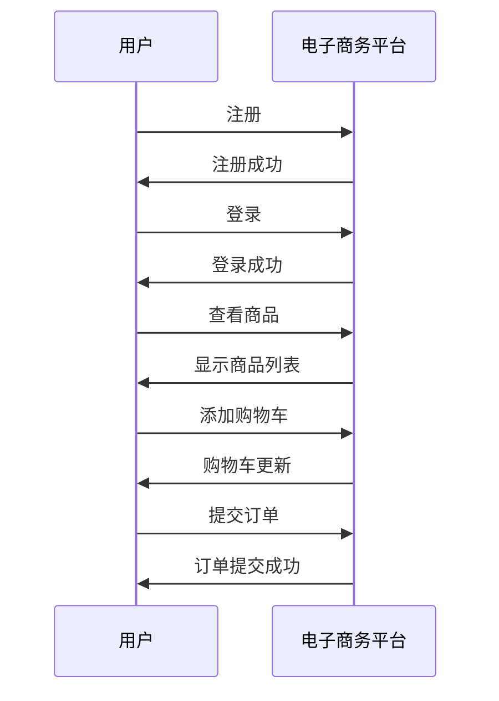

                 

## 需求分解技巧：让大型应用开发更易管理

### 关键词：需求分解、大型应用、软件开发、项目管理、架构设计

#### 摘要：
本文将深入探讨需求分解技巧，旨在为大型应用开发提供一种系统化的解决方案，以降低开发难度，提高项目管理的效率。通过详细分析需求分解的概念、方法、实际应用和挑战，本文旨在为读者提供一个全面的需求管理指南，帮助他们在复杂的项目环境中实现高效开发。

### 第一部分：背景与基础

#### 第1章：问题背景与需求分析

**1.1 问题的提出**

随着互联网和移动设备的普及，软件开发的规模和复杂性不断增加。对于大型应用项目，如何有效地管理需求成为一个严峻的挑战。传统的需求管理方法往往难以应对这种复杂性，导致项目延期、预算超支和功能缺失等问题。

**1.2 需求分析的重要性**

需求分析是软件开发过程中的关键环节。准确的需求分析有助于明确项目目标和功能范围，减少不必要的开发和修改，提高项目成功的可能性。然而，对于大型应用，需求分析面临更大的挑战，如需求的多样性、冲突性和不断变化性。

**1.3 需求分析的过程**

需求分析通常包括以下几个步骤：
1. 收集需求：通过与客户、利益相关者进行沟通，了解他们的需求和期望。
2. 分析需求：将收集到的需求进行分类、排序和优先级划分。
3. 定义需求：将分析结果转化为明确的、可量化的需求文档。
4. 验证需求：通过原型、评审和测试等方法验证需求的准确性和可行性。

#### 第2章：需求分解的基本概念

**2.1 需求分解的定义**

需求分解是将一个复杂的需求分解为多个可管理的子需求的过程。这种方法有助于降低需求的复杂性，提高需求管理的效率。

**2.2 需求分解的目标**

需求分解的目标包括：
- 简化需求管理：通过将复杂需求分解为较小的部分，使得需求更容易管理和跟踪。
- 提高沟通效率：通过明确的需求分解，促进团队之间的沟通和理解。
- 降低开发风险：通过提前识别和解决潜在的问题，降低项目风险。

**2.3 需求分解的挑战**

需求分解面临以下挑战：
- 确保分解的完整性：分解过程中需要确保所有需求都被覆盖。
- 保持分解的一致性：分解后，需求之间的关系和依赖关系需要保持一致。
- 处理变化的反馈：在项目进行过程中，需求可能会发生变化，需求分解需要灵活应对。

### 第二部分：需求分解方法

#### 第3章：基于功能的分解

**3.1 功能分解的方法**

功能分解是将需求按照功能模块进行划分的方法。这种方法有助于将复杂的系统划分为易于管理的部分。

**3.2 功能分解的步骤**

功能分解的步骤包括：
1. 确定主要功能：根据需求文档确定系统的核心功能。
2. 划分功能模块：将主要功能进一步划分为较小的功能模块。
3. 确定模块之间的关系：分析各个模块之间的依赖关系，确保功能完整性和一致性。

**3.3 功能分解的示例**

例如，一个电子商务系统可以分为以下几个功能模块：
- 用户管理：用户注册、登录、个人信息管理。
- 商品管理：商品展示、分类、库存管理。
- 订单管理：订单创建、支付、发货。
- 评价管理：商品评价、用户反馈。

#### 第4章：基于用例的分解

**4.1 用例分解的定义**

用例分解是将需求按照用户行为（用例）进行划分的方法。这种方法有助于理解用户的需求和行为。

**4.2 用例分解的步骤**

用例分解的步骤包括：
1. 收集用例：通过与用户进行沟通，收集系统的所有用户行为。
2. 分析用例：对收集到的用例进行分类、排序和优先级划分。
3. 创建用例图：使用用例图表示系统功能与用户行为之间的关系。

**4.3 用例分解的示例**

例如，一个在线教育平台可以分为以下几个用例：
- 用户注册：用户注册、登录、个人信息管理。
- 课程管理：课程创建、分类、发布。
- 学习管理：课程学习、作业提交、成绩查询。
- 评价管理：课程评价、用户反馈。

#### 第5章：基于场景的分解

**5.1 场景分解的方法**

场景分解是将需求按照特定的用户场景进行划分的方法。这种方法有助于理解用户在不同场景下的需求和行为。

**5.2 场景分解的步骤**

场景分解的步骤包括：
1. 确定场景：根据用户的需求和行为，确定系统的不同场景。
2. 分析场景：对每个场景进行分析，确定场景中的用户行为和系统功能。
3. 创建场景图：使用场景图表示系统功能与用户场景之间的关系。

**5.3 场景分解的示例**

例如，一个智能交通系统可以分为以下几个场景：
- 交通监控：监控交通流量、事故报警。
- 路段管理：交通信号控制、路段管理。
- 行人导航：行人导航、安全提示。
- 交通执法：违章拍照、处罚管理。

#### 第6章：基于数据的分解

**6.1 数据分解的方法**

数据分解是将需求按照数据实体进行划分的方法。这种方法有助于理解系统的数据结构和数据关系。

**6.2 数据分解的步骤**

数据分解的步骤包括：
1. 确定数据实体：根据需求文档确定系统的数据实体。
2. 分析数据关系：分析各个数据实体之间的关系。
3. 创建数据模型：使用数据模型表示系统的数据结构和数据关系。

**6.3 数据分解的示例**

例如，一个电商系统可以分为以下几个数据实体：
- 用户：用户信息、订单历史。
- 商品：商品信息、评价。
- 订单：订单信息、支付信息。
- 评价：评价信息、评价历史。

#### 第7章：需求分解工具与技术

**7.1 需求分解工具的选择**

在选择需求分解工具时，需要考虑以下因素：
- 功能：工具应支持各种需求分解方法，如功能分解、用例分解、场景分解等。
- 可扩展性：工具应支持自定义需求和功能。
- 用户界面：工具应具有友好的用户界面，便于使用。

**7.2 需求分解技术介绍**

常见的需求分解技术包括：
- Mermaid：用于创建流程图、序列图、类图等。
- LaTeX：用于编写数学公式和文档排版。
- Git：用于版本控制和代码管理。

**7.3 需求分解工具的实际应用**

例如，可以使用Mermaid创建一个用例分解的流程图，表示用户在电子商务平台中的行为。

### 第三部分：实际应用与案例分析

#### 第8章：大型应用需求分解实战

**8.1 项目背景介绍**

在本节中，我们将介绍一个大型电商平台的项目背景，包括项目目标、需求和团队组成。

**8.2 需求分解的实际操作**

在本节中，我们将详细讲解如何对电商平台的各功能模块进行需求分解，并展示具体的操作步骤。

**8.3 遇到的问题与解决策略**

在本节中，我们将分析在需求分解过程中遇到的问题，并提出相应的解决策略。

#### 第9章：跨领域需求分解案例

**9.1 案例一：电子商务平台**

在本节中，我们将分析一个电子商务平台的需求分解过程，展示如何在不同领域应用需求分解技巧。

**9.2 案例二：智能交通系统**

在本节中，我们将分析一个智能交通系统的需求分解过程，展示如何在不同领域应用需求分解技巧。

**9.3 案例三：医疗健康管理系统**

在本节中，我们将分析一个医疗健康管理系统

