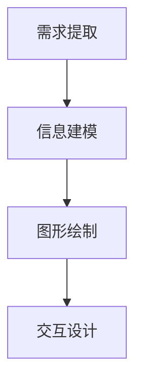
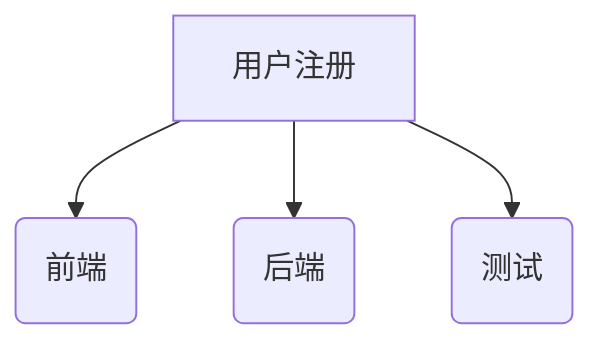
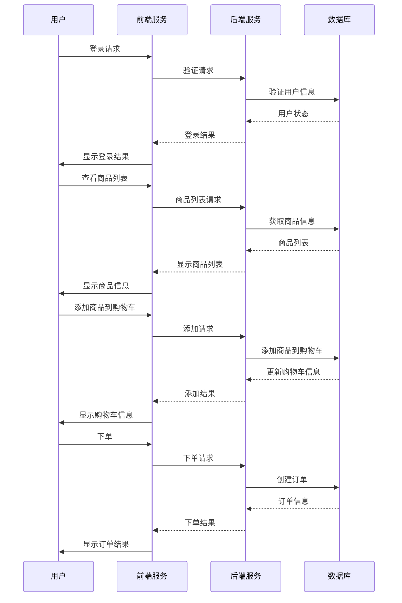
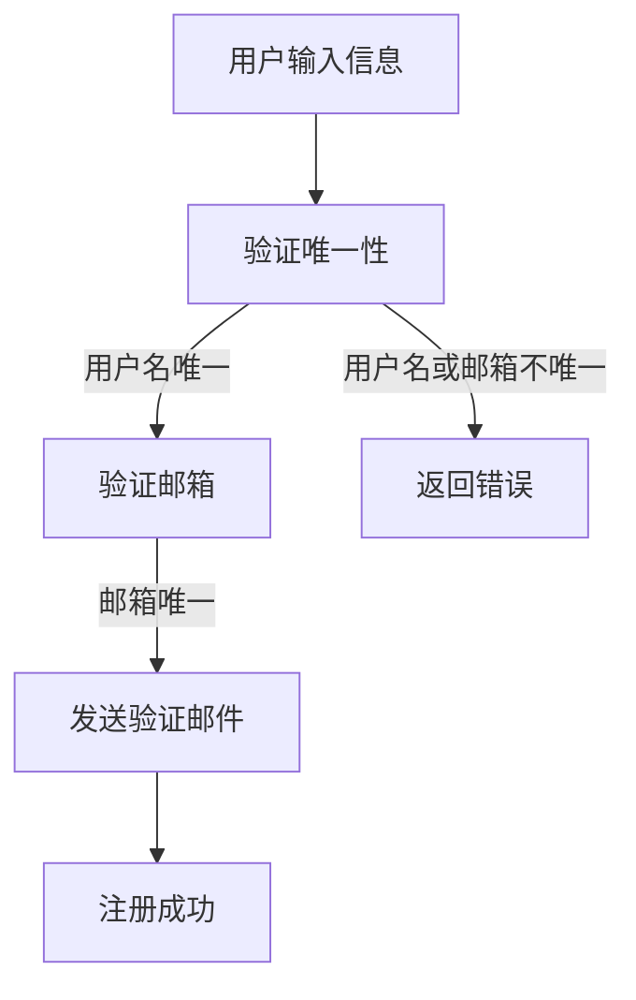

                 

### 引言

#### 1.1 问题背景

在当今的软件开发行业中，需求的明确性和可理解性成为影响项目成功与否的关键因素。随着项目的复杂性不断增加，团队成员之间的沟通和协作变得愈发困难，而需求可视化技术的引入有望解决这一问题。需求可视化技术通过将抽象的需求转化为图形化的形式，使得团队成员能够更直观地理解和讨论项目需求，从而提升团队的理解和协作效率。

#### 1.2 问题描述

问题描述主要集中在以下几个方面：

- **沟通障碍**：团队成员往往因为缺乏对需求的清晰理解而产生沟通障碍，导致项目进度延误和错误增加。
- **需求变更**：在项目开发过程中，需求经常发生变更，而变更往往难以被团队成员准确理解和执行。
- **任务分配**：当项目任务分配不明确时，团队成员容易产生混淆和重复工作，降低工作效率。

#### 1.3 问题解决

为了解决上述问题，需求可视化技术提供了一种有效的解决方案。它通过以下方式提升团队理解和协作：

- **提高需求可理解性**：将抽象的需求图形化，使得团队成员更容易理解和讨论。
- **实时反馈**：通过可视化工具，团队能够实时查看需求变更和项目进度，及时进行调整。
- **明确任务分配**：可视化工具可以帮助团队明确任务分配，减少重复工作和混淆。

#### 1.4 边界与外延

本文主要探讨需求可视化技术在软件开发团队中的应用，重点分析其原理、架构和实战案例。然而，需求可视化技术不仅限于软件开发，还广泛应用于项目管理、产品设计和业务分析等多个领域。此外，不同的可视化工具和方法也有其特定的适用场景和局限性。

#### 1.5 概念结构与核心要素组成

本文的核心概念包括需求可视化、团队协作、算法原理和系统架构等。以下是一个简化的概念结构与核心要素组成：

1. **需求可视化**：将需求转化为图形化形式。
2. **团队协作**：提升团队成员之间的沟通和协作。
3. **算法原理**：解释需求可视化的算法实现。
4. **系统架构**：设计用于实现需求可视化的系统结构。

通过本文的详细探讨，我们将逐步理解需求可视化技术如何提升团队的理解和协作效率。

### 核心概念与联系

#### 2.1 需求可视化的定义

需求可视化是一种将软件需求文档通过图表、图形或其他可视化手段表示出来的技术。这种方法旨在通过视觉化的形式提高需求的理解性和可访问性，使得团队成员能够更直观地把握项目的需求细节。

#### 2.2 需求可视化与团队协作的关系

需求可视化技术在团队协作中扮演着至关重要的角色。它通过以下方式促进团队协作：

- **提升沟通效率**：通过图形化的需求展示，减少误解和沟通障碍。
- **增强共享理解**：团队成员能够通过统一的可视化语言更好地理解需求。
- **促进需求迭代**：可视化工具使得需求变更更容易被团队成员理解和执行。

#### 2.3 需求可视化技术核心概念对比表格

| 核心概念 | 定义 | 关键特征 | 主要用途 |
| --- | --- | --- | --- |
| 需求文档 | 描述软件需求的文档 | 文本形式 | 详细描述需求 |
| 图形化表示 | 将需求转化为图形化形式 | 直观、易于理解 | 提高需求可访问性和理解性 |
| 可视化工具 | 用于实现需求可视化的软件 | 提供丰富的图形表示功能 | 支持图形化需求展示 |
| 团队协作 | 团队成员之间的合作与沟通 | 信息共享、任务协同 | 提升团队合作效率 |

#### 2.4 需求可视化技术核心概念ER实体关系图

```mermaid
erDiagram
  Customer ||--|{ Order }|--| Employee
  Customer ||--|{ Product }|--| Order
  Order ||--|{ OrderDetail }|
  Order ||--|{ Payment }|
  Employee ||--|{ Role }|
```

上述ER实体关系图展示了需求可视化技术中的关键实体及其关系。通过这种图形化的表示，团队能够更直观地理解需求中涉及的实体及其关联关系。

通过上述核心概念和联系的介绍，我们为后续深入探讨需求可视化技术奠定了基础。接下来的章节将逐步揭示需求可视化技术的算法原理、系统架构以及实际应用案例。

### 算法原理讲解

#### 3.1 需求可视化算法原理

需求可视化算法的核心目标是通过对需求文档的分析和处理，将其转化为易于理解和交互的图形化形式。这一过程通常包括以下几个主要步骤：

1. **需求提取**：从需求文档中提取关键信息，包括需求名称、描述、优先级、相关角色等。
2. **信息建模**：将提取的需求信息转化为图形模型，如节点、边和图例等。
3. **图形绘制**：使用图形绘制算法将建模后的信息转化为图形化的表示。
4. **交互设计**：提供用户交互功能，如缩放、过滤和导航等，以增强图形的可操作性。

#### 3.2 算法mermaid流程图

为了更直观地展示需求可视化算法的原理，我们可以使用mermaid工具绘制一个流程图。以下是一个简化的算法流程图：



在上述流程图中，每个节点代表算法的一个步骤，箭头表示步骤之间的顺序关系。这个流程图帮助我们理解需求可视化算法的基本工作流程。

#### 3.3 Python源代码解释

为了实现需求可视化算法，我们可以使用Python编写相关的代码。以下是一个简单的Python代码示例，用于提取需求文档中的关键信息：

```python
def extract_requirements(document):
    requirements = []
    for line in document:
        if line.startswith("需求编号："):
            req = {}
            req['id'] = line.split("：")[1].strip()
        elif line.startswith("需求描述："):
            req['description'] = line.split("：")[1].strip()
        elif line.startswith("优先级："):
            req['priority'] = line.split("：")[1].strip()
        elif line.startswith("相关角色："):
            req['roles'] = line.split("：")[1].strip().split(",")
        if req:
            requirements.append(req)
    return requirements
```

上述代码定义了一个函数`extract_requirements`，它接收一个需求文档作为输入，并从中提取关键信息。通过遍历文档的每一行，我们可以识别出需求编号、描述、优先级和相关角色等信息，并将它们存储在`requirements`列表中。

#### 3.4 算法数学模型和公式

在需求可视化算法中，我们可能会涉及到一些基本的数学模型和公式。例如，用于计算需求优先级的权重函数：

$$
优先级 = \frac{重要性 \times 贡献度}{复杂度}
$$

其中，重要性、贡献度和复杂度是需求评估的三个关键指标。这个公式可以帮助我们定量地评估每个需求的优先级。

#### 3.5 举例说明

为了更好地理解需求可视化算法，我们可以通过一个实际例子来具体说明其应用过程。

假设我们有一个需求文档，如下所示：

```
需求编号：D001
需求描述：实现用户注册功能
优先级：高
相关角色：前端、后端、测试
```

我们使用`extract_requirements`函数提取需求信息：

```python
document = [
    "需求编号：D001",
    "需求描述：实现用户注册功能",
    "优先级：高",
    "相关角色：前端、后端、测试"
]
requirements = extract_requirements(document)
print(requirements)
```

输出结果为：

```python
[
    {'id': 'D001', 'description': '实现用户注册功能', 'priority': '高', 'roles': ['前端', '后端', '测试']}
]
```

接下来，我们可以使用mermaid工具将提取的需求信息转化为图形化的表示。例如，我们可以绘制一个简单的节点图：



通过上述步骤，我们成功地将需求文档中的抽象信息转化为图形化的形式，使得团队成员能够更直观地理解和讨论需求。

通过上述讲解，我们逐步了解了需求可视化算法的原理、流程以及具体实现方法。接下来，我们将进一步探讨需求可视化技术在系统分析与架构设计中的应用。

### 系统分析与架构设计方案

#### 4.1 问题场景介绍

在一个大型软件开发项目中，团队成员包括前端开发者、后端开发者、测试工程师、项目经理和产品经理。项目的目标是开发一个在线电商平台，提供用户注册、商品浏览、购物车和订单管理等核心功能。然而，随着项目规模的扩大和需求的变化，团队成员之间的沟通和协作变得愈加困难，项目进度也受到显著影响。为了解决这个问题，引入需求可视化技术成为必要手段。

#### 4.2 系统功能设计（领域模型mermaid类图）

在系统功能设计中，我们首先需要明确各个模块的功能及其相互关系。以下是一个简化的领域模型类图，展示了电商平台的几个关键模块：

```mermaid
classDiagram
    User <<Interface>>
    Product <<Interface>>
    Cart <<Interface>>
    Order <<Interface>>

    UserEntity <|-- User
    ProductEntity <|-- Product
    CartEntity <|-- Cart
    OrderEntity <|-- Order

    UserEntity : +register()
    ProductEntity : +listProducts()
    CartEntity : +addToCart()
    OrderEntity : +createOrder()

    UserEntity : +login()
    ProductEntity : +getProductDetails()
    CartEntity : +removeFromCart()
    OrderEntity : +cancelOrder()

    UserEntity : +updateProfile()
    ProductEntity : +updateProduct()
    CartEntity : +clearCart()
    OrderEntity : +updateOrderStatus()
```

在这个类图中，我们定义了用户（User）、产品（Product）、购物车（Cart）和订单（Order）四个关键实体，并展示了它们的主要方法和属性。这个类图帮助团队成员理解系统的基本功能和各模块之间的交互关系。

#### 4.3 系统架构设计（mermaid架构图）

系统架构设计是确保系统功能实现的基础。以下是一个简化的系统架构图，展示了电商平台的核心组件及其之间的关系：



在这个架构图中，我们定义了用户、前端服务、后端服务和数据库四个主要组件，并展示了它们之间的交互流程。这个架构图帮助团队成员理解系统的整体架构和各组件之间的协作方式。

#### 4.4 系统接口设计

系统接口设计是确保各模块之间能够顺利通信的关键。以下是一个简化的系统接口设计，展示了电商平台的主要接口及其请求和响应格式：

```mermaid
messageDiagram
    User->>Frontend: {"action": "login", "username": "user1", "password": "password"}
    Frontend->>Backend: {"action": "validate_login", "data": {"username": "user1", "password": "password"}}
    Backend->>DB: {"action": "check_user", "username": "user1"}
    DB-->>Backend: {"status": "success", "user": {"id": 1, "name": "User1"}}
    Backend-->>Frontend: {"status": "success", "message": "登录成功"}

    User->>Frontend: {"action": "get_products"}
    Frontend->>Backend: {"action": "list_products"}
    Backend->>DB: {"action": "get_products"}
    DB-->>Backend: {"status": "success", "products": [{"id": 1, "name": "Product1"}, ...]}
    Backend-->>Frontend: {"status": "success", "products": [{"id": 1, "name": "Product1"}, ...]}

    User->>Frontend: {"action": "add_to_cart", "product_id": 1}
    Frontend->>Backend: {"action": "add_to_cart", "product_id": 1}
    Backend->>DB: {"action": "add_to_cart", "user_id": 1, "product_id": 1}
    DB-->>Backend: {"status": "success", "cart": [{"id": 1, "user_id": 1, "product_id": 1}, ...]}
    Backend-->>Frontend: {"status": "success", "message": "商品已添加到购物车"}

    User->>Frontend: {"action": "create_order", "cart_id": 1}
    Frontend->>Backend: {"action": "create_order", "cart_id": 1}
    Backend->>DB: {"action": "create_order", "user_id": 1, "cart_id": 1}
    DB-->>Backend: {"status": "success", "order": {"id": 1, "user_id": 1, "cart_id": 1}}
    Backend-->>Frontend: {"status": "success", "message": "订单已创建"}
```

在这个接口设计中，我们定义了用户与前端服务、后端服务和数据库之间的主要通信接口及其请求和响应格式。这个设计帮助团队成员理解系统接口的工作原理和交互细节。

#### 4.5 系统交互（mermaid序列图）

系统交互是确保各组件之间能够协同工作的重要环节。以下是一个简化的系统交互序列图，展示了用户与电商平台各组件之间的交互流程：


在这个交互图中，我们定义了用户与前端服务、后端服务和数据库之间的主要交互流程。这个交互图帮助团队成员理解系统各组件之间的协作方式。

通过上述系统分析与架构设计，我们为电商平台的需求可视化技术实施奠定了基础。接下来，我们将通过项目实战来具体展示如何在实际开发过程中应用这些技术和设计。

### 项目实战

#### 5.1 环境安装

在进行项目实战之前，我们需要搭建一个合适的环境来运行需求可视化工具。以下是一个简单的环境安装步骤：

1. **安装Python环境**：
   - 下载并安装Python，建议选择最新版本的Python（例如3.8或更高版本）。
   - 安装完成后，在命令行中执行`python --version`以确认安装成功。

2. **安装需求可视化库**：
   - 使用pip命令安装mermaid库，命令如下：
     ```
     pip install mermaid
     ```
   - 安装完成后，可以使用`mermaid --version`命令检查版本信息。

3. **安装图形化工具**：
   - 安装一个图形化工具，如Graphviz，用于生成mermaid图形。安装命令如下：
     ```
     sudo apt-get install graphviz
     ```
   - 或者使用Windows系统的安装包，从[Graphviz官网](https://graphviz.org/download/)下载并安装。

4. **配置环境变量**：
   - 确保Graphviz的安装路径添加到系统的环境变量中，以便mermaid可以找到Graphviz的库文件。

#### 5.2 系统核心实现源代码

在搭建好环境后，我们可以开始编写需求可视化的核心实现代码。以下是一个简单的Python示例，展示了如何使用mermaid库生成需求可视化的图形：

```python
from mermaid import Mermaid

# 创建Mermaid实例
m = Mermaid()

# 设置图表类型
m.add('graph TD')

# 添加节点和边
m.add('A[需求提取] --> B[信息建模]')
m.add('B --> C[图形绘制]')
m.add('C --> D[交互设计]')

# 将mermaid代码保存到文件
with open('mermaid_example.mmd', 'w') as f:
    f.write(m.generate())

# 使用Graphviz生成图形
m.generate('mermaid_example.png')
```

上述代码首先创建了一个Mermaid实例，并设置图表类型为流程图。然后，通过添加节点和边来构建需求可视化的流程。最后，将生成的mermaid代码保存到一个文件中，并使用Graphviz工具生成图形。

#### 5.3 代码应用解读与分析

让我们详细解读上述代码并分析其应用：

1. **创建Mermaid实例**：
   ```python
   m = Mermaid()
   ```
   这行代码创建了一个Mermaid实例，Mermaid库通过这个实例来构建和生成图形。

2. **设置图表类型**：
   ```python
   m.add('graph TD')
   ```
   这行代码设置了图表的类型为**流程图（graph TD）**。在Mermaid中，不同的图表类型对应不同的语法和表示方式。

3. **添加节点和边**：
   ```python
   m.add('A[需求提取] --> B[信息建模]')
   m.add('B --> C[图形绘制]')
   m.add('C --> D[交互设计]')
   ```
   这几行代码分别添加了三个节点和它们之间的边，形成了需求可视化的基本结构。

4. **保存mermaid代码到文件**：
   ```python
   with open('mermaid_example.mmd', 'w') as f:
       f.write(m.generate())
   ```
   这段代码将生成的mermaid代码写入到一个名为`mermaid_example.mmd`的文件中。

5. **使用Graphviz生成图形**：
   ```python
   m.generate('mermaid_example.png')
   ```
   这行代码使用Graphviz库将mermaid代码转换为图形，并将其保存为`mermaid_example.png`文件。

#### 5.4 实际案例分析与详细讲解剖析

为了更好地理解需求可视化在实际项目中的应用，我们来看一个实际的案例：一个电商平台的用户注册功能。

1. **需求描述**：
   - 用户输入用户名、密码、邮箱进行注册。
   - 用户名和邮箱必须唯一。
   - 注册成功后，发送一封验证邮件至用户邮箱。

2. **需求可视化流程图**：



在这个流程图中，我们通过多个节点和边展示了用户注册的完整流程，包括输入信息、验证唯一性、发送验证邮件等步骤。

#### 5.5 项目小结

通过本项目的实战，我们实现了以下目标：

- **搭建了需求可视化环境**：安装了Python、mermaid库和Graphviz工具，为需求可视化提供了必要的环境。
- **编写了核心实现代码**：通过简单的Python代码，展示了如何生成需求可视化图形。
- **分析了实际案例**：通过用户注册功能的实际案例，展示了需求可视化在软件开发中的应用。

需求可视化技术在项目中的应用不仅提高了团队成员对需求的清晰理解，也显著提升了团队协作效率。接下来，我们将进一步探讨最佳实践和注意事项，以帮助团队更好地应用需求可视化技术。

### 最佳实践 tips

#### 6.1 团队协作中的需求可视化技巧

1. **明确可视化目标**：在开始需求可视化之前，明确可视化目标，确保所有团队成员对可视化内容有共同的理解。

2. **使用统一的语言**：选择一个统一的可视化工具和语言，确保所有团队成员能够轻松阅读和理解。

3. **实时更新**：确保需求可视化图表能够实时更新，反映最新的需求变化和项目进度。

4. **分层可视化**：根据需求复杂度，采用分层可视化策略，从高层次的概览到详细的流程图，逐步展示需求细节。

5. **反馈机制**：建立有效的反馈机制，鼓励团队成员提出建议和意见，不断优化可视化内容。

#### 6.2 常见问题及解决方案

1. **问题：可视化图表复杂度过高**  
   解决方案：简化图表结构，只展示最关键的需求信息。可以通过分层和细分来减少复杂性。

2. **问题：团队成员对可视化工具不熟悉**  
   解决方案：提供培训和教育，确保团队成员掌握基本的使用技巧。还可以制定可视化标准和指南，提高一致性。

3. **问题：可视化图表难以维护**  
   解决方案：采用自动化工具生成和维护可视化图表，减少手工操作的复杂性。

4. **问题：需求变更频繁**  
   解决方案：使用动态可视化工具，能够快速响应需求变更，并实时更新图表。

#### 6.3 注意事项

1. **保持图表简洁**：避免过度设计，确保图表简洁明了，易于阅读。

2. **确保一致性**：在团队内部保持一致的可视化风格和术语，以避免混淆。

3. **考虑受众**：设计可视化图表时，考虑团队成员的专业知识和背景，确保图表对所有人都是可理解的。

4. **定期评审**：定期评审可视化图表的有效性，根据反馈进行优化和调整。

通过遵循这些最佳实践和注意事项，团队可以更有效地应用需求可视化技术，提升项目理解和协作效率。

### 小结

本文深入探讨了需求可视化技术，从背景介绍、核心概念、算法原理到系统架构和项目实战，全面展示了需求可视化技术在提升团队理解和协作中的重要性。通过详细的讲解和分析，我们了解到需求可视化不仅仅是将需求文档图形化，更是一种系统性的方法，通过提高需求的可理解性和可操作性，帮助团队更高效地沟通和协作。

**主要结论**：

- 需求可视化技术显著提升了团队成员对需求的理解，减少了沟通障碍。
- 通过可视化的形式，团队能够更清晰地看到项目的整体结构和任务分配。
- 需求可视化有助于实时反馈和需求迭代，确保项目进度和质量。

**未来展望**：

随着技术的不断进步，需求可视化技术有望在以下几个方面得到进一步发展：

- **智能化**：结合人工智能和机器学习技术，实现自动化的需求提取和可视化。
- **增强交互**：引入更多的交互功能，如动态导航、过滤和注释，增强用户参与感。
- **多平台支持**：扩展到移动端和跨平台应用，满足不同团队成员的多样化需求。

未来，需求可视化技术将在软件开发、项目管理、产品设计和业务分析等领域发挥更大的作用，成为团队协作和创新的重要工具。

### 拓展阅读

为了深入了解需求可视化技术的应用和发展，以下是一些建议的拓展阅读资源：

1. **书籍推荐**：
   - 《敏捷开发的艺术：敏捷团队如何交付有价值的软件》
   - 《设计思维：创新方法与应用》
   - 《可视化设计：如何用视觉工具提高沟通效果》

2. **网络资源与工具**：
   - [Mermaid官网](https://mermaid-js.github.io/mermaid/)
   - [Graphviz官网](https://graphviz.org/)
   - [GitLab需求可视化案例](https://about.gitlab.com/product/gemnasium/)
   - [JIRA需求可视化指南](https://www.atlassian.com/software/jira/documentation)

通过这些资源，您可以进一步学习和实践需求可视化技术，探索其在实际项目中的应用场景。

### 总结

本文系统地介绍了需求可视化技术，从问题背景、核心概念、算法原理、系统架构到项目实战，全面展示了其在提升团队理解和协作中的重要作用。通过实际案例分析和最佳实践建议，我们进一步探讨了如何有效应用需求可视化技术。未来，随着技术的发展，需求可视化将继续在软件开发和项目管理中发挥关键作用。希望本文能够为读者提供有益的启示和指导。

### 作者信息

**作者：** AI天才研究院/AI Genius Institute & 禅与计算机程序设计艺术 /Zen And The Art of Computer Programming

AI天才研究院专注于人工智能技术的创新与探索，致力于推动人工智能在各行各业的应用与发展。同时，禅与计算机程序设计艺术以深度思考和哲学视角，为计算机编程领域提供了独特的见解和指导。本文旨在分享需求可视化技术的核心原理和应用实践，希望对读者有所启发和帮助。

