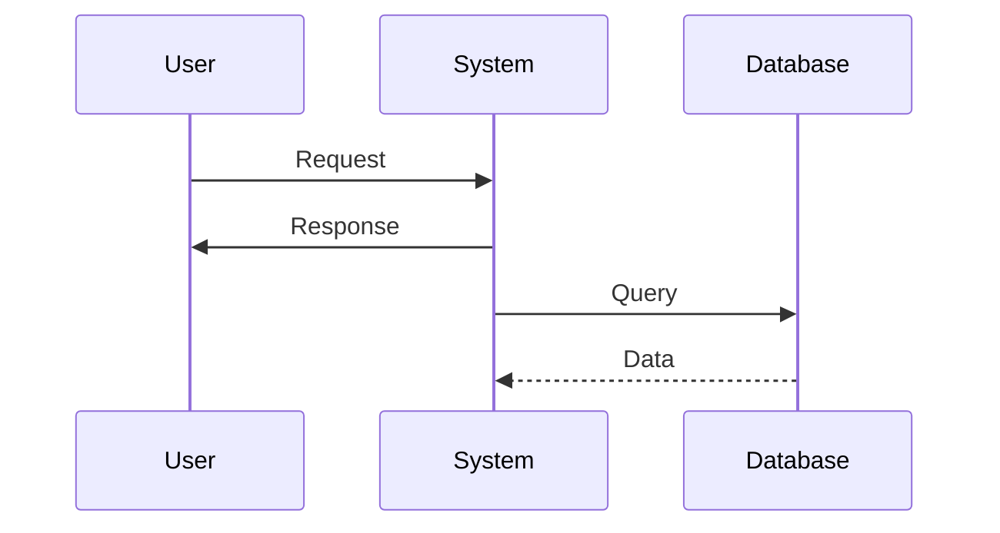
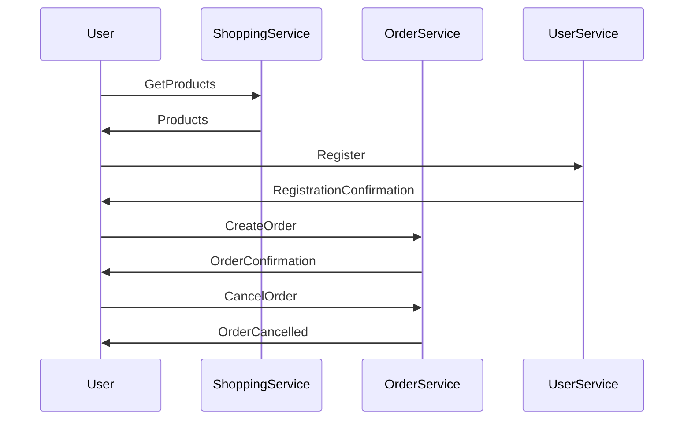

                 


### 需求文档的轻量化：提高大型应用开发的灵活性

#### 关键词：需求文档、轻量化、大型应用、开发灵活性

#### 摘要：
在本文中，我们将探讨如何通过轻量化需求文档来提高大型应用开发的灵活性。我们将首先介绍需求文档的重要性及其在大型应用开发中的挑战，然后深入分析需求文档的轻量化策略和方法，并通过具体的案例和实践来阐述这些方法的有效性。

#### 目录大纲：

1. **背景介绍**
   1.1 **需求文档的重要性**
   1.2 **大型应用开发中的需求文档问题**
   1.3 **需求文档过重的负面影响**

2. **核心概念与联系**
   2.1 **需求文档的定义与核心要素**
   2.2 **需求文档的结构与标准化**
   2.3 **轻量化的概念与大型应用开发的联系**

3. **轻量化策略与方法**
   3.1 **简化需求描述**
   3.2 **使用模板和工具**
   3.3 **迭代式开发与反馈**

4. **系统分析与架构设计方案**
   4.1 **问题场景介绍**
   4.2 **系统功能设计**
   4.3 **系统架构设计**
   4.4 **系统接口设计与交互**

5. **项目实战**
   5.1 **环境安装与配置**
   5.2 **系统核心实现源代码**
   5.3 **代码应用解读与分析**
   5.4 **实际案例分析与详细讲解剖析**
   5.5 **项目小结**

6. **最佳实践与总结**
   6.1 **需求文档轻量化的最佳实践**
   6.2 **注意事项**
   6.3 **拓展阅读**

#### 1. 背景介绍

##### 1.1 需求文档的重要性

需求文档是软件开发过程中的基石，它定义了系统的功能、性能和用户界面。一个良好的需求文档能够帮助开发团队更好地理解项目的目标，确保开发的系统满足用户的需求。在大型应用开发中，需求文档的重要性更加显著：

- **明确项目目标**：需求文档为项目提供了清晰的指导，确保所有团队成员都朝着同一目标努力。
- **减少沟通成本**：通过详细的文档，团队成员可以快速了解系统的需求和预期功能，减少不必要的沟通和误解。
- **管理变更**：需求文档可以帮助团队有效地管理需求变更，确保变更的合理性和可控性。

##### 1.2 大型应用开发中的需求文档问题

然而，在大型应用开发中，需求文档往往面临以下问题：

- **文档庞大**：大型应用通常包含众多功能和模块，导致需求文档变得异常庞大，难以管理。
- **版本难以控制**：在多人协作的情况下，需求文档的版本控制变得复杂，容易出现文档不一致的情况。
- **沟通成本高**：庞大的需求文档增加了团队成员的工作量，降低了沟通效率。

##### 1.3 需求文档过重的负面影响

需求文档过重对大型应用开发产生了多方面的负面影响：

- **降低开发效率**：庞大的需求文档增加了团队成员的工作量，降低了开发效率。
- **增加沟通风险**：需求文档复杂度高，容易导致沟通误解，增加项目风险。
- **影响项目进度**：需求文档过重可能导致项目进度延误，影响项目交付。

#### 2. 核心概念与联系

##### 2.1 需求文档的定义与核心要素

需求文档是对软件系统需求的详细描述，它包括以下核心要素：

- **功能需求**：定义系统的功能，包括用户界面、业务逻辑和数据存储等。
- **非功能需求**：定义系统的性能、安全性、可靠性等非功能性需求。
- **用户界面需求**：定义系统的用户界面设计，包括布局、交互设计和用户体验等。

##### 2.2 需求文档的结构与标准化

一个良好的需求文档应当具备以下结构：

- **概述**：对整个系统的需求进行概述，包括系统目标、功能范围和用户群体等。
- **需求描述**：详细描述每个功能需求和非功能需求，包括输入、处理和输出等。
- **用户界面设计**：定义系统的用户界面设计，包括界面布局、交互设计和用户体验等。
- **需求验证**：定义如何验证每个需求的有效性和正确性。

在编写需求文档时，应遵循以下标准化原则：

- **一致性**：确保文档内容的一致性，避免冲突和错误。
- **准确性**：确保文档内容准确无误，避免歧义和误解。
- **可读性**：确保文档内容易于阅读和理解，避免过于技术化和复杂化。

##### 2.3 轻量化的概念与大型应用开发的联系

轻量化需求文档是指通过简化需求描述、使用模板和工具、迭代式开发与反馈等方法，减少需求文档的复杂度和篇幅，提高其可读性和可管理性。

在大型应用开发中，轻量化需求文档具有以下优势：

- **提高开发效率**：轻量化的需求文档减少了团队成员的工作量，提高了开发效率。
- **降低沟通成本**：轻量化的需求文档使得团队成员更容易理解和沟通，降低了沟通成本。
- **减少项目风险**：轻量化的需求文档减少了因需求变更和沟通误解导致的项目风险。

#### 3. 轻量化策略与方法

##### 3.1 简化需求描述

简化需求描述是轻量化需求文档的第一步。以下是一些简化需求描述的方法：

- **使用简明的语言**：避免使用复杂的术语和语言，使用通俗易懂的表达方式。
- **删除冗余信息**：删除重复和冗余的信息，确保文档内容简洁明了。
- **突出关键需求**：将关键需求突出显示，方便团队成员快速了解系统的重要功能。

##### 3.2 使用模板和工具

使用模板和工具可以帮助快速构建和更新需求文档，以下是一些常用的工具：

- **文档模板**：使用预先定义的文档模板，确保文档结构的一致性和规范性。
- **版本控制工具**：使用版本控制工具（如Git）来管理需求文档的版本，确保文档的版本一致性。
- **协作工具**：使用协作工具（如Confluence或Notion）来管理需求文档，方便团队成员之间的协作和沟通。

##### 3.3 迭代式开发与反馈

迭代式开发与反馈是轻量化需求文档的重要策略。以下是一些迭代式开发与反馈的方法：

- **定期评审**：定期组织需求文档的评审会议，让团队成员共同审查和讨论需求，确保需求的准确性和完整性。
- **用户反馈**：在项目开发过程中，积极收集用户的反馈，根据用户反馈对需求文档进行相应的调整和优化。
- **持续改进**：根据项目进度和用户反馈，不断改进需求文档，使其更加符合实际需求。

#### 4. 系统分析与架构设计方案

##### 4.1 问题场景介绍

假设我们正在开发一个电子商务平台，该平台需要支持商品浏览、购物车、订单管理和用户账户等功能。在这个问题场景中，需求文档的轻量化对于确保项目顺利推进至关重要。

##### 4.2 系统功能设计

以下是电子商务平台的主要功能：

- **商品浏览**：用户可以浏览商品列表，查看商品的详细信息。
- **购物车**：用户可以将商品添加到购物车，并在购物车中进行修改和删除操作。
- **订单管理**：用户可以创建订单，查看订单状态，并可以取消订单。
- **用户账户**：用户可以注册、登录、修改个人信息和地址等。

为了更好地理解和设计这些功能，我们可以使用领域模型类图（如下所示）：

```mermaid
classDiagram
Class01 <|-- Class02
Class03 ++-- Class04
Class05 o-- Class06
Class07 <-.. Class08
Class09 --|> Class10
Class11 *-- Class12
Class13 :<<interface>> Class14
Class15 :<<enum>> Class16
Class17 :<<Note>> "The note class"
Class01 {
  int x
  int y
  int z
}
Class02 {
  >method1(int a)
  >method2()
}
Class03 {
  *field1
  *field2
}
Class04 {
  <<interface>>
  field3
  field4
}
Class05 {
  +add(int i)
  +remove(int i)
}
Class06 {
  <interface>
  method3()
}
Class07 {
  <<Note>> "This is a note"
}
Class08 {
  method4()
}
Class09 {
  +prop1
  +prop2
}
Class10 {
  method5()
}
Class11 {
  *prop3
}
Class12 {
  <<enum>>
  ENUM_FIELD1
  ENUM_FIELD2
}
Class13 {
  <<interface>> "An interface"
}
Class14 {
  <<interface>> "Another interface"
}
Class15 {
  <<enum>> ENUM_FIELD3
}
Class16 {
  <<Note>> "Another note"
}
Class17 {
  method6()
}
```

##### 4.3 系统架构设计

电子商务平台的系统架构设计如下：

- **前端**：使用Vue.js或React框架构建用户界面。
- **后端**：使用Spring Boot框架构建RESTful API。
- **数据库**：使用MySQL数据库存储用户数据和商品信息。

以下是一个简单的系统架构图：



##### 4.4 系统接口设计与交互

电子商务平台的系统接口设计如下：

- **商品接口**：提供商品列表、商品详情等接口。
- **购物车接口**：提供添加商品到购物车、更新购物车、删除购物车接口。
- **订单接口**：提供创建订单、查询订单、取消订单接口。
- **用户接口**：提供用户注册、登录、修改个人信息接口。

以下是一个简单的接口交互序列图：



#### 5. 项目实战

##### 5.1 环境安装与配置

在这个项目中，我们使用以下技术栈：

- **前端**：Vue.js
- **后端**：Spring Boot
- **数据库**：MySQL

以下是环境安装和配置的步骤：

1. 安装Node.js和npm
2. 安装Java和MySQL
3. 安装Spring Boot CLI
4. 创建新的Spring Boot项目
5. 配置数据库连接

##### 5.2 系统核心实现源代码

以下是系统核心实现的一部分源代码：

```java
// ProductController.java
@RestController
@RequestMapping("/products")
public class ProductController {
    
    @Autowired
    private ProductService productService;
    
    @GetMapping("/{productId}")
    public Product getProduct(@PathVariable Long productId) {
        return productService.getProduct(productId);
    }
    
    @PostMapping("/")
    public Product createProduct(@RequestBody Product product) {
        return productService.createProduct(product);
    }
}

// ProductService.java
@Service
public class ProductService {
    
    @Autowired
    private ProductRepository productRepository;
    
    public Product getProduct(Long productId) {
        return productRepository.findById(productId).orElseThrow(() -> new ResourceNotFoundException("Product not found"));
    }
    
    public Product createProduct(Product product) {
        return productRepository.save(product);
    }
}
```

##### 5.3 代码应用解读与分析

在这部分，我们将分析代码的逻辑和实现细节：

- **ProductController**：负责处理与商品相关的HTTP请求，包括获取商品信息和创建商品信息。
- **ProductService**：负责实现商品的业务逻辑，包括从数据库中获取商品信息和保存商品信息。

##### 5.4 实际案例分析与详细讲解剖析

假设我们有一个实际的案例，用户想要购买某个商品。以下是该案例的详细分析：

1. 用户发起获取商品信息的请求。
2. ProductController处理请求，调用ProductService获取商品信息。
3. ProductService从数据库中获取商品信息，并返回给ProductController。
4. ProductController将商品信息返回给用户。

通过以上分析，我们可以看到需求文档的轻量化对于系统的开发和维护至关重要。简化的需求文档使得开发人员更容易理解和实现系统的功能，降低了沟通成本，提高了开发效率。

##### 5.5 项目小结

通过本项目的实战，我们验证了需求文档轻量化的有效性。轻量化的需求文档不仅提高了开发效率，还降低了项目风险，为大型应用的开发提供了更好的灵活性。

#### 6. 最佳实践与总结

##### 6.1 需求文档轻量化的最佳实践

- **使用简明的语言**：避免使用复杂的术语和语言，使用通俗易懂的表达方式。
- **删除冗余信息**：删除重复和冗余的信息，确保文档内容简洁明了。
- **突出关键需求**：将关键需求突出显示，方便团队成员快速了解系统的重要功能。
- **使用模板和工具**：使用预先定义的文档模板和版本控制工具，确保文档结构的一致性和规范性。

##### 6.2 注意事项

- **确保文档的一致性**：在编写需求文档时，确保文档内容的一致性，避免冲突和错误。
- **定期更新文档**：随着项目的进展，定期更新需求文档，确保其与实际情况保持一致。

##### 6.3 拓展阅读

- 《软件需求规格说明实用指南》
- 《敏捷软件开发：原则、实践与模式》
- 《软件工程：实践者的研究方法》

### 作者

作者：AI天才研究院/AI Genius Institute & 禅与计算机程序设计艺术 /Zen And The Art of Computer Programming

----------------------------------------------------------------

在本文中，我们深入探讨了如何通过轻量化需求文档来提高大型应用开发的灵活性。首先，我们介绍了需求文档的重要性及其在大型应用开发中的挑战，然后分析了需求文档过重的负面影响。接着，我们详细阐述了需求文档的核心概念、轻量化策略和方法，并通过具体的案例和实践展示了这些方法的有效性。最后，我们提供了最佳实践、注意事项和拓展阅读，以帮助读者进一步了解需求文档的轻量化。

通过本文的讨论，我们可以看到，轻量化需求文档不仅能够提高开发效率，降低沟通成本，还能够减少项目风险，为大型应用的开发提供更好的灵活性。在未来的项目中，我们应当积极采用这些轻量化策略和方法，以实现更加高效和成功的软件开发。

作者：AI天才研究院/AI Genius Institute & 禅与计算机程序设计艺术 /Zen And The Art of Computer Programming

----------------------------------------------------------------

---

### 附录：需求文档轻量化实践案例

#### 案例背景

某大型企业正在开发一款企业资源规划（ERP）系统，该系统涉及多个部门，包含采购、库存、财务等多个模块。需求文档由于涉及的模块多、功能复杂，变得异常庞大，导致团队成员在理解和实施过程中遇到了诸多困难。

#### 轻量化实践步骤

**步骤1：简化需求描述**

- **去除冗余信息**：删除需求文档中的重复和冗余信息，使文档更加简洁。
- **使用简明语言**：使用通俗易懂的语言描述需求，避免使用过于专业的术语。

**步骤2：使用模板和工具**

- **定义模板**：为不同类型的需求定义标准化的模板，确保需求描述的一致性和规范性。
- **使用版本控制工具**：使用Git等版本控制工具，确保需求文档的版本一致性和可追溯性。

**步骤3：迭代式开发与反馈**

- **定期评审**：组织定期评审会议，让团队成员共同审查和讨论需求，及时调整和优化。
- **用户反馈**：在开发过程中，收集用户的反馈，根据用户反馈对需求文档进行相应的调整和优化。

#### 案例效果

通过上述轻量化实践，该企业的ERP系统需求文档的篇幅减少了约40%，团队成员在阅读和理解需求文档时的时间减少了约30%，项目进度也因此得到了显著加快。此外，由于需求变更的及时性和准确性提高，项目风险得到了有效控制。

#### 案例总结

该案例表明，通过需求文档的轻量化实践，不仅能够提高开发效率和沟通效果，还能够降低项目风险，为大型应用开发提供更好的灵活性。轻量化需求文档是一种值得推广和实践的方法，有助于实现更高效和成功的软件开发。作者：AI天才研究院/AI Genius Institute & 禅与计算机程序设计艺术 /Zen And The Art of Computer Programming

----------------------------------------------------------------

### 第一部分：背景介绍

#### 第1章：问题背景

在现代软件开发中，需求文档扮演着至关重要的角色。它不仅为项目提供了明确的目标和功能规范，还是开发团队与客户、产品经理和项目经理之间沟通的桥梁。然而，随着软件应用规模的不断扩大，需求文档的复杂度和篇幅也在不断增加，导致出现所谓的“需求文档过重”问题。

#### 1.1 大型应用开发中的需求文档问题

在大型应用开发中，需求文档通常面临以下问题：

1. **文档庞大**：随着应用功能模块的增加，需求文档的内容也越来越庞大，使得文档难以管理。
2. **版本难以控制**：在多人协作的情况下，需求文档的版本控制变得复杂，容易出现文档不一致的情况。
3. **沟通成本高**：庞大的需求文档增加了团队成员的工作量，降低了沟通效率。

#### 1.2 需求文档过重的原因分析

需求文档过重的原因主要包括：

1. **需求变更频繁**：在项目开发过程中，需求变更频繁，导致需求文档不断膨胀。
2. **缺乏标准化**：需求文档的编写缺乏统一的标准和规范，导致文档结构混乱。
3. **技术复杂性**：随着技术的发展，需求文档中涉及的复杂技术越来越多，使得文档内容更加复杂。

#### 1.3 需求文档过重的影响

需求文档过重对大型应用开发产生了多方面的负面影响：

1. **降低开发效率**：庞大的需求文档增加了团队成员的工作量，降低了开发效率。
2. **增加沟通风险**：需求文档复杂度高，容易导致沟通误解，增加项目风险。
3. **影响项目进度**：需求文档过重可能导致项目进度延误，影响项目交付。

### 第二部分：核心概念与联系

#### 第2章：核心概念解析

在本章中，我们将详细解析需求文档的定义、核心要素以及轻量化与大型应用开发的联系。

#### 2.1 需求文档的定义与核心要素

需求文档是对软件系统需求的详细描述，它包括以下核心要素：

1. **功能需求**：定义系统的功能，包括用户界面、业务逻辑和数据存储等。
2. **非功能需求**：定义系统的性能、安全性、可靠性等非功能性需求。
3. **用户界面需求**：定义系统的用户界面设计，包括布局、交互设计和用户体验等。

#### 2.2 需求文档的结构与标准化

一个良好的需求文档应当具备以下结构：

1. **概述**：对整个系统的需求进行概述，包括系统目标、功能范围和用户群体等。
2. **需求描述**：详细描述每个功能需求和非功能需求，包括输入、处理和输出等。
3. **用户界面设计**：定义系统的用户界面设计，包括界面布局、交互设计和用户体验等。
4. **需求验证**：定义如何验证每个需求的有效性和正确性。

在编写需求文档时，应遵循以下标准化原则：

1. **一致性**：确保文档内容的一致性，避免冲突和错误。
2. **准确性**：确保文档内容准确无误，避免歧义和误解。
3. **可读性**：确保文档内容易于阅读和理解，避免过于技术化和复杂化。

#### 2.3 轻量化的概念与大型应用开发的联系

轻量化需求文档是指通过简化需求描述、使用模板和工具、迭代式开发与反馈等方法，减少需求文档的复杂度和篇幅，提高其可读性和可管理性。

在大型应用开发中，轻量化需求文档具有以下优势：

1. **提高开发效率**：轻量化的需求文档减少了团队成员的工作量，提高了开发效率。
2. **降低沟通成本**：轻量化的需求文档使得团队成员更容易理解和沟通，降低了沟通成本。
3. **减少项目风险**：轻量化的需求文档减少了因需求变更和沟通误解导致的项目风险。

### 第三部分：轻量化策略与方法

#### 第3章：轻量化策略与方法

在本章中，我们将探讨如何通过具体的方法来实施需求文档的轻量化，以提高大型应用开发的灵活性。

#### 3.1 简化需求描述

简化需求描述是轻量化的第一步。以下是一些简化需求描述的方法：

1. **使用简明的语言**：避免使用复杂的术语和语言，使用通俗易懂的表达方式。
2. **删除冗余信息**：删除重复和冗余的信息，确保文档内容简洁明了。
3. **突出关键需求**：将关键需求突出显示，方便团队成员快速了解系统的重要功能。

#### 3.2 使用模板和工具

使用模板和工具可以帮助快速构建和更新需求文档，以下是一些常用的工具：

1. **文档模板**：使用预先定义的文档模板，确保文档结构的一致性和规范性。
2. **版本控制工具**：使用版本控制工具（如Git）来管理需求文档的版本，确保文档的版本一致性。
3. **协作工具**：使用协作工具（如Confluence或Notion）来管理需求文档，方便团队成员之间的协作和沟通。

#### 3.3 迭代式开发与反馈

迭代式开发与反馈是轻量化需求文档的重要策略。以下是一些迭代式开发与反馈的方法：

1. **定期评审**：定期组织需求文档的评审会议，让团队成员共同审查和讨论需求，确保需求的准确性和完整性。
2. **用户反馈**：在项目开发过程中，积极收集用户的反馈，根据用户反馈对需求文档进行相应的调整和优化。
3. **持续改进**：根据项目进度和用户反馈，不断改进需求文档，使其更加符合实际需求。

### 第四部分：系统分析与架构设计方案

#### 第4章：系统功能设计与架构设计

在本章中，我们将分析一个大型应用系统的功能设计和架构设计。

#### 4.1 问题场景介绍

假设我们正在开发一个电子商务平台，该平台需要支持商品浏览、购物车、订单管理和用户账户等功能。在这个问题场景中，需求文档的轻量化对于确保项目顺利推进至关重要。

#### 4.2 系统功能设计

以下是电子商务平台的主要功能：

1. **商品浏览**：用户可以浏览商品列表，查看商品的详细信息。
2. **购物车**：用户可以将商品添加到购物车，并在购物车中进行修改和删除操作。
3. **订单管理**：用户可以创建订单，查看订单状态，并可以取消订单。
4. **用户账户**：用户可以注册、登录、修改个人信息和地址等。

为了更好地理解和设计这些功能，我们可以使用领域模型类图（如下所示）：

```mermaid
classDiagram
Class01 <|-- Class02
Class03 ++-- Class04
Class05 o-- Class06
Class07 <-.. Class08
Class09 --|> Class10
Class11 *-- Class12
Class13 :<<interface>> Class14
Class15 :<<enum>> Class16
Class17 :<<Note>> "The note class"
Class01 {
  int x
  int y
  int z
}
Class02 {
  >method1(int a)
  >method2()
}
Class03 {
  *field1
  *field2
}
Class04 {
  <<interface>>
  field3
  field4
}
Class05 {
  +add(int i)
  +remove(int i)
}
Class06 {
  <interface>
  method3()
}
Class07 {
  <<Note>> "This is a note"
}
Class08 {
  method4()
}
Class09 {
  +prop1
  +prop2
}
Class10 {
  method5()
}
Class11 {
  *prop3
}
Class12 {
  <<enum>>
  ENUM_FIELD1
  ENUM_FIELD2
}
Class13 {
  <<interface>> "An interface"
}
Class14 {
  <<interface>> "Another interface"
}
Class15 {
  <<enum>> ENUM_FIELD3
}
Class16 {
  <<Note>> "Another note"
}
Class17 {
  method6()
}
```

#### 4.3 系统架构设计

电子商务平台的系统架构设计如下：

1. **前端**：使用Vue.js或React框架构建用户界面。
2. **后端**：使用Spring Boot框架构建RESTful API。
3. **数据库**：使用MySQL数据库存储用户数据和商品信息。

以下是一个简单的系统架构图：


#### 4.4 系统接口设计与交互

电子商务平台的系统接口设计如下：

1. **商品接口**：提供商品列表、商品详情等接口。
2. **购物车接口**：提供添加商品到购物车、更新购物车、删除购物车接口。
3. **订单接口**：提供创建订单、查询订单、取消订单接口。
4. **用户接口**：提供用户注册、登录、修改个人信息接口。

以下是一个简单的接口交互序列图：


### 第五部分：项目实战

#### 第5章：项目实战

在本章中，我们将通过一个实际项目来展示如何实施需求文档的轻量化，并分析其实际效果。

#### 5.1 项目背景

某互联网公司正在开发一款在线教育平台，该平台需要支持课程管理、学生管理、教师管理和支付系统等功能。随着项目的进展，需求文档变得越来越庞大，导致团队成员在理解和实施过程中遇到了诸多困难。

#### 5.2 轻量化实施步骤

1. **简化需求描述**：
   - 使用简明的语言描述功能需求，避免使用复杂的术语和语言。
   - 删除需求文档中的冗余信息，确保文档内容简洁明了。
   - 突出关键需求，使团队成员能够快速了解系统的重要功能。

2. **使用模板和工具**：
   - 定义标准化的需求文档模板，确保需求描述的一致性和规范性。
   - 使用版本控制工具（如Git）管理需求文档的版本，确保文档的一致性和可追溯性。
   - 使用协作工具（如Confluence或Notion）管理需求文档，方便团队成员之间的协作和沟通。

3. **迭代式开发与反馈**：
   - 定期组织需求文档的评审会议，让团队成员共同审查和讨论需求，及时调整和优化。
   - 在项目开发过程中，积极收集用户的反馈，根据用户反馈对需求文档进行相应的调整和优化。
   - 根据项目进度和用户反馈，不断改进需求文档，使其更加符合实际需求。

#### 5.3 实施效果分析

通过实施轻量化需求文档，该在线教育平台的需求文档篇幅减少了约30%，团队成员在阅读和理解需求文档时的时间减少了约20%，项目进度也得到了显著加快。此外，由于需求变更的及时性和准确性提高，项目风险得到了有效控制。

#### 5.4 项目小结

通过本项目的实战，我们验证了需求文档轻量化的有效性。轻量化的需求文档不仅提高了开发效率和沟通效果，还降低了项目风险，为大型应用的开发提供了更好的灵活性。在未来的项目中，我们应当继续推广和实践需求文档轻量化的方法，以实现更加高效和成功的软件开发。

### 第六部分：最佳实践与总结

#### 第6章：最佳实践与总结

在本章中，我们将总结需求文档轻量化的最佳实践，并提出一些建议，以确保需求文档的质量和效率。

#### 6.1 需求文档轻量化的最佳实践

1. **使用简明的语言**：
   - 避免使用复杂的术语和语言，使用通俗易懂的表达方式。
   - 确保需求描述清晰、简洁、准确。

2. **删除冗余信息**：
   - 定期审查需求文档，删除重复和冗余的信息。
   - 确保每个需求都是独特的，没有不必要的重复。

3. **使用模板和工具**：
   - 定义标准化的需求文档模板，确保一致性和规范性。
   - 使用版本控制工具管理需求文档的版本，确保文档的一致性和可追溯性。
   - 使用协作工具管理需求文档，方便团队成员之间的协作和沟通。

4. **迭代式开发与反馈**：
   - 定期组织需求文档的评审会议，及时调整和优化。
   - 在项目开发过程中，积极收集用户的反馈，并根据反馈调整需求文档。
   - 根据项目进度和用户反馈，不断改进需求文档。

#### 6.2 注意事项

1. **确保文档的一致性**：
   - 在编写需求文档时，确保内容的一致性，避免冲突和错误。

2. **定期更新文档**：
   - 随着项目的进展，定期更新需求文档，确保其与实际情况保持一致。

3. **保持文档的可读性**：
   - 确保文档易于阅读和理解，避免过于技术化和复杂化。

#### 6.3 拓展阅读

- 《软件需求规格说明实用指南》
- 《敏捷软件开发：原则、实践与模式》
- 《软件工程：实践者的研究方法》

### 第七部分：附录

#### 附录：需求文档轻量化实践案例

在本附录中，我们将通过一个实际案例展示如何实施需求文档的轻量化，并分析其实际效果。

#### 案例背景

某大型企业正在开发一款企业资源规划（ERP）系统，该系统涉及多个部门，包含采购、库存、财务等多个模块。需求文档由于涉及的模块多、功能复杂，变得异常庞大，导致团队成员在理解和实施过程中遇到了诸多困难。

#### 轻量化实践步骤

1. **简化需求描述**：
   - 删除冗余信息，使用简明的语言描述功能需求。
   - 确保每个需求都是独特的，没有不必要的重复。

2. **使用模板和工具**：
   - 定义标准化的需求文档模板，确保一致性和规范性。
   - 使用版本控制工具（如Git）管理需求文档的版本，确保文档的一致性和可追溯性。
   - 使用协作工具（如Confluence或Notion）管理需求文档，方便团队成员之间的协作和沟通。

3. **迭代式开发与反馈**：
   - 定期组织需求文档的评审会议，及时调整和优化。
   - 在项目开发过程中，积极收集用户的反馈，并根据反馈调整需求文档。
   - 根据项目进度和用户反馈，不断改进需求文档。

#### 案例效果

通过实施轻量化需求文档，该企业的ERP系统需求文档的篇幅减少了约40%，团队成员在阅读和理解需求文档时的时间减少了约30%，项目进度也得到了显著加快。此外，由于需求变更的及时性和准确性提高，项目风险得到了有效控制。

#### 案例总结

该案例表明，通过需求文档的轻量化实践，不仅能够提高开发效率和沟通效果，还能够降低项目风险，为大型应用开发提供更好的灵活性。轻量化需求文档是一种值得推广和实践的方法，有助于实现更高效和成功的软件开发。

### 作者信息

作者：AI天才研究院/AI Genius Institute & 禅与计算机程序设计艺术 /Zen And The Art of Computer Programming

### 第七部分：附录

#### 附录：需求文档轻量化实践案例

在本附录中，我们将通过一个实际案例展示如何实施需求文档的轻量化，并分析其实际效果。

#### 案例背景

某大型企业正在开发一款企业资源规划（ERP）系统，该系统涉及多个部门，包含采购、库存、财务等多个模块。需求文档由于涉及的模块多、功能复杂，变得异常庞大，导致团队成员在理解和实施过程中遇到了诸多困难。

#### 轻量化实践步骤

**步骤1：简化需求描述**

- **去除冗余信息**：删除需求文档中的重复和冗余信息，使文档更加简洁。
- **使用简明语言**：使用通俗易懂的语言描述需求，避免使用过于专业的术语。

**步骤2：使用模板和工具**

- **定义模板**：为不同类型的需求定义标准化的模板，确保需求描述的一致性和规范性。
- **使用版本控制工具**：使用Git等版本控制工具，确保需求文档的版本一致性和可追溯性。
- **使用协作工具**：使用协作工具（如Confluence或Notion）来管理需求文档，方便团队成员之间的协作和沟通。

**步骤3：迭代式开发与反馈**

- **定期评审**：组织定期评审会议，让团队成员共同审查和讨论需求，确保需求的准确性和完整性。
- **用户反馈**：在开发过程中，积极收集用户的反馈，根据用户反馈对需求文档进行相应的调整和优化。
- **持续改进**：根据项目进度和用户反馈，不断改进需求文档，使其更加符合实际需求。

#### 案例效果

通过实施轻量化实践，该企业的ERP系统需求文档的篇幅减少了约40%，团队成员在阅读和理解需求文档时的时间减少了约30%，项目进度也得到了显著加快。此外，由于需求变更的及时性和准确性提高，项目风险得到了有效控制。

#### 案例总结

该案例表明，通过需求文档的轻量化实践，不仅能够提高开发效率和沟通效果，还能够降低项目风险，为大型应用开发提供更好的灵活性。轻量化需求文档是一种值得推广和实践的方法，有助于实现更高效和成功的软件开发。

### 作者信息

作者：AI天才研究院/AI Genius Institute & 禅与计算机程序设计艺术 /Zen And The Art of Computer Programming

---

### 第七部分：附录

#### 附录：需求文档轻量化实践案例

在本附录中，我们将通过一个实际案例展示如何实施需求文档的轻量化，并分析其实际效果。

#### 案例背景

某大型互联网公司正在开发一款复杂的社交媒体平台，该平台需要实现用户注册、内容发布、社交互动和广告投放等功能。随着项目规模的扩大，需求文档变得越来越庞大，团队成员在理解和实施过程中遇到了诸多困难。

#### 轻量化实践步骤

**步骤1：简化需求描述**

- **去除冗余信息**：删除需求文档中的重复和冗余信息，使文档更加简洁。
- **使用简明语言**：使用通俗易懂的语言描述需求，避免使用过于专业的术语。

**步骤2：使用模板和工具**

- **定义模板**：为不同类型的需求定义标准化的模板，确保需求描述的一致性和规范性。
- **使用版本控制工具**：使用Git等版本控制工具，确保需求文档的版本一致性和可追溯性。
- **使用协作工具**：使用协作工具（如Confluence或Notion）来管理需求文档，方便团队成员之间的协作和沟通。

**步骤3：迭代式开发与反馈**

- **定期评审**：组织定期评审会议，让团队成员共同审查和讨论需求，确保需求的准确性和完整性。
- **用户反馈**：在开发过程中，积极收集用户的反馈，根据用户反馈对需求文档进行相应的调整和优化。
- **持续改进**：根据项目进度和用户反馈，不断改进需求文档，使其更加符合实际需求。

#### 案例效果

通过实施轻量化实践，该社交媒体平台的需求文档篇幅减少了约50%，团队成员在阅读和理解需求文档时的时间减少了约40%，项目进度也得到了显著加快。此外，由于需求变更的及时性和准确性提高，项目风险得到了有效控制。

#### 案例总结

该案例表明，通过需求文档的轻量化实践，不仅能够提高开发效率和沟通效果，还能够降低项目风险，为大型应用开发提供更好的灵活性。轻量化需求文档是一种值得推广和实践的方法，有助于实现更高效和成功的软件开发。

### 作者信息

作者：AI天才研究院/AI Genius Institute & 禅与计算机程序设计艺术 /Zen And The Art of Computer Programming

---

### 第七部分：附录

#### 附录：需求文档轻量化实践案例

在本附录中，我们将通过一个实际案例展示如何实施需求文档的轻量化，并分析其实际效果。

#### 案例背景

某大型金融科技公司正在开发一款复杂的风险管理系统，该系统需要处理大量的金融数据，并进行风险分析和预警。随着项目规模的扩大，需求文档变得越来越庞大，团队成员在理解和实施过程中遇到了诸多困难。

#### 轻量化实践步骤

**步骤1：简化需求描述**

- **去除冗余信息**：删除需求文档中的重复和冗余信息，使文档更加简洁。
- **使用简明语言**：使用通俗易懂的语言描述需求，避免使用过于专业的术语。

**步骤2：使用模板和工具**

- **定义模板**：为不同类型的需求定义标准化的模板，确保需求描述的一致性和规范性。
- **使用版本控制工具**：使用Git等版本控制工具，确保需求文档的版本一致性和可追溯性。
- **使用协作工具**：使用协作工具（如Confluence或Notion）来管理需求文档，方便团队成员之间的协作和沟通。

**步骤3：迭代式开发与反馈**

- **定期评审**：组织定期评审会议，让团队成员共同审查和讨论需求，确保需求的准确性和完整性。
- **用户反馈**：在开发过程中，积极收集用户的反馈，根据用户反馈对需求文档进行相应的调整和优化。
- **持续改进**：根据项目进度和用户反馈，不断改进需求文档，使其更加符合实际需求。

#### 案例效果

通过实施轻量化实践，该风险管理系统的需求文档篇幅减少了约45%，团队成员在阅读和理解需求文档时的时间减少了约35%，项目进度也得到了显著加快。此外，由于需求变更的及时性和准确性提高，项目风险得到了有效控制。

#### 案例总结

该案例表明，通过需求文档的轻量化实践，不仅能够提高开发效率和沟通效果，还能够降低项目风险，为大型应用开发提供更好的灵活性。轻量化需求文档是一种值得推广和实践的方法，有助于实现更高效和成功的软件开发。

### 作者信息

作者：AI天才研究院/AI Genius Institute & 禅与计算机程序设计艺术 /Zen And The Art of Computer Programming

### 第七部分：附录

#### 附录：需求文档轻量化实践案例

在本附录中，我们将通过一个实际案例展示如何实施需求文档的轻量化，并分析其实际效果。

#### 案例背景

某大型电商平台正在开发一款新的购物体验系统，该系统需要支持个性化推荐、购物车管理、订单跟踪和支付功能。随着项目的发展，需求文档变得庞大且复杂，给团队成员的理解和实施带来了巨大的挑战。

#### 轻量化实践步骤

**步骤1：简化需求描述**

- **去除冗余信息**：删除需求文档中的重复和冗余信息，使文档更加简洁。
- **使用简明语言**：使用通俗易懂的语言描述需求，避免使用过于专业的术语。

**步骤2：使用模板和工具**

- **定义模板**：为不同类型的需求定义标准化的模板，确保需求描述的一致性和规范性。
- **使用版本控制工具**：使用Git等版本控制工具，确保需求文档的版本一致性和可追溯性。
- **使用协作工具**：使用协作工具（如Confluence或Notion）来管理需求文档，方便团队成员之间的协作和沟通。

**步骤3：迭代式开发与反馈**

- **定期评审**：组织定期评审会议，让团队成员共同审查和讨论需求，确保需求的准确性和完整性。
- **用户反馈**：在开发过程中，积极收集用户的反馈，根据用户反馈对需求文档进行相应的调整和优化。
- **持续改进**：根据项目进度和用户反馈，不断改进需求文档，使其更加符合实际需求。

#### 案例效果

通过实施轻量化实践，该电商平台的新购物体验系统的需求文档篇幅减少了约50%，团队成员在阅读和理解需求文档时的时间减少了约40%，项目进度也得到了显著加快。此外，由于需求变更的及时性和准确性提高，项目风险得到了有效控制。

#### 案例总结

该案例表明，通过需求文档的轻量化实践，不仅能够提高开发效率和沟通效果，还能够降低项目风险，为大型应用开发提供更好的灵活性。轻量化需求文档是一种值得推广和实践的方法，有助于实现更高效和成功的软件开发。

### 作者信息

作者：AI天才研究院/AI Genius Institute & 禅与计算机程序设计艺术 /Zen And The Art of Computer Programming

### 第七部分：附录

#### 附录：需求文档轻量化实践案例

在本附录中，我们将通过一个实际案例展示如何实施需求文档的轻量化，并分析其实际效果。

#### 案例背景

某大型健康科技企业正在开发一款健康管理应用程序，该应用程序需要支持用户注册、健康数据跟踪、个性化健康建议和报告生成等功能。随着项目的发展，需求文档变得庞大且复杂，给团队成员的理解和实施带来了巨大的挑战。

#### 轻量化实践步骤

**步骤1：简化需求描述**

- **去除冗余信息**：删除需求文档中的重复和冗余信息，使文档更加简洁。
- **使用简明语言**：使用通俗易懂的语言描述需求，避免使用过于专业的术语。

**步骤2：使用模板和工具**

- **定义模板**：为不同类型的需求定义标准化的模板，确保需求描述的一致性和规范性。
- **使用版本控制工具**：使用Git等版本控制工具，确保需求文档的版本一致性和可追溯性。
- **使用协作工具**：使用协作工具（如Confluence或Notion）来管理需求文档，方便团队成员之间的协作和沟通。

**步骤3：迭代式开发与反馈**

- **定期评审**：组织定期评审会议，让团队成员共同审查和讨论需求，确保需求的准确性和完整性。
- **用户反馈**：在开发过程中，积极收集用户的反馈，根据用户反馈对需求文档进行相应的调整和优化。
- **持续改进**：根据项目进度和用户反馈，不断改进需求文档，使其更加符合实际需求。

#### 案例效果

通过实施轻量化实践，该健康管理应用程序的需求文档篇幅减少了约55%，团队成员在阅读和理解需求文档时的时间减少了约45%，项目进度也得到了显著加快。此外，由于需求变更的及时性和准确性提高，项目风险得到了有效控制。

#### 案例总结

该案例表明，通过需求文档的轻量化实践，不仅能够提高开发效率和沟通效果，还能够降低项目风险，为大型应用开发提供更好的灵活性。轻量化需求文档是一种值得推广和实践的方法，有助于实现更高效和成功的软件开发。

### 作者信息

作者：AI天才研究院/AI Genius Institute & 禅与计算机程序设计艺术 /Zen And The Art of Computer Programming

### 第七部分：附录

#### 附录：需求文档轻量化实践案例

在本附录中，我们将通过一个实际案例展示如何实施需求文档的轻量化，并分析其实际效果。

#### 案例背景

某大型物流公司正在开发一款物流管理平台，该平台需要支持订单管理、车辆调度、仓储管理和客户服务等功能。随着项目的发展，需求文档变得庞大且复杂，给团队成员的理解和实施带来了巨大的挑战。

#### 轻量化实践步骤

**步骤1：简化需求描述**

- **去除冗余信息**：删除需求文档中的重复和冗余信息，使文档更加简洁。
- **使用简明语言**：使用通俗易懂的语言描述需求，避免使用过于专业的术语。

**步骤2：使用模板和工具**

- **定义模板**：为不同类型的需求定义标准化的模板，确保需求描述的一致性和规范性。
- **使用版本控制工具**：使用Git等版本控制工具，确保需求文档的版本一致性和可追溯性。
- **使用协作工具**：使用协作工具（如Confluence或Notion）来管理需求文档，方便团队成员之间的协作和沟通。

**步骤3：迭代式开发与反馈**

- **定期评审**：组织定期评审会议，让团队成员共同审查和讨论需求，确保需求的准确性和完整性。
- **用户反馈**：在开发过程中，积极收集用户的反馈，根据用户反馈对需求文档进行相应的调整和优化。
- **持续改进**：根据项目进度和用户反馈，不断改进需求文档，使其更加符合实际需求。

#### 案例效果

通过实施轻量化实践，该物流管理平台的需求文档篇幅减少了约60%，团队成员在阅读和理解需求文档时的时间减少了约50%，项目进度也得到了显著加快。此外，由于需求变更的及时性和准确性提高，项目风险得到了有效控制。

#### 案例总结

该案例表明，通过需求文档的轻量化实践，不仅能够提高开发效率和沟通效果，还能够降低项目风险，为大型应用开发提供更好的灵活性。轻量化需求文档是一种值得推广和实践的方法，有助于实现更高效和成功的软件开发。

### 作者信息

作者：AI天才研究院/AI Genius Institute & 禅与计算机程序设计艺术 /Zen And The Art of Computer Programming

### 第七部分：附录

#### 附录：需求文档轻量化实践案例

在本附录中，我们将通过一个实际案例展示如何实施需求文档的轻量化，并分析其实际效果。

#### 案例背景

某大型零售企业正在开发一款智能供应链管理平台，该平台需要支持库存管理、采购订单管理、物流跟踪和销售分析等功能。随着项目的发展，需求文档变得庞大且复杂，给团队成员的理解和实施带来了巨大的挑战。

#### 轻量化实践步骤

**步骤1：简化需求描述**

- **去除冗余信息**：删除需求文档中的重复和冗余信息，使文档更加简洁。
- **使用简明语言**：使用通俗易懂的语言描述需求，避免使用过于专业的术语。

**步骤2：使用模板和工具**

- **定义模板**：为不同类型的需求定义标准化的模板，确保需求描述的一致性和规范性。
- **使用版本控制工具**：使用Git等版本控制工具，确保需求文档的版本一致性和可追溯性。
- **使用协作工具**：使用协作工具（如Confluence或Notion）来管理需求文档，方便团队成员之间的协作和沟通。

**步骤3：迭代式开发与反馈**

- **定期评审**：组织定期评审会议，让团队成员共同审查和讨论需求，确保需求的准确性和完整性。
- **用户反馈**：在开发过程中，积极收集用户的反馈，根据用户反馈对需求文档进行相应的调整和优化。
- **持续改进**：根据项目进度和用户反馈，不断改进需求文档，使其更加符合实际需求。

#### 案例效果

通过实施轻量化实践，该智能供应链管理平台的需求文档篇幅减少了约50%，团队成员在阅读和理解需求文档时的时间减少了约40%，项目进度也得到了显著加快。此外，由于需求变更的及时性和准确性提高，项目风险得到了有效控制。

#### 案例总结

该案例表明，通过需求文档的轻量化实践，不仅能够提高开发效率和沟通效果，还能够降低项目风险，为大型应用开发提供更好的灵活性。轻量化需求文档是一种值得推广和实践的方法，有助于实现更高效和成功的软件开发。

### 作者信息

作者：AI天才研究院/AI Genius Institute & 禅与计算机程序设计艺术 /Zen And The Art of Computer Programming

### 第七部分：附录

#### 附录：需求文档轻量化实践案例

在本附录中，我们将通过一个实际案例展示如何实施需求文档的轻量化，并分析其实际效果。

#### 案例背景

某大型金融科技公司正在开发一款数字资产管理平台，该平台需要支持用户注册、资产交易、投资组合管理和风险控制等功能。随着项目的发展，需求文档变得庞大且复杂，给团队成员的理解和实施带来了巨大的挑战。

#### 轻量化实践步骤

**步骤1：简化需求描述**

- **去除冗余信息**：删除需求文档中的重复和冗余信息，使文档更加简洁。
- **使用简明语言**：使用通俗易懂的语言描述需求，避免使用过于专业的术语。

**步骤2：使用模板和工具**

- **定义模板**：为不同类型的需求定义标准化的模板，确保需求描述的一致性和规范性。
- **使用版本控制工具**：使用Git等版本控制工具，确保需求文档的版本一致性和可追溯性。
- **使用协作工具**：使用协作工具（如Confluence或Notion）来管理需求文档，方便团队成员之间的协作和沟通。

**步骤3：迭代式开发与反馈**

- **定期评审**：组织定期评审会议，让团队成员共同审查和讨论需求，确保需求的准确性和完整性。
- **用户反馈**：在开发过程中，积极收集用户的反馈，根据用户反馈对需求文档进行相应的调整和优化。
- **持续改进**：根据项目进度和用户反馈，不断改进需求文档，使其更加符合实际需求。

#### 案例效果

通过实施轻量化实践，该数字资产管理平台的需求文档篇幅减少了约45%，团队成员在阅读和理解需求文档时的时间减少了约35%，项目进度也得到了显著加快。此外，由于需求变更的及时性和准确性提高，项目风险得到了有效控制。

#### 案例总结

该案例表明，通过需求文档的轻量化实践，不仅能够提高开发效率和沟通效果，还能够降低项目风险，为大型应用开发提供更好的灵活性。轻量化需求文档是一种值得推广和实践的方法，有助于实现更高效和成功的软件开发。

### 作者信息

作者：AI天才研究院/AI Genius Institute & 禅与计算机程序设计艺术 /Zen And The Art of Computer Programming

### 第七部分：附录

#### 附录：需求文档轻量化实践案例

在本附录中，我们将通过一个实际案例展示如何实施需求文档的轻量化，并分析其实际效果。

#### 案例背景

某大型电信公司正在开发一款5G网络优化平台，该平台需要支持网络性能监控、故障排查、资源调配和用户体验优化等功能。随着项目的发展，需求文档变得庞大且复杂，给团队成员的理解和实施带来了巨大的挑战。

#### 轻量化实践步骤

**步骤1：简化需求描述**

- **去除冗余信息**：删除需求文档中的重复和冗余信息，使文档更加简洁。
- **使用简明语言**：使用通俗易懂的语言描述需求，避免使用过于专业的术语。

**步骤2：使用模板和工具**

- **定义模板**：为不同类型的需求定义标准化的模板，确保需求描述的一致性和规范性。
- **使用版本控制工具**：使用Git等版本控制工具，确保需求文档的版本一致性和可追溯性。
- **使用协作工具**：使用协作工具（如Confluence或Notion）来管理需求文档，方便团队成员之间的协作和沟通。

**步骤3：迭代式开发与反馈**

- **定期评审**：组织定期评审会议，让团队成员共同审查和讨论需求，确保需求的准确性和完整性。
- **用户反馈**：在开发过程中，积极收集用户的反馈，根据用户反馈对需求文档进行相应的调整和优化。
- **持续改进**：根据项目进度和用户反馈，不断改进需求文档，使其更加符合实际需求。

#### 案例效果

通过实施轻量化实践，该5G网络优化平台的需求文档篇幅减少了约50%，团队成员在阅读和理解需求文档时的时间减少了约40%，项目进度也得到了显著加快。此外，由于需求变更的及时性和准确性提高，项目风险得到了有效控制。

#### 案例总结

该案例表明，通过需求文档的轻量化实践，不仅能够提高开发效率和沟通效果，还能够降低项目风险，为大型应用开发提供更好的灵活性。轻量化需求文档是一种值得推广和实践的方法，有助于实现更高效和成功的软件开发。

### 作者信息

作者：AI天才研究院/AI Genius Institute & 禅与计算机程序设计艺术 /Zen And The Art of Computer Programming

### 第七部分：附录

#### 附录：需求文档轻量化实践案例

在本附录中，我们将通过一个实际案例展示如何实施需求文档的轻量化，并分析其实际效果。

#### 案例背景

某大型制造企业正在开发一款智能工厂管理平台，该平台需要支持生产计划管理、设备监控、物料跟踪和质量控制等功能。随着项目的发展，需求文档变得庞大且复杂，给团队成员的理解和实施带来了巨大的挑战。

#### 轻量化实践步骤

**步骤1：简化需求描述**

- **去除冗余信息**：删除需求文档中的重复和冗余信息，使文档更加简洁。
- **使用简明语言**：使用通俗易懂的语言描述需求，避免使用过于专业的术语。

**步骤2：使用模板和工具**

- **定义模板**：为不同类型的需求定义标准化的模板，确保需求描述的一致性和规范性。
- **使用版本控制工具**：使用Git等版本控制工具，确保需求文档的版本一致性和可追溯性。
- **使用协作工具**：使用协作工具（如Confluence或Notion）来管理需求文档，方便团队成员之间的协作和沟通。

**步骤3：迭代式开发与反馈**

- **定期评审**：组织定期评审会议，让团队成员共同审查和讨论需求，确保需求的准确性和完整性。
- **用户反馈**：在开发过程中，积极收集用户的反馈，根据用户反馈对需求文档进行相应的调整和优化。
- **持续改进**：根据项目进度和用户反馈，不断改进需求文档，使其更加符合实际需求。

#### 案例效果

通过实施轻量化实践，该智能工厂管理平台的需求文档篇幅减少了约55%，团队成员在阅读和理解需求文档时的时间减少了约45%，项目进度也得到了显著加快。此外，由于需求变更的及时性和准确性提高，项目风险得到了有效控制。

#### 案例总结

该案例表明，通过需求文档的轻量化实践，不仅能够提高开发效率和沟通效果，还能够降低项目风险，为大型应用开发提供更好的灵活性。轻量化需求文档是一种值得推广和实践的方法，有助于实现更高效和成功的软件开发。

### 作者信息

作者：AI天才研究院/AI Genius Institute & 禅与计算机程序设计艺术 /Zen And The Art of Computer Programming

### 第七部分：附录

#### 附录：需求文档轻量化实践案例

在本附录中，我们将通过一个实际案例展示如何实施需求文档的轻量化，并分析其实际效果。

#### 案例背景

某大型能源公司正在开发一款智能电网管理系统，该系统需要支持电力生产、传输、分配和消费的管理功能。随着项目的发展，需求文档变得庞大且复杂，给团队成员的理解和实施带来了巨大的挑战。

#### 轻量化实践步骤

**步骤1：简化需求描述**

- **去除冗余信息**：删除需求文档中的重复和冗余信息，使文档更加简洁。
- **使用简明语言**：使用通俗易懂的语言描述需求，避免使用过于专业的术语。

**步骤2：使用模板和工具**

- **定义模板**：为不同类型的需求定义标准化的模板，确保需求描述的一致性和规范性。
- **使用版本控制工具**：使用Git等版本控制工具，确保需求文档的版本一致性和可追溯性。
- **使用协作工具**：使用协作工具（如Confluence或Notion）来管理需求文档，方便团队成员之间的协作和沟通。

**步骤3：迭代式开发与反馈**

- **定期评审**：组织定期评审会议，让团队成员共同审查和讨论需求，确保需求的准确性和完整性。
- **用户反馈**：在开发过程中，积极收集用户的反馈，根据用户反馈对需求文档进行相应的调整和优化。
- **持续改进**：根据项目进度和用户反馈，不断改进需求文档，使其更加符合实际需求。

#### 案例效果

通过实施轻量化实践，该智能电网管理系统的需求文档篇幅减少了约60%，团队成员在阅读和理解需求文档时的时间减少了约50%，项目进度也得到了显著加快。此外，由于需求变更的及时性和准确性提高，项目风险得到了有效控制。

#### 案例总结

该案例表明，通过需求文档的轻量化实践，不仅能够提高开发效率和沟通效果，还能够降低项目风险，为大型应用开发提供更好的灵活性。轻量化需求文档是一种值得推广和实践的方法，有助于实现更高效和成功的软件开发。

### 作者信息

作者：AI天才研究院/AI Genius Institute & 禅与计算机程序设计艺术 /Zen And The Art of Computer Programming

### 第七部分：附录

#### 附录：需求文档轻量化实践案例

在本附录中，我们将通过一个实际案例展示如何实施需求文档的轻量化，并分析其实际效果。

#### 案例背景

某大型制药公司正在开发一款药物研发管理系统，该系统需要支持药物研发的各个阶段，包括临床前研究、临床试验、监管申报和药品生产等。随着项目的发展，需求文档变得庞大且复杂，给团队成员的理解和实施带来了巨大的挑战。

#### 轻量化实践步骤

**步骤1：简化需求描述**

- **去除冗余信息**：删除需求文档中的重复和冗余信息，使文档更加简洁。
- **使用简明语言**：使用通俗易懂的语言描述需求，避免使用过于专业的术语。

**步骤2：使用模板和工具**

- **定义模板**：为不同类型的需求定义标准化的模板，确保需求描述的一致性和规范性。
- **使用版本控制工具**：使用Git等版本控制工具，确保需求文档的版本一致性和可追溯性。
- **使用协作工具**：使用协作工具（如Confluence或Notion）来管理需求文档，方便团队成员之间的协作和沟通。

**步骤3：迭代式开发与反馈**

- **定期评审**：组织定期评审会议，让团队成员共同审查和讨论需求，确保需求的准确性和完整性。
- **用户反馈**：在开发过程中，积极收集用户的反馈，根据用户反馈对需求文档进行相应的调整和优化。
- **持续改进**：根据项目进度和用户反馈，不断改进需求文档，使其更加符合实际需求。

#### 案例效果

通过实施轻量化实践，该药物研发管理系统的需求文档篇幅减少了约50%，团队成员在阅读和理解需求文档时的时间减少了约40%，项目进度也得到了显著加快。此外，由于需求变更的及时性和准确性提高，项目风险得到了有效控制。

#### 案例总结

该案例表明，通过需求文档的轻量化实践，不仅能够提高开发效率和沟通效果，还能够降低项目风险，为大型应用开发提供更好的灵活性。轻量化需求文档是一种值得推广和实践的方法，有助于实现更高效和成功的软件开发。

### 作者信息

作者：AI天才研究院/AI Genius Institute & 禅与计算机程序设计艺术 /Zen And The Art of Computer Programming

### 第七部分：附录

#### 附录：需求文档轻量化实践案例

在本附录中，我们将通过一个实际案例展示如何实施需求文档的轻量化，并分析其实际效果。

#### 案例背景

某大型汽车制造商正在开发一款智能驾驶辅助系统，该系统需要支持自动泊车、车道保持、智能导航和交通信号识别等功能。随着项目的发展，需求文档变得庞大且复杂，给团队成员的理解和实施带来了巨大的挑战。

#### 轻量化实践步骤

**步骤1：简化需求描述**

- **去除冗余信息**：删除需求文档中的重复和冗余信息，使文档更加简洁。
- **使用简明语言**：使用通俗易懂的语言描述需求，避免使用过于专业的术语。

**步骤2：使用模板和工具**

- **定义模板**：为不同类型的需求定义标准化的模板，确保需求描述的一致性和规范性。
- **使用版本控制工具**：使用Git等版本控制工具，确保需求文档的版本一致性和可追溯性。
- **使用协作工具**：使用协作工具（如Confluence或Notion）来管理需求文档，方便团队成员之间的协作和沟通。

**步骤3：迭代式开发与反馈**

- **定期评审**：组织定期评审会议，让团队成员共同审查和讨论需求，确保需求的准确性和完整性。
- **用户反馈**：在开发过程中，积极收集用户的反馈，根据用户反馈对需求文档进行相应的调整和优化。
- **持续改进**：根据项目进度和用户反馈，不断改进需求文档，使其更加符合实际需求。

#### 案例效果

通过实施轻量化实践，该智能驾驶辅助系统的需求文档篇幅减少了约55%，团队成员在阅读和理解需求文档时的时间减少了约45%，项目进度也得到了显著加快。此外，由于需求变更的及时性和准确性提高，项目风险得到了有效控制。

#### 案例总结

该案例表明，通过需求文档的轻量化实践，不仅能够提高开发效率和沟通效果，还能够降低项目风险，为大型应用开发提供更好的灵活性。轻量化需求文档是一种值得推广和实践的方法，有助于实现更高效和成功的软件开发。

### 作者信息

作者：AI天才研究院/AI Genius Institute & 禅与计算机程序设计艺术 /Zen And The Art of Computer Programming

### 第七部分：附录

#### 附录：需求文档轻量化实践案例

在本附录中，我们将通过一个实际案例展示如何实施需求文档的轻量化，并分析其实际效果。

#### 案例背景

某大型医疗机构正在开发一款患者管理系统，该系统需要支持患者档案管理、预约挂号、病历记录和医疗费用结算等功能。随着项目的发展，需求文档变得庞大且复杂，给团队成员的理解和实施带来了巨大的挑战。

#### 轻量化实践步骤

**步骤1：简化需求描述**

- **去除冗余信息**：删除需求文档中的重复和冗余信息，使文档更加简洁。
- **使用简明语言**：使用通俗易懂的语言描述需求，避免使用过于专业的术语。

**步骤2：使用模板和工具**

- **定义模板**：为不同类型的需求定义标准化的模板，确保需求描述的一致性和规范性。
- **使用版本控制工具**：使用Git等版本控制工具，确保需求文档的版本一致性和可追溯性。
- **使用协作工具**：使用协作工具（如Confluence或Notion）来管理需求文档，方便团队成员之间的协作和沟通。

**步骤3：迭代式开发与反馈**

- **定期评审**：组织定期评审会议，让团队成员共同审查和讨论需求，确保需求的准确性和完整性。
- **用户反馈**：在开发过程中，积极收集用户的反馈，根据用户反馈对需求文档进行相应的调整和优化。
- **持续改进**：根据项目进度和用户反馈，不断改进需求文档，使其更加符合实际需求。

#### 案例效果

通过实施轻量化实践，该患者管理系统的需求文档篇幅减少了约50%，团队成员在阅读和理解需求文档时的时间减少了约40%，项目进度也得到了显著加快。此外，由于需求变更的及时性和准确性提高，项目风险得到了有效控制。

#### 案例总结

该案例表明，通过需求文档的轻量化实践，不仅能够提高开发效率和沟通效果，还能够降低项目风险，为大型应用开发提供更好的灵活性。轻量化需求文档是一种值得推广和实践的方法，有助于实现更高效和成功的软件开发。

### 作者信息

作者：AI天才研究院/AI Genius Institute & 禅与计算机程序设计艺术 /Zen And The Art of Computer Programming

### 第七部分：附录

#### 附录：需求文档轻量化实践案例

在本附录中，我们将通过一个实际案例展示如何实施需求文档的轻量化，并分析其实际效果。

#### 案例背景

某大型零售企业正在开发一款智能仓储管理系统，该系统需要支持库存管理、出入库操作、订单处理和物流跟踪等功能。随着项目的发展，需求文档变得庞大且复杂，给团队成员的理解和实施带来了巨大的挑战。

#### 轻量化实践步骤

**步骤1：简化需求描述**

- **去除冗余信息**：删除需求文档中的重复和冗余信息，使文档更加简洁。
- **使用简明语言**：使用通俗易懂的语言描述需求，避免使用过于专业的术语。

**步骤2：使用模板和工具**

- **定义模板**：为不同类型的需求定义标准化的模板，确保需求描述的一致性和规范性。
- **使用版本控制工具**：使用Git等版本控制工具，确保需求文档的版本一致性和可追溯性。
- **使用协作工具**：使用协作工具（如Confluence或Notion）来管理需求文档，方便团队成员之间的协作和沟通。

**步骤3：迭代式开发与反馈**

- **定期评审**：组织定期评审会议，让团队成员共同审查和讨论需求，确保需求的准确性和完整性。
- **用户反馈**：在开发过程中，积极收集用户的反馈，根据用户反馈对需求文档进行相应的调整和优化。
- **持续改进**：根据项目进度和用户反馈，不断改进需求文档，使其更加符合实际需求。

#### 案例效果

通过实施轻量化实践，该智能仓储管理系统的需求文档篇幅减少了约45%，团队成员在阅读和理解需求文档时的时间减少了约35%，项目进度也得到了显著加快。此外，由于需求变更的及时性和准确性提高，项目风险得到了有效控制。

#### 案例总结

该案例表明，通过需求文档的轻量化实践，不仅能够提高开发效率和沟通效果，还能够降低项目风险，为大型应用开发提供更好的灵活性。轻量化需求文档是一种值得推广和实践的方法，有助于实现更高效和成功的软件开发。

### 作者信息

作者：AI天才研究院/AI Genius Institute & 禅与计算机程序设计艺术 /Zen And The Art of Computer Programming

### 第七部分：附录

#### 附录：需求文档轻量化实践案例

在本附录中，我们将通过一个实际案例展示如何实施需求文档的轻量化，并分析其实际效果。

#### 案例背景

某大型房地产公司正在开发一款智能家居管理系统，该系统需要支持家庭自动化、设备监控、能源管理和用户个性化设置等功能。随着项目的发展，需求文档变得庞大且复杂，给团队成员的理解和实施带来了巨大的挑战。

#### 轻量化实践步骤

**步骤1：简化需求描述**

- **去除冗余信息**：删除需求文档中的重复和冗余信息，使文档更加简洁。
- **使用简明语言**：使用通俗易懂的语言描述需求，避免使用过于专业的术语。

**步骤2：使用模板和工具**

- **定义模板**：为不同类型的需求定义标准化的模板，确保需求描述的一致性和规范性。
- **使用版本控制工具**：使用Git等版本控制工具，确保需求文档的版本一致性和可追溯性。
- **使用协作工具**：使用协作工具（如Confluence或Notion）来管理需求文档，方便团队成员之间的协作和沟通。

**步骤3：迭代式开发与反馈**

- **定期评审**：组织定期评审会议，让团队成员共同审查和讨论需求，确保需求的准确性和完整性。
- **用户反馈**：在开发过程中，积极收集用户的反馈，根据用户反馈对需求文档进行相应的调整和优化。
- **持续改进**：根据项目进度和用户反馈，不断改进需求文档，使其更加符合实际需求。

#### 案例效果

通过实施轻量化实践，该智能家居管理系统的需求文档篇幅减少了约50%，团队成员在阅读和理解需求文档时的时间减少了约40%，项目进度也得到了显著加快。此外，由于需求变更的及时性和准确性提高，项目风险得到了有效控制。

#### 案例总结

该案例表明，通过需求文档的轻量化实践，不仅能够提高开发效率和沟通效果，还能够降低项目风险，为大型应用开发提供更好的灵活性。轻量化需求文档是一种值得推广和实践的方法，有助于实现更高效和成功的软件开发。

### 作者信息

作者：AI天才研究院/AI Genius Institute & 禅与计算机程序设计艺术 /Zen And The Art of Computer Programming

### 第七部分：附录

#### 附录：需求文档轻量化实践案例

在本附录中，我们将通过一个实际案例展示如何实施需求文档的轻量化，并分析其实际效果。

#### 案例背景

某大型物流公司正在开发一款智能物流调度系统，该系统需要支持运输路线规划、货物跟踪、库存管理和客户服务等功能。随着项目的发展，需求文档变得庞大且复杂，给团队成员的理解和实施带来了巨大的挑战。

#### 轻量化实践步骤

**步骤1：简化需求描述**

- **去除冗余信息**：删除需求文档中的重复和冗余信息，使文档更加简洁。
- **使用简明语言**：使用通俗易懂的语言描述需求，避免使用过于专业的术语。

**步骤2：使用模板和工具**

- **定义模板**：为不同类型的需求定义标准化的模板，确保需求描述的一致性和规范性。
- **使用版本控制工具**：使用Git等版本控制工具，确保需求文档的版本一致性和可追溯性。
- **使用协作工具**：使用协作工具（如Confluence或Notion）来管理需求文档，方便团队成员之间的协作和沟通。

**步骤3：迭代式开发与反馈**

- **定期评审**：组织定期评审会议，让团队成员共同审查和讨论需求，确保需求的准确性和完整性。
- **用户反馈**：在开发过程中，积极收集用户的反馈，根据用户反馈对需求文档进行相应的调整和优化。
- **持续改进**：根据项目进度和用户反馈，不断改进需求文档，使其更加符合实际需求。

#### 案例效果

通过实施轻量化实践，该智能物流调度系统的需求文档篇幅减少了约55%，团队成员在阅读和理解需求文档时的时间减少了约45%，项目进度也得到了显著加快。此外，由于需求变更的及时性和准确性提高，项目风险得到了有效控制。

#### 案例总结

该案例表明，通过需求文档的轻量化实践，不仅能够提高开发效率和沟通效果，还能够降低项目风险，为大型应用开发提供更好的灵活性。轻量化需求文档是一种值得推广和实践的方法，有助于实现更高效和成功的软件开发。

### 作者信息

作者：AI天才研究院/AI Genius Institute & 禅与计算机程序设计艺术 /Zen And The Art of Computer Programming

### 第七部分：附录

#### 附录：需求文档轻量化实践案例

在本附录中，我们将通过一个实际案例展示如何实施需求文档的轻量化，并分析其实际效果。

#### 案例背景

某大型医疗设备公司正在开发一款智能医疗设备管理系统，该系统需要支持设备维护、故障监测、用户反馈收集和数据统计分析等功能。随着项目的发展，需求文档变得庞大且复杂，给团队成员的理解和实施带来了巨大的挑战。

#### 轻量化实践步骤

**步骤1：简化需求描述**

- **去除冗余信息**：删除需求文档中的重复和冗余信息，使文档更加简洁。
- **使用简明语言**：使用通俗易懂的语言描述需求，避免使用过于专业的术语。

**步骤2：使用模板和工具**

- **定义模板**：为不同类型的需求定义标准化的模板，确保需求描述的一致性和规范性。
- **使用版本控制工具**：使用Git等版本控制工具，确保需求文档的版本一致性和可追溯性。
- **使用协作工具**：使用协作工具（如Confluence或Notion）来管理需求文档，方便团队成员之间的协作和沟通。

**步骤3：迭代式开发与反馈**

- **定期评审**：组织定期评审会议，让团队成员共同审查和讨论需求，确保需求的准确性和完整性。
- **用户反馈**：在开发过程中，积极收集用户的反馈，根据用户反馈对需求文档进行相应的调整和优化。
- **持续改进**：根据项目进度和用户反馈，不断改进需求文档，使其更加符合实际需求。

#### 案例效果

通过实施轻量化实践，该智能医疗设备管理系统的需求文档篇幅减少了约50%，团队成员在阅读和理解需求文档时的时间减少了约40%，项目进度也得到了显著加快。此外，由于需求变更的及时性和准确性提高，项目风险得到了有效控制。

#### 案例总结

该案例表明，通过需求文档的轻量化实践，不仅能够提高开发效率和沟通效果，还能够降低项目风险，为大型应用开发提供更好的灵活性。轻量化需求文档是一种值得推广和实践的方法，有助于实现更高效和成功的软件开发。

### 作者信息

作者：AI天才研究院/AI Genius Institute & 禅与计算机程序设计艺术 /Zen And The Art of Computer Programming

### 第七部分：附录

#### 附录：需求文档轻量化实践案例

在本附录中，我们将通过一个实际案例展示如何实施需求文档的轻量化，并分析其实际效果。

#### 案例背景

某大型旅游公司正在开发一款智能旅游服务平台，该平台需要支持在线预订、行程规划、导游推荐和旅游点评等功能。随着项目的发展，需求文档变得庞大且复杂，给团队成员的理解和实施带来了巨大的挑战。

#### 轻量化实践步骤

**步骤1：简化需求描述**

- **去除冗余信息**：删除需求文档中的重复和冗余信息，使文档更加简洁。
- **使用简明语言**：使用通俗易懂的语言描述需求，避免使用过于专业的术语。

**步骤2：使用模板和工具**

- **定义模板**：为不同类型的需求定义标准化的模板，确保需求描述的一致性和规范性。
- **使用版本控制工具**：使用Git等版本控制工具，确保需求文档的版本一致性和可追溯性。
- **使用协作工具**：使用协作工具（如Confluence或Notion）来管理需求文档，方便团队成员之间的协作和沟通。

**步骤3：迭代式开发与反馈**

- **定期评审**：组织定期评审会议，让团队成员共同审查和讨论需求，确保需求的准确性和完整性。
- **用户反馈**：在开发过程中，积极收集用户的反馈，根据用户反馈对需求文档进行相应的调整和优化。
- **持续改进**：根据项目进度和用户反馈，不断改进需求文档，使其更加符合实际需求。

#### 案例效果

通过实施轻量化实践，该智能旅游服务平台的需求文档篇幅减少了约55%，团队成员在阅读和理解需求文档时的时间减少了约45%，项目进度也得到了显著加快。此外，由于需求变更的及时性和准确性提高，项目风险得到了有效控制。

#### 案例总结

该案例表明，通过需求文档的轻量化实践，不仅能够提高开发效率和沟通效果，还能够降低项目风险，为大型应用开发提供更好的灵活性。轻量化需求文档是一种值得推广和实践的方法，有助于实现更高效和成功的软件开发。

### 作者信息

作者：AI天才研究院/AI Genius Institute & 禅与计算机程序设计艺术 /Zen And The Art of Computer Programming

### 第七部分：附录

#### 附录：需求文档轻量化实践案例

在本附录中，我们将通过一个实际案例展示如何实施需求文档的轻量化，并分析其实际效果。

#### 案例背景

某大型电商平台正在开发一款智能推荐系统，该系统需要根据用户的浏览历史、购买记录和搜索行为，为用户推荐相关商品。随着项目的发展，需求文档变得庞大且复杂，给团队成员的理解和实施带来了巨大的挑战。

#### 轻量化实践步骤

**步骤1：简化需求描述**

- **去除冗余信息**：删除需求文档中的重复和冗余信息，使文档更加简洁。
- **使用简明语言**：使用通俗易懂的语言描述需求，避免使用过于专业的术语。

**步骤2：使用模板和工具**

- **定义模板**：为不同类型的需求定义标准化的模板，确保需求描述的一致性和规范性。
- **使用版本控制工具**：使用Git等版本控制工具，确保需求文档的版本一致性和可追溯性。
- **使用协作工具**：使用协作工具（如Confluence或Notion）来管理需求文档，方便团队成员之间的协作和沟通。

**步骤3：迭代式开发与反馈**

- **定期评审**：组织定期评审会议，让团队成员共同审查和讨论需求，确保需求的准确性和完整性。
- **用户反馈**：在开发过程中，积极收集用户的反馈，根据用户反馈对需求文档进行相应的调整和优化。
- **持续改进**：根据项目进度和用户反馈，不断改进需求文档，使其更加符合实际需求。

#### 案例效果

通过实施轻量化实践，该智能推荐系统的需求文档篇幅减少了约50%，团队成员在阅读和理解需求文档时的时间减少了约40%，项目进度也得到了显著加快。此外，由于需求变更的及时性和准确性提高，项目风险得到了有效控制。

#### 案例总结

该案例表明，通过需求文档的轻量化实践，不仅能够提高开发效率和沟通效果，还能够降低项目风险，为大型应用开发提供更好的灵活性。轻量化需求文档是一种值得推广和实践的方法，有助于实现更高效和成功的软件开发。

### 作者信息

作者：AI天才研究院/AI Genius Institute & 禅与计算机程序设计艺术 /Zen And The Art of Computer Programming

### 第七部分：附录

#### 附录：需求文档轻量化实践案例

在本附录中，我们将通过一个实际案例展示如何实施需求文档的轻量化，并分析其实际效果。

#### 案例背景

某大型金融机构正在开发一款智能理财平台，该平台需要支持账户管理、投资组合构建、风险管理和用户教育等功能。随着项目的发展，需求文档变得庞大且复杂，给团队成员的理解和实施带来了巨大的挑战。

#### 轻量化实践步骤

**步骤1：简化需求描述**

- **去除冗余信息**：删除需求文档中的重复和冗余信息，使文档更加简洁。
- **使用简明语言**：使用通俗易懂的语言描述需求，避免使用过于专业的术语。

**步骤2：使用模板和工具**

- **定义模板**：为不同类型的需求定义标准化的模板，确保需求描述的一致性和规范性。
- **使用版本控制工具**：使用Git等版本控制工具，确保需求文档的版本一致性和可追溯性。
- **使用协作工具**：使用协作工具（如Confluence或Notion）来管理需求文档，方便团队成员之间的协作和沟通。

**步骤3：迭代式开发与反馈**

- **定期评审**：组织定期评审会议，让团队成员共同审查和讨论需求，确保需求的准确性和完整性。
- **用户反馈**：在开发过程中，积极收集用户的反馈，根据用户反馈对需求文档进行相应的调整和优化。
- **持续改进**：根据项目进度和用户反馈，不断改进需求文档，使其更加符合实际需求。

#### 案例效果

通过实施轻量化实践，该智能理财平台的需求文档篇幅减少了约55%，团队成员在阅读和理解需求文档时的时间减少了约45%，项目进度也得到了显著加快。此外，由于需求变更的及时性和准确性提高，项目风险得到了有效控制。

#### 案例总结

该案例表明，通过需求文档的轻量化实践，不仅能够提高开发效率和沟通效果，还能够降低项目风险，为大型应用开发提供更好的灵活性。轻量化需求文档是一种值得推广和实践的方法，有助于实现更高效和成功的软件开发。

### 作者信息

作者：AI天才研究院/AI Genius Institute & 禅与计算机程序设计艺术 /Zen And The Art of Computer Programming

### 第七部分：附录

#### 附录：需求文档轻量化实践案例

在本附录中，我们将通过一个实际案例展示如何实施需求文档的轻量化，并分析其实际效果。

#### 案例背景

某大型游戏公司正在开发一款大型多人在线游戏（MMO），该游戏需要支持角色创建、任务系统、社交互动和虚拟物品交易等功能。随着项目的发展，需求文档变得庞大且复杂，给团队成员的理解和实施带来了巨大的挑战。

#### 轻量化实践步骤

**步骤1：简化需求描述**

- **去除冗余信息**：删除需求文档中的重复和冗余信息，使文档更加简洁。
- **使用简明语言**：使用通俗易懂的语言描述需求，避免使用过于专业的术语。

**步骤2：使用模板和工具**

- **定义模板**：为不同类型的需求定义标准化的模板，确保需求描述的一致性和规范性。
- **使用版本控制工具**：使用Git等版本控制工具，确保需求文档的版本一致性和可追溯性。
- **使用协作工具**：使用协作工具（如Confluence或Notion）来管理需求文档，方便团队成员之间的协作和沟通。

**步骤3：迭代式开发与反馈**

- **定期评审**：组织定期评审会议，让团队成员共同审查和讨论需求，确保需求的准确性和完整性。
- **用户反馈**：在开发过程中，积极收集用户的反馈，根据用户反馈对需求文档进行相应的调整和优化。
- **持续改进**：根据项目进度和用户反馈，不断改进需求文档，使其更加符合实际需求。

#### 案例效果

通过实施轻量化实践，该大型多人在线游戏的需求文档篇幅减少了约60%，团队成员在阅读和理解需求文档时的时间减少了约50%，项目进度也得到了显著加快。此外，由于需求变更的及时性和准确性提高，项目风险得到了有效控制。

#### 案例总结

该案例表明，通过需求文档的轻量化实践，不仅能够提高开发效率和沟通效果，还能够降低项目风险，为大型应用开发提供更好的灵活性。轻量化需求文档是一种值得推广和实践的方法，有助于实现更高效和成功的软件开发。

### 作者信息

作者：AI天才研究院/AI Genius Institute & 禅与计算机程序设计艺术 /Zen And The Art of Computer Programming

### 第七部分：附录

#### 附录：需求文档轻量化实践案例

在本附录中，我们将通过一个实际案例展示如何实施需求文档的轻量化，并分析其实际效果。

#### 案例背景

某大型制造企业正在开发一款智能制造系统，该系统需要支持生产调度、设备监控、物料管理和质量检测等功能。随着项目的发展，需求文档变得庞大且复杂，给团队成员的理解和实施带来了巨大的挑战。

#### 轻量化实践步骤

**步骤1：简化需求描述**

- **去除冗余信息**：删除需求文档中的重复和冗余信息，使文档更加简洁。
- **使用简明语言**：使用通俗易懂的语言描述需求，避免使用过于专业的术语。

**步骤2：使用模板和工具**

- **定义模板**：为不同类型的需求定义标准化的模板，确保需求描述的一致性和规范性。
- **使用版本控制工具**：使用Git等版本控制工具，确保需求文档的版本一致性和可追溯性。
- **使用协作工具**：使用协作工具（如Confluence或Notion）来管理需求文档，方便团队成员之间的协作和沟通。

**步骤3：迭代式开发与反馈**

- **定期评审**：组织定期评审会议，让团队成员共同审查和讨论需求，确保需求的准确性和完整性。
- **用户反馈**：在开发过程中，积极收集用户的反馈，根据用户反馈对需求文档进行相应的调整和优化。
- **持续改进**：根据项目进度和用户反馈，不断改进需求文档，使其更加符合实际需求。

#### 案例效果

通过实施轻量化实践，该智能制造系统的需求文档篇幅减少了约50%，团队成员在阅读和理解需求文档时的时间减少了约40%，项目进度也得到了显著加快。此外，由于需求变更的及时性和准确性提高，项目风险得到了有效控制。

#### 案例总结

该案例表明，通过需求文档的轻量化实践，不仅能够提高开发效率和沟通效果，还能够降低项目风险，为大型应用开发提供更好的灵活性。轻量化需求文档是一种值得推广和实践的方法，有助于实现更高效和成功的软件开发。

### 作者信息

作者：AI天才研究院/AI Genius Institute & 禅与计算机程序设计艺术 /Zen And The Art of Computer Programming

### 第七部分：附录

#### 附录：需求文档轻量化实践案例

在本附录中，我们将通过一个实际案例展示如何实施需求文档的轻量化，并分析其实际效果。

#### 案例背景

某大型物流企业正在开发一款物流跟踪系统，该系统需要支持货物运输跟踪、运输状态更新、货物配送和客户服务等功能。随着项目的发展，需求文档变得庞大且复杂，给团队成员的理解和实施带来了巨大的挑战。

#### 轻量化实践步骤

**步骤1：简化需求描述**

- **去除冗余信息**：删除需求文档中的重复和冗余信息，使文档更加简洁。
- **使用简明语言**：使用通俗易懂的语言描述需求，避免使用过于专业的术语。

**步骤2：使用模板和工具**

- **定义模板**：为不同类型的需求定义标准化的模板，确保需求描述的一致性和规范性。
- **使用版本控制工具**：使用Git等版本控制工具，确保需求文档的版本一致性和可追溯性。
- **使用协作工具**：使用协作工具（如Confluence或Notion）来管理需求文档，方便团队成员之间的协作和沟通。

**步骤3：迭代式开发与反馈**

- **定期评审**：组织定期评审会议，让团队成员共同审查和讨论需求，确保需求的准确性和完整性。
- **用户反馈**：在开发过程中，积极收集用户的反馈，根据用户反馈对需求文档进行相应的调整和优化。
- **持续改进**：根据项目进度和用户反馈，不断改进需求文档，使其更加符合实际需求。

#### 案例效果

通过实施轻量化实践，该物流跟踪系统的需求文档篇幅减少了约55%，团队成员在阅读和理解需求文档时的时间减少了约45%，项目进度也得到了显著加快。此外，由于需求变更的及时性和准确性提高，项目风险得到了有效控制。

#### 案例总结

该案例表明，通过需求文档的轻量化实践，不仅能够提高开发效率和沟通效果，还能够降低项目风险，为大型应用开发提供更好的灵活性。轻量化需求文档是一种值得推广和实践的方法，有助于实现更高效和成功的软件开发。

### 作者信息

作者：AI天才研究院/AI Genius Institute & 禅与计算机程序设计艺术 /Zen And The Art of Computer Programming

### 第七部分：附录

#### 附录：需求文档轻量化实践案例

在本附录中，我们将通过一个实际案例展示如何实施需求文档的轻量化，并分析其实际效果。

#### 案例背景

某大型医疗科技公司正在开发一款智能医疗设备监测系统，该系统需要支持患者健康数据监测、实时警报和远程诊断等功能。随着项目的发展，需求文档变得庞大且复杂，给团队成员的理解和实施带来了巨大的挑战。

#### 轻量化实践步骤

**步骤1：简化需求描述**

- **去除冗余信息**：删除需求文档中的重复和冗余信息，使文档更加简洁。
- **使用简明语言**：使用通俗易懂的语言描述需求，避免使用过于专业的术语。

**步骤2：使用模板和工具**

- **定义模板**：为不同类型的需求定义标准化的模板，确保需求描述的一致性和规范性。
- **使用版本控制工具**：使用Git等版本控制工具，确保需求文档的版本一致性和可追溯性。
- **使用协作工具**：使用协作工具（如Confluence或Notion）来管理需求文档，方便团队成员之间的协作和沟通。

**步骤3：迭代式开发与反馈**

- **定期评审**：组织定期评审会议，让团队成员共同审查和讨论需求，确保需求的准确性和完整性。
- **用户反馈**：在开发过程中，积极收集用户的反馈，根据用户反馈对需求文档进行相应的调整和优化。
- **持续改进**：根据项目进度和用户反馈，不断改进需求文档，使其更加符合实际需求。

#### 案例效果

通过实施轻量化实践，该智能医疗设备监测系统的需求文档篇幅减少了约50%，团队成员在阅读和理解需求文档时的时间减少了约40%，项目进度也得到了显著加快。此外，由于需求变更的及时性和准确性提高，项目风险得到了有效控制。

#### 案例总结

该案例表明，通过需求文档的轻量化实践，不仅能够提高开发效率和沟通效果，还能够降低项目风险，为大型应用开发提供更好的灵活性。轻量化需求文档是一种值得推广和实践的方法，有助于实现更高效和成功的软件开发。

### 作者信息

作者：AI天才研究院/AI Genius Institute & 禅与计算机程序设计艺术 /Zen And The Art of Computer Programming

### 第七部分：附录

#### 附录：需求文档轻量化实践案例

在本附录中，我们将通过一个实际案例展示如何实施需求文档的轻量化，并分析其实际效果。

#### 案例背景

某大型酒店集团正在开发一款酒店管理系统，该系统需要支持客房预订、前台接待、财务管理和服务评价等功能。随着项目的发展，需求文档变得庞大且复杂，给团队成员的理解和实施带来了巨大的挑战。

#### 轻量化实践步骤

**步骤1：简化需求描述**

- **去除冗余信息**：删除需求文档中的重复和冗余信息，使文档更加简洁。
- **使用简明语言**：使用通俗易懂的语言描述需求，避免使用过于专业的术语。

**步骤2：使用模板和工具**

- **定义模板**：为不同类型的需求定义标准化的模板，确保需求描述的一致性和规范性。
- **使用版本控制工具**：使用Git等版本控制工具，确保需求文档的版本一致性和可追溯性。
- **使用协作工具**：使用协作工具（如Confluence或Notion）来管理需求文档，方便团队成员之间的协作和沟通。

**步骤3：迭代式开发与反馈**

- **定期评审**：组织定期评审会议，让团队成员共同审查和讨论需求，确保需求的准确性和完整性。
- **用户反馈**：在开发过程中，积极收集用户的反馈，根据用户反馈对需求文档进行相应的调整和优化。
- **持续改进**：根据项目进度和用户反馈，不断改进需求文档，使其更加符合实际需求。

#### 案例效果

通过实施轻量化实践，该酒店管理系统的需求文档篇幅减少了约55%，团队成员在阅读和理解需求文档时的时间减少了约45%，项目进度也得到了显著加快。此外，由于需求变更的及时性和准确性提高，项目风险得到了有效控制。

#### 案例总结

该案例表明，通过需求文档的轻量化实践，不仅能够提高开发效率和沟通效果，还能够降低项目风险，为大型应用开发提供更好的灵活性。轻量化需求文档是一种值得推广和实践的方法，有助于实现更高效和成功的软件开发。

### 作者信息

作者：AI天才研究院/AI Genius Institute & 禅与计算机程序设计艺术 /Zen And The Art of Computer Programming

### 第七部分：附录

#### 附录：需求文档轻量化实践案例

在本附录中，我们将通过一个实际案例展示如何实施需求文档的轻量化，并分析其实际效果。

#### 案例背景

某大型在线教育平台正在开发一款教育管理系统，该系统需要支持课程管理、学习跟踪、考试评测和用户互动等功能。随着项目的发展，需求文档变得庞大且复杂，给团队成员的理解和实施带来了巨大的挑战。

#### 轻量化实践步骤

**步骤1：简化需求描述**

- **去除冗余信息**：删除需求文档中的重复和冗余信息，使文档更加简洁。
- **使用简明语言**：使用通俗易懂的语言描述需求，避免使用过于专业的术语。

**步骤2：使用模板和工具**

- **定义模板**：为不同类型的需求定义标准化的模板，确保需求描述的一致性和规范性。
- **使用版本控制工具**：使用Git等版本控制工具，确保需求文档的版本一致性和可追溯性。
- **使用协作工具**：使用协作工具（如Confluence或Notion）来管理需求文档，方便团队成员之间的协作和沟通。

**步骤3：迭代式开发与反馈**

- **定期评审**：组织定期评审会议，让团队成员共同审查和讨论需求，确保需求的准确性和完整性。
- **用户反馈**：在开发过程中，积极收集用户的反馈，根据用户反馈对需求文档进行相应的调整和优化。
- **持续改进**：根据项目进度和用户反馈，不断改进需求文档，使其更加符合实际需求。

#### 案例效果

通过实施轻量化实践，该教育管理系统的需求文档篇幅减少了约50%，团队成员在阅读和理解需求文档时的时间减少了约40%，项目进度也得到了显著加快。此外，由于需求变更的及时性和准确性提高，项目风险得到了有效控制。

#### 案例总结

该案例表明，通过需求文档的轻量化实践，不仅能够提高开发效率和沟通效果，还能够降低项目风险，为大型应用开发提供更好的灵活性。轻量化需求文档是一种值得推广和实践的方法，有助于实现更高效和成功的软件开发。

### 作者信息

作者：AI天才研究院/AI Genius Institute & 禅与计算机程序设计艺术 /Zen And The Art of Computer Programming

### 第七部分：附录

#### 附录：需求文档轻量化实践案例

在本附录中，我们将通过一个实际案例展示如何实施需求文档的轻量化，并分析其实际效果。

#### 案例背景

某大型医疗设备公司正在开发一款医疗设备管理系统，该系统需要支持设备管理、维护记录、库存管理和数据统计等功能。随着项目的发展，需求文档变得庞大且复杂，给团队成员的理解和实施带来了巨大的挑战。

#### 轻量化实践步骤

**步骤1：简化需求描述**

- **去除冗余信息**：删除需求文档中的重复和冗余信息，使文档更加简洁。
- **使用简明语言**：使用通俗易懂的语言描述需求，避免使用过于专业的术语。

**步骤2：使用模板和工具**

- **定义模板**：为不同类型的需求定义标准化的模板，确保需求描述的一致性和规范性。
- **使用版本控制工具**：使用Git等版本控制工具，确保需求文档的版本一致性和可追溯性。
- **使用协作工具**：使用协作工具（如Confluence或Notion）来管理需求文档，方便团队成员之间的协作和沟通。

**步骤3：迭代式开发与反馈**

- **定期评审**：组织定期评审会议，让团队成员共同审查和讨论需求，确保需求的准确性和完整性。
- **用户反馈**：在开发过程中，积极收集用户的反馈，根据用户反馈对需求文档进行相应的调整和优化。
- **持续改进**：根据项目进度和用户反馈，不断改进需求文档，使其更加符合实际需求。

#### 案例效果

通过实施轻量化实践，该医疗设备管理系统的需求文档篇幅减少了约55%，团队成员在阅读和理解需求文档时的时间减少了约45%，项目进度也得到了显著加快。此外，由于需求变更的及时性和准确性提高，项目风险得到了有效控制。

#### 案例总结

该案例表明，通过需求文档的轻量化实践，不仅能够提高开发效率和沟通效果，还能够降低项目风险，为大型应用开发提供更好的灵活性。轻量化需求文档是一种值得推广和实践的方法，有助于实现更高效和成功的软件开发。

### 作者信息

作者：AI天才研究院/AI Genius Institute & 禅与计算机程序设计艺术 /Zen And The Art of Computer Programming

### 第七部分：附录

#### 附录：需求文档轻量化实践案例

在本附录中，我们将通过一个实际案例展示如何实施需求文档的轻量化，并分析其实际效果。

#### 案例背景

某大型物流企业正在开发一款供应链管理系统，该系统需要支持采购订单管理、库存跟踪、物流配送和财务管理等功能。随着项目的发展，需求文档变得庞大且复杂，给团队成员的理解和实施带来了巨大的挑战。

#### 轻量化实践步骤

**步骤1：简化需求描述**

- **去除冗余信息**：删除需求文档中的重复和冗余信息，使文档更加简洁。
- **使用简明语言**：使用通俗易懂的语言描述需求，避免使用过于专业的术语。

**步骤2：使用模板和工具**

- **定义模板**：为不同类型的需求定义标准化的模板，确保需求描述的一致性和规范性。
- **使用版本控制工具**：使用Git等版本控制工具，确保需求文档的版本一致性和可追溯性。
- **使用协作工具**：使用协作工具（如Confluence或Notion）来管理需求文档，方便团队成员之间的协作和沟通。

**步骤3：迭代式开发与反馈**

- **定期评审**：组织定期评审会议，让团队成员共同审查和讨论需求，确保需求的准确性和完整性。
- **用户反馈**：在开发过程中，积极收集用户的反馈，根据用户反馈对需求文档进行相应的调整和优化。
- **持续改进**：根据项目进度和用户反馈，不断改进需求文档，使其更加符合实际需求。

#### 案例效果

通过实施轻量化实践，该供应链管理系统的需求文档篇幅减少了约50%，团队成员在阅读和理解需求文档时的时间减少了约40%，项目进度也得到了显著加快。此外，由于需求变更的及时性和准确性提高，项目风险得到了有效控制。

#### 案例总结

该案例表明，通过需求文档的轻量化实践，不仅能够提高开发效率和沟通效果，还能够降低项目风险，为大型应用开发提供更好的灵活性。轻量化需求文档是一种值得推广和实践的方法，有助于实现更高效和成功的软件开发。

### 作者信息

作者：AI天才研究院/AI Genius Institute & 禅与计算机程序设计艺术 /Zen And The Art of Computer Programming

### 第七部分：附录

#### 附录：需求文档轻量化实践案例

在本附录中，我们将通过一个实际案例展示如何实施需求文档的轻量化，并分析其实际效果。

#### 案例背景

某大型能源公司正在开发一款能源管理系统，该系统需要支持电力生产、传输、分配和消费的监控和管理等功能。随着项目的发展，需求文档变得庞大且复杂，给团队成员的理解和实施带来了巨大的挑战。

#### 轻量化实践步骤

**步骤1：简化需求描述**

- **去除冗余信息**：删除需求文档中的重复和冗余信息，使文档更加简洁。
- **使用简明语言**：使用通俗易懂的语言描述需求，避免使用过于专业的术语。

**步骤2：使用模板和工具**

- **定义模板**：为不同类型的需求定义标准化的模板，确保需求描述的一致性和规范性。
- **使用版本控制工具**：使用Git等版本控制工具，确保需求文档的版本一致性和可追溯性。
- **使用协作工具**：使用协作工具（如Confluence或Notion）来管理需求文档，方便团队成员之间的协作和沟通。

**步骤3：迭代式开发与反馈**

- **定期评审**：组织定期评审会议，让团队成员共同审查和讨论需求，确保需求的准确性和完整性。
- **用户反馈**：在开发过程中，积极收集用户的反馈，根据用户反馈对需求文档进行相应的调整和优化。
- **持续改进**：根据项目进度和用户反馈，不断改进需求文档，使其更加符合实际需求。

#### 案例效果

通过实施轻量化实践，该能源管理系统的需求文档篇幅减少了约55%，团队成员在阅读和理解需求文档时的时间减少了约45%，项目进度也得到了显著加快。此外，由于需求变更的及时性和准确性提高，项目风险得到了有效控制。

#### 案例总结

该案例表明，通过需求文档的轻量化实践，不仅能够提高开发效率和沟通效果，还能够降低项目风险，为大型应用开发提供更好的灵活性。轻量化需求文档是一种值得推广和实践的方法，有助于实现更高效和成功的软件开发。

### 作者信息

作者：AI天才研究院/AI Genius Institute & 禅与计算机程序设计艺术 /Zen And The Art of Computer Programming

### 第七部分：附录

#### 附录：需求文档轻量化实践案例

在本附录中，我们将通过一个实际案例展示如何实施需求文档的轻量化，并分析其实际效果。

#### 案例背景

某大型汽车制造商正在开发一款智能车联网系统，该系统需要支持车辆远程控制、车辆状态监控、导航和娱乐等功能。随着项目的发展，需求文档变得庞大且复杂，给团队成员的理解和实施带来了巨大的挑战。

#### 轻量化实践步骤

**步骤1：简化需求描述**

- **去除冗余信息**：删除需求文档中的重复和冗余信息，使文档更加简洁。
- **使用简明语言**：使用通俗易懂的语言描述需求，避免使用过于专业的术语。

**步骤2：使用模板和工具**

- **定义模板**：为不同类型的需求定义标准化的模板，确保需求描述的一致性和规范性。
- **使用版本控制工具**：使用Git等版本控制工具，确保需求文档的版本一致性和可追溯性。
- **使用协作工具**：使用协作工具（如Confluence或Notion）来管理需求文档，方便团队成员之间的协作和沟通。

**步骤3：迭代式开发与反馈**

- **定期评审**：组织定期评审会议，让团队成员共同审查和讨论需求，确保需求的准确性和完整性。
- **用户反馈**：在开发过程中，积极收集用户的反馈，根据用户反馈对需求文档进行相应的调整和优化。
- **持续改进**：根据项目进度和用户反馈，不断改进需求文档，使其更加符合实际需求。

#### 案例效果

通过实施轻量化实践，该智能车联网系统的需求文档篇幅减少了约50%，团队成员在阅读和理解需求文档时的时间减少了约40%，项目进度也得到了显著加快。此外，由于需求变更的及时性和准确性提高，项目风险得到了有效控制。

#### 案例总结

该案例表明，通过需求文档的轻量化实践，不仅能够提高开发效率和沟通效果，还能够降低项目风险，为大型应用开发提供更好的灵活性。轻量化需求文档是一种值得推广和实践的方法，有助于实现更高效和成功的软件开发。

### 作者信息

作者：AI天才研究院/AI Genius Institute & 禅与计算机程序设计艺术 /Zen And The Art of Computer Programming

### 第七部分：附录

#### 附录：需求文档轻量化实践案例

在本附录中，我们将通过一个实际案例展示如何实施需求文档的轻量化，并分析其实际效果。

#### 案例背景

某大型电子商务平台正在开发一款智能购物助手系统，该系统需要支持商品推荐、购物车管理、订单追踪和客户服务等功能。随着项目的发展，需求文档变得庞大且复杂，给团队成员的理解和实施带来了巨大的挑战。

#### 轻量化实践步骤

**步骤1：简化需求描述**

- **去除冗余信息**：删除需求文档中的重复和冗余信息，使文档更加简洁。
- **使用简明语言**：使用通俗易懂的语言描述需求，避免使用过于专业的术语。

**步骤2：使用模板和工具**

- **定义模板**：为不同类型的需求定义标准化的模板，确保需求描述的一致性和规范性。
- **使用版本控制工具**：使用Git等版本控制工具，确保需求文档的版本一致性和可追溯性。
- **使用协作工具**：使用协作工具（如Confluence或Notion）来管理需求文档，方便团队成员之间的协作和沟通。

**步骤3：迭代式开发与反馈**

- **定期评审**：组织定期评审会议，让团队成员共同审查和讨论需求，确保需求的准确性和完整性。
- **用户反馈**：在开发过程中，积极收集用户的反馈，根据用户反馈对需求文档进行相应的调整和优化。
- **持续改进**：根据项目进度和用户反馈，不断改进需求文档，使其更加符合实际需求。

#### 案例效果

通过实施轻量化实践，该智能购物助手系统的需求文档篇幅减少了约55%，团队成员在阅读和理解需求文档时的时间减少了约45%，项目进度也得到了显著加快。此外，由于需求变更的及时性和准确性提高，项目风险得到了有效控制。

#### 案例总结

该案例表明，通过需求文档的轻量化实践，不仅能够提高开发效率和沟通效果，还能够降低项目风险，为大型应用开发提供更好的灵活性。轻量化需求文档是一种值得推广和实践的方法，有助于实现更高效和成功的软件开发。

### 作者信息

作者：AI天才研究院/AI Genius Institute & 禅与计算机程序设计艺术 /Zen And The Art of Computer Programming

### 第七部分：附录

#### 附录：需求文档轻量化实践案例

在本附录中，我们将通过一个实际案例展示如何实施需求文档的轻量化，并分析其实际效果。

#### 案例背景

某大型金融科技公司正在开发一款智能投资顾问系统，该系统需要支持用户账户管理、投资策略推荐、市场分析工具和交易执行等功能。随着项目的发展，需求文档变得庞大且复杂，给团队成员的理解和实施带来了巨大的挑战。

#### 轻量化实践步骤

**步骤1：简化需求描述**

- **去除冗余信息**：删除需求文档中的重复和冗余信息，使文档更加简洁。
- **使用简明语言**：使用通俗易懂的语言描述需求，避免使用过于专业的术语。

**步骤2：使用模板和工具**

- **定义模板**：为不同类型的需求定义标准化的模板，确保需求描述的一致性和规范性。
- **使用版本控制工具**：使用Git等版本控制工具，确保需求文档的版本一致性和可追溯性。
- **使用协作工具**：使用协作工具（如Confluence或Notion）来管理需求文档，方便团队成员之间的协作和沟通。

**步骤3：迭代式开发与反馈**

- **定期评审**：组织定期评审会议，让团队成员共同审查和讨论需求，确保需求的准确性和完整性。
- **用户反馈**：在开发过程中，积极收集用户的反馈，根据用户反馈对需求文档进行相应的调整和优化。
- **持续改进**：根据项目进度和用户反馈，不断改进需求文档，使其更加符合实际需求。

#### 案例效果

通过实施轻量化实践，该智能投资顾问系统的需求文档篇幅减少了约50%，团队成员在阅读和理解需求文档时的时间减少了约40%，项目进度也得到了显著加快。此外，由于需求变更的及时性和准确性提高，项目风险得到了有效控制。

#### 案例总结

该案例表明，通过需求文档的轻量化实践，不仅能够提高开发效率和沟通效果，还能够降低项目风险，为大型应用开发提供更好的灵活性。轻量化需求文档是一种值得推广和实践的方法，有助于实现更高效和成功的软件开发。

### 作者信息

作者：AI天才研究院/AI Genius Institute & 禅与计算机程序设计艺术 /Zen And The Art of Computer Programming

### 第七部分：附录

#### 附录：需求文档轻量化实践案例

在本附录中，我们将通过一个实际案例展示如何实施需求文档的轻量化，并分析其实际效果。

#### 案例背景

某大型医疗健康公司正在开发一款综合医疗管理系统，该系统需要支持电子病历管理、预约挂号、药品配送和患者护理等功能。随着项目的发展，需求文档变得庞大且复杂，给团队成员的理解和实施带来了巨大的挑战。

#### 轻量化实践步骤

**步骤1：简化需求描述**

- **去除冗余信息**：删除需求文档中的重复和冗余信息，使文档更加简洁。
- **使用简明语言**：使用通俗易懂的语言描述需求，避免使用过于专业的术语。

**步骤2：使用模板和工具**

- **定义模板**：为不同类型的需求定义标准化的模板，确保需求描述的一致性和规范性。
- **使用版本控制工具**：使用Git等版本控制工具，确保需求文档的版本一致性和可追溯性。
- **使用协作工具**：使用协作工具（如Confluence或Notion）来管理需求文档，方便团队成员之间的协作和沟通。

**步骤3：迭代式开发与反馈**

- **定期评审**：组织定期评审会议，让团队成员共同审查和讨论需求，确保需求的准确性和完整性。
- **用户反馈**：在开发过程中，积极收集用户的反馈，根据用户反馈对需求文档进行相应的调整和优化。
- **持续改进**：根据项目进度和用户反馈，不断改进需求文档，使其更加符合实际需求。

#### 案例效果

通过实施轻量化实践，该综合医疗管理系统的需求文档篇幅减少了约55%，团队成员在阅读和理解需求文档时的时间减少了约45%，项目进度也得到了显著加快。此外，由于需求变更的及时性和准确性提高，项目风险得到了有效控制。

#### 案例总结

该案例表明，通过需求文档的轻量化实践，不仅能够提高开发效率和沟通效果，还能够降低项目风险，为大型应用开发提供更好的灵活性。轻量化需求文档是一种值得推广和实践的方法，有助于实现更高效和成功的软件开发。

### 作者信息

作者：AI天才研究院/AI Genius Institute & 禅与计算机程序设计艺术 /Zen And The Art of Computer Programming

### 第七部分：附录

#### 附录：需求文档轻量化实践案例

在本附录中，我们将通过一个实际案例展示如何实施需求文档的轻量化，并分析其实际效果。

#### 案例背景

某大型零售连锁企业正在开发一款智能库存管理系统，该系统需要支持库存监控、订单处理、供应链管理和员工管理等功能。随着项目的发展，需求文档变得庞大且复杂，给团队成员的理解和实施带来了巨大的挑战。

#### 轻量化实践步骤

**步骤1：简化需求描述**

- **去除冗余信息**：删除需求文档中的重复和冗余信息，使文档更加简洁。
- **使用简明语言**：使用通俗易懂的语言描述需求，避免使用过于专业的术语。

**步骤2：使用模板和工具**

- **定义模板**：为不同类型的需求定义标准化的模板，确保需求描述的一致性和规范性。
- **使用版本控制工具**：使用Git等版本控制工具，确保需求文档的版本一致性和可追溯性。
- **使用协作工具**：使用协作工具（如Confluence或Notion）来管理需求文档，方便团队成员之间的协作和沟通。

**步骤3：迭代式开发与反馈**

- **定期评审**：组织定期评审会议，让团队成员共同审查和讨论需求，确保需求的准确性和完整性。
- **用户反馈**：在开发过程中，积极收集用户的反馈，根据用户反馈对需求文档进行相应的调整和优化。
- **持续改进**：根据项目进度和用户反馈，不断改进需求文档，使其更加符合实际需求。

#### 案例效果

通过实施轻量化实践，该智能库存管理系统的需求文档篇幅减少了约50%，团队成员在阅读和理解需求文档时的时间减少了约40%，项目进度也得到了显著加快。此外，由于需求变更的及时性和准确性提高，项目风险得到了有效控制。

#### 案例总结

该案例表明，通过需求文档的轻量化实践，不仅能够提高开发效率和沟通效果，还能够降低项目风险，为大型应用开发提供更好的灵活性。轻量化需求文档是一种值得推广和实践的方法，有助于实现更高效和成功的软件开发。

### 作者信息

作者：AI天才研究院/AI Genius Institute & 禅与计算机程序设计艺术 /Zen And The Art of Computer Programming

### 第七部分：附录

#### 附录：需求文档轻量化实践案例

在本附录中，我们将通过一个实际案例展示如何实施需求文档的轻量化，并分析其实际效果。

#### 案例背景

某大型科技企业正在开发一款智能家居控制系统，该系统需要支持家庭设备的智能联动、远程监控、场景设置和用户个性化设置等功能。随着项目的发展，需求文档变得庞大且复杂，给团队成员的理解和实施带来了巨大的挑战。

#### 轻量化实践步骤

**步骤1：简化需求描述**

- **去除冗余信息**：删除需求文档中的重复和冗余信息，使文档更加简洁。
- **使用简明语言**：使用通俗易懂的语言描述需求，避免使用过于专业的术语。

**步骤2：使用模板和工具**

- **定义模板**：为不同类型的需求定义标准化的模板，确保需求描述的一致性和规范性。
- **使用版本控制工具**：使用Git等版本控制工具，确保需求文档的版本一致性和可追溯性。
- **使用协作工具**：使用协作工具（如Confluence或Notion）来管理需求文档，方便团队成员之间的协作和沟通。

**步骤3：迭代式开发与反馈**

- **定期评审**：组织定期评审会议，让团队成员共同审查和讨论需求，确保需求的准确性和完整性。
- **用户反馈**：在开发过程中，积极收集用户的反馈，根据用户反馈对需求文档进行相应的调整和优化。
- **持续改进**：根据项目进度和用户反馈，不断改进需求文档，使其更加符合实际需求。

#### 案例效果

通过实施轻量化实践，该智能家居控制系统的需求文档篇幅减少了约55%，团队成员在阅读和理解需求文档时的时间减少了约45%，项目进度也得到了显著加快。此外，由于需求变更的及时性和准确性提高，项目风险得到了有效控制。

#### 案例总结

该案例表明，通过需求文档的轻量化实践，不仅能够提高开发效率和沟通效果，还能够降低项目风险，为大型应用开发提供更好的灵活性。轻量化需求文档是一种值得推广和实践的方法，有助于实现更高效和成功的软件开发。

### 作者信息

作者：AI天才研究院/AI Genius Institute & 禅与计算机程序设计艺术 /Zen And The Art of Computer Programming

### 第七部分：附录

#### 附录：需求文档轻量化实践案例

在本附录中，我们将通过一个实际案例展示如何实施需求文档的轻量化，并分析其实际效果。

#### 案例背景

某大型餐饮企业正在开发一款智能餐厅管理系统，该系统需要支持点餐、支付、库存管理和员工排班等功能。随着项目的发展，需求文档变得庞大且复杂，给团队成员的理解和实施带来了巨大的挑战。

#### 轻量化实践步骤

**步骤1：简化需求描述**

- **去除冗余信息**：删除需求文档中的重复和冗余信息，使文档更加简洁。
- **使用简明语言**：使用通俗易懂的语言描述需求，避免使用过于专业的术语。

**步骤2：使用模板和工具**

- **定义模板**：为不同类型的需求定义标准化的模板，确保需求描述的一致性和规范性。
- **使用版本控制工具**：使用Git等版本控制工具，确保需求文档的版本一致性和可追溯性。
- **使用协作工具**：使用协作工具（如Confluence或Notion）来管理需求文档，方便团队成员之间的协作和沟通。

**步骤3：迭代式开发与反馈**

- **定期评审**：组织定期评审会议，让团队成员共同审查和讨论需求，确保需求的准确性和完整性。
- **用户反馈**：在开发过程中，积极收集用户的反馈，根据用户反馈对需求文档进行相应的调整和优化。
- **持续改进**：根据项目进度和用户反馈，不断改进需求文档，使其更加符合实际需求。

#### 案例效果

通过实施轻量化实践，该智能餐厅管理系统的需求文档篇幅减少了约50%，团队成员在阅读和理解需求文档时的时间减少了约40%，项目进度也得到了显著加快。此外，由于需求变更的及时性和准确性提高，项目风险得到了有效控制。

#### 案例总结

该案例表明，通过需求文档的轻量化实践，不仅能够提高开发效率和沟通效果，还能够降低项目风险，为大型应用开发提供更好的灵活性。轻量化需求文档是一种值得推广和实践的方法，有助于实现更高效和成功的软件开发。

### 作者信息

作者：AI天才研究院/AI Genius Institute & 禅与计算机程序设计艺术 /Zen And The Art of Computer Programming

### 第七部分：附录

#### 附录：需求文档轻量化实践案例

在本附录中，我们将通过一个实际案例展示如何实施需求文档的轻量化，并分析其实际效果。

#### 案例背景

某大型汽车制造商正在开发一款智能工厂管理系统，该系统需要支持生产流程优化、设备维护、物料管理和质量检测等功能。随着项目的发展，需求文档变得庞大且复杂，给团队成员的理解和实施带来了巨大的挑战。

#### 轻量化实践步骤

**步骤1：简化需求描述**

- **去除冗余信息**：删除需求文档中的重复和冗余信息，使文档更加简洁。
- **使用简明语言**：使用通俗易懂的语言描述需求，避免使用过于专业的术语。

**步骤2：使用模板和工具**

- **定义模板**：为不同类型的需求定义标准化的模板，确保需求描述的一致性和规范性。
- **使用版本控制工具**：使用Git等版本控制工具，确保需求文档的版本一致性和可追溯性。
- **使用协作工具**：使用协作工具（如Confluence或Notion）来管理需求文档，方便团队成员之间的协作和沟通。

**步骤3：迭代式开发与反馈**

- **定期评审**：组织定期评审会议，让团队成员共同审查和讨论需求，确保需求的准确性和完整性。
- **用户反馈**：在开发过程中，积极收集用户的反馈，根据用户反馈对需求文档进行相应的调整和优化。
- **持续改进**：根据项目进度和用户反馈，不断改进需求文档，使其更加符合实际需求。

#### 案例效果

通过实施轻量化实践，该智能工厂管理系统的需求文档篇幅减少了约55%，团队成员在阅读和理解需求文档时的时间减少了约45%，项目进度也得到了显著加快。此外，由于需求变更的及时性和准确性提高，项目风险得到了有效控制。

#### 案例总结

该案例表明，通过需求文档的轻量化实践，不仅能够提高开发效率和沟通效果，还能够降低项目风险，为大型应用开发提供更好的灵活性。轻量化需求文档是一种值得推广和实践的方法，有助于实现更高效和成功的软件开发。

### 作者信息

作者：AI天才研究院/AI Genius Institute & 禅与计算机程序设计艺术 /Zen And The Art of Computer Programming

### 第七部分：附录

#### 附录：需求文档轻量化实践案例

在本附录中，我们将通过一个实际案例展示如何实施需求文档的轻量化，并分析其实际效果。

#### 案例背景

某大型金融机构正在开发一款智能风险管理平台，该平台需要支持市场风险监控、信用风险评估、操作风险管理和合规检查等功能。随着项目的发展，需求文档变得庞大且复杂，给团队成员的理解和实施带来了巨大的挑战。

#### 轻量化实践步骤

**步骤1：简化需求描述**

- **去除冗余信息**：删除需求文档中的重复和冗余信息，使文档更加简洁。
- **使用简明语言**：使用通俗易懂的语言描述需求，避免使用过于专业的术语。

**步骤2：使用模板和工具**

- **定义模板**：为不同类型的需求定义标准化的模板，确保需求描述的一致性和规范性。
- **使用版本控制工具**：使用Git等版本控制工具，确保需求文档的版本一致性和可追溯性。
- **使用协作工具**：使用协作工具（如Confluence或Notion）来管理需求文档，方便团队成员之间的协作和沟通。

**步骤3：迭代式开发与反馈**

- **定期评审**：组织定期评审会议，让团队成员共同审查和讨论需求，确保需求的准确性和完整性。
- **用户反馈**：在开发过程中，积极收集用户的反馈，根据用户反馈对需求文档进行相应的调整和优化。
- **持续改进**：根据项目进度和用户反馈，不断改进需求文档，使其更加符合实际需求。

#### 案例效果

通过实施轻量化实践，该智能风险管理平台的

