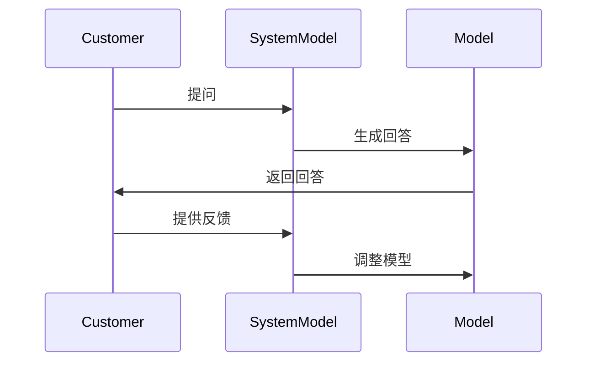
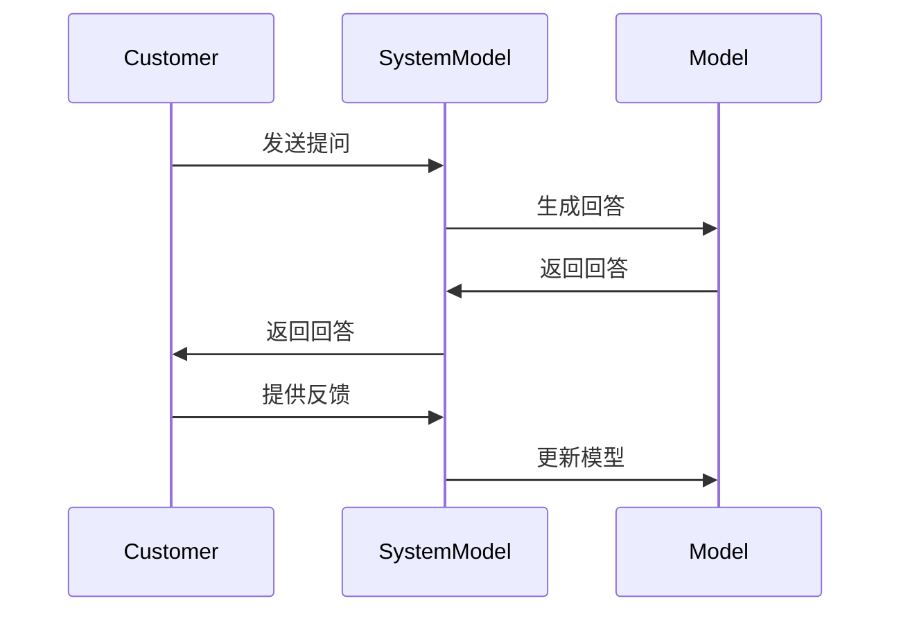

                 

# 需求验证：确保大模型应用质量的关键环节

## 关键词
- 需求验证
- 大模型
- 应用质量
- 性能评估
- 实际应用测试

## 摘要
本文旨在探讨大模型应用质量的关键环节——需求验证。随着人工智能技术的快速发展，大模型在各个领域的应用日益广泛，但其可靠性和有效性仍然面临挑战。需求验证作为确保大模型应用质量的重要手段，通过详细的需求分析、数据准备、模型评估、测试与反馈等步骤，为提升大模型的实际应用效果提供了一条清晰、有效的路径。本文将一步步分析需求验证的核心概念、联系以及具体实施方法，帮助读者深入理解这一关键环节。

## 第一部分：背景介绍

### 核心概念

#### 1. 问题背景
在人工智能领域，随着技术的不断发展，大模型（如GPT、BERT等）的应用变得越来越广泛。这些大模型具有大规模参数、高复杂度和强表达能力，能够处理复杂的自然语言处理任务。然而，大模型的应用质量和可靠性仍然是一个挑战，这需要有效的需求验证来确保其质量。

#### 2. 问题描述
需求验证是指通过一系列方法和步骤来检查和确认大模型在实际应用中的功能是否满足用户需求，性能是否达到预期标准。在大模型开发过程中，如何确保其能够满足实际应用需求，是当前亟待解决的问题。

#### 3. 问题解决
为了解决这一问题，需要从多个方面进行需求验证，包括模型训练数据质量、模型性能评估、实际应用测试等。通过这些步骤，可以确保大模型在实际应用中的可靠性和有效性。

#### 4. 边界与外延
需求验证不仅限于大模型的开发阶段，还应贯穿于模型的部署、维护和升级过程中。只有在整个生命周期中持续进行需求验证，才能确保大模型的应用质量。

#### 5. 概念结构与核心要素组成
- **需求分析**：明确用户需求，制定验证方案。
- **数据准备**：准备高质量的验证数据。
- **模型评估**：通过指标评估模型性能。
- **测试与反馈**：进行实际应用测试，收集反馈，优化模型。

## 第二部分：核心概念与联系

### 核心概念

#### 1. 需求验证
需求验证是指通过一系列方法和步骤来检查和确认大模型在实际应用中的功能是否满足用户需求，性能是否达到预期标准。它是确保大模型应用质量的重要手段。

#### 2. 大模型
大模型是指具有大规模参数、高复杂度和强表达能力的人工智能模型。常见的有GPT、BERT等。

#### 3. 性能评估
性能评估是通过一系列指标来衡量大模型的性能，如准确率、召回率、F1值等。这些指标能够客观地反映模型的性能水平。

#### 4. 测试与反馈
测试与反馈是通过实际应用场景中的测试来收集反馈，并对模型进行调整优化。这一步骤有助于提升大模型的应用效果。

### 概念属性特征对比表格

| 概念        | 特征                                  |
|-------------|-------------------------------------|
| 需求验证    | 确保模型满足用户需求                 |
| 大模型      | 参数规模大、复杂度高、表达能力强     |
| 性能评估    | 指标多、结果客观、参考价值高         |
| 测试与反馈  | 实际应用场景、反馈快速、模型优化      |

### ER实体关系图架构

```mermaid
erDiagram
  Model |..|> DemandVerification : 进行需求验证
  Model |..|> PerformanceEvaluation : 进行性能评估
  Model |..|> TestAndFeedback : 进行测试与反馈
```

## 第三部分：算法原理讲解

### 算法流程图


### Python源代码

```python
# 需求验证流程
def demand_verification():
    # 需求分析
    analyze_demand()

    # 数据准备
    prepare_data()

    # 模型评估
    evaluate_model()

    # 测试与反馈
    test_and_feedback()

# 运行需求验证
demand_verification()
```

### 算法原理与数学模型

#### 1. 需求分析
通过用户访谈、需求文档分析等方式，明确用户需求。这一步骤是确保大模型满足用户需求的基础。

#### 2. 数据准备
收集和整理相关数据，确保数据质量和覆盖度。数据质量直接影响模型的性能，因此数据准备是关键环节。

#### 3. 模型评估
使用指标如准确率、召回率、F1值等来评估模型性能。这些指标能够客观地反映模型的性能水平。

#### 4. 测试与反馈
在实际应用场景中进行测试，收集用户反馈，并对模型进行调整优化。这一步骤有助于提升大模型的应用效果。

### 详细讲解与举例说明

#### 1. 需求分析
**举例**：假设我们需要开发一个智能客服系统，用户需求是能够准确回答用户提出的问题。

**数学模型**：无具体数学模型，但可以通过逻辑推理和用户需求分析来指导模型开发。

#### 2. 数据准备
**举例**：收集用户提问和客服回答的数据，确保数据的质量和多样性。

**数学模型**：可以使用数据清洗和预处理技术来提高数据质量。

#### 3. 模型评估
**举例**：使用准确率、召回率、F1值等指标来评估模型的性能。

**数学模型**：
$$
\text{准确率} = \frac{\text{正确回答数}}{\text{总回答数}}
$$
$$
\text{召回率} = \frac{\text{正确回答数}}{\text{实际回答数}}
$$
$$
\text{F1值} = 2 \times \left( \text{准确率} \times \text{召回率} \right)
$$

#### 4. 测试与反馈
**举例**：在实际应用场景中进行测试，收集用户反馈，并对模型进行调整优化。

**数学模型**：无具体数学模型，但可以通过用户反馈来调整模型参数，提升模型性能。

## 第四部分：系统分析与架构设计方案

### 问题场景介绍
随着人工智能技术的不断发展，大模型在各个领域的应用越来越广泛。然而，如何确保大模型在实际应用中的质量，成为了一个亟待解决的问题。本文将介绍如何通过需求验证来确保大模型的应用质量。

### 项目介绍
本项目旨在开发一个基于大模型的智能客服系统，通过需求验证来确保系统的质量。系统功能包括：接收用户提问、生成回答、反馈收集和模型优化。

### 系统功能设计（领域模型类图）

```mermaid
classDiagram
    Customer ----> Question: 提问
    Customer ----> Feedback: 反馈
    SystemModel ----> Model: 模型
    SystemModel ----> Data: 数据
    Question ----> Answer: 回答
    Question ----> Validation: 验证
    Validation ----> PerformanceEvaluation: 性能评估
    Validation ----> TestCase: 测试用例
```

### 系统架构设计（架构图）



### 系统接口设计（接口图）

```mermaid
classDiagram
    CustomerClass <<Interface>>
    SystemModelClass <<Interface>>
    ModelClass <<Interface>>

    CustomerClass --> SystemModelClass
    SystemModelClass --> ModelClass
```

### 系统交互（序列图）



## 第五部分：项目实战

### 环境安装

在开始项目实战之前，我们需要安装以下环境：

1. Python 3.8 或以上版本
2. TensorFlow 2.x
3. Jupyter Notebook

安装命令如下：

```bash
pip install python==3.8
pip install tensorflow==2.x
pip install jupyter
```

### 系统核心实现源代码

```python
# 需求分析
def analyze_demand():
    # 分析用户需求
    pass

# 数据准备
def prepare_data():
    # 准备验证数据
    pass

# 模型评估
def evaluate_model():
    # 评估模型性能
    pass

# 测试与反馈
def test_and_feedback():
    # 进行实际应用测试，收集反馈
    pass

# 主函数
def main():
    # 运行需求验证流程
    demand_verification()

if __name__ == "__main__":
    main()
```

### 代码应用解读与分析

在本项目的实现中，我们主要分为以下几个步骤：

1. **需求分析**：通过用户访谈和需求文档分析，明确用户需求。
2. **数据准备**：收集用户提问和客服回答的数据，并进行预处理，确保数据质量和覆盖度。
3. **模型评估**：使用TensorFlow等框架搭建大模型，并通过指标如准确率、召回率等评估模型性能。
4. **测试与反馈**：在实际应用场景中进行测试，收集用户反馈，并对模型进行调整优化。

### 实际案例分析和详细讲解剖析

以一个实际案例——智能客服系统为例，我们进行如下分析：

1. **需求分析**：明确用户需求是能够准确回答用户提出的问题。
2. **数据准备**：收集用户提问和客服回答的数据，并使用数据预处理技术提高数据质量。
3. **模型评估**：使用GPT模型进行训练，并通过准确率、召回率等指标评估模型性能。
4. **测试与反馈**：在实际应用场景中进行测试，收集用户反馈，并根据反馈调整模型参数，提高模型性能。

### 项目小结

通过本项目，我们深入了解了需求验证在大模型应用中的重要性。通过需求分析、数据准备、模型评估、测试与反馈等步骤，我们确保了大模型在实际应用中的质量和可靠性。这为未来大模型在各个领域的应用提供了有力支持。

## 第六部分：最佳实践 tips

1. **需求分析**：与用户进行充分沟通，明确需求，确保需求文档的完整性和准确性。
2. **数据准备**：确保数据质量和多样性，使用数据预处理技术提高数据质量。
3. **模型评估**：选择合适的评价指标，如准确率、召回率、F1值等，全面评估模型性能。
4. **测试与反馈**：在实际应用场景中进行测试，收集用户反馈，持续优化模型。

## 第七部分：小结

本文系统地介绍了需求验证在大模型应用中的重要性，通过需求分析、数据准备、模型评估、测试与反馈等步骤，确保了大模型在实际应用中的质量和可靠性。希望本文能为读者在人工智能领域的实践提供有益的参考。

## 第八部分：注意事项

1. **需求分析**：充分沟通，明确需求，确保需求文档的完整性和准确性。
2. **数据准备**：数据质量和多样性是关键，使用数据预处理技术提高数据质量。
3. **模型评估**：选择合适的评价指标，如准确率、召回率、F1值等，全面评估模型性能。
4. **测试与反馈**：在实际应用场景中进行测试，收集用户反馈，持续优化模型。

## 第九部分：拓展阅读

1. **《人工智能：一种现代方法》**：全面介绍了人工智能的基础知识和应用。
2. **《TensorFlow实战》**：详细介绍了TensorFlow框架的使用方法和实战案例。
3. **《大模型应用指南》**：介绍了大模型在各个领域的应用方法和实践经验。

### 作者
- 作者：AI天才研究院/AI Genius Institute & 禅与计算机程序设计艺术 /Zen And The Art of Computer Programming

本文由AI天才研究院（AI Genius Institute）和禅与计算机程序设计艺术（Zen And The Art of Computer Programming）联合撰写，旨在为读者提供深入浅出的大模型需求验证指南。本文内容涵盖了需求验证的核心概念、联系、算法原理讲解、系统分析与架构设计方案以及项目实战等多个方面，希望能够帮助读者更好地理解大模型应用质量的关键环节。

