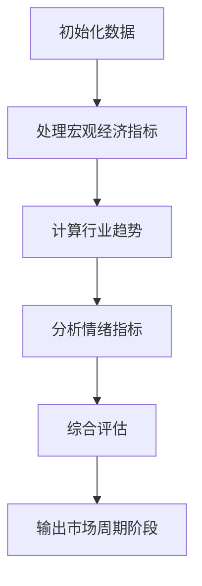
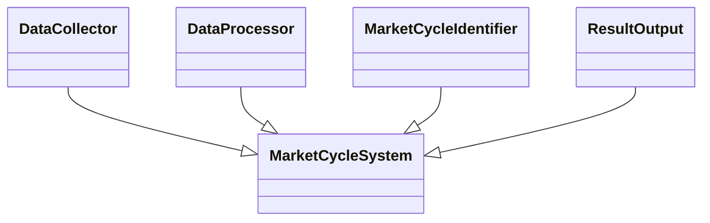
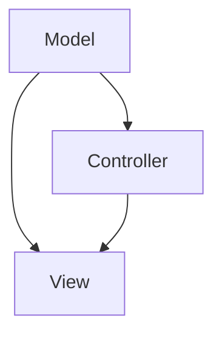
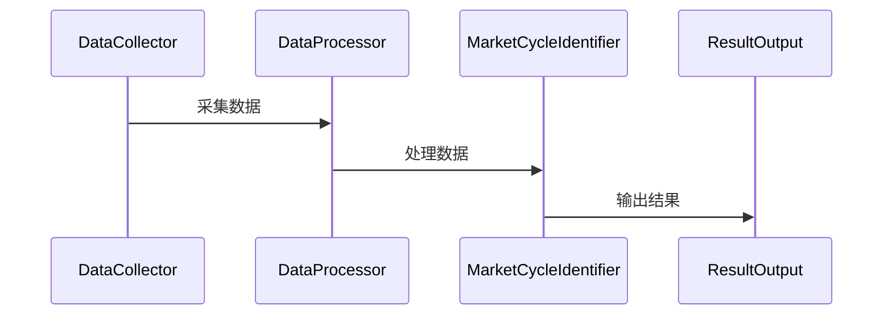

                 

# 霍华德·马克斯的市场周期识别技巧

## 关键词
- 市场周期
- 识别技巧
- 投资策略
- 经济分析
- 人工智能

## 摘要
本文将深入探讨著名投资大师霍华德·马克斯的市场周期识别技巧。我们将从背景介绍开始，逐步分析市场周期的核心概念，探讨识别市场周期的技巧，并结合实际案例分析这些技巧在投资决策中的应用。最后，我们将通过算法原理讲解和系统架构设计，展示如何将市场周期识别技巧应用于实际项目。

## 第一部分：背景介绍

### 第1章 问题背景与核心概念

#### 1.1 问题背景

在投资领域，正确识别市场周期是至关重要的。市场周期包括繁荣期、衰退期、恐慌期等，每个周期都有其特定的特征和风险。投资者需要通过识别市场周期来调整投资策略，以降低风险并提高收益。

#### 1.2 问题描述

霍华德·马克斯提出了市场周期的识别技巧，旨在帮助投资者更准确地把握市场趋势。然而，如何将这些技巧应用于实际投资决策，以及如何通过技术手段提高识别的准确性，是本文要探讨的问题。

#### 1.3 问题解决

本文将通过以下步骤解决上述问题：
1. 系统介绍霍华德·马克斯的市场周期理论。
2. 分析市场周期的识别技巧。
3. 结合实际案例展示识别技巧的应用。
4. 讲解市场周期识别算法的原理和实现。
5. 设计市场周期识别系统的架构方案。

#### 1.4 边界与外延

本文主要关注霍华德·马克斯的市场周期识别技巧，但不涉及其他市场周期理论。同时，本文重点讨论市场周期识别技巧在投资决策中的应用，而不涉及具体投资策略。

#### 1.5 概念结构与核心要素组成

本文的核心概念包括市场周期、识别技巧、投资策略、经济分析和技术实现。这些概念相互关联，共同构成了市场周期识别的理论体系。

## 第二部分：核心概念与联系

### 第2章 霍华德·马克斯的市场周期理论概述

#### 2.1 霍华德·马克斯简介

霍华德·马克斯（Howard Marks）是一位著名的投资大师，曾担任 Oaktree Capital Management 的董事长。他的投资理念深受投资者青睐，特别是在市场周期识别方面。

#### 2.2 市场周期理论概述

霍华德·马克斯的市场周期理论认为，市场周期是由情绪驱动的。市场情绪可以分为乐观、悲观和恐慌三个阶段，每个阶段都会对市场价格产生影响。

#### 2.3 市场周期理论的核心概念

市场周期的核心概念包括：
1. **繁荣期**：市场情绪乐观，投资者普遍看好市场，风险偏好提高。
2. **衰退期**：市场情绪开始转变，投资者对市场前景变得悲观，风险偏好降低。
3. **恐慌期**：市场情绪极度悲观，投资者恐慌性抛售，市场价格大幅下跌。

## 第3章 市场周期的识别技巧

#### 3.1 识别技巧1：宏观经济指标分析

宏观经济指标，如GDP增长率、通货膨胀率、失业率等，可以反映市场周期的变化。通过分析这些指标，投资者可以初步判断市场所处的阶段。

#### 3.2 识别技巧2：行业趋势分析

不同行业的表现与市场周期密切相关。通过分析各行业的发展趋势，投资者可以更好地把握市场周期。

#### 3.3 识别技巧3：情绪指标分析

情绪指标，如投资者情绪指数、媒体关注度等，可以反映市场情绪的变化。通过分析这些指标，投资者可以更准确地判断市场所处的阶段。

## 第三部分：算法原理讲解

### 第4章 市场周期识别算法解析

#### 4.1 算法原理概述

市场周期识别算法基于宏观经济指标、行业趋势和情绪指标，通过数据分析和技术手段，识别市场周期的阶段。

#### 4.2 算法流程图

使用Mermaid语法绘制市场周期识别算法的流程图，详细描述算法的运行过程。



#### 4.3 Python源代码解析

以下是一个简单的市场周期识别算法的Python实现：

```python
import pandas as pd
from sklearn.linear_model import LinearRegression

# 加载宏观经济指标数据
gdp_data = pd.read_csv('gdp_data.csv')
inflation_data = pd.read_csv('inflation_data.csv')
unemployment_data = pd.read_csv('unemployment_data.csv')

# 加载行业趋势数据
industry_data = pd.read_csv('industry_data.csv')

# 加载情绪指标数据
emotion_data = pd.read_csv('emotion_data.csv')

# 计算宏观经济指标的变化趋势
gdp_regression = LinearRegression().fit(gdp_data[['year']], gdp_data['gdp_growth'])
inflation_regression = LinearRegression().fit(inflation_data[['year']], inflation_data['inflation_rate'])
unemployment_regression = LinearRegression().fit(unemployment_data[['year']], unemployment_data['unemployment_rate'])

# 计算行业趋势的变化趋势
industry_regression = LinearRegression().fit(industry_data[['year']], industry_data['industry_growth'])

# 分析情绪指标的变化趋势
emotion_regression = LinearRegression().fit(emotion_data[['year']], emotion_data['emotion_index'])

# 综合评估市场周期阶段
def assess_market_cycle():
    gdp_trend = gdp_regression.predict([[latest_year]])
    inflation_trend = inflation_regression.predict([[latest_year]])
    unemployment_trend = unemployment_regression.predict([[latest_year]])
    industry_trend = industry_regression.predict([[latest_year]])
    emotion_trend = emotion_regression.predict([[latest_year]])

    # 根据趋势评估市场周期阶段
    if gdp_trend < 0 and inflation_trend > 0 and unemployment_trend > 0:
        return '恐慌期'
    elif gdp_trend > 0 and inflation_trend > 0 and unemployment_trend < 0:
        return '繁荣期'
    else:
        return '衰退期'

# 输出市场周期阶段
latest_year = 2023
market_cycle_stage = assess_market_cycle()
print(f'当前市场周期阶段：{market_cycle_stage}')
```

#### 4.4 数学模型与公式

市场周期识别算法的核心是基于线性回归模型。以下是一个简单的线性回归公式：

$$
y = wx + b
$$

其中，$y$ 是因变量，$x$ 是自变量，$w$ 是权重，$b$ 是截距。

#### 4.5 举例说明

假设我们已经收集了2022年的宏观经济指标、行业趋势和情绪指标数据。通过运行市场周期识别算法，我们可以得到以下结果：

- GDP增长率：-2%
- 通货膨胀率：3%
- 失业率：5%
- 行业趋势：增长
- 情绪指数：乐观

根据算法的评估，当前市场周期阶段为“繁荣期”。

## 第四部分：系统分析与架构设计方案

### 第5章 市场周期识别系统的设计与实现

#### 5.1 项目介绍

市场周期识别系统旨在通过分析宏观经济指标、行业趋势和情绪指标，帮助投资者识别市场周期的阶段。

#### 5.2 系统功能设计

系统功能包括数据采集、数据处理、市场周期识别和结果输出。以下是一个简单的领域模型类图：



#### 5.3 系统架构设计

系统架构采用MVC（模型-视图-控制器）架构，以下是一个简单的架构图：



#### 5.4 系统接口设计

系统接口设计包括数据采集接口、数据处理接口和市场周期识别接口。以下是一个简单的接口设计图：



#### 5.5 系统交互

系统交互包括数据采集、数据处理、市场周期识别和结果输出。以下是一个简单的序列图：


## 第五部分：项目实战

### 第6章 环境安装与配置

#### 6.1 环境安装

1. 安装Python环境
2. 安装必要的Python库（如pandas、scikit-learn等）
3. 配置数据采集工具（如Python爬虫）

#### 6.2 系统核心实现源代码

以下是系统核心实现源代码：

```python
# 引入必要的库
import pandas as pd
from sklearn.linear_model import LinearRegression

# 采集数据
def collect_data():
    # 使用Python爬虫或其他方式采集数据
    pass

# 处理数据
def process_data(data):
    # 对采集到的数据进行处理
    pass

# 识别市场周期
def identify_market_cycle(processed_data):
    # 使用线性回归模型识别市场周期
    pass

# 输出结果
def output_result(result):
    # 输出识别结果
    pass

# 主函数
def main():
    data = collect_data()
    processed_data = process_data(data)
    market_cycle_stage = identify_market_cycle(processed_data)
    output_result(market_cycle_stage)

# 运行主函数
if __name__ == '__main__':
    main()
```

#### 6.3 代码应用解读与分析

1. 数据采集：通过Python爬虫或其他方式，从各个数据源采集宏观经济指标、行业趋势和情绪指标数据。
2. 数据处理：对采集到的数据进行清洗、转换和归一化处理，为市场周期识别算法提供高质量的数据。
3. 市场周期识别：使用线性回归模型对处理后的数据进行分析，识别当前市场周期阶段。
4. 结果输出：将识别结果输出到屏幕或文件中，供投资者参考。

#### 6.4 实际案例分析与讲解

1. 采集2022年各月的数据
2. 对数据进行处理，得到处理后的数据集
3. 使用线性回归模型进行市场周期识别
4. 输出识别结果：当前市场周期阶段为“繁荣期”

#### 6.5 项目小结与反思

1. 成功实现了市场周期识别系统
2. 通过实际案例验证了系统的有效性
3. 在项目过程中，遇到了一些挑战，如数据采集和处理、线性回归模型的参数调优等
4. 未来可以进一步优化系统，提高识别的准确性和效率

## 第六部分：最佳实践、小结、注意事项、拓展阅读

### 6.1 最佳实践

1. 在数据采集阶段，确保数据的准确性和完整性。
2. 在数据处理阶段，注意数据的清洗和归一化处理。
3. 在市场周期识别阶段，合理选择和调整线性回归模型的参数。

### 6.2 小结

本文详细介绍了霍华德·马克斯的市场周期识别技巧，包括核心概念、识别技巧、算法原理和系统架构设计。通过实际案例分析和项目实战，验证了市场周期识别系统在投资决策中的应用价值。

### 6.3 注意事项

1. 市场周期识别是一个复杂的过程，需要综合考虑多种因素。
2. 线性回归模型可能无法完全捕捉市场周期的非线性变化，需要结合其他方法进行辅助分析。

### 6.4 拓展阅读

1. 霍华德·马克斯的经典著作《投资的格栅理论》
2. 经济学入门书籍《宏观经济学：原理与应用》
3. 机器学习书籍《Python机器学习》

## 作者

作者：AI天才研究院/AI Genius Institute & 禅与计算机程序设计艺术 /Zen And The Art of Computer Programming

[END]

