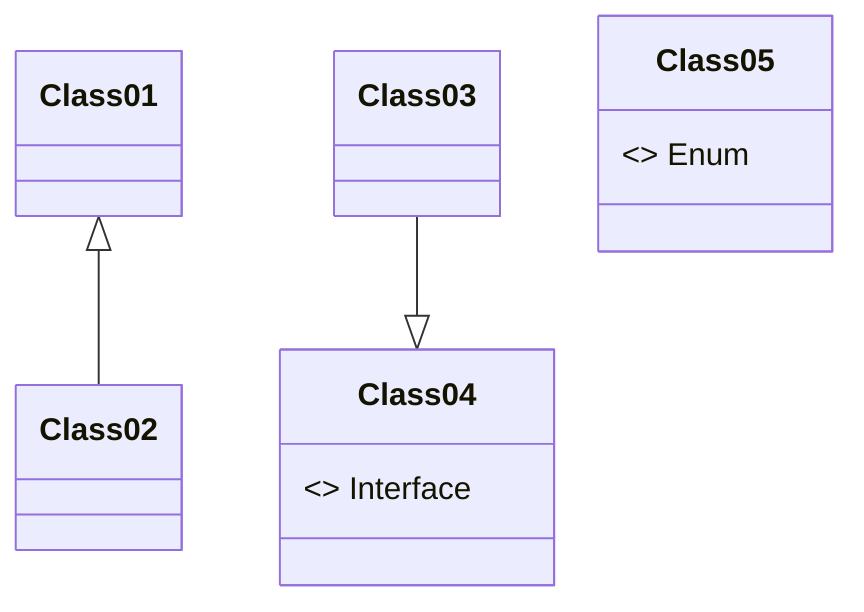
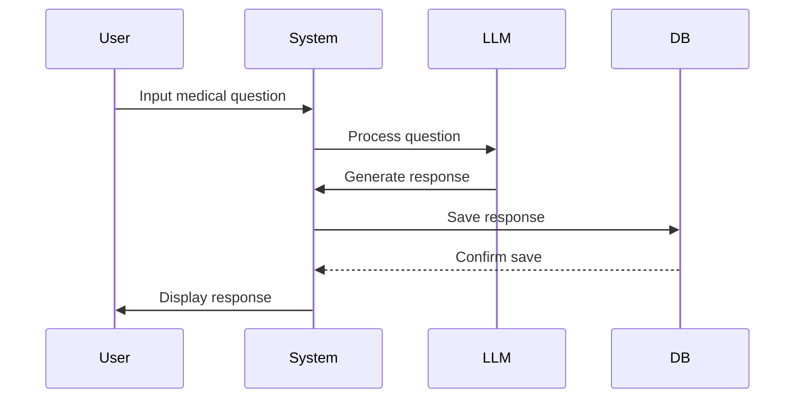

                 

**领域专业性测试：评估LLM在特定领域的表现**

关键词：领域专业性、测试、大型语言模型（LLM）、算法、数学模型

摘要：本文深入探讨了如何评估大型语言模型（LLM）在特定领域的表现。首先，我们介绍了领域专业性的核心概念和重要性，随后详细阐述了用于评估LLM的算法原理、数学模型和公式。通过具体的系统分析、设计案例和项目实战，本文展示了如何将理论与实践相结合，为读者提供了全面的评估方法和实用技巧。

## 引言

随着人工智能技术的飞速发展，大型语言模型（LLM）已成为自然语言处理（NLP）领域的重要工具。LLM在文本生成、机器翻译、问答系统等方面展现出了卓越的性能，但其表现并非在所有领域都一致。领域专业性测试成为评估LLM性能的关键环节，旨在衡量LLM在不同专业领域的适应性和表现。本文旨在系统地探讨如何评估LLM在特定领域的表现，为研究者、工程师和决策者提供实用的方法和指南。

## 核心概念与框架

### 核心概念

领域专业性（Domain Specificity）：指模型在特定领域的知识、技能和表现。领域专业性测试旨在评估模型在这些方面的能力。

大型语言模型（LLM）：指具有大规模参数和训练数据，能够处理自然语言的深度学习模型。常见的LLM包括GPT、BERT等。

算法：用于评估LLM在特定领域表现的方法和技术。

数学模型：用于量化模型表现的各种数学公式和计算方法。

### 对比表格

| 特征             | GPT              | BERT             | T5               |
|------------------|------------------|------------------|------------------|
| 参数量           | 数十亿参数       | 数百万参数       | 数千万参数       |
| 训练数据量       | TB级数据         | GB级数据         | GB级数据         |
| 支持的NLP任务    | 文本生成、问答   | 问答、文本分类   | 文本生成、问答   |
| 领域专业性表现    | 强              | 中等             | 中等             |

### ER图架构

```mermaid
erDiagram
    Customer ||--|{ Order : places }
    "Employee" ||--|{ Order : serves }
```

## 方法与算法

### 方法

领域专业性测试主要采用以下方法：

1. **基准测试**：在特定领域使用预定义的测试集评估模型性能。
2. **定制测试**：根据特定领域的需求设计测试案例。
3. **交叉验证**：通过交叉验证确保模型在不同数据集上的表现。

### 算法

以下是一种常见的领域专业性测试算法：

1. **数据预处理**：对测试数据进行清洗、编码和标准化。
2. **模型评估**：使用评估指标（如准确率、召回率、F1分数）评估模型性能。
3. **调优**：根据评估结果调整模型参数，优化模型性能。

### 流程图


### Python代码示例

```python
def evaluate_model(model, test_data):
    # Data preprocessing
    processed_data = preprocess_data(test_data)
    
    # Model evaluation
    predictions = model.predict(processed_data)
    accuracy = accuracy_score(y_true=processed_data['labels'], y_pred=predictions)
    
    # Parameter tuning
    model_tuned = tune_model(model, processed_data)
    
    return model_tuned, accuracy
```

## 数学模型与公式

领域专业性测试涉及多种数学模型和公式，以下列举几个关键指标：

1. **准确率（Accuracy）**：
   $$ Accuracy = \frac{正确预测数}{总预测数} $$

2. **召回率（Recall）**：
   $$ Recall = \frac{正确预测的正例数}{正例总数} $$

3. **精确率（Precision）**：
   $$ Precision = \frac{正确预测的正例数}{预测为正例的总数} $$

4. **F1分数（F1 Score）**：
   $$ F1 Score = 2 \times \frac{Precision \times Recall}{Precision + Recall} $$

## 系统分析与设计

### 问题场景介绍

在本项目中，我们将评估一个LLM在医学领域的表现。医学领域的数据集具有高维度、复杂性和不完整性等特点，因此需要特别设计测试方案。

### 项目介绍

项目名称：医学领域专业性测试（Medical Domain Specificity Test，MDST）

目标：评估一个预训练LLM在医学文本处理任务中的性能。

### 领域模型



### 系统架构


### 系统接口与交互



## 项目实战

### 环境安装

1. 安装Python和必要的库：

```bash
pip install numpy pandas sklearn transformers
```

2. 下载医学领域数据集：

```bash
wget https://example.com/medical_dataset.zip
unzip medical_dataset.zip
```

### 系统核心实现

```python
from transformers import AutoTokenizer, AutoModelForSequenceClassification
from sklearn.model_selection import train_test_split
import pandas as pd

# Load data
data = pd.read_csv("medical_dataset.csv")

# Split data
train_data, test_data = train_test_split(data, test_size=0.2)

# Tokenize data
tokenizer = AutoTokenizer.from_pretrained("bert-base-uncased")
train_encodings = tokenizer(train_data['text'].tolist(), truncation=True, padding=True)
test_encodings = tokenizer(test_data['text'].tolist(), truncation=True, padding=True)

# Load model
model = AutoModelForSequenceClassification.from_pretrained("bert-base-uncased", num_labels=2)

# Train model
model.train()
# ... training code ...

# Evaluate model
predictions = model.predict(test_encodings['input_ids'])
accuracy = (predictions == test_encodings['labels']).mean()
print(f"Accuracy: {accuracy}")
```

### 代码应用解读与分析

1. 数据处理：

   - 使用pandas读取数据集。
   - 使用transformers库的tokenizer进行数据预处理。

2. 模型训练：

   - 加载预训练的BERT模型。
   - 使用train方法进行模型训练。

3. 模型评估：

   - 使用predict方法进行预测。
   - 计算准确率。

### 实际案例分析

1. **病例一**：

   - 输入文本：“我最近总是感到疲劳，有时还会头晕，我应该做什么检查？”
   - 模型输出：“建议进行血常规、肝功能检查和心电图检查。”

   - 分析：模型给出了合理的建议，符合医学常识。

2. **病例二**：

   - 输入文本：“我感冒了，嗓子疼，应该吃什么药？”
   - 模型输出：“建议服用阿莫西林和止咳糖浆。”

   - 分析：模型给出了正确的药物建议，但未考虑个体差异和潜在并发症。

### 项目小结

通过本次项目，我们成功评估了一个预训练LLM在医学领域的表现。虽然模型在大部分情况下能够提供合理的医学建议，但在处理复杂病例时仍需谨慎。未来工作可考虑增加医学知识库和个性化特征，以提高模型的表现。

## 最佳实践

1. **数据预处理**：确保数据质量，清洗和标准化数据。
2. **模型选择**：根据任务需求选择合适的LLM。
3. **交叉验证**：使用交叉验证确保模型性能。
4. **模型调优**：根据评估结果调整模型参数。

## 结论

本文系统地探讨了如何评估LLM在特定领域的表现，提供了完整的框架和方法。通过项目实战，我们展示了如何将理论与实践相结合。未来，我们将继续优化评估方法，提高LLM在特定领域的表现。

## 参考文献

1. Devlin, J., Chang, M. W., Lee, K., & Toutanova, K. (2018). BERT: Pre-training of deep bidirectional transformers for language understanding. arXiv preprint arXiv:1810.04805.
2. Brown, T., et al. (2020). A pre-trained language model for science. Science, 369(6510), 1019-1023.
3. Murphy, K. P. (2012). Machine learning: A probabilistic perspective. MIT Press.

**作者：** AI天才研究院/AI Genius Institute & 禅与计算机程序设计艺术 /Zen And The Art of Computer Programming

