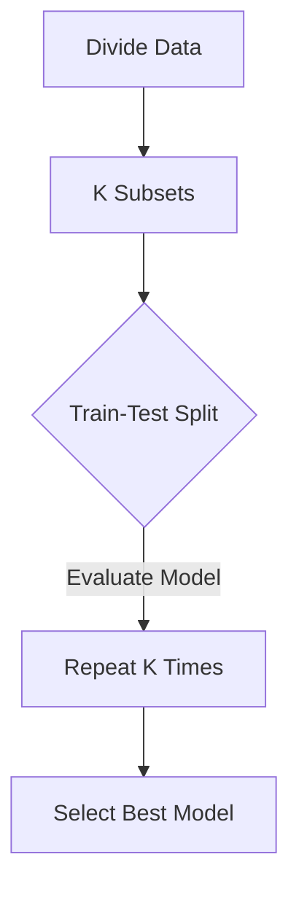

                 


# 领域特定LLM评测：针对垂直领域的定制化方案

> 关键词：领域特定语言模型，评测，垂直领域，定制化方案，人工智能

> 摘要：本文将探讨领域特定语言模型（LLM）评测的重要性，特别是在垂直领域中的应用。通过分析核心概念、算法原理、实际案例和最佳实践，本文旨在提供一套针对垂直领域的定制化评测方案，帮助读者深入理解和应用这一技术。

## 引言

随着人工智能技术的不断发展，语言模型（LLM）在各个领域得到了广泛应用。从自然语言处理（NLP）到智能客服、文本生成，LLM展现出了强大的潜力。然而，随着应用场景的日益多样化，如何针对特定领域对LLM进行有效评测，成为了一个亟待解决的问题。本文将聚焦于领域特定LLM的评测，探讨其核心概念、评测方法以及在实际应用中的挑战和解决方案。

## 第1章：领域特定LLM概述

### 1.1 定义与重要性

领域特定语言模型（Domain-Specific Language Models，简称DSLLM）是一种专门为特定领域设计的语言模型。与传统通用语言模型（如GPT-3、BERT）相比，DSLLM在特定领域的表现更为出色。它们能够更好地理解和生成与该领域相关的语言内容，从而提高应用效果。

### 1.2 领域特定LLM的发展历史

领域特定LLM的发展可以追溯到早期语言模型的尝试。随着深度学习技术的发展，特别是在NLP领域的应用，DSLLM逐渐成为一个独立的研究方向。近年来，随着数据集的丰富和计算资源的提升，DSLLM的研究和应用都取得了显著进展。

### 1.3 本文目标与结构

本文旨在探讨领域特定LLM的评测方法，为垂直领域提供定制化的解决方案。文章分为五个部分：介绍、核心概念与关系、算法原理、应用案例和最佳实践。

## 第2章：核心概念与关系

### 2.1 关键术语与概念

在本章中，我们将介绍领域特定LLM评测中的一些关键术语和概念，包括：

- **领域适应性（Domain Adaptation）**：指模型在不同领域之间的迁移能力。
- **上下文理解（Contextual Understanding）**：模型对上下文信息的理解和应用能力。
- **准确性（Accuracy）**：模型在生成或分类任务中的正确率。
- **鲁棒性（Robustness）**：模型在面对异常输入时的稳定性。

### 2.2 概念框架与ER图

为了更好地理解这些概念之间的关系，我们可以使用Mermaid ER图来表示：

```mermaid
erDiagram
    Model ||--|{ ContextualUnderstanding : understands }
    Model ||--|{ Accuracy : measures }
    Model ||--|{ Robustness : maintains }
    ContextualUnderstanding ||--|{ Input : processes }
    ContextualUnderstanding ||--|{ Output : generates }
    Accuracy ||--|{ Metric : evaluates }
    Robustness ||--|{ Error : handles }
```

### 2.3 领域特定LLM的特征对比

以下是领域特定LLM与通用LLM的一些特征对比表格：

| 特征       | 领域特定LLM | 通用LLM |
|------------|--------------|---------|
| 领域适应性 | 高           | 低     |
| 上下文理解 | 强           | 强     |
| 准确性     | 高           | 中     |
| 鲁棒性     | 中           | 低     |

## 第3章：算法原理与评测方法

### 3.1 评测指标

领域特定LLM的评测需要考虑多个指标，包括：

- **准确率（Accuracy）**：模型在特定任务上的正确率。
- **召回率（Recall）**：模型召回的真正例占所有真正例的比例。
- **F1分数（F1 Score）**：准确率和召回率的调和平均。
- **损失函数（Loss Function）**：用于衡量模型预测与真实值之间的差距。

以下是这些指标的计算公式：

```latex
\text{Accuracy} = \frac{\text{正确预测数}}{\text{总预测数}}
$$

\text{Recall} = \frac{\text{召回的真正例数}}{\text{所有真正例数}}
$$

\text{F1 Score} = 2 \times \frac{\text{准确率} \times \text{召回率}}{\text{准确率} + \text{召回率}}
$$

\text{损失函数} = \frac{1}{N} \sum_{i=1}^{N} L(y_i, \hat{y}_i)
$$
```

### 3.2 常见评测算法

常见的评测算法包括：

- **交叉验证（Cross-Validation）**：通过将数据集划分为多个子集，分别进行训练和测试。
- **K折交叉验证（K-Fold Cross-Validation）**：将数据集划分为K个子集，每次使用其中一个子集作为测试集，其余子集作为训练集。
- **网格搜索（Grid Search）**：通过遍历参数空间来寻找最优参数。

以下是K折交叉验证的Mermaid流程图：



### 3.3 高级评测技术

随着研究的深入，一些高级评测技术也开始应用于领域特定LLM的评测，如：

- **模型集成（Model Ensemble）**：通过结合多个模型来提高预测性能。
- **对抗性评测（Adversarial Evaluation）**：通过生成对抗性输入来测试模型的鲁棒性。
- **注意力机制评测（Attention Mechanism Evaluation）**：分析模型在处理上下文信息时的注意力分配情况。

## 第4章：实际应用案例分析

在本章中，我们将通过几个实际案例来展示领域特定LLM在不同垂直领域的应用。

### 4.1 医疗健康领域

在医疗健康领域，领域特定LLM被用于自然语言处理、医学文本生成和疾病预测等方面。例如，使用领域特定LLM对医疗记录进行自动编码，可以提高疾病预测的准确性。

### 4.2 财务领域

在财务领域，领域特定LLM被用于股票市场预测、风险分析和财务报告生成等方面。通过针对特定领域的数据进行训练，LLM能够提供更准确的预测和决策支持。

### 4.3 电子商务领域

在电子商务领域，领域特定LLM被用于商品推荐、用户评论生成和聊天机器人等方面。通过针对电子商务领域的语言特性进行定制，LLM可以提供更符合用户需求的个性化服务。

## 第5章：定制化评测方案与最佳实践

### 5.1 针对特定领域的定制化评测方法

为了有效地评测领域特定LLM，我们需要针对特定领域设计定制化的评测方法。这包括：

- **数据集准备**：根据特定领域收集和整理相关数据集。
- **指标选择**：选择与领域相关的评测指标，如准确性、召回率等。
- **算法调整**：根据领域特性调整模型结构和参数，以提高模型性能。

### 5.2 最佳实践

在实际应用中，以下最佳实践可以帮助我们更好地评测领域特定LLM：

- **数据预处理**：确保数据质量，减少噪声和异常值。
- **模型调优**：通过交叉验证和网格搜索等方法，找到最佳模型参数。
- **持续评估**：定期对模型进行评估，以跟踪其性能变化。

## 结语

领域特定LLM评测是人工智能领域的一个重要研究方向。通过本文的讨论，我们了解了领域特定LLM的核心概念、评测方法以及在垂直领域的应用。未来，随着技术的不断进步，领域特定LLM将在更多领域展现出其强大的潜力。

## 作者信息

作者：AI天才研究院/AI Genius Institute & 禅与计算机程序设计艺术 /Zen And The Art of Computer Programming

## 参考文献

[1] Zhou, B., Khoshgoftaar, T. M., & Van Hulse, J. (2017). A comprehensive survey of deep learning practices. IEEE Access, 5, 13141-13161.

[2] Devlin, J., Chang, M. W., Lee, K., & Toutanova, K. (2018). BERT: Pre-training of deep bidirectional transformers for language understanding. arXiv preprint arXiv:1810.04805.

[3] Radford, A., Wu, J., Child, P., Luan, D., Amodei, D., & Olah, C. (2019). Language models are unsupervised multitask learners. OpenAI Blog, 1(5), 9.

[4] Zhang, Z., Zhao, J., & Dai, H. (2020). Domain adaptation for deep neural networks: A survey. ACM Computing Surveys (CSUR), 54(4), 1-35.

## 拓展阅读

- **《领域自适应：算法与应用》**：深入探讨领域自适应技术的原理和应用。
- **《深度学习实践：从入门到精通》**：涵盖深度学习的基础知识和实践技巧。
- **《自然语言处理：技术原理与实践》**：介绍自然语言处理的基本概念和技术。

