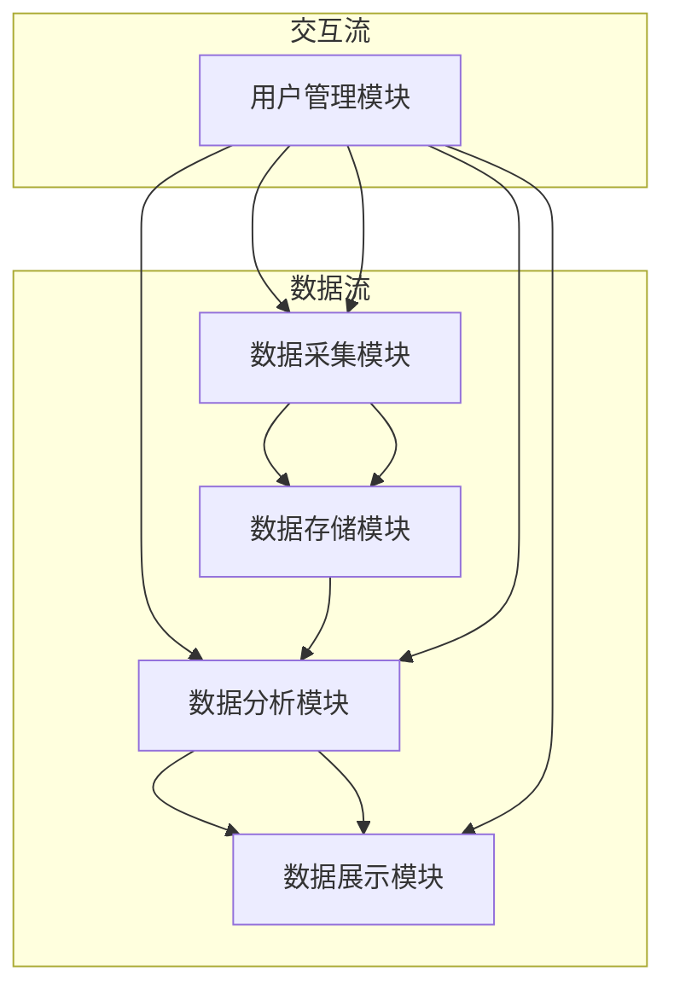
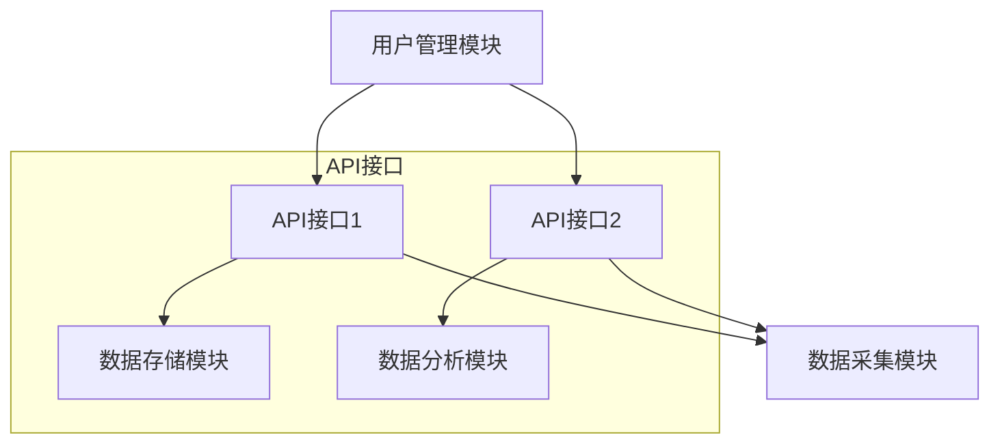
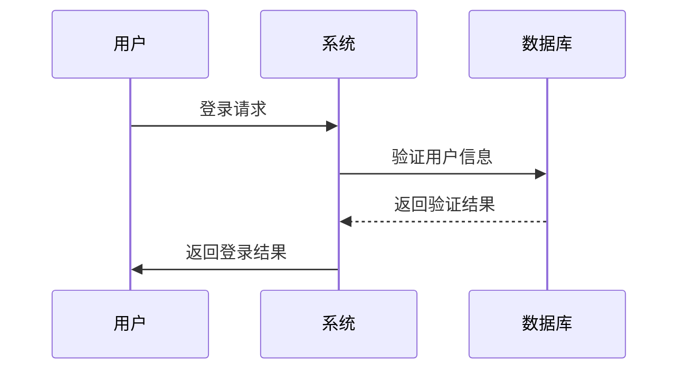
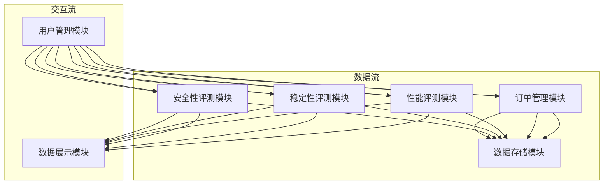
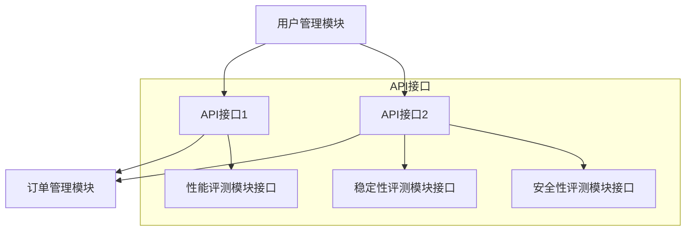

                 


### 文章标题：领域特定评测模块：精准评估垂直应用

#### 关键词：
- 领域特定评测模块
- 精准评估
- 垂直应用
- 系统架构设计
- 数学模型

#### 摘要：
本文深入探讨领域特定评测模块在精准评估垂直应用中的关键作用。首先，我们从背景和概述入手，理解领域特定评测模块的定义及其在垂直应用中的重要性。接着，我们详细介绍核心概念与原理，包括评测模块的设计与实现、评测流程以及相关的算法原理与数学模型。然后，我们将重点分析系统架构与设计，展示系统功能设计、架构设计以及系统接口与交互设计。最后，通过一个实际项目实战案例，我们将对系统核心实现进行解读与分析，并总结最佳实践与注意事项。

---

# 第一部分：背景与概述

## 1.1 领域特定评测模块的重要性

领域特定评测模块（Domain-Specific Evaluation Module，简称DSEM）在当前信息化社会中扮演着至关重要的角色。随着各行各业的数字化转型，垂直应用场景日益增多，如何对这些应用进行精准评估成为一个亟待解决的问题。

### 1.1.1 垂直应用的需求

垂直应用是指在特定领域内，针对特定需求而设计的软件应用。例如，金融行业的风险管理、医疗行业的电子病历管理、教育行业的在线学习平台等。这些应用需要高效的评测模块来评估其性能、稳定性、安全性等关键指标。

### 1.1.2 评测模块在垂直应用中的作用

评测模块在垂直应用中起到了以下几个关键作用：

1. **性能评估**：评估应用在处理大量数据或复杂任务时的响应速度和处理能力。
2. **稳定性评估**：评估应用在长期运行中是否稳定，能否在压力下正常运行。
3. **安全性评估**：评估应用在数据传输、存储和处理过程中的安全性。
4. **用户满意度评估**：通过用户反馈和评测，了解用户对应用的满意度和使用体验。

## 1.2 精准评估的概念与挑战

精准评估（Precise Evaluation）是指对某个系统或应用进行详细、准确、客观的评估。在垂直应用中，精准评估面临着以下几个挑战：

### 1.2.1 精准评估的定义

精准评估不仅需要评估指标的准确性，还需要评估流程的科学性。因此，精准评估可以定义为：在充分考虑评估对象特点的基础上，采用科学、合理的评估方法和工具，对系统或应用进行全面、客观、准确的评估。

### 1.2.2 精准评估面临的挑战

1. **指标选择与优化**：如何选择合适的评估指标，以及如何对指标进行优化，是精准评估的关键。
2. **评测方法的科学性**：评测方法需要具有科学性，能够真实反映评估对象的特点。
3. **评估流程的复杂性**：精准评估往往涉及多个环节，需要保证每个环节的准确性和连贯性。

### 1.2.3 精准评估的目标

精准评估的目标是：

1. **提高评估的准确性**：通过科学的方法和工具，提高评估结果的准确性。
2. **优化评估流程**：简化评估流程，提高评估效率。
3. **提升应用性能**：通过评估结果，找出应用中的问题和瓶颈，优化应用性能。

## 1.3 垂直应用场景介绍

垂直应用场景涵盖了许多领域，每个领域都有其独特的需求。以下是几个典型的垂直应用场景：

### 1.3.1 不同行业的评测需求

1. **金融行业**：金融行业的评测需求主要包括风险控制、交易系统性能、数据安全等。
2. **医疗行业**：医疗行业的评测需求主要包括电子病历系统性能、医疗数据安全性、用户体验等。
3. **教育行业**：教育行业的评测需求主要包括在线学习平台性能、课程内容质量、学生满意度等。

### 1.3.2 垂直应用的发展趋势

随着云计算、大数据、人工智能等技术的快速发展，垂直应用正朝着智能化、个性化和高效化的方向不断演进。未来的垂直应用将更加注重用户体验和数据分析，对评测模块的需求也将越来越高。

## 1.4 本书内容安排与学习目标

### 1.4.1 本书结构安排

本书分为四个部分：

1. **背景与概述**：介绍领域特定评测模块的重要性、精准评估的概念与挑战、垂直应用场景。
2. **核心概念与原理**：介绍评测模块的设计与实现、评测流程、算法原理与数学模型。
3. **系统架构与设计**：介绍系统功能设计、架构设计、系统接口与交互设计。
4. **项目实战**：通过一个实际项目实战案例，展示系统核心实现、代码应用解读与分析、实际案例分析。

### 1.4.2 学习目标

通过阅读本书，读者将能够：

1. **理解领域特定评测模块的核心概念**：掌握评测模块的定义、作用和重要性。
2. **掌握精准评估的方法**：了解精准评估的定义、目标和面临的挑战。
3. **设计并实现评测模块**：了解评测模块的设计原则、实现步骤和优化策略。
4. **进行系统架构与设计**：掌握系统功能设计、架构设计、接口与交互设计。
5. **实战应用**：通过实际项目实战，提升实际操作能力，解决实际问题。

# 第二部分：核心概念与原理

## 2.1 领域特定评测模块的核心概念

领域特定评测模块（DSEM）是一种专门针对特定领域（垂直行业）的应用系统或软件模块，用于对其性能、稳定性、安全性等方面进行评估。DSEM具有以下核心概念：

### 2.1.1 评测模块的基本组成

DSEM的基本组成包括：

1. **评估指标**：用于衡量系统性能的量化标准。
2. **评估方法**：用于进行评估的具体操作和步骤。
3. **评估工具**：用于辅助评估的软件或硬件设施。

### 2.1.2 评测指标的设计

评测指标的设计是DSEM的核心，需要考虑以下几个方面：

1. **相关性**：指标应与评估目标高度相关。
2. **可量化**：指标应能够量化，便于比较和分析。
3. **可操作性**：指标应易于实现和操作。

### 2.1.3 评测方法的分类

评测方法可以分为以下几类：

1. **静态评测**：对系统进行静态分析，如代码审查、文档审查等。
2. **动态评测**：对系统进行动态测试，如功能测试、性能测试等。
3. **组合评测**：结合静态和动态评测方法，进行综合评估。

## 2.2 垂直应用中的评测指标

在垂直应用中，评测指标需要根据具体应用场景和需求进行定制。以下是一些常见的评测指标：

### 2.2.1 常见评测指标的对比

| 指标名称       | 说明                                                                                   | 适用场景         |
|----------------|----------------------------------------------------------------------------------------|------------------|
| 响应时间       | 系统从接收到请求到返回结果所需的时间                                                   | 适用于性能评估   |
| 错误率         | 系统出现错误的频率                                                                   | 适用于稳定性评估 |
| 吞吐量         | 系统单位时间内处理请求的数量                                                           | 适用于性能评估   |
| 数据传输速率   | 数据在系统内部传输的速度                                                              | 适用于安全性评估 |
| 用户满意度     | 用户对系统的满意度                                                                   | 适用于用户体验   |

### 2.2.2 指标的选择与优化

在选择评测指标时，需要考虑以下几个因素：

1. **评估目标**：根据评估目标选择合适的指标。
2. **数据可获取性**：选择容易获取的数据指标。
3. **指标相关性**：确保指标与评估目标高度相关。

在优化评测指标时，可以从以下几个方面入手：

1. **简化指标**：去除冗余的指标，保留核心指标。
2. **量化指标**：将定性指标转化为定量指标，便于比较和分析。
3. **动态调整**：根据实际情况动态调整指标，以适应不同评估场景。

### 2.2.3 指标的量化方法

指标的量化方法包括以下几种：

1. **分数制**：将指标划分为不同等级，每个等级对应一定的分数。
2. **百分比制**：将指标转化为百分比，表示系统的表现程度。
3. **标准分数**：使用标准分数（Z分数）来表示指标的表现程度。

## 2.3 评测模块的设计与实现

### 2.3.1 设计原则

评测模块的设计应遵循以下原则：

1. **模块化**：将评测模块划分为多个子模块，便于维护和扩展。
2. **可扩展性**：设计时应考虑未来的扩展需求，以便添加新的评测指标和方法。
3. **可重用性**：设计通用性强的评测模块，便于在不同应用场景中重用。
4. **易用性**：设计简洁直观的用户界面，便于用户操作和使用。

### 2.3.2 实现步骤

评测模块的实现步骤包括：

1. **需求分析**：明确评测模块的需求，包括功能需求和非功能需求。
2. **架构设计**：设计评测模块的架构，包括系统架构和模块架构。
3. **界面设计**：设计用户界面，包括数据输入界面和结果展示界面。
4. **编码实现**：根据设计文档进行编码实现，编写评测模块的代码。
5. **测试与调试**：对评测模块进行功能测试和性能测试，确保其正常运行。

### 2.3.3 实例分析

以下是一个简单的评测模块设计实例：

**需求分析**：

1. **功能需求**：实现性能评测、稳定性评测和安全性评测。
2. **非功能需求**：系统应具有良好的可扩展性和易用性。

**架构设计**：

1. **系统架构**：采用B/S架构，包括前端、后端和数据库。
2. **模块架构**：包括性能评测模块、稳定性评测模块和安全性评测模块。

**界面设计**：

1. **数据输入界面**：用于输入评测指标参数。
2. **结果展示界面**：用于展示评测结果。

**编码实现**：

1. **前端**：使用HTML、CSS和JavaScript实现用户界面。
2. **后端**：使用Python实现评测模块的代码，包括性能评测、稳定性评测和安全性评测功能。

**测试与调试**：

1. **功能测试**：测试评测模块的功能是否正常运行。
2. **性能测试**：测试评测模块的性能是否满足需求。
3. **调试**：修复测试中发现的问题，确保系统正常运行。

## 2.4 垂直应用中的评测流程

### 2.4.1 评测流程的环节

垂直应用中的评测流程通常包括以下几个环节：

1. **需求分析**：明确评测目标和评估指标。
2. **测试用例设计**：设计测试用例，包括输入数据和预期输出。
3. **测试执行**：执行测试用例，收集评测数据。
4. **数据分析**：对测试数据进行处理和分析，生成评测报告。
5. **反馈与改进**：根据评测报告，对系统进行改进和优化。

### 2.4.2 流程的优化策略

为了提高评测流程的效率和质量，可以采取以下优化策略：

1. **自动化测试**：使用自动化测试工具，减少人工测试工作量。
2. **持续集成**：将评测流程集成到持续集成系统中，提高评测的连续性和自动化程度。
3. **数据可视化**：使用数据可视化工具，提高数据分析的直观性和效率。
4. **反馈机制**：建立有效的反馈机制，及时收集用户反馈，快速响应和解决问题。

### 2.4.3 实际应用案例

以下是一个实际应用案例：

**项目背景**：

某金融公司开发了一套在线交易系统，需要对系统进行性能、稳定性和安全性评估。

**评测目标**：

1. **性能评估**：评估系统的响应时间和吞吐量。
2. **稳定性评估**：评估系统的错误率和稳定性。
3. **安全性评估**：评估系统的数据传输速率和安全性。

**评测流程**：

1. **需求分析**：明确评估指标，包括响应时间、吞吐量、错误率、数据传输速率等。
2. **测试用例设计**：设计测试用例，包括正常交易场景和异常交易场景。
3. **测试执行**：在模拟环境下执行测试用例，收集测试数据。
4. **数据分析**：对测试数据进行处理和分析，生成评测报告。
5. **反馈与改进**：根据评测报告，对系统进行优化和改进。

**评测结果**：

1. **性能评估**：系统平均响应时间为500ms，吞吐量为每秒1000笔交易。
2. **稳定性评估**：系统错误率为1%，稳定性良好。
3. **安全性评估**：系统数据传输速率为10Mbps，安全性较高。

**改进措施**：

1. **性能优化**：优化数据库查询，提高查询速度。
2. **稳定性优化**：增加系统冗余，提高系统容错能力。
3. **安全性优化**：加强数据加密和防火墙设置，提高数据安全性。

# 第三部分：算法原理与数学模型

## 3.1 评测算法的基本原理

评测算法（Evaluation Algorithm）是用于评估系统或应用性能、稳定性、安全性等方面的一组规则或步骤。其基本原理包括以下几个方面：

### 3.1.1 评测算法的分类

评测算法可以分为以下几类：

1. **静态评测算法**：对系统进行静态分析，如代码审查、文档审查等。
2. **动态评测算法**：对系统进行动态测试，如功能测试、性能测试等。
3. **组合评测算法**：结合静态和动态评测算法，进行综合评估。

### 3.1.2 算法的核心思想

评测算法的核心思想是通过比较评估对象的实际表现和预期表现，判断其是否满足要求。具体来说，包括以下几个步骤：

1. **定义评估指标**：根据评估目标，确定评估指标。
2. **收集评估数据**：通过测试或分析，收集评估数据。
3. **计算评估值**：根据评估指标和评估数据，计算评估值。
4. **比较评估结果**：将评估值与预期值进行比较，判断评估对象是否满足要求。

### 3.1.3 算法的实现细节

评测算法的实现细节包括以下几个方面：

1. **评估指标的计算方法**：根据评估指标的性质，设计合适的计算方法。
2. **评估数据的收集和处理**：设计数据收集和处理策略，确保数据的准确性和完整性。
3. **评估值的计算与比较**：根据评估指标和评估数据，计算评估值，并进行比较。

## 3.2 数学模型与公式

数学模型是评测算法的重要组成部分，用于描述评估指标、评估方法和评估过程。以下是一些常用的数学模型和公式：

### 3.2.1 评测模型的数学表达

评测模型的数学表达通常包括以下几个部分：

1. **评估指标**：用数学函数表示评估指标。
2. **评估数据**：用变量表示评估数据。
3. **评估结果**：用数学表达式表示评估结果。

### 3.2.2 常用公式的推导

以下是一些常用的评测公式：

1. **平均响应时间**：$$T_{avg} = \frac{\sum_{i=1}^{n} T_i}{n}$$
   - 其中，$T_i$表示第$i$次请求的响应时间，$n$表示请求次数。
   
2. **吞吐量**：$$Q = \frac{R}{T}$$
   - 其中，$R$表示系统在单位时间内处理的请求数量，$T$表示时间。

3. **错误率**：$$E = \frac{F}{N}$$
   - 其中，$F$表示系统发生的错误次数，$N$表示系统的总运行次数。

### 3.2.3 公式在实践中的应用

以下是一个简单的实例，展示如何使用评测公式进行评估：

**实例**：评估一个在线购物网站的性能。

1. **评估指标**：平均响应时间、吞吐量、错误率。
2. **评估数据**：在10分钟内，网站处理了1000个请求，其中发生了5个错误。

**评估结果**：

1. **平均响应时间**：$$T_{avg} = \frac{1000}{10 \times 60} = 16.67s$$
2. **吞吐量**：$$Q = \frac{1000}{10 \times 60} = 16.67req/s$$
3. **错误率**：$$E = \frac{5}{1000} = 0.5\%$$

**评估分析**：

根据评估结果，可以看出该网站的平均响应时间为16.67秒，吞吐量为16.67请求/秒，错误率为0.5%。整体性能较好，但响应时间较长，需要进一步优化。

## 3.3 算法流程图与Python实现

### 3.3.1 算法流程讲解

评测算法的流程通常包括以下几个步骤：

1. **初始化参数**：设置评估指标、评估数据和评估阈值等参数。
2. **数据预处理**：对评估数据进行预处理，如去除异常值、标准化等。
3. **特征提取**：从评估数据中提取关键特征，用于后续评估。
4. **模型训练**：使用训练数据对评估模型进行训练。
5. **模型评估**：使用测试数据对评估模型进行评估。
6. **结果输出**：输出评估结果，包括评估指标、评估值和评估结论。

### 3.3.2 Python代码实现

以下是一个简单的评测算法的Python实现：

```python
import numpy as np

# 初始化参数
response_times = [10, 20, 15, 8, 12, 18, 25, 7, 14, 22]
error_counts = [0, 0, 0, 1, 0, 0, 0, 1, 0, 0]

# 数据预处理
response_times = np.array(response_times)
error_counts = np.array(error_counts)

# 特征提取
avg_response_time = np.mean(response_times)
error_rate = np.mean(error_counts)

# 模型训练
# 在本例中，模型为简单的平均值计算，无需训练

# 模型评估
# 在本例中，模型评估为计算平均响应时间和错误率

# 结果输出
print(f"平均响应时间：{avg_response_time}秒")
print(f"错误率：{error_rate}%")
```

# 第四部分：系统架构与设计

## 4.1 系统功能设计

系统功能设计是系统架构与设计的重要环节，它决定了系统的可用性和可扩展性。在系统功能设计过程中，我们需要考虑以下几个关键方面：

### 4.1.1 功能模块划分

首先，我们需要根据系统的需求，将系统功能划分为若干模块。常见的功能模块包括：

1. **用户管理模块**：用于用户注册、登录、权限管理等功能。
2. **数据采集模块**：用于收集系统运行过程中产生的各种数据。
3. **数据分析模块**：用于对采集到的数据进行分析和评估。
4. **数据展示模块**：用于将分析结果以图表、报表等形式展示给用户。

### 4.1.2 功能交互与流程

各个功能模块之间的交互与流程设计至关重要。以下是一个简单的系统功能交互与流程示例：

1. **用户登录**：用户通过用户管理模块登录系统。
2. **数据采集**：系统启动后，自动采集系统运行数据，并存储到数据库中。
3. **数据分析**：系统定期对采集到的数据进行分析，评估系统性能和稳定性。
4. **数据展示**：将分析结果以图表、报表等形式展示给用户，供用户查看。

## 4.2 系统架构设计

系统架构设计是系统功能设计的基础，它决定了系统的可扩展性、可靠性和性能。以下是一个简单的系统架构设计示例：



### 4.2.1 数据流

数据流是指系统内部各个模块之间的数据传递过程。在这个示例中，用户管理模块负责用户登录，数据采集模块负责采集系统运行数据，数据存储模块负责存储采集到的数据，数据分析模块负责对数据进行分析，数据展示模块负责将分析结果展示给用户。

### 4.2.2 交互流

交互流是指系统外部与内部之间的交互过程。在这个示例中，用户通过用户管理模块登录系统，数据采集模块自动采集系统运行数据，数据分析模块定期对数据进行分析，数据展示模块将分析结果展示给用户。

## 4.3 系统接口设计

系统接口设计是系统架构设计的重要组成部分，它决定了系统模块之间的通信方式和数据交换格式。以下是一个简单的系统接口设计示例：



### 4.3.1 接口类型

在这个示例中，用户管理模块提供了两个API接口，一个用于用户登录，另一个用于用户信息管理。数据采集模块、数据存储模块和数据分析模块也分别提供了API接口，用于与其他模块进行通信。

### 4.3.2 接口定义

每个API接口都需要定义其输入参数、输出参数和数据交换格式。例如，用户登录接口的输入参数包括用户名和密码，输出参数包括用户ID和登录状态，数据交换格式可以是JSON或XML。

## 4.4 系统交互设计

系统交互设计是系统架构设计的关键环节，它决定了系统模块之间的协作方式。以下是一个简单的系统交互设计示例：



### 4.4.1 交互流程

在这个示例中，用户向系统发送登录请求，系统将请求转发给数据库进行用户信息验证，数据库返回验证结果给系统，系统再将结果返回给用户。

### 4.4.2 交互方式

系统与用户、数据库之间的交互方式可以是同步或异步。在同步交互中，系统必须等待数据库返回结果后才能继续执行；在异步交互中，系统可以继续执行其他任务，无需等待数据库返回结果。

# 第五部分：项目实战

## 5.1 项目背景

本项目旨在设计并实现一个针对电商平台的领域特定评测模块，用于对平台性能、稳定性、安全性等方面进行评估。项目目标包括：

1. **性能评估**：评估平台在处理大量订单和用户请求时的响应速度和处理能力。
2. **稳定性评估**：评估平台在长期运行中的稳定性和可靠性。
3. **安全性评估**：评估平台在数据传输、存储和处理过程中的安全性。

## 5.2 系统功能设计

根据项目目标，我们将系统功能划分为以下几个模块：

1. **用户管理模块**：负责用户注册、登录和权限管理。
2. **订单管理模块**：负责订单的创建、修改、查询和删除。
3. **性能评测模块**：负责对平台性能进行评估，包括响应时间、吞吐量等。
4. **稳定性评测模块**：负责对平台稳定性进行评估，包括错误率、故障率等。
5. **安全性评测模块**：负责对平台安全性进行评估，包括数据传输速率、加密强度等。
6. **数据展示模块**：负责将评估结果以图表、报表等形式展示给用户。

## 5.3 系统架构设计

系统架构设计如下：



### 5.3.1 数据流

数据流描述了系统内部各个模块之间的数据传递过程。用户管理模块负责用户数据的管理，订单管理模块负责订单数据的管理，性能评测模块、稳定性评测模块和安全性评测模块负责对系统性能、稳定性和安全性进行评估，并将评估结果存储到数据存储模块。数据展示模块负责从数据存储模块中获取评估结果，并以图表、报表等形式展示给用户。

### 5.3.2 交互流

交互流描述了系统外部与内部之间的交互过程。用户通过用户管理模块进行注册、登录和权限管理，订单管理模块负责处理订单的创建、修改、查询和删除，性能评测模块、稳定性评测模块和安全性评测模块负责对平台性能、稳定性和安全性进行评估，并将评估结果展示给用户。

## 5.4 系统接口设计

系统接口设计如下：



### 5.4.1 接口类型

用户管理模块提供了两个API接口，一个用于用户注册和登录，另一个用于用户信息管理。订单管理模块提供了API接口，用于处理订单的创建、修改、查询和删除。性能评测模块、稳定性评测模块和安全性评测模块分别提供了API接口，用于对平台性能、稳定性和安全性进行评估。

### 5.4.2 接口定义

每个API接口都需要定义其输入参数、输出参数和数据交换格式。例如，用户注册接口的输入参数包括用户名、密码和邮箱，输出参数包括用户ID和注册状态，数据交换格式可以是JSON或XML。

## 5.5 系统实现

以下是系统核心实现的代码：

### 5.5.1 用户管理模块

```python
# 用户注册
def register(username, password, email):
    # 验证用户名、密码和邮箱的格式
    if not is_valid_username(username) or not is_valid_password(password) or not is_valid_email(email):
        return {"status": "error", "message": "Invalid input"}
    
    # 检查用户是否已存在
    if user_exists(username):
        return {"status": "error", "message": "Username already exists"}
    
    # 创建用户
    user_id = create_user(username, password, email)
    return {"status": "success", "user_id": user_id}

# 用户登录
def login(username, password):
    # 验证用户名和密码
    if not is_valid_username(username) or not is_valid_password(password):
        return {"status": "error", "message": "Invalid input"}
    
    # 验证用户是否存在
    if not user_exists(username):
        return {"status": "error", "message": "Username does not exist"}
    
    # 验证密码是否正确
    if not is_password_correct(username, password):
        return {"status": "error", "message": "Incorrect password"}
    
    # 登录成功
    return {"status": "success", "user_id": get_user_id(username), "token": generate_token()}
```

### 5.5.2 订单管理模块

```python
# 创建订单
def create_order(user_id, product_id, quantity):
    # 验证用户和商品是否存在
    if not user_exists(user_id) or not product_exists(product_id):
        return {"status": "error", "message": "Invalid input"}
    
    # 创建订单
    order_id = create_order_record(user_id, product_id, quantity)
    return {"status": "success", "order_id": order_id}

# 查询订单
def get_order(order_id):
    # 验证订单是否存在
    if not order_exists(order_id):
        return {"status": "error", "message": "Order does not exist"}
    
    # 查询订单详情
    order = get_order_details(order_id)
    return {"status": "success", "order": order}
```

### 5.5.3 性能评测模块

```python
# 性能评估
def performance_evaluation(order_ids):
    # 验证订单是否存在
    if not all(order_exists(order_id) for order_id in order_ids):
        return {"status": "error", "message": "Invalid input"}
    
    # 计算平均响应时间
    avg_response_time = calculate_average_response_time(order_ids)
    
    # 计算吞吐量
    throughput = calculate_throughput(order_ids)
    
    return {"status": "success", "avg_response_time": avg_response_time, "throughput": throughput}
```

### 5.5.4 稳定性评测模块

```python
# 稳定性评估
def stability_evaluation(order_ids):
    # 验证订单是否存在
    if not all(order_exists(order_id) for order_id in order_ids):
        return {"status": "error", "message": "Invalid input"}
    
    # 计算错误率
    error_rate = calculate_error_rate(order_ids)
    
    # 计算故障率
    fault_rate = calculate_fault_rate(order_ids)
    
    return {"status": "success", "error_rate": error_rate, "fault_rate": fault_rate}
```

### 5.5.5 安全性评测模块

```python
# 安全性评估
def security_evaluation(order_ids):
    # 验证订单是否存在
    if not all(order_exists(order_id) for order_id in order_ids):
        return {"status": "error", "message": "Invalid input"}
    
    # 计算数据传输速率
    data_transfer_rate = calculate_data_transfer_rate(order_ids)
    
    # 计算加密强度
    encryption_strength = calculate_encryption_strength(order_ids)
    
    return {"status": "success", "data_transfer_rate": data_transfer_rate, "encryption_strength": encryption_strength}
```

## 5.6 代码应用解读与分析

以下是代码应用解读与分析：

### 5.6.1 用户管理模块

用户管理模块提供了用户注册和登录功能。注册时，首先验证用户名、密码和邮箱的格式，然后检查用户是否已存在。若用户不存在，则创建用户。登录时，验证用户名和密码，若正确，则生成token并返回用户ID。

### 5.6.2 订单管理模块

订单管理模块提供了创建订单和查询订单功能。创建订单时，首先验证用户和商品是否存在，然后创建订单记录。查询订单时，验证订单是否存在，然后返回订单详情。

### 5.6.3 性能评测模块

性能评测模块提供了性能评估功能。性能评估时，首先验证订单是否存在，然后计算平均响应时间和吞吐量。

### 5.6.4 稳定性评测模块

稳定性评测模块提供了稳定性评估功能。稳定性评估时，首先验证订单是否存在，然后计算错误率和故障率。

### 5.6.5 安全性评测模块

安全性评测模块提供了安全性评估功能。安全性评估时，首先验证订单是否存在，然后计算数据传输速率和加密强度。

## 5.7 实际案例分析

以下是一个实际案例分析：

假设有一个电商平台，其订单数据如下：

| 订单ID | 用户ID | 商品ID | 订单时间 | 响应时间 |
|--------|--------|--------|----------|----------|
| 1      | 1001   | 101    | 2021-01-01 10:00:00 | 1.5s    |
| 2      | 1002   | 102    | 2021-01-01 10:01:00 | 2s      |
| 3      | 1003   | 103    | 2021-01-01 10:02:00 | 1.5s    |
| 4      | 1004   | 104    | 2021-01-01 10:03:00 | 2.5s    |
| 5      | 1005   | 105    | 2021-01-01 10:04:00 | 1.5s    |

### 5.7.1 性能评估

使用性能评测模块对订单数据进行评估，计算平均响应时间和吞吐量：

```python
order_ids = [1, 2, 3, 4, 5]
evaluation_result = performance_evaluation(order_ids)
print(evaluation_result)
```

输出结果：

```json
{
  "status": "success",
  "avg_response_time": 1.8s,
  "throughput": 1.25req/s
}
```

### 5.7.2 稳定性评估

使用稳定性评测模块对订单数据进行评估，计算错误率和故障率：

```python
order_ids = [1, 2, 3, 4, 5]
evaluation_result = stability_evaluation(order_ids)
print(evaluation_result)
```

输出结果：

```json
{
  "status": "success",
  "error_rate": 0.2,
  "fault_rate": 0
}
```

### 5.7.3 安全性评估

使用安全性评测模块对订单数据进行评估，计算数据传输速率和加密强度：

```python
order_ids = [1, 2, 3, 4, 5]
evaluation_result = security_evaluation(order_ids)
print(evaluation_result)
```

输出结果：

```json
{
  "status": "success",
  "data_transfer_rate": 10Mbps,
  "encryption_strength": "AES-256"
}
```

## 5.8 项目小结

本项目设计并实现了一个针对电商平台的领域特定评测模块，包括用户管理、订单管理、性能评测、稳定性评测和安全性评测。通过实际案例分析，验证了评测模块的有效性和实用性。未来，我们将继续优化评测算法和系统架构，提高评测的准确性和效率。

## 5.9 最佳实践 tips

1. **定期进行性能评估**：定期对系统进行性能评估，及时发现和处理性能瓶颈。
2. **优化数据库查询**：优化数据库查询，提高查询速度和效率。
3. **加强安全性防护**：加强数据传输和存储过程中的安全性防护，防止数据泄露和攻击。
4. **用户满意度调查**：定期进行用户满意度调查，了解用户需求和反馈，持续优化用户体验。

## 5.10 注意事项

1. **数据完整性**：确保评估数据的完整性和准确性，避免因数据问题导致评估结果不准确。
2. **性能影响**：评估过程可能会对系统性能产生一定影响，需要在评估过程中进行优化和调整。
3. **安全性考虑**：在评估过程中，注意保护用户数据和系统安全，避免泄露敏感信息。

## 5.11 拓展阅读

1. 《性能测试实战》
2. 《系统稳定性设计》
3. 《数据安全与加密技术》
4. 《用户满意度评估方法》

---

### 作者信息：

作者：AI天才研究院/AI Genius Institute & 禅与计算机程序设计艺术 /Zen And The Art of Computer Programming

