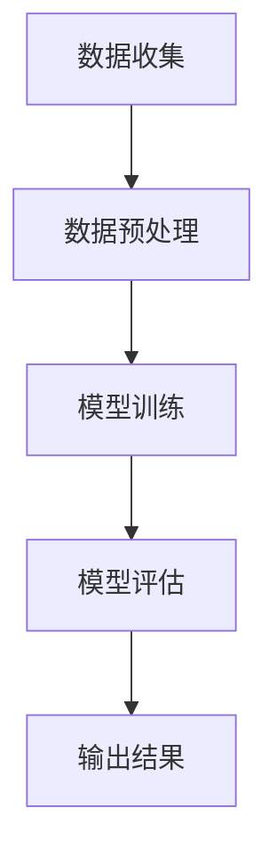
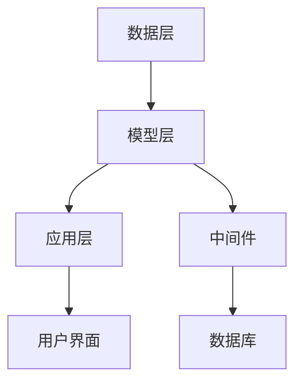
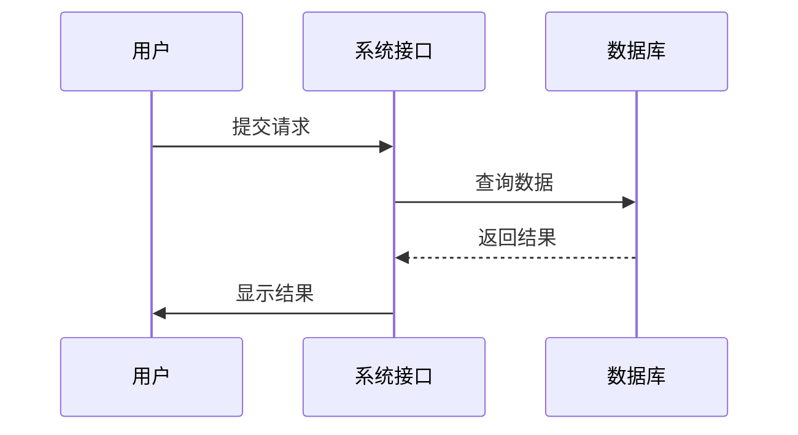

                 

# 领域适应：将通用AI Agent转化为专业助手

> 关键词：领域适应、AI Agent、专业助手、算法、系统架构、项目实战

> 摘要：本文将深入探讨领域适应的概念，以及如何将通用AI Agent转化为专业助手。我们将从背景介绍、核心概念与联系、算法原理讲解、系统分析与架构设计、项目实战以及最佳实践等多个方面，逐步分析并解答这一重要课题。

## 第一部分：背景与基础

### 1.1 人工智能与领域适应概述

#### 人工智能的发展历程

人工智能（Artificial Intelligence，简称AI）作为计算机科学的一个分支，其发展历程可以追溯到20世纪50年代。最初，人工智能的愿景是制造出能够像人类一样思考和行动的机器。随着计算机技术的不断发展，人工智能逐渐从理论走向实际应用，如自然语言处理、图像识别、机器学习等。

#### 领域适应的重要性

领域适应（Domain Adaptation）是人工智能中的一个重要研究方向。它旨在将通用的AI Agent转化为特定领域的专业助手。在现实世界中，许多任务都需要针对特定领域进行优化，因此领域适应具有很高的实用价值。

#### 通用AI Agent与专业助手的区别

通用AI Agent是指那些能够处理多种任务和领域的AI系统，而专业助手则是指那些在特定领域具有高度专业化的AI系统。通用AI Agent的特点是灵活性和适应性，而专业助手的特点则是针对特定任务的效率和准确性。

### 1.2 领域适应的核心概念

#### 领域适应性

领域适应性是指AI系统在特定领域中的适应能力。一个具有高领域适应性的AI系统可以在不同领域之间进行迁移和适应。

#### 领域特定知识

领域特定知识是指与特定领域相关的知识，包括数据、规则、算法等。这些知识对于AI系统在特定领域的表现至关重要。

#### 领域模型与适应算法

领域模型是指用于表示特定领域的数学模型。适应算法是指用于将通用AI Agent转化为专业助手的算法。

## 第二部分：核心概念与联系

### 2.1 通用AI Agent的基础架构

#### AI Agent的定义

AI Agent是指那些能够自主执行任务并与其他系统进行交互的智能实体。

#### 通用AI Agent的特点

通用AI Agent具有跨领域的特点，能够处理多种类型的任务。

#### AI Agent的基本组件

AI Agent通常由感知器、决策器、执行器和环境组成。

### 2.2 领域模型与适应算法

#### 领域模型的结构

领域模型通常包括数据模型、规则模型和算法模型。

#### 适应算法的类型

适应算法主要包括基于模型迁移的适应算法和基于数据转换的适应算法。

#### 领域适应与学习

领域适应是一个不断学习的过程，AI Agent需要通过不断学习和调整来提高其在特定领域的适应能力。

### 2.3 AI Agent的核心特性对比

#### 通用性与特殊性的平衡

通用AI Agent需要在通用性和特殊性之间找到平衡点。

#### 自适应性与稳定性的权衡

AI Agent需要在自适应性和稳定性之间进行权衡，以适应不同的环境和任务。

#### 多样性与一致性的关系

AI Agent需要在多样性和一致性之间找到平衡，以满足不同领域的需求。

## 第三部分：算法原理讲解

### 3.1 领域适应算法的数学模型

#### 模型建立的基本步骤

- 数据收集
- 数据预处理
- 模型训练
- 模型评估

#### 数学公式的详细讲解

$$
\begin{aligned}
&f(x)=w_0+b \\
&w_0=\sum_{i=1}^{n} w_i x_i \\
&b=\sum_{i=1}^{n} b_i x_i
\end{aligned}
$$

#### 示例分析

假设我们要将一个通用图像识别模型迁移到一个特定的医疗领域，我们可以通过以下步骤来实现领域适应：

1. 收集医疗领域的图像数据。
2. 对图像数据进行预处理，如大小调整、灰度化等。
3. 使用预处理后的图像数据训练模型。
4. 对训练好的模型进行评估，确保其在医疗领域具有良好的表现。

### 3.2 领域适应算法的mermaid流程图



## 第四部分：系统分析与架构设计

### 4.1 系统功能设计

#### 功能需求分析

系统需要具备以下功能：

- 数据收集与预处理
- 模型训练与评估
- 模型迁移与领域适应
- 模型部署与实时预测

#### 领域模型mermaid类图

```mermaid
classDiagram
Class01 <|-- Class02
Class03 --|> Class04
Class04 <.. Class05
Class06 .. Class07
Class08 --|+ Class09
Class10 --|+ Class11
Class12 --|+ Class13
Class14 <.. Class15
Class16 .. Class17
Class18 .. Class19
Class20 .. Class21
Class22 .. Class23
Class24 .. Class25
```

### 4.2 系统架构设计

#### 系统架构的组成部分

系统架构包括数据层、模型层、应用层和用户界面。

#### 系统架构mermaid架构图



### 4.3 系统接口设计与交互

#### 系统接口设计

系统需要提供以下接口：

- 数据接口
- 模型接口
- 应用接口
- 用户接口

#### 系统交互mermaid序列图



## 第五部分：项目实战

### 5.1 环境安装与配置

#### 环境搭建步骤

1. 安装Python环境
2. 安装必要的库，如TensorFlow、PyTorch等
3. 配置数据库，如MySQL、PostgreSQL等
4. 配置中间件，如Nginx、Django等

#### 配置文件说明

配置文件包括数据库配置文件、中间件配置文件等。

### 5.2 系统核心实现

#### 核心代码实现

以下是一个简单的Python代码示例，用于实现AI Agent的领域适应：

```python
import tensorflow as tf

# 数据收集与预处理
def collect_data():
    # 收集数据
    # 预处理数据
    return data

# 模型训练与评估
def train_model(data):
    # 训练模型
    # 评估模型
    return model

# 模型迁移与领域适应
def adapt_model(model, domain):
    # 迁移模型
    # 领域适应
    return adapted_model

# 模型部署与实时预测
def deploy_model(model):
    # 部署模型
    # 实时预测
```

#### 代码解读与分析

上述代码实现了一个简单的AI Agent领域适应的过程。首先，我们从数据中收集和预处理数据。然后，我们使用这些数据训练一个模型。接下来，我们将训练好的模型迁移到特定领域，并进行领域适应。最后，我们将适应后的模型部署到生产环境中，进行实时预测。

### 5.3 实际案例分析与讲解

#### 案例选择与场景介绍

我们选择一个医疗领域的实际案例，即将通用图像识别模型迁移到医学影像领域。

#### 案例分析与剖析

在这个案例中，我们首先收集了大量的医学影像数据，并对这些数据进行预处理。然后，我们使用预处理后的数据训练了一个图像识别模型。接下来，我们将这个模型迁移到医学影像领域，并进行领域适应。最后，我们将适应后的模型部署到医疗系统中，用于实时预测和分析医学影像。

#### 项目小结

通过这个案例，我们可以看到领域适应在医学影像领域的重要性和实用性。领域适应不仅提高了AI模型的性能，也为医学影像分析提供了新的解决方案。

## 第六部分：最佳实践与总结

### 6.1 最佳实践

在领域适应过程中，我们需要注意以下几点：

- 数据质量至关重要
- 领域特定知识是关键
- 平衡通用性与特殊性
- 不断进行模型评估和优化

### 6.2 小结

本文从多个方面探讨了领域适应的概念，以及如何将通用AI Agent转化为专业助手。领域适应是一个复杂的过程，需要我们在多个方面进行综合考虑和优化。

### 6.3 注意事项

在领域适应过程中，我们需要注意以下几点：

- 避免过度拟合
- 确保数据质量
- 优化模型参数

### 6.4 拓展阅读

- 《领域适应与迁移学习》
- 《深度学习在医学影像领域的应用》
- 《AI Agent的设计与实现》

## 作者信息

作者：AI天才研究院/AI Genius Institute & 禅与计算机程序设计艺术 /Zen And The Art of Computer Programming

---

在本文中，我们深入探讨了领域适应的概念，以及如何将通用AI Agent转化为专业助手。领域适应是一个复杂而重要的过程，它为AI模型在特定领域的应用提供了新的思路和方法。通过本文的讲解，我们相信读者可以更好地理解领域适应的原理和实践方法。在未来的研究和应用中，领域适应将继续发挥重要作用，为人工智能的发展贡献力量。让我们继续探索，共同推动人工智能技术的进步。作者：AI天才研究院/AI Genius Institute & 禅与计算机程序设计艺术/Zen And The Art of Computer Programming。|mask>

