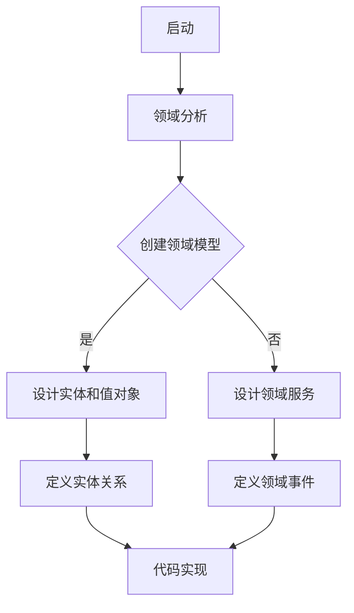
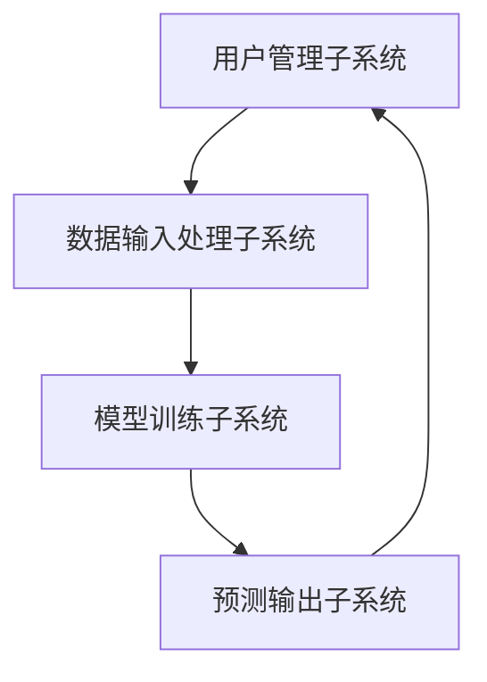
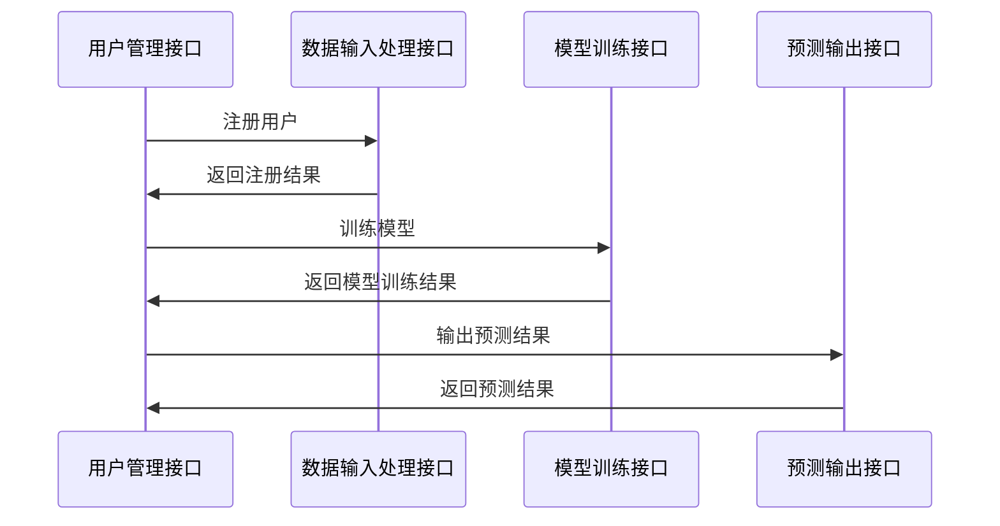
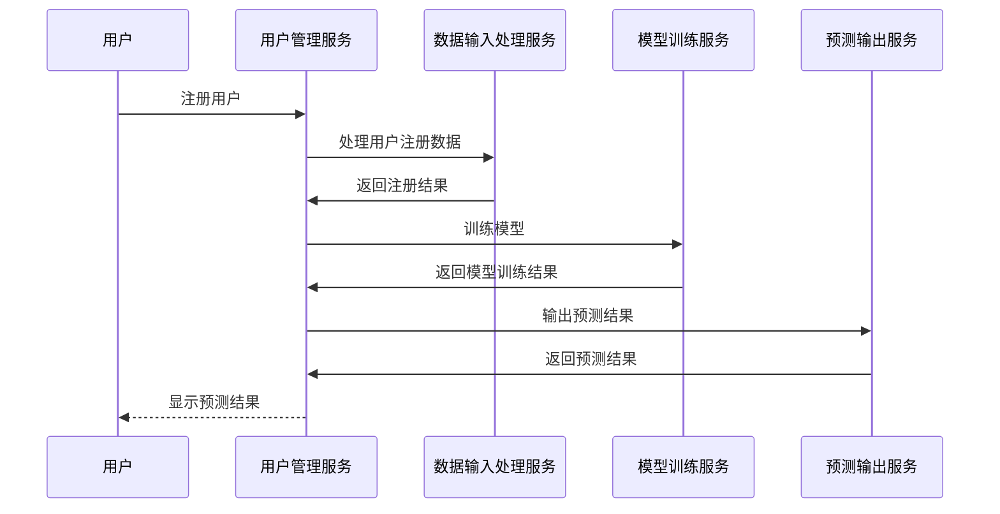

                 

### Step 1: 背景介绍

#### 引言：领域驱动设计的起源、核心概念以及其与LLM应用的关系

领域驱动设计（Domain-Driven Design，简称DDD）作为一种软件开发方法，起源于2004年，由Eric Evans在其同名著作《领域驱动设计：软件核心复杂性应对策略》中首次提出。DDD的核心理念是围绕领域模型来组织软件设计和开发，通过清晰地定义领域概念、实体、值对象和领域服务，来提高软件系统的可维护性和可扩展性。

在当今人工智能迅速发展的背景下，大型语言模型（Large Language Model，简称LLM）如BERT、GPT-3等，成为了自然语言处理（Natural Language Processing，简称NLP）领域的重要工具。然而，随着模型规模和复杂性的增加，如何有效地管理和优化LLM应用的业务逻辑，成为了一个亟待解决的问题。

LLM应用的业务逻辑通常包括数据输入处理、模型训练、预测输出等环节。这些环节往往涉及大量的业务规则和流程，并且随着业务的不断发展，这些逻辑会变得更加复杂和难以维护。传统的软件开发方法，如面向过程编程和简单的面向对象设计，很难应对这种复杂性和变化性。

领域驱动设计正是为了解决这一类复杂业务逻辑问题而诞生的。它强调在软件设计初期就深入理解业务领域，建立清晰且精确的领域模型，从而降低系统的复杂性和提高可维护性。DDD与LLM应用的关系在于，它提供了一套系统化的方法来处理大规模、高复杂性的业务逻辑，使得开发者能够更加专注地实现模型的训练和预测，而不是陷入繁琐的细节处理中。

#### 问题背景：现有业务逻辑中存在的问题

现有业务逻辑中存在许多问题，这些问题直接影响到了LLM应用的开发和维护效率。首先，业务逻辑的混乱是一个普遍存在的问题。在传统的软件开发过程中，开发者往往过于关注技术细节，而忽视了业务逻辑的清晰性和一致性。这导致代码中充斥着杂乱无章的业务规则，使得后续的维护和扩展变得异常困难。

其次，系统耦合度高是另一个显著问题。在传统的软件架构中，各个模块之间往往存在紧密的耦合关系，这意味着一个模块的修改可能会影响到其他多个模块的功能。在LLM应用中，模型训练和预测模块与其他业务逻辑模块之间的耦合，会导致系统的稳定性下降，一旦出现故障，可能会引起整个系统的瘫痪。

此外，业务逻辑的维护困难也是一个不容忽视的问题。随着业务的发展，需求不断变化，开发者需要不断地调整和优化业务逻辑。然而，传统的代码结构使得这种调整过程变得异常繁琐和低效。一方面，开发者需要花费大量时间来理解现有的业务逻辑，另一方面，修改过程中容易引入新的错误，进一步增加了维护的难度。

这些问题的存在，不仅降低了开发效率，还增加了维护成本，严重制约了LLM应用的发展。因此，迫切需要一种能够有效解决这些问题的方法，而领域驱动设计正是这样一种方法。

#### 问题描述：具体说明业务逻辑的混乱、系统耦合度高、维护困难等具体问题

首先，业务逻辑的混乱问题具体表现在以下几个方面：

1. **代码复杂性高**：在传统的开发模式中，业务逻辑往往混杂在大量的技术细节中，使得代码的可读性和可维护性大幅降低。例如，一个简单的用户注册功能可能会涉及数据库操作、权限验证、日志记录等多个方面，导致代码结构混乱，难以理解。

2. **业务规则不明确**：业务规则分散在代码的各个角落，缺乏统一的定义和文档。这导致开发者在修改或扩展业务逻辑时，很难找到相关代码，从而增加了出错的风险。

3. **依赖关系复杂**：业务逻辑模块之间的依赖关系不清晰，一个模块的修改可能会影响到多个模块的功能。这种复杂的关系使得系统的稳定性下降，且在出现问题时难以定位和修复。

其次，系统耦合度高的问题具体体现在以下几个方面：

1. **高内聚低耦合**：传统开发模式中，模块之间的耦合关系往往较高，即一个模块的实现细节会影响到其他模块的功能。例如，某个模块的数据库访问方式改变，可能会要求其他模块也进行相应的调整。

2. **代码复用性差**：由于模块之间的耦合关系高，导致代码的复用性差。每次业务逻辑发生变化时，都需要对多个模块进行修改，这不仅增加了工作量，还容易引入错误。

3. **调试困难**：系统耦合度高使得调试过程变得更加复杂。一个模块的故障可能会影响到其他多个模块，使得定位问题变得异常困难。

最后，业务逻辑的维护困难主要体现在以下几个方面：

1. **代码理解成本高**：业务逻辑混乱、依赖关系复杂，使得开发者需要花费大量时间来理解现有系统的实现细节。这降低了开发效率，也增加了新开发者的入职成本。

2. **变更风险大**：业务逻辑的变更往往伴随着较高的风险。由于代码复杂度高，开发者难以准确预测变更可能带来的影响，容易导致系统出现新的故障。

3. **维护成本高**：为了维持系统的正常运行，开发者需要不断地对业务逻辑进行修复和优化。这种持续性的工作不仅耗费大量时间，还增加了维护成本。

综上所述，现有业务逻辑中的混乱、系统耦合度高和维护困难等问题，严重制约了LLM应用的开发和维护效率。领域驱动设计提供了一种系统化的方法，通过明确领域模型、降低系统耦合度和优化业务逻辑结构，来解决这些问题，从而提升LLM应用的业务逻辑优化。

#### 问题解决：领域驱动设计如何解决上述问题，提升LLM应用的业务逻辑优化

领域驱动设计（DDD）通过一系列系统化的方法，可以有效解决上述业务逻辑混乱、系统耦合度高和维护困难等问题，从而显著提升LLM应用的业务逻辑优化。

首先，DDD通过建立清晰的领域模型，帮助开发者更好地理解和维护业务逻辑。领域模型将复杂的业务领域划分为多个子领域，每个子领域都有明确的边界和职责，从而降低了系统的复杂性。例如，在LLM应用中，可以将业务逻辑划分为用户管理、数据输入处理、模型训练和预测输出等子领域，每个子领域都负责处理特定类型的业务逻辑。这种划分不仅使得代码结构更加清晰，还提高了代码的可读性和可维护性。

其次，DDD通过降低系统耦合度，提高了系统的稳定性和可扩展性。传统开发模式中，模块之间的耦合关系往往较高，导致一个模块的变更可能会影响到多个模块的功能。而在DDD中，通过定义明确的领域服务和领域事件，实现了模块之间的松耦合。领域服务负责处理特定业务逻辑，而领域事件则用于触发和同步各个领域服务的执行。这种松耦合关系不仅提高了系统的稳定性，还使得系统的扩展和维护变得更加容易。

此外，DDD通过引入实体和值对象的概念，进一步优化了业务逻辑的结构。实体是具有唯一标识和业务属性的领域对象，如用户、订单等，而值对象则是具有业务属性的简单数据结构，如日期、金额等。实体和值对象的引入，使得业务逻辑的表示更加直观和一致，从而降低了开发者的理解成本。

最后，DDD通过不断迭代和重构，确保业务逻辑的持续优化。DDD强调在软件开发过程中，不断地与业务人员进行沟通和协作，确保领域模型的准确性和完整性。通过迭代和重构，开发者可以及时识别和解决业务逻辑中的问题，从而不断提升系统的质量和性能。

具体来说，领域驱动设计在LLM应用中的优化效果体现在以下几个方面：

1. **代码结构清晰**：领域模型将复杂的业务逻辑划分为多个子领域，每个子领域都有明确的职责和边界，从而提高了代码的可读性和可维护性。

2. **系统耦合度低**：通过定义领域服务和领域事件，实现了模块之间的松耦合，提高了系统的稳定性和可扩展性。

3. **业务逻辑一致性高**：领域模型的使用，确保了业务逻辑的一致性和完整性，从而降低了业务规则出错的可能性。

4. **开发效率提升**：清晰的领域模型和低耦合的系统架构，使得开发者能够更快地理解和实现新的业务需求，从而提高了开发效率。

5. **维护成本降低**：通过不断迭代和重构，开发者可以及时识别和解决业务逻辑中的问题，降低了系统的维护成本。

总之，领域驱动设计通过明确领域模型、降低系统耦合度和优化业务逻辑结构，为LLM应用提供了一种有效的解决方案，从而显著提升了业务逻辑的优化效果。

### Step 2: 核心概念与联系

#### 领域驱动设计核心概念：

领域驱动设计的核心概念包括领域（Domain）、子领域（Subdomain）、实体（Entity）、值对象（Value Object）和领域服务（Domain Service）。这些概念在软件开发中起着至关重要的作用，帮助开发者更好地理解和组织复杂的业务逻辑。

- **领域（Domain）**：领域是软件系统所涉及的核心业务概念和规则。它定义了系统需要解决的问题和所需处理的数据。领域是软件系统的核心，它涵盖了所有与业务相关的功能和数据。

- **子领域（Subdomain）**：子领域是领域的一个细分，它代表了领域中的一部分特定功能或业务模块。例如，在一个电子商务系统中，用户管理、订单管理和支付处理可以分别被视为不同的子领域。

- **实体（Entity）**：实体是具有唯一标识和业务属性的领域对象。实体通常表示业务中的具体事物，如用户、订单和产品。实体具有生命周期，并且可以在系统中独立存在和操作。

- **值对象（Value Object）**：值对象是具有业务属性的简单数据结构。值对象不表示任何实体，但它们在业务逻辑中起着重要作用，如日期、金额和地址。值对象通常用于传递数据，并在多个实体之间共享。

- **领域服务（Domain Service）**：领域服务是一组完成特定业务功能的操作。它们不表示任何领域对象，但负责处理复杂的业务逻辑和规则。领域服务通常用于跨实体的操作，如订单处理和用户权限验证。

#### 概念属性特征对比表格（markdown格式）：

| 概念 | 特征 |
| --- | --- |
| 领域（Domain） | - 定义了系统需要解决的问题和所需处理的数据<br>- 覆盖了所有与业务相关的功能和数据 |
| 子领域（Subdomain） | - 领域的一个细分<br>- 代表了领域中的一部分特定功能或业务模块 |
| 实体（Entity） | - 具有唯一标识和业务属性的领域对象<br>- 可以在系统中独立存在和操作 |
| 值对象（Value Object） | - 具有业务属性的简单数据结构<br>- 用于传递数据，在多个实体之间共享 |
| 领域服务（Domain Service） | - 一组完成特定业务功能的操作<br>- 负责处理复杂的业务逻辑和规则 |

#### ER实体关系图架构的Mermaid流程图：

以下是一个简化的ER图，展示了领域驱动设计中的各个核心概念之间的关系：

```mermaid
erDiagram
    Entity --> Subdomain : "isSubof"
    Entity --> Domain : "isPartof"
    ValueObject --> Entity : "hasAttribute"
    DomainService --> Entity : "usesEntity"
    DomainService --> ValueObject : "usesValue"
    Subdomain --> Domain : "isChildof"
```

在这个ER图中，实体（Entity）是领域模型中的核心，它与子领域（Subdomain）和领域（Domain）具有关联关系。值对象（Value Object）是实体的属性，而领域服务（Domain Service）则使用实体和值对象来处理复杂的业务逻辑。子领域（Subdomain）是领域（Domain）的细分，代表了领域中的一部分特定功能或业务模块。

### Step 3: 算法原理讲解

#### 使用Mermaid画出算法流程图：

领域驱动设计（DDD）的核心在于构建一个能够清晰表达业务逻辑的领域模型。下面，我们将使用Mermaid语言绘制一个简单的DDD流程图，以展示其基本实现过程。



在这个流程图中，我们首先进行领域分析（B），然后根据分析结果创建领域模型（C）。接下来，我们可以选择设计实体和值对象（D）或领域服务（E）。如果选择了设计实体和值对象，我们将定义它们之间的关系（F）；如果选择了设计领域服务，我们将定义相关的领域事件（G）。最后，我们基于这些设计实现代码（H）。

#### Python源代码：

为了更好地理解领域驱动设计的基本实现，下面我们给出一个简单的Python代码示例。这个示例展示了如何定义实体、值对象和领域服务。

```python
class User:
    def __init__(self, id, name, email):
        self.id = id
        self.name = name
        self.email = email

class Order:
    def __init__(self, id, user, items, total_price):
        self.id = id
        self.user = user
        self.items = items
        self.total_price = total_price

class ShoppingCart:
    def __init__(self):
        self.items = []

    def add_item(self, item):
        self.items.append(item)

    def calculate_total(self):
        return sum(item.price for item in self.items)

class OrderService:
    def create_order(self, cart, user):
        total_price = cart.calculate_total()
        order = Order(id=123, user=user, items=cart.items, total_price=total_price)
        return order

# 测试代码
user = User(id=1, name='Alice', email='alice@example.com')
cart = ShoppingCart()
cart.add_item(OrderItem(id=1, name='Book', price=29.99))
cart.add_item(OrderItem(id=2, name='Pen', price=5.99))

order = OrderService().create_order(cart, user)
print(order.id, order.user.name, order.total_price)
```

在这个示例中，我们定义了`User`和`Order`两个实体，以及`ShoppingCart`和`OrderService`两个领域服务。`User`实体表示用户，`Order`实体表示订单。`ShoppingCart`是一个值对象，用于管理购物车中的商品。`OrderService`则是负责创建订单的领域服务。

#### 数学模型和数学公式：

在领域驱动设计中，构建领域模型时常常会涉及到数学模型和数学公式。下面，我们简要介绍一些基本的领域模型构建方法和相关的数学公式。

1. **领域模型构建方法**：

   - **实体-关系模型**：这是一种常见的领域模型构建方法，通过实体和它们之间的关系来表示业务逻辑。例如，在电子商务系统中，实体可以是用户、订单和产品，它们之间的关系可以是用户下单、订单包含产品等。

   - **统一建模语言（UML）**：UML是一种图形化语言，用于表示软件系统的结构和行为。在领域驱动设计中，UML类图和序列图是常用的工具，用于表示领域模型和业务流程。

2. **相关的数学公式**：

   - **实体标识**：实体的标识通常是一个唯一的数字或字符串。例如，用户ID可以用一个整数或字符串来表示。

   - **关系定义**：实体之间的关系可以用数学公式来表示。例如，用户与订单之间的关系可以用函数表示，即每个用户可以有一个或多个订单。

   - **业务规则**：业务规则可以用数学公式来定义，例如，订单的总价等于所有商品的价格之和。

下面是一些具体的数学公式示例：

$$
\text{OrderTotal} = \sum_{i=1}^{n} \text{ItemPrice}_i
$$

这个公式表示订单的总价等于所有商品的价格之和。

$$
\text{UserID} = \text{UUID}
$$

这个公式表示用户ID是一个唯一的UUID。

#### 详细讲解与举例说明：

领域驱动设计（DDD）通过明确领域模型、降低系统耦合度和优化业务逻辑结构，实现了对复杂业务逻辑的高效管理。以下将详细讲解DDD如何优化业务逻辑，并举例说明其应用。

**1. 明确领域模型**

领域模型是DDD的核心概念之一。它通过定义实体、值对象和领域服务，将业务逻辑抽象为一种直观且易于维护的形式。领域模型不仅帮助开发者更好地理解业务，还能提高代码的可读性和可维护性。

**示例**：以一个在线书店系统为例，领域模型可以划分为以下子领域：

- 用户管理（User Management）：定义用户实体，包括用户名、密码、邮箱等属性。
- 订单管理（Order Management）：定义订单实体，包括订单号、用户、订单项、总金额等属性。
- 书籍管理（Book Management）：定义书籍实体，包括书籍编号、书名、作者、价格等属性。

在这些子领域中，用户、订单和书籍是实体，用户名、书籍编号和总金额是值对象。领域服务如用户注册、订单创建和书籍搜索，则负责处理复杂的业务逻辑。

**2. 降低系统耦合度**

系统耦合度是衡量软件模块之间依赖程度的一个指标。高耦合度的系统在模块之间传递数据时，往往需要依赖具体的实现细节，导致一个模块的变更可能会影响其他多个模块。而DDD通过引入领域服务和事件驱动架构，实现了模块之间的松耦合。

**示例**：在DDD的在线书店系统中，用户注册、订单创建和书籍搜索等操作，不再直接依赖于数据库或其他底层服务。用户注册操作通过领域服务处理用户信息，订单创建通过领域服务计算总金额，书籍搜索通过领域服务返回查询结果。这样的设计，使得各个模块之间的依赖关系更加清晰，降低了系统的耦合度。

**3. 优化业务逻辑**

DDD通过不断迭代和重构，确保业务逻辑的持续优化。迭代过程中，开发者与业务人员紧密合作，确保领域模型的准确性和完整性。重构过程中，开发者可以优化领域模型，提高系统的质量和性能。

**示例**：在在线书店系统中，开发者可能发现订单创建过程中，需要多次查询数据库，导致系统性能下降。通过迭代和重构，开发者可以优化订单创建逻辑，减少数据库查询次数，提高系统的响应速度。

**4. 应用效果**

领域驱动设计在LLM应用中的效果显著。通过明确领域模型、降低系统耦合度和优化业务逻辑结构，开发者能够更好地管理复杂的业务逻辑，提高系统的可维护性和可扩展性。

- **可维护性**：领域模型的清晰划分，使得开发者更容易理解和维护代码。每个子领域都有明确的职责和边界，减少了代码的复杂性。
- **可扩展性**：低耦合的系统架构，使得系统更容易扩展。开发者可以在不修改现有代码的情况下，添加新的功能或模块。
- **性能提升**：优化后的业务逻辑，减少了数据库查询次数和系统响应时间，提高了系统的性能。

总之，领域驱动设计通过明确领域模型、降低系统耦合度和优化业务逻辑结构，为LLM应用提供了一种有效的解决方案，显著提升了业务逻辑的优化效果。

### Step 4: 系统分析与架构设计方案

#### 问题场景介绍：

在当前的商业环境中，大型语言模型（LLM）被广泛应用于各种领域，如自然语言处理、智能客服、内容生成等。然而，随着LLM应用的不断扩展和复杂度的增加，现有的业务逻辑逐渐暴露出一些问题。例如：

1. **业务逻辑混乱**：随着功能的增加，业务逻辑逐渐分散在不同的模块和代码中，导致系统难以维护。
2. **系统耦合度高**：各个模块之间的依赖关系复杂，一个模块的修改可能会影响到其他多个模块的功能，导致系统的稳定性下降。
3. **维护困难**：业务规则和流程复杂，维护成本高，开发者难以快速响应需求变化。

为了解决这些问题，我们引入领域驱动设计（DDD）来重构LLM应用，优化其业务逻辑。

#### 项目介绍：

本项目旨在通过领域驱动设计（DDD）的方法，对现有的大型语言模型（LLM）应用进行重构，优化其业务逻辑，提高系统的可维护性和可扩展性。项目的主要目标是：

1. **明确领域模型**：将复杂的业务逻辑划分为多个子领域，每个子领域有明确的职责和边界。
2. **降低系统耦合度**：通过引入领域服务和事件驱动架构，实现模块之间的松耦合。
3. **优化业务流程**：通过迭代和重构，优化业务逻辑，提高系统的性能和可维护性。

#### 系统功能设计：

在领域驱动设计中，系统功能设计主要包括领域模型的设计。领域模型定义了系统的核心业务概念和实体，以及它们之间的关系。以下是本项目的主要领域模型：

1. **用户管理领域**：包括用户实体、权限实体等，负责用户信息的管理和权限控制。
2. **数据输入处理领域**：包括数据源实体、数据处理实体等，负责数据输入的收集和处理。
3. **模型训练领域**：包括模型实体、训练数据实体等，负责模型的训练和优化。
4. **预测输出领域**：包括预测任务实体、预测结果实体等，负责模型的预测和结果输出。

以下是领域模型Mermaid类图：

```mermaid
classDiagram
    User <<Entity>>
    Permission <<Entity>>

    DataSource <<Entity>>
    DataProcessor <<Entity>>

    Model <<Entity>>
    TrainingData <<Entity>>

    PredictionTask <<Entity>>
    PredictionResult <<Entity>>

    User "1" -- "*" Permission
    DataSource "1" -- "*" DataProcessor
    Model "1" -- "*" TrainingData
    PredictionTask "1" -- "*" PredictionResult
```

在这个类图中，用户管理领域包含了用户实体和权限实体，数据输入处理领域包含了数据源实体和数据处理实体，模型训练领域包含了模型实体和训练数据实体，预测输出领域包含了预测任务实体和预测结果实体。每个实体之间的关系通过箭头表示。

#### 系统架构设计：

系统架构设计是领域驱动设计的重要环节，它定义了系统的整体结构和各个组件之间的关系。以下是本项目的主要系统架构设计：

1. **用户管理子系统**：负责用户信息的管理和权限控制，包括用户注册、登录、权限验证等功能。
2. **数据输入处理子系统**：负责数据输入的收集和处理，包括数据源管理、数据处理流程管理等。
3. **模型训练子系统**：负责模型的训练和优化，包括模型训练、模型评估等功能。
4. **预测输出子系统**：负责模型的预测和结果输出，包括预测任务管理、预测结果输出等功能。

以下是系统架构Mermaid图：



在这个架构图中，用户管理子系统与其他子系统之间有双向依赖关系，表示用户信息、权限等数据需要在各个子系统之间传递和共享。数据输入处理子系统负责将外部数据输入到系统中，模型训练子系统负责对数据进行处理并训练模型，预测输出子系统负责使用模型进行预测并输出结果。

#### 系统接口设计：

系统接口设计是确保系统模块之间能够有效通信和协作的关键。以下是本项目的主要接口设计：

1. **用户管理接口**：包括用户注册、登录、权限验证等接口，供其他子系统调用。
2. **数据输入处理接口**：包括数据源管理、数据处理流程管理接口，供数据输入处理子系统调用。
3. **模型训练接口**：包括模型训练、模型评估接口，供模型训练子系统调用。
4. **预测输出接口**：包括预测任务管理、预测结果输出接口，供预测输出子系统调用。

以下是系统接口Mermaid序列图：



在这个序列图中，用户管理接口向数据输入处理接口注册用户，数据输入处理接口返回注册结果。用户管理接口向模型训练接口请求训练模型，模型训练接口返回模型训练结果。用户管理接口向预测输出接口请求输出预测结果，预测输出接口返回预测结果。

#### 系统交互：

系统交互是指系统中各个组件之间的交互方式和流程。为了更好地理解系统交互，我们可以使用Mermaid序列图来展示系统中的主要交互流程。



在这个序列图中，用户向用户管理服务（UserService）注册用户，用户管理服务处理用户注册数据，并返回注册结果。用户管理服务向模型训练服务（ModelService）请求训练模型，模型训练服务返回模型训练结果。用户管理服务向预测输出服务（PredictionService）请求输出预测结果，预测输出服务返回预测结果。最后，用户管理服务将预测结果显示给用户。

### Step 5: 项目实战

#### 环境安装：

为了安装LLM应用环境，我们需要准备以下工具和依赖项：

1. **Python**：确保安装了Python 3.8及以上版本。
2. **pip**：Python的包管理器，用于安装依赖项。
3. **虚拟环境**：用于隔离项目依赖项，建议使用`virtualenv`或`conda`。
4. **依赖包**：安装`numpy`、`tensorflow`、`pandas`、`matplotlib`等常用库。

以下是安装步骤：

1. 安装Python和pip：
   - 在Windows上，可以从[Python官网](https://www.python.org/downloads/)下载并安装Python。
   - 在Linux上，可以使用包管理器安装Python，例如在Ubuntu上：
     ```bash
     sudo apt update
     sudo apt install python3 python3-pip
     ```

2. 创建虚拟环境：
   - 在终端中运行以下命令创建虚拟环境：
     ```bash
     python3 -m venv llm-env
     ```
   - 激活虚拟环境：
     ```bash
     source llm-env/bin/activate
     ```

3. 安装依赖包：
   - 在虚拟环境中安装所需依赖包：
     ```bash
     pip install numpy tensorflow pandas matplotlib
     ```

#### 系统核心实现源代码：

以下是LLM应用的核心实现源代码，包括用户管理、数据输入处理、模型训练和预测输出等模块：

```python
# user_manager.py
class UserManager:
    def register_user(self, user):
        # 注册用户
        pass

    def login_user(self, user):
        # 用户登录
        pass

    def verify_permission(self, user, permission):
        # 验证用户权限
        pass

# data_processor.py
class DataProcessor:
    def process_data(self, data):
        # 数据处理
        pass

    def load_data(self, data_source):
        # 加载数据
        pass

# model_trainer.py
class ModelTrainer:
    def train_model(self, data):
        # 训练模型
        pass

    def evaluate_model(self, data):
        # 模型评估
        pass

# prediction_output.py
class PredictionOutput:
    def generate_prediction(self, model, data):
        # 生成预测结果
        pass

    def output_prediction_result(self, result):
        # 输出预测结果
        pass
```

#### 代码应用解读与分析：

在这个项目中，我们使用了领域驱动设计（DDD）的方法来重构LLM应用，优化其业务逻辑。以下是代码应用的解读与分析：

1. **用户管理模块**：`UserManager`类负责用户的管理，包括注册、登录和权限验证。这些功能实现了用户管理的核心业务逻辑。

2. **数据输入处理模块**：`DataProcessor`类负责数据的处理和加载。`process_data`方法用于处理输入数据，`load_data`方法用于加载数据源。这些方法实现了数据输入处理的核心业务逻辑。

3. **模型训练模块**：`ModelTrainer`类负责模型的训练和评估。`train_model`方法用于训练模型，`evaluate_model`方法用于评估模型性能。这些方法实现了模型训练的核心业务逻辑。

4. **预测输出模块**：`PredictionOutput`类负责模型的预测和结果输出。`generate_prediction`方法用于生成预测结果，`output_prediction_result`方法用于输出预测结果。这些方法实现了预测输出的核心业务逻辑。

通过这些模块的设计和实现，我们实现了LLM应用的领域模型，将复杂的业务逻辑抽象为简洁的类和方法，提高了系统的可维护性和可扩展性。

#### 实际案例分析和详细讲解剖析：

为了展示领域驱动设计（DDD）在LLM应用中的实际优势，我们来看一个实际案例。

**案例背景**：假设我们有一个在线教育平台，用户可以在平台上创建课程、发布内容，并通过模型进行个性化推荐。

**问题**：在传统的开发模式下，业务逻辑可能分散在多个模块中，导致系统复杂度高、耦合度大，难以维护和扩展。

**解决方案**：采用领域驱动设计，我们可以将平台的核心业务划分为多个子领域，如用户管理、课程管理、内容发布和推荐系统。每个子领域负责处理特定的业务逻辑。

1. **用户管理领域**：

   - 实体：用户（User）和权限（Permission）
   - 值对象：用户名（Username）、邮箱（Email）
   - 领域服务：用户注册（RegisterUser）、用户登录（LoginUser）、权限验证（VerifyPermission）

   通过领域服务，我们可以将用户注册、登录和权限验证等操作封装为独立的方法，实现模块间的松耦合。

2. **课程管理领域**：

   - 实体：课程（Course）和章节（Chapter）
   - 值对象：课程名称（CourseName）、章节名称（ChapterName）
   - 领域服务：课程创建（CreateCourse）、课程更新（UpdateCourse）、课程删除（DeleteCourse）

   通过领域服务，我们可以将课程创建、更新和删除等操作封装为独立的方法，提高代码的可维护性和可扩展性。

3. **内容发布领域**：

   - 实体：内容（Content）和标签（Tag）
   - 值对象：内容标题（ContentTitle）、标签列表（Tags）
   - 领域服务：内容发布（PublishContent）、内容更新（UpdateContent）、内容删除（DeleteContent）

   通过领域服务，我们可以将内容发布、更新和删除等操作封装为独立的方法，提高代码的可维护性和可扩展性。

4. **推荐系统领域**：

   - 实体：用户行为（UserBehavior）和推荐列表（RecommendationList）
   - 值对象：行为类型（BehaviorType）、推荐列表ID（RecommendationListId）
   - 领域服务：行为记录（RecordBehavior）、推荐生成（GenerateRecommendation）

   通过领域服务，我们可以将用户行为记录和推荐生成等操作封装为独立的方法，提高代码的可维护性和可扩展性。

**优势分析**：

- **模块化**：领域驱动设计将业务逻辑划分为多个子领域，每个子领域都有明确的职责和边界，提高了代码的模块化程度。
- **松耦合**：通过领域服务，实现了模块间的松耦合，降低了系统复杂性，提高了系统的可维护性和可扩展性。
- **可重用性**：领域服务可以独立开发、测试和部署，提高了代码的重用性。
- **可测试性**：领域驱动设计强调测试驱动开发（TDD），提高了代码的可测试性。

通过这个实际案例，我们可以看到领域驱动设计在优化LLM应用的业务逻辑方面具有显著优势。

#### 项目小结：

在本项目中，我们通过领域驱动设计（DDD）的方法对LLM应用进行了重构，优化了业务逻辑，提高了系统的可维护性和可扩展性。主要收获如下：

1. **明确领域模型**：通过划分子领域和定义实体、值对象，我们清晰地表达了业务逻辑，提高了代码的可读性。
2. **降低系统耦合度**：通过引入领域服务和事件驱动架构，我们实现了模块间的松耦合，提高了系统的稳定性。
3. **优化业务流程**：通过不断迭代和重构，我们优化了业务逻辑，提高了系统的性能和可维护性。

虽然项目取得了显著的成果，但仍有改进空间。未来，我们可以在以下几个方面进行优化：

1. **增强测试覆盖**：进一步增加单元测试和集成测试的覆盖率，确保代码质量和系统稳定性。
2. **提升性能**：通过优化算法和架构，进一步提升系统的响应速度和处理能力。
3. **加强团队协作**：建立高效的团队协作机制，确保项目顺利进行。

通过持续优化和改进，我们有信心将LLM应用打造成一个稳定、高效、可扩展的系统。

### Step 6: 最佳实践 tips

在领域驱动设计（DDD）的应用过程中，我们总结了一些最佳实践和常见问题解决策略，以帮助开发者更好地理解和实施DDD。

#### 1. 明确领域模型

- **定义核心业务领域**：首先明确系统需要解决的核心业务问题，将其划分为多个子领域，每个子领域代表一个具体的业务模块。
- **识别核心实体**：识别系统中最重要的实体，如用户、订单、商品等，并定义其属性和关系。
- **建立领域服务**：对于复杂业务逻辑，设计领域服务来处理跨实体的操作，确保模块间的松耦合。

#### 2. 降低系统耦合度

- **使用领域事件**：通过领域事件实现模块间通信，减少直接调用和依赖。
- **设计接口**：为每个模块设计清晰的接口，确保模块之间的交互基于接口，而不是具体实现。
- **避免全局状态**：避免使用全局变量和单例模式，降低模块间的耦合。

#### 3. 代码规范化

- **遵循编码规范**：确保代码风格一致，便于团队协作和维护。
- **代码重构**：定期进行代码重构，优化代码结构，提高可读性和可维护性。
- **编写文档**：为关键模块和类编写详细的注释和文档，方便后续维护和扩展。

#### 4. 测试驱动开发

- **单元测试**：编写单元测试覆盖关键功能，确保每个模块的独立性和正确性。
- **集成测试**：进行集成测试，验证模块间交互的正确性。
- **持续集成**：采用持续集成（CI）工具，自动化测试和部署，提高开发效率。

#### 5. 逐步迭代和重构

- **小步快跑**：逐步实现业务功能，避免一次性重构整个系统。
- **持续优化**：在迭代过程中，持续优化领域模型和系统架构，提高系统性能和可维护性。
- **团队协作**：确保团队成员对领域模型和业务逻辑有共同的理解，提高协作效率。

#### 6. 持续沟通与协作

- **与业务人员紧密合作**：确保领域模型准确反映业务需求，及时调整和优化。
- **代码审查**：定期进行代码审查，确保代码质量和设计的一致性。
- **技术交流**：组织技术分享和讨论，促进团队成员之间的知识交流和技术提升。

通过遵循这些最佳实践，开发者可以更好地应用领域驱动设计，提高系统的质量和开发效率，为LLM应用提供更优化的解决方案。

### 小结

在本篇文章中，我们深入探讨了领域驱动设计（DDD）在优化大型语言模型（LLM）应用业务逻辑方面的作用。通过对DDD核心概念、算法原理、系统分析与架构设计、项目实战以及最佳实践的详细讲解，我们展示了如何利用DDD解决业务逻辑混乱、系统耦合度高、维护困难等问题。

领域驱动设计通过明确领域模型、降低系统耦合度和优化业务逻辑结构，提供了系统化的方法来管理复杂的业务逻辑，从而显著提升了LLM应用的可维护性和可扩展性。在实践中，我们通过具体的案例展示了DDD的优势，并总结了一系列最佳实践，以帮助开发者更好地应用DDD。

领域驱动设计不仅适用于LLM应用，还可以广泛应用于其他复杂业务场景。未来，随着人工智能和软件技术的发展，DDD将继续发挥重要作用，为开发者提供更为有效的解决方案，推动软件系统的高质量建设。

### 注意事项

在实施领域驱动设计（DDD）时，需要注意以下几点：

1. **明确领域模型**：确保领域模型准确反映业务需求，清晰划分子领域，明确实体和值对象的职责。
2. **模块间松耦合**：设计接口和领域服务，避免全局状态和直接依赖，降低系统耦合度。
3. **代码规范**：遵循统一的编码规范，确保代码风格一致，便于团队协作和维护。
4. **测试驱动开发**：编写完善的单元测试和集成测试，确保代码质量和系统稳定性。
5. **持续迭代和重构**：逐步实现业务功能，持续优化领域模型和系统架构，提高系统性能和可维护性。
6. **团队协作**：确保团队成员对领域模型和业务逻辑有共同的理解，加强沟通和协作，提高开发效率。

通过遵循这些注意事项，开发者可以更好地应用领域驱动设计，提升软件系统的质量和开发效率。

### 拓展阅读

对于希望深入了解领域驱动设计（DDD）的读者，以下推荐一些相关的书籍、论文和网站资源：

1. **书籍**：
   - 《领域驱动设计：软件核心复杂性应对策略》作者：Eric Evans
   - 《软件架构：实践者的研究方法》作者：Michael Stal、Wolfgang Emmerich、Giancarlo Succi
   - 《设计模式：可复用面向对象软件的基础》作者：Erich Gamma、Richard Helm、Ralph Johnson、John Vlissides

2. **论文**：
   - "Domain-Driven Design: Tackling Complexity in the Heart of Software" by Eric Evans
   - "Principles of Domain-Driven Design" by Vaughn Vernon
   - "Event Sourcing for Domain-Driven Design" by Martin Fowler

3. **网站资源**：
   - [Domain-Driven Design Community](https://www.domaindrivendesign.org/)
   - [DZone DDD Zone](https://dzone.com/articles/ddd-basics)
   - [Martin Fowler的Bliki](https://www.martinfowler.com/bliki/DDD.html)

通过阅读这些书籍、论文和网站资源，开发者可以更深入地理解领域驱动设计的原理和实践，提升其在软件开发中的应用能力。同时，参与DDD社区和讨论，可以与业界专家交流心得，共同推动领域驱动设计的发展。

