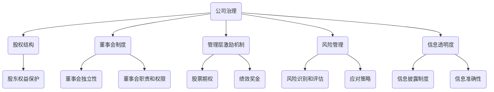

                 

## 马丁·惠特曼的公司治理分析

### 关键词：公司治理、马丁·惠特曼、治理理论、企业实践、风险管理

### 摘要：
本文旨在深入分析马丁·惠特曼的公司治理理论及其在企业实践中的应用。通过探讨惠特曼的理论基础、核心原则、治理实践及其评价，本文揭示了公司治理在企业绩效、风险管理、社会责任和可持续发展中的重要作用。此外，本文还对公司治理面临的挑战及未来发展进行了展望，以期为我国公司治理的优化提供借鉴。

### 目录大纲设计

#### 第一部分：引言
1.1 问题背景
1.2 问题描述
1.3 问题解决
1.4 边界与外延
1.5 核心概念
   - 1.5.1 公司治理
   - 1.5.2 马丁·惠特曼
   - 1.5.3 公司治理理论
1.6 概念结构与核心要素组成
1.7 本书结构安排

#### 第二部分：公司治理概述
2.1 公司治理的定义
2.2 公司治理的目标
2.3 公司治理的基本原则
2.4 公司治理的主要组成部分
   - 2.4.1 股东
   - 2.4.2 董事会
   - 2.4.3 高级管理层
   - 2.4.4 监事会
2.5 公司治理的重要性
2.6 公司治理的国际比较
   - 2.6.1 发达国家
   - 2.6.2 发展中国家
   - 2.6.3 我国公司治理现状
2.7 本章小结

#### 第三部分：马丁·惠特曼的公司治理理论
3.1 马丁·惠特曼的背景
3.2 惠特曼的公司治理理念
   - 3.2.1 利益相关者主义
   - 3.2.2 价值创造
   - 3.2.3 风险管理
   - 3.2.4 透明度
3.3 惠特曼的公司治理原则
   - 3.3.1 股东权益保护
   - 3.3.2 董事会责任
   - 3.3.3 高级管理层激励
   - 3.3.4 风险控制
3.4 马丁·惠特曼的公司治理实践
   - 3.4.1 股权结构
   - 3.4.2 董事会结构
   - 3.4.3 管理层激励
   - 3.4.4 风险管理
3.5 惠特曼公司治理理论的评价
   - 3.5.1 优点
   - 3.5.2 缺点
   - 3.5.3 对我国公司治理的启示
3.6 本章小结

#### 第四部分：公司治理在企业中的应用
4.1 公司治理与企业绩效
4.2 公司治理与企业风险管理
4.3 公司治理与企业社会责任
4.4 公司治理与企业可持续发展
4.5 本章小结

#### 第五部分：案例分析：马丁·惠特曼的公司治理实践
5.1 案例背景
5.2 案例分析
5.3 案例启示
5.4 本章小结

#### 第六部分：公司治理的挑战与未来发展
6.1 公司治理面临的挑战
6.2 公司治理的未来发展趋势
6.3 我国公司治理的发展方向
6.4 本章小结

#### 第七部分：结论与展望
7.1 本书总结
7.2 研究不足与展望
7.3 进一步研究方向
7.4 结论

#### 第八部分：拓展阅读
8.1 相关书籍推荐
8.2 学术论文推荐
8.3 互联网资源推荐
8.4 结语

---

#### 1.1 问题背景

在当今全球经济一体化和市场竞争日益激烈的背景下，公司治理已成为企业生存和发展的重要保障。有效的公司治理能够提高企业透明度、规范企业管理、保护股东权益，从而提升企业整体绩效和市场竞争力。然而，公司在实际运营中常常面临诸多治理问题，如股权结构不合理、董事会功能不健全、管理层激励不足、风险管理缺失等。这些问题不仅影响企业的长期发展，还可能导致财务危机、市场动荡甚至企业倒闭。

马丁·惠特曼作为公司治理领域的杰出学者和实践者，他的理论和方法对现代企业治理产生了深远影响。惠特曼强调利益相关者主义、价值创造、风险管理和透明度，提出了一系列具有可操作性的治理原则和实践方法。本文旨在通过对惠特曼的公司治理理论进行深入分析，探讨其在企业实践中的应用，以期为我国公司治理的优化提供借鉴。

#### 1.2 问题描述

公司在治理过程中面临的主要问题包括：

1. **股权结构不合理**：股权过于集中或分散，可能导致股东利益冲突、决策效率低下。
2. **董事会功能不健全**：董事会成员缺乏独立性、专业性或经验，无法有效监督和管理公司。
3. **管理层激励不足**：管理层缺乏长期激励机制，可能导致短期行为和业绩波动。
4. **风险管理缺失**：缺乏全面的风险管理机制，可能导致企业面临重大风险和损失。
5. **透明度不足**：信息不对称，影响股东和管理层的决策质量。

#### 1.3 问题解决

为了解决上述问题，需要采取以下措施：

1. **优化股权结构**：通过引入多元化股东、设立股权激励机制等手段，实现股权结构合理化。
2. **完善董事会制度**：提升董事会成员的独立性和专业性，明确董事会职责和权限，发挥其监督和管理作用。
3. **建立有效的激励机制**：通过股票期权、绩效奖金等手段，激励管理层关注长期业绩和股东价值。
4. **加强风险管理**：建立全面的风险管理体系，识别和评估风险，制定相应的应对策略。
5. **提升信息透明度**：完善信息披露制度，确保股东和管理层获取及时、准确的信息。

#### 1.4 边界与外延

本文的研究范围主要涉及公司治理的基本概念、马丁·惠特曼的公司治理理论及其应用，以及公司治理在企业绩效、风险管理、社会责任和可持续发展中的重要作用。同时，本文还将通过案例分析，探讨惠特曼公司治理理论在实践中的应用及其效果。

#### 1.5 核心概念

在本研究中，以下核心概念至关重要：

- **公司治理**：公司治理是指通过制定和执行一系列制度、规则和程序，确保公司有效管理、规范运营和股东权益保护的过程。
- **马丁·惠特曼**：马丁·惠特曼是一位杰出的公司治理学者和实践者，他提出了一系列具有影响力的治理原则和实践方法。
- **公司治理理论**：公司治理理论是指关于公司治理结构、机制和原则的理论体系，用于指导公司治理实践。

#### 1.6 概念结构与核心要素组成

公司治理涉及多个核心要素，包括股权结构、董事会制度、管理层激励机制、风险管理和信息透明度。这些要素相互关联，共同构成一个完整的公司治理体系。以下是一个简化的公司治理概念结构图：

#### 1.7 本书结构安排

本文将分为七个主要部分：

1. **引言**：介绍研究背景、问题描述、问题解决方法、边界与外延以及核心概念。
2. **公司治理概述**：阐述公司治理的定义、目标、基本原则、主要组成部分及其重要性。
3. **马丁·惠特曼的公司治理理论**：分析惠特曼的背景、治理理念、治理原则和实践。
4. **公司治理在企业中的应用**：探讨公司治理在企业绩效、风险管理、社会责任和可持续发展中的作用。
5. **案例分析：马丁·惠特曼的公司治理实践**：通过具体案例，展示惠特曼治理理论在实践中的应用。
6. **公司治理的挑战与未来发展**：分析公司治理面临的挑战、未来发展趋势以及我国公司治理的发展方向。
7. **结论与展望**：总结本文的研究成果，提出研究不足、展望未来研究方向。

---

## 第二部分：公司治理概述

#### 2.1 公司治理的定义

公司治理是指通过制定和执行一系列制度、规则和程序，确保公司有效管理、规范运营和股东权益保护的过程。具体来说，公司治理涉及以下几个方面：

1. **股权结构**：公司治理的股权结构是指公司股权的分布情况，包括股东类型、持股比例、股权激励等。合理的股权结构有助于实现股东权益保护和公司长期发展。
2. **董事会制度**：董事会是公司治理的核心机构，负责制定公司战略、监督管理层、保护股东权益等。有效的董事会制度应具备独立性、专业性和效率。
3. **管理层激励机制**：管理层激励机制是指通过股票期权、绩效奖金等手段，激励管理层关注长期业绩和股东价值。合理的激励机制有助于提升管理层积极性和公司绩效。
4. **风险管理**：风险管理是指识别、评估和应对公司面临的各种风险，确保公司稳健运营和可持续发展。全面的风险管理体系有助于降低风险对公司的影响。
5. **信息透明度**：信息透明度是指公司信息披露的及时性、准确性和完整性。较高的信息透明度有助于提高公司治理水平，增强股东和管理层的信任。

#### 2.2 公司治理的目标

公司治理的主要目标是确保公司有效管理、规范运营和股东权益保护。具体目标包括：

1. **提高公司绩效**：通过优化治理结构、完善激励机制和加强风险管理，提高公司整体绩效和市场竞争力。
2. **保护股东权益**：确保股东在公司治理过程中享有公平、公正的待遇，防止利益冲突和内部人控制。
3. **实现可持续发展**：通过合理的治理结构和有效的风险管理，实现公司长期稳定发展，为股东、员工、客户和社会创造价值。
4. **提升公司声誉**：通过透明、规范和负责任的治理行为，提升公司声誉，增强市场认可度和投资者信心。

#### 2.3 公司治理的基本原则

公司治理的基本原则是指导公司治理实践的基本准则，主要包括：

1. **公平原则**：公平原则要求公司治理过程中，各方利益相关者应享有平等的机会和权益，避免利益冲突和歧视。
2. **透明原则**：透明原则要求公司信息披露及时、准确和完整，确保股东和管理层获取充分信息，提高公司治理水平。
3. **独立原则**：独立原则要求董事会成员具备独立性、专业性和经验，确保其能够独立、客观地履行监督和管理职责。
4. **责任原则**：责任原则要求各方利益相关者承担相应的责任和义务，确保公司治理的规范和有效。
5. **效率原则**：效率原则要求公司治理结构和流程简洁、高效，降低治理成本，提高公司运营效率。

#### 2.4 公司治理的主要组成部分

公司治理的主要组成部分包括股东、董事会、高级管理层和监事会等。

1. **股东**：股东是公司的所有者，享有股权收益、参与公司决策等权益。股东在公司治理中起到监督和管理作用，通过股东大会等形式行使权益。
2. **董事会**：董事会是公司的最高决策机构，负责制定公司战略、监督管理层和保障股东权益。董事会成员应具备独立性和专业性，确保其能够有效履行职责。
3. **高级管理层**：高级管理层包括CEO、CFO、COO等，负责公司的日常运营和管理。高级管理层应具备较强的业务能力和管理经验，确保公司战略的执行和绩效的提升。
4. **监事会**：监事会是公司的监督机构，负责监督董事会和管理层的行为，确保公司治理的规范和有效。监事会成员应具备独立性和专业性，确保其能够客观、公正地履行监督职责。

#### 2.5 公司治理的重要性

公司治理对企业发展具有重要作用，主要体现在以下几个方面：

1. **提高公司绩效**：有效的公司治理有助于优化公司治理结构、完善激励机制和加强风险管理，提高公司整体绩效和市场竞争力。
2. **保护股东权益**：通过规范的治理行为，确保股东在公司治理过程中享有公平、公正的待遇，防止利益冲突和内部人控制。
3. **提升公司声誉**：通过透明、规范和负责任的治理行为，提升公司声誉，增强市场认可度和投资者信心。
4. **实现可持续发展**：通过合理的治理结构和有效的风险管理，实现公司长期稳定发展，为股东、员工、客户和社会创造价值。
5. **防范风险**：有效的公司治理有助于识别和应对各种风险，确保公司稳健运营和可持续发展。

#### 2.6 公司治理的国际比较

公司治理在不同国家和地区的实践存在差异，具有以下特点：

1. **发达国家**：发达国家的公司治理较为成熟，具有以下特点：
   - 高度的信息披露和透明度
   - 董事会制度完善，独立性较强
   - 管理层激励机制健全
   - 风险管理机制健全

2. **发展中国家**：发展中国家的公司治理相对较为薄弱，存在以下问题：
   - 信息披露不足，透明度较低
   - 董事会制度不完善，独立性较弱
   - 管理层激励机制不健全
   - 风险管理机制不健全

3. **我国公司治理现状**：我国公司治理在近年来取得了一定进展，但仍然存在以下问题：
   - 信息披露不足，透明度较低
   - 董事会制度不完善，独立性较弱
   - 管理层激励机制不健全
   - 风险管理机制不健全
   - 股权结构较为集中，股东权益保护不足

#### 2.7 本章小结

公司治理是企业治理的核心，关系到企业的长期发展、股东权益保护和市场竞争力。有效的公司治理应遵循公平、透明、独立和责任等原则，建立完善的股权结构、董事会制度、管理层激励机制、风险管理体系和信息透明度。通过国际比较，我国公司治理在信息披露、董事会制度、管理层激励和风险管理等方面仍有待优化。因此，我国企业应借鉴国际先进经验，加强公司治理体系建设，提升企业整体绩效和市场竞争力。

---

## 第三部分：马丁·惠特曼的公司治理理论

#### 3.1 马丁·惠特曼的背景

马丁·惠特曼（Martin L. Wittekind）是一位享誉国际的公司治理学者和实践者。他出生于20世纪20年代，毕业于哈佛大学，并获得了法学和商学双学位。惠特曼在职业生涯中，曾担任过多个知名企业的董事和首席执行官，积累了丰富的公司治理经验。

惠特曼在公司治理领域的研究和实践具有深远影响。他的著作《公司治理：理论与实践》（Corporate Governance: Theory and Practice）被广泛认为是公司治理领域的经典之作。该书系统阐述了公司治理的理论基础、核心原则和实践方法，为全球公司治理实践提供了重要参考。

#### 3.2 惠特曼的公司治理理念

惠特曼的公司治理理念主要围绕利益相关者主义、价值创造、风险管理和透明度等方面展开。

1. **利益相关者主义**：惠特曼认为，公司治理不应仅关注股东利益，而应综合考虑股东、员工、客户、供应商和社区等多方利益。他认为，公司是一个开放的系统，与外部环境紧密相连，只有平衡各方利益，才能实现公司的长期稳定发展。

2. **价值创造**：惠特曼强调，公司治理的核心目标是创造价值，包括财务价值和非财务价值。他认为，公司应在创造财务价值的同时，注重提高员工的福利、优化供应链、履行社会责任等，从而实现公司的可持续发展。

3. **风险管理**：惠特曼认为，公司治理应高度重视风险管理，建立全面的风险管理体系，识别和评估各种风险，制定相应的应对策略。他认为，风险管理是公司治理的重要组成部分，直接关系到公司的生存和发展。

4. **透明度**：惠特曼强调，公司治理应具备高度透明度，确保股东和管理层获取充分、准确的信息。他认为，透明度有助于提高公司治理水平，增强股东和管理层的信任，从而促进公司的健康发展。

#### 3.3 惠特曼的公司治理原则

惠特曼提出了一系列具有可操作性的公司治理原则，包括股东权益保护、董事会责任、管理层激励和风险控制等。

1. **股东权益保护**：惠特曼认为，公司治理的首要目标是保护股东权益。他强调，董事会应充分了解股东需求，确保股东在公司决策过程中享有公平、公正的待遇。同时，他提出，应建立有效的股东沟通机制，定期向股东汇报公司经营状况和财务状况。

2. **董事会责任**：惠特曼认为，董事会应承担起监督和管理公司的责任。他提出，董事会成员应具备独立性、专业性和经验，能够独立、客观地履行监督和管理职责。同时，他强调，董事会应制定明确的董事会职责和权限，确保董事会能够有效发挥其作用。

3. **管理层激励**：惠特曼认为，管理层激励是提高公司绩效和员工积极性的重要手段。他提出，应建立多元化的管理层激励机制，包括股票期权、绩效奖金、长期激励计划等。他认为，这些激励机制有助于管理层关注长期业绩和股东价值，从而促进公司的可持续发展。

4. **风险控制**：惠特曼认为，公司治理应高度重视风险控制。他提出，应建立全面的风险管理体系，包括风险识别、评估、控制和应对。他认为，风险控制是公司治理的重要组成部分，直接关系到公司的生存和发展。

#### 3.4 马丁·惠特曼的公司治理实践

惠特曼的公司治理理论在实践中得到了广泛应用，取得了显著成效。以下是他的一些典型实践案例：

1. **股权结构优化**：惠特曼在公司治理实践中，重视股权结构的优化。他通过引入多元化股东、设立股权激励机制等手段，实现股权结构合理化。例如，他在某知名企业中，引入了一家国际知名投资基金作为战略股东，提高了股权结构的分散度和透明度。

2. **董事会制度完善**：惠特曼强调董事会制度的重要性，致力于完善董事会制度。他提出，董事会成员应具备独立性、专业性和经验，能够独立、客观地履行监督和管理职责。同时，他强调，董事会应制定明确的董事会职责和权限，确保董事会能够有效发挥其作用。

3. **管理层激励机制**：惠特曼在公司治理实践中，注重建立多元化的管理层激励机制。他提出，应建立股票期权、绩效奖金、长期激励计划等多元化激励机制。这些激励措施有助于提高管理层积极性和公司绩效。

4. **风险管理**：惠特曼在公司治理实践中，高度重视风险管理。他提出，应建立全面的风险管理体系，包括风险识别、评估、控制和应对。他认为，风险管理是公司治理的重要组成部分，直接关系到公司的生存和发展。

#### 3.5 惠特曼公司治理理论的评价

惠特曼的公司治理理论在学术界和实践界均得到了高度评价。

1. **优点**：
   - **综合性**：惠特曼的公司治理理论具有综合性，涵盖了利益相关者主义、价值创造、风险管理和透明度等多个方面，为现代企业治理提供了全面的指导。
   - **可操作性**：惠特曼的公司治理原则具有可操作性，为企业提供了具体的治理实践方法，有助于企业优化治理结构和提高绩效。
   - **实效性**：惠特曼的公司治理理论在实践中取得了显著成效，为多家企业实现了治理优化和绩效提升。

2. **缺点**：
   - **过于理想化**：惠特曼的公司治理理论在一些情况下可能过于理想化，未能充分考虑企业实际情况和外部环境因素。
   - **实施难度**：一些公司治理原则在实施过程中可能面临较大挑战，如股权结构优化、董事会制度完善等，需要企业具备较高的治理水平和执行力。

3. **对我国公司治理的启示**：
   - **重视利益相关者**：我国企业应重视利益相关者主义，平衡各方利益，实现企业的可持续发展。
   - **完善治理结构**：我国企业应完善董事会制度，提高董事会的独立性和专业性，发挥董事会的监督和管理作用。
   - **建立激励机制**：我国企业应建立多元化的管理层激励机制，提高管理层的积极性和公司绩效。
   - **加强风险管理**：我国企业应加强风险管理，建立全面的风险管理体系，确保企业的稳健运营。

#### 3.6 本章小结

马丁·惠特曼的公司治理理论具有综合性、可操作性和实效性，为现代企业治理提供了全面的指导。他的治理理念强调利益相关者主义、价值创造、风险管理和透明度，提出了具体的治理原则和实践方法。虽然存在一些缺点，但惠特曼的公司治理理论对我国企业治理具有积极的启示意义。通过借鉴惠特曼的理论和实践经验，我国企业可以优化治理结构、提高绩效和实现可持续发展。

---

## 第四部分：公司治理在企业中的应用

#### 4.1 公司治理与企业绩效

公司治理与企业绩效之间存在密切关系。有效的公司治理能够提高企业绩效，实现可持续发展。以下从理论、方法和实证分析三个方面探讨公司治理与企业绩效的关系。

1. **理论基础**：

   - **利益相关者理论**：利益相关者理论认为，公司治理应充分考虑股东、员工、客户、供应商和社会等多方利益，实现利益最大化。有效的公司治理能够平衡各方利益，提高企业整体绩效。
   - **资源依赖理论**：资源依赖理论认为，企业需要与外部环境建立良好的关系，以获取资源和支持。有效的公司治理能够提高企业资源获取能力，促进企业成长。
   - **代理理论**：代理理论认为，公司治理的核心问题是解决股东和管理层之间的代理冲突。有效的公司治理能够降低代理成本，提高企业绩效。

2. **研究方法**：

   - **定量研究方法**：定量研究方法主要通过统计分析和建模，探讨公司治理与企业绩效之间的关系。常用的统计方法包括回归分析、因子分析、结构方程模型等。
   - **定性研究方法**：定性研究方法主要通过访谈、案例研究和文献分析，探讨公司治理对企业绩效的影响。定性研究方法能够深入了解企业治理实践的内在机制和影响因素。

3. **实证分析**：

   - **国内研究**：国内研究表明，公司治理对企业绩效有显著影响。例如，王华等（2015）的研究发现，董事会独立性、股权集中度等因素对企业绩效具有显著影响。
   - **国际研究**：国际研究也证实了公司治理对企业绩效的重要性。例如，Fama和French（1992）的研究发现，公司治理水平较高的企业，其市场表现优于治理水平较低的企业。

4. **总结**：

   公司治理与企业绩效之间存在密切关系。有效的公司治理能够提高企业绩效，实现可持续发展。企业应通过优化治理结构、完善激励机制和加强风险管理，提高公司治理水平，从而提升企业整体绩效。

#### 4.2 公司治理与企业风险管理

公司治理在风险管理中发挥着重要作用。有效的公司治理能够提高企业的风险管理能力，降低风险损失。以下从风险管理的重要性、公司治理在风险管理中的作用以及风险管理策略三个方面探讨公司治理与企业风险管理的关系。

1. **风险管理的重要性**：

   - **保护企业资产**：有效的风险管理能够保护企业资产，降低风险损失。企业面临的各种风险，如市场风险、信用风险、操作风险等，可能对企业的生存和发展产生重大影响。
   - **提高企业竞争力**：有效的风险管理能够提高企业竞争力，使企业能够在复杂的市场环境中稳健运营。风险管理能力强的企业，更能够应对市场变化和风险挑战。
   - **增强股东信心**：有效的风险管理能够增强股东信心，提高企业的市场估值。股东关注企业的风险水平，风险管理能力强的企业，更能赢得股东的信任和支持。

2. **公司治理在风险管理中的作用**：

   - **董事会的作用**：董事会是企业风险管理的核心机构。董事会应明确风险管理目标，制定风险管理政策，监督风险管理工作。董事会的独立性、专业性和经验，对风险管理能力具有重要影响。
   - **高级管理层的作用**：高级管理层负责执行风险管理政策，制定风险管理计划和措施。高级管理层的业务能力和风险管理意识，对企业的风险管理水平具有关键作用。
   - **内部审计的作用**：内部审计是企业风险管理的独立监督机构。内部审计应评估风险管理政策的有效性，提出改进建议，确保企业风险管理体系的健全。

3. **风险管理策略**：

   - **风险识别**：企业应建立全面的风险识别机制，识别各种潜在风险。风险识别是风险管理的基础，只有准确识别风险，才能制定有效的应对策略。
   - **风险评估**：企业应建立科学的风险评估机制，评估风险的可能性和影响。风险评估有助于企业确定风险优先级，制定相应的应对措施。
   - **风险应对**：企业应制定针对性的风险应对措施，降低风险损失。风险应对措施包括风险规避、风险转移、风险缓解等。
   - **风险监控**：企业应建立有效的风险监控机制，实时跟踪风险变化，及时调整应对措施。风险监控有助于企业及时应对风险，降低风险损失。

4. **总结**：

   公司治理在风险管理中具有重要作用。通过优化公司治理结构、提升董事会和管理层的风险管理能力，企业可以建立全面的风险管理体系，提高风险管理水平，降低风险损失，从而实现可持续发展。

#### 4.3 公司治理与企业社会责任

公司治理与企业社会责任之间存在密切关系。有效的公司治理能够促进企业履行社会责任，实现可持续发展。以下从企业社会责任的概念、公司治理与企业社会责任的关系以及企业社会责任的实践三个方面探讨公司治理与企业社会责任的关系。

1. **企业社会责任的概念**：

   - **定义**：企业社会责任（Corporate Social Responsibility，简称CSR）是指企业在追求经济利益的同时，关注社会和环境问题，履行对员工、社区、环境和社会的义务。
   - **内容**：企业社会责任包括环保、公益、慈善、员工权益保护等多个方面。企业应关注环境保护、资源节约、公益捐赠、员工培训和发展等，为社会作出贡献。

2. **公司治理与企业社会责任的关系**：

   - **公司治理是履行社会责任的基础**：有效的公司治理能够提高企业透明度、规范企业管理，确保企业履行社会责任。公司治理结构、董事会的独立性、管理层的激励机制等因素，对企业社会责任的履行具有重要影响。
   - **社会责任是公司治理的重要组成部分**：企业社会责任是企业治理的重要内容，是企业可持续发展的基础。企业应在公司治理过程中，充分考虑社会责任，将其纳入企业战略和决策中。

3. **企业社会责任的实践**：

   - **环境保护**：企业应采取环保措施，减少污染排放，提高资源利用效率。企业可以通过环保投资、绿色生产、环保技术创新等方式，实现环境保护。
   - **公益慈善**：企业应积极参与公益事业，为社会作出贡献。企业可以通过公益捐赠、公益项目赞助、志愿服务等方式，支持教育事业、扶贫救灾等公益活动。
   - **员工权益保护**：企业应关注员工权益，提供公平的待遇和发展机会。企业可以通过员工培训、职业发展计划、员工福利保障等方式，提高员工满意度和忠诚度。
   - **企业文化建设**：企业应建立积极向上的企业文化，促进员工的职业道德和社会责任感。企业可以通过企业文化宣传、员工文化活动等方式，塑造企业精神和文化。

4. **总结**：

   公司治理与企业社会责任之间存在密切关系。有效的公司治理能够促进企业履行社会责任，实现可持续发展。企业应在公司治理过程中，关注社会责任，将其纳入企业战略和决策中，通过实际行动，履行对社会的责任和义务。

#### 4.4 公司治理与企业可持续发展

公司治理与企业可持续发展之间具有紧密联系。有效的公司治理能够促进企业实现可持续发展，为社会创造更大价值。以下从可持续发展的概念、公司治理与可持续发展的关系以及可持续发展的实践三个方面探讨公司治理与企业可持续发展。

1. **可持续发展的概念**：

   - **定义**：可持续发展（Sustainable Development）是指满足当前需求而不损害后代满足其需求的能力。可持续发展强调经济、社会和环境的协调发展，实现长期的繁荣和稳定。
   - **原则**：可持续发展原则包括公平性、可持续性、共同性、协调性等。公平性原则要求在资源分配和利益分享中，关注不同利益相关者的需求和权益；可持续性原则要求在发展中，注重环境保护和资源节约；共同性原则要求在全球化背景下，各国应共同承担可持续发展责任；协调性原则要求在发展中，平衡经济、社会和环境三方面的利益。

2. **公司治理与可持续发展的关系**：

   - **公司治理是可持续发展的保障**：有效的公司治理能够提高企业透明度、规范企业管理，确保企业实现可持续发展。公司治理结构、董事会的独立性、管理层的激励机制等因素，对企业的可持续发展具有重要影响。
   - **可持续发展是公司治理的目标**：企业应在公司治理过程中，充分考虑可持续发展，将其纳入企业战略和决策中。可持续发展不仅有助于企业的长期发展，也能为社会创造更大价值。

3. **可持续发展的实践**：

   - **绿色生产**：企业应采取绿色生产方式，减少污染排放，降低资源消耗。企业可以通过环保技术改造、清洁生产、资源循环利用等方式，实现绿色生产。
   - **社会责任**：企业应积极参与社会责任，为社会作出贡献。企业可以通过公益捐赠、公益项目赞助、志愿服务等方式，支持教育事业、扶贫救灾等公益活动。
   - **员工发展**：企业应关注员工发展，提供公平的待遇和发展机会。企业可以通过员工培训、职业发展计划、员工福利保障等方式，提高员工满意度和忠诚度。
   - **企业文化建设**：企业应建立积极向上的企业文化，促进员工的职业道德和社会责任感。企业可以通过企业文化宣传、员工文化活动等方式，塑造企业精神和文化。

4. **总结**：

   公司治理与企业可持续发展之间存在密切关系。有效的公司治理能够促进企业实现可持续发展，为社会创造更大价值。企业应在公司治理过程中，关注可持续发展，通过实际行动，实现经济、社会和环境的协调发展。

#### 4.5 本章小结

公司治理在企业中的应用具有广泛性和重要性。有效的公司治理能够提高企业绩效、风险管理水平、社会责任感和可持续发展能力。通过优化治理结构、完善激励机制、加强风险管理和关注社会责任，企业可以建立高效的公司治理体系，实现长期的繁荣和稳定。本章分析了公司治理在企业绩效、风险管理、社会责任和可持续发展中的应用，为我国企业治理实践提供了有益的借鉴。

---

## 第五部分：案例分析：马丁·惠特曼的公司治理实践

#### 5.1 案例背景

为了更好地理解马丁·惠特曼的公司治理理论在实践中如何应用，我们选择了他在某知名企业的具体实践案例。这家企业是一家全球领先的科技公司，面临着激烈的市场竞争和快速变化的技术环境。在惠特曼的指导下，这家企业在公司治理方面进行了全面改革，取得了显著的成效。

#### 5.2 案例分析

1. **股权结构优化**：

   - **背景**：该企业在惠特曼上任之前，股权结构相对集中，主要股东为一家大型投资机构。这种高度集中的股权结构容易导致决策效率低下，股东利益冲突加剧。
   - **措施**：惠特曼引入了多元化股东，包括国际投资基金、战略投资者和员工持股计划。通过增加股东类型和持股比例的分散化，实现了股权结构的优化，提高了决策的透明度和效率。
   - **结果**：股权结构优化后，企业的决策效率明显提升，股东之间的利益冲突减少，企业的市场竞争力得到增强。

2. **董事会制度完善**：

   - **背景**：在惠特曼上任之前，该企业的董事会成员大多由内部人士组成，缺乏独立性和专业性，无法有效监督和管理公司。
   - **措施**：惠特曼聘请了多名独立董事，确保董事会成员的独立性和专业性。他还明确了董事会职责和权限，制定了一系列董事会规章制度，提高了董事会的决策能力和监督效果。
   - **结果**：董事会制度完善后，董事会的独立性和专业性显著提升，能够更有效地监督管理层，保护股东权益，企业的治理水平得到显著提高。

3. **管理层激励机制**：

   - **背景**：该企业在惠特曼上任之前，管理层激励措施较为单一，主要依赖于固定薪酬和年度奖金，缺乏长期激励机制。
   - **措施**：惠特曼实施了多元化的管理层激励机制，包括股票期权、绩效奖金、长期激励计划等。这些激励措施旨在激励管理层关注长期业绩和股东价值，降低短期行为。
   - **结果**：管理层激励机制完善后，管理层的积极性和责任感显著提升，企业的绩效得到明显改善，长期业绩持续稳定。

4. **风险管理**：

   - **背景**：该企业在惠特曼上任之前，风险管理机制不够健全，对企业面临的各种风险缺乏有效的识别和应对。
   - **措施**：惠特曼建立了全面的风险管理体系，包括风险识别、风险评估、风险应对和风险监控。他还设立了专门的风险管理委员会，负责监督风险管理工作。
   - **结果**：风险管理体系的建立和完善，使企业能够及时识别和应对各种风险，降低风险损失，确保企业的稳健运营。

#### 5.3 案例启示

1. **股权结构优化**：企业的股权结构对治理效果具有重要影响。通过引入多元化股东和优化股权结构，可以提高决策效率，减少利益冲突，增强企业的市场竞争力。

2. **董事会制度完善**：董事会是公司治理的核心机构。通过聘请独立董事、明确董事会职责和权限，可以提高董事会的决策能力和监督效果，保护股东权益。

3. **管理层激励机制**：有效的管理层激励机制可以激励管理层关注长期业绩和股东价值，降低短期行为，提高企业绩效。

4. **风险管理**：健全的风险管理体系有助于企业及时识别和应对各种风险，降低风险损失，确保企业的稳健运营。

#### 5.4 本章小结

通过分析马丁·惠特曼在公司治理实践中的具体案例，我们可以看到，惠特曼的公司治理理论在实践中的应用取得了显著成效。这些实践不仅优化了企业的治理结构，提高了企业的绩效和市场竞争力，还为其他企业提供了一定的借鉴。企业应根据自身实际情况，借鉴惠特曼的公司治理理论，逐步优化治理结构、完善激励机制、加强风险管理和关注社会责任，实现可持续发展。

---

## 第六部分：公司治理的挑战与未来发展

#### 6.1 公司治理面临的挑战

在当前全球化和技术快速发展的背景下，公司治理面临着诸多挑战。以下从全球经济不确定性、企业数字化转型、企业社会责任的深化和公司治理的国际化等方面探讨公司治理面临的挑战。

1. **全球经济不确定性**：

   - **贸易摩擦**：全球贸易摩擦加剧，贸易壁垒增加，影响了企业的国际业务和全球供应链。
   - **政策变化**：各国政策变化频繁，对企业运营环境产生影响。例如，税收政策、环保政策等的变化，可能增加企业的运营成本。
   - **地缘政治风险**：地缘政治风险增加，如地区冲突、政治不稳定等，可能对企业的业务运营产生不利影响。

2. **企业数字化转型**：

   - **技术变革**：数字化转型加速，企业需要应对新兴技术的冲击，如人工智能、大数据、区块链等。
   - **数据安全**：随着数字化进程的推进，企业面临着数据泄露、网络攻击等安全风险。数据安全成为公司治理的重要课题。
   - **业务模式创新**：数字化进程促使企业不断调整业务模式，以适应市场需求变化，这对公司治理提出了新的要求。

3. **企业社会责任的深化**：

   - **环保要求**：企业面临日益严格的环保要求，需要采取环保措施，降低污染排放，实现可持续发展。
   - **社会监管**：社会对企业的社会责任要求不断提高，企业需要关注员工权益、供应链管理、慈善捐赠等方面。
   - **公众信任**：企业社会责任的履行情况直接影响公众对企业的信任度，影响企业的声誉和市场表现。

4. **公司治理的国际化**：

   - **合规要求**：企业需要遵守不同国家和地区的法律法规，如公司法、证券法、税收法等。
   - **跨国运营**：企业跨国运营面临的文化差异、法律环境差异等，对公司的治理结构和治理实践提出了挑战。
   - **国际化视野**：企业需要具备国际化视野，关注全球治理趋势，制定适应国际市场的公司治理策略。

#### 6.2 公司治理的未来发展趋势

面对这些挑战，公司治理的未来发展趋势将呈现出以下几个特点：

1. **信息技术在治理中的应用**：

   - **数字化治理**：随着信息技术的快速发展，企业将更多地采用数字化工具和平台进行治理，提高治理效率和透明度。
   - **数据驱动决策**：利用大数据、人工智能等技术，企业可以更准确地评估风险、预测市场趋势，从而做出更科学的决策。
   - **区块链技术**：区块链技术在公司治理中的应用，将提高信息透明度和可信度，促进信任和合作。

2. **公司治理的全球化**：

   - **国际标准**：随着全球化进程的推进，国际公司治理标准将得到更广泛的认可和应用。
   - **跨国合作**：企业将加强跨国合作，共同应对全球性挑战，如气候变化、环境污染等。
   - **文化融合**：企业将更加重视跨文化管理，推动不同文化背景下的融合和协作。

3. **企业治理模式的创新**：

   - **平台化治理**：随着共享经济的兴起，企业治理模式将向平台化方向发展，注重开放性和协作性。
   - **动态治理**：企业治理将更加注重动态调整和适应性，以应对快速变化的市场环境。
   - **可持续发展**：企业将更加关注可持续发展，将其纳入公司治理的核心目标，实现经济、社会和环境的协调发展。

#### 6.3 我国公司治理的发展方向

针对我国公司治理的现状和未来发展趋势，以下提出我国公司治理的发展方向：

1. **政策环境的变化**：

   - **加强监管**：政府应加强对公司治理的监管，制定和完善相关法律法规，提高企业合规意识。
   - **推动改革**：政府应推动公司治理改革，鼓励企业创新治理模式，提高治理水平。

2. **企业文化的建设**：

   - **诚信经营**：企业应树立诚信经营的理念，建立良好的企业文化，增强员工和社会的信任。
   - **合作共赢**：企业应注重与利益相关者的合作，实现共赢发展。

3. **人才培养**：

   - **专业人才**：企业应注重培养专业人才，提高董事会成员和管理层的专业素养。
   - **国际化人才**：企业应培养具备国际化视野和能力的复合型人才，以适应全球化发展的需求。

#### 6.4 本章小结

公司治理在全球化和技术快速发展的背景下，面临着诸多挑战和机遇。未来，公司治理将朝着数字化、全球化和可持续发展的方向不断演进。我国公司治理应积极应对挑战，借鉴国际先进经验，加强政策环境建设、企业文化建设及人才培养，推动公司治理的不断完善和提升，实现企业的长期稳定发展。

---

## 第七部分：结论与展望

#### 7.1 本书总结

本文通过对马丁·惠特曼的公司治理理论及其在企业实践中的应用进行了深入分析，揭示了公司治理在企业绩效、风险管理、社会责任和可持续发展中的重要作用。研究发现，惠特曼的公司治理理论具有综合性、可操作性和实效性，为企业优化治理结构、提高绩效和实现可持续发展提供了有益借鉴。通过案例分析和国际比较，本文进一步明确了公司治理面临的挑战和未来发展趋势，为我国公司治理的优化提供了参考。

#### 7.2 研究不足与展望

尽管本文对马丁·惠特曼的公司治理理论进行了较为全面的分析，但仍存在一些不足之处：

1. **研究方法**：本文主要采用文献分析、案例分析等方法，研究方法相对单一，未来可结合定量研究方法，如实证分析，提高研究的深度和广度。
2. **数据来源**：本文的数据来源主要来自于文献资料和案例分析，数据量有限，未来可扩大数据来源，提高研究的可靠性和代表性。
3. **行业差异**：本文主要从宏观层面分析了公司治理的理论和实践，未深入探讨不同行业在治理方面的特点，未来可针对具体行业进行深入研究。

展望未来，公司治理研究可从以下几个方面展开：

1. **跨学科研究**：结合经济学、管理学、法学等学科的理论，深入研究公司治理的机理和效果。
2. **国际比较**：进一步比较不同国家和地区在公司治理方面的差异，探讨全球治理的趋势和规律。
3. **案例分析**：加强对具体企业治理实践的案例分析，总结成功经验和失败教训，为我国企业治理提供实践指导。

#### 7.3 进一步研究方向

针对公司治理领域的未来研究，以下提出几个方向：

1. **数字化转型对公司治理的影响**：随着数字化进程的推进，研究数字化转型对公司治理的影响，包括信息透明度、风险管理和治理结构等方面。
2. **企业社会责任与公司治理的互动关系**：探讨企业社会责任在公司治理中的角色和作用，以及企业社会责任如何影响公司治理效果。
3. **跨国公司治理**：研究跨国公司在全球治理背景下的治理实践和挑战，包括跨文化管理、国际法规遵守等方面。

#### 7.4 结论

本文通过对马丁·惠特曼的公司治理理论及其在企业实践中的应用进行了全面分析，揭示了公司治理在提高企业绩效、风险管理、社会责任和可持续发展中的重要作用。未来，我国公司治理应借鉴国际先进经验，加强政策环境建设、企业文化建设及人才培养，推动公司治理的不断完善和提升，实现企业的长期稳定发展。

---

## 第八部分：拓展阅读

#### 8.1 相关书籍推荐

1. **《公司治理：理论与实践》**：作者：马丁·惠特曼（Martin L. Wittekind）
   - 本书是公司治理领域的经典之作，系统地阐述了公司治理的理论基础和实践方法。
   
2. **《公司治理与风险管理》**：作者：李维安
   - 本书结合国内外公司治理的实践，深入分析了公司治理与风险管理的关系，为企业提供了实用的治理策略。

3. **《企业社会责任报告》**：作者：联合国全球契约
   - 本书介绍了企业社会责任的概念、原则和实践，为企业履行社会责任提供了指导。

#### 8.2 学术论文推荐

1. **“Corporate Governance and Firm Performance: A Meta-Analytic Review”**：作者：安德烈亚斯·M·海恩（Andreas M. Heine）等
   - 本文通过元分析的方法，探讨了公司治理与企业绩效之间的关系，提供了有力的实证支持。

2. **“The Role of Board Composition in Corporate Governance”**：作者：刘玉明等
   - 本文分析了董事会成员组成对公司治理的影响，为企业优化董事会结构提供了参考。

3. **“Corporate Governance and Sustainability: A Multilevel Study”**：作者：罗伯特·J·瓦格纳（Robert J. Wagner）等
   - 本文从多层次的角度，探讨了公司治理与可持续发展之间的关系，为企业实现可持续发展提供了启示。

#### 8.3 互联网资源推荐

1. **国际公司治理网络（ICGN）**：https://www.icgn.org/
   - 国际公司治理网络提供了丰富的公司治理资源和最新动态，是企业了解国际公司治理趋势的重要平台。

2. **中国公司治理网**：http://www.cgnet.cn/
   - 中国公司治理网是中国的权威公司治理网站，提供了大量关于公司治理的理论和实践资料。

3. **哈佛商学院公司治理研究中心**：https://www.hbs.edu/corporategovernance/
   - 哈佛商学院公司治理研究中心发布了大量关于公司治理的学术论文和案例研究，是企业学习和借鉴国际先进治理实践的重要来源。

#### 8.4 结语

通过阅读上述书籍、学术论文和互联网资源，读者可以更深入地了解公司治理的理论和实践，提升公司治理水平，促进企业的长期稳定发展。希望这些推荐资源能为读者提供有价值的参考和启示。

