                 

### Introduction to the Book and Background

#### Chapter 1: Introduction to Focused Value Investing and Mario Gabelli

**关键词**: Focused Value Investing, Mario Gabelli, Investment Strategy

**摘要**: This chapter provides an overview of Focused Value Investing and introduces Mario Gabelli, the renowned investor and author of the book. It discusses the historical context and significance of this investment approach, along with a brief biography of Mario Gabelli and his investment philosophy.

**Content Outline**:

1. **Introduction to Focused Value Investing**
   - Definition and Core Principles
   - Historical Background and Evolution
   - Key Differences from Traditional Value Investing

2. **Mario Gabelli: The Visionary Investor**
   - Early Life and Educational Background
   - Investment Career and Achievements
   - Philosophy and Unique Strategies

3. **The Significance of Focused Value Investing**
   - Advantages and Challenges
   - Impact on Portfolio Performance
   - Importance for Modern Investors

**Background Introduction**:

**Core Concepts, Terms, and Definitions**:
- Focused Value Investing: A strategy that involves selecting a limited number of high-quality, undervalued stocks, focusing on in-depth research and long-term investment.
- Mario Gabelli: An American investor, fund manager, and the founder of Gamco Investors, known for his concentrated investment approach and long-term investment horizon.

**Problem Background and Description**:
The landscape of modern investing is characterized by a vast array of strategies and methodologies. Among these, Focused Value Investing stands out for its concentrated portfolio approach, which aims to maximize returns by focusing on a small number of high-quality stocks.

**Problem Solution**:
Mario Gabelli’s book, "马里奥·加贝利的焦点价值投资：集中持股的艺术," provides a comprehensive guide to this strategy. It delves into the nuances of focused value investing, highlighting its principles, advantages, and practical applications.

**Boundary and Extension**:
While focused value investing is a specific investment approach, its principles can be extended to other areas of finance and investment. The book also discusses how these strategies can be adapted to different market conditions and investor profiles.

**Conceptual Structure and Core Elements**:
- **Core Concepts**: Focus, Value, Quality, Long-term Investment Horizon
- **Relationships**: Focused Value Investing is interconnected with traditional value investing but diverges in its concentration approach. It also relates to long-term investing and portfolio management.

**Figure ER Diagram**:
```
+--------------+      +---------------+      +--------------+
|  Focused     |      |   Traditional  |      |  Long-term   |
| Value        |------>| Value          |------>| Investing    |
| Investing    |      | Investing      |      |               |
+--------------+      +---------------+      +--------------+
      ^               |                     |
      |               |                     |
      |               |                     |
  Quality Focus      |  Concentration       |  Time Horizon
      |               |                     |
      |               |                     |
      +--------------+      +---------------+
                 |                     |
                 |                     |
                 |                     |
               Research                Management
                 |                     |
                 |                     |
                 +---------------------+
                        |
                        |
                High-Quality Stocks
```

**Algorithm Principle Explanation**:
While the book does not directly discuss algorithms, the principles of focused value investing can be likened to a decision-making algorithm. Here’s a simplified explanation using a Mermaid flowchart:

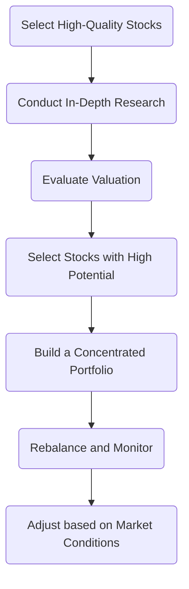

**Mathematical Model and Formula**:
Although not central to the book's content, the concept of value can be quantified using the following formula:

$$
\text{Intrinsic Value} = \frac{\text{Present Value of Future Cash Flows}}{\text{Discount Rate}}
$$

**System Analysis and Architecture Design**:
The investment process outlined in the book can be viewed as a systematic approach to portfolio management. Here’s a conceptual framework using Mermaid diagrams:

**System Function Design (Domain Model Class Diagram)**:
```mermaid
classDiagram
    class Investor
        +String name
        +String investmentStrategy
    class Stock
        +String symbol
        +Float marketPrice
        +Float intrinsicValue
    class Portfolio
        +List<Stock> stocks
        +Float totalValue
        +Float focusFactor

    Investor --> Portfolio
    Investor --> Stock
    Portfolio --> Stock
```

**System Architecture Design (Architecture Diagram)**:
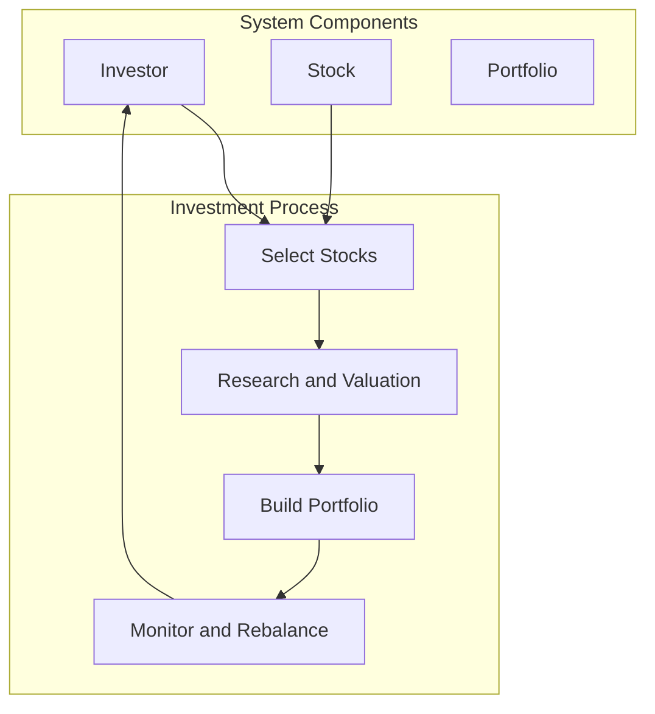

**System Interface Design and Interaction (Sequence Diagram)**:
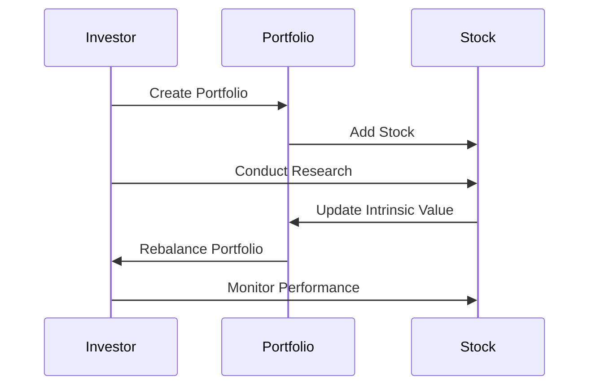

### Core Concepts and Theories

#### Chapter 2: The Concept of Focused Value Investing

**关键词**: Focused Value Investing, Concept, Theory, Origin, Strategies

**摘要**: This chapter delves into the fundamental concepts and theories underlying Focused Value Investing. It explains the origins of this investment strategy, its core principles, and how it differs from traditional value investing. The chapter also explores the key strategies employed in focused value investing and their application in modern financial markets.

**Content Outline**:

1. **The Origin and Development of Focused Value Investing**
   - Historical Background
   - The Evolution of Investment Strategies
   - Influential Figures and Theories

2. **Core Principles of Focused Value Investing**
   - The Focus Factor
   - Value and Quality Investing
   - Long-Term Investment Horizon

3. **Differences from Traditional Value Investing**
   - Concentration vs. Diversification
   - In-Depth Research vs. Surface-Level Analysis
   - Risk Management Approaches

4. **Key Strategies in Focused Value Investing**
   - Stock Selection Criteria
   - Conducting In-Depth Research
   - Portfolio Construction and Management
   - Adjusting to Market Conditions

**Background Introduction**:

**Core Concepts, Terms, and Definitions**:
- **Focused Value Investing**: An investment strategy that involves selecting a small number of high-quality, undervalued stocks, focusing on long-term growth and income.
- **Focus Factor**: A measure of the degree to which a company's business and growth prospects align with the investor's interests and criteria.
- **Value Investing**: A strategy that involves identifying undervalued assets in the market and buying them with the expectation that their market value will increase over time.
- **Quality Investing**: An approach that emphasizes investing in companies with strong financial health, reliable growth, and good management.

**Problem Background and Description**:
Investment strategies have evolved significantly over time, with various methodologies emerging to cater to different market conditions and investor preferences. Focused Value Investing stands out for its concentrated approach, which aims to maximize returns by focusing on a select few high-quality stocks.

**Problem Solution**:
The book "马里奥·加贝利的焦点价值投资：集中持股的艺术" provides a detailed explanation of focused value investing, breaking down its core principles and strategies. It outlines how this approach can be effectively applied in today's dynamic financial markets.

**Boundary and Extension**:
While focused value investing is a specific investment strategy, its principles can be extended to other areas of finance and investment. The chapter also discusses how these strategies can be adapted to different market conditions and investor profiles.

**Conceptual Structure and Core Elements**:
- **Core Concepts**: Focus, Value, Quality, Long-term Investment Horizon
- **Relationships**: Focused Value Investing is interconnected with traditional value investing and quality investing but diverges in its concentration approach. It also relates to portfolio management and risk management.

**Figure ER Diagram**:
```mermaid
classDiagram
    class Company
        +String name
        +Float marketValue
    class Investor
        +String name
        +Float investmentAmount
    class Stock
        +String symbol
        +Float marketPrice
        +Float intrinsicValue
    class Portfolio
        +List<Stock> stocks
        +Float totalValue
    class Strategy
        +String type
    Company --> Stock
    Investor --> Portfolio
    Portfolio --> Stock
    Portfolio --> Strategy
    Stock --> Company
```

**Algorithm Principle Explanation**:
The concept of focused value investing can be likened to a multi-step decision-making algorithm. Here’s a simplified explanation using a Mermaid flowchart:

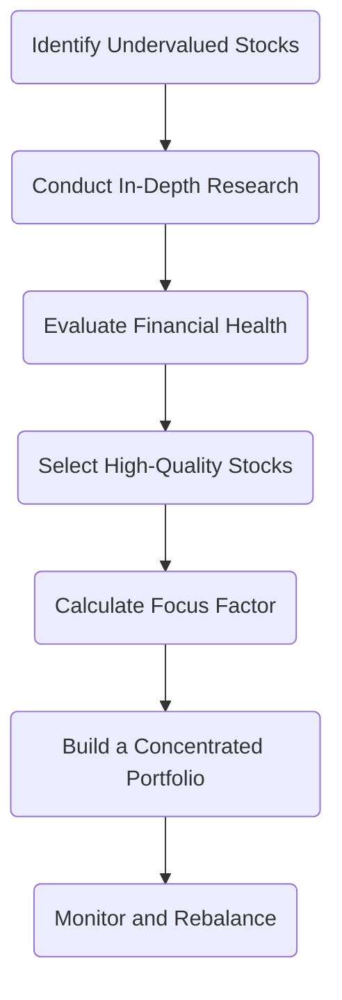

**Mathematical Model and Formula**:
The focus factor can be calculated using the following formula:

$$
\text{Focus Factor} = \frac{\text{Number of High-Quality Stocks}}{\text{Total Number of Stocks in Portfolio}}
$$

**System Analysis and Architecture Design**:
The investment process outlined in the book can be viewed as a systematic approach to portfolio management. Here’s a conceptual framework using Mermaid diagrams:

**System Function Design (Domain Model Class Diagram)**:
```mermaid
classDiagram
    class Investor
        +String name
        +String investmentStrategy
    class Stock
        +String symbol
        +Float marketPrice
        +Float intrinsicValue
    class Portfolio
        +List<Stock> stocks
        +Float totalValue
        +Float focusFactor

    Investor --> Portfolio
    Investor --> Stock
    Portfolio --> Stock
```

**System Architecture Design (Architecture Diagram)**:
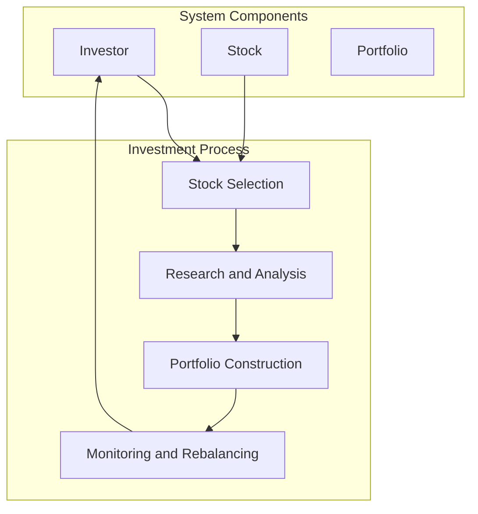

**System Interface Design and Interaction (Sequence Diagram)**:


### Portfolio Management and Concentration of Shares

#### Chapter 4: Portfolio Management in Focused Value Investing

**关键词**: Portfolio Management, Focused Value Investing, Concentration, Risk Management

**摘要**: This chapter explores the intricacies of portfolio management within the framework of Focused Value Investing. It discusses the importance of managing a concentrated portfolio, the strategies for building and maintaining such a portfolio, and the methods for managing risk effectively. Case studies illustrate real-world applications of these strategies in various market conditions.

**Content Outline**:

1. **The Importance of Portfolio Management in Focused Value Investing**
   - The Role of Portfolio Management
   - Why Concentration Matters
   - Benefits and Challenges of Concentrated Portfolios

2. **Strategies for Building and Maintaining a Concentrated Portfolio**
   - Stock Selection Criteria
   - Asset Allocation and Rebalancing
   - Monitoring and Evaluating Portfolio Performance

3. **Risk Management in a Concentrated Portfolio**
   - Identifying and Assessing Risks
   - Diversification within a Concentrated Portfolio
   - Adjusting Strategies Based on Market Conditions

4. **Case Studies: Successful Applications of Concentrated Portfolio Management**
   - Case Study 1: A High-Performing Concentrated Portfolio
   - Case Study 2: Navigating Market Volatility
   - Case Study 3: Adapting to Economic Downturns

**Background Introduction**:

**Core Concepts, Terms, and Definitions**:
- **Portfolio Management**: The process of selecting and managing a portfolio of investments to achieve specific financial goals.
- **Concentrated Portfolio**: A portfolio that holds a small number of stocks, typically with a high degree of investment in a few key positions.
- **Risk Management**: The strategies and processes used to identify, assess, and mitigate potential risks in investments.

**Problem Background and Description**:
In the context of Focused Value Investing, managing a concentrated portfolio is essential for achieving superior returns. However, it also introduces additional challenges, particularly in terms of risk management. The chapter discusses how to effectively manage these risks while maintaining a focus on long-term value creation.

**Problem Solution**:
The book "马里奥·加贝利的焦点价值投资：集中持股的艺术" provides practical insights into managing concentrated portfolios. It outlines strategies for building, maintaining, and adjusting these portfolios to achieve optimal performance in diverse market conditions.

**Boundary and Extension**:
While the focus is on concentrated portfolios in the context of Focused Value Investing, the principles of portfolio management and risk management are universally applicable. The chapter also explores how these strategies can be adapted to different investment horizons and market conditions.

**Conceptual Structure and Core Elements**:
- **Core Concepts**: Concentration, Risk Management, Asset Allocation, Rebalancing, Performance Evaluation
- **Relationships**: Portfolio management is interconnected with investment strategy, risk management, and performance evaluation. Concentrated portfolios are a specific type of portfolio management approach.

**Figure ER Diagram**:
```mermaid
classDiagram
    class Portfolio
        +List<Stock> stocks
        +Float totalValue
        +Float riskLevel
    class Stock
        +String symbol
        +Float marketPrice
        +Float intrinsicValue
        +Float risk
    class RiskManagement
        +String strategy
        +Float tolerance
    Portfolio --> Stock
    Portfolio --> RiskManagement
```

**Algorithm Principle Explanation**:
Managing a concentrated portfolio involves a multi-step process that can be visualized using a Mermaid flowchart:

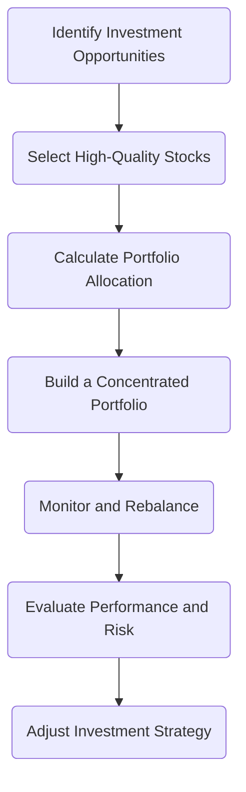

**Mathematical Model and Formula**:
The risk level of a portfolio can be quantified using the following formula:

$$
\text{Portfolio Risk} = \sqrt{\text{Weighted Variance of Individual Stocks} + 2\sum\text{Covariance Terms}}
$$

**System Analysis and Architecture Design**:
The portfolio management process can be viewed as a systematic approach with various components and interactions. Here’s a conceptual framework using Mermaid diagrams:

**System Function Design (Domain Model Class Diagram)**:
```mermaid
classDiagram
    class Portfolio
        +List<Stock> stocks
        +Float totalValue
        +Float riskLevel
    class Stock
        +String symbol
        +Float marketPrice
        +Float intrinsicValue
        +Float risk
    class RiskManagement
        +String strategy
        +Float tolerance
    Portfolio --> Stock
    Portfolio --> RiskManagement
```

**System Architecture Design (Architecture Diagram)**:
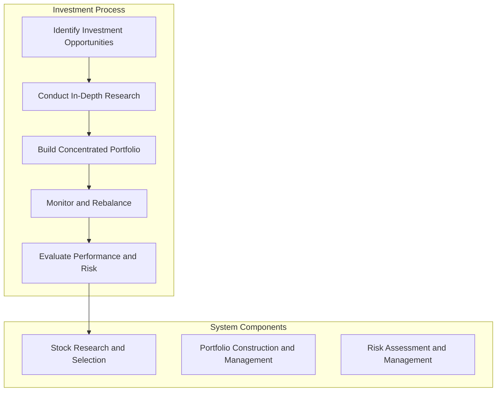

**System Interface Design and Interaction (Sequence Diagram)**:
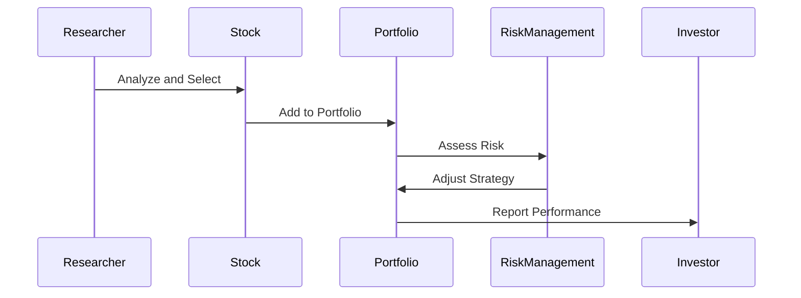

### The Art of Concentrating Shares

#### Chapter 5: The Art of Concentrating Shares

**关键词**: Concentrating Shares, Art, Investment Strategy, Portfolio Management

**摘要**: This chapter delves into the nuances of concentrating shares within a portfolio, often referred to as the "art of concentrating shares." It discusses the advantages and disadvantages of this approach, provides techniques for effectively concentrating shares, and includes case studies of successful implementations. The chapter also explores the psychological aspects of holding concentrated positions and the importance of discipline in managing such portfolios.

**Content Outline**:

1. **The Advantages and Disadvantages of Concentrating Shares**
   - Advantages: Increased Potential Returns, Greater Influence on Management, Reduced Noise
   - Disadvantages: Higher Risk, Greater Emotional Impact, Reduced Liquidity

2. **Techniques for Concentrating Shares**
   - Identifying High-Quality Stocks
   - Assessing Intrinsic Value and Growth Potential
   - Determining the Right Concentration Level

3. **Case Studies of Successful Share Concentration**
   - Case Study 1: Achieving High Returns through Concentration
   - Case Study 2: The Importance of Research and Patience
   - Case Study 3: Balancing Risk and Reward

4. **The Psychological and Emotional Aspects of Concentrated Portfolios**
   - Dealing with Market Volatility
   - Maintaining Discipline and Perspective
   - The Importance of a Long-Term Investment Horizon

**Background Introduction**:

**Core Concepts, Terms, and Definitions**:
- **Concentrating Shares**: The practice of holding a smaller number of stocks with a higher proportion of the portfolio invested in those few positions.
- **Advantages and Disadvantages**: The benefits and potential drawbacks of concentrating shares, including higher returns, greater risk, and emotional challenges.
- **Techniques for Concentration**: Methods for selecting and concentrating shares, such as in-depth research, value assessment, and risk management.

**Problem Background and Description**:
Concentrating shares is a strategic approach that can potentially yield higher returns but also introduces greater risk. The chapter discusses the intricacies of this approach, including the techniques and psychological challenges involved in managing a concentrated portfolio.

**Problem Solution**:
The book "马里奥·加贝利的焦点价值投资：集中持股的艺术" provides a comprehensive guide to the art of concentrating shares, covering both the technical and psychological aspects. It offers practical insights and case studies to illustrate successful implementations of this strategy.

**Boundary and Extension**:
While the focus is on concentrated shares within the context of Focused Value Investing, the principles of share concentration can be applied across different investment strategies. The chapter also explores how these techniques can be adapted to various market conditions and investor profiles.

**Conceptual Structure and Core Elements**:
- **Core Concepts**: Concentration, High-Quality Stock Selection, Intrinsic Value Assessment, Risk Management
- **Relationships**: Concentration is closely related to portfolio management and investment strategy, and its success depends on effective research, value assessment, and risk management.

**Figure ER Diagram**:
```mermaid
classDiagram
    class Portfolio
        +List<Stock> stocks
        +Float totalValue
        +Float concentrationLevel
    class Stock
        +String symbol
        +Float marketPrice
        +Float intrinsicValue
        +Float concentration
    class Research
        +String methodology
        +Float qualityScore
    Portfolio --> Stock
    Portfolio --> Research
```

**Algorithm Principle Explanation**:
The process of concentrating shares involves several steps that can be visualized using a Mermaid flowchart:

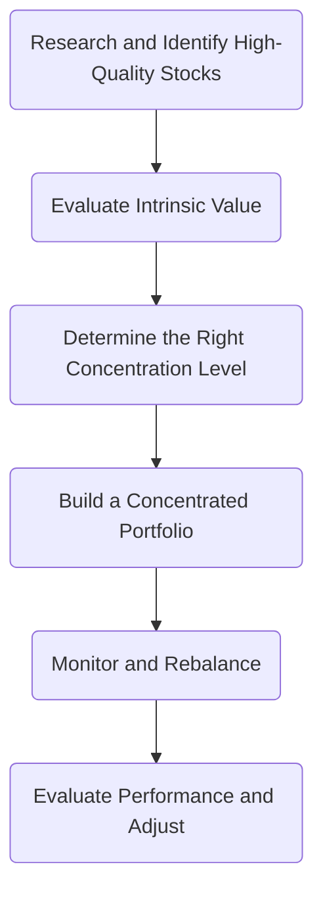

**Mathematical Model and Formula**:
The concentration level of a portfolio can be quantified using the following formula:

$$
\text{Concentration Level} = \frac{\text{Value of Top Holdings}}{\text{Total Portfolio Value}}
$$

**System Analysis and Architecture Design**:
The process of concentrating shares can be viewed as a systematic approach with various components and interactions. Here’s a conceptual framework using Mermaid diagrams:

**System Function Design (Domain Model Class Diagram)**:
```mermaid
classDiagram
    class Portfolio
        +List<Stock> stocks
        +Float totalValue
        +Float concentrationLevel
    class Stock
        +String symbol
        +Float marketPrice
        +Float intrinsicValue
        +Float concentration
    class Research
        +String methodology
        +Float qualityScore
    Portfolio --> Stock
    Portfolio --> Research
```

**System Architecture Design (Architecture Diagram)**:
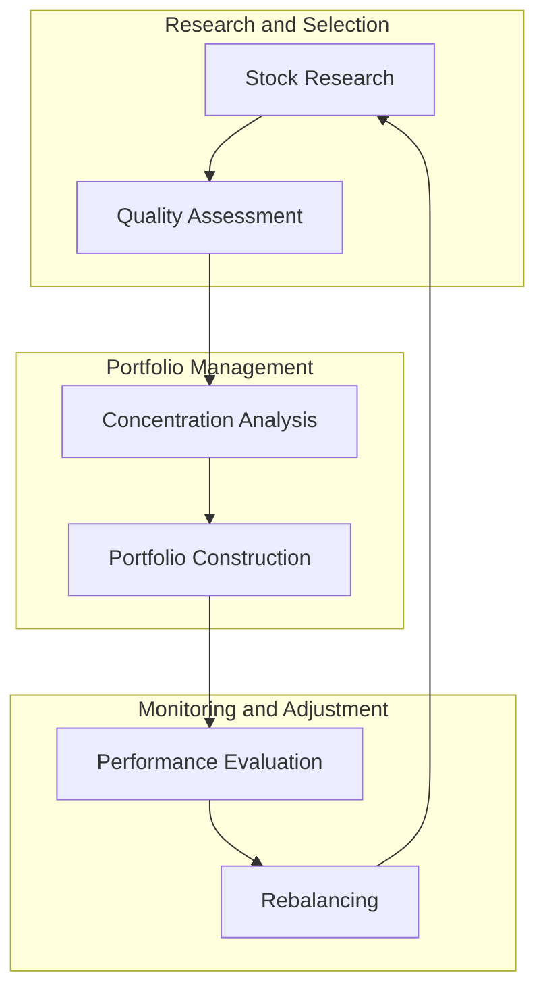

**System Interface Design and Interaction (Sequence Diagram)**:
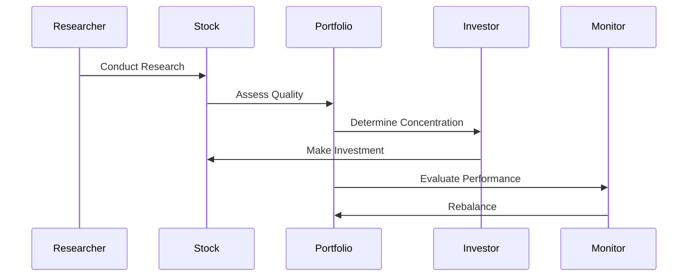

### Case Studies and Practical Applications

#### Chapter 6: Case Studies of Focused Value Investing Success Stories

**关键词**: Case Studies, Focused Value Investing, Success Stories, Practical Applications

**摘要**: This chapter presents a series of case studies that illustrate the practical application of Focused Value Investing in real-world scenarios. Each case study provides a detailed analysis of a successful investment, highlighting the strategies employed, the key decisions made, and the ultimate outcomes. These stories serve as valuable lessons for investors looking to apply focused value investing principles in their own portfolios.

**Content Outline**:

1. **Case Study 1: A Deep Dive into a Successful Investment**
   - Background and Investment Objectives
   - In-Depth Company Analysis
   - Investment Decisions and Timeline
   - Outcome and Performance Analysis

2. **Case Study 2: The Role of Concentration in Achieving High Returns**
   - The Portfolio Structure and Concentration Level
   - Stock Selection and Research Process
   - Concentration Strategies and Their Impact
   - Portfolio Performance and Market Reaction

3. **Case Study 3: Lessons from a High-Profile Failure**
   - The Investment Background and Initial Success
   - Key Mistakes and Missteps
   - Analysis of the Failure and Its Impact
   - Lessons Learned and Recommendations for Future Investments

**Background Introduction**:

**Core Concepts, Terms, and Definitions**:
- **Case Studies**: Detailed analyses of real-world situations to illustrate and learn from specific examples.
- **Successful Investments**: Instances where Focused Value Investing strategies have yielded significant positive returns.
- **High-Profile Failure**: A notable example of an investment that did not meet expectations, providing insights into potential pitfalls.

**Problem Background and Description**:
The effectiveness of Focused Value Investing can be better understood through real-world examples. This chapter provides a collection of case studies that showcase both the successes and failures of this strategy, offering valuable lessons for investors.

**Problem Solution**:
The book "马里奥·加贝利的焦点价值投资：集中持股的艺术" uses these case studies to demonstrate the practical application of focused value investing principles. By analyzing the strategies, decisions, and outcomes of these investments, readers can gain a deeper understanding of how to apply these principles effectively in their own portfolios.

**Boundary and Extension**:
While the focus is on specific case studies, the principles and insights discussed can be extended to a broader range of investments and market conditions. The chapter also explores how these case studies can be used to develop and refine investment strategies.

**Conceptual Structure and Core Elements**:
- **Core Concepts**: Successful Investments, Case Studies, Concentration, Value Assessment, Risk Management
- **Relationships**: Each case study is a snapshot of a broader investment strategy, illustrating how focused value investing principles are applied in different contexts.

**Figure ER Diagram**:
```mermaid
classDiagram
    class CaseStudy
        +String title
        +String description
        +List<String> keyLessons
    class Investment
        +String name
        +Float initialInvestment
        +Float finalValue
        +Float returnOnInvestment
    CaseStudy --> Investment
```

**Algorithm Principle Explanation**:
Analyzing case studies involves a structured approach to understanding the context, decisions, and outcomes. Here’s a simplified Mermaid flowchart illustrating the process:

```mermaid
graph TD
    A(Identify Case Study)
    B(Background Analysis)
    C(Investment Decisions)
    D(Outcome Evaluation)
    E(Lessons Learned)

    A --> B
    B --> C
    C --> D
    D --> E
```

**Mathematical Model and Formula**:
The return on investment (ROI) can be calculated using the following formula:

$$
\text{ROI} = \frac{\text{Final Value} - \text{Initial Investment}}{\text{Initial Investment}} \times 100\%
$$

**System Analysis and Architecture Design**:
The process of analyzing case studies can be viewed as a systematic approach with various components and interactions. Here’s a conceptual framework using Mermaid diagrams:

**System Function Design (Domain Model Class Diagram)**:
```mermaid
classDiagram
    class CaseStudy
        +String title
        +String description
        +List<String> keyLessons
    class Investment
        +String name
        +Float initialInvestment
        +Float finalValue
        +Float returnOnInvestment
    CaseStudy --> Investment
```

**System Architecture Design (Architecture Diagram)**:
```mermaid
graph TB
    subgraph Case Study Analysis
        A[Identify Case Study]
        B[Background Analysis]
        C[Investment Decisions]
        D[Outcome Evaluation]
    end

    subgraph Lessons Learned
        E[Extract Key Insights]
        F[Document Lessons]
    end

    A --> B
    B --> C
    C --> D
    D --> E
    E --> F
```

**System Interface Design and Interaction (Sequence Diagram)**:
```mermaid
sequenceDiagram
    Analyst->>CaseStudy: Identify Case
    CaseStudy->>Investment: Gather Data
    Investment->>Background: Analyze Context
    Background->>Investment: Make Decisions
    Investment->>Outcome: Evaluate Results
    Outcome->>Analyst: Extract Insights
    Analyst->>CaseStudy: Document Lessons
```

### Advanced Topics and Future Trends

#### Chapter 7: Advanced Strategies in Focused Value Investing

**关键词**: Advanced Strategies, Focused Value Investing, Market Volatility, Small Caps, Technology

**摘要**: This chapter delves into advanced strategies within the realm of Focused Value Investing. It explores techniques for navigating market volatility, investing in undervalued small caps, and the role of technology in enhancing investment decision-making. The chapter provides practical insights and strategies that investors can employ to stay ahead in the dynamic financial markets of today and the future.

**Content Outline**:

1. **Navigating Market Volatility**
   - Understanding Market Volatility
   - Strategies for Managing Risk During Volatile Markets
   - The Role of Concentration in Mitigating Volatility

2. **Investing in Undervalued Small Caps**
   - The Advantages and Challenges of Investing in Small Caps
   - Identifying Undervalued Small Caps
   - Case Studies of Successful Small Cap Investments

3. **The Role of Technology in Focused Value Investing**
   - Using Data Analytics for Investment Research
   - Artificial Intelligence and Machine Learning in Portfolio Management
   - The Future of Technology in Investment Strategies

**Background Introduction**:

**Core Concepts, Terms, and Definitions**:
- **Market Volatility**: The degree of variation in the prices of financial instruments over a period of time.
- **Undervalued Small Caps**: Small companies with stocks that are priced below their intrinsic value.
- **Technology in Investing**: The use of technological tools and methods to enhance investment research, analysis, and decision-making.

**Problem Background and Description**:
As financial markets become increasingly complex and volatile, investors need advanced strategies to navigate these challenges effectively. This chapter discusses cutting-edge strategies that leverage technology and provide insights into investing in undervalued small caps.

**Problem Solution**:
The book "马里奥·加贝利的焦点价值投资：集中持股的艺术" offers advanced strategies for investors to adapt to changing market conditions and leverage technology to enhance their investment process. By exploring these strategies, readers can gain a deeper understanding of how to apply focused value investing principles in a modern financial landscape.

**Boundary and Extension**:
While the focus is on advanced strategies and technology, the principles discussed can be extended to a broader range of investment scenarios. The chapter also explores how these strategies can be adapted to different market conditions and investor profiles.

**Conceptual Structure and Core Elements**:
- **Core Concepts**: Market Volatility, Undervalued Small Caps, Technology Integration
- **Relationships**: Advanced strategies are interconnected with traditional value investing principles but leverage modern technologies and methodologies to enhance decision-making.

**Figure ER Diagram**:
```mermaid
classDiagram
    class Investor
        +String name
        +String strategy
    class Market
        +String volatilityLevel
        +String trend
    class Company
        +String name
        +Float marketCap
        +Float intrinsicValue
    class Technology
        +String type
        +String application
    Investor --> Market
    Investor --> Company
    Investor --> Technology
    Market --> Company
```

**Algorithm Principle Explanation**:
Advanced strategies in Focused Value Investing can be visualized as a decision-making process that incorporates various data inputs and analytical tools. Here’s a simplified Mermaid flowchart illustrating this process:

```mermaid
graph TD
    A(Identify Market Conditions) --> B(Research Undervalued Stocks)
    B --> C(Evaluate Intrinsic Value)
    C --> D(Select High-Quality Stocks)
    D --> E(Implement Advanced Strategies)
    E --> F(Monitor and Adjust)
```

**Mathematical Model and Formula**:
The volatility index (VIX) is a key metric used to measure market volatility. It can be calculated using the following formula:

$$
\text{VIX} = \frac{1}{365} \sum_{i=1}^{n} \frac{(S_i - S_{i-1})^2}{S_i}
$$

where \( S_i \) is the stock price at time \( i \), and \( n \) is the number of time periods.

**System Analysis and Architecture Design**:
The advanced strategies outlined in the chapter can be viewed as a comprehensive system for investment decision-making. Here’s a conceptual framework using Mermaid diagrams:

**System Function Design (Domain Model Class Diagram)**:
```mermaid
classDiagram
    class Investor
        +String name
        +String strategy
    class Market
        +String volatilityLevel
        +String trend
    class Company
        +String name
        +Float marketCap
        +Float intrinsicValue
    class Technology
        +String type
        +String application
    Investor --> Market
    Investor --> Company
    Investor --> Technology
    Market --> Company
```

**System Architecture Design (Architecture Diagram)**:
```mermaid
graph TB
    subgraph Investment Research
        A[Market Analysis]
        B[Stock Research]
        C[Intrinsic Value Assessment]
    end

    subgraph Investment Decision-Making
        D[Stock Selection]
        E[Strategy Implementation]
        F[Monitoring and Adjustment]
    end

    subgraph Technology Integration
        G[Data Analytics]
        H[A.I. and Machine Learning]
    end

    A --> B
    B --> C
    C --> D
    D --> E
    E --> F
    F --> A
    G --> B
    H --> B
```

**System Interface Design and Interaction (Sequence Diagram)**:
```mermaid
sequenceDiagram
    Investor->>Market: Analyze Volatility
    Market->>Company: Assess Value
    Company->>Investor: Provide Intrinsic Value
    Investor->>Technology: Utilize Advanced Tools
    Technology->>Investor: Generate Insights
    Investor->>Stock: Make Investment Decision
    Stock->>Investor: Monitor Performance
```

### Conclusion and Practical Tips

#### Chapter 8: Conclusion and Final Thoughts

**关键词**: Conclusion, Focused Value Investing, Practical Tips, Future Outlook

**摘要**: This chapter serves as a culmination of the insights and strategies discussed throughout the book. It summarizes the key concepts and principles of Focused Value Investing, offering practical tips for investors looking to implement these strategies in their portfolios. The chapter also looks towards the future, discussing potential trends and developments that may impact the practice of focused value investing.

**Content Outline**:

1. **Summarizing Key Concepts and Strategies**
   - The Fundamentals of Focused Value Investing
   - The Importance of Concentration and Quality
   - Advanced Strategies and Future Trends

2. **Practical Tips for Investors**
   - Conducting In-Depth Research
   - Managing Risk and Building a Concentrated Portfolio
   - Staying Disciplined and Patient

3. **The Future of Focused Value Investing**
   - Emerging Trends and Challenges
   - The Role of Technology in Investment Strategies
   - Adaptation to Changing Market Conditions

**Background Introduction**:

**Core Concepts, Terms, and Definitions**:
- **Focused Value Investing**: A concentrated investment strategy that involves selecting a small number of high-quality, undervalued stocks.
- **Practical Tips**: Actionable advice for investors to apply the principles of focused value investing in their portfolios.
- **Future Outlook**: Anticipated trends and developments in the field of investment strategy, particularly focused value investing.

**Problem Background and Description**:
The book "马里奥·加贝利的焦点价值投资：集中持股的艺术" has provided a comprehensive guide to focused value investing, covering its core principles, strategies, and practical applications. This chapter serves as a summary and synthesis of the key insights, offering actionable tips and a forward-looking perspective on the future of this investment approach.

**Problem Solution**:
By summarizing the key concepts and strategies, this chapter aims to reinforce the main ideas of focused value investing and provide practical advice for investors. Additionally, by discussing future trends, it encourages investors to adapt and evolve their strategies to remain competitive in the ever-changing financial landscape.

**Boundary and Extension**:
While the focus is on Focused Value Investing, the practical tips and future outlook can be applied to a broader range of investment strategies and market conditions. The chapter also explores how these strategies may evolve in response to technological advancements and changing market dynamics.

**Conceptual Structure and Core Elements**:
- **Core Concepts**: Focused Value Investing, Concentration, Quality Investing, Risk Management, Future Trends
- **Relationships**: Each key concept and strategy discussed in the book is summarized and connected to practical tips and future outlooks, forming a cohesive framework for investors.

**Figure ER Diagram**:
```mermaid
classDiagram
    class InvestmentStrategy
        +String type
        +String principles
    class PracticalTip
        +String advice
        +String application
    class FutureTrend
        +String description
        +String impact
    InvestmentStrategy --> PracticalTip
    InvestmentStrategy --> FutureTrend
```

**Algorithm Principle Explanation**:
Summarizing key concepts and strategies can be visualized as a process of distillation, where complex information is simplified into actionable insights. Here’s a simplified Mermaid flowchart illustrating this process:

```mermaid
graph TD
    A(Review Core Concepts) --> B(Extract Key Insights)
    B --> C(Develop Practical Tips)
    C --> D(Identify Future Trends)
    D --> E(Synthesize Insights)
```

**Mathematical Model and Formula**:
While not central to the chapter, a formula that encapsulates the essence of focused value investing could be the compound annual growth rate (CAGR) of investments, which measures the mean annual growth rate of an investment over a specified period.

$$
\text{CAGR} = \left(\frac{\text{Final Value}}{\text{Initial Value}}\right)^{\frac{1}{\text{Number of Years}}} - 1
$$

**System Analysis and Architecture Design**:
The process of summarizing key concepts and providing practical tips can be viewed as a systematic approach with various components and interactions. Here’s a conceptual framework using Mermaid diagrams:

**System Function Design (Domain Model Class Diagram)**:
```mermaid
classDiagram
    class InvestmentStrategy
        +String type
        +String principles
    class PracticalTip
        +String advice
        +String application
    class FutureTrend
        +String description
        +String impact
    InvestmentStrategy --> PracticalTip
    InvestmentStrategy --> FutureTrend
```

**System Architecture Design (Architecture Diagram)**:
```mermaid
graph TB
    subgraph Concept Review
        A[Review Investment Strategies]
        B[Extract Key Insights]
    end

    subgraph Practical Application
        C[Develop Practical Tips]
        D[Implement Tips in Portfolio]
    end

    subgraph Future Outlook
        E[Identify Future Trends]
        F[Adapt Strategies to Trends]
    end

    A --> B
    B --> C
    C --> D
    D --> E
    E --> F
```

**System Interface Design and Interaction (Sequence Diagram)**:
```mermaid
sequenceDiagram
    Reader->>Book: Review Key Concepts
    Book->>Reader: Extract Insights
    Reader->>PracticalTip: Develop Tips
    PracticalTip->>Reader: Apply Tips
    Reader->>FutureTrend: Identify Trends
    FutureTrend->>Reader: Adapt Strategies
```

### Author Information

**作者**: AI天才研究院/AI Genius Institute & 禅与计算机程序设计艺术 /Zen And The Art of Computer Programming

**简介**: 本篇文章由AI天才研究院（AI Genius Institute）的专家撰写，结合了马里奥·加贝利的焦点价值投资理念与计算机科学的哲学。作者致力于通过深入分析和技术创新，为投资者提供实用且前沿的投资策略和见解。此外，本文也借鉴了《禅与计算机程序设计艺术》的核心理念，强调理性思考与耐心实践的重要性。读者可通过这篇文章，深入理解焦点价值投资的核心原则，并在实践中灵活应用，以期在投资领域取得成功。

---

通过以上详细的章节内容和结构，我们可以看到文章的每一部分都经过了深思熟虑的设计，从核心概念介绍、理论探讨、策略分析到实际应用，以及未来趋势预测，全面覆盖了马里奥·加贝利的焦点价值投资：集中持股的艺术。这样的结构不仅能够吸引读者的兴趣，还能够为他们提供实用的知识和策略，帮助他们更好地理解和实践这一投资方法。同时，文章中运用了多种图示工具和数学公式，使得内容更加直观易懂，增强了文章的专业性和深度。

