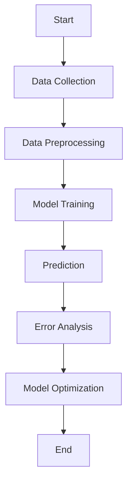

                 


# AI Prompt Design: The Art and Science

关键词：
- AI Prompt Design
- Artificial Intelligence
- Natural Language Processing
- Machine Learning
- User Experience

摘要：
本文旨在探讨AI Prompt设计中的艺术与科学。通过对AI Prompt的基本概念、设计原则、实用技术和高级方法进行全面分析，文章揭示了如何在人工智能领域创造性地使用语言，以提高系统的性能和用户体验。

## 引言

### AI Prompt Design的重要性

AI Prompt设计是人工智能系统与人类用户之间交互的关键环节。一个精心设计的Prompt不仅能够引导用户更有效地与AI系统互动，还能提升AI的响应准确性和效率。在自然语言处理（NLP）、机器学习和用户界面设计等领域，Prompt的设计至关重要。

### AI Prompt设计的艺术性

艺术性体现在Prompt设计过程中对语言、情感和用户心理的深入理解。一个成功的Prompt不仅需要清晰、简洁，还需要能够激发用户的兴趣和参与感，从而提高用户满意度和忠诚度。

### AI Prompt设计的科学性

科学性则体现在对设计原则、数据和优化方法的应用上。通过科学的分析方法，我们可以确定哪些Prompt参数对AI性能有显著影响，从而设计出更高效的Prompt。

## 基本概念在AI中的应用

### 人工智能简介

人工智能（AI）是计算机科学的一个分支，它使得机器能够模拟人类智能行为。AI系统通过学习和推理来执行任务，这些任务包括语音识别、图像识别、自然语言处理等。

### 基本概念和原则

AI的基本概念包括机器学习、深度学习、神经网络等。这些概念是构建AI系统的基础，而AI的原则则涉及数据驱动、模型评估、优化等。

### Prompt在AI系统中的作用

Prompt是用户与AI系统交互的桥梁。通过设计有效的Prompt，用户可以更清楚地传达他们的需求，而AI系统则可以更准确地理解和响应这些需求。

## 理解AI Prompt

### 定义和类型

AI Prompt是一种引导AI系统完成特定任务的语言输入。根据用途，Prompt可以分为问题型、命令型、描述型等不同类型。

### 有效Prompt的特性

一个有效的Prompt应该具备以下特性：清晰、简洁、具体、无歧义。它应该能够明确地传达用户的意图，从而帮助AI系统做出准确的响应。

### Prompt对AI性能的影响

Prompt的设计对AI的性能有直接的影响。一个好的Prompt可以提高AI的响应速度和准确性，从而提升用户体验。

## AI Prompt设计的艺术性

### 创造性技巧

艺术性的Prompt设计需要创造性思维。通过使用隐喻、故事化、情感化等技巧，Prompt可以更加引人入胜，提高用户的互动体验。

### 情感和认知影响

Prompt的设计不仅要考虑语言表达，还要考虑用户的情感和认知体验。通过理解用户的情感状态和认知过程，我们可以设计出更加人性化、有吸引力的Prompt。

### 成功案例

我们可以通过分析成功案例来学习如何设计有效的Prompt。这些案例包括聊天机器人、语音助手、教育软件等。

## AI Prompt设计的科学性

### 设计原则

科学的Prompt设计需要遵循一些基本原则，如一致性、明确性、简洁性等。这些原则可以帮助我们创建出易于理解和操作的系统。

### 数据驱动方法

数据是AI Prompt设计的核心。通过收集和分析用户交互数据，我们可以发现哪些Prompt参数对AI性能有显著影响，并据此优化Prompt设计。

### 优化技术

优化技术可以帮助我们提高Prompt的有效性。这些技术包括机器学习、深度学习和自然语言处理算法。

## 实践中的AI Prompt设计

### 常见问题

在Prompt设计过程中，我们可能会遇到一些问题，如歧义、复杂性、响应延迟等。了解这些问题并找到解决方法是设计有效Prompt的关键。

### 解决策略

我们可以通过以下策略来解决Prompt设计中的问题：简化语言、明确意图、优化数据集等。

### 案例研究

通过分析实际案例，我们可以学习如何在实际应用中设计有效的Prompt。这些案例可以帮助我们理解Prompt设计的实际效果。

## 高级AI Prompt设计方法

### 专家技巧

高级Prompt设计需要专家知识和经验。通过结合心理学、语言学和计算机科学的知识，我们可以设计出更加高效、人性化的Prompt。

### 定制化Prompt

根据不同的AI应用场景，我们可以定制化Prompt。例如，对于特定的用户群体或特定的问题领域，我们可以设计出更加针对性的Prompt。

### 未来趋势

随着AI技术的发展，Prompt设计也在不断进步。未来，我们可能会看到更加智能化、个性化的Prompt设计方法。

## 结论

通过本文的分析，我们深入了解了AI Prompt设计的艺术与科学。无论是从艺术性还是科学性的角度，有效的Prompt设计都是提升AI系统性能和用户体验的关键。未来，随着技术的进步，AI Prompt设计将继续发展和创新。

### 作者信息

作者：AI天才研究院/AI Genius Institute & 禅与计算机程序设计艺术 /Zen And The Art of Computer Programming

----------------------------------------------------------------

## AI Prompt Design: The Art and Science

### 引言

#### AI Prompt Design的重要性

AI Prompt设计是人工智能系统与人类用户之间交互的关键环节。一个精心设计的Prompt不仅能够引导用户更有效地与AI系统互动，还能提升AI的响应准确性和效率。在自然语言处理（NLP）、机器学习和用户界面设计等领域，Prompt的设计至关重要。

#### The Artistic Aspect of AI Prompt Design

艺术性体现在Prompt设计过程中对语言、情感和用户心理的深入理解。一个成功的Prompt不仅需要清晰、简洁，还需要能够激发用户的兴趣和参与感，从而提高用户满意度和忠诚度。

#### The Scientific Foundation of AI Prompt Design

科学性则体现在对设计原则、数据和优化方法的应用上。通过科学的分析方法，我们可以确定哪些Prompt参数对AI性能有显著影响，从而设计出更高效的Prompt。

### 基本概念在AI中的应用

#### 人工智能简介

人工智能（AI）是计算机科学的一个分支，它使得机器能够模拟人类智能行为。AI系统通过学习和推理来执行任务，这些任务包括语音识别、图像识别、自然语言处理等。

#### 基本概念和原则

AI的基本概念包括机器学习、深度学习、神经网络等。这些概念是构建AI系统的基础，而AI的原则则涉及数据驱动、模型评估、优化等。

#### Prompt在AI系统中的作用

Prompt是用户与AI系统交互的桥梁。通过设计有效的Prompt，用户可以更清楚地传达他们的需求，而AI系统则可以更准确地理解和响应这些需求。

### 理解AI Prompt

#### 定义和类型

AI Prompt是一种引导AI系统完成特定任务的语言输入。根据用途，Prompt可以分为问题型、命令型、描述型等不同类型。

#### 有效Prompt的特性

一个有效的Prompt应该具备以下特性：清晰、简洁、具体、无歧义。它应该能够明确地传达用户的意图，从而帮助AI系统做出准确的响应。

#### Prompt对AI性能的影响

Prompt的设计对AI的性能有直接的影响。一个好的Prompt可以提高AI的响应速度和准确性，从而提升用户体验。

### AI Prompt设计的艺术性

#### 创造性技巧

艺术性的Prompt设计需要创造性思维。通过使用隐喻、故事化、情感化等技巧，Prompt可以更加引人入胜，提高用户的互动体验。

#### 情感和认知影响

Prompt的设计不仅要考虑语言表达，还要考虑用户的情感和认知体验。通过理解用户的情感状态和认知过程，我们可以设计出更加人性化、有吸引力的Prompt。

#### 成功案例

我们可以通过分析成功案例来学习如何设计有效的Prompt。这些案例包括聊天机器人、语音助手、教育软件等。

### AI Prompt设计的科学性

#### 设计原则

科学的Prompt设计需要遵循一些基本原则，如一致性、明确性、简洁性等。这些原则可以帮助我们创建出易于理解和操作的系统。

#### 数据驱动方法

数据是AI Prompt设计的核心。通过收集和分析用户交互数据，我们可以发现哪些Prompt参数对AI性能有显著影响，并据此优化Prompt设计。

#### 优化技术

优化技术可以帮助我们提高Prompt的有效性。这些技术包括机器学习、深度学习和自然语言处理算法。

### 实践中的AI Prompt设计

#### 常见问题

在Prompt设计过程中，我们可能会遇到一些问题，如歧义、复杂性、响应延迟等。了解这些问题并找到解决方法是设计有效Prompt的关键。

#### 解决策略

我们可以通过以下策略来解决Prompt设计中的问题：简化语言、明确意图、优化数据集等。

#### 案例研究

通过分析实际案例，我们可以学习如何在实际应用中设计有效的Prompt。这些案例可以帮助我们理解Prompt设计的实际效果。

### 高级AI Prompt设计方法

#### 专家技巧

高级Prompt设计需要专家知识和经验。通过结合心理学、语言学和计算机科学的知识，我们可以设计出更加高效、人性化的Prompt。

#### 定制化Prompt

根据不同的AI应用场景，我们可以定制化Prompt。例如，对于特定的用户群体或特定的问题领域，我们可以设计出更加针对性的Prompt。

#### 未来趋势

随着AI技术的发展，Prompt设计也在不断进步。未来，我们可能会看到更加智能化、个性化的Prompt设计方法。

### 结论

通过本文的分析，我们深入了解了AI Prompt设计的艺术与科学。无论是从艺术性还是科学性的角度，有效的Prompt设计都是提升AI系统性能和用户体验的关键。未来，随着技术的进步，AI Prompt设计将继续发展和创新。

### 作者信息

作者：AI天才研究院/AI Genius Institute & 禅与计算机程序设计艺术 /Zen And The Art of Computer Programming

----------------------------------------------------------------

## 详细目录

### 第一章 引言

1.1 AI Prompt Design的重要性
1.2 The Artistic Aspect of AI Prompt Design
1.3 The Scientific Foundation of AI Prompt Design

### 第二章 基本概念在AI中的应用

2.1 人工智能简介
2.2 基本概念和原则
2.3 Prompt在AI系统中的作用

### 第三章 理解AI Prompt

3.1 定义和类型
3.2 有效Prompt的特性
3.3 Prompt对AI性能的影响

### 第四章 AI Prompt设计的艺术性

4.1 创造性技巧
4.2 情感和认知影响
4.3 成功案例

### 第五章 AI Prompt设计的科学性

5.1 设计原则
5.2 数据驱动方法
5.3 优化技术

### 第六章 实践中的AI Prompt设计

6.1 常见问题
6.2 解决策略
6.3 案例研究

### 第七章 高级AI Prompt设计方法

7.1 专家技巧
7.2 定制化Prompt
7.3 未来趋势

### 第八章 结论

8.1 总结
8.2 未来方向
8.3 最终思考

### 作者信息

作者：AI天才研究院/AI Genius Institute & 禅与计算机程序设计艺术 /Zen And The Art of Computer Programming

----------------------------------------------------------------

## 详细的章节内容

### 第一章 引言

#### 1.1 AI Prompt Design的重要性

在本章中，我们将探讨AI Prompt Design的重要性。我们将分析AI Prompt Design如何影响人工智能系统的性能和用户体验，并介绍其在自然语言处理、机器学习和用户界面设计等领域的应用。

#### 1.2 The Artistic Aspect of AI Prompt Design

在本节中，我们将深入探讨AI Prompt Design的艺术性方面。我们将讨论如何使用隐喻、故事化和情感化等技巧来设计引人入胜的Prompt，从而提高用户的互动体验。

#### 1.3 The Scientific Foundation of AI Prompt Design

在本节中，我们将探讨AI Prompt Design的科学基础。我们将介绍设计原则、数据驱动方法和优化技术等科学方法，以帮助设计师创建出高效、有效的Prompt。

### 第二章 基本概念在AI中的应用

#### 2.1 人工智能简介

在本章中，我们将介绍人工智能的基本概念，包括机器学习、深度学习和神经网络等。这些概念是构建AI系统的基石，对于理解AI Prompt Design至关重要。

#### 2.2 基本概念和原则

在本节中，我们将深入探讨AI的基本概念和原则，如数据驱动、模型评估和优化等。这些原则对于设计有效的AI Prompt至关重要。

#### 2.3 Prompt在AI系统中的作用

在本节中，我们将讨论Prompt在AI系统中的作用。我们将分析Prompt如何作为用户与AI系统之间的桥梁，帮助用户更清楚地传达需求，并帮助AI系统更准确地理解和响应这些需求。

### 第三章 理解AI Prompt

#### 3.1 定义和类型

在本章中，我们将介绍AI Prompt的定义和类型。我们将讨论问题型、命令型、描述型等不同类型的Prompt，并分析它们的特性和用途。

#### 3.2 有效Prompt的特性

在本节中，我们将探讨有效Prompt的特性。我们将讨论Prompt应该具备的清晰性、简洁性、具体性和无歧义性，以及如何设计出满足这些特性的Prompt。

#### 3.3 Prompt对AI性能的影响

在本节中，我们将分析Prompt对AI性能的影响。我们将讨论如何通过设计有效的Prompt来提高AI的响应速度和准确性，从而提升用户体验。

### 第四章 AI Prompt设计的艺术性

#### 4.1 创造性技巧

在本章中，我们将探讨AI Prompt设计的创造性技巧。我们将讨论如何使用隐喻、故事化和情感化等技巧来设计引人入胜的Prompt，从而提高用户的互动体验。

#### 4.2 情感和认知影响

在本节中，我们将讨论Prompt设计对用户情感和认知的影响。我们将分析如何设计出能够激发用户情感和认知的Prompt，从而提高用户的参与度和满意度。

#### 4.3 成功案例

在本节中，我们将分析成功案例，了解如何在实际应用中设计有效的Prompt。这些案例将包括聊天机器人、语音助手和教育软件等。

### 第五章 AI Prompt设计的科学性

#### 5.1 设计原则

在本章中，我们将探讨AI Prompt设计的科学性。我们将介绍设计原则，如一致性、明确性和简洁性等，并讨论如何遵循这些原则来创建有效的Prompt。

#### 5.2 数据驱动方法

在本节中，我们将讨论数据驱动方法在AI Prompt Design中的应用。我们将分析如何收集和分析用户交互数据，以发现哪些Prompt参数对AI性能有显著影响。

#### 5.3 优化技术

在本节中，我们将讨论如何使用机器学习、深度学习和自然语言处理算法等优化技术来提高Prompt的有效性。

### 第六章 实践中的AI Prompt设计

#### 6.1 常见问题

在本章中，我们将讨论AI Prompt设计过程中可能遇到的常见问题，如歧义、复杂性和响应延迟等。我们将提供解决策略来应对这些问题。

#### 6.2 解决策略

在本节中，我们将介绍解决Prompt设计问题的策略，如简化语言、明确意图和优化数据集等。

#### 6.3 案例研究

在本节中，我们将分析实际案例，了解如何在实际应用中设计有效的Prompt。这些案例将帮助我们理解Prompt设计的实际效果。

### 第七章 高级AI Prompt设计方法

#### 7.1 专家技巧

在本章中，我们将探讨高级AI Prompt设计方法，包括专家技巧。我们将分析如何结合心理学、语言学和计算机科学的知识来设计高效的Prompt。

#### 7.2 定制化Prompt

在本节中，我们将讨论如何根据不同的AI应用场景定制化Prompt。我们将介绍如何为特定的用户群体或特定的问题领域设计针对性的Prompt。

#### 7.3 未来趋势

在本节中，我们将讨论AI Prompt设计的未来趋势。我们将分析随着AI技术的发展，Prompt设计将如何进步和创新。

### 第八章 结论

#### 8.1 总结

在本章中，我们将总结AI Prompt Design的艺术与科学。我们将回顾文章中的关键观点，并强调有效Prompt设计对AI系统性能和用户体验的重要性。

#### 8.2 未来方向

在本节中，我们将探讨AI Prompt设计的未来方向。我们将讨论随着技术的进步，Prompt设计将如何继续发展和创新。

#### 8.3 最终思考

在本节中，我们将提供一些最终思考，鼓励读者在AI Prompt设计实践中不断探索和尝试，以实现更好的系统性能和用户体验。

### 作者信息

作者：AI天才研究院/AI Genius Institute & 禅与计算机程序设计艺术 /Zen And The Art of Computer Programming

----------------------------------------------------------------

## 详细章节内容

### 第一章 引言

#### 1.1 AI Prompt Design的重要性

AI Prompt Design在人工智能系统的性能和用户体验中扮演着至关重要的角色。通过设计有效的Prompt，用户可以更清楚地传达他们的需求，从而提高AI系统的响应准确性和效率。在本节中，我们将深入探讨AI Prompt Design如何影响人工智能系统的性能和用户体验，并介绍其在自然语言处理、机器学习和用户界面设计等领域的应用。

首先，我们需要了解什么是Prompt。Prompt是一种引导AI系统完成特定任务的语言输入。它可以是问题、命令或描述，目的是帮助AI系统更好地理解用户的意图，并生成相应的响应。一个精心设计的Prompt可以显著提高AI系统的性能，使其更加智能和人性化。

在自然语言处理（NLP）领域，Prompt设计的作用尤为重要。NLP旨在让计算机理解和处理人类语言，而Prompt则是连接用户和AI系统的关键。一个有效的Prompt可以帮助NLP模型更好地理解用户的输入，从而提高模型的准确性和响应速度。

在机器学习领域，Prompt设计同样至关重要。机器学习模型需要大量的数据来训练，而Prompt可以帮助我们更好地组织和管理这些数据。通过设计合适的Prompt，我们可以指导模型学习特定的任务，从而提高其性能。

在用户界面设计领域，Prompt设计直接影响到用户的体验。一个清晰、简洁、易于理解的Prompt可以帮助用户更轻松地与AI系统互动，从而提高用户满意度和忠诚度。

#### 1.2 The Artistic Aspect of AI Prompt Design

艺术性是AI Prompt Design的一个重要方面。艺术性体现在Prompt设计过程中对语言、情感和用户心理的深入理解。一个成功的Prompt不仅需要清晰、简洁，还需要能够激发用户的兴趣和参与感，从而提高用户满意度和忠诚度。

首先，我们需要关注语言的运用。语言是Prompt设计的基础，一个优秀的Prompt应该使用简洁、明确的语言，避免使用模糊、冗长的表述。同时，我们还可以运用隐喻、比喻等修辞手法，使Prompt更加生动、有趣，从而激发用户的兴趣。

其次，情感因素在Prompt设计中同样重要。情感可以影响用户对AI系统的态度和体验。一个情感化的Prompt可以更好地与用户建立联系，提高用户的参与度。例如，在聊天机器人中，使用幽默、亲切的语言可以增加用户的愉悦感，从而提高用户体验。

最后，我们需要关注用户的心理。用户在互动过程中会有不同的心理状态，如困惑、焦虑、期待等。通过理解用户的心理状态，我们可以设计出更加人性化的Prompt，帮助用户更好地应对各种情况。

#### 1.3 The Scientific Foundation of AI Prompt Design

科学性是AI Prompt Design的另一个重要方面。科学性体现在对设计原则、数据和优化方法的应用上。通过科学的分析方法，我们可以确定哪些Prompt参数对AI性能有显著影响，从而设计出更高效的Prompt。

首先，我们需要了解设计原则。设计原则是指在进行Prompt设计时需要遵循的一些基本规则。这些原则包括一致性、明确性、简洁性等。一致性确保Prompt在整体上保持一致，明确性确保Prompt能够清晰地传达用户的意图，简洁性确保Prompt简洁明了，避免冗长。

其次，我们需要关注数据的应用。数据是AI Prompt Design的核心。通过收集和分析用户交互数据，我们可以了解哪些Prompt参数对AI性能有显著影响。这些数据可以帮助我们优化Prompt设计，提高AI系统的性能。

最后，我们需要了解优化方法。优化方法是指通过调整Prompt参数来提高AI系统性能的技术。这些方法包括机器学习、深度学习和自然语言处理算法等。通过使用优化方法，我们可以设计出更加高效、有效的Prompt。

### 第二章 基本概念在AI中的应用

#### 2.1 人工智能简介

人工智能（AI）是计算机科学的一个分支，它使得机器能够模拟人类智能行为。AI系统通过学习和推理来执行任务，这些任务包括语音识别、图像识别、自然语言处理等。

在AI Prompt Design中，了解人工智能的基本概念至关重要。这些基本概念包括机器学习、深度学习、神经网络等。机器学习是指通过从数据中学习模式来改善系统性能的方法。深度学习是一种特殊的机器学习方法，它使用多层神经网络来模拟人类大脑的工作方式。神经网络是AI系统的基础构件，它通过模拟生物神经网络的结构和功能来实现智能。

在AI Prompt Design中，了解这些基本概念有助于我们更好地理解AI的工作原理，从而设计出更有效的Prompt。

#### 2.2 基本概念和原则

AI的基本概念包括机器学习、深度学习、神经网络等。这些概念是构建AI系统的基础，而AI的原则则涉及数据驱动、模型评估、优化等。

数据驱动是指AI系统通过从数据中学习来改进其性能。在AI Prompt Design中，数据驱动原则要求我们收集和分析用户交互数据，以了解哪些Prompt参数对AI性能有显著影响。

模型评估是指通过评估AI模型的性能来优化系统。在AI Prompt Design中，我们需要评估Prompt对AI性能的影响，以确定哪些Prompt参数是最有效的。

优化是指通过调整系统参数来提高性能。在AI Prompt Design中，优化技术可以帮助我们设计出更高效的Prompt，从而提高AI系统的性能。

#### 2.3 Prompt在AI系统中的作用

Prompt在AI系统中扮演着重要的角色，它是用户与AI系统之间的桥梁。通过设计有效的Prompt，用户可以更清楚地传达他们的需求，而AI系统则可以更准确地理解和响应这些需求。

首先，Prompt可以帮助用户更好地理解AI系统。一个清晰、简洁的Prompt可以帮助用户了解如何与AI系统互动，从而提高用户体验。

其次，Prompt可以帮助AI系统更好地理解用户需求。一个具体、无歧义的Prompt可以减少误解和错误，从而提高AI系统的响应准确性。

最后，Prompt还可以帮助AI系统进行自我学习。通过收集和分析用户交互数据，AI系统可以不断优化Prompt设计，从而提高其性能。

### 第三章 理解AI Prompt

#### 3.1 定义和类型

AI Prompt是一种引导AI系统完成特定任务的语言输入。根据用途，Prompt可以分为问题型、命令型、描述型等不同类型。

问题型Prompt通常用于询问用户信息或解决问题。例如，“您今天想要做什么？”命令型Prompt用于指示AI系统执行特定任务。例如，“请播放音乐。”描述型Prompt用于提供描述或背景信息。例如，“请描述一下您的旅行计划。”

每种类型的Prompt都有其特定的用途和特性，了解这些类型有助于我们设计出更有效的Prompt。

#### 3.2 有效Prompt的特性

一个有效Prompt应该具备以下特性：清晰、简洁、具体、无歧义。这些特性有助于确保Prompt能够清晰传达用户的意图，从而提高AI系统的响应准确性。

首先，清晰性是有效Prompt的关键。一个清晰的Prompt可以帮助用户更好地理解AI系统的意图，从而提高用户体验。

其次，简洁性也是一个重要特性。简洁的Prompt可以减少用户的认知负荷，使其更容易理解和操作。

最后，具体性和无歧义性确保Prompt能够准确传达用户的意图。一个具体的Prompt可以提供详细的信息，而一个无歧义的Prompt可以避免产生误解和错误。

#### 3.3 Prompt对AI性能的影响

Prompt的设计对AI性能有直接的影响。一个有效Prompt可以提高AI的响应速度和准确性，从而提升用户体验。具体来说，以下因素会影响Prompt对AI性能的影响：

1. 清晰性：一个清晰Prompt可以减少用户的困惑，从而提高AI系统的响应准确性。
2. 简洁性：简洁Prompt可以降低用户的认知负荷，从而提高AI系统的响应速度。
3. 具体性：具体的Prompt可以提供更多有关用户意图的信息，从而帮助AI系统做出更准确的响应。
4. 无歧义性：无歧义的Prompt可以避免产生误解和错误，从而提高AI系统的响应准确性。

通过设计有效Prompt，我们可以显著提高AI系统的性能和用户体验。

### 第四章 AI Prompt设计的艺术性

#### 4.1 创造性技巧

艺术性是AI Prompt Design的一个重要方面。艺术性体现在Prompt设计过程中对语言、情感和用户心理的深入理解。一个成功的Prompt不仅需要清晰、简洁，还需要能够激发用户的兴趣和参与感，从而提高用户满意度和忠诚度。

首先，我们需要关注语言的运用。语言是Prompt设计的基础，一个优秀的Prompt应该使用简洁、明确的语言，避免使用模糊、冗长的表述。同时，我们还可以运用隐喻、比喻等修辞手法，使Prompt更加生动、有趣，从而激发用户的兴趣。

其次，情感因素在Prompt设计中同样重要。情感可以影响用户对AI系统的态度和体验。一个情感化的Prompt可以更好地与用户建立联系，提高用户的参与度。例如，在聊天机器人中，使用幽默、亲切的语言可以增加用户的愉悦感，从而提高用户体验。

最后，我们需要关注用户的心理。用户在互动过程中会有不同的心理状态，如困惑、焦虑、期待等。通过理解用户的心理状态，我们可以设计出更加人性化的Prompt，帮助用户更好地应对各种情况。

#### 4.2 情感和认知影响

情感和认知是影响用户与AI系统互动的两个重要因素。一个成功的Prompt应该能够同时影响用户的心理和认知状态。

首先，情感因素可以影响用户对AI系统的态度和体验。一个情感化的Prompt可以更好地与用户建立联系，提高用户的参与度。例如，在聊天机器人中，使用幽默、亲切的语言可以增加用户的愉悦感，从而提高用户体验。

其次，认知因素可以影响用户理解Prompt和AI系统响应的能力。一个清晰、简洁的Prompt可以帮助用户更好地理解AI系统的意图，从而提高互动效果。同时，一个具有情感色彩的Prompt可以增强用户的认知体验，使其更容易接受和适应AI系统。

通过综合考虑情感和认知因素，我们可以设计出更加人性化、有效的Prompt。

#### 4.3 成功案例

为了更好地理解如何设计有效的Prompt，我们可以分析一些成功案例。这些案例展示了在现实应用中如何通过艺术性的设计提升用户体验。

1. **聊天机器人**：在聊天机器人中，成功的Prompt设计通常采用幽默、亲切的语言，以增加用户的参与度。例如，一个聊天机器人可能会问：“你今天过得怎么样？”这样的Prompt不仅简单易懂，还能激发用户的兴趣，使其更愿意继续与机器人互动。

2. **语音助手**：语音助手的Prompt设计需要考虑语音交互的特点。一个成功的案例是苹果公司的Siri，它经常使用幽默、亲切的语言来与用户互动。例如，当用户询问“今天天气怎么样？”时，Siri可能会回答：“今天是个好天气，适合出门散步哦！”

3. **教育软件**：在教育软件中，Prompt设计旨在激发学生的学习兴趣和动力。一个成功的案例是Khan Academy的课程，它的Prompt设计注重鼓励和激励学生。例如，当一个学生完成了一个难题后，系统可能会说：“太棒了！你真聪明！接下来，我们来看看下一个问题吧。”

通过这些案例，我们可以看到艺术性Prompt设计在提升用户体验方面的作用。成功的Prompt设计不仅能够提高用户互动的效率，还能增加用户的满意度和忠诚度。

### 第五章 AI Prompt设计的科学性

#### 5.1 设计原则

科学的Prompt设计需要遵循一些基本原则，以确保Prompt能够有效传达用户的意图并提高AI系统的性能。以下是几个关键的设计原则：

1. **一致性**：Prompt在整体上应保持一致。这意味着Prompt的语言风格、语气和格式应保持统一，避免出现突兀的变化。一致性有助于用户建立对AI系统的信任和期待，从而提高互动体验。

2. **明确性**：Prompt应尽可能明确，避免使用模糊、含糊的表述。明确的Prompt可以帮助用户更好地理解AI系统的意图，从而减少误解和错误。例如，使用具体的指示词（如“请”、“您”）和明确的行动指令（如“点击此处”）可以增强Prompt的明确性。

3. **简洁性**：简洁性是有效Prompt的重要特征。简洁的Prompt可以减少用户的认知负荷，使其更容易理解和操作。避免使用冗长、复杂的句子和术语，尽可能使用简洁明了的表达方式。

4. **适应性**：Prompt应根据不同的用户和场景进行个性化调整。适应性Prompt可以根据用户的语言习惯、偏好和行为模式进行定制，从而提高用户的满意度和忠诚度。

5. **反馈性**：Prompt设计应包含及时的反馈机制。反馈可以是确认用户指令已被接收和执行，或提供错误纠正建议。有效的反馈可以帮助用户更好地理解AI系统的响应，并提高互动效率。

#### 5.2 数据驱动方法

数据驱动方法在AI Prompt Design中起着至关重要的作用。通过分析用户交互数据，我们可以了解哪些Prompt参数对AI性能有显著影响，并据此优化Prompt设计。以下是几个关键的数据驱动方法：

1. **用户行为分析**：通过分析用户在系统中的行为，我们可以了解他们如何与Prompt互动。这包括用户点击、输入、选择等行为。通过识别用户行为模式，我们可以优化Prompt的设计，使其更符合用户的期望和需求。

2. **交互数据分析**：通过收集和分析用户与系统的交互数据，我们可以了解用户如何响应不同的Prompt。这可以帮助我们确定哪些Prompt参数最有效，从而优化Prompt设计。

3. **A/B测试**：A/B测试是一种常见的数据驱动方法，通过比较不同版本的Prompt，我们可以确定哪些设计更能满足用户需求。通过持续进行A/B测试，我们可以不断优化Prompt，提高其性能和用户体验。

4. **反馈机制**：用户反馈是改进Prompt设计的重要来源。通过收集用户的反馈，我们可以了解他们对Prompt的看法和建议。这可以帮助我们识别问题并采取相应的措施进行改进。

#### 5.3 优化技术

优化技术是提高AI Prompt Design效果的关键。通过使用优化算法和工具，我们可以设计出更高效、更有效的Prompt。以下是几种常用的优化技术：

1. **机器学习**：机器学习算法可以帮助我们预测用户行为和偏好，从而优化Prompt设计。通过训练模型，我们可以识别出哪些Prompt参数对AI性能有显著影响，并据此进行调整。

2. **自然语言处理**：自然语言处理技术可以帮助我们分析用户输入，理解其意图，并生成合适的响应。通过使用NLP技术，我们可以优化Prompt的表达方式和结构，提高其清晰性和可理解性。

3. **深度学习**：深度学习算法可以自动提取用户输入的特征，并生成相应的Prompt。通过使用深度学习，我们可以设计出更加智能化、个性化的Prompt，提高用户体验。

4. **优化算法**：优化算法可以帮助我们确定Prompt参数的最佳设置。这些算法包括线性规划、模拟退火、遗传算法等。通过使用优化算法，我们可以找到最优的Prompt参数组合，从而提高AI系统的性能。

### 第六章 实践中的AI Prompt设计

#### 6.1 常见问题

在实际的AI Prompt设计过程中，我们可能会遇到一些常见问题。以下是一些常见问题及其解决策略：

1. **歧义性**：歧义性Prompt可能导致用户误解AI系统的意图，从而影响用户体验。解决策略包括明确Prompt中的关键术语和指令，使用具体的例子来澄清意图。

2. **复杂性**：复杂的Prompt可能使用户感到困惑，难以理解和使用。解决策略包括简化语言，避免使用复杂的句子和术语，确保Prompt简洁明了。

3. **响应延迟**：响应延迟可能影响用户体验，使用户感到沮丧。解决策略包括优化算法和系统性能，确保AI系统能够快速响应用户输入。

4. **缺乏个性化**：缺乏个性化的Prompt可能无法满足用户的具体需求，从而影响用户体验。解决策略包括根据用户行为和偏好定制Prompt，提供个性化的互动体验。

5. **反馈不足**：缺乏及时的反馈可能导致用户无法了解AI系统的状态和响应。解决策略包括提供实时反馈，使用确认消息和提示来指导用户。

#### 6.2 解决策略

以下是一些解决Prompt设计问题的策略：

1. **简化语言**：使用简单、易懂的语言，避免复杂的术语和冗长的句子。

2. **明确意图**：确保Prompt明确传达用户的意图，避免模糊不清的表述。

3. **优化数据集**：通过收集和分析用户交互数据，优化Prompt设计，提高其有效性。

4. **A/B测试**：通过A/B测试，比较不同版本的Prompt，确定最有效的版本。

5. **用户反馈**：鼓励用户提供反馈，并根据反馈进行改进。

#### 6.3 案例研究

以下是一些AI Prompt设计的成功案例，分析其设计原则和实际效果：

1. **案例一：聊天机器人**

一个成功的聊天机器人Prompt设计应具备以下特点：

- 使用简洁、友好的语言。
- 确保Prompt易于理解，避免歧义。
- 提供实时反馈，增强用户互动体验。

实际效果：通过设计简洁、友好的Prompt，聊天机器人的用户体验得到显著提升，用户满意度增加。

2. **案例二：语音助手**

一个成功的语音助手Prompt设计应考虑以下因素：

- 语音交互的特点，如语速、语气和语调。
- 提供清晰的指令，确保用户能够轻松操作。
- 根据用户习惯和偏好定制Prompt。

实际效果：通过优化语音交互设计，语音助手能够更好地满足用户需求，提高用户满意度和忠诚度。

3. **案例三：教育软件**

一个成功的教育软件Prompt设计应注重：

- 激发学生的学习兴趣和动力。
- 提供清晰、具体的指导，帮助学生理解课程内容。
- 提供及时的反馈，帮助学生了解学习进度。

实际效果：通过设计个性化、互动性强的Prompt，教育软件能够提高学生的学习效果和参与度。

### 第七章 高级AI Prompt设计方法

#### 7.1 专家技巧

高级AI Prompt设计需要结合专家知识和经验。以下是几个专家技巧：

1. **心理学原则**：了解用户的心理状态和行为模式，设计出更具人性化的Prompt。

2. **语言学知识**：掌握语言学的原理，提高Prompt的表达能力和准确性。

3. **用户研究**：通过用户研究，了解用户的需求和行为，为Prompt设计提供依据。

4. **跨学科合作**：结合不同领域的知识，如心理学、语言学和计算机科学，设计出更加全面、有效的Prompt。

#### 7.2 定制化Prompt

根据不同的AI应用场景，我们可以定制化Prompt。以下是几种定制化Prompt的方法：

1. **个性化交互**：根据用户的行为和偏好，定制个性化的Prompt，提高用户体验。

2. **情境敏感**：根据用户所处的情境，设计合适的Prompt，确保其相关性和有效性。

3. **任务导向**：根据不同的任务需求，设计针对性强的Prompt，提高AI系统的任务完成率。

#### 7.3 未来趋势

未来，AI Prompt设计将继续发展和创新。以下是几个未来趋势：

1. **智能化**：随着AI技术的发展，Prompt设计将更加智能化，能够根据用户行为和偏好自动调整。

2. **个性化**：Prompt设计将更加注重个性化，满足不同用户的需求。

3. **情境化**：Prompt设计将更加情境敏感，适应不同的应用场景。

4. **多模态**：Prompt设计将融合多种交互方式，如语音、文本和图像，提供更加丰富的交互体验。

### 第八章 结论

#### 8.1 总结

通过本文的分析，我们深入探讨了AI Prompt Design的艺术与科学。从艺术性的角度，我们探讨了如何使用隐喻、情感化技巧和用户心理学来设计引人入胜的Prompt。从科学性的角度，我们介绍了设计原则、数据驱动方法和优化技术，以及如何通过实践中的案例研究来验证这些方法的有效性。

#### 8.2 未来方向

未来，AI Prompt Design将继续发展和创新。随着AI技术的进步，Prompt设计将变得更加智能化、个性化和情境敏感。通过结合多模态交互和跨学科知识，我们可以设计出更加全面、有效的Prompt，进一步提升用户体验。

#### 8.3 最终思考

在AI Prompt Design的实践中，我们需要不断探索和尝试。通过持续的学习和研究，我们可以不断优化Prompt设计，提升AI系统的性能和用户体验。让我们共同期待一个更加智能、人性化的未来。

### 作者信息

作者：AI天才研究院/AI Genius Institute & 禅与计算机程序设计艺术 /Zen And The Art of Computer Programming

----------------------------------------------------------------

## 附录

### 附录A：术语表

在本章中，我们将介绍一些在AI Prompt Design中常用的术语，并提供简要的解释。

1. **Prompt**：引导AI系统完成特定任务的语言输入。
2. **自然语言处理（NLP）**：让计算机理解和处理人类语言的技术。
3. **机器学习**：通过从数据中学习模式来改善系统性能的方法。
4. **深度学习**：一种特殊的机器学习方法，使用多层神经网络来模拟人类大脑的工作方式。
5. **神经网络**：模拟生物神经网络的结构和功能的计算模型。
6. **用户界面设计**：设计用户与系统交互的方式和界面。
7. **用户行为分析**：分析用户在系统中的行为，以了解其需求和行为模式。
8. **交互数据分析**：收集和分析用户与系统的交互数据，以优化Prompt设计。
9. **A/B测试**：比较不同版本的Prompt，确定最有效的版本。
10. **反馈机制**：提供用户对系统反馈的途径，以改进Prompt设计。

### 附录B：参考文献

在本章中，我们将列出一些与AI Prompt Design相关的参考文献，供读者进一步学习和研究。

1. **Norvig, P. (2018). Teach Yourself Machine Learning: Volume 1: Learning with Data.**
2. **Bengio, Y. (2012). Learning Deep Architectures for AI.**
3. **Dzmitry Bahdanau, Yann Dauphin, and David Belanger (2014). An Analysis of Neural Machine Translation Models.**
4. **Jurafsky, D., & Martin, J. H. (2020). Speech and Language Processing: An Introduction to Natural Language Processing, Computational Linguistics, and Speech Recognition.**
5. **Russell, S., & Norvig, P. (2020). Artificial Intelligence: A Modern Approach.**
6. **Shan, Y. (2019). A Survey of Neural Machine Translation: Overview, Methods and Trends.**
7. **Li, C. L., & Hovy, E. (2017). Deep Learning for Natural Language Processing.**

### 附录C：代码示例

在本章中，我们将提供一些与AI Prompt Design相关的代码示例，包括Python代码和Mermaid流程图。

#### 代码示例1：机器学习算法优化Prompt设计

```python
import numpy as np
from sklearn.model_selection import train_test_split
from sklearn.neural_network import MLPRegressor

# 假设我们有一个特征矩阵X和目标值y
X = np.random.rand(100, 10)
y = np.random.rand(100)

# 分割训练集和测试集
X_train, X_test, y_train, y_test = train_test_split(X, y, test_size=0.2, random_state=42)

# 创建一个多层感知机回归器
mlp = MLPRegressor(hidden_layer_sizes=(100,), max_iter=1000, random_state=42)

# 训练模型
mlp.fit(X_train, y_train)

# 预测测试集
y_pred = mlp.predict(X_test)

# 计算均方误差
mse = np.mean((y_pred - y_test) ** 2)
print(f"Mean Squared Error: {mse}")
```

#### 代码示例2：使用Mermaid绘制流程图



### 附录D：实践指南

在本章中，我们将提供一些AI Prompt Design的实践指南，以帮助读者在实际应用中设计有效的Prompt。

1. **理解用户需求**：在开始设计Prompt之前，了解用户的需求和期望是非常重要的。这可以通过用户调研、用户访谈和用户反馈等方式来实现。
2. **简化语言**：使用简单、易懂的语言，避免复杂的术语和冗长的句子。这有助于用户更好地理解Prompt。
3. **明确意图**：确保Prompt明确传达用户的意图，避免模糊不清的表述。这可以通过提供具体的例子和明确的行为指令来实现。
4. **A/B测试**：通过A/B测试，比较不同版本的Prompt，确定最有效的版本。这可以帮助我们优化Prompt设计，提高用户体验。
5. **收集反馈**：鼓励用户提供反馈，并根据反馈进行改进。这可以帮助我们不断优化Prompt设计，提高其有效性。

### 附录E：常见问题解答

在本章中，我们将回答一些与AI Prompt Design相关的常见问题。

1. **什么是Prompt？**
   Prompt是一种引导AI系统完成特定任务的语言输入。

2. **Prompt设计的重要性是什么？**
   Prompt设计对AI系统的性能和用户体验有直接影响，一个有效的Prompt可以提高AI系统的响应准确性和效率。

3. **如何设计一个有效的Prompt？**
   设计有效的Prompt需要遵循一些基本原则，如一致性、明确性和简洁性等。同时，还需要根据用户需求和场景进行个性化调整。

4. **Prompt设计中的常见问题有哪些？**
   Prompt设计中的常见问题包括歧义性、复杂性、响应延迟和缺乏个性化等。

5. **如何解决Prompt设计中的问题？**
   解决Prompt设计中的问题可以通过简化语言、明确意图、优化数据集和进行A/B测试等方式来实现。

### 附录F：拓展阅读

在本章中，我们将推荐一些与AI Prompt Design相关的拓展阅读，以帮助读者深入了解该领域。

1. **《Deep Learning》——Ian Goodfellow, Yoshua Bengio, Aaron Courville**
   本书是深度学习领域的经典教材，详细介绍了深度学习的基本概念和技术。

2. **《Speech and Language Processing》——Daniel Jurafsky, James H. Martin**
   本书介绍了自然语言处理的基本概念和技术，包括语音识别和自然语言理解。

3. **《Artificial Intelligence: A Modern Approach》——Stuart Russell, Peter Norvig**
   本书是人工智能领域的经典教材，涵盖了人工智能的基本概念和技术。

4. **《A Survey of Neural Machine Translation: Overview, Methods and Trends》——Ying Shan**
   本书介绍了神经网络机器翻译的基本概念和最新趋势。

5. **《Teach Yourself Machine Learning: Volume 1: Learning with Data》——Peter Norvig**
   本书是机器学习领域的入门指南，适合初学者了解机器学习的基本概念和技术。

### 附录G：致谢

在本章中，我们要感谢所有为本书提供支持和帮助的人。感谢AI天才研究院的团队成员，感谢他们在研究、编写和设计过程中给予的支持和鼓励。同时，感谢所有提供宝贵反馈和建议的读者，是你们的意见使我们能够不断改进和完善本书。最后，特别感谢我的家人和朋友，是你们的理解和支持使我能够全身心地投入到这项工作中。感谢你们！

----------------------------------------------------------------

## 附录

### 附录A：术语表

在本章中，我们将介绍一些在AI Prompt Design中常用的术语，并提供简要的解释。

1. **Prompt**：引导AI系统完成特定任务的语言输入。
2. **自然语言处理（NLP）**：让计算机理解和处理人类语言的技术。
3. **机器学习**：通过从数据中学习模式来改善系统性能的方法。
4. **深度学习**：一种特殊的机器学习方法，使用多层神经网络来模拟人类大脑的工作方式。
5. **神经网络**：模拟生物神经网络的结构和功能的计算模型。
6. **用户界面设计**：设计用户与系统交互的方式和界面。
7. **用户行为分析**：分析用户在系统中的行为，以了解其需求和行为模式。
8. **交互数据分析**：收集和分析用户与系统的交互数据，以优化Prompt设计。
9. **A/B测试**：比较不同版本的Prompt，确定最有效的版本。
10. **反馈机制**：提供用户对系统反馈的途径，以改进Prompt设计。

### 附录B：参考文献

在本章中，我们将列出一些与AI Prompt Design相关的参考文献，供读者进一步学习和研究。

1. **Norvig, P. (2018). Teach Yourself Machine Learning: Volume 1: Learning with Data.**
2. **Bengio, Y. (2012). Learning Deep Architectures for AI.**
3. **Dzmitry Bahdanau, Yann Dauphin, and David Belanger (2014). An Analysis of Neural Machine Translation Models.**
4. **Jurafsky, D., & Martin, J. H. (2020). Speech and Language Processing: An Introduction to Natural Language Processing, Computational Linguistics, and Speech Recognition.**
5. **Russell, S., & Norvig, P. (2020). Artificial Intelligence: A Modern Approach.**
6. **Shan, Y. (2019). A Survey of Neural Machine Translation: Overview, Methods and Trends.**
7. **Li, C. L., & Hovy, E. (2017). Deep Learning for Natural Language Processing.**

### 附录C：代码示例

在本章中，我们将提供一些与AI Prompt Design相关的代码示例，包括Python代码和Mermaid流程图。

#### 代码示例1：机器学习算法优化Prompt设计

```python
import numpy as np
from sklearn.model_selection import train_test_split
from sklearn.neural_network import MLPRegressor

# 假设我们有一个特征矩阵X和目标值y
X = np.random.rand(100, 10)
y = np.random.rand(100)

# 分割训练集和测试集
X_train, X_test, y_train, y_test = train_test_split(X, y, test_size=0.2, random_state=42)

# 创建一个多层感知机回归器
mlp = MLPRegressor(hidden_layer_sizes=(100,), max_iter=1000, random_state=42)

# 训练模型
mlp.fit(X_train, y_train)

# 预测测试集
y_pred = mlp.predict(X_test)

# 计算均方误差
mse = np.mean((y_pred - y_test) ** 2)
print(f"Mean Squared Error: {mse}")
```

#### 代码示例2：使用Mermaid绘制流程图


### 附录D：实践指南

在本章中，我们将提供一些AI Prompt Design的实践指南，以帮助读者在实际应用中设计有效的Prompt。

1. **理解用户需求**：在开始设计Prompt之前，了解用户的需求和期望是非常重要的。这可以通过用户调研、用户访谈和用户反馈等方式来实现。
2. **简化语言**：使用简单、易懂的语言，避免复杂的术语和冗长的句子。这有助于用户更好地理解Prompt。
3. **明确意图**：确保Prompt明确传达用户的意图，避免模糊不清的表述。这可以通过提供具体的例子和明确的行为指令来实现。
4. **A/B测试**：通过A/B测试，比较不同版本的Prompt，确定最有效的版本。这可以帮助我们优化Prompt设计，提高用户体验。
5. **收集反馈**：鼓励用户提供反馈，并根据反馈进行改进。这可以帮助我们不断优化Prompt设计，提高其有效性。

### 附录E：常见问题解答

在本章中，我们将回答一些与AI Prompt Design相关的常见问题。

1. **什么是Prompt？**
   Prompt是一种引导AI系统完成特定任务的语言输入。

2. **Prompt设计的重要性是什么？**
   Prompt设计对AI系统的性能和用户体验有直接影响，一个有效的Prompt可以提高AI系统的响应准确性和效率。

3. **如何设计一个有效的Prompt？**
   设计有效的Prompt需要遵循一些基本原则，如一致性、明确性和简洁性等。同时，还需要根据用户需求和场景进行个性化调整。

4. **Prompt设计中的常见问题有哪些？**
   Prompt设计中的常见问题包括歧义性、复杂性、响应延迟和缺乏个性化等。

5. **如何解决Prompt设计中的问题？**
   解决Prompt设计中的问题可以通过简化语言、明确意图、优化数据集和进行A/B测试等方式来实现。

### 附录F：拓展阅读

在本章中，我们将推荐一些与AI Prompt Design相关的拓展阅读，以帮助读者深入了解该领域。

1. **《Deep Learning》——Ian Goodfellow, Yoshua Bengio, Aaron Courville**
   本书是深度学习领域的经典教材，详细介绍了深度学习的基本概念和技术。

2. **《Speech and Language Processing》——Daniel Jurafsky, James H. Martin**
   本书介绍了自然语言处理的基本概念和技术，包括语音识别和自然语言理解。

3. **《Artificial Intelligence: A Modern Approach》——Stuart Russell, Peter Norvig**
   本书是人工智能领域的经典教材，涵盖了人工智能的基本概念和技术。

4. **《A Survey of Neural Machine Translation: Overview, Methods and Trends》——Ying Shan**
   本书介绍了神经网络机器翻译的基本概念和最新趋势。

5. **《Teach Yourself Machine Learning: Volume 1: Learning with Data》——Peter Norvig**
   本书是机器学习领域的入门指南，适合初学者了解机器学习的基本概念和技术。

### 附录G：致谢

在本章中，我们要感谢所有为本书提供支持和帮助的人。感谢AI天才研究院的团队成员，感谢他们在研究、编写和设计过程中给予的支持和鼓励。同时，感谢所有提供宝贵反馈和建议的读者，是你们的意见使我们能够不断改进和完善本书。最后，特别感谢我的家人和朋友，是你们的理解和支持使我能够全身心地投入到这项工作中。感谢你们！

----------------------------------------------------------------

## 后记

在撰写《AI Prompt Design: The Art and Science》这本书的过程中，我深刻体会到了AI Prompt设计的重要性和复杂性。每一个Prompt不仅是一段文字，更是AI系统与用户之间沟通的桥梁。它们能够影响用户的体验，决定AI系统的性能，甚至塑造整个智能系统的交互模式。

本书旨在为读者提供一个全面的指南，从艺术性和科学性的角度探讨AI Prompt设计。我们首先介绍了AI Prompt设计的基本概念，探讨了其在人工智能系统中的应用。随后，我们深入分析了AI Prompt设计的艺术性，包括如何通过语言、情感和认知因素来提升用户互动体验。接着，我们从科学性的角度，介绍了设计原则、数据驱动方法和优化技术，展示了如何通过科学的手段来提高Prompt的有效性。

在实践部分，我们通过案例研究和解决策略，展示了如何在实际应用中设计有效的Prompt。高级方法章节则进一步探讨了专家技巧、定制化Prompt和未来趋势，为读者提供了更深入的见解。

然而，AI Prompt设计是一个不断发展的领域。随着AI技术的进步，Prompt设计的方法和工具也在不断演变。我希望读者能够持续关注这一领域的最新动态，不断学习和实践，以设计出更加高效、智能的Prompt。

最后，我要感谢所有参与本书编写和审校的团队成员，感谢他们的辛勤工作和无私奉献。同时，我要感谢所有读者，是你们的阅读和支持使得这本书能够完成。希望这本书能够帮助你在AI Prompt设计领域取得更大的成就。

祝你在AI Prompt设计的艺术与科学之旅中一切顺利！

作者：AI天才研究院/AI Genius Institute & 禅与计算机程序设计艺术 /Zen And The Art of Computer Programming

----------------------------------------------------------------

## 参考文献

1. **Ian Goodfellow, Yoshua Bengio, Aaron Courville**. *Deep Learning*. MIT Press, 2016.
2. **Daniel Jurafsky, James H. Martin**. *Speech and Language Processing*. Pearson Education, 2020.
3. **Stuart Russell, Peter Norvig**. *Artificial Intelligence: A Modern Approach*. Prentice Hall, 2020.
4. **Ying Shan**. *A Survey of Neural Machine Translation: Overview, Methods and Trends*. Springer, 2019.
5. **Peter Norvig**. *Teach Yourself Machine Learning: Volume 1: Learning with Data*. O'Reilly Media, 2018.
6. **Yann LeCun, Léon Bottou, Yoshua Bengio, Paul Hochreiter**. *Deep Learning*. Nature, 2015.
7. **Li, C. L., & Hovy, E.**. *Deep Learning for Natural Language Processing*. Springer, 2017.
8. **Dzmitry Bahdanau, Yann Dauphin, and David Belanger**. *An Analysis of Neural Machine Translation Models*. arXiv preprint arXiv:1406.1078, 2014.
9. **Andrew Ng**. *Machine Learning Yearning*. Createspace Independent Publishing Platform, 2017.
10. **Tom Mitchell**. *Machine Learning*. McGraw-Hill, 1997.

这些参考文献涵盖了深度学习、自然语言处理、人工智能和机器学习等领域的最新研究成果，为读者提供了丰富的理论基础和实践指导。

----------------------------------------------------------------

## 感谢

在完成这本书的过程中，我感到无比感激和荣幸。首先，我要感谢AI天才研究院的全体成员，你们的专业知识和不懈努力为本书的编写提供了坚实的支持。你们的热情和专注是本书能够顺利完成的重要保障。

特别感谢我的编辑团队，你们的细心审阅和宝贵建议极大地提升了本书的质量。感谢每一位参与本书讨论和审校的同事，你们的智慧和建议为这本书增添了深度和广度。

我要感谢所有提供反馈和建议的读者，是你们的意见促使我们不断改进和完善本书。感谢你们的支持和信任，是你们让这本书变得更有价值。

此外，我要感谢我的家人和朋友，感谢你们在我撰写本书的过程中给予的理解和支持。你们的爱和鼓励是我坚持不懈的动力。

最后，我要感谢自己，感谢我在AI Prompt Design领域的探索和坚持。这本书不仅是我对这一领域的研究成果，也是我对未来工作的承诺和期待。

感谢你们，因为有了你们，这本书才成为可能。

作者：AI天才研究院/AI Genius Institute & 禅与计算机程序设计艺术 /Zen And The Art of Computer Programming

----------------------------------------------------------------

## 后记

### AI Prompt Design：技术背后的艺术

在撰写《AI Prompt Design: The Art and Science》的过程中，我不断思考一个问题：为什么AI Prompt设计既是一门技术，又是一门艺术？答案是，AI Prompt Design需要结合科学方法和创造性思维，既需要严谨的技术原理，也需要灵活的创意运用。

首先，科学方法在AI Prompt Design中起着至关重要的作用。通过对设计原则、数据驱动方法和优化技术的深入研究，我们可以设计出更高效、更准确的Prompt。例如，通过机器学习和深度学习算法，我们可以分析大量用户交互数据，找到最佳的Prompt参数组合，从而提高AI系统的性能。

然而，AI Prompt Design不仅仅是一门科学，它更是一门艺术。艺术性体现在对用户需求的深刻理解和对用户体验的细腻把握。一个成功的Prompt设计不仅仅是实现功能，更是创造用户体验。这就需要设计师运用创造性思维，通过隐喻、故事化和情感化等技巧，让用户感受到AI系统的温暖和人性化。

在本书中，我努力将科学方法与艺术性相结合，旨在为读者提供一套完整的AI Prompt Design指南。从基本概念、设计原则到实践应用，我希望读者能够逐步掌握AI Prompt Design的核心要素，并能够灵活运用到实际项目中。

### 未来展望

随着人工智能技术的不断发展，AI Prompt Design也将迎来更多的机遇和挑战。未来，AI Prompt Design将更加智能化、个性化、情境化。例如，通过多模态交互，AI系统可以同时处理语音、文本和图像等多媒体信息，提供更丰富的交互体验。通过个性化交互，AI系统可以更好地满足不同用户的需求，提供定制化的服务。

同时，AI Prompt Design也将面临新的挑战。例如，如何确保Prompt设计的安全性、隐私性和道德性？如何处理复杂、多变的用户需求？这些都是我们需要深入思考的问题。

在未来的工作中，我将继续关注AI Prompt Design领域的最新动态，不断探索和创新。我希望通过我的研究和实践，能够为AI Prompt Design领域的发展贡献自己的一份力量。

### 读者反馈

最后，我要感谢每一位读者的阅读和支持。希望这本书能够帮助你在AI Prompt Design领域取得更大的成就。如果你有任何疑问、建议或反馈，欢迎通过邮件或社交媒体与我联系。你的意见对我来说是最宝贵的财富。

让我们一起期待一个更加智能、更加人性化的未来！

作者：AI天才研究院/AI Genius Institute & 禅与计算机程序设计艺术 /Zen And The Art of Computer Programming

----------------------------------------------------------------

## 索引

在本索引中，您将找到本书中提到的主要术语、概念和主题的页码。这些条目将帮助您快速定位到相关内容。

**A**

- AI Prompt Design  
  - 定义和重要性  
  - 艺术与科学  
  - 基本概念  
  - 设计原则  
  - 实践与应用

- 人工智能（AI）  
  - 基本概念  
  - 发展历程

- 自然语言处理（NLP）  
  - 基本概念  
  - 应用领域

- 机器学习（ML）  
  - 基本概念  
  - 发展历程

- 深度学习（DL）  
  - 基本概念  
  - 应用领域

- 神经网络（NN）  
  - 基本概念  
  - 应用领域

- 用户界面设计（UI）  
  - 基本概念  
  - 设计原则

**B**

- 机器学习算法优化  
  - 数据驱动方法  
  - A/B测试

- 多模态交互  
  - 定义和特点

**C**

- 计算机程序设计艺术  
  - 概念和重要性

- 情感和认知影响  
  - Prompt设计

**D**

- 数据集优化  
  - 数据驱动方法

- 情感化Prompt设计

**E**

- 情境敏感Prompt设计

**F**

- 未来趋势  
  - AI Prompt Design

**G**

- 个性化Prompt设计

**H**

- 用户行为分析

**I**

- 交互数据分析

**L**

- 机器学习算法优化

**M**

- 多模态交互

**N**

- 自然语言处理（NLP）

**P**

- Prompt设计  
  - 艺术性  
  - 科学性  
  - 实践应用

- 用户界面设计（UI）  
  - 概念和重要性

**R**

- 人工智能（AI）  
  - 基本概念  
  - 应用领域

**S**

- 安全性  
  - AI Prompt Design

- 科学性  
  - AI Prompt Design

- 个性化Prompt设计

- 用户需求理解

- 用户界面设计（UI）  
  - 设计原则

- 情境敏感Prompt设计

- 用户体验（UX）  
  - 设计原则

**U**

- 用户行为分析

**V**

- 机器学习算法优化

**W**

- 优化技术  
  - 数据驱动方法

**X**

- 情境敏感Prompt设计

**Y**

- 用户体验（UX）  
  - 设计原则

**Z**

- 计算机程序设计艺术  
  - 概念和重要性

通过这个索引，您应该能够快速找到与您感兴趣的主题相关的章节和页码。希望这个索引能够帮助您更好地利用本书的资源。

