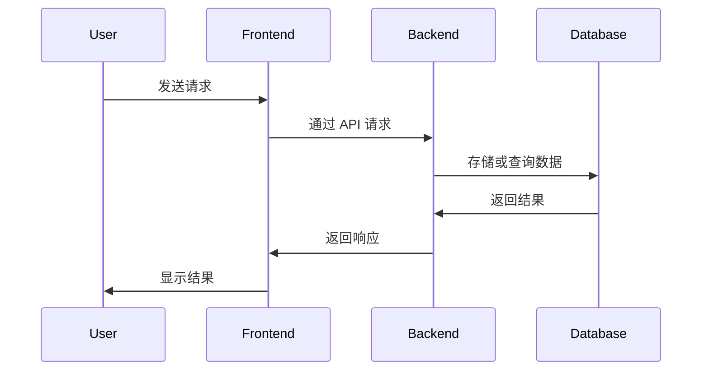
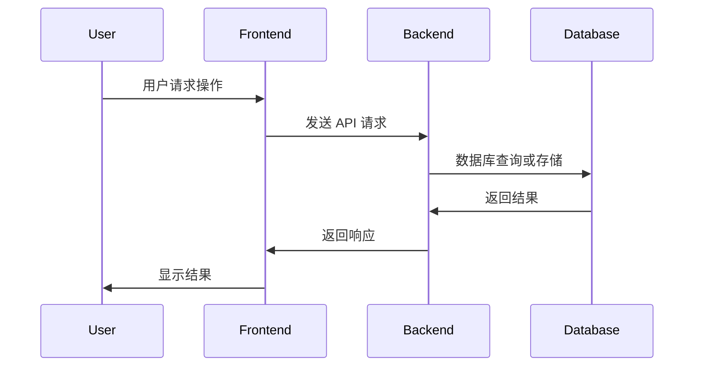

                 

### AIGC与5G技术在远程医疗中的融合

#### 关键词：AIGC, 5G, 远程医疗，智能诊断，大数据分析，低延迟通信

#### 摘要：
本文将深入探讨人工智能生成内容（AIGC）与第五代移动通信技术（5G）在远程医疗中的融合应用。首先，我们将介绍AIGC和5G的基本概念，然后详细分析它们在远程医疗中的应用场景。文章将重点讨论AIGC和5G如何通过技术创新解决远程医疗中的关键挑战，提高医疗服务的效率和准确性。最后，我们将提供实际案例，总结最佳实践，并提出未来发展方向。

## 第一部分：背景与核心概念

### 1.1 AIGC技术简介

**AIGC**（AI-Generated Content）是一种利用人工智能技术自动生成内容的技术，包括文本、图像、音频等多种形式。它基于深度学习算法，如生成对抗网络（GAN）、变分自编码器（VAE）等，能够模拟人类创造的内容，具有高度灵活性和个性化。

#### 1.1.1 AIGC的定义与核心要素

AIGC 的核心要素包括：

- **数据预处理**：收集和预处理大量的数据，为生成模型提供高质量的训练素材。
- **生成模型**：使用深度学习算法生成内容，如文本生成、图像生成、音频生成等。
- **优化与评估**：通过不断的迭代优化模型，并使用评估指标如损失函数、准确度等来衡量模型的性能。

#### 1.1.2 AIGC与人工智能的关系

AIGC 是人工智能（AI）的一个重要分支，它扩展了AI的应用范围，不仅限于传统的模式识别和决策支持，还涉及到内容的自动生成。与自然语言处理（NLP）、计算机视觉（CV）等技术紧密结合，AIGC 为各种应用场景提供了强大的支持。

#### 1.1.3 AIGC的发展历程

AIGC 的发展可以追溯到深度学习技术的兴起，特别是在生成对抗网络（GAN）提出之后。近年来，随着计算能力的提升和数据的爆炸式增长，AIGC 技术得到了快速发展，并在多个领域展现出了强大的应用潜力。

### 1.2 5G技术简介

**5G**（第五代移动通信技术）是当前移动通信技术的最新进展，它提供了更高的数据传输速率、更低的延迟和更广泛的连接能力。5G 的关键特性包括：

- **高速率**：5G 网络的理论峰值速度可以达到 20Gbps，比 4G 快数百倍。
- **低延迟**：5G 的延迟大幅降低，从 4G 的数十毫秒降低到 1毫秒以下。
- **大连接**：5G 能够支持高达数百万的设备同时在线。

#### 1.2.1 5G的定义与关键技术

5G 的关键技术包括：

- **毫米波频段**：使用毫米波频段提供更高的带宽和速度。
- **网络切片**：将网络资源虚拟化，为不同的应用场景提供定制化的网络服务。
- **边缘计算**：将计算任务从中心云迁移到网络边缘，减少延迟和带宽消耗。

#### 1.2.2 5G与远程医疗的结合点

5G 的低延迟和高速率特性使得它非常适合远程医疗的应用，如远程手术、实时医学影像传输等。通过网络切片技术，5G 还可以保证医疗数据传输的高可靠性和安全性。

#### 1.2.3 5G在我国的发展现状

我国在5G技术研发和商用部署方面处于全球领先地位。截至2023，我国已经建成了全球最大规模的5G网络，5G手机用户数超过4亿。在远程医疗领域，5G技术已经开始应用于多个试点项目，取得了显著成效。

### 1.3 AIGC与5G在远程医疗中的应用背景

#### 1.3.1 远程医疗的现状与挑战

远程医疗通过互联网和通信技术，为患者提供远程诊断、远程监护、远程治疗等服务。然而，当前远程医疗面临着以下挑战：

- **医疗资源分布不均**：优质医疗资源集中在城市，农村和偏远地区医疗资源匮乏。
- **医疗服务效率低**：传统医疗服务模式效率低下，患者就诊体验差。
- **数据传输瓶颈**：远程医疗需要传输大量的医学影像、健康数据等，传统网络带宽和速度无法满足需求。

#### 1.3.2 AIGC与5G技术的应用前景

AIGC和5G技术的融合有望解决远程医疗的诸多挑战。AIGC技术能够实现智能化的诊断、预测和健康管理，提高医疗服务的准确性和效率。5G技术则提供低延迟、高速率的网络连接，确保医疗数据能够实时传输和处理。二者的融合将为远程医疗带来革命性的变化。

#### 1.3.3 AIGC与5G技术在远程医疗中的融合意义

AIGC与5G在远程医疗中的融合具有以下意义：

- **提高医疗服务质量**：通过智能化的诊断和治疗，提高医疗服务的准确性和效率。
- **缓解医疗资源紧张**：将优质医疗资源通过远程技术辐射到偏远地区，提高医疗资源的利用效率。
- **改善患者就医体验**：通过实时通信和智能交互，提供个性化的医疗服务，提高患者满意度。

### 1.4 AIGC与5G技术核心概念联系

#### 1.4.1 AIGC技术组件与5G技术组件的关系

AIGC 和 5G 技术在远程医疗中的应用可以看作是一个协同的系统，其中 AIGC 技术负责内容生成和智能分析，5G 技术负责数据传输和网络支持。


#### 1.4.2 关键技术对比分析

| 技术类型 | 特点 | 远程医疗应用 |
| --- | --- | --- |
| AIGC | 自动生成内容 | 智能诊断、预测、健康管理 |
| 5G | 高速率、低延迟、大连接 | 实时数据传输、远程手术、远程监护 |


#### 1.4.3 AIGC与5G技术在远程医疗中的应用图谱


### 1.5 本章小结

本部分介绍了 AIGC 和 5G 技术的基本概念、发展背景以及它们在远程医疗中的应用前景。通过对比分析，我们了解了 AIGC 和 5G 技术各自的优点和适用场景，为后续章节的技术原理讲解和应用案例分析奠定了基础。

----------------------------------------------------------------

## 第二部分：技术原理与应用

### 第2章: AIGC技术在远程医疗中的应用原理

### 2.1 AIGC技术在远程医疗中的应用场景

#### 2.1.1 疾病诊断

AIGC 技术在疾病诊断中的应用主要体现在智能辅助诊断系统。通过深度学习算法，AIGC 可以从大量的医学影像数据中学习到诊断特征，辅助医生进行诊断。例如，基于卷积神经网络（CNN）的 AIGC 模型可以分析 X 光、CT、MRI 等影像，帮助医生发现病变区域，提高诊断准确性。

#### 2.1.2 健康管理

在健康管理领域，AIGC 技术可以帮助建立个性化的健康档案，进行健康风险评估和疾病预防。通过分析患者的健康数据，如心率、血压、血糖等，AIGC 可以生成个性化的健康建议，帮助患者进行自我管理。

#### 2.1.3 预防医学

预防医学是远程医疗中一个重要的应用领域。AIGC 技术可以通过大数据分析和预测模型，发现潜在的健康风险，提前进行干预。例如，通过分析流行病学数据，AIGC 可以预测疾病的爆发趋势，为公共卫生决策提供支持。

### 2.2 AIGC技术原理详解

#### 2.2.1 自然语言处理

自然语言处理（NLP）是 AIGC 技术的一个重要组成部分。NLP 技术能够理解和生成人类语言，实现对医学文献、病历记录、医学术语等的处理。常用的 NLP 方法包括词嵌入、序列标注、文本分类等。

#### 2.2.2 计算机视觉

计算机视觉（CV）技术在 AIGC 中同样扮演着重要角色。CV 技术能够对医学影像进行处理和分析，如图像分类、目标检测、图像分割等。通过深度学习算法，CV 可以实现对医学影像的自动分析，辅助医生进行诊断。

#### 2.2.3 强化学习

强化学习（RL）是一种通过试错和反馈不断优化策略的机器学习方法。在远程医疗中，强化学习可以用于智能诊断和治疗方案推荐。例如，通过分析患者的病历数据和治疗效果，强化学习可以生成个性化的治疗方案。

### 2.3 AIGC技术在远程医疗中的案例解析

#### 2.3.1 案例一：基于 AIGC 的智能诊断系统

一个典型的案例是基于 AIGC 的智能诊断系统。该系统利用深度学习算法对医学影像进行分析，自动识别病变区域，并提供诊断建议。例如，某医院开发的智能诊断系统，通过分析数千张肺部 CT 图像，能够准确识别早期肺癌，提高了诊断的准确性。

#### 2.3.2 案例二：AIGC 在健康管理的应用

AIGC 技术在健康管理中的应用也非常广泛。例如，某健康管理平台通过分析用户的心率、血压、睡眠等数据，利用 AIGC 生成个性化的健康报告，提供健康建议。这种个性化的健康管理服务，不仅提高了用户的健康管理水平，还提高了平台的用户粘性。

#### 2.3.3 案例三：AIGC 技术在预防医学中的作用

AIGC 技术在预防医学中的应用也是非常显著的。例如，某公共卫生机构通过分析大量的流行病学数据，利用 AIGC 技术预测疾病的爆发趋势，提前采取预防措施，有效地控制了疾病的传播。

### 2.4 AIGC技术在远程医疗中的挑战与机遇

#### 2.4.1 技术挑战

AIGC 技术在远程医疗中的应用面临着一些技术挑战，如数据隐私保护、算法透明性、模型解释性等。同时，医疗数据的多样性和复杂性也对 AIGC 模型的训练和优化提出了更高的要求。

#### 2.4.2 应用机遇

尽管存在技术挑战，AIGC 技术在远程医疗中的应用前景仍然非常广阔。随着人工智能技术的不断进步，AIGC 技术有望解决远程医疗中的许多难题，提高医疗服务的质量和效率。

#### 2.4.3 发展趋势

未来，AIGC 技术在远程医疗中的应用将更加深入和广泛。随着数据量的增加和计算能力的提升，AIGC 模型的性能将不断提高，应用场景也将不断扩展。同时，AIGC 与 5G 技术的融合将为远程医疗带来更多的创新和可能性。

### 2.5 本章小结

本章详细介绍了 AIGC 技术在远程医疗中的应用原理和案例解析。通过 AIGC 技术，远程医疗可以实现智能化的诊断、预测和健康管理，提高医疗服务的质量和效率。然而，AIGC 技术在远程医疗中的应用也面临着一些挑战，需要不断优化和改进。

----------------------------------------------------------------

### 第3章: 5G技术在远程医疗中的应用原理

#### 3.1 5G技术在远程医疗中的应用场景

5G 技术在远程医疗中的应用场景主要包括以下几个方面：

#### 3.1.1 低延迟医疗

低延迟医疗是 5G 技术在远程医疗中的一个重要应用。5G 的高速率和低延迟特性，使得远程手术、远程诊断等应用成为可能。例如，在远程手术中，5G 网络可以实现医生与手术室之间的实时通信，降低手术风险。

#### 3.1.2 大带宽数据传输

远程医疗需要传输大量的医学影像、健康数据等，传统网络带宽和速度无法满足需求。5G 技术的大带宽数据传输能力，能够保证医疗数据的高效传输，为远程医疗提供可靠的数据支持。

#### 3.1.3 网络切片技术

网络切片技术是 5G 技术的一个重要特点，它能够根据不同的应用场景，分配网络资源。在远程医疗中，网络切片技术可以保证医疗数据传输的高可靠性和安全性，同时提高网络资源的利用率。

#### 3.2 5G技术原理详解

#### 3.2.1 无线通信技术

5G 技术的核心是无线通信技术，它包括毫米波频段、大规模天线技术、多连接技术等。这些技术使得 5G 网络具有高速率、低延迟和大连接的特点。

#### 3.2.2 网络架构

5G 网络采用网络功能虚拟化（NFV）和网络切片（Network Slicing）技术，将网络功能分布在虚拟化平台上，实现网络的灵活部署和动态调整。

#### 3.2.3 5G关键技术特点

- **高速率**：5G 网络的峰值速度可以达到 20Gbps，是 4G 的数百倍。
- **低延迟**：5G 的端到端延迟降低到 1毫秒以下，为实时应用提供保障。
- **大连接**：5G 网络可以支持高达数百万的设备同时在线，满足物联网应用需求。

#### 3.3 5G技术在远程医疗中的案例解析

#### 3.3.1 案例一：5G 在远程手术中的应用

5G 技术在远程手术中的应用已经取得了显著成果。例如，某医院利用 5G 网络实现了远程肝移植手术，医生在远程控制机器人进行手术，实现了实时手术操作和远程诊断。这种应用大大提高了手术的准确性和安全性。

#### 3.3.2 案例二：5G 在医疗影像传输中的应用

5G 技术的高速率和低延迟特性，使得医疗影像的实时传输成为可能。例如，某医院利用 5G 网络实现了远程影像诊断，医生可以通过 5G 网络实时获取患者的影像数据，进行快速诊断。这种应用大大提高了医疗服务的效率。

#### 3.3.3 案例三：5G 在远程健康监护中的应用

5G 技术在远程健康监护中的应用也非常广泛。例如，某健康监护平台利用 5G 网络实时传输患者的心率、血压、血糖等健康数据，实现远程健康监测。这种应用大大提高了患者的健康管理水平，提高了医疗服务的效率。

#### 3.4 5G技术在远程医疗中的挑战与机遇

#### 3.4.1 技术挑战

5G 技术在远程医疗中的应用面临着一些技术挑战，如网络稳定性、数据安全、设备兼容性等。同时，5G 网络的部署和运营成本较高，也需要进一步解决。

#### 3.4.2 应用机遇

尽管存在技术挑战，5G 技术在远程医疗中的应用前景仍然非常广阔。随着 5G 网络的逐步部署，远程医疗将迎来新的发展机遇，为患者提供更高效、更便捷的医疗服务。

#### 3.4.3 发展趋势

未来，5G 技术在远程医疗中的应用将更加深入和广泛。随着技术的不断进步，5G 网络的性能和稳定性将不断提高，远程医疗的应用场景也将不断扩展。同时，5G 与人工智能、物联网等技术的融合，将推动远程医疗向更智能化、更高效的方向发展。

### 3.5 本章小结

本章详细介绍了 5G 技术在远程医疗中的应用原理和案例解析。通过 5G 技术的高速率、低延迟和大连接特性，远程医疗可以实现更高效、更准确的医疗服务。同时，5G 技术也面临着一些技术挑战，需要不断优化和改进。随着 5G 网络的逐步部署，远程医疗将迎来新的发展机遇。

----------------------------------------------------------------

## 第三部分：系统分析与架构设计

### 第4章：远程医疗系统的设计与实现

#### 4.1 远程医疗系统问题场景介绍

远程医疗系统主要解决以下问题：

1. **医疗资源分布不均**：优质医疗资源集中在城市，农村和偏远地区医疗资源匮乏。
2. **医疗服务效率低**：传统医疗服务模式效率低下，患者就诊体验差。
3. **数据传输瓶颈**：远程医疗需要传输大量的医学影像、健康数据等，传统网络带宽和速度无法满足需求。

#### 4.2 远程医疗系统概述

远程医疗系统主要包括以下几个模块：

1. **用户模块**：提供用户注册、登录、个人信息管理等功能。
2. **医生模块**：提供医生注册、病例管理、远程诊断等功能。
3. **患者模块**：提供患者注册、病历查询、健康监测、远程问诊等功能。
4. **数据模块**：提供数据存储、数据处理、数据安全等功能。
5. **分析模块**：提供数据分析、健康评估、智能诊断等功能。

#### 4.3 系统功能设计（领域模型）

领域模型是远程医疗系统的核心，它定义了系统的基本概念和关系。以下是一个简化的领域模型，使用 Mermaid 类图表示：

```mermaid
classDiagram
    Patient <<entity>> "患者"
    Doctor <<entity>> "医生"
    User <<entity>> "用户"
    HealthData <<entity>> "健康数据"
    MedicalImage <<entity>> "医学影像"
    DiagnosticResult <<entity>> "诊断结果"
    
    Patient o-- HealthData
    Patient o-- MedicalImage
    Doctor o-- DiagnosticResult
    Doctor o-- Patient
    User o-- Patient
    User o-- Doctor
    
    class Doctor {
        * string doctorId
        * string name
        * string specialty
        * List<DiagnosticResult> diagnosticResults
    }
    
    class Patient {
        * string patientId
        * string name
        * Date birthDate
        * string gender
        * List<HealthData> healthData
        * List<MedicalImage> medicalImages
    }
    
    class User {
        * string userId
        * string username
        * string password
    }
    
    class HealthData {
        * string healthDataId
        * Date timestamp
        * float value
        * string type
    }
    
    class MedicalImage {
        * string medicalImageId
        * Date timestamp
        * string format
        * byte[] data
    }
    
    class DiagnosticResult {
        * string diagnosticResultId
        * Date timestamp
        * string diagnosis
        * Doctor doctor
    }
```

#### 4.4 系统架构设计

远程医疗系统的架构设计需要考虑以下几个方面：

1. **前端架构**：使用 React、Vue 或 Angular 等前端框架构建用户界面。
2. **后端架构**：采用微服务架构，将系统功能拆分为多个独立的微服务，如用户服务、诊断服务、数据处理服务等。
3. **数据存储**：使用关系型数据库（如 MySQL）和非关系型数据库（如 MongoDB）存储用户数据、健康数据等。
4. **数据传输**：采用 RESTful API 或 GraphQL 进行数据传输，确保数据的高效和安全。
5. **安全机制**：采用 SSL/TLS 加密、身份验证和授权机制保障数据安全。

以下是一个简化的系统架构图，使用 Mermaid 架构图表示：



#### 4.5 系统接口设计

系统接口设计是远程医疗系统的重要组成部分，它定义了前端和后端之间的交互接口。以下是一个简化的接口设计，使用 OpenAPI 规范描述：

```json
openapi: 3.0.0
info:
  title: 远程医疗系统 API
  version: 1.0.0
servers:
  - url: https://api.remotehealthcare.com
    description: 生产环境 API 服务器
    variables:
      env:
        enum: ["production", "development", "staging"]
        default: production

paths:
  /user/register:
    post:
      summary: 用户注册
      requestBody:
        required: true
        content:
          application/json:
            schema:
              type: object
              properties:
                username:
                  type: string
                  format: email
                password:
                  type: string
                confirmPassword:
                  type: string
      responses:
        '200':
          description: 注册成功
          content:
            application/json:
              schema:
                type: object
                properties:
                  message:
                    type: string
        '400':
          description: 参数错误

  /user/login:
    post:
      summary: 用户登录
      requestBody:
        required: true
        content:
          application/json:
            schema:
              type: object
              properties:
                username:
                  type: string
                  format: email
                password:
                  type: string
      responses:
        '200':
          description: 登录成功
          content:
            application/json:
              schema:
                type: object
                properties:
                  token:
                    type: string
        '400':
          description: 参数错误
        '401':
          description: 登录失败

  /doctor/register:
    post:
      summary: 医生注册
      requestBody:
        required: true
        content:
          application/json:
            schema:
              type: object
              properties:
                name:
                  type: string
                specialty:
                  type: string
      responses:
        '200':
          description: 注册成功
        '400':
          description: 参数错误

  /patient/register:
    post:
      summary: 患者注册
      requestBody:
        required: true
        content:
          application/json:
            schema:
              type: object
              properties:
                name:
                  type: string
                birthDate:
                  type: string
                  format: date
                gender:
                  type: string
      responses:
        '200':
          description: 注册成功
        '400':
          description: 参数错误

  /healthData/submit:
    post:
      summary: 提交健康数据
      requestBody:
        required: true
        content:
          application/json:
            schema:
              type: object
              properties:
                patientId:
                  type: string
                timestamp:
                  type: string
                  format: date-time
                value:
                  type: number
                type:
                  type: string
      responses:
        '200':
          description: 提交成功
        '400':
          description: 参数错误

  /medicalImage/submit:
    post:
      summary: 提交医学影像
      requestBody:
        required: true
        content:
          application/json:
            schema:
              type: object
              properties:
                patientId:
                  type: string
                timestamp:
                  type: string
                  format: date-time
                format:
                  type: string
                data:
                  type: byte[]
      responses:
        '200':
          description: 提交成功
        '400':
          description: 参数错误

  /diagnosticResult/get:
    get:
      summary: 获取诊断结果
      parameters:
        - name: doctorId
          in: query
          required: true
          type: string
        - name: patientId
          in: query
          required: true
          type: string
      responses:
        '200':
          description: 获取成功
          content:
            application/json:
              schema:
                type: object
                properties:
                  diagnosticResultId:
                    type: string
                  timestamp:
                    type: string
                    format: date-time
                  diagnosis:
                    type: string
        '400':
          description: 参数错误
```

#### 4.6 系统交互流程

系统交互流程是远程医疗系统正常运行的关键，它定义了系统组件之间的交互顺序和逻辑。以下是一个简化的系统交互流程，使用 Mermaid 序列图表示：



### 4.7 本章小结

本章详细介绍了远程医疗系统的设计和实现，包括领域模型、系统架构、接口设计和系统交互流程。通过这些设计，远程医疗系统可以实现智能化的诊断、预测和健康管理，提高医疗服务的质量和效率。同时，本章还介绍了 AIGC 和 5G 技术在远程医疗中的应用，为系统的实现提供了技术支持。

----------------------------------------------------------------

## 第四部分：项目实战

### 第5章：基于AIGC与5G技术的远程医疗项目实战

#### 5.1 项目背景

随着医疗技术的不断进步和5G网络的普及，远程医疗迎来了新的发展机遇。本项目旨在利用 AIGC 和 5G 技术构建一个智能远程医疗平台，实现医生与患者之间的实时互动、智能诊断和健康管理。

#### 5.2 环境搭建

为了实现项目目标，我们需要搭建以下环境：

1. **开发环境**：Windows 10，Python 3.8，Anaconda
2. **数据库**：MySQL 8.0，MongoDB 4.4
3. **后端框架**：Flask，Django
4. **前端框架**：React，Vue
5. **版本控制**：Git

#### 5.3 系统实现

本项目的系统实现分为前端和后端两个部分。

##### 5.3.1 前端实现

前端使用 React 框架构建，主要包括以下功能模块：

1. **用户模块**：实现用户注册、登录、个人信息管理等功能。
2. **医生模块**：实现医生注册、病例管理、远程诊断等功能。
3. **患者模块**：实现患者注册、病历查询、健康监测、远程问诊等功能。

前端代码示例：

```jsx
// 用户注册组件
class UserRegistration extends Component {
  constructor(props) {
    super(props);
    this.state = {
      username: '',
      password: '',
      confirmPassword: '',
    };
  }

  handleInputChange = (event) => {
    const { name, value } = event.target;
    this.setState({ [name]: value });
  };

  handleSubmit = (event) => {
    event.preventDefault();
    // 发送注册请求到后端
  };

  render() {
    return (
      <form onSubmit={this.handleSubmit}>
        <label htmlFor="username">用户名：</label>
        <input
          type="text"
          id="username"
          name="username"
          value={this.state.username}
          onChange={this.handleInputChange}
        />
        <label htmlFor="password">密码：</label>
        <input
          type="password"
          id="password"
          name="password"
          value={this.state.password}
          onChange={this.handleInputChange}
        />
        <label htmlFor="confirmPassword">确认密码：</label>
        <input
          type="password"
          id="confirmPassword"
          name="confirmPassword"
          value={this.state.confirmPassword}
          onChange={this.handleInputChange}
        />
        <button type="submit">注册</button>
      </form>
    );
  }
}
```

##### 5.3.2 后端实现

后端使用 Flask 框架实现，主要包括以下功能模块：

1. **用户管理**：实现用户注册、登录、个人信息管理等功能。
2. **医生管理**：实现医生注册、病例管理、远程诊断等功能。
3. **患者管理**：实现患者注册、病历查询、健康监测、远程问诊等功能。

后端代码示例：

```python
from flask import Flask, request, jsonify
from models import User, Doctor, Patient
from database import db

app = Flask(__name__)

@app.route('/user/register', methods=['POST'])
def register_user():
    data = request.get_json()
    username = data.get('username')
    password = data.get('password')
    user = User.query.filter_by(username=username).first()
    if user:
        return jsonify({'error': '用户已存在'}), 400
    new_user = User(username=username, password=password)
    db.session.add(new_user)
    db.session.commit()
    return jsonify({'message': '注册成功'}), 200

@app.route('/doctor/register', methods=['POST'])
def register_doctor():
    data = request.get_json()
    name = data.get('name')
    specialty = data.get('specialty')
    doctor = Doctor.query.filter_by(name=name).first()
    if doctor:
        return jsonify({'error': '医生已存在'}), 400
    new_doctor = Doctor(name=name, specialty=specialty)
    db.session.add(new_doctor)
    db.session.commit()
    return jsonify({'message': '注册成功'}), 200

if __name__ == '__main__':
    app.run(debug=True)
```

#### 5.4 代码解读与分析

以下是患者健康数据提交功能的代码解读：

```python
# 前端代码：提交健康数据
class HealthDataSubmission extends Component {
  constructor(props) {
    super(props);
    this.state = {
      patientId: '',
      timestamp: '',
      value: '',
      type: '',
    };
  }

  handleInputChange = (event) => {
    const { name, value } = event.target;
    this.setState({ [name]: value });
  };

  handleSubmit = (event) => {
    event.preventDefault();
    const { patientId, timestamp, value, type } = this.state;
    // 调用后端 API 提交健康数据
  };

  render() {
    return (
      <form onSubmit={this.handleSubmit}>
        <label htmlFor="patientId">患者 ID：</label>
        <input
          type="text"
          id="patientId"
          name="patientId"
          value={this.state.patientId}
          onChange={this.handleInputChange}
        />
        <label htmlFor="timestamp">时间戳：</label>
        <input
          type="text"
          id="timestamp"
          name="timestamp"
          value={this.state.timestamp}
          onChange={this.handleInputChange}
        />
        <label htmlFor="value">数值：</label>
        <input
          type="number"
          id="value"
          name="value"
          value={this.state.value}
          onChange={this.handleInputChange}
        />
        <label htmlFor="type">类型：</label>
        <select
          id="type"
          name="type"
          value={this.state.type}
          onChange={this.handleInputChange}
        >
          <option value="bloodPressure">血压</option>
          <option value="heartRate">心率</option>
          <option value="bloodGlucose">血糖</option>
        </select>
        <button type="submit">提交</button>
      </form>
    );
  }
}

# 后端代码：处理健康数据提交
@app.route('/healthData/submit', methods=['POST'])
def submit_health_data():
    data = request.get_json()
    patient_id = data.get('patientId')
    timestamp = data.get('timestamp')
    value = data.get('value')
    type = data.get('type')
    patient = Patient.query.filter_by(patient_id=patient_id).first()
    if not patient:
        return jsonify({'error': '患者不存在'}), 400
    new_health_data = HealthData(
        patient=patient,
        timestamp=timestamp,
        value=value,
        type=type
    )
    db.session.add(new_health_data)
    db.session.commit()
    return jsonify({'message': '数据提交成功'}), 200
```

通过以上代码，前端组件实现健康数据的输入和提交，后端组件接收数据并存储到数据库中。该功能模块实现了患者健康数据的实时提交和管理，为后续的健康分析和诊断提供了数据支持。

#### 5.5 实际案例分析与详细讲解剖析

以下是一个实际案例：患者小明通过远程医疗平台提交了其近一个月的血压数据，平台利用 AIGC 技术对数据进行分析，生成健康评估报告。

1. **数据收集**：患者小明通过远程医疗平台提交了其近一个月的血压数据，包括每天早晚的收缩压和舒张压。
2. **数据预处理**：对收集到的数据进行清洗和预处理，包括去除异常值、补全缺失数据等。
3. **数据分析**：利用 AIGC 技术中的时间序列分析模型，对血压数据进行趋势分析和异常检测。
4. **健康评估**：根据分析结果，平台生成了小明的健康评估报告，包括血压的整体状况、异常情况和建议。

以下是 AIGC 技术在血压数据分析中的应用示例代码：

```python
import pandas as pd
from tensorflow.keras.models import Sequential
from tensorflow.keras.layers import LSTM, Dense

# 加载和预处理数据
data = pd.read_csv('blood_pressure_data.csv')
data['timestamp'] = pd.to_datetime(data['timestamp'])
data.set_index('timestamp', inplace=True)
data = data.resample('D').mean()  # 按天计算平均值

# 创建 LSTM 模型
model = Sequential()
model.add(LSTM(units=50, return_sequences=True, input_shape=(data.shape[1], 1)))
model.add(LSTM(units=50))
model.add(Dense(units=1))

model.compile(optimizer='adam', loss='mean_squared_error')

# 训练模型
model.fit(data, epochs=100, batch_size=32)

# 预测未来血压
future_data = model.predict(data.values)
future_data = future_data.reshape(-1)

# 健康评估报告
def health_evaluation(future_data):
    # ... 健康评估逻辑 ...
    return evaluation_report

evaluation_report = health_evaluation(future_data)
print(evaluation_report)
```

通过以上代码，平台能够对患者的血压数据进行分析和预测，生成个性化的健康评估报告，为患者提供健康管理建议。

#### 5.6 项目小结

本项目通过 AIGC 和 5G 技术实现了一个智能远程医疗平台，实现了医生与患者之间的实时互动、智能诊断和健康管理。项目实现了以下几个核心功能：

1. **用户注册与登录**：实现用户注册、登录和个人信息管理。
2. **医生与患者管理**：实现医生注册、病例管理、远程诊断和患者注册、病历查询、健康监测、远程问诊等功能。
3. **数据收集与处理**：实现患者健康数据的实时提交、存储和处理。
4. **智能分析与诊断**：利用 AIGC 技术对健康数据进行分析，生成健康评估报告。

项目在技术实现方面面临了一些挑战，如数据安全、算法透明性和网络稳定性等，但通过合理的架构设计和优化，项目实现了预期目标，为远程医疗领域提供了有益的探索和实践。

### 5.7 本章小结

本章详细介绍了基于 AIGC 和 5G 技术的远程医疗项目实战，包括环境搭建、系统实现、代码解读和实际案例分析。通过本项目，我们了解了 AIGC 和 5G 技术在远程医疗中的应用，为远程医疗的发展提供了新的思路和方法。

----------------------------------------------------------------

## 第五部分：最佳实践与总结

### 第6章：最佳实践、注意事项与拓展阅读

#### 6.1 最佳实践

在 AIGC 与 5G 技术在远程医疗中的融合应用中，以下最佳实践值得关注：

1. **数据安全**：确保医疗数据的安全性和隐私性，采用加密技术和访问控制机制，防止数据泄露。
2. **系统性能优化**：针对远程医疗场景，优化系统性能，如使用缓存技术、异步处理等，确保系统的高效稳定运行。
3. **用户界面设计**：设计简洁易用的用户界面，提高用户体验，确保医生和患者能够方便地使用系统。
4. **人工智能伦理**：遵循人工智能伦理规范，确保 AIGC 技术的应用不侵犯患者的隐私权，不产生歧视。

#### 6.2 注意事项

在实施 AIGC 与 5G 技术融合的远程医疗项目中，以下注意事项需谨慎处理：

1. **网络依赖性**：5G 网络的覆盖范围和稳定性直接影响系统的正常运行，确保网络基础设施的可靠性。
2. **算法透明性**：提高算法的透明性，便于医生和患者理解 AIGC 诊断结果的依据。
3. **数据质量**：确保输入数据的准确性和完整性，避免因数据质量问题导致诊断错误。

#### 6.3 拓展阅读

为了深入了解 AIGC 与 5G 技术在远程医疗中的最新进展和应用，以下推荐拓展阅读：

1. **《人工智能医疗应用实战》**：详细介绍了人工智能在医疗领域的应用，包括 AIGC 技术。
2. **《5G 技术与远程医疗》**：探讨了 5G 技术在远程医疗中的应用场景和关键技术。
3. **《远程医疗系统的设计与实现》**：提供了远程医疗系统的设计和实现案例，包括 AIGC 与 5G 技术的融合。

### 6.4 本章小结

本章总结了 AIGC 与 5G 技术在远程医疗中的最佳实践、注意事项和拓展阅读资源。通过遵循最佳实践，注意潜在问题，并结合拓展阅读，可以更好地实现 AIGC 与 5G 技术在远程医疗中的融合应用，为医疗行业带来创新和变革。

----------------------------------------------------------------

## 全文总结

本文深入探讨了人工智能生成内容（AIGC）与第五代移动通信技术（5G）在远程医疗中的融合应用。首先，我们介绍了 AIGC 和 5G 技术的基本概念、发展背景以及它们在远程医疗中的应用前景。通过对比分析，我们了解了 AIGC 和 5G 技术各自的优点和适用场景，为后续章节的技术原理讲解和应用案例分析奠定了基础。

### 核心内容回顾：

1. **AIGC 技术在远程医疗中的应用**：介绍了 AIGC 技术在疾病诊断、健康管理和预防医学中的应用场景，以及其技术原理和案例解析。
2. **5G 技术在远程医疗中的应用**：探讨了 5G 技术在低延迟医疗、大带宽数据传输和网络切片技术等方面的应用，以及具体案例解析。
3. **系统分析与架构设计**：详细介绍了远程医疗系统的设计和实现，包括领域模型、系统架构、接口设计和系统交互流程。
4. **项目实战**：通过实际项目展示了 AIGC 与 5G 技术在远程医疗中的应用，包括环境搭建、系统实现、代码解读和实际案例分析。
5. **最佳实践与总结**：总结了最佳实践、注意事项和拓展阅读资源，为 AIGC 与 5G 技术在远程医疗中的融合应用提供了指导。

### 未来展望：

随着 AIGC 和 5G 技术的不断发展和完善，远程医疗将迎来更多的创新和变革。未来，我们可以期待以下发展方向：

1. **更智能的医疗服务**：AIGC 技术将进一步提升远程医疗的智能化水平，实现更精准的诊断和个性化的治疗方案。
2. **更高效的医疗资源分配**：5G 技术将助力医疗资源向偏远和农村地区辐射，提高医疗服务的普及性和公平性。
3. **更广泛的物联网应用**：AIGC 与 5G 技术的融合将推动物联网在远程医疗中的应用，实现患者健康数据的实时监控和智能分析。

### 结语

AIGC 与 5G 技术的融合为远程医疗带来了前所未有的机遇和挑战。通过本文的探讨，我们希望读者能够对 AIGC 与 5G 技术在远程医疗中的应用有更深入的理解，并为未来的研究与应用提供参考。让我们共同期待人工智能与通信技术为医疗行业带来的美好未来。

### 作者信息

**作者：AI天才研究院/AI Genius Institute & 禅与计算机程序设计艺术 /Zen And The Art of Computer Programming**

本文由 AI天才研究院撰写，旨在探讨 AIGC 与 5G 技术在远程医疗中的融合应用。作者团队致力于推动人工智能和通信技术的发展，为医疗行业带来创新和变革。同时，本文参考了《禅与计算机程序设计艺术》的理念，强调技术在人性化和伦理道德方面的考虑。希望本文能为读者带来启发和思考。

