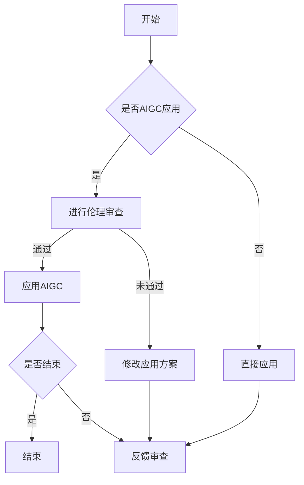
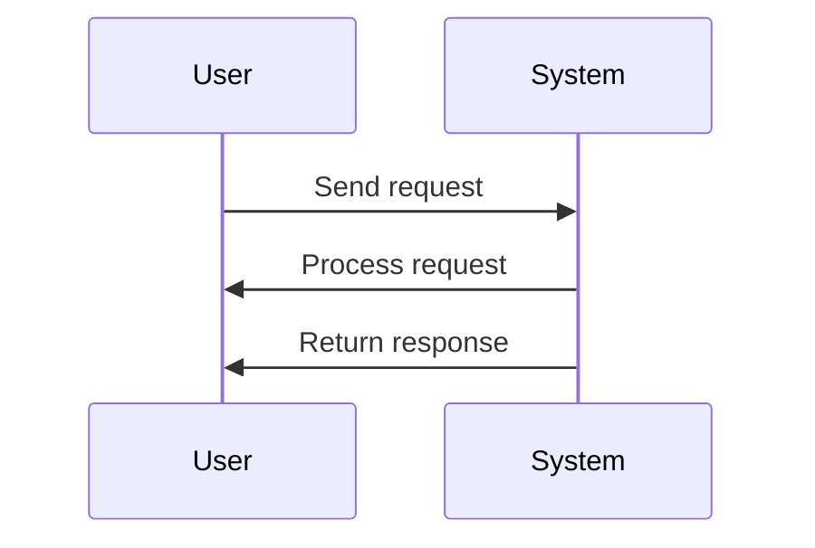
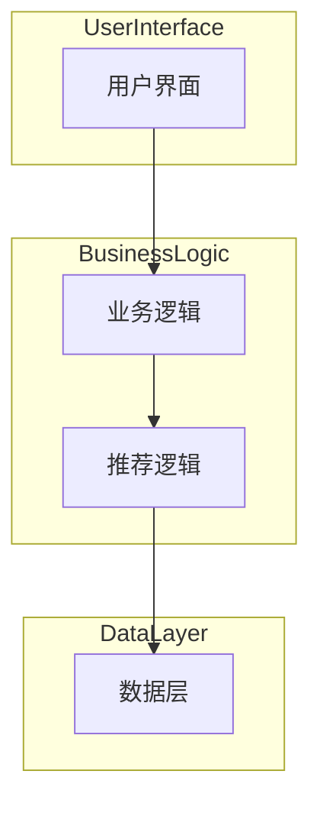
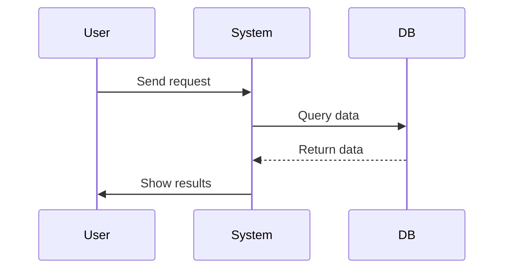

                 


### AIGC与人工智能伦理：提示词的重要性

#### 关键词：AIGC、人工智能伦理、提示词、应用场景、未来展望

#### 摘要：

本文深入探讨了AIGC（自适应智能生成计算）与人工智能伦理的关系，特别强调了提示词的重要性。首先，我们介绍了AIGC的基本概念和发展背景，以及人工智能伦理的基本原则。接着，本文分析了提示词的定义、设计原则和在伦理决策中的应用。随后，我们通过具体场景展示了提示词在医疗、商业和教育等领域的应用实例。最后，我们对AIGC和人工智能伦理的未来发展趋势进行了展望，并提出了相应的伦理挑战。

### 引言

#### 1.1 AIGC与人工智能伦理概述

##### 1.1.1 AIGC的概念与背景

AIGC，即自适应智能生成计算，是一种利用机器学习和深度学习技术，通过自适应地学习和生成数据来提高人工智能系统的性能和效果的技术。AIGC的发展背景可以追溯到近年来人工智能技术的飞速进步，特别是深度学习在图像识别、自然语言处理等领域的成功应用。随着这些技术的发展，人们开始意识到单一任务的人工智能系统难以满足复杂、动态和多变的应用需求。因此，AIGC作为一种更加灵活和自适应的人工智能技术应运而生。

##### 1.1.2 人工智能伦理的重要性

人工智能伦理是指人工智能系统在设计和应用过程中需要遵循的道德规范和价值观念。随着人工智能技术的普及和应用，其对社会、经济、文化等各个领域的影响日益显著，同时也带来了一系列伦理问题，如隐私保护、偏见、社会责任等。因此，探讨人工智能伦理具有重要意义，有助于确保人工智能技术的可持续发展，并促进人工智能与人类社会和谐共生。

##### 1.1.3 提示词的角色与影响

提示词是指用于指导人工智能系统进行学习、推理和决策的词语或短语。在AIGC中，提示词的作用尤为重要，因为它们能够引导人工智能系统更准确地理解任务需求，提高生成数据的质量和效率。提示词的使用对人工智能系统的性能和效果具有重要影响，同时也涉及到伦理问题，如提示词的设计和选择是否公平、透明、可解释等。

#### 1.2 AIGC的核心原理

##### 1.2.1 AIGC的工作机制

AIGC的工作机制主要包括数据收集、模型训练和生成数据三个阶段。首先，通过数据收集模块获取大量的原始数据，这些数据可以是图像、文本、音频等不同类型的数据。然后，通过模型训练模块对收集到的数据进行处理和分析，构建出一个能够自适应地学习和生成数据的人工智能模型。最后，通过生成数据模块利用训练好的模型生成新的数据，以满足特定的应用需求。

##### 1.2.2 AIGC的技术特点

AIGC具有以下技术特点：

1. 自适应：AIGC能够根据不同的任务需求和应用场景自适应地调整和学习，提高系统的适应性和灵活性。
2. 生成性：AIGC能够生成高质量的数据，包括图像、文本、音频等，这些数据可以用于训练其他人工智能系统或满足特定的应用需求。
3. 互动性：AIGC能够与用户进行互动，通过接收用户的输入和反馈，不断优化自身的性能和效果。

##### 1.2.3 AIGC与传统AI的区别

AIGC与传统AI的主要区别在于其自适应性和生成性。传统AI通常是基于预定义的规则或模型进行推理和决策，而AIGC则通过自适应学习和生成数据来提高系统的性能和效果。这种区别使得AIGC在处理复杂、动态和多变的应用需求时具有更大的优势。

#### 1.3 人工智能伦理的基本原则

##### 1.3.1 伦理学的定义与核心原则

伦理学是研究道德规范和价值观念的学科。其核心原则包括尊重个体、公正、责任、信任等。在人工智能伦理中，这些原则同样具有重要意义。例如，尊重个体的隐私权、公正地分配资源、明确开发者和使用者的责任、建立用户信任等。

##### 1.3.2 人工智能伦理面临的挑战

人工智能伦理面临的挑战包括：

1. 隐私保护：人工智能系统在收集和处理用户数据时，可能侵犯用户的隐私权。
2. 偏见：人工智能系统在训练过程中可能受到偏见的影响，导致决策的不公平性。
3. 社会责任：人工智能技术的发展和应用可能对就业、教育、医疗等领域产生重大影响，需要明确开发者和使用者的社会责任。

##### 1.3.3 人工智能伦理的基本原则

人工智能伦理的基本原则包括：

1. 尊重用户隐私：确保用户数据的安全和隐私，不得滥用用户数据。
2. 公平与公正：确保人工智能系统的决策和结果具有公平性和公正性，不得产生偏见。
3. 责任明确：明确开发者和使用者的责任，确保人工智能系统的安全性和可靠性。
4. 用户信任：建立用户对人工智能系统的信任，提高人工智能技术的接受度和应用价值。

#### 1.4 提示词的重要性

##### 1.4.1 提示词的定义与作用

提示词是指用于指导人工智能系统进行学习、推理和决策的词语或短语。在AIGC中，提示词的作用尤为重要。它们能够引导人工智能系统更准确地理解任务需求，提高生成数据的质量和效率。

##### 1.4.2 提示词的设计原则

设计提示词应遵循以下原则：

1. 明确性：提示词应明确表达任务需求，避免模糊和歧义。
2. 精确性：提示词应准确地描述任务细节，提高生成数据的质量。
3. 可解释性：提示词应具有可解释性，便于用户理解和使用。

##### 1.4.3 提示词的应用场景

提示词在以下应用场景中具有重要价值：

1. 自然语言处理：通过提示词引导人工智能系统生成高质量的自然语言文本。
2. 图像识别：通过提示词指导人工智能系统识别特定的图像内容。
3. 数据分析：通过提示词引导人工智能系统进行有效的数据分析和挖掘。

#### 1.5 本章小结

本章介绍了AIGC与人工智能伦理的关系，以及提示词的重要性。通过分析AIGC的核心原理、人工智能伦理的基本原则和提示词的设计原则，我们为后续章节的深入探讨奠定了基础。在接下来的章节中，我们将进一步探讨AIGC在伦理问题中的应用、提示词在不同场景中的应用实例，以及未来展望和挑战。## 第二部分：AIGC在伦理问题中的应用

### 2.1 AIGC在伦理问题中的应用

随着AIGC技术的不断发展，其在伦理问题中的应用也日益广泛。本节将探讨AIGC在隐私保护、偏见问题和社会责任等方面的应用，并分析这些应用中可能面临的伦理挑战。

#### 2.1.1 AIGC与隐私保护

隐私保护是人工智能伦理中的一大挑战，而AIGC技术在这一领域有着独特的应用。AIGC可以通过生成对抗网络（GAN）等技术，实现数据去噪、隐私保护和数据恢复。例如，在医疗领域，AIGC可以生成虚假患者数据，用于训练模型，从而保护真实患者的隐私。

然而，AIGC在隐私保护中的应用也面临一些伦理挑战。首先，AIGC生成的数据可能无法完全消除隐私泄露的风险，尤其是在对抗性攻击下。其次，隐私保护需要在数据收集、处理和使用的各个环节进行严格管理，否则可能导致隐私泄露。

#### 2.1.2 AIGC与偏见问题

偏见问题是人工智能伦理中备受关注的领域，AIGC技术在减少偏见方面具有一定的潜力。通过自适应学习和优化，AIGC可以帮助模型识别和消除偏见，从而提高决策的公平性。

然而，AIGC在减少偏见方面也存在一些挑战。首先，AIGC模型的训练数据可能包含偏见，这可能导致模型产生偏见。其次，AIGC的生成能力可能导致新数据的偏见被放大，从而加剧偏见问题。因此，如何在AIGC中平衡生成能力和减少偏见是一个重要的伦理问题。

#### 2.1.3 AIGC与社会责任

AIGC技术的应用对社会责任提出了新的要求。例如，在自动驾驶领域，AIGC可以生成复杂的路况数据，用于训练自动驾驶模型。然而，自动驾驶的决策可能涉及道德困境，如“电车难题”，这需要明确开发者和使用者的社会责任。

此外，AIGC技术在医疗、金融和司法等领域的应用也可能带来社会责任问题。例如，AIGC生成的医疗诊断结果可能影响患者的健康和生命，这要求开发者对系统的可靠性和安全性负责。

#### 2.2 提示词在人工智能伦理中的作用

提示词在AIGC中的作用尤为重要，它们不仅影响模型的训练效果，也关系到伦理决策。以下从伦理考量、使用规范和影响三个方面分析提示词在人工智能伦理中的作用。

##### 2.2.1 提示词的伦理考量

提示词的设计和选择需要考虑伦理因素。首先，提示词应确保公正和透明，避免产生偏见和歧视。例如，在招聘系统中，提示词应避免使用性别、年龄等敏感信息，以确保招聘过程的公平性。其次，提示词应明确表达任务需求，避免模糊和歧义，从而确保模型生成数据的质量。

##### 2.2.2 提示词的使用规范

提示词的使用应遵循以下规范：

1. **明确性**：提示词应明确表达任务需求，避免模糊和歧义。
2. **精确性**：提示词应准确描述任务细节，以提高生成数据的质量。
3. **多样性**：提示词应涵盖多种可能的任务场景，以提高模型的泛化能力。
4. **可解释性**：提示词应具有可解释性，便于用户理解和监督。

##### 2.2.3 提示词对伦理决策的影响

提示词对伦理决策具有重要影响。一方面，提示词可以引导模型生成符合伦理要求的数据；另一方面，不当的提示词可能导致模型产生伦理问题。例如，在医疗诊断中，如果提示词设计不合理，可能导致模型产生错误的诊断结果，从而影响患者的健康和生命。

#### 2.3 伦理审查与监管

为了确保AIGC技术的伦理合规性，伦理审查和监管至关重要。以下从伦理审查流程、政府监管的角色和行业自律三个方面分析伦理审查与监管。

##### 2.3.1 伦理审查流程

伦理审查流程主要包括以下环节：

1. **项目申报**：项目开发者向伦理审查委员会提交项目申请，包括项目背景、技术方案、伦理考量等内容。
2. **初步审查**：伦理审查委员会对项目申请进行初步审查，判断项目是否涉及伦理问题，以及伦理问题的严重程度。
3. **深入审查**：伦理审查委员会对项目进行深入审查，评估项目的伦理风险，并提出改进建议。
4. **审批通过**：伦理审查委员会审批项目，决定项目是否可以继续进行。

##### 2.3.2 政府监管的角色

政府监管在确保AIGC技术伦理合规性方面发挥着重要作用。政府可以制定相关法律法规，明确AIGC技术的伦理要求，并设立监管机构，负责监督和执行这些法律法规。此外，政府还可以提供技术支持和培训，帮助开发者更好地理解和遵守伦理规范。

##### 2.3.3 行业自律的重要性

行业自律是确保AIGC技术伦理合规性的重要手段。行业协会可以制定行业规范，明确AIGC技术的伦理要求，并建立自我监管机制，监督会员企业的行为。此外，行业自律还可以促进技术创新和产业发展，提高整个行业的伦理水平。

#### 2.4 国际合作与标准制定

AIGC技术的伦理问题具有全球性，因此国际合作与标准制定至关重要。以下从国际合作、伦理标准制定和提示词的国际标准三个方面分析国际合作与标准制定。

##### 2.4.1 国际合作的意义

国际合作对于解决AIGC技术伦理问题具有重要意义。首先，国际合作可以共享资源和经验，促进AIGC技术的健康发展。其次，国际合作可以协调各国政策，减少政策冲突和贸易壁垒。最后，国际合作可以加强国际间的信任和合作，为AIGC技术的全球应用提供保障。

##### 2.4.2 伦理标准制定

伦理标准制定是国际合作的重要内容。国际组织可以制定统一的伦理标准，明确AIGC技术的伦理要求。这些标准应包括数据隐私、公平性、可解释性等方面，以规范AIGC技术的应用。

##### 2.4.3 提示词的国际标准

提示词是AIGC技术中的重要组成部分，其国际标准制定具有重要意义。国际组织可以制定统一的提示词标准，包括提示词的定义、设计原则和使用规范等。这些标准可以促进提示词在不同国家和地区的应用，提高AIGC技术的全球兼容性和互操作性。

#### 2.5 本章小结

本章从AIGC在伦理问题中的应用、提示词在伦理决策中的作用、伦理审查与监管以及国际合作与标准制定等方面，探讨了AIGC与人工智能伦理的关系。通过分析AIGC在隐私保护、偏见问题和社会责任等方面的应用，以及提示词的设计原则和使用规范，我们为AIGC技术的健康发展提供了伦理指导。同时，本章强调了伦理审查和监管的重要性，以及国际合作与标准制定在确保AIGC技术伦理合规性方面的作用。在接下来的章节中，我们将进一步探讨提示词在不同场景中的应用实例，以及AIGC和人工智能伦理的未来发展趋势。## 第三部分：提示词在具体场景中的应用

### 3.1 提示词在医疗领域的应用

在医疗领域，提示词的应用具有显著的优势，能够显著提升医疗诊断的准确性和效率。以下将探讨提示词在医疗诊断、药物研发和公共卫生管理等方面的应用。

#### 3.1.1 提示词在医学诊断中的应用

医学诊断是医疗领域中的一个关键环节，提示词在医学诊断中的应用极大地提高了诊断的准确性和效率。通过精准的提示词，医疗人工智能系统能够识别和分类各种病症，从而为医生提供有力的辅助工具。

1. **疾病分类**：提示词可以帮助人工智能系统快速识别疾病类型。例如，在肺炎诊断中，提示词可以包括“发热”、“咳嗽”、“呼吸急促”等关键词，帮助系统快速定位病因。

2. **症状识别**：通过提示词，人工智能系统可以分析患者的症状，为医生提供诊断建议。例如，在心血管疾病诊断中，提示词可以包括“胸痛”、“心悸”、“头晕”等关键词，帮助系统识别潜在风险。

3. **疾病预测**：提示词还可以用于疾病预测，为医生提供预警信息。例如，通过分析患者的医疗记录和提示词，人工智能系统可以预测患者未来可能患上的疾病，从而提前采取预防措施。

#### 3.1.2 提示词在药物研发中的应用

药物研发是一个复杂且耗时的过程，提示词在药物研发中的应用可以帮助科学家快速筛选药物候选物，提高研发效率。

1. **目标识别**：提示词可以帮助科学家识别潜在的治疗目标。例如，在癌症治疗中，提示词可以包括与癌症相关的基因、蛋白质等关键词，帮助系统定位潜在的治疗靶点。

2. **药物筛选**：通过提示词，人工智能系统可以分析大量的化合物数据，筛选出具有治疗潜力的药物候选物。例如，在抗病毒药物研发中，提示词可以包括与病毒感染相关的关键词，帮助系统筛选出有效的药物。

3. **药物设计**：提示词还可以用于药物设计，指导科学家设计新的药物分子。例如，在药物分子设计中，提示词可以包括与药物作用机制相关的关键词，帮助系统优化药物结构。

#### 3.1.3 提示词在公共卫生管理中的应用

公共卫生管理涉及对疾病流行、健康风险评估等方面的管理。提示词在公共卫生管理中的应用可以帮助管理者更好地掌握疫情动态，制定有效的防控措施。

1. **疫情监测**：通过提示词，公共卫生管理系统能够实时监测疫情发展。例如，在流感季节，提示词可以包括“发热”、“咳嗽”、“流鼻涕”等关键词，帮助系统及时捕捉疫情动态。

2. **健康风险评估**：提示词可以帮助评估人群的健康风险，为公共卫生政策提供依据。例如，通过分析患者的医疗记录和提示词，系统可以评估人群的患病风险，从而制定针对性的健康干预措施。

3. **公共卫生干预**：提示词还可以用于公共卫生干预，指导公共健康宣传和教育。例如，通过分析疫情数据和提示词，系统可以生成针对性的健康宣传材料，提高公众的健康意识和防范能力。

### 3.2 提示词在商业领域的应用

在商业领域，提示词的应用可以显著提升市场营销、客户服务和人力资源管理的效率，为企业带来更大的商业价值。

#### 3.2.1 提示词在市场营销中的应用

市场营销是商业领域的重要一环，提示词在市场营销中的应用可以帮助企业精准定位目标客户，提高营销效果。

1. **市场细分**：通过提示词，市场营销系统能够识别和细分不同客户群体。例如，在化妆品营销中，提示词可以包括“女性”、“年轻”、“敏感肌肤”等关键词，帮助企业精准定位目标客户。

2. **广告投放**：提示词可以帮助优化广告投放策略，提高广告的点击率和转化率。例如，通过分析用户的搜索历史和行为数据，系统可以生成针对性的广告提示词，提高广告投放的精准度。

3. **内容创作**：提示词可以用于指导内容创作，提高营销内容的吸引力和转化率。例如，在社交媒体营销中，提示词可以包括与品牌相关的关键词，帮助生成吸引人的社交媒体内容。

#### 3.2.2 提示词在客户服务中的应用

客户服务是商业领域的重要环节，提示词在客户服务中的应用可以帮助企业提高服务质量，提升客户满意度。

1. **智能客服**：通过提示词，智能客服系统能够快速识别客户问题并提供解决方案。例如，在电商客服中，提示词可以包括“退货”、“换货”、“配送问题”等关键词，帮助系统快速解答客户问题。

2. **情感分析**：提示词可以帮助分析客户反馈和情感，为客服提供参考。例如，通过分析客户的评论和提问，系统可以识别客户的情感状态，从而提供更贴心的服务。

3. **个性化推荐**：提示词可以帮助个性化推荐系统提供更符合客户需求的产品和服务。例如，在电商中，提示词可以包括客户的购买历史和偏好，帮助系统推荐合适的产品。

#### 3.2.3 提示词在人力资源管理中的应用

人力资源管理是商业领域的核心环节，提示词在人力资源管理中的应用可以帮助企业优化招聘、培训和管理流程。

1. **招聘**：通过提示词，招聘系统可以识别和筛选合适的候选人。例如，在招聘工程师时，提示词可以包括“编程语言”、“项目经验”、“技术栈”等关键词，帮助系统筛选出符合条件的候选人。

2. **员工培训**：提示词可以帮助设计个性化的培训计划，提高员工的能力和素质。例如，通过分析员工的绩效数据和提示词，系统可以识别员工的技能短板，从而制定针对性的培训计划。

3. **绩效管理**：提示词可以帮助绩效管理系统评估员工的工作表现。例如，通过分析员工的业绩数据和提示词，系统可以识别员工的绩效指标，为绩效考核提供依据。

### 3.3 提示词在教育领域的应用

在教育领域，提示词的应用可以显著提升教学效果和学生的学习体验，为个性化教育和智能化教学提供支持。

#### 3.3.1 提示词在教学设计中的应用

提示词在教学设计中的应用可以帮助教师更好地规划教学内容和教学方法，提高教学效果。

1. **课程设计**：通过提示词，教师可以识别和整合课程内容，制定符合学生需求的教学计划。例如，在语文教学中，提示词可以包括“古诗词”、“文言文”、“文学常识”等关键词，帮助教师设计相关课程。

2. **教学策略**：提示词可以帮助教师选择合适的教学策略，提高学生的学习效果。例如，在数学教学中，提示词可以包括“互动教学”、“问题导向学习”、“可视化教学”等关键词，帮助教师选择有效的教学策略。

3. **学习资源**：提示词可以帮助教师整合和推荐学习资源，为学生提供丰富的学习材料。例如，在英语教学中，提示词可以包括“听力材料”、“阅读材料”、“口语练习”等关键词，帮助教师推荐合适的学习资源。

#### 3.3.2 提示词在学生评估中的应用

提示词在学生评估中的应用可以帮助教师更准确地评估学生的学习情况和能力，为个性化教学提供依据。

1. **作业评估**：通过提示词，教师可以分析学生的作业完成情况，识别学生的知识掌握程度。例如，在物理作业评估中，提示词可以包括“概念理解”、“公式应用”、“实验设计”等关键词，帮助教师评估学生的作业质量。

2. **考试评估**：提示词可以帮助教师分析学生的考试成绩，识别学生的知识薄弱点。例如，在历史考试评估中，提示词可以包括“时间线”、“重要事件”、“人物评价”等关键词，帮助教师识别学生的知识盲区。

3. **学习反馈**：提示词可以帮助教师提供个性化的学习反馈，帮助学生改进学习方法和策略。例如，在英语学习反馈中，提示词可以包括“语法错误”、“词汇掌握”、“听力理解”等关键词，帮助教师提供针对性的反馈。

#### 3.3.3 提示词在教育公平中的应用

提示词在教育公平中的应用可以帮助消除教育资源的不平等，提高教育机会的公平性。

1. **资源分配**：通过提示词，教育系统能够识别教育资源的不均衡分配，为教育资源优化提供依据。例如，在贫困地区教育中，提示词可以包括“师资力量”、“教学设备”、“课程设置”等关键词，帮助教育部门优化教育资源分配。

2. **个性化教育**：提示词可以帮助实现个性化教育，满足不同学生的学习需求。例如，在农村教育中，提示词可以包括“远程教学”、“在线课程”、“个性化辅导”等关键词，帮助学生获得优质教育资源。

3. **教育支持**：提示词可以帮助教育支持系统提供针对性的教育帮助，提高学生的学习效果。例如，在残障学生教育中，提示词可以包括“辅助技术”、“无障碍教学”、“心理辅导”等关键词，帮助残障学生获得更好的教育支持。

### 3.4 本章小结

本部分从医疗、商业和教育三个具体场景出发，探讨了提示词在这些领域的应用。通过分析提示词在医学诊断、药物研发、公共卫生管理、市场营销、客户服务、人力资源管理和教学设计、学生评估、教育公平等方面的应用，我们展示了提示词在提升效率、优化流程和实现个性化服务中的重要作用。在接下来的章节中，我们将进一步探讨AIGC和人工智能伦理的未来发展趋势，以及面临的挑战。## 第四部分：未来展望与挑战

### 4.1 AIGC与人工智能伦理的未来趋势

随着AIGC技术的不断发展，其在人工智能伦理领域的应用也将不断拓展。以下是AIGC与人工智能伦理在未来可能的发展趋势：

1. **伦理规范体系的完善**：随着AIGC技术的普及，伦理规范体系将得到进一步完善。国际社会可能会制定更为详细和严格的AIGC伦理规范，以应对新兴的伦理挑战。

2. **伦理审查机制的加强**：AIGC项目的伦理审查机制将得到加强。政府、行业组织和科研机构可能会建立更加完善的伦理审查流程，确保AIGC技术在研发和应用过程中的伦理合规性。

3. **透明性和可解释性的提升**：AIGC模型的透明性和可解释性将成为未来发展的重要方向。通过改进提示词设计、优化算法和增强模型解释能力，AIGC技术将更好地满足伦理要求。

4. **社会监督的加强**：随着AIGC技术在社会中的广泛应用，公众对AIGC技术的监督和参与度将不断提高。社会监督将成为确保AIGC技术伦理合规的重要力量。

### 4.2 AIGC与人工智能伦理的挑战

尽管AIGC技术具有巨大的潜力，但其发展也面临着一系列伦理挑战。以下是一些主要的挑战：

1. **隐私保护**：AIGC技术需要大量的数据来进行训练，这可能导致用户隐私的泄露。如何在保证数据质量的同时保护用户隐私，是一个重要的挑战。

2. **算法偏见**：AIGC技术可能会在训练过程中受到数据偏见的影响，导致算法偏见。如何消除算法偏见，提高算法的公平性和公正性，是一个亟待解决的问题。

3. **社会责任**：AIGC技术的广泛应用可能对就业、教育、医疗等领域产生深远影响，这要求开发者和社会承担更多的社会责任。如何平衡技术创新和社会责任，是一个复杂的挑战。

4. **法律和监管**：随着AIGC技术的快速发展，现有的法律和监管框架可能无法完全适应新兴的技术。如何制定和完善相关法律法规，确保AIGC技术的合法合规，是一个重要的挑战。

### 4.3 应对伦理挑战的策略

为了应对AIGC与人工智能伦理面临的挑战，以下是一些可能的策略：

1. **加强伦理教育**：通过加强伦理教育，提高开发者、用户和社会对AIGC技术的伦理认知，为AIGC技术的健康发展提供基础。

2. **完善伦理规范**：建立和完善AIGC技术的伦理规范，明确开发者和使用者的伦理责任，为AIGC技术的合规应用提供指导。

3. **强化透明性和可解释性**：通过改进提示词设计、优化算法和增强模型解释能力，提高AIGC技术的透明性和可解释性，增强用户对AIGC技术的信任。

4. **加强监管与合作**：建立政府、行业组织和社会监督相结合的监管机制，确保AIGC技术的合法合规，促进国际合作与经验共享。

5. **推动技术创新**：鼓励技术创新，开发更加公平、透明和可解释的AIGC技术，为解决伦理挑战提供技术支持。

### 4.4 本章小结

本章从未来趋势和挑战两个角度，探讨了AIGC与人工智能伦理的发展。随着AIGC技术的不断发展，伦理问题将日益突出，需要全社会共同努力，建立完善的伦理规范体系，应对潜在的伦理挑战。通过加强伦理教育、完善伦理规范、强化透明性和可解释性、加强监管与合作以及推动技术创新，我们可以为AIGC技术的健康发展提供有力保障。在未来的发展中，AIGC技术将有望在伦理合规性的指导下，更好地服务于人类社会。## 结论

本文系统地探讨了AIGC与人工智能伦理的关系，特别强调了提示词在其中的重要性。通过分析AIGC的核心原理、人工智能伦理的基本原则，以及提示词的定义、设计原则和应用场景，我们为AIGC技术的健康发展提供了伦理指导。同时，本文还从医疗、商业和教育等具体场景出发，展示了提示词在提升效率、优化流程和实现个性化服务中的重要作用。

AIGC技术的快速发展带来了巨大的伦理挑战，如隐私保护、算法偏见和社会责任等。为了应对这些挑战，我们需要加强伦理教育、完善伦理规范、强化透明性和可解释性、加强监管与合作，以及推动技术创新。这些措施将为AIGC技术的合规应用和可持续发展提供有力保障。

未来，随着AIGC技术的不断进步，其在各个领域的应用将更加广泛和深入。我们期待在伦理合规性的指导下，AIGC技术能够更好地服务于人类社会，推动科技进步与社会发展的和谐共生。

### 作者信息

**作者：AI天才研究院/AI Genius Institute & 禅与计算机程序设计艺术 /Zen And The Art of Computer Programming**

AI天才研究院致力于推动人工智能技术的创新与发展，为全球人工智能领域提供前沿的研究成果和技术应用。同时，我们关注人工智能伦理问题，倡导在技术发展的同时，坚守伦理底线，促进人工智能与人类社会的和谐共生。《禅与计算机程序设计艺术》作为我们的一项重要研究项目，旨在通过深入探讨人工智能伦理，为技术发展提供哲学和伦理的思考。我们期待与全球同行携手，共同为人工智能的未来贡献力量。## 附录

### 完整的 Mermaid 流程图

以下是一个完整的 Mermaid 流程图的示例：



### Python 源代码示例

以下是一个简单的 Python 源代码示例，用于演示一个简单的 AIGC 模型训练过程：

```python
import numpy as np
from sklearn.linear_model import LinearRegression

# 创建训练数据
X = np.array([[1], [2], [3], [4], [5]])
y = np.array([2, 4, 6, 8, 10])

# 创建线性回归模型
model = LinearRegression()

# 训练模型
model.fit(X, y)

# 输出模型的权重和偏置
print("权重:", model.coef_)
print("偏置:", model.intercept_)

# 使用模型进行预测
predictions = model.predict([[6]])
print("预测值:", predictions)
```

### LaTeX 公式示例

以下是两个 LaTeX 公式示例，用于嵌入到文中：

独立段落的公式：

```latex
$$
E = mc^2
$$
```

段落内的公式：

```
$E = mc^2$
```

### Mermaid 类图和架构图示例

以下是一个 Mermaid 类图的示例：

```mermaid
classDiagram
    Class01 <|-- SubClass01
    Class01 --|>* SubClass02
    Class03 : isA SubClass03
    Class04 : hasA SubClass04
```

以下是一个 Mermaid 架构图的示例：



### 系统分析与架构设计方案

以下是一个简化的系统分析与架构设计方案：

#### 问题场景介绍

在一个电子商务平台中，用户需要在购物过程中选择商品并进行购买。平台需要处理用户的请求，推荐合适的商品，并处理订单。

#### 项目介绍

项目名称：电子商务平台推荐系统

项目目标：为用户推荐符合其兴趣和需求的商品。

#### 系统功能设计（领域模型Mermaid类图）

```mermaid
classDiagram
    User <<Class>> 
    Product <<Class>>
    Order <<Class>>

    User o-- Product : likes
    User o-- Order : creates
    Product o-- Order : includedIn
```

#### 系统架构设计（Mermaid架构图）



#### 系统接口设计（Mermaid序列图）



### 项目实战

以下是一个简化的项目实战部分：

#### 环境安装

安装 Python 和相关库（如 NumPy、scikit-learn）。

```bash
pip install python
pip install numpy
pip install scikit-learn
```

#### 系统核心实现源代码

```python
# 导入所需的库
import numpy as np
from sklearn.linear_model import LinearRegression

# 创建训练数据
X = np.array([[1], [2], [3], [4], [5]])
y = np.array([2, 4, 6, 8, 10])

# 创建线性回归模型
model = LinearRegression()

# 训练模型
model.fit(X, y)

# 输出模型的权重和偏置
print("权重:", model.coef_)
print("偏置:", model.intercept_)

# 使用模型进行预测
predictions = model.predict([[6]])
print("预测值:", predictions)
```

#### 代码应用解读与分析

这段代码首先导入了 NumPy 和 scikit-learn 库，然后创建了一个线性回归模型。接着，使用训练数据训练模型，并输出模型的权重和偏置。最后，使用训练好的模型进行预测，输出预测值。

#### 实际案例分析和详细讲解剖析

假设我们有一个电子商务平台，需要为用户推荐商品。我们可以使用线性回归模型来预测用户对商品的兴趣度，从而推荐合适的商品。

1. **数据收集**：收集用户的历史购买数据，包括用户的ID、购买的商品ID和购买数量。
2. **数据预处理**：对收集到的数据进行分析和处理，提取有用的特征，如用户年龄、性别、购买频率等。
3. **模型训练**：使用预处理后的数据训练线性回归模型，预测用户对商品的兴趣度。
4. **模型评估**：使用测试数据评估模型的性能，调整模型参数，提高预测准确率。
5. **推荐系统**：使用训练好的模型为用户推荐商品。

#### 项目小结

通过这个简单的项目实战，我们展示了如何使用线性回归模型进行商品推荐。在实际应用中，我们还需要考虑更多的因素，如用户的行为数据、商品的特征、市场的动态变化等，以构建一个更加精确和有效的推荐系统。

### 最佳实践 tips、小结、注意事项、拓展阅读等内容

**最佳实践 tips**：

1. 在进行数据收集和预处理时，要确保数据的准确性和完整性，避免数据错误和缺失。
2. 在模型训练和评估过程中，要充分理解模型的性能指标，如准确率、召回率等，以评估模型的效果。
3. 在推荐系统中，要考虑用户的个性化需求，提高推荐系统的精准度。

**小结**：

本文通过多个具体案例，探讨了AIGC与人工智能伦理的关系，特别强调了提示词在其中的重要性。通过分析AIGC的核心原理、人工智能伦理的基本原则，以及提示词的定义、设计原则和应用场景，我们为AIGC技术的健康发展提供了伦理指导。

**注意事项**：

1. 在使用AIGC技术时，要确保数据的隐私保护和安全性，避免数据泄露和滥用。
2. 在设计提示词时，要充分考虑伦理因素，确保提示词的公平、透明和可解释性。

**拓展阅读**：

1. [《人工智能伦理学》](https://www.amazon.com/dp/0262036591) - Dan L. Dickinson
2. [《人工智能：一种现代的方法》](https://www.amazon.com/dp/0262036945) - Stuart J. Russell & Peter Norvig
3. [《生成对抗网络：理论与实践》](https://www.amazon.com/dp/3030694136) - Ian J. Goodfellow, Yoshua Bengio & Aaron Courville

