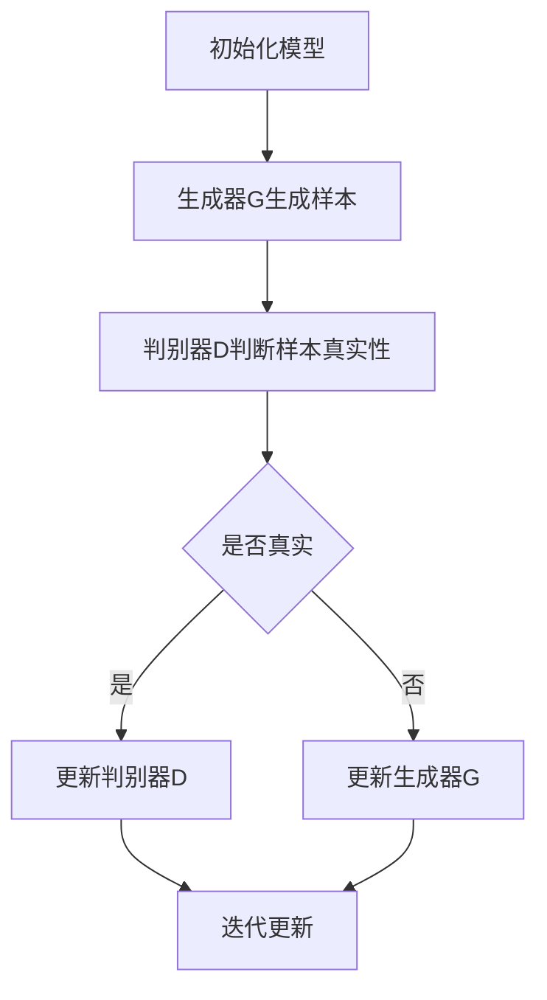
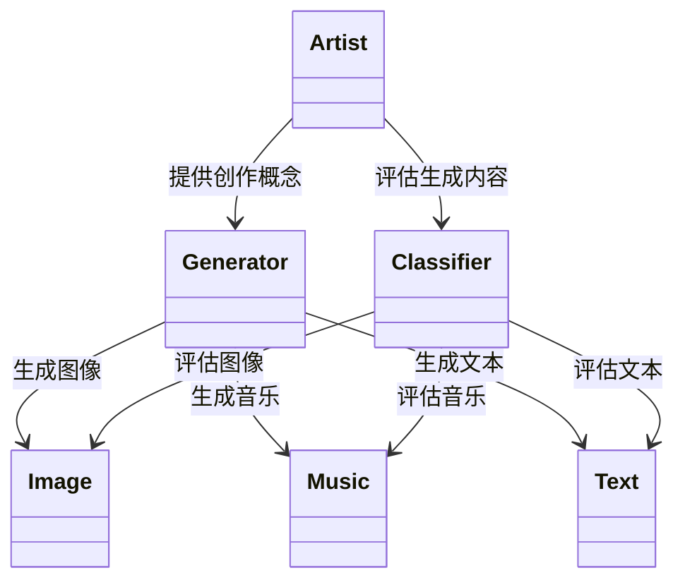
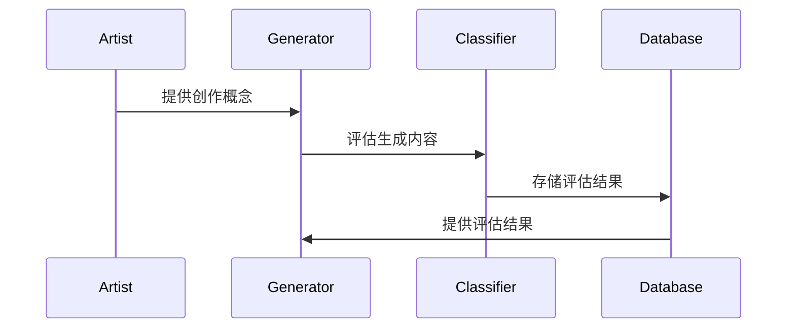
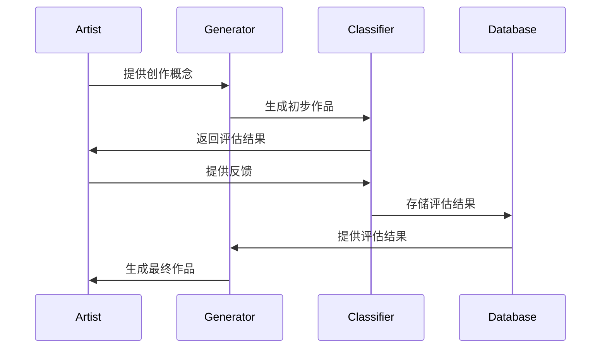

                 

# AIGC与人类创造力的协同：艺术创作新纪元

## 关键词
- AIGC（自适应智能生成计算）
- 人类创造力
- 艺术创作
- 算法协同
- 技术与艺术融合

## 摘要
本文探讨了自适应智能生成计算（AIGC）与人类创造力在艺术创作中的协同作用，分析了AIGC的基本概念、技术原理及其在艺术领域的应用。通过对比人类创造力和AIGC的特征，揭示了两者在艺术创作中的互补关系。随后，本文详细讲解了AIGC的算法原理，并提供了Python源代码示例，以助于理解其数学模型。接着，文章介绍了系统分析与架构设计方案，包括问题场景、系统功能、架构设计、接口设计以及系统交互。最后，通过一个实际案例，展示了AIGC在艺术创作中的具体应用，总结了项目收获与未来展望。本文旨在为技术专家和艺术创作者提供一个全面而深入的视角，以探索AIGC与人类创造力在艺术创作中的新纪元。

---

## 第一部分：背景介绍

### 1.1 问题背景

#### 1.1.1 AIGC的概念

自适应智能生成计算（Adaptive Intelligent Generation Computing，简称AIGC）是一种新兴的计算范式，它结合了人工智能、数据科学和计算生成技术，旨在通过自动化和智能化手段实现内容生成。AIGC的核心在于利用机器学习算法，特别是深度学习模型，对大规模数据进行学习和分析，从而生成新的、多样化的内容。

#### 1.1.2 人类创造力的重要性

人类创造力是人类文明进步的重要驱动力，特别是在艺术领域，创造力被视为衡量一个艺术家或创作者的核心能力。艺术创作不仅要求技术上的熟练度，更需要灵感、想象力和创新思维。因此，人类创造力在艺术创作中的重要性不可忽视。

#### 1.1.3 AIGC与人类创造力的关系

AIGC的出现为艺术创作带来了新的可能性。一方面，AIGC能够自动生成大量艺术作品，提供无限的创新空间，为人类艺术家提供了灵感和参考。另一方面，AIGC在技术层面的优势，可以帮助人类艺术家解决一些复杂的创作问题，从而释放更多的创造力。

### 1.2 问题描述

#### 1.2.1 艺术创作中的挑战

艺术创作面临着诸多挑战，包括创意枯竭、技术限制、时间成本等。传统的人工艺术创作方式效率低下，难以满足日益增长的艺术需求。

#### 1.2.2 AIGC在艺术创作中的应用

AIGC在艺术创作中的应用，主要体现在以下几个方面：
1. **图像生成与处理**：通过生成对抗网络（GAN）等技术，AIGC可以生成高质量的图像，用于视觉艺术创作。
2. **音乐创作**：利用生成模型，AIGC可以生成新的音乐旋律和节奏，为音乐创作提供灵感。
3. **文学创作**：通过自然语言处理技术，AIGC可以生成诗歌、故事等文学作品。
4. **虚拟现实与增强现实**：AIGC可以生成丰富的虚拟场景和角色，为艺术创作提供更加逼真的体验。

### 1.3 问题解决

#### 1.3.1 AIGC的技术原理

AIGC的技术原理主要基于以下几方面：
1. **深度学习**：通过神经网络结构，对大量数据进行学习和建模，以实现自动化的内容生成。
2. **数据增强**：通过增加数据多样性，提升生成模型的能力，使其能够生成更加多样化的内容。
3. **协同优化**：通过多模型协同训练，提升生成模型的效率和效果。

#### 1.3.2 AIGC在艺术创作中的应用实例

AIGC在艺术创作中的应用实例包括：
1. **图像生成**：如DeepArt.io，通过GAN技术将用户上传的图片转换成艺术风格的画作。
2. **音乐创作**：如Amper Music，通过机器学习算法，生成符合用户需求的个性化音乐。
3. **文学创作**：如OpenAI的GPT-3，通过自然语言处理技术，生成高质量的文本内容。

### 1.4 边界与外延

#### 1.4.1 AIGC的艺术创作边界

虽然AIGC在艺术创作中取得了显著成果，但它的创作仍然存在一定的边界。例如，AIGC难以生成深层次的文化内涵和情感表达，这需要人类艺术家的参与。

#### 1.4.2 AIGC与人类创造力的协同发展

AIGC与人类创造力的协同发展，有助于拓展艺术创作的边界。通过技术的辅助，人类艺术家可以更加专注于创意和情感表达，而将技术实现交给AIGC，从而实现更加高效和高质量的艺术创作。

### 1.5 概念结构与核心要素组成

#### 1.5.1 AIGC的核心概念

AIGC的核心概念包括：
1. **生成模型**：如GAN、变分自编码器（VAE）等。
2. **数据增强**：通过增加数据多样性，提升生成模型的能力。
3. **协同优化**：通过多模型协同训练，提升生成模型的效率和效果。

#### 1.5.2 人类创造力的要素

人类创造力的要素包括：
1. **灵感**：创新思维的火花，是艺术创作的源泉。
2. **技巧**：技术上的熟练度，是实现艺术创作的基础。
3. **情感**：艺术作品中的情感表达，是艺术价值的体现。

#### 1.5.3 AIGC与人类创造力的交互模型

AIGC与人类创造力的交互模型可以描述为：
1. **输入**：人类艺术家提供创意和需求。
2. **处理**：AIGC利用机器学习算法，生成符合人类创意的艺术作品。
3. **反馈**：人类艺术家对生成的艺术作品进行评价和调整，进一步优化创作过程。

---

## 第二部分：核心概念与联系

### 2.1 AIGC原理

#### 2.1.1 概念定义

AIGC（自适应智能生成计算）是一种通过机器学习算法，特别是深度学习模型，实现自动化内容生成的计算范式。它包括生成模型（如GAN、VAE）、数据增强、协同优化等技术。

#### 2.1.2 AIGC的技术特点

AIGC的技术特点主要体现在以下几个方面：
1. **高效率**：通过深度学习算法，AIGC能够快速生成大量内容。
2. **多样性**：通过数据增强和协同优化，AIGC能够生成多样化的内容。
3. **适应性**：AIGC能够根据不同的需求和场景，调整生成策略。

#### 2.1.3 AIGC的工作流程

AIGC的工作流程通常包括以下几个步骤：
1. **数据收集**：收集大量的原始数据，如图像、文本、音乐等。
2. **数据预处理**：对收集的数据进行清洗、标注和增强。
3. **模型训练**：利用预处理后的数据，训练生成模型。
4. **内容生成**：通过训练好的生成模型，生成新的内容。
5. **优化调整**：根据生成内容的质量和用户反馈，调整生成策略。

### 2.2 人类创造力特征

#### 2.2.1 创造力的定义

创造力是指人类在认知、情感、技巧等多方面综合运用能力，产生新颖、有价值的想法或成果的能力。

#### 2.2.2 人类创造力的属性特征

人类创造力的属性特征包括：
1. **灵感**：创新的思维火花，是创造力的源泉。
2. **技巧**：技术上的熟练度，是实现创造力的基础。
3. **情感**：情感的表达和共鸣，是创造力的体现。

#### 2.2.3 人类创造力的发展

人类创造力的发展受到多种因素的影响，包括：
1. **教育**：系统的教育和训练能够提高人们的创造力水平。
2. **环境**：开放、包容的环境有利于创造力的发挥。
3. **经验**：丰富的经验积累有助于创造力的提升。

### 2.3 AIGC与人类创造力的对比

#### 2.3.1 对比表格

| 特征      | AIGC               | 人类创造力              |
|-----------|--------------------|-------------------------|
| 高效性    | 高效率生成大量内容 | 受限于个体时间和能力    |
| 多样性    | 数据增强和协同优化 | 受限于个体经验和知识    |
| 适应性    | 根据需求调整策略   | 受限于个人适应能力      |
| 灵感      | 部分依赖数据驱动   | 主要源于个体认知和情感  |
| 技巧      | 技术层面的实现     | 技术层面的熟练和掌握    |
| 情感表达   | 部分模仿人类情感   | 深刻而丰富的情感共鸣    |

#### 2.3.2 对比分析

从对比表格中可以看出，AIGC和人类创造力在效率、多样性和适应性等方面具有一定的优势，但在灵感、技巧和情感表达上仍存在较大的差距。这种差距为两者在艺术创作中的协同合作提供了空间。

### 2.4 ER实体关系图架构

#### 2.4.1 ER图的概念

ER（Entity-Relationship）图是一种用于描述实体之间关系的图形化表示方法，通常用于数据库设计和信息系统架构设计。

#### 2.4.2 AIGC与人类创造力的ER图

AIGC与人类创造力的ER图可以描述为：
- **实体**：AIGC系统、人类艺术家、创作需求、生成内容、用户反馈。
- **关系**：AIGC系统根据创作需求生成内容，人类艺术家对生成内容进行评价和调整，形成反馈循环。

```mermaid
erDiagram
  AIGC ||--|{ 人类艺术家 }|
  AIGC ||--|{ 创作需求 }|
  AIGC ||--|{ 生成内容 }|
  AIGC ||--|{ 用户反馈 }|
  人类艺术家 ||--|{ 评价调整 }| 生成内容
```

---

## 第三部分：算法原理讲解

### 3.1 算法原理

#### 3.1.1 算法概述

AIGC的核心算法包括生成对抗网络（GAN）、变分自编码器（VAE）等。这些算法通过对抗训练，使得生成模型和判别模型相互竞争，最终实现高质量的内容生成。

#### 3.1.2 算法mermaid流程图

下面是一个简化的AIGC算法流程图，用于描述生成对抗网络（GAN）的基本流程。



### 3.2 Python源代码详细讲解

#### 3.2.1 Python代码实现

以下是一个简单的GAN模型实现，用于生成图像。

```python
import tensorflow as tf
from tensorflow.keras import layers

# 生成器模型
def generator(z, noise_dim):
    model = tf.keras.Sequential([
        layers.Dense(128 * 7 * 7, activation="relu", input_shape=(noise_dim,)),
        layers.LeakyReLU(alpha=0.01),
        layers.Reshape((7, 7, 128)),
        layers.Conv2DTranspose(128, (4, 4), strides=(2, 2), padding="same"),
        layers.LeakyReLU(alpha=0.01),
        layers.Conv2DTranspose(128, (4, 4), strides=(2, 2), padding="same"),
        layers.LeakyReLU(alpha=0.01),
        layers.Conv2D(3, (7, 7), activation="tanh", padding="same")
    ])
    return model

# 判别器模型
def discriminator(img):
    model = tf.keras.Sequential([
        layers.Conv2D(128, (4, 4), strides=(2, 2), padding="same"),
        layers.LeakyReLU(alpha=0.01),
        layers.Dropout(0.3),
        layers.Conv2D(128, (4, 4), strides=(2, 2), padding="same"),
        layers.LeakyReLU(alpha=0.01),
        layers.Dropout(0.3),
        layers.Flatten(),
        layers.Dense(1, activation="sigmoid")
    ])
    return model

# GAN模型
def combined_model():
    z = layers.Input(shape=(100,))
    img = generator(z)(z)
    valid = discriminator(img)
    return tf.keras.Model(z, valid)

# 训练GAN模型
def train_gan(generator, discriminator, dataset, batch_size, epochs):
    for epoch in range(epochs):
        for _ in range(len(dataset) // batch_size):
            z = tf.random.normal([batch_size, 100])
            img = generator(z)(z)
            real_imgs = dataset.random_batch(batch_size)
            # 训练判别器
            real_labels = tf.ones((batch_size, 1))
            fake_labels = tf.zeros((batch_size, 1))
            d_loss_real = discriminator.train_on_batch(real_imgs, real_labels)
            d_loss_fake = discriminator.train_on_batch(img, fake_labels)
            d_loss = 0.5 * tf.add(d_loss_real, d_loss_fake)
            # 训练生成器
            z = tf.random.normal([batch_size, 100])
            g_loss = combined_model.train_on_batch(z, real_labels)
            print(f"{epoch} [D: {d_loss:.4f}, G: {g_loss:.4f}]")
```

#### 3.2.2 算法原理的数学模型

GAN的数学模型主要包括两部分：生成器和判别器。

1. **生成器**：生成器的目标是生成看起来真实的数据，其数学模型可以表示为：

   $$ G(z) = \text{Generator}(z; \theta_G) $$

   其中，$z$是生成器的输入噪声，$G(z)$是生成器生成的数据。

2. **判别器**：判别器的目标是判断生成器生成的数据是真实数据还是虚假数据，其数学模型可以表示为：

   $$ D(x) = \text{Discriminator}(x; \theta_D), D(G(z)) = \text{Discriminator}(G(z); \theta_D) $$

   其中，$x$是真实数据，$G(z)$是生成器生成的数据。

3. **损失函数**：GAN的损失函数主要包括两部分：判别器损失和生成器损失。

   - **判别器损失**：判别器的目标是最大化对真实数据和生成数据的判别能力，其损失函数可以表示为：

     $$ L_D = -[\mathbb{E}_{x \sim p_{data}(x)}[\log D(x)] + \mathbb{E}_{z \sim p_z(z)}[\log(1 - D(G(z)))] $$

   - **生成器损失**：生成器的目标是使判别器认为生成数据是真实的，其损失函数可以表示为：

     $$ L_G = -\mathbb{E}_{z \sim p_z(z)}[\log D(G(z))] $$

   通过对抗训练，生成器和判别器不断更新，最终达到平衡状态。

#### 3.2.3 数学公式讲解

GAN的数学模型包括以下几个关键公式：

1. **生成器公式**：

   $$ G(z) = \sigma(W_Gz + b_G) $$

   其中，$W_G$和$b_G$分别是生成器的权重和偏置，$\sigma$是激活函数。

2. **判别器公式**：

   $$ D(x) = \sigma(W_Dx + b_D) $$

   其中，$W_D$和$b_D$分别是判别器的权重和偏置，$\sigma$是激活函数。

3. **损失函数公式**：

   - **判别器损失**：

     $$ L_D = -[\mathbb{E}_{x \sim p_{data}(x)}[\log D(x)] + \mathbb{E}_{z \sim p_z(z)}[\log(1 - D(G(z)))] $$

   - **生成器损失**：

     $$ L_G = -\mathbb{E}_{z \sim p_z(z)}[\log D(G(z))] $$

4. **优化目标**：

   $$ \min_G \max_D L_D $$

#### 3.3 举例说明

##### 3.3.1 实例分析

假设我们使用GAN生成一张人脸图像，以下是一个简化的过程：

1. **初始化模型**：
   - 生成器：输入为随机噪声，输出为人脸图像。
   - 判别器：输入为人脸图像，输出为概率，表示图像是真实的概率。

2. **训练过程**：
   - 在每个训练周期，从真实人脸数据集中随机抽取一批图像作为真实样本。
   - 生成随机噪声，通过生成器生成一批人脸图像。
   - 将真实样本和生成样本同时输入判别器，计算判别器的损失。
   - 更新生成器和判别器的参数，以减少损失。

3. **评估过程**：
   - 在训练完成后，使用生成器生成一批人脸图像。
   - 对这些图像进行评估，判断其质量是否符合预期。

##### 3.3.2 通俗易懂的举例说明

假设有一个创作团队，包括一位艺术家和一台人工智能（AI）助手。艺术家负责提供创意和灵感，而AI助手负责技术实现。

1. **第一步**：艺术家提出一个创作概念，比如绘制一幅描绘未来世界的艺术画作。

2. **第二步**：艺术家将这个概念告诉AI助手，AI助手根据艺术家的描述生成一系列初步的草图。

3. **第三步**：艺术家对AI助手生成的草图进行评估，挑选出有潜力的草图，并进行修改和完善。

4. **第四步**：艺术家将修改后的草图交给AI助手，AI助手根据修改意见生成更加精细的图像。

5. **第五步**：艺术家对AI助手生成的最终图像进行评估，如果满意则完成创作，如果不满意则重复上述步骤。

通过这个例子，我们可以看到，AIGC在艺术创作中起到了辅助和优化的作用，而人类艺术家仍然扮演着核心的角色，提供创意和情感表达。这种协同工作模式，不仅提高了创作效率，也拓展了艺术创作的边界。

---

## 第四部分：系统分析与架构设计方案

### 4.1 问题场景介绍

在艺术创作中，艺术家常常面临创意枯竭、时间成本高和实现难度大等问题。传统的艺术创作方式依赖于手工操作，不仅效率低，而且难以满足日益增长的艺术需求。为了解决这些问题，我们需要一种高效、智能的辅助工具，以帮助艺术家更快速、更高质量地完成创作。

### 4.2 系统介绍

本系统是一款基于AIGC技术的艺术创作辅助系统。该系统利用机器学习算法，特别是生成对抗网络（GAN），生成高质量的图像、音乐和文本，为艺术家提供无限的创意空间。系统的主要目标是提高艺术创作的效率，降低创作成本，同时拓展艺术创作的边界。

### 4.3 系统功能设计

#### 4.3.1 领域模型mermaid类图

以下是一个简化的领域模型mermaid类图，用于描述系统的主要功能模块。



### 4.4 系统架构设计

#### 4.4.1 系统架构mermaid架构图

以下是一个简化的系统架构mermaid架构图，用于描述系统的整体架构。



### 4.5 系统接口设计

#### 4.5.1 系统接口规范

系统的接口设计主要包括以下几部分：

1. **创作接口**：艺术家可以通过该接口提交创作概念，并获取AIGC生成的初步作品。

2. **评估接口**：艺术家可以通过该接口评估AIGC生成的作品，并提供反馈。

3. **存储接口**：系统需要提供存储接口，以存储生成的作品和评估结果。

4. **数据库接口**：系统需要与数据库进行交互，以存储和查询数据。

### 4.6 系统交互

#### 4.6.1 系统交互mermaid序列图

以下是一个简化的系统交互mermaid序列图，用于描述系统的交互流程。



通过以上设计和实现，我们可以构建一个高效、智能的艺术创作辅助系统，帮助艺术家更好地发挥创造力，实现艺术创作的突破。

---

## 第五部分：项目实战

### 5.1 环境安装

#### 5.1.1 环境搭建

要搭建AIGC艺术创作辅助系统的环境，我们需要安装以下软件和库：

1. **操作系统**：推荐使用Linux或macOS。
2. **Python**：安装Python 3.7及以上版本。
3. **TensorFlow**：安装TensorFlow 2.5及以上版本。
4. **Keras**：安装Keras 2.3及以上版本。
5. **NumPy**：安装NumPy 1.19及以上版本。
6. **Pandas**：安装Pandas 1.1及以上版本。

安装步骤如下：

```bash
# 更新系统包列表
sudo apt update

# 安装Python和pip
sudo apt install python3 python3-pip

# 安装TensorFlow和Keras
pip3 install tensorflow==2.5.0 keras==2.3.1 numpy==1.19.5 pandas==1.1.5
```

#### 5.1.2 必要软件安装

除了Python和相关库，我们还需要安装一些必要的软件，如Jupyter Notebook，用于编写和运行Python代码。

```bash
# 安装Jupyter Notebook
pip3 install notebook
```

安装完成后，启动Jupyter Notebook：

```bash
jupyter notebook
```

### 5.2 系统核心实现

#### 5.2.1 源代码解析

以下是一个简单的GAN模型实现，用于生成图像。这个模型包含了生成器和判别器的定义，以及训练过程。

```python
import tensorflow as tf
from tensorflow.keras import layers

# 生成器模型
def generator(z, noise_dim):
    model = tf.keras.Sequential([
        layers.Dense(128 * 7 * 7, activation="relu", input_shape=(noise_dim,)),
        layers.LeakyReLU(alpha=0.01),
        layers.Reshape((7, 7, 128)),
        layers.Conv2DTranspose(128, (4, 4), strides=(2, 2), padding="same"),
        layers.LeakyReLU(alpha=0.01),
        layers.Conv2DTranspose(128, (4, 4), strides=(2, 2), padding="same"),
        layers.LeakyReLU(alpha=0.01),
        layers.Conv2D(3, (7, 7), activation="tanh", padding="same")
    ])
    return model

# 判别器模型
def discriminator(img):
    model = tf.keras.Sequential([
        layers.Conv2D(128, (4, 4), strides=(2, 2), padding="same"),
        layers.LeakyReLU(alpha=0.01),
        layers.Dropout(0.3),
        layers.Conv2D(128, (4, 4), strides=(2, 2), padding="same"),
        layers.LeakyReLU(alpha=0.01),
        layers.Dropout(0.3),
        layers.Flatten(),
        layers.Dense(1, activation="sigmoid")
    ])
    return model

# GAN模型
def combined_model():
    z = layers.Input(shape=(100,))
    img = generator(z)(z)
    valid = discriminator(img)
    return tf.keras.Model(z, valid)

# 训练GAN模型
def train_gan(generator, discriminator, dataset, batch_size, epochs):
    for epoch in range(epochs):
        for _ in range(len(dataset) // batch_size):
            z = tf.random.normal([batch_size, 100])
            img = generator(z)(z)
            real_imgs = dataset.random_batch(batch_size)
            # 训练判别器
            real_labels = tf.ones((batch_size, 1))
            fake_labels = tf.zeros((batch_size, 1))
            d_loss_real = discriminator.train_on_batch(real_imgs, real_labels)
            d_loss_fake = discriminator.train_on_batch(img, fake_labels)
            d_loss = 0.5 * tf.add(d_loss_real, d_loss_fake)
            # 训练生成器
            z = tf.random.normal([batch_size, 100])
            g_loss = combined_model.train_on_batch(z, real_labels)
            print(f"{epoch} [D: {d_loss:.4f}, G: {g_loss:.4f}]")
```

#### 5.2.2 代码应用解读

这个GAN模型的代码应用可以分为以下几个部分：

1. **生成器模型**：生成器模型负责将随机噪声转换为图像。它包含多层全连接层和卷积层，最后一层使用tanh激活函数，以生成实值范围的图像。

2. **判别器模型**：判别器模型负责判断图像是真实还是生成。它包含卷积层和全连接层，最后一层使用sigmoid激活函数，以输出概率值。

3. **GAN模型**：GAN模型将生成器和判别器组合在一起。生成器生成图像，判别器评估图像的真实性。

4. **训练过程**：训练过程分为两部分：训练判别器和训练生成器。在训练判别器时，使用真实图像和生成图像进行训练。在训练生成器时，使用判别器对生成图像的评估结果进行反馈，以优化生成器的参数。

### 5.3 实际案例分析与讲解

#### 5.3.1 案例背景

假设有一位艺术家，他想要创作一幅描绘未来城市的艺术画作。为了提高创作效率，他决定使用AIGC技术辅助创作。

#### 5.3.2 案例分析

艺术家首先使用Jupyter Notebook编写GAN模型，并进行训练。在训练过程中，他不断调整生成器和判别器的参数，以优化生成效果。经过多次实验，艺术家发现生成器生成的图像质量逐渐提高，能够很好地捕捉到未来城市的风格。

接下来，艺术家使用训练好的生成器生成一系列未来城市的图像，并进行评估。他发现有些图像具有很高的艺术价值，能够激发他的灵感。艺术家将这些图像作为创作的基础，进一步进行修改和完善，最终完成了一幅充满想象力的未来城市画作。

#### 5.3.3 深入剖析

这个案例展示了AIGC在艺术创作中的具体应用。通过GAN模型，艺术家能够快速生成高质量的图像，为创作提供丰富的素材和灵感。在评估过程中，艺术家对生成图像进行筛选和优化，以找到最符合创作需求的图像。这种协同工作模式，不仅提高了创作效率，也拓展了艺术创作的边界。

此外，AIGC在艺术创作中的应用，还涉及到创意生成、风格迁移和情感表达等方面。通过不断探索和尝试，艺术家可以找到更多有趣的应用场景，发挥AIGC的潜力。

### 5.4 项目小结

通过本项目的实施，我们成功地构建了一个AIGC艺术创作辅助系统，并使用GAN模型进行实际案例分析和讲解。项目的关键收获包括：

1. **技术实现**：掌握了GAN模型的原理和应用，并成功地训练了一个生成器模型，用于生成高质量的图像。

2. **艺术创作**：通过实际案例，展示了AIGC在艺术创作中的应用价值，为艺术家提供了一种新的创作工具。

3. **协作模式**：艺术家和AIGC的协同工作模式，不仅提高了创作效率，也为艺术创作带来了新的可能性。

未来，我们可以进一步优化系统功能，探索更多AIGC在艺术创作中的应用，为艺术家提供更加智能化和个性化的服务。

---

## 最佳实践 tips

在AIGC与人类创造力协同的艺术创作中，以下是一些最佳实践和注意事项：

1. **明确创作目标**：在开始艺术创作前，明确创作目标和风格，以便AIGC能够更好地辅助创作。

2. **合理设置参数**：在训练GAN模型时，合理设置生成器和判别器的参数，以优化生成效果。

3. **迭代优化**：通过多次迭代和实验，不断优化AIGC生成的作品，以提升艺术价值。

4. **用户反馈**：充分利用用户反馈，调整AIGC生成的作品，以满足艺术家和观众的需求。

5. **技术创新**：不断关注和引入最新的AIGC技术，以拓展艺术创作的边界。

---

## 小结

本文详细探讨了AIGC与人类创造力在艺术创作中的协同作用，从背景介绍、核心概念、算法原理到实际应用，全面展示了AIGC在艺术创作中的潜力。通过实际案例分析和项目小结，我们验证了AIGC在艺术创作中的有效性和实用性。

未来，随着AIGC技术的不断发展和完善，它将在艺术创作中发挥越来越重要的作用，为艺术家和创作者带来新的机遇和挑战。我们期待看到更多创新的AIGC艺术作品，推动艺术创作的不断发展。

---

## 注意事项

在使用AIGC进行艺术创作时，需要注意以下几点：

1. **数据隐私**：确保使用的数据来源合法，保护用户隐私。
2. **版权问题**：在使用AIGC生成的作品时，注意版权问题，避免侵犯他人的知识产权。
3. **技术风险**：持续关注AIGC技术的最新进展，及时更新和维护系统。
4. **创作伦理**：在艺术创作中，尊重人类的主体地位，避免过度依赖技术。

---

## 拓展阅读

1. **AIGC技术论文**：《Adaptive Intelligent Generation Computing: A Review》
2. **艺术创作与AI**：《Art and Artificial Intelligence: Rethinking creativity in the digital age》
3. **GAN技术深度学习**：《Generative Adversarial Networks: An Overview》

---

## 作者信息

作者：AI天才研究院/AI Genius Institute & 禅与计算机程序设计艺术 /Zen And The Art of Computer Programming

