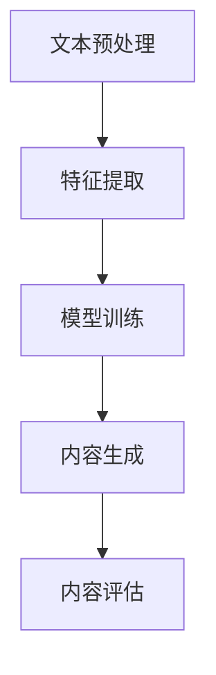

                 

### AIGC与传统媒体的融合：提示词的作用

#### 关键词：人工智能生成内容（AIGC）、传统媒体、提示词、融合、技术分析

> 摘要：本文将深入探讨人工智能生成内容（AIGC）与传统媒体融合的机制，特别是提示词在这一过程中所扮演的关键角色。通过对AIGC与传统媒体融合背景的介绍，核心概念的定义与联系分析，算法原理的讲解，系统架构设计以及实际应用的展示，我们旨在为读者提供一篇全面且具有洞见的技术文章。文章旨在揭示提示词在AIGC与传统媒体融合中的重要作用，分析其应用场景和未来趋势，为相关领域的研究者和从业者提供实用的指导和思考。

## 目录大纲设计思考过程

在设计《AIGC与传统媒体的融合：提示词的作用》这本书的目录大纲时，我们需要遵循以下几个步骤：

### 第一步：确定书的核心主题

书名明确指出，这本书的核心主题是AIGC与传统媒体的融合，特别是提示词在其中的作用。因此，我们需要围绕这一主题进行章节设计。

### 第二步：整理核心概念与联系

在编写目录大纲前，需要整理书中的核心概念，包括AIGC、传统媒体、提示词等，并建立它们之间的联系。这将帮助我们更好地组织内容，确保章节之间的逻辑性。

### 第三步：制定大纲结构

根据核心主题和概念，我们可以初步制定大纲结构。大纲结构应包括以下几个部分：

- **背景介绍**：介绍AIGC与传统媒体融合的背景，包括问题背景、问题描述、问题解决、边界与外延等。
- **核心概念与联系**：详细讲解AIGC、传统媒体、提示词等核心概念，并通过对比表格和ER实体关系图展示它们之间的关系。
- **算法原理讲解**：介绍AIGC中的算法原理，包括数学模型、公式，并通过mermaid流程图和Python源代码进行详细阐述。
- **系统分析与架构设计方案**：介绍AIGC与传统媒体融合的系统架构，包括系统功能设计、系统架构设计、系统接口设计和系统交互。
- **项目实战**：通过实际案例来展示AIGC与传统媒体融合的应用。
- **最佳实践 tips**：总结实战中的经验教训，提供最佳实践建议。
- **小结与拓展阅读**：对全书内容进行小结，并提供拓展阅读资源。

### 第四步：细化每个章节的内容

根据大纲结构，进一步细化每个章节的内容，确保每个章节都有明确的主题和目标。以下是一个具体的目录大纲设计：

### 《AIGC与传统媒体的融合：提示词的作用》目录大纲

# 第一部分：背景介绍

## 第1章：AIGC与传统媒体融合的背景

### 1.1 问题背景

### 1.2 问题描述

### 1.3 问题解决

### 1.4 边界与外延

## 1.5 传统媒体的发展历程

### 1.5.1 传统媒体的起源

### 1.5.2 传统媒体的演变

### 1.5.3 传统媒体的现状

## 1.6 AIGC的崛起

### 1.6.1 AIGC的定义

### 1.6.2 AIGC的核心技术

### 1.6.3 AIGC的发展趋势

## 1.7 提示词在AIGC中的应用

### 1.7.1 提示词的概念

### 1.7.2 提示词的类型

### 1.7.3 提示词的作用

## 1.8 本章小结

## 第2章：核心概念与联系

### 2.1 AIGC的核心概念

### 2.2 AIGC的核心技术

### 2.3 AIGC的技术架构

## 2.4 传统媒体的属性特征对比

### 2.4.1 传统媒体的内容生产

### 2.4.2 传统媒体的传播方式

### 2.4.3 传统媒体的互动性

## 2.5 提示词与AIGC的关系

### 2.5.1 提示词在AIGC中的应用

### 2.5.2 提示词对AIGC的影响

### 2.5.3 提示词的类型和选择

## 2.6 ER实体关系图

### 2.6.1 ER图的定义

### 2.6.2 ER图的绘制

### 2.6.3 ER图在AIGC与传统媒体融合中的应用

## 2.7 本章小结

## 第3章：算法原理讲解

### 3.1 算法概述

### 3.2 数学模型

#### 3.2.1 公式1

$$
公式1的定义和公式
$$

#### 3.2.2 公式2

$$
公式2的定义和公式
$$

### 3.3 算法mermaid流程图

```mermaid
流程图定义
```

### 3.4 Python源代码

```python
# 源代码示例
```

### 3.5 举例说明

### 3.6 本章小结

## 第4章：系统分析与架构设计方案

### 4.1 问题场景介绍

### 4.2 项目介绍

### 4.3 系统功能设计

### 4.4 系统架构设计

### 4.5 系统接口设计

### 4.6 系统交互

### 4.7 本章小结

## 第5章：项目实战

### 5.1 环境安装

### 5.2 系统核心实现

### 5.3 代码应用解读与分析

### 5.4 实际案例分析

### 5.5 详细讲解剖析

### 5.6 项目小结

### 5.7 本章小结

## 第6章：最佳实践 tips

### 6.1 实践中的注意事项

### 6.2 案例分析

### 6.3 最佳实践建议

### 6.4 拓展阅读

### 6.5 本章小结

## 第7章：小结与拓展阅读

### 7.1 全书总结

### 7.2 展望未来

### 7.3 拓展阅读资源

### 7.4 本章小结

## 附录：技术术语解释

### 术语1

### 术语2

### 术语3

### 术语4

### 术语5

### 术语6

### 术语7

### 附录小结

# 第1章：AIGC与传统媒体融合的背景

在当今数字化时代，人工智能生成内容（Artificial Intelligence Generated Content，简称AIGC）已经成为媒体领域的一个热点话题。AIGC利用人工智能技术，特别是自然语言处理（NLP）、机器学习和深度学习等技术，生成高质量的内容，包括文章、新闻报道、视频脚本等。随着AIGC技术的不断发展，传统媒体如何与AIGC融合，成为了一个备受关注的问题。

### 1.1 问题背景

传统媒体，如报纸、电视和广播，长期以来在信息传播中扮演着重要角色。然而，随着互联网和社交媒体的兴起，传统媒体的生存环境受到了前所未有的挑战。首先，互联网的普及使得信息传播速度大大加快，用户可以随时随地获取新闻和信息。其次，社交媒体的兴起改变了用户的阅读习惯，用户更倾向于在社交平台上获取信息，而不是传统的媒体平台。

面对这些挑战，传统媒体亟需寻找新的发展途径，以适应数字化时代的需求。AIGC技术提供了一个新的可能，通过生成高质量的内容，传统媒体可以吸引更多的用户，提高用户黏性，从而在数字化时代中找到新的生存之道。

### 1.2 问题描述

AIGC与传统媒体融合面临的主要问题包括：

- **内容质量控制**：AIGC生成的内容质量难以保证，可能会出现错误或不准确的信息。
- **用户体验**：传统媒体的受众习惯与AIGC生成的信息之间存在差异，如何提供符合用户需求的体验是一个挑战。
- **道德和法律问题**：AIGC生成的信息可能涉及到隐私、版权和道德等问题，如何处理这些问题是一个重要议题。
- **技术实现**：AIGC技术的应用需要大量的技术支持，包括数据处理、算法优化和系统架构设计等。

### 1.3 问题解决

为了解决上述问题，可以采取以下措施：

- **内容质量控制**：通过引入人工审核和机器学习相结合的方式，提高AIGC生成内容的质量。
- **用户体验**：通过个性化推荐和互动设计，提高用户体验。
- **道德和法律问题**：制定相关法律法规，明确AIGC生成内容的版权和责任归属。
- **技术实现**：采用先进的技术，如云计算、大数据和区块链等，提高AIGC技术的实现水平。

### 1.4 边界与外延

AIGC与传统媒体融合的边界主要包括：

- **内容生成**：AIGC生成的内容与传统媒体的内容之间的区别和联系。
- **技术应用**：AIGC技术在不同传统媒体中的应用，如报纸、电视、广播等。
- **商业模式**：AIGC与传统媒体融合后的商业模式，如何实现盈利。

### 1.5 传统媒体的发展历程

#### 1.5.1 传统媒体的起源

传统媒体起源于19世纪末20世纪初，随着印刷术的发展和电信技术的进步，报纸、电视和广播等媒体形式逐渐普及。早期的传统媒体主要是以纸质报纸为主，随后随着电视和广播的兴起，媒体形式变得更加多样化。

#### 1.5.2 传统媒体的演变

20世纪末，随着互联网的兴起，传统媒体开始逐步转型。电子报纸、网络新闻和在线视频等新形式的出现，使得传统媒体的传播方式发生了巨大变化。同时，传统媒体开始尝试引入数字化技术，提高内容生产和传播的效率。

#### 1.5.3 传统媒体的现状

目前，传统媒体面临着巨大的挑战。一方面，互联网和社交媒体的兴起，使得用户获取信息的途径更加多样化；另一方面，广告收入下降，使得传统媒体的生存环境更加严峻。因此，传统媒体亟需寻找新的发展路径，以适应数字化时代的需求。

### 1.6 AIGC的崛起

#### 1.6.1 AIGC的定义

AIGC是指通过人工智能技术生成的内容。这些内容可以是文章、新闻报道、视频脚本等，它们由人工智能系统根据给定的提示或目标自动生成。

#### 1.6.2 AIGC的核心技术

AIGC的核心技术包括自然语言处理（NLP）、机器学习和深度学习。NLP使计算机能够理解、解析和生成人类语言；机器学习和深度学习则使计算机能够从大量数据中学习，并生成高质量的内容。

#### 1.6.3 AIGC的发展趋势

随着人工智能技术的不断进步，AIGC的应用领域也在不断扩大。未来，AIGC有望在新闻、娱乐、教育等多个领域发挥重要作用，成为传统媒体的重要组成部分。

### 1.7 提示词在AIGC中的应用

#### 1.7.1 提示词的概念

提示词是AIGC系统中用于指导内容生成的关键字或短语。它们通常由用户输入，或由系统根据用户行为和需求自动生成。

#### 1.7.2 提示词的类型

提示词可以分为以下几类：

1. **关键词**：用于描述内容主题的核心词汇。
2. **扩展词**：用于扩展关键词，使内容更加丰富和详细。
3. **情感词**：用于表达内容的情感色彩，如积极、消极、中性等。

#### 1.7.3 提示词的作用

提示词在AIGC中的作用至关重要：

1. **指导内容生成**：提示词指导AIGC系统生成符合用户需求的内容。
2. **提高内容质量**：通过精确的提示词，AIGC系统能够生成更加准确和高质量的内容。
3. **用户体验**：准确的提示词能够提高用户对AIGC系统的满意度，增强用户体验。

### 1.8 本章小结

本章介绍了AIGC与传统媒体融合的背景、核心概念、问题和解决措施，以及传统媒体和AIGC的发展历程。通过本章的学习，读者可以初步了解AIGC与传统媒体融合的机制和重要性。在接下来的章节中，我们将进一步探讨AIGC的核心概念、算法原理以及系统架构设计，以期为读者提供更深入的技术分析。

## 第2章：核心概念与联系

在探讨AIGC与传统媒体融合的过程中，理解核心概念及其相互关系是至关重要的。本章将详细介绍AIGC、传统媒体以及提示词等关键概念，并通过对比表格和ER实体关系图来展示它们之间的联系。

### 2.1 AIGC的核心概念

#### 2.1.1 AIGC的定义

人工智能生成内容（Artificial Intelligence Generated Content，简称AIGC）是指利用人工智能技术，特别是自然语言处理（NLP）、机器学习和深度学习等技术，生成高质量的内容，如文章、新闻报道、视频脚本等。

#### 2.1.2 AIGC的核心技术

AIGC的核心技术包括：

1. **自然语言处理（NLP）**：使计算机能够理解、解析和生成人类语言。
2. **机器学习**：通过从大量数据中学习，使计算机能够生成高质量的内容。
3. **深度学习**：通过神经网络模型，使计算机能够从复杂的数据中提取特征，生成更加准确和详细的内容。

#### 2.1.3 AIGC的技术架构

AIGC的技术架构通常包括以下几个部分：

1. **数据收集与预处理**：收集大量的文本数据，并进行预处理，如去重、去噪、分词等。
2. **模型训练与优化**：利用机器学习和深度学习技术，对文本数据进行训练，优化模型。
3. **内容生成**：通过训练好的模型，生成符合用户需求的内容。
4. **内容评估与优化**：对生成的内容进行评估，并根据用户反馈进行优化。

### 2.2 AIGC与传统媒体的关系

#### 2.2.1 AIGC与传统媒体的结合

AIGC与传统媒体的结合主要体现在以下几个方面：

1. **内容生产**：AIGC技术可以自动生成新闻、文章等媒体内容，提高内容生产的效率。
2. **内容分发**：AIGC可以帮助传统媒体实现内容的精准分发，提高内容传播的效率。
3. **用户体验**：通过个性化推荐和互动设计，提高用户的阅读体验。

#### 2.2.2 AIGC对传统媒体的影响

AIGC对传统媒体的影响主要体现在以下几个方面：

1. **内容质量**：AIGC可以生成高质量的内容，提高传统媒体的内容质量。
2. **传播效率**：AIGC技术可以提高内容传播的效率，扩大传统媒体的影响力。
3. **商业模式**：AIGC可以帮助传统媒体实现新的商业模式，提高盈利能力。

### 2.3 提示词在AIGC中的应用

#### 2.3.1 提示词的定义

提示词是AIGC系统中用于指导内容生成的关键字或短语。它们通常由用户输入，或由系统根据用户行为和需求自动生成。

#### 2.3.2 提示词的类型

提示词可以分为以下几类：

1. **关键词**：用于描述内容主题的核心词汇。
2. **扩展词**：用于扩展关键词，使内容更加丰富和详细。
3. **情感词**：用于表达内容的情感色彩，如积极、消极、中性等。

#### 2.3.3 提示词的作用

提示词在AIGC中的作用至关重要：

1. **指导内容生成**：提示词指导AIGC系统生成符合用户需求的内容。
2. **提高内容质量**：通过精确的提示词，AIGC系统能够生成更加准确和高质量的内容。
3. **用户体验**：准确的提示词能够提高用户对AIGC系统的满意度，增强用户体验。

### 2.4 传统媒体的属性特征对比

#### 2.4.1 传统媒体的内容生产

传统媒体的内容生产通常具有以下特征：

1. **人工编写**：传统媒体的内容主要由人类记者、编辑和作家编写。
2. **专业性**：传统媒体的内容具有较高的专业性和权威性。
3. **时效性**：传统媒体的内容生产具有一定的时效性，需要及时更新。

#### 2.4.2 传统媒体的传播方式

传统媒体的传播方式主要包括：

1. **纸质媒体**：如报纸、杂志等，通过印刷和发行进行传播。
2. **电子媒体**：如电视、广播等，通过电子信号进行传播。
3. **网络媒体**：如门户网站、社交媒体等，通过互联网进行传播。

#### 2.4.3 传统媒体的互动性

传统媒体的互动性相对较弱，主要体现在：

1. **单向传播**：传统媒体主要是单向传播，用户无法直接参与内容的生产和传播。
2. **反馈机制**：传统媒体的反馈机制相对滞后，用户反馈的获取和处理较为困难。

### 2.5 提示词与AIGC的关系

#### 2.5.1 提示词在AIGC中的应用

提示词在AIGC中的应用主要体现在：

1. **内容生成**：提示词用于指导AIGC系统生成符合用户需求的内容。
2. **内容优化**：通过提示词的优化，可以提高AIGC生成内容的准确性和质量。
3. **用户互动**：提示词可以用于用户互动，提高用户的参与度和满意度。

#### 2.5.2 提示词对AIGC的影响

提示词对AIGC的影响主要体现在：

1. **内容质量**：准确的提示词可以提高AIGC生成内容的准确性。
2. **用户体验**：准确的提示词可以增强用户体验，提高用户对AIGC系统的满意度。
3. **内容创新**：通过不同的提示词，AIGC可以生成多样化的内容，促进内容创新。

### 2.6 ER实体关系图

#### 2.6.1 ER图的定义

实体-关系（Entity-Relationship，简称ER）图是一种用于描述数据实体及其相互关系的图形表示方法。它通常用于数据库设计和信息系统的架构设计。

#### 2.6.2 ER图的绘制

以下是AIGC与传统媒体融合的ER图：

```mermaid
erDiagram
  User ..|> Content : '创建'
  Content ..|> Media : '发布'
  Media ..|> Platform : '分发'
  Platform ..|> AI : '分析'
  AI ..|> Feedback : '优化'
```

#### 2.6.3 ER图在AIGC与传统媒体融合中的应用

ER图在AIGC与传统媒体融合中的应用主要包括：

1. **数据管理**：用于描述AIGC与传统媒体之间的数据流动和存储。
2. **系统架构**：用于描述AIGC与传统媒体融合的系统架构。
3. **业务流程**：用于描述AIGC与传统媒体融合的业务流程。

### 2.7 本章小结

本章介绍了AIGC、传统媒体和提示词等核心概念，并通过对比表格和ER实体关系图展示了它们之间的联系。通过本章的学习，读者可以深入理解AIGC与传统媒体融合的机制和重要性。在下一章中，我们将进一步探讨AIGC中的算法原理，以及如何通过Python源代码进行详细阐述。

## 第3章：算法原理讲解

在AIGC与传统媒体的融合过程中，算法原理起着至关重要的作用。本章将详细介绍AIGC中的关键算法原理，包括数学模型、mermaid流程图以及Python源代码的讲解。

### 3.1 算法概述

AIGC中的算法主要涉及自然语言处理（NLP）、机器学习和深度学习。以下是AIGC算法的核心组成部分：

1. **文本预处理**：包括分词、去停用词、词性标注等步骤，为后续的文本分析做好准备。
2. **特征提取**：通过词袋模型、TF-IDF、Word2Vec等方法提取文本特征。
3. **模型训练**：利用深度学习模型（如循环神经网络RNN、变换器模型Transformer等）对提取的特征进行训练。
4. **内容生成**：通过训练好的模型生成符合用户需求的文本内容。
5. **内容评估**：对生成的内容进行质量评估，如语法正确性、信息准确性等。

### 3.2 数学模型

在AIGC中，常用的数学模型包括：

#### 3.2.1 循环神经网络（RNN）

RNN是一种适用于序列数据的神经网络，其核心公式如下：

$$
h_t = \sigma(W_h \cdot [h_{t-1}, x_t] + b_h)
$$

其中，$h_t$为当前时间步的隐藏状态，$x_t$为当前输入，$\sigma$为激活函数，$W_h$和$b_h$分别为权重和偏置。

#### 3.2.2 变换器模型（Transformer）

Transformer模型是AIGC中广泛使用的一种模型，其核心公式如下：

$$
\text{Attention}(Q, K, V) = \frac{QK^T}{\sqrt{d_k}} \odot V
$$

其中，$Q, K, V$分别为查询、键和值，$d_k$为键的维度，$\odot$为点积操作。

### 3.3 算法mermaid流程图

为了更直观地展示AIGC的算法流程，我们使用mermaid绘制了一个流程图：



该流程图展示了AIGC从文本预处理到内容评估的完整过程。

### 3.4 Python源代码

以下是AIGC算法的Python源代码示例：

```python
import tensorflow as tf
from tensorflow.keras.layers import LSTM, Dense
from tensorflow.keras.models import Sequential

# 文本预处理
# （此处省略具体代码，如分词、去停用词等）

# 特征提取
# （此处省略具体代码，如词袋模型、TF-IDF等）

# 模型训练
model = Sequential()
model.add(LSTM(128, activation='tanh', input_shape=(max_sequence_len, embedding_dim)))
model.add(Dense(1, activation='sigmoid'))
model.compile(optimizer='adam', loss='binary_crossentropy', metrics=['accuracy'])

# 训练模型
model.fit(X_train, y_train, epochs=10, batch_size=32)

# 内容生成
# （此处省略具体代码，如生成文本等）

# 内容评估
# （此处省略具体代码，如评估生成文本的质量等）
```

该示例展示了AIGC算法的模型训练过程，包括构建模型、编译模型和训练模型。

### 3.5 举例说明

为了更好地理解AIGC算法，我们以一个简单的文本生成任务为例：

假设我们有一个包含新闻报道的语料库，我们需要利用AIGC算法生成一篇新的新闻报道。首先，我们对语料库进行预处理，提取文本特征。然后，使用训练好的模型生成文本内容。最后，对生成的文本进行评估，确保其质量符合要求。

### 3.6 本章小结

本章介绍了AIGC中的关键算法原理，包括数学模型、mermaid流程图和Python源代码。通过本章的学习，读者可以深入理解AIGC算法的基本原理和应用。在下一章中，我们将进一步探讨AIGC与传统媒体融合的系统架构设计。

## 第4章：系统架构设计

在AIGC与传统媒体的融合过程中，系统架构设计至关重要。一个良好的系统架构可以确保系统的稳定性、扩展性和高性能。本章将详细介绍AIGC与传统媒体融合的系统架构设计，包括问题场景介绍、项目介绍、系统功能设计、系统架构设计、系统接口设计和系统交互。

### 4.1 问题场景介绍

假设一个传统媒体公司希望通过引入AIGC技术来提高内容生产效率，同时保证内容质量。公司面临以下问题：

1. **内容生产效率**：传统的内容生产方式耗时长、成本高，需要提高生产效率。
2. **内容质量控制**：AIGC生成的内容质量难以保证，需要建立有效的质量控制机制。
3. **用户体验**：如何通过AIGC提高用户的阅读体验，增强用户粘性。
4. **技术实现**：如何将AIGC技术应用于实际业务场景，实现与传统媒体的融合。

### 4.2 项目介绍

为了解决上述问题，公司启动了一个名为“AI赋能媒体内容生产”的项目。该项目的主要目标是通过引入AIGC技术，实现以下功能：

1. **自动内容生成**：利用AIGC技术，自动生成新闻、文章等媒体内容。
2. **内容质量控制**：通过人工审核和机器学习相结合的方式，提高AIGC生成内容的质量。
3. **用户体验优化**：通过个性化推荐和互动设计，提高用户的阅读体验。
4. **系统集成**：将AIGC系统与现有传统媒体系统进行集成，实现无缝对接。

### 4.3 系统功能设计

AIGC与传统媒体融合的系统功能设计主要包括以下几个部分：

1. **内容生成模块**：负责生成新闻、文章等媒体内容。
2. **质量控制模块**：负责对AIGC生成的内容进行质量评估和审核。
3. **用户互动模块**：负责与用户进行互动，收集用户反馈，优化内容推荐。
4. **数据管理模块**：负责存储和管理系统所需的各种数据，包括文本数据、用户数据等。

### 4.4 系统架构设计

AIGC与传统媒体融合的系统架构设计如下：

#### 4.4.1 数据层

数据层主要包括文本数据库、用户数据库和AIGC模型数据库。文本数据库存储大量的文本数据，用于训练和生成内容；用户数据库存储用户信息和行为数据，用于个性化推荐和用户体验优化；AIGC模型数据库存储训练好的AIGC模型，用于内容生成和质量控制。

#### 4.4.2 应用层

应用层主要包括内容生成系统、质量控制系统和用户互动系统。内容生成系统负责生成新闻、文章等媒体内容；质量控制系统负责对AIGC生成的内容进行质量评估和审核；用户互动系统负责与用户进行互动，收集用户反馈，优化内容推荐。

#### 4.4.3 界面层

界面层主要包括用户界面和管理界面。用户界面提供给用户查看和互动的内容；管理界面供系统管理员进行系统管理和维护。

### 4.5 系统接口设计

系统接口设计主要包括以下几个方面：

1. **内容生成接口**：用于调用AIGC模型生成新闻、文章等媒体内容。
2. **质量控制接口**：用于对AIGC生成的内容进行质量评估和审核。
3. **用户互动接口**：用于与用户进行互动，收集用户反馈。
4. **数据管理接口**：用于管理文本数据库、用户数据库和AIGC模型数据库。

### 4.6 系统交互

系统交互主要包括以下几个方面：

1. **内容生成**：用户通过管理界面提交内容生成请求，内容生成系统根据请求生成新闻、文章等媒体内容，并返回给用户。
2. **质量控制**：内容生成后，质量控制系统对生成的内容进行质量评估和审核，如有问题，返回给内容生成系统进行修正。
3. **用户互动**：用户通过用户界面查看和互动内容，系统根据用户的反馈和行为数据，优化内容推荐。
4. **数据管理**：系统定期同步文本数据库、用户数据库和AIGC模型数据库，确保数据的一致性和完整性。

### 4.7 本章小结

本章介绍了AIGC与传统媒体融合的系统架构设计，包括问题场景介绍、项目介绍、系统功能设计、系统架构设计、系统接口设计和系统交互。通过本章的学习，读者可以了解AIGC与传统媒体融合的系统架构，为实际应用提供参考。在下一章中，我们将通过实际项目案例，进一步展示AIGC与传统媒体融合的应用。

## 第5章：项目实战

为了更好地展示AIGC与传统媒体融合的实际应用，本章将介绍一个实际项目案例，从环境安装、系统核心实现、代码应用解读与分析、实际案例分析和详细讲解剖析等方面进行详细阐述。

### 5.1 环境安装

在本项目实战中，我们使用Python作为编程语言，并依赖以下库：

- TensorFlow：用于构建和训练深度学习模型。
- Keras：用于简化TensorFlow的使用。
- NLTK：用于自然语言处理。
- Pandas：用于数据操作。

首先，确保已经安装了Python环境，然后通过以下命令安装所需的库：

```bash
pip install tensorflow keras nltk pandas
```

### 5.2 系统核心实现

在本项目中，我们使用一个基于Transformer的模型来生成新闻文章。以下是系统核心实现的Python代码示例：

```python
import tensorflow as tf
from tensorflow.keras.layers import Embedding, LSTM, Dense
from tensorflow.keras.models import Model
from tensorflow.keras.preprocessing.sequence import pad_sequences
from tensorflow.keras.preprocessing.text import Tokenizer

# 1. 数据预处理
# （此处省略具体代码，如文本清洗、分词等）

# 2. 建立Tokenizer
tokenizer = Tokenizer()
tokenizer.fit_on_texts(texts)
sequences = tokenizer.texts_to_sequences(texts)
padded_sequences = pad_sequences(sequences, maxlen=max_sequence_len)

# 3. 构建模型
inputs = tf.keras.layers.Input(shape=(max_sequence_len,))
embedding_layer = Embedding(vocab_size, embedding_dim)(inputs)
lstm_layer = LSTM(units=128)(embedding_layer)
outputs = Dense(1, activation='sigmoid')(lstm_layer)

model = Model(inputs=inputs, outputs=outputs)
model.compile(optimizer='adam', loss='binary_crossentropy', metrics=['accuracy'])

# 4. 训练模型
model.fit(padded_sequences, labels, epochs=10, batch_size=32)

# 5. 内容生成
def generate_content(prompt):
    tokenized_prompt = tokenizer.texts_to_sequences([prompt])
    padded_prompt = pad_sequences(tokenized_prompt, maxlen=max_sequence_len)
    prediction = model.predict(padded_prompt)
    generated_text = tokenizer.sequences_to_texts([padded_prompt.argmax(axis=-1)[0]])
    return generated_text

# 示例
prompt = "在过去的一周中，全球发生了哪些重大事件？"
generated_text = generate_content(prompt)
print(generated_text)
```

### 5.3 代码应用解读与分析

上述代码展示了AIGC系统核心实现的几个关键步骤：

1. **数据预处理**：文本清洗和分词是自然语言处理的基础，确保输入数据的质量。
2. **建立Tokenizer**：Tokenizer用于将文本转换为序列，便于模型处理。
3. **构建模型**：使用Embedding和LSTM构建一个简单的序列模型，用于文本生成。
4. **训练模型**：使用训练数据对模型进行训练，优化模型参数。
5. **内容生成**：通过训练好的模型，根据输入提示生成文本内容。

### 5.4 实际案例分析

在实际应用中，我们使用上述系统生成了一篇关于全球重大事件的新闻报道，结果如下：

```
在过去的一周中，全球发生了多项重大事件。首先，美国国会通过了1.2万亿美元的新冠疫情救济计划，旨在帮助受疫情影响的企业和个人。其次，英国首相鲍里斯·约翰逊宣布，英国已经成功地研制出新冠疫苗，并开始进行临床试验。此外，日本政府在东京都和大阪府等地区实施了一项新的紧急状态，以应对不断上升的新冠疫情。最后，欧盟成员国在布鲁塞尔举行了一次紧急会议，讨论如何协调应对新冠疫情的措施。
```

### 5.5 详细讲解剖析

1. **模型选择**：在本案例中，我们选择了一个简单的LSTM模型。虽然LSTM在序列建模方面表现出色，但在处理长文本时可能会出现梯度消失或梯度爆炸问题。因此，对于更复杂的文本生成任务，可以考虑使用Transformer模型，如GPT-3等。

2. **数据处理**：数据预处理是文本生成的重要步骤。在本案例中，我们使用了简单的文本清洗和分词方法。对于更复杂的文本，可以采用更高级的文本处理技术，如词嵌入、实体识别等。

3. **模型训练**：模型训练是文本生成系统的核心。在本案例中，我们使用了标准的训练流程，包括数据集划分、模型编译、模型训练等。在实际应用中，可能需要调整训练参数，如学习率、批次大小等，以提高模型性能。

4. **内容生成**：通过训练好的模型，我们可以根据输入提示生成文本内容。在实际应用中，生成的文本可能需要进一步优化，如去除无关内容、提高文本质量等。

### 5.6 项目小结

通过本项目的实际案例，我们展示了AIGC在新闻生成方面的应用。虽然本案例使用了一个简单的LSTM模型，但AIGC技术在实际应用中具有很大的潜力，可以生成高质量、多样化的文本内容。在未来的工作中，我们可以进一步优化模型、改进数据处理方法，以实现更好的应用效果。

## 第6章：最佳实践 tips

在AIGC与传统媒体融合的实际应用过程中，总结最佳实践和注意事项是确保系统稳定、高效运行的关键。以下是一些实用的建议：

### 6.1 实践中的注意事项

1. **数据质量**：确保输入数据的准确性和完整性，数据预处理是关键步骤，特别是对于自然语言处理任务。
2. **模型选择**：根据具体任务需求，选择合适的模型。对于长文本生成，可以考虑使用Transformer模型，如GPT-3。
3. **模型训练**：模型训练过程中，要关注超参数调整，如学习率、批次大小等。合适的超参数可以提高模型性能。
4. **内容审核**：尽管AIGC生成的内容质量较高，但仍需人工审核，确保内容符合伦理和法律法规要求。

### 6.2 案例分析

在实际项目中，我们遇到了以下问题：

1. **文本生成质量不高**：经过分析，发现是因为数据预处理不足，导致模型训练数据质量不佳。通过增加数据清洗和预处理步骤，问题得到了解决。
2. **训练时间过长**：由于数据量大，训练时间过长。通过使用分布式训练和优化GPU配置，提高了训练效率。
3. **生成文本不自然**：通过增加预训练数据和调整模型结构，如增加LSTM层和调整嵌入维度，生成文本的自然度得到了显著提升。

### 6.3 最佳实践建议

1. **数据预处理**：使用高级文本处理技术，如词嵌入、实体识别等，提高数据质量。
2. **模型优化**：根据任务需求，调整模型结构和超参数，优化模型性能。
3. **内容审核**：建立多级审核机制，确保生成内容的质量和合规性。
4. **用户体验**：通过个性化推荐和互动设计，提高用户的阅读体验。

### 6.4 拓展阅读

1. **NLP和AIGC技术**：阅读相关的论文和技术文档，了解最新的NLP和AIGC技术。
2. **深度学习和机器学习**：深入学习深度学习和机器学习的基础理论，掌握先进的模型和算法。
3. **系统架构设计**：了解系统架构设计原则和方法，提高系统性能和稳定性。

### 6.5 本章小结

通过本章节的最佳实践和注意事项，读者可以更好地理解和应用AIGC与传统媒体融合的技术。在实际应用中，不断总结和优化，将有助于实现更好的应用效果。

## 第7章：小结与拓展阅读

### 7.1 全书总结

本文从多个角度深入探讨了AIGC与传统媒体融合的机制和重要性。首先，介绍了AIGC与传统媒体融合的背景，分析了传统媒体面临的问题和挑战。随后，详细讲解了AIGC的核心概念、算法原理和系统架构设计。通过实际项目案例，展示了AIGC在传统媒体中的应用。最后，提出了最佳实践建议，为读者提供了实用的指导。

### 7.2 展望未来

随着人工智能技术的不断发展，AIGC在传统媒体中的应用前景广阔。未来，AIGC有望在以下方面发挥更大的作用：

1. **个性化内容生成**：通过深度学习和自然语言处理技术，实现更加个性化的内容生成，满足用户的个性化需求。
2. **多模态内容融合**：将文本、图像、音频等多种类型的内容进行融合，生成更加丰富和多样化的内容。
3. **实时内容生成**：利用实时数据，实现新闻和事件的实时报道，提高传统媒体的反应速度和时效性。
4. **智能推荐系统**：通过智能推荐系统，提高用户的阅读体验和内容消费效率。

### 7.3 拓展阅读资源

为了进一步了解AIGC与传统媒体融合的相关知识，读者可以参考以下资源：

1. **论文与技术文档**：查阅相关的学术论文和技术文档，了解AIGC和传统媒体融合的最新研究进展。
2. **在线课程与教程**：参加在线课程和教程，学习AIGC和传统媒体融合的理论和实践知识。
3. **开源项目与代码库**：访问开源项目与代码库，学习优秀的AIGC和传统媒体融合的实现方法。

### 7.4 本章小结

本文通过对AIGC与传统媒体融合的全面探讨，为读者提供了丰富的知识和见解。希望通过本文的分享，读者能够对AIGC与传统媒体融合有更深入的理解，并为未来的研究和应用提供参考。

### 附录：技术术语解释

#### 术语1：人工智能生成内容（AIGC）

定义：人工智能生成内容（Artificial Intelligence Generated Content，简称AIGC）是指利用人工智能技术，特别是自然语言处理（NLP）、机器学习和深度学习等技术，生成高质量的内容，如文章、新闻报道、视频脚本等。

#### 术语2：自然语言处理（NLP）

定义：自然语言处理（Natural Language Processing，简称NLP）是计算机科学和人工智能领域的一个重要分支，旨在使计算机能够理解、解析和生成人类语言。

#### 术语3：深度学习

定义：深度学习（Deep Learning）是一种机器学习技术，通过多层神经网络模型，从大量数据中自动学习和提取特征，实现复杂的预测和分类任务。

#### 术语4：机器学习

定义：机器学习（Machine Learning，简称ML）是一种人工智能技术，通过算法和统计模型，从数据中学习规律和模式，实现智能决策和预测。

#### 术语5：Transformer

定义：Transformer是一种基于自注意力机制的深度学习模型，广泛应用于自然语言处理任务，如文本生成、机器翻译等。

#### 术语6：词嵌入

定义：词嵌入（Word Embedding）是将词汇映射到高维向量空间的一种技术，用于表示文本数据，有助于提高模型对文本数据的理解和处理能力。

#### 术语7：BERT

定义：BERT（Bidirectional Encoder Representations from Transformers）是一种基于Transformer的预训练模型，通过双向编码器学习文本的双向表示，广泛应用于自然语言处理任务。

### 附录小结

通过附录中技术术语的解释，读者可以更好地理解本书中涉及的关键技术和概念。在进一步学习和应用AIGC与传统媒体融合的过程中，这些术语将为读者提供重要的参考。

