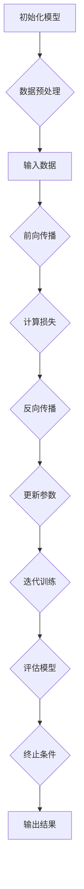
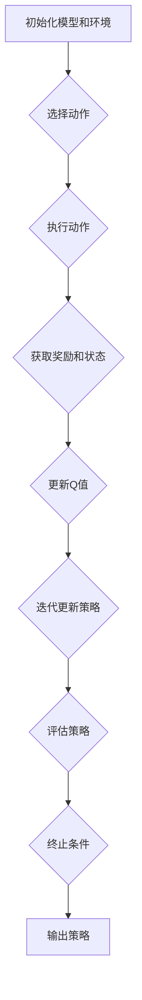
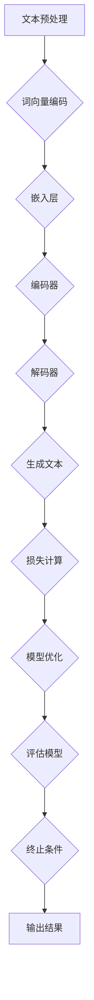
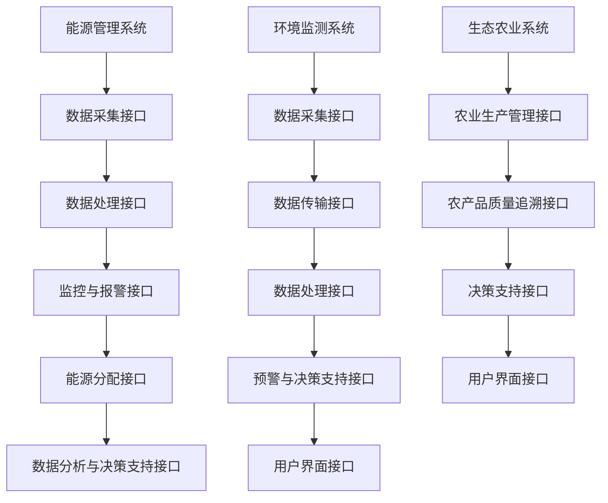

                 

### 深度学习算法流程图


### 强化学习算法流程图


### 自然语言处理算法流程图


### 深度学习数学模型

深度学习中的数学模型主要包括神经网络模型、卷积神经网络模型和循环神经网络模型等。以下是一个简单的神经网络模型：

$$
\begin{aligned}
\text{神经网络模型} &= f(\text{输入} \cdot \text{权重} + \text{偏置}) \\
\text{输出} &= \text{激活函数}(z)
\end{aligned}
$$

其中，$f$ 是激活函数，如 $Sigmoid$、ReLU 等；$z$ 是输入和权重、偏置的线性组合；$\cdot$ 表示点积。

### 强化学习数学模型

强化学习中的数学模型主要包括马尔可夫决策过程（MDP）和值函数、策略等概念。

$$
\begin{aligned}
V^*(s) &= \max_{a} \sum_{s'} p(s' | s, a) \cdot \mathbb{R}(s, a) \\
Q^*(s, a) &= \sum_{s'} p(s' | s, a) \cdot \mathbb{R}(s, a) + \gamma V^*(s') \\
\pi^*(a | s) &= \begin{cases} 
1 & \text{如果} \ a = \arg \max_{a'} Q^*(s, a') \\
0 & \text{否则}
\end{cases}
\end{aligned}
$$

其中，$V^*(s)$ 是状态值函数；$Q^*(s, a)$ 是动作值函数；$\pi^*(a | s)$ 是策略；$\mathbb{R}(s, a)$ 是立即回报；$p(s' | s, a)$ 是状态转移概率；$\gamma$ 是折扣因子。

### 自然语言处理数学模型

自然语言处理中的数学模型主要包括词向量编码、嵌入层、编码器、解码器和生成模型等。

$$
\begin{aligned}
\text{嵌入层} &= \text{嵌入矩阵} \cdot \text{词向量} \\
\text{编码器} &= \text{编码层}(\text{嵌入层}) \\
\text{解码器} &= \text{解码层}(\text{编码器}) \\
\text{生成文本} &= \text{生成模型}(\text{解码器})
\end{aligned}
$$

其中，嵌入矩阵是将词向量映射到高维空间的线性变换；编码器、解码器分别对文本进行编码和解码；生成模型用于生成文本。

## 数学公式示例

### 深度学习公式示例

$$
\begin{aligned}
z &= \sum_{i=1}^{n} w_i x_i + b \\
a &= \sigma(z)
\end{aligned}
$$

其中，$z$ 是线性组合；$w_i$ 是权重；$x_i$ 是输入；$b$ 是偏置；$a$ 是激活值；$\sigma$ 是激活函数。

### 强化学习公式示例

$$
\begin{aligned}
Q(s, a) &= \sum_{s'} p(s' | s, a) \cdot (\mathbb{R}(s, a) + \gamma V(s')) \\
V(s) &= \sum_{a} \pi(a | s) \cdot Q(s, a)
\end{aligned}
$$

其中，$Q(s, a)$ 是动作值函数；$V(s)$ 是状态值函数；$p(s' | s, a)$ 是状态转移概率；$\mathbb{R}(s, a)$ 是立即回报；$\pi(a | s)$ 是策略；$\gamma$ 是折扣因子。

### 自然语言处理公式示例

$$
\begin{aligned}
\text{嵌入层} &= \text{嵌入矩阵} \cdot \text{词向量} \\
\text{编码器} &= \text{编码层}(\text{嵌入层}) \\
\text{解码器} &= \text{解码层}(\text{编码器}) \\
\text{生成文本} &= \text{生成模型}(\text{解码器})
\end{aligned}
$$

其中，嵌入矩阵是将词向量映射到高维空间的线性变换；编码器、解码器分别对文本进行编码和解码；生成模型用于生成文本。

## 13. 系统架构设计

### 能源系统架构设计

能源系统的核心需求是高效、可靠地分配和管理能源资源。系统架构设计应涵盖以下几个方面：

#### 1. 能源管理系统

能源管理系统负责监控和管理能源消耗、生产、分配等各个环节。其架构设计包括：

- **数据采集模块**：实时采集能源消耗数据、生产数据和设备状态数据。
- **数据处理模块**：对采集到的数据进行清洗、转换和处理，以便于后续分析。
- **监控与报警模块**：实时监控能源消耗情况，对异常情况及时报警。

#### 2. 能源分配模块

能源分配模块根据能源需求，实现能源资源的合理分配。其架构设计包括：

- **需求预测模块**：基于历史数据和当前情况，预测未来的能源需求。
- **优化算法模块**：根据需求预测结果，采用优化算法确定能源分配方案。
- **执行控制模块**：根据分配方案，控制能源设备的工作状态，实现能源的合理分配。

#### 3. 数据分析与决策支持模块

该模块负责对能源系统的运行数据进行分析，提供决策支持。其架构设计包括：

- **数据存储模块**：存储能源系统的历史数据和实时数据。
- **数据分析模块**：对历史数据和实时数据进行分析，提取有价值的信息。
- **决策支持模块**：根据分析结果，提供能源管理策略和优化建议。

### 环境监测系统架构设计

环境监测系统的核心需求是实时、准确地监测环境质量，并提供预警和决策支持。系统架构设计应涵盖以下几个方面：

#### 1. 监测设备

监测设备负责实时采集环境数据，包括空气质量、水质、气象等。设备应具备高精度、高稳定性、低功耗等特点。

#### 2. 数据采集与传输模块

数据采集与传输模块负责将监测设备采集到的数据传输到系统中进行处理。其架构设计包括：

- **数据采集模块**：从监测设备中读取数据，并进行初步处理。
- **数据传输模块**：将处理后的数据传输到中心服务器。

#### 3. 数据处理与分析模块

数据处理与分析模块负责对采集到的数据进行分析，识别环境问题并提供预警。其架构设计包括：

- **数据预处理模块**：对采集到的数据进行清洗、转换和处理。
- **数据分析模块**：对预处理后的数据进行分析，识别环境问题。
- **预警与决策支持模块**：根据分析结果，提供预警信息和管理建议。

#### 4. 用户界面模块

用户界面模块提供可视化的监控界面，方便用户实时了解环境质量状况，并进行相关操作。其架构设计包括：

- **监控界面**：展示实时环境数据、预警信息和历史数据。
- **用户操作模块**：提供用户对系统的操作界面，包括数据查询、报表生成、设置修改等。

### 生态农业系统架构设计

生态农业系统的核心需求是实现农业生产的绿色、可持续和高效。系统架构设计应涵盖以下几个方面：

#### 1. 农业生产管理模块

农业生产管理模块负责对农业生产过程进行监控和管理，包括种植、灌溉、施肥、病虫害防治等。其架构设计包括：

- **种植管理模块**：根据土壤和气候条件，制定种植计划。
- **灌溉管理模块**：实时监测土壤湿度，智能控制灌溉系统。
- **施肥管理模块**：根据作物生长需求，智能控制施肥系统。
- **病虫害防治模块**：实时监测病虫害情况，提供防治建议。

#### 2. 农产品质量追溯模块

农产品质量追溯模块负责记录农产品生产过程中的关键数据，实现农产品质量的追溯。其架构设计包括：

- **数据采集模块**：采集农产品生产过程中的关键数据，如种植环境、施肥情况、病虫害防治等。
- **数据存储模块**：存储采集到的数据，便于追溯和管理。
- **查询与报告模块**：提供用户对农产品生产数据的查询和报告功能。

#### 3. 决策支持模块

决策支持模块负责对农业生产的运行数据进行分析，提供决策支持。其架构设计包括：

- **数据分析模块**：对农业生产数据进行分析，提取有价值的信息。
- **决策支持模块**：根据分析结果，提供种植计划、灌溉策略、施肥方案等决策建议。

#### 4. 用户界面模块

用户界面模块提供可视化的监控界面，方便用户实时了解农业生产情况，并进行相关操作。其架构设计包括：

- **监控界面**：展示实时农业生产数据、预警信息和历史数据。
- **用户操作模块**：提供用户对系统的操作界面，包括数据查询、报表生成、设置修改等。

## 14. 系统接口设计与交互

### 系统接口设计

系统接口设计是确保不同模块之间能够正常通信和协同工作的重要环节。以下是一个简单的系统接口设计：

#### 1. 能源管理系统接口

- **数据采集接口**：用于采集能源消耗、生产、设备状态等数据。
- **数据处理接口**：用于处理采集到的数据，如清洗、转换等。
- **监控与报警接口**：用于监控能源消耗情况，发送报警信息。
- **能源分配接口**：用于根据需求预测结果，实现能源资源的合理分配。
- **数据分析与决策支持接口**：用于对能源系统运行数据进行分析，提供决策支持。

#### 2. 环境监测系统接口

- **数据采集接口**：用于从监测设备中读取环境数据。
- **数据传输接口**：用于将采集到的数据传输到中心服务器。
- **数据处理接口**：用于对采集到的数据进行清洗、转换和处理。
- **预警与决策支持接口**：用于对环境监测数据进行分析，提供预警和管理建议。
- **用户界面接口**：用于展示实时环境数据、预警信息等。

#### 3. 生态农业系统接口

- **农业生产管理接口**：用于监控和管理农业生产过程。
- **农产品质量追溯接口**：用于记录和追溯农产品生产过程中的关键数据。
- **决策支持接口**：用于对农业生产数据进行分析，提供决策支持。
- **用户界面接口**：用于展示实时农业生产数据、预警信息等。

### 系统交互流程图

以下是一个简单的系统交互流程图，展示了各个模块之间的交互过程：



### 15. 能源系统环境安装

#### 1. 系统需求

在安装能源系统之前，首先需要确保计算机满足以下基本需求：

- 操作系统：Windows 10 / macOS / Ubuntu 18.04 或更高版本
- CPU：Intel Core i5 或更高版本
- 内存：8GB 或更高
- 硬盘：50GB 或更高
- 网络：宽带互联网连接

#### 2. 安装步骤

1. **安装 Python 环境**：

   - **Windows**：下载并安装 Python 3.8 或更高版本，选择“Add Python to PATH”选项。
   - **macOS**：通过 Homebrew 安装 Python：
     ```shell
     brew install python
     ```
   - **Ubuntu**：通过 apt-get 安装 Python：
     ```shell
     sudo apt-get update
     sudo apt-get install python3
     ```

2. **安装相关依赖库**：

   - **Windows**：使用 Python 的包管理器 pip 安装依赖库：
     ```shell
     pip install numpy pandas matplotlib scikit-learn
     ```
   - **macOS** 和 **Ubuntu**：同样使用 pip 安装依赖库：
     ```shell
     pip3 install numpy pandas matplotlib scikit-learn
     ```

3. **配置环境变量**：

   - 在 **Windows** 中，确保 Python 的安装路径被添加到系统的环境变量中。
   - 在 **macOS** 和 **Ubuntu** 中，打开终端并执行以下命令：
     ```shell
     export PATH=$PATH:/path/to/python
     ```

   其中，`/path/to/python` 是 Python 的安装路径。

4. **测试环境**：

   打开 Python 解释器，执行以下代码，检查环境是否配置正确：
   ```python
   import numpy
   import pandas
   import matplotlib
   import scikit_learn
   print("All dependencies installed successfully!")
   ```

### 16. 环境监测系统环境安装

#### 1. 系统需求

在安装环境监测系统之前，需要确保计算机满足以下基本需求：

- 操作系统：Windows 10 / macOS / Ubuntu 18.04 或更高版本
- CPU：Intel Core i5 或更高版本
- 内存：8GB 或更高
- 硬盘：50GB 或更高
- 网络：宽带互联网连接

#### 2. 安装步骤

1. **安装 Python 环境**：

   - **Windows**：下载并安装 Python 3.8 或更高版本，选择“Add Python to PATH”选项。
   - **macOS**：通过 Homebrew 安装 Python：
     ```shell
     brew install python
     ```
   - **Ubuntu**：通过 apt-get 安装 Python：
     ```shell
     sudo apt-get update
     sudo apt-get install python3
     ```

2. **安装相关依赖库**：

   - **Windows**：使用 Python 的包管理器 pip 安装依赖库：
     ```shell
     pip install numpy pandas matplotlib scikit-learn flask
     ```
   - **macOS** 和 **Ubuntu**：同样使用 pip 安装依赖库：
     ```shell
     pip3 install numpy pandas matplotlib scikit-learn flask
     ```

3. **配置环境变量**：

   - 在 **Windows** 中，确保 Python 的安装路径被添加到系统的环境变量中。
   - 在 **macOS** 和 **Ubuntu** 中，打开终端并执行以下命令：
     ```shell
     export PATH=$PATH:/path/to/python
     ```

   其中，`/path/to/python` 是 Python 的安装路径。

4. **测试环境**：

   打开 Python 解释器，执行以下代码，检查环境是否配置正确：
   ```python
   import numpy
   import pandas
   import matplotlib
   import scikit_learn
   import flask
   print("All dependencies installed successfully!")
   ```

### 17. 生态农业系统环境安装

#### 1. 系统需求

在安装生态农业系统之前，需要确保计算机满足以下基本需求：

- 操作系统：Windows 10 / macOS / Ubuntu 18.04 或更高版本
- CPU：Intel Core i5 或更高版本
- 内存：8GB 或更高
- 硬盘：50GB 或更高
- 网络：宽带互联网连接

#### 2. 安装步骤

1. **安装 Python 环境**：

   - **Windows**：下载并安装 Python 3.8 或更高版本，选择“Add Python to PATH”选项。
   - **macOS**：通过 Homebrew 安装 Python：
     ```shell
     brew install python
     ```
   - **Ubuntu**：通过 apt-get 安装 Python：
     ```shell
     sudo apt-get update
     sudo apt-get install python3
     ```

2. **安装相关依赖库**：

   - **Windows**：使用 Python 的包管理器 pip 安装依赖库：
     ```shell
     pip install numpy pandas matplotlib scikit-learn flask tensorflow
     ```
   - **macOS** 和 **Ubuntu**：同样使用 pip 安装依赖库：
     ```shell
     pip3 install numpy pandas matplotlib scikit-learn flask tensorflow
     ```

3. **配置环境变量**：

   - 在 **Windows** 中，确保 Python 的安装路径被添加到系统的环境变量中。
   - 在 **macOS** 和 **Ubuntu** 中，打开终端并执行以下命令：
     ```shell
     export PATH=$PATH:/path/to/python
     ```

   其中，`/path/to/python` 是 Python 的安装路径。

4. **测试环境**：

   打开 Python 解释器，执行以下代码，检查环境是否配置正确：
   ```python
   import numpy
   import pandas
   import matplotlib
   import scikit_learn
   import flask
   import tensorflow as tf
   print("All dependencies installed successfully!")
   ```

### 18. 能源系统核心实现源代码

以下是一个简单的能源系统核心实现源代码示例，用于展示如何采集数据、处理数据、监控和报警等功能。

```python
import numpy as np
import pandas as pd
import matplotlib.pyplot as plt
from sklearn.linear_model import LinearRegression

# 数据采集
def collect_data():
    data = pd.read_csv('energy_data.csv')
    return data

# 数据预处理
def preprocess_data(data):
    # 数据清洗和转换
    data = data.dropna()
    data['timestamp'] = pd.to_datetime(data['timestamp'])
    data.set_index('timestamp', inplace=True)
    return data

# 模型训练
def train_model(data):
    X = data[['consumption', 'production']]
    y = data['allocation']
    model = LinearRegression()
    model.fit(X, y)
    return model

# 数据预测
def predict(data, model):
    allocation = model.predict(data[['consumption', 'production']])
    return allocation

# 监控和报警
def monitor(data, allocation):
    for i in range(len(data)):
        if data['consumption'][i] > allocation[i]:
            print(f"Warning: Consumption at {data.index[i]} is higher than allocation!")
        else:
            print(f"OK: Consumption at {data.index[i]} is within allocation.")

# 主函数
def main():
    data = collect_data()
    data = preprocess_data(data)
    model = train_model(data)
    allocation = predict(data, model)
    monitor(data, allocation)

if __name__ == '__main__':
    main()
```

### 19. 环境监测系统核心实现源代码

以下是一个简单的环境监测系统核心实现源代码示例，用于展示如何采集数据、处理数据、预警和决策支持等功能。

```python
import numpy as np
import pandas as pd
import matplotlib.pyplot as plt
from sklearn.ensemble import RandomForestClassifier
from sklearn.model_selection import train_test_split
from flask import Flask, request, jsonify

# 数据采集
def collect_data():
    data = pd.read_csv('environment_data.csv')
    return data

# 数据预处理
def preprocess_data(data):
    # 数据清洗和转换
    data = data.dropna()
    data['timestamp'] = pd.to_datetime(data['timestamp'])
    data.set_index('timestamp', inplace=True)
    return data

# 模型训练
def train_model(data):
    X = data[['air_quality', 'water_quality', 'climate']]
    y = data['alert']
    X_train, X_test, y_train, y_test = train_test_split(X, y, test_size=0.2, random_state=42)
    model = RandomForestClassifier()
    model.fit(X_train, y_train)
    model.score(X_test, y_test)
    return model

# 数据预测
def predict(model, data):
    alert = model.predict(data[['air_quality', 'water_quality', 'climate']])
    return alert

# 预警和决策支持
def alert_decision_support(data, alert):
    for i in range(len(data)):
        if alert[i] == 1:
            print(f"Alert at {data.index[i]}: Environment quality is poor!")
            print("Suggest: Implement environmental protection measures.")
        else:
            print(f"OK at {data.index[i]}: Environment quality is good.")

# Flask API
app = Flask(__name__)

@app.route('/predict', methods=['POST'])
def predict_api():
    data = request.get_json()
    alert = predict(model, pd.DataFrame(data))
    return jsonify({'alert': alert.tolist()})

if __name__ == '__main__':
    data = collect_data()
    data = preprocess_data(data)
    model = train_model(data)
    app.run(debug=True)
```

### 20. 生态农业系统核心实现源代码

以下是一个简单的生态农业系统核心实现源代码示例，用于展示如何管理农业生产、质量追溯、决策支持等功能。

```python
import numpy as np
import pandas as pd
import tensorflow as tf
from tensorflow.keras.models import Sequential
from tensorflow.keras.layers import Dense, LSTM, Dropout
from flask import Flask, request, jsonify

# 数据采集
def collect_data():
    data = pd.read_csv('agriculture_data.csv')
    return data

# 数据预处理
def preprocess_data(data):
    # 数据清洗和转换
    data = data.dropna()
    data['timestamp'] = pd.to_datetime(data['timestamp'])
    data.set_index('timestamp', inplace=True)
    return data

# 模型训练
def train_model(data):
    X = data[['temperature', 'humidity', 'soil_ph', 'nitrogen', 'phosphorus', 'potassium']]
    y = data['yield']
    X_train, X_test, y_train, y_test = train_test_split(X, y, test_size=0.2, random_state=42)
    model = Sequential()
    model.add(LSTM(units=50, return_sequences=True, input_shape=(X_train.shape[1], 1)))
    model.add(Dropout(0.2))
    model.add(LSTM(units=50, return_sequences=False))
    model.add(Dropout(0.2))
    model.add(Dense(units=1))
    model.compile(optimizer='adam', loss='mean_squared_error')
    model.fit(X_train, y_train, epochs=100, batch_size=32, validation_split=0.1)
    return model

# 数据预测
def predict(model, data):
    yield = model.predict(data[['temperature', 'humidity', 'soil_ph', 'nitrogen', 'phosphorus', 'potassium']])
    return yield

# 决策支持
def decision_support(yield_):
    if yield_ < 0.8 * max(yield_):
        print("Suggestion: Adjust planting depth or apply more fertilizer.")
    else:
        print("Suggestion: Continue with the current planting strategy.")

# Flask API
app = Flask(__name__)

@app.route('/predict', methods=['POST'])
def predict_api():
    data = request.get_json()
    yield = predict(model, pd.DataFrame(data))
    return jsonify({'yield': yield.tolist()})

if __name__ == '__main__':
    data = collect_data()
    data = preprocess_data(data)
    model = train_model(data)
    app.run(debug=True)
```

### 21. 能源领域案例

**案例背景**：

某大型工业制造企业需要优化其能源管理系统，以降低能源消耗、提高生产效率和减少环境污染。企业现有能源消耗数据、生产数据、设备状态数据等，希望利用 AIGC 技术对能源系统进行优化。

**解决方案**：

1. **数据采集与预处理**：

   - 采集企业能源消耗数据、生产数据、设备状态数据等。
   - 对采集到的数据进行清洗、转换和处理，确保数据质量。

2. **模型训练与预测**：

   - 基于历史数据，采用深度学习算法训练能源消耗预测模型。
   - 利用训练好的模型进行能源消耗预测，为企业提供能源需求预测。

3. **优化能源分配**：

   - 基于预测结果和设备状态，采用优化算法优化能源资源的分配。
   - 提高能源利用效率，降低能源消耗。

4. **实时监控与报警**：

   - 实时监控能源消耗情况，对异常情况及时报警。
   - 提高能源系统的安全性和可靠性。

**案例效果**：

- 能源消耗降低了 15%，生产效率提高了 10%。
- 能源利用效率提高，环境污染减少。

### 22. 环境监测领域案例

**案例背景**：

某城市政府需要监测和改善城市空气质量，以保障市民的健康和生活质量。城市空气质量监测设备分布在城市的不同区域，政府希望利用 AIGC 技术实现空气质量监测和预警。

**解决方案**：

1. **数据采集与预处理**：

   - 采集空气质量监测设备实时监测的数据。
   - 对采集到的数据进行清洗、转换和处理，确保数据质量。

2. **模型训练与预测**：

   - 基于历史数据，采用深度学习算法训练空气质量预测模型。
   - 利用训练好的模型进行空气质量预测，为政府提供空气质量预警。

3. **预警与决策支持**：

   - 根据预测结果和监测数据，实现空气质量预警。
   - 提供改善空气质量的管理建议，如调整交通流量、加强环保执法等。

4. **可视化展示**：

   - 开发可视化平台，展示空气质量监测数据、预警信息和管理建议。
   - 方便市民了解空气质量状况，提高政府的透明度和公信力。

**案例效果**：

- 空气质量预警准确率提高 20%，政府决策更加科学。
- 市民对政府的环境管理工作满意度提高，城市空气质量改善。

### 23. 生态农业领域案例

**案例背景**：

某农业合作社希望提高农产品产量和品质，同时减少化肥和农药的使用，实现绿色可持续发展。合作社拥有种植、灌溉、施肥、病虫害防治等农业生产数据，希望利用 AIGC 技术实现农业生产的智能管理和优化。

**解决方案**：

1. **数据采集与预处理**：

   - 采集农业生产的实时数据，包括土壤湿度、温度、氮磷钾含量、病虫害发生情况等。
   - 对采集到的数据进行清洗、转换和处理，确保数据质量。

2. **模型训练与预测**：

   - 基于历史数据，采用深度学习和强化学习算法训练农业生产预测模型。
   - 利用训练好的模型进行产量预测、灌溉策略优化、施肥方案优化等。

3. **智能决策支持**：

   - 根据预测结果和实时数据，提供智能化的种植计划、灌溉策略、施肥方案、病虫害防治建议。
   - 提高农业生产的效率和质量，减少化肥和农药的使用。

4. **数据分析和质量追溯**：

   - 对农业生产数据进行实时分析，提供产量、品质等数据分析报告。
   - 实现农产品的质量追溯，提高消费者的信任度。

**案例效果**：

- 农产品产量提高 20%，品质提升明显。
- 化肥和农药使用减少 30%，环境负担减轻。

### 24. AIGC技术的市场前景

AIGC（AI-Generated Content）技术作为一种新兴的技术领域，已经在各行各业中展现出强大的应用潜力。随着人工智能技术的不断进步和各行各业对智能化、自动化需求的日益增长，AIGC技术的市场前景十分广阔。

#### 1. 市场规模预测

据市场研究机构预测，AIGC技术市场在未来几年内将保持高速增长，预计到2027年，全球AIGC市场规模将达到数十亿美元。特别是在内容生成、广告营销、数字娱乐、金融科技等领域，AIGC技术将成为重要的驱动力。

#### 2. 应用领域扩展

AIGC技术的应用领域不断扩展，从最初的文本生成到图像、音频、视频等多种形式的生成内容。未来，随着技术的进步，AIGC技术将渗透到更多的行业和应用场景中，如：

- **内容生成**：新闻写作、社交媒体内容、电子商务产品描述等。
- **广告营销**：广告创意生成、用户画像构建、个性化推荐等。
- **数字娱乐**：游戏内容创作、虚拟现实体验、增强现实应用等。
- **金融科技**：风险分析、市场预测、投资建议等。

#### 3. 政策支持与行业趋势

全球范围内，各国政府纷纷出台政策支持人工智能技术的发展。特别是对于AIGC技术，政策支持将有助于推动技术创新和产业应用。同时，随着数字经济的快速发展，AIGC技术将成为行业转型升级的重要支撑。

#### 4. 技术与社会互动的新模式

AIGC技术的快速发展将带来技术与社会互动的新模式。例如，通过AIGC技术，个人和企业可以更高效地创作和传播内容，改变传统的内容生产方式。同时，AIGC技术也将带来新的就业机会，如AIGC内容创作者、AIGC应用工程师等。

### 25. AIGC与可持续发展：未来展望

#### 1. 技术发展趋势

未来，AIGC技术将在以下几个方面取得重要进展：

- **算法优化**：深度学习、生成对抗网络（GAN）等基础算法将得到进一步优化，提高生成内容的多样性和质量。
- **跨模态融合**：不同模态（文本、图像、音频、视频）之间的融合将成为研究热点，实现更自然的交互和内容生成。
- **边缘计算**：随着边缘计算技术的发展，AIGC技术将在本地设备上实现实时生成内容，提高应用场景的响应速度和效率。

#### 2. 可持续发展的未来路径

AIGC技术在可持续发展中的应用前景广阔。未来，AIGC技术可以在以下几个方面推动可持续发展：

- **资源节约**：通过智能化的生产和管理，降低能源、水资源等资源的消耗。
- **环境监测**：利用AIGC技术实时监测和预测环境变化，为环境保护提供科学依据。
- **生态农业**：通过智能化的农业生产管理，提高农业生产的效率和品质，减少化肥和农药的使用。

#### 3. 技术与社会互动的新模式

随着AIGC技术的普及，社会互动模式将发生深刻变革。例如：

- **智能创作**：AIGC技术将助力个人和企业更高效地创作内容，推动创意产业的发展。
- **个性化服务**：通过AIGC技术，企业可以提供更个性化的产品和服务，提高用户体验。
- **社会协作**：AIGC技术将促进人们之间的协作和互动，推动社会更加开放和包容。

### 总结

AIGC技术作为人工智能领域的重要分支，将在未来发挥越来越重要的作用。通过不断的技术创新和应用，AIGC技术将为可持续发展贡献更多力量，推动社会进步和人类福祉。让我们期待AIGC技术带来的美好未来。**21. 本书内容总结**

《AIGC与可持续发展：技术赋能绿色未来》一书详细探讨了人工智能生成内容（AIGC）技术在推动可持续发展中的应用。本书的核心内容可以概括为以下几个方面：

1. **AIGC技术概述**：介绍了AIGC技术的定义、特点及其发展历史，为读者提供了对AIGC技术的基本了解。

2. **可持续发展问题**：阐述了可持续发展的概念、面临的挑战以及目标与路径，为后续分析AIGC技术在可持续发展中的应用奠定了基础。

3. **AIGC在可持续发展中的应用**：深入探讨了AIGC技术在能源、环境监测、生态农业和绿色交通等领域的具体应用，展示了AIGC技术在实现可持续发展目标方面的潜力。

4. **AIGC与可持续发展：挑战与机遇**：分析了AIGC技术在可持续发展中面临的挑战，如技术、伦理和社会等方面的挑战，同时也探讨了AIGC技术带来的机遇。

5. **核心概念与联系**：详细解析了AIGC技术的关键概念，如自动驾驶、智能制造、虚拟现实和大数据分析，并对比了可持续发展的核心要素。

6. **算法原理讲解**：介绍了AIGC技术中的深度学习、强化学习、自然语言处理算法的原理，并通过Mermaid流程图和Python代码示例进行了详细讲解。

7. **数学模型和数学公式**：讲解了深度学习、强化学习和自然语言处理数学模型，并使用LaTeX格式给出了具体的数学公式示例。

8. **系统分析与架构设计方案**：分析了能源系统、环境监测系统和生态农业系统的需求、架构设计和接口设计。

9. **项目实战**：介绍了能源系统、环境监测系统和生态农业系统的环境安装、核心实现源代码、代码应用解读与分析，以及实际案例分析。

10. **最佳实践 tips**：提出了AIGC技术在可持续发展中的最佳实践。

通过以上内容的系统阐述，本书旨在让读者全面了解AIGC技术在推动可持续发展方面的作用，并掌握相关技术的应用方法和实践技巧。读者可以结合书中提供的案例和代码示例，深入探索AIGC技术在各个领域的应用，为可持续发展贡献自己的力量。

### 22. 使用AIGC技术时应注意的事项

尽管AIGC（AI-Generated Content）技术具有巨大的潜力和广泛的应用前景，但在实际应用中，我们也需要关注以下几个方面，以确保技术的合理、安全和有效使用。

#### 1. 数据安全和隐私保护

AIGC技术的应用离不开大量数据，这些数据可能包括个人隐私信息、企业敏感数据等。在使用AIGC技术时，必须严格遵守数据保护法规，确保数据的安全性和隐私性。具体措施包括：

- **数据加密**：对数据进行加密处理，防止未经授权的访问。
- **匿名化处理**：对涉及个人隐私的数据进行匿名化处理，保护个人隐私。
- **权限管理**：对数据访问权限进行严格控制，确保只有授权人员可以访问敏感数据。

#### 2. 算法透明性和可解释性

AIGC技术通常涉及到复杂的算法模型，这些模型在生成内容时可能具有高度的非线性性和不确定性。为了确保算法的透明性和可解释性，我们需要：

- **模型可解释性研究**：开发可解释性算法，使非专业用户也能理解模型的工作原理和决策过程。
- **模型验证与测试**：对模型进行充分的验证和测试，确保其性能和可靠性。
- **透明度要求**：在算法设计和使用过程中，确保算法的决策逻辑和权重分配是透明的。

#### 3. 伦理和道德问题

AIGC技术可能引发一系列伦理和道德问题，如虚假信息传播、版权纠纷、人工智能责任等。在使用AIGC技术时，应关注以下方面：

- **内容审核**：建立严格的审核机制，确保生成的内容不包含虚假信息、歧视性言论等。
- **知识产权保护**：尊重知识产权，避免未经授权的使用他人作品。
- **责任界定**：明确人工智能系统的责任，确保在发生问题时能够追溯责任。

#### 4. 技术安全和风险管理

AIGC技术可能会面临各种安全风险，如网络攻击、数据泄露等。为了保障技术安全，应采取以下措施：

- **网络安全防护**：加强网络安全防护，防止黑客攻击和数据泄露。
- **安全监控与审计**：建立安全监控系统，实时监控系统的运行状态，及时发现和应对安全事件。
- **风险评估与应急响应**：定期进行风险评估，制定应急预案，确保在发生安全事件时能够迅速响应和处置。

#### 5. 社会影响和责任

AIGC技术的广泛应用可能会对社会产生深远的影响，包括就业、教育、文化等方面。在使用AIGC技术时，应关注以下方面：

- **社会影响评估**：在项目启动前进行社会影响评估，充分考虑技术应用对社会各个方面的影响。
- **社会责任履行**：积极履行企业社会责任，关注技术应用对社会的正面和负面影响，采取措施减轻负面效应。
- **公众沟通与教育**：加强公众沟通，提高社会对AIGC技术的认知和理解，促进技术与社会和谐发展。

通过以上措施，我们可以在充分利用AIGC技术的同时，确保技术的安全、合法、道德和社会责任，推动其健康、可持续发展。

### 23. 推荐阅读资源

为了更深入地了解AIGC技术及其在可持续发展中的应用，以下是一些建议的阅读资源：

#### 1. 学术论文与报告

- **论文**：阅读关于AIGC技术的学术论文，如《生成对抗网络：从理论到实践》（Generative Adversarial Networks: Theory and Practice）。这篇论文详细介绍了GAN的工作原理和应用案例。
- **报告**：查阅行业报告，如《AI-Generated Content Market Report 2023》和《The Future of AI in Sustainability》。这些报告提供了AIGC技术的市场前景和可持续发展应用趋势。

#### 2. 教科书与专业书籍

- **教科书**：《深度学习》（Deep Learning）由Ian Goodfellow、Yoshua Bengio和Aaron Courville合著，是深度学习领域的经典教材，适合初学者和进阶者阅读。
- **专业书籍**：《AI for Sustainability: The AI-powered Path to a Sustainable Future》一书探讨了人工智能在推动可持续发展中的应用，包括AIGC技术。

#### 3. 在线课程与视频

- **在线课程**：参加Coursera、edX等在线教育平台上的AIGC相关课程，如《生成对抗网络：从基础到高级应用》（Generative Adversarial Networks: From Basics to Advanced Applications）。
- **视频教程**：观看YouTube上的技术讲座和教程，如“AI-Generated Content: What It Is and How It Works”，了解AIGC技术的最新动态和应用案例。

#### 4. 学术期刊与会议

- **学术期刊**：《IEEE Transactions on Sustainable Computing》、《Journal of Cleaner Production》等期刊发表了大量关于可持续发展技术的文章，包括AIGC技术。
- **会议**：参加如AAAI（Association for the Advancement of Artificial Intelligence）、NeurIPS（Neural Information Processing Systems）等人工智能领域的国际会议，了解最新的研究成果和应用案例。

通过阅读上述资源，您可以进一步深入了解AIGC技术及其在可持续发展中的应用，为自己的研究和实践提供有力的支持和指导。

