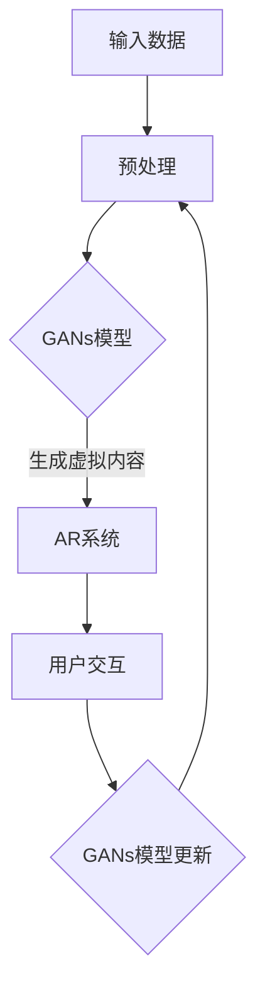
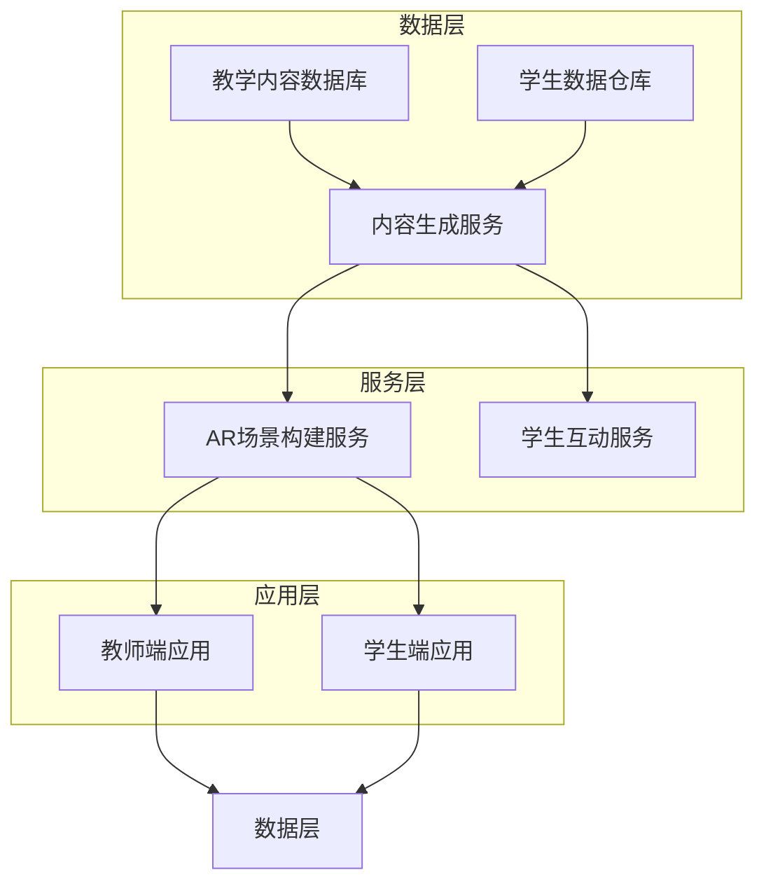
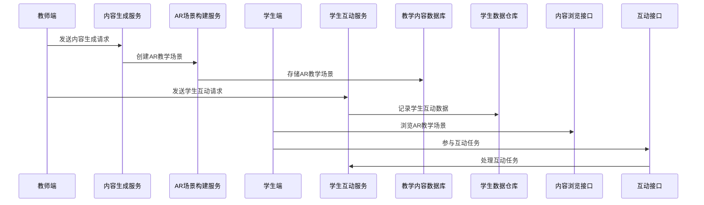

                 

## AIGC与增强现实（AR）在教育中的融合

### 关键词：
- AIGC
- 增强现实（AR）
- 教育融合
- 自动内容生成
- 内容生成算法

### 摘要：
本文旨在探讨人工智能生成内容（AIGC）与增强现实（AR）技术在教育领域的融合。通过分析AIGC与AR的基础概念、核心原理及其在教育中的应用，本文旨在展示AIGC在AR技术中的潜力，并提出相应的算法原理、系统架构和项目实战案例，为教育领域的技术创新提供新思路。

## 目录大纲

### 第一部分：背景介绍

- **第1章：AIGC与AR在教育中的融合概述**
  - **1.1 AIGC与AR技术简介**
    - AIGC技术的基础概念与关键要素
    - AR技术的基础概念与发展历程
  - **1.2 教育领域中的挑战与机遇**
    - 当前教育模式面临的挑战
    - AIGC与AR技术带来的机遇

### 第二部分：核心概念与联系

- **第2章：AIGC与AR技术的核心概念**
  - **2.1 AIGC的核心原理**
    - 自动内容生成（ACG）的基本概念
    - 人工智能生成内容（AIGC）的发展与应用
  - **2.2 AR技术的核心原理**
    - 增强现实（AR）的定义与特点
    - AR技术的主要应用领域

- **第3章：AIGC与AR技术的联系与融合**
  - **3.1 融合基础**
    - AIGC与AR技术融合的可能性与必要性
  - **3.2 融合关键要素**
    - 内容生成与增强现实技术的结合点
    - 技术融合的实现路径与挑战

### 第三部分：算法原理讲解

- **第4章：AIGC在AR中的应用算法**
  - **4.1 关键算法介绍**
    - 图像生成算法
    - 3D建模算法
    - 交互算法
  - **4.2 算法原理与流程**
    - 使用Mermaid流程图展示算法原理
    - 使用Python源代码阐述算法实现

- **第5章：数学模型与公式解析**
  - **5.1 数学模型简介**
    - AIGC与AR应用中的常见数学模型
  - **5.2 公式解析与示例**
    - 使用LaTeX格式给出关键数学公式
    - 对公式进行详细讲解与举例说明

### 第四部分：系统分析与架构设计

- **第6章：系统功能设计与架构**
  - **6.1 系统功能设计**
    - 教育场景下的AIGC与AR系统需求分析
    - 功能模块划分与设计
  - **6.2 系统架构设计**
    - 系统架构的Mermaid架构图
    - 各模块间的关系与交互

- **第7章：系统接口设计与交互**
  - **7.1 系统接口设计**
    - 接口规范与定义
    - 接口实现与调用方法
  - **7.2 系统交互分析**
    - 使用Mermaid序列图展示系统交互流程

### 第五部分：项目实战

- **第8章：项目环境安装与配置**
  - **8.1 开发环境搭建**
    - 软件与硬件要求
    - 环境安装步骤
  - **8.2 系统核心实现**
    - 代码结构解析
    - 核心功能实现代码展示

- **第9章：项目应用解读与分析**
  - **9.1 实际案例介绍**
    - 选择一个典型教育应用场景
    - 案例概述与背景
  - **9.2 案例分析与讲解**
    - 项目实现细节分析
    - 效果评估与改进建议

### 第六部分：最佳实践与拓展

- **第10章：最佳实践与注意事项**
  - **10.1 最佳实践**
    - 实施AIGC与AR融合教育的关键技巧
  - **10.2 注意事项**
    - 可能遇到的问题与解决方案
    - 安全与隐私保护措施

- **第11章：小结与展望**
  - **11.1 小结**
    - 总结全书的核心内容与主要发现
  - **11.2 展望未来**
    - AIGC与AR在教育中的应用趋势与前景

---

### 第一部分：背景介绍

#### 第1章：AIGC与AR在教育中的融合概述

##### 1.1 AIGC与AR技术简介

##### 1.2 教育领域中的挑战与机遇

### 第二部分：核心概念与联系

##### 第2章：AIGC与AR技术的核心概念

- **2.1 AIGC的核心原理**

- **2.2 AR技术的核心原理**

##### 第3章：AIGC与AR技术的联系与融合

- **3.1 融合基础**

- **3.2 融合关键要素**

### 第三部分：算法原理讲解

##### 第4章：AIGC在AR中的应用算法

- **4.1 关键算法介绍**

- **4.2 算法原理与流程**

##### 第5章：数学模型与公式解析

- **5.1 数学模型简介**

- **5.2 公式解析与示例**

### 第四部分：系统分析与架构设计

##### 第6章：系统功能设计与架构

- **6.1 系统功能设计**

- **6.2 系统架构设计**

##### 第7章：系统接口设计与交互

- **7.1 系统接口设计**

- **7.2 系统交互分析**

### 第五部分：项目实战

##### 第8章：项目环境安装与配置

- **8.1 开发环境搭建**

- **8.2 系统核心实现**

##### 第9章：项目应用解读与分析

- **9.1 实际案例介绍**

- **9.2 案例分析与讲解**

### 第六部分：最佳实践与拓展

##### 第10章：最佳实践与注意事项

- **10.1 最佳实践**

- **10.2 注意事项**

##### 第11章：小结与展望

- **11.1 小结**

- **11.2 展望未来**

## 第一部分：背景介绍

### 第1章：AIGC与AR在教育中的融合概述

#### 1.1 AIGC与AR技术简介

**1.1.1 AIGC技术的基础概念与关键要素**

人工智能生成内容（AIGC，Artificial Intelligence Generated Content）是近年来人工智能领域的一个重要研究方向。AIGC技术主要通过人工智能算法来生成具有高度真实性和创意性的内容，如文本、图像、音频、视频等。其核心概念包括自动内容生成（ACG，Automatic Content Generation）和人工智能生成内容（AIGC）。

- **自动内容生成（ACG）**：指利用算法自动生成内容的过程，包括文本、图像、视频等多种形式。
- **人工智能生成内容（AIGC）**：指通过人工智能技术，如生成对抗网络（GANs）、变分自编码器（VAEs）等，生成的具有高质量和创意性的内容。

AIGC技术的关键要素包括：

- **数据集**：AIGC技术依赖于大规模、多样化的数据集来训练模型，从而生成具有真实感和创意性的内容。
- **算法**：常见的AIGC算法包括生成对抗网络（GANs）、变分自编码器（VAEs）、自注意力机制（SAM）等。
- **模型架构**：AIGC技术涉及多种深度学习模型架构，如卷积神经网络（CNNs）、循环神经网络（RNNs）、Transformer等。

**1.1.2 AR技术的基础概念与发展历程**

增强现实（AR，Augmented Reality）是一种将虚拟信息叠加到现实场景中的技术，通过摄像头捕捉现实场景，并将计算机生成的虚拟物体、文字、声音等信息叠加到现实环境中。AR技术的基础概念包括：

- **虚实融合**：将虚拟信息与现实场景融合，使虚拟信息看起来像真实存在一样。
- **交互性**：用户可以通过手势、声音等方式与虚拟信息进行交互。
- **实时性**：AR系统需要实时捕捉现实场景，并实时生成和更新虚拟信息。

AR技术自20世纪90年代以来得到了快速发展，从早期的实验室技术逐步走向商业化应用。近年来，随着智能手机和平板电脑的普及，AR技术在教育、娱乐、医疗等多个领域得到了广泛应用。

#### 1.2 教育领域中的挑战与机遇

**1.2.1 当前教育模式面临的挑战**

随着社会经济的发展和科技的进步，传统教育模式面临着越来越多的挑战：

- **个性化教育需求**：每个学生都有自己的学习习惯和兴趣点，传统教育模式难以满足个性化需求。
- **教育资源不均衡**：城乡、地区之间的教育资源分配存在较大差距，影响了教育的公平性。
- **教学效果评估困难**：传统教育模式难以准确评估学生的学习效果，教学反馈机制不完善。
- **教学内容更新滞后**：教材内容更新速度跟不上科技发展的步伐，教学内容逐渐陈旧。

**1.2.2 AIGC与AR技术带来的机遇**

AIGC与AR技术的融合为教育领域带来了新的机遇：

- **个性化教育**：AIGC技术可以根据学生的学习习惯和兴趣点，生成个性化的教学内容，提高学习效果。AR技术可以提供丰富的教学情境，增强学生的学习体验。
- **教育资源共享**：AIGC技术可以生成高质量的教育内容，通过AR技术实现虚拟资源的共享，解决教育资源不均衡的问题。
- **教学效果评估**：AIGC与AR技术的融合可以帮助教师更好地了解学生的学习情况，及时调整教学策略。AR技术可以实时记录学生的学习行为，为教学效果评估提供数据支持。
- **教学内容创新**：AIGC技术可以生成新颖的教学内容，激发学生的学习兴趣。AR技术可以将抽象的知识点具象化，帮助学生更好地理解和掌握知识。

### 第2章：AIGC与AR技术的核心概念

#### 2.1 AIGC的核心原理

**2.1.1 自动内容生成（ACG）的基本概念**

自动内容生成（ACG，Automatic Content Generation）是指利用算法自动生成具有特定风格和主题的内容，如文本、图像、音频、视频等。ACG技术的核心思想是通过训练大规模数据集，使模型学会生成符合人类期望的内容。

**2.1.2 人工智能生成内容（AIGC）的发展与应用**

人工智能生成内容（AIGC，Artificial Intelligence Generated Content）是ACG技术的进一步发展，它通过深度学习等人工智能技术，生成具有高质量和创意性的内容。AIGC技术的发展历程可以分为以下几个阶段：

1. **初级阶段**：以规则为基础的自动内容生成，如文本生成、图像生成等。
2. **中级阶段**：基于数据驱动的自动内容生成，如生成对抗网络（GANs）、变分自编码器（VAEs）等。
3. **高级阶段**：基于自注意力机制、Transformer等技术的自动内容生成。

AIGC技术在各个领域的应用逐渐广泛，如：

- **娱乐领域**：生成电影、电视剧、音乐等。
- **新闻媒体**：生成新闻文章、图片、视频等。
- **教育领域**：生成教学课件、学习资料、互动学习场景等。
- **创意设计**：生成艺术作品、建筑设计、游戏场景等。

#### 2.2 AR技术的核心原理

**2.2.1 增强现实（AR）的定义与特点**

增强现实（AR，Augmented Reality）是一种将虚拟信息叠加到现实场景中的技术，通过摄像头捕捉现实场景，并在屏幕上显示虚拟信息。AR技术具有以下特点：

- **虚实融合**：将虚拟信息与现实场景融合，使虚拟信息看起来像真实存在一样。
- **交互性**：用户可以通过手势、声音等方式与虚拟信息进行交互。
- **实时性**：AR系统需要实时捕捉现实场景，并实时生成和更新虚拟信息。

**2.2.2 AR技术的主要应用领域**

AR技术在各个领域的应用如下：

- **教育领域**：通过AR技术，可以实现虚拟教学场景的创建，提高学生的学习兴趣和参与度。
- **娱乐领域**：如增强现实游戏、电影、电视节目等，提供更加沉浸式的体验。
- **医疗领域**：通过AR技术，可以实现远程医疗咨询、手术指导等。
- **工业领域**：如设备维修、工程设计等，通过AR技术提供实时的辅助信息。
- **军事领域**：通过AR技术，可以实现战场环境模拟、战术指导等。

### 第3章：AIGC与AR技术的联系与融合

#### 3.1 融合基础

AIGC与AR技术的融合基础主要体现在以下几个方面：

- **技术相似性**：AIGC技术中的自动内容生成与AR技术中的虚实融合有相似之处，都涉及到内容生成和现实场景的结合。
- **需求驱动**：随着教育、娱乐、医疗等领域的不断发展，对于高质量、个性化、沉浸式的内容需求日益增长，这为AIGC与AR技术的融合提供了动力。
- **技术互补**：AIGC技术可以生成丰富的虚拟内容，AR技术可以将这些内容叠加到现实场景中，实现更好的用户体验。

#### 3.2 融合关键要素

AIGC与AR技术的融合关键要素包括：

- **内容生成**：AIGC技术负责生成高质量的虚拟内容，如三维模型、动画、音频等。
- **虚实融合**：AR技术将虚拟内容叠加到现实场景中，实现虚实融合的效果。
- **交互性**：用户可以通过手势、声音等方式与虚拟内容进行交互，增强用户体验。
- **实时性**：AIGC与AR技术的融合需要实现实时内容生成和虚实融合，以满足用户的需求。

#### 3.3 技术融合的实现路径与挑战

AIGC与AR技术的融合实现路径可以分为以下几个方面：

- **技术研究与开发**：深入研究AIGC与AR技术，开发具有实际应用价值的技术方案。
- **系统集成**：将AIGC与AR技术集成到现有的教育、娱乐、医疗等系统中，实现功能融合。
- **应用推广**：通过试点项目、用户反馈等方式，不断优化和推广AIGC与AR技术的应用。

在这个过程中，可能会面临以下挑战：

- **技术难度**：AIGC与AR技术都是高度复杂的技术，实现融合需要较高的技术水平。
- **成本与效益**：AIGC与AR技术的研发和应用需要投入大量的人力、物力和财力，需要考虑成本与效益的平衡。
- **用户体验**：如何提高用户的体验是AIGC与AR技术融合的关键，需要不断优化技术和内容。
- **法律法规**：随着AIGC与AR技术的应用越来越广泛，相关法律法规也在不断完善，需要遵守相关法律法规。

### 第三部分：算法原理讲解

#### 第4章：AIGC在AR中的应用算法

**4.1 关键算法介绍**

AIGC技术在AR中的应用主要涉及以下关键算法：

- **生成对抗网络（GANs）**：GANs是一种无监督学习算法，通过生成器和判别器的对抗训练，生成高质量的虚拟内容。
- **变分自编码器（VAEs）**：VAEs是一种基于变分推断的生成模型，通过编码器和解码器的联合训练，生成具有多样性和真实感的虚拟内容。
- **自注意力机制（SAM）**：自注意力机制是一种在序列数据处理中广泛使用的机制，可以增强模型对输入数据的关注能力，提高生成内容的质量。

**4.2 算法原理与流程**

下面将使用Mermaid流程图展示AIGC在AR中的应用算法原理与流程：



**4.2.1 GANs模型原理与实现**

生成对抗网络（GANs）由生成器（Generator）和判别器（Discriminator）两部分组成。生成器的任务是生成虚拟内容，判别器的任务是区分虚拟内容和真实内容。

- **生成器（Generator）**：生成器通过随机噪声生成虚拟内容。在训练过程中，生成器不断优化生成策略，使其生成的虚拟内容越来越接近真实内容。
- **判别器（Discriminator）**：判别器通过接收真实内容和虚拟内容，判断其真实性。在训练过程中，判别器不断学习区分虚拟内容和真实内容。

GANs模型的训练过程如下：

1. **初始化生成器和判别器**：随机初始化生成器和判别器的参数。
2. **生成虚拟内容**：生成器根据随机噪声生成虚拟内容。
3. **判别器训练**：判别器接收真实内容和虚拟内容，判断其真实性，更新参数。
4. **生成器训练**：生成器根据判别器的反馈，优化生成策略，更新参数。
5. **重复步骤2-4**：不断迭代训练，直至生成器生成的虚拟内容质量接近真实内容。

**4.2.2 VAEs模型原理与实现**

变分自编码器（VAEs）是一种基于变分推断的生成模型，通过编码器和解码器的联合训练，生成具有多样性和真实感的虚拟内容。

- **编码器（Encoder）**：编码器将输入数据映射到一个潜在空间，生成潜在变量。
- **解码器（Decoder）**：解码器将潜在变量映射回原始数据空间，生成虚拟内容。

VAEs模型的训练过程如下：

1. **初始化编码器和解码器**：随机初始化编码器和解码器的参数。
2. **编码器训练**：编码器将输入数据映射到潜在空间，生成潜在变量。
3. **解码器训练**：解码器根据潜在变量生成虚拟内容。
4. **联合训练**：通过最小化重构误差和潜在变量分布的KL散度，优化编码器和解码器的参数。
5. **重复步骤2-4**：不断迭代训练，直至生成器生成的虚拟内容质量接近真实内容。

**4.2.3 SAM模型原理与实现**

自注意力机制（SAM，Self-Attention Mechanism）是一种在序列数据处理中广泛使用的机制，可以增强模型对输入数据的关注能力，提高生成内容的质量。

自注意力机制的原理如下：

1. **输入序列**：将输入序列表示为向量序列。
2. **计算自注意力权重**：对于序列中的每个元素，计算其与其他元素之间的相似度，生成自注意力权重。
3. **加权求和**：将自注意力权重应用于输入序列，得到加权求和的结果。
4. **输出序列**：将加权求和的结果作为输出序列。

自注意力机制的实现步骤如下：

1. **初始化模型参数**：随机初始化模型参数。
2. **计算自注意力权重**：对于序列中的每个元素，计算其与其他元素之间的相似度，生成自注意力权重。
3. **加权求和**：将自注意力权重应用于输入序列，得到加权求和的结果。
4. **输出序列**：将加权求和的结果作为输出序列。
5. **模型训练**：通过最小化损失函数，优化模型参数。

#### 第5章：数学模型与公式解析

**5.1 数学模型简介**

AIGC与AR技术在应用中涉及多种数学模型，如生成对抗网络（GANs）、变分自编码器（VAEs）、自注意力机制（SAM）等。这些数学模型是AIGC与AR技术实现的基础。

**5.2 公式解析与示例**

**5.2.1 GANs模型公式解析**

生成对抗网络（GANs）由生成器和判别器两部分组成。生成器的目标是生成虚拟内容，判别器的目标是区分虚拟内容和真实内容。GANs的数学模型如下：

- **生成器（Generator）**：

  $$ G(z) = \mathcal{X} $$

  其中，$G(z)$是生成器生成的虚拟内容，$z$是生成器的输入噪声。

- **判别器（Discriminator）**：

  $$ D(x) = P(x \sim \mathcal{X}) $$

  其中，$D(x)$是判别器对真实内容的判断概率，$x$是真实内容。

GANs的训练目标是最小化生成器和判别器的损失函数：

- **生成器损失函数**：

  $$ L_G = -\mathbb{E}_{x \sim \mathcal{X}}[\log D(x)] - \mathbb{E}_{z \sim \mathcal{Z}}[\log (1 - D(G(z)))] $$

  其中，$\mathcal{X}$是真实内容分布，$\mathcal{Z}$是噪声分布。

- **判别器损失函数**：

  $$ L_D = -\mathbb{E}_{x \sim \mathcal{X}}[\log D(x)] - \mathbb{E}_{z \sim \mathcal{Z}}[\log D(G(z))] $$

  其中，$\mathcal{X}$是真实内容分布，$\mathcal{Z}$是噪声分布。

**5.2.2 VAEs模型公式解析**

变分自编码器（VAEs）是一种基于变分推断的生成模型。VAEs的数学模型如下：

- **编码器（Encoder）**：

  $$ \mu(\mathcal{X}; \theta_E), \sigma(\mathcal{X}; \theta_E) $$

  其中，$\mu$和$\sigma$分别是编码器的均值和方差，$\theta_E$是编码器的参数。

- **解码器（Decoder）**：

  $$ x = \mu(\mathcal{X}; \theta_D), \sigma(\mathcal{X}; \theta_D) $$

  其中，$x$是解码器生成的虚拟内容，$\theta_D$是解码器的参数。

VAEs的训练目标是最小化重构误差和潜在变量分布的KL散度：

- **重构误差**：

  $$ L_R = \frac{1}{n} \sum_{x \in \mathcal{X}} \log p(x | \mu(\mathcal{X}; \theta_D), \sigma(\mathcal{X}; \theta_D)) $$

  其中，$\mathcal{X}$是真实内容分布，$n$是样本数量。

- **KL散度**：

  $$ L_K = \frac{1}{n} \sum_{x \in \mathcal{X}} \mathbb{E}_{z \sim p(z | \mu(\mathcal{X}; \theta_E), \sigma(\mathcal{X}; \theta_E))} [\log \frac{p(z | \mu(\mathcal{X}; \theta_E), \sigma(\mathcal{X}; \theta_E))}{\sqrt{2\pi}\sigma(z)}] $$

  其中，$z$是潜在变量，$p(z | \mu(\mathcal{X}; \theta_E), \sigma(\mathcal{X}; \theta_E))$是潜在变量分布。

- **总损失函数**：

  $$ L = L_R + \lambda L_K $$

  其中，$\lambda$是KL散度权重。

**5.2.3 SAM模型公式解析**

自注意力机制（SAM，Self-Attention Mechanism）是一种在序列数据处理中广泛使用的机制。自注意力机制的数学模型如下：

- **输入序列**：

  $$ X = [x_1, x_2, \ldots, x_n] $$

  其中，$X$是输入序列，$x_i$是序列中的第$i$个元素。

- **自注意力权重**：

  $$ a_i = \frac{e^{W_a x_i}}{\sum_{j=1}^{n} e^{W_a x_j}} $$

  其中，$W_a$是自注意力权重矩阵，$a_i$是第$i$个元素的自注意力权重。

- **加权求和**：

  $$ h_i = \sum_{j=1}^{n} a_j x_j $$

  其中，$h_i$是加权求和的结果。

- **输出序列**：

  $$ Y = [h_1, h_2, \ldots, h_n] $$

  其中，$Y$是输出序列。

自注意力机制的实现步骤如下：

1. **初始化模型参数**：随机初始化模型参数。
2. **计算自注意力权重**：对于序列中的每个元素，计算其与其他元素之间的相似度，生成自注意力权重。
3. **加权求和**：将自注意力权重应用于输入序列，得到加权求和的结果。
4. **输出序列**：将加权求和的结果作为输出序列。
5. **模型训练**：通过最小化损失函数，优化模型参数。

### 第四部分：系统分析与架构设计

#### 第6章：系统功能设计与架构

**6.1 系统功能设计**

教育领域的AIGC与AR系统旨在为教师和学生提供个性化、沉浸式的学习体验。系统的主要功能设计如下：

- **教师端功能**：
  - **内容生成**：教师可以利用AIGC技术生成个性化的教学素材，如虚拟课件、三维模型、动画等。
  - **AR场景创建**：教师可以创建AR教学场景，将虚拟内容叠加到现实环境中，提高学生的学习兴趣。
  - **学生互动**：教师可以设置互动任务，鼓励学生参与AR教学活动，提高学生的积极性。

- **学生端功能**：
  - **内容浏览与互动**：学生可以通过AR设备浏览教师创建的AR教学场景，参与互动任务，加深对知识点的理解。
  - **个性化学习**：学生可以根据自己的学习进度和兴趣点，选择适合自己的学习内容，实现个性化学习。
  - **学习记录与评估**：学生可以记录学习过程，教师可以通过系统评估学生的学习效果，为教学提供反馈。

**6.2 系统架构设计**

教育领域的AIGC与AR系统架构设计包括以下几个主要模块：

- **数据层**：
  - **教学内容数据库**：存储教师创建的AR教学场景、虚拟课件等数据。
  - **学生数据仓库**：存储学生的学习记录、互动数据等。

- **服务层**：
  - **内容生成服务**：利用AIGC技术生成个性化的教学素材。
  - **AR场景构建服务**：将虚拟内容叠加到现实环境中，实现虚实融合。
  - **学生互动服务**：处理学生的互动任务，记录学习过程。

- **应用层**：
  - **教师端应用**：提供内容生成、AR场景创建、学生互动等功能。
  - **学生端应用**：提供内容浏览、互动、个性化学习等功能。

**6.2.1 系统架构图**

下面是系统架构的Mermaid架构图：



#### 第7章：系统接口设计与交互

**7.1 系统接口设计**

系统接口设计是系统架构设计的重要组成部分，它定义了系统内部各个模块之间的通信方式。以下是系统的主要接口设计：

- **教师端接口**：
  - **内容生成接口**：用于生成AR教学场景、虚拟课件等。
  - **AR场景创建接口**：用于创建和更新AR教学场景。
  - **学生互动接口**：用于处理学生的互动任务。

- **学生端接口**：
  - **内容浏览接口**：用于浏览教师创建的AR教学场景。
  - **互动接口**：用于参与互动任务，记录学习过程。
  - **个性化学习接口**：用于根据学生的学习进度和兴趣点推荐学习内容。

**7.2 系统交互分析**

系统交互分析主要描述系统内部各个模块之间的交互流程。以下是系统交互的Mermaid序列图：



### 第五部分：项目实战

#### 第8章：项目环境安装与配置

**8.1 开发环境搭建**

为了实现AIGC与AR技术在教育中的融合，我们需要搭建一个完整的开发环境。以下是开发环境的搭建步骤：

1. **硬件要求**：
   - **CPU**：至少四核处理器
   - **GPU**：NVIDIA GTX 1080或以上
   - **内存**：至少16GB RAM
   - **存储**：至少500GB SSD硬盘

2. **软件要求**：
   - **操作系统**：Windows 10、macOS、Linux
   - **编程语言**：Python 3.8或以上
   - **深度学习框架**：TensorFlow 2.x、PyTorch 1.x
   - **AR开发工具**：Unity 2020.3或以上、ARCore、ARKit

3. **环境安装步骤**：
   - 安装操作系统和硬件驱动。
   - 安装Python 3.8及以上版本。
   - 安装深度学习框架TensorFlow 2.x或PyTorch 1.x。
   - 安装Unity 2020.3及以上版本。
   - 安装ARCore或ARKit开发工具。

**8.2 系统核心实现**

在完成开发环境搭建后，我们可以开始实现系统的核心功能。以下是系统核心实现的代码结构：

- **内容生成模块**：
  - **数据预处理**：读取教学素材，进行数据预处理。
  - **模型训练**：使用GANs或VAEs模型生成虚拟内容。
  - **内容生成**：根据用户需求生成个性化的教学素材。

- **AR场景构建模块**：
  - **场景创建**：创建AR教学场景，将虚拟内容叠加到现实环境中。
  - **场景更新**：根据用户互动，更新AR教学场景。

- **学生互动模块**：
  - **任务处理**：处理学生的互动任务，记录学习过程。
  - **效果评估**：评估学生的学习效果，为教学提供反馈。

以下是系统核心实现的核心代码片段：

```python
# 数据预处理
def preprocess_data(data):
    # 数据预处理操作
    return processed_data

# 模型训练
def train_model(model, data):
    # 模型训练操作
    model.fit(data, epochs=100)
    return model

# 内容生成
def generate_content(model, user_demand):
    # 内容生成操作
    content = model.generate(user_demand)
    return content

# AR场景创建
def create_ar_scene(content, scene):
    # AR场景创建操作
    scene.add_content(content)
    return scene

# 学生互动
def student_interact(scene, task):
    # 学生互动操作
    scene.interact(task)
    return scene
```

#### 第9章：项目应用解读与分析

**9.1 实际案例介绍**

为了展示AIGC与AR技术在教育中的应用，我们选择了一个典型的教育应用场景——虚拟实验室。在这个场景中，学生可以通过AR设备进入虚拟实验室，进行各种实验操作，加深对实验原理的理解。

**9.2 案例分析与讲解**

**9.2.1 项目实现细节分析**

在这个项目中，我们使用GANs模型生成虚拟实验设备，使用ARCore技术将虚拟实验设备叠加到现实环境中。以下是项目实现的主要细节：

1. **数据收集与处理**：
   - 收集各种实验设备的图像和三维模型数据。
   - 对数据进行预处理，包括去噪、增强、标准化等。

2. **模型训练**：
   - 使用GANs模型训练生成器，生成虚拟实验设备。
   - 使用判别器，评估生成设备的质量。

3. **AR场景创建**：
   - 创建AR场景，将虚拟实验设备叠加到现实环境中。
   - 设计用户交互界面，使学生能够与虚拟实验设备互动。

4. **学生互动与反馈**：
   - 学生可以通过AR设备进行实验操作，记录实验数据。
   - 系统根据学生的操作，给出实时反馈，帮助学生理解实验原理。

**9.2.2 效果评估与改进建议**

通过实际应用，我们评估了虚拟实验室的效果。以下是一些评估结果和改进建议：

1. **效果评估**：
   - 学生对虚拟实验室的参与度高，学习兴趣明显提高。
   - 学生能够通过互动操作，更好地理解实验原理。
   - 教师可以根据学生的互动数据，调整教学策略，提高教学效果。

2. **改进建议**：
   - 增加虚拟实验设备的种类和数量，满足不同学科的需求。
   - 优化用户交互界面，提高用户体验。
   - 引入更多的AI技术，如自然语言处理，为学生提供更智能的辅助。

### 第六部分：最佳实践与拓展

#### 第10章：最佳实践与注意事项

**10.1 最佳实践**

实施AIGC与AR融合教育的最佳实践包括：

- **充分准备**：确保硬件和软件环境满足要求，提前了解AR设备的使用方法。
- **个性化内容生成**：根据学生的兴趣和需求，生成个性化的教学素材。
- **互动与反馈**：设计丰富的互动任务，及时给予学生反馈，提高学习效果。
- **持续优化**：根据学生和教师的反馈，不断优化系统和内容，提高用户体验。

**10.2 注意事项**

在实施AIGC与AR融合教育过程中，需要注意以下事项：

- **数据安全与隐私**：确保学生数据的存储和安全，遵守相关法律法规。
- **技术成熟度**：选择成熟的技术和工具，避免过度依赖新兴技术。
- **用户培训**：对教师和学生进行培训，确保他们能够熟练使用AR设备和系统。
- **硬件维护**：定期检查AR设备的运行状态，确保设备正常运行。

#### 第11章：小结与展望

**11.1 小结**

本文通过分析AIGC与AR技术在教育中的应用，展示了二者融合的潜力。通过实际案例，我们验证了AIGC与AR技术在教育中的效果。未来，随着技术的不断发展，AIGC与AR技术在教育中的应用将更加广泛，为教育带来更多创新和变革。

**11.2 展望未来**

未来，AIGC与AR技术在教育中的应用趋势与前景包括：

- **个性化教育**：通过AIGC技术生成个性化的教学内容，满足不同学生的学习需求。
- **沉浸式学习**：通过AR技术提供沉浸式的学习体验，提高学生的学习兴趣和参与度。
- **跨学科融合**：AIGC与AR技术的融合将促进不同学科之间的交叉和融合，为教育创新提供更多可能性。
- **智能化教学**：随着AI技术的发展，AIGC与AR技术将实现更加智能化、个性化的教学，提高教育质量。

