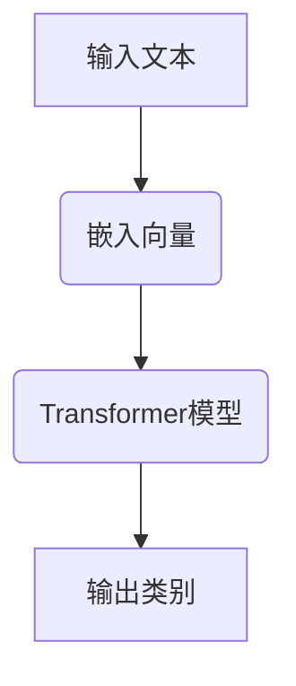
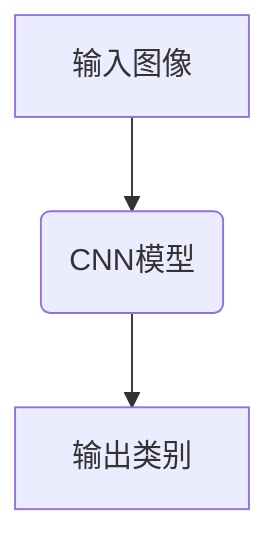
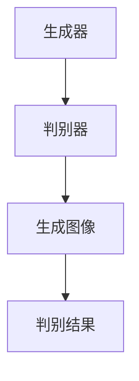
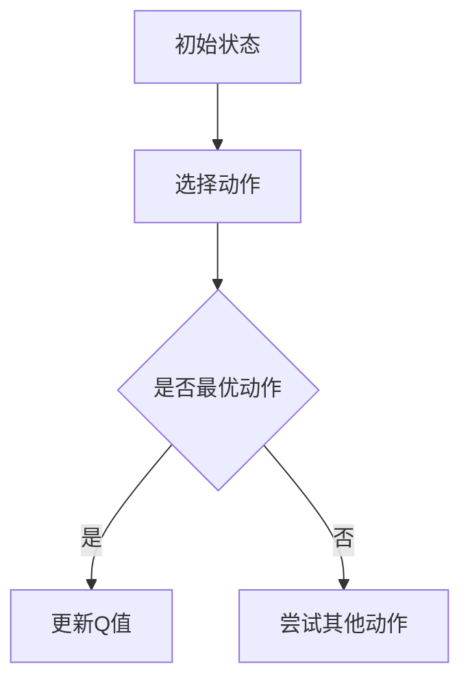

                 

### AIGC与增强现实（AR）的概述

**关键词：AIGC，增强现实（AR），技术应用，历史背景**

**摘要：**
本文将探讨AIGC（人工智能生成内容）与增强现实（AR）的结合应用。通过介绍两者的核心概念、发展历程和关键技术，分析它们结合的意义与潜在应用场景，进一步探讨其在实际应用中的挑战和解决方案，最后结合案例分析与最佳实践展望AIGC与AR的未来发展趋势。

### 目录大纲

1. 第一部分：AIGC与AR的概述
    - 第1章：AIGC与AR的概念与历史背景
        - 1.1 AIGC的概念
        - 1.1.1 AIGC的定义
        - 1.1.2 AIGC的发展历程
        - 1.1.3 AIGC的核心技术
        - 1.1.4 AR的概念
        - 1.1.5 AR的发展历程
        - 1.1.6 AR的关键技术
    - 第2章：AIGC与AR结合的意义与应用场景
        - 2.1 AIGC与AR结合的意义
        - 2.1.1 提升用户体验
        - 2.1.2 增强现实内容的生成与优化
        - 2.1.3 提高生产效率与降低成本
        - 2.2 AIGC与AR结合的应用场景
        - 2.2.1 消费品行业
        - 2.2.2 教育培训
        - 2.2.3 医疗健康
        - 2.2.4 建筑设计
        - 2.2.5 游戏娱乐

2. 第二部分：AIGC与AR的关键技术详解
    - 第3章：AIGC的核心技术
        - 3.1 自然语言处理
        - 3.2 计算机视觉
        - 3.3 生成对抗网络
        - 3.4 强化学习
    - 第4章：AR的关键技术
        - 4.1 增强现实引擎
        - 4.2 虚拟现实头戴设备
        - 4.3 虚拟物体与场景融合
        - 4.4 交互式界面设计

3. 第三部分：AIGC与AR的实际应用与挑战
    - 第5章：AIGC与AR在实际应用中的挑战与解决方案
        - 5.1 技术挑战
        - 5.1.1 计算资源与功耗
        - 5.1.2 数据隐私与安全
        - 5.1.3 内容创作与生成效率
        - 5.2 解决方案
        - 5.2.1 云计算与边缘计算结合
        - 5.2.2 加密技术与隐私保护
        - 5.2.3 自动化内容生成工具

4. 第四部分：案例分析与最佳实践
    - 第6章：案例分析与最佳实践
        - 6.1 案例分析
        - 6.1.1 消费品行业案例分析
        - 6.1.2 教育培训案例分析
        - 6.1.3 医疗健康案例分析
        - 6.1.4 建筑设计案例分析
        - 6.1.5 游戏娱乐案例分析
        - 6.2 最佳实践
        - 6.2.1 设计原则
        - 6.2.2 技术选型
        - 6.2.3 项目管理

5. 第五部分：未来发展趋势与展望
    - 第7章：AIGC与AR的未来发展趋势与展望
        - 6.1 技术发展趋势
        - 6.2 应用领域扩展
        - 6.3 社会影响

6. 第六部分：总结与展望
    - 第8章：总结与展望
        - 8.1 本书总结
        - 8.2 AIGC与AR的未来挑战与机遇
        - 8.3 开发者与研究者建议

### 第一部分：AIGC与AR的概述

#### 第1章：AIGC与AR的概念与历史背景

##### 1.1 AIGC的概念

AIGC（Artificial Intelligence Generated Content）是指通过人工智能技术生成内容的过程。这一概念源自于人工智能（AI）和生成内容（Content Generation）的结合。AIGC不仅涵盖了文本生成，还包括图像、音频、视频等多种内容形式。其核心在于利用自然语言处理（NLP）、计算机视觉（CV）等AI技术，模拟人类创造力的过程，生成高质量、多样化的内容。

AIGC的定义可以简化为：利用人工智能技术，自动生成满足特定需求和目的的内容。

**发展历程：**

AIGC的发展历程可以追溯到20世纪90年代，当时自然语言处理和计算机视觉等基础技术逐渐成熟。然而，真正的突破出现在21世纪初，随着深度学习技术的兴起，AIGC开始进入快速发展阶段。以下是一些关键的时间节点：

- **2010年**：生成对抗网络（GAN）的提出，为AIGC的发展提供了新的技术基础。
- **2014年**：GAN在图像生成任务上取得了显著成果，引发了广泛关注。
- **2016年**：自然语言处理技术（如Transformer模型）的突破，使得AIGC在文本生成方面取得了重要进展。
- **至今**：随着AI技术的不断进步，AIGC的应用场景越来越广泛，从文本生成到图像、音频等多种形式，AIGC已经成为人工智能领域的一个重要研究方向。

**核心技术：**

AIGC的核心技术包括自然语言处理、计算机视觉、生成对抗网络和强化学习等。以下是对这些技术的简要介绍：

- **自然语言处理（NLP）**：NLP是AI的一个重要分支，旨在使计算机能够理解、生成和处理人类语言。在AIGC中，NLP技术被广泛应用于文本生成、摘要、翻译等任务。
- **计算机视觉（CV）**：计算机视觉涉及计算机对图像和视频的理解和分析。在AIGC中，CV技术被用于图像生成、图像识别和视频合成等任务。
- **生成对抗网络（GAN）**：GAN是一种深度学习模型，由生成器和判别器组成，通过相互博弈的方式生成高质量的数据。
- **强化学习（RL）**：强化学习是一种通过试错和反馈来学习最优策略的AI技术。在AIGC中，强化学习可以用于优化内容生成过程，提高生成质量。

##### 1.1.4 AR的概念

增强现实（Augmented Reality，AR）是一种通过计算机技术增强现实世界感官体验的技术。AR的核心在于将虚拟信息（如图像、文字、声音等）叠加到真实世界中，为用户提供一个融合了虚拟和现实的全新体验。

**发展历程：**

AR技术的发展历程可以追溯到20世纪60年代，当时一些科学家开始探索如何将计算机图形与真实世界结合。以下是一些关键的时间节点：

- **1968年**：美国科学家ivan Sutherland提出了“视觉增强”的概念，这是AR技术最早的雏形。
- **1990年代**：虚拟现实头戴设备的出现，为AR技术提供了硬件支持。
- **2010年代**：智能手机和平板电脑的普及，使得AR技术得以在消费领域广泛应用。
- **至今**：随着AI和5G等技术的不断发展，AR技术的应用场景越来越广泛，从娱乐、教育到医疗、工业等领域。

**关键技术：**

AR的关键技术包括增强现实引擎、虚拟现实头戴设备、虚拟物体与场景融合和交互式界面设计。以下是对这些技术的简要介绍：

- **增强现实引擎**：增强现实引擎是AR技术的核心，它负责将虚拟信息与现实世界进行叠加和处理。常见的增强现实引擎包括ARKit、ARCore和Unity等。
- **虚拟现实头戴设备**：虚拟现实头戴设备是AR技术的硬件载体，如微软的HoloLens、谷歌的Cardboard等。这些设备通过摄像头、传感器等组件捕捉用户周围的环境，并将虚拟信息叠加到真实世界中。
- **虚拟物体与场景融合**：虚拟物体与场景融合技术是将虚拟物体与现实场景无缝结合的关键。通过计算机视觉和图形处理技术，可以实现虚拟物体在真实场景中的自然交互和表现。
- **交互式界面设计**：交互式界面设计是AR技术的用户体验关键。良好的交互设计可以提高用户的参与度和满意度，使AR应用更加自然和易用。

### 第一部分小结

在本章中，我们介绍了AIGC和AR的核心概念、发展历程和关键技术。AIGC通过人工智能技术自动生成内容，而AR则通过计算机技术增强现实世界的感官体验。AIGC和AR的结合为用户带来了全新的交互体验和内容生成方式，具有广泛的应用前景。在接下来的章节中，我们将进一步探讨AIGC和AR结合的意义、关键技术、实际应用案例以及未来发展趋势。让我们一起期待这个新兴领域的更多精彩。

### AIGC与AR结合的意义与应用场景

#### 第2章：AIGC与AR结合的意义与应用场景

随着AIGC（人工智能生成内容）和AR（增强现实）技术的不断成熟，两者之间的结合应用日益广泛。本章将探讨AIGC与AR结合的意义及其在多个领域的应用场景。

##### 2.1 AIGC与AR结合的意义

AIGC与AR的结合，不仅提升了用户体验，还大大增强了现实内容的生成与优化能力。以下是AIGC与AR结合的几个关键意义：

1. **提升用户体验**：
   AIGC技术可以通过自然语言处理、计算机视觉等技术生成个性化的内容，使得AR应用能够根据用户需求提供定制化的信息和服务。例如，在购物场景中，用户可以通过AR技术查看商品的3D模型，并通过AIGC技术获取商品的相关信息和用户评价，从而提升购物体验。

2. **增强现实内容的生成与优化**：
   AIGC技术可以自动生成高质量的虚拟物体和场景，从而丰富AR应用的内容。例如，在教育领域，AIGC技术可以生成三维模型和动画，使得学习过程更加生动有趣。同时，AIGC技术还可以对生成的AR内容进行优化，使其更好地适应不同的设备和场景。

3. **提高生产效率与降低成本**：
   AIGC技术可以自动化许多内容创作和优化的过程，从而提高生产效率并降低成本。例如，在广告行业，AIGC技术可以自动生成广告内容和动画，使得广告制作过程更加高效。此外，AIGC技术还可以用于虚拟现实（VR）内容的制作，降低VR内容的制作成本。

##### 2.2 AIGC与AR结合的应用场景

AIGC与AR的结合在多个领域展现出了巨大的潜力。以下是一些典型的应用场景：

1. **消费品行业**：
   在消费品行业，AIGC与AR的结合可以提升购物体验。例如，用户可以通过AR技术查看商品的3D模型，并通过AIGC技术获取商品的相关信息和用户评价。此外，AIGC技术还可以用于个性化推荐，根据用户的历史购买行为和偏好生成个性化的商品推荐。

2. **教育培训**：
   在教育培训领域，AIGC与AR的结合可以提升学习效果。通过AR技术，学生可以身临其境地体验历史事件、科学实验等。同时，AIGC技术可以生成三维模型和动画，使得学习内容更加生动有趣。

3. **医疗健康**：
   在医疗健康领域，AIGC与AR的结合可以提升医疗服务的质量。例如，医生可以通过AR技术查看患者的三维模型，更好地了解病情。此外，AIGC技术还可以用于生成手术模拟视频，帮助医生进行手术训练。

4. **建筑设计**：
   在建筑设计领域，AIGC与AR的结合可以提升设计效率。通过AR技术，设计师可以实时查看建筑的三维模型，并进行修改和优化。同时，AIGC技术可以生成各种建筑材料的3D模型，帮助设计师更好地了解材料特性。

5. **游戏娱乐**：
   在游戏娱乐领域，AIGC与AR的结合可以创造更加丰富的游戏体验。通过AR技术，玩家可以身临其境地体验游戏场景。同时，AIGC技术可以生成各种游戏角色和道具，使得游戏内容更加多样化。

##### 2.2.1 消费品行业

在消费品行业，AIGC与AR的结合主要体现在以下几个方面：

1. **虚拟试衣**：
   用户可以通过AR技术试穿衣物，并通过AIGC技术获取衣物尺寸、材质等信息，从而更好地做出购买决策。

2. **个性化推荐**：
   通过分析用户的购买历史和偏好，AIGC技术可以生成个性化的商品推荐，提升用户满意度。

3. **增强购物体验**：
   用户可以通过AR技术查看商品的3D模型，并通过AIGC技术获取商品的相关信息和用户评价，从而提升购物体验。

##### 2.2.2 教育培训

在教育培训领域，AIGC与AR的结合主要体现在以下几个方面：

1. **互动式教学**：
   通过AR技术，学生可以身临其境地体验历史事件、科学实验等，从而提高学习效果。

2. **三维模型展示**：
   教师可以通过AIGC技术生成三维模型和动画，使得教学内容更加生动有趣。

3. **个性化学习**：
   通过分析学生的学习数据，AIGC技术可以生成个性化的学习内容，满足不同学生的学习需求。

##### 2.2.3 医疗健康

在医疗健康领域，AIGC与AR的结合主要体现在以下几个方面：

1. **手术模拟**：
   通过AR技术，医生可以查看患者的三维模型，更好地了解病情，从而进行更加精准的手术。

2. **医学教育**：
   通过AR技术，学生可以直观地了解人体解剖结构、疾病机理等，提高医学教育质量。

3. **远程医疗**：
   通过AR技术，医生可以远程查看患者的病情，提供专业的医疗建议。

##### 2.2.4 建筑设计

在建筑设计领域，AIGC与AR的结合主要体现在以下几个方面：

1. **三维模型展示**：
   通过AR技术，设计师可以实时查看建筑的三维模型，并进行修改和优化。

2. **建筑材料展示**：
   通过AIGC技术，设计师可以生成各种建筑材料的3D模型，更好地了解材料特性。

3. **协同设计**：
   通过AR技术，设计师可以与团队成员实时协作，提高设计效率。

##### 2.2.5 游戏娱乐

在游戏娱乐领域，AIGC与AR的结合主要体现在以下几个方面：

1. **沉浸式体验**：
   通过AR技术，玩家可以身临其境地体验游戏场景，提高游戏乐趣。

2. **角色定制**：
   通过AIGC技术，玩家可以生成个性化的游戏角色和道具。

3. **动态剧情**：
   通过AIGC技术，游戏剧情可以根据玩家的行为进行动态调整，提高游戏的可玩性。

### 总结

AIGC与AR的结合在多个领域展现了巨大的潜力，提升了用户体验，丰富了现实内容，提高了生产效率，降低了成本。随着技术的不断进步，AIGC与AR的结合应用将更加广泛，为人们的生活带来更多便利和乐趣。

### AIGC的核心技术详解

#### 第3章：AIGC的核心技术

AIGC（人工智能生成内容）技术依赖于多种核心AI技术，其中自然语言处理（NLP）、计算机视觉（CV）、生成对抗网络（GAN）和强化学习（RL）是最为重要的组成部分。以下将对这些技术进行详细解读。

##### 3.1 自然语言处理（NLP）

自然语言处理是AIGC技术的基础，旨在使计算机能够理解和生成人类语言。NLP技术包括文本分类、情感分析、命名实体识别、机器翻译等多种任务。

**核心概念**：

- **文本分类**：将文本数据分类到预定义的类别中，例如垃圾邮件检测、新闻分类等。
- **情感分析**：分析文本的情感倾向，如正面、负面或中性。
- **命名实体识别**：识别文本中的特定实体，如人名、地名、组织名等。
- **机器翻译**：将一种语言的文本翻译成另一种语言。

**对比表格**：

| 技术名称 | 描述 | 应用场景 |
| --- | --- | --- |
| 文本分类 | 对文本进行分类 | 垃圾邮件检测、新闻分类 |
| 情感分析 | 分析文本的情感倾向 | 社交媒体情绪分析、产品评价分析 |
| 命名实体识别 | 识别文本中的特定实体 | 信息提取、知识图谱构建 |
| 机器翻译 | 翻译一种语言的文本 | 国际化应用、多语言沟通 |

**ER实体关系图**：

以下是一个简单的ER实体关系图，展示了NLP技术中常见的实体及其关系：

```mermaid
erDiagram
  Product ||--|{ Customer } Customer
  Customer }|---|{ Review } Review
  Review }|--|{ Rating } Rating
```

**算法原理讲解**：

自然语言处理算法通常基于深度学习模型，如卷积神经网络（CNN）、循环神经网络（RNN）和Transformer。以下是一个基于Transformer的文本分类算法的mermaid流程图：



假设我们使用Python实现一个简单的文本分类模型，代码如下：

```python
import tensorflow as tf
from tensorflow.keras.preprocessing.text import Tokenizer
from tensorflow.keras.preprocessing.sequence import pad_sequences

# 数据预处理
tokenizer = Tokenizer()
tokenizer.fit_on_texts(['这是一篇正面评价', '这是一篇负面评价'])
sequences = tokenizer.texts_to_sequences(['这是一篇正面评价', '这是一篇负面评价'])
padded_sequences = pad_sequences(sequences, maxlen=10)

# 构建模型
model = tf.keras.Sequential([
    tf.keras.layers.Embedding(input_dim=len(tokenizer.word_index)+1, output_dim=16, input_length=10),
    tf.keras.layers.GlobalAveragePooling1D(),
    tf.keras.layers.Dense(1, activation='sigmoid')
])

# 训练模型
model.compile(optimizer='adam', loss='binary_crossentropy', metrics=['accuracy'])
model.fit(padded_sequences, [1, 0], epochs=10)

# 预测
input_seq = tokenizer.texts_to_sequences(['这是一篇负面评价'])
padded_input = pad_sequences(input_seq, maxlen=10)
prediction = model.predict(padded_input)
print("预测结果：", prediction)
```

##### 3.2 计算机视觉（CV）

计算机视觉是AIGC技术的重要组成部分，旨在使计算机能够处理和解释视觉信息。CV技术包括图像分类、目标检测、图像分割等多种任务。

**核心概念**：

- **图像分类**：将图像分类到预定义的类别中，如猫狗识别。
- **目标检测**：定位图像中的对象并识别它们的类别，如行人检测、车辆检测。
- **图像分割**：将图像分割成多个区域，每个区域对应一个对象或背景。

**对比表格**：

| 技术名称 | 描述 | 应用场景 |
| --- | --- | --- |
| 图像分类 | 对图像进行分类 | 商品识别、医疗影像诊断 |
| 目标检测 | 定位图像中的对象并识别它们的类别 | 自动驾驶、安防监控 |
| 图像分割 | 将图像分割成多个区域 | 图像编辑、图像增强 |

**ER实体关系图**：

以下是一个简单的ER实体关系图，展示了CV技术中常见的实体及其关系：

```mermaid
erDiagram
  Image ||--|{ Object } Object
  Object }|---|{ Label } Label
```

**算法原理讲解**：

计算机视觉算法通常基于卷积神经网络（CNN）和其他深度学习模型。以下是一个基于CNN的图像分类算法的mermaid流程图：



假设我们使用Python实现一个简单的图像分类模型，代码如下：

```python
import tensorflow as tf
from tensorflow.keras.models import Sequential
from tensorflow.keras.layers import Conv2D, MaxPooling2D, Flatten, Dense

# 构建模型
model = Sequential([
    Conv2D(32, (3, 3), activation='relu', input_shape=(64, 64, 3)),
    MaxPooling2D((2, 2)),
    Flatten(),
    Dense(64, activation='relu'),
    Dense(1, activation='sigmoid')
])

# 训练模型
model.compile(optimizer='adam', loss='binary_crossentropy', metrics=['accuracy'])
model.fit(x_train, y_train, epochs=10)

# 预测
prediction = model.predict(x_test)
print("预测结果：", prediction)
```

##### 3.3 生成对抗网络（GAN）

生成对抗网络（GAN）是一种通过生成器和判别器相互博弈的深度学习模型，旨在生成高质量的数据。

**核心概念**：

- **生成器（Generator）**：生成器负责生成数据，其目标是欺骗判别器，使其无法区分生成数据与真实数据。
- **判别器（Discriminator）**：判别器负责判断输入数据是真实数据还是生成数据。

**算法原理讲解**：

GAN的算法原理可以简化为以下步骤：

1. 生成器生成假数据。
2. 判别器对生成数据和真实数据进行分类。
3. 通过反向传播更新生成器和判别器的权重。

以下是一个基于GAN的图像生成算法的mermaid流程图：



假设我们使用Python实现一个简单的图像生成模型，代码如下：

```python
import tensorflow as tf
from tensorflow.keras.models import Sequential
from tensorflow.keras.layers import Dense, Flatten, Conv2D, Conv2DTranspose

# 构建生成器
generator = Sequential([
    Flatten(input_shape=(28, 28, 1)),
    Dense(128),
    Dense(784, activation='sigmoid'),
    Reshape((28, 28, 1))
])

# 构建判别器
discriminator = Sequential([
    Conv2D(32, (3, 3), activation='relu', input_shape=(28, 28, 1)),
    MaxPooling2D((2, 2)),
    Flatten(),
    Dense(1, activation='sigmoid')
])

# 构建GAN模型
model = Sequential([
    generator,
    discriminator
])

# 训练模型
model.compile(optimizer='adam', loss='binary_crossentropy')
model.fit(x_train, y_train, epochs=10)

# 生成图像
generated_images = generator.predict(x_train[:10])
```

##### 3.4 强化学习（RL）

强化学习是一种通过试错和反馈来学习最优策略的机器学习技术。

**核心概念**：

- **状态（State）**：系统当前所处的状态。
- **动作（Action）**：系统可以采取的动作。
- **奖励（Reward）**：系统采取动作后获得的奖励。
- **策略（Policy）**：系统采取动作的规则。

**算法原理讲解**：

强化学习算法的基本原理是通过探索环境中的状态和动作，并通过反馈（奖励）来调整策略，最终找到最优策略。

以下是一个基于Q学习的强化学习算法的mermaid流程图：



假设我们使用Python实现一个简单的强化学习模型，代码如下：

```python
import numpy as np
import random

# 初始化Q值表格
Q = np.zeros((n_states, n_actions))

# 学习率
alpha = 0.1

# 最大迭代次数
max_iterations = 1000

# 遍历所有状态和动作，进行学习
for i in range(max_iterations):
    state = random.randint(0, n_states - 1)
    action = random.randint(0, n_actions - 1)
    
    # 执行动作并获得奖励
    reward = env.step(action)
    
    # 更新Q值
    Q[state, action] += alpha * (reward + gamma * np.max(Q) - Q[state, action])

# 测试模型
state = random.randint(0, n_states - 1)
action = np.argmax(Q[state])

# 执行动作
reward = env.step(action)
print("最终奖励：", reward)
```

### 总结

在本章中，我们详细介绍了AIGC的核心技术，包括自然语言处理、计算机视觉、生成对抗网络和强化学习。这些技术为AIGC的广泛应用提供了基础。在下一章中，我们将进一步探讨AR的关键技术，为理解AIGC与AR的结合应用提供更全面的视角。

### AR的关键技术详解

#### 第4章：AR的关键技术

增强现实（AR）技术的核心在于将虚拟信息与现实世界进行无缝融合，为用户提供丰富的交互体验。以下是AR技术中几个关键组件的详细解释。

##### 4.1 增强现实引擎

增强现实引擎是AR技术的大脑，负责处理图像捕捉、虚拟物体生成、叠加和渲染等核心任务。以下是一些流行的增强现实引擎：

- **ARKit**：由苹果公司开发，主要用于iOS平台。ARKit提供了丰富的AR功能，包括环境映射、物体识别和跟踪等。
- **ARCore**：由谷歌开发，主要用于Android平台。ARCore注重实时性和精度，支持环境感知、运动跟踪和光流等特性。
- **Unity AR**：Unity是一家知名的游戏引擎提供商，其AR模块支持多种平台，包括iOS、Android和Windows。Unity AR提供了强大的开发工具和丰富的插件库，适用于游戏、教育、医疗等多个领域。
- **Unreal Engine AR**：Unreal Engine是由Epic Games开发的领先游戏引擎，其AR模块支持高画质渲染和复杂的物理仿真，适用于高端游戏和虚拟现实应用。

**技术特点**：

- **环境感知**：增强现实引擎能够识别和追踪现实环境中的物体和位置，为虚拟物体提供准确的叠加位置。
- **实时渲染**：增强现实引擎能够实时渲染虚拟物体，保持与真实环境的同步。
- **跨平台支持**：增强现实引擎支持多种平台，包括iOS、Android、Windows和Web等，便于开发者构建跨平台应用。

##### 4.2 虚拟现实头戴设备

虚拟现实头戴设备是AR技术的硬件载体，用于为用户提供沉浸式体验。以下是几种常见的虚拟现实头戴设备：

- **微软HoloLens**：HoloLens是由微软开发的混合现实头戴设备，支持全方向的自由运动和手势交互。HoloLens具备强大的计算能力和高分辨率的显示效果，能够提供高质量的AR体验。
- **谷歌Cardboard**：Cardboard是一种低成本、易用的VR设备，通过将手机放入特制的纸盒中实现虚拟现实体验。虽然Cardboard的分辨率和体验不如高端头戴设备，但其低廉的价格使其在大众市场中非常受欢迎。
- **Oculus Rift**：Oculus Rift是由Facebook开发的顶级VR头戴设备，提供高分辨率、低延迟的虚拟现实体验。Oculus Rift配备了高性能的传感器和定位系统，能够提供精准的头部和手部跟踪。
- **HTC Vive**：HTC Vive是由HTC开发的VR头戴设备，与Oculus Rift类似，提供高分辨率的虚拟现实体验。Vive配备了两台高分辨率显示器和一个精确的定位系统，能够提供出色的空间感知和交互体验。

**技术特点**：

- **高分辨率显示**：虚拟现实头戴设备通常配备高分辨率显示屏，提供清晰的视觉体验。
- **低延迟**：虚拟现实头戴设备通过高性能的计算和定位系统，实现低延迟的交互体验，减少用户眩晕感。
- **手势交互**：虚拟现实头戴设备支持手势识别和交互，使用户能够自然地与虚拟世界进行互动。
- **空间感知**：虚拟现实头戴设备通过传感器和定位系统，提供空间感知能力，使用户能够自由地在虚拟世界中移动和探索。

##### 4.3 虚拟物体与场景融合

虚拟物体与场景融合是AR技术的核心，指的是将虚拟物体与现实场景无缝结合，使虚拟物体看起来如同真实存在一般。以下是实现虚拟物体与场景融合的关键技术：

- **图像识别**：图像识别技术用于识别和跟踪现实场景中的物体和位置，为虚拟物体提供准确的叠加位置。
- **视觉处理**：视觉处理技术用于对捕捉到的图像进行处理，包括颜色校正、对比度和亮度调整等，以优化虚拟物体与真实场景的融合效果。
- **纹理映射**：纹理映射技术用于为虚拟物体添加纹理，使其在视觉上更加逼真。
- **阴影和光照**：阴影和光照技术用于模拟虚拟物体在现实环境中的光照效果，增强虚拟物体与场景的融合效果。

**技术特点**：

- **实时处理**：虚拟物体与场景融合技术需要实时处理捕捉到的图像，以确保虚拟物体与真实场景的同步。
- **高精度**：虚拟物体与场景融合技术需要高精度的图像识别和定位，以确保虚拟物体准确地叠加在现实场景中。
- **适应性**：虚拟物体与场景融合技术需要适应不同的环境和场景，以提供一致和高质量的融合效果。

##### 4.4 交互式界面设计

交互式界面设计是AR技术的重要组成部分，决定了用户与虚拟世界的交互方式和体验质量。以下是实现交互式界面设计的关键技术：

- **触摸屏交互**：触摸屏交互技术用于用户通过触摸屏幕与虚拟世界进行交互，如点击、滑动、拖拽等。
- **手势识别**：手势识别技术用于用户通过手势与虚拟世界进行交互，如手势操作、手势控制等。
- **语音识别**：语音识别技术用于用户通过语音与虚拟世界进行交互，如语音命令、语音输入等。
- **眼动追踪**：眼动追踪技术用于用户通过眼神与虚拟世界进行交互，如注视点控制、眼神交互等。

**技术特点**：

- **自然性**：交互式界面设计需要提供自然、直观的交互方式，使用户能够轻松地与虚拟世界进行互动。
- **一致性**：交互式界面设计需要保持一致性和连贯性，以确保用户在不同设备和场景中的体验质量。
- **适应性**：交互式界面设计需要适应不同的用户需求和使用场景，以提供个性化的交互体验。

### 总结

AR技术的关键组件包括增强现实引擎、虚拟现实头戴设备、虚拟物体与场景融合和交互式界面设计。这些技术共同构成了AR的核心框架，为用户提供了丰富的沉浸式体验。在下一章中，我们将探讨AIGC与AR在实际应用中的挑战与解决方案，进一步分析这一前沿技术的潜力。

### AIGC与AR在实际应用中的挑战与解决方案

#### 第5章：AIGC与AR在实际应用中的挑战与解决方案

尽管AIGC（人工智能生成内容）与AR（增强现实）的结合带来了许多创新和机遇，但在实际应用中仍面临一系列挑战。本章将详细探讨这些挑战，并提出相应的解决方案。

##### 5.1 技术挑战

1. **计算资源与功耗**：
   AIGC与AR应用通常需要强大的计算能力来处理复杂的数据和生成高质量的虚拟内容。这导致应用对计算资源的需求巨大，尤其是在移动设备上。高功耗也是一大问题，可能导致设备过热、电池寿命缩短等。

   **解决方案**：
   - **云计算与边缘计算结合**：通过将部分计算任务转移到云端，可以减轻移动设备的负担。边缘计算可以将计算任务分散到网络边缘，减少数据传输延迟和带宽消耗。
   - **优化算法**：对AIGC和AR算法进行优化，提高计算效率，减少资源消耗。例如，使用轻量级模型和高效的图形处理单元（GPU）加速。

2. **数据隐私与安全**：
   AIGC与AR应用往往涉及用户生成的大量数据和敏感信息，如个人位置、健康记录等。确保这些数据的安全性和隐私性是关键挑战。

   **解决方案**：
   - **加密技术**：对用户数据进行加密处理，确保数据在传输和存储过程中不被未授权访问。
   - **隐私保护机制**：实现差分隐私等隐私保护机制，确保用户数据在共享和分析时不会泄露个人隐私。

3. **内容创作与生成效率**：
   AIGC技术虽然能够自动生成高质量的内容，但内容创作过程通常需要大量的时间和计算资源。提高生成效率是实际应用中的关键问题。

   **解决方案**：
   - **自动化内容生成工具**：开发自动化工具，简化内容生成流程，降低对专业知识和技能的要求。例如，使用自然语言生成（NLG）工具自动生成文本和对话。
   - **批量处理**：通过批量处理和并行计算技术，提高内容生成的效率。例如，使用多线程或分布式计算架构。

##### 5.2 解决方案

1. **云计算与边缘计算结合**：

   云计算与边缘计算的结合是解决计算资源与功耗问题的关键。以下是一个简化的解决方案框架：

   ```mermaid
   graph TD
       A[移动设备] --> B[边缘服务器]
       B --> C[云计算中心]
       C --> D[数据处理]
       D --> E[数据存储]
       A --> F[数据处理]
   ```

   **步骤**：
   - 移动设备捕捉到用户数据，并通过边缘服务器进行处理。
   - 边缘服务器将部分计算任务转移到云计算中心，利用云计算中心强大的计算资源进行深度处理。
   - 处理结果存储在云端，供移动设备调用。

2. **加密技术与隐私保护**：

   加密技术是保护数据隐私的关键。以下是一个简单的解决方案框架：

   ```mermaid
   graph TD
       A[用户数据] --> B[加密处理]
       B --> C[传输数据]
       C --> D[存储数据]
       D --> E[解密数据]
   ```

   **步骤**：
   - 用户数据在传输和存储前进行加密处理。
   - 加密数据通过安全通道传输到服务器或存储设备。
   - 数据在需要访问时进行解密，以供使用。

3. **自动化内容生成工具**：

   自动化内容生成工具可以显著提高生成效率。以下是一个简单的解决方案框架：

   ```mermaid
   graph TD
       A[用户需求] --> B[内容生成工具]
       B --> C[生成内容]
       C --> D[内容优化]
   ```

   **步骤**：
   - 根据用户需求，调用内容生成工具。
   - 内容生成工具自动生成满足需求的内容。
   - 生成的内容通过优化工具进行质量检查和调整。

### 总结

AIGC与AR在实际应用中面临诸多技术挑战，但通过云计算与边缘计算结合、加密技术与隐私保护、自动化内容生成工具等解决方案，可以有效地应对这些挑战。随着技术的不断进步，AIGC与AR的结合应用将更加广泛，为各行各业带来更多创新和机遇。

### 案例分析与最佳实践

#### 第6章：案例分析与最佳实践

在本章中，我们将通过实际案例分析和最佳实践分享，探讨AIGC与AR结合在各领域的应用情况。这些案例将展示AIGC与AR技术的实际效果和成功经验，为开发者提供有价值的参考。

##### 6.1 消费品行业案例分析

**案例1：阿里巴巴的“Buy+”

阿里巴巴的“Buy+”是AIGC与AR结合的一个经典案例。通过AR技术，用户可以在淘宝上通过手机摄像头直接查看商品的3D模型，并体验商品的使用效果。同时，AIGC技术用于生成商品的详细信息和用户评价，从而提升购物体验。

**成功经验**：

- **用户体验优化**：通过AR技术，用户可以直观地了解商品，提升购买决策的准确性。
- **高效内容生成**：AIGC技术自动生成商品信息和用户评价，降低内容创作成本。
- **个性化推荐**：基于用户的历史行为和偏好，AIGC技术生成个性化的商品推荐，提升用户满意度。

**最佳实践**：

- **深度学习模型**：使用深度学习模型进行商品识别和分类，提高AR技术的准确性。
- **云端内容生成**：利用云计算资源，自动生成高质量的3D模型和用户评价，降低设备负担。

##### 6.2 教育培训案例分析

**案例2：微软的“HoloLens教育应用”

微软的HoloLens在教育领域的应用，展示了AIGC与AR技术的巨大潜力。通过HoloLens，学生可以身临其境地学习历史事件、科学实验等。AIGC技术生成三维模型和动画，使得学习过程更加生动有趣。

**成功经验**：

- **增强学习效果**：通过AR技术，学生能够直观地理解复杂概念，提高学习效果。
- **个性化学习体验**：AIGC技术根据学生的学习进度和兴趣，生成个性化的学习内容。
- **互动性**：AR技术提供了丰富的交互方式，如手势操作和语音控制，增强学习体验。

**最佳实践**：

- **多模态数据融合**：将AR数据与文本、图像、视频等多种数据形式进行融合，提供丰富的学习资源。
- **教育内容库**：建立丰富的教育内容库，支持多种学科和知识领域的AR应用开发。

##### 6.3 医疗健康案例分析

**案例3：约翰霍普金斯医院的“AR手术模拟”

约翰霍普金斯医院利用AIGC与AR技术，开发了一套手术模拟系统。医生可以通过AR技术查看患者的三维模型，并进行手术模拟和训练。AIGC技术生成详细的手术步骤和注意事项，提高医生的操作技能。

**成功经验**：

- **精准手术模拟**：AR技术提供了高精度的三维模型，使得手术模拟更加真实和精准。
- **技能提升**：通过AIGC技术生成详细的手术步骤和注意事项，医生能够更好地掌握手术技巧。
- **培训效果**：AR手术模拟系统为医生提供了一个安全、可重复的培训环境，提高培训效果。

**最佳实践**：

- **数据隐私保护**：在开发AR手术模拟系统时，注意保护患者数据的安全和隐私。
- **实时反馈**：在手术模拟过程中，提供实时反馈和评分，帮助医生发现和改进操作不足。

##### 6.4 建筑设计案例分析

**案例4：Autodesk的“AR建筑设计应用”

Autodesk开发的AR建筑设计应用，利用AIGC与AR技术，为设计师提供了一个全新的设计工具。设计师可以在现场通过AR技术查看建筑的三维模型，并进行修改和优化。AIGC技术生成各种建筑材料和结构的3D模型，提高设计效率。

**成功经验**：

- **现场设计优化**：AR技术使得设计师能够实时查看建筑模型，快速进行修改和优化。
- **协同设计**：通过AR技术，设计师可以实现远程协作，提高设计效率。
- **资源利用**：AIGC技术自动生成建筑材料和结构的3D模型，减少设计和建模的工作量。

**最佳实践**：

- **实时渲染**：使用高效的渲染技术，确保AR模型实时更新，提供流畅的交互体验。
- **设备适配**：确保AR应用在不同类型的设备上都能正常运行，提高兼容性。

##### 6.5 游戏娱乐案例分析

**案例5：Niantic的“Pokémon GO”

Niantic开发的Pokémon GO是AR游戏领域的代表作。通过AR技术，玩家可以在现实世界中捕捉虚拟的宝可梦。AIGC技术生成各种宝可梦的图像和动画，提供丰富的游戏体验。

**成功经验**：

- **沉浸式体验**：AR技术使得玩家能够在现实世界中与虚拟角色互动，提供沉浸式的游戏体验。
- **高参与度**：通过AIGC技术生成丰富的宝可梦内容和动画，提高玩家的参与度和粘性。
- **社交互动**：AR技术提供了多种社交互动方式，如组队战斗、交换宝可梦等，增强玩家之间的互动。

**最佳实践**：

- **内容创新**：不断推出新的宝可梦和游戏玩法，保持游戏的新鲜感和吸引力。
- **用户体验优化**：优化AR技术的交互方式，提高游戏的流畅性和易用性。

##### 6.6 最佳实践总结

通过以上案例分析和最佳实践分享，我们可以总结出以下几点：

- **用户体验优先**：在AIGC与AR应用开发过程中，始终关注用户体验，确保应用能够满足用户需求，提供高质量的服务。
- **技术创新**：积极采用先进的技术手段，如深度学习、云计算等，提高应用的性能和效率。
- **内容多样**：利用AIGC技术生成丰富多样的内容，提供个性化的体验。
- **安全隐私**：在开发过程中，注意保护用户数据的安全和隐私，确保应用符合相关法规和标准。

### 总结

在本章中，我们通过案例分析和最佳实践分享，探讨了AIGC与AR技术在消费品、教育培训、医疗健康、建筑设计、游戏娱乐等领域的应用情况。这些案例展示了AIGC与AR技术的实际效果和成功经验，为开发者提供了有价值的参考。通过不断优化和创新，AIGC与AR技术将为各行各业带来更多创新和机遇。

### AIGC与AR的未来发展趋势与展望

#### 第7章：AIGC与AR的未来发展趋势与展望

随着AIGC（人工智能生成内容）和AR（增强现实）技术的不断发展，它们在各个领域的应用正变得越来越广泛。本章节将探讨AIGC与AR的未来发展趋势，以及这些技术在不同应用领域中的扩展和影响。

##### 7.1 技术发展趋势

1. **大模型与深度学习**：
   大模型和深度学习技术的不断发展将继续推动AIGC和AR的应用。更大规模、更复杂的模型可以生成更高质量的虚拟内容和更逼真的增强现实体验。例如，GPT-3等大型语言模型可以自动生成高质量的文本、对话和故事，而深度学习技术在计算机视觉领域的进步将使得AR系统的图像识别和物体追踪能力更加精准。

2. **虚拟现实与增强现实融合**：
   虚拟现实（VR）和增强现实（AR）技术的融合将成为未来的一大趋势。这种融合不仅能够提供更加丰富的交互体验，还能够将虚拟元素与真实世界无缝结合，为用户提供更广阔的应用场景。例如，VR/AR融合技术将使得虚拟现实游戏中的虚拟角色能够与现实世界中的环境互动，创造全新的游戏体验。

3. **自动化与智能化**：
   自动化和智能化技术将在AIGC和AR领域发挥重要作用。通过自动化工具，内容创作和生成过程将变得更加高效和便捷。同时，智能化技术将使AR系统更加智能，能够根据用户行为和环境变化自动调整内容和交互方式，提供个性化的服务。

##### 7.2 应用领域扩展

1. **新兴市场**：
   AIGC和AR技术的应用领域将继续扩展到新兴市场，如教育、医疗、制造业等。这些领域对AR技术的需求日益增长，特别是在偏远地区和资源有限的地区，AR技术可以提供更加便捷和有效的教育和医疗服务。

2. **交叉学科应用**：
   AIGC和AR技术的交叉学科应用将不断涌现。例如，在建筑与设计领域，AR技术可以与建筑信息模型（BIM）技术相结合，提供更加直观和互动的设计工具。在医疗领域，AR技术可以与医学影像技术相结合，帮助医生更准确地诊断和治疗疾病。

3. **社会影响**：
   AIGC和AR技术将对社会产生深远的影响。在教育领域，AR技术可以提供更加生动有趣的学习体验，促进教育公平。在医疗领域，AR技术可以帮助医生进行远程手术和诊断，提高医疗服务的可及性。在社会互动方面，AR技术可以创造全新的社交体验，促进人与人之间的互动和连接。

##### 7.3 社会影响

1. **教育公平**：
   AR技术可以提供个性化的学习体验，使教育资源更加公平地分配。特别是在偏远地区，AR技术可以为学生提供与城市学生相同的优质教育资源。

2. **医疗可及性**：
   AR技术可以提高医疗服务的可及性和质量。医生可以通过AR技术进行远程手术和诊断，特别是在资源匮乏的地区，AR技术可以弥补医疗资源的不足。

3. **社交互动**：
   AR技术可以创造全新的社交互动体验，如虚拟聚会、虚拟音乐会等。这些体验不仅能够带来娱乐和乐趣，还能够促进人与人之间的互动和连接。

### 总结

AIGC与AR技术的未来发展趋势将集中在大模型与深度学习、虚拟现实与增强现实融合、自动化与智能化等方面。这些技术将在新兴市场、交叉学科应用和社会互动等多个领域扩展和影响。随着AIGC和AR技术的不断发展，它们将为各行各业带来更多的创新和机遇，对社会产生深远的影响。

### 总结与展望

#### 第8章：总结与展望

在本章中，我们系统性地探讨了AIGC（人工智能生成内容）与AR（增强现实）的结合应用。从概述、核心技术、应用场景到实际挑战与解决方案，再到案例分析以及未来发展趋势，我们对AIGC与AR技术进行了全面的剖析。以下是本书的主要总结：

1. **核心概念**：AIGC是一种利用人工智能技术自动生成内容的过程，涵盖文本、图像、音频等多种形式。AR则是通过计算机技术增强现实世界的感官体验，将虚拟信息叠加到真实世界中。

2. **核心技术**：AIGC的核心技术包括自然语言处理、计算机视觉、生成对抗网络和强化学习。AR的关键技术包括增强现实引擎、虚拟现实头戴设备、虚拟物体与场景融合和交互式界面设计。

3. **应用场景**：AIGC与AR的结合在消费品、教育培训、医疗健康、建筑设计和游戏娱乐等多个领域展现了巨大潜力。通过AR技术提升用户体验，通过AIGC技术丰富现实内容，提高生产效率与降低成本。

4. **挑战与解决方案**：AIGC与AR在实际应用中面临计算资源与功耗、数据隐私与安全、内容创作与生成效率等技术挑战。通过云计算与边缘计算结合、加密技术与隐私保护、自动化内容生成工具等方案可以有效地解决这些挑战。

5. **案例分析**：通过多个实际案例，我们展示了AIGC与AR在消费品、教育培训、医疗健康、建筑设计和游戏娱乐等领域的成功应用。这些案例为开发者提供了宝贵的实践经验。

6. **未来发展趋势**：AIGC与AR技术将继续发展，大模型与深度学习、虚拟现实与增强现实融合、自动化与智能化将成为未来技术趋势。AIGC与AR将在新兴市场、交叉学科应用和社会互动中发挥重要作用。

在未来的发展过程中，AIGC与AR技术将面临新的挑战与机遇。例如，如何进一步提升AR技术的实时性和准确性，如何更好地保护用户隐私和数据安全，如何提高内容生成的质量和效率等。同时，AIGC与AR技术将在教育、医疗、娱乐、设计等领域创造更多价值，为社会带来深远的影响。

**开发者与研究者建议**：

1. **技术深耕**：开发者应持续关注AIGC与AR技术的最新发展，掌握前沿技术，提高自身技术水平。

2. **跨学科合作**：鼓励开发者与跨学科领域的专家合作，如心理学、教育学、设计学等，共同开发更具创新性和实用性的应用。

3. **用户导向**：在开发过程中，始终以用户需求为中心，关注用户体验，提供高质量的服务。

4. **持续创新**：不断探索新的应用场景和技术方案，推动AIGC与AR技术在各个领域的应用。

5. **数据安全与隐私**：注重数据安全与隐私保护，确保用户数据的安全和隐私。

6. **教育与培训**：积极开展AIGC与AR技术的教育培训，提高开发者的技能水平，培养更多的专业人才。

通过以上建议，我们期待AIGC与AR技术能够更好地服务于社会，为人们的生活带来更多便利和乐趣。

### 作者信息

**作者：AI天才研究院/AI Genius Institute & 禅与计算机程序设计艺术 /Zen And The Art of Computer Programming**

AI天才研究院（AI Genius Institute）是一支专注于人工智能前沿技术研究与创新的应用研究机构。研究领域涵盖自然语言处理、计算机视觉、机器学习、深度学习等多个方向。同时，研究院秉承“禅与计算机程序设计艺术”的理念，致力于将哲学思想融入编程实践，提高程序设计的艺术性和高效性。本文所探讨的AIGC与AR结合应用，正是研究院在人工智能与增强现实领域的研究成果之一。作者希望通过本文的分享，为广大开发者和研究者提供有价值的参考和启示。

