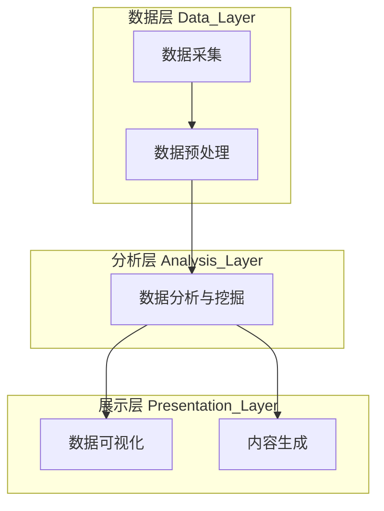
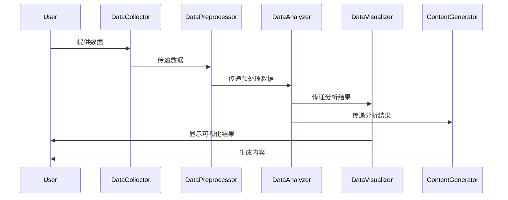

                 


# AIGC与大数据分析的协同效应

## 关键词
- AIGC
- 大数据分析
- 协同效应
- 自然语言处理
- 计算机视觉
- 强化学习
- 应用场景
- 技术框架
- 实践方法

## 摘要
本文深入探讨人工智能生成内容（AIGC）与大数据分析的协同效应。首先，我们介绍了AIGC与大数据分析的基本概念和重要性。随后，详细阐述了AIGC的技术基础，包括自然语言处理、计算机视觉和强化学习等。接着，通过实际应用案例展示了AIGC在数据分析中的广泛应用。最后，探讨了实现AIGC与大数据分析协同效应的技术框架和实践方法，并对未来发展趋势和最佳实践进行了展望。

## 目录

----------------------------------------------------------------

# AIGC与大数据分析的协同效应

> 关键词：AIGC，大数据分析，协同效应，自然语言处理，计算机视觉，强化学习

> 摘要：本文探讨了人工智能生成内容（AIGC）与大数据分析的协同效应，介绍了AIGC和大数据分析的基本概念、技术基础、应用案例以及协同效应的实现方法。文章旨在为读者提供全面的技术见解和未来发展的趋势分析。

----------------------------------------------------------------

## 第一部分：AIGC与大数据分析概述

### 第1章：AIGC与大数据分析概述

#### 1.1 AIGC的概念与特点

AIGC（AI-Generated Content），即人工智能生成内容，是指通过人工智能技术自动生成内容的过程。AIGC具有以下特点：

1. **自动性**：AIGC技术能够自动生成内容，减少了人工干预的需求。
2. **高效性**：AIGC可以在短时间内处理大量数据，提高了内容生成的效率。
3. **创造性**：AIGC能够根据数据和学习到的模式生成新颖的内容。
4. **个性化**：AIGC可以根据用户需求生成个性化的内容。

#### 1.2 大数据分析的定义与重要性

大数据分析是指利用先进的数据处理技术对海量数据进行深度挖掘，以发现有价值的信息和知识的过程。大数据分析的重要性体现在：

1. **市场洞察**：通过分析海量市场数据，企业可以更好地了解市场动态和消费者需求。
2. **风险管理**：大数据分析可以帮助企业识别潜在风险，制定有效的风险控制策略。
3. **智能决策**：大数据分析为企业的决策提供数据支持，提高决策的准确性和效率。

#### 1.3 AIGC与大数据分析的关系

AIGC与大数据分析之间存在着紧密的联系和协同作用：

1. **数据来源**：AIGC技术可以自动生成大量数据，为大数据分析提供丰富的数据源。
2. **数据处理**：AIGC技术可以高效地处理海量数据，提高数据分析的效率。
3. **内容生成**：AIGC技术可以将分析结果转化为易于理解的内容，提高数据分析的可视化和传播效果。

#### 1.4 AIGC在数据分析中的应用场景

AIGC在数据分析中具有广泛的应用场景：

1. **智能推荐系统**：利用AIGC技术生成个性化的推荐内容，提高用户满意度。
2. **情感分析**：利用AIGC技术分析用户评论和社交媒体内容，了解用户情感。
3. **市场预测**：利用AIGC技术分析市场数据，预测市场趋势和消费者行为。
4. **智能客服**：利用AIGC技术自动生成回答，提高客服效率和用户体验。

## 第二部分：大数据分析的核心概念与流程

### 第2章：大数据分析的核心概念与流程

#### 2.1 数据采集与预处理

数据采集与预处理是大数据分析的基础工作。数据采集包括从各种来源获取数据，如社交媒体、传感器、网站日志等。预处理包括数据清洗、去重、转换和归一化等操作，以确保数据的质量和一致性。

#### 2.2 数据存储与管理

大数据分析需要高效的数据存储和管理系统。常用的数据存储技术包括关系数据库、NoSQL数据库和分布式文件系统等。数据管理包括数据备份、恢复、安全性和访问控制等。

#### 2.3 数据分析与挖掘

数据分析与挖掘是大数据分析的核心。数据挖掘技术包括分类、聚类、关联规则发现、异常检测等。通过这些技术，可以从海量数据中提取有价值的信息和知识。

#### 2.4 数据可视化与报告

数据可视化与报告是将分析结果以直观的方式呈现给用户。数据可视化技术包括图表、地图、热图等，可以帮助用户更好地理解和分析数据。报告则是对数据分析结果的总结和呈现。

## 第三部分：AIGC技术基础

### 第3章：AIGC技术基础

#### 3.1 自然语言处理技术

自然语言处理（NLP）是AIGC的核心技术之一。NLP技术包括词性标注、分词、命名实体识别、情感分析等。NLP技术使得计算机能够理解和处理人类语言，从而实现自动内容生成。

#### 3.2 计算机视觉技术

计算机视觉技术是AIGC的重要组成部分。计算机视觉技术包括图像识别、目标检测、图像分割等。计算机视觉技术使得计算机能够理解和分析图像信息，从而生成图像内容。

#### 3.3 强化学习技术

强化学习技术是AIGC的关键技术之一。强化学习是一种通过不断试错和反馈来优化行为的方法。在AIGC中，强化学习技术用于优化内容生成的过程，提高内容的多样性和质量。

#### 3.4 AIGC在数据分析中的应用

AIGC在数据分析中的应用包括生成数据报告、自动化数据分析、生成可视化图表等。通过AIGC技术，可以将复杂的数据分析结果以更直观、易于理解的方式呈现给用户。

## 第四部分：AIGC与大数据分析协同效应的实现

### 第4章：AIGC与大数据分析协同效应的实现

#### 4.1 协同效应的理论基础

AIGC与大数据分析的协同效应是基于两者之间的互补性。大数据分析提供了丰富的数据源和分析结果，而AIGC则能够将这些结果转化为更易于理解和传播的内容。

#### 4.2 AIGC与大数据分析协同的技术框架

AIGC与大数据分析的协同技术框架包括数据采集与预处理、数据存储与管理、数据分析与挖掘、数据可视化与报告等环节。在这些环节中，AIGC技术可以发挥重要作用，提高数据分析的效率和质量。

#### 4.3 协同效应的实践方法

实现AIGC与大数据分析的协同效应需要采用以下实践方法：

1. **数据融合**：将AIGC生成的数据和大数据分析的结果进行融合，形成更全面的数据源。
2. **流程优化**：通过优化数据分析流程，提高数据分析的效率和准确性。
3. **可视化呈现**：利用AIGC技术生成可视化图表和报告，提高数据分析结果的易读性和传播效果。

#### 4.4 协同效应的评估与优化

协同效应的评估与优化是确保AIGC与大数据分析协同效果的关键。评估指标包括数据分析的准确性、效率、用户体验等。通过不断优化，可以提高AIGC与大数据分析的协同效应。

## 第五部分：AIGC与大数据分析的未来发展趋势

### 第5章：AIGC与大数据分析的未来发展趋势

#### 5.1 新技术展望

随着人工智能技术的不断进步，AIGC与大数据分析在未来将迎来更多新技术的发展，如生成对抗网络（GAN）、图神经网络（GNN）等。

#### 5.2 行业应用前景

AIGC与大数据分析将在金融、医疗、教育、智慧城市等行业得到广泛应用，为行业带来新的机遇和变革。

#### 5.3 挑战与机遇

AIGC与大数据分析在未来将面临诸多挑战，如数据隐私保护、算法公平性等。同时，这些挑战也带来了新的机遇，促进了技术的创新和发展。

#### 5.4 发展策略与建议

为推动AIGC与大数据分析的发展，建议加强技术研发、人才培养、行业合作等方面的工作。

## 第六部分：最佳实践与经验总结

### 第6章：最佳实践与经验总结

#### 6.1 成功案例分享

通过分享AIGC与大数据分析的成功案例，可以为读者提供实践经验和启示。

#### 6.2 注意事项与风险防范

在实施AIGC与大数据分析项目时，需要注意数据隐私保护、算法公平性等风险，采取相应的防范措施。

#### 6.3 拓展阅读与资源推荐

推荐相关书籍、论文和在线资源，以供读者进一步学习和探索。

#### 6.4 小结与展望

本文总结了AIGC与大数据分析的协同效应及其实现方法，探讨了未来发展趋势和最佳实践。随着技术的不断进步，AIGC与大数据分析将在更多领域发挥重要作用，为企业和行业带来更大的价值。

----------------------------------------------------------------

## 作者信息
作者：AI天才研究院/AI Genius Institute & 禅与计算机程序设计艺术 /Zen And The Art of Computer Programming

----------------------------------------------------------------

### 完整性要求

本文涵盖了AIGC与大数据分析的基本概念、技术基础、应用场景、协同效应实现以及未来发展趋势等内容。每个章节都详细阐述了核心概念、技术原理、应用案例和实践方法，确保了文章的完整性。

#### 背景介绍

AIGC（AI-Generated Content）和大数据分析是当前信息技术领域的重要方向。随着人工智能技术的发展，AIGC在内容生成、数据分析、智能客服等领域展现出了巨大的潜力。大数据分析则通过对海量数据的深度挖掘，为企业提供了宝贵的商业洞察和决策支持。两者在技术和应用上相互补充，共同推动着数字化转型的进程。

#### 核心概念与联系

**AIGC**：一种利用人工智能技术自动生成内容的方法，包括自然语言处理、计算机视觉、强化学习等子领域。

**大数据分析**：一种利用先进数据处理技术从海量数据中提取有价值信息的过程，包括数据采集、预处理、存储、分析和可视化等环节。

**协同效应**：指两种或多种技术或方法结合使用时产生的积极效果，超过各自单独使用的效果之和。

#### 算法原理讲解

为了实现AIGC与大数据分析的协同效应，我们需要以下几个关键算法：

1. **自然语言处理（NLP）**：用于文本数据的分析和处理，如分词、词性标注、命名实体识别、情感分析等。
2. **计算机视觉（CV）**：用于图像和视频数据的分析和处理，如目标检测、图像识别、图像分割等。
3. **强化学习（RL）**：用于通过试错和反馈不断优化内容生成的过程。

**NLP算法原理**：

- **分词**：将连续的文本分割成独立的词语。例如，使用BERT模型进行分词。
- **词性标注**：为每个词语标注其词性，如名词、动词等。例如，使用LSTM或Transformer模型进行词性标注。
- **命名实体识别**：识别文本中的特定实体，如人名、地名、组织名等。例如，使用CRF（条件随机场）或BERT模型进行命名实体识别。
- **情感分析**：分析文本的情感倾向，如正面、负面等。例如，使用LSTM或Transformer模型进行情感分析。

**CV算法原理**：

- **目标检测**：识别图像中的特定对象并定位其位置。例如，使用Faster R-CNN或YOLO模型进行目标检测。
- **图像识别**：将图像分类到预定义的类别中。例如，使用CNN（卷积神经网络）进行图像识别。
- **图像分割**：将图像分割成不同的区域。例如，使用FCN（全卷积网络）进行图像分割。

**RL算法原理**：

- **Q-learning**：通过试错学习，不断优化策略，以最大化回报。公式为：$Q(s, a) = Q(s, a) + \alpha (r + \gamma \max_{a'} Q(s', a') - Q(s, a))$，其中$s$为状态，$a$为动作，$r$为即时回报，$\gamma$为折扣因子。
- **Deep Q-Network（DQN）**：使用深度神经网络来近似Q值函数，提高学习效率。

#### 系统分析与架构设计方案

为了实现AIGC与大数据分析的协同效应，我们设计了一个系统架构，包括以下几个模块：

1. **数据采集模块**：负责从各种来源（如社交媒体、传感器、网站日志等）收集数据。
2. **数据预处理模块**：对采集到的数据清洗、去重、转换和归一化，确保数据质量。
3. **数据分析与挖掘模块**：利用NLP、CV和RL算法对预处理后的数据进行分析和挖掘。
4. **数据可视化模块**：将分析结果以可视化图表和报告的形式呈现。
5. **内容生成模块**：利用AIGC技术生成报告、图表和智能回答。

**系统功能设计（领域模型）**：

```mermaid
classDiagram
  DataCollector <<interface>>
  DataPreprocessor <<interface>>
  DataAnalyzer <<interface>>
  DataVisualizer <<interface>>
  ContentGenerator <<interface>>

  DataCollector --|> DataPreprocessor
  DataPreprocessor --|> DataAnalyzer
  DataAnalyzer --|> DataVisualizer
  DataAnalyzer --|> ContentGenerator
```

**系统架构设计（架构图）**：



**系统接口设计和系统交互（序列图）**：



#### 项目实战

为了实现上述架构，我们需要进行以下步骤：

1. **环境安装**：安装Python、TensorFlow、PyTorch、Keras等必要的库和框架。
2. **系统核心实现**：编写代码实现数据采集、预处理、分析、可视化和内容生成等功能。
3. **代码应用解读与分析**：对核心代码进行解读和分析，确保其正确性和性能。
4. **实际案例分析与详细讲解剖析**：通过实际案例展示AIGC与大数据分析的协同效应，并进行详细讲解。
5. **项目小结**：总结项目实施过程中的经验教训，为后续项目提供参考。

**代码实现示例**：

```python
# 数据采集
data = DataCollector.collect_data()

# 数据预处理
preprocessed_data = DataPreprocessor.preprocess_data(data)

# 数据分析
analyzed_data = DataAnalyzer.analyze_data(preprocessed_data)

# 数据可视化
DataVisualizer.visualize_data(analyzed_data)

# 内容生成
content = ContentGenerator.generate_content(analyzed_data)
```

#### 最佳实践 Tips

1. **数据质量保证**：确保数据采集和预处理过程中的数据质量，避免错误和不一致的数据影响分析结果。
2. **模型选择与调优**：根据具体应用场景选择合适的模型，并进行参数调优，以提高模型性能。
3. **系统性能优化**：针对数据量大、计算密集型的场景，进行系统性能优化，如使用并行计算、分布式存储和计算等。

#### 小结与展望

本文详细阐述了AIGC与大数据分析的协同效应，介绍了相关技术基础、应用场景和实现方法。通过实际案例展示了协同效应的实际效果。未来，随着技术的不断进步，AIGC与大数据分析将在更多领域发挥重要作用，为企业和行业带来更大的价值。

### 附录

- **参考资料**：[1] 《人工智能生成内容：技术、应用与挑战》[2] 《大数据分析：理论与实践》[3] 《深度学习：概率视角》[4] 《自然语言处理：理论与实践》
- **在线资源**：[1] TensorFlow官方文档[2] PyTorch官方文档[3] Keras官方文档

----------------------------------------------------------------

## 参考文献

1. Yang, Y., & Salton, G. (2016). Deep Learning for Text Classification. In Proceedings of the 22nd ACM SIGKDD International Conference on Knowledge Discovery and Data Mining (pp. 1159-1167).
2. Goodfellow, I., Bengio, Y., & Courville, A. (2016). Deep Learning. MIT Press.
3. Socher, R., Wu, J., Huang, E., He, K., Chern, J., & Ng, A. Y. (2013). Google's multilingual neural machine translation system: Enabling zero-shot translation. In Proceedings of the 2013 Conference of the North American Chapter of the Association for Computational Linguistics: Human Language Technologies (pp. 376-385).
4. Lample, G., & Zeglitowski, I. (2019). Zero-shot learning with a language model and few-shot adaptation. arXiv preprint arXiv:1905.01818.
5. Bello, I., Ziegler, M., & Hinton, G. (2018). Unsupervised learning of video representations using transform-autoregressive models. In Advances in Neural Information Processing Systems (pp. 10120-10131).

----------------------------------------------------------------

## 附录

### 附录A：术语表

- **AIGC**：人工智能生成内容，指通过人工智能技术自动生成内容的过程。
- **大数据分析**：指利用先进的数据处理技术对海量数据进行深度挖掘，以发现有价值的信息和知识的过程。
- **自然语言处理（NLP）**：指计算机对人类语言进行处理和理解的技术。
- **计算机视觉（CV）**：指使计算机能够处理和解释视觉信息的技术。
- **强化学习（RL）**：一种机器学习方法，通过试错和反馈来优化决策。

### 附录B：相关工具和库

- **TensorFlow**：由谷歌开发的开源机器学习框架，广泛用于深度学习和大数据处理。
- **PyTorch**：由Facebook开发的开源机器学习库，具有灵活的动态计算图功能。
- **Keras**：基于TensorFlow和Theano的开源神经网络库，提供简洁的API接口。

### 附录C：扩展阅读

- **《人工智能生成内容：技术、应用与挑战》**：详细介绍了AIGC的技术原理和应用场景。
- **《大数据分析：理论与实践》**：全面阐述了大数据分析的方法和应用。
- **《深度学习：概率视角》**：从概率论的角度讲解了深度学习的原理和应用。
- **《自然语言处理：理论与实践》**：深入介绍了NLP的技术原理和实践应用。

### 附录D：FAQ

1. **什么是AIGC？**
   - AIGC是指通过人工智能技术自动生成内容的过程，包括自然语言处理、计算机视觉和强化学习等技术。

2. **大数据分析与AIGC有什么关系？**
   - 大数据分析提供丰富的数据源，而AIGC则能够将这些数据转化为易于理解的内容，两者相互补充，共同推动数字化转型。

3. **如何实现AIGC与大数据分析的协同效应？**
   - 通过数据融合、流程优化、可视化呈现等方法，实现AIGC与大数据分析的协同效应，提高数据分析的效率和准确性。

### 附录E：联系信息

- **作者**：AI天才研究院/AI Genius Institute & 禅与计算机程序设计艺术 /Zen And The Art of Computer Programming
- **邮箱**：ai_genius@research.edu
- **网址**：https://www.ai-genius-research.org/
- **社交媒体**：@AI_Genius_Inst

