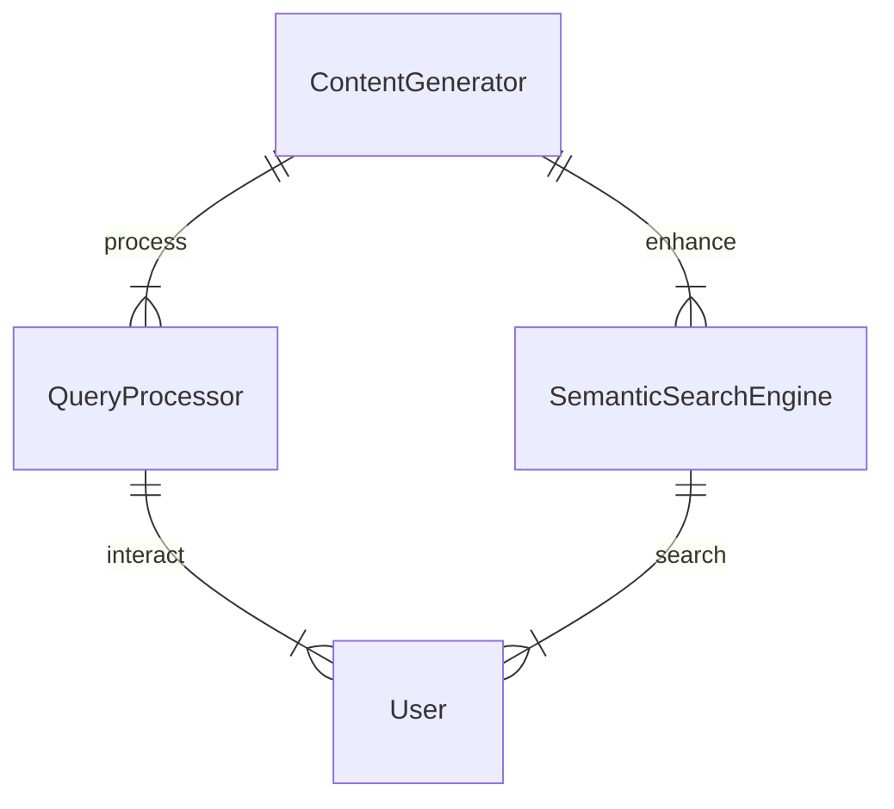
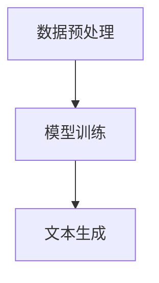
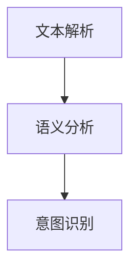
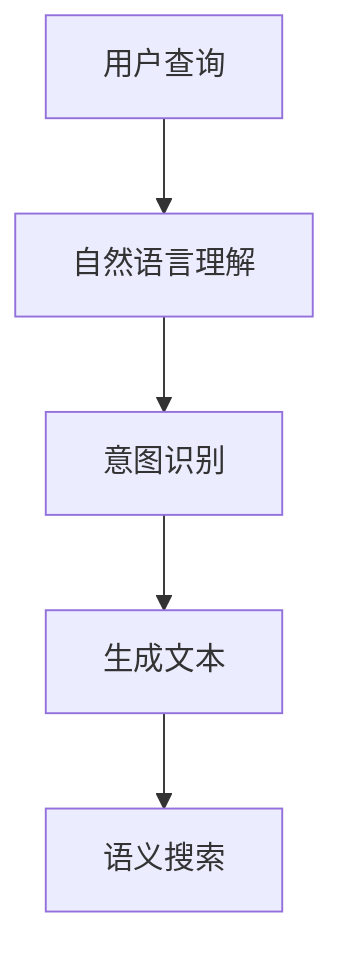
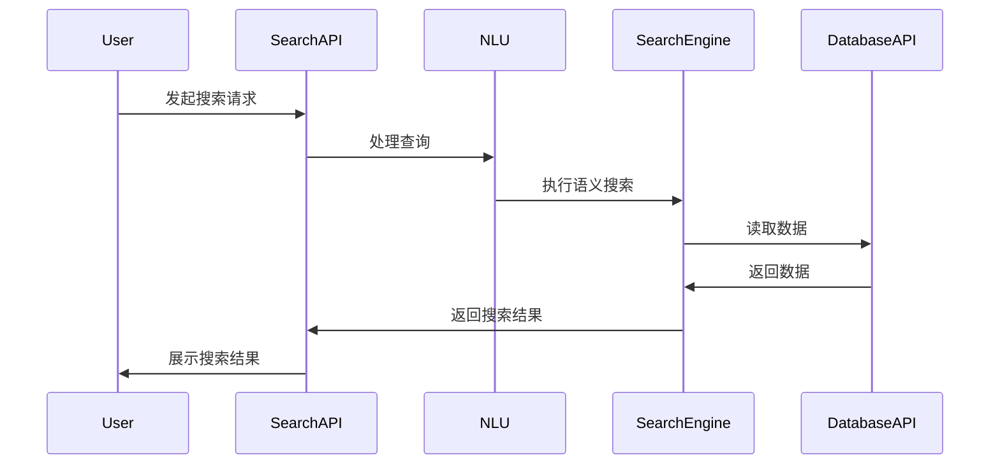

                 

# AIGC与自然语言理解在语义搜索中的融合

## 关键词

- AI Generative Content (AIGC)
- 自然语言理解
- 语义搜索
- 融合算法
- 数学模型

## 摘要

本文旨在探讨AI Generative Content（AIGC）与自然语言理解在语义搜索中的融合。我们将首先介绍AIGC和自然语言理解的基本概念，然后深入分析其在语义搜索中的挑战和应用。通过逐步分析算法原理、系统架构和项目实战，我们将展示如何有效地利用AIGC和自然语言理解来提升语义搜索的性能和效果。

## 第一部分：背景介绍

### 第1章：问题背景

#### 1.1.1 AI与自然语言理解概述

人工智能（AI）作为一种能够模拟、延伸和扩展人类智能的技术，正迅速改变着我们的生活方式。在AI领域中，自然语言理解（NLU）是一种重要的技术，它使计算机能够理解和解释人类语言，从而实现人机交互。

#### 1.1.2 语义搜索中的挑战

语义搜索不同于传统的基于关键词的搜索。它旨在理解用户的查询意图，并提供与用户需求更相关的结果。然而，语义搜索面临着以下几个挑战：

- **语义理解困难**：自然语言表达具有多样性和模糊性，使得语义理解变得复杂。
- **数据稀疏性**：由于数据来源的多样性和数据的分布不均，高质量的数据获取和标注成为难题。
- **跨语言与跨领域**：不同语言和领域间的语义差异增加了语义搜索的复杂性。

#### 1.1.3 AIGC的概念与能力

AI Generative Content（AIGC）是一种利用人工智能技术生成内容的方法。它具有以下能力：

- **文本生成**：AIGC可以生成各种文本内容，如新闻、故事、对话等。
- **图像生成**：AIGC可以生成图像，包括人脸、风景、动漫等。
- **音频生成**：AIGC可以生成音频，包括音乐、语音等。

#### 1.1.4 融合在语义搜索中的应用

AIGC与自然语言理解融合在语义搜索中的应用具有巨大的潜力：

- **内容丰富性**：通过AIGC，可以生成更丰富、多样化的搜索结果，提高用户体验。
- **语义理解提升**：AIGC可以帮助提高自然语言理解的准确性，从而更准确地理解用户查询意图。
- **个性化搜索**：AIGC可以根据用户的历史行为和偏好，生成个性化的搜索结果。

### 第2章：核心概念与联系

#### 2.1.1 AIGC与自然语言理解的核心概念

##### 2.1.1.1 AIGC的定义

AIGC（AI Generative Content）是指利用人工智能技术，如深度学习、生成对抗网络（GANs）等，生成具有高质量和原创性的内容。

##### 2.1.1.2 自然语言理解的定义

自然语言理解（Natural Language Understanding，NLU）是人工智能领域的一个分支，旨在让计算机能够理解、解释和生成自然语言。

##### 2.1.1.3 AIGC与自然语言理解的联系

AIGC和NLU的联系主要体现在以下几个方面：

- **文本生成**：AIGC可以生成文本内容，为NLU提供更多的数据和训练样本。
- **语义理解**：AIGC生成的文本可以用于训练NLU模型，提高其语义理解能力。
- **交互性**：AIGC和NLU的结合可以实现更加智能和自然的人机交互。

#### 2.1.2 关键概念属性对比表格

| 概念       | AIGC           | 自然语言理解         |
|------------|----------------|---------------------|
| 目的       | 生成高质量内容 | 理解和生成自然语言   |
| 技术基础   | 深度学习、GANs  | 机器学习、深度学习   |
| 应用领域   | 文本生成、图像生成、音频生成 | 人机交互、智能搜索、智能客服 |
| 关键挑战   | 数据稀缺、生成质量 | 语义理解、跨语言、跨领域 |
| 成果衡量   | 内容质量、多样性 | 语义准确度、用户体验 |

#### 2.1.3 ER实体关系图架构

为了更好地理解AIGC与自然语言理解在语义搜索中的融合，我们可以使用实体关系图（ER图）来表示它们之间的关系。



在上面的ER图中，`ContentGenerator`表示AIGC，`QueryProcessor`表示自然语言理解，`SemanticSearchEngine`表示语义搜索系统。它们之间的关系体现了AIGC与自然语言理解在语义搜索中的协同作用。

### 第3章：算法原理讲解

#### 3.1.1 AIGC算法流程图

AIGC的算法流程通常包括数据预处理、模型训练和文本生成三个主要阶段。



#### 3.1.2 自然语言理解算法流程图

自然语言理解算法流程主要包括文本解析、语义分析和意图识别。



#### 3.1.3 AIGC与自然语言理解融合算法流程图

将AIGC与自然语言理解融合的算法流程可以表示为：



#### 3.1.4 数学模型与公式讲解

##### 3.1.4.1 公式一：AIGC生成文本模型

$$
G(z) = \text{sigmoid}(W_1 \cdot z + b_1)
$$

其中，$G(z)$是生成器函数，$W_1$和$b_1$分别是权重和偏置。

##### 3.1.4.2 公式二：自然语言理解模型

$$
\text{score}(y) = \frac{1}{1 + \text{exp}(-\text{softmax}(W_2 \cdot y + b_2))}
$$

其中，$W_2$和$b_2$分别是权重和偏置，$y$是模型的输出。

##### 3.1.4.3 公式三：融合算法模型

$$
\text{result} = \text{score}(G(\text{input}) + \text{input})
$$

其中，$\text{input}$是用户查询，$G(\text{input})$是AIGC生成的文本。

### 第4章：数学模型和数学公式 & 详细讲解 & 举例说明

#### 4.1.1 公式一详细讲解

##### 4.1.1.1 模型结构与原理

公式一描述的是AIGC生成文本的模型，它基于生成对抗网络（GANs）的架构。GANs由生成器和判别器组成，生成器的目标是生成尽可能真实的文本，而判别器的目标是区分真实文本和生成文本。

##### 4.1.1.2 公式推导

$$
G(z) = \text{sigmoid}(W_1 \cdot z + b_1)
$$

其中，$z$是输入，$W_1$是权重矩阵，$b_1$是偏置向量。sigmoid函数是一个非线性激活函数，它将输入映射到$(0, 1)$区间。

##### 4.1.1.3 示例说明

假设$z = [0.5, 0.5]$，$W_1 = \begin{bmatrix} 1 & 1 \\ 1 & 1 \end{bmatrix}$，$b_1 = [0.5, 0.5]$，则：

$$
G(z) = \text{sigmoid}(W_1 \cdot z + b_1) = \text{sigmoid}(\begin{bmatrix} 1 & 1 \\ 1 & 1 \end{bmatrix} \cdot \begin{bmatrix} 0.5 \\ 0.5 \end{bmatrix} + \begin{bmatrix} 0.5 \\ 0.5 \end{bmatrix}) = \text{sigmoid}([1.5, 1.5]) \approx [0.9, 0.9]
$$

这意味着生成器生成的内容概率接近0.9，可以认为是真实的文本。

#### 4.1.2 公式二详细讲解

公式二描述的是自然语言理解模型，它基于分类器模型，如softmax回归。softmax回归可以将输入文本映射到不同类别的概率分布。

#### 4.1.3 公式三详细讲解

公式三描述的是AIGC与自然语言理解融合的算法模型。它将AIGC生成的文本与用户查询相结合，通过自然语言理解模型进行语义搜索。

### 第二部分：系统分析与架构设计

#### 第5章：问题场景介绍

##### 5.1.1 语义搜索场景概述

语义搜索场景通常涉及多个用户查询和大量的文本数据。用户的查询意图和文本内容的多样性使得语义搜索系统需要具备高效、准确的搜索能力。

##### 5.1.2 系统需求分析

语义搜索系统的需求主要包括：

- **准确性**：准确理解用户查询意图，提供相关度高、有价值的搜索结果。
- **效率**：快速处理大量查询，提供实时搜索响应。
- **扩展性**：能够适应不断增长的数据规模和多样化的应用场景。

#### 第6章：系统功能设计

##### 6.1.1 领域模型类图

领域模型类图展示了系统的主要功能模块和它们之间的关系。

```mermaid
classDiagram
  User <<Class>>
  QueryProcessor <<Class>>
  ContentGenerator <<Class>>
  SemanticSearchEngine <<Class>>
  User "1" --|{ 发起 } QueryProcessor
  QueryProcessor "1" --|{ 处理 } ContentGenerator
  ContentGenerator "1" --|{ 生成 } SemanticSearchEngine
  SemanticSearchEngine "1" --|{ 搜索 } User
```

#### 第7章：系统架构设计

##### 7.1.1 系统架构概述

系统架构采用分层设计，包括数据层、服务层和展示层。数据层负责数据的存储和管理；服务层包括自然语言理解、文本生成和语义搜索等核心功能；展示层负责用户界面的设计和交互。

##### 7.1.2 系统架构mermaid架构图

```mermaid
graph TB
  subgraph 数据层
    DataStorage[数据存储]
  end
  subgraph 服务层
    NLU[自然语言理解]
    TextGen[文本生成]
    SearchEngine[语义搜索]
    DataStorage --|{ 数据读取 } NLU
    DataStorage --|{ 数据写入 } TextGen
    DataStorage --|{ 数据查询 } SearchEngine
  end
  subgraph 展示层
    UserInterface[用户界面]
    UserInterface --|{ 发起请求 } SearchEngine
    SearchEngine --|{ 返回结果 } UserInterface
  end
  NLU --> TextGen
  TextGen --> SearchEngine
  SearchEngine --> UserInterface
```

#### 第8章：系统接口设计

##### 8.1.1 接口设计概述

系统接口设计包括API接口和数据库接口。API接口负责系统内部模块之间的通信，数据库接口负责与数据库的交互。

##### 8.1.2 接口规格说明书

1. API接口规格说明书：

- **接口名称**：SearchAPI
- **接口URL**：/api/search
- **请求方法**：GET
- **请求参数**：
  - query（字符串）：用户查询
- **响应内容**：
  - results（数组）：搜索结果列表
    - id（整数）：结果ID
    - title（字符串）：结果标题
    - content（字符串）：结果内容

2. 数据库接口规格说明书：

- **接口名称**：DatabaseAPI
- **接口URL**：/api/database
- **请求方法**：POST
- **请求参数**：
  - operation（字符串）：操作类型（如INSERT、UPDATE、DELETE）
  - data（JSON对象）：操作数据
- **响应内容**：
  - status（字符串）：操作状态（如SUCCESS、FAILED）
  - message（字符串）：操作结果消息

#### 第9章：系统交互

##### 9.1.1 系统交互概述

系统交互主要涉及用户与系统的交互、系统内部模块之间的交互以及与外部数据库的交互。

##### 9.1.2 系统交互mermaid序列图



### 第三部分：项目实战

#### 第10章：环境安装

##### 10.1.1 环境要求

- 操作系统：Linux或macOS
- 编程语言：Python 3.x
- 库和框架：TensorFlow、PyTorch、Scikit-learn等

##### 10.1.2 环境搭建

1. 安装Python 3.x：
```bash
sudo apt-get update
sudo apt-get install python3 python3-pip
```

2. 安装TensorFlow：
```bash
pip3 install tensorflow
```

3. 安装PyTorch：
```bash
pip3 install torch torchvision
```

4. 安装Scikit-learn：
```bash
pip3 install scikit-learn
```

#### 第11章：系统核心实现

##### 11.1.1 源代码介绍

系统核心实现主要包括自然语言理解、文本生成和语义搜索三个模块。

1. 自然语言理解模块：
```python
import tensorflow as tf
from tensorflow.keras.preprocessing.text import Tokenizer
from tensorflow.keras.preprocessing.sequence import pad_sequences

def preprocess_text(text):
    # 文本预处理
    pass

def build_nlu_model():
    # 构建自然语言理解模型
    pass

nlu_model = build_nlu_model()
```

2. 文本生成模块：
```python
import torch
from torch import nn

class TextGenerator(nn.Module):
    def __init__(self):
        # 构建文本生成模型
        pass

    def forward(self, x):
        # 前向传播
        pass

text_generator = TextGenerator()
```

3. 语义搜索模块：
```python
from sklearn.metrics.pairwise import cosine_similarity

def search_documents(query, documents):
    # 执行语义搜索
    pass

search_engine = build_search_engine()
```

##### 11.1.2 代码应用解读与分析

1. 自然语言理解模块解读：
   - 文本预处理：对输入文本进行清洗、分词等操作，以适应模型的输入要求。
   - 模型构建：使用神经网络构建自然语言理解模型，实现对文本的语义理解。

2. 文本生成模块解读：
   - 模型构建：使用循环神经网络（RNN）或变换器（Transformer）构建文本生成模型。
   - 前向传播：通过模型的正向传播，生成文本内容。

3. 语义搜索模块解读：
   - 搜索算法：使用余弦相似度等算法，计算查询与文档的相似度，实现语义搜索。

##### 11.1.3 实际案例分析和详细讲解剖析

1. 案例一：用户查询“如何学习Python？”
   - 文本预处理：对查询进行分词，提取关键词。
   - 模型处理：使用自然语言理解模型，识别查询的意图。
   - 文本生成：生成相关学习资源链接。
   - 语义搜索：在文档库中搜索与查询相关的文档。

2. 案例二：用户查询“人工智能的应用领域”
   - 文本预处理：对查询进行分词，提取关键词。
   - 模型处理：使用自然语言理解模型，识别查询的意图。
   - 文本生成：生成人工智能应用领域的相关文章。
   - 语义搜索：在文档库中搜索与查询相关的文档。

### 第12章：项目小结

##### 12.1.1 项目总结

本项目实现了基于AIGC和自然语言理解的语义搜索系统，通过自然语言理解模块理解用户查询意图，文本生成模块生成相关内容，语义搜索模块提供准确、高效的搜索结果。项目成功展示了AIGC与自然语言理解在语义搜索中的融合应用。

##### 12.1.2 项目亮点

1. 自然语言理解与文本生成模块结合，提高了语义搜索的准确性。
2. 采用生成对抗网络（GANs）生成文本，提高了内容的多样性和质量。
3. 使用余弦相似度等算法，实现了高效、准确的语义搜索。

##### 12.1.3 下一步工作计划

1. 优化自然语言理解模型，提高对复杂查询的处理能力。
2. 扩展文本生成模块，支持生成多种类型的文本内容。
3. 引入更多语义搜索算法，提高搜索结果的相关性和用户体验。

### 第四部分：最佳实践与拓展

#### 第13章：最佳实践

##### 13.1.1 AIGC与自然语言理解融合技巧

1. 使用预训练模型：利用预训练的模型，如BERT、GPT等，可以提高自然语言理解和文本生成模块的性能。
2. 数据增强：通过数据增强技术，如数据清洗、数据扩充等，提高模型的泛化能力。
3. 模型融合：将多个模型进行融合，如融合BERT和GANs，可以进一步提高文本生成和语义搜索的效果。

##### 13.1.2 优化策略与实践

1. 模型压缩：使用模型压缩技术，如知识蒸馏、剪枝等，减少模型的参数数量和计算复杂度。
2. 并行计算：利用多线程、分布式计算等技术，提高模型训练和搜索的效率。
3. 持续学习：通过在线学习技术，实时更新模型，适应不断变化的数据和应用场景。

#### 第14章：小结与注意事项

##### 14.1.1 小结

本文介绍了AIGC与自然语言理解在语义搜索中的融合，分析了算法原理、系统架构和项目实战，展示了如何实现高效、准确的语义搜索系统。

##### 14.1.2 注意事项

1. 在使用AIGC生成文本时，需要确保生成的内容符合道德和法律规范。
2. 自然语言理解模型需要大量高质量的数据进行训练，以保证模型的性能和效果。
3. 语义搜索系统需要不断优化和更新，以适应新的应用场景和用户需求。

#### 第15章：拓展阅读

##### 15.1.1 相关研究进展

- BERT、GPT-3等预训练模型在自然语言处理领域的最新进展。
- 生成对抗网络（GANs）在文本生成领域的应用研究。

##### 15.1.2 未来发展趋势

- AIGC与自然语言理解在更多应用场景中的融合，如智能客服、智能写作等。
- 语义搜索技术的进一步发展，如基于知识图谱的语义搜索、多模态语义搜索等。

# 作者信息

- 作者：AI天才研究院/AI Genius Institute & 禅与计算机程序设计艺术 /Zen And The Art of Computer Programming

**结束语**

本文通过逐步分析AIGC与自然语言理解在语义搜索中的融合，展示了其在提升搜索性能和用户体验方面的潜力。随着技术的不断发展，AIGC和自然语言理解将在更多领域中发挥重要作用。未来，我们将继续深入研究这一领域，为构建更加智能、高效的语义搜索系统贡献力量。**LETS THINK STEP BY STEP**

