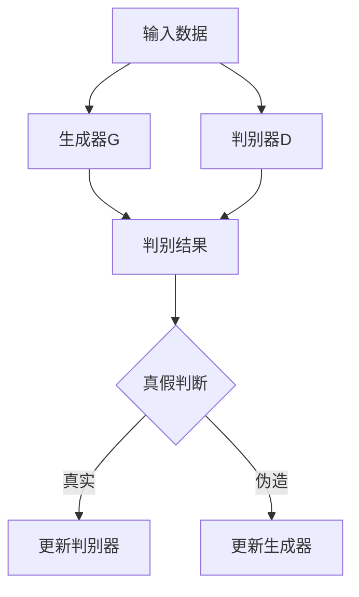
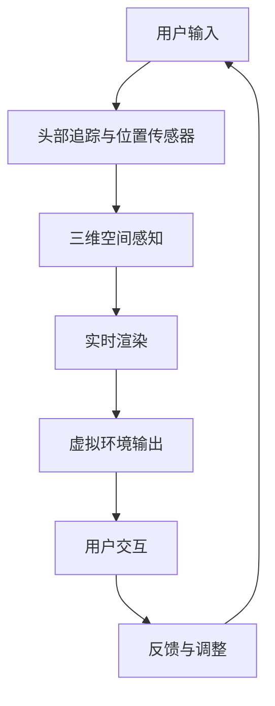
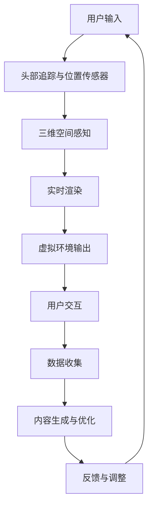

                 

### 引言：AIGC与虚拟现实的深度融合

#### 背景介绍

随着人工智能（AI）技术的不断发展，自适应智能生成计算（AIGC）作为一种新型的计算范式，正逐渐成为学术界和工业界的研究热点。AIGC通过深度学习和生成对抗网络（GAN）等技术，能够自适应地生成高质量的内容，极大地提高了信息处理的效率和质量。

与此同时，虚拟现实（VR）技术也在迅速发展。VR技术通过创建模拟环境，使用户能够沉浸在虚拟世界中，提供前所未有的沉浸式体验。随着硬件性能的提升和显示技术的进步，VR的应用场景越来越广泛，从游戏、娱乐到教育培训、医疗健康等领域，都展现了巨大的潜力。

AIGC与虚拟现实的深度融合，不仅能够提高虚拟现实内容的生成质量和互动性，还能够推动虚拟现实技术的创新和发展。这种融合有望带来一系列颠覆性的变革，如更真实的虚拟环境、更丰富的交互体验、更高效的训练过程等。

#### 深度融合的意义与目的

AIGC与虚拟现实的深度融合具有重要意义。首先，它能够极大地提升虚拟现实内容的生成效率。传统的虚拟现实内容制作通常需要大量的手工设计和调整，而AIGC技术能够自动化地生成高质量的内容，大幅降低制作成本和人力资源需求。

其次，深度融合能够提高虚拟现实的交互性。通过AIGC技术，虚拟环境中的物体、角色和行为可以更加智能化、自适应地响应用户的输入，提供更加自然和丰富的交互体验。

最后，AIGC与虚拟现实的深度融合有望推动虚拟现实技术的广泛应用。从游戏娱乐到教育培训，从医疗健康到城市规划，AIGC技术能够为各类应用场景提供更加智能化、个性化的解决方案。

本书旨在深入探讨AIGC与虚拟现实的深度融合，从核心概念、技术原理到应用案例、未来发展，全面梳理这一技术趋势，帮助读者了解其核心价值和应用前景。具体来说，本书将涵盖以下内容：

1. **核心概念与技术原理**：介绍AIGC和虚拟现实的基本概念、技术原理和发展历程。
2. **融合技术与应用**：探讨AIGC与虚拟现实融合的关键技术，如GAN、AR和VR等，以及其在教育培训、医疗健康、旅游娱乐等领域的应用。
3. **未来发展**：分析AIGC与虚拟现实深度融合的未来发展趋势，探讨可能的创新方向和挑战。

### 目录大纲设计思路

为了设计出《AIGC与虚拟现实的深度融合：沉浸式体验的未来》这本书的完整目录大纲，我们需要遵循以下思路：

1. **明确书的主题和内容结构**：首先，我们要明确这本书的主题，即AIGC（自适应智能生成计算）与虚拟现实的深度融合，以及这一技术趋势对未来沉浸式体验的影响。接下来，我们需要梳理出核心概念、技术原理、应用场景、未来发展等章节内容。

2. **构建完整的目录结构**：按照书籍内容结构，我们将目录划分为几个主要部分，如引言、背景介绍、核心概念与技术原理、应用案例分析、未来发展趋势等。每个部分再细分为若干章节，确保内容完整、逻辑清晰。

3. **细化每个章节的内容**：对于每个章节，我们要明确其内容范围和重点，确保覆盖主题的核心要素。例如，在介绍背景时，需要详细阐述AIGC与虚拟现实的定义、发展历程、技术特点等；在讲解技术原理时，需要使用mermaid流程图和Python代码等工具进行详细阐述；在案例分析时，需要给出实际应用场景、系统架构设计、项目实施过程等。

4. **保持简洁性和可读性**：在编写目录大纲时，我们需要注意内容的简洁性和可读性，避免冗长的描述和复杂的句子结构。同时，确保markdown格式的正确使用，以增强文档的清晰度和美感。

### 目录大纲设计步骤

1. **确定引言部分**：引言部分需要简要介绍AIGC与虚拟现实深度融合的背景、意义以及本书的目的和结构。

2. **设计背景介绍章节**：包括AIGC和虚拟现实的概念、发展历程、技术特点等内容，可以使用mermaid流程图来展示技术演进过程。

3. **构建核心概念与技术原理章节**：详细讲解AIGC与虚拟现实深度融合的关键技术，如生成对抗网络（GAN）、增强现实（AR）、虚拟现实（VR）等，并结合mermaid流程图和Python代码进行阐述。

4. **设计应用案例分析章节**：选取实际应用案例，介绍AIGC与虚拟现实在各类场景中的应用，如教育培训、医疗健康、旅游娱乐等，并展示系统架构设计和项目实施过程。

5. **规划未来发展趋势章节**：分析AIGC与虚拟现实深度融合的发展趋势，探讨其对未来沉浸式体验的影响，并提出可能的创新方向和挑战。

6. **编写结语与总结**：总结全书的核心观点和重要结论，对AIGC与虚拟现实深度融合的未来发展提出展望。

### 输出格式示例

根据上述设计思路，下面是一个示例目录大纲：

----------------------------------------------------------------

# 引言：AIGC与虚拟现实的深度融合

## 1.1 背景介绍

### 1.1.1 AIGC的概念与发展

### 1.1.2 虚拟现实的概念与发展

### 1.1.3 深度融合的意义与目的

----------------------------------------------------------------

# 第1部分：AIGC与虚拟现实的核心概念

## 1.2 AIGC的基本原理

### 1.2.1 生成对抗网络（GAN）

### 1.2.2 自适应学习与生成

### 1.2.3 GAN的mermaid流程图

## 1.3 虚拟现实技术原理

### 1.3.1 增强现实（AR）

### 1.3.2 虚拟现实（VR）

### 1.3.3 虚拟现实的mermaid流程图

## 1.4 AIGC与虚拟现实的融合技术

### 1.4.1 深度融合的定义与特点

### 1.4.2 融合技术的应用场景

### 1.4.3 融合技术的mermaid流程图

----------------------------------------------------------------

# 第2部分：AIGC与虚拟现实的应用案例分析

## 1.5 教育培训领域的应用

### 1.5.1 案例介绍

### 1.5.2 系统架构设计

### 1.5.3 项目实施与效果分析

## 1.6 医疗健康领域的应用

### 1.6.1 案例介绍

### 1.6.2 系统架构设计

### 1.6.3 项目实施与效果分析

## 1.7 旅游娱乐领域的应用

### 1.7.1 案例介绍

### 1.7.2 系统架构设计

### 1.7.3 项目实施与效果分析

----------------------------------------------------------------

# 第3部分：AIGC与虚拟现实的未来发展

## 1.8 发展趋势分析

### 1.8.1 技术发展趋势

### 1.8.2 应用领域拓展

### 1.8.3 创新方向与挑战

## 1.9 总结与展望

### 1.9.1 核心观点

### 1.9.2 未来展望

----------------------------------------------------------------

### 核心概念与技术原理

为了深入探讨AIGC与虚拟现实的深度融合，我们需要首先了解这两大技术的核心概念和技术原理。接下来，我们将分章节详细介绍AIGC、虚拟现实以及它们的融合技术。

#### 1.2 AIGC的基本原理

AIGC，即自适应智能生成计算，是一种利用人工智能技术，特别是深度学习、生成对抗网络（GAN）等算法，实现自适应内容生成的方法。AIGC的核心思想是通过大量的数据和智能算法，自动化地生成高质量、多样化的内容。

##### 1.2.1 生成对抗网络（GAN）

生成对抗网络（GAN）是由Ian Goodfellow等人在2014年提出的一种深度学习模型。GAN由两个主要部分组成：生成器（Generator）和判别器（Discriminator）。

- **生成器**：生成器的作用是生成伪造数据，以模拟真实数据。它通常是一个神经网络，通过学习输入数据分布，生成新的数据样本。
- **判别器**：判别器的作用是区分输入数据是真实数据还是伪造数据。它也是一个神经网络，通过不断学习，提高对真实数据和伪造数据的识别能力。

GAN的训练过程可以看作是一个零和游戏，生成器和判别器的目标是对抗性的。生成器试图生成越来越逼真的伪造数据，而判别器则试图将伪造数据与真实数据区分开来。

##### 1.2.2 自适应学习与生成

AIGC的自适应学习与生成是其核心特点之一。通过不断地从数据中学习，AIGC能够自适应地调整生成策略，以生成更高质量的内容。具体来说，自适应学习包括以下方面：

- **数据自适应**：AIGC可以根据不同的数据集，调整生成策略，以适应特定的数据分布。
- **任务自适应**：AIGC可以针对不同的任务，调整生成算法，以生成满足特定任务需求的内容。
- **模型自适应**：AIGC可以通过不断训练和优化，提高生成模型的性能和效率。

##### 1.2.3 GAN的mermaid流程图

为了更好地理解GAN的工作流程，我们可以使用mermaid流程图来展示：

在这个流程图中，输入数据经过生成器和判别器的处理，生成器生成伪造数据，判别器判断数据真假，并根据判别结果更新生成器和判别器的参数。

#### 1.3 虚拟现实技术原理

虚拟现实（VR）是一种通过计算机技术和传感器设备，模拟出一个沉浸式的三维环境，使用户能够与之互动和交互的技术。VR技术主要分为增强现实（AR）、虚拟现实（VR）和混合现实（MR）。

##### 1.3.1 增强现实（AR）

增强现实（AR）通过在现实环境中叠加虚拟元素，使用户能够看到虚拟图像与现实环境的结合。AR的关键技术包括：

- **图像识别与跟踪**：通过摄像头和传感器捕捉现实环境，并识别和跟踪图像或物体。
- **虚拟元素渲染**：根据识别和跟踪的结果，在现实环境中渲染虚拟图像。
- **实时交互**：用户可以通过手势或语音等交互方式与虚拟元素进行互动。

##### 1.3.2 虚拟现实（VR）

虚拟现实（VR）通过头盔显示器、传感器和计算机生成一个完全沉浸式的三维虚拟环境，使用户完全脱离现实世界。VR的关键技术包括：

- **三维空间感知**：通过头部追踪器和位置传感器，实现用户在虚拟环境中的空间移动和旋转。
- **实时渲染**：通过计算机图形学技术，实时渲染高质量的虚拟环境，提供逼真的视觉体验。
- **交互设计**：设计用户与虚拟环境的交互方式，如手柄、手套等，以提高交互体验。

##### 1.3.3 虚拟现实的mermaid流程图

虚拟现实的工作流程可以简化为以下几个步骤：

在这个流程图中，用户的输入通过传感器转化为三维空间信息，实时渲染虚拟环境，用户与虚拟环境的交互结果反馈给系统，系统根据反馈进行调整，形成一个闭环。

#### 1.4 AIGC与虚拟现实的融合技术

AIGC与虚拟现实的深度融合，旨在通过AIGC技术提高虚拟现实内容的质量和互动性。融合技术包括以下几个关键方面：

##### 1.4.1 深度融合的定义与特点

深度融合是指AIGC和虚拟现实技术在同一系统中协同工作，实现各自优势的互补。深度融合的特点包括：

- **高效内容生成**：通过AIGC技术，自动化地生成高质量的虚拟内容，提高内容生成效率。
- **智能交互体验**：通过AIGC技术，实现虚拟环境中的物体、角色和行为的智能化，提供更自然的交互体验。
- **实时适应性**：通过AIGC技术，虚拟环境能够实时适应用户的行为和需求，提供个性化的沉浸式体验。

##### 1.4.2 融合技术的应用场景

深度融合技术可以在多个领域发挥作用，包括：

- **教育培训**：通过AIGC生成逼真的虚拟教学环境，提供个性化的学习体验。
- **医疗健康**：通过AIGC生成虚拟患者模型，辅助医生进行诊断和治疗。
- **游戏娱乐**：通过AIGC生成丰富多样的游戏场景和角色，提供更加逼真的游戏体验。
- **城市规划**：通过AIGC生成虚拟城市模型，辅助城市规划师进行设计和优化。

##### 1.4.3 融合技术的mermaid流程图

深度融合技术的流程可以简化为：

在这个流程图中，用户输入通过传感器转化为三维空间信息，实时渲染虚拟环境，用户与虚拟环境的交互结果反馈给系统，系统通过AIGC技术生成和优化虚拟内容，形成一个闭环。

### 总结

在本部分，我们详细介绍了AIGC与虚拟现实的核心概念和技术原理。AIGC通过生成对抗网络（GAN）等技术，实现了自适应内容生成；虚拟现实通过增强现实（AR）和虚拟现实（VR）等技术，提供了沉浸式的交互体验。两者的深度融合，旨在提高内容生成效率、交互体验和个性化服务。接下来，我们将进一步探讨AIGC与虚拟现实在实际应用中的案例，以及它们对沉浸式体验的深远影响。

#### 1.5 AIGC与虚拟现实在教育培训领域的应用

在教育领域，AIGC与虚拟现实的深度融合正在引发一场革命，通过创新的教与学模式，极大地提升了教学效果和学生的参与度。以下我们将通过一个具体的案例，展示AIGC与虚拟现实在教育培训中的实际应用。

##### 1.5.1 案例介绍

某知名大学为提升其在线课程的质量，引入了AIGC与虚拟现实技术。该大学开设了一门“虚拟化学实验室”课程，通过虚拟现实技术构建了一个沉浸式的化学实验环境，学生可以在虚拟实验室中进行各种化学反应实验，而不受时间和地点的限制。

##### 1.5.2 系统架构设计

为了实现这一目标，该大学设计了以下系统架构：

1. **用户前端**：包括VR头盔、手柄等交互设备，学生通过这些设备进入虚拟实验室。
2. **服务器端**：包括虚拟现实渲染服务器、AIGC生成服务器和数据存储服务器。虚拟现实渲染服务器负责实时渲染虚拟实验室场景，AIGC生成服务器负责生成实验所需的化学物质和反应物，数据存储服务器则用于存储课程数据和用户数据。
3. **后台管理系统**：用于管理课程内容、学生进度和实验报告等。

##### 1.5.3 项目实施与效果分析

项目实施过程如下：

1. **数据收集**：首先，收集了大量真实的化学实验数据和图像，作为AIGC训练的数据集。
2. **模型训练**：使用生成对抗网络（GAN）训练模型，生成逼真的化学物质和反应物。
3. **虚拟实验室搭建**：利用Unity引擎构建虚拟实验室场景，并集成AIGC生成的内容。
4. **用户测试**：邀请学生进行测试，收集反馈，优化系统。

效果分析：

- **教学效果提升**：学生通过虚拟化学实验室进行实验，能够更加直观地理解化学反应原理，提高了学习效果。
- **参与度提升**：虚拟实验室打破了传统教学的时间和空间限制，学生可以随时随地参与实验，增强了学习的兴趣和参与度。
- **个性化学习**：通过AIGC技术，系统能够根据学生的学习进度和兴趣，自动生成个性化的实验内容，满足不同学生的学习需求。

##### 1.5.4 实施过程中的挑战与解决方案

在项目实施过程中，遇到了以下几个挑战：

1. **数据质量和多样性**：AIGC模型的训练需要大量高质量的化学实验数据，收集数据的过程相对复杂且耗时。
   - **解决方案**：通过与专业实验室合作，获取高质量的实验数据，并利用数据清洗和增强技术，提高数据的质量和多样性。

2. **性能优化**：虚拟实验室的实时渲染对硬件性能要求较高，尤其是在处理复杂的化学反应时，容易出现卡顿现象。
   - **解决方案**：优化虚拟实验室的渲染算法，提高渲染效率。同时，使用高性能的GPU和服务器，确保系统的流畅运行。

3. **用户适应性**：不同的学生对于虚拟实验室的适应能力不同，部分学生可能不适应VR头盔的佩戴和使用。
   - **解决方案**：提供详细的用户指南和操作视频，帮助用户熟悉VR设备的使用。同时，设计灵活的交互方式，如手柄、语音等，以满足不同用户的需求。

通过上述案例，我们可以看到AIGC与虚拟现实技术在教育培训领域的应用潜力。通过构建沉浸式的虚拟实验室，不仅提高了教学效果和学生的参与度，也为个性化学习提供了新的可能性。

#### 1.6 AIGC与虚拟现实在医疗健康领域的应用

在医疗健康领域，AIGC与虚拟现实的深度融合为医疗诊断、患者康复、医学教育和医疗培训等方面带来了革命性的变革。以下，我们将通过一个具体的案例，展示AIGC与虚拟现实在医疗健康领域的实际应用。

##### 1.6.1 案例介绍

某大型医院引入了AIGC与虚拟现实技术，打造了一套智能虚拟患者康复系统。该系统通过虚拟现实技术模拟患者的病情和康复过程，患者可以在虚拟环境中进行康复训练，医生则通过系统监控患者的康复进度，为患者制定个性化的康复计划。

##### 1.6.2 系统架构设计

智能虚拟患者康复系统的架构包括以下几个部分：

1. **用户前端**：包括虚拟现实头盔、手柄和传感器等设备，患者通过这些设备进入虚拟康复环境。
2. **服务器端**：包括虚拟现实渲染服务器、AIGC生成服务器、医学影像处理服务器和数据存储服务器。虚拟现实渲染服务器负责实时渲染虚拟康复场景，AIGC生成服务器负责生成虚拟患者的病情和康复训练内容，医学影像处理服务器则用于处理患者的医学影像数据，数据存储服务器用于存储患者的数据。
3. **后台管理系统**：包括医生工作站、康复计划和监控系统，医生通过工作站制定康复计划，监控系统则用于实时监控患者的康复进度。
4. **数据接口**：连接患者前端设备和服务器端，传输实时数据。

##### 1.6.3 项目实施与效果分析

项目实施过程如下：

1. **数据收集与处理**：收集大量患者的医学影像数据和康复训练数据，通过AIGC技术生成虚拟患者的病情和康复训练内容。
2. **虚拟康复场景搭建**：利用Unity引擎构建虚拟康复场景，并集成AIGC生成的虚拟患者。
3. **医生培训与系统测试**：邀请医生进行系统培训，测试系统的各项功能，收集医生和患者的反馈，优化系统。
4. **用户应用**：患者进入虚拟康复场景，进行康复训练，医生通过系统监控患者的进度，制定个性化的康复计划。

效果分析：

- **康复效果提升**：患者通过虚拟康复系统进行训练，能够更加直观地理解病情和康复过程，提高了康复效果。
- **医生工作效率提升**：医生通过系统实时监控患者的康复进度，能够快速制定个性化的康复计划，提高了工作效率。
- **个性化医疗**：通过AIGC技术，系统能够根据患者的病情和康复进度，自动生成个性化的康复训练内容，满足不同患者的需求。

##### 1.6.4 实施过程中的挑战与解决方案

在项目实施过程中，遇到了以下几个挑战：

1. **数据隐私与安全**：患者数据涉及隐私问题，如何在保障数据安全的同时，实现数据的共享和分析是一个重要挑战。
   - **解决方案**：采用数据加密和访问控制技术，确保患者数据的隐私和安全。同时，制定严格的数据使用和共享规范，保障数据的安全性和合规性。

2. **系统稳定性与性能**：虚拟康复系统的实时渲染和数据处理对硬件性能要求较高，系统稳定性是一个重要挑战。
   - **解决方案**：选择高性能的硬件设备和服务器，优化虚拟康复系统的渲染和处理算法，提高系统的稳定性和性能。

3. **用户适应性**：不同患者的病情和康复需求不同，如何设计出适应不同患者的虚拟康复系统是一个挑战。
   - **解决方案**：设计灵活的康复训练方案，允许医生根据患者的具体情况进行调整。同时，通过收集和分析患者的反馈，不断优化系统，提高用户的适应性和满意度。

通过这个案例，我们可以看到AIGC与虚拟现实技术在医疗健康领域的广泛应用和巨大潜力。通过构建智能虚拟患者康复系统，不仅提升了医疗服务的质量和效率，也为个性化医疗提供了新的途径。

#### 1.7 AIGC与虚拟现实在旅游娱乐领域的应用

在旅游娱乐领域，AIGC与虚拟现实的深度融合为游客带来了前所未有的沉浸式体验，极大地提升了旅游服务的质量和吸引力。以下，我们将通过一个具体的案例，展示AIGC与虚拟现实在旅游娱乐领域的实际应用。

##### 1.7.1 案例介绍

某大型旅游公司推出了一款名为“虚拟探险之旅”的虚拟现实应用。该应用通过AIGC与虚拟现实技术，为游客打造了一场身临其境的探险之旅。游客可以在虚拟环境中体验各种探险活动，如攀登珠穆朗玛峰、探索海底世界、穿越亚马逊雨林等。

##### 1.7.2 系统架构设计

“虚拟探险之旅”的系统架构包括以下几个部分：

1. **用户前端**：包括虚拟现实头盔、手柄和传感器等设备，游客通过这些设备进入虚拟探险环境。
2. **服务器端**：包括虚拟现实渲染服务器、AIGC生成服务器、旅游内容服务器和数据存储服务器。虚拟现实渲染服务器负责实时渲染虚拟探险场景，AIGC生成服务器负责生成各种探险活动和场景内容，旅游内容服务器用于存储和提供旅游信息，数据存储服务器用于存储用户数据和旅游数据。
3. **后台管理系统**：包括导游系统、用户管理系统和数据分析系统，导游系统用于提供实时导游服务，用户管理系统用于管理用户信息和权限，数据分析系统用于分析用户行为和数据。
4. **数据接口**：连接用户前端设备和服务器端，传输实时数据。

##### 1.7.3 项目实施与效果分析

项目实施过程如下：

1. **场景数据收集与处理**：收集大量真实的旅游场景数据，包括地貌、景观、动物等，通过AIGC技术生成逼真的虚拟探险场景。
2. **虚拟探险场景搭建**：利用Unity引擎构建虚拟探险场景，并集成AIGC生成的探险内容。
3. **用户测试与反馈**：邀请游客进行测试，收集反馈，优化系统。
4. **上线运营**：正式上线，提供虚拟探险服务。

效果分析：

- **用户体验提升**：游客通过虚拟探险之旅，能够在虚拟环境中体验到真实的探险感受，提升了旅游体验。
- **内容丰富度**：通过AIGC技术，系统能够根据用户的需求和喜好，自动生成丰富的探险内容，满足不同游客的需求。
- **营销效果提升**：虚拟探险之旅作为一种创新的旅游产品，吸引了大量游客，提升了旅游公司的营销效果。

##### 1.7.4 实施过程中的挑战与解决方案

在项目实施过程中，遇到了以下几个挑战：

1. **内容质量**：虚拟探险场景的逼真度直接影响到用户体验，如何保证内容质量是一个重要挑战。
   - **解决方案**：选择高质量的旅游场景数据，通过AIGC技术生成高质量的内容。同时，定期更新和优化场景内容，提高内容的丰富度和多样性。

2. **硬件性能**：虚拟现实设备对硬件性能要求较高，尤其是在处理复杂的场景时，容易出现卡顿现象。
   - **解决方案**：选择高性能的硬件设备和服务器，优化虚拟现实渲染算法，提高系统的流畅度。

3. **用户交互**：如何设计出适合不同游客的交互方式，提高用户的参与度和满意度是一个挑战。
   - **解决方案**：设计灵活的交互方式，如手柄、语音等，允许用户根据个人喜好进行选择。同时，提供详细的操作指南和帮助文档，帮助用户快速上手。

通过这个案例，我们可以看到AIGC与虚拟现实技术在旅游娱乐领域的广泛应用和巨大潜力。通过构建虚拟探险之旅，不仅提升了游客的旅游体验，也为旅游公司提供了新的营销和盈利模式。

### 1.8 AIGC与虚拟现实的未来发展

AIGC与虚拟现实的深度融合正在推动沉浸式体验的变革，其对未来技术发展的影响和潜力不可忽视。在这一部分，我们将分析AIGC与虚拟现实深度融合的发展趋势，探讨其对未来沉浸式体验的深远影响，并提出可能的创新方向和挑战。

#### 1.8.1 技术发展趋势

1. **计算能力的提升**：随着计算能力的不断提升，AIGC和虚拟现实技术将更加高效和逼真。高性能的计算设备和GPU将为AIGC和虚拟现实的应用提供强大的计算支持，使得实时内容生成和渲染成为可能。

2. **大数据和AI技术的融合**：大数据和人工智能技术的快速发展，将为AIGC与虚拟现实的深度融合提供丰富的数据资源和智能算法支持。通过大数据分析和AI算法优化，AIGC能够更加精准地生成个性化内容，虚拟现实系统可以提供更加逼真和互动的体验。

3. **5G技术的普及**：5G技术的普及将为AIGC与虚拟现实的应用提供高速、低延迟的网络支持。5G网络的高带宽和低延迟特性，将使得虚拟现实应用能够实现实时互动和高清内容传输，为用户带来更加流畅和沉浸的体验。

4. **硬件设备的创新**：虚拟现实硬件设备的创新，如更轻便的VR头盔、更精准的传感器和更加自然的交互设备，将为AIGC与虚拟现实的深度融合提供更好的硬件支持，提高用户体验。

#### 1.8.2 应用领域拓展

AIGC与虚拟现实的深度融合将在多个领域得到广泛应用，带来以下潜在的应用拓展：

1. **教育培训**：通过AIGC生成个性化课程内容和虚拟实验室，提高教学效果和学生的参与度。未来，虚拟现实技术将实现更逼真的虚拟课堂，让学生能够身临其境地参与各种教学活动。

2. **医疗健康**：通过虚拟现实技术模拟患者的病情和康复过程，提高医疗服务的质量和效率。未来，AIGC技术将使得虚拟患者更加逼真，为医生提供更精准的诊断和治疗建议。

3. **旅游娱乐**：通过虚拟现实技术打造沉浸式的旅游体验，吸引更多游客。未来，AIGC技术将生成更加丰富的虚拟旅游场景和活动，为用户提供个性化的旅游服务。

4. **城市规划**：通过虚拟现实技术模拟城市规划和建筑设计，提高城市规划的效率和科学性。未来，AIGC技术将生成逼真的虚拟城市模型，为城市规划师提供更直观的参考。

5. **工业制造**：通过虚拟现实技术进行工业设计和产品制造，提高生产效率和产品质量。未来，AIGC技术将生成更加精确的虚拟模型和仿真环境，为工业制造提供强大的技术支持。

#### 1.8.3 创新方向与挑战

AIGC与虚拟现实的深度融合在未来的发展中面临着以下几个创新方向和挑战：

1. **技术创新**：需要不断创新和优化AIGC和虚拟现实技术，提高生成质量和交互体验。未来，将需要开发更高效的算法和更先进的硬件设备，以实现更逼真、更自然的沉浸式体验。

2. **数据隐私和安全**：随着数据在AIGC与虚拟现实应用中的重要性不断提升，数据隐私和安全问题成为关键挑战。未来，需要制定严格的数据使用和保护政策，确保用户数据的安全性和隐私性。

3. **跨领域合作**：AIGC与虚拟现实的深度融合需要跨领域的技术和产业合作。未来，需要建立开放的技术生态和合作机制，促进各领域的协同创新。

4. **用户体验优化**：需要不断优化用户体验，提高用户的满意度和参与度。未来，需要关注用户的需求和行为，提供更加个性化、多样化的服务。

通过分析AIGC与虚拟现实的未来发展，我们可以看到这一技术趋势对沉浸式体验的深远影响和广阔前景。未来，AIGC与虚拟现实的深度融合将继续推动技术进步和应用创新，为各行各业带来新的发展机遇和变革。

### 结论与展望

本文通过对AIGC与虚拟现实深度融合的探讨，揭示了这一技术趋势在教育培训、医疗健康、旅游娱乐等领域的广泛应用和巨大潜力。我们系统地介绍了AIGC与虚拟现实的核心概念、技术原理，并通过实际案例展示了它们在各个领域的应用效果。同时，我们对这一技术发展的未来趋势进行了深入分析，提出了可能的创新方向和挑战。

首先，AIGC与虚拟现实的深度融合极大地提升了内容生成效率和交互体验。通过生成对抗网络（GAN）等人工智能技术，系统能够自适应地生成高质量的内容，提供逼真的沉浸式体验。其次，这一技术趋势在教育培训、医疗健康、旅游娱乐等领域展示了显著的应用价值，为个性化学习、精准医疗、沉浸式旅游等提供了新的解决方案。

未来，随着计算能力的提升、大数据和AI技术的融合、5G技术的普及以及硬件设备的创新，AIGC与虚拟现实的深度融合将继续推动技术进步和应用创新。然而，这一过程也面临着数据隐私和安全、跨领域合作、用户体验优化等挑战。

展望未来，AIGC与虚拟现实的深度融合有望在更多领域产生深远影响。在教育领域，通过个性化课程内容和虚拟实验室，将进一步提升教学效果和学生的学习体验。在医疗健康领域，智能虚拟患者康复系统和虚拟医疗诊断技术，将提高医疗服务的质量和效率。在旅游娱乐领域，沉浸式虚拟旅游和娱乐体验，将吸引更多游客，提升旅游业的竞争力。

总之，AIGC与虚拟现实的深度融合不仅为技术发展带来了新的机遇，也为各行各业带来了深刻的变革。我们期待这一技术趋势能够不断进步，为人类社会带来更多的创新和便利。作者：AI天才研究院/AI Genius Institute & 禅与计算机程序设计艺术 /Zen And The Art of Computer Programming

---

**扩展阅读**：

1. **《AIGC技术综述》**：全面介绍AIGC技术的概念、原理和应用场景。
2. **《虚拟现实技术白皮书》**：深入探讨虚拟现实技术的发展历程、技术原理和应用案例。
3. **《沉浸式体验设计指南》**：详细介绍如何设计高质量的沉浸式体验，包括虚拟现实和增强现实的应用。
4. **《大数据与人工智能在医疗健康领域的应用》**：探讨大数据和人工智能技术在医疗健康领域的创新应用。
5. **《5G网络技术展望》**：分析5G技术对虚拟现实和人工智能技术发展的影响。

通过这些扩展阅读，读者可以进一步了解AIGC与虚拟现实深度融合的技术细节和应用前景，为深入研究和实践提供有力支持。

