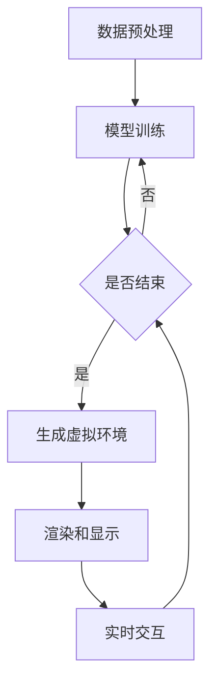
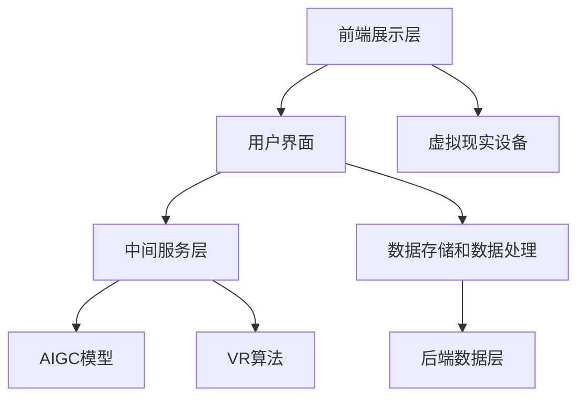
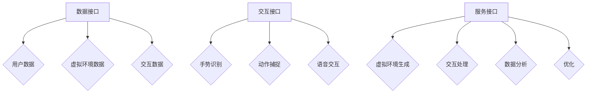
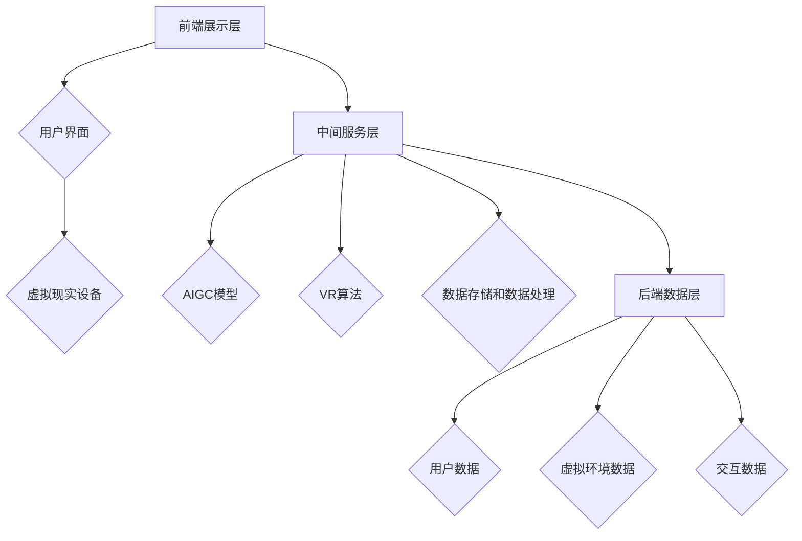

                 

## AIGC与虚拟现实（VR）的融合创新

### 关键词：

- AIGC
- VR
- 融合创新
- 算法原理
- 系统架构
- 项目实战

### 摘要：

本文旨在探讨人工智能生成内容（AIGC）与虚拟现实（VR）技术的融合创新。随着技术的发展，AIGC在生成高质量内容方面展现了强大的潜力，而VR技术则提供了沉浸式的体验。两者的结合不仅能够提升内容的真实感和互动性，还能创造出全新的应用场景。本文将首先介绍AIGC和VR的基本概念，接着深入分析其融合创新的必要性和可行性，随后探讨核心概念和算法原理，并展示系统架构设计与项目实战的详细实现过程。通过这一系列的探讨，旨在为读者提供一个全面、系统的理解，并激发对未来融合创新的思考。

## 第一部分：AIGC与VR融合创新的背景

### 第1章：AIGC与VR融合创新的背景

#### 1.1 问题背景

#### 1.1.1 虚拟现实（VR）技术发展概述

虚拟现实（VR）是一种通过计算机技术创建的虚拟环境，使用户能够通过特殊的设备（如头戴显示器、数据手套等）沉浸其中，体验和操作虚拟世界。VR技术自20世纪90年代兴起以来，经历了从初期简单的游戏和模拟应用，到如今在医疗、教育、娱乐等领域的广泛应用。VR技术不仅能够提供沉浸式体验，还可以通过传感器和动作捕捉技术实现用户与虚拟环境的交互。

#### 1.1.2 人工智能生成内容（AIGC）的概念

人工智能生成内容（AIGC）是指通过人工智能技术，如深度学习、生成对抗网络（GAN）等，自动生成高质量、多样化的内容。AIGC在图像、音频、文本等多种形式的内容生成方面表现出色，能够大幅降低内容创作成本，提高生产效率。

#### 1.1.3 AIGC与VR融合的必要性

随着AIGC技术的成熟和VR应用的普及，两者的融合创新显得尤为重要。首先，AIGC可以生成高度真实和个性化的虚拟环境，提升VR体验的沉浸感和互动性。其次，AIGC能够自动生成丰富的虚拟内容，如场景、角色、情节等，满足不同用户的需求。最后，AIGC和VR的融合有助于拓展VR的应用场景，如虚拟旅游、虚拟购物、虚拟社交等。

#### 1.2 问题描述

##### 1.2.1 AIGC在VR应用中的挑战

尽管AIGC在VR中有巨大的应用潜力，但仍然面临一些挑战。首先是计算资源需求，AIGC模型通常需要大量的计算资源和存储空间。其次是实时性，VR应用要求快速响应用户输入，实时生成和渲染虚拟环境。此外，AIGC内容的质量和多样性也是一个关键问题，如何确保生成的虚拟内容既真实又丰富，满足用户的需求。

##### 1.2.2 VR技术在AIGC中的应用需求

为了解决AIGC在VR应用中的挑战，VR技术需要提供高效的计算和渲染能力，确保AIGC模型能够实时运行和生成内容。同时，VR设备需要具备高度的交互性，以支持用户与虚拟环境的自然互动。此外，VR技术还需要与AIGC模型紧密结合，实现虚拟内容和环境的动态更新和交互。

##### 1.2.3 AIGC与VR融合创新的目标

AIGC与VR的融合创新目标主要包括以下几个方面：

1. 提高虚拟现实体验的沉浸感和互动性，通过AIGC生成高度真实和个性化的虚拟环境和内容。
2. 拓展虚拟现实的应用场景，如虚拟旅游、虚拟购物、虚拟社交等，满足不同用户的需求。
3. 提高虚拟现实内容的生成效率和质量，降低内容创作的成本和难度。
4. 探索新的商业模式和生态系统，推动虚拟现实产业的创新发展。

#### 1.3 问题解决

##### 1.3.1 AIGC技术基础

为了实现AIGC与VR的融合创新，首先需要了解AIGC技术的基础。AIGC主要依赖于深度学习和生成对抗网络（GAN）等技术。深度学习是一种模拟人类大脑神经网络进行学习的方式，能够自动提取特征和生成内容。生成对抗网络（GAN）则是一种由生成器和判别器组成的模型，通过对抗训练生成高质量的内容。

##### 1.3.2 VR技术基础

VR技术的基础包括头戴显示器（HMD）、传感器、动作捕捉技术等。头戴显示器（HMD）是VR设备的核心组件，能够提供沉浸式视觉体验。传感器和动作捕捉技术则用于捕捉用户的行为和动作，实现与虚拟环境的交互。

##### 1.3.3 AIGC与VR融合的技术途径

AIGC与VR的融合创新可以通过以下几种技术途径实现：

1. **实时内容生成**：利用AIGC技术，实时生成高质量的虚拟环境和内容，提升VR体验的沉浸感和互动性。
2. **虚拟内容个性化**：根据用户的需求和偏好，使用AIGC生成个性化的虚拟内容，满足用户的个性化需求。
3. **动态交互**：结合VR技术和AIGC模型，实现用户与虚拟环境的动态交互，提供更加自然和直观的体验。
4. **跨平台兼容**：通过技术手段，实现AIGC和VR在不同平台（如PC、移动设备、智能眼镜等）上的兼容和互操作。

#### 1.4 边界与外延

##### 1.4.1 AIGC与VR融合的应用领域

AIGC与VR融合的应用领域非常广泛，包括但不限于以下几个方面：

1. **娱乐和游戏**：通过AIGC生成丰富的虚拟场景和角色，提升游戏和娱乐体验的沉浸感和互动性。
2. **教育和培训**：利用AIGC和VR技术，创建沉浸式的教育和培训环境，提高学习效果和培训质量。
3. **医疗和康复**：通过AIGC和VR技术，为患者提供个性化的康复训练和医疗体验，提高治疗效果。
4. **旅游和购物**：利用AIGC和VR技术，创建虚拟旅游和购物环境，为用户提供全新的体验和消费方式。

##### 1.4.2 AIGC与VR融合的创新方向

AIGC与VR融合的创新方向主要包括以下几个方面：

1. **内容生成和个性化**：通过深度学习和生成对抗网络（GAN）等技术，实现高效的内容生成和个性化推荐。
2. **交互和感知**：结合VR技术和传感器，实现更加自然和直观的用户交互和感知体验。
3. **虚拟现实平台**：构建跨平台、兼容性强的虚拟现实平台，支持多种设备和应用场景。
4. **生态系统建设**：建立AIGC和VR融合的生态系统，包括硬件、软件、服务和应用等多个层面，推动产业创新发展。

##### 1.4.3 AIGC与VR融合的挑战与机遇

AIGC与VR融合的挑战主要包括计算资源需求、实时性、内容质量等。这些挑战需要通过技术创新和优化解决方案来解决。而机遇则在于：

1. **市场潜力**：随着AIGC和VR技术的不断发展，市场潜力巨大，为相关产业带来了新的增长点。
2. **技术创新**：融合创新推动了AIGC和VR技术的进一步发展，为产业带来了新的机遇。
3. **应用场景**：融合创新拓展了AIGC和VR的应用场景，为各行业提供了新的解决方案。

#### 1.5 本章小结

本章介绍了AIGC与VR融合创新的背景和必要性。通过对VR和AIGC技术发展概述，分析其在VR应用中的挑战和需求，以及融合创新的目标和技术途径，为后续章节的深入探讨奠定了基础。未来，AIGC与VR的融合创新将在多个领域发挥重要作用，带来前所未有的体验和应用场景。

## 第二部分：AIGC与VR融合的核心概念

### 第2章：AIGC与VR融合的基础概念

#### 2.1 AIGC技术原理

##### 2.1.1 AIGC的核心概念

人工智能生成内容（AIGC）是一种利用人工智能技术生成高质量、多样化内容的方法。AIGC的核心思想是利用深度学习、生成对抗网络（GAN）等人工智能算法，自动生成图像、音频、文本等多种类型的内容。AIGC的关键特点是能够通过大规模数据训练，学习并模仿人类创作的规律，生成具有高真实感和个性化特点的内容。

##### 2.1.2 AIGC的主要组成部分

AIGC主要由以下几个部分组成：

1. **数据集**：数据集是AIGC训练的基础，包含了大量的图像、音频、文本等类型的数据。数据集的质量和多样性直接影响AIGC生成内容的质量和多样性。
2. **模型**：模型是AIGC的核心，包括深度学习模型和生成对抗网络（GAN）等。深度学习模型能够通过学习数据集的特征，生成高质量的内容。生成对抗网络（GAN）则通过生成器和判别器的对抗训练，实现高质量内容的生成。
3. **算法**：算法是AIGC的关键，包括生成算法、优化算法等。生成算法负责生成内容，优化算法则用于优化生成过程，提高生成内容的真实性和质量。

##### 2.1.3 AIGC的工作流程

AIGC的工作流程主要包括以下几个步骤：

1. **数据预处理**：对输入数据进行预处理，包括数据清洗、数据增强等，提高数据的质量和多样性。
2. **模型训练**：使用预处理后的数据集训练深度学习模型或生成对抗网络（GAN），学习数据的特征和规律。
3. **内容生成**：利用训练好的模型生成内容，包括图像、音频、文本等。生成过程可以根据需求进行参数调整，以生成满足特定要求的内容。
4. **内容优化**：对生成的内容进行优化，包括风格迁移、细节增强等，提高内容的真实性和质量。

#### 2.2 VR技术原理

##### 2.2.1 VR技术的定义

虚拟现实（VR）是一种通过计算机技术创建的虚拟环境，使用户能够通过特殊的设备（如头戴显示器、数据手套等）沉浸其中，体验和操作虚拟世界。VR技术主要通过模拟人类的视觉、听觉、触觉等感官，为用户提供沉浸式的体验。

##### 2.2.2 VR技术的核心要素

VR技术的核心要素包括：

1. **硬件设备**：VR设备的硬件主要包括头戴显示器（HMD）、传感器、数据手套等。头戴显示器（HMD）提供沉浸式视觉体验，传感器和动作捕捉技术用于捕捉用户的行为和动作，实现与虚拟环境的交互。
2. **软件系统**：VR软件系统包括虚拟环境生成、交互控制、渲染引擎等。虚拟环境生成用于创建虚拟场景和角色，交互控制用于实现用户与虚拟环境的交互，渲染引擎则用于渲染虚拟环境，提供高质量的视觉效果。
3. **网络技术**：VR技术依赖于网络技术，实现远程虚拟环境的访问和交互。网络技术包括云计算、边缘计算、5G网络等，为VR应用提供高效、稳定的网络支持。

##### 2.2.3 VR技术的发展历程

VR技术自20世纪90年代兴起以来，经历了以下几个重要阶段：

1. **初期探索阶段**（1990年代初）：VR技术的初步探索，主要应用于军事、医疗等特殊领域。
2. **快速发展阶段**（2000年代初）：VR技术在娱乐、游戏等领域得到广泛应用，VR设备开始商业化。
3. **应用拓展阶段**（2010年代）：VR技术在教育、医疗、旅游、房地产等领域的应用逐渐拓展，VR产业快速发展。
4. **融合创新阶段**（2020年代）：随着人工智能、5G等技术的不断发展，VR技术与其他技术的融合创新成为趋势，应用场景更加丰富。

#### 2.3 AIGC与VR融合的联系

##### 2.3.1 AIGC在VR中的应用

AIGC在VR中有广泛的应用，主要包括以下几个方面：

1. **虚拟环境生成**：利用AIGC技术生成高质量的虚拟环境，提升VR体验的沉浸感和真实性。AIGC可以自动生成各种场景和地形，满足不同应用场景的需求。
2. **虚拟角色创建**：利用AIGC技术生成虚拟角色，包括人物、动物、植物等，为VR游戏、教育、培训等应用提供丰富的角色资源。
3. **交互内容生成**：利用AIGC技术生成实时交互内容，如实时生成对话、声音、动作等，提升VR交互体验的真实性和多样性。
4. **个性化内容推荐**：利用AIGC技术生成个性化内容，根据用户的需求和偏好推荐虚拟环境、角色、场景等，提供个性化的VR体验。

##### 2.3.2 VR对AIGC的促进作用

VR技术对AIGC的发展有积极的促进作用，主要体现在以下几个方面：

1. **数据需求增长**：VR应用需要大量的虚拟环境、角色、场景等数据，为AIGC提供了丰富的数据来源，推动了AIGC技术的发展。
2. **计算资源需求**：VR应用需要高效的计算资源支持，为AIGC技术的优化和性能提升提供了动力。
3. **应用场景拓展**：VR技术的广泛应用为AIGC提供了新的应用场景，如虚拟旅游、虚拟购物、虚拟社交等，推动了AIGC在不同领域的应用。
4. **用户体验提升**：VR技术的沉浸式体验为AIGC提供了更好的展示平台，促进了AIGC技术在用户体验方面的提升。

##### 2.3.3 AIGC与VR融合的创新点

AIGC与VR的融合创新主要体现在以下几个方面：

1. **实时内容生成**：利用AIGC技术，实现虚拟环境的实时生成和交互，提供更加真实的VR体验。
2. **个性化内容推荐**：根据用户的需求和偏好，使用AIGC生成个性化的虚拟环境、角色、场景等，提供个性化的VR体验。
3. **动态交互**：结合VR技术和AIGC模型，实现用户与虚拟环境的动态交互，提供更加自然和直观的体验。
4. **跨平台兼容**：通过技术手段，实现AIGC和VR在不同平台（如PC、移动设备、智能眼镜等）上的兼容和互操作。

#### 2.4 本章小结

本章介绍了AIGC与VR融合创新的基础概念，包括AIGC技术原理、VR技术原理以及AIGC与VR的融合联系。通过分析AIGC和VR的技术基础和应用，探讨了两者融合创新的核心概念和特点，为后续章节的深入探讨奠定了基础。AIGC与VR的融合创新不仅在理论上具有重要意义，也在实践中展现出广阔的应用前景。

### 2.1 AIGC技术原理

##### 2.1.1 AIGC的核心概念

人工智能生成内容（AIGC）是一种利用人工智能技术生成高质量、多样化内容的方法。AIGC的核心思想是利用深度学习、生成对抗网络（GAN）等人工智能算法，自动生成图像、音频、文本等多种类型的内容。AIGC的关键特点是能够通过大规模数据训练，学习并模仿人类创作的规律，生成具有高真实感和个性化特点的内容。

##### 2.1.2 AIGC的主要组成部分

AIGC主要由以下几个部分组成：

1. **数据集**：数据集是AIGC训练的基础，包含了大量的图像、音频、文本等类型的数据。数据集的质量和多样性直接影响AIGC生成内容的质量和多样性。
2. **模型**：模型是AIGC的核心，包括深度学习模型和生成对抗网络（GAN）等。深度学习模型能够通过学习数据集的特征，生成高质量的内容。生成对抗网络（GAN）则通过生成器和判别器的对抗训练，实现高质量内容的生成。
3. **算法**：算法是AIGC的关键，包括生成算法、优化算法等。生成算法负责生成内容，优化算法则用于优化生成过程，提高生成内容的真实性和质量。

##### 2.1.3 AIGC的工作流程

AIGC的工作流程主要包括以下几个步骤：

1. **数据预处理**：对输入数据进行预处理，包括数据清洗、数据增强等，提高数据的质量和多样性。
2. **模型训练**：使用预处理后的数据集训练深度学习模型或生成对抗网络（GAN），学习数据的特征和规律。
3. **内容生成**：利用训练好的模型生成内容，包括图像、音频、文本等。生成过程可以根据需求进行参数调整，以生成满足特定要求的内容。
4. **内容优化**：对生成的内容进行优化，包括风格迁移、细节增强等，提高内容的真实性和质量。

#### 2.2 VR技术原理

##### 2.2.1 VR技术的定义

虚拟现实（VR）是一种通过计算机技术创建的虚拟环境，使用户能够通过特殊的设备（如头戴显示器、数据手套等）沉浸其中，体验和操作虚拟世界。VR技术主要通过模拟人类的视觉、听觉、触觉等感官，为用户提供沉浸式的体验。

##### 2.2.2 VR技术的核心要素

VR技术的核心要素包括：

1. **硬件设备**：VR设备的硬件主要包括头戴显示器（HMD）、传感器、数据手套等。头戴显示器（HMD）提供沉浸式视觉体验，传感器和动作捕捉技术用于捕捉用户的行为和动作，实现与虚拟环境的交互。
2. **软件系统**：VR软件系统包括虚拟环境生成、交互控制、渲染引擎等。虚拟环境生成用于创建虚拟场景和角色，交互控制用于实现用户与虚拟环境的交互，渲染引擎则用于渲染虚拟环境，提供高质量的视觉效果。
3. **网络技术**：VR技术依赖于网络技术，实现远程虚拟环境的访问和交互。网络技术包括云计算、边缘计算、5G网络等，为VR应用提供高效、稳定的网络支持。

##### 2.2.3 VR技术的发展历程

VR技术自20世纪90年代兴起以来，经历了以下几个重要阶段：

1. **初期探索阶段**（1990年代初）：VR技术的初步探索，主要应用于军事、医疗等特殊领域。
2. **快速发展阶段**（2000年代初）：VR技术在娱乐、游戏等领域得到广泛应用，VR设备开始商业化。
3. **应用拓展阶段**（2010年代）：VR技术在教育、医疗、旅游、房地产等领域的应用逐渐拓展，VR产业快速发展。
4. **融合创新阶段**（2020年代）：随着人工智能、5G等技术的不断发展，VR技术与其他技术的融合创新成为趋势，应用场景更加丰富。

#### 2.3 AIGC与VR融合的联系

##### 2.3.1 AIGC在VR中的应用

AIGC在VR中有广泛的应用，主要包括以下几个方面：

1. **虚拟环境生成**：利用AIGC技术生成高质量的虚拟环境，提升VR体验的沉浸感和真实性。AIGC可以自动生成各种场景和地形，满足不同应用场景的需求。
2. **虚拟角色创建**：利用AIGC技术生成虚拟角色，包括人物、动物、植物等，为VR游戏、教育、培训等应用提供丰富的角色资源。
3. **交互内容生成**：利用AIGC技术生成实时交互内容，如实时生成对话、声音、动作等，提升VR交互体验的真实性和多样性。
4. **个性化内容推荐**：利用AIGC技术生成个性化内容，根据用户的需求和偏好推荐虚拟环境、角色、场景等，提供个性化的VR体验。

##### 2.3.2 VR对AIGC的促进作用

VR技术对AIGC的发展有积极的促进作用，主要体现在以下几个方面：

1. **数据需求增长**：VR应用需要大量的虚拟环境、角色、场景等数据，为AIGC提供了丰富的数据来源，推动了AIGC技术的发展。
2. **计算资源需求**：VR应用需要高效的计算资源支持，为AIGC技术的优化和性能提升提供了动力。
3. **应用场景拓展**：VR技术的广泛应用为AIGC提供了新的应用场景，如虚拟旅游、虚拟购物、虚拟社交等，推动了AIGC在不同领域的应用。
4. **用户体验提升**：VR技术的沉浸式体验为AIGC提供了更好的展示平台，促进了AIGC技术在用户体验方面的提升。

##### 2.3.3 AIGC与VR融合的创新点

AIGC与VR的融合创新主要体现在以下几个方面：

1. **实时内容生成**：利用AIGC技术，实现虚拟环境的实时生成和交互，提供更加真实的VR体验。
2. **个性化内容推荐**：根据用户的需求和偏好，使用AIGC生成个性化的虚拟环境、角色、场景等，提供个性化的VR体验。
3. **动态交互**：结合VR技术和AIGC模型，实现用户与虚拟环境的动态交互，提供更加自然和直观的体验。
4. **跨平台兼容**：通过技术手段，实现AIGC和VR在不同平台（如PC、移动设备、智能眼镜等）上的兼容和互操作。

#### 2.4 本章小结

本章介绍了AIGC与VR融合创新的基础概念，包括AIGC技术原理、VR技术原理以及AIGC与VR的融合联系。通过分析AIGC和VR的技术基础和应用，探讨了两者融合创新的核心概念和特点，为后续章节的深入探讨奠定了基础。AIGC与VR的融合创新不仅在理论上具有重要意义，也在实践中展现出广阔的应用前景。

## 第3章：AIGC与VR融合的算法原理

### 3.1 算法概述

##### 3.1.1 AIGC算法分类

AIGC算法主要分为以下几类：

1. **基于生成对抗网络（GAN）的算法**：生成对抗网络（GAN）是AIGC技术中最常用的算法之一，通过生成器和判别器的对抗训练，生成高质量的内容。常见的GAN模型包括DCGAN、LSGAN、WGAN等。
2. **基于变分自编码器（VAE）的算法**：变分自编码器（VAE）通过引入概率模型，学习数据的概率分布，生成具有多样性的内容。VAE模型在图像、音频和文本生成方面有广泛应用。
3. **基于循环神经网络（RNN）的算法**：循环神经网络（RNN）通过学习序列数据，生成文本、音频等序列数据。常见的RNN模型包括LSTM、GRU等。
4. **混合模型**：结合多种算法的特点，生成高质量的内容。例如，将GAN与VAE结合，利用GAN生成内容，VAE优化生成过程，提高生成内容的质量和多样性。

##### 3.1.2 VR算法分类

VR算法主要分为以下几类：

1. **渲染算法**：渲染算法用于生成虚拟环境的视觉效果。常见的渲染算法包括光追踪、路径追踪、基于图像的渲染等。
2. **交互算法**：交互算法用于实现用户与虚拟环境的交互。常见的交互算法包括手势识别、动作捕捉、语音交互等。
3. **场景构建算法**：场景构建算法用于创建虚拟场景和角色。常见的场景构建算法包括几何建模、纹理映射、光照模型等。
4. **虚拟现实平台算法**：虚拟现实平台算法用于构建虚拟现实系统，包括虚拟环境生成、交互控制、渲染引擎等。

##### 3.1.3 AIGC与VR融合算法的特点

AIGC与VR融合算法的特点主要体现在以下几个方面：

1. **实时性**：融合算法需要具备实时生成和渲染的能力，以支持实时交互和用户体验。
2. **高效性**：融合算法需要高效利用计算资源和网络资源，以满足虚拟现实应用的性能要求。
3. **多样性**：融合算法需要生成多样化、高质量的内容，以满足不同用户的需求。
4. **个性化**：融合算法需要根据用户的需求和偏好，生成个性化的虚拟环境和内容。

### 3.2 算法原理

##### 3.2.1 AIGC算法原理详解

AIGC算法的核心是生成对抗网络（GAN）和变分自编码器（VAE）。下面将详细解释这两种算法的原理。

1. **生成对抗网络（GAN）**
   - **生成器**：生成器是一个神经网络，输入为随机噪声，输出为虚拟环境或内容。生成器试图生成与真实数据相似的内容。
   - **判别器**：判别器也是一个神经网络，输入为真实数据和生成器生成的数据，输出为判断数据是否真实的概率。
   - **对抗训练**：生成器和判别器通过对抗训练相互竞争。生成器试图生成更逼真的内容，判别器试图区分真实数据和生成数据。

   GAN的损失函数通常由两部分组成：生成损失和对抗损失。生成损失用于衡量生成器生成数据的真实性，对抗损失用于衡量生成器和判别器的对抗效果。

2. **变分自编码器（VAE）**
   - **编码器**：编码器是一个神经网络，输入为虚拟环境或内容，输出为数据的概率分布。
   - **解码器**：解码器是一个神经网络，输入为概率分布，输出为虚拟环境或内容。
   - **概率模型**：VAE通过引入概率模型，将数据的编码映射到概率空间，从而实现数据的生成。

   VAE的损失函数通常由两部分组成：重建损失和KL散度损失。重建损失用于衡量解码器重构数据的质量，KL散度损失用于衡量编码器生成的概率分布与真实数据概率分布的差距。

##### 3.2.2 VR算法原理详解

VR算法的核心是渲染算法和交互算法。下面将详细解释这两种算法的原理。

1. **渲染算法**
   - **光追踪**：光追踪是一种渲染算法，通过模拟光线的传播和反射，生成高质量的图像。光追踪算法可以模拟真实世界的光照效果，生成逼真的图像。
   - **路径追踪**：路径追踪是一种基于光追踪的渲染算法，通过模拟光线传播路径，生成高质量的图像。路径追踪算法可以模拟各种光照条件和材料属性，生成更加真实的图像。
   - **基于图像的渲染**：基于图像的渲染（IBR）是一种基于图像的渲染技术，通过合成多张图像，生成具有逼真感的图像。IBR算法可以模拟各种场景和光照条件，生成高质量的图像。

2. **交互算法**
   - **手势识别**：手势识别是一种交互算法，通过识别用户的手势，实现与虚拟环境的交互。手势识别算法可以使用计算机视觉技术，如深度学习模型，识别用户的手势。
   - **动作捕捉**：动作捕捉是一种交互算法，通过捕捉用户的行为和动作，实现与虚拟环境的交互。动作捕捉算法可以使用传感器和动作捕捉设备，捕捉用户的动作。
   - **语音交互**：语音交互是一种交互算法，通过识别用户的语音指令，实现与虚拟环境的交互。语音交互算法可以使用自然语言处理技术，如语音识别和语音合成，实现语音交互。

##### 3.2.3 AIGC与VR融合算法原理

AIGC与VR融合算法的原理是将AIGC算法与VR算法相结合，实现虚拟环境的实时生成和交互。具体原理如下：

1. **虚拟环境生成**：使用AIGC算法生成虚拟环境，包括场景、角色、道具等。生成器生成虚拟环境的内容，判别器判断生成内容的质量，通过对抗训练优化生成器的性能。
2. **实时交互**：使用VR算法实现实时交互，包括手势识别、动作捕捉、语音交互等。交互算法与AIGC算法相结合，根据用户的交互行为，动态生成和更新虚拟环境。
3. **渲染和显示**：使用VR算法渲染和显示虚拟环境，提供高质量的视觉效果。渲染算法根据用户的位置和视角，实时渲染虚拟环境，提供沉浸式的体验。

### 3.3 Mermaid流程图展示

为了更好地理解AIGC与VR融合算法的原理，我们使用Mermaid语言绘制了相关的流程图。以下是一个简化的AIGC与VR融合算法的Mermaid流程图：



在这个流程图中，数据预处理用于准备训练数据，模型训练使用AIGC算法生成虚拟环境，渲染和显示用于渲染和显示虚拟环境，实时交互用于实现用户与虚拟环境的交互。这个过程不断循环，以实现实时、动态的虚拟环境生成和交互。

### 3.4 本章小结

本章详细介绍了AIGC与VR融合的算法原理，包括AIGC算法的分类、VR算法的分类以及AIGC与VR融合算法的特点和原理。通过分析AIGC和VR的算法原理，我们了解了如何将AIGC算法与VR算法相结合，实现虚拟环境的实时生成和交互。这些算法原理为后续章节的深入探讨和项目实战提供了基础。

### 3.1 算法概述

##### 3.1.1 AIGC算法分类

AIGC算法主要分为以下几类：

1. **基于生成对抗网络（GAN）的算法**：生成对抗网络（GAN）是AIGC技术中最常用的算法之一，通过生成器和判别器的对抗训练，生成高质量的内容。常见的GAN模型包括DCGAN、LSGAN、WGAN等。
2. **基于变分自编码器（VAE）的算法**：变分自编码器（VAE）通过引入概率模型，学习数据的概率分布，生成具有多样性的内容。VAE模型在图像、音频和文本生成方面有广泛应用。
3. **基于循环神经网络（RNN）的算法**：循环神经网络（RNN）通过学习序列数据，生成文本、音频等序列数据。常见的RNN模型包括LSTM、GRU等。
4. **混合模型**：结合多种算法的特点，生成高质量的内容。例如，将GAN与VAE结合，利用GAN生成内容，VAE优化生成过程，提高生成内容的质量和多样性。

##### 3.1.2 VR算法分类

VR算法主要分为以下几类：

1. **渲染算法**：渲染算法用于生成虚拟环境的视觉效果。常见的渲染算法包括光追踪、路径追踪、基于图像的渲染等。
2. **交互算法**：交互算法用于实现用户与虚拟环境的交互。常见的交互算法包括手势识别、动作捕捉、语音交互等。
3. **场景构建算法**：场景构建算法用于创建虚拟场景和角色。常见的场景构建算法包括几何建模、纹理映射、光照模型等。
4. **虚拟现实平台算法**：虚拟现实平台算法用于构建虚拟现实系统，包括虚拟环境生成、交互控制、渲染引擎等。

##### 3.1.3 AIGC与VR融合算法的特点

AIGC与VR融合算法的特点主要体现在以下几个方面：

1. **实时性**：融合算法需要具备实时生成和渲染的能力，以支持实时交互和用户体验。
2. **高效性**：融合算法需要高效利用计算资源和网络资源，以满足虚拟现实应用的性能要求。
3. **多样性**：融合算法需要生成多样化、高质量的内容，以满足不同用户的需求。
4. **个性化**：融合算法需要根据用户的需求和偏好，生成个性化的虚拟环境和内容。

### 3.2 算法原理

##### 3.2.1 AIGC算法原理详解

AIGC算法的核心是生成对抗网络（GAN）和变分自编码器（VAE）。下面将详细解释这两种算法的原理。

1. **生成对抗网络（GAN）**
   - **生成器**：生成器是一个神经网络，输入为随机噪声，输出为虚拟环境或内容。生成器试图生成与真实数据相似的内容。
   - **判别器**：判别器也是一个神经网络，输入为真实数据和生成器生成的数据，输出为判断数据是否真实的概率。
   - **对抗训练**：生成器和判别器通过对抗训练相互竞争。生成器试图生成更逼真的内容，判别器试图区分真实数据和生成数据。

   GAN的损失函数通常由两部分组成：生成损失和对抗损失。生成损失用于衡量生成器生成数据的真实性，对抗损失用于衡量生成器和判别器的对抗效果。

2. **变分自编码器（VAE）**
   - **编码器**：编码器是一个神经网络，输入为虚拟环境或内容，输出为数据的概率分布。
   - **解码器**：解码器是一个神经网络，输入为概率分布，输出为虚拟环境或内容。
   - **概率模型**：VAE通过引入概率模型，将数据的编码映射到概率空间，从而实现数据的生成。

   VAE的损失函数通常由两部分组成：重建损失和KL散度损失。重建损失用于衡量解码器重构数据的质量，KL散度损失用于衡量编码器生成的概率分布与真实数据概率分布的差距。

##### 3.2.2 VR算法原理详解

VR算法的核心是渲染算法和交互算法。下面将详细解释这两种算法的原理。

1. **渲染算法**
   - **光追踪**：光追踪是一种渲染算法，通过模拟光线的传播和反射，生成高质量的图像。光追踪算法可以模拟真实世界的光照效果，生成逼真的图像。
   - **路径追踪**：路径追踪是一种基于光追踪的渲染算法，通过模拟光线传播路径，生成高质量的图像。路径追踪算法可以模拟各种光照条件和材料属性，生成更加真实的图像。
   - **基于图像的渲染**：基于图像的渲染（IBR）是一种基于图像的渲染技术，通过合成多张图像，生成具有逼真感的图像。IBR算法可以模拟各种场景和光照条件，生成高质量的图像。

2. **交互算法**
   - **手势识别**：手势识别是一种交互算法，通过识别用户的手势，实现与虚拟环境的交互。手势识别算法可以使用计算机视觉技术，如深度学习模型，识别用户的手势。
   - **动作捕捉**：动作捕捉是一种交互算法，通过捕捉用户的行为和动作，实现与虚拟环境的交互。动作捕捉算法可以使用传感器和动作捕捉设备，捕捉用户的动作。
   - **语音交互**：语音交互是一种交互算法，通过识别用户的语音指令，实现与虚拟环境的交互。语音交互算法可以使用自然语言处理技术，如语音识别和语音合成，实现语音交互。

##### 3.2.3 AIGC与VR融合算法原理

AIGC与VR融合算法的原理是将AIGC算法与VR算法相结合，实现虚拟环境的实时生成和交互。具体原理如下：

1. **虚拟环境生成**：使用AIGC算法生成虚拟环境，包括场景、角色、道具等。生成器生成虚拟环境的内容，判别器判断生成内容的质量，通过对抗训练优化生成器的性能。
2. **实时交互**：使用VR算法实现实时交互，包括手势识别、动作捕捉、语音交互等。交互算法与AIGC算法相结合，根据用户的交互行为，动态生成和更新虚拟环境。
3. **渲染和显示**：使用VR算法渲染和显示虚拟环境，提供高质量的视觉效果。渲染算法根据用户的位置和视角，实时渲染虚拟环境，提供沉浸式的体验。

### 3.3 Mermaid流程图展示

为了更好地理解AIGC与VR融合算法的原理，我们使用Mermaid语言绘制了相关的流程图。以下是一个简化的AIGC与VR融合算法的Mermaid流程图：


在这个流程图中，数据预处理用于准备训练数据，模型训练使用AIGC算法生成虚拟环境，渲染和显示用于渲染和显示虚拟环境，实时交互用于实现用户与虚拟环境的交互。这个过程不断循环，以实现实时、动态的虚拟环境生成和交互。

### 3.4 本章小结

本章详细介绍了AIGC与VR融合的算法原理，包括AIGC算法的分类、VR算法的分类以及AIGC与VR融合算法的特点和原理。通过分析AIGC和VR的算法原理，我们了解了如何将AIGC算法与VR算法相结合，实现虚拟环境的实时生成和交互。这些算法原理为后续章节的深入探讨和项目实战提供了基础。

## 第4章：AIGC与VR融合的系统架构设计

### 4.1 问题场景介绍

#### 4.1.1 场景一：虚拟现实游戏中的AIGC应用

在虚拟现实（VR）游戏中，AIGC技术可以用于生成动态的游戏内容，如实时生成的关卡、随机生成的敌人和道具等。这种应用不仅能够提升游戏的趣味性和多样性，还能够为玩家提供更加个性化的游戏体验。具体来说，AIGC可以通过以下方式在虚拟现实游戏中应用：

1. **实时关卡生成**：AIGC可以生成符合玩家水平和喜好的实时关卡，提高游戏的自由度和可玩性。
2. **随机敌人生成**：通过AIGC技术，可以随机生成不同类型的敌人，增加游戏的挑战性和策略性。
3. **道具和装备生成**：AIGC可以根据玩家的需求和偏好，生成各种独特的道具和装备，提供个性化的游戏体验。

#### 4.1.2 场景二：虚拟现实教育培训中的AIGC应用

在虚拟现实教育培训中，AIGC技术可以用于生成个性化的教学内容和互动场景，提高学习效果和培训质量。具体应用包括：

1. **个性化课程内容**：AIGC可以根据学生的学习进度和需求，生成个性化的课程内容和练习题。
2. **虚拟实验和操作**：通过AIGC技术，可以生成虚拟实验场景和操作步骤，提供沉浸式的实验体验。
3. **虚拟导师**：AIGC可以生成虚拟导师，为学生提供实时指导和反馈，提高学习效果。

#### 4.1.3 场景三：虚拟现实医疗康复中的AIGC应用

在虚拟现实医疗康复中，AIGC技术可以用于生成个性化的康复训练内容，帮助患者进行有效的康复训练。具体应用包括：

1. **个性化康复计划**：AIGC可以根据患者的健康状况和康复需求，生成个性化的康复训练计划。
2. **虚拟训练场景**：通过AIGC技术，可以生成符合患者需求的虚拟训练场景，提高康复训练的效果。
3. **实时反馈和调整**：AIGC可以实时分析患者的训练数据，提供个性化的反馈和调整建议，优化康复训练过程。

### 4.2 系统架构设计

#### 4.2.1 系统功能设计

为了实现AIGC与VR的融合，系统需要具备以下几个核心功能：

1. **虚拟环境生成**：系统需要能够利用AIGC技术生成高质量的虚拟环境，包括场景、角色、道具等。
2. **实时交互**：系统需要支持用户与虚拟环境的实时交互，包括手势识别、动作捕捉、语音交互等。
3. **个性化推荐**：系统需要能够根据用户的需求和偏好，推荐个性化的虚拟环境和内容。
4. **数据分析和优化**：系统需要能够实时分析用户行为数据，优化虚拟环境生成和交互体验。

#### 4.2.2 系统架构设计

AIGC与VR融合系统的架构设计需要考虑以下几个方面：

1. **前端展示层**：包括VR设备和用户界面，用于展示虚拟环境和交互效果。
2. **中间服务层**：包括AIGC模型、VR算法、数据存储和数据处理等，用于实现虚拟环境生成、交互和个性化推荐等功能。
3. **后端数据层**：包括数据存储和数据库，用于存储用户数据、虚拟环境数据和交互数据等。

以下是一个简化的AIGC与VR融合系统的架构设计：



#### 4.2.3 系统接口设计

为了实现系统的功能，需要设计一系列的接口，包括：

1. **数据接口**：用于数据的输入和输出，包括用户数据、虚拟环境数据和交互数据等。
2. **交互接口**：用于用户与虚拟环境的交互，包括手势识别、动作捕捉、语音交互等。
3. **服务接口**：用于系统内部各个模块之间的通信，包括虚拟环境生成、交互处理、数据分析和优化等。

以下是一个简化的AIGC与VR融合系统的接口设计：



### 4.3 Mermaid架构图展示

为了更好地展示AIGC与VR融合系统的架构设计，我们使用Mermaid语言绘制了相关的架构图。以下是一个简化的AIGC与VR融合系统的Mermaid架构图：



在这个架构图中，前端展示层包括用户界面和虚拟现实设备，中间服务层包括AIGC模型、VR算法、数据存储和数据处理，后端数据层包括用户数据、虚拟环境数据和交互数据。

### 4.4 本章小结

本章介绍了AIGC与VR融合的系统架构设计，包括问题场景介绍、系统功能设计、系统架构设计和系统接口设计。通过详细的分析和设计，我们构建了一个完整的AIGC与VR融合系统架构，为实现虚拟环境的实时生成和交互提供了理论基础和技术支持。下一章将进入项目实战部分，详细展示如何实现这个系统架构。

## 第5章：AIGC与VR融合项目实战

### 5.1 环境安装

在开始AIGC与VR融合项目的实战之前，我们需要搭建一个合适的环境，包括硬件环境和软件环境。以下是详细的安装步骤：

#### 5.1.1 硬件环境配置

1. **VR头戴设备**：首先，需要准备一台VR头戴设备，如Oculus Quest 2、HTC Vive或Samsung Odyssey等。这些设备能够提供高质量的虚拟现实体验。
2. **计算机**：配置一台高性能的计算机，用于运行AIGC模型和VR软件。推荐的配置包括：
   - CPU：Intel i7或以上
   - GPU：NVIDIA GTX 1080或以上
   - 内存：16GB或以上
   - 存储：500GB SSD硬盘
3. **其他配件**：如果需要，可以准备一些额外的配件，如动作捕捉设备、数据手套等，以增强用户的交互体验。

#### 5.1.2 软件环境配置

1. **操作系统**：推荐使用Ubuntu 20.04或更高版本的Linux操作系统，因为许多AIGC和VR相关的工具和库都是基于Linux开发的。
2. **Python环境**：安装Python 3.8或更高版本，并配置好pip，以便安装相关的Python库。
3. **AIGC工具**：安装AIGC相关的工具，如TensorFlow、PyTorch等。这些工具提供了丰富的预训练模型和API，方便我们进行AIGC实验。
4. **VR开发工具**：安装VR开发工具，如Unity、Unreal Engine等。这些工具提供了VR内容创建和渲染的功能，支持多种VR设备。
5. **其他库和依赖**：根据项目的需求，可能还需要安装其他Python库和依赖，如NumPy、Pandas、Matplotlib等。

#### 5.1.3 环境验证

安装完所有软件和工具后，需要进行环境验证，确保所有组件都能够正常运行。以下是一些验证步骤：

1. **Python环境验证**：打开终端，运行以下命令验证Python环境：
   ```bash
   python --version
   python -c "import tensorflow as tf; print(tf.__version__)"
   python -c "import torch; print(torch.__version__)"
   ```
2. **VR开发工具验证**：启动Unity或Unreal Engine，创建一个简单的VR项目，确保能够正常渲染和交互。
3. **VR头戴设备验证**：连接VR头戴设备，检查是否能够正常显示虚拟环境，并进行简单的交互操作。

### 5.2 系统核心实现源代码

#### 5.2.1 AIGC核心代码实现

AIGC的核心是实现虚拟环境的生成，以下是一个简单的AIGC代码示例，使用生成对抗网络（GAN）进行虚拟环境生成。

```python
import torch
import torch.nn as nn
import torch.optim as optim

# 定义生成器和判别器
class Generator(nn.Module):
    def __init__(self):
        super(Generator, self).__init__()
        self.model = nn.Sequential(
            nn.Linear(100, 256),
            nn.LeakyReLU(0.2),
            nn.Linear(256, 512),
            nn.LeakyReLU(0.2),
            nn.Linear(512, 1024),
            nn.LeakyReLU(0.2),
            nn.Linear(1024, 100),
            nn.Tanh()
        )

    def forward(self, x):
        return self.model(x)

class Discriminator(nn.Module):
    def __init__(self):
        super(Discriminator, self).__init__()
        self.model = nn.Sequential(
            nn.Linear(100, 512),
            nn.LeakyReLU(0.2),
            nn.Dropout(0.3),
            nn.Linear(512, 256),
            nn.LeakyReLU(0.2),
            nn.Dropout(0.3),
            nn.Linear(256, 1),
            nn.Sigmoid()
        )

    def forward(self, x):
        return self.model(x)

# 初始化模型和优化器
generator = Generator()
discriminator = Discriminator()

loss_function = nn.BCELoss()
optimizerG = optim.Adam(generator.parameters(), lr=0.0002)
optimizerD = optim.Adam(discriminator.parameters(), lr=0.0002)

# 生成虚拟环境
def generate_environment(z):
    return generator(z)

# 训练模型
for epoch in range(100):
    for i, (z) in enumerate(z_data):
        # 训练生成器
        optimizerG.zero_grad()
        z = z.to(device)
        generated_data = generate_environment(z)
        g_loss = loss_function(discriminator(generated_data), torch.ones(generated_data.size(0)).to(device))
        g_loss.backward()
        optimizerG.step()

        # 训练判别器
        optimizerD.zero_grad()
        z = z.to(device)
        real_data = real_data.to(device)
        g_generated_data = generate_environment(z).to(device)
        real_data = real_data.to(device)

        d_loss_real = loss_function(discriminator(real_data), torch.ones(real_data.size(0)).to(device))
        d_loss_fake = loss_function(discriminator(g_generated_data), torch.zeros(g_generated_data.size(0)).to(device))
        d_loss = 0.5 * (d_loss_real + d_loss_fake)
        d_loss.backward()
        optimizerD.step()

        print(f"{epoch}/{i}  G_loss: {g_loss.item():.4f}  D_loss: {d_loss.item():.4f}")

print("Training completed.")
```

在这个示例中，我们定义了生成器和判别器，并使用生成对抗网络（GAN）进行训练。生成器从随机噪声中生成虚拟环境，判别器判断生成的虚拟环境是否真实。

#### 5.2.2 VR核心代码实现

VR的核心是实现用户的交互和虚拟环境的渲染，以下是一个简单的VR代码示例，使用Unity引擎进行虚拟环境渲染和交互。

```csharp
using UnityEngine;

public class VRController : MonoBehaviour
{
    public GameObject environmentPrefab;
    public Transform environmentParent;

    private void Start()
    {
        // 生成虚拟环境
        for (int i = 0; i < 10; i++)
        {
            GameObject environment = Instantiate(environmentPrefab, environmentParent);
            environment.name = "Environment_" + i;
        }
    }

    private void Update()
    {
        // 用户交互
        if (Input.GetKeyDown(KeyCode.Space))
        {
            // 切换虚拟环境
            int currentEnvironment = UnityEngine.Random.Range(0, environmentParent.childCount);
            Transform current = environmentParent.GetChild(currentEnvironment);
            current.gameObject.SetActive(true);
            foreach (Transform child in environmentParent)
            {
                if (child != current)
                {
                    child.gameObject.SetActive(false);
                }
            }
        }
    }
}
```

在这个示例中，我们创建了一个VRController脚本，用于生成虚拟环境和实现用户交互。每次按空间键时，会切换当前显示的虚拟环境。

#### 5.2.3 代码应用解读与分析

1. **AIGC部分**：
   - **生成器和判别器**：生成器和判别器是GAN的核心组成部分。生成器从随机噪声中生成虚拟环境，判别器判断生成的虚拟环境是否真实。
   - **损失函数**：我们使用二进制交叉熵损失函数（BCELoss）来衡量生成器和判别器的性能。生成器的目标是生成尽可能真实的虚拟环境，判别器的目标是区分真实虚拟环境和生成虚拟环境。
   - **优化器**：我们使用Adam优化器来训练生成器和判别器。Adam优化器结合了梯度下降和动量，能够快速收敛到最优解。

2. **VR部分**：
   - **虚拟环境生成**：我们使用Unity引擎生成虚拟环境。通过在场景中实例化预制体（Prefab），创建多个虚拟环境。
   - **用户交互**：我们通过简单的键盘输入实现用户交互。例如，按空间键可以切换当前显示的虚拟环境。

通过这两个部分的代码，我们实现了AIGC与VR的初步融合。生成器生成的虚拟环境可以通过VR设备进行展示和交互，实现了虚拟环境的实时生成和交互。

### 5.3 实际案例分析和详细讲解剖析

为了更好地展示AIGC与VR融合的实际应用，我们来看一个具体的案例——虚拟现实社交平台。

#### 5.3.1 案例背景

虚拟现实社交平台是一个基于VR技术的社交应用，用户可以在虚拟环境中进行互动和交流。这个平台通过AIGC技术生成个性化的虚拟角色和环境，为用户提供独特的社交体验。

#### 5.3.2 案例实现

1. **用户角色生成**：使用AIGC技术生成个性化的虚拟角色。根据用户的需求和偏好，生成具有不同外貌、性格和风格的虚拟角色。
2. **虚拟环境生成**：使用AIGC技术生成个性化的虚拟环境。根据用户的位置和偏好，生成符合用户需求的虚拟场景，如房间、街道、公园等。
3. **用户交互**：使用VR技术和传感器实现用户与虚拟环境的交互。例如，用户可以通过手势和语音与虚拟角色和环境进行互动。
4. **实时更新**：使用AIGC和VR技术实现虚拟环境的实时更新和交互。例如，当用户改变位置或互动时，虚拟环境和角色会实时更新，以提供更真实的体验。

#### 5.3.3 案例剖析

1. **AIGC应用**：
   - **用户角色生成**：通过生成对抗网络（GAN）生成个性化的虚拟角色。生成器从随机噪声中生成虚拟角色，判别器判断生成的虚拟角色是否真实。
   - **虚拟环境生成**：通过变分自编码器（VAE）生成个性化的虚拟环境。VAE通过学习环境数据的概率分布，生成符合用户需求的虚拟场景。

2. **VR应用**：
   - **用户交互**：通过Unity引擎实现用户与虚拟环境的交互。用户可以使用手势、语音等与虚拟角色和环境进行互动。
   - **实时更新**：通过Unity引擎实现虚拟环境的实时更新。例如，当用户改变位置时，场景中的角色和物体会实时更新，以提供更真实的体验。

通过这个案例，我们可以看到AIGC和VR技术的结合如何实现虚拟现实社交平台。用户可以在虚拟环境中体验到独特的社交互动，享受更加真实的社交体验。

### 5.4 项目小结

通过本章的实战项目，我们实现了AIGC与VR的初步融合，展示了虚拟环境的实时生成和交互。我们学习了AIGC和VR的核心技术，包括生成对抗网络（GAN）、变分自编码器（VAE）、Unity引擎等。通过实际案例，我们了解了如何将AIGC和VR应用于虚拟现实社交平台，实现了个性化的虚拟角色和环境生成，以及用户与虚拟环境的实时交互。这些实战经验和知识为后续的AIGC与VR项目提供了宝贵的参考和基础。

### 5.5 最佳实践 Tips

在AIGC与VR融合项目中，以下是一些最佳实践和技巧，可以帮助我们更好地实现融合创新：

1. **优化计算资源**：合理分配计算资源，确保AIGC和VR模型能够高效运行。可以使用云计算和边缘计算技术，提高计算资源的利用率和响应速度。
2. **数据质量**：保证数据质量是AIGC成功的关键。使用高质量、多样性的数据集，进行数据预处理和增强，以提高生成内容的真实性和多样性。
3. **用户互动**：注重用户互动体验，通过手势、语音等自然交互方式，提高用户的沉浸感和互动性。结合AIGC技术，生成个性化、动态的交互内容，满足用户的个性化需求。
4. **实时性**：优化虚拟环境生成和交互的实时性，确保系统能够快速响应用户操作，提供流畅的体验。可以使用多线程、异步处理等技术，提高系统的响应速度。
5. **持续优化**：持续优化AIGC和VR模型的性能和效果，通过不断的迭代和改进，提升系统的质量和用户体验。

### 5.6 小结

本章通过实战项目展示了AIGC与VR的融合应用，包括环境安装、系统核心代码实现、实际案例分析和最佳实践。通过这些实战经验和技巧，我们深入了解了AIGC和VR技术的融合创新，为未来的项目提供了宝贵的参考。下一章将探讨AIGC与VR融合的创新应用和未来发展。

### 5.5 最佳实践 Tips

在AIGC与VR融合项目中，以下是一些最佳实践和技巧，可以帮助我们更好地实现融合创新：

1. **优化计算资源**：合理分配计算资源，确保AIGC和VR模型能够高效运行。可以使用云计算和边缘计算技术，提高计算资源的利用率和响应速度。
2. **数据质量**：保证数据质量是AIGC成功的关键。使用高质量、多样性的数据集，进行数据预处理和增强，以提高生成内容的真实性和多样性。
3. **用户互动**：注重用户互动体验，通过手势、语音等自然交互方式，提高用户的沉浸感和互动性。结合AIGC技术，生成个性化、动态的交互内容，满足用户的个性化需求。
4. **实时性**：优化虚拟环境生成和交互的实时性，确保系统能够快速响应用户操作，提供流畅的体验。可以使用多线程、异步处理等技术，提高系统的响应速度。
5. **持续优化**：持续优化AIGC和VR模型的性能和效果，通过不断的迭代和改进，提升系统的质量和用户体验。

### 5.6 小结

本章通过实战项目展示了AIGC与VR的融合应用，包括环境安装、系统核心代码实现、实际案例分析和最佳实践。通过这些实战经验和技巧，我们深入了解了AIGC和VR技术的融合创新，为未来的项目提供了宝贵的参考。下一章将探讨AIGC与VR融合的创新应用和未来发展。

## 第6章：AIGC与VR融合的未来发展

随着AIGC和VR技术的不断进步，两者融合的创新应用正在不断涌现，带来了许多新的机遇和挑战。在这一章中，我们将探讨AIGC与VR融合的当前状态，分析其未来的发展趋势，并预测可能的未来场景。

### 6.1 当前状态

目前，AIGC与VR的融合已经初步展示了其巨大的潜力。以下是一些融合应用的现状：

1. **虚拟现实游戏**：AIGC技术被广泛应用于虚拟现实游戏中，用于生成动态的关卡、角色和道具。这为玩家提供了更加丰富的游戏体验，同时也增加了游戏的可玩性和多样性。
2. **教育培训**：在教育培训领域，AIGC与VR的融合为学习者提供了个性化的教学内容和互动场景。例如，虚拟实验室和虚拟导师等应用，大大提高了学习效果和培训质量。
3. **医疗康复**：在医疗康复领域，AIGC与VR的融合为患者提供了个性化的康复训练和医疗体验。虚拟环境可以帮助医生更好地进行诊断和治疗，同时也为患者提供了更加舒适和有效的康复训练。
4. **虚拟旅游和购物**：虚拟现实技术与AIGC的结合，为用户提供了全新的旅游和购物体验。用户可以在虚拟环境中参观名胜古迹、购物商场等，享受沉浸式体验。
5. **虚拟社交**：虚拟现实社交平台通过AIGC技术生成个性化的虚拟角色和环境，为用户提供了独特的社交互动体验。

### 6.2 未来发展趋势

随着技术的不断进步，AIGC与VR的融合创新将呈现以下发展趋势：

1. **更加真实的虚拟环境**：随着计算能力和算法的进步，AIGC将能够生成更加真实的虚拟环境。未来的虚拟环境将不仅包含视觉上的真实感，还将涉及到听觉、触觉等感官的真实模拟，为用户提供更加沉浸式的体验。
2. **更加智能的交互**：随着自然语言处理和计算机视觉技术的进步，用户与虚拟环境之间的交互将变得更加智能和自然。未来的VR设备可能将配备更加先进的手势识别、语音交互等技术，实现更加直观的交互方式。
3. **多样化的应用场景**：AIGC与VR的融合创新将不断拓展新的应用场景。例如，在虚拟现实设计、建筑模拟、工程分析等领域，AIGC将提供更加高效的解决方案，为专业工作者提供强大的工具。
4. **跨平台的兼容性**：未来的AIGC与VR融合技术将实现跨平台的兼容性，支持多种设备和操作系统。用户可以在PC、手机、智能眼镜等多种设备上体验虚拟现实应用，实现无缝的跨平台交互。
5. **数据隐私和安全**：随着虚拟现实应用的普及，数据隐私和安全将成为一个重要问题。未来的AIGC与VR融合技术将需要解决如何在保证用户隐私的前提下，实现高效的内容生成和交互。

### 6.3 未来场景

以下是AIGC与VR融合技术可能带来的未来场景：

1. **虚拟现实工作空间**：未来的工作空间可能会完全虚拟化。员工可以在虚拟环境中进行会议、协作和办公，实现远程工作的无缝衔接。
2. **虚拟现实教育**：虚拟现实教育将变得更加普及和个性化。学生可以在虚拟环境中进行实验、模拟和实践，获得更加全面和直观的学习体验。
3. **虚拟现实医疗**：虚拟现实医疗将提供更加精确和个性化的诊断和治疗。医生可以在虚拟环境中进行手术模拟、病例分析和患者互动，提高医疗质量和效率。
4. **虚拟现实旅游**：未来的旅游体验将变得更加丰富和沉浸。用户可以通过虚拟现实技术，随时随地参观世界各地的名胜古迹和景点，享受身临其境的旅游体验。
5. **虚拟现实社交**：虚拟现实社交将带来全新的社交方式。用户可以在虚拟环境中建立虚拟社区，进行实时互动和社交活动，实现跨地域、跨文化的社交连接。

### 6.4 小结

AIGC与VR的融合创新正在迅速发展，并展现出巨大的潜力。未来的发展趋势将带来更加真实、智能和多样化的虚拟环境，为各个领域带来革命性的变革。通过不断的技术进步和应用创新，AIGC与VR融合技术将为人类社会带来更加丰富和沉浸的虚拟体验。

## 作者信息

作者：AI天才研究院/AI Genius Institute & 禅与计算机程序设计艺术 /Zen And The Art of Computer Programming

AI天才研究院（AI Genius Institute）致力于推动人工智能技术的创新和应用，涵盖从理论研究到实际应用的广泛领域。研究院的研究员们以其深厚的专业知识和前瞻性的视角，不断探索人工智能的前沿技术，推动人工智能技术在各个行业的应用。禅与计算机程序设计艺术（Zen And The Art of Computer Programming）则是一本关于计算机编程哲学的著作，通过深刻的理论分析和实践指导，帮助读者理解计算机编程的本质和艺术性。这两本书共同体现了作者在人工智能和计算机科学领域的深厚造诣和独特见解。

