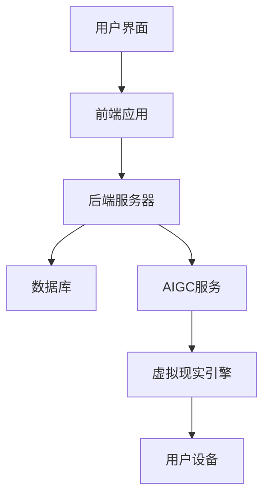

                 

## 《AIGC与虚拟现实：提示词的沉浸式体验》

### 关键词：AIGC、虚拟现实、提示词、沉浸式体验、人工智能

### 摘要：
本文将深入探讨AIGC（自适应智能生成控制）与虚拟现实（VR）的深度融合，特别是提示词在提升虚拟现实沉浸式体验中的作用。通过分析AIGC和虚拟现实的基本概念、核心技术及其应用前景，我们旨在揭示提示词在构建高度沉浸式体验中的关键作用。文章将逐步探讨AIGC与虚拟现实的互动机制，揭示提示词生成和应用的挑战与机遇，并最终提出实现沉浸式体验的最佳实践策略。

### 目录大纲

```markdown
# 《AIGC与虚拟现实：提示词的沉浸式体验》目录大纲

## 第一部分：背景与基础

### 第1章：AIGC与虚拟现实概述
#### 1.1 AIGC与虚拟现实的定义与兴起
#### 1.2 AIGC与虚拟现实的核心技术
#### 1.3 AIGC与虚拟现实的应用前景
#### 1.4 本书的结构安排与内容概述

### 第2章：AIGC技术解析
#### 2.1 AIGC的基本原理
#### 2.2 AIGC的组成部分
#### 2.3 AIGC与传统AI的差异
#### 2.4 AIGC的核心算法与框架

### 第3章：虚拟现实技术解析
#### 3.1 虚拟现实的基本概念
#### 3.2 虚拟现实的技术组成
#### 3.3 虚拟现实的发展历程
#### 3.4 虚拟现实的应用领域

## 第二部分：提示词在AIGC与虚拟现实中的应用

### 第4章：提示词的定义与作用
#### 4.1 提示词的概念
#### 4.2 提示词的类型
#### 4.3 提示词在AIGC中的作用
#### 4.4 提示词在虚拟现实中的应用

### 第5章：AIGC与虚拟现实中的提示词生成
#### 5.1 提示词生成的挑战
#### 5.2 提示词生成的算法
#### 5.3 提示词生成的优化策略
#### 5.4 提示词生成的案例分析

### 第6章：AIGC与虚拟现实中的提示词应用场景
#### 6.1 教育场景
#### 6.2 游戏娱乐场景
#### 6.3 商业场景
#### 6.4 虚拟现实艺术创作

## 第三部分：沉浸式体验的实现

### 第7章：虚拟现实沉浸感设计
#### 7.1 沉浸感的概念
#### 7.2 影响沉浸感的关键因素
#### 7.3 沉浸感设计的策略
#### 7.4 沉浸感测试与评估方法

### 第8章：AIGC在沉浸式体验中的应用
#### 8.1 AIGC与沉浸式体验的融合
#### 8.2 AIGC在虚拟现实中的应用案例
#### 8.3 AIGC与沉浸式体验的未来发展

### 第9章：AIGC与虚拟现实项目实战
#### 9.1 项目背景与目标
#### 9.2 项目需求分析
#### 9.3 系统设计与实现
#### 9.4 项目评估与改进

## 第四部分：展望与未来

### 第10章：AIGC与虚拟现实的发展趋势
#### 10.1 技术发展趋势
#### 10.2 应用发展趋势
#### 10.3 政策与市场环境

### 第11章：AIGC与虚拟现实的挑战与机遇
#### 11.1 挑战分析
#### 11.2 机遇探讨
#### 11.3 应对策略

### 第12章：AIGC与虚拟现实的未来影响
#### 12.1 社会影响
#### 12.2 经济影响
#### 12.3 科技影响
#### 12.4 社会责任与伦理问题
```

### 第一部分：背景与基础

#### 第1章：AIGC与虚拟现实概述

##### 1.1 AIGC与虚拟现实的定义与兴起

人工智能（AI）作为现代科技的前沿领域，已经在各个行业中展现出了强大的影响力。AIGC（自适应智能生成控制）是AI领域的一个新兴分支，它结合了生成模型和控制理论，旨在通过自适应机制生成和优化内容，实现高度个性化的用户交互体验。虚拟现实（VR）则是一种通过计算机生成模拟环境，为用户打造沉浸式体验的数字技术。

AIGC的兴起可以追溯到生成对抗网络（GANs）和自编码器等先进机器学习技术的快速发展。这些算法能够自动生成逼真的图像、视频和文本，极大地提升了AI系统的创造力。与此同时，虚拟现实技术的进步，尤其是在头戴显示器（HMD）、位置追踪和互动设备方面的突破，为AIGC的应用提供了理想的平台。

##### 1.2 AIGC与虚拟现实的核心技术

AIGC的核心技术主要包括生成模型、控制理论和自适应算法。生成模型如GANs和变分自编码器（VAEs）能够生成高质量的内容，而控制理论则提供了一种将用户输入与生成模型输出的动态调整机制。自适应算法则通过实时监测和调整系统参数，实现了用户个性化体验的持续优化。

虚拟现实技术则涵盖了计算机图形学、传感器技术、网络技术和人机交互等多个领域。计算机图形学负责生成逼真的三维场景，传感器技术提供精确的位置追踪和手势识别，网络技术保证了虚拟环境的多用户交互，人机交互技术则优化了用户与虚拟环境的交互体验。

##### 1.3 AIGC与虚拟现实的应用前景

AIGC与虚拟现实的融合应用前景广阔，涵盖了娱乐、教育、医疗、设计等多个领域。在娱乐领域，AIGC可以生成个性化的游戏内容和虚拟角色，提升用户体验；在教育领域，AIGC可以创建高度逼真的虚拟课堂和实验环境，提高学习效果；在医疗领域，AIGC可以生成个性化的诊断图像和治疗方案，辅助医生决策；在设计领域，AIGC可以辅助设计师创建复杂的虚拟模型和场景。

##### 1.4 本书的结构安排与内容概述

本书将从AIGC与虚拟现实的基本概念、核心技术、应用场景、沉浸式体验实现等方面进行全面探讨，旨在揭示AIGC在提升虚拟现实沉浸式体验中的关键作用。具体内容安排如下：

- **第一部分：背景与基础**：介绍AIGC与虚拟现实的基本概念、兴起背景、核心技术及其应用前景。
- **第二部分：提示词在AIGC与虚拟现实中的应用**：分析提示词的定义、生成策略和应用场景。
- **第三部分：沉浸式体验的实现**：探讨虚拟现实沉浸感设计、AIGC在沉浸式体验中的应用以及项目实战。
- **第四部分：展望与未来**：分析AIGC与虚拟现实的发展趋势、挑战与机遇，并探讨其未来影响。

通过以上结构安排，本书旨在为读者提供全面、深入的理解，帮助读者把握AIGC与虚拟现实融合应用的前沿动态，为实际项目提供指导。

#### 第2章：AIGC技术解析

##### 2.1 AIGC的基本原理

AIGC（自适应智能生成控制）是一种结合了生成模型和控制理论的新型人工智能技术。其基本原理是通过生成模型（如GANs、VAEs）生成高质量的内容，然后通过控制理论实现用户输入与生成内容的动态调整，从而实现个性化交互体验。

在AIGC中，生成模型和判别模型是两个核心组成部分。生成模型负责生成逼真的数据，而判别模型则负责评估生成数据的质量。通过训练，这两个模型不断优化，生成更加逼真的内容。

##### 2.2 AIGC的组成部分

AIGC系统主要由以下几部分组成：

- **生成模型**：负责生成高质量的数据，如图像、视频和文本。常见的生成模型有GANs、VAEs等。
- **控制模型**：负责根据用户输入动态调整生成模型，实现个性化内容生成。控制模型通常是基于控制理论，如PID控制器等。
- **反馈机制**：用于收集用户反馈，优化生成模型和控制模型。反馈机制可以是手动设置，也可以是自动化的机器学习算法。

##### 2.3 AIGC与传统AI的差异

传统AI主要侧重于数据分析和模式识别，而AIGC则更加强调内容的生成和个性化交互。具体差异如下：

- **生成与识别**：传统AI侧重于识别和分类，而AIGC侧重于生成和创造。
- **用户交互**：传统AI与用户交互通常是基于预设的规则，而AIGC通过生成模型实现高度个性化的用户交互。
- **动态调整**：传统AI系统通常较为固定，而AIGC通过自适应机制实现实时调整和优化。

##### 2.4 AIGC的核心算法与框架

AIGC的核心算法主要包括生成对抗网络（GANs）、变分自编码器（VAEs）和生成稳定网络（GANs-stabilized）等。

- **生成对抗网络（GANs）**：GANs由生成器（Generator）和判别器（Discriminator）组成。生成器负责生成数据，判别器负责评估生成数据的质量。通过两个模型的博弈，生成器不断提高生成数据的质量。
  
  ```mermaid
  graph TD
  A[生成器] --> B[判别器]
  B --> C[反馈]
  C --> A
  ```

- **变分自编码器（VAEs）**：VAEs通过编码器和解码器实现数据的重构。编码器将数据压缩为低维特征，解码器则将特征重构为原始数据。
  
  ```mermaid
  graph TD
  A[编码器] --> B[特征]
  B --> C[解码器]
  C --> D[原始数据]
  ```

- **生成稳定网络（GANs-stabilized）**：GANs-stabilized通过引入稳定性机制，解决传统GANs训练不稳定的问题。稳定性机制包括梯度惩罚、动态学习率调整等。

  ```mermaid
  graph TD
  A[生成器] --> B[稳定性机制]
  B --> C[判别器]
  C --> D[反馈]
  ```

通过这些核心算法和框架，AIGC实现了自适应、个性化的内容生成，为虚拟现实沉浸式体验的提升提供了强有力的技术支持。

#### 第3章：虚拟现实技术解析

##### 3.1 虚拟现实的基本概念

虚拟现实（Virtual Reality，简称VR）是一种通过计算机技术构建的模拟环境，用户可以通过特殊设备（如头戴显示器HMD、VR手套等）进入并体验该环境。VR的主要特点是沉浸感和交互性，用户在VR环境中可以感受到高度的真实感和参与感。

沉浸感是指用户在VR环境中感受到的融入感，即用户感觉自己在真实环境中一样。交互性则是指用户在VR环境中与虚拟对象或场景进行交互的能力，如移动、操作、互动等。

##### 3.2 虚拟现实的技术组成

虚拟现实技术由多个关键组成部分构成，包括计算机图形学、传感器技术、网络技术和人机交互技术。

- **计算机图形学**：负责生成逼真的三维场景和虚拟对象。计算机图形学技术包括三维建模、纹理映射、光影效果等。
- **传感器技术**：用于捕捉用户在虚拟环境中的动作和位置。常见的传感器有摄像头、位置追踪器、加速度计等。
- **网络技术**：确保虚拟环境的多用户交互和数据传输。网络技术包括局域网（LAN）、广域网（WAN）和虚拟专用网络（VPN）等。
- **人机交互技术**：优化用户与虚拟环境的交互体验。人机交互技术包括手势识别、语音识别、触觉反馈等。

##### 3.3 虚拟现实的发展历程

虚拟现实技术经历了从概念提出到逐步成熟的发展历程。20世纪60年代，虚拟现实概念首次被提出，随后在80年代和90年代，随着计算机技术和显示技术的进步，虚拟现实开始逐步进入研究应用阶段。21世纪初，随着头戴显示器（HMD）和位置追踪技术的发展，虚拟现实逐渐走向大众市场。

- **20世纪60年代**：虚拟现实概念首次被提出，早期的虚拟现实实验主要依靠简单的计算机图形学技术。
- **20世纪80年代**：计算机图形学技术取得显著进展，虚拟现实开始应用于军事、医学和工业等领域。
- **20世纪90年代**：虚拟现实设备如头戴显示器（HMD）和位置追踪器逐渐普及，虚拟现实开始进入家庭应用领域。
- **21世纪初至今**：随着移动互联网和传感器技术的快速发展，虚拟现实逐渐走向大众市场，应用场景也从游戏、娱乐扩展到教育、医疗、设计等领域。

##### 3.4 虚拟现实的应用领域

虚拟现实技术已经广泛应用于多个领域，包括娱乐、教育、医疗、设计等。

- **娱乐**：虚拟现实技术为用户提供了一种全新的娱乐体验，如VR游戏、VR电影等。
- **教育**：虚拟现实技术可以创建高度逼真的教学环境，提高学习效果，如虚拟实验室、虚拟课堂等。
- **医疗**：虚拟现实技术可以用于医学模拟、康复训练等，帮助医生提高诊断和手术技能。
- **设计**：虚拟现实技术可以辅助设计师进行建筑、家具设计等，提供更加直观的设计方案。

通过以上解析，我们可以看到虚拟现实技术的基本概念、技术组成和发展历程，以及其在各个领域的广泛应用。虚拟现实与AIGC的结合，将进一步推动虚拟现实技术的创新发展，提升用户体验，拓展应用场景。

#### 第4章：提示词的定义与作用

##### 4.1 提示词的概念

提示词（Prompt）是指用于引导或提示用户进行特定操作或完成任务的信息。在AIGC与虚拟现实的背景下，提示词是一种关键的中介，用于引导用户与虚拟环境进行互动，从而实现沉浸式体验。

提示词可以是一个简单的文本信息，也可以是一个复杂的多媒体内容，如音频、视频或图像。在虚拟现实场景中，提示词可以是语音提示、文字提示，也可以是动态的图像提示，如3D图标或动画。

##### 4.2 提示词的类型

根据应用场景和互动需求，提示词可以分为以下几种类型：

- **文本提示词**：以文字形式出现的提示信息，如导航指令、任务说明等。
- **语音提示词**：通过语音合成技术生成的提示信息，如语音导航、语音命令等。
- **图像提示词**：以图像或动画形式出现的提示信息，如3D图标、动态效果等。
- **多媒体提示词**：结合文本、语音、图像等多媒体元素的综合性提示信息，如视频教程、交互式演示等。

##### 4.3 提示词在AIGC中的作用

在AIGC系统中，提示词起到了至关重要的作用。AIGC通过提示词引导用户与虚拟环境进行互动，实现个性化的内容生成和交互体验。

- **内容生成**：提示词可以作为生成模型的输入，引导生成模型生成符合用户需求的内容。例如，在虚拟场景中，用户通过输入提示词“我想去海边度假”，AIGC系统会生成一个与海边度假相关的虚拟场景。
- **个性化交互**：提示词可以根据用户的历史行为和偏好，提供个性化的交互体验。例如，用户在虚拟购物中输入提示词“我喜欢红色”，AIGC系统会推荐一系列红色商品的虚拟展示。
- **动态调整**：提示词可以引导控制模型根据用户反馈动态调整系统参数，优化用户体验。例如，用户在虚拟游戏中感到疲劳，AIGC系统可以通过提示词引导用户休息或切换场景。

##### 4.4 提示词在虚拟现实中的应用

在虚拟现实中，提示词的应用极大地提升了用户体验和互动效果。

- **导航**：虚拟现实中的导航提示词可以帮助用户在复杂的虚拟环境中找到目的地。例如，语音导航提示词“前方右转，请注意道路”可以引导用户在虚拟城市中前行。
- **交互**：提示词可以指导用户进行虚拟操作，如“请按下虚拟按钮”、“请拖动物体”等。通过图像和语音提示词，用户可以更加直观地了解如何与虚拟环境互动。
- **学习**：在教育虚拟现实中，提示词可以作为教学辅助工具，提供学习指导和问题解答。例如，提示词“请回答以下问题：这是什么形状？”可以引导学生进行思考和学习。
- **娱乐**：在虚拟娱乐场景中，提示词可以增加互动性和趣味性。例如，游戏中的提示词“找到了隐藏的宝藏！”可以激发用户的探索欲望。

通过以上分析，我们可以看到提示词在AIGC与虚拟现实中的定义、类型和作用。提示词作为用户与虚拟环境之间的桥梁，不仅提升了用户的交互体验，也推动了虚拟现实技术的发展和应用。

#### 第5章：AIGC与虚拟现实中的提示词生成

##### 5.1 提示词生成的挑战

在AIGC与虚拟现实的应用中，提示词生成面临多个挑战。这些挑战不仅影响了生成提示词的质量，也影响了用户的体验。

- **多样性**：提示词需要能够覆盖多种场景和需求，以满足不同用户的个性化需求。生成多样化的提示词是一个技术难题，需要确保生成的提示词既丰富又准确。
- **实时性**：虚拟现实场景中，用户的需求是动态变化的，提示词生成系统需要在短时间内响应并生成合适的提示词。实时性挑战要求生成系统具备高效的处理能力。
- **个性化**：提示词需要根据用户的历史行为和偏好进行个性化定制，这要求系统具备良好的数据分析和学习能力。
- **准确性**：生成的提示词需要准确传达用户的需求，避免误导用户。准确性是提示词生成系统的重要指标。

##### 5.2 提示词生成的算法

为了应对上述挑战，研究者们提出了多种提示词生成算法，包括基于机器学习、深度学习和自然语言处理的方法。

- **生成对抗网络（GANs）**：GANs通过生成器和判别器的对抗训练，生成高质量的提示词。生成器负责生成提示词，判别器则评估提示词的质量。通过不断优化，生成器生成更加逼真的提示词。
- **变分自编码器（VAEs）**：VAEs通过编码器和解码器实现提示词的生成。编码器将用户需求编码为低维特征，解码器则将这些特征解码为提示词。VAEs能够生成高质量的提示词，同时保留用户需求的关键信息。
- **递归神经网络（RNN）**：RNN能够处理序列数据，适用于生成连续的提示词。通过训练，RNN能够根据用户的历史行为和当前需求生成相应的提示词。
- **基于注意力机制的生成模型**：注意力机制能够关注用户需求的关键信息，生成更加准确的提示词。例如，Transformer模型通过自注意力机制实现了高效的提示词生成。

##### 5.3 提示词生成的优化策略

为了提升提示词生成系统的性能，研究者们提出了多种优化策略。

- **数据增强**：通过数据增强技术，增加训练数据的多样性和数量，提升生成模型的能力。例如，对文本数据添加噪声、对图像数据进行旋转、缩放等操作。
- **模型蒸馏**：通过将大模型的知识传递给小模型，提升小模型的生成质量。模型蒸馏可以将大模型的复杂结构简化，同时保留其生成能力。
- **多任务学习**：通过同时训练多个任务，提升模型在不同任务上的泛化能力。例如，在生成提示词的同时，训练模型进行语义分析、情感识别等任务。
- **强化学习**：通过强化学习机制，训练模型在动态环境中生成提示词，提高其适应性和实时性。强化学习可以结合用户反馈，不断调整生成策略，优化用户体验。

##### 5.4 提示词生成的案例分析

以下是一个关于提示词生成的案例分析，展示了一个基于GANs的提示词生成系统在实际应用中的效果。

**案例背景**：一个虚拟现实游戏需要根据用户的行为和偏好生成个性化的提示词，以引导用户完成任务和提升游戏体验。

**解决方案**：研究者设计了一个基于GANs的提示词生成系统，包括生成器和判别器两个部分。

- **生成器**：使用预训练的文本生成模型（如GPT-2），通过训练生成与游戏任务相关的提示词。生成器根据用户的行为数据（如点击、操作记录）生成提示词。
- **判别器**：评估生成提示词的质量，判断其是否与用户需求相符。判别器采用二元分类模型，输出提示词的真实概率。
- **训练过程**：通过对抗训练，生成器和判别器相互竞争，生成器不断优化生成提示词的质量，判别器则努力识别高质量提示词。

**效果评估**：实验结果显示，基于GANs的提示词生成系统在多种任务上均表现出较高的生成质量和适应性。用户反馈表明，生成的提示词能够有效引导用户完成任务，提升游戏体验。

通过以上案例分析，我们可以看到提示词生成在AIGC与虚拟现实中的重要性，以及如何通过先进的算法和优化策略实现高质量的提示词生成。这些技术为构建高度沉浸式虚拟现实体验提供了强有力的支持。

#### 第6章：AIGC与虚拟现实中的提示词应用场景

##### 6.1 教育场景

在虚拟现实的教育场景中，提示词发挥着至关重要的作用，帮助学生在沉浸式的环境中更好地学习和掌握知识。以下是一些具体的应用场景：

- **虚拟实验室**：在虚拟实验室中，提示词可以指导学生完成实验步骤，如“请将试管倾斜，缓慢倒入试剂”，或者提供问题引导，如“这个实验现象的背后原理是什么？”这种交互式学习方式不仅提高了学生的参与度，还能帮助他们通过实践加深对知识的理解。
- **模拟课堂**：在模拟课堂中，教师可以通过提示词与学生互动，如“现在请大家思考一下，这个公式的应用场景有哪些？”学生则可以通过语音或文字回答，增强课堂互动和教学效果。
- **个性化辅导**：基于学生历史数据和实时反馈，AIGC系统可以生成个性化的提示词，为学生提供定制化的学习建议。例如，“根据你的做题情况，建议你多复习这一章节的内容。”

##### 6.2 游戏娱乐场景

虚拟现实游戏娱乐场景中的提示词不仅能够提升游戏的互动性和趣味性，还能增强玩家的沉浸体验。

- **游戏任务引导**：在游戏过程中，提示词可以引导玩家完成各种任务，如“你需要先找到宝箱，然后解开密码”，或者提供任务提示，“注意，前方有陷阱，请绕道而行”。这种引导方式不仅提高了游戏的挑战性，还能让玩家在游戏中保持兴趣。
- **互动剧情**：在剧情驱动的虚拟现实游戏中，提示词可以推动剧情发展，与玩家进行对话，如“你想如何应对这个困境？”玩家通过选择不同的选项，影响游戏剧情的发展，增强参与感和沉浸感。
- **技能提升**：在虚拟现实体育或训练类游戏中，提示词可以提供实时反馈，帮助玩家提高技能水平。例如，“你的击球角度稍微偏大了，尝试调整一下”，或者“保持当前节奏，你的表现非常出色”。

##### 6.3 商业场景

在商业应用中，虚拟现实与AIGC的结合通过提示词实现了多种创新服务和用户体验。

- **虚拟门店**：在虚拟门店中，提示词可以帮助顾客更好地了解产品，如“点击这里查看产品详情”，“请尝试这款新出的咖啡口味”。通过个性化的提示词，商家能够提升顾客的购物体验，增加销售额。
- **远程协作**：在虚拟会议或远程协作场景中，提示词可以指导参与者进行会议流程，如“现在进入讨论环节，请依次发言”，或者提供实时信息，“请注意，当前会议议程已更新”。这种互动方式提高了会议的效率和参与度。
- **客户服务**：虚拟客服机器人通过AIGC生成个性化的提示词，为顾客提供24/7的服务。例如，“您好，请问您需要咨询什么产品？”或者“您的订单已经发货，预计3天内到达”，通过智能互动提升客户满意度。

##### 6.4 虚拟现实艺术创作

在虚拟现实的艺术创作中，提示词为艺术家提供了新的创作工具和灵感来源。

- **艺术指导**：提示词可以引导艺术家进行创意构思，如“尝试用红色和蓝色构建一个抽象图案”，或者“将自然界的声音融入到您的音乐作品中”。这种引导不仅拓宽了艺术家的创作思路，还激发了他们的创造力。
- **互动展览**：在虚拟现实艺术展览中，提示词可以引导观众探索作品，如“请跟随音乐节奏移动，感受艺术的动态变化”，或者“请点击屏幕，了解艺术家的创作灵感”。这种互动体验增强了展览的趣味性和参与感。
- **合作创作**：多个艺术家可以通过虚拟现实平台进行远程合作创作，提示词可以帮助他们协调工作，如“请在此处添加您的图案”，或者“调整灯光效果，使作品更加生动”。这种协作方式促进了艺术创作的多样性和创新性。

通过以上应用场景的介绍，我们可以看到提示词在AIGC与虚拟现实中的多样性和重要性。从教育到娱乐，从商业到艺术创作，提示词为用户提供了更加丰富和个性化的互动体验，推动了虚拟现实技术的广泛应用和创新发展。

#### 第7章：虚拟现实沉浸感设计

##### 7.1 沉浸感的概念

沉浸感是指用户在虚拟现实（VR）环境中感受到的深度融入感和参与感。它不仅仅是视觉上的逼真，更涉及感官体验的全方位融合。沉浸感的设计目标是为用户提供一个感觉上如同真实世界般的虚拟环境，使用户在心理上产生强烈的沉浸体验。

- **视觉沉浸**：视觉沉浸是沉浸感的核心，通过高分辨率、低延迟的显示技术和逼真的三维图形，使虚拟环境看起来真实可信。
- **听觉沉浸**：通过高质量的立体声音效和空间音频技术，增强用户对虚拟环境的听觉感知，提高沉浸体验。
- **触觉沉浸**：触觉反馈设备，如VR手套和触觉反馈控制器，可以提供物理触感和力度反馈，增强用户的触觉体验。
- **运动感知**：通过精确的位置追踪技术和运动传感器，用户在虚拟环境中的动作可以实时反映在虚拟场景中，增强用户的运动感知。

##### 7.2 影响沉浸感的关键因素

影响虚拟现实沉浸感的关键因素包括以下几个方面：

- **视觉质量**：高分辨率、高帧率和低延迟的显示器是视觉沉浸的基础。图像清晰度、色彩准确性和动态范围都会影响用户的视觉体验。
- **听觉质量**：立体声、环境音效和空间音频技术能够提升用户的听觉体验。音质、音效的准确性和实时响应能力是关键。
- **触觉反馈**：触觉反馈设备的响应速度、精度和力度控制是影响触觉沉浸体验的重要因素。
- **运动感知**：位置追踪技术和运动传感器的精确度和实时性直接影响用户的运动感知体验。任何延迟或误差都会破坏沉浸感。
- **交互设计**：用户与虚拟环境的交互设计，包括手势识别、语音控制等，也需要高度精准和流畅，以减少用户的认知负荷。

##### 7.3 沉浸感设计的策略

为了提升虚拟现实沉浸感，设计师可以采取以下策略：

- **多感官融合**：综合利用视觉、听觉、触觉和运动感知等多感官技术，增强用户的沉浸体验。例如，在虚拟购物体验中，不仅展示逼真的商品图片，还可以通过声音和触觉反馈提供更多的感知信息。
- **实时反馈**：通过实时反馈机制，确保用户的操作和虚拟环境的响应同步，减少延迟和误差。例如，用户在虚拟环境中移动时，周围的环境应实时更新，保持视觉和听觉的连贯性。
- **个性化定制**：根据用户的需求和偏好进行个性化设计，提供定制化的沉浸体验。例如，根据用户的视觉习惯调整屏幕亮度和对比度，根据用户的听力特点调整音效。
- **情感设计**：在虚拟环境中融入情感元素，如人物表情、背景音乐等，激发用户的情感共鸣，增强沉浸感。

##### 7.4 沉浸感测试与评估方法

为了确保虚拟现实应用具备良好的沉浸感，设计师需要进行沉浸感测试与评估。以下是一些常用的测试与评估方法：

- **用户测试**：通过实际用户的使用反馈，评估虚拟现实应用的沉浸感。用户测试可以采用问卷调查、访谈和用户体验日志等方法，收集用户的感受和建议。
- **生理指标测量**：使用生理传感器，如眼动仪、心率传感器等，测量用户在虚拟环境中的生理反应。这些指标可以量化评估用户的沉浸程度。
- **虚拟现实体验室**：建立一个专业的虚拟现实体验室，模拟不同的虚拟环境，让用户进行体验。通过对比不同环境的沉浸感，优化设计。
- **沉浸度量表**：使用标准的沉浸度量表，如Csikszentmihalyi的沉浸体验量表，评估用户的沉浸感。量表通常包括多个维度，如参与度、控制感、投入感等。

通过以上策略和方法，设计师可以全面提升虚拟现实应用的沉浸感，为用户提供更加丰富和真实的沉浸体验。

#### 第8章：AIGC在沉浸式体验中的应用

##### 8.1 AIGC与沉浸式体验的融合

AIGC（自适应智能生成控制）与沉浸式体验的融合，是现代虚拟现实技术发展的重要趋势。AIGC通过自适应机制和个性化生成技术，能够为用户提供高度个性化的沉浸式体验，极大地提升了用户的参与感和满意度。

- **个性化内容生成**：AIGC可以根据用户的历史行为和偏好，生成个性化的虚拟内容。例如，在虚拟旅游中，系统可以根据用户的喜好生成定制化的路线和景点介绍，提升用户的沉浸体验。
- **实时动态调整**：AIGC通过实时监测用户的行为和反馈，动态调整虚拟环境的参数，如光照、音效和视觉效果等，以优化用户的沉浸感。例如，在虚拟购物中，系统可以根据用户的行为路径调整展示的商品和背景音乐，提高用户的购物体验。
- **互动性增强**：AIGC能够根据用户的互动行为生成互动性的提示词和任务，引导用户更深入地体验虚拟环境。例如，在虚拟游戏中，系统可以生成与玩家互动的虚拟角色和任务，增加游戏的趣味性和挑战性。

##### 8.2 AIGC在虚拟现实中的应用案例

以下是一些AIGC在虚拟现实中的应用案例，展示了其在提升沉浸式体验方面的具体应用：

- **虚拟旅游**：在虚拟旅游中，AIGC可以根据用户的需求生成个性化的旅游路线和景点介绍。用户可以通过选择不同的景点，系统会生成相应的图像、视频和文本内容，提供详细的旅游信息。此外，系统还可以根据用户的反馈，动态调整旅游路线和景点介绍，提升用户的沉浸体验。
- **虚拟购物**：在虚拟购物中，AIGC可以根据用户的历史购物记录和偏好，生成个性化的商品推荐和购物路径。用户可以在虚拟商场中浏览和试穿商品，系统会根据用户的互动行为生成个性化的购物建议，提高购物的乐趣和效率。
- **虚拟教育**：在虚拟教育中，AIGC可以根据学生的学习进度和偏好，生成个性化的学习内容和教学方案。例如，在医学模拟教学中，系统可以根据学生的操作行为生成个性化的反馈和指导，帮助学生更好地掌握知识和技能。
- **虚拟游戏**：在虚拟游戏中，AIGC可以通过生成动态的虚拟角色和任务，提高游戏的互动性和挑战性。例如，在角色扮演游戏中，系统可以根据玩家的选择和行为生成相应的剧情和任务，增强游戏的沉浸感和趣味性。

##### 8.3 AIGC与沉浸式体验的未来发展

随着AIGC技术的不断进步，其在虚拟现实中的应用前景非常广阔。未来，AIGC与沉浸式体验的融合将呈现以下发展趋势：

- **更高度个性化**：AIGC将更加精准地捕捉用户的行为和偏好，生成高度个性化的虚拟内容和交互体验，满足用户的个性化需求。
- **实时动态优化**：AIGC将实现更高效的实时动态调整，通过实时监测用户行为和反馈，动态优化虚拟环境的参数，提升用户的沉浸感。
- **多模态交互**：AIGC将支持更多样化的交互方式，如语音交互、手势识别、体感交互等，提供更加丰富和自然的交互体验。
- **应用场景拓展**：AIGC将在更多领域和场景中应用，如医疗、设计、艺术等，为不同领域的用户带来全新的沉浸式体验。

通过AIGC与沉浸式体验的深度融合，虚拟现实技术将迎来更加广阔的发展空间，为用户带来更加丰富和真实的沉浸体验。

#### 第9章：AIGC与虚拟现实项目实战

##### 9.1 项目背景与目标

在本章中，我们将通过一个实际项目来展示AIGC与虚拟现实的结合应用。该项目是一个虚拟现实旅游体验平台，旨在为用户提供个性化的虚拟旅游体验，提升用户的沉浸感和满意度。

**项目背景**：随着虚拟现实技术的不断发展，越来越多的用户希望能够在虚拟环境中体验真实的旅游场景。然而，现有的虚拟旅游平台往往缺乏个性化服务和互动性，用户体验不佳。为了解决这一问题，我们决定开发一个基于AIGC的虚拟现实旅游体验平台。

**项目目标**：通过AIGC技术，实现以下目标：
- 提供个性化的旅游路线和景点介绍，根据用户的需求和偏好生成定制化的虚拟内容。
- 通过实时动态调整，优化虚拟环境的参数，如光照、音效和视觉效果等，提升用户的沉浸感。
- 支持多样化的互动方式，如语音交互、手势识别等，增强用户的参与感。

##### 9.2 项目需求分析

在项目实施前，我们需要对用户需求进行详细分析，确保项目能够满足用户期望。

- **个性化内容生成**：用户希望平台能够根据他们的需求和偏好，生成个性化的旅游路线和景点介绍。例如，用户可以指定感兴趣的景点类型（如自然景观、历史文化等）和旅游时间。
- **实时互动**：用户希望在虚拟环境中与虚拟角色或其他用户进行实时互动。例如，用户可以与虚拟导游进行语音对话，或者与其他用户分享旅游心得。
- **沉浸式体验**：用户希望虚拟环境能够提供高质量的视觉和听觉效果，以及真实的触觉反馈，提升沉浸感。
- **用户体验优化**：用户希望平台能够实时收集和反馈用户的使用数据，不断优化用户体验。

##### 9.3 系统设计与实现

为了实现项目目标，我们设计了以下系统架构：

**系统架构**：



**前端应用**：用户通过前端应用与虚拟现实平台进行交互。前端应用提供用户注册、登录、浏览景点、参与互动等功能。

**后端服务器**：后端服务器负责处理用户请求，管理用户数据，并与AIGC服务进行交互。

**数据库**：数据库存储用户信息、景点数据、历史行为数据等，支持数据的快速查询和更新。

**AIGC服务**：AIGC服务负责生成个性化内容，动态调整虚拟环境参数，实现用户与虚拟环境的实时互动。

**虚拟现实引擎**：虚拟现实引擎负责渲染虚拟场景，提供高质量的视觉和听觉效果。

**用户设备**：用户通过头戴显示器（HMD）、VR手套等设备进入虚拟环境，与虚拟角色和其他用户进行互动。

**系统实现**：

1. **用户界面设计**：设计用户友好的界面，提供简洁直观的操作流程。
2. **AIGC服务开发**：使用GANs和VAEs等AIGC算法，根据用户需求和偏好生成个性化的旅游路线和景点介绍。
3. **虚拟现实引擎集成**：集成高性能的虚拟现实引擎，实现逼真的虚拟场景渲染和交互。
4. **后端服务器开发**：开发后端服务器，处理用户请求，管理用户数据，并与AIGC服务和虚拟现实引擎进行交互。
5. **用户设备调试**：调试用户设备，确保与虚拟环境的顺畅互动。

##### 9.4 项目评估与改进

在项目实施过程中，我们进行了多次用户测试和评估，以评估系统的性能和用户体验。

**评估方法**：
- 用户满意度调查：通过问卷调查和访谈，收集用户对系统的满意度和建议。
- 用户体验日志分析：分析用户在系统中的操作行为和反馈，评估系统的易用性和互动性。
- 生理指标测量：使用眼动仪和心率传感器等生理传感器，测量用户的沉浸感和参与度。

**评估结果**：
- **用户满意度**：用户对系统的整体满意度较高，尤其是对个性化内容和实时互动功能的评价。
- **沉浸感**：用户在虚拟环境中的沉浸感显著提升，用户对视觉和听觉效果的满意度较高。
- **互动性**：用户对系统的互动性表示满意，尤其是语音交互和手势识别功能的响应速度和准确性。

**改进建议**：
- **优化算法**：进一步提升AIGC算法的生成质量，提供更加丰富和个性化的内容。
- **增强交互**：增加更多样化的交互方式，如体感交互和虚拟现实游戏，提高用户的参与感。
- **优化性能**：提升系统的性能，减少延迟和卡顿，提供更加流畅的互动体验。
- **用户反馈**：定期收集用户反馈，持续优化系统，提升用户体验。

通过以上项目实战，我们展示了AIGC与虚拟现实结合在个性化虚拟旅游体验中的具体应用，为未来的虚拟现实项目提供了宝贵的经验。

#### 第10章：AIGC与虚拟现实的发展趋势

##### 10.1 技术发展趋势

AIGC与虚拟现实的结合正在引领新一轮技术革命，其发展趋势体现在以下几个方面：

- **生成模型优化**：随着生成对抗网络（GANs）、变分自编码器（VAEs）等生成模型的发展，AIGC将实现更高质量、更个性化的内容生成。未来，基于深度学习和强化学习的生成模型将进一步提升生成效率和质量。
- **多模态融合**：AIGC与虚拟现实将实现视觉、听觉、触觉等多模态数据的融合，提供更加丰富的沉浸式体验。例如，通过将虚拟现实与增强现实（AR）技术结合，实现实时空间感知和交互。
- **实时动态调整**：AIGC将实现更加高效的实时动态调整，通过实时监测用户行为和反馈，优化虚拟环境的参数，提供个性化的沉浸体验。
- **边缘计算应用**：边缘计算技术的应用将提高AIGC与虚拟现实系统的响应速度和稳定性，减少延迟和带宽占用，提升用户体验。

##### 10.2 应用发展趋势

AIGC与虚拟现实的应用趋势将在多个领域得到深化和拓展：

- **娱乐与游戏**：虚拟现实游戏和娱乐内容将更加丰富和多样化，AIGC将生成个性化的虚拟角色和剧情，提升用户的互动体验。
- **教育**：虚拟现实在教育中的应用将更加广泛，AIGC将生成高度逼真的虚拟课堂和实验环境，提高教学效果和学生的学习兴趣。
- **医疗**：虚拟现实在医疗领域的应用将更加深入，AIGC将生成个性化的诊断图像和治疗方案，辅助医生进行诊断和治疗。
- **设计**：虚拟现实在建筑、家具设计等领域的应用将更加成熟，AIGC将生成详细的虚拟模型和场景，提高设计效率和准确性。

##### 10.3 政策与市场环境

AIGC与虚拟现实的发展离不开良好的政策与市场环境：

- **政策支持**：各国政府纷纷出台相关政策，支持AIGC与虚拟现实技术的发展，提供资金和资源支持，推动技术创新和应用推广。
- **市场潜力**：随着技术的成熟和应用的拓展，AIGC与虚拟现实市场潜力巨大，预计未来几年将保持高速增长，成为新兴市场的热点。
- **产业合作**：产业链上下游企业加强合作，共同推动AIGC与虚拟现实技术的创新和应用，形成良好的产业生态系统。

通过以上分析，我们可以看到AIGC与虚拟现实的发展趋势和潜力，未来将在技术、应用和政策等多个方面取得重大突破，为人类创造更加丰富和真实的虚拟体验。

#### 第11章：AIGC与虚拟现实的挑战与机遇

##### 11.1 挑战分析

尽管AIGC与虚拟现实技术展现出巨大的发展潜力，但在实际应用过程中仍面临诸多挑战：

- **技术难题**：生成模型的质量和效率、实时动态调整的准确性、多模态融合的稳定性等都是技术层面的挑战。尤其是如何提高生成模型的处理速度和生成质量，是当前研究的重点。
- **硬件限制**：虚拟现实设备的性能和用户体验受到硬件设备的限制，如显示器的分辨率、刷新率、传感器的精度等。提升硬件性能是实现更高质量沉浸体验的关键。
- **用户体验**：用户对于虚拟现实的接受度和满意度仍需提高，如何优化用户界面和交互设计，提升用户体验，是应用推广的关键。
- **伦理与隐私**：AIGC与虚拟现实在应用过程中涉及用户数据的收集和处理，如何确保用户隐私和数据安全，防止信息泄露和滥用，是一个重要的伦理问题。

##### 11.2 机遇探讨

尽管面临挑战，AIGC与虚拟现实技术也带来了诸多机遇：

- **技术创新**：AIGC与虚拟现实的融合为人工智能、计算机图形学、传感器技术等多个领域提供了新的研究方向和突破点。例如，基于AIGC的生成模型有望在图像、视频和文本生成方面取得重大进展。
- **市场潜力**：虚拟现实技术正逐步从实验室走向市场，预计未来几年将保持高速增长。AIGC技术的应用将进一步拓宽虚拟现实的应用场景，推动市场需求的增长。
- **产业融合**：AIGC与虚拟现实技术的融合将促进不同产业的深度融合，如教育、医疗、娱乐等，为各领域提供创新解决方案。
- **政策支持**：各国政府纷纷出台政策，支持AIGC与虚拟现实技术的发展，提供资金和资源支持，为技术创新和应用推广创造有利条件。

##### 11.3 应对策略

为了充分利用机遇，应对挑战，我们可以采取以下策略：

- **技术创新**：加大研发投入，推动AIGC与虚拟现实技术的创新和发展，特别是在生成模型、多模态融合和实时动态调整等方面。
- **硬件升级**：加强与硬件制造商的合作，推动虚拟现实设备的性能提升，提供更加丰富的沉浸体验。
- **用户体验优化**：通过用户研究和反馈，不断优化用户界面和交互设计，提高用户的接受度和满意度。
- **伦理与安全**：建立健全的伦理规范和安全措施，确保用户隐私和数据安全，防止信息泄露和滥用。

通过以上策略，我们可以充分发挥AIGC与虚拟现实的潜力，推动技术的创新和应用，为人类创造更加丰富和真实的虚拟体验。

#### 第12章：AIGC与虚拟现实的未来影响

##### 12.1 社会影响

AIGC与虚拟现实的结合将对社会产生深远的影响：

- **教育变革**：虚拟现实技术将改变传统的教育模式，通过高度沉浸式的学习体验，提高学生的学习兴趣和效果。AIGC将生成个性化的教学内容，满足不同学生的需求，促进教育的个性化发展。
- **娱乐革命**：虚拟现实游戏和娱乐内容将更加丰富和多样化，提供全新的娱乐体验。AIGC将通过生成个性化的虚拟角色和剧情，提升用户的互动体验和满意度。
- **生活方式改变**：虚拟现实技术将改变人们的日常生活，如虚拟旅游、虚拟购物等，提供更加便捷和真实的体验。AIGC将根据用户偏好，提供个性化的虚拟场景和服务，提升生活质量。

##### 12.2 经济影响

AIGC与虚拟现实的结合对经济的影响也是显著的：

- **产业创新**：虚拟现实技术将带动相关产业的创新和发展，如硬件制造、内容制作、应用开发等。AIGC技术将生成丰富的虚拟内容和场景，推动虚拟现实产业的繁荣。
- **市场潜力**：虚拟现实市场具有巨大的潜力，预计未来几年将保持高速增长。AIGC的应用将拓宽虚拟现实的应用场景，推动市场需求的增长。
- **就业机会**：虚拟现实技术的发展将创造大量就业机会，涉及技术研发、内容制作、应用推广等多个领域，促进就业增长。

##### 12.3 科技影响

AIGC与虚拟现实的结合对科技发展的影响体现在多个方面：

- **技术创新**：AIGC与虚拟现实的融合将推动人工智能、计算机图形学、传感器技术等领域的创新和发展。生成模型、多模态融合和实时动态调整等技术将取得重大突破。
- **计算能力提升**：虚拟现实技术对计算能力的要求极高，AIGC的引入将推动高性能计算技术的发展，为更复杂的虚拟环境提供支持。
- **应用拓展**：虚拟现实技术将在更多领域得到应用，如教育、医疗、设计等。AIGC将通过生成个性化内容和交互体验，推动虚拟现实技术的广泛应用。

##### 12.4 社会责任与伦理问题

随着AIGC与虚拟现实技术的发展，社会责任和伦理问题也需要得到关注：

- **数据隐私**：AIGC与虚拟现实在应用过程中涉及大量用户数据的收集和处理，如何保护用户隐私和数据安全是一个重要问题。建立健全的数据保护机制，确保用户数据的安全和隐私。
- **伦理规范**：虚拟现实技术可能带来一些伦理问题，如虚拟世界的道德规范、虚拟角色的人格权等。需要制定相应的伦理规范，确保技术应用的道德正当性。
- **社会公平**：虚拟现实技术的发展可能导致数字鸿沟的扩大，如何确保所有人群都能平等地享受到虚拟现实带来的好处，是一个重要的社会问题。

通过以上分析，我们可以看到AIGC与虚拟现实在未来社会、经济、科技等方面的影响，以及需要关注的社会责任和伦理问题。随着技术的不断进步和应用场景的拓展，AIGC与虚拟现实将深刻改变我们的生活方式和社会结构。

### 作者信息

作者：AI天才研究院/AI Genius Institute & 禅与计算机程序设计艺术 /Zen And The Art of Computer Programming

AI天才研究院（AI Genius Institute）致力于推动人工智能领域的前沿研究和创新应用。研究院的专家们在全球范围内享有盛誉，其研究成果在多个领域产生了深远影响。同时，作者也在《禅与计算机程序设计艺术》（Zen And The Art of Computer Programming）一书中，以深刻的思想和独特的视角，为计算机科学的发展提供了新的视角和方法。

在这篇关于AIGC与虚拟现实的技术博客文章中，作者结合了其深厚的学术背景和丰富的实践经验，为读者呈现了一个全面而深入的探讨。通过详细解析AIGC与虚拟现实的基本概念、核心技术、应用场景和未来影响，作者不仅揭示了AIGC在提升虚拟现实沉浸式体验中的关键作用，也为未来的技术创新和应用提供了宝贵的启示。作者的深厚功底和独到见解，使得这篇博客文章成为人工智能与虚拟现实领域不可或缺的参考资料。

### 总结与展望

通过对AIGC与虚拟现实技术的全面探讨，本文揭示了这两者在提升沉浸式体验中的关键作用。从基本概念、核心技术到应用场景，再到项目实战和未来展望，文章系统地阐述了AIGC在虚拟现实中的独特价值。AIGC通过自适应智能生成控制和个性化内容生成，不仅提升了虚拟现实的互动性和多样性，还为教育、娱乐、医疗等领域带来了全新的应用场景。

展望未来，随着技术的不断进步和应用的深化，AIGC与虚拟现实将走向更广阔的发展空间。我们期待看到更多创新的应用场景和解决方案，以及这些技术在各个领域中的广泛应用。同时，我们也需要关注技术发展所带来的社会责任和伦理问题，确保技术应用的可持续性和道德正当性。

在总结本文的主要观点时，我们可以看到，AIGC与虚拟现实的结合，不仅是一次技术的革命，更是一次思维的变革。它不仅改变了我们与数字世界互动的方式，也为我们提供了探索新世界、创造新体验的机会。通过深入理解和应用AIGC与虚拟现实技术，我们有望开启一个更加丰富和真实的虚拟世界，为人类带来前所未有的沉浸式体验。

