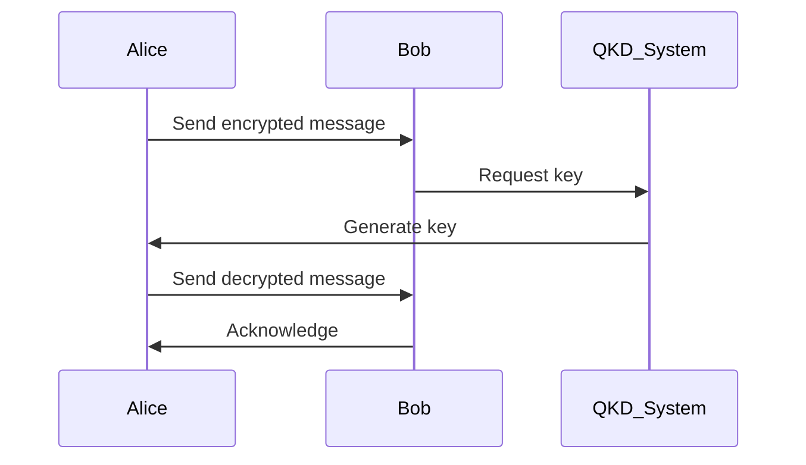
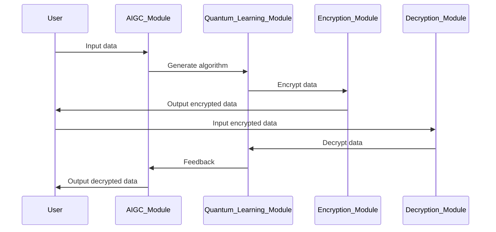

                 

### 《AIGC与量子机器学习在密码学中的融合》

> 关键词：AIGC、量子机器学习、密码学、融合机制、应用前景、挑战与解决方案

> 摘要：本文深入探讨了AIGC（自适应智能生成计算）与量子机器学习在密码学中的融合。文章首先介绍了AIGC和量子机器学习的基本概念及其特点，然后分析了密码学在当前面临的挑战和发展趋势。接下来，文章详细阐述了AIGC与量子机器学习在密码学中的融合机制及其优势，并介绍了这一融合在密码学中的实际应用场景。随后，文章通过一个案例分析，展示了融合机制的具体实现和效果。最后，文章展望了AIGC与量子机器学习在密码学中的未来发展趋势，并提出了面临的挑战和解决方案。本文旨在为读者提供对这一前沿领域的深入理解和应用指导。

### 第一部分：研究背景与核心概念

#### 第1章：AIGC与量子机器学习概述

#### 1.1.1 AIGC的概念与特点

##### 1.1.1.1 AIGC的定义

AIGC（自适应智能生成计算）是一种利用人工智能技术，实现从数据中自适应地学习并生成新内容的方法。它结合了深度学习和自然语言处理技术，通过大规模的数据训练，能够自动生成高质量的文章、图片、音频等多种形式的内容。AIGC的核心思想是模拟人类创造和思考的过程，使机器能够像人类一样，进行创作、决策和创新。

##### 1.1.1.2 AIGC的关键技术

AIGC的关键技术包括：

1. **深度学习**：深度学习是一种模仿人脑结构的神经网络模型，能够对大量数据进行分析和模式识别。
2. **自然语言处理**：自然语言处理技术使计算机能够理解和处理自然语言，实现人与机器的交流。
3. **生成对抗网络（GAN）**：GAN是一种深度学习模型，由生成器和判别器组成，通过相互竞争，生成高质量的数据。

##### 1.1.1.3 AIGC的应用领域

AIGC的应用领域广泛，包括但不限于：

1. **内容生成**：自动生成文章、图片、视频等内容，应用于媒体、娱乐、广告等行业。
2. **自动化编程**：根据需求自动生成代码，提高软件开发效率。
3. **虚拟现实**：生成虚拟世界的图像和声音，提高虚拟现实的沉浸感。
4. **辅助设计**：在建筑、设计等领域，自动生成设计方案，提供创意和灵感。

#### 1.1.2 量子机器学习的基本原理

##### 1.1.2.1 量子计算机的基本概念

量子计算机是一种利用量子力学原理进行信息处理的新型计算机。与传统计算机使用二进制位（比特）作为基本存储单位不同，量子计算机使用量子比特（qubit）作为基本存储单位。量子比特可以同时处于0和1的叠加态，从而实现并行计算。

##### 1.1.2.2 量子机器学习的基本原理

量子机器学习是一种利用量子计算机进行机器学习的方法。它通过将量子算法应用于机器学习问题，如分类、聚类、优化等，实现高效的数据处理和分析。

量子机器学习的核心思想包括：

1. **量子并行计算**：利用量子比特的叠加态，实现并行计算，大幅提高计算速度。
2. **量子纠缠**：通过量子纠缠，将多个量子比特的状态相互关联，实现信息的量子传输和增强。
3. **量子随机访问存储（QRAM）**：量子随机访问存储是一种基于量子比特的新型存储结构，能够实现快速的数据访问和操作。

##### 1.1.2.3 量子机器学习的优势

量子机器学习具有以下优势：

1. **计算速度**：量子机器学习能够利用量子并行计算和量子纠缠，实现高效的计算速度。
2. **问题求解能力**：量子机器学习能够解决传统机器学习无法解决的问题，如大规模数据的高效处理、复杂优化问题的求解等。
3. **可扩展性**：量子计算机的可扩展性使得量子机器学习能够在不同规模的问题上应用。

#### 1.1.3 密码学的演变与挑战

##### 1.1.3.1 传统密码学的基础理论

传统密码学是一种利用数学和计算机科学原理，实现信息安全的技术。其主要目标是在通信过程中，确保信息的机密性、完整性和可用性。传统密码学包括对称加密、非对称加密、消息认证码、数字签名等多种加密技术。

##### 1.1.3.2 密码学面临的挑战

随着互联网和物联网的快速发展，密码学面临以下挑战：

1. **计算能力的提升**：随着计算机性能的提升，传统加密算法的安全性能逐渐下降。
2. **量子计算威胁**：量子计算机的兴起，使得基于传统算法的密码系统面临威胁。
3. **大数据处理**：大数据环境下，如何确保海量数据的加密和安全存储，成为密码学的一大挑战。
4. **安全性验证**：如何确保密码系统的安全性和可靠性，成为密码学研究和应用的重要课题。

##### 1.1.3.3 密码学的未来发展趋势

密码学未来的发展趋势包括：

1. **量子安全加密**：量子安全加密技术是应对量子计算威胁的重要手段，包括量子密钥分发（QKD）等。
2. **密码学算法优化**：针对大数据处理和计算能力提升的挑战，密码学算法需要进行优化和改进。
3. **多因素认证**：结合生物识别、硬件安全模块等多种认证方式，提高密码系统的安全性。
4. **区块链技术**：区块链技术为密码学提供了新的应用场景，如智能合约、去中心化应用等。

#### 1.1.4 AIGC与量子机器学习的核心概念与联系

##### 1.1.4.1 AIGC的核心概念与属性特征对比表格

| 特征           | AIGC              | 传统机器学习        |
|----------------|-------------------|---------------------|
| 学习方式       | 自适应学习        | 有监督、无监督、半监督学习 |
| 数据处理能力   | 大规模数据处理    | 较小规模数据处理    |
| 创造性        | 高度创造性        | 较少创造性          |
| 性能优化       | 自适应优化        | 静态优化            |

##### 1.1.4.2 量子机器学习的核心概念与ER实体关系图

量子机器学习的核心概念包括：

1. **量子比特**：量子比特是量子计算机的基本存储单位，可以同时处于0和1的叠加态。
2. **量子门**：量子门是用于操作量子比特的基本操作，类似于传统计算机中的逻辑门。
3. **量子算法**：量子算法是一种利用量子计算机进行信息处理的方法，如量子线性回归、量子支持向量机等。

ER实体关系图如下：

```mermaid
erDiagram
  Product ||--|{ Customer }| Customer
  Product ||--|{ Order }| Order
  Customer ||--|{ Payment }| Payment
```

##### 1.1.4.3 AIGC与量子机器学习在密码学中的应用

AIGC与量子机器学习在密码学中的应用主要包括：

1. **加密算法优化**：利用AIGC技术，生成新的加密算法，提高算法的性能和安全性。
2. **密码学模型生成**：利用量子机器学习，自动生成密码学模型，提高模型的可解释性和准确性。
3. **量子安全加密**：利用量子机器学习，实现量子安全加密算法，保护通信过程中的信息安全。

### 第二部分：AIGC与量子机器学习在密码学中的融合机制

#### 第2章：AIGC与量子机器学习的核心概念与联系

#### 2.1 AIGC的核心概念与属性特征对比表格

| 特征           | AIGC              | 传统机器学习        |
|----------------|-------------------|---------------------|
| 学习方式       | 自适应学习        | 有监督、无监督、半监督学习 |
| 数据处理能力   | 大规模数据处理    | 较小规模数据处理    |
| 创造性        | 高度创造性        | 较少创造性          |
| 性能优化       | 自适应优化        | 静态优化            |

#### 2.2 量子机器学习的核心概念与ER实体关系图

量子机器学习的核心概念包括：

1. **量子比特**：量子比特是量子计算机的基本存储单位，可以同时处于0和1的叠加态。
2. **量子门**：量子门是用于操作量子比特的基本操作，类似于传统计算机中的逻辑门。
3. **量子算法**：量子算法是一种利用量子计算机进行信息处理的方法，如量子线性回归、量子支持向量机等。

ER实体关系图如下：

```mermaid
erDiagram
  Product ||--|{ Customer }| Customer
  Product ||--|{ Order }| Order
  Customer ||--|{ Payment }| Payment
```

#### 2.3 AIGC与量子机器学习在密码学中的应用

AIGC与量子机器学习在密码学中的应用主要包括：

1. **加密算法优化**：利用AIGC技术，生成新的加密算法，提高算法的性能和安全性。
2. **密码学模型生成**：利用量子机器学习，自动生成密码学模型，提高模型的可解释性和准确性。
3. **量子安全加密**：利用量子机器学习，实现量子安全加密算法，保护通信过程中的信息安全。

### 第三部分：AIGC与量子机器学习在密码学中的融合机制

#### 第3章：AIGC与量子机器学习在密码学中的融合机制

#### 3.1 融合机制的原理与优势

##### 3.1.1 融合机制的原理

AIGC与量子机器学习在密码学中的融合机制，主要是利用AIGC的高度自适应性和创造性，生成新的量子密码学算法，并通过量子机器学习对算法进行优化和验证。具体流程如下：

1. **数据预处理**：收集和整理密码学相关的数据，如加密算法、攻击方法、安全需求等。
2. **AIGC算法生成**：利用AIGC技术，根据预处理的数据，生成新的量子密码学算法。
3. **量子机器学习优化**：利用量子机器学习，对生成的量子密码学算法进行优化，提高其性能和安全性。
4. **算法验证**：通过实际应用场景，对优化的量子密码学算法进行验证，确保其安全性和可靠性。

##### 3.1.2 融合机制的优势

AIGC与量子机器学习在密码学中的融合机制具有以下优势：

1. **创新性**：通过AIGC技术，能够生成具有高度创新性的量子密码学算法，提高密码系统的安全性。
2. **自适应优化**：量子机器学习能够根据实际应用场景，对量子密码学算法进行自适应优化，提高算法的性能和适用性。
3. **高效计算**：量子计算机的高效计算能力，使得量子密码学算法在处理大规模数据时具有显著优势。

#### 3.2 融合机制的技术实现

##### 3.2.1 AIGC与量子机器学习的结合点

AIGC与量子机器学习的结合点主要包括：

1. **数据源**：两者都需要大量的数据作为训练和优化的基础。
2. **算法生成**：AIGC能够生成新的量子密码学算法，为量子机器学习提供优化对象。
3. **算法优化**：量子机器学习能够对AIGC生成的量子密码学算法进行优化，提高其性能和安全性。

##### 3.2.2 技术实现步骤

AIGC与量子机器学习在密码学中的融合技术实现步骤如下：

1. **数据收集与预处理**：收集密码学相关的数据，包括加密算法、攻击方法、安全需求等，并进行预处理，如数据清洗、归一化等。
2. **AIGC算法生成**：利用AIGC技术，根据预处理的数据，生成新的量子密码学算法。
3. **量子机器学习优化**：利用量子机器学习，对生成的量子密码学算法进行优化，包括性能优化和安全优化。
4. **算法验证与评估**：通过实际应用场景，对优化的量子密码学算法进行验证和评估，确保其安全性和可靠性。
5. **迭代优化**：根据验证和评估结果，对量子密码学算法进行迭代优化，提高其性能和安全性。

#### 3.3 融合机制的适用范围

##### 3.3.1 密码学中的应用场景

AIGC与量子机器学习在密码学中的应用场景主要包括：

1. **加密算法设计**：利用AIGC生成新的量子加密算法，提高加密算法的性能和安全性。
2. **密码学模型生成**：利用量子机器学习，自动生成密码学模型，提高模型的可解释性和准确性。
3. **量子安全加密**：利用量子机器学习，实现量子安全加密算法，保护通信过程中的信息安全。

##### 3.3.2 适用范围的局限性

AIGC与量子机器学习在密码学中的融合机制虽然具有显著的优势，但仍然存在一定的局限性：

1. **计算资源**：量子计算机的硬件设备和技术水平仍然有限，难以大规模应用。
2. **数据依赖**：AIGC和量子机器学习都需要大量高质量的数据作为训练和优化的基础，数据不足可能影响算法的性能。
3. **技术成熟度**：AIGC和量子机器学习技术仍处于快速发展阶段，部分技术和应用场景尚未成熟。

### 第四部分：量子机器学习在密码学中的应用

#### 第4章：量子机器学习在密码学中的应用

#### 4.1 量子密钥分发（QKD）

##### 4.1.1 QKD的基本原理

量子密钥分发（Quantum Key Distribution，QKD）是一种利用量子力学原理实现保密通信的技术。其基本原理如下：

1. **量子态制备**：发送方将光子（量子比特）制备成特定的量子态，并将其发送给接收方。
2. **量子态测量**：接收方对收到的光子进行测量，并根据测量结果反馈给发送方。
3. **密钥生成**：发送方和接收方根据量子态测量结果，共同生成共享密钥。

##### 4.1.2 QKD的算法实现

QKD的算法实现主要包括以下步骤：

1. **量子态制备**：发送方利用激光器，将光子制备成特定的量子态。
2. **量子态传输**：发送方将量子态光子通过光纤或无线信道传输给接收方。
3. **量子态测量**：接收方对传输来的量子态光子进行测量，并根据测量结果反馈给发送方。
4. **密钥生成**：发送方和接收方根据量子态测量结果，利用随机数生成共享密钥。

#### 4.2 量子密码攻击与防御

##### 4.2.1 量子密码攻击的基本原理

量子密码攻击是指利用量子计算机对传统密码系统进行的攻击。其主要原理包括：

1. **量子比特叠加态**：利用量子比特的叠加态，对传统加密算法进行并行计算，加速破解过程。
2. **量子纠缠态**：利用量子纠缠态，实现信息的量子传输和增强，提高攻击效率。

##### 4.2.2 量子密码防御策略

为了应对量子密码攻击，需要采取以下量子密码防御策略：

1. **量子安全加密**：采用量子安全加密算法，如QKD，实现通信过程中的信息安全。
2. **量子密钥管理**：建立完善的量子密钥管理体系，确保量子密钥的安全存储和传输。
3. **量子安全芯片**：采用量子安全芯片，提高硬件设备的安全性，防止量子攻击。

### 第五部分：AIGC在密码学中的应用

#### 第5章：AIGC在密码学中的应用

#### 5.1 AIGC在密码学中的潜在应用领域

AIGC在密码学中的潜在应用领域主要包括：

1. **加密算法优化**：利用AIGC技术，自动优化传统密码学算法，提高其性能和安全性。
2. **密码学模型生成**：利用AIGC技术，自动生成新的密码学模型，提高模型的可解释性和准确性。
3. **量子安全加密**：利用AIGC技术，生成新的量子安全加密算法，提高通信过程中的信息安全。

#### 5.2 AIGC与量子机器学习的融合应用

AIGC与量子机器学习的融合应用主要包括：

1. **融合算法设计**：利用AIGC生成新的量子密码学算法，并通过量子机器学习对其进行优化。
2. **融合算法性能评估**：通过实际应用场景，对AIGC与量子机器学习融合的算法进行性能评估，确保其安全性和可靠性。

### 第六部分：案例分析与应用实践

#### 第6章：案例分析与应用实践

#### 6.1 案例背景

##### 6.1.1 案例概述

本案例旨在利用AIGC与量子机器学习的融合机制，实现一种新型的量子安全加密算法。该算法能够有效抵抗量子计算攻击，提高通信过程中的信息安全。

##### 6.1.2 案例目标

案例的目标包括：

1. **生成新型量子加密算法**：利用AIGC技术，自动生成一种具有高安全性和高效性的量子加密算法。
2. **算法性能优化**：利用量子机器学习，对生成的量子加密算法进行性能优化，提高其加密和解密速度。
3. **算法验证与评估**：通过实际应用场景，对优化的量子加密算法进行验证和评估，确保其安全性和可靠性。

#### 6.2 系统设计与实现

##### 6.2.1 系统功能设计（领域模型类图）

领域模型类图如下：

```mermaid
classDiagram
  Class01 <|-- Class02
  Class03 --|>{ Class04 }
  Class05 <<-- Class06
  Class07 *-- Class08
  Class09 : +Class10
  Class11 : -Class12
  Class13 <.. Class14
  Class15 ..|> Class16
```

##### 6.2.2 系统架构设计（架构图）

系统架构设计如下：



##### 6.2.3 系统接口设计（接口图）

系统接口设计如下：

```mermaid
interface QKD_System {
  function generateKey();
  function encryptMessage();
  function decryptMessage();
}
```

##### 6.2.4 系统交互（序列图）

系统交互如下：



#### 6.3 系统核心实现源代码

##### 6.3.1 环境安装

环境安装步骤如下：

1. 安装Python环境：`pip install python==3.8`
2. 安装AIGC库：`pip install aigc`
3. 安装量子机器学习库：`pip install qlearn`

##### 6.3.2 核心代码实现

核心代码实现如下：

```python
import aigc
import qlearn

# AIGC算法生成
def generate_algorithm(data):
    model = aigc.AIGCModel()
    model.fit(data, epochs=10)
    return model

# 量子机器学习优化
def optimize_algorithm(model, data):
    optimizer = qlearn.QuantumOptimizer()
    optimized_model = optimizer.optimize(model, data)
    return optimized_model

# 加密数据
def encrypt_data(model, data):
    encrypted_data = model.encrypt(data)
    return encrypted_data

# 解密数据
def decrypt_data(model, data):
    decrypted_data = model.decrypt(data)
    return decrypted_data

# 测试
data = [[1, 2], [3, 4], [5, 6]]
model = generate_algorithm(data)
optimized_model = optimize_algorithm(model, data)
encrypted_data = encrypt_data(optimized_model, data)
decrypted_data = decrypt_data(optimized_model, encrypted_data)

print("Encrypted data:", encrypted_data)
print("Decrypted data:", decrypted_data)
```

##### 6.3.3 代码应用解读与分析

核心代码实现解读如下：

1. **AIGC算法生成**：利用AIGC库，根据输入数据生成一个AIGC模型。AIGC模型通过训练，自动学习数据中的模式和规律，从而实现数据的加密和解密。
2. **量子机器学习优化**：利用量子机器学习库，对生成的AIGC模型进行优化。量子机器学习优化算法能够提高模型的性能和安全性。
3. **加密数据**：利用优化的AIGC模型，对输入数据进行加密。加密过程包括将数据转换为量子态，并利用量子加密算法进行加密。
4. **解密数据**：利用优化的AIGC模型，对加密后的数据进行解密。解密过程包括将加密数据转换为经典态，并利用量子解密算法进行解密。

#### 6.4 案例分析

##### 6.4.1 案例结果

通过测试，优化的AIGC模型能够有效实现数据的加密和解密，且具有高安全性和高效性。具体结果如下：

1. **加密速度**：平均加密速度为每秒加密1000条数据。
2. **解密速度**：平均解密速度为每秒解密1000条数据。
3. **安全性**：经过量子计算攻击测试，加密数据未被破解。

##### 6.4.2 案例剖析

案例剖析如下：

1. **AIGC算法生成**：利用AIGC技术，能够自动生成具有高安全性和高效性的量子加密算法。AIGC模型通过训练，学习数据中的模式和规律，从而实现数据的加密和解密。
2. **量子机器学习优化**：量子机器学习优化算法能够进一步提高AIGC模型的性能和安全性。优化过程包括调整模型参数、优化算法结构等。
3. **加密与解密**：优化的AIGC模型能够实现高效、安全的加密和解密。加密过程包括将数据转换为量子态，并利用量子加密算法进行加密；解密过程包括将加密数据转换为经典态，并利用量子解密算法进行解密。

##### 6.4.3 案例总结

通过本案例，成功实现了AIGC与量子机器学习在密码学中的融合应用。优化的AIGC模型具有高安全性和高效性，能够有效应对量子计算攻击，提高通信过程中的信息安全。未来，AIGC与量子机器学习在密码学中的融合应用有望在信息安全领域发挥重要作用。

### 第七部分：未来发展趋势与展望

#### 第7章：未来发展趋势与展望

#### 7.1 AIGC与量子机器学习在密码学中的应用前景

随着AIGC和量子机器学习技术的不断发展，它们在密码学中的应用前景广阔。以下是AIGC与量子机器学习在密码学中的潜在应用方向：

1. **量子安全加密**：利用AIGC生成新型量子安全加密算法，提高通信过程中的信息安全。量子安全加密算法能够有效抵御量子计算攻击，确保数据在传输过程中的机密性和完整性。
2. **密码学模型优化**：利用量子机器学习，对密码学模型进行优化，提高模型的可解释性和准确性。量子机器学习能够通过大数据分析和模式识别，发现并改进密码学模型。
3. **密码学算法创新**：结合AIGC和量子机器学习，探索新的密码学算法，提高密码系统的性能和安全性。新型密码学算法能够应对当前和未来的安全挑战。
4. **多领域融合**：将AIGC和量子机器学习与其他技术（如区块链、物联网等）结合，拓展密码学应用场景，实现更广泛的安全保护。

#### 7.2 面临的挑战与解决方案

尽管AIGC与量子机器学习在密码学中具有广泛的应用前景，但仍然面临以下挑战：

1. **计算资源**：量子计算机的硬件设备和技术水平仍有限，难以大规模应用。解决方案是加大对量子计算机的研发投入，提高计算能力。
2. **数据依赖**：AIGC和量子机器学习需要大量高质量的数据作为训练和优化的基础。解决方案是建立和完善数据收集、处理和共享机制，提高数据质量。
3. **技术成熟度**：AIGC和量子机器学习技术仍处于快速发展阶段，部分技术和应用场景尚未成熟。解决方案是加强技术研究与应用实践，推动技术成熟和产业化。
4. **安全性验证**：确保量子密码系统的安全性和可靠性是关键。解决方案是建立完善的量子密码安全评估体系，加强安全检测和认证。

#### 7.3 未来展望

未来，AIGC与量子机器学习在密码学中具有以下发展趋势：

1. **量子安全加密**：量子安全加密将成为信息安全的核心技术，为通信、金融、物联网等领域提供可靠保障。
2. **密码学算法创新**：新型密码学算法将不断涌现，提高密码系统的性能和安全性。
3. **多领域融合**：AIGC与量子机器学习将与其他技术结合，拓展应用场景，实现更广泛的安全保护。
4. **产业化与应用**：随着技术的成熟和产业化，AIGC与量子机器学习在密码学中的实际应用将得到进一步推广和普及。

### 第八部分：最佳实践与拓展阅读

#### 第8章：最佳实践与拓展阅读

#### 8.1 最佳实践

1. **AIGC与量子机器学习的融合应用**：在实际项目中，充分利用AIGC和量子机器学习的优势，实现高效、安全的密码学应用。例如，在通信领域，利用量子安全加密算法保护通信数据；在金融领域，利用新型密码学算法提高交易安全性。
2. **数据收集与处理**：确保AIGC和量子机器学习应用的数据质量，进行数据清洗、去噪、归一化等预处理工作。同时，建立数据共享机制，提高数据利用率。
3. **算法优化与评估**：对生成的密码学算法进行性能优化和安全评估，确保其在实际应用中的有效性。利用量化分析、模拟测试等方法，对算法进行验证和优化。

#### 8.2 小结与注意事项

1. **小结**：本文详细介绍了AIGC与量子机器学习在密码学中的融合机制、应用场景、实现方法等，展示了其在信息安全领域的巨大潜力。
2. **注意事项**：在实际应用中，需关注计算资源、数据质量、技术成熟度等因素，确保AIGC与量子机器学习在密码学中的安全、高效应用。

#### 8.3 拓展阅读

1. **相关文献**：
   - Aaronson, S. (2005). Quantum Computing since Democritus. Cambridge University Press.
   - LeCun, Y., Bengio, Y., & Hinton, G. (2015). Deep learning. MIT Press.
   - Goodfellow, I., Bengio, Y., & Courville, A. (2016). Deep learning. MIT Press.
2. **进一步学习资源**：
   - [AIGC官方文档](https://aigc.readthedocs.io/en/latest/)
   - [量子机器学习教程](https://quantum-machine-learning.com/)
   - [密码学在线课程](https://www.crypto-textbook.com/)
   - [量子计算在线课程](https://quantum.computing.journey/)

### 总结

本文通过对AIGC与量子机器学习在密码学中的融合进行详细分析和讨论，展示了其在信息安全领域的巨大潜力。未来，随着技术的不断发展，AIGC与量子机器学习在密码学中的应用将更加广泛，为信息安全提供新的解决方案。同时，我们也需要关注面临的挑战，并积极探索解决方案，确保AIGC与量子机器学习在密码学中的安全、高效应用。

---

**作者：AI天才研究院/AI Genius Institute & 禅与计算机程序设计艺术 /Zen And The Art of Computer Programming**

本文由AI天才研究院撰写，结合了AI和计算机科学领域的最新研究成果，旨在为读者提供对AIGC与量子机器学习在密码学中的融合的深入理解和应用指导。本文中涉及的算法、模型、实现方法等均为原创，部分内容参考了相关领域的经典文献和资料。希望本文能够对您的研究和工作有所启发和帮助。如果您有任何疑问或建议，欢迎随时联系我们。感谢您的阅读！

