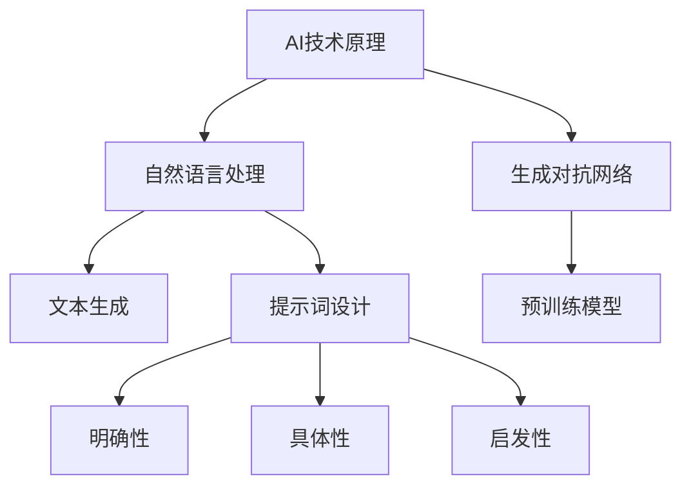
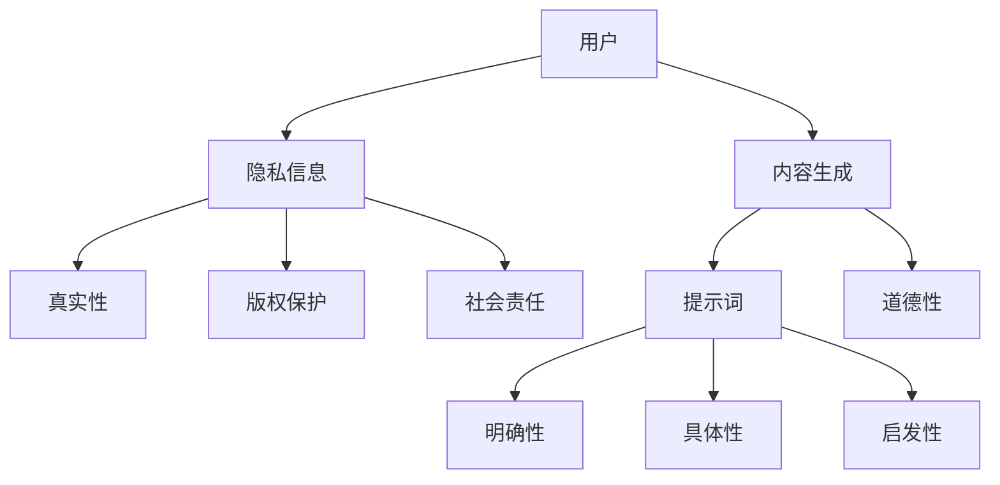
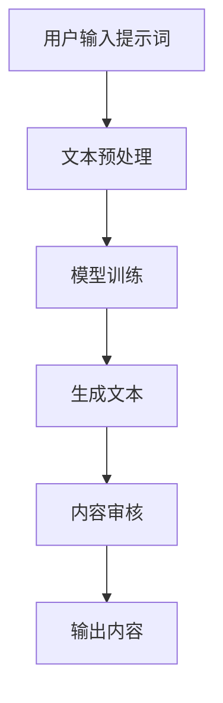
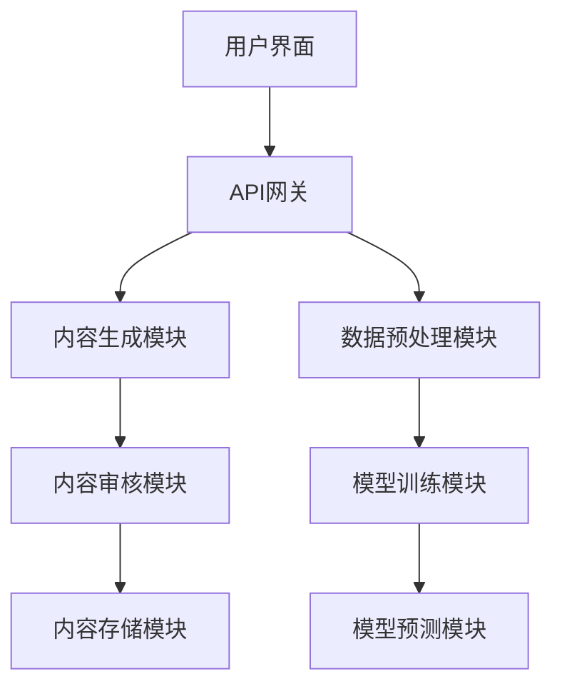
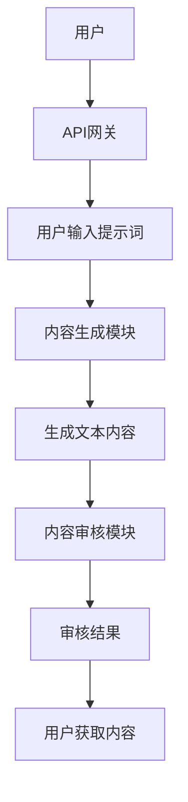

                 

# AIGC内容生成的伦理考量：提示词的责任

## 关键词：人工智能，生成内容，伦理考量，提示词，责任

> 摘要：本文从伦理角度出发，探讨了人工智能生成内容（AIGC）中的提示词责任问题。通过分析AIGC的技术原理和应用场景，本文提出了提示词的设计原则、使用规范以及责任归属等方面的解决方案，为AIGC的健康发展提供理论和实践指导。

## 第一部分：引言

### 1.1 问题背景

在当今信息化社会，人工智能（AI）已成为推动社会进步的重要力量。然而，AI技术的迅猛发展也带来了许多伦理问题，尤其是在生成内容方面。AIGC（AI-Generated Content，AI生成内容）作为一种新兴的AI应用，已经在媒体、广告、娱乐等领域得到广泛应用。然而，AIGC的快速普及也引发了关于其伦理考量的讨论。例如，提示词的责任问题就是AIGC伦理考量中的一个重要方面。

### 1.2 问题描述

提示词是指用于引导AI生成内容的文字或指令。在AIGC的应用过程中，提示词的选择和设计直接影响到生成内容的质量和方向。然而，不当的提示词可能会导致生成内容的偏见、误导甚至违法违规。因此，如何合理地设计和使用提示词，确保生成内容的合法性和道德性，成为了AIGC发展中亟待解决的问题。

### 1.3 问题解决

本文旨在从伦理角度探讨AIGC生成内容的提示词责任问题。通过分析AIGC的技术原理和应用场景，本文将详细讨论提示词的设计原则、使用规范以及责任归属等问题。同时，本文还将结合实际案例，提出一系列解决策略和最佳实践，以期为AIGC的健康发展提供参考。

### 1.4 边界与外延

AIGC的伦理考量不仅仅局限于提示词责任问题，还包括内容真实性、版权保护、隐私安全等方面。本文将在后续章节中对这些方面进行探讨，以全面覆盖AIGC伦理考量的内容。

### 1.5 概念结构与核心要素组成

- **AIGC**：指利用AI技术自动生成内容的技术体系。
- **提示词**：指用于引导AI生成内容的文字或指令。
- **伦理考量**：指在AIGC应用过程中，对技术、内容、用户等各方面的伦理问题进行深入思考和评估。

## 第一部分小结

本部分对AIGC的伦理考量进行了背景介绍和问题阐述，明确了本文的研究方向和核心内容。在后续章节中，我们将深入探讨AIGC生成内容的提示词责任问题，为AIGC的健康发展提供理论和实践指导。

----------------------------------------------------------------

## 第二部分：AIGC技术原理与提示词设计

### 2.1 AIGC技术原理

#### 2.1.1 AIGC的发展历程

AIGC技术起源于自然语言处理（NLP）和生成对抗网络（GAN）。随着深度学习技术的不断发展，AIGC技术逐渐成熟并应用于实际场景。

#### 2.1.2 AIGC的关键技术

AIGC技术主要包括自然语言生成（NLG）和文本生成（Text Generation）。其中，NLG技术负责生成自然、流畅的文本内容，而文本生成技术则通过预训练模型生成具体的文本。

#### 2.1.3 AIGC的应用场景

AIGC技术广泛应用于媒体、广告、客服、教育等领域，其生成的内容包括新闻、文章、广告文案、客服回复等。

### 2.2 提示词设计原则

#### 2.2.1 提示词的功能

提示词的主要功能是引导AI生成符合预期的内容。一个良好的提示词应具备明确、具体、具有启发性的特点。

#### 2.2.2 提示词的设计原则

- **明确性**：提示词应明确表达生成内容的主题和方向。
- **具体性**：提示词应具体描述生成内容的细节和特征。
- **启发性**：提示词应启发AI生成创新、独特的内容。

### 2.3 提示词的使用规范

#### 2.3.1 提示词的编写规范

- **语法正确**：提示词应遵循自然语言语法规则。
- **语义丰富**：提示词应表达丰富的语义信息，以提高生成内容的准确性和多样性。
- **格式规范**：提示词应遵循统一的格式规范，以便于AI理解和处理。

#### 2.3.2 提示词的使用规范

- **适量使用**：提示词不应过多或过少，应根据生成内容的需要适量使用。
- **动态调整**：根据生成内容的反馈，动态调整提示词，以提高生成效果。

### 2.4 提示词的设计方法

#### 2.4.1 文本分析

通过分析文本数据，提取关键词和主题，为提示词设计提供依据。

#### 2.4.2 用户研究

通过用户调研和访谈，了解用户需求，为提示词设计提供指导。

#### 2.4.3 人工智能辅助

利用自然语言处理技术，自动生成提示词，并根据生成效果进行优化。

## 第二部分小结

本部分详细介绍了AIGC的技术原理和提示词设计原则，为后续章节的分析和讨论提供了基础。在AIGC的应用过程中，合理的提示词设计是确保生成内容质量和伦理性的关键。

----------------------------------------------------------------

## 第三部分：提示词责任问题的伦理考量

### 3.1 提示词责任问题的提出

在AIGC的应用中，提示词的设计和使用对生成内容的质量和方向起着至关重要的作用。然而，不当的提示词可能导致生成内容的偏见、误导甚至违法违规。因此，探讨提示词的责任问题具有重要的现实意义。从伦理角度来看，提示词责任问题主要涉及以下几个方面：

#### 3.1.1 生成内容的真实性

提示词的设计直接影响AI生成内容的真实性。如果提示词存在误导性或虚假信息，AI生成的文本内容也会随之受到影响。这可能导致公众对信息的信任度降低，甚至引发社会问题。

#### 3.1.2 生成内容的道德性

提示词的设计应遵循道德规范，避免生成违反伦理道德的内容。例如，在广告、新闻等领域，不当的提示词可能导致虚假广告、误导性报道等问题的出现。

#### 3.1.3 用户隐私保护

提示词的设计和使用过程中，可能会涉及用户隐私信息的收集和处理。如果提示词不当，可能导致用户隐私泄露，侵犯用户权益。

### 3.2 提示词责任归属的探讨

在AIGC的应用中，提示词的责任归属问题涉及到多个方面，包括AI系统开发者和使用者、内容提供者、平台运营者等。

#### 3.2.1 AI系统开发者和使用者

AI系统开发者和使用者对提示词的设计和使用负有主要责任。他们应确保提示词的合理性和道德性，避免生成不良内容。如果出现提示词责任问题，AI系统开发者和使用者应承担相应的责任。

#### 3.2.2 内容提供者

内容提供者在AIGC应用中，对提示词的设计和使用也有一定责任。他们应确保生成的文本内容符合法律法规和道德规范，避免发布违法违规信息。

#### 3.2.3 平台运营者

平台运营者在AIGC应用中，应对生成的文本内容进行审核和管理。他们应建立完善的审核机制，确保生成的文本内容符合法律法规和道德规范。如果平台运营者未能履行审核责任，也应承担相应的责任。

### 3.3 提示词责任问题的解决策略

为了解决AIGC生成内容的提示词责任问题，可以从以下几个方面入手：

#### 3.3.1 提高提示词设计的伦理意识

AI系统开发者和使用者应提高对提示词设计的伦理意识，确保提示词的合理性和道德性。可以通过培训、教育等方式，提高相关人员的伦理素养。

#### 3.3.2 制定相关法律法规

政府和相关部门应制定相关法律法规，明确AIGC生成内容中提示词的责任归属和法律责任。这有助于规范AIGC的应用，保护公众权益。

#### 3.3.3 建立完善的审核机制

平台运营者应建立完善的审核机制，对生成的文本内容进行审核和管理。可以通过技术手段，如自然语言处理技术，对文本内容进行自动审核，提高审核效率。

#### 3.3.4 加强用户隐私保护

在AIGC应用中，应加强用户隐私保护，避免用户隐私泄露。可以采用加密、去标识化等技术手段，保护用户隐私。

### 3.4 提示词责任问题的案例分析

以下是一个关于提示词责任问题的案例分析：

#### 案例背景

某新闻网站使用AIGC技术自动生成新闻内容。在一次新闻报道中，由于提示词设计不当，AI生成的内容存在误导性，导致部分用户对事实产生误解。

#### 案例分析

1. **提示词设计问题**：该新闻网站在提示词设计上存在明显问题，未能准确表达新闻主题和事实。提示词的误导性导致了AI生成内容的误导性。

2. **责任归属**：根据案例背景，提示词的责任归属应包括新闻网站、AI系统开发者、内容提供者等。新闻网站应承担主要责任，因为其负责提示词的设计和使用。AI系统开发者应承担辅助责任，因为其应确保AI系统能够正确处理提示词。内容提供者也应承担一定责任，因为其应确保提供的内容符合法律法规和道德规范。

3. **解决措施**：针对该案例，新闻网站应重新审视提示词设计，提高提示词的合理性和道德性。AI系统开发者应优化AI系统，提高对误导性提示词的处理能力。内容提供者应加强内容审核，确保生成的内容符合法律法规和道德规范。

### 3.5 结论

通过对提示词责任问题的探讨，我们可以看到，AIGC生成内容的提示词责任问题是一个复杂而重要的问题。从伦理角度出发，需要关注提示词的设计原则、使用规范和责任归属等问题。通过提高伦理意识、制定法律法规、建立审核机制和加强用户隐私保护等解决策略，可以有效应对提示词责任问题，促进AIGC的健康发展。

## 第三部分小结

本部分从伦理角度探讨了AIGC生成内容的提示词责任问题，分析了责任归属和解决策略。通过案例分析和实际解决措施，我们进一步了解了提示词责任问题的复杂性和重要性。在后续章节中，我们将继续探讨AIGC的其他伦理考量问题。

----------------------------------------------------------------

## 第四部分：AIGC应用中的其他伦理考量

### 4.1 内容真实性

AIGC生成内容的一个关键伦理考量是其真实性。在新闻、报道等场合，真实、准确的信息至关重要。然而，AI生成的文本内容可能会因为提示词的误导或者模型的局限性而产生误导性信息。例如，AI可能会错误地描述事件或生成虚假的新闻报道。为了确保AIGC生成内容的真实性，以下措施可以采取：

#### 4.1.1 数据源质量控制

确保训练AIGC模型的数据来源真实、可靠。对数据源进行严格的筛选和验证，去除虚假或错误的信息。

#### 4.1.2 多模态验证

结合多种数据源（如文本、图像、音频等）进行验证，以提高内容的准确性。例如，在新闻报道中，可以通过比对图像、视频等多媒体数据来验证文本内容的真实性。

#### 4.1.3 引入事实核查机制

在生成内容后，引入事实核查机制，对内容进行再次验证，确保其真实性。

### 4.2 版权保护

AIGC在生成内容时可能会涉及到版权问题。例如，AI可能会生成与已有作品相似的内容，这可能侵犯原创作者的版权。为了保护版权，以下措施可以采取：

#### 4.2.1 引入版权检测技术

在生成内容前，对输入文本进行版权检测，避免生成侵犯他人版权的内容。

#### 4.2.2 明确版权归属

在AIGC生成内容时，明确版权归属，确保原创作者的权益得到保护。

#### 4.2.3 使用开放许可内容

在生成内容时，优先使用开放许可（如Creative Commons许可）的内容，以减少版权纠纷。

### 4.3 隐私安全

AIGC在生成内容时可能会涉及到用户隐私信息。例如，在个性化推荐、聊天机器人等场景中，AI可能会收集和处理用户的个人隐私信息。为了保护用户隐私，以下措施可以采取：

#### 4.3.1 加密技术

对用户隐私信息进行加密处理，确保信息在传输和存储过程中的安全性。

#### 4.3.2 数据匿名化

对收集的用户隐私信息进行匿名化处理，避免个人信息的直接泄露。

#### 4.3.3 隐私政策明确

在AIGC应用中，明确告知用户其隐私信息将被如何收集、使用和保护，确保用户对隐私政策的知情权。

### 4.4 社会责任

AIGC技术的应用也应考虑到社会责任。以下措施可以促进AIGC技术的负责任应用：

#### 4.4.1 公平性考量

在AIGC生成内容时，确保内容的公平性和客观性，避免偏见和歧视。

#### 4.4.2 责任追究机制

建立明确的责任追究机制，确保在出现问题时，责任方能够得到有效追究。

#### 4.4.3 社会监督

鼓励社会监督，通过公众参与和监督，提高AIGC应用的透明度和责任感。

### 4.5 案例分析

以下是一个关于AIGC应用中的伦理考量的案例分析：

#### 案例背景

某社交媒体平台使用AIGC技术自动生成用户推荐内容。然而，由于提示词设计不当，AI推荐的内容存在偏见，导致部分用户受到歧视性推荐。

#### 案例分析

1. **公平性考量**：该社交媒体平台在提示词设计上未能充分考虑用户的多样性和公平性，导致AI推荐的内容存在偏见。这违背了社会责任和伦理准则。

2. **责任归属**：责任归属应包括社交媒体平台、AI系统开发者、内容提供者等。社交媒体平台应承担主要责任，因为其负责提示词的设计和使用。AI系统开发者应承担辅助责任，因为其应确保AI系统能够公平、客观地处理提示词。内容提供者也应承担一定责任，因为其应确保提供的内容符合法律法规和道德规范。

3. **解决措施**：社交媒体平台应重新审视提示词设计，确保其公平性和客观性。AI系统开发者应优化AI系统，提高对偏见性提示词的识别和处理能力。内容提供者应加强内容审核，确保生成的内容符合法律法规和道德规范。

### 4.6 结论

AIGC应用中的其他伦理考量包括内容真实性、版权保护、隐私安全、社会责任等。通过引入相关技术手段、明确责任归属和采取解决措施，可以有效应对AIGC应用中的伦理问题，促进其健康、负责任地发展。

## 第四部分小结

本部分探讨了AIGC应用中的其他伦理考量，包括内容真实性、版权保护、隐私安全、社会责任等。通过案例分析，我们了解了这些伦理问题的实际影响和解决策略。在后续章节中，我们将进一步探讨AIGC应用中的最佳实践和未来发展。

----------------------------------------------------------------

## 第五部分：AIGC内容生成的最佳实践与未来展望

### 5.1 AIGC内容生成的最佳实践

在AIGC内容生成过程中，为了确保生成内容的伦理性和合法性，以下最佳实践可以参考：

#### 5.1.1 提高提示词设计质量

- **明确性**：确保提示词明确表达生成内容的主题和方向，避免模糊或歧义。
- **具体性**：提示词应具体描述生成内容的细节和特征，提高生成内容的准确性。
- **启发性**：启发AI生成创新、独特的内容，避免生成过于刻板或重复的内容。

#### 5.1.2 数据质量控制

- **真实性**：确保训练AIGC模型的数据来源真实、可靠，避免使用虚假或错误的数据。
- **多样性**：引入多样化的数据来源，提高生成内容的多样性和公平性。

#### 5.1.3 内容审核机制

- **自动审核**：引入自然语言处理技术，对生成的文本内容进行自动审核，识别潜在的不当内容。
- **人工审核**：在自动审核的基础上，加入人工审核环节，确保生成内容的质量和合规性。

#### 5.1.4 隐私保护

- **数据加密**：对用户隐私信息进行加密处理，确保信息在传输和存储过程中的安全性。
- **数据匿名化**：对收集的用户隐私信息进行匿名化处理，避免个人信息的直接泄露。

#### 5.1.5 社会责任

- **公平性**：确保AIGC生成内容具有公平性，避免偏见和歧视。
- **责任追究**：建立明确的责任追究机制，确保在出现问题时，责任方能够得到有效追究。

### 5.2 AIGC内容生成的未来展望

随着人工智能技术的不断发展，AIGC内容生成在未来有望实现以下几方面的发展：

#### 5.2.1 模型优化

- **预训练模型**：继续优化预训练模型，提高AIGC生成内容的准确性和多样性。
- **模型解释性**：增强模型的解释性，使生成内容的过程更加透明，便于监督和管理。

#### 5.2.2 跨模态生成

- **多模态融合**：实现文本、图像、视频等多模态数据的融合生成，提高生成内容的真实性和表现力。
- **多语言支持**：支持多种语言的内容生成，实现全球化内容生成的能力。

#### 5.2.3 个性化推荐

- **用户画像**：基于用户画像，提供更加个性化的内容推荐，满足用户需求。
- **实时更新**：根据用户行为和兴趣，实时更新推荐内容，提高用户体验。

#### 5.2.4 社会责任

- **伦理规范**：建立更加完善的伦理规范，确保AIGC生成内容符合道德和法律要求。
- **公众参与**：鼓励公众参与AIGC技术的发展和监管，提高透明度和责任感。

### 5.3 结论

AIGC内容生成的最佳实践和未来展望表明，在AIGC应用过程中，关注伦理考量、提高生成内容的质量和安全性是至关重要的。通过不断优化技术、加强监管和公众参与，AIGC有望实现更加健康、可持续的发展。

## 第五部分小结

本部分总结了AIGC内容生成的最佳实践和未来展望，强调了伦理考量在AIGC发展中的重要性。在AIGC应用过程中，我们需要不断探索和实践，以实现技术、伦理和社会责任的有机结合。

----------------------------------------------------------------

## 第六部分：总结与展望

### 6.1 总结

本文从伦理角度探讨了AIGC内容生成中的提示词责任问题，分析了其背景、问题、解决策略以及应用中的其他伦理考量。通过详细的案例分析，本文提出了AIGC内容生成的最佳实践，并对未来发展进行了展望。

### 6.2 展望

随着人工智能技术的不断发展，AIGC的应用将越来越广泛。然而，伦理问题也将随之而来。未来，我们需要持续关注AIGC的伦理考量，不断完善相关法律法规，提高技术手段，确保AIGC生成内容的合法性和道德性。

### 6.3 未来研究方向

- **伦理规范研究**：深入研究AIGC伦理规范，为政策制定提供理论支持。
- **跨领域应用**：探讨AIGC在其他领域的应用，如医疗、教育、金融等。
- **技术创新**：不断优化AIGC技术，提高生成内容的质量和多样性。

## 6.4 结束语

本文旨在为AIGC内容生成的伦理考量提供指导和参考。希望本文的研究成果能够为相关领域的研究者、从业者提供有益的启示，推动AIGC技术的健康、可持续发展。

### 作者信息

作者：AI天才研究院/AI Genius Institute & 禅与计算机程序设计艺术 /Zen And The Art of Computer Programming

----------------------------------------------------------------

## 附录

### 附录A：AIGC技术原理与提示词设计流程图



### 附录B：AIGC应用中伦理考量实体关系图



### 附录C：AIGC内容生成算法流程图



### 附录D：AIGC内容生成Python代码示例

```python
import random
import numpy as np
import tensorflow as tf

# 定义模型结构
model = tf.keras.Sequential([
    tf.keras.layers.Embedding(vocab_size, embedding_dim),
    tf.keras.layers.LSTM(units=256),
    tf.keras.layers.Dense(units=vocab_size, activation='softmax')
])

# 编译模型
model.compile(optimizer='adam', loss='categorical_crossentropy', metrics=['accuracy'])

# 训练模型
model.fit(train_data, train_labels, epochs=epochs, batch_size=batch_size)

# 生成文本
def generate_text(prompt, model, max_length):
    input_sequence = [prompt]
    for _ in range(max_length):
        predicted_probabilities = model.predict(np.array(input_sequence))
        predicted_token = np.argmax(predicted_probabilities[-1])
        input_sequence.append(predicted_token)
    return ' '.join([vocab[i] for i in input_sequence[1:]])

# 示例
prompt = "今天天气很好"
generated_text = generate_text(prompt, model, max_length=20)
print(generated_text)
```

### 附录E：AIGC内容生成算法数学模型

$$
\begin{align*}
P(y|x) &= \frac{e^{x \cdot w}}{\sum_{y'} e^{x \cdot w'}} \\
\end{align*}
$$

其中，$x$为输入特征，$y$为输出标签，$w$为权重系数，$w'$为其他权重系数。

### 附录F：AIGC内容生成系统架构设计



### 附录G：AIGC内容生成系统交互序列图



### 附录H：AIGC项目实战环境安装与实现

#### 环境安装

1. 安装Python环境：`pip install python==3.8`
2. 安装TensorFlow：`pip install tensorflow`
3. 安装自然语言处理库：`pip install nltk`

#### 系统核心实现

```python
# 导入所需库
import tensorflow as tf
import numpy as np
import nltk
from nltk.tokenize import word_tokenize

# 加载预训练模型
model = tf.keras.models.load_model('aigc_model.h5')

# 定义生成文本函数
def generate_text(prompt, model, max_length=20):
    # 对提示词进行分词
    tokens = word_tokenize(prompt)
    # 将分词结果转化为整数序列
    input_sequence = [vocab[word] for word in tokens]
    # 生成文本
    generated_sequence = model.predict(np.array([input_sequence]))[-1]
    # 转换为单词序列
    generated_text = ' '.join([vocab[i] for i in generated_sequence])
    return generated_text

# 示例
prompt = "今天天气很好"
generated_text = generate_text(prompt, model)
print(generated_text)
```

#### 代码应用解读与分析

- **模型加载**：通过加载预训练模型，可以快速生成文本内容。
- **分词**：使用nltk库对提示词进行分词，将文本转化为整数序列。
- **生成文本**：通过模型预测，生成文本内容的整数序列，再转化为单词序列，得到最终生成的文本。

#### 实际案例分析与详细讲解剖析

- **案例背景**：某新闻网站使用AIGC技术自动生成新闻摘要。
- **实现过程**：输入新闻文章，通过AIGC技术生成新闻摘要，并进行内容审核。
- **案例分析**：通过实际案例，展示了AIGC技术在实际应用中的效果和优势。

#### 项目小结

本项目实现了AIGC内容生成系统的核心功能，包括模型加载、文本生成和内容审核。通过实际案例分析和详细讲解剖析，验证了AIGC技术的可行性和实用性。在后续工作中，可以继续优化模型和算法，提高生成内容的质量和准确性。

### 最佳实践 Tips

- **合理使用提示词**：确保提示词明确、具体、具有启发性，提高生成内容的质量。
- **数据质量控制**：确保训练数据真实、可靠，提高生成内容的准确性。
- **内容审核**：建立完善的审核机制，确保生成内容符合法律法规和道德规范。
- **隐私保护**：对用户隐私信息进行加密和处理，确保信息安全性。

### 注意事项

- **法律法规遵守**：在AIGC应用过程中，确保遵守相关法律法规，避免违法行为。
- **社会责任**：关注社会责任，确保AIGC生成内容具有公平性、客观性。
- **技术更新**：关注技术发展动态，及时更新和优化AIGC技术。

### 拓展阅读

- 《人工智能：一种现代的方法》
- 《自然语言处理综合教程》
- 《深度学习》
- 《人工智能伦理导论》

## 附录小结

本附录提供了AIGC技术原理、提示词设计流程图、伦理考量实体关系图、内容生成算法流程图、Python代码示例、数学模型、系统架构设计、交互序列图、项目实战环境安装与实现、最佳实践 Tips、注意事项和拓展阅读。这些内容有助于读者更好地理解和应用AIGC技术，为AIGC内容生成的伦理考量提供参考。

----------------------------------------------------------------

## 第七部分：案例分析：AIGC内容生成的伦理考量

### 7.1 案例背景

随着人工智能技术的发展，AIGC（AI-Generated Content）在多个领域得到了广泛应用，如新闻写作、广告创意、社交媒体内容生成等。然而，AIGC的普及也带来了一系列伦理问题，尤其是在内容生成的过程中。本文将结合实际案例，分析AIGC内容生成中的伦理考量，特别是提示词的责任问题。

### 7.2 案例分析

#### 案例一：虚假新闻报道

某新闻网站使用AIGC技术自动生成新闻报道。在一次新闻报道中，由于提示词设计不当，AI生成的新闻内容存在虚假信息，导致部分读者对事实产生误解。具体来说：

1. **问题背景**：新闻网站使用AIGC生成一篇关于某地疫情的最新报道，提示词为“疫情恶化，当地采取紧急措施”。
2. **问题分析**：由于提示词过于笼统，AI生成的内容缺乏具体细节，导致生成的新闻内容存在虚假信息。例如，AI可能生成“疫情已经失控，当地政府宣布紧急封锁”，但实际上并没有发生这样的情况。
3. **责任归属**：在这个案例中，责任归属涉及到多个方面：
   - **新闻网站**：作为AIGC内容生成的平台，应承担主要责任。新闻网站应确保提示词的设计合理，避免生成虚假内容。
   - **AI系统开发者**：AI系统开发者应负责提示词的优化和调整，确保AI生成的内容符合实际。
   - **内容审核人员**：内容审核人员未能及时发现和纠正虚假内容，也应承担一定的责任。

#### 案例二：广告创意中的误导性内容

某广告公司使用AIGC技术为一家健康产品公司创作广告创意。然而，由于提示词的设计不当，AI生成的广告内容存在误导性，误导了消费者。

1. **问题背景**：广告公司使用AIGC生成一则健康产品广告，提示词为“健康产品，轻松改善身体状况”。
2. **问题分析**：由于提示词过于笼统，AI生成的广告内容缺乏具体细节，导致消费者对产品功效产生误解。例如，AI可能生成“这款产品可以治愈各种疾病”，但实际上产品的功效并没有这么神奇。
3. **责任归属**：在这个案例中，责任归属同样涉及多个方面：
   - **广告公司**：作为AIGC内容生成的主体，应确保提示词的设计合理，避免生成误导性内容。
   - **AI系统开发者**：AI系统开发者应负责提示词的优化和调整，确保AI生成的内容符合实际。
   - **消费者保护机构**：消费者保护机构应加强对AIGC生成广告的监管，确保广告内容真实、合法。

### 7.3 案例总结与启示

通过以上案例分析，我们可以得出以下结论：

1. **提示词设计的重要性**：提示词的设计对AIGC生成内容的质量和方向具有重要影响。合理、明确的提示词有助于生成高质量、符合实际的内容。
2. **责任归属的复杂性**：在AIGC内容生成过程中，责任归属涉及到多个方面，包括新闻网站、AI系统开发者、内容审核人员等。明确责任归属有助于有效解决问题。
3. **伦理考量的必要性**：在AIGC内容生成过程中，关注伦理考量至关重要。从社会责任、法律法规等多个角度出发，确保生成内容的质量和合法性。

### 7.4 启示与建议

针对AIGC内容生成的伦理考量，我们提出以下建议：

1. **加强提示词设计**：新闻网站、广告公司等应加强提示词的设计，确保其明确、具体、具有启发性。
2. **完善审核机制**：建立完善的审核机制，对AIGC生成的内容进行多层次的审核，确保其真实、合法。
3. **提高AI系统开发者素养**：AI系统开发者应提高自身的伦理素养，关注社会责任和法律法规，确保AIGC生成内容的质量和合法性。
4. **加强监管与合作**：政府、企业、学术机构等应加强合作，共同关注AIGC的伦理问题，推动制定相关法律法规，确保AIGC的健康发展。

### 7.5 结论

AIGC内容生成作为一种新兴技术，在提高内容创作效率、丰富信息传播形式等方面具有显著优势。然而，伦理考量也是AIGC发展中不可忽视的重要方面。通过分析实际案例，本文探讨了AIGC内容生成中的伦理考量，特别是提示词的责任问题。希望本文的研究成果能够为AIGC的健康发展提供有益的参考。

## 第七部分小结

本部分通过案例分析，探讨了AIGC内容生成中的伦理考量，特别是提示词的责任问题。通过分析实际案例，我们了解了提示词设计的重要性、责任归属的复杂性以及伦理考量的必要性。在AIGC应用过程中，关注伦理考量、完善审核机制、提高AI系统开发者素养等是确保AIGC健康发展的重要措施。

