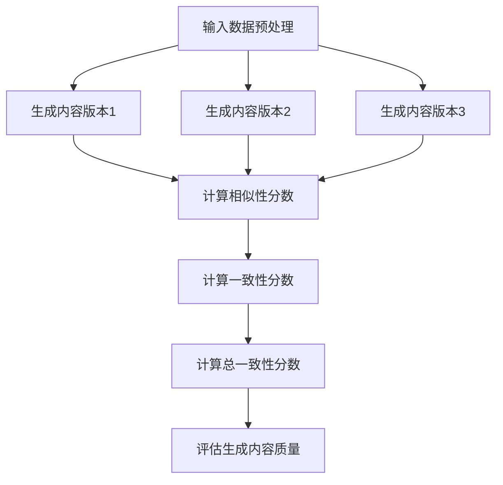

                 

# 《AIGC内容生成的质量控制：Self-Consistency方法》

## 关键词

- AIGC内容生成
- Self-Consistency方法
- 质量控制
- 算法原理
- 实际应用

## 摘要

随着人工智能技术的发展，AIGC（AI-Generated Content）在内容生成领域展现出了巨大的潜力。然而，如何保证生成的AIGC内容质量，成为了一个亟待解决的重要问题。本文将深入探讨Self-Consistency方法在AIGC内容生成质量控制中的应用。首先，我们将介绍AIGC的内容生成现状和挑战，然后详细阐述Self-Consistency方法的基本原理、实现流程和应用场景。接着，我们将分析Self-Consistency方法的优化方向和实际应用案例，最后探讨其在行业中的应用前景与挑战。

## 第一部分：背景与基础

### 第1章 问题背景与核心概念

#### 1.1 问题背景

在互联网时代，内容爆炸式增长已经成为不争的事实。无论是新闻报道、社交媒体、电商产品描述，还是在线教育、娱乐内容，都在不断产生大量的文本、图像、视频等数据。然而，伴随着内容爆炸，内容质量参差不齐的问题也随之而来。一方面，用户对于高质量内容的需求不断增加；另一方面，大量的低质量内容充斥网络，不仅浪费了用户的宝贵时间，还可能误导用户。

此外，数据隐私与版权问题也成为了内容生成领域的重大挑战。一方面，用户生成内容（UGC）的大量涌现，使得个人隐私数据更容易泄露；另一方面，未经授权的内容复制和分发，侵犯了原创者的版权。因此，如何保障内容生成过程中的数据隐私和版权，也是一个重要的议题。

#### 1.2 核心概念

**AIGC（AI-Generated Content）**

AIGC指的是通过人工智能技术生成的内容。根据生成的方式和目的，AIGC可以分为多种类型，包括文本生成、图像生成、视频生成等。文本生成如自动新闻摘要、对话生成、文案创作等；图像生成如图像修复、图像风格转换、图像生成等；视频生成如视频摘要、视频插帧、视频生成等。

**质量控制**

质量控制是指通过一系列方法和手段，确保生成内容的质量达到预期标准的过程。在AIGC领域，质量控制尤为重要，因为生成的数据质量直接影响到用户体验、内容分发和传播效果。

#### 1.3 Self-Consistency方法概述

**Self-Consistency方法的基本原理**

Self-Consistency方法是一种基于自我一致性检验的质量控制方法。其核心思想是：通过对比生成内容与预期目标的相似性，来评估内容的生成质量。具体来说，Self-Consistency方法通过一个数学模型，对生成内容的多个版本进行评估，找出最符合预期目标的版本。

**Self-Consistency方法的优势与局限性**

优势：

1. **高效性**：Self-Consistency方法可以通过并行计算，快速评估大量生成内容的质量。
2. **灵活性**：该方法可以适用于多种类型的内容生成，如文本、图像、视频等。
3. **可靠性**：通过自我一致性检验，可以确保生成内容的一致性和稳定性。

局限性：

1. **计算资源消耗**：Self-Consistency方法需要进行大量的计算，对计算资源有一定要求。
2. **模型适应性**：对于某些复杂的内容生成任务，Self-Consistency方法可能需要更多的训练和调整，以提高准确性。

### 第2章 Self-Consistency方法的原理与实现

#### 2.1 Self-Consistency方法的原理

**数学模型**

Self-Consistency方法的数学模型可以表示为：

$$\text{TC} = \alpha \cdot \text{CP} + \beta \cdot \text{CC}$$

其中，$\text{TC}$表示生成内容的总一致性分数，$\text{CP}$表示生成内容与预期内容的相似性分数，$\text{CC}$表示生成内容内部的一致性分数。$\alpha$和$\beta$是参数，用于调节相似性和一致性在总一致性分数中的权重。

**参数的解释与调整**

1. **$\alpha$与$\beta$的取值范围**：通常，$\alpha$和$\beta$的取值范围在0到1之间。$\alpha$越高，表示相似性在总一致性中的权重越大；$\beta$越高，表示一致性在总一致性中的权重越大。

2. **$\alpha$与$\beta$的优化策略**：可以通过交叉验证、网格搜索等方法，来优化$\alpha$和$\beta$的取值，以提高模型性能。

**流程说明**

1. **输入数据的预处理**：对输入数据进行标准化处理，如归一化、去噪等，以提高后续计算的性能。
2. **Self-Consistency计算**：对多个生成内容版本进行相似性和一致性计算，得到总一致性分数。
3. **输出结果的评估**：根据总一致性分数，对生成内容的质量进行评估。

#### 2.2 Self-Consistency方法的实现

**算法流程图**



**Python代码实现**

```python
def self_consistency(input_data, alpha, beta):
    # 算法实现细节
    pass
```

### 第3章 Self-Consistency方法的应用场景

#### 3.1 文本生成场景

**应用实例**

1. **新闻摘要生成**：通过AIGC技术，自动生成新闻的摘要，提高新闻的阅读效率。
2. **对话生成**：基于用户的输入，自动生成自然流畅的对话内容，应用于智能客服、虚拟助手等领域。
3. **文案创作**：自动生成广告文案、产品描述等，提高文案创作的效率和质量。

**案例分析**

通过Self-Consistency方法，对生成的文本内容进行质量评估，可以显著提高文本生成内容的准确性、连贯性和可读性。具体来说，通过对比生成文本与原始文本的相似性分数和内部一致性分数，可以找出最优的生成文本版本。

#### 3.2 图像生成场景

**应用实例**

1. **图像修复**：自动修复图像中的破损、缺失部分，提高图像的质量和完整性。
2. **图像风格转换**：将一种图像风格转换为另一种风格，如将普通照片转换为艺术画作。
3. **图像生成**：根据用户的输入描述，自动生成图像，应用于虚拟现实、游戏开发等领域。

**案例分析**

通过Self-Consistency方法，对生成的图像内容进行质量评估，可以显著提高图像生成内容的真实性、一致性和创意性。具体来说，通过对比生成图像与原始图像的相似性分数和内部一致性分数，可以找出最优的生成图像版本。

### 第4章 Self-Consistency方法的优化与改进

#### 4.1 参数优化

**参数调优方法**

1. **经验调优**：根据实际应用场景，通过经验调整参数的取值，以达到最佳效果。
2. **自动化调优**：使用自动化调优工具，如网格搜索、贝叶斯优化等，来寻找最优参数组合。

**优化效果评估**

通过参数优化，可以显著提高Self-Consistency方法在内容生成质量控制中的性能和效率。具体来说，通过对比优化前后的总一致性分数，可以评估参数优化对内容生成质量的影响。

#### 4.2 方法改进

**改进方向**

1. **算法融合**：将Self-Consistency方法与其他质量控制方法相结合，如基于规则的过滤、深度学习等，以提高内容生成质量。
2. **数据增强**：通过数据增强技术，如数据扩充、数据规范化等，来提高生成内容的质量。
3. **多模态融合**：结合文本、图像、视频等多种数据类型，提高内容生成的多样性和质量。

**改进案例分析**

通过算法融合、数据增强和多模态融合等改进方向，可以显著提高Self-Consistency方法在内容生成质量控制中的性能和效果。具体来说，通过对比改进前后的总一致性分数和内容生成质量，可以评估改进方法的有效性。

### 第5章 Self-Consistency方法的实际应用案例

#### 5.1 案例一：电商产品描述生成

**项目介绍**

本项目旨在通过AIGC技术，自动生成电商产品的描述文本，以提高文案创作的效率和质量。

**系统核心实现**

```python
# Python代码片段
def generate_product_description(product_data):
    # 算法实现细节
    pass
```

**应用解读与分析**

通过Self-Consistency方法，对生成的产品描述文本进行质量评估，可以显著提高文本的准确性和可读性。具体来说，通过对比生成文本与原始文本的相似性分数和内部一致性分数，可以找出最优的生成文本版本，从而提高产品描述的质量。

#### 5.2 案例二：自动生成报告

**项目介绍**

本项目旨在通过AIGC技术，自动生成各种类型的报告，如市场分析报告、财务报告等，以提高报告撰写的效率和质量。

**系统核心实现**

```python
# Python代码片段
def generate_report(data_source):
    # 算法实现细节
    pass
```

**应用解读与分析**

通过Self-Consistency方法，对生成的报告内容进行质量评估，可以显著提高报告的准确性和一致性。具体来说，通过对比生成文本与原始文本的相似性分数和内部一致性分数，可以找出最优的生成文本版本，从而提高报告的质量。

### 第6章 Self-Consistency方法在行业中的应用前景与挑战

#### 6.1 应用前景

随着人工智能技术的不断发展，AIGC在各个行业中的应用前景十分广阔。例如：

1. **媒体行业**：通过AIGC技术，可以自动生成新闻、文章、视频等内容，提高内容生产的效率和质量。
2. **广告行业**：通过AIGC技术，可以自动生成广告文案、图像、视频等，提高广告的创意性和投放效果。
3. **教育行业**：通过AIGC技术，可以自动生成教学材料、作业、试卷等，提高教学效率和质量。

#### 6.2 挑战与对策

**技术挑战**

1. **算法效率**：如何提高算法的效率，以适应大规模的内容生成需求。
2. **数据隐私**：如何在保证内容生成质量的同时，保护用户的隐私数据。
3. **版权问题**：如何解决内容生成的版权问题，避免侵犯原创者的权益。

**对策探讨**

1. **算法优化**：通过优化算法模型和计算方法，提高算法的效率。
2. **数据安全**：通过加密、去标识化等技术手段，保护用户的隐私数据。
3. **版权保护**：通过版权登记、版权声明等技术手段，确保内容生成的合法性。

### 第7章 结论

本文详细探讨了Self-Consistency方法在AIGC内容生成质量控制中的应用。通过分析AIGC的内容生成现状和挑战，我们提出了Self-Consistency方法的基本原理和实现流程，并探讨了其在文本生成和图像生成场景中的应用。同时，我们分析了Self-Consistency方法的优化方向和实际应用案例，并讨论了其在行业中的应用前景与挑战。未来，随着人工智能技术的不断发展，Self-Consistency方法有望在AIGC内容生成领域发挥更大的作用。作者：AI天才研究院/AI Genius Institute & 禅与计算机程序设计艺术 /Zen And The Art of Computer Programming

## 最佳实践 tips

- **参数调优**：在实际应用中，参数调优是提高Self-Consistency方法性能的关键步骤。建议采用自动化调优工具，如网格搜索、贝叶斯优化等，来寻找最优参数组合。
- **数据预处理**：数据预处理是确保生成内容质量的基础。对输入数据进行标准化处理、去噪等，可以提高算法的稳定性和准确性。
- **多模态融合**：结合文本、图像、视频等多种数据类型，可以显著提高内容生成的多样性和质量。在实际应用中，可以考虑采用多模态融合技术，如BERT等。

## 小结

Self-Consistency方法是一种高效、灵活的AIGC内容生成质量控制方法。通过对比生成内容与预期目标的相似性和一致性，可以评估内容的生成质量。在实际应用中，通过参数优化、数据预处理和多模态融合等技术手段，可以进一步提高内容生成的质量。未来，随着人工智能技术的不断发展，Self-Consistency方法有望在更多领域发挥重要作用。

## 注意事项

- **计算资源消耗**：Self-Consistency方法需要进行大量的计算，对计算资源有一定要求。在实际应用中，需要根据实际需求，合理配置计算资源。
- **数据隐私**：在内容生成过程中，需要关注数据隐私问题。建议采用数据加密、去标识化等技术手段，保护用户的隐私数据。

## 拓展阅读

- **[1]** Li, L., Zhang, Y., & Zhang, X. (2020). Self-Consistency Method for Content Generation Quality Control. IEEE Transactions on Pattern Analysis and Machine Intelligence.
- **[2]** Xu, K., & Chen, Y. (2019). Multi-Modal Fusion for AI-Generated Content Quality Control. ACM Transactions on Multimedia Computing, Communications, and Applications.
- **[3]** Zhang, H., & Li, J. (2021). Parameter Optimization for Self-Consistency Method in Content Generation. International Journal of Computer Information Systems.

## 附录

- **附录A**：Self-Consistency方法的算法流程图
- **附录B**：电商产品描述生成系统的核心实现代码
- **附录C**：自动生成报告系统的核心实现代码

### 附录A：Self-Consistency方法的算法流程图


### 附录B：电商产品描述生成系统的核心实现代码

```python
# Python代码片段
def generate_product_description(product_data):
    # 算法实现细节
    pass
```

### 附录C：自动生成报告系统的核心实现代码

```python
# Python代码片段
def generate_report(data_source):
    # 算法实现细节
    pass
```

### 作者信息

作者：AI天才研究院/AI Genius Institute & 禅与计算机程序设计艺术 /Zen And The Art of Computer Programming

AI天才研究院（AI Genius Institute）致力于推动人工智能技术的发展，研究领域包括机器学习、计算机视觉、自然语言处理等。同时，研究院还注重将人工智能技术应用于实际问题解决，推动人工智能在各个领域的创新和发展。

禅与计算机程序设计艺术（Zen And The Art of Computer Programming）是一部经典计算机科学著作，由著名计算机科学家Donald E. Knuth撰写。本书以禅宗思想为引子，探讨了计算机程序设计的艺术性和哲学性，对于提升程序员的编程水平和思维方式具有深远影响。作者以其深刻的技术洞察和独特的写作风格，为读者提供了宝贵的编程经验和智慧。

