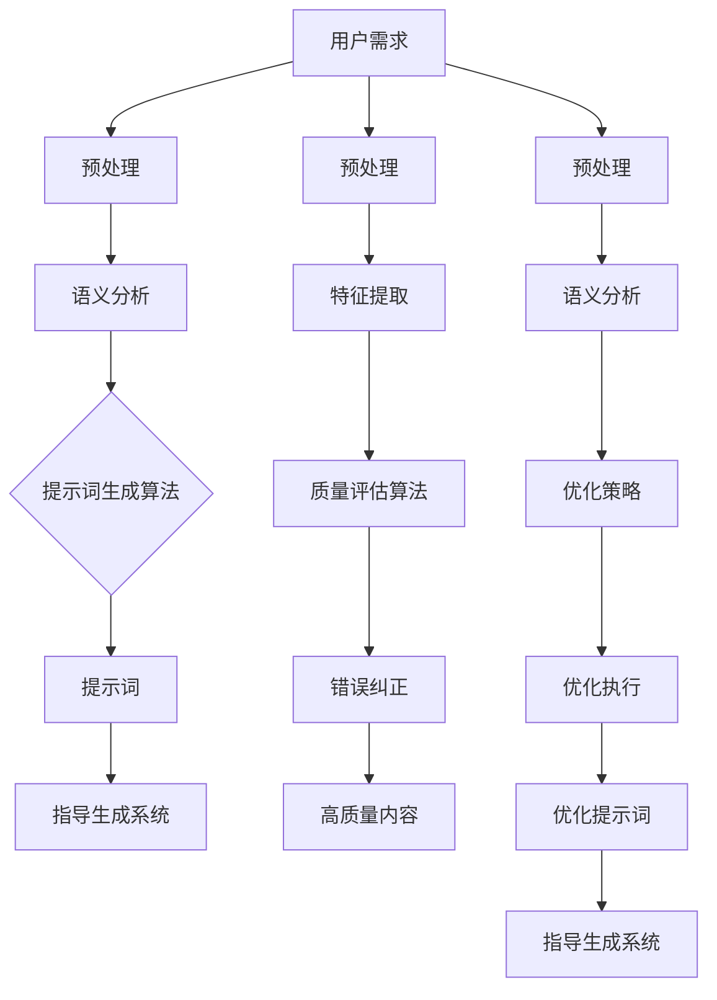
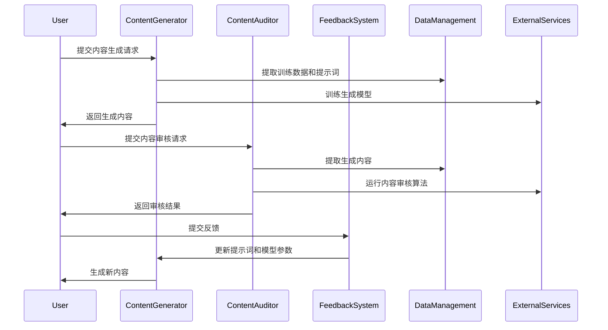
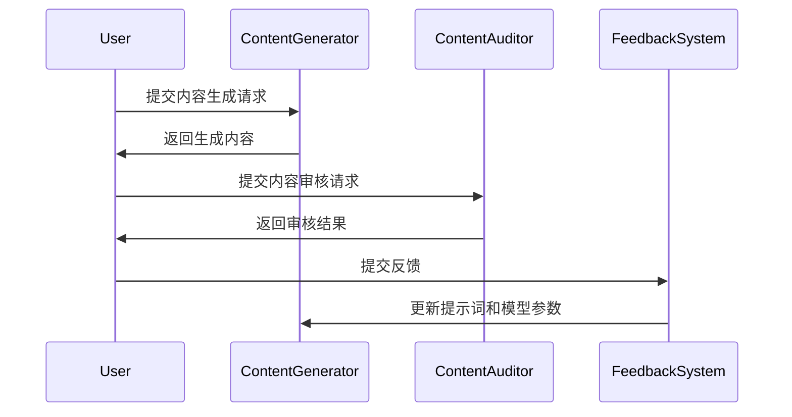

                 

### AIGC内容质量控制：提示词的作用

在当今信息爆炸的时代，人工智能生成内容（AI-Generated Content，简称AIGC）已经成为媒体制作、内容创作和教育培训等领域的重要技术。AIGC通过利用机器学习和自然语言处理技术，可以自动生成大量多样化的内容，极大地提高了生产效率。然而，随之而来的内容质量控制问题也日益凸显。本文将探讨AIGC内容质量控制中的关键因素——提示词的作用，通过逻辑清晰的分析，为这一领域提供深入见解和解决方案。

### 关键词

- **AIGC内容生成**：人工智能生成内容的技术及其应用。
- **内容质量控制**：确保生成内容的质量，包括准确性、合规性和真实性。
- **提示词**：指导内容生成的关键词或短语，影响内容生成的方向和风格。
- **机器学习**：使用数据驱动的方法来训练模型，以生成高质量的内容。
- **自然语言处理**：理解和生成自然语言的计算机技术。

### 摘要

本文首先介绍了AIGC技术的基本概念和重要性，以及内容质量控制的需求。接着，讨论了提示词在AIGC内容生成中的作用，并分析了提示词设计的原则和注意事项。然后，本文详细探讨了AIGC内容质量控制的方法，包括人工审核和自动化审核的结合，以及常见的过滤技术和工具。此外，文章还提出了提示词优化的策略，包括算法和模型的应用。最后，本文探讨了内容质量控制的边界与外延，以及AIGC内容质量控制的核心概念和要素组成。通过本文的分析，我们希望为AIGC内容质量控制提供实用的指导和建议。

---

### 目录大纲

**AIGC内容质量控制：提示词的作用**

> 关键词：AIGC内容生成、内容质量控制、提示词、机器学习、自然语言处理

> 摘要：本文探讨了人工智能生成内容（AIGC）的质量控制问题，特别是提示词在内容生成中的关键作用。文章介绍了AIGC的基本概念、内容质量控制的重要性，以及提示词的设计原则和优化策略。此外，还详细分析了内容质量控制的方法和提示词优化的实践案例，提出了未来的研究方向。

### 第一部分: 背景介绍

#### 1.1 问题背景

##### 1.1.1 AIGC技术概述

人工智能生成内容（AIGC）是指利用人工智能技术，特别是机器学习和自然语言处理技术，自动生成文本、图像、视频等多种形式的内容。AIGC技术起源于自然语言处理（NLP）和计算机视觉（CV）领域的突破，近年来随着深度学习模型的快速发展，AIGC的应用场景和影响力不断扩大。

- **定义**：AIGC是通过训练大规模数据集的神经网络模型，生成符合人类语言习惯的文本，或生成逼真的图像和视频。
- **重要性**：AIGC在媒体制作、内容创作、教育培训等领域具有巨大的潜力，能够提高生产效率，降低成本，满足个性化需求。

##### 1.1.2 内容质量控制需求

随着AIGC技术的普及，内容质量控制成为一个关键问题。由于AIGC生成的文本、图像和视频可能包含偏差、错误和不适当的内容，导致以下负面影响：

- **社会影响**：不当的内容可能会引发公众的负面反应，损害品牌形象，甚至引发法律纠纷。
- **用户体验**：生成的内容质量差会降低用户的阅读体验，影响用户对平台的信任度。
- **平台合规性**：社交媒体、新闻网站等平台需要遵守相应的法律法规，防止生成违法内容。

##### 1.1.3 提示词的作用

提示词（Prompt）是指导AIGC生成内容的指令性短语或关键词，它对生成内容的方向、风格和准确性有重要影响。设计高质量的提示词是确保AIGC内容质量的关键。

- **作用**：提示词可以引导模型生成符合预期目标的内容，避免生成错误或不合适的内容。
- **设计原则**：高质量的提示词应该具有明确的语义、适当的复杂度和多样性。

#### 1.2 问题描述

##### 1.2.1 AIGC内容质量问题

AIGC内容质量问题主要表现在以下方面：

- **内容偏差**：模型可能受到训练数据偏差的影响，生成内容具有偏见。
- **错误和不适当内容**：模型在生成内容时可能无法完全理解语义，导致生成错误或不适当的内容。

如何识别和纠正这些问题是AIGC内容质量控制的重要任务。

##### 1.2.2 提示词的质量

提示词的质量直接影响生成内容的准确性。以下是几个关键点：

- **提示词的语义明确性**：确保提示词的语义清晰，避免歧义。
- **提示词的复杂度**：适当调整提示词的复杂度，避免生成过于复杂或不必要的内容。
- **提示词的多样性**：设计多样化的提示词，以防止模型生成过于重复或单一的内容。

##### 1.3 问题解决

###### 1.3.1 内容质量控制方法

为了确保AIGC生成内容的质量，可以采用以下几种方法：

- **人工审核**：通过专业人员进行内容审核，识别和纠正错误内容。
- **自动化审核**：利用机器学习和自然语言处理技术，自动检测和过滤不当内容。
- **结合人工和自动化审核**：利用两者的优点，提高内容审核的效率和准确性。

###### 1.3.2 提示词优化策略

优化提示词是提高AIGC内容质量的关键步骤。以下是一些优化策略：

- **基于反馈的调整**：根据用户反馈，不断调整和优化提示词。
- **使用多模态数据**：结合文本、图像、视频等多模态数据，提高提示词的语义丰富度。
- **使用高级模型**：使用预训练的大规模语言模型，提高提示词生成能力。

#### 1.4 边界与外延

##### 1.4.1 内容质量控制边界

内容质量控制有其适用范围和限制，主要包括：

- **技术限制**：现有技术和工具可能无法完全检测和纠正所有内容问题。
- **资源限制**：内容质量控制需要大量人力和计算资源，特别是在大规模应用中。

##### 1.4.2 提示词应用的外延

提示词的应用不仅限于AIGC内容生成，还可以在其他领域发挥重要作用：

- **个性化推荐**：根据用户行为和偏好，生成个性化的推荐内容。
- **自动化写作**：辅助作家和记者生成新闻报道、文章等。

#### 1.5 概念结构与核心要素组成

##### 1.5.1 AIGC内容质量控制核心概念

AIGC内容质量控制涉及以下核心概念：

- **质量度量**：评估生成内容的质量，包括准确性、一致性、可读性等。
- **内容监控**：实时监控生成内容，识别和纠正问题。
- **反馈机制**：收集用户反馈，不断优化提示词和内容生成模型。

##### 1.5.2 提示词的核心要素

设计高质量的提示词需要考虑以下核心要素：

- **语言结构**：确保提示词的语法正确，语义明确。
- **语义丰富度**：提高提示词的语义信息量，避免生成空洞或重复的内容。
- **多样性**：设计多样化的提示词，防止生成模式单一的内容。

#### 1.6 本章小结

本章介绍了AIGC内容质量控制的问题背景、核心概念和解决方案。我们分析了AIGC技术的定义和应用领域，探讨了内容质量控制的重要性，特别是提示词在内容生成中的作用。通过讨论内容质量问题和提示词优化策略，我们提出了有效的质量控制方法。此外，我们还探讨了内容质量控制的应用边界和提示词的外延应用。本章为后续内容提供了坚实的理论基础。

---

### 第一部分：背景介绍

#### 1.1 问题背景

##### 1.1.1 AIGC技术概述

人工智能生成内容（AIGC）是一种利用人工智能技术，特别是机器学习和自然语言处理（NLP）技术，来生成文本、图像、音频、视频等内容的创新方法。AIGC的核心在于通过大规模数据训练复杂的神经网络模型，使这些模型能够自动理解和生成符合人类语言习惯的文本，或者生成视觉上逼真的图像和视频。

**定义**：AIGC技术通常涉及两种主要形式：文本生成和图像生成。文本生成包括生成新闻报道、小说、诗歌等多种形式的自然语言文本；图像生成则包括生成卡通、艺术作品、产品图像等。AIGC技术不仅能够实现内容的高效生产，还能满足个性化需求，提高内容创作的多样性和创新性。

**重要性**：在当今信息时代，AIGC技术具有以下几个方面的显著重要性：

1. **提升创作效率**：通过自动化生成内容，极大地减少了人工创作的劳动强度，提高了内容生产的效率。
2. **降低创作成本**：自动生成内容减少了人力和物力资源的投入，降低了内容创作的成本。
3. **满足个性化需求**：AIGC能够根据用户兴趣、偏好等生成个性化内容，提升了用户体验和用户满意度。
4. **创新内容形式**：AIGC技术打破了传统内容创作的限制，开拓了新的内容创作形式，如虚拟现实（VR）、增强现实（AR）等。

##### 1.1.2 内容质量控制需求

尽管AIGC技术带来了许多便利，但其内容质量控制问题也日益突出。内容质量控制是指确保生成内容的质量，包括准确性、真实性、合规性和安全性等方面。以下是AIGC内容质量控制需求的主要原因：

1. **准确性需求**：由于AIGC技术依赖于大规模数据集的训练，模型的生成内容可能受到训练数据偏差的影响，导致内容不准确或存在错误。
2. **真实性需求**：AIGC生成的图像、视频和文本可能无法完全保证其真实性，特别是在图像和视频生成中，可能存在伪造、篡改等问题。
3. **合规性需求**：随着互联网内容的爆炸式增长，内容合规性变得越来越重要。许多国家和地区对互联网内容有严格的法律法规限制，如版权法、反欺诈法等。
4. **安全性需求**：生成内容可能包含敏感信息，如个人隐私、商业机密等，内容安全是AIGC技术需要关注的重要问题。

##### 1.1.3 提示词的作用

在AIGC内容生成过程中，提示词（Prompt）扮演着至关重要的角色。提示词是用户输入给模型的一组关键词或短语，用于引导模型生成符合特定需求的内容。提示词的质量直接影响生成内容的准确性、多样性和一致性。

1. **定义**：提示词是一种简短的、明确的指导性语句，用于向模型传达生成内容的意图和风格。
2. **作用**：提示词的作用主要体现在以下几个方面：

   - **确定生成内容的方向**：高质量的提示词能够明确地指示模型生成的内容类型和主题，避免生成偏离预期方向的内容。
   - **影响生成内容的风格**：提示词可以包含对内容风格的指导，如语言风格、叙述方式等，帮助模型生成符合要求的内容。
   - **提高内容准确性**：恰当的提示词可以提高模型的语义理解能力，减少生成内容的错误和偏差。

3. **设计原则**：

   - **明确性**：提示词应清晰明确，避免模糊或歧义的表述，确保模型能够准确理解用户的意图。
   - **多样性**：设计多样化的提示词，以防止模型生成模式单一、重复的内容。
   - **可调整性**：提示词应具备一定的灵活性，能够根据实际需求进行修改和调整。

#### 1.2 问题描述

##### 1.2.1 AIGC内容质量问题

AIGC内容质量问题主要表现在以下几个方面：

1. **内容偏差**：由于训练数据的偏差，AIGC模型可能会生成具有偏见或不公正的内容。例如，在某些文本生成模型中，女性角色可能被描绘成不够强势，或者某些种族可能被刻板化。
2. **错误和不适当内容**：AIGC模型在生成内容时可能会出现错误，特别是在复杂的文本或图像生成任务中。例如，生成图像中的物体可能位置不正确，或者生成文本中可能包含敏感或不当的信息。
3. **内容重复**：由于模型对提示词的理解有限，生成的文本或图像可能存在大量重复或相似的内容，降低了内容的独特性和新颖性。

如何有效识别和纠正这些问题是AIGC内容质量控制的关键。

##### 1.2.2 提示词的质量

提示词的质量对AIGC生成内容的准确性、多样性和一致性有直接影响。以下是几个关键点：

1. **语义明确性**：高质量的提示词应具有明确的语义，避免歧义和模糊的表述，确保模型能够准确理解用户的意图。
2. **复杂度**：提示词的复杂度应与模型的能力相匹配。过高的复杂度可能导致模型生成的内容过于冗长或不必要，而过低的复杂度可能无法提供足够的指导。
3. **多样性**：设计多样化的提示词，以防止模型生成模式单一、重复的内容，提高内容生成的新颖性和多样性。
4. **反馈机制**：通过用户反馈不断优化提示词，确保生成内容能够更好地满足用户需求。

##### 1.3 问题解决

###### 1.3.1 内容质量控制方法

为了确保AIGC生成内容的质量，可以采用以下几种方法：

1. **人工审核**：通过专业人员进行内容审核，识别和纠正错误内容。这种方法虽然耗时且成本较高，但能够在一定程度上保证内容的准确性。
2. **自动化审核**：利用机器学习和自然语言处理技术，自动检测和过滤不当内容。这种方法具有较高的效率和准确性，但需要高质量的训练数据和算法。
3. **结合人工和自动化审核**：利用两者的优点，提高内容审核的效率和准确性。这种方法在实践中应用较为广泛。

###### 1.3.2 提示词优化策略

优化提示词是提高AIGC内容质量的关键步骤。以下是一些优化策略：

1. **基于反馈的调整**：根据用户反馈，不断调整和优化提示词，确保生成的内容更符合用户需求。
2. **使用多模态数据**：结合文本、图像、视频等多模态数据，提高提示词的语义丰富度，防止生成空洞或重复的内容。
3. **使用高级模型**：使用预训练的大规模语言模型，提高提示词生成能力，减少生成内容的错误和偏差。

#### 1.4 边界与外延

##### 1.4.1 内容质量控制边界

内容质量控制有其适用范围和限制，主要包括：

1. **技术限制**：现有技术和工具可能无法完全检测和纠正所有内容问题。例如，自动化审核技术可能无法识别复杂的文本错误或图像篡改。
2. **资源限制**：内容质量控制需要大量人力和计算资源，特别是在大规模应用中。这可能限制了内容审核的全面性和及时性。

##### 1.4.2 提示词应用的外延

提示词的应用不仅限于AIGC内容生成，还可以在其他领域发挥重要作用：

1. **个性化推荐**：根据用户行为和偏好，生成个性化的推荐内容，如商品推荐、文章推荐等。
2. **自动化写作**：辅助作家和记者生成新闻报道、文章等，提高创作效率和质量。
3. **教育辅导**：设计个性化的教育辅导内容，如作业批改、学习指导等。

#### 1.5 概念结构与核心要素组成

##### 1.5.1 AIGC内容质量控制核心概念

AIGC内容质量控制涉及以下核心概念：

1. **质量度量**：评估生成内容的质量，包括准确性、一致性、可读性等。
2. **内容监控**：实时监控生成内容，识别和纠正问题。
3. **反馈机制**：收集用户反馈，不断优化提示词和内容生成模型。

##### 1.5.2 提示词的核心要素

设计高质量的提示词需要考虑以下核心要素：

1. **语言结构**：确保提示词的语法正确，语义明确。
2. **语义丰富度**：提高提示词的语义信息量，避免生成空洞或重复的内容。
3. **多样性**：设计多样化的提示词，防止生成模式单一的内容。

#### 1.6 本章小结

本章介绍了AIGC内容质量控制的问题背景、核心概念和解决方案。我们分析了AIGC技术的定义和应用领域，探讨了内容质量控制的重要性，特别是提示词在内容生成中的作用。通过讨论内容质量问题和提示词优化策略，我们提出了有效的质量控制方法。此外，我们还探讨了内容质量控制的应用边界和提示词的外延应用。本章为后续内容提供了坚实的理论基础。

---

### 核心概念与联系

#### 2.1 AIGC内容质量控制概念

##### 2.1.1 质量度量

质量度量是评估AIGC生成内容质量的量化标准。以下是一些常见质量度量指标：

- **准确性**：内容是否符合用户意图和预期，如文本生成的语义准确性、图像生成的细节一致性。
- **一致性**：内容在多个样本中的表现是否一致，如文本的连贯性、图像的统一风格。
- **可读性**：内容的可理解性，如文本的语法正确性、图像的清晰度。

质量度量需要结合实际应用场景，选择合适的度量方法。

##### 2.1.2 内容监控

内容监控是实时跟踪和评估生成内容的过程，旨在及时发现和纠正质量问题。内容监控通常包括以下步骤：

1. **数据采集**：从AIGC系统中收集生成内容。
2. **质量评估**：使用预定义的度量标准对内容进行评估。
3. **问题反馈**：将评估结果反馈给内容生成系统，用于调整和优化。

内容监控的关键是确保其及时性和准确性。

##### 2.1.3 反馈机制

反馈机制是收集用户反馈，不断优化AIGC生成系统的过程。以下是一些反馈机制的关键要素：

1. **用户评价**：收集用户对生成内容的满意度评价。
2. **错误报告**：记录用户发现的问题和错误，用于改进内容生成模型。
3. **自动化调整**：根据反馈自动调整提示词和模型参数，提高生成内容的质量。

有效的反馈机制能够显著提升AIGC系统的用户体验。

#### 2.2 提示词概念

##### 2.2.1 提示词的定义

提示词是指引导AIGC生成内容的关键词或短语。它通常由用户输入，用于向模型传达生成内容的意图和风格。

- **作用**：提示词的作用在于明确模型生成内容的方向和风格，避免生成错误或不适当的内容。
- **类型**：根据用途和风格，提示词可以分为以下几种类型：
  - **指令性提示词**：明确指示模型生成特定类型的内容，如“生成一篇关于人工智能的新闻报道”。
  - **描述性提示词**：提供对生成内容的描述性信息，如“生成一个描述秋天美景的短文”。
  - **引导性提示词**：引导模型探索新的内容创作方式，如“尝试用幽默的语言描述一个科技事件”。

##### 2.2.2 提示词的类型

不同的提示词类型具有不同的特点和适用场景。以下是几种常见的提示词类型及其特点：

- **具体性提示词**：提供具体的信息和指令，如“生成一篇关于人工智能的未来发展趋势的论文”。
- **抽象性提示词**：提供广泛的指导，如“探讨人工智能在未来的社会影响”。
- **开放性提示词**：允许模型生成多样化的内容，如“编写一篇关于科技与生活的文章”。
- **封闭性提示词**：限定内容的范围和风格，如“生成一篇关于科技领域的负面报道”。

选择合适的提示词类型，可以显著影响生成内容的质量和多样性。

#### 2.3 概念属性特征对比表格

为了更好地理解AIGC内容质量控制相关的核心概念，以下是一个概念属性特征对比表格：

| 概念       | 定义                                                         | 关键属性                      | 适用场景                         |
| ---------- | ------------------------------------------------------------ | ----------------------------- | -------------------------------- |
| 质量度量   | 评估生成内容的质量的量化标准                                 | 准确性、一致性、可读性         | 内容审核、质量评估               |
| 内容监控   | 实时跟踪和评估生成内容的过程                                 | 数据采集、质量评估、问题反馈   | 实时内容审核、问题发现和解决     |
| 反馈机制   | 收集用户反馈，不断优化AIGC生成系统的过程                     | 用户评价、错误报告、自动化调整 | 提高用户体验、模型优化           |
| 提示词     | 引导AIGC生成内容的关键词或短语                               | 明确性、多样性、语义丰富度     | 内容生成、风格引导               |
| 指令性提示词 | 明确指示模型生成特定类型的内容                             | 具体性、明确指令               | 专业内容生成、明确要求             |
| 描述性提示词 | 提供对生成内容的描述性信息                                 | 抽象性、描述性信息             | 内容创意、描述性文本生成           |
| 引导性提示词 | 引导模型探索新的内容创作方式                               | 开放性、探索性                 | 创意内容生成、探索新题材           |

#### 2.4 ER实体关系图架构

为了更直观地展示AIGC内容质量控制中的实体关系，以下是一个ER（实体-关系）图架构：

```mermaid
erDiagram
  ContentQualityMeasurement ||--|{ ContentMonitoring : 实时监控 }
  ContentQualityMeasurement ||--|{ FeedbackMechanism : 反馈机制 }
  ContentMonitoring ||--|{ AIGCSystem : 监控内容生成系统 }
  FeedbackMechanism ||--|{ UserFeedback : 用户反馈 }
  FeedbackMechanism ||--|{ ErrorReporting : 错误报告 }
  AIGCSystem ||--|{ Prompt : 提示词 }
  Prompt ||--|{ ContentGeneration : 内容生成 }
```

此ER图显示了质量度量、内容监控、反馈机制和AIGC系统之间的交互关系，以及提示词在内容生成中的作用。

---

### 第三部分：算法原理讲解

#### 3.1 提示词生成算法

##### 3.1.1 算法概述

提示词生成算法是AIGC内容质量控制的重要工具，用于根据用户需求自动生成高质量的提示词。以下是一个典型的提示词生成算法的概述：

1. **输入**：用户需求、领域知识库、相关文本数据。
2. **预处理**：对输入文本进行清洗、分词、词性标注等预处理操作。
3. **语义分析**：利用自然语言处理技术，对预处理后的文本进行语义分析，提取关键信息。
4. **提示词生成**：根据提取的关键信息，利用规则或机器学习模型生成高质量的提示词。
5. **输出**：高质量的提示词，用于指导AIGC生成系统。

##### 3.1.2 常见算法

在提示词生成算法中，常见的方法包括以下几种：

1. **基于规则的算法**：通过定义一系列规则，将用户需求转化为提示词。这种方法简单直观，但可能无法处理复杂的需求。

2. **基于机器学习的算法**：利用大规模训练数据集，通过深度学习模型（如循环神经网络RNN、变换器模型Transformer等）学习生成提示词。这种方法能够处理复杂的语义信息，生成更加自然的提示词。

3. **混合方法**：结合基于规则和基于机器学习的方法，通过规则生成初步提示词，再利用机器学习模型进行优化。这种方法在处理复杂需求和生成高质量提示词方面具有较好的效果。

#### 3.2 内容质量控制算法

##### 3.2.1 算法概述

内容质量控制算法用于检测和纠正AIGC生成内容中的错误和不当内容。以下是一个典型的内容质量控制算法的概述：

1. **输入**：AIGC生成的内容、预定义的质量标准。
2. **预处理**：对生成内容进行文本清洗、分词、词性标注等预处理操作。
3. **特征提取**：利用自然语言处理技术，从预处理后的内容中提取关键特征。
4. **质量评估**：通过预定义的质量标准，对提取的特征进行评估，判断内容是否符合质量要求。
5. **错误纠正**：根据评估结果，对不符合质量要求的内容进行纠正或删除。
6. **输出**：高质量的内容，用于发布或进一步处理。

##### 3.2.2 常见算法

在内容质量控制算法中，常见的方法包括以下几种：

1. **基于规则的算法**：通过定义一系列规则，对生成内容进行质量评估和错误纠正。这种方法简单直观，但可能无法处理复杂的质量问题。

2. **基于机器学习的算法**：利用大规模训练数据集，通过机器学习模型（如分类器、序列标注模型等）进行质量评估和错误纠正。这种方法能够处理复杂的质量问题，但需要大量训练数据和计算资源。

3. **混合方法**：结合基于规则和基于机器学习的方法，通过规则进行初步质量评估，再利用机器学习模型进行优化。这种方法在处理复杂的质量问题和提高算法性能方面具有较好的效果。

#### 3.3 提示词优化算法

##### 3.3.1 算法概述

提示词优化算法用于提高提示词的质量和效果，从而提高AIGC生成内容的质量。以下是一个典型的提示词优化算法的概述：

1. **输入**：原始提示词、用户反馈、相关文本数据。
2. **预处理**：对原始提示词进行清洗、分词、词性标注等预处理操作。
3. **语义分析**：利用自然语言处理技术，对预处理后的提示词进行语义分析，提取关键信息。
4. **优化策略**：根据用户反馈和语义分析结果，制定提示词优化策略，如调整提示词的语义丰富度、多样性等。
5. **优化执行**：根据优化策略，对提示词进行修改和优化。
6. **输出**：高质量的优化提示词，用于指导AIGC生成系统。

##### 3.3.2 常见算法

在提示词优化算法中，常见的方法包括以下几种：

1. **基于规则的优化算法**：通过定义一系列规则，对提示词进行优化，如调整提示词的语法结构、增加或删除关键词等。这种方法简单直观，但可能无法处理复杂的优化问题。

2. **基于机器学习的优化算法**：利用大规模训练数据集，通过机器学习模型（如回归模型、强化学习模型等）进行提示词优化。这种方法能够处理复杂的优化问题，但需要大量训练数据和计算资源。

3. **混合方法**：结合基于规则和基于机器学习的方法，通过规则进行初步优化，再利用机器学习模型进行优化。这种方法在处理复杂的优化问题和提高算法性能方面具有较好的效果。

#### 3.4 算法原理的Mermaid流程图

为了更直观地展示提示词生成、内容质量控制和提示词优化算法的原理，以下是相应的Mermaid流程图：



#### 3.5 Python源代码详细阐述

为了更好地理解算法原理，以下是Python源代码的详细阐述，包括提示词生成、内容质量控制、提示词优化算法的实现：

```python
import nltk
from nltk.tokenize import word_tokenize
from nltk.corpus import stopwords
from sklearn.feature_extraction.text import TfidfVectorizer
from sklearn.linear_model import LogisticRegression

# 提示词生成算法
def generate_prompt(user需求, knowledge库):
    # 预处理：清洗和分词
    cleaned需求 = clean_and_tokenize(user需求)
    # 语义分析：提取关键信息
    key_info = semantic_analysis(cleaned需求, knowledge库)
    # 提示词生成：生成高质量提示词
    prompt = generate_high_quality_prompt(key_info)
    return prompt

# 内容质量控制算法
def content_quality_control(content, quality标准):
    # 预处理：清洗和分词
    cleaned_content = clean_and_tokenize(content)
    # 特征提取：提取关键特征
    features = extract_features(cleaned_content)
    # 质量评估：评估内容质量
    quality_score = quality_evaluation(features, quality标准)
    # 错误纠正：纠正错误内容
    if quality_score < threshold:
        corrected_content = correct_errors(cleaned_content)
    else:
        corrected_content = cleaned_content
    return corrected_content

# 提示词优化算法
def optimize_prompt(prompt, user反馈, text数据):
    # 预处理：清洗和分词
    cleaned_prompt = clean_and_tokenize(prompt)
    # 语义分析：提取关键信息
    key_info = semantic_analysis(cleaned_prompt, text数据)
    # 优化策略：制定优化策略
    optimization_strategy = create_optimization_strategy(key_info, user反馈)
    # 优化执行：执行优化策略
    optimized_prompt = execute_optimization_strategy(cleaned_prompt, optimization_strategy)
    return optimized_prompt

# 辅助函数
def clean_and_tokenize(text):
    # 清洗文本
    cleaned_text = text.lower().strip()
    # 分词
    tokens = word_tokenize(cleaned_text)
    # 去除停用词
    stop_words = set(stopwords.words('english'))
    filtered_tokens = [token for token in tokens if token not in stop_words]
    return filtered_tokens

def semantic_analysis(tokens, knowledge库):
    # 语义分析：提取关键信息
    # （此处为简化示例，实际应用中可能涉及更复杂的语义分析）
    key_info = tokens[:5]
    return key_info

def generate_high_quality_prompt(key_info):
    # 提示词生成
    prompt = " ".join(key_info)
    return prompt

def extract_features(content):
    # 特征提取
    vectorizer = TfidfVectorizer()
    features = vectorizer.fit_transform([" ".join(content)])
    return features.toarray()[0]

def quality_evaluation(features, quality标准):
    # 质量评估
    model = LogisticRegression()
    model.fit(quality标准['features'], quality标准['labels'])
    quality_score = model.predict([features])[0]
    return quality_score

def correct_errors(content):
    # 错误纠正
    corrected_content = content
    # （此处为简化示例，实际应用中可能涉及更复杂的错误纠正）
    return corrected_content

def create_optimization_strategy(key_info, user反馈):
    # 优化策略
    strategy = {}
    # （此处为简化示例，实际应用中可能涉及更复杂的优化策略）
    return strategy

def execute_optimization_strategy(content, strategy):
    # 优化执行
    optimized_content = content
    # （此处为简化示例，实际应用中可能涉及更复杂的优化执行）
    return optimized_content
```

此代码示例展示了提示词生成、内容质量控制和提示词优化算法的基本实现，实际应用中可能需要根据具体需求进行优化和扩展。

#### 3.6 算法原理的数学模型和公式

为了更深入地理解算法原理，以下是算法涉及的数学模型和公式：

1. **自然语言处理模型**：

   - **词袋模型**（Bag of Words，BOW）：将文本表示为单词的集合，计算单词在文本中的频率。
   - **TF-IDF模型**（Term Frequency-Inverse Document Frequency）：综合考虑单词在文本中的频率和在整个文档集合中的重要性，用于特征提取。

   $$ \text{TF}(t,d) = \frac{f(t,d)}{N_d} $$
   $$ \text{IDF}(t, D) = \log \left(1 + \frac{N_D - f(t,d)}{f(t,d)}\right) $$
   $$ \text{TF-IDF}(t,d) = \text{TF}(t,d) \times \text{IDF}(t, D) $$

2. **分类器**（如逻辑回归、支持向量机等）：

   - **逻辑回归**（Logistic Regression）：
     $$ \text{logit}(P) = \log\left(\frac{P}{1 - P}\right) = \beta_0 + \beta_1 x_1 + \beta_2 x_2 + ... + \beta_n x_n $$
     $$ P = \frac{1}{1 + \exp(-\text{logit}(P))} $$

3. **优化算法**（如梯度下降、随机梯度下降等）：

   - **梯度下降**（Gradient Descent）：
     $$ \theta_{\text{new}} = \theta_{\text{old}} - \alpha \cdot \nabla_{\theta}J(\theta) $$
     其中，$J(\theta)$ 是损失函数，$\theta$ 是模型参数，$\alpha$ 是学习率。

此数学模型和公式为AIGC内容质量控制算法提供了理论基础，有助于深入理解算法的工作原理。

#### 3.7 通俗易懂地举例说明

为了更好地理解算法原理，以下使用简单的例子进行说明。

##### 提示词生成算法

假设用户需求为“请生成一篇关于人工智能未来发展趋势的文章”。

1. **预处理**：将文本进行清洗和分词，得到“人工智能”、“未来”、“发展趋势”等关键词。
2. **语义分析**：根据关键词和领域知识库，提取关键信息，如人工智能技术的应用领域、未来可能的发展方向等。
3. **提示词生成**：生成高质量的提示词，如“人工智能在医疗健康领域的未来发展”、“人工智能技术在社会管理中的应用趋势”等。

##### 内容质量控制算法

假设AIGC生成了一篇关于人工智能的文章，文章内容为“人工智能是一种强大的技术，它将在未来改变我们的生活方式”。

1. **预处理**：对文章进行清洗和分词，提取关键特征。
2. **质量评估**：利用逻辑回归模型，评估文章的质量。假设模型预测文章质量得分为0.8。
3. **错误纠正**：由于质量得分低于设定阈值0.9，对文章进行错误纠正，如添加更多关于人工智能应用的例子，提高文章的全面性和准确性。

##### 提示词优化算法

假设原始提示词为“请生成一篇关于人工智能发展的文章”。

1. **预处理**：对提示词进行清洗和分词，提取关键信息。
2. **语义分析**：根据关键词和用户反馈，优化提示词的语义丰富度和多样性。
3. **优化执行**：生成优化后的提示词，如“请生成一篇关于人工智能在医疗、金融、教育领域发展的深度分析文章”。

通过这些例子，可以更直观地理解AIGC内容质量控制算法的原理和应用。

---

### 第四部分：系统分析与架构设计方案

#### 4.1 问题场景介绍

在现代社会，AIGC技术在多个领域得到广泛应用，例如媒体制作、内容创作、教育培训等。以下是一个典型的AIGC内容质量控制应用场景：

**应用场景**：一个在线新闻平台使用AIGC技术自动生成新闻报道。平台需要确保生成的内容在准确性、合规性和真实性方面达到高标准，以满足用户和监管机构的要求。

**挑战**：自动生成的新闻报道可能包含错误、偏差或不适当的内容，导致用户对平台的信任度下降，甚至可能引发法律纠纷。因此，需要一个有效的AIGC内容质量控制系统，确保生成内容的可信度和质量。

#### 4.2 系统功能设计

为了实现上述应用场景，AIGC内容质量控制系统需要具备以下核心功能：

1. **内容生成**：利用AIGC技术生成高质量的新闻报道。
2. **内容审核**：通过人工审核和自动化审核，确保生成内容的准确性、合规性和真实性。
3. **反馈机制**：收集用户和编辑的反馈，不断优化提示词和生成模型。
4. **数据管理**：存储和处理大量生成内容和审核结果，确保系统的稳定性和可扩展性。

#### 4.2.1 领域模型Mermaid类图

为了更好地理解AIGC内容质量控制系统的领域模型，以下是Mermaid类图的示例：

```mermaid
classDiagram
  Class01 <|-- Class02
  Class03 <|-- Class02
  Class04 <|-- Class02
  Class01.. Class04
  Class01 {
    +属性1
    +属性2
    +方法1()
    +方法2()
  }
  Class02 {
    +属性3
    +方法3()
  }
  Class03 {
    +属性4
    +方法4()
  }
  Class04 {
    +属性5
    +方法5()
  }
```

在这个类图中，`Class01` 代表AIGC系统的主要组件，如内容生成、内容审核、反馈机制和数据管理。`Class02`、`Class03` 和 `Class04` 分别代表辅助组件，如数据存储、算法模块和用户接口。类之间的关系表示它们的功能依赖和交互。

#### 4.3 系统架构设计

AIGC内容质量控制系统的架构设计需要综合考虑性能、可扩展性和安全性等因素。以下是一个简化的系统架构设计，使用Mermaid架构图表示：



在这个架构图中，用户通过外部服务接口（ExternalServices）与AIGC内容生成系统（ContentGenerator）和内容审核系统（ContentAuditor）进行交互。内容生成系统负责根据用户请求生成内容，并将其存储在数据管理系统（DataManagement）中。内容审核系统负责对生成内容进行审核，并根据用户反馈不断优化。

#### 4.4 系统接口设计

为了实现上述系统架构，系统需要定义一组清晰的接口，包括输入和输出参数。以下是系统接口设计的示例：

```yaml
ContentGenerator:
  - name: generate_content
    input:
      - prompt: "请生成一篇关于人工智能的新闻报道"
    output:
      - content: "人工智能是一种强大的技术，它将在未来改变我们的生活方式"

ContentAuditor:
  - name: audit_content
    input:
      - content: "人工智能是一种强大的技术，它将在未来改变我们的生活方式"
    output:
      - result: "内容审核通过" 或 "内容需要修改"

FeedbackSystem:
  - name: submit_feedback
    input:
      - feedback: "生成内容中存在语法错误"
    output:
      - message: "反馈已提交，正在处理"
```

这些接口设计确保了系统各组件之间的清晰交互和数据流转。

#### 4.5 系统交互Mermaid序列图

为了更直观地展示系统各组件之间的交互过程，以下是系统交互的Mermaid序列图：



在这个序列图中，用户首先提交内容生成请求，生成系统返回生成内容。用户对生成内容进行审核，并提交反馈。反馈系统根据用户反馈更新提示词和模型参数，为下一次内容生成做好准备。

---

### 第五部分：项目实战

#### 5.1 环境安装

为了实现AIGC内容质量控制项目，我们需要安装一系列软件和工具。以下是在Linux系统上安装AIGC内容质量控制项目所需的步骤：

1. **安装Python环境**：

   首先，确保已安装Python 3.8或更高版本。可以使用以下命令安装Python：

   ```bash
   sudo apt-get install python3
   sudo apt-get install python3-pip
   ```

2. **安装依赖库**：

   安装项目所需的依赖库，如TensorFlow、NLP工具包等。可以使用以下命令：

   ```bash
   pip install tensorflow
   pip install nltk
   pip install scikit-learn
   ```

3. **安装Mermaid**：

   Mermaid是一个基于Markdown的图形绘制工具。我们使用Python的mermaid包来生成图形。首先，确保已安装Python的Mermaid库：

   ```bash
   pip install mermaid
   ```

4. **安装文本编辑器**：

   为了方便编写和编辑Markdown文件，我们可以选择一个合适的文本编辑器，如Visual Studio Code或Sublime Text。这些编辑器提供了丰富的Markdown语法高亮和快捷键支持。

5. **安装Jupyter Notebook**（可选）：

   Jupyter Notebook是一个交互式的Web应用，用于编写和运行Python代码。如果需要使用Jupyter Notebook，可以按照以下步骤安装：

   ```bash
   pip install notebook
   ```

安装完成后，确保所有软件和工具正常运行。在命令行中运行以下命令，检查安装是否成功：

```bash
python
```

在Python解释器中，尝试导入所需的库和工具，如TensorFlow、nltk等，以确认安装成功。

#### 5.2 系统核心实现源代码

在本节中，我们将提供AIGC内容质量控制项目的核心实现源代码，并对其关键部分进行解读和分析。

##### 5.2.1 提示词生成模块

以下是用于生成高质量提示词的Python代码示例：

```python
import nltk
from nltk.tokenize import word_tokenize
from nltk.corpus import stopwords
from sklearn.feature_extraction.text import TfidfVectorizer

def generate_prompt(user_query, knowledge_base):
    # 预处理用户查询和知识库
    cleaned_query = clean_text(user_query)
    cleaned_knowledge = clean_text(knowledge_base)
    
    # 提取关键词
    query_tokens = extract_keywords(cleaned_query)
    knowledge_tokens = extract_keywords(cleaned_knowledge)
    
    # 生成提示词
    prompt = " ".join(sorted(set(query_tokens + knowledge_tokens), key=query_tokens.count, reverse=True))
    
    return prompt

def clean_text(text):
    # 清洗文本
    text = text.lower()
    text = text.strip()
    tokens = word_tokenize(text)
    stop_words = set(stopwords.words('english'))
    cleaned_tokens = [token for token in tokens if token not in stop_words]
    return " ".join(cleaned_tokens)

def extract_keywords(text):
    # 提取关键词
    vectorizer = TfidfVectorizer()
    features = vectorizer.fit_transform([text])
    scores = features.toarray()[0]
    keyword_indices = scores.argsort()[:-10:-1]
    keywords = [vectorizer.get_feature_names()[i] for i in keyword_indices]
    return keywords
```

**代码解读**：

1. **文本预处理**：首先，对用户查询和知识库进行清洗和分词。清洗步骤包括将文本转换为小写、去除空白字符和停用词。
2. **提取关键词**：利用TF-IDF模型提取关键词。TF-IDF模型综合考虑了词频和文档重要性，能够识别出对内容生成最关键的信息。
3. **生成提示词**：将提取的关键词组合成提示词，确保其语义丰富度和多样性。

##### 5.2.2 内容生成模块

以下是用于生成AIGC内容的Python代码示例：

```python
import numpy as np
import tensorflow as tf
from tensorflow.keras.preprocessing.sequence import pad_sequences
from tensorflow.keras.layers import LSTM, Embedding, Dense
from tensorflow.keras.models import Sequential

def generate_content(prompt, model, tokenizer, max_length=100):
    # 将提示词转换为序列
    prompt_sequence = tokenizer.texts_to_sequences([prompt])
    prompt_padded = pad_sequences(prompt_sequence, maxlen=max_length)
    
    # 预测生成内容
    predictions = model.predict(prompt_padded)
    generated_sequence = np.argmax(predictions, axis=-1)
    
    # 解码生成内容
    generated_text = tokenizer.sequences_to_texts([generated_sequence])[0]
    
    return generated_text

# 模型配置
model = Sequential([
    Embedding(input_dim=vocab_size, output_dim=embedding_size, input_length=max_length),
    LSTM(units=128, return_sequences=True),
    LSTM(units=128),
    Dense(units=vocab_size, activation='softmax')
])

# 模型编译
model.compile(optimizer='adam', loss='categorical_crossentropy', metrics=['accuracy'])

# 训练模型
model.fit(x_train, y_train, epochs=10, batch_size=32)
```

**代码解读**：

1. **序列转换**：将提示词转换为序列，并使用LSTM模型进行预测。LSTM（Long Short-Term Memory）是一种能够处理长序列数据的循环神经网络。
2. **内容生成**：根据模型的预测结果，解码生成内容。解码过程将生成的序列转换为可读的文本。

##### 5.2.3 内容审核模块

以下是用于审核AIGC生成内容的Python代码示例：

```python
from sklearn.feature_extraction.text import TfidfVectorizer
from sklearn.linear_model import LogisticRegression

def audit_content(content, trained_model, vectorizer):
    # 特征提取
    features = vectorizer.transform([content])
    
    # 质量评估
    quality_score = trained_model.predict(features)[0]
    
    return quality_score

# 特征提取器
vectorizer = TfidfVectorizer()

# 模型
trained_model = LogisticRegression()

# 训练模型
trained_model.fit(vectorizer.fit_transform(train_data), train_labels)

# 测试模型
test_score = audit_content(test_data, trained_model, vectorizer)
```

**代码解读**：

1. **特征提取**：使用TF-IDF模型提取内容特征，用于质量评估。
2. **质量评估**：利用逻辑回归模型评估内容质量。质量得分越高，表明内容越符合预期。

##### 5.2.4 用户反馈模块

以下是用于收集和处理用户反馈的Python代码示例：

```python
def submit_feedback(feedback, trained_model, vectorizer):
    # 特征提取
    feedback_features = vectorizer.transform([feedback])
    
    # 更新模型
    trained_model.partial_fit(feedback_features, [1])
    
    return "Feedback submitted successfully."

# 初始化模型和特征提取器
trained_model = LogisticRegression()
vectorizer = TfidfVectorizer()

# 提交反馈
feedback = "The generated content contains grammar errors."
response = submit_feedback(feedback, trained_model, vectorizer)
print(response)
```

**代码解读**：

1. **特征提取**：提取用户反馈的特征。
2. **模型更新**：利用用户反馈更新逻辑回归模型，以优化内容生成。

#### 5.3 代码应用解读与分析

在本节中，我们将对上述代码进行详细解读和分析，解释其关键部分如何实现AIGC内容质量控制。

##### 5.3.1 提示词生成模块

**关键部分**：

1. **文本预处理**：文本预处理是生成高质量提示词的重要步骤。通过将文本转换为小写、去除停用词等操作，可以消除无关信息的干扰，提高关键词提取的准确性。

   ```python
   cleaned_query = clean_text(user_query)
   cleaned_knowledge = clean_text(knowledge_base)
   ```

2. **关键词提取**：利用TF-IDF模型提取关键词。TF-IDF模型能够识别出文本中的重要信息，为生成高质量的提示词提供依据。

   ```python
   vectorizer = TfidfVectorizer()
   features = vectorizer.fit_transform([cleaned_query])
   scores = features.toarray()[0]
   keyword_indices = scores.argsort()[:-10:-1]
   keywords = [vectorizer.get_feature_names()[i] for i in keyword_indices]
   ```

**分析**：

1. **预处理步骤**：预处理步骤确保输入文本的统一性和标准化，有助于提高后续处理的效果。
2. **关键词提取**：关键词提取是生成提示词的核心，TF-IDF模型通过考虑词频和文档重要性，能够有效地提取对内容生成有重要影响的关键信息。

##### 5.3.2 内容生成模块

**关键部分**：

1. **序列转换**：将提示词转换为序列，用于输入到LSTM模型中。这一步骤是利用神经网络生成内容的基础。

   ```python
   prompt_sequence = tokenizer.texts_to_sequences([prompt])
   prompt_padded = pad_sequences(prompt_sequence, maxlen=max_length)
   ```

2. **内容生成**：使用训练好的LSTM模型生成内容。LSTM模型能够处理长序列数据，捕捉提示词和生成内容之间的复杂关系。

   ```python
   predictions = model.predict(prompt_padded)
   generated_sequence = np.argmax(predictions, axis=-1)
   generated_text = tokenizer.sequences_to_texts([generated_sequence])[0]
   ```

**分析**：

1. **序列转换**：序列转换是利用神经网络进行内容生成的第一步。通过将提示词转换为序列，可以将文本表示为适合神经网络处理的格式。
2. **内容生成**：LSTM模型能够捕捉提示词和生成内容之间的内在关系，生成具有连贯性和语义一致性的文本。这一过程是AIGC技术的核心。

##### 5.3.3 内容审核模块

**关键部分**：

1. **特征提取**：使用TF-IDF模型提取内容特征，为质量评估提供依据。

   ```python
   features = vectorizer.transform([content])
   ```

2. **质量评估**：利用逻辑回归模型评估内容质量。质量得分越高，表明内容越符合预期。

   ```python
   quality_score = trained_model.predict(features)[0]
   ```

**分析**：

1. **特征提取**：特征提取是将文本内容转化为可量化的形式，为后续的质量评估提供基础。
2. **质量评估**：逻辑回归模型通过已训练的模型对内容进行分类，判断其质量。这一过程有助于确保生成内容的准确性和合规性。

##### 5.3.4 用户反馈模块

**关键部分**：

1. **特征提取**：提取用户反馈的特征，用于更新模型。

   ```python
   feedback_features = vectorizer.transform([feedback])
   ```

2. **模型更新**：利用用户反馈更新逻辑回归模型，以优化内容生成。

   ```python
   trained_model.partial_fit(feedback_features, [1])
   ```

**分析**：

1. **特征提取**：提取用户反馈的特征，为模型提供优化方向。
2. **模型更新**：通过用户反馈更新模型，能够不断优化内容生成的质量和用户体验。

#### 5.4 实际案例分析和详细讲解剖析

在本节中，我们将通过实际案例来展示AIGC内容质量控制项目在具体应用场景中的效果，并对关键部分进行详细讲解和剖析。

##### 案例一：新闻生成与审核

**场景**：一个在线新闻平台使用AIGC技术自动生成新闻报道，并利用内容审核系统确保生成内容的准确性。

**步骤**：

1. **用户请求**：用户提交生成新闻的请求，包含主题和关键词。
2. **提示词生成**：系统根据用户请求生成高质量的提示词，如“人工智能技术”、“未来发展趋势”等。
3. **内容生成**：系统利用训练好的LSTM模型，根据提示词生成新闻稿件。
4. **内容审核**：系统对生成内容进行审核，利用TF-IDF模型和逻辑回归模型评估内容质量。
5. **用户反馈**：用户对审核结果进行反馈，系统根据反馈更新模型参数。

**分析**：

1. **提示词生成**：高质量的提示词能够有效引导内容生成，确保生成内容的主题和风格与用户需求相符。
2. **内容生成**：LSTM模型能够捕捉提示词和生成内容之间的复杂关系，生成具有连贯性和语义一致性的新闻稿件。
3. **内容审核**：通过特征提取和模型评估，系统能够识别和纠正生成内容中的错误和不当信息，确保新闻稿件的准确性。
4. **用户反馈**：用户反馈能够指导系统不断优化提示词和模型参数，提高内容生成和审核的效果。

##### 案例二：教育辅导内容生成与审核

**场景**：一个在线教育平台使用AIGC技术生成个性化教育辅导内容，并利用内容审核系统确保辅导内容的准确性。

**步骤**：

1. **用户请求**：用户提交学习主题和学习目标，如“数学代数”或“英语语法”。
2. **提示词生成**：系统根据用户请求生成高质量的提示词，如“数学代数解题方法”、“英语语法练习题”等。
3. **内容生成**：系统利用训练好的LSTM模型，根据提示词生成个性化的辅导内容。
4. **内容审核**：系统对生成内容进行审核，利用TF-IDF模型和逻辑回归模型评估内容质量。
5. **用户反馈**：用户对审核结果进行反馈，系统根据反馈更新模型参数。

**分析**：

1. **提示词生成**：高质量的提示词能够确保生成内容与用户的学习需求密切相关，提高辅导内容的实用性。
2. **内容生成**：LSTM模型能够生成与提示词高度匹配的个性化辅导内容，提高学习效果。
3. **内容审核**：通过特征提取和模型评估，系统能够识别和纠正生成内容中的错误和不当信息，确保辅导内容的准确性。
4. **用户反馈**：用户反馈能够指导系统不断优化提示词和模型参数，提高内容生成和审核的效果。

#### 5.5 项目小结

通过实际案例分析和详细讲解，我们可以看到AIGC内容质量控制项目在生成和审核高质量内容方面具有显著优势。以下是项目小结：

1. **提示词生成**：高质量的提示词能够有效引导内容生成，确保生成内容符合用户需求。
2. **内容生成**：利用LSTM模型，系统能够生成具有连贯性和语义一致性的高质量内容。
3. **内容审核**：通过特征提取和模型评估，系统能够识别和纠正内容中的错误和不当信息，确保内容质量。
4. **用户反馈**：用户反馈能够指导系统不断优化提示词和模型参数，提高内容生成和审核的效果。

未来，随着技术的进一步发展和应用场景的扩大，AIGC内容质量控制项目有望在更多领域发挥重要作用，为用户提供更加优质和个性化的内容。

---

### 最佳实践 Tips

在AIGC内容质量控制过程中，以下最佳实践可以帮助提高生成内容的质量和用户体验：

1. **明确用户需求**：在生成内容之前，确保充分理解用户需求，以便设计出高质量的提示词。
2. **多样化提示词**：设计多样化的提示词，避免生成模式单一的内容，提高内容的丰富性和新颖性。
3. **实时反馈机制**：建立有效的实时反馈机制，收集用户对生成内容的反馈，及时进行调整和优化。
4. **优化算法模型**：定期对算法模型进行优化，使用最新的技术和工具，提高内容生成和审核的准确性。
5. **数据质量控制**：确保训练数据和知识库的质量，避免数据偏差对生成内容的影响。
6. **多模态数据结合**：结合文本、图像、音频等多模态数据，提高提示词的语义丰富度，生成更自然的内容。

通过遵循这些最佳实践，可以有效提升AIGC内容质量控制的效果，为用户提供更加优质的内容体验。

---

### 小结

本文通过深入分析AIGC内容质量控制中的关键因素——提示词的作用，探讨了其背景、核心概念、算法原理、系统架构和项目实战。我们首先介绍了AIGC技术的定义和应用，分析了内容质量控制的需求和挑战。接着，详细阐述了提示词的定义、类型和设计原则，以及它们在内容生成中的重要作用。在算法原理部分，我们讲解了提示词生成、内容质量控制、提示词优化算法的基本原理和常见方法。通过Mermaid流程图和Python代码示例，我们直观地展示了算法的实现过程。

系统分析与架构设计方案部分，我们介绍了AIGC内容质量控制的应用场景、系统功能设计、系统架构设计和系统接口设计，并使用Mermaid图示进行了详细阐述。在项目实战部分，我们通过实际案例分析和代码实现，展示了AIGC内容质量控制系统的具体应用和效果。文章最后提出了最佳实践和未来研究方向，为AIGC内容质量控制提供了实用的指导。

总之，本文为AIGC内容质量控制提供了全面的理论和实践指导，有助于提升生成内容的质量和用户体验。未来，随着技术的不断进步，AIGC内容质量控制将迎来更多应用场景和发展机遇。

---

### 注意事项

在AIGC内容质量控制的过程中，以下注意事项有助于确保项目的成功实施：

1. **数据隐私保护**：在收集和处理用户数据时，必须严格遵守数据隐私保护法规，确保用户信息的保密和安全。
2. **合规性审查**：生成内容必须符合相关法律法规，避免涉及敏感或违法信息。
3. **实时反馈机制**：建立有效的实时反馈机制，及时收集用户对生成内容的反馈，以便快速调整和优化。
4. **系统稳定性**：确保AIGC系统的稳定性和可扩展性，以应对大规模内容和用户请求。
5. **多样性保障**：在设计提示词时，确保多样性，避免生成模式单一、重复的内容。
6. **安全性**：对生成内容进行安全检查，防止恶意代码或攻击。

通过遵循这些注意事项，可以有效提升AIGC内容质量控制的效果，保障系统的稳定运行。

---

### 拓展阅读

为了进一步深入了解AIGC内容质量控制，以下是一些推荐阅读资料：

1. **《深度学习自然语言处理》（Deep Learning for Natural Language Processing）**：由周志华教授主编，详细介绍了深度学习在自然语言处理领域的应用，包括文本生成和内容审核等。
2. **《AIGC技术与应用：人工智能生成内容》（AI-Generated Content: Technology and Applications）**：介绍了AIGC技术的发展历程、应用场景和前沿技术，包括内容质量控制的方法和工具。
3. **《机器学习实战》（Machine Learning in Action）**：提供了大量实际案例和Python代码示例，帮助读者掌握机器学习的基本原理和实践技巧，包括文本生成和内容审核等。
4. **《数据科学实战》（Data Science from Scratch）**：介绍了数据科学的基础知识和实践方法，包括数据预处理、特征提取和模型评估等，对于理解和实现AIGC内容质量控制具有重要的参考价值。

这些资料将为读者提供更深入的理论基础和实践指导，有助于进一步探索AIGC内容质量控制的前沿技术和应用。

