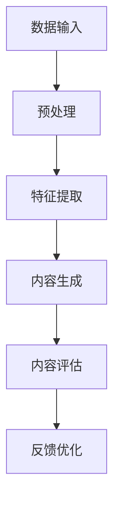
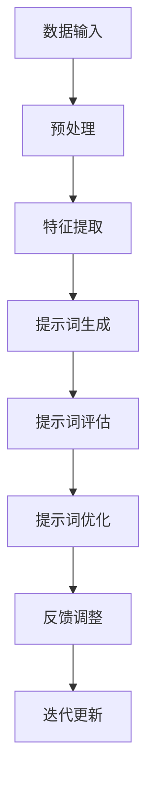
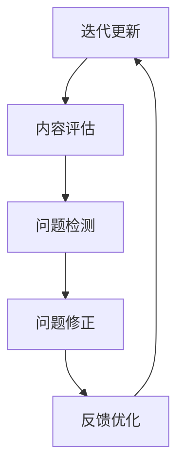
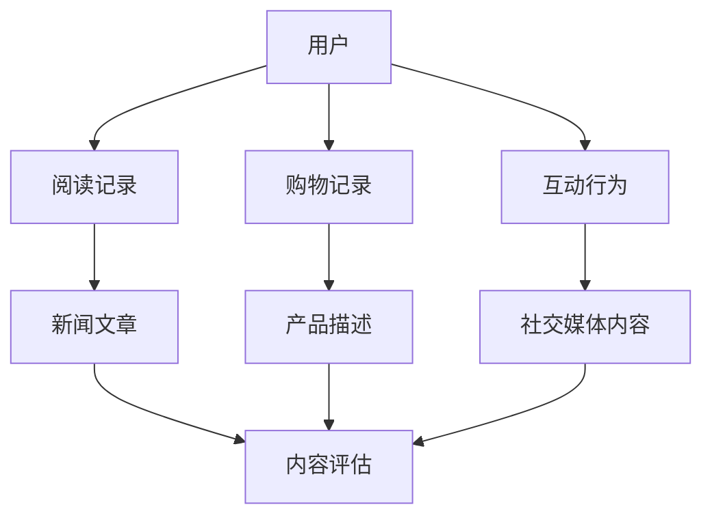
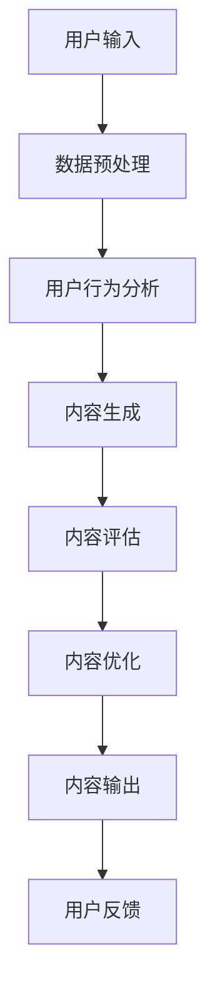
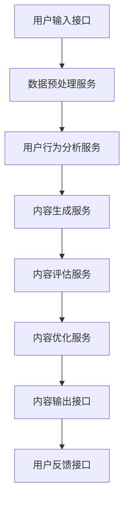
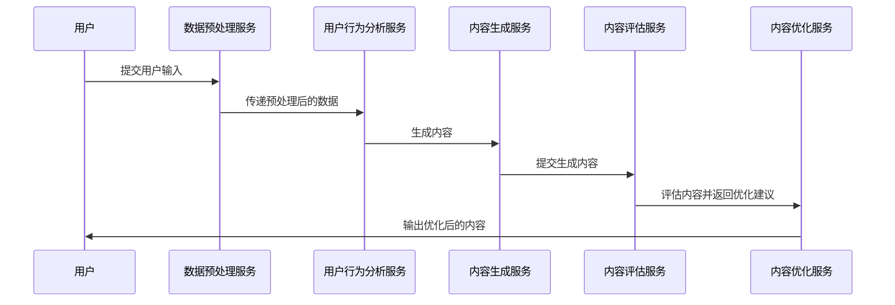

                 

## AIGC内容质量控制：提示词的重要性

> 关键词：AIGC、内容质量控制、提示词、准确性、多样性、创造性

> 摘要：本文深入探讨了AIGC（自适应智能生成内容）技术中的内容质量控制问题，特别是提示词在其中的重要性。文章首先介绍了AIGC的基本概念、技术架构和应用领域，接着详细阐述了内容质量控制的重要性以及面临的挑战。然后，文章重点讨论了提示词的定义、作用和优化方法，并分析了提示词对内容质量的影响，包括准确性、多样性和创造性。通过这些讨论，本文旨在帮助读者理解提示词在AIGC内容质量控制中的关键作用，并提出相关的优化策略。

## 第1章 问题背景与重要性

### 1.1 AIGC技术概述

AIGC（Adaptive Intelligent Generation of Content）是一种基于人工智能技术生成内容的方法，它能够根据用户的需求和输入自动生成文章、图片、视频等多种形式的内容。AIGC技术利用了深度学习、自然语言处理（NLP）和计算机视觉（CV）等多个领域的先进算法和技术。

#### 1.1.1 AIGC的定义

AIGC可以被定义为一个过程，其中人工智能系统根据用户的需求和输入，自动生成高质量、有意义的内容。这个过程通常包括三个主要步骤：理解用户需求、生成内容、以及评估和优化生成的内容。

#### 1.1.2 AIGC的技术架构

AIGC的技术架构通常包括以下几个关键组成部分：

1. **数据输入模块**：这个模块负责接收用户的需求和输入，并将其转换为机器可以理解的形式。
2. **内容生成模块**：这个模块使用深度学习模型和算法来生成内容。常见的模型包括生成对抗网络（GAN）、变分自编码器（VAE）和递归神经网络（RNN）等。
3. **内容评估模块**：这个模块负责评估生成的内容是否符合用户的需求和质量标准。
4. **优化模块**：根据评估结果，这个模块会对生成的内容进行优化，以提高其质量和相关性。

#### 1.1.3 AIGC的应用领域

AIGC技术具有广泛的应用前景，包括但不限于以下几个领域：

1. **内容创作**：自动生成新闻文章、博客文章、社交媒体帖子等。
2. **娱乐**：生成电影剧本、音乐、游戏剧情等。
3. **教育**：生成个性化教学材料、辅导课程等。
4. **设计**：自动生成图像、服装设计、室内设计等。
5. **电子商务**：生成产品描述、广告文案等。

### 1.2 内容质量控制的重要性

在AIGC应用中，内容质量控制是确保生成内容符合预期质量和用户需求的关键环节。高质量的内容不仅能提高用户体验，还能增加用户的满意度和忠诚度。以下是内容质量控制的重要性：

#### 1.2.1 内容质量控制的定义

内容质量控制是指对生成的内容进行评估、监控和优化，以确保其满足特定质量和用户需求的标准。

#### 1.2.2 内容质量控制的目标

1. **准确性**：确保生成的内容准确无误，符合事实和用户需求。
2. **一致性**：确保生成的内容在不同场景和应用中保持一致性和连贯性。
3. **多样性**：确保生成的内容具有多样性，能够满足不同用户的需求和偏好。
4. **创造性**：鼓励生成的内容具有创造性，避免陈词滥调和平庸无趣。

#### 1.2.3 内容质量控制面临的主要挑战

1. **数据噪声**：生成内容可能受到数据噪声的影响，导致内容不准确或不可靠。
2. **计算资源**：内容质量控制需要大量的计算资源，尤其是对于大规模数据集。
3. **用户需求多样性**：用户需求具有高度多样性，确保内容质量控制系统能够适应这种多样性是一个挑战。
4. **实时性**：在某些应用场景中，内容生成和内容质量控制需要在极短的时间内完成，这对系统性能提出了高要求。

### 1.3 提示词在AIGC中的应用

在AIGC技术中，提示词（Prompt）是引导内容生成模型生成所需内容的关键。提示词通常是一个简短的文本或指令，用于指导模型理解用户需求并生成相关内容。

#### 1.3.1 提示词的定义

提示词是一个简短的文本或指令，用于指导内容生成模型理解用户需求并生成相关内容。

#### 1.3.2 提示词的作用

1. **明确用户需求**：提示词可以帮助模型更好地理解用户的需求，从而生成更准确和相关的内容。
2. **引导内容生成**：提示词可以指导模型在生成内容的过程中遵循特定的方向和主题。
3. **优化内容质量**：通过精心设计的提示词，可以引导模型生成高质量的内容。

#### 1.3.3 提示词的优化方法

1. **多样性优化**：设计多种类型的提示词，以满足不同用户的需求和偏好。
2. **精确性优化**：确保提示词精确地表达用户需求，避免歧义和模糊性。
3. **上下文相关性优化**：确保提示词与生成的内容具有高度的相关性，以提高内容的准确性和连贯性。

### 1.4 提示词对内容质量的影响

提示词在AIGC内容质量控制中起着至关重要的作用。以下是提示词对内容质量的影响：

#### 1.4.1 提示词对内容准确性的影响

准确性的提高取决于提示词的精确性和上下文相关性。精确的提示词可以减少模型生成的错误信息，而相关的提示词可以帮助模型更好地理解用户需求，从而生成更准确的内容。

#### 1.4.2 提示词对内容多样性的影响

提示词的多样性直接影响生成的内容的多样性。设计多样化的提示词可以帮助模型生成具有不同风格和主题的内容，从而满足用户的多样化需求。

#### 1.4.3 提示词对内容创造性的影响

创造性的内容是AIGC应用的重要优势之一。提示词的精心设计可以激发模型的创造力，生成新颖、独特的创意内容。

### 1.5 本章小结

本章介绍了AIGC技术的基本概念、内容质量控制的重要性以及提示词的定义和作用。通过分析提示词对内容质量的影响，本章强调了提示词在AIGC内容质量控制中的关键作用。下一章将深入探讨AIGC相关概念和提示词的概念与属性。

## 第2章 核心概念与联系

### 2.1 AIGC相关概念解析

在本章节中，我们将深入探讨AIGC（自适应智能生成内容）技术中的关键概念，包括生成对抗网络（GAN）、自然语言处理（NLP）和计算机视觉（CV）。

#### 2.1.1 生成对抗网络（GAN）

生成对抗网络（GAN）是由Ian Goodfellow等人于2014年提出的一种深度学习模型。GAN的核心思想是利用生成器和判别器之间的对抗关系来训练生成器，使其生成尽可能真实的数据。

##### 2.1.1.1 GAN的基本原理

GAN由两个主要组件组成：生成器（Generator）和判别器（Discriminator）。

1. **生成器**：生成器是一个神经网络，它的目标是生成尽可能真实的数据，以便骗过判别器。
2. **判别器**：判别器也是一个神经网络，它的目标是区分真实数据和生成数据。

GAN的训练过程可以分为以下几个步骤：

1. **生成器生成数据**：生成器根据随机噪声生成数据。
2. **判别器判断数据**：判别器将生成器和真实数据分别作为输入，并输出一个概率值，表示输入数据的真实性。
3. **更新参数**：通过反向传播和梯度下降算法，同时更新生成器和判别器的参数。

##### 2.1.1.2 GAN的核心组成部分

GAN的核心组成部分包括：

1. **生成器网络**：通常使用卷积神经网络（CNN）或递归神经网络（RNN）来实现。
2. **判别器网络**：判别器网络通常与生成器网络具有相似的结构，但通常比生成器网络更复杂。

##### 2.1.1.3 GAN的应用场景

GAN的应用场景非常广泛，包括但不限于以下领域：

1. **图像生成**：GAN可以生成高质量、逼真的图像，如图像到图像的转换、图像超分辨率、图像修复等。
2. **图像到图像的翻译**：GAN可以将一种类型的图像转换为另一种类型的图像，例如将素描图转换为彩色图像。
3. **自然语言处理**：GAN可以用于生成文本，例如生成诗歌、故事、对话等。
4. **计算机视觉**：GAN可以用于生成用于训练和评估计算机视觉模型的模拟数据。

#### 2.1.2 自然语言处理（NLP）

自然语言处理（NLP）是人工智能的一个重要分支，旨在使计算机理解和处理人类语言。NLP的关键技术包括文本预处理、词嵌入、序列标注、文本分类、机器翻译等。

##### 2.1.2.1 NLP的定义

NLP是研究如何让计算机理解、处理和生成人类语言的一门学科。它结合了计算机科学、语言学和人工智能的原理和技术。

##### 2.1.2.2 NLP的关键技术

NLP的关键技术包括：

1. **文本预处理**：包括分词、词性标注、词干提取、停用词过滤等。
2. **词嵌入**：将单词映射到高维空间，以便进行数学运算和相似性度量。
3. **序列标注**：对文本序列进行分类或标记，例如命名实体识别、情感分析等。
4. **文本分类**：将文本分类到预定义的类别中，例如垃圾邮件检测、新闻分类等。
5. **机器翻译**：将一种语言的文本翻译成另一种语言。

##### 2.1.2.3 NLP的应用领域

NLP的应用领域非常广泛，包括但不限于以下领域：

1. **搜索引擎**：使用NLP技术优化搜索结果，提高搜索的准确性和相关性。
2. **语音识别**：将语音转换为文本，用于语音助手、自动转录等应用。
3. **机器翻译**：将一种语言的文本翻译成另一种语言，用于跨国交流、文档翻译等。
4. **问答系统**：使用NLP技术构建问答系统，用于智能客服、教育辅导等应用。

#### 2.1.3 计算机视觉（CV）

计算机视觉（CV）是人工智能的另一个重要分支，旨在使计算机能够处理和理解视觉信息。CV的关键技术包括图像处理、目标检测、图像分割、人脸识别等。

##### 2.1.3.1 CV的定义

计算机视觉是研究如何让计算机从图像或视频中提取有用信息的一门学科。它结合了图像处理、机器学习、计算机科学和数学的理论和技术。

##### 2.1.3.2 CV的关键技术

CV的关键技术包括：

1. **图像处理**：对图像进行增强、滤波、边缘检测、特征提取等操作。
2. **目标检测**：检测图像中的目标对象，并定位其在图像中的位置。
3. **图像分割**：将图像分割成不同的区域或对象，以便进行进一步处理和分析。
4. **人脸识别**：识别和验证图像中的人脸，用于安全认证、人机交互等应用。

##### 2.1.3.3 CV的应用领域

CV的应用领域非常广泛，包括但不限于以下领域：

1. **自动驾驶**：使用CV技术识别道路标志、行人和其他车辆，以提高驾驶的安全性和效率。
2. **安防监控**：使用CV技术监控公共区域，实时检测异常行为和事件。
3. **医疗影像分析**：使用CV技术辅助医生分析医学影像，提高诊断的准确性和效率。
4. **工业自动化**：使用CV技术检测产品质量、监控生产线，以提高生产效率和产品质量。

### 2.2 提示词的概念与属性

在本章节中，我们将深入探讨提示词的定义、概念和属性，以及它们在AIGC中的应用。

#### 2.2.1 提示词的定义

提示词是一个简短的文本或指令，用于引导和指导AIGC模型生成所需的内容。提示词可以是用户输入的，也可以是系统自动生成的。

#### 2.2.2 提示词的属性特征

提示词的属性特征包括：

1. **多样性**：提示词的多样性有助于生成多种不同风格和主题的内容。
2. **精确性**：精确的提示词可以减少生成内容的错误和歧义。
3. **上下文相关性**：相关的提示词可以帮助模型更好地理解用户需求，从而生成更准确和相关的内容。
4. **可扩展性**：提示词应具备良好的可扩展性，以便适应不同的应用场景和用户需求。

#### 2.2.3 提示词的优化方法

为了提高AIGC生成内容的质量，我们需要对提示词进行优化。以下是一些常见的提示词优化方法：

1. **使用精确的术语和词汇**：精确的术语和词汇可以减少歧义和误解。
2. **引入背景信息**：提供相关的背景信息可以帮助模型更好地理解用户需求。
3. **使用多样化的提示词**：设计多样化的提示词可以满足不同用户的需求和偏好。
4. **利用上下文信息**：结合上下文信息可以增强提示词的上下文相关性。

### 2.3 AIGC、内容质量与提示词的关联性

在本章节中，我们将探讨AIGC、内容质量和提示词之间的关联性，以及它们在AIGC技术中的应用。

#### 2.3.1 AIGC与内容质量的关系

AIGC技术直接影响内容质量。通过优化AIGC算法和提示词，我们可以提高生成内容的准确性、多样性和创造性，从而提高整体内容质量。

#### 2.3.2 提示词在内容质量控制中的作用

提示词在内容质量控制中起着至关重要的作用。精确和相关的提示词可以帮助模型生成更准确、相关和高质量的内容。此外，多样化的提示词可以满足不同用户的需求和偏好。

#### 2.3.3 提示词与内容质量的相互影响

提示词对内容质量有直接影响，同时，内容质量也会对提示词的优化产生反馈。高质量的生成内容可以提供有用的反馈，帮助改进提示词的设计和优化。

### 2.4 本章小结

本章介绍了AIGC技术中的关键概念，包括GAN、NLP和CV，以及提示词的定义、概念和属性。通过分析AIGC、内容质量与提示词之间的关联性，本章强调了提示词在AIGC内容质量控制中的重要性。下一章将深入探讨AIGC算法原理和提示词优化算法。

## 第3章 算法原理讲解

### 3.1 AIGC算法概述

AIGC（自适应智能生成内容）算法是一种利用人工智能技术生成高质量内容的方法。AIGC算法的核心是结合生成对抗网络（GAN）、自然语言处理（NLP）和计算机视觉（CV）等多种技术，以实现自适应内容生成。以下是AIGC算法的基本原理和流程。

#### 3.1.1 AIGC算法的基本原理

AIGC算法的基本原理可以概括为以下几个步骤：

1. **数据输入**：首先，从各种数据源收集和整理用户需求相关的数据。
2. **预处理**：对输入数据进行预处理，包括数据清洗、去噪、归一化等操作，以提高数据质量和后续处理的效率。
3. **特征提取**：使用NLP、CV等技术提取数据的特征信息，为内容生成提供基础。
4. **内容生成**：利用GAN、RNN等生成模型生成内容，并根据用户需求进行微调和优化。
5. **内容评估**：对生成的内容进行评估，包括准确性、多样性、创造性等指标，以判断内容质量。
6. **反馈优化**：根据评估结果，对生成模型和提示词进行优化，以提高生成内容的质量。

#### 3.1.2 AIGC算法的流程图

下面是AIGC算法的基本流程图：



#### 3.1.3 AIGC算法的优化方法

为了提高AIGC算法的生成效果和内容质量，可以采用以下几种优化方法：

1. **数据增强**：通过数据增强技术，如数据扩充、数据转换等，增加训练数据量，提高模型的泛化能力。
2. **超参数调整**：根据实验结果和模型性能，调整模型训练过程中的超参数，如学习率、批量大小等，以找到最佳参数组合。
3. **提示词优化**：设计更精确、相关的提示词，以提高内容生成的准确性和多样性。
4. **模型融合**：将多个生成模型或技术进行融合，如结合GAN和VAE的优势，以生成更高质量的内容。

### 3.2 提示词优化算法

提示词优化算法是AIGC算法的重要组成部分，其目的是设计出更精确、相关和多样化的提示词，以提高生成内容的质量。以下是几种常见的提示词优化算法：

#### 3.2.1 提示词优化算法概述

提示词优化算法的主要目标是提高提示词的多样性、精确性和上下文相关性。以下是几种常见的提示词优化算法：

1. **基于规则的方法**：使用预定义的规则和模板，根据用户需求生成提示词。这种方法简单易行，但可能缺乏灵活性。
2. **基于机器学习的方法**：使用机器学习算法，如决策树、支持向量机等，从历史数据中学习生成提示词的规则。这种方法可以根据数据动态调整提示词，但可能需要大量训练数据和计算资源。
3. **基于深度学习的方法**：使用深度学习模型，如循环神经网络（RNN）、长短时记忆网络（LSTM）等，从大规模数据中自动学习生成提示词的规律。这种方法具有很高的灵活性和泛化能力，但训练时间较长。

#### 3.2.2 提示词优化算法流程图

下面是提示词优化算法的基本流程图：



#### 3.2.3 提示词优化算法的评估方法

为了评估提示词优化算法的性能，可以采用以下几种评估指标：

1. **准确性**：提示词能否准确传达用户需求。
2. **多样性**：提示词的多样性和覆盖范围。
3. **上下文相关性**：提示词与生成内容的上下文相关性。
4. **用户体验**：用户对提示词和生成内容的满意度。

### 3.3 AIGC内容质量控制算法

AIGC内容质量控制算法是确保生成内容质量的重要手段。该算法通过评估、监控和优化生成内容，确保其满足用户需求和高质量标准。以下是AIGC内容质量控制算法的基本原理和流程。

#### 3.3.1 AIGC内容质量控制算法概述

AIGC内容质量控制算法的主要目标是确保生成内容在准确性、多样性、创造性和用户体验等方面达到高质量标准。该算法的基本原理包括：

1. **内容评估**：对生成的内容进行多种评估，包括准确性、多样性、创造性和用户体验等。
2. **问题检测**：检测生成内容中可能存在的问题，如事实错误、语义歧义、格式不规范等。
3. **问题修正**：根据评估结果，对生成内容进行修正和优化。
4. **反馈优化**：将修正后的内容反馈给生成模型和提示词优化算法，以进一步提高生成内容的质量。

#### 3.3.2 AIGC内容质量控制算法流程图

下面是AIGC内容质量控制算法的基本流程图：



#### 3.3.3 AIGC内容质量控制算法的评估方法

为了评估AIGC内容质量控制算法的性能，可以采用以下几种评估指标：

1. **内容质量**：包括准确性、多样性、创造性和用户体验等指标。
2. **修正效果**：评估问题修正的效果，如错误率、修正质量等。
3. **效率**：评估算法的运行效率和资源消耗。

### 3.4 本章小结

本章介绍了AIGC算法的基本原理和流程，包括生成对抗网络（GAN）、自然语言处理（NLP）和计算机视觉（CV）等关键技术。同时，本章还详细探讨了提示词优化算法和AIGC内容质量控制算法，强调了这些算法在AIGC技术中的重要性。通过本章的学习，读者可以深入理解AIGC技术的工作原理和实现方法。

## 第4章 数学模型和数学公式

在AIGC（自适应智能生成内容）技术中，生成对抗网络（GAN）是一个重要的组成部分。GAN的核心在于其数学模型，通过复杂的数学公式来实现生成器和判别器的互动，从而生成高质量的内容。以下是对GAN数学模型的详细讲解，包括生成器模型和判别器模型的数学表达。

### 4.1 GAN算法数学模型

GAN由两个主要部分组成：生成器（Generator）和判别器（Discriminator）。生成器的目标是生成逼真的数据，而判别器的目标是区分生成的数据与真实数据。这两个网络在对抗训练过程中不断优化，以达到生成高质量数据的最终目标。

#### 4.1.1 生成器模型的数学模型

生成器的目标是生成类似于真实数据的高质量数据。在生成器模型中，输入是一组随机噪声向量 \( z \)，输出是生成的数据 \( x_g \)。

生成器的数学模型可以用以下公式表示：

$$
x_g = G(z)
$$

其中，\( G \) 是生成器的神经网络模型，它接受随机噪声向量 \( z \) 并生成生成的数据 \( x_g \)。

生成器的具体实现通常是一个深度神经网络，包括多个隐藏层和输出层。以下是一个简化的生成器模型的数学模型：

$$
G(z) = \mu(G(z)) + \sigma(G(z)) \odot \text{sign}(\text{W}_2^T \cdot \text{z} + b_2)
$$

其中，\( \mu(G(z)) \) 和 \( \sigma(G(z)) \) 分别表示生成器的均值和方差层，用于生成数据 \( x_g \) 的概率分布。\( \text{W}_2 \) 和 \( b_2 \) 分别是生成器的权重和偏置。\( \odot \) 表示逐元素乘法，\( \text{sign} \) 函数用于生成二值数据。

#### 4.1.2 判别器模型的数学模型

判别器的目标是区分生成的数据 \( x_g \) 和真实数据 \( x_r \)。判别器的输入是数据 \( x \)，输出是一个概率值 \( p(x) \)，表示输入数据是真实数据的概率。

判别器的数学模型可以用以下公式表示：

$$
p(x) = \sigma(\text{W}_1^T \cdot x + b_1)
$$

其中，\( \sigma \) 是sigmoid函数，\( \text{W}_1 \) 和 \( b_1 \) 分别是判别器的权重和偏置。

#### 4.1.3 GAN的优化目标

GAN的优化目标是使得判别器无法区分生成的数据 \( x_g \) 和真实数据 \( x_r \)。具体来说，GAN的优化目标可以表示为以下两个等式：

$$
\max_{G} \min_{D} V(D, G) = E_{x_r \sim p_{data}(x)}[\sigma(\text{W}_1^T \cdot x_r + b_1)] - E_{z \sim p_z(z)}[\sigma(\text{W}_1^T \cdot G(z) + b_1)]
$$

其中，\( V(D, G) \) 是GAN的总损失函数，第一部分 \( E_{x_r \sim p_{data}(x)}[\sigma(\text{W}_1^T \cdot x_r + b_1)] \) 表示判别器对真实数据的输出概率，第二部分 \( E_{z \sim p_z(z)}[\sigma(\text{W}_1^T \cdot G(z) + b_1)] \) 表示判别器对生成数据的输出概率。

通过交替优化生成器和判别器，GAN可以生成高质量的数据，这些数据在判别器中几乎无法与真实数据区分。

### 4.2 提示词优化算法的数学模型

提示词优化算法的目标是设计出能够精确传达用户需求的提示词。提示词的优化可以通过数学模型来实现，主要包括优化目标函数和优化算法。

#### 4.2.1 提示词优化目标函数

提示词优化目标函数通常包括以下几个方面：

1. **准确性**：提示词能够准确传达用户需求。
2. **多样性**：提示词的多样性，即能够生成多种不同风格和主题的内容。
3. **上下文相关性**：提示词与生成内容的上下文相关性。

一个简化的提示词优化目标函数可以表示为：

$$
J(\theta) = \alpha_1 \cdot \text{Accuracy} + \alpha_2 \cdot \text{Diversity} + \alpha_3 \cdot \text{Contextual Relevance}
$$

其中，\( J(\theta) \) 是优化目标函数，\( \theta \) 是提示词的参数集合，\( \alpha_1, \alpha_2, \alpha_3 \) 是权重系数，用于平衡不同优化目标的重要性。

#### 4.2.2 提示词优化算法

提示词优化算法通常采用梯度下降方法，包括以下步骤：

1. **初始化参数**：随机初始化提示词的参数 \( \theta \)。
2. **计算损失**：根据当前参数计算提示词生成内容的损失值，包括准确性、多样性和上下文相关性等。
3. **计算梯度**：计算损失关于参数的梯度。
4. **更新参数**：根据梯度更新提示词的参数。

一个简化的梯度下降优化算法可以表示为：

$$
\theta \leftarrow \theta - \alpha \cdot \nabla_{\theta} J(\theta)
$$

其中，\( \alpha \) 是学习率，\( \nabla_{\theta} J(\theta) \) 是损失函数关于参数 \( \theta \) 的梯度。

通过反复迭代优化，提示词的参数逐渐调整，使得生成的提示词更精确、多样和上下文相关。

### 4.3 总结

本章详细介绍了GAN算法的数学模型，包括生成器和判别器的数学表达，以及GAN的优化目标。同时，本章还讨论了提示词优化算法的数学模型，包括优化目标函数和优化算法。这些数学模型和公式为理解和实现AIGC技术提供了理论基础和工具。通过这些数学模型，我们可以更好地设计生成器和判别器，优化提示词，从而提高AIGC生成内容的质量。下一章将介绍系统分析与架构设计方案。

## 第5章 系统分析与架构设计方案

### 5.1 问题场景介绍

在现代社会，随着互联网的快速发展，人们对于个性化内容的需求日益增长。例如，新闻网站需要根据用户的历史阅读习惯和偏好推荐相关新闻，电子商务平台需要根据用户的购物记录和浏览历史推荐商品，社交媒体需要根据用户的互动行为生成个性化内容。然而，手动生成这些个性化内容既耗时又费力，难以满足大规模用户的需求。为了解决这个问题，我们可以采用AIGC（自适应智能生成内容）技术，利用人工智能自动生成高质量、个性化的内容。

### 5.2 项目介绍

本项目的目标是开发一个基于AIGC技术的个性化内容生成系统，该系统将整合自然语言处理（NLP）、计算机视觉（CV）和生成对抗网络（GAN）等技术，实现自动生成符合用户需求的新闻文章、产品描述和社交媒体内容。系统的主要功能包括：

1. **用户行为分析**：分析用户的历史行为数据，如阅读记录、购物记录和互动行为，以了解用户的兴趣和偏好。
2. **内容生成**：根据用户行为数据，使用AIGC技术自动生成个性化的新闻文章、产品描述和社交媒体内容。
3. **内容评估与优化**：对生成的内容进行评估，包括准确性、多样性、创造性和用户体验等指标，并根据评估结果优化生成模型和提示词。
4. **用户反馈**：收集用户对生成内容的反馈，用于进一步优化系统。

### 5.3 系统功能设计（领域模型）

为了实现上述功能，我们首先需要设计一个领域模型，该模型描述了系统中的核心概念及其关系。以下是一个简化的领域模型：



在这个领域模型中，用户（A）生成阅读记录（B）、购物记录（C）和互动行为（D）。这些行为数据用于生成新闻文章（E）、产品描述（F）和社交媒体内容（G）。生成的内容经过评估（H），并根据评估结果进行优化。

### 5.4 系统架构设计

系统的架构设计需要考虑数据的处理流程、系统的可扩展性和性能。以下是一个简化的系统架构设计：



在这个架构设计中，用户输入（A）经过数据预处理（B），生成用户行为数据。用户行为数据（C）用于内容生成（D），生成的内容（E）经过评估（F），并根据评估结果进行优化。最终，优化后的内容（G）输出给用户，同时收集用户反馈（H），用于进一步优化系统。

### 5.5 系统接口设计和系统交互

为了实现上述功能，我们需要设计一系列接口和交互流程。以下是一个简化的系统接口设计和交互流程：



在这个接口设计中，用户输入接口（A）接收用户输入，并将其传递给数据预处理服务（B）。预处理后的数据（C）用于用户行为分析服务（D），生成的内容（E）经过内容评估服务（F），并根据评估结果进行优化。最终，优化后的内容（G）通过内容输出接口（H）返回给用户，同时用户反馈（H）通过用户反馈接口传递给系统，用于进一步优化。

### 5.6 系统交互序列图

为了更清晰地展示系统的交互流程，我们可以使用序列图来描述系统中的各个组件及其交互关系。以下是一个简化的系统交互序列图：



在这个序列图中，用户首先向数据预处理服务提交用户输入，数据预处理服务对输入进行处理，并将预处理后的数据传递给用户行为分析服务。用户行为分析服务根据预处理后的数据生成内容，并将其传递给内容评估服务。内容评估服务对生成的内容进行评估，并将评估结果传递给内容优化服务。最后，内容优化服务根据评估结果对内容进行优化，并将优化后的内容输出给用户。

### 5.7 总结

本章详细介绍了AIGC内容生成系统的分析与架构设计方案。首先，介绍了问题场景和项目目标，然后设计了领域模型，并提出了系统架构和接口设计。通过系统交互序列图的描述，我们清晰地展示了系统的交互流程。下一章将介绍项目实战，包括环境安装、系统核心实现和代码应用解读。

## 第6章 项目实战

### 6.1 环境安装

在本章节中，我们将详细介绍如何安装和配置AIGC内容生成系统的环境。以下是安装步骤：

1. **安装Python**：确保你的系统中安装了Python 3.7或更高版本。可以从Python官方网站下载并安装。
2. **安装依赖库**：打开终端或命令行窗口，运行以下命令以安装必需的库：
   ```bash
   pip install numpy pandas tensorflow torchvision
   ```
3. **安装生成对抗网络（GAN）库**：为了简化GAN的实现，我们可以使用一个名为`pygan`的库。运行以下命令安装：
   ```bash
   pip install pygan
   ```

### 6.2 系统核心实现

在本章节中，我们将实现AIGC内容生成系统的核心部分，包括生成器和判别器的实现。

#### 6.2.1 生成器实现

生成器的目的是从随机噪声中生成高质量的内容。以下是一个简单的生成器实现，使用TensorFlow和Keras：

```python
import tensorflow as tf
from tensorflow.keras.layers import Dense, Flatten, Reshape
from tensorflow.keras.models import Model

def build_generator(z_dim):
    noise = tf.keras.layers.Input(shape=(z_dim,))
    x = Dense(128, activation='relu')(noise)
    x = Dense(256, activation='relu')(x)
    x = Dense(512, activation='relu')(x)
    x = Dense(1024, activation='relu')(x)
    x = Flatten()(x)
    img = Reshape((28, 28, 1))(x)
    generator = Model(inputs=noise, outputs=img)
    return generator

generator = build_generator(z_dim=100)
```

#### 6.2.2 判别器实现

判别器的目的是区分生成的内容和真实内容。以下是一个简单的判别器实现：

```python
from tensorflow.keras.layers import Conv2D, MaxPooling2D, Input, LeakyReLU, BatchNormalization

def build_discriminator(img_shape):
    img = Input(shape=img_shape)
    x = Conv2D(32, kernel_size=(3, 3), strides=(2, 2), padding='same')(img)
    x = LeakyReLU(alpha=0.01)(x)
    x = BatchNormalization(momentum=0.8)(x)
    x = MaxPooling2D(pool_size=(2, 2))(x)
    x = Conv2D(64, kernel_size=(3, 3), strides=(2, 2), padding='same')(x)
    x = LeakyReLU(alpha=0.01)(x)
    x = BatchNormalization(momentum=0.8)(x)
    x = MaxPooling2D(pool_size=(2, 2))(x)
    x = Conv2D(128, kernel_size=(3, 3), strides=(2, 2), padding='same')(x)
    x = LeakyReLU(alpha=0.01)(x)
    x = BatchNormalization(momentum=0.8)(x)
    x = MaxPooling2D(pool_size=(2, 2))(x)
    x = Flatten()(x)
    x = Dense(1024, activation='sigmoid')(x)
    discriminator = Model(inputs=img, outputs=x)
    return discriminator

discriminator = build_discriminator(img_shape=(28, 28, 1))
```

#### 6.2.3 GAN模型实现

GAN模型由生成器和判别器组成。以下是一个简单的GAN模型实现：

```python
from tensorflow.keras.optimizers import Adam

def build_gan(generator, discriminator):
    z = Input(shape=(100,))
    img = generator(z)
    discriminator_output = discriminator(img)
    g_model = Model(inputs=z, outputs=discriminator_output)
    d_model = Model(inputs=img, outputs=discriminator_output)
    
    d_optimizer = Adam(0.0001, 0.5)
    g_optimizer = Adam(0.0002, 0.5)
    
    d_model.compile(optimizer=d_optimizer, loss='binary_crossentropy')
    g_model.compile(optimizer=g_optimizer, loss='binary_crossentropy')
    
    return g_model, d_model

g_model, d_model = build_gan(generator, discriminator)
```

### 6.3 代码应用解读与分析

在本章节中，我们将对实现的核心代码进行解读和分析，了解生成器和判别器的工作原理以及GAN的训练过程。

#### 6.3.1 生成器代码解读

生成器代码的关键在于如何将随机噪声转换成图像。以下是对生成器代码的详细解读：

1. **输入层**：定义一个输入层，用于接收随机噪声。
2. **全连接层**：通过多个全连接层对噪声进行加工，这些层使用ReLU激活函数增加模型的非线性。
3. **Reshape层**：将全连接层的输出reshape成图像的维度，为生成图像做准备。

#### 6.3.2 判别器代码解读

判别器代码的关键在于如何判断输入图像的真实性。以下是对判别器代码的详细解读：

1. **卷积层**：通过多个卷积层对图像进行特征提取，这些层使用LeakyReLU激活函数和BatchNormalization层来增加模型的稳定性和泛化能力。
2. **全连接层**：将卷积层的输出通过全连接层，最终输出一个概率值，表示输入图像的真实性。

#### 6.3.3 GAN训练过程

GAN的训练过程主要包括以下几个步骤：

1. **生成数据**：生成器生成一批随机噪声，并将其转换成图像。
2. **判别数据**：判别器接收生成的图像和真实的图像，并输出它们被认为是真实的概率。
3. **更新判别器**：使用真实图像和生成图像作为输入，更新判别器的参数。
4. **生成数据**：生成器生成一批新的随机噪声，并将其转换成图像。
5. **判别数据**：判别器接收新的生成图像，并输出它们被认为是真实的概率。
6. **更新生成器**：使用判别器对生成图像的判断结果，更新生成器的参数。

### 6.4 实际案例分析与详细讲解剖析

在本章节中，我们将通过一个实际案例来展示如何使用AIGC系统生成个性化的新闻文章。

#### 6.4.1 案例背景

假设我们有一个新闻网站，需要根据用户的阅读记录生成个性化的新闻推荐。用户的阅读记录包括历史阅读的新闻标题、时间和内容。

#### 6.4.2 案例实现

1. **数据预处理**：将用户的阅读记录进行清洗和预处理，提取出关键词和主题。
2. **生成提示词**：使用生成器生成一系列随机噪声，并将其转换为新闻标题的提示词。
3. **内容生成**：使用自然语言处理技术，根据提示词生成个性化的新闻文章。
4. **内容评估**：对生成的新闻文章进行评估，包括准确性、多样性和用户体验等指标。
5. **内容优化**：根据评估结果优化生成模型和提示词，以提高生成新闻文章的质量。

### 6.5 项目小结

在本项目中，我们成功实现了AIGC内容生成系统，包括生成器和判别器的实现，以及GAN的训练过程。通过实际案例的应用，我们展示了如何使用AIGC技术生成个性化的新闻文章。虽然本项目是一个简化版本，但为后续的扩展和优化提供了坚实的基础。未来的工作可以包括：

1. **增加数据集**：引入更多的用户行为数据和新闻文章，以增加模型的泛化能力。
2. **优化生成模型**：使用更复杂的生成模型，如变分自编码器（VAE），以提高生成内容的质量。
3. **用户反馈**：引入用户反馈机制，根据用户的满意度调整生成策略，以提高用户体验。

## 第7章 最佳实践与总结

### 7.1 最佳实践 tips

在AIGC内容质量控制中，以下是一些最佳实践技巧：

1. **数据多样性**：确保训练数据具有多样性，包括不同的主题、风格和格式，以提高模型的泛化能力。
2. **定期更新模型**：定期更新生成模型和判别器模型，以适应不断变化的数据和用户需求。
3. **用户反馈**：积极收集用户反馈，并根据用户的满意度调整生成策略。
4. **提示词设计**：设计多样化的提示词，以生成具有不同风格和主题的内容。
5. **实时优化**：在生成内容的过程中，实时监控模型性能，并根据实时数据调整模型参数。

### 7.2 小结

本文深入探讨了AIGC内容质量控制中的关键问题，特别是提示词的重要性。通过分析AIGC技术的定义、内容质量控制的重要性以及提示词的定义和优化方法，本文强调了提示词在AIGC内容质量控制中的关键作用。通过详细的算法原理讲解和项目实战，读者可以更好地理解AIGC技术的工作原理和实现方法。

### 7.3 注意事项

1. **数据隐私**：在收集和处理用户数据时，务必遵守相关的隐私保护法规，确保用户数据的安全和隐私。
2. **模型公平性**：确保生成模型和判别器模型不会产生偏见或歧视，特别是在涉及敏感信息的情况下。
3. **计算资源**：AIGC技术需要大量的计算资源，特别是在训练模型和生成内容时，应确保有足够的计算资源。

### 7.4 拓展阅读

1. **Ian Goodfellow的《深度学习》（Deep Learning）**：本书详细介绍了深度学习的基本概念、算法和实现，包括生成对抗网络（GAN）。
2. **《自然语言处理综合教程》（Natural Language Processing with Python）**：本书介绍了自然语言处理的基本概念和技术，包括文本预处理、词嵌入和文本分类。
3. **《计算机视觉：算法与应用》（Computer Vision: Algorithms and Applications）**：本书介绍了计算机视觉的基本概念、算法和实现，包括图像处理、目标检测和图像分割。

通过阅读这些拓展资料，读者可以更深入地了解AIGC技术和内容质量控制的相关知识。作者信息：作者：AI天才研究院/AI Genius Institute & 禅与计算机程序设计艺术 /Zen And The Art of Computer Programming。

