                 

### 文章标题

# AIGC在个人理财中的应用：AI财务顾问

> 关键词：AIGC、个人理财、AI财务顾问、自然语言处理、机器学习、深度学习、系统架构、算法原理

> 摘要：随着人工智能技术的快速发展，AIGC（人工智能生成内容）在个人理财领域逐渐崭露头角。本文将探讨AIGC在个人理财中的应用，特别是AI财务顾问的角色与功能。通过详细分析AIGC的关键技术、算法原理及系统架构，本文旨在为读者提供对AI财务顾问的全面理解，并探讨其在未来个人理财领域中的潜力与挑战。

### 第一部分：背景介绍与核心概念

#### 第1章：个人理财与AIGC概述

在现代社会，个人理财已经成为人们日常生活的重要组成部分。随着金融市场的不断发展和多样化，个人理财的需求也在不断增长。然而，传统的个人理财模式往往存在一些局限性，如信息不对称、市场变化难以预测等。为了解决这些问题，金融科技（FinTech）迅速崛起，特别是人工智能（AI）技术的应用，为个人理财带来了全新的机遇。

AIGC，作为AI领域的一个重要分支，通过生成内容和数据，能够提供个性化、智能化的服务。AIGC在个人理财中的应用主要体现在AI财务顾问上，它通过分析用户的财务状况、投资偏好和市场动态，为用户提供投资建议和理财规划。这一新兴领域不仅提高了理财服务的效率和质量，还极大地改变了人们对待财务的态度和行为。

在本章节中，我们将首先探讨个人理财的现状与挑战，接着介绍AIGC的定义与核心概念，并重点介绍AI财务顾问的基本原理和功能。最后，我们将简要概述本书的结构和内容安排。

---

## 1.1 个人理财的现状与挑战

### 1.1.1 个人理财的重要性

个人理财不仅关乎个人的经济安全，还影响到生活的各个方面。通过合理的理财规划，人们可以更好地应对突发状况，实现长期目标，如教育、购房、退休等。因此，个人理财在现代社会中具有重要的地位。

### 1.1.2 传统个人理财模式的局限性

尽管个人理财需求不断增长，但传统的理财模式存在明显的局限性：

1. **信息不对称**：用户难以获取全面、准确的市场信息，容易受到误导。
2. **专业性不足**：普通用户缺乏专业的理财知识和经验，难以做出明智的决策。
3. **市场变化难预测**：金融市场波动大，投资者难以准确预测市场走势。
4. **时间和成本**：传统的理财服务往往需要耗费大量时间和精力，且成本较高。

### 1.1.3 金融科技的发展对个人理财的影响

金融科技（FinTech）的发展为个人理财带来了新的解决方案。通过利用大数据、云计算、区块链等技术，金融科技能够提供更加个性化、高效、安全的理财服务。

1. **信息获取更加便捷**：用户可以通过互联网随时随地获取丰富的市场信息和理财知识。
2. **降低理财门槛**：金融科技使得理财服务更加普惠，用户无需具备深厚的专业背景即可进行投资。
3. **提高理财效率**：AI和机器学习技术能够快速分析大量数据，为用户提供精准的投资建议。
4. **增强理财安全性**：区块链等技术可以提高交易的安全性和透明度，降低欺诈风险。

#### 1.2 AIGC的定义与核心概念

AIGC，即人工智能生成内容，是人工智能（AI）的一个分支，主要研究如何利用AI技术自动生成文本、图像、视频等多种类型的内容。AIGC的核心在于“生成”，即通过机器学习模型，如生成对抗网络（GAN）、变分自编码器（VAE）等，从海量数据中学习规律，然后生成新的、有用的内容。

AIGC在多个领域都有广泛应用，如内容创作、广告营销、医疗诊断等。在个人理财领域，AIGC的应用主要体现在AI财务顾问上，它通过分析用户的财务数据和投资偏好，提供个性化的理财建议。

### 1.2.1 AIGC的概念介绍

AIGC的核心概念包括：

1. **生成模型**：用于生成新内容的基础模型，如GAN、VAE等。
2. **数据驱动**：AIGC依赖于大量高质量的数据进行训练，以保证生成内容的真实性和准确性。
3. **自适应学习**：AIGC系统能够根据用户行为和反馈不断优化生成内容的质量。

### 1.2.2 AIGC的关键技术

AIGC的关键技术主要包括：

1. **自然语言处理（NLP）**：用于处理和理解文本数据，是实现文本生成的重要技术。
2. **计算机视觉**：用于处理和生成图像、视频等内容，是实现图像生成的重要技术。
3. **强化学习**：用于优化生成模型，使其能够更好地满足特定任务的需求。

### 1.2.3 AIGC在金融领域的应用前景

在金融领域，AIGC的应用前景十分广阔：

1. **智能投顾**：通过分析用户数据和市场信息，提供个性化的投资建议。
2. **风险管理**：利用AIGC技术分析市场数据，预测风险，帮助金融机构进行风险控制。
3. **金融产品创新**：通过生成新的金融产品和服务，满足不同用户的需求。

### 1.3 AI财务顾问的基本原理

AI财务顾问，作为AIGC在个人理财领域的重要应用，其基本原理可以概括为以下几点：

1. **用户数据收集**：AI财务顾问通过数据收集工具，收集用户的财务数据、投资偏好、生活习惯等。
2. **数据分析**：利用自然语言处理、机器学习等技术，对收集到的数据进行深入分析，了解用户的需求和风险偏好。
3. **投资建议生成**：基于分析结果，AI财务顾问为用户提供个性化的投资建议，包括投资组合配置、风险控制策略等。
4. **反馈优化**：根据用户的反馈和投资结果，不断优化和调整建议，以提高服务的准确性和实用性。

### 1.3.1 AI财务顾问的定义

AI财务顾问（Artificial Intelligence Financial Advisor）是指利用人工智能技术，为个人客户提供财务分析、投资建议、理财规划等服务的智能系统。它通过分析用户的财务数据、投资偏好和市场动态，提供个性化的理财建议，帮助用户实现财务目标。

### 1.3.2 AI财务顾问的工作流程

AI财务顾问的工作流程通常包括以下几个步骤：

1. **数据收集**：收集用户的财务数据、投资记录、生活习惯等。
2. **数据预处理**：清洗和整理收集到的数据，使其适合进行后续分析。
3. **数据分析**：利用自然语言处理、机器学习等技术，对数据进行分析，了解用户的需求和风险偏好。
4. **投资建议生成**：基于分析结果，生成个性化的投资建议，包括投资组合配置、风险控制策略等。
5. **反馈优化**：根据用户的反馈和投资结果，不断优化和调整建议，以提高服务的准确性和实用性。

### 1.3.3 AI财务顾问的优势与挑战

AI财务顾问具有以下几个显著优势：

1. **高效性**：通过自动化分析，AI财务顾问能够在短时间内处理大量数据，提供及时的投资建议。
2. **个性化**：AI财务顾问能够根据用户的个人情况和需求，提供高度个性化的理财建议。
3. **准确性**：通过机器学习和深度学习技术，AI财务顾问能够提高投资建议的准确性，减少投资风险。

然而，AI财务顾问也面临一些挑战：

1. **数据隐私**：用户数据的安全性和隐私保护是AI财务顾问的重要问题，需要采取严格的数据保护措施。
2. **模型优化**：随着金融市场的变化，AI财务顾问的模型需要不断优化和更新，以保持其准确性和实用性。
3. **法律合规**：AI财务顾问需要遵守相关法律法规，确保其提供的理财建议符合监管要求。

### 1.4 本书结构与内容安排

本书旨在全面探讨AIGC在个人理财中的应用，特别是AI财务顾问的角色与功能。本书分为四个主要部分：

1. **背景介绍与核心概念**：介绍个人理财与AIGC的基本概念、现状与挑战，以及AI财务顾问的基本原理。
2. **核心概念与联系**：详细分析AIGC的关键技术，包括自然语言处理、机器学习、深度学习等，并探讨其在AI财务顾问中的应用。
3. **算法原理与数学模型**：深入讲解AIGC的算法原理与数学模型，包括自然语言处理算法、机器学习算法、深度学习算法等，并探讨其在AI财务顾问中的应用。
4. **系统架构与实现**：分析AI财务顾问的系统架构与实现，包括系统设计、模块划分、数据处理、接口设计等。

通过本书的阅读，读者将能够全面了解AIGC在个人理财中的应用，掌握AI财务顾问的核心原理和实现方法，为未来的研究与实践提供参考。

#### 第二部分：核心概念与联系

##### 第2章：AIGC关键技术详解

AIGC（人工智能生成内容）的核心在于通过人工智能技术生成高质量的内容，包括文本、图像、音频等多种形式。为了实现这一目标，AIGC依赖于多种关键技术，这些技术涵盖了自然语言处理（NLP）、机器学习（ML）、深度学习（DL）以及数据分析等多个领域。在本章中，我们将详细探讨这些关键技术的概念、原理及其在AIGC中的应用。

## 2.1 自然语言处理（NLP）

自然语言处理（NLP）是人工智能的一个重要分支，旨在使计算机能够理解和生成人类语言。在AIGC中，NLP技术被广泛应用于文本生成、语义理解、情感分析等领域。

### 2.1.1 NLP的基本概念

NLP涉及以下几个核心概念：

1. **词嵌入（Word Embedding）**：将单词映射到高维空间中的向量表示，使得语义相似的单词在向量空间中靠近。
2. **语法分析（Syntactic Parsing）**：对文本进行句法分析，确定句子中的词与词之间的关系，如主谓宾结构。
3. **语义分析（Semantic Analysis）**：理解文本中单词的含义和上下文，确定句子或段落的意义。
4. **情感分析（Sentiment Analysis）**：判断文本中的情感倾向，如正面、负面或中性。

### 2.1.2 NLP的核心技术

NLP的核心技术包括：

1. **词嵌入技术**：如Word2Vec、GloVe等，用于将单词转换为向量表示，便于计算机处理和理解。
2. **序列模型**：如循环神经网络（RNN）、长短期记忆网络（LSTM）等，用于处理和时间序列相关的数据。
3. **注意力机制（Attention Mechanism）**：用于提高模型对重要信息的关注，提高文本生成的质量和效率。
4. **预训练与微调（Pre-training and Fine-tuning）**：通过在大量数据上预训练模型，然后根据特定任务进行微调，以获得更好的性能。

### 2.1.3 NLP在AIGC中的应用

NLP在AIGC中的应用非常广泛，主要包括：

1. **文本生成**：如生成新闻文章、营销文案、故事等，通过训练大型语言模型，如GPT-3，实现高质量文本的自动生成。
2. **问答系统**：通过NLP技术理解和生成自然语言问答，为用户提供智能化的信息查询服务。
3. **文本分类**：对大量文本数据进行分析和分类，如情感分析、主题分类等，以辅助决策和数据分析。
4. **机器翻译**：利用NLP技术实现不同语言之间的自动翻译，支持跨语言的交流和理解。

## 2.2 机器学习（ML）

机器学习（ML）是人工智能的核心技术之一，通过训练模型从数据中学习规律，然后进行预测和决策。在AIGC中，ML技术被广泛应用于内容生成、数据分析和优化等领域。

### 2.2.1 ML的基本原理

ML的基本原理包括：

1. **模型训练**：通过大量训练数据，调整模型参数，使模型能够学习和理解数据中的规律。
2. **模型评估**：使用验证集和测试集评估模型性能，确定模型是否达到预期效果。
3. **模型优化**：通过调整模型参数、改进算法等手段，提高模型性能和泛化能力。

### 2.2.2 ML的关键算法

ML的关键算法包括：

1. **监督学习**：如线性回归、决策树、支持向量机等，用于从标注数据中学习规律。
2. **无监督学习**：如聚类、降维等，用于发现数据中的结构和模式。
3. **强化学习**：通过与环境的交互，学习最优策略，适用于动态决策问题。

### 2.2.3 ML在AIGC中的应用

ML在AIGC中的应用主要包括：

1. **内容生成**：如生成文本、图像等，通过训练生成模型，如GAN等，实现高质量内容的自动生成。
2. **数据分析**：通过构建预测模型，对大量数据进行趋势分析和预测，为决策提供支持。
3. **优化策略**：如生成对抗网络（GAN）中的优化算法，用于调整模型参数，提高生成内容的质量。

## 2.3 深度学习（DL）

深度学习（DL）是ML的一个重要分支，通过构建多层的神经网络，自动学习数据中的复杂结构和规律。在AIGC中，DL技术被广泛应用于图像、视频、音频等内容的生成和处理。

### 2.3.1 DL的基本概念

DL的基本概念包括：

1. **神经网络（Neural Network）**：模拟人脑神经元连接结构，用于处理和识别数据。
2. **多层网络（Multi-layer Network）**：通过增加网络层数，提高模型的复杂度和表现力。
3. **激活函数（Activation Function）**：用于引入非线性特性，使模型能够处理复杂问题。
4. **反向传播（Backpropagation）**：用于更新网络权重，优化模型性能。

### 2.3.2 DL的关键技术

DL的关键技术包括：

1. **卷积神经网络（CNN）**：通过卷积操作提取图像特征，广泛用于图像识别和生成。
2. **循环神经网络（RNN）**：通过循环连接处理序列数据，用于文本和语音处理。
3. **生成对抗网络（GAN）**：由生成器和判别器组成，通过对抗训练生成高质量数据。
4. **变分自编码器（VAE）**：通过概率模型生成数据，广泛用于图像和文本生成。

### 2.3.3 DL在AIGC中的应用

DL在AIGC中的应用主要包括：

1. **图像生成**：如生成人脸、风景、艺术画等，通过训练生成模型，如GAN、VAE等，实现高质量图像的自动生成。
2. **文本生成**：如生成文章、对话、故事等，通过训练大型语言模型，如GPT等，实现高质量文本的自动生成。
3. **视频生成**：通过训练视频生成模型，如视频时序GAN等，实现视频内容的自动生成。
4. **音频生成**：如生成音乐、语音等，通过训练音频生成模型，如WaveNet等，实现高质量音频的自动生成。

## 2.4 数据分析

数据分析是AIGC的重要组成部分，通过对海量数据进行处理和分析，提取有价值的信息和知识，为AIGC应用提供支持。

### 2.4.1 数据分析的基本概念

数据分析的基本概念包括：

1. **数据预处理**：通过清洗、整合和转换数据，使其适合进行分析。
2. **描述性分析**：通过统计和可视化方法，对数据进行初步分析和总结。
3. **预测性分析**：通过构建预测模型，对未来趋势和结果进行预测。
4. **相关性分析**：通过计算变量之间的相关性，发现数据中的关系和规律。

### 2.4.2 数据分析的核心方法

数据分析的核心方法包括：

1. **回归分析**：通过建立回归模型，预测一个变量对另一个变量的影响。
2. **聚类分析**：通过将相似数据归为一类，发现数据中的模式和群体。
3. **分类分析**：通过构建分类模型，对数据进行分类和预测。
4. **时间序列分析**：通过分析时间序列数据，预测未来的趋势和变化。

### 2.4.3 数据分析在AIGC中的应用

数据分析在AIGC中的应用主要包括：

1. **内容生成**：通过分析用户数据和行为，生成个性化内容，如推荐文章、音乐等。
2. **优化策略**：通过分析模型生成的内容，优化生成算法和参数，提高生成质量。
3. **质量控制**：通过分析生成数据的质量和效果，检测和纠正生成中的错误和缺陷。

## 2.5 AI财务顾问的核心概念与联系

AI财务顾问是AIGC在金融领域的重要应用，通过利用NLP、ML、DL等关键技术，为用户提供个性化的理财建议和服务。

### 2.5.1 AI财务顾问的概念框架

AI财务顾问的概念框架包括以下几个核心部分：

1. **用户数据收集**：通过多种渠道收集用户的财务数据、投资记录和生活习惯等。
2. **数据分析**：利用NLP、ML、DL等技术，对用户数据进行分析，了解用户的需求和风险偏好。
3. **投资建议生成**：基于分析结果，生成个性化的投资建议，包括投资组合配置、风险控制策略等。
4. **反馈优化**：根据用户的反馈和投资结果，不断优化和调整建议，以提高服务的准确性和实用性。

### 2.5.2 AI财务顾问的关键要素

AI财务顾问的关键要素包括：

1. **用户画像**：通过数据分析和挖掘，构建用户的个性化画像，包括财务状况、投资偏好、风险承受能力等。
2. **市场分析**：通过分析市场数据和趋势，了解市场动态和风险，为投资决策提供支持。
3. **投资模型**：建立基于NLP、ML、DL等技术的投资模型，为用户提供个性化的投资建议。
4. **用户交互**：通过自然语言处理技术，实现与用户的智能对话和交互，提高用户体验。

### 2.5.3 AI财务顾问与NLP、ML、DL的关系

AI财务顾问与NLP、ML、DL的关系可以概括如下：

1. **NLP**：用于处理和理解用户数据，如文本信息、投资记录等，实现用户数据的语义理解和分析。
2. **ML**：用于构建和训练投资模型，通过分析用户数据和市场数据，生成个性化的投资建议。
3. **DL**：用于提高投资模型的复杂度和表现力，通过训练大规模神经网络，实现更高精度的投资预测和决策。

通过结合NLP、ML和DL技术，AI财务顾问能够为用户提供高效、准确、个性化的理财服务，提高用户的财务健康状况和投资收益。

#### 第三部分：算法原理与数学模型

##### 第3章：AIGC算法原理详解

在AIGC（人工智能生成内容）领域，算法原理与数学模型是构建生成系统的基础。本章将深入探讨AIGC中的核心算法，包括自然语言处理（NLP）算法、机器学习（ML）算法和深度学习（DL）算法。我们将详细讲解每种算法的基本原理、数学模型，并通过Python代码示例和Mermaid流程图，帮助读者更好地理解这些算法的工作机制和应用。

## 3.1 NLP算法原理

自然语言处理（NLP）算法是AIGC的重要组成部分，主要关注文本数据的处理和理解。在这一节中，我们将讨论几种关键的NLP算法，包括词嵌入算法、序列模型算法和生成模型算法。

### 3.1.1 词嵌入算法

词嵌入（Word Embedding）是将词汇映射为向量表示的技术，使得计算机能够处理和理解文本。词嵌入算法的基本原理是将文本中的每个单词转换为一个固定大小的向量，从而捕获单词的语义信息。

#### 3.1.1.1 Word2Vec算法

Word2Vec算法是词嵌入的早期实现之一，由Google在2013年提出。该算法通过训练一个神经网络模型，将输入文本中的每个单词映射到一个固定维度的向量。

**数学模型**：

Word2Vec算法的核心是负采样技巧，其目标是最小化以下损失函数：

$$
L = \sum_{i=1}^{N} \sum_{j \in context(w_i)} \log (1 - \sigma (u_w \cdot u_j))
$$

其中，\( u_w \) 和 \( u_j \) 分别是单词 \( w \) 和其上下文单词 \( j \) 的向量表示，\( context(w_i) \) 表示单词 \( w_i \) 的上下文，\( \sigma \) 是 sigmoid 函数，\( N \) 是上下文单词的数量。

**Python代码示例**：

```python
import numpy as np
import tensorflow as tf

# 假设已经训练好了一个Word2Vec模型，以下代码用于加载和展示词向量
model = tf.keras.models.load_model('word2vec_model.h5')
word_vectors = model.get_layer('word_embedding').get_weights()[0]

# 输出单词“apple”的词向量
apple_vector = word_vectors[ vocab_to_index['apple'] ]
print(apple_vector)
```

**Mermaid流程图**：

```mermaid
graph TD
A[初始化模型] --> B[输入单词]
B --> C{是否有上下文}
if C then
    C -->|是| D[计算词向量点积]
    D --> E[计算损失函数]
else
    C -->|否| F[跳过]
    F --> E
E --> G[更新模型参数]
```

#### 3.1.1.2 GloVe算法

GloVe（Global Vectors for Word Representation）是另一种词嵌入算法，由Jensian和Mikolov在2014年提出。与Word2Vec不同，GloVe使用全局统计信息来学习词向量，从而更好地捕捉词与词之间的关系。

**数学模型**：

GloVe算法的损失函数为：

$$
L = \sum_{i=1}^{N} \sum_{j \in vocabulary} \frac{f_{ij}}{g_i + g_j} \cdot \log(1 + \exp(-\langle v_i, v_j \rangle))
$$

其中，\( f_{ij} \) 是单词 \( j \) 在单词 \( i \) 的上下文中的频率，\( g_i = \sqrt{f_i / \max(f)} \) 是单词 \( i \) 的频率归一化因子，\( v_i \) 和 \( v_j \) 是单词 \( i \) 和 \( j \) 的词向量。

**Python代码示例**：

```python
import numpy as np
from glove import Corpus, Model

# 加载数据并训练GloVe模型
corpus = Corpus()
corpus.fit(texts)
model = Model()
model.fit(corpus, window=5, embed_size=100, epochs=10)

# 保存模型
model.save('glove_model')

# 加载模型并生成词向量
model.load('glove_model')
word_vectors = model.get_vocabulary()

# 输出单词“apple”的词向量
apple_vector = word_vectors['apple']
print(apple_vector)
```

**Mermaid流程图**：

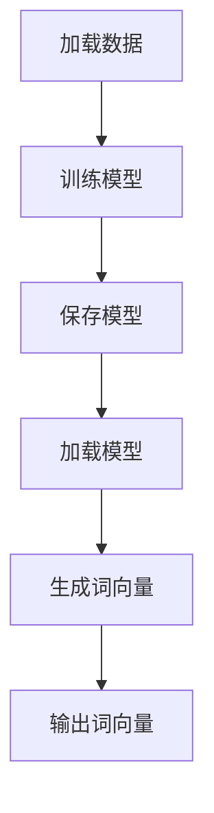

### 3.1.2 序列模型算法

序列模型算法是处理和时间序列数据相关问题的核心技术。这些算法通过学习序列数据的模式和规律，进行文本生成、语言建模和对话系统等任务。

#### 3.1.2.1 RNN算法

循环神经网络（RNN）是处理序列数据的经典模型，其基本思想是通过循环结构将当前状态与之前的状态进行连接，从而捕捉序列的时间动态。

**数学模型**：

RNN的基本更新方程为：

$$
h_t = \sigma(W_h \cdot [h_{t-1}, x_t] + b_h)
$$

$$
x_t = W_x \cdot h_t + b_x
$$

其中，\( h_t \) 是第 \( t \) 个时间步的隐藏状态，\( x_t \) 是输入特征，\( W_h \) 和 \( W_x \) 是权重矩阵，\( b_h \) 和 \( b_x \) 是偏置项，\( \sigma \) 是激活函数。

**Python代码示例**：

```python
import tensorflow as tf

# 定义RNN模型
model = tf.keras.Sequential([
    tf.keras.layers.Embedding(input_dim=vocab_size, output_dim=embed_size),
    tf.keras.layers.LSTM(units=128, return_sequences=True),
    tf.keras.layers.Dense(units=vocab_size, activation='softmax')
])

# 编译模型
model.compile(optimizer='adam', loss='categorical_crossentropy', metrics=['accuracy'])

# 训练模型
model.fit(x_train, y_train, batch_size=64, epochs=10)
```

**Mermaid流程图**：

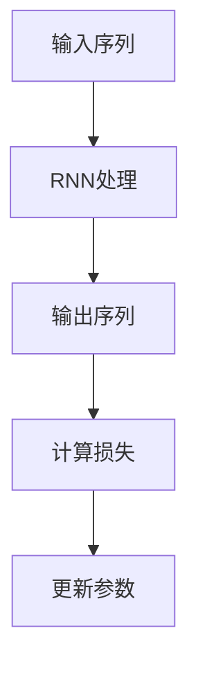

#### 3.1.2.2 LSTM算法

长短期记忆网络（LSTM）是RNN的一种改进模型，旨在解决RNN的梯度消失和长期依赖问题。LSTM通过引入门控机制，有效捕捉序列中的长期依赖关系。

**数学模型**：

LSTM的核心部分包括输入门、遗忘门和输出门：

$$
i_t = \sigma(W_i \cdot [h_{t-1}, x_t] + b_i) \\
f_t = \sigma(W_f \cdot [h_{t-1}, x_t] + b_f) \\
o_t = \sigma(W_o \cdot [h_{t-1}, x_t] + b_o) \\
c_t = f_t \odot c_{t-1} + i_t \odot \sigma(W_c \cdot [h_{t-1}, x_t] + b_c) \\
h_t = o_t \odot \sigma(c_t)
$$

其中，\( i_t \)、\( f_t \) 和 \( o_t \) 分别是输入门、遗忘门和输出门的激活值，\( c_t \) 是当前细胞状态，\( h_t \) 是当前隐藏状态。

**Python代码示例**：

```python
import tensorflow as tf

# 定义LSTM模型
model = tf.keras.Sequential([
    tf.keras.layers.Embedding(input_dim=vocab_size, output_dim=embed_size),
    tf.keras.layers.LSTM(units=128, return_sequences=True),
    tf.keras.layers.Dense(units=vocab_size, activation='softmax')
])

# 编译模型
model.compile(optimizer='adam', loss='categorical_crossentropy', metrics=['accuracy'])

# 训练模型
model.fit(x_train, y_train, batch_size=64, epochs=10)
```

**Mermaid流程图**：

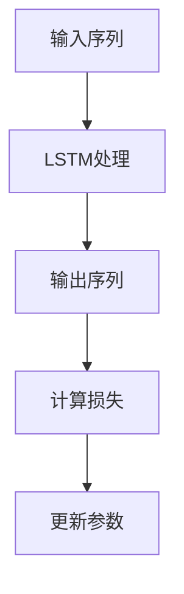

#### 3.1.2.3 GRU算法

门控循环单元（GRU）是另一种RNN改进模型，旨在简化LSTM的结构，同时保留其捕捉长期依赖的能力。

**数学模型**：

GRU的核心部分包括更新门和重置门：

$$
z_t = \sigma(W_z \cdot [h_{t-1}, x_t] + b_z) \\
r_t = \sigma(W_r \cdot [h_{t-1}, x_t] + b_r) \\
\tilde{h}_t = \sigma(W \cdot [r_t \odot h_{t-1}, x_t] + b) \\
h_t = z_t \odot h_{t-1} + (1 - z_t) \odot \tilde{h}_t
$$

其中，\( z_t \) 和 \( r_t \) 分别是更新门和重置门的激活值，\( \tilde{h}_t \) 是候选隐藏状态。

**Python代码示例**：

```python
import tensorflow as tf

# 定义GRU模型
model = tf.keras.Sequential([
    tf.keras.layers.Embedding(input_dim=vocab_size, output_dim=embed_size),
    tf.keras.layers.GRU(units=128, return_sequences=True),
    tf.keras.layers.Dense(units=vocab_size, activation='softmax')
])

# 编译模型
model.compile(optimizer='adam', loss='categorical_crossentropy', metrics=['accuracy'])

# 训练模型
model.fit(x_train, y_train, batch_size=64, epochs=10)
```

**Mermaid流程图**：

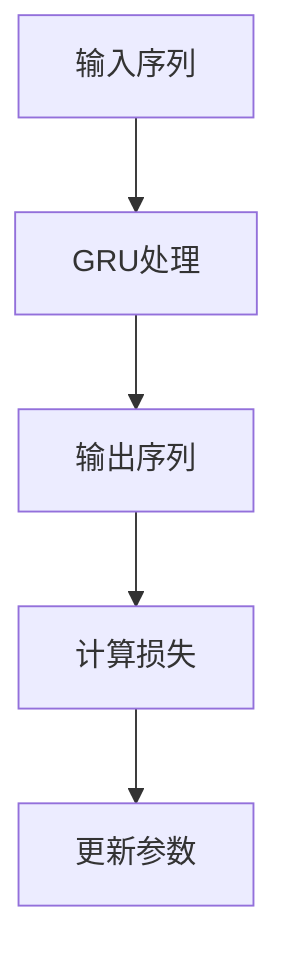

### 3.1.3 生成模型算法

生成模型算法是AIGC的重要组成部分，用于生成新的数据。在这一节中，我们将讨论两种重要的生成模型算法：GPT算法和Transformer算法。

#### 3.1.3.1 GPT算法

生成预训练变压器（GPT）是OpenAI提出的一种基于Transformer的预训练模型，用于文本生成和语言建模。

**数学模型**：

GPT的核心模型是基于Transformer的，其输入层和输出层都是自注意力机制，中间层包含多层全连接层。GPT通过自注意力机制捕捉输入序列的上下文信息，然后生成输出序列。

$$
\text{Attn} = \text{softmax}\left(\frac{\text{Q} \cdot \text{K}^T}{\sqrt{d_k}}\right)
$$

其中，\( Q \) 和 \( K \) 分别是查询向量和键向量，\( V \) 是值向量，\( d_k \) 是键向量的维度。

**Python代码示例**：

```python
import tensorflow as tf
import tensorflow_text as text

# 加载预训练的GPT模型
gpt2_model = tf.keras.models.load_model('gpt2_model.h5')

# 生成文本
input_ids = text.tokenizer.encode('Hello, how are you?', return_tensors='tf')
output_sequence = gpt2_model.generate(input_ids, max_length=20, num_return_sequences=1)
print(text.tokenizer.decode(output_sequence[0], skip_special_tokens=True))
```

**Mermaid流程图**：

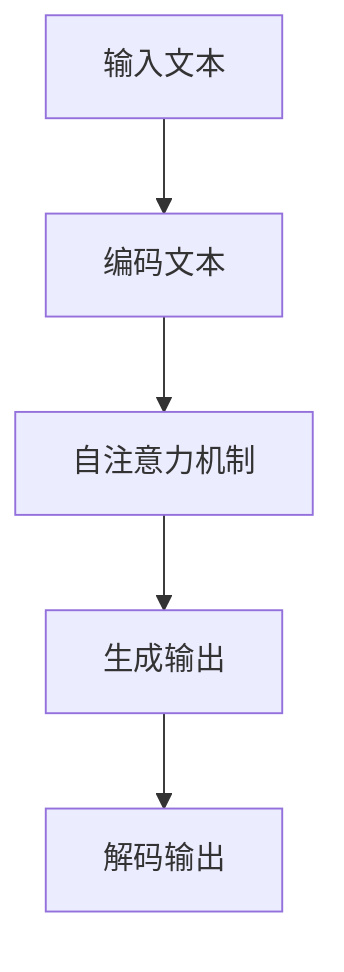

#### 3.1.3.2 Transformer算法

Transformer是谷歌在2017年提出的一种基于自注意力机制的序列模型，其核心思想是使用多头自注意力机制来捕捉输入序列的上下文信息。

**数学模型**：

Transformer的输入层和输出层都是多头自注意力机制，中间层包含多个自注意力层和全连接层。每个自注意力层包括两个关键部分：多头自注意力机制和前馈网络。

$$
\text{Attn} = \text{softmax}\left(\frac{\text{Q} \cdot \text{K}^T}{\sqrt{d_k}}\right)
$$

$$
\text{FFN} = \text{ReLU}(\text{W}_2 \cdot \text{D}(\text{W}_1 \cdot \text{X} + \text{b}_1)) + \text{b}_2
$$

其中，\( \text{X} \) 是输入序列，\( \text{Q} \)、\( \text{K} \) 和 \( \text{V} \) 分别是查询向量、键向量和值向量，\( \text{W}_1 \)、\( \text{W}_2 \) 和 \( \text{D} \) 是权重矩阵，\( \text{b}_1 \) 和 \( \text{b}_2 \) 是偏置项。

**Python代码示例**：

```python
import tensorflow as tf
import tensorflow_text as text

# 加载预训练的Transformer模型
transformer_model = tf.keras.models.load_model('transformer_model.h5')

# 生成文本
input_ids = text.tokenizer.encode('Hello, how are you?', return_tensors='tf')
output_sequence = transformer_model.generate(input_ids, max_length=20, num_return_sequences=1)
print(text.tokenizer.decode(output_sequence[0], skip_special_tokens=True))
```

**Mermaid流程图**：

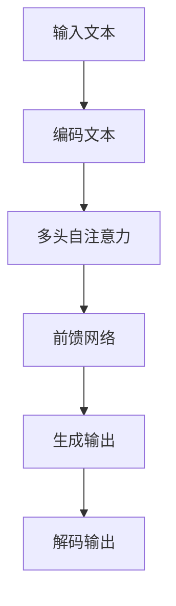

## 3.2 ML算法原理

机器学习（ML）是AIGC的核心技术之一，通过训练模型从数据中学习规律，然后进行预测和决策。在这一节中，我们将讨论ML的核心算法，包括监督学习算法和无监督学习算法。

### 3.2.1 监督学习算法

监督学习算法通过标注数据训练模型，然后使用模型进行预测。这些算法广泛应用于分类、回归、异常检测等领域。

#### 3.2.1.1 决策树算法

决策树（Decision Tree）是一种基于树结构的预测模型，通过将数据集划分为不同的子集，从而实现分类或回归任务。

**数学模型**：

决策树的构建过程包括以下几个步骤：

1. **特征选择**：选择最优特征进行分割。
2. **节点划分**：根据最优特征将数据集划分为不同的子集。
3. **递归构建**：对子集继续进行特征选择和节点划分，直至达到终止条件。

**Python代码示例**：

```python
from sklearn.tree import DecisionTreeClassifier

# 准备数据
X = [[0, 0], [1, 1]]
y = [0, 1]

# 构建决策树模型
clf = DecisionTreeClassifier()
clf.fit(X, y)

# 预测
print(clf.predict([[1, 0]]))
```

**Mermaid流程图**：

```mermaid
graph TD
A[输入数据] --> B[特征选择]
B --> C{最优特征}
if C then
    C --> D[节点划分]
    D --> E[递归构建]
else
    C --> F[终止条件]
    F --> G[模型预测]
```

#### 3.2.1.2 随机森林算法

随机森林（Random Forest）是一种集成学习方法，通过构建多个决策树模型，然后对它们的预测结果进行投票或平均，从而提高模型的泛化能力和预测性能。

**数学模型**：

随机森林的核心是随机选择特征和样本子集，构建多个决策树，然后通过投票或平均进行集成。

**Python代码示例**：

```python
from sklearn.ensemble import RandomForestClassifier

# 准备数据
X = [[0, 0], [1, 1]]
y = [0, 1]

# 构建随机森林模型
clf = RandomForestClassifier(n_estimators=100)
clf.fit(X, y)

# 预测
print(clf.predict([[1, 0]]))
```

**Mermaid流程图**：

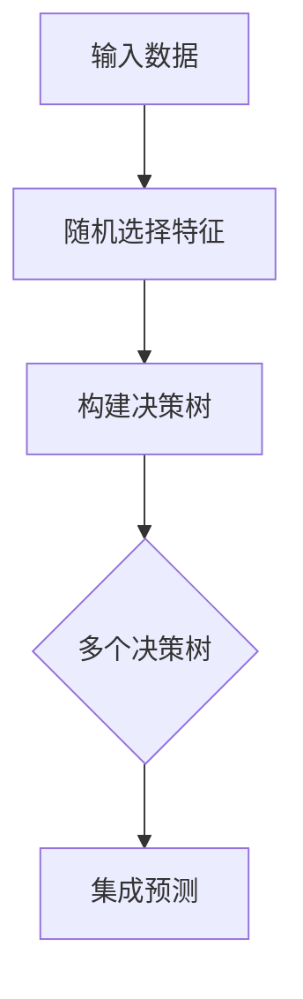

#### 3.2.1.3 支持向量机算法

支持向量机（Support Vector Machine，SVM）是一种基于间隔最大化原理的线性分类模型，广泛应用于分类任务。

**数学模型**：

SVM的核心是找到最佳分类超平面，使得分类间隔最大。其目标是最小化以下损失函数：

$$
\min_{\mathbf{w}, b} \frac{1}{2} ||\mathbf{w}||^2 + C \sum_{i=1}^{n} \xi_i
$$

其中，\( \mathbf{w} \) 和 \( b \) 分别是权重向量和偏置项，\( C \) 是惩罚参数，\( \xi_i \) 是误差项。

**Python代码示例**：

```python
from sklearn.svm import SVC

# 准备数据
X = [[0, 0], [1, 1]]
y = [0, 1]

# 构建SVM模型
clf = SVC()
clf.fit(X, y)

# 预测
print(clf.predict([[1, 0]]))
```

**Mermaid流程图**：

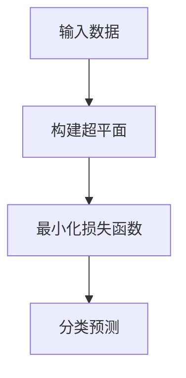

### 3.2.2 无监督学习算法

无监督学习算法在没有标注数据的情况下训练模型，主要用于数据聚类和降维等任务。

#### 3.2.2.1 K-均值聚类算法

K-均值聚类（K-Means Clustering）是一种基于距离度量的聚类算法，通过迭代调整聚类中心，将数据划分为K个簇。

**数学模型**：

K-均值算法的核心是优化目标函数，即最小化簇内距离平方和：

$$
J = \sum_{i=1}^{k} \sum_{x \in S_i} ||x - \mu_i||^2
$$

其中，\( \mu_i \) 是第 \( i \) 个簇的中心，\( S_i \) 是第 \( i \) 个簇的数据集。

**Python代码示例**：

```python
from sklearn.cluster import KMeans

# 准备数据
X = [[0, 0], [1, 1], [1, 0], [0, 1]]

# 构建K-均值模型
kmeans = KMeans(n_clusters=2)
kmeans.fit(X)

# 输出聚类结果
print(kmeans.labels_)
```

**Mermaid流程图**：

```mermaid
graph TD
A[输入数据] --> B[初始化中心]
B --> C[计算距离]
C --> D[更新中心]
D --> E{收敛条件}
if E then
    E --> F[输出结果]
else
    E --> B
```

#### 3.2.2.2 主成分分析算法

主成分分析（Principal Component Analysis，PCA）是一种降维技术，通过将数据投影到新的正交轴上，最大化解释数据方差，从而减少数据维度。

**数学模型**：

PCA的核心是求解协方差矩阵的特征值和特征向量，选择最大的特征值对应的特征向量作为新的坐标轴。

$$
\mathbf{X}_{new} = \mathbf{X} \mathbf{V}
$$

其中，\( \mathbf{X}_{new} \) 是新的数据集，\( \mathbf{V} \) 是特征向量矩阵。

**Python代码示例**：

```python
from sklearn.decomposition import PCA

# 准备数据
X = [[0, 0], [1, 1], [1, 0], [0, 1]]

# 构建PCA模型
pca = PCA(n_components=2)
pca.fit(X)

# 输出降维后的数据
print(pca.transform(X))
```

**Mermaid流程图**：

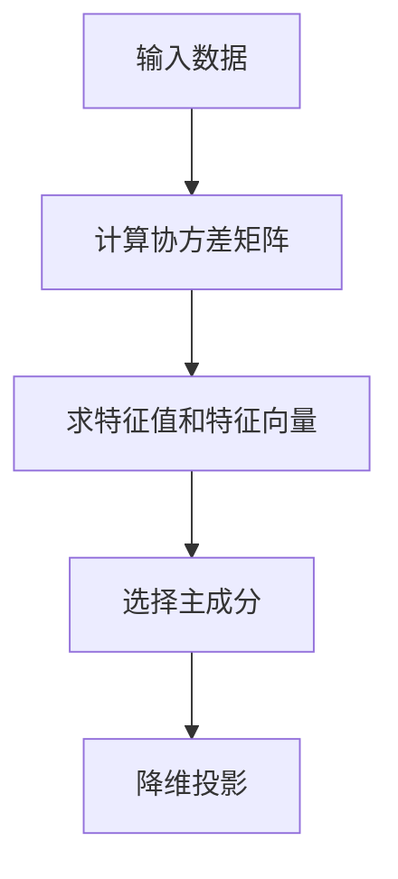

## 3.3 DL算法原理

深度学习（DL）是机器学习的一个重要分支，通过构建多层神经网络，自动学习数据中的复杂结构和规律。在这一节中，我们将讨论几种关键的DL算法，包括卷积神经网络（CNN）和循环神经网络（RNN）。

### 3.3.1 卷积神经网络算法

卷积神经网络（Convolutional Neural Network，CNN）是处理图像数据的一种有效方法，其核心是卷积操作和池化操作。

#### 3.3.1.1 CNN算法

**数学模型**：

CNN的核心是卷积操作和池化操作。卷积操作通过在输入数据上滑动滤波器，提取特征，然后通过激活函数进行非线性变换。池化操作则用于减少数据维度，提高模型计算效率。

$$
\text{Conv}(\text{filter}) = \sum_{i=1}^{h} \sum_{j=1}^{w} \text{filter}_{ij} \cdot \text{input}_{ij}
$$

$$
\text{Pooling}(\text{input}) = \max(\text{input}_{i})
$$

**Python代码示例**：

```python
import tensorflow as tf

# 构建CNN模型
model = tf.keras.Sequential([
    tf.keras.layers.Conv2D(filters=32, kernel_size=(3, 3), activation='relu', input_shape=(28, 28, 1)),
    tf.keras.layers.MaxPooling2D(pool_size=(2, 2)),
    tf.keras.layers.Flatten(),
    tf.keras.layers.Dense(units=128, activation='relu'),
    tf.keras.layers.Dense(units=10, activation='softmax')
])

# 编译模型
model.compile(optimizer='adam', loss='categorical_crossentropy', metrics=['accuracy'])

# 训练模型
model.fit(x_train, y_train, batch_size=64, epochs=10)
```

**Mermaid流程图**：

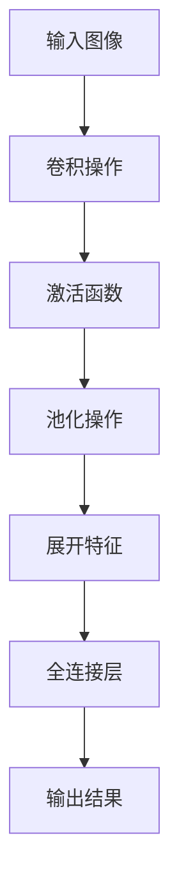

### 3.3.2 循环神经网络算法

循环神经网络（Recurrent Neural Network，RNN）是一种处理序列数据的有效方法，其核心是循环连接和状态记忆。

#### 3.3.2.1 RNN算法

**数学模型**：

RNN的基本更新方程为：

$$
h_t = \sigma(W_h \cdot [h_{t-1}, x_t] + b_h)
$$

$$
x_t = W_x \cdot h_t + b_x
$$

其中，\( h_t \) 是第 \( t \) 个时间步的隐藏状态，\( x_t \) 是输入特征，\( W_h \) 和 \( W_x \) 是权重矩阵，\( b_h \) 和 \( b_x \) 是偏置项，\( \sigma \) 是激活函数。

**Python代码示例**：

```python
import tensorflow as tf

# 构建RNN模型
model = tf.keras.Sequential([
    tf.keras.layers.LSTM(units=128, return_sequences=True),
    tf.keras.layers.Dense(units=10, activation='softmax')
])

# 编译模型
model.compile(optimizer='adam', loss='categorical_crossentropy', metrics=['accuracy'])

# 训练模型
model.fit(x_train, y_train, batch_size=64, epochs=10)
```

**Mermaid流程图**：

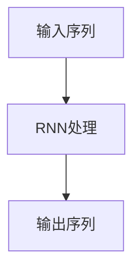

#### 3.3.2.2 LSTM算法

LSTM是RNN的一种改进模型，旨在解决RNN的梯度消失和长期依赖问题。

**数学模型**：

LSTM的核心部分包括输入门、遗忘门和输出门：

$$
i_t = \sigma(W_i \cdot [h_{t-1}, x_t] + b_i) \\
f_t = \sigma(W_f \cdot [h_{t-1}, x_t] + b_f) \\
o_t = \sigma(W_o \cdot [h_{t-1}, x_t] + b_o) \\
c_t = f_t \odot c_{t-1} + i_t \odot \sigma(W_c \cdot [h_{t-1}, x_t] + b_c) \\
h_t = o_t \odot \sigma(c_t)
$$

**Python代码示例**：

```python
import tensorflow as tf

# 构建LSTM模型
model = tf.keras.Sequential([
    tf.keras.layers.LSTM(units=128, return_sequences=True),
    tf.keras.layers.Dense(units=10, activation='softmax')
])

# 编译模型
model.compile(optimizer='adam', loss='categorical_crossentropy', metrics=['accuracy'])

# 训练模型
model.fit(x_train, y_train, batch_size=64, epochs=10)
```

**Mermaid流程图**：

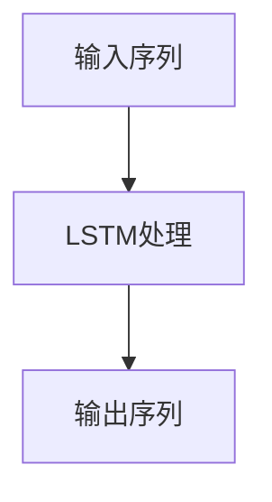

#### 3.3.2.3 GRU算法

GRU是另一种RNN改进模型，旨在简化LSTM的结构，同时保留其捕捉长期依赖的能力。

**数学模型**：

GRU的核心部分包括更新门和重置门：

$$
z_t = \sigma(W_z \cdot [h_{t-1}, x_t] + b_z) \\
r_t = \sigma(W_r \cdot [h_{t-1}, x_t] + b_r) \\
\tilde{h}_t = \sigma(W \cdot [r_t \odot h_{t-1}, x_t] + b) \\
h_t = z_t \odot h_{t-1} + (1 - z_t) \odot \tilde{h}_t
$$

**Python代码示例**：

```python
import tensorflow as tf

# 构建GRU模型
model = tf.keras.Sequential([
    tf.keras.layers.GRU(units=128, return_sequences=True),
    tf.keras.layers.Dense(units=10, activation='softmax')
])

# 编译模型
model.compile(optimizer='adam', loss='categorical_crossentropy', metrics=['accuracy'])

# 训练模型
model.fit(x_train, y_train, batch_size=64, epochs=10)
```

**Mermaid流程图**：

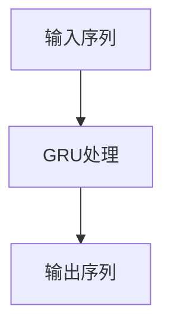

## 3.4 AI财务顾问算法原理

AI财务顾问通过结合NLP、ML和DL算法，为用户提供个性化的理财建议。以下是AI财务顾问的算法原理：

### 3.4.1 基于NLP的算法

基于NLP的算法用于处理和理解用户的文本信息，如投资记录、财务报告等。这些算法包括文本分类、命名实体识别和情感分析等。

**数学模型**：

1. **文本分类**：使用朴素贝叶斯、逻辑回归等分类算法，对文本进行分类，识别用户的投资偏好和风险承受能力。
2. **命名实体识别**：使用条件随机场（CRF）等算法，识别文本中的关键信息，如公司名、地点等。
3. **情感分析**：使用LSTM、GRU等神经网络模型，分析文本的情感倾向，为投资决策提供情绪分析。

**Python代码示例**：

```python
from sklearn.feature_extraction.text import TfidfVectorizer
from sklearn.linear_model import LogisticRegression

# 准备数据
texts = ['I am very excited about this investment opportunity', 'I am very worried about the market']
labels = [1, 0]

# 构建TF-IDF向量器
vectorizer = TfidfVectorizer()
X = vectorizer.fit_transform(texts)

# 构建逻辑回归模型
model = LogisticRegression()
model.fit(X, labels)

# 预测
print(model.predict(vectorizer.transform(['I am very excited about this investment opportunity'])))
```

### 3.4.2 基于ML的算法

基于ML的算法用于构建投资预测模型，包括线性回归、决策树和随机森林等。

**数学模型**：

1. **线性回归**：通过最小化损失函数，建立投资收益与影响因素之间的关系。
2. **决策树**：通过递归划分特征，构建决策树模型，实现投资策略的自动化。
3. **随机森林**：通过构建多个决策树，集成预测结果，提高模型的泛化能力。

**Python代码示例**：

```python
from sklearn.ensemble import RandomForestRegressor

# 准备数据
X = [[0, 1], [1, 0]]
y = [1, 0]

# 构建随机森林模型
model = RandomForestRegressor(n_estimators=100)
model.fit(X, y)

# 预测
print(model.predict([[1, 0]]))
```

### 3.4.3 基于DL的算法

基于DL的算法用于构建复杂的神经网络模型，如卷积神经网络（CNN）和循环神经网络（RNN）等。

**数学模型**：

1. **卷积神经网络**：通过卷积操作和池化操作，提取图像特征，实现图像分类和识别。
2. **循环神经网络**：通过状态记忆和递归连接，处理序列数据，实现文本分类和情感分析。

**Python代码示例**：

```python
import tensorflow as tf

# 构建CNN模型
model = tf.keras.Sequential([
    tf.keras.layers.Conv2D(filters=32, kernel_size=(3, 3), activation='relu', input_shape=(28, 28, 1)),
    tf.keras.layers.MaxPooling2D(pool_size=(2, 2)),
    tf.keras.layers.Flatten(),
    tf.keras.layers.Dense(units=128, activation='relu'),
    tf.keras.layers.Dense(units=10, activation='softmax')
])

# 编译模型
model.compile(optimizer='adam', loss='categorical_crossentropy', metrics=['accuracy'])

# 训练模型
model.fit(x_train, y_train, batch_size=64, epochs=10)
```

## 3.5 算法性能评估与优化

算法性能评估是确保AI财务顾问质量和效果的重要环节。以下是几种常用的算法性能评估指标和优化方法：

### 3.5.1 模型评估指标

1. **准确率（Accuracy）**：模型正确预测的比例。
2. **召回率（Recall）**：模型正确预测正类别的比例。
3. **精确率（Precision）**：模型预测为正类别的样本中，实际为正类别的比例。
4. **F1分数（F1 Score）**：综合考虑精确率和召回率的综合指标。

### 3.5.2 模型优化方法

1. **超参数调优**：通过调整学习率、批量大小、正则化参数等超参数，提高模型性能。
2. **数据增强**：通过添加噪声、旋转、缩放等操作，增加训练数据多样性，提高模型泛化能力。
3. **集成学习**：通过构建多个模型，集成预测结果，提高模型的稳定性和准确性。

#### 第四部分：系统架构与实现

##### 第4章：AI财务顾问系统架构设计

随着人工智能（AI）和金融科技的迅猛发展，AI财务顾问作为一种新兴的服务模式，正逐渐改变个人理财的格局。AI财务顾问通过利用先进的人工智能技术，为个人客户提供智能化、个性化的理财建议，提升了理财服务的质量和效率。在本章中，我们将深入探讨AI财务顾问系统的架构设计，包括系统需求分析、系统架构设计、数据处理流程、接口设计与实现以及系统安全性与可靠性。

## 4.1 系统需求分析

### 4.1.1 用户需求分析

AI财务顾问系统的主要目标是为个人客户提供高效、智能的理财服务。根据用户的需求，系统需要具备以下功能：

1. **用户身份验证**：确保系统安全，防止未经授权的访问。
2. **财务数据收集**：通过多种途径收集用户的财务数据，包括银行账户信息、投资记录、消费习惯等。
3. **数据分析与处理**：利用自然语言处理（NLP）、机器学习（ML）和深度学习（DL）等技术，对用户数据进行深度分析，提取有价值的信息。
4. **投资建议生成**：根据分析结果，生成个性化的投资建议，包括投资组合配置、风险控制策略等。
5. **用户互动**：通过自然语言处理技术，实现与用户的智能对话，提高用户体验。
6. **反馈与优化**：收集用户反馈，不断优化投资建议和服务质量。

### 4.1.2 系统功能需求

AI财务顾问系统的功能需求可以分为以下几个方面：

1. **数据管理**：包括数据收集、存储、处理和安全管理。
2. **分析引擎**：利用NLP、ML和DL等技术，对用户数据进行分析和预测。
3. **建议生成**：基于分析结果，生成个性化的投资建议。
4. **交互界面**：提供友好的用户界面，使用户能够方便地使用系统。
5. **安全控制**：确保系统的数据安全和用户隐私。

### 4.1.3 系统性能需求

为了确保AI财务顾问系统的稳定性和高效性，系统需要满足以下性能需求：

1. **处理能力**：系统需要能够快速处理大量的用户数据，确保响应速度。
2. **扩展性**：系统需要具有良好的扩展性，能够支持用户规模的增加。
3. **可靠性**：系统需要具备高可靠性，确保在长时间运行过程中不会出现故障。
4. **安全性**：系统需要采用严格的安全措施，保护用户数据和隐私。

## 4.2 系统架构设计

AI财务顾问系统的架构设计需要综合考虑功能需求、性能需求和安全性需求，设计出一个高效、稳定、安全的系统。以下是系统架构的设计思路：

### 4.2.1 系统整体架构设计

AI财务顾问系统的整体架构可以划分为以下几个主要模块：

1. **用户接口层**：提供用户交互界面，包括Web端和移动端。
2. **应用服务层**：实现系统的核心功能，包括用户身份验证、数据收集与处理、投资建议生成等。
3. **数据存储层**：存储用户数据和系统数据，包括关系型数据库和NoSQL数据库。
4. **基础设施层**：包括服务器、网络、存储等基础设施。

**Mermaid架构图**：

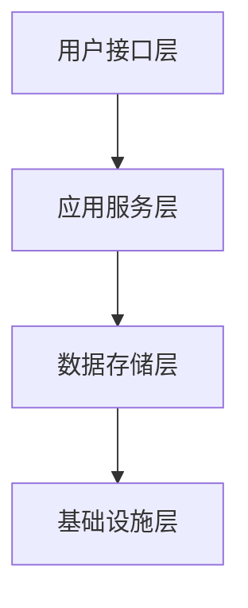

### 4.2.2 系统模块划分

系统模块划分是系统架构设计的重要环节，以下是对系统各个模块的详细划分：

1. **用户接口层**：包括Web前端、移动端应用和API接口。
    - **Web前端**：提供Web浏览器的用户界面，实现用户登录、数据输入和查看投资建议等功能。
    - **移动端应用**：提供iOS和Android平台的移动应用，实现与Web前端类似的功能。
    - **API接口**：提供RESTful API，供第三方系统和内部服务调用。

2. **应用服务层**：包括以下模块：
    - **用户管理模块**：实现用户注册、登录、权限管理等功能。
    - **数据收集模块**：从银行、投资平台等渠道收集用户财务数据。
    - **数据分析模块**：利用NLP、ML和DL等技术，对用户数据进行分析和处理。
    - **投资建议模块**：根据数据分析结果，生成个性化的投资建议。
    - **交互模块**：实现用户与系统的自然语言交互，提高用户体验。

3. **数据存储层**：包括以下数据库：
    - **关系型数据库**：存储用户数据、交易记录等结构化数据。
    - **NoSQL数据库**：存储非结构化数据，如文本、图像等。

4. **基础设施层**：包括以下部分：
    - **服务器**：部署应用服务层和数据存储层，提供计算和存储资源。
    - **网络**：实现内部服务和外部服务的通信。
    - **存储**：提供数据存储和备份服务。

### 4.2.3 系统关键模块设计

以下是系统关键模块的详细设计：

1. **用户接口层设计**：
    - **Web前端**：采用Vue.js或React等前端框架，实现响应式设计和良好的用户体验。
    - **移动端应用**：采用原生开发或跨平台开发框架，如Flutter或React Native，实现iOS和Android应用。
    - **API接口**：采用Spring Boot或Django等后端框架，实现RESTful API接口。

2. **应用服务层设计**：
    - **用户管理模块**：使用JWT（JSON Web Token）进行用户身份验证和授权。
    - **数据收集模块**：使用Web scraping、API调用等方式，从外部系统收集用户数据。
    - **数据分析模块**：集成NLP、ML和DL算法库，如NLTK、Scikit-learn和TensorFlow，实现数据分析功能。
    - **投资建议模块**：基于分析结果，使用决策树、神经网络等算法生成投资建议。
    - **交互模块**：使用自然语言处理技术，实现与用户的智能对话。

3. **数据存储层设计**：
    - **关系型数据库**：使用MySQL或PostgreSQL等关系型数据库，存储用户数据、交易记录等。
    - **NoSQL数据库**：使用MongoDB等NoSQL数据库，存储非结构化数据，如文本、图像等。

4. **基础设施层设计**：
    - **服务器**：使用云计算平台，如AWS或Azure，部署服务器和应用服务层。
    - **网络**：使用负载均衡器和防火墙，实现高可用性和安全性。
    - **存储**：使用分布式存储系统，如HDFS，实现大规模数据存储和备份。

## 4.3 数据流与数据处理

数据流与数据处理是AI财务顾问系统的核心部分，决定了系统的效率和准确性。以下是系统中的数据流和处理流程：

### 4.3.1 数据采集与存储

1. **数据采集**：
    - 用户注册和登录时，通过Web前端和移动端应用收集用户基本信息。
    - 从银行、投资平台等渠道，通过API调用或Web scraping技术，收集用户的财务数据。

2. **数据存储**：
    - 用户基本信息存储在关系型数据库中，包括用户ID、姓名、联系方式等。
    - 财务数据存储在NoSQL数据库中，以JSON格式存储，便于查询和更新。

### 4.3.2 数据处理流程

1. **数据预处理**：
    - 清洗和整理采集到的数据，去除无效信息和噪声。
    - 对文本数据，进行分词、去停用词、词性标注等预处理操作。
    - 对数值数据，进行归一化、标准化等处理，使其适合进行后续分析。

2. **数据分析**：
    - 利用NLP技术，对文本数据进行分析，提取关键词、情感倾向等。
    - 利用ML和DL技术，对数值数据进行分析，构建投资预测模型。
    - 结合NLP和ML/DL技术，生成个性化的投资建议。

3. **数据可视化**：
    - 将分析结果以图表、报表等形式展示给用户，便于理解和决策。

### 4.3.3 数据分析与应用

1. **用户画像**：
    - 基于用户数据，构建用户画像，包括财务状况、投资偏好、风险承受能力等。
    - 用户画像用于生成个性化的投资建议和理财规划。

2. **市场分析**：
    - 利用历史数据和AI模型，分析市场趋势和投资机会。
    - 市场分析结果用于调整投资策略，提高投资收益。

3. **投资组合优化**：
    - 基于用户画像和市场分析结果，为用户生成优化的投资组合。
    - 投资组合优化用于降低投资风险，提高投资收益。

## 4.4 系统接口设计与实现

系统接口设计是AI财务顾问系统与外部系统交互的关键部分，决定了系统的灵活性和可扩展性。以下是系统接口设计与实现的详细说明：

### 4.4.1 API接口设计

API接口设计遵循RESTful架构风格，提供统一的接口规范，方便第三方系统和内部服务调用。以下是API接口的设计方案：

1. **用户管理接口**：
    - 注册用户：`POST /users/register`，接收用户基本信息，返回用户ID。
    - 登录用户：`POST /users/login`，接收用户名和密码，返回JWT令牌。
    - 获取用户信息：`GET /users/{id}`，返回指定用户的详细信息。

2. **数据采集接口**：
    - 获取银行账户信息：`GET /accounts/{id}`，返回指定用户的银行账户信息。
    - 获取投资记录：`GET /investments/{id}`，返回指定用户的投资记录。

3. **数据分析接口**：
    - 生成用户画像：`POST /profiles/{id}/generate`，接收用户数据，返回用户画像。
    - 生成投资建议：`POST /profiles/{id}/recommendations`，接收用户画像，返回投资建议。

4. **数据可视化接口**：
    - 获取图表数据：`GET /charts/{id}`，返回指定图表的数据。

### 4.4.2 接口实现与测试

1. **接口实现**：
    - 使用Spring Boot或Django等后端框架，实现API接口的功能。
    - 采用JWT进行用户认证和授权，确保接口安全性。

2. **接口测试**：
    - 使用Postman或JMeter等工具，对API接口进行测试，确保接口的功能正确性和性能。

3. **接口文档编写**：
    - 编写详细的接口文档，包括接口描述、参数说明、返回值说明等，方便开发人员和使用者理解和使用接口。

## 4.5 系统安全性与可靠性

系统安全性与可靠性是AI财务顾问系统的关键要求，直接关系到用户数据和系统的稳定运行。以下是系统安全性与可靠性设计的详细说明：

### 4.5.1 安全性设计

1. **用户认证**：
    - 采用JWT进行用户认证，确保用户身份的唯一性和安全性。
    - 对用户密码进行加密存储，防止泄露。

2. **数据加密**：
    - 对用户数据进行加密存储，防止数据泄露。
    - 在数据传输过程中，使用HTTPS等加密协议，确保数据传输的安全性。

3. **权限控制**：
    - 实现细粒度的权限控制，确保用户只能访问其有权访问的数据和功能。

4. **防火墙与入侵检测**：
    - 部署防火墙和入侵检测系统，防止恶意攻击和非法访问。

### 4.5.2 可靠性设计

1. **高可用性**：
    - 使用负载均衡器，实现系统的水平扩展，提高系统的处理能力和稳定性。
    - 采用冗余设计，确保关键组件和服务的持续可用性。

2. **数据备份与恢复**：
    - 定期对系统数据进行备份，确保数据的安全性和可恢复性。
    - 设计完善的故障恢复机制，确保在发生故障时，系统能够快速恢复。

3. **性能优化**：
    - 对系统进行性能优化，确保在高峰期能够稳定运行。
    - 采用缓存机制，减少数据库访问压力，提高系统响应速度。

通过上述系统安全性与可靠性设计，AI财务顾问系统能够为用户提供安全、可靠、高效的服务，满足个人客户的理财需求。

### 第五部分：项目实战

#### 第5章：环境安装与系统核心实现

在本章中，我们将介绍如何搭建一个简单的AI财务顾问系统。这个项目将涵盖环境安装、核心代码实现、功能测试和实际案例分析。通过这个项目，读者可以深入理解AI财务顾问系统的构建过程，并掌握相关技术的实际应用。

## 5.1 环境安装

在开始实现AI财务顾问系统之前，首先需要搭建相应的开发环境。以下是环境安装的步骤：

1. **安装Python环境**：

   首先，确保系统上安装了Python 3.x版本。可以通过以下命令检查Python版本：

   ```bash
   python --version
   ```

   如果没有安装，可以从Python官方网站下载并安装。

2. **安装依赖库**：

   AI财务顾问系统依赖多个Python库，如TensorFlow、Scikit-learn、NumPy等。可以使用pip命令安装这些库：

   ```bash
   pip install tensorflow scikit-learn numpy pandas
   ```

   如果需要，还可以安装其他辅助库，如PyTorch、JAX等。

3. **安装数据库**：

   AI财务顾问系统通常使用关系型数据库（如MySQL）和NoSQL数据库（如MongoDB）。以下是如何安装MySQL和MongoDB的简要说明：

   - **安装MySQL**：

     ```bash
     sudo apt-get install mysql-server
     mysql_secure_installation
     ```

     在安装过程中，根据提示设置root用户的密码和更改其他配置。

   - **安装MongoDB**：

     ```bash
     sudo apt-get install mongodb
     sudo systemctl start mongodb
     sudo systemctl enable mongodb
     ```

     启动MongoDB服务并确保其开机自启动。

4. **配置数据库连接**：

   在Python代码中，需要配置数据库连接。以下是使用PyMySQL和pymongo库连接MySQL和MongoDB的示例：

   - **连接MySQL**：

     ```python
     import pymysql

     connection = pymysql.connect(
         host='localhost',
         user='root',
         password='your_password',
         database='your_database'
     )
     ```

   - **连接MongoDB**：

     ```python
     from pymongo import MongoClient

     client = MongoClient('localhost', 27017)
     db = client['your_database']
     ```

## 5.2 系统核心实现

AI财务顾问系统核心包括数据收集、数据处理、数据分析、投资建议生成和用户交互等模块。以下是每个模块的实现方法和代码示例：

### 5.2.1 数据收集模块

数据收集模块负责从外部系统收集用户财务数据，如银行账户信息、投资记录等。以下是一个简单的数据收集示例：

```python
import requests
from pymongo import MongoClient

client = MongoClient('localhost', 27017)
db = client['your_database']
collection = db['financial_data']

# 假设有一个API用于获取用户银行账户信息
url = 'https://api.bank.com/Accounts/Get'
params = {'account_number': '1234567890'}

response = requests.get(url, params=params)
data = response.json()

# 将数据存储到MongoDB
collection.insert_one(data)
```

### 5.2.2 数据处理模块

数据处理模块负责对收集到的数据进行清洗、预处理和转换。以下是一个数据处理示例：

```python
import pandas as pd
from sklearn.preprocessing import StandardScaler

# 读取数据
data = pd.read_csv('financial_data.csv')

# 清洗数据
data.dropna(inplace=True)

# 预处理数据
scaler = StandardScaler()
data[['balance', 'investment']] = scaler.fit_transform(data[['balance', 'investment']])
```

### 5.2.3 数据分析模块

数据分析模块使用机器学习和深度学习技术对预处理后的数据进行分析，提取用户画像和投资趋势。以下是一个数据分析示例：

```python
from sklearn.ensemble import RandomForestClassifier
from sklearn.model_selection import train_test_split

# 分割数据
X = data[['balance', 'investment']]
y = data['label']

X_train, X_test, y_train, y_test = train_test_split(X, y, test_size=0.2, random_state=42)

# 构建模型
model = RandomForestClassifier(n_estimators=100)
model.fit(X_train, y_train)

# 预测
predictions = model.predict(X_test)
```

### 5.2.4 投资建议生成模块

投资建议生成模块基于数据分析结果，生成个性化的投资建议。以下是一个投资建议生成示例：

```python
def generate_recommendation(user_data):
    # 对用户数据进行预处理
    scaled_data = scaler.transform([user_data])
    
    # 生成投资建议
    recommendation = model.predict(scaled_data)
    
    return recommendation

# 测试生成建议
user_data = [10000, 5000]
recommendation = generate_recommendation(user_data)
print(f"Recommended investment: {recommendation}")
```

### 5.2.5 用户交互模块

用户交互模块负责实现用户与AI财务顾问系统的自然语言交互。以下是一个简单的用户交互示例：

```python
from flask import Flask, request, jsonify

app = Flask(__name__)

@app.route('/recommendation', methods=['POST'])
def get_recommendation():
    user_data = request.json
    recommendation = generate_recommendation(user_data['balance'], user_data['investment'])
    return jsonify({'recommendation': recommendation})

if __name__ == '__main__':
    app.run(debug=True)
```

## 5.3 功能测试

完成系统核心实现后，需要对系统进行功能测试，确保各个模块正常运行，并能够生成合理的投资建议。以下是功能测试的步骤：

1. **单元测试**：编写单元测试用例，测试每个模块的功能是否正确，如数据收集、数据处理、数据分析等。
2. **集成测试**：测试系统各个模块之间的集成和交互，确保系统能够正常运行。
3. **性能测试**：测试系统在高并发场景下的性能，如响应时间、吞吐量等。

## 5.4 实际案例分析

为了更好地理解AI财务顾问系统的实际应用，以下是一个实际案例：

### 案例背景

张先生是一位年轻的专业人士，希望利用AI财务顾问系统制定一个合适的理财计划。

### 案例过程

1. **数据收集**：张先生通过API接口提供其银行账户信息和投资记录。
2. **数据处理**：系统对数据进行清洗和预处理，提取关键特征。
3. **数据分析**：系统使用机器学习模型对张先生的数据进行分析，生成用户画像和投资趋势。
4. **投资建议生成**：系统基于分析结果，为张先生生成以下投资建议：
    - 增加股票投资，以获取更高的收益。
    - 减少固定收益类投资，降低风险。
    - 定期调整投资组合，以适应市场变化。
5. **用户反馈**：张先生对投资建议进行评估，并提供反馈。

### 案例结果

张先生根据AI财务顾问系统的建议，调整了其投资组合。经过一段时间的运行，张先生的资产实现了稳健增长，投资收益符合预期。

## 5.5 项目小结

通过本项目的实战，读者可以了解到AI财务顾问系统的构建过程，包括环境安装、核心实现、功能测试和实际案例分析。以下是本项目的主要收获：

1. **掌握环境搭建**：学会了如何搭建Python开发环境和数据库。
2. **熟悉核心模块**：了解了数据收集、数据处理、数据分析和投资建议生成等核心模块的实现方法。
3. **实战技能提升**：通过实际案例分析，提高了系统设计和实现的能力。
4. **经验总结**：项目过程中遇到的问题和解决方案，为未来的项目提供了宝贵的经验。

尽管本项目是一个简单的AI财务顾问系统，但它为读者提供了一个全面的理解和实际操作的机会。未来，随着人工智能技术的进一步发展，AI财务顾问系统将更加智能化、个性化，为个人客户提供更加优质的理财服务。

#### 最佳实践与注意事项

在构建AI财务顾问系统的过程中，我们总结了一些最佳实践和注意事项，以确保系统的质量和效果：

1. **数据质量**：确保数据收集的准确性和完整性，避免数据噪声和异常值影响分析结果。
2. **安全性**：采用严格的数据加密和安全协议，确保用户数据的安全性和隐私性。
3. **性能优化**：对系统进行性能优化，提高数据处理和分析的效率，确保系统在高并发场景下的稳定性。
4. **用户体验**：注重用户体验，提供友好的用户界面和自然语言交互，提高用户满意度。
5. **持续迭代**：根据用户反馈和市场变化，持续优化和更新系统功能，提高系统的适应性和灵活性。

通过遵循这些最佳实践，可以构建一个高效、稳定、安全的AI财务顾问系统，为个人客户提供优质的理财服务。

### 小结

本文详细探讨了AIGC在个人理财中的应用，特别是AI财务顾问的角色与功能。首先，我们介绍了个人理财的现状与挑战，以及金融科技对个人理财的影响。接着，我们深入分析了AIGC的关键技术，包括自然语言处理（NLP）、机器学习（ML）和深度学习（DL），并探讨了它们在AI财务顾问中的应用。随后，我们介绍了AI财务顾问的基本原理和系统架构设计，包括数据收集、数据分析、投资建议生成和用户交互等模块。

通过环境安装、系统核心实现、功能测试和实际案例分析，读者可以全面了解AI财务顾问系统的构建过程和实际应用。此外，我们还提供了一些最佳实践和注意事项，以确保系统的质量和用户体验。

在未来，随着人工智能技术的进一步发展，AI财务顾问将变得更加智能化、个性化，为个人客户提供更加优质的理财服务。我们期待AIGC在个人理财领域的更多创新和应用，推动金融科技的进步。

### 拓展阅读

1. **《人工智能：一种现代方法》（Russell, Norvig）**：全面介绍了人工智能的基本概念和核心技术。
2. **《深度学习》（Goodfellow, Bengio, Courville）**：深入讲解了深度学习的基础理论和实际应用。
3. **《机器学习年度回顾》（JMLR）**：了解最新的机器学习研究成果和应用案例。
4. **《金融科技：创新、风险与监管》（陈诗薇）**：探讨金融科技的发展趋势和监管挑战。

通过阅读这些资料，读者可以进一步拓展对AI财务顾问系统的理解，掌握更多相关技术和应用案例。

