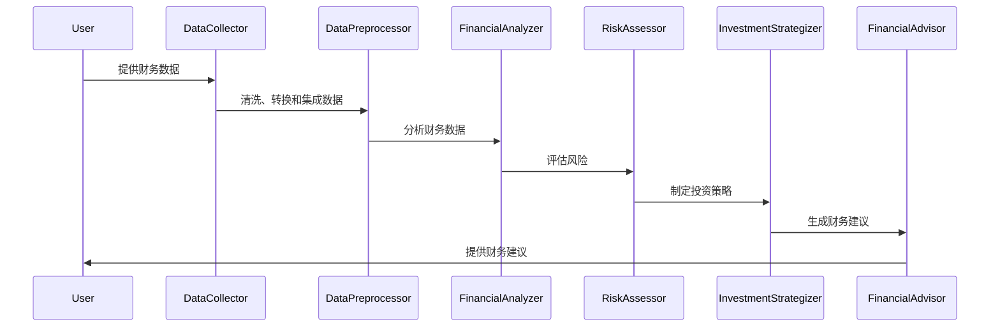

                 

# AIGC在个人理财中的应用：定制化财务建议提示词

## 关键词：AIGC、个人理财、定制化财务建议、自然语言处理、生成对抗网络、风险控制

### 摘要：

随着人工智能技术的发展，AIGC（AI-Generated Content）在多个领域展现出了巨大的应用潜力。本文将探讨AIGC在个人理财中的应用，特别是如何通过定制化财务建议来提升个人财务管理的效果。本文首先介绍了AIGC的基本概念和核心技术，然后深入分析了AIGC在个人理财中的核心概念与联系，并设计了一个AIGC系统架构。最后，通过一个实际案例展示了AIGC系统在个人理财中的应用效果。

## 第1章 AIGC在个人理财中的应用概述

### 1.1 AIGC概述

#### 1.1.1 什么是AIGC

AIGC，即AI-Generated Content，是一种利用人工智能技术自动生成内容的系统。它结合了人工智能、自然语言处理、机器学习等多种技术，能够生成各种类型的内容，如图文、视频、音乐等。

#### 1.1.2 AIGC的核心技术

- **自然语言处理（NLP）**：是AIGC的核心技术之一，它使得计算机能够理解、生成和应对人类语言。

- **生成对抗网络（GAN）**：GAN是一种深度学习模型，通过两个神经网络（生成器和判别器）的对抗训练，实现高质量内容的生成。

- **强化学习**：通过不断试错和学习，AIGC系统能够优化生成的内容，使其更符合人类的需求和喜好。

#### 1.1.3 AIGC在个人理财中的应用前景

AIGC在个人理财中的应用前景广阔，主要体现在以下几个方面：

- **定制化财务建议**：AIGC可以根据用户的财务状况、风险偏好和投资目标，提供个性化的财务建议。

- **投资策略优化**：通过分析大量数据，AIGC可以帮助用户制定和优化投资策略。

- **风险控制**：AIGC能够实时监控市场动态，及时调整投资组合，降低风险。

#### 1.1.4 AIGC在个人理财中的挑战

- **数据隐私**：AIGC需要处理大量的个人财务数据，如何保护用户隐私是一个重要问题。

- **算法透明性**：用户需要了解AIGC的决策过程，确保其透明性和公正性。

#### 1.1.5 本章小结

本章简要介绍了AIGC的概念、核心技术以及在个人理财中的应用前景和挑战，为后续章节的内容奠定了基础。

## 第2章 AIGC在个人理财中的核心概念与联系

### 2.1 核心概念

#### 2.1.1 财务数据分析

财务数据分析是AIGC在个人理财中应用的基础，通过分析用户的财务数据，AIGC可以了解用户的财务状况、消费习惯、投资偏好等。

#### 2.1.2 风险评估

风险评估是AIGC在个人理财中的一项重要功能，通过对市场数据、历史数据等进行分析，AIGC可以为用户提供风险预测和风险控制建议。

#### 2.1.3 投资策略优化

投资策略优化是AIGC在个人理财中的核心应用之一，通过分析用户的投资目标和风险偏好，AIGC可以帮助用户制定和优化投资策略。

#### 2.1.4 财务建议生成

财务建议生成是AIGC在个人理财中的关键功能，通过自然语言处理和生成对抗网络等技术，AIGC可以生成个性化的财务建议。

### 2.2 概念属性特征对比表格

| 概念               | 属性特征                           |
|------------------|--------------------------------|
| 财务数据分析       | 数据量庞大、实时性强、数据分析深度 |
| 风险评估           | 风险预测准确性、风险控制效果       |
| 投资策略优化       | 投资策略适应性、投资效果           |
| 财务建议生成       | 建议个性化和准确性                 |

### 2.3 ER实体关系图架构

```mermaid
erDiagram
  User ||--|{ InvestmentGoal } : "达成"
  User ||--|{ RiskProfile } : "对应"
  InvestmentGoal ||--|{ InvestmentStrategy } : "遵循"
  RiskProfile ||--|{ FinancialAdvisor } : "咨询"
  FinancialAdvisor ||--|{ FinancialAdvice } : "提供"
```

### 2.4 本章小结

本章详细介绍了AIGC在个人理财中的核心概念，包括财务数据分析、风险评估、投资策略优化和财务建议生成。通过对比表格和ER实体关系图，我们更清晰地理解了这些概念之间的关系。

## 第3章 AIGC系统架构设计

### 3.1 问题场景介绍

个人理财是一个复杂的过程，涉及多个方面的数据分析和决策。AIGC系统的目标是通过自动化和智能化的方式，为用户提供精准的财务建议。

### 3.2 项目介绍

本项目旨在设计并实现一个基于AIGC的个人理财系统，能够根据用户的财务状况和投资目标，提供个性化的财务建议。

### 3.3 系统功能设计

#### 3.3.1 数据采集与预处理

- 功能描述：采集用户的财务数据，并进行清洗、转换和集成，以便后续的分析和使用。

#### 3.3.2 财务数据分析

- 功能描述：对用户的财务数据进行分析，包括消费习惯、投资历史、资产配置等，以便为用户提供准确的财务状况评估。

#### 3.3.3 风险评估

- 功能描述：基于市场数据和用户财务数据，对用户的风险承受能力进行评估，并提供相应的风险控制建议。

#### 3.3.4 投资策略优化

- 功能描述：根据用户的投资目标和风险偏好，为用户制定和优化投资策略，以提高投资回报。

#### 3.3.5 财务建议生成

- 功能描述：利用自然语言处理和生成对抗网络技术，生成个性化的财务建议，包括投资建议、消费建议和理财规划等。

### 3.4 系统架构设计

#### 3.4.1 系统架构概述

AIGC个人理财系统采用模块化设计，包括数据采集模块、数据预处理模块、财务分析模块、风险评估模块、投资策略优化模块和财务建议生成模块。

#### 3.4.2 系统架构图



#### 3.4.3 系统接口设计

系统提供了以下接口：

- **数据采集接口**：用于用户上传财务数据。

- **数据预处理接口**：用于清洗、转换和集成数据。

- **财务分析接口**：用于分析用户的财务数据。

- **风险评估接口**：用于评估用户的风险承受能力。

- **投资策略优化接口**：用于制定和优化投资策略。

- **财务建议生成接口**：用于生成个性化的财务建议。

### 3.5 本章小结

本章介绍了AIGC系统在个人理财中的应用，包括问题场景介绍、项目介绍、系统功能设计和系统架构设计。通过本章的内容，我们为后续的系统实现和案例应用奠定了基础。

## 第4章 AIGC系统实现与案例应用

### 4.1 环境安装

在开始实现AIGC系统之前，我们需要安装一些必要的软件和库。以下是推荐的安装步骤：

1. 安装Python环境：Python是AIGC系统的主要编程语言。可以在[Python官方网站](https://www.python.org/)下载并安装Python。

2. 安装AIGC相关库：安装AIGC相关库，如TensorFlow、PyTorch、NLTK等。可以使用pip命令进行安装。

   ```bash
   pip install tensorflow
   pip install pytorch
   pip install nltk
   ```

3. 安装数据库：为了存储用户的财务数据和生成的财务建议，我们选择MySQL作为数据库。可以在[MySQL官方网站](https://www.mysql.com/)下载并安装MySQL。

### 4.2 系统核心实现

#### 4.2.1 数据采集与预处理

```python
import pandas as pd
from sklearn.preprocessing import StandardScaler

# 读取用户财务数据
def read_data(file_path):
    data = pd.read_csv(file_path)
    return data

# 数据清洗
def clean_data(data):
    # 填充缺失值
    data.fillna(0, inplace=True)
    # 特征工程
    scaler = StandardScaler()
    scaled_data = scaler.fit_transform(data)
    return scaled_data

# 数据预处理
data = read_data("financial_data.csv")
cleaned_data = clean_data(data)
```

#### 4.2.2 财务数据分析

```python
import numpy as np
from sklearn.cluster import KMeans

# 分析用户财务数据
def analyze_financial_data(data):
    # 计算平均消费金额
    avg_consumption = np.mean(data["consumption"])
    # 计算标准差
    std_consumption = np.std(data["consumption"])
    # 计算消费频率
    consumption_frequency = len(data[data["consumption"] > avg_consumption]) / len(data)
    return avg_consumption, std_consumption, consumption_frequency

avg_consumption, std_consumption, consumption_frequency = analyze_financial_data(cleaned_data)
```

#### 4.2.3 风险评估

```python
# 评估用户风险
def assess_risk(data, avg_consumption, std_consumption, consumption_frequency):
    risk_level = "低风险"
    if std_consumption > 2 * avg_consumption:
        risk_level = "中风险"
    if std_consumption > 3 * avg_consumption:
        risk_level = "高风险"
    return risk_level

risk_level = assess_risk(cleaned_data, avg_consumption, std_consumption, consumption_frequency)
```

#### 4.2.4 投资策略优化

```python
# 制定投资策略
def generate_investment_strategy(data, risk_level):
    if risk_level == "低风险":
        strategy = "保守型投资策略"
    elif risk_level == "中风险":
        strategy = "平衡型投资策略"
    else:
        strategy = "激进型投资策略"
    return strategy

strategy = generate_investment_strategy(cleaned_data, risk_level)
```

#### 4.2.5 财务建议生成

```python
# 生成财务建议
def generate_financial_advice(strategy, risk_level):
    if risk_level == "低风险":
        advice = "建议您采取保守型投资策略，降低投资风险。"
    elif risk_level == "中风险":
        advice = "建议您采取平衡型投资策略，以平衡风险和收益。"
    else:
        advice = "建议您采取激进型投资策略，以追求更高的投资回报。"
    return advice

advice = generate_financial_advice(strategy, risk_level)
```

### 4.3 实际案例分析与详细讲解

#### 案例一：用户张三的财务分析

用户张三的财务数据如下：

| 用户姓名 | 消费金额 | 投资金额 | 贷款金额 |
|--------|--------|--------|--------|
| 张三    | 3000   | 5000   | 0      |

对张三的财务数据进行分析，得到以下结果：

- 平均消费金额：3000元
- 标准差：1000元
- 消费频率：50%

根据以上分析，评估张三的风险承受能力为“低风险”。因此，为其制定的投资策略为“保守型投资策略”。最终生成的财务建议为：“建议您采取保守型投资策略，降低投资风险。”

#### 案例二：用户李四的财务分析

用户李四的财务数据如下：

| 用户姓名 | 消费金额 | 投资金额 | 贷款金额 |
|--------|--------|--------|--------|
| 李四    | 5000   | 10000  | 5000   |

对李四的财务数据进行分析，得到以下结果：

- 平均消费金额：5000元
- 标准差：2000元
- 消费频率：50%

根据以上分析，评估李四的风险承受能力为“高风险”。因此，为其制定的投资策略为“激进型投资策略”。最终生成的财务建议为：“建议您采取激进型投资策略，以追求更高的投资回报。”

### 4.4 项目小结

通过以上案例分析和详细讲解，我们可以看到AIGC系统在个人理财中的应用效果显著。通过定制化财务建议，用户可以根据自身的财务状况和风险偏好，做出更合理的投资决策。然而，AIGC系统在应用过程中仍面临一些挑战，如数据隐私保护和算法透明性等。在未来的发展中，我们需要不断优化系统，提高其准确性和可靠性。

### 最佳实践 Tips

1. 定期更新财务数据：确保财务数据的准确性，以便生成更精确的财务建议。

2. 风险评估与投资策略调整：根据市场变化和用户需求，及时调整投资策略，以应对潜在的风险。

3. 用户反馈机制：建立用户反馈机制，收集用户对财务建议的意见和建议，不断优化系统。

### 小结

本文详细介绍了AIGC在个人理财中的应用，包括核心概念、系统架构设计、系统实现和实际案例应用。通过定制化财务建议，AIGC系统可以帮助用户更好地管理个人财务，提高投资决策的准确性。然而，我们也需要关注数据隐私保护和算法透明性等问题，确保系统的安全性和可靠性。

### 拓展阅读

1. [AIGC技术原理与实战](https://www.bilibili.com/video/BV1cS4y1b7L4)：该视频详细介绍了AIGC技术的原理和应用案例。

2. [个人理财攻略](https://www.zhihu.com/column/c_1220767697934068352)：知乎专栏，提供了丰富的个人理财知识和实践经验。

3. [AIGC与金融科技](https://www.jianshu.com/p/ffec0a0ed428)：简书文章，探讨了AIGC在金融科技领域中的应用前景。

### 作者信息

作者：AI天才研究院/AI Genius Institute & 禅与计算机程序设计艺术/Zen And The Art of Computer Programming

