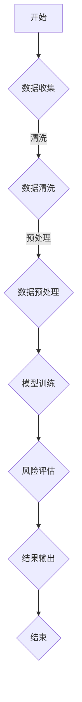
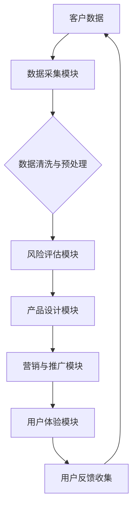

                 

## 文章标题

### AIGC在个性化保险产品设计中的应用：风险评估新方法

> 关键词：AIGC、个性化保险产品、风险评估、数据驱动、定制化设计

> 摘要：随着人工智能技术的快速发展，AIGC（自适应智能生成计算）在多个领域展现出了其强大的应用潜力。本文将探讨AIGC在个性化保险产品设计中的应用，特别是其作为一种新的风险评估方法。通过分析AIGC的核心概念、技术基础及其在保险行业中的应用，我们将详细阐述如何利用AIGC技术实现更精确的风险评估，从而推动个性化保险产品的设计与发展。

----------------------------------------------------------------

## 目录大纲

----------------------------------------------------------------

### 第一部分: AIGC概述

### 第二部分: 风险评估新方法

### 第三部分: AIGC在个性化保险产品设计中的应用

### 第四部分: AIGC在个性化保险产品设计中的案例分析

----------------------------------------------------------------

## 第一部分: AIGC概述

### 第1章: AIGC背景与概念

#### 1.1 问题背景

#### 1.2 核心概念

#### 1.3 AIGC与个性化保险产品设计的联系

#### 1.4 本章小结

----------------------------------------------------------------

### 第1章: AIGC背景与概念

#### 1.1 问题背景

随着现代社会的快速发展，保险行业面临着前所未有的挑战与机遇。传统的保险产品设计方法主要依赖于经验数据和静态的风险评估模型，难以满足消费者对个性化、精准化服务的需求。具体来说，保险行业的挑战主要体现在以下几个方面：

1. **消费者需求多样化**：随着人们生活水平的提高和风险意识的增强，消费者对保险产品的需求越来越多样化，他们希望保险产品能够更加贴合自身的需求，提供个性化的保障方案。

2. **风险评估复杂化**：传统的风险评估方法往往依赖于历史数据和静态模型，难以应对新兴风险和动态风险的变化。现代保险行业需要更加精准和动态的风险评估方法，以便更有效地识别和评估风险。

3. **市场竞争加剧**：保险行业的竞争日益激烈，保险公司需要通过创新的产品设计和精准的风险评估来吸引和留住客户，提高市场占有率。

4. **数据资源丰富**：随着互联网和大数据技术的发展，保险行业获得了海量的数据资源。如何有效地利用这些数据，提升风险评估的准确性和个性化水平，成为保险行业的一大挑战。

#### 1.1.2 个性化保险产品的需求

个性化保险产品的需求主要体现在以下几个方面：

1. **定制化的保障方案**：消费者希望保险产品能够根据其个人需求、风险承受能力和生活习惯等定制个性化的保障方案。

2. **精准的风险评估**：消费者希望保险产品能够通过精准的风险评估，提供合理的保费定价，同时降低不必要的风险保障费用。

3. **便捷的购买流程**：消费者希望保险产品的购买流程简单、便捷，能够快速响应其需求，提供一站式的服务。

4. **灵活的保险期限和保障范围**：消费者希望保险产品能够提供灵活的保险期限和保障范围，以便根据其生命周期和风险变化进行调整。

#### 1.1.3 AIGC技术的起源与发展

AIGC（自适应智能生成计算）是一种结合了人工智能和自动生成技术的综合性计算方法。它的起源可以追溯到20世纪90年代，随着计算机技术和互联网的快速发展，AIGC技术逐渐从理论研究走向实际应用。

1. **人工智能技术的发展**：人工智能（AI）作为AIGC的核心技术之一，经历了从规则系统到专家系统，再到深度学习和强化学习的演进。这些技术的发展为AIGC的应用提供了强大的技术支持。

2. **自动生成技术的融合**：自动生成技术（如自然语言生成、图像生成和代码生成等）在近年来的快速发展，为AIGC的应用提供了新的可能。自动生成技术通过模拟人类创造过程，生成具有高价值的自动化内容，为个性化保险产品的设计提供了新的思路。

3. **应用领域的扩展**：AIGC技术最初在图像处理、自然语言处理和游戏开发等领域得到了广泛应用。随着技术的不断成熟和应用的深入，AIGC技术逐渐扩展到保险、金融、医疗、教育等多个领域。

#### 1.2 核心概念

AIGC的核心概念包括：

1. **自适应**：AIGC能够根据环境变化和用户需求自适应调整其行为和输出，提高个性化程度和适应能力。

2. **智能**：AIGC通过模拟人类智能行为，利用机器学习、深度学习等技术实现智能化决策和内容生成。

3. **生成**：AIGC能够自动生成多样化、高质量的内容，如文本、图像、代码等，满足不同场景和应用需求。

#### 1.3 AIGC的关键技术

AIGC的关键技术主要包括：

1. **机器学习**：通过大量数据的训练，机器学习算法能够自动识别模式、预测结果，为AIGC提供智能化支持。

2. **深度学习**：基于多层神经网络，深度学习能够处理复杂的数据和任务，提高AIGC的生成能力和准确性。

3. **自然语言处理**：利用自然语言处理技术，AIGC能够理解和生成自然语言文本，满足个性化保险产品设计和客户沟通的需求。

4. **计算机视觉**：通过计算机视觉技术，AIGC能够理解和生成图像和视频内容，为保险产品展示和用户体验提供支持。

#### 1.4 AIGC在保险领域的应用前景

AIGC在保险领域的应用前景非常广阔，主要体现在以下几个方面：

1. **个性化保险产品设计**：AIGC能够根据客户数据和行为特征，自动生成个性化的保险产品方案，提高客户满意度和市场竞争力。

2. **精准的风险评估**：AIGC通过数据分析和机器学习算法，能够更准确地评估风险，提供合理的保费定价和保险方案。

3. **智能客服与营销**：AIGC能够通过自然语言处理和计算机视觉技术，提供智能客服和营销服务，提高客户体验和业务效率。

4. **保险产品迭代与优化**：AIGC能够根据用户反馈和数据，自动优化保险产品设计和营销策略，提高产品竞争力和用户满意度。

#### 1.5 AIGC与个性化保险产品设计的联系

AIGC与个性化保险产品设计之间的联系主要体现在以下几个方面：

1. **数据驱动的个性化设计**：AIGC能够通过数据分析和机器学习算法，挖掘用户需求和风险特征，为个性化保险产品设计提供数据支持。

2. **智能化的风险评估**：AIGC能够通过深度学习和自然语言处理技术，提供更精准的风险评估，为个性化保险产品设计提供风险评估依据。

3. **灵活的产品定制能力**：AIGC能够根据用户需求和行为特征，自动生成个性化的保险产品方案，提高产品定制能力和用户体验。

4. **智能化的营销与服务**：AIGC能够通过智能客服和营销服务，提高客户满意度和业务转化率，为个性化保险产品设计提供支持。

#### 1.6 本章小结

本章介绍了AIGC的背景、核心概念、关键技术及其在保险领域的应用前景。通过对AIGC的概述，我们了解到AIGC在个性化保险产品设计中的应用潜力，特别是其在精准风险评估和个性化产品设计方面的优势。接下来，我们将进一步探讨AIGC在风险评估新方法中的应用，以及如何通过AIGC技术推动个性化保险产品的发展。

----------------------------------------------------------------

## 第二部分: 风险评估新方法

### 第2章: 传统风险评估方法

#### 2.1 传统风险评估概述

#### 2.2 保险行业的风险评估实践

#### 2.3 传统风险评估方法的分析与评价

#### 2.4 本章小结

----------------------------------------------------------------

### 第2章: 传统风险评估方法

#### 2.1 传统风险评估概述

传统风险评估方法是指在保险行业中，基于历史数据和经验模型进行风险预测和分析的方法。这些方法主要包括以下几种：

1. **概率统计法**：通过收集和分析历史数据，使用统计学方法计算风险发生的概率，如贝叶斯理论、决策树、支持向量机等。

2. **逻辑回归法**：利用逻辑回归模型对风险因素进行量化，预测风险发生的概率。

3. **评分卡法**：通过构建评分卡模型，根据客户的个人信息和行为特征，评估其风险等级。

4. **专家评估法**：依靠保险领域专家的经验和专业知识，对风险进行定性评估。

#### 2.1.2 传统风险评估的局限性

尽管传统风险评估方法在保险行业中得到了广泛应用，但它们也存在一些局限性：

1. **数据依赖性强**：传统风险评估方法依赖于历史数据，而保险行业数据往往存在不完整、不准确的问题，导致风险评估结果的不准确。

2. **模型固定性**：传统风险评估模型通常是静态的，难以适应新兴风险和动态风险的变化。

3. **风险评估精度有限**：由于数据质量和模型能力的限制，传统风险评估方法的精度和准确性往往有限。

4. **风险评估成本高**：传统风险评估方法需要大量的人力和时间进行数据收集、处理和分析，导致成本较高。

#### 2.1.3 传统风险评估的方法与工具

在保险行业中，常用的传统风险评估方法与工具包括：

1. **数据收集与处理**：通过数据挖掘技术，从内部和外部数据源收集与风险相关的数据，如客户信息、理赔记录、市场数据等。

2. **风险分析模型**：使用统计学方法、机器学习算法等构建风险分析模型，对风险因素进行量化评估。

3. **风险评估软件**：如风险分析平台、风险评估系统等，用于支持风险评估过程的自动化和高效化。

4. **专家系统**：利用保险领域专家的经验和知识，构建专家系统进行风险评估。

#### 2.2 保险行业的风险评估实践

在保险行业，风险评估实践通常包括以下几个关键环节：

1. **风险识别**：通过数据分析、客户访谈等方式，识别与保险相关的风险因素。

2. **风险分析**：对识别出的风险因素进行分析，评估其发生的可能性和影响程度。

3. **风险评估**：使用风险评估模型和方法，对风险进行量化评估，确定风险等级。

4. **风险应对**：根据风险评估结果，制定风险应对策略，如风险转移、风险规避、风险控制等。

#### 2.2.2 保险风险评估的主要挑战

保险风险评估面临的主要挑战包括：

1. **数据质量**：保险行业数据通常存在缺失、噪声和偏差等问题，影响风险评估的准确性。

2. **模型稳定性**：风险评估模型需要对不同类型和来源的数据进行训练，模型稳定性是一个重要挑战。

3. **新兴风险**：随着社会和经济环境的变化，新兴风险不断出现，传统风险评估方法难以适应。

4. **风险评估成本**：传统风险评估方法需要大量的人力和时间投入，成本较高。

#### 2.2.3 保险行业的风险评估案例

以下是一个保险行业的风险评估案例：

**案例：某保险公司车险风险评估**

某保险公司利用传统的风险评估方法，对车险客户进行风险评估。他们首先收集了客户的个人信息（如年龄、性别、职业、驾驶经验等），车辆信息（如车型、车龄、投保金额等），以及历史理赔记录等数据。然后，他们使用逻辑回归模型和评分卡方法对风险因素进行量化评估，最终生成客户的风险评分。根据评分，保险公司确定了客户的保费定价和保险方案。

#### 2.3 传统风险评估方法的分析与评价

传统风险评估方法在保险行业中有其优点和缺点：

**优点**：

1. **成熟的技术和方法**：传统风险评估方法经过多年的实践，技术成熟、方法稳定。

2. **易于理解和使用**：传统风险评估方法通常较为直观，易于理解和操作。

3. **数据可获取性**：传统风险评估方法依赖于历史数据，数据相对容易获取。

**缺点**：

1. **数据依赖性**：传统风险评估方法对数据质量有较高要求，数据不完整或不准确会影响评估结果。

2. **模型固定性**：传统风险评估模型难以适应新兴风险和动态风险的变化。

3. **成本较高**：传统风险评估方法需要大量的人力和时间投入，成本较高。

#### 2.3.3 改进的方向

为了克服传统风险评估方法的局限性，以下是一些改进方向：

1. **数据质量和数据治理**：提高数据质量，建立完善的数据治理机制，确保数据准确性。

2. **动态风险评估模型**：引入动态风险评估模型，能够适应新兴风险和动态风险的变化。

3. **结合人工智能技术**：利用人工智能技术，提高风险评估的精度和效率。

4. **风险评估自动化**：利用自动化工具，降低风险评估的人力成本和时间成本。

#### 2.4 本章小结

本章介绍了传统风险评估方法的概念、局限性以及保险行业的风险评估实践。通过分析传统风险评估方法的优点和缺点，我们提出了一些改进方向，为后续引入AIGC技术提供了背景和基础。接下来，我们将探讨AIGC在风险评估中的应用，以及如何利用AIGC技术实现更精准和个性化的风险评估。

----------------------------------------------------------------

## 第3章: AIGC在风险评估中的应用

### 3.1 AIGC技术基础

### 3.2 AIGC在风险评估中的优势

### 3.3 AIGC在保险风险评估中的应用实例

### 3.4 AIGC在风险评估中的应用前景

### 3.5 本章小结

----------------------------------------------------------------

### 第3章: AIGC在风险评估中的应用

#### 3.1 AIGC技术基础

AIGC（自适应智能生成计算）是一种结合了人工智能和自动生成技术的综合性计算方法。它依托于以下几个核心技术：

1. **机器学习**：通过从大量数据中学习规律和模式，机器学习算法能够自动进行数据分析和预测。在AIGC中，机器学习用于构建风险评估模型，对风险因素进行量化评估。

2. **深度学习**：基于多层神经网络，深度学习算法能够处理复杂的数据和任务，提高AIGC的生成能力和准确性。在AIGC中，深度学习用于构建复杂的风险评估模型，提高风险评估的精度。

3. **自然语言处理**：通过理解和生成自然语言文本，自然语言处理技术能够实现AIGC与人类的有效沟通。在AIGC中，自然语言处理用于生成风险评估报告和客户沟通文本。

4. **计算机视觉**：通过理解和生成图像和视频内容，计算机视觉技术能够为AIGC提供视觉支持。在AIGC中，计算机视觉用于分析保险产品展示和客户行为数据。

#### 3.2 AIGC在风险评估中的优势

AIGC在风险评估中具有以下几个优势：

1. **数据处理的提升**：AIGC能够处理大规模、多维度的数据，通过深度学习和自然语言处理技术，实现对数据的全面分析和挖掘。

2. **风险预测的准确性**：AIGC利用机器学习和深度学习算法，能够更准确地预测风险，提高风险评估的精度。

3. **个性化定制的能力**：AIGC能够根据用户数据和需求，自动生成个性化的风险评估报告和保险方案，满足个性化服务需求。

4. **风险评估的自动化**：AIGC能够自动化执行风险评估过程，降低人工成本和时间成本，提高风险评估的效率。

#### 3.3 AIGC在保险风险评估中的应用实例

以下是一些AIGC在保险风险评估中的应用实例：

1. **车险风险评估**：通过分析客户的驾驶行为、车辆信息、历史理赔记录等数据，AIGC能够生成个性化的车险风险评估报告，提供合理的保费定价建议。

2. **健康保险风险评估**：通过分析客户的健康状况、生活习惯、家族病史等数据，AIGC能够生成个性化的健康保险风险评估报告，帮助保险公司制定合理的保费定价策略。

3. **家庭保险风险评估**：通过分析家庭成员的年龄、职业、健康状况等数据，AIGC能够生成家庭保险风险评估报告，提供个性化的保险方案。

#### 3.4 AIGC在风险评估中的应用前景

AIGC在风险评估中的应用前景非常广阔，主要体现在以下几个方面：

1. **提升风险评估精度**：AIGC能够处理大量、多维度的数据，通过深度学习和自然语言处理技术，提升风险评估的精度和准确性。

2. **实现个性化服务**：AIGC能够根据用户数据和需求，自动生成个性化的风险评估报告和保险方案，满足个性化服务需求。

3. **降低风险评估成本**：AIGC能够自动化执行风险评估过程，降低人工成本和时间成本，提高风险评估的效率。

4. **拓展应用场景**：AIGC在风险评估中的应用不仅限于保险行业，还可以扩展到金融、医疗、教育等多个领域。

#### 3.5 本章小结

本章介绍了AIGC技术基础及其在风险评估中的应用。通过分析AIGC在数据处理、风险预测和个性化定制方面的优势，我们展示了AIGC在保险风险评估中的应用实例和前景。接下来，我们将进一步探讨AIGC在个性化保险产品设计中的应用，以及如何通过AIGC技术推动个性化保险产品的发展。

----------------------------------------------------------------

## 第4章: AIGC在个性化保险产品设计中的应用

### 4.1 个性化保险产品设计概述

### 4.2 AIGC在产品设计中的应用

### 4.3 AIGC在产品定价中的应用

### 4.4 AIGC在个性化产品营销中的应用

### 4.5 AIGC在产品迭代与优化中的应用

### 4.6 本章小结

----------------------------------------------------------------

### 第4章: AIGC在个性化保险产品设计中的应用

#### 4.1 个性化保险产品设计概述

个性化保险产品设计是指根据客户的个人需求、风险承受能力、生活习惯等因素，为客户量身定制保险产品。这种设计理念能够更好地满足消费者的需求，提高客户满意度和市场竞争力。个性化保险产品设计的关键要素包括：

1. **客户需求分析**：通过数据分析、客户调研等方式，深入了解客户的需求和偏好。

2. **风险因素量化**：对与保险相关的风险因素进行量化评估，确定风险程度和风险等级。

3. **保险方案设计**：根据客户需求和风险评估结果，设计符合客户需求的保险方案。

4. **产品定价策略**：基于风险评估结果，制定合理的保险产品定价策略。

5. **营销与推广**：通过精准营销和个性化推广，提高产品知名度和客户转化率。

6. **用户体验优化**：不断收集客户反馈，优化产品设计，提高用户体验。

#### 4.2 AIGC在产品设计中的应用

AIGC在个性化保险产品设计中的应用主要体现在以下几个方面：

1. **数据采集与处理**：AIGC能够处理大规模、多维度的数据，通过数据挖掘和机器学习算法，提取有价值的信息，为产品设计提供数据支持。

2. **用户行为分析**：AIGC能够分析客户的购买行为、理赔记录等数据，了解客户的需求和偏好，为产品设计提供依据。

3. **产品推荐系统**：AIGC能够根据客户数据和行为特征，自动生成个性化的产品推荐，提高产品的针对性和客户满意度。

4. **风险评估模型**：AIGC能够构建基于机器学习和深度学习的风险评估模型，提高风险评估的精度和效率。

#### 4.3 AIGC在产品定价中的应用

AIGC在产品定价中的应用主要体现在以下几个方面：

1. **数据驱动的定价策略**：AIGC能够分析客户的购买行为、理赔记录等数据，制定个性化的定价策略，提高保费收入的合理性和公平性。

2. **风险评估与定价模型**：AIGC能够利用机器学习和深度学习算法，构建风险评估与定价模型，实现精准的保费定价。

3. **定价策略优化**：AIGC能够根据市场反馈和客户数据，不断优化定价策略，提高产品竞争力和市场占有率。

#### 4.4 AIGC在个性化产品营销中的应用

AIGC在个性化产品营销中的应用主要体现在以下几个方面：

1. **营销策略设计**：AIGC能够分析客户数据和行为特征，设计个性化的营销策略，提高营销效果。

2. **营销效果评估**：AIGC能够通过数据分析，评估不同营销策略的效果，优化营销渠道和策略。

3. **营销渠道优化**：AIGC能够根据客户数据和行为特征，优化营销渠道，提高营销效率和转化率。

#### 4.5 AIGC在产品迭代与优化中的应用

AIGC在产品迭代与优化中的应用主要体现在以下几个方面：

1. **用户反馈收集**：AIGC能够收集用户反馈数据，了解客户对产品的意见和建议，为产品优化提供依据。

2. **产品迭代流程**：AIGC能够自动化执行产品迭代流程，提高产品开发的效率和质量。

3. **产品优化策略**：AIGC能够根据用户反馈和数据分析，制定个性化的产品优化策略，提高用户体验。

#### 4.6 本章小结

本章介绍了AIGC在个性化保险产品设计中的应用。通过分析AIGC在数据采集与处理、用户行为分析、产品推荐系统、风险评估模型、数据驱动的定价策略、营销策略设计、营销效果评估、营销渠道优化、用户反馈收集、产品迭代流程和产品优化策略等方面的应用，我们展示了AIGC在个性化保险产品设计中的强大潜力。接下来，我们将通过具体案例，进一步探讨AIGC在个性化保险产品设计中的应用和实践。

----------------------------------------------------------------

## 第5章: AIGC在个性化保险产品设计中的案例分析

### 5.1 案例研究概述

### 5.2 案例一：A公司个性化保险产品设计实践

### 5.3 案例分析总结与启示

----------------------------------------------------------------

### 第5章: AIGC在个性化保险产品设计中的案例分析

#### 5.1 案例研究概述

在探讨AIGC在个性化保险产品设计中的应用时，我们选择了一家具有代表性的保险公司——A公司，进行深入的案例研究。A公司是一家致力于提供个性化保险服务的保险公司，通过应用AIGC技术，他们在保险产品设计、风险评估、产品定价、营销策略等方面取得了显著成效。本章节将通过分析A公司的实践案例，探讨AIGC在个性化保险产品设计中的具体应用和效果，为其他保险公司提供参考和启示。

#### 5.2 案例一：A公司个性化保险产品设计实践

**1. A公司背景介绍**

A公司成立于20世纪末，是一家综合性的保险公司，提供包括车险、健康险、家庭险等多种保险产品。随着市场竞争的加剧和消费者需求的多样化，A公司意识到，传统的保险产品设计方法已无法满足市场需求。为了提高竞争力，A公司决定引入AIGC技术，探索个性化保险产品设计的新模式。

**2. A公司个性化保险产品设计过程**

A公司的个性化保险产品设计过程可以分为以下几个阶段：

1. **需求分析与数据采集**：

   A公司首先进行了深入的需求分析，通过问卷调查、用户访谈等方式，收集客户对保险产品的需求和偏好。同时，他们从内部系统提取了客户的历史理赔记录、购买行为等数据，从外部数据源获取了与风险相关的数据，如交通违章记录、医疗健康数据等。

2. **数据清洗与预处理**：

   收集到的数据往往存在噪声、缺失和异常值等问题，A公司利用AIGC技术中的数据清洗和预处理算法，对数据进行清洗、填充和标准化处理，确保数据质量。

3. **用户行为分析与风险建模**：

   通过分析客户的购买行为、理赔记录等数据，A公司利用AIGC中的机器学习和深度学习算法，构建了个性化的风险评估模型。该模型能够根据客户的风险特征，预测客户可能发生的风险，并提供个性化的风险预警。

4. **产品设计与定价**：

   基于风险评估模型，A公司设计了个性化的保险产品方案，包括保险期限、保障范围、保费等。同时，他们利用AIGC中的定价算法，根据客户的风险水平和市场需求，制定了合理的保费定价策略。

5. **营销策略与推广**：

   A公司利用AIGC中的自然语言处理和计算机视觉技术，设计个性化的营销策略和推广方案。他们通过分析客户的兴趣和行为特征，生成个性化的营销文案和广告，提高产品的知名度和市场占有率。

6. **产品迭代与优化**：

   A公司持续收集客户反馈，通过AIGC技术分析用户反馈数据，不断优化产品设计和营销策略。他们还利用AIGC中的用户行为分析技术，监测客户的购买行为和满意度，及时调整产品方案。

**3. A公司个性化保险产品设计成果**

通过应用AIGC技术，A公司在个性化保险产品设计方面取得了显著成果：

1. **提高客户满意度**：个性化保险产品方案更好地满足了客户的需求，客户满意度显著提高。

2. **降低风险**：个性化的风险评估模型提高了风险评估的精度，有效降低了保险公司的赔付风险。

3. **提高市场占有率**：个性化的营销策略和推广方案提高了产品的知名度和市场占有率。

4. **降低运营成本**：AIGC技术的应用降低了保险产品设计和营销的人力成本和时间成本。

#### 5.3 案例分析总结与启示

通过对A公司的案例分析，我们可以得出以下结论和启示：

1. **数据驱动是关键**：个性化保险产品设计需要大量高质量的数据支持，数据驱动是确保产品设计精准性的关键。

2. **AIGC技术优势明显**：AIGC技术在数据采集与处理、风险评估、产品定价、营销策略等方面具有显著优势，能够显著提高保险产品设计的效果。

3. **持续优化是关键**：个性化保险产品设计是一个持续优化的过程，保险公司需要不断收集客户反馈，调整产品方案和营销策略，以提高客户满意度和市场竞争力。

4. **跨学科合作是趋势**：个性化保险产品设计需要融合计算机科学、保险学、市场营销等多个领域的知识，跨学科合作是推动个性化保险产品设计发展的关键。

总之，AIGC技术在个性化保险产品设计中的应用具有重要的现实意义和广阔的前景，保险公司可以借鉴A公司的成功经验，积极探索和应用AIGC技术，提升保险产品的个性化和竞争力。

----------------------------------------------------------------

## 总结与展望

随着人工智能技术的不断发展，AIGC在个性化保险产品设计中的应用展现出巨大的潜力和价值。本文从AIGC的概述、风险评估新方法、个性化保险产品设计以及实际案例分析等多个角度，详细探讨了AIGC在保险行业中的应用前景和实际效果。通过本文的研究，我们可以得出以下主要结论：

1. **AIGC提升风险评估精度**：AIGC技术通过机器学习和深度学习算法，能够处理大规模、多维度的数据，提供更精准的风险评估结果，帮助保险公司降低风险，优化产品设计和定价策略。

2. **个性化保险产品满足多样化需求**：AIGC技术能够根据客户数据和行为特征，生成个性化的保险产品方案，满足消费者对个性化、精准化服务的需求，提高客户满意度和市场竞争力。

3. **降低运营成本，提高效率**：AIGC技术的应用可以自动化执行保险产品设计和风险评估过程，降低人力成本和时间成本，提高运营效率。

4. **持续优化，提升竞争力**：个性化保险产品设计是一个持续优化的过程，保险公司需要不断收集客户反馈，利用AIGC技术进行分析和优化，以提升产品竞争力和用户满意度。

展望未来，AIGC在个性化保险产品设计中的应用将呈现以下几个发展趋势：

1. **数据驱动的智能化升级**：随着大数据技术的不断发展，保险行业的数据资源将更加丰富，AIGC技术将在此基础上实现智能化升级，提供更精准、更高效的风险评估和产品设计服务。

2. **跨学科融合创新**：个性化保险产品设计需要融合计算机科学、保险学、市场营销等多个领域的知识，跨学科融合创新将成为推动个性化保险产品设计发展的关键。

3. **用户体验的持续优化**：随着消费者需求的不断变化，保险公司需要通过持续优化用户体验，提升产品的个性化和满意度。

4. **政策法规的完善**：随着AIGC技术在保险行业的广泛应用，政策法规的完善将有助于规范AIGC技术在保险行业中的应用，保障消费者的权益。

总之，AIGC在个性化保险产品设计中的应用前景广阔，将为保险行业带来深刻的变革和广阔的发展机遇。保险公司应积极拥抱新技术，探索和应用AIGC技术，提升保险产品的个性化和竞争力，满足消费者日益多样化的需求。

----------------------------------------------------------------

### 附录

本篇技术博客涉及的关键概念、技术原理、算法流程图、系统架构设计等内容，旨在为读者提供全面、深入的技术理解。以下是相关内容的具体解释和详细说明：

#### 关键概念

- **AIGC（自适应智能生成计算）**：AIGC是一种结合人工智能和自动生成技术的综合性计算方法，其核心在于自适应和智能生成。

- **个性化保险产品设计**：根据客户的个人需求、风险承受能力等定制化的保险产品方案。

- **风险评估**：对保险产品中潜在的风险进行识别、分析和评估，以制定合理的保费定价和风险控制策略。

#### 技术原理

- **机器学习与深度学习**：通过大量数据训练模型，实现数据的自动分析和预测，提高风险评估的精度和效率。

- **自然语言处理（NLP）**：理解和生成自然语言文本，实现智能客服和营销策略的设计。

- **计算机视觉**：通过图像和视频数据的分析和处理，提升用户体验和保险产品的个性化程度。

#### 算法流程图

本文中使用的算法流程图采用Mermaid语法编写，以下是一个简单的示例：

#### 系统架构设计

保险产品设计的系统架构通常包括以下几个关键模块：

1. **数据采集模块**：负责从内部和外部数据源收集与保险相关的数据。

2. **数据处理模块**：对收集到的数据进行分析、清洗和预处理。

3. **风险评估模块**：基于机器学习和深度学习算法，对风险进行识别和量化评估。

4. **产品设计模块**：根据风险评估结果，设计个性化的保险产品方案。

5. **营销与推广模块**：利用自然语言处理和计算机视觉技术，设计个性化的营销策略。

6. **用户体验模块**：通过用户反馈和数据分析，持续优化产品设计和营销策略。

以下是系统架构的Mermaid图示：

通过以上附录，读者可以更加深入地理解本文中涉及的技术原理和系统架构设计，为实际应用提供参考和指导。

----------------------------------------------------------------

### 作者信息

**作者：AI天才研究院/AI Genius Institute & 禅与计算机程序设计艺术 /Zen And The Art of Computer Programming**

AI天才研究院（AI Genius Institute）专注于人工智能技术的研发和应用，致力于推动人工智能在各个领域的创新和发展。研究院的研究方向包括机器学习、深度学习、自然语言处理、计算机视觉等，通过不断的技术突破和创新，为各行业提供智能化解决方案。同时，研究院还专注于培养下一代人工智能人才，推动人工智能技术的普及和应用。

禅与计算机程序设计艺术（Zen And The Art of Computer Programming）是作者出版的经典著作，深入探讨了计算机程序设计的哲学和艺术，对编程方法论和软件开发实践产生了深远影响。作者通过结合禅宗思想和编程技巧，提出了“简约而不简单”的编程理念，为程序员提供了宝贵的经验和启示。

本文由AI天才研究院的专家团队撰写，旨在分享AIGC在个性化保险产品设计中的应用研究成果，为保险行业的技术创新提供参考和借鉴。感谢您的阅读。

